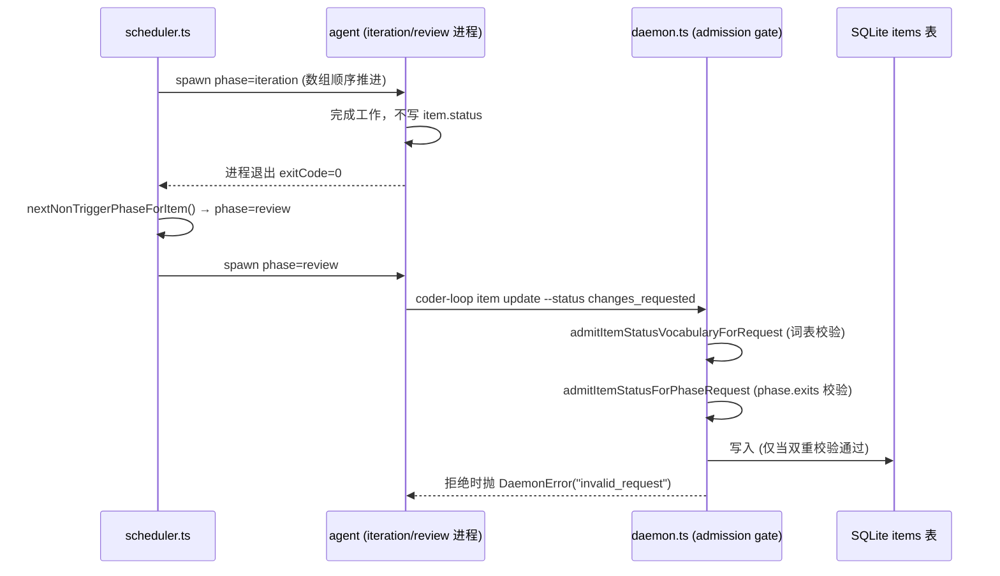
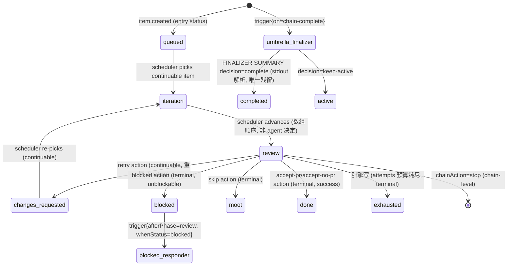

# coder-loop preset/类型系统现状报告（面向 v3 重设计）

> 调查时间：2026-07-02，基线 pr-529 分支。调查者：code-explorer 子会话。本文件是 v3 总控会话的调查存档，供各 RFC 子会话消费。

调查基于代码仓 `/Users/mouriya/Ext/code/coder-loop`（pr-529 分支），核心证据来自 `src/loop.ts`（约 6300+ 行，L1 引擎单文件）、`src/daemon.ts`（调度 + 权限门）、`src/scheduler.ts`（phase 推进）、`src/runtime-data.ts`（品牌类型）、`docs/preset-authoring.md`（preset 作者手册，权威 schema 文档）、`presets/gh-issue-pr-iteration/`、`presets/single-phase-example/`、`presets/business-key-example/`。

---

## 1. preset.toml 完整 schema

样本：`presets/gh-issue-pr-iteration/preset.toml`（688 行）、`presets/single-phase-example/preset.toml`（33 行，最小形态）。字段表来自 `docs/preset-authoring.md:118-145`，运行时 boundary（arktype schema）定义在 `src/loop.ts:460-488`（`PresetPhaseBoundary` / `PresetFragmentBoundary` / `PresetTomlBoundary`）。

| Section.Field | 类型 | 必填 | 语义 |
|---|---|---|---|
| `name` | string | 是 | `^[a-zA-Z][a-zA-Z0-9_-]*$`，必须与目录名/`presetPath` 一致 |
| `[item].idField` | string | 是 | queue item 的业务 id 字段名（`issue` / `id`） |
| `[item.fields]` | table | 否 | preset 声明的透明 item 字段，值是 `"string"|"number"|"boolean"|"json"`（`src/loop.ts:428-429` `PRESET_ITEM_FIELD_TYPES`）；样本见 `presets/gh-issue-pr-iteration/preset.toml:24-35`（`issue/branch/pr/lastRunId`） |
| `[statuses].continuable/terminal/entry/success/unblockable/exhausted/retry` | string[] / string | continuable+terminal+exhausted 必填 | 状态词表，见第 2 节 |
| `[[phases]].name/prompt/runner/model/summaryMarker` | string | name+prompt 必填 | phase 元数据；`runner` 只能 `"claude"|"codex"` |
| `[[phases.exits]]` | array（ADT） | 否（不声明=该 phase 不能写任何状态） | phase 允许 agent 写回的出口 |
| `[[phases]].trigger` | table | 否 | `{afterPhase, whenStatus}` 或 `{on="chain-complete"}` |
| `[[phases]].roles` | string[] | preset 有 fragments 时必填 | 该 phase 能看到哪些 fragment role（#400 minimum-visibility） |
| `[phases.rights]` | table（`createItems`/`writableFields`/`privilegedOps`） | 否，默认全 deny | 见 `preset.toml:153-156` review 专属授权 |
| `[phases.variables]` | table | 是 | `{{KEY}}` 绑定表，见第 3 节 |
| `[[fragments]].id/role/path` | string | 是 | fragment 注册表 |
| `[runtime].businessKeys` / `[runtime.businessKeyValues]` | string[] / table | 否 | preset 自有运行时业务 key，见第 3 节 |
| `[agent].attemptTimeoutSeconds` | number | 否（默认 3600） | 唯一存活的 `[agent]` 字段；`binary`/`extraArgs` 已于 #433 退役，写了直接加载期报错 |

加载期强制校验清单（`docs/preset-authoring.md:147-160`，实现分散在 `src/loop.ts` 的 `loadPreset` 及其子函数）：name 唯一/合法、phase 不重名、fragment id 不重复、continuable∩terminal=∅、entry∈continuable、success/unblockable⊆terminal、retry∈continuable、exits 的 status 必须属于 continuable∪terminal 且同 phase 不重复、有 fragments 时每个 phase 必须声明 roles 且 role 必须真实存在、trigger 的 afterPhase 必须指向已声明 phase 且 whenStatus 必须出现在来源 phase 的 exits 里、`[phases.variables]` source 必须匹配 `^(item|chain|runtime)\.[a-zA-Z][a-zA-Z0-9_]*$`、`item.<field>` 未声明报错、`runtime.<key>` 必须是 engine fact 或声明的 business key。**任何一条失败 preset load 直接 throw**，`coder-loop status --json` 会体现为 `state.kind = "invalid-preset"`。

---

## 2. 状态机声明形态

**声明位**：`[statuses]` 表，字符串数组（`preset.toml:37-78`）。这是**声明式**的（不是让 agent 自由写字符串）：

- `continuable` = 引擎会调度的状态；`terminal` = 引擎跳过的状态；agent 若写出集合外的值会被拒绝。
- `entry`（解除依赖/`queue unblock` 后恢复到的状态）、`success`（terminal 子集，跨 chain `dependsOn` 判定成功用）、`unblockable`（terminal 子集，可被 `queue unblock` 恢复）、`exhausted`（重试预算耗尽时引擎写入的终态，必须 ∈ terminal）、`retry`（"需要再来一轮"的 continuable 状态）都是**声明**而非 prompt 里硬编码的字面量——doc builder（`retryStatusDoc`/`terminalStatusesDoc`/`statusVocabularyDoc`，`docs/preset-authoring.md:263-269`）把这些值渲染进 prompt，prose 不再手写字面量。

**phase 间转移规则的两条独立通道**：

1. **有序 phase 之间的推进（iteration → review）**：不是 agent 决定，是**数组顺序**决定。`src/scheduler.ts:604-632`（`nextNonTriggerPhaseForItem`）在上一个非 trigger phase 的 run 结束（`exitCode===0`）后，把 `item.phase` 推进到 `phasePlan.nonTriggerPhases[currentPhaseIndex + 1]`——纯粹是 `preset.toml` 里 `[[phases]]` 的声明顺序，agent 完全不参与这个决定（`iter-entry.md:165`: "Iteration does not write item status — the scheduler advances to review from its run ledger after you exit"）。
2. **item.status 的写回（谁能写什么状态）**：由 agent 在运行中通过 CLI 调用 `coder-loop item update --status <S>`（对中央 daemon socket 发请求），daemon 侧有**运行时（不是编译期）默认拒绝门**——`src/daemon.ts:3039-3134`（`admitItemStatusForRequest` → `admitItemStatusVocabularyForRequest` + `admitItemStatusForPhaseRequest`）：先校验 status 是否在 `preset.statuses`（continuable∪terminal）词表内，再校验当前 phase 是否声明了这个 status 作为它的 `[[phases.exits]]` 之一；phase 未声明任何 exits（如 iteration）= 该 phase 的所有状态写全部被拒（"default-deny"）。**这不是 stdout 解析**——`docs/reserved-strings.md:20` 明确写出旧的 stdout `verdict=` 五词词表已在 #405 退役。当前唯一还依赖 stdout 文本解析的控制字符串是 chain-complete trigger 的 `FINALIZER SUMMARY: decision=complete|keep-active`（`docs/reserved-strings.md:16-18`，实现 `parseFinalizerSummaryDecisionFromText` in `src/loop.ts`）。



**类型层加固**：状态字符串不是裸 `string`——`src/runtime-data.ts:10` 定义品牌类型 `InternalStatus = string & { brand }`，`src/runtime-data.ts:26` 再叠一层 `AdmittedItemStatus = InternalStatus & { admittedBrand }`。构造 `AdmittedItemStatus` 只有两条路径：请求流的 `admitItemStatusForRequest`（唯一走权限门的构造器）或窄范围的 `engineLifecycleAdmittedItemStatus`（引擎内部生命周期写，来源已知安全）。这是**运行时值仍是字符串，但"谁能构造这个值"被 TypeScript 品牌类型收紧**的模式，而不是把状态本身变成有限枚举/ADT。

---

## 3. 变量/绑定系统

**三前缀 DSL**：`[phases.variables]` 右侧值匹配 `^(item|chain|runtime)\.[a-zA-Z][a-zA-Z0-9_]*$`，`src/loop.ts:539-548` 定义 `PresetVariableSource` 为三分支 tagged union（`{kind:"item",field}` / `{kind:"chain",field,fallback}` / `{kind:"runtime",key,ownership?}`）——**来源端**是类型化的可辨识联合；但**目标端渲染值永远坍缩成 `string`**：`stringifyBindingValue`（`src/loop.ts:5420-5426`）只接受 `string|number|boolean`，任何其他类型（含 `[item.fields]` 声明的 `"json"` 类型字段）在 render 期 `throw`。也就是说 `json` item field 类型只用于**存储/写入校验**（`item update --field-json`），不能直接作为 `{{KEY}}` 渲染进 prompt。

**26 个 engine runtime binding key**（`docs/preset-authoring.md:212-224`，engine-owned，改动需同时改 `ENGINE_RUNTIME_BINDING_KEYS` 数组和 `buildRuntimeBindings` 返回对象，两处不一致编译失败）：

```
runId targetCwd agentCwd sharedContextPath stateFile currentIssueFile
issueDir evidenceDir evidenceRootDir logDir traceFile loopFile
presetDir fragmentIndex runtimeInputsDoc phaseExitsDoc statusVocabularyDoc
triggerStatusDoc terminalStatusesDoc retryStatusDoc runIdGeneration
resumedFromPhase resumedStartedAt resumedSessionId chainName repoCwd
```

其中 `fragmentIndex` / `runtimeInputsDoc` / `phaseExitsDoc` / `statusVocabularyDoc` / `triggerStatusDoc` / `terminalStatusesDoc` / `retryStatusDoc` 这 7 个不是"取值"而是**引擎在 render 期动态生成的 markdown 文档片段**（`src/loop.ts:5148-5164` 的 `resolvePhaseBinding` switch）——这是当前系统里"结构化数据→prompt 文本"最接近"计算出来的视图"的部分。

**businessKeys 机制**（`docs/preset-authoring.md:226-246`，fixture `presets/business-key-example/preset.toml`）：声明 `[runtime].businessKeys = ["auditDemo"]` + 供值 `[runtime.businessKeyValues] auditDemo = { literal = "..." }`。当前唯一支持的 value spec 是 `{literal: string}`——业务 key 目前不能表达"从 item/chain 派生的计算值"。

**渲染失败语义（三套，不一致）**：(a) preset load 期：source 格式非法/引用未声明字段/key → throw；(b) render 期：`item.<field>` 缺失/null → `""`（静默降级）；`chain.<field>` 不存在或 null → throw；`runtime.<key>` 声明了但没值 → throw。**item 缺失静默 `""` vs chain/runtime 缺失即 throw 的不一致，v3 类型系统应统一或显式声明每字段的缺失策略。**

类型上，整个绑定系统本质是 **string→string 的多态查找表**：来源端有 tagged union，但落地永远是 `String(...)` 强制转换，没有任何结构化类型（object/array/enum）流过 `{{KEY}}` 占位符。这是"字符串定义任务"里最典型的 stringly-typed 边界。

---

## 4. gh-issue-pr-iteration 角色循环

**prompt 结构（两套约定，`docs/preset-authoring.md:355-362`）**：

- **plan 链**（`plan/index.md`…`plan/final.md`）：查表式 fragment 链，每个 fragment 末尾 `## Output verdict` 指定下一跳 fragment id——**这是唯一一处状态机语义写在 prompt 文本里而非 preset.toml 里**的地方（fragment 间跳转是散文字符串引用，引擎不校验目标 fragment 存在性）。
- **iteration/review**：`iter-entry.md`（169 行）/`review-entry.md`（189 行）是"调度者 workflow"——显式编号 Step，维护两态任务清单，fragment 拆成 `task.md`（给 subagent）/`report.md`（汇报模板）/`accept.md`（验收判据）三件套，`quality/*-execute.md` 与 `quality/*-judge.md` 按受众拆分。

**verdict 约定**：iteration 从不写 item.status（`iter-entry.md:165`）；review 是唯一的状态写入者，Step 6 从 `{{PHASE_EXITS_DOC}}`（渲染自 `[[phases.exits]]`）选恰好一个出口，执行对应 CLI——`review-entry.md:138-150` 明确写"选择通过 CLI 发生，不是 stdout token"。

**完整状态流转**（`preset.toml:80-320`）：



---

## 5. single-phase-example

最小可跑 preset：33 行 toml + 1 行模板。单 phase（`run`）、单 exit（`done`）、3 个变量绑定（`ITEM_ID`/`RUN_ID`/`TARGET_CWD`）、字符串 id（`idField="id"`）、双状态词表（`pending`/`done`+`exhausted`）。证明"1 phase / 字符串 id / 双状态"骨架可跑通，**不涉及** fragment、trigger、rights、businessKeys。

---

## 6. templates/

`templates/supervisor/`（`role.md` / `patrol-entry.md` / `log.md` / `bootstrap-skill.md`）是**跨 preset 通用的外层 cron-driven 编排层**：inner `coder-loop`（黑盒）+ outer supervisor（stateless、cron 唤醒），两层不共享状态，outer 只通过 `doctor/status/daemon` API + GitHub 观测 inner。State 存放规则：长期方向进 memory，跨 patrol 决策进 append-only `log.md`，不许建手写 STATE.md。

`presets/gh-issue-pr-iteration/templates/`（`shared.md`/`pr-body.md`）是 preset 专属 target 侧 starter；`workflow.md` 已在 #434/#436 退役。

**发现的文档漂移**：`.claude/commands/dev-plan.md:15,17,22` 仍引用已退役机制（`coder-loop install`、`config.json`、`workflow.md`）。且 **plan 角色（`plan/*` fragments）当前没有被任何 `[[phases]]` 声明消费**——plan 链是一条**游离在 engine phase 状态机之外、自身入口文档已过期**的路径。v3 若要把"计划生成 issue"纳入统一类型系统，需先决定它是否变成真正的 `[[phases]]`。

---

## 7. 类型化程度评估

| 维度 | 现状 | 证据 |
|---|---|---|
| **preset 结构本身（toml schema）** | 强类型：arktype boundary 加载期强校验，非法结构直接 throw | `src/loop.ts:460-488` |
| **phase 名引用** | 编译期弱（`string`），加载期强校验 | `docs/preset-authoring.md:156` |
| **status 字面量** | preset.toml 内声明式词表；运行时品牌类型 + daemon 双重门；但状态字面量在类型系统里仍是 `string`，**"哪些状态合法"只在 preset.toml 内容 + 运行时校验中确定，非编译期可静态穷举** | `src/runtime-data.ts:10,26`；`src/daemon.ts:3039-3134` |
| **phase.exits（出口 ADT）** | 已是 discriminated union：`{kind:"item-status",status,when} | {kind:"chain-action",action,when}`，有 `assertNeverPhaseExit` 穷尽检查 | `src/loop.ts:565-576`, `5188-5197` |
| **变量绑定来源** | 来源端 tagged union；**目标端坍缩为纯字符串** | `src/loop.ts:539-548`, `5420-5426` |
| **agent 输出解析** | 几乎全部退役为显式 CLI 调用；唯一残留 stdout 解析点是 `FINALIZER SUMMARY: decision=...` | `docs/reserved-strings.md:16-20` |
| **item 业务字段** | 声明式四态类型（string/number/boolean/json）；类型只约束存储/写入，json 类型渲染会 throw | `src/loop.ts:428-429` |
| **rights / privilegedOps** | 运行时门 + 部分类型化（`privilegedOps` 收窄为引擎闭合 union） | `src/loop.ts:586-590` |
| **businessKeyValues** | 只有一种 variant（`{kind:"literal"}`），为将来 `{kind:"computed"}` 预留 switch 结构 | `src/loop.ts:614-615`, `5408-5418` |
| **plan 链 fragment 跳转** | 完全 stringly-typed：下一跳 fragment id 是散文文本，引擎不解析、不校验 | `docs/preset-authoring.md:359` |

**总结判断**：v3 目标"状态机判定来源是可计算类型"目前只在**局部**做到——phase-exit ADT 化（#405）、status 写入路径品牌类型收紧（#397）、rights 收窄枚举（#407/#409/#410）是这个方向的先例（#396-#458 umbrella 系统性推进的结果）。但**状态字面量本身、phase 名、变量 KEY 名**这三个最核心的"任务定义原语"仍是**运行时字符串 + 加载期/请求期校验**，不是编译期可枚举类型——preset 作者写错一个状态名，要等 `loadPreset` 实际跑一次才报错。要走到"零原语纯 meta 定义"，需要把 `preset.toml` 本身变成某种可生成类型的 schema（如从 toml 生成每个 preset 专属的状态/phase 字面量联合类型），而不是现在"引擎侧永远只认 `string`，靠运行时集合成员校验模拟类型安全"的形态。

---

## 8. prompt 的存储与展示面

**渲染路径**：`renderPrompt(template, phase, ctx)`（`src/loop.ts:5120-5146`）把 entry md 模板中的 `{{KEY}}` 替换为字符串，产出**内存中的完整字符串**，传给 `spawnOneAttempt`（`src/loop.ts:5829-5861`）。

**关键发现——渲染后的完整 prompt 不落盘**：

- `spawnOneAttempt` 只把 `promptChars: effectivePrompt.length`（字符数）写进 `status.json`（`src/loop.ts:5861`，落盘位置 `<logDir>/<runId>/<phase>/status.json`）。
- prompt **正文**只作为 `buildRunnerInvocation`（`src/loop.ts:6217-6238`）构造的子进程 **argv** 传给 runner CLI，不走 stdin，不写临时文件。
- 唯一持久化的执行痕迹是 agent **输出**（`attemptStream`/`attemptStderr`，`src/loop.ts:5840-5844`）——是"agent 说了什么"，不是"引擎发给它什么"。

**结论**：GUI 要做"prompt 展示"，**现在拿不到已发送 prompt 的完整历史文本**——只有长度（`promptChars`），事后重算 `renderPrompt` 不可行（ctx 依赖 item 当时状态快照，不可逆重建；`runId` 等一次性值不可重放）。v3 需要新增显式持久化点——最自然位置是 `spawnOneAttempt` 内、调用 `buildRunnerInvocation` 之前，把 `effectivePrompt` 写到 `<logDir>/<runId>/<phase>/prompt.md`。

---

## 关键文件清单（重设计前必读）

- `docs/preset-authoring.md` — preset schema 权威文档
- `presets/gh-issue-pr-iteration/preset.toml` — 最完整真实样本
- `presets/single-phase-example/` — 最小骨架
- `presets/business-key-example/preset.toml` — businessKeys fixture
- `src/loop.ts` 关键区段：`400-720`（arktype boundary + 核心类型）、`1009-1057`（`ENGINE_RUNTIME_BINDING_KEYS`）、`5120-5164`（`renderPrompt`/`resolvePhaseBinding`）、`5362-5426`（字段解析+字符串化+失败语义）、`5829-5880`（`spawnOneAttempt`，prompt 落盘边界）、`6217-6274`（`buildRunnerInvocation`，prompt 作为 argv）
- `src/daemon.ts:3039-3134` — status 写入 default-deny 门
- `src/scheduler.ts:604-632` — phase 推进数组顺序逻辑
- `src/runtime-data.ts:1-42` — 品牌类型，当前最接近"类型驱动状态机"的实现
- `docs/reserved-strings.md` — "哪些字符串还是 stdout 控制信号"权威登记表
- `presets/gh-issue-pr-iteration/iter-entry.md`、`review-entry.md` — 两大角色 workflow prompt
- `docs/execution-plan-pre-v3.md` — pre-v3 类型收紧系列 issue（#396-#458）执行波次记录
- `.claude/commands/dev-plan.md` — 文档漂移样本（plan 角色游离于 phase 状态机之外的证据）
