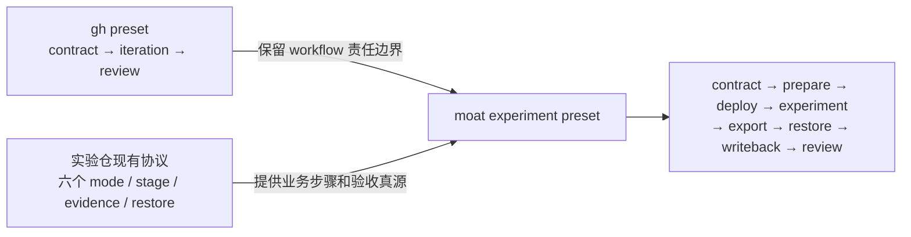
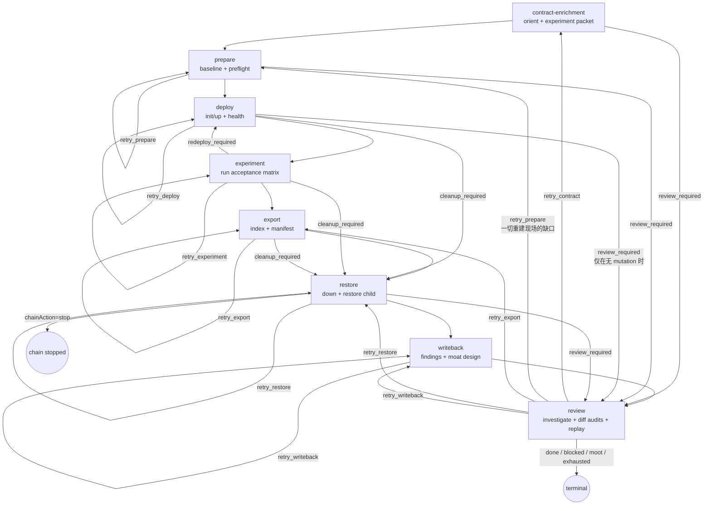

# moat-experiment-loop v2 preset 设计书

本文件记录 `moat-experiment-loop` 的 prompt/preset 设计。它和现有 `gh-issue-pr-iteration` 一样，假设 runner **诚实但会犯错**，通过职责拆分、独立复核、真实脚本和 GitHub durable handoff 降低错误率。

实现只修改实验仓中的 preset 文件与 prompt。coder-loop 当前 v2 的 parser、daemon、scheduler、runner、worktree、SQLite 和 CLI 均不修改。

## 一、移植目标

源是当前生产 preset `presets/gh-issue-pr-iteration/`。目标是实验仓的 `.coder-loop/presets/moat-experiment-loop/`。这不是把 gh preset 原样复制过去，而是保留它已经验证过的 workflow 骨架，再用实验仓已有生命周期替换“实现代码”这一业务内容：



coder-loop v2 仍只负责加载 preset、spawn phase、接收声明过的 exit 和推进 next edge。自然语言判断仍由 prompt 负责，确定性检查仍由实验仓现有 scripts 负责；不修改 engine。

## 二、逐项移植映射

### 2.1 共用机制

| gh preset 源机制 | 移植到 moat preset | 为什么这样移 | 运行时结果 |
|---|---|---|---|
| `common/runtime-contract.md`：engine 只判断可编程状态，agent 判断语义 | `common/runtime-contract.md`，供全部 phase 读取 | moat 的 passed/failed、blocker、evidence 足够性同样不能由 L1 判断 | daemon 只按 exit/edge 调度；agent 必须先运行 target gate，再选择声明出口 |
| `common/github-routing.md`：issue 承载任务语义，PR 承载实现/review语义 | `common/github-routing.md`，把“implementation PR”具体化为“run draft PR + moat 设计回写 PR” | 实验同时有实验仓 run PR 和设计仓 writeback PR，必须明确各自对话位置 | contract 前的歧义放实验 issue；run 建立后阶段反馈放 run PR；设计结论最终落 moat owning doc PR |
| `common/state-contract.md`：SQLite status只做调度，GitHub marker是 durable authority | `common/state-contract.md`，item 只保留 issue/branch/pr/lastRunId | 实验仓已经规定聊天和 agent 内存不算 evidence，不需要再造状态载体 | phase 重启从 issue、run PR、run-state 和 committed evidence 恢复；item status只决定下一 phase |
| `common/dispatch-contract.md`：调度者先列清单、逐项收口 | `common/dispatch-contract.md`，由 contract 与 review 使用；stage phase 使用单任务清单 | contract/review 要汇总 issue、children、evidence、两仓状态；单个 stage 不需要再派多层调度 | contract/review 可用 runner-native subagent 做调查/复核，但每项必须回到显式 checklist |
| `common/executable-contract.md` + `enrichment/contract-schema.md`：唯一 current marker | `common/experiment-contract.md` + `contract/contract-schema.md` | 实验 issue 必须先补齐假设、环境、steps、passed/failed 分支、writeback 位置和两个 IaC child | contract phase在 issue comment发布唯一 current experiment packet；后续 phase只消费它，失效则回 contract |
| `quality/evidence.md`：claim 必须绑定真实执行和可复核 artifact | `quality/evidence.md`，直接引用 `headless-experiment-evidence.rule.md` 与 run evidence manifest | moat 已定义 logged command、SSH transcript、manifest 和 evidence index，preset 不应复制另一套格式 | 没有 transcript、artifact、checksum、复现命令的 claim 不能通过 review |
| `quality/honesty.md`：claim 与 observation 对照，禁止弱化失败 | `quality/honesty.md`，增加 passed/failed/inconclusive 对照 | 实验失败也是有效结果，最大风险是换口径把 failed 包装成 passed | review 对照 acceptance matrix逐项核验；失败结论可接受，伪装失败不可接受 |
| `quality/cleanup.md`：所有副作用进入 cleanup ledger | `quality/cleanup.md`，内容由实验仓 `run-state.md.cleanup obligations`、`down.sh` 和 restore child 决定 | gh 的本地进程清理不足以覆盖共享 VM、dataset、容器和 IaC baseline | restore 未核清时 review 不得 merge/close；无法还原时停 chain并留下 operator recovery |

### 2.2 iteration 的拆分

gh preset 的 `iteration` 是“完成一个候选交付物”的统一工位；实验仓已经把一次实验强制拆成六个 mode，因此 iteration 的职责按已有 mode 拆到六个普通 phase，而不是在一个 agent session 里跑完整实验。

| gh iteration 源步骤 | 目标 phase / fragment | 实验仓事实源 | 为什么拆 | 运行时会发生什么 |
|---|---|---|---|---|
| `iter/steps/research.md` | `contract-enrichment` + `contract/orient.md` | lifecycle rule 的 issue/session入口；headless rule 的 `orient` mode | orient 不得修改远端，且必须先识别已有 run/children/live state | phase 读取完整 issue、现有 run-state和两个 IaC child，发布/更新 current experiment packet |
| `iter/steps/resolve-blocker.md` | 各 stage 的入场检查 + review 的 blocked action | lifecycle rule 的外部 authority边界、IaC child要求 | blocker 是否真实要在实际 stage gate 运行后判断，不能仅凭 contract猜测 | stage 保存失败命令和准确条件；review统一裁决 retry/blocked |
| `iter/steps/implement.md` | `prepare` / `deploy` / `experiment` | headless rule 的三个对应 mode；run-local `preflight.sh/init.sh/up.sh/run.sh` | 代码实现被替换为真实实验环境准备、部署和测量 | daemon 每次只 spawn一个 mode；完成 checkpoint 后才进入下一 phase |
| `iter/steps/verify.md` | 每个 stage 的末尾 gate + `review/replay.md` | 每个 `stages/<N>/README.md`、脚本 exit、acceptance matrix | stage 当场检查可尽早发现缺口，review仍需独立复核而不是相信自述 | stage gate失败走定向 retry；review重新运行可复驱检查并审计不可复驱 evidence |
| `iter/steps/e2e.md` | `experiment` | lifecycle rule 的真实路径要求、issue acceptance matrix | 实验的 `run.sh` 本身就是要验收的真实路径，不应再造通用 app E2E | experiment 保存真实 workload结果；mock/build/unit不能替代实验 observation |
| `iter/steps/submit.md` | 每个 phase 更新 run PR handoff；`writeback` 形成最终提交 | lifecycle rule 的 findings 和设计回写门禁 | 实验不是到最后才第一次持久化；长运行必须逐 mode可恢复 | 每个 phase commit evidence并更新 PR；writeback再提交 findings与设计变更 |
| `iter/steps/source-spike.md` / `spike-comment.md` | 不迁移为分支 | 当前 item 本身就是 experiment issue | gh preset需要区分普通实现与 spike；目标 preset所有 item已经是 spike实验 | contract 不再选择 deliverable kind，始终进入实验生命周期 |

### 2.3 review 的移植

| gh review 源机制 | 目标 fragment/action | 为什么要改 | 运行时结果 |
|---|---|---|---|
| `review/steps/investigate.md` | `review/investigate.md` | 仍需完整读取 issue、run PR、两个 IaC child、设计 PR 和 live checks | review先建立完整事实表，再派复核，不从最后一条 handoff猜结论 |
| `review/steps/diff-audit.md` | `review/run-diff-audit.md` + `review/design-diff-audit.md` | 目标有实验仓 evidence/findings diff和 moat owning-doc diff两份交付物 | 任一 diff超 scope、缺 provenance或未选择明确设计分支都返回责任 phase |
| `review/steps/replay.md` | `review/experiment-replay.md` | 通用 suite/browser replay要替换成 acceptance matrix、run scripts、manifest和live probe | 可复驱检查实际重跑；破坏性/昂贵 observation按原始 transcript+manifest审计，不擅自重跑改变现场 |
| `review/actions/retry.md` | `review/actions/retry.md`，扩展定向 status表 | 八个 phase有不同责任，通用 changes_requested 无法定位返工点；且 review 运行在 restore 之后，现场已销毁，deploy/experiment 层缺口只能整 run 重来 | review一次列全缺口，并写 `retry_contract/prepare/export/restore/writeback` 中唯一一个；需要重建现场的缺口一律写 `retry_prepare` |
| `review/actions/blocked.md` | `review/actions/blocked.md` | blocked判决仍必须集中，stage只提供证据 | 只有 review可写 blocked；blocked-responder仍只有一个触发来源 |
| `review/actions/accept-pr.md` | `review/actions/accept-experiment.md` | 接受条件从“实现 PR正确”变成“实验+restore+设计回写闭环” | review确认 run PR与设计 PR已正确落地、restore child关闭、实验 issue关闭后才写 done |
| `review/actions/skip.md` | `review/actions/moot.md` | 实验可能被结论取代、重复或前提消失 | review在GitHub留下理由并关闭 issue后写 moot |
| `review/actions/state-write.md` | 原机制保留，只替换目标 preset 的 status词表 | 当前 daemon credential和phase exit admission已经满足写入需求 | review查询本 phase exits，执行一次 `coder-loop item update` 并复读确认 |
| `blocked-responder-entry.md` | 同名 trigger prompt | gh 的跨仓 blocker通知仍适用两个 IaC child/设计依赖 | review写 blocked后触发 responder，把解阻动作路由到 owning issue |
| `umbrella-finalizer-entry.md` | 同名 chain-complete trigger | `EXPERIMENTS.md` 是整批实验的派生总表，需要最终一致性核对 | 全 item terminal后检查表格、open issue、设计回写和遗留 follow-up，再决定 complete/keep-active |

### 2.4 明确不移植

| gh 机制 | 不移植原因 | moat 中的替代 |
|---|---|---|
| implementation-PR / blocker-removal / source-writing-spike 四路 deliverable选择 | 目标队列中的每个 item 已确定是实验 issue | 单一 experiment contract + 固定 mode生命周期 |
| canonical unit-suite count | 实验验收权威是 issue acceptance matrix和真实 observation，不是测试数量 | stage scripts、evidence index、manifest、findings |
| web UI browser replay的通用模板 | 仅 #41 等具体实验需要 browser，不能强加给全部实验 | contract按 issue声明 browser步骤；review逐 Check复驱 |
| review替 iteration teardown 本地 runtime | moat teardown是独立 restore mode并受 restore child约束 | `restore` phase + `40-destroy-restore` evidence |
| review中的 expand-parent | 实验 issue图由 lifecycle rule和两个固定 cross-repo child约束 | contract核对 children；新增实验另开 issue，不在 review动态拆实现任务 |

## 三、从映射推导出的 phase 图



每个动作 phase 自己运行对应 target script并完成 stage README 定义的 gate；独立终审在 review重新读取全部 durable evidence并复驱必要检查。`blocked-responder` 和 `umbrella-finalizer` 继续是 trigger phase。

**边分类：** 上图三类边处理不同。(1) 无 label 直线 = `on = "completed"` happy-path，agent 干净 exit 后 scheduler 自动推进，不写 status exit。(2) label 上带 `retry_*` / `review_required` / `redeploy_required` / `cleanup_required` = agent 写入的 item-status exit。(3) `chainAction=stop` = 独立的 chain-action exit（与 status exit 互斥，`[[phases.exits]]` 里 `{chainAction, when}` 与 `{status, when}` 二选一）。

## 四、各 phase 的职责

### contract-enrichment

- 读取 issue、评论、实验仓 `CLAUDE.md`、lifecycle/evidence rules 和相关源码。
- 认领已有未完成 run，或创建新的 run branch/draft PR/run 目录。
- 把 executable contract、假设、判定标准、阶段命令、已知依赖和 cleanup 要求写入 GitHub/run packet。
- 不执行实验、不裁决 blocker、不写 terminal status。

正常完成进入 prepare。contract 缺事实时在本 phase内继续调查；发现 issue 已失效则写 durable handoff，选择 `review_required` 交 review。

### prepare

prepare 是每次占用现场的唯一入场点：首次执行和 review 发起的整 run 重跑都从这里进入，重新获取串行窗口。

- 核对本 chain 当前没有其他 active run，并按实验仓“实验严格串行”规则确认三台 VM 没有另一实验现场。
- 运行 baseline/preflight，确认 VM、容量、网络、credential 和 run 目录条件。
- 把命令、exit status、关键 observation 写进 run 目录并更新 PR handoff。
- 不修改实验结论，不越过 deploy。

可恢复错误选择 `retry_prepare`。确认必须由外部 authority 改变且尚未 mutation 时，写证据并选择 `review_required`。

### deploy

- 按 contract 执行 init/deploy；所有远端命令遵守实验仓现有 SSH、日志和远端路径规则。
- 运行部署后的 health/precondition 检查。
- 保存精确命令、版本、endpoint、PID/container/dataset 标识和 cleanup 命令。

可恢复错误选择 `retry_deploy`。首命令尚未产生任何远端 mutation、但外部 authority（credential、依赖服务、IaC child）明显未就绪且本 phase 无法自己解阻时，写证据并选择 `review_required` 直接进入 review——与 prepare 对齐，避免为纯前置阻塞跑一次空 restore。已产生任何 mutation 后必须走 `cleanup_required` 进入 restore，不得再选 `review_required`。

### experiment

- 执行 contract 命名的 workload/measurement。
- 保存 raw output，不把失败结果包装成 passed。
- 检查证据是否能区分 passed/failed/inconclusive。

可原地重试选择 `retry_experiment`；被测现场已经破坏部署前提时选择 `redeploy_required`；无法继续且需要清理时选择 `cleanup_required`。

### export

- 导出 raw evidence、transcript、manifest、关键日志和 provenance。
- 重新计算 manifest，确认引用文件存在且非空。
- 不解释/改写原始结果。

缺证据但现场仍可读时选择 `retry_export`；无法继续时选择 `cleanup_required`。

### restore

- **入场第一动作：** 从 run PR 解析上游 phase 写的 handoff block（`phase = "deploy" | "experiment" | "export"` + `path = "happy" | "cleanup_required"`）。缺 block、block 与 pre-phase 不一致，或 path 无法判定时，立即 `retry_restore` 让上游 phase 补写 handoff；禁止在原因不明时执行任何 down.sh。engine 无 marker 区分 happy / cleanup 路径，全部靠 handoff。
- 无论 happy path 还是 `cleanup_required` 路径，都执行 target-owned down/reset/restore。cleanup 路径未产生任何 mutation 时（e.g. deploy 首命令失败即写 cleanup_required），down.sh 允许 no-op pass-through，但仍必须运行无残留检查以确认。
- 运行实验仓已有的无残留检查，保存结果。
- 核清后在 `run-state.md` 和 evidence index 记录串行窗口已结束。
- restore 前不得进入 writeback/review terminal 裁决。

可恢复残留选择 `retry_restore`。无法自动还原时，通过当前 v2 声明的 `chainAction = "stop"` 停线并在 PR/issue 留下 operator recovery 指令；不为此设计新 cleanup runtime。

如果是 happy path，正常完成进入 writeback。如果是异常清理路径，restore 依据已解析的 handoff 选择 `review_required` 直接进入 review。

### writeback

- 基于已导出的 evidence 写 findings。异常清理路径由 review 经 `retry_writeback` 送回时，同样基于已有 evidence 如实记录 aborted/inconclusive 结果。
- 把 passed/failed/inconclusive 如实回写对应设计文档和 `EXPERIMENTS.md`。
- 更新 run PR，保证 diff、数字和 evidence references 一致。
- 不 merge、不 close issue、不写 terminal status。

写回不完整选择 `retry_writeback`。

### review

review 是唯一业务裁决者和 terminal status writer：

- 读取完整 issue、run PR、comments、checks、run 目录和 target rules。
- 核对 contract 是否执行、证据是否完整、restore 是否通过、设计回写是否准确。
- 对需要复驱的确定性检查直接运行 target scripts；不信任单纯总结。
- review 不替前序 phase 修改实验或 findings；缺口通过定向 retry status 送回责任 phase。
- review 运行在 restore 之后，现场已销毁、串行窗口已结束：需要重建现场才能补的缺口（deployment/health、acceptance observation、依赖 live 现场的 evidence）只写 `retry_prepare` 整 run 重跑，不存在“部署前提仍成立”的定向返工。
- 不经过 prepare 的文书类 retry（`retry_export/restore/writeback`）不消耗 attempt，review 对同一缺口显式限次；超限按预算与事实裁决 `exhausted` 或 `blocked`。
- 异常清理路径判 terminal 前，若 aborted/inconclusive 结果尚未落入 findings/`EXPERIMENTS.md`，先写 `retry_writeback` 补记录，再写 terminal status。
- 接受后 merge run PR、确认 issue live closure，再写 `done`。
- 假设 failed 但流程和证据完整，仍写 `done`。
- 外部事实必须先改变时写 `blocked`；issue 已失效/重复/被取代时写 `moot`；预算确实耗尽时写 `exhausted`。

## 五、状态只负责路由

```toml
[item]
idField = "issue"

[item.fields]
issue     = "number"
branch    = "string"
pr        = "number"
lastRunId = "string"

[statuses]
continuable = [
  "queued",
  "retry_contract", "retry_prepare", "retry_deploy",
  "retry_experiment", "redeploy_required",
  "retry_export", "retry_restore", "retry_writeback",
  "cleanup_required", "review_required",
]
terminal    = ["done", "blocked", "moot", "exhausted"]
success     = ["done"]
entry       = "queued"
unblockable = ["blocked"]
exhausted   = "exhausted"
```

不把 evidence、cleanup 状态或业务对象编码进 item status。status 只回答“scheduler 下一步去哪个 phase”。详细原因写进 run PR handoff。

### 5.1 status 写入者

| status | 写入者 | 说明 |
|---|---|---|
| `queued` | engine（`entry`） | 新 item 入队、`queue.unblock` 复位、cross-chain `dependsOn` 满足时的落点 |
| `retry_contract` | review | 触发 contract-enrichment 重跑（不消耗 attempt） |
| `retry_prepare` | prepare（self） / review | prepare 自环 = 无 mutation 前的重试；review = 现场重建。attempts 是否 +1 由引擎的 fresh-vs-resume 门决定（§5.3），与写入者无关 |
| `retry_deploy` | deploy（self） | 部署可就地重做；每 stage prompt 硬限次，超限升级到 `cleanup_required` |
| `retry_experiment` | experiment（self） | measurement 可重复且部署前提仍成立；同样每 stage prompt 硬限次 |
| `redeploy_required` | experiment | measurement 破坏了部署前提 |
| `retry_export` | export（self） / review | 现场仍可读时补 index/manifest；review 只在能从已 commit raw evidence 重算时写 |
| `retry_restore` | restore（self） / review | 尚有残留继续清；review 写此表示无残留检查缺口 |
| `cleanup_required` | deploy / experiment / export | 必须先销毁现场，路由到 restore |
| `review_required` | contract-enrichment / prepare / deploy（仅无 mutation） / restore（异常清理路径） | 交唯一裁决者 |
| `retry_writeback` | writeback（self） / review | 补 findings / owning design diff；review 亦用它把异常路径的 aborted/inconclusive 结果补记 |
| `done` / `blocked` / `moot` / `exhausted` | review / engine（`exhausted`） | terminal；`exhausted` 是 engine 在 attempts 达到 `chain.metadata.maxItemAttempts`（默认 20，`src/scheduler.ts:414`）时自动写入的兜底 |

### 5.2 词表刻意不含 `in_progress`

引擎 spawn 时不改写 `items.status`（item 保持 pre-spawn 的 continuable 状态）。scheduler 依赖 `item.phase` 而非 `item.status` 决定继续跑哪个 phase（`nextNonTriggerPhaseForItem`，`src/scheduler.ts:656-689`；`resumeDecisionForItem` 决定的是 session 层的 fresh-vs-resume，不是 phase 选择），daemon 崩溃后 `recoverStaleSchedulerState` 只清 `current_runs` 孤儿行、不改 `items.status/phase`，scheduler 按原 continuable status + 原 phase 重捡即可。

**这个省略成立的前提是所有 prompt 都不指示 agent 写词表外的中间态 status。** gh preset 当前树里没有任何 prompt 写 `in_progress`（grep 全空）；它留在 `continuable` 是 #508 崩溃恢复重捡的防御性声明（`presets/gh-issue-pr-iteration/preset.toml:48-56`、`src/daemon.ts:2019`、`src/preset.test.ts:232-236`），引擎本身也不写 item 级 `in_progress`。从 gh 迁移片段时仍**必须做硬检查**（历史片段可能携带旧指示，且防未来漂移）：

1. `grep -R 'in_progress' presets/moat-experiment-loop/` 结果为空。
2. `grep -REn 'coder-loop item update .* --status\s+[a-z_]+' presets/moat-experiment-loop/` 匹配的 status 值全部属于本节 §5.1 词表。
3. review 之外的任何 phase prompt 不得包含"中途 status 打点"的指示。

任一项不通过就属于迁移 bug：词表外的写入会被 #397 admission gate 当场拒绝（run 结束时没有合法 exit status，item 卡在原状态），词表内的误写则会把 item 路由到错误 phase。

### 5.3 attempts 预算的实际覆盖面

engine 只在以 fresh（非 session resume）方式进入 `startsAttempt = true` 的 phase 时执行 `attempts + 1`（`src/scheduler.ts:1000, 1027`），且本 preset 只有 `prepare` 声明 `startsAttempt`。计数门只看 phase + fresh，不看 status 由谁写。因此以下循环 **通常不消耗 attempt**、必须靠 prompt 自律限次：

- **contract ↔ review 环**：`retry_contract` 不进 prepare。→ **review prompt 硬限 `retry_contract` 次数**（推荐 ≤2 次/attempt），超限按事实裁决 `blocked` 或 `exhausted`。
- **review 的文书类返工**：`retry_export/restore/writeback` 不进 prepare。→ **review prompt 对同一缺口显式限次**（推荐 ≤2 次/gap），超限按预算裁决。
- **stage 自环**：`retry_deploy/experiment/export/restore/writeback` 由 stage 自写。→ **每个 stage prompt 硬限自环次数**（推荐 ≤3 次），超限升级到 `cleanup_required`（deploy/experiment/export）或 `review_required`（prepare/restore/writeback）交 review 裁决。
- **prepare 自环的例外**：`retry_prepare` 自环重入的是 `startsAttempt` phase，上一轮 prepare 没留下 sessionId 时（如 agent 在 runner 打出 session id 前崩溃）重入是 fresh，**会消耗 attempt**。"stage 自环不消耗 attempt" 对 prepare 不保证成立——引擎不区分自环与 review 返工。

**attempts 计数的真实语义（已核对代码链）：** `attempts += 1` 仅当 `startsAttempt && resumeDecision.kind === "fresh"`（`src/scheduler.ts:1000`）；`resumeDecisionForItem` 在 `item.sessionIds[phase][runner]` 非空时返回 `"resume"`（`src/scheduler.ts:2365-2369`）；sessionId 由 scheduler 从 runner 输出解析后写入（`src/scheduler.ts:1471-1472`），只有 `sessionIdInvalid` 分支清空（`src/scheduler.ts:1458-1459`），daemon `item.update` 没有 sessionIds 写面（可写字段清单见 `src/daemon.ts:2722-2789`），prompt 层无法清 session。因此 review 写 `retry_prepare` 时，只要上一轮 prepare 留有 sessionId，重入就是 resume、attempts 不 +1——engine 的 `exhausted` 安全阀只覆盖 fresh 进入 prepare 的场景（首次入场、无残留 session 的重建）。设计决策：接受这一语义，**review prompt 对 `retry_prepare` 同样显式限次（推荐 ≤2 次/item）**，不把 `exhausted` 当作现场重建循环的兜底。attempts 数字的含义是"fresh 进入 prepare 的次数"，不是"整 run 重跑次数"。**stage/review prompt 未实现上述限次逻辑时不得声称 preset 就绪**；§十一 step 5 仍需用真实 fixture 复核 resume 路径下 attempts 不 +1 的实际表现。

## 六、phase 之间的完整边表

分三张子表列出。**Happy-path 边** 是 `[[phases.next]]` 中 `on = "completed"` 的 next 边，agent 干净 exit 后自动推进，不涉及 status。**Status exit 边** 是 agent 通过写 item status 触发的转移，逐条声明在 `[[phases.exits]]`。**Chain-action 边** 是 `chainAction=stop`，独立于 status。

### 6.1 Happy-path (`on = "completed"`)

| 来源 phase | 目标 phase | 该边为什么存在 |
|---|---|---|
| contract-enrichment | prepare | packet 就绪，进入现场准备 |
| prepare | deploy | baseline/preflight 通过，占位现场 |
| deploy | experiment | init/up + health 通过 |
| experiment | export | measurement 落地，evidence 待导 |
| export | restore | evidence 导出完成，进入 happy-path 清理 |
| restore | writeback | 无残留检查通过（handoff 声明 `path = "happy"`） |
| writeback | review | findings + owning design diff 写完 |

### 6.2 Status exit 边

| 来源 phase | status exit | 目标 phase | 写入者约束 | 该边为什么存在 |
|---|---|---|---|---|
| contract-enrichment | `review_required` | review | contract self | issue 已失效或 contract 阶段发现不可执行事实，交唯一裁决者处理 |
| prepare | `retry_prepare` | prepare | prepare self | baseline/preflight 可在未 mutation 时重试；prompt 硬限自环 |
| prepare | `review_required` | review | prepare self | 外部环境/child 未就绪且无 mutation，需要统一判定 blocked |
| deploy | `retry_deploy` | deploy | deploy self | init/up 或 health 可在当前 run 修复后重做；prompt 硬限自环 |
| deploy | `review_required` | review | deploy self（**仅无 mutation**） | 首命令未产生远端 mutation 时的前置阻塞（credential/依赖未就绪），避免为纯前置阻塞跑空 restore |
| deploy | `cleanup_required` | restore | deploy self | 已产生现场副作用，不能直接 terminal |
| experiment | `retry_experiment` | experiment | experiment self | measurement 可重复且部署前提仍成立；prompt 硬限自环 |
| experiment | `redeploy_required` | deploy | experiment self | measurement 已破坏部署前提，必须先重建环境 |
| experiment | `cleanup_required` | restore | experiment self | 当前 run 不再继续，先清现场 |
| export | `retry_export` | export | export self | evidence 仍在现场，可继续导回/补索引 |
| export | `cleanup_required` | restore | export self | export 无法继续但现场必须先销毁 |
| restore | `retry_restore` | restore | restore self | cleanup 尚有残留，或 handoff 缺失/不一致时逼上游补写 |
| restore | `review_required` | review | restore self | 异常路径（cleanup_required）现场已核清，不应再进入正常 findings/writeback |
| writeback | `retry_writeback` | writeback | writeback self | findings 或 moat 设计回写不完整 |
| review | `retry_contract` | contract-enrichment | review | current experiment packet 缺失、过时或与 live state 矛盾；prompt 限次 |
| review | `retry_prepare` | prepare | review | 一切需要重建现场才能补的缺口（baseline、deployment/health、acceptance observation）。review 时现场已被 restore 销毁、串行窗口已结束，必须从 prepare 重新入场；attempts 仅在 fresh 进入 prepare 时 +1（§5.3），review prompt 对此边显式限次 |
| review | `retry_export` | export | review | manifest/index/provenance 缺口，且可从已 commit 的 raw evidence 重算；依赖 live 现场的证据缺口走 `retry_prepare`；prompt 限次 |
| review | `retry_restore` | restore | review | restore child 或无残留证据缺口；无残留检查可在已还原现场复跑；prompt 限次 |
| review | `retry_writeback` | writeback | review | findings 或 owning design diff 缺口；异常路径判 terminal 前补记 aborted/inconclusive 结果也走此边；prompt 限次 |
| review | `done` / `blocked` / `moot` | terminal | review | GitHub动作完成后写最终 item status |
| （engine） | `exhausted` | terminal | engine（`startsAttempt` 超限） | attempts 达到 `chain.metadata.maxItemAttempts`（默认 20，`src/scheduler.ts:414,781-806`）时 scheduler 自动写入；attempts 只在 fresh 进入 prepare 时累加（§5.3） |

### 6.3 Chain-action exit

| 来源 phase | action | 结果 | 该边为什么存在 |
|---|---|---|---|
| restore | `chainAction=stop` | chain stopped | 无法自动还原，保留现场和 GitHub recovery 指令给 operator |

### 6.4 attempts 语义与循环预算

只有 `prepare` 声明 `startsAttempt = true`。attempts 的真实语义是"fresh 进入 prepare 的次数"（§5.3）：首次入场消耗一次；review 发起的 `retry_prepare` 重建在 prepare 留有 sessionId 时是 resume、不消耗，引擎的 `exhausted` 安全阀只兜底 fresh 场景，现场重建循环的限次主责在 review prompt。run 内的其他定向 retry（deploy/experiment/export/restore/writeback 自写的 `retry_*` / `redeploy_required`）和不经过 prepare 的文书类 retry（`retry_export/restore/writeback`）不触碰 startsAttempt phase、不消耗 attempt——限次逻辑归 §5.3 的 prompt 自律，不给每个 stage 发明新的预算状态机。

## 七、blocked 与 unblock

所有最终 `blocked` 只由 review 写入，因此一个

```toml
trigger = { afterPhase = "review", whenStatus = "blocked" }
```

即可覆盖 blocked responder。

**前置依赖：unblock 依赖 mouriya-s-lab/coder-loop#679 的引擎修复。** 未修复时 blocked 恢复整体不可用：blocked-responder 运行后 `item.phase` 停在 trigger phase 名且无人恢复（`src/daemon.test.ts:5120` 断言了该终态），`queue unblock` 只重置 status 不动 phase（`src/daemon.ts:2399-2405`），恢复后的 item 被 scheduler 的两条选取路径同时排除（`src/scheduler.ts:667`、`src/scheduler.ts:647`）而永久搁浅；blocked 是链上最后一个非 terminal item 时 chain 已被标 `completed`（`src/scheduler.ts:2035`）且无复活路径。

修复后的行为：`queue unblock` 把 item 恢复到 entry status、清空 `item.phase`，item 从 entry phase（contract-enrichment）重新入场；chain 若已 completed 一并恢复调度。因此本 preset 的 blocked 恢复路径是 unblock → contract-enrichment 重新 orient（核验外部事实是否真的变化、重建/更新 current experiment packet）→ 正常生命周期。contract-enrichment 就是核验入口，不需要"先回 review 再 retry_contract"的中转。

## 八、工作区与串行现场按当前 v2 事实处理

- scheduler 使用当前 chain slot worktree；preset 不改变 worktree ownership。
- source checkout 中与待执行 issue 相关的 untracked evidence，入队前由 operator 安全 commit/intake；普通 phase 不跨 checkout 偷拿文件。
- 所有实验 item 放在同一 active chain、使用同一 repoCwd，利用当前 `(chainId, repoCwd)` slot 保证这条 chain 内只有一个 active run。
- 实验仓 `CLAUDE.md:57` 规定三台 VM 严格串行，但仓内目前没有跨 chain/人工 session 的 lock 实现；本设计不虚构一个。第二条 chain和人工实验由 operator 纪律禁止。
- runner crash/timeout 后，operator runbook先检查 `run-state.md.cleanup obligations` 和 live 现场，再决定 resume/restore；当前 preset 不借这个故障窗口要求改造引擎。
- **"两个 IaC child" 是 GitHub sub-issue，不是 chain item**：contract/prepare/review 对 IaC child 的核对完全在 prompt 层（读 issue 状态、检查依赖 IaC repo 的最新 apply 结果），不使用 engine 的 `dependsOn` + `success = ["done"]` 联动机制。实验 item 之间没有 cross-chain dependency 声明，`dependsOn` 在本 preset 不启用。

## 九、preset.toml 代表性片段

以下字段全部属于当前 v2 DSL。片段只展示代表性 phase；完整 `preset.toml` 还必须：

- 给 `contract-enrichment` 声明 `entry = true`（scheduler 用 `phase.entry` 找入口 phase，见 `src/scheduler.ts:583`）
- 给 `prepare` 声明 `startsAttempt = true`（唯一累加 attempts 的 phase）
- 用 `[[fragments]]` 声明全部 fragment 文件（entry prompt 只能引用声明过的 fragment；一旦声明 fragments，每个 phase 必须显式 `roles = [...]`，见 `src/loop.ts:4790-4801`）
- 让 review 的 `[[phases.exits]]` 显式声明 `blocked`——引擎在 load 时校验 trigger 的 `whenStatus` 必须是 `afterPhase` 声明过的 item-status exit
- 给 `restore` 声明独立的 `chainAction = "stop"` exit

```toml
name = "moat-experiment-loop"

# fragment 声明：id 供 phase.roles 匹配，path 指向具体 md
[[fragments]]
id   = "runtime-contract"
role = "common"
path = "common/runtime-contract.md"

[[fragments]]
id   = "evidence"
role = "quality"
path = "quality/evidence.md"

[[fragments]]
id   = "experiment-stage"
role = "stage"
path = "stages/experiment.md"

# ...其余 fragment 见 §十文件落位表

# 代表性 stage phase：experiment
[[phases]]
name   = "experiment"
prompt = "experiment-entry.md"
runner = "codex"
roles  = ["common", "quality", "stage"]

  [[phases.next]]
  phase = "export"
  on    = "completed"

  [[phases.next]]
  phase  = "experiment"
  status = "retry_experiment"

  [[phases.next]]
  phase  = "deploy"
  status = "redeploy_required"

  [[phases.next]]
  phase  = "restore"
  status = "cleanup_required"

  [[phases.exits]]
  status = "retry_experiment"
  when   = "The measurement must be repeated and the current deployment remains a valid precondition."

  [[phases.exits]]
  status = "redeploy_required"
  when   = "The measurement invalidated its deployment precondition; deploy must run again before another measurement."

  [[phases.exits]]
  status = "cleanup_required"
  when   = "The current run cannot continue; record the reason in the run PR and restore the site before review."

  [phases.variables]
  REPO          = { source = "chain.repository", label = "Experiment repository" }
  BASE_BRANCH   = { source = "chain.baseBranch", label = "Base branch" }
  ISSUE         = { source = "item.issue", label = "Experiment issue", prefix = "#" }
  ISSUE_BRANCH  = { source = "item.branch", label = "Run branch" }
  ISSUE_PR      = { source = "item.pr", label = "Run PR" }
  RUN_ID        = { source = "runtime.runId", label = "Engine run ID" }
  AGENT_CWD     = { source = "runtime.agentCwd", label = "Agent worktree" }
  TRACE_FILE    = "runtime.traceFile"
  PHASE_EXITS_DOC = "runtime.phaseExitsDoc"

# restore：同时含 status exit 与 chain-action exit
[[phases]]
name   = "restore"
prompt = "restore-entry.md"
runner = "codex"
roles  = ["common", "quality", "stage"]

  [[phases.next]]
  phase = "writeback"
  on    = "completed"

  [[phases.next]]
  phase  = "restore"
  status = "retry_restore"

  [[phases.next]]
  phase  = "review"
  status = "review_required"

  [[phases.exits]]
  status = "retry_restore"
  when   = "Residual cleanup remains, or the upstream handoff is missing/inconsistent; retry to force the upstream phase to rewrite the handoff."

  [[phases.exits]]
  status = "review_required"
  when   = "Exceptional cleanup path (cleanup_required) has finished with no residuals; do not enter writeback."

  # chain-action exit 与 status exit 互斥：{chainAction, when} 单独一个 exit 条目
  [[phases.exits]]
  chainAction = "stop"
  when        = "Restore cannot complete automatically; leave recovery instructions in the run PR and stop the chain for operator handling."

[[phases]]
name   = "blocked-responder"
prompt = "blocked-responder-entry.md"
runner = "codex"
roles  = ["common"]
trigger = { afterPhase = "review", whenStatus = "blocked" }

[[phases]]
name   = "umbrella-finalizer"
prompt = "umbrella-finalizer-entry.md"
runner = "claude"
roles  = ["common"]
trigger = { on = "chain-complete" }
```

角色词表建议按 §十文件落位分四类：`common`（runtime/github/state/dispatch/experiment-contract）、`quality`（evidence/honesty/cleanup）、`stage`（prepare 至 writeback）、`review`（investigate/diff-audit/replay/action fragment）。contract-enrichment 用 `["common", "quality"]` + 专属 `contract` role；stage phase 用 `["common", "quality", "stage"]`；review 用 `["common", "quality", "review"]`。trigger phase（blocked-responder / umbrella-finalizer）通常只需 `["common"]`。

## 十、Prompt 文件落位

| 目录 | 文件 | 从 gh preset 哪部分迁入 | 目标责任 |
|---|---|---|---|
| 根 | `preset.toml` | phase/status/fragment DSL | 声明八个普通 phase、两个 trigger及全部边 |
| 根 | `*-entry.md` | enrichment/iter/review entry | 渲染 runtime inputs、规定读取顺序、打印 summary |
| `common/` | `runtime-contract.md` | 同名 common fragment | L1/L2判断边界 |
| `common/` | `github-routing.md` | 同名 common fragment | 实验 issue、run PR、设计 PR的对话路由 |
| `common/` | `state-contract.md` | 同名 common fragment | item status、GitHub handoff、run-state各自职责 |
| `common/` | `dispatch-contract.md` | 同名 common fragment | contract/review的清单与subagent transport |
| `common/` | `experiment-contract.md` | `executable-contract.md` | current experiment packet选取和失效规则 |
| `quality/` | `evidence.md` | 同名 quality fragment | transcript、manifest、真实路径、claim gate |
| `quality/` | `honesty.md` | 同名 quality fragment | passed/failed/inconclusive与observation一致性 |
| `quality/` | `cleanup.md` | 同名 quality fragment | cleanup obligations、restore child、无残留门禁 |
| `contract/` | `orient.md`, `contract-schema.md` | enrichment task/schema + iter research | issue/run/children调查和 packet schema |
| `stages/` | `prepare.md` 至 `writeback.md` | iter steps按六个mode拆分 | 每个mode的Task/Report/Acceptance单页 |
| `review/` | `investigate.md`, `run-diff-audit.md`, `design-diff-audit.md`, `experiment-replay.md` | review investigate/diff-audit/replay | 独立复核三类真值面 |
| `review/actions/` | retry/blocked/accept/moot/stop/state-write | gh review actions | GitHub副作用和item status写入 |

fragments 只写 prompt 规则；不新增 target controller platform。确定性命令直接引用实验仓现有 lifecycle rule、baseline skill 和 scripts，避免在 preset 复制另一套协议。

## 十一、实施与验收

1. 在实验仓建立上述 preset 目录。
2. 写完整 `preset.toml`（含 `contract-enrichment` 的 `entry = true`、`prepare` 的 `startsAttempt = true`、`[[fragments]]` 清单、每个 phase 的 `roles`、review 的 `blocked` exit、restore 的 `chainAction = "stop"` exit），用当前 `loadPreset` 验证 graph、status、runner、rights、variables。
3. 写八个普通 phase prompt和两个 trigger prompt。
4. 用临时 loop-data root 跑 phase 路由 smoke。
5. 用 fixture issue 跑真实 daemon/runner：happy path、experiment retry、redeploy、cleanup-required、review retry、blocked/unblock、deploy 无 mutation review_required、restore chainAction=stop。**必须包含 §5.3 的 fresh-vs-resume 实证复核**：happy path 完成后 review 写 `retry_prepare`，确认 prepare 留有 sessionId 时重入为 resume、`attempts` 不 +1（与 §5.3 已核对的代码链一致；观察不符则先回改 §5.3）。blocked/unblock 场景必须跑在含 mouriya-s-lab/coder-loop#679 修复的引擎上。
6. 核对真实 run PR、evidence、restore 和 issue terminal state。

预估文件清单（用于估工作量）：`preset.toml` × 1；entry prompt（每个 phase 一个）× 10；`common/` × 5 fragment；`quality/` × 3 fragment；`contract/` × 2 fragment（orient + schema）；`stages/` × 6 fragment（prepare→writeback）；`review/steps/` × 4 fragment（investigate + run-diff-audit + design-diff-audit + experiment-replay）；`review/actions/` × 6 fragment（retry/blocked/accept/moot/stop/state-write）。总计约 37 份 prompt/fragment 文件。

完成标准：

- 不修改 coder-loop engine；
- preset 可被当前 v2 parser直接加载；
- 所有 status edge 都有来源 exit和唯一目标；
- do/stage 职责不漂到 review，review 不替 stage 修；
- happy path必经 restore；异常 mutation 路径先 restore 再 review；deploy 首命令未 mutation 的前置阻塞允许直接 `review_required`；
- review 发起的现场重建只走 `retry_prepare`；attempts 语义按 §5.3（fresh 进入 prepare 才 +1），review prompt 对 `retry_prepare` 显式限次；
- 异常路径判 terminal 前，aborted/inconclusive 结果已由 writeback 落入 findings 与 `EXPERIMENTS.md`；
- failed hypothesis 可以凭完整证据和设计回写落 `done`；
- `blocked` 只有 review 写；unblock 后 item 从 contract-enrichment 重新入场（依赖 mouriya-s-lab/coder-loop#679）；
- real fixture 从 daemon spawn 一直跑到 GitHub终态；
- **迁移硬检查通过**（§5.2）：`grep -R 'in_progress' presets/moat-experiment-loop/` 结果为空；所有 `coder-loop item update --status` 匹配的 status 值都在 §5.1 词表；review 之外的 phase prompt 无中途 status 打点；
- **prompt 自律限次已实现**（§5.3）：每个 stage prompt 声明并强制自环上限（推荐 ≤3 次），超限升级到 `cleanup_required` / `review_required`；review prompt 对 `retry_contract` / `retry_export` / `retry_restore` / `retry_writeback` 每 gap 显式限次（推荐 ≤2 次），超限按事实裁决 `blocked` / `exhausted`；
- restore 入场先解析 PR handoff 的 `phase` + `path` block，缺失/不一致时 `retry_restore`，禁止在原因不明时执行 down.sh。
