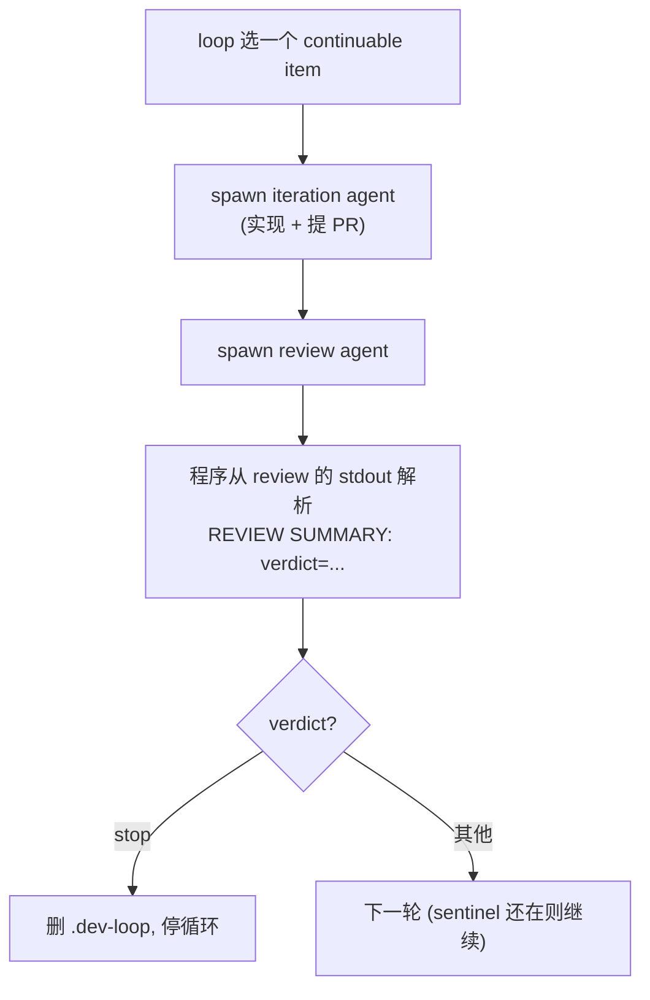

# v1 架构：单进程迭代引擎（代码实然）

> 本文讲 `stable-v1`（tip `79f16e4`）**代码实际**怎么写、怎么跑，行号引用都指向该固定快照。
>
> 重要前提：README 和 `#5` 描述的是**设计理想**——引擎"字符串无感"（不认识 phase 名、状态字面量、verdict 词表）、业务语义全部数据驱动地来自 preset、判断全交 LLM。理想的**准确读法是「机制归引擎、参数归 preset」**：字符串无感的目的是让状态机 DAG 由 preset 数据定义、最大化动态，**不是**让引擎放弃调度——选 item、推进 phase、按表分类从来都是引擎职责；「判断交 LLM」约束的是 issue 完成性、证据充分性这类**判断**，不约束调度机制。**v1 代码远未达到这个理想**：状态语义、verdict 词表、status 字面量、phase 顺序大量**写死在 `src/loop.ts`**——偏离不在「引擎有确定性机制」，而在机制的参数以字面量焊进代码、而非来自 preset 数据。本文以代码实然为准，最后一节专讲偏离的因果与转折点——那才是 v1→v2→v3 演变的真正主线。

## 一、它实际在干什么

v1 是一个 `bun src/loop.ts --target-cwd <repo>` 单进程，在一个 target repo 上循环消费一个 issue 队列。规划（plan，`/dev-plan`）在循环**之外**完成；loop 进程本身只跑两个 phase：**iteration** 和 **review**。

一个 issue 在 v1 里的实际流程：

## 二、v1 的状态机制（代码实然）

这是最关键、也是本仓库历史文档此前写糊的地方。v1 的状态要分两层看，不能笼统说"归 agent"或"归 preset"：

- **item.status 字段**：基本由 **agent 写**——review 角色经 preset 的 `review/update-state` fragment 把新状态落进 `state.json`，引擎只读 + reconcile；程序唯一直接写 `item.status` 的地方是 `queue unblock` 的 `blocked → queued`（`stable-v1:src/loop.ts:2494-2498`）。
- **状态的"规则"（什么是合法状态、verdict 词表、verdict 如何影响流程、kind 如何路由）**：全部**写死在 `src/loop.ts`，不在 preset**。这才是"状态不在 preset 而在程序"的准确含义——不是 agent 不写字段，而是状态的**语义规则**焊死在引擎。

状态规则写死的具体证据：

- review agent 在 stdout 末行打 `REVIEW SUMMARY: verdict=(retry|accepted|skip|blocked|stop);`；程序用**写死的正则**解析（`parseReviewSummaryVerdictFromText`，`:3501-3505`），可接受的 verdict 词表 `ReviewSummaryVerdict` **写死在程序类型里**（`:717`）。
- 程序据解析出的 verdict 用**写死的逻辑**控制流程，例如 `verdict === "stop"` 就删 `.dev-loop` 停循环（`:1577`）。
- `kind="blocked"` 被程序直接映射到具体 fragment `iter/resolve-blocker`（`:3242`）——引擎知道某 preset 的内部 fragment。
- `preset.toml` 里虽有 `[statuses]`（`:26-28`），但 v1 程序的解析、推导、流程控制**不由它驱动**。

**结论：v1 里状态字段虽多由 agent 落盘，但状态的"规则"（合法集、verdict 词表、流程映射、kind 路由）写死在引擎、不在 preset。** README / `#5` 说的"引擎不知道状态字面量、状态归 preset"在 v1 代码里并不成立——这正是今天（`#386` 等）才开始往 preset 迁的东西。

## 三、运行形态

- 单进程 while-loop，守 target 下的 `.dev-loop` sentinel（在 = 继续，删 = 退出），串行处理，一次一个 item、一个 phase。
- spawn：`detached` child，runner 为 `claude` / `codex`。
- 持久化：target 下 `.coder-loop/runtime/` 的 JSON（`state.json` 等）+ sentinel 文件。**无 daemon、无 scheduler、无 SQLite**——这是 v1 的定义性特征。
- `stable-v1` 里也有 `daemon start/stop` 子命令，但它只是把这个单进程放后台，不是常驻调度进程。判断 v1/v2 看的是执行模型有没有变成"中央 daemon + 调度器 + chain + SQLite"。

## 四、v1 代码 vs 理想契约（#5）—— 真正的演变主线

先把 `#5` 理想读准（呼应文首前提）：**字符串无感是为了让状态机 DAG 最大化动态**——phase 列表、状态分类、转移、路由全部由 preset 数据定义，引擎照表执行。`[statuses]` 的 continuable/terminal 本身就是一张（无方向的）状态机参数表，`#5` Stage 4 §B 还预留了带方向的 `[[transitions]]` 候选。所以衡量偏离的轴不是「引擎有没有确定性机制」，而是「**机制的参数住在哪**」。

### 转折点：#30 把误解写进决策（2026-05-11）

`#5` 收口（00:27 UTC）后一小时内，`#30`（Stage 4 §B spike）走完两步：

- 第一条 comment（00:56 UTC）提出正确形态：引擎保留转移机制，`[[transitions]] when/from/to` 作为 preset 数据，引擎查表执行、查不到合法转移即 fail。
- 第二条 comment（01:04 UTC）亲手否决：「状态转移是 preset 内部协议，不该上 L1 schema」，改为删掉引擎仅有的两处 status 读写、把 mode 分类下沉 prompt。

这条否决把「引擎不硬编码字面量」过度引申成「引擎不拥有状态机」。从此引擎侧**不存在任何声明状态机参数的 preset 表面**——这个真空正是后续所有硬编码的入口。

### 契约短暂达成，又被同日开始吃回

- `#36`（`d135563`，2026-05-11）达成最干净点：loop.ts 1339 行，status/verdict 字面量 **0 处**。契约真正成立过。
- 同日约 7 小时后 `#41` 开始再偏离：引擎自己 spawn `gh issue view --json labels` 取 kind（stable-v1 `:3279`）。
- 至 stable-v1（12 天后）：loop.ts 4538 行，字面量 19 处。

每个偏离的因果链相同：运维现实要求确定性转移（agent 挂死、副作用循环重放、blocked 恢复）→ `#30` 否决后没有 preset 参数表可填 → 迭代 coder-loop 的 AI 看见「引擎有代码」，就把机制连同参数一起焊进引擎：

| 偏离（机制合法，参数焊死） | 引入 | stable-v1 证据 | 应有形态 |
|---|---|---|---|
| verdict 词表 `retry / accepted / skip / blocked / stop` + `stop` 流控 | `#115`（堵 accepted_no_pr 副作用循环） | `:717` `:1577` | 词表与 verdict→动作映射为 preset 数据 |
| `ISSUE_KIND_VALUES` + `kind="blocked" → iter/resolve-blocker` | `#41` / `#136` | `:736` `:3242` `:3279` | kind 词表与 kind→prompt 路由为 preset 数据 |
| `ITERATION/REVIEW SUMMARY:` watchdog marker 引擎常量 | `#56` / `#98` | `docs/reserved-strings.md` | marker 为 per-phase preset 字段 |
| `queue unblock` 写死 `blocked → queued` | `#140` | `:2475-2498` | 转移对为 preset `[statuses]` 参数 |
| 主循环固定「`phases[0]` = 干活、最后一个非 trigger phase = review」两槽 | `#134` 仅加 trigger 未改主结构 | `:1282` `:1316` `:2744` | 按 preset 有序 phase 列表推进 |

`#142` 随后建立 `docs/reserved-strings.md` 登记表——没有移除字面量，而是把偏离制度化了。

### 主线的准确表述

把这些写死项迁出的工作走的正是 `#30` 第一条 comment 被否决的那条路——**机制留在引擎，参数进 preset**，且已逐项落地：`#380`（phase 顺序按 preset 推进）、`#381`（phase metadata 入 preset.toml，含 per-phase `summaryMarker`）、`#373`（item 字段 preset 声明）、`#376`（kind 路由移出引擎）、`#386`（`[statuses]` 增 `unblockable`/`entry`，unblock 参数化）；`#370`（偏离登记）/`#396`（元数据闭环 umbrella）/`#412`（preset 声明位收敛）/`#419`-`#422`（GitHub 形状残留：物理列、label 摄入、install label 资产、runtime key 分层）继续。这条线属 v2 参数收敛范畴，不是 v3；v3 是 chain 节点泛化（节点 = item|容器），见 `#413`（曾把 item 级 preset 定为 v3 主体的 `#369` 定义错误，已作废）。**不要把这条主线说成「业务语义不该在引擎」**——那个表述会复现 `#30` 01:04 的误读（连机制一起拆掉）。准确的验收标准是：引擎里允许状态机、verdict 分发、kind 路由这些机制，但每个参数（词表、转移表、路由映射、marker）必须可从 preset 数据读出；grep 不到字面量只是这个性质的副产品。

daemon 化（见 `architecture-v2.md`）是并行的另一条线，它换的是执行模型，不解决参数焊死。两条线不要混为一谈。
