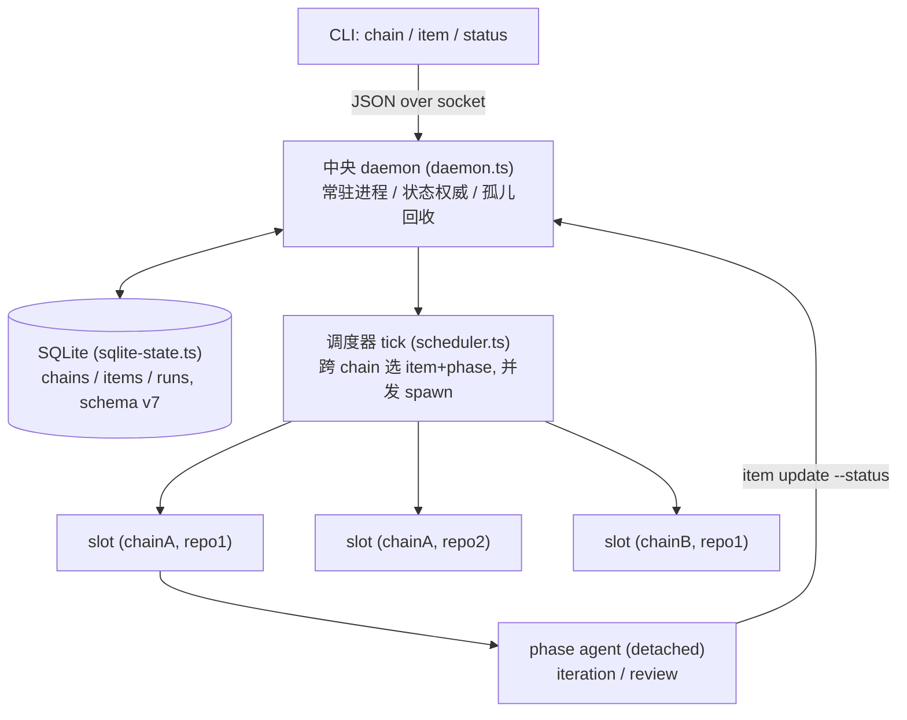

# v2 架构：daemon 化的执行模型（代码实然）

> 本文讲 `main` 上 v2 代码**实际**怎么跑。
>
> 与 v1（见 `architecture-v1.md`）相比，v2 换掉的是**执行模型**：单进程 while-loop → 中央 daemon + chain + 调度器 + SQLite。**业务机制的参数仍大量以字面量写死在程序里，和 v1 同病**——理想形态是「机制归引擎、参数归 preset」（准确读法与转折点见 `architecture-v1.md` 第四节），daemon 化**没有**解决它。把参数迁进 preset 是另一条并行的线，直到今天（2026-06）才在推进。不要把 daemon 化误当成"引擎变干净了"。

## 一、业务形态（与 v1 相同）

v2 跑的业务和 v1 完全一样：一个 issue 队列，每个 issue 经 **iteration**（实现 + 提 PR）和 **review**（裁决）两个 phase，直到落 terminal 状态（`done` / `blocked` / `moot` / `exhausted`；`changes_requested` 继续迭代）。规划仍由循环外的 `/dev-plan` 完成。**daemon 化不改变"做什么"，只改变"怎么跑"。**

## 二、运行思路：daemon 化（v2 的真正增量）

- **中央 daemon**（`src/daemon.ts`）：一个 loop-data root 一个常驻进程，CLI 经 Unix domain socket IPC 与它通信，daemon 是状态权威。引入于 `#190`（`0c5f92e`）。
- **chain**（`ChainRecord`，`src/sqlite-state.ts`）：v2 新概念，一组 item 的容器，创建时绑定单一 preset + repository。
- **调度器 tick**（`schedulerTick`，`src/scheduler.ts`）：常驻进程按 interval ticking，跨 chain 选下一个 item+phase 并发 spawn。引入于 `#189`（`96093f1`）。
- **slot = `(chain, repo_cwd)`**：并发单元，每 slot 至多一个活跃 agent，于是不同 chain、不同 repo 可并行；选下一个待办 item 走索引 `idx_items_next_pending(chain_id, repo_cwd, status, position, id)`。
- **SQLite**（schema v7）取代 per-target JSON，引入于 `#192`（`f3613b5`），旧 JSON state 面在 `#196`（`179a817`）移除。
- **孤儿回收**：daemon 启动时回收上次遗留的 run（`recoverStaleSchedulerState`）——v1 sentinel + reconcile 兜底在中央 daemon 形态下的等价物。

业务生命周期（第一节那张状态机）完全不变——只是推进它的从单 while-loop 变成调度器跨 tick、跨 chain。

## 三、状态：v2 怎么处理，以及它**仍没**解决什么

这是最容易被误读的地方，必须分清"字段谁写"和"规则归谁"：

- **v1 基线**：`item.status` 字段由 agent 写（review 经 `update-state` fragment 落盘），引擎只读；但状态的**规则**（合法集、verdict 词表、流程映射）写死在程序。
- **v2 一度偏离**（`#296`，`7c4a54f`「map item status from SUMMARY marker」）：让调度器从 agent stdout 的 SUMMARY marker **推导** status，等于让引擎接管了本该 agent 写的字段——这违反 `#5`「判断交 LLM、引擎不推导」。
- **`#345`（`04f567a`「引擎回到 v1 状态模型」）恢复**：撤销 stdout 推导，`item.status` 字段重新由 **agent 显式写、调度器只读**。

关键：**`#345` 恢复的只是"字段谁写"，不是"参数归谁"。** 无论 `#296` 还是 `#345`，状态机制的参数仍以字面量写死在 `src/loop.ts` / 调度器里。把参数迁进 preset（机制留在引擎）是今天才推进的工作，已落地：summary marker 成为 per-phase preset 字段（`src/loop.ts:2443` 读 `reviewPhase.summaryMarker`；`#381` phase metadata 入 preset.toml）、post-review 触发是 preset 声明的 DAG 边（`preset.toml` `trigger = { afterPhase, whenStatus }`）、`#386` 给 `[statuses]` 加 `unblockable`/`entry`/`success` 让 unblock 转移参数化、`#380` phase 顺序按 preset 推进、`#376` issue-kind 路由移出引擎、`#373` item 字段经 `[item.fields]` 声明。**仍焊死的参数**：verdict 词表与 `verdict === "stop"` 映射（`src/loop.ts:843`、`:2444`）、`ISSUE_KIND_VALUES`（`:863`）、daemon fallback status 集合（`src/daemon.ts:117-118`）、SQLite 默认 statuses（`src/sqlite-state.ts:824`）。

## 四、SQLite 状态与 GitHub-PR 耦合（遗留债）

schema v7 的两张核心表：

- `chains`：`name`(unique) / `preset`(**NOT NULL**) / `repository` / `base_branch` / `umbrella_*` / `status` / `metadata`。
- `items`：`chain_id` / `issue_number`(**NOT NULL**) / `repo_cwd` / `status` / `attempts` / `position` / `branch` / `pr` / `session_ids` / `phase` / `extra`，约束 `UNIQUE (chain_id, issue_number)`。

注意这些**写死的 GitHub-PR 形状**：item 身份键焊死 `issue_number`、`branch` / `pr` 是物理列、preset 焊在 chain 级（`chains.preset NOT NULL`）。它们和第三节的状态规则硬编码一样，都是 `#5` 字符串无感契约未兑现的地方，登记在 `#370`（契约偏离）。preset 焊 chain 级由 `#412`（item 创建时可选指定 preset，本参数收敛线）收敛；item 身份键与 `branch` / `pr` 物理列的退役归 `#419`（同线）。曾把这部分定为 v3 主体的 `#369`（item 自带 preset + prompt、chain 退为纯容器）定义错误，已作废。

## 五、v2 解决了什么，留下什么

- **解决了**（执行模型天花板）：中央 daemon 统一调度、多 chain 并发、SQLite 事务状态、统一可观测面（`status` / `daemon status`）。
- **没解决 / 留给后续**（参数焊死）：verdict 词表、kind 词表、daemon/SQLite 默认 status 集合等机制参数仍写死引擎（清单见第三节）、item 身份焊死 issue、preset 焊 chain 级。

**两条独立的演变线**：daemon 化（v1→v2，换执行模型，本文）；机制参数外部化进 preset——机制留引擎、参数进 preset（贯穿 v2 后期的 `#373`/`#376`/`#380`/`#381`/`#386`/`#370`/`#396`/`#412`，准确表述与 `#30` 转折点见 `architecture-v1.md` 第四节）。它们经常被混为一谈，但解决的是不同问题。
