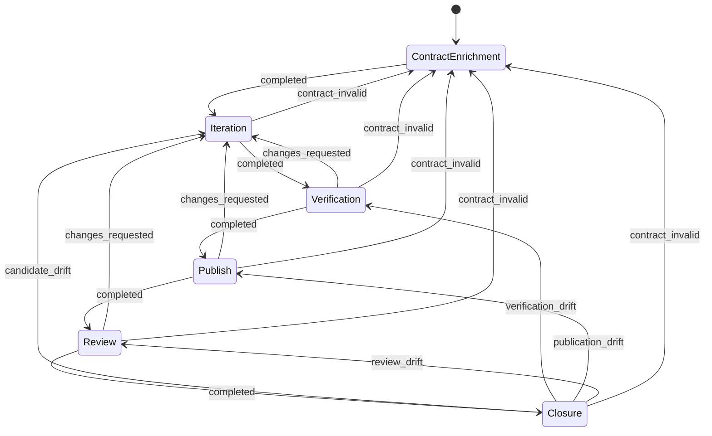

# gh-issue-pr-iteration 六 phase 拆分实施计划

> **For agentic workers:** REQUIRED SUB-SKILL: Use superpowers:executing-plans to implement this plan task-by-task. Steps use checkbox (`- [ ]`) syntax for tracking.

**Goal:** 落地 `DESIGN-six-phase-split.md`：引擎获得 entryKind/run-scoped session/attempt gate 移位/phase.start 扩展，生产 preset 从三普通 phase 拆成六普通 phase + 两 trigger phase。

**Architecture:** 引擎改动集中在 `src/scheduler.ts` 的 selection→spawn→close 主线与 `src/sqlite-state.ts` 的窄 run-session API；preset 改动集中在 `presets/gh-issue-pr-iteration/`（preset.toml + prompt fragments）。引擎不新增 preset 字面量；六 phase 图完全由 preset `[[phases.next]]`/`[[phases.exits]]` 表达（`nextNonTriggerPhaseForItem` 已支持任意 `(phase,status)` 路由）。

**Tech Stack:** Bun + TypeScript strict ESM；`bun test`；`bun scripts/real-e2e.ts`。

## Global Constraints

- 本仓是 app 运行仓：所有改动只留在 app 分支，不开 issue/PR，不 propagate 回 code（`.claude/rules/code-vs-app-boundary.rule.md`）。
- 引擎层禁止 preset 字面量（status 字符串、phase 名、GitHub 字段名）。
- 设计 §8.5 明确不改：preset loader / `[[phases.next]]` / `[[phases.exits]]` / trigger DSL、daemon 直接 spawn、worktree 机制、无 waiting subsystem、无双阶段提交。
- 不新增 engine runtime binding key（`loop.test.ts` 的 26-key 计数守护不动）。
- 完成判定含 `bun scripts/real-e2e.ts --preset gh-issue-pr-iteration` 绿跑（隔离 loop-data root，不碰生产 `~/.coder-loop`）。

## 已核实锚点（实现时以此为准）

| 锚点 | 位置 | 现状 |
|---|---|---|
| resume 判定 | `src/scheduler.ts:2365 resumeDecisionForItem` | 只读 `item.sessionIds[phase][runner]`，正常图重入误 resume |
| attempt 增量 | `src/scheduler.ts:1000` | `startsAttempt && resumeDecision.kind === "fresh"`，误 resume 时 retry 不消耗 attempt |
| attempt 预算 | `src/scheduler.ts:774 exhaustItemsOverAttemptLimitForRepo` | selection 前把超预算 continuable item 全量 exhaust，会截断 verification 后继链 |
| orphan 标记 | `src/daemon.ts:2048-2078 reconcileOrphanedRuns` | crash 遗留 run 补记 `exitCode=ORPHANED_RUN_EXIT_CODE, status="orphaned", extra.reconciledBy="daemon_startup"` |
| session 写入 | `src/scheduler.ts:1471` close handler | child close 时才 `setItemSessionId`；stream 解析在 1271 行已实时发生但只存局部变量 |
| session 失效 | `src/scheduler.ts:1458-1470` | 清 item 级 session + `session_id.invalidated` 事件 |
| phase.start | `src/scheduler.ts:227` | 无 entryKind/runnerStart/predecessorRunId |
| live-run 门 | `src/scheduler.ts:504 slot.activeRun`、`:629/691 hasUnfinishedCurrentPhaseRun` | 挡开 endedAt 为空的活跃 run；recover-run 判据不得依赖 endedAt 为空 |
| review rights | `preset.toml:227-230` | `writableFields = ["branch","pr","blockerRepo","blockerRef"]`，收缩后 branch/pr 迁 iteration/publish |
| review exhausted exit | `preset.toml:252-254` | 取消（预算是引擎机械事实） |
| startsAttempt loader | `src/loop.ts:4478` | 引擎仍只要求 ≥1；唯一性是 preset 级测试断言 |
| RunRecord.extra | `src/sqlite-state.ts:163-174` | run-scoped session 落 `runs.extra`，窄 API 不建新表 |

## 核心接口（跨任务契约）

```ts
// src/scheduler.ts — Task 2 产出，Task 3/4 消费
export type SchedulerEntryKind =
	| { kind: "graph-entry" }
	| { kind: "recover-run"; predecessorRunId: string }

export type SchedulerSelection = {
	item: ItemRecord
	phase: string
	entryKind: SchedulerEntryKind
}

export type SchedulerRunnerStart =
	| { kind: "fresh" }
	| { kind: "resume"; sessionId: string }   // == 现有 ResumeDecision 形状

// src/sqlite-state.ts — Task 2 产出
// runs.extra 内精确字段：extra.runnerSessionId?: string（首个解析即写，一次性）
setRunSessionId: (runId: string, input: { sessionId: string | null; updatedAt: number }) => RunRecord

// phase.start 事件 — Task 4 产出
| { type: "phase.start"; ts: string; runId: string; chainId: number; itemId: number; repoCwd: string; phase: string; pid: number | null;
    entryKind: "graph-entry" | "recover-run"; runnerStart: "fresh" | "resume"; predecessorRunId: string | null }
```

recover-run 判据（Task 2）：selection 时 item 当前 phase 的最新 run（`item.lastRunId` 解析）满足 `run.phase === item.phase && run.extra.reconciledBy === "daemon_startup"` ⇒ `recover-run(run.runId)`；否则一律 graph-entry。runnerStart 派生：graph-entry ⇒ fresh；recover-run ⇒ predecessor `run.extra.runnerSessionId` 存在则 resume(该值) 否则 fresh。`item.sessionIds` 不再参与 resume 决策（保留写入作诊断镜像）。

attempt gate（Task 3）：`spawnSchedulerRun` 入口处，`entryKind.kind === "graph-entry" && phasePlan.startsAttemptPhases.has(phase)` 时：`item.attempts >= maxItemAttempts` ⇒ 写 `exhausted` + `queue.terminal` 事件并放弃 spawn；否则 attempts+1。`exhaustItemsOverAttemptLimitForRepo` 整体删除。recover-run 与非 startsAttempt phase 永不消耗/检查预算。

## 六 phase preset 状态机（Task 5）



statuses：`continuable = ["queued","changes_requested","contract_invalid","in_progress","candidate_drift","verification_drift","publication_drift","review_drift"]`；`terminal = ["blocked","moot","done","exhausted"]` 不变；`done`/`moot` 改由 closure 写；`blocked` 仍 review 写；`exhausted` 仅 engine 写（review 的该 exit 删除）。`blocked-responder` trigger 声明 `afterPhase = "review"` 不变；`umbrella-finalizer` 不变。rights：review `writableFields = ["blockerRepo","blockerRef"]` 且保留 `createItems`/`item.reorder`；iteration 与 publish 各 `writableFields = ["branch","pr"]`。

## Prompt/fragments 拆分（Task 6）

新文件（role 与 phase 同名）：

- `common/packets.md` — CandidateRef / VerificationPacket / ReviewVerdict 三个 GitHub packet 的 markdown 协议（设计 §3.3 的 TS 形状转成 agent 可执行的 comment 模板 + revision join 规则 §3.5）。role=common。
- `verification-entry.md` + `verification/task.md` — fresh checkout CandidateRef SHA、逐项跑 contract checks + 一次真实 runtime/E2E、写 VerificationPacket、exits（completed→publish / changes_requested / contract_invalid）。
- `publish-entry.md` + `publish/task.md` — 核验 verified SHA、整理 PR body/closing keyword/四层证据、draft→ready、写回 item.branch/pr、exits。
- `closure-entry.md` + `closure/task.md` — live recheck、漂移分类（四种 drift + contract_invalid）、merge/close、确认外部终态后写 done/moot、crash 后 reconcile 幂等。
- `review/steps/verification-audit.md` — 替代 `review/steps/replay.md`（review 不再复驱完整 E2E，核验 packet 绑定 SHA、check 覆盖、live checks）。

改写：`review-entry.md`（六 phase 语境、verdict 词表、去 merge/close/done）；`review/actions/accept-pr.md`、`accept-no-pr.md`、`skip.md`（原 moot 裁决）改为写 ReviewVerdict + clean exit 到 closure；`review/actions/state-write.md` 的 branch/pr 写回迁至 `iter/steps/submit.md` 与 `publish/task.md`；`iter/steps/submit.md` 增加 CandidateRef 写入；`iter-entry.md` completed 语义改为 durable candidate → verification。删除：`review/steps/replay.md`（被 verification phase + verification-audit 取代）。`contract.md`、`common/*`、`quality/*`、`enrichment/*`、trigger entry 基本不动（只改 phase 顺序叙述）。

## 任务清单

### Task 1: 复现测试（红）
**Files:** Test: `src/scheduler.test.ts`
- [ ] 测试 A：item 带 `sessionIds[iteration][codex]`，review 写 `changes_requested` 后重入 iteration —— 断言 spawn fresh（invocation 无 resume 参数）且 attempts+1。现状红。
- [ ] 测试 B：predecessor run 带 `reconciledBy` 标记 + `extra.runnerSessionId` —— 断言 spawn resume(该 session) 且 attempts 不变。现状红。
- [ ] 测试 C：attempts 已达 max 的 item 处于 verification phase（continuable status）—— 断言不被 exhaust、verification 正常 spawn；仅当路由要求再次进入 iteration 时才写 exhausted。现状红。
- [ ] `bun test src/scheduler.test.ts` 确认三红。commit `test: reproduce mis-resume, orphan recovery, attempt-gate truncation`。

### Task 2: entryKind + run-scoped session
**Files:** Modify: `src/scheduler.ts`, `src/sqlite-state.ts`; Test: Task 1 A/B 转绿
- [ ] `sqlite-state.ts` 加 `setRunSessionId`（更新 `runs.extra.runnerSessionId`）；`SchedulerStore` Pick 增补。
- [ ] `selectNextItemAndPhase` → 返回 `SchedulerSelection`（含 entryKind；判据见上）。
- [ ] `spawnSchedulerRun` 接受 selection；runnerStart 从 entryKind 派生；`resumeDecisionForItem` 从 spawn 路径退场。
- [ ] stdout stream 首次解析 session ID 时（`scheduler.ts:1271` 回调内）立即 `setRunSessionId`。
- [ ] close handler：session 失效时清 run 的 session 字段（同一 `session_id.invalidated` 事件），resume 失败的 recover-run 按 session-absent 分支 fresh 重启（自然发生：下轮 selection 仍见 orphan 标记？——不：recovery run 正常落库后进入普通判定；resume-invalid 场景由 close 时新 run 无 orphan 标记 + 非零退出走 fresh 重入覆盖）。
- [ ] `bun test` 全绿（A/B 转绿）。commit `feat: selection entry-kind provenance and run-scoped sessions`。

### Task 3: attempt gate 移位
**Files:** Modify: `src/scheduler.ts`; Test: Task 1 C 转绿
- [ ] 删除 `exhaustItemsOverAttemptLimitForRepo` 及其调用；spawn 入口按上文契约实现预算检查。
- [ ] 更新受影响的既有测试（原全量 exhaust 行为断言改为 graph-entry 语义）。
- [ ] `bun test` 全绿。commit `feat: move attempt gate to graph-entry of startsAttempt phase`。

### Task 4: phase.start 事件扩展
**Files:** Modify: `src/scheduler.ts`, `src/daemon.ts`(observability 映射), `src/observability.ts`(如需), 相关测试
- [ ] 事件字段扩展 + emit 处传值 + daemon 映射透传。
- [ ] `bun test` 全绿。commit `feat: phase.start carries entryKind/runnerStart/predecessorRunId`。

### Task 5: preset.toml
**Files:** Modify: `presets/gh-issue-pr-iteration/preset.toml`
- [ ] 按上文状态机写入三个新 phase（runner/model 沿用 codex/gpt-5.6-sol，variables 块复制 iteration 模板并按 phase 需要裁剪：verification/closure 无 STATUS_VOCABULARY_DOC，closure 需要 terminal 词表 doc）。
- [ ] statuses/rights/exits 调整；review completed→closure。
- [ ] `bun run typecheck` + `bun test src/preset.test.ts`（预期部分红，Task 7 收口）。commit 与 Task 6 合并。

### Task 6: prompt/fragments
**Files:** Create/Modify/Delete: 见上文拆分清单；`[[fragments]]` 注册同步
- [ ] 逐文件落地；每个 phase prompt 显式声明：读什么、写什么 durable output、每个 exit 先完成的 GitHub effect（设计 §6 各表）。
- [ ] commit `feat: six-phase split for gh-issue-pr-iteration preset`。

### Task 7: loader/DAG/prompt tests
**Files:** Modify: `src/preset.test.ts`, `src/preset-dag-check.ts` 相关断言, `src/smoke.test.ts` 如涉及
- [ ] 六 phase 可达性、exits 声明、词表成员、唯一 startsAttempt=iteration 断言。
- [ ] `bun test` 全绿。commit `test: six-phase preset loader/DAG coverage`。

### Task 8: fake runner integration
**Files:** Modify/Create: `src/scheduler.integration.test.ts` 或新文件
- [ ] 覆盖验收矩阵（设计 §10）中可用 fake runner 表达的行：happy path 六 fresh graph-entry、全部回边、四 drift、blocked→responder 一次、exhausted 时机（最后一次 candidate 跑完整后继链）、crash recovery（orphan 标记 → resume）。
- [ ] `bun test` 全绿。commit `test: six-phase integration scenarios`。

### Task 9: docs
**Files:** Modify: `CLAUDE.md`, `docs/gh-issue-pr-iteration-fragments.md`, `presets/gh-issue-pr-iteration/DESIGN.md`, `docs/preset-authoring.md`(如 phase.start 字段有文档), `docs/operations.md`(maxAttempts 重校准提示)
- [ ] 直接替换为六 phase 现状（no-legacy-content）。commit `docs: six-phase split alignment`。

### Task 10: 验收
- [ ] `bun run typecheck` && `bun test` 全绿。
- [ ] `bun scripts/real-e2e.ts`（minimal 先行 smoke）。
- [ ] `bun scripts/real-e2e.ts --preset gh-issue-pr-iteration` 绿跑：事件序列含六 phase graph-entry、GitHub 上 contract marker / CandidateRef / VerificationPacket / ReviewVerdict / closure、PR merged、issue closed、item done、teardown 完成。
- [ ] 汇总 runtime 证据。

## Self-Review 备注

- 设计 §5.2 规则 3（session ID 实时写 run）与规则 7（迟到 close 不覆盖新 run provenance）由 run-scoped 存储天然满足——每个 run 只写自己的记录。
- 设计 §4.3 `in_progress` 保留在 continuable，daemon 崩溃 mid-flight re-pick 逻辑不变。
- real-e2e-minimal / single-phase-example / business-key-example 三个 preset 不动；引擎改动必须对它们保持兼容（smoke test 覆盖）。
- maxAttempts 语义变更（每次 retry 必消耗 attempt）在 docs/operations.md 提示重新校准。
