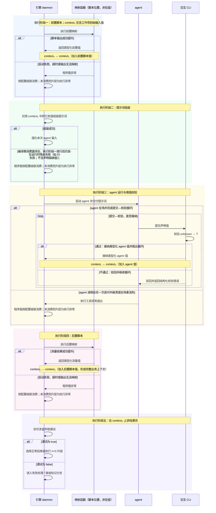
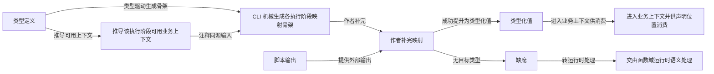
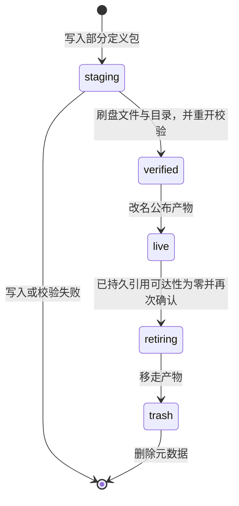
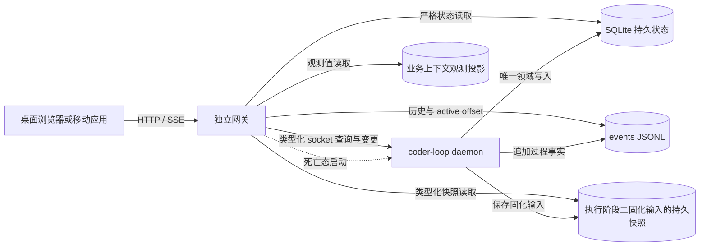
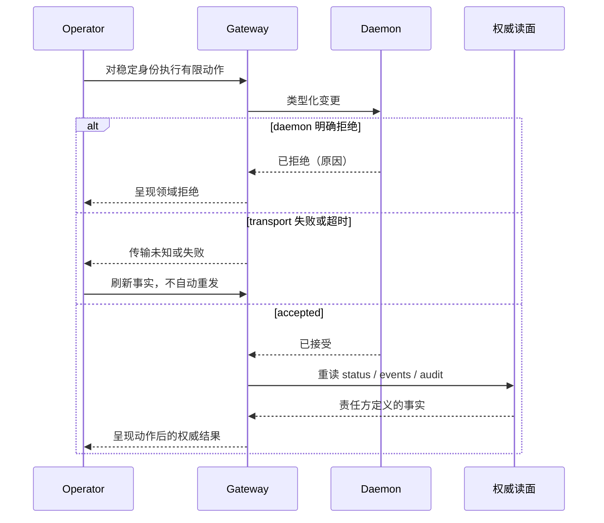

# A：v3 设计依据与决策记录（历史材料）

## 1. 本文件性质与阅读指南

本文是 v3 设计的历史依据卷，不是现行规范。现行规范只有 [B](B.md#b-guide)，规范词表以 [B·规范词表](B.md#b-terms) 为准。

本文保存原始问题、推理过程、历史候选（含已拒绝与悬置）、历史调查数字与历史测试要求。任何候选都不因收录在此而成为现行要求；凡与 B 不一致处，以 B 为准。

阅读顺序按依赖组织：模型来源、定义态来源、函数域运行时来源、对象域任务代数来源、工作空间来源、入站边界来源、出站与执行边界来源、旁路脚本来源、观测产品来源，最后是决策与开放项总览与来源附录。该顺序不同于原文拼接顺序；原文按第 0 篇、面 6、面 7、面 2、面 3、面 1、面 4、面 5 拼接，是多次合稿遗留，不是依赖顺序。

每节内部按问题、原约束、候选与理由、B 规范落点分开书写。来源集中在每节末尾与附录，不打断正文。历史调查中的现状描述（如旧版本行为、旧数据审计、旧 CLI 实测）一律标为当时调查，不冒充现在已实现。
候选身份只有四种，并在出现处标明：沿用（原稿当时成立且现行 B 已采纳，附 B 锚点）、已拒绝（明确不再采用，附 B 依据）、悬置（原稿当时未决）、开放（原稿当时未决）。凡现行 B 已裁决事项，不再称当前未决；原稿当时状态与现行 B 裁决在各章 B 规范落点并列给出。开放项总览见 [决策与开放项总览](#a-decisions)。
本卷章节目录：
- [本文件性质与阅读指南](#a-guide)
- [历史名称与规范名对照](#a-terms-history)
- [模型来源](#a-model-origin)
- [定义态来源](#a-definitions-origin)
- [函数域运行时来源](#a-runtime-origin)
- [对象域任务代数来源](#a-tasks-origin)
- [工作空间来源](#a-workspace-origin)
- [入站边界来源](#a-ingress-origin)
- [出站与执行边界来源](#a-provider-origin)
- [旁路脚本来源](#a-hooks-origin)
- [观测产品来源](#a-observation-origin)
- [决策与开放项总览](#a-decisions)
- [附录：来源](#a-sources)

## 2. 历史名称与规范名对照

本章只解释理解原文所必需的历史名称与规范名的对应。不复制第二套现行词表；现行定义以 [B·规范词表](B.md#b-terms) 为准。

| 历史用语 | 出现语境 | 规范名（以 B 为准） | 说明 |
|---|---|---|---|
| 针眼通道 | 第 0 篇、面 2 | 唯一交接边界 | 对象域与函数域唯一的正式值交接：入口由工作项建立初始业务上下文，出口为正常返回或执行异常。历史原文如此称呼，本卷除引文外一律用规范名。 |
| 死值 | 第 0 篇、面 1、面 2 | 初始输入值 | 来自工作项种子或前驱交付、进入即冻结的输入值。历史原文如此称呼，本卷除引文外一律用规范名。 |
| 时态 | 第 0 篇、面 2、面 7 | 执行阶段 | 一次交接内部固定的五个顺序位置：前置映射、提示词组装、agent 执行、后置映射、流转判定。历史原文如此称呼，本卷除引文外一律用规范名。 |
| phase | 面 3、授权与观测 | 函数标签 | 值域中的被调用函数标签，也是授权和审计维度。不得与步骤、执行阶段混用。 |
| step | 面 2、交接合同 | 步骤 | 任务内部的工作流定义单元；后继标识为 nextStep。不与任务或执行阶段混用。 |
| 现场 | 面 3 §11 等 | 按语境拆分 | 视语境为工作空间、执行闭包、会话、临时资源或续接状态。历史上的集合称呼，本卷改写时已按语境拆开。 |
| 上下文（opaque body 协议所称） | 面 2 §9（已拒绝） | 已删除，不得复用 | 旧旁路存储协议占用过“上下文”一词，已整体删除；该词今后只指类型化业务上下文。 |
| 漏气孔 | 面 2 §8、面 5 §2 | 未声明输入路径 | 绕过声明消费面改变函数输入的路径。历史修辞，本卷除引文外用规范描述。 |
| 来源面、消费面、检查面、路由面 | 第 0 篇、面 1 | 定义与校验职责 | 值来源声明、声明消费位置、填值校验与流转校验、路由的职责划分，名称沿用但以 B 落点为准。 |
| slot | 面 3 §2 | 已删除 | 旧队列的串行位置概念；其串行约束不得误写为业务顺序。 |
| gate、decision point、journal | 旧面 2、面 6 相关 | 已删除 | 旧调度与旁路概念；相应需求由类型系统校验与旁路审计承载。 |
| seal、封口 | 面 3 §16 | 不使用 | 曾用于表示群组结束不可重开；今后只说任务组结束不可重开。 |
| 窄地基 | 面 4 §8 | 既有工程基础 | 指当时已存在的 CLI、存储原语等工程基础。历史修辞，本卷除引文外用规范描述。 |
| 陈尸、撒谎、蒸发、冒充、美化 | 面 7 等 | 仅存于历史引文 | 历史修辞，规范正文不用；本卷只在明确标注的历史引文或案例导语中保留原意转述。 |
| preset（双义） | 第 0 篇 §0.6、§0.8 | 工作流预设（沿用，B 已裁决） | v2 指完整工作流；v3 讨论中曾指任务内部的步骤级定义单元（历史候选，现行 B 已拒绝）。现行：preset 保留完整工作流及其定义发布包，内部单位为步骤（step），后继标识为 nextStep。见 [B·规范词表](B.md#b-terms)。 |
| generic held | 面 3 §9.2、面 5 | 不使用 | 无原因的一般 holding 状态；一律以带原因的封闭事实替代。 |
| `Just<T>`、`produced(T)` | 定义态、函数域 | 成功提升的类型化值 | 映射成功产出并进入业务上下文的值；历史代码标识，本卷用规范描述。 |
| `Nothing`、`absent` | 定义态、函数域 | 缺席 | 本次运行没有形成声明目标类型的运行时结局；不是可提前排除的状态。 |
| `MapFault` | 定义态 | 映射故障 | 映射执行失败的结局类别；与缺席区分。 |
| `CompileEnvelope` | 定义态、观测 | 编译结果 | 一次完整编译判定；历史代码标识，本卷用规范名。 |
| 开放前沿 | 面 3 §8、面 4 | 准入判定的副产品 | 随需要重新声称位置的拒绝结果返回；不是可独立调用的查询接口。 |
| delivery、execution | 面 6 | 投递、钩子执行 | 逻辑投递责任与履行该责任的一次真实启动尝试；两层身份不合并。 |

## 3. 模型来源：双域、值提升与交接

### 3.1 问题

v3 从六篇旧 RFC 重划为八个责任面。重划前各面各自回答“值从哪里来、何时有效、失败由谁处理”，缺少共同答案。闭包内部的产值、校验与流转曾进入 daemon 的调度门、日志协议或终结判定协议，本章记录为公约固定下来的公共模型。

### 3.2 原约束：引擎只推理被提升的值

agent 不是没有副作用的函数。它会修改工作空间、调用外部程序、形成会话内判断，也可能留下日志、进程与 Git 痕迹。所谓纯函数化，不是消灭这些副作用，而是收窄引擎承认的观察面：只有被明确提升为值的副作用才能参与提示词、检查与流转；其余副作用对本次交接语义一律丢弃。

针对 agent 执行及其副作用的值提升口只有两个。第一，agent 在运行时向业务上下文填入声明允许的值，即自报告。第二，agent 运行结束后，由声明的脚本测量外部状态并把结果映射为业务上下文值，即测量。除此之外的副作用并未被物理清除，只是不进入本次交接；以后若要消费，必须重新通过声明过的采样与映射入口提升为值。agent 启动前的前置脚本负责准备函数输入，不构成第三个提升口。

两口并列不表示信任相同。最初由 agent 自陈的“测试已通过”“文件已存在”等信息，只要能够被脚本计算，就应迁移到测量；能用测量承载的信息，不再用 agent 断言承载。测量接管可计算事实之后，自报告收缩到真正不可测量的意图、判断与后继选择。论证顺序是先把可计算边界尽量推远，最后只在测量无法覆盖之处消耗信任。

因此引擎不根据未提升的文件变化、输出文本或会话内部状态猜测业务结论。它能保证的是值从声明的来源产生、按声明的类型进入业务上下文、在声明的消费位置被读取，并在交接边界得到确定结果；它不能从副作用本身推断 agent 实际上做了什么。

### 3.3 原约束：双域对偶与唯一交接边界

v3 同时包含两个方向相反的抽象目标。对象域处理任务之间的真实并发，必须消灭调度时序的业务可见性：互不依赖的动作可交换，已提交事实只增，重复提交按稳定身份收敛。函数域处理一个任务的执行闭包内部，必须精确刻画顺序：前置取值、提示词组装、agent 执行、后置测量和流转判定按固定顺序发生，前一位置没有形成合法值，后一位置就不能开始。

对象域的结构在 daemon 运行期间生长。任务有多少、何时派生、哪些成员同时存在，只能由运行时的持久状态转换决定，不能在运行前把整棵实例树编译出来。函数域的工作流预设声明是静态文本；它的类型、值来源、映射签名、提示词消费位置、谓词槽和后继闭集可以在实例执行前形成可判定的定义。

两域之间只有唯一的正式交接边界。入口处，对象域把工作项中已存在的初始输入值交给闭包，形成初始业务上下文；出口处，闭包只向对象域交付正常返回或执行异常（`returned(value) | exception`）。闭包内五个位置的中间状态、填值驳回和脚本执行细节不进入 daemon 的任务账本。对象域也不反向解释闭包内部过程，只消费最终交付。

等待（await）不构成第二条跨域通道。被等待的审查任务是对象域中的独立任务，其结果通过持久状态转换在对象域账本内回注；函数域被保留的只是原闭包现场这一资源事实。步骤接缝作用域内的中间事实仍未成为 daemon 状态。

### 3.4 原约束：编译期与运行时的精确边界

编译期能够证明的是声明闭合、签名匹配以及值管道的连通性，也就是可达性：每个声明值有唯一来源，映射的输入输出类型能够拼接，消费位置所需的值存在一条类型正确的来源路径，有限后继和谓词槽得到穷尽处理。这些证明只说明运行时存在合法求值路径，不说明那条路径一定成功。

脚本是否启动成功、是否产出可提升的值、agent 是否填入合法值、谓词最终为真还是为假，全部是运行时事实。运行时通过边界解析、填值校验和纯谓词求值获得具体结果。不得把“某值在类型图中可达”写成“运行时必定得到该值”，也不得因运行结果仍需求值而否认声明闭合可以在编译期判定。

### 3.5 原约束：五个执行阶段与业务上下文单调累积

一个闭包的正常交接依次经过五个执行阶段。执行阶段一执行前置脚本，把工作项初始输入值和脚本输出映射成可供提示词使用的值；执行阶段二只负责组装提示词；执行阶段三运行 agent，并在 agent 仍在场时完成填值校验；执行阶段四执行运行后脚本，把测量结果提升为值；执行阶段五在完整业务上下文上求值纯谓词，并选择正常路由或失败处理路由。

业务上下文单调累积意味着后一个执行阶段保留前一个执行阶段已经形成的全部值，只增加新值，不靠删除或改写旧值改变历史。类型定义为每个值声明唯一来源：工作项、某个映射或 agent 三者只能取其一。同名多来源在编译期就是非法声明，不留到运行时决定覆盖顺序。

异常不按一个全局失败处理器分发，而由异常发生时能够触及相应副作用面的在场者消费。程序脚本运行时 agent 尚未启动或已经退出，脚本异常只能由程序面处理；agent 填值错误发生在 agent 仍在场的执行阶段，先驳回给 agent 修正；纯流转判定只对已经存在的值求纯谓词，不再保留“判定不可得”这一额外状态。

| 执行阶段 | 结局 | 当时的消费者 | 对象域最终可观察结果 |
|---|---|---|---|
| 前置脚本 | 启动失败、超时、输出无法映射 | 程序面，按配置级联处理 | 不观察脚本内部状态；若程序面未在闭包内消化，出口为执行异常 |
| 提示词组装 | 缺少可拼接值或组装失败 | 程序面，按配置级联处理 | 不产生 agent 运行；未被程序面消化时出口为执行异常 |
| agent 运行 | 值缺失、类型错误 | 在场 agent | 不产生对象域持久状态转换；CLI 驳回，agent 在同一执行阶段修正后再提交 |
| agent 运行 | 执行工具崩溃或在场者消失 | 程序面升层 | 闭包出口为执行异常，不得伪造成业务返回标签 |
| 后置脚本 | 启动失败、超时、输出无法映射 | 程序面，按配置级联处理 | 不观察脚本内部状态；若程序面未在闭包内消化，出口为执行异常 |
| 流转判定 | 谓词为 false | 声明的失败处理路由 | 产生确定的失败处理流转；只有缺省标记级联最终未消费时才升为执行异常 |
| 流转判定 | 谓词为 true | 声明的正常路由 | 交付正常返回，由对象域持久状态转换消费 |

该表描述执行阶段归属，不提前规定每一种程序异常的完整策略 ADT。程序面可以按声明或操作员全局配置消费异常；只有最终越过交接边界的结果才成为对象域事实。

### 3.6 原约束：两层校验

填值校验位于执行阶段三，其输入来自 agent，因此信任级别是未经验证的 unknown。它的形状是解析器：尝试完成 unknown 到目标类型的解析，成功才把类型化值加入业务上下文。表单校验是准确类比：字段漏填或格式错误不会废弃整次注册流程，而是把结构化错误返回给仍在场的填写者，允许其原地修正后再次提交。交互 CLI 承担驳回与反馈通道；它不把错误记成对象域失败，也不替 agent 生成值。

流转校验位于执行阶段五，面对的已经是由各边界解析完成的完整业务上下文，因此信任的是值的类型与来源已成立，而不是 agent 的自陈为真。按操作员原话，它在形状上是“带异常的映射函数中决定何时抛异常的子函数”；落实到五个执行阶段后，这个子函数自身只做纯谓词求值，不再执行脚本。谓词为 false 表示本次流转不能成立，直接进入失败处理或缺省标记分支，而不是把表单重新退给原 agent。

两层校验因此不能合并。填值校验防止不可信输入进入类型化业务上下文，失败后的修复者是仍在场的 agent，当前流程保持存活；流转校验判断完整业务上下文是否满足声明的交接条件，失败后的去向由工作流预设的失败处理路由或缺省标记级联裁定，本次正常流转已经终止。前者回答“这个值能否成为目标类型”，后者回答“这些已成形的值能否共同支持这次流转”。

### 3.7 原约束：分形交接

步骤与任务都存在“执行结束后把结果交给下一段”的动作，因而共享同一个交接合同形状：交付值包，完成必写值解析与声明测量，在完整业务上下文上求流转谓词，然后得到正常路由或失败处理与缺省标记结局。两层的抽象对象不同，打包的值也不同，但合同不应因此分裂成两种方言。工作流预设只需提供一份交接文法，在任务接缝与步骤接缝两个作用域实例化；同一交接内部仍按五个执行阶段串行，而彼此无关的交接只依赖前向、单调与可交换的结果，因此合同本身不要求把可并发实例强行串行化。

共享形状不意味着共享持久性。任务层的前向推进经过持久状态转换写入 daemon 日志，是已经发生、不可撤销且崩溃后必须恢复的历史事实。步骤接缝作用域内的前向只是一条执行纪律：执行现场可以随工作空间或会话一起丢弃，也可以整体丢弃并重放；恢复单位是任务尝试，不是某一个步骤。打包值所在的记账位置不同，决定了同一句“仅前向”在任务层是历史承诺，在步骤接缝作用域内只是禁止写回退逻辑。
这一区分还要求可见性严格单向。步骤粒度的进度、校验与失败不得进入 daemon 账本，否则分形会退化为两层共用一个执法者，让工作项与函数标签的内部过程重新进入对象域账本。步骤接缝作用域内无论经历多少内部事实，对任务层只折叠为正常返回或执行异常；任务层消费折叠结果，不反向解释或恢复某个步骤。正因为合同形状可复用而事实账本不复用，两层才能各自保持前向并发而不互相泄漏调度语义。

### 3.8 原约束：值管道与双面闭合

值管道由三类定义态资产共同构成：工作流预设的类型定义说明业务上下文在各执行阶段应当包含什么；CLI 依据类型生成对应执行阶段的映射函数骨架，并在注释中枚举该函数运行前可用的业务上下文；提示词与其他声明消费位置说明哪些值将在何处被读取。映射的基本形态是 `map(context, bashscript())`：读已有业务上下文并执行脚本，而不是把任意字符串输出直接包装成可信值。外部命令先产生字符串，映射再结合已有业务上下文把它解析、检查并提升为类型化值；只有成功提升的值可以进入后续消费。

编译面进行两侧闭合。来源面要求每个声明值恰有一个来源，并要求所有运行时来源都有签名完整的映射或 agent 填值声明；消费面要求提示词占位符、检查谓词和特殊路由读取都引用已声明且可达的值。没有消费位置的声明值、没有来源的消费值或未补完的映射骨架都产生编译诊断；严格模式禁止执行不闭合的工作流预设。

本总纲只规定值管道的责任分界，不展开值类型的完整递归 ADT、代码生成文件布局、编译诊断结构、定义发布与固定引用或运行时解析器。这些细节由定义态承担，但不得改变“编译期证明可达，运行时产生结果”的边界。

### 3.9 原约束：检查面、路由面与失败处理的 total 语义

产值与检查是两个正交的面。每个业务上下文值都有一个谓词槽；默认谓词恒为 true，因此没有显式检查时无需生成空代码。显式谓词只在执行阶段五读取完整业务上下文并返回 true 或 false。检查是否通过不决定步骤后继值（nextStep）是谁；路由值已经存在也不能绕过检查。任一检查失败时，正常路由值不被消费，执行转入约定的失败处理路径。

“步骤后继值（nextStep）”是特殊业务上下文值（历史原话称“下一个预设”），因为引擎可以在封闭候选集足够小时接管填值。当声明允许的后继数量 n ≥ 2，agent 或脚本必须从合法字符串闭集中选择；n = 1 时引擎直接填入唯一值；n = 0 时发生升层，进入下一个任务或任务链结束。这里忠实沿用操作员的“下一个预设”“失败模式的预设”用法，名称以现行 B 为准。

该术语在原稿当时存在命名张力（开放项）：v2 中工作流预设表示完整工作流，而当时 v3 讨论中的工作流预设可能表示任务内部的步骤级定义单元。现行 B 已裁决：工作流预设保留完整工作流及其定义发布包，任务内部的步骤级定义单元统一称步骤（step），后继标识为 nextStep，原步骤级 preset 候选已拒绝。见 [B·规范词表](B.md#b-terms)、[B·定义](B.md#b-definition)。

失败处理是一个特殊步骤，而不是引擎硬编码的业务失败枚举。工作流预设可以显式声明由哪个失败处理节点消费检查失败或程序异常，也可以完全不声明。未声明时由专用缺省标记值补位，依次查找操作员全局配置中“步骤→任务→组→工作项”的级联策略；若配置仍未提供消费者，缺省标记硬默认的最终形态是对象域执行的全局停机动作。这个优先级使失败处理在类型追踪中始终有值（原稿：不出现 `undefined`）。级联策略的正交划分见第 6.10 节（原稿当时只给出示例，现行 B 已拆为重试策略与耗尽后动作两个正交轴，见 [B·重试](B.md#b-retry)）；仅配置文件语法等实现细节仍待细化，本总纲不自行补造。

因为业务上下文可以完全由工作项与脚本形成，步骤不必包含 agent。纯程序节点与 agent 节点使用同一套执行阶段和流转合同；差别只是 agent 执行阶段是否实际实例化，而不是另开一种任务代数。

### 3.10 旁路与观测在模型中的位置（历史结论）

旁路钩子挂在五个执行阶段转换点上，是带外部副作用的子进程运行时，独立于既定主流转。它可以执行带外部副作用的脚本；真正的边界是权威。映射由工作流预设声明，产值进入业务上下文，并参与主流转；旁路钩子由操作员声明，执行结果不进入业务上下文，不拥有检查或路由的裁决权，也不产生领域变更的权威。旁路钩子即使改变了外部世界，该副作用也不能自行改写 daemon 账本或冒充持久状态转换。

观测产品的本体是业务上下文与副作用的可观测手段。业务上下文面展示被提升并参与交接的值、各执行阶段快照、谓词结果、正常与失败处理路径和对象域值账本；副作用面展示未进入交接语义但对人仍有诊断价值的工作空间、进程证据、事件、日志和 Git 痕迹。观测读取这些事实，不重建或美化它们。有限运维动作作为附属动作面保留，并与观察面分栏；二者共享稳定身份，却不共享权威，所有变更仍由 daemon 裁决并回到权威读面核验。

### 3.11 B 规范落点

本章模型结论现行落点：公共模型与交接边界见 [B·模型](B.md#b-model)、[B·值](B.md#b-values)、[B·执行阶段](B.md#b-stages)、[B·校验与路由](B.md#b-validation)、[B·路由](B.md#b-routing)、[B·步骤与任务](B.md#b-step-task)；函数域执行见 [B·函数域](B.md#b-function)；任务代数见 [B·任务](B.md#b-task)；旁路见 [B·旁路钩子](B.md#b-hook)；观测见 [B·观测](B.md#b-observe)。工作流预设命名原稿当时开放，现行 B 已裁决（工作流预设保留完整工作流，内部单位为步骤，后继标识 nextStep），见 [B·规范词表](B.md#b-terms)。

来源：record-3 第 3—19 轮操作员原话与主 session 收敛推导；record-2 3:23—3:24；division-plan.md 面 0、面 6、面 7。

## 4. 定义态来源

### 4.1 问题

定义态管理的是工作流预设在实例执行前能够封闭判定的声明文本闭包。它包括类型定义、提示词文档、各执行阶段的映射骨架、交接合同声明、谓词槽与后继闭集，也包括这些资产经过编译、发布、固定引用后形成的稳定定义身份。它不提前执行脚本，不替 agent 填值，也不编译对象域在 daemon 运行期间才会生长的完整任务结构。

本篇回答两个保证。第一是如何保证编译面正常工作：答案不是预言脚本与 agent 的运行结果，而是让唯一编译判定证明声明闭合、签名匹配和值管道连通。第二是如何保证运行时有对应的内容：答案不是在运行时重新扫描当前工作流预设，而是把严格闭合的定义资产发布为不可变定义包，由实例固定精确引用，再由定义解析按引用取回并验证。

两个保证必须保持编译期与运行时边界。编译期证明的是可达性，即运行时存在一条类型正确的合法求值路径；脚本是否启动、映射是否得到类型化值、agent 是否提交合法值以及谓词真假，仍然全部是运行时事实。定义态只保证运行所需的定义内容存在且可验证，不保证一次运行必定成功。

本篇沿用总纲中的工作流预设用法，不处理其历史命名张力。函数域运行时如何执行这份定义归函数域篇，对象域如何物化与消费任务归对象域篇；定义态只向两面提供同一份经过判定、发布和固定引用的声明闭包。

### 4.2 原约束：三面资产与代码生成

工作流预设的定义资产由三面共同构成：类型定义声明各执行阶段的业务上下文形状与每个值的来源；提示词文档声明值的文本消费位置；各执行阶段的映射骨架文件承载外部值向纯值的提升。任何一面缺失，工作流预设都不是一份完成的值管道。映射骨架不是编译后的附属缓存，而是会进入后续编译、定义发布和固定引用的定义资产。

作者先完成类型定义与提示词文档，再由 CLI 从类型定义机械生成每个映射来源所在执行阶段的骨架。生成物不是可直接运行的代码文件，也不替作者猜测业务转换；它给出可检查的输入输出签名，并在注释中枚举该映射开始运行前可用的业务上下文值及其类型。注释与函数签名来自同一个类型定义，不能由作者另维护一份易漂移的清单。

业务上下文的枚举遵守五个执行阶段的单调累积。前置映射的业务上下文只包含工作项初始输入值。同一执行阶段内多个前置映射之间是否相互可见、按何种顺序执行，原稿当时标待复核；现行 B 已采纳：同批入口快照、互不可见、无声明顺序、汇集屏障（all-settled barrier），见 [B·映射合同](B.md#b-map-contract)。下述内容沿用，状态为 B 已采纳。

**同一执行阶段映射的落定与屏障（沿用：现行 B 已采纳为映射合同）。** 同一前置或后置映射执行阶段中的映射集合由固定定义引用锁定。所有映射读取该执行阶段入口处的同一份只读业务上下文快照，彼此产出不可见，不存在声明顺序；运行时可以采用任意顺序与并行度，但同级结局不得触发取消或跳过。每个映射最终落为 `produced(T) | absent | fault(MapFault)`（已产出值、缺席或映射故障）。已产出值在屏障前只是待提交值；屏障收齐全部结局后，先聚合故障，再按已编译合同判定必需值缺席。存在故障或必需值缺席时，整个批次只产生一次聚合的程序面异常，不发布部分业务上下文；仅当批次合法时，才按唯一值名原子形成执行阶段业务上下文。不提供工作流预设级快速失败参数。闭包级停止、截止时间与进程丢失属于外部中断，不是同级失败传播。前置与后置映射对称适用本规则。复用同一测量的成本通过观测单元级积类型值（product value）处理，不通过映射间可见性补偿。

后置映射可以读取工作项初始输入值、前置值与已经通过填值校验的 agent 值。生成器只为映射来源生成骨架，不为工作项来源或 agent 来源制造虚假映射，也不让后一个执行阶段覆盖前一执行阶段已经形成的值。

映射的基本形态是 `map(context, bashscript())`：读业务上下文并执行脚本。外部命令先给出字符串或未经信任的结构，映射再结合当时已有的类型化业务上下文完成解析与检查，把结果提升为类型化值；只有成功提升的值可以进入业务上下文，并被后续提示词、检查或路由消费。缺席表示本次运行没有形成声明的目标类型，它是运行时结局，不是编译器可以提前排除的状态，也不能由默认值伪装成成功。

因此“映射不写完即工作流预设没写完”是定义态纪律，而不是运行时容错选项。类型、来源或执行阶段位置改变后，旧骨架的签名或业务上下文注释与机械推导结果不一致，过期也属于同一个未完成检查范畴；缺失、未补完、签名不符和过期都必须在严格执行前被看见。

### 4.3 原约束：双面闭合与编译面保证

编译面从来源面与消费面同时检查同一条值管道。来源面要求每个声明值唯一来自工作项、映射或 agent 三者之一；同名多来源会引入覆盖顺序和来源权威的歧义，因此是编译期非法状态。工作项默认值必须与声明类型相容，映射的输入必须在所在执行阶段可达且输出类型匹配，agent 来源也只能出现在允许 agent 填值的位置。

消费面反向回答值在哪里被读取。提示词占位符、谓词和路由只能读取已经声明、在该执行阶段可达并且类型匹配的值；未来执行阶段的值不能提前消费，缺席不能作为目标类型使用，消费位置也不能重新解释来源类型。反过来，声明值若没有任何消费位置，会形成未消费编译诊断，防止类型定义退化成无人负责的值仓库。

谓词槽与后继闭集也必须穷尽。每个相关值都有谓词槽；没有显式谓词时按恒真处理，不要求生成空代码。路由面中的有限后继必须形成闭集，零个、一个或多个候选都有穷尽定义的编译产物形状。当后继数量 n ≥ 2 时，选择器由 agent 还是脚本担任是工作流预设必须给出的声明位；未声明选择器属于闭合性编译诊断。n = 1 时由引擎自动填入唯一后继，n = 0 时升层，二者都不需要声明选择器。编译器可以证明候选集合与读取它的值类型闭合，但不能证明运行时谓词为真或最终选择某个候选。

编译诊断分为警告档与严格档。警告档允许作者查看规范化结果、缺失项和生成建议，继续补完定义；严格档是定义发布、创建与恢复执行的准入条件，任何未闭合编译诊断都禁止运行。声明内部的结构矛盾直接得到拒绝的编译结果，不能靠关闭严格档放行；能够理解但尚未补完的声明仍可保留编译诊断，却没有运行资格。

这些检查本质上只有一个结论：可达性证明。它们证明每个消费位置存在一条类型正确、来源唯一、执行阶段合法的路径，并证明谓词槽与有限后继没有未处理分支；它们不把路径存在偷换成运行时必定得到值。因此 CLI、诊断、状态与观测都只能显示已编译或可达的定义事实，不能显示成运行结果已经满足。

### 4.4 原约束：两层交接合同的声明位

总纲已经规定分形交接的共同形状：步骤与任务共用同一份交接合同文法，只在两个作用域实例化。类型定义、值包形状、谓词槽、正常后继与失败处理和缺省标记路由的声明位都属于工作流预设定义资产，因此由本面给出语法、纳入编译并随定义包发布。

共享文法不意味着本面拥有两层运行账本。步骤接缝如何按五个执行阶段执行、如何形成正常返回或执行异常，归函数域运行时；任务接缝如何把折叠结果写成持久状态转换、如何物化后继任务，归对象域。本篇只保证两层读取同一份已编译声明，不展开任一层的运行时语义。

这一边界也阻止编译面越权生成完整运行树。定义态可以穷尽有限的合同变体、后继闭集与类型路径，却不能预知 daemon 运行期间会出现多少任务实例、何时派生或哪些实例并发存在。后者是对象域的运行时生长事实，不是工作流预设声明文本闭包的一部分。

### 4.5 历史调查：编译结果三分身份与当时现状

当时 main 已有规范编译器骨架、已编译与拒绝分支、真实来源哈希与公共投影，这些是建立唯一判定的工程基础，却尚不自动保证所有入口读取同一份编译诊断。当时记录的现状是：成功结果中的模型与警告会在部分装载边界分离，daemon 回调、诊断、状态与 CLI 可能形成不同读面；只给某个入口追加检查器会产生第二份判定。以上是历史调查，不是对现状的断言。

目标边界对一个稳定来源快照只产生一个编译结果。成功分支同时携带规范化编译产物与结构化编译诊断；拒绝分支携带非空诊断。CLI、诊断工具、缓存、观测与其他消费者只能投影或引用这个编译结果，不能重新编译同一静态事实。编译诊断变体必须有稳定身份与类型化内容，显示文字只负责解释，不能成为控制流。

三个身份必须分域。`CompileEnvelope identity` 表示一次完整编译判定及其编译诊断；`compiled product identity` 表示规范化可执行定义；`definition content identity` 表示已经发布、可供实例固定引用的完整定义包。编译诊断规则变化不应伪装成执行定义变化，定义资产变化也不能沿用旧内容身份，所以三者可以互相引用，却不能压成一个哈希。

公共结构同样是唯一判定的投影合同，不是另一套解析器。编译器边界拥有结构生产者；消费者缺席只表示相应验证尚未完成，不授权消费者复制结构或自行解释编译产物。这样编译面是否正常工作由唯一编译结果回答，而不是由多个入口的偶然一致回答。

### 4.6 历史调查：不可变定义发布与固定引用

严格闭合的编译产物必须先发布为完整定义包，实例才能写入并固定它的定义引用。定义包至少包含规范化工作流预设、类型定义与来源声明、提示词文档与片段、文档渲染声明、谓词槽与后继闭集、脚本声明、相应映射骨架文件在补完后的资产、公共结构与清单。相较当时的短期物化，该设计明确把类型定义和映射资产纳入完整定义包，其字节、签名与摘要共同参与定义内容身份。

定义发布先在同一文件系统的暂存目录写入尚不可解析的部分定义包，逐个 `fsync` 文件，再 `fsync` 目录。写完后按规范字节计算内容身份，重新打开并验证清单、每个资产摘要与整体身份；只有全部验证通过，才以原子 `rename` 公布产物，并把元数据置为有效。

相同引用与相同内容的重复定义发布是幂等成功；相同引用对应不同内容是身份冲突，必须拒绝；不同引用不能因只保留最新版本互相清理。定义发布复用编译结果的判定，不重新计算编译诊断，也不把编译结果、编译产物与内容身份合并。

顺序保证必须是先发布、后写引用。若发布后、写引用前崩溃，只会留下可由资源回收处理的完整孤儿；若先写引用再补定义包，则会产生已提交却无法解析的实例。当时的短期物化会在完整解析与编译前完成标记与改名，并可能清理旧同级，这个现状只能提供临时副本，不能承担定义发布与固定引用的合同。以上现状描述是历史调查。

### 4.7 历史调查：定义解析、既有缓存问题与历史数据

实例的所有定义消费者都必须经共享定义解析按精确标签引用取得已验证定义包。冷解析依次验证引用种类、结构、有效元数据、清单、每个资产摘要与整体身份；通过后才允许结果进入进程缓存。缓存的语义只能是 `definition ref → verified content`，缺失必须重读不可变存储，不能退回当前路径。

这条规则修复当时缓存意外决定定义内容的问题。旧文记录的当时行为是：daemon 的成功缓存以目录路径为键并持续到进程结束，同路径来源改版后，进程内仍可能解释旧版；重启后缓存消失，又会从当前路径读取新版。来源哈希与标签引用因而只能归因，不能单独保证旧实例的完整定义内容可取回。以上是历史调查。

固定引用与定义解析合起来才兑现运行时有对应内容。实例先固定旧版的完整定义包引用；启动、恢复与重启都按该引用取回旧版的类型定义、提示词、映射、谓词和后继声明。新版只进入新的编译与发布，不自动重绑旧实例。缓存命中返回已验证的旧版，缓存缺失从不可变存储冷解析旧版，任何路径都不尝试用当前新版代替。

缺失资产、映射摘要不匹配、未知结构或种类不匹配产生类型化的 `definition corrupt` 解析结果；新实例在任何副作用前拒绝，已经固定引用的实例进入可见 holding 并显示精确引用。退役中同样拒绝新解析与创建。缺失或损坏不会静默失败，也不会用当前源文件、旧缓存或兼容定义包掩盖。

资源回收只以已持久引用的可达性为权威。任务链、工作项、任务、运行或保留历史中的任何引用都阻止退役；零引用候选必须在事务中再次确认，才能从有效进入退役中。清理器随后把产物移入回收区并删除元数据，重启从持久的退役与回收状态继续；进程缓存从来不是保留权威。

引用前历史没有可验证的定义内容。旧文记录的真实中央数据为 15 个任务链、69 个工作项与 932 个已完成运行；现存仓库字段、物化残留、事件、状态或当前来源都不能证明当时的旧版定义。这些记录进入 `legacy-definition-unproven`（历史定义无证明）状态：列表、状态与审计可读，恢复、调度与变更停止；只有真实历史产物证据能够解除。该数字调查是历史证据，不得当作当前运行证明。

### 4.8 原约束：工作项准入解析的定义态边界

类型定义还拥有工作项候选的解析器。创建、更新或批量提交的外部值先以 unknown 进入固定引用的定义，解析成功后才成为类型化工作项值并进入初始业务上下文；失败返回精确的字段、路径、预期与实际，不写入业务对象。解析器的权威来自固定引用的类型定义，CLI、渲染器与对象域都不能各自再解释一次输入。

`missing` 与空字符串是两个独立状态。`null` 只有在声明允许时才是值，false、0 与空集合也不能被真值判断抹成缺席；默认值只属于值声明，消费位置不得补空串或自行归一。这个区分让准入判断的是声明类型，而不是某个入口的字符串习惯。

更新必须先把补丁应用到旧对象，再对完整对象重新执行解析与跨字段不变量检查；只验证补丁中孤立字段会让旧值与新值组合成非法状态。批量中所有元素共享同一固定引用的定义与准入规则，任一元素失败，整个批量都零写入，不能保留一部分已接纳对象。

本面只定义解析器、类型化结果与零部分写合同，因为这些结论由定义资产决定。已接纳工作项值如何进入实例、如何形成初始任务与就绪状态，属于对象域的运行时物化；agent 在场时的 unknown 到目标类型填值修正循环属于函数域。本篇只要求两者消费同一固定引用的解析器，不复制定义权威。

### 4.9 原约束：定义态的四类失败

定义态只保留下列四类失败。它们分别回答声明是否可编译、具体输入是否可接纳、固定引用的内容是否仍完整、历史记录是否拥有可证明的定义；函数域的运行时异常、对象域的调度状态以及出站边界的执行提供者事实不在本表中。

| 状态 | 判定依据 | 权威结果 | 恢复动作 |
|---|---|---|---|
| 编译拒绝（`compile rejected`） | 结构、唯一来源、签名、谓词槽或后继闭集存在结构矛盾；或严格档仍有映射未补完、过期、值未消费等闭合编译诊断 | 拒绝的编译结果，或同一编译结果中禁止严格执行的编译诊断；不产生有效定义 | 修正声明或补完映射，以新的稳定来源快照重新编译并发布 |
| 准入拒绝（`admission rejected`） | 创建、更新或批量的具体候选不满足固定引用的解析器；更新完整对象不变量失败；批量任一元素失败 | 类型化字段、路径、预期与实际；创建零写，更新与批量零部分写 | 调用者修正输入后，继续使用同一固定引用的定义重新提交 |
| 定义损坏（`definition corrupt`） | 精确引用的定义包或资产缺失，摘要、结构、种类或整体身份校验失败 | 精确引用与类型化解析原因；新解析拒绝，已有实例可见 holding | 恢复同一身份的真实产物并重新验证；不得从当前来源重编译代替 |
| 历史定义无证明（`legacy-definition-unproven`） | 引用前历史没有能够证明当时完整定义的产物 | 历史标记与只读历史；禁止恢复、调度与变更 | 取得并验证真实历史产物；否则保持该状态 |

四类失败不能压成一个字符串。编译拒、绝面向声明文本闭包，准入拒绝面向具体 unknown 输入，定义损坏面向已经固定引用的内容完整性，历史定义无证明面向历史证据缺失；判定依据不同，恢复动作也必须保持各自身份，不能互相回退。

### 4.10 非目标与已拒绝项

脚本的扫描、发现、导入装配和运行时注入是纯工程实现细节，不是本篇要建模的设计问题。本篇规定映射的来源、签名、执行阶段、身份、定义包归属与缺失语义，但不规定目录遍历、通配、导入桶、加载器或自动注入算法。

工作流预设也不会因此整体变成代码载体。类型定义与提示词文档仍是声明资产，CLI 生成的文件只承载各执行阶段的映射骨架及作者补完后的值提升函数；内部使用哪一种类型库，不成为公共类型语言。

本篇不定义五个执行阶段的运行时求值、脚本异常、agent 填值循环、谓词真假与失败处理和缺省标记消费，它们属于函数域；也不定义任务图物化、持久状态转换、调度或对象域派生，它们属于对象域。两面只能消费本篇发布的类型化合同，不能把自己的运行事实反写成第二份定义。

工具与旧调度门协议已经从 v3 设计中整体删除（已拒绝）；这部分需求由类型系统来源面、消费面、填值校验与流转校验承载。本篇不保留相应日志、决策点、依赖或证明缺口。

### 4.11 B 规范落点

本章定义态结论现行落点：定义资产见 [B·定义](B.md#b-definition)、[B·定义资产](B.md#b-definition-assets)；映射合同见 [B·映射合同](B.md#b-map-contract)；编译见 [B·编译](B.md#b-compile)；定义发布见 [B·定义发布](B.md#b-publish)；定义解析见 [B·定义解析](B.md#b-resolve)；输入校验见 [B·输入校验](B.md#b-input-validation)。同一执行阶段映射语义原稿当时待确认，现行 B 已采纳：同批入口快照、互不可见、无声明顺序、汇集屏障（all-settled barrier），见 [B·映射合同](B.md#b-map-contract)。

来源：record-3 第 3—5、12、19 轮操作员原话；旧 547 第 2—13 节；division-plan.md 面 1。

## 5. 函数域运行时来源

### 5.1 问题

函数域运行时管理交接边界内侧的一次闭包执行。它消费定义态已经编译、发布并由实例固定引用的定义合同，以工作项中的类型化初始输入值建立初始业务上下文，再严格执行前置映射、提示词组装、agent、后置映射与流转判定。这里的运行时不会重新扫描当前工作流预设，也不会自行补充类型、值来源、消费位置、谓词槽或后继闭集；这些内容一律由固定引用的定义给出。

闭包对对象域只有两个可见时刻。入口是对象域交付工作项值，出口是函数域交付正常返回或执行异常（`returned(value) | exception`）。需要对象域动作的异常升层只能作为执行异常分支中的结构化内容交付，不构成第三种出口。内部形成的执行阶段业务上下文、agent 的填值驳回、映射的执行细节与谓词求值过程都不是 daemon 任务账本中的事实。步骤与任务可以实例化同一份交接合同文法，但步骤现场仍可随任务尝试丢弃；本篇不把函数域进度升级成可恢复的持久状态转换。

因此本篇只回答一件事：在一份固定引用的定义已经成立之后，一次闭包怎样把输入求值为确定的交付结果。它不回答对象域随后怎样物化任务、加锁、调度或消费该结果。

### 5.2 原约束：五个执行阶段协议

五个执行阶段构成不可跳步的串行协议。后一执行阶段只有在前一执行阶段形成其要求的合法产出后才能进入；任一程序异常若未在闭包内消化，就直接折叠为执行异常，不会留下一个可供后续执行阶段继续猜测的半成品业务上下文。

**执行阶段一：前置映射。** 进入条件是固定引用的定义已由定义解析验证，工作项值也已按同一类型权威解析为初始业务上下文。执行阶段一开始时可见的业务上下文只有初始业务上下文中的工作项初始输入值；前置映射以当时可见的业务上下文和自身外部命令结果执行映射。成功返回类型化值时，该值被加入业务上下文，全部前置值共同形成执行阶段一业务上下文；返回缺席时没有目标类型可以加入，后续需要该值的消费位置不能把缺席伪装成默认成功。脚本无法启动、超时、抛错或输出无法经映射提升时，结果属于程序面异常。同一执行阶段多个前置映射是否互相可见、是否存在声明顺序，沿用定义态的开放项及其推荐语义；执行细节以上述语义为准（现行 B 已采纳，见 [B·映射合同](B.md#b-map-contract)），本篇不借执行器顺序替定义作出裁决。

**执行阶段二：提示词组装。** 进入条件是执行阶段一已经结束且执行阶段一业务上下文可用于声明的提示词消费面。渲染器逐个读取固定引用的提示词与文档渲染声明中的占位符，只把对应的已有值按该声明规定的规范值文本渲染为文本；缺少可拼接值不能退化为空串、路径或临时说明。所有占位符解析完成后，本次 agent 输入立即固化。随后发生的业务上下文增量不得回写已经固化的提示词；组装失败由程序面消费，并且不会产生 agent 运行。

**执行阶段三：agent。** 进入条件是 agent 输入已经固化，执行工具调用可以据此建立。agent 在场期间只能通过声明的自报告提升口提交本运行的 agent 来源值；每次提交先作为 unknown 进入解析器，全部必写值都成为类型化值后才形成执行阶段二业务上下文。填值不完整或不合法时仍停留在执行阶段三，不启动后置映射，也不废弃本次流程。执行工具崩溃、失联或在场者消失则转为程序面异常；它不是一次可修正的表单驳回。

**执行阶段四：后置映射。** 进入条件是 agent 执行阶段已经关闭，或该节点没有实例化 agent 执行阶段。后置映射可以读取工作项初始输入值、全部前置值和已经通过解析器的 agent 值，以同样的映射形状测量副作用世界。每个成功提升的类型化值被加入业务上下文，形成完整业务上下文；缺席不产生目标类型，凡完整合同仍要求的值缺席，都在进入判定前成为程序面异常。启动失败、超时、抛错或输出无法提升也在本执行阶段由程序面消费。

**执行阶段五：流转判定。** 进入条件是完整业务上下文已形成，且所有外部输入都已经在各自边界解析为固定引用的类型。运行时在同一份完整业务上下文上一次求值全部声明谓词；未显式声明的谓词等价于恒真，不需要生成空函数。全体谓词为 true 时才消费正常路由；任一谓词为 false 时正常路由值不被消费，转入失败处理或缺省标记。执行阶段五只运行纯表达式，因此只产生 true 或 false，不再执行脚本，也没有判定不可得分支。

### 5.3 原约束：agent 执行阶段与填值校验

agent 填值是类型化业务上下文的自报告提升口，不是自由文本发布。固定引用的类型定义列出本执行阶段允许由 agent 产生的值、每个值的精确类型与必写性；CLI 只接受这组声明值，并把调用者提供的载荷当作 unknown。解析器完成 unknown 到目标类型的解析后，值才能进入执行阶段二业务上下文。

校验失败返回结构化错误，至少保留字段或路径、预期与实际，使仍在场的 agent 可以修正同一份提交。遗漏与类型错误都只造成驳回，不创建对象域失败，不触发新的任务尝试，也不以曾经调用过 CLI 代替值已经成立。

作者身份不能由调用者自报。daemon 从已经验证的运行凭证恢复任务链、工作项、运行与函数标签归因，并据此把写权限收窄到当前 agent 只能写自己运行的声明值。请求携带别的运行、别的任务链、未声明字段或伪造作者都不能扩大权限；操作员路径也不能冒充某个 agent 运行产生自报告。

执行阶段出口同时完成值集合接纳与写入口关闭。只有全部必写值存在且逐项通过解析器，agent 执行阶段才结束；结束后凭证对该填值入口失效，迟到、重放或并发写入均被拒绝，不能改变已经形成的执行阶段二业务上下文。这些接纳与驳回属于当前闭包的瞬时执行事实，不进入 daemon 的任务账本。

### 5.4 原约束：流转校验与路由执行

流转校验只回答完整业务上下文能否支持本次正常交接，路由只回答校验通过后向哪里继续。运行时先穷尽求值谓词，再决定是否读取正常路由；因此即使步骤后继值（nextStep）已经由某个来源形成，任一谓词为 false 时该值仍不被消费。

步骤后继值（nextStep）是特殊业务上下文值（历史原话称“下一个预设”），其特殊性只在于引擎可以按固定引用的后继闭集接管填值。

- 当后继数 n ≥ 2 时，运行时读取声明选择器已经产生的类型化值。agent 选择器在执行阶段三完成解析器校验，映射选择器在所属映射执行阶段完成提升；两条路径都必须落在固定引用的合法字符串闭集中，未知变体不得进入默认分支。
- 当 n = 1 时，引擎把唯一候选填为该特殊值，不要求 agent 或映射重复表达一个没有选择空间的结论。
- 当 n = 0 时，闭包不再构造内部后继，而是把完整交付值包封装为正常返回（`returned(value)`），经交接边界交给对象域；进入下一任务还是结束任务链由对象域消费决定。

n ≥ 1 的选择只实例化固定引用的定义允许的内部后继，不接受运行时任意字符串。正常路由与失败处理路由也不共享一个选择器：前者只在谓词全部为 true 后消费，后者只在 false 或可路由的程序异常下消费。

### 5.5 原约束：失败处理与缺省标记的执行

失败处理是闭包必有的 total 结局位，也是工作流预设可以实现的特殊步骤。流转谓词为 false 时，运行时放弃正常路由并进入显式失败处理后继；该后继可以是 agent 节点，也可以是纯程序节点，其行为仍由同一份固定引用的定义和五个执行阶段合同约束。

工作流预设没有声明失败处理后继时，专用缺省标记值提供默认实现。缺省标记触发对操作员全局配置级联的查询；如果权威结果仍为空，闭包侧最终只交付携带级联穷尽异常升层的执行异常。对象域求值器消费该异常升层后产出全局停机动作，由执行器作为最高层级对象域动作执行。未声明因此是合法缺省，声明了类型却没有实现仍是定义态应拒绝的定义失配，二者不能混同。

本面只执行能够在当前步骤内完成的动作，例如进入声明的处理节点、重新实例化一个步骤或以步骤级结局结束当前路径。如果结局要求任务、组或工作项层动作，函数域不直接修改 daemon 账本，而是在执行异常分支中发出异常升层交给对象域。级联配置的策略 ADT、求值器、各层动作枚举与最终持久状态转换都由对象域拥有；本篇只消费其类型化结果，不复制该策略。

### 5.6 原约束：异常的执行阶段归属执行表

异常归属取决于异常发生时谁能够触及相应副作用面，而不是由一个全局失败处理器统一解释。程序面先执行闭包内可用的步骤级动作；只有无法在步骤接缝作用域内消化的结局才越过交接边界成为执行异常，其中需要对象域动作的原因以异常升层表达。

| 执行阶段与结局 | 当时消费者 | 程序面动作 | 升层条件 |
|---|---|---|---|
| 执行阶段一：映射启动失败、超时、抛错、输出无法提升或必需值为缺席 | 程序面 | 执行显式程序异常路由；未声明时进入缺省标记查询 | 情况 A：级联给出对象域动作（如任务级放弃）时，发出异常升层（结构化内容，走执行异常分支，不构成第三种出口）；情况 B：级联穷尽、无任何消费者时，闭包侧交付携带级联穷尽异常升层的执行异常，对象域求值器消费后产出全局停机动作，由执行器作为最高层级对象域动作执行；其不可被并行边界吸收的语义由该动作的对象域层级保证，而非由特殊执行异常类型保证 |
| 执行阶段二：缺少可拼接的已有值、渲染器或输入固化失败 | 程序面 | 不创建 agent 运行，执行步骤级异常动作 | 步骤接缝作用域内无法消化时交付执行异常 |
| 执行阶段三：agent 值缺失或 unknown 到目标类型失败 | 在场 agent | CLI 驳回并返回结构化错误，保持同一执行阶段 | 不升层；只有在场者随后消失才转入执行工具异常 |
| 执行阶段三：执行工具崩溃、失联或在场者消失 | 程序面 | 关闭填值入口，丢弃未接纳的部分提交 | 步骤接缝作用域内无法消化时交付执行异常 |
| 执行阶段四：映射启动失败、超时、抛错、输出无法提升或必需值为缺席 | 程序面 | 执行显式程序异常路由；未声明时进入缺省标记查询 | 同执行阶段一的情况 A 与情况 B |
| 执行阶段五：任一谓词为 false | 声明的失败处理路由或缺省标记 | 不消费正常路由，执行失败处理步骤或步骤级默认动作 | 同执行阶段一的情况 A 与情况 B |
| 执行阶段五：全部谓词为 true | 正常路由 | 继续内部后继，或在 n = 0 时构造正常返回 | 只有 n = 0 的正常交付越过交接边界 |

判定不可得不是一个遗漏的变体。所有可能失败的外部求值都在执行阶段一、二或四完成并由程序面消费；执行阶段五只能看到已经存在的类型化完整业务上下文，只运行纯谓词。后置映射崩溃意味着执行到不了执行阶段五，而不是让执行阶段五对一个未知结果作第三种判断。

### 5.7 原约束：纯程序节点

业务上下文可以不声明任何 agent 来源，因此步骤可以完全没有 agent。纯程序节点仍使用相同的执行阶段业务上下文累积与流转合同，只是不实例化 agent 执行阶段：执行阶段二完成后直接关闭该空执行阶段，执行阶段二业务上下文在值上等于执行阶段一业务上下文，随后进入后置映射。

这不是绕过执行阶段，也不是第二种节点代数。前置值仍须经映射提升，执行阶段二仍按固定引用的声明完成消费面组装与即时固化；没有 agent 消费者时，其已编译提示词投影为空，但执行阶段合同不变。后置测量仍须形成类型化值，流转谓词也仍然只在完整业务上下文上求值。

失败处理路径因而可以采用零 agent 成本的程序行为，例如测量、清理或确定性地选择一个声明后继。需要 agent 判断时，工作流预设仍可把失败处理后继声明为 agent 节点；两种节点共享合同，只在 agent 执行阶段是否实例化上不同。

### 5.8 原约束：执行提供者是实现细节

各类执行工具（`claude`、`codex`、`opencode`、`hapi`）对本面只是不同的参数构造器（`argv builder`）。函数调用的语义输入是固定引用的提示词定义与当前业务上下文的声明投影；执行提供者把固化输入送入副作用世界执行，函数域只从自报告与测量两个提升口采样输出。输出文本、工作空间改动、后台进程与会话内判断若没有经过这两个口提升，就属于本次交接明确丢弃的副作用面。

本面必须封堵两个会改变函数输入的未声明输入路径。第一，提示词内容全部来自固定引用的声明的消费面；引擎硬编码的结尾常量必须并入可编译、可发布、可固定引用的提示词或文档渲染声明，运行时不得再隐藏拼接。第二，废除传地址不传值：`SHARED_CONTEXT_FILE` 一类路径不能仅因被注入参数或环境变量就成为业务上下文。若文件内容要参与提示词、检查或路由，必须由声明映射读取、解析并提升为值；若不提升，其路径与内容都只属于被丢弃的副作用面。

执行提供者合同本体、执行端与丢失、环境与沙箱边界以及会话身份与恢复归出站边界篇。这些传输和隔离差异可以改变调用是否成功，却不能改变五个执行阶段、类型化业务上下文或两个提升口。

### 5.9 已拒绝：不透明体协议

旧旁路存储协议从 v3 核心删除，且不再占用业务上下文一词。作用域、分页、分块提交、存在性终判与组成员关系都是那条旁路存储协议的派生问题，不进入本篇的类型化业务上下文合同，也不进入闭包执行的完成条件。

如果以后出现必须在同一任务链内传递不透明信息、但又不应参与提示词、检查或路由的真实场景，应为它独立立项并定义旁路通道的信任、生命周期、授权与故障语义。该通道不得复用类型化业务上下文的名称、解析器或消费面，也不得通过先存起来再由 agent 自行解释绕开值提升。

跨运行的正式信息传递只有交接边界路径：当前闭包把类型化值封装进正常返回（`returned(value)`），对象域以持久状态转换消费，再把后继所需值放入下一闭包的工作项与初始业务上下文。任何没有通过交接边界交付、只残留在文件、输出文本、会话或旁路正文中的内容，都不能成为下一运行的函数输入。

### 5.10 非目标

本篇不定义对象域的调度、锁、任务组、任务物化、持久状态转换，也不定义正常返回、执行异常或异常升层被消费后的处理；这些属于对象域。本篇不定义执行提供者合同本体、执行端身份、运行中丢失、环境与沙箱或会话身份；这些属于出站边界。本篇不定义工作流预设声明语法、值类型、映射文件布局、代码生成、编译诊断、定义发布、固定引用与定义解析；这些属于定义态。

本篇也不建立步骤级持久日志。业务上下文快照、填值驳回、映射结果、谓词结果与内部路由对 daemon 任务账本严格不可见；观测或日志可以观察运行痕迹，但观察不能把它们改写为对象域权威事实。函数域只在交接边界出口交付正常返回或执行异常，可见性保持单向。

### 5.11 B 规范落点

本章函数域结论现行落点：函数域执行见 [B·函数域](B.md#b-function)、[B·执行顺序](B.md#b-function-sequence)；自报告见 [B·自报告](B.md#b-self-report)；失败处理见 [B·失败处理](B.md#b-fail)；纯程序节点见 [B·纯程序](B.md#b-program-only)；边界见 [B·函数域边界](B.md#b-function-boundary)。同一执行阶段映射的顺序与可见性原稿当时开放，现行 B 已采纳：同批入口快照、互不可见、无声明顺序、汇集屏障（all-settled barrier），见 [B·映射合同](B.md#b-map-contract)。

来源：record-3 第 3、6、11、14、17 轮；division-plan.md 面 2、面 5；旧 545 相关节。

## 6. 对象域任务代数来源

本篇定义交接边界外侧的对象域：任务怎样在运行时物化和增长，任务组怎样落定并被消费，锁与持久状态转换怎样把调度写成可重放事实，以及函数域与出站边界交来的类型化结局怎样成为对象域动作。当前模型不解释闭包内部步骤；它只消费定义态发布并固定引用的定义合同、函数域的正常返回或执行异常，以及出站边界的封闭事实 ADT。

### 6.1 问题：一个并不特殊的工作流

设一个任务链刚创建时有三个工作单元 A、B、C。它们处理同一项目里的三个问题，却没有业务依赖，因此应该同时取得运行机会。A 完成第一次工作后，根据返回结果产生一个后继 A2；B 运行到一半发现必须等待一个审查任务 B-check；C 的执行工具进程崩溃，重试次数最终耗尽。与此同时，操作员向仍未结束的顶层工作集合追加 D。所有分支落定以后，一个终结判定任务检查这批工作是否足以结束任务链。运行期间 daemon 可能在任意两次持久化动作之间崩溃；运行结束后，系统还要判断哪些工作空间、分支和会话可以回收，并如实报告工作成果是否曾经发布到自己负责的远端通道。

这个案例会迫使系统回答一些看似属于不同模块、实则共享同一逻辑根的问题。A2 为什么有资格运行？B-check 是 B 的内部步骤还是一个独立并发对象？C 的崩溃会不会阻止 A、B、D？追加 D 时，谁决定它属于哪一个并行集合？终结判定任务看见的是哪一批已落定结果？daemon 在记录 C 已异常和释放 C 的锁之间退出后，重启应相信什么？删除工作空间后，审计记录还能否证明那个任务存在过？

v2 的队列可以分别为这些问题增加条件分支，但那样得到的只是更多互相校正的状态字段。真正的困难不是缺少一个状态值，而是系统没有明确区分：什么东西在被调度，什么东西在执行中积累状态，什么东西只是函数的输入或输出；也没有一组封闭的组合规则说明并发结构怎样产生、怎样落定、怎样被消费。

任务代数因此不是为了让术语更像理论。它要把上述所有行为压到少数可组合、可持久化、可验证的构造中，使非法状态没有正常写入路径。删除这层约束，系统仍可以跑简单的线性工作流预设，却无法对动态并行、崩溃恢复、资源回收和审计给出同一个答案。

候选身份：历史案例（旧 RFC 候选），本卷按历史收录；具体出处见附录。

### 6.2 原诊断：旧模型为什么在复杂场景里分裂

旧实现把工作项同时当作业务材料、队列成员和生命周期载体。工作项状态（`item.status`）既可能表示 agent 返回的业务结论，又可能被调度器当作可运行性依据；函数标签既像函数标签，又像固定流程位置；旧串行位置的约束还会把本来没有依赖的工作表现成先后关系。这些概念在简单队列中看似方便，因为一行记录就能回答很多问题。一旦出现 B 的内部等待、A 派生 A2 或顶层追加 D，同一行就不再能同时代表值、执行现场与组合位置。

分裂最直观的后果是两个读面都有依据，却给出相反结论：兼容的扁平函数标签路径与已经存在的任务、闭包、锁结构可能分别回答谁可以运行。这不是简单的缓存延迟，而是推进权发生分叉；现有结构工程基础能表达对象，不等于生产调度器已经只从对象域事实推导就绪任务。

如果用双写补丁弥合这种分裂，新的问题马上出现：两次写之间崩溃怎么办？哪一边先写？重试如何去重？旧字段和对象域结构冲突时相信谁？每多一个派生方式，都要复制同样的协调逻辑。当前模型只允许少数事实事件进入权威历史，其余当前状态都由它们投影；兼容读面可以继续存在，却不能成为第二个推进器。

用户可观察的改变不是状态表更漂亮，而是同一个任务在 CLI、daemon、观测、重启恢复和资源回收判断中不会出现互相矛盾的生命周期。验证这一点不能只查结构；必须构造兼容写与对象域状态冲突，证明生产系统拒绝制造额外就绪任务，或者只把兼容操作翻译成合法的前向事件。

### 6.3 原约束：三个域

设计把案例中的实体拆成三个域。对象域只有任务：A、A2、B-check、D、终结判定任务都是任务。它们拥有稳定身份、在组合结构中的位置以及运行锁，但不保存 agent 的业务判断。函数域是每个任务执行时的闭包：A 的工作空间、分支、执行工具会话、临时资源和等待 B-check 时需要保留的现场属于这里。值域是不变数据：创建 A 的工作项是种子参数，函数标签是将要调用的函数标签，状态标签是函数返回值的一部分，绑定与退出是参数或结果。

值域不是第三个执行领域：总纲的双域对偶指的是对象域与函数域两个执行域，值域是在这两个执行域之间流动的不变数据身份；三域切分与双域对偶并不矛盾。

这个切分最重要的效果是调度器不再解释业务词。假设 C 的 agent 返回 `needs_revision`。只要它通过声明的返回联合，并由派发表接住，这就是一次正常返回；业务上是否失败由下一个任务处理。只有执行工具崩溃或任务尝试耗尽、从而没有提交返回值，才是引擎异常。若把两者继续混成失败状态，调度器就必须知道每个工作流预设的词义，并且无法区分已产生可路由的负面结果和没有结果。

删除对象域与值域的分界，D 的种子数据就可能再次变成一个可变队列单元；删除对象域与函数域的分界，工作空间生命周期便会跟业务状态绑定；删除函数域和值域的分界，会话中的临时现场可能被误当成可重放的持久输入。三域不是要求实现三个服务，而是要求跨模块数据类型不再用同一个松散记录冒充三种身份。

对用户来说，这意味着状态读面会明确展示任务是否已返回或异常、闭包资源处于何种生命周期、业务返回值是什么，而不是给出一个含义随命令变化的字符串。迁移期必须为旧字段建立明确投影或转换，不能继续让任何字段既是权威输入又是派生输出。

### 6.4 原约束：三种事实形态

同一个工作流至少有定义态、编译态、运行态三种事实形态。定义态描述函数标签能返回哪些变体、每个变体接到什么后继、是否会等待下级任务、任务链使用哪个基线分支，以及终结判定任务是什么。编译态把这些声明解析为精确类型并形成可引用的编译产物。运行态只实例化已经发布并固定引用的构造，持有锁，追加事实，不修改正在运行实例的定义。定义冻结、定义发布、固定引用与定义解析的机制归定义态，本篇只消费精确定义引用。

这不是任务链先配置、再编译、最后永远运行的三段流水线。D 在任务链已运行后追加，仍需经过自己的定义解析和编译边界。B 运行中派生 B-check 时，B-check 的定义也必须已经被固定引用并通过同样检查。运行中可以实例化新对象，但不能热改旧对象。

固定引用的消费理由保持不变：daemon 崩溃后若工作流预设文件已经修改，A 的 `review_needed` 原来派生 A2、现在却直接终结，重启读取当前文本就不再是恢复，而是用新程序解释旧历史。类似问题也出现在汇合消费；运行中改写消费者，会让已经收集的值包失去确定含义。

用户可观察的结果是同一运行在重启前后保持相同派发与汇合语义。磁盘漂移、定义包缺失或结构不兼容时，系统消费定义态的类型化解析结局并报告固定引用的身份，绝不能静默采用新文本。

### 6.5 原约束：柯里化派生

A 并不在创建任务链时携带一串预建节点。声明参数先被固定为等待运行值的函数；工作项种子或前驱交付值到达后，应用结果才是具体任务。A 返回后，标签选择固定引用的后继函数，交付值形成 A2。这里的柯里化只表示分阶段供参，不要求实现使用特定函数式库。

C 只产生执行异常（`exception`）时，没有返回值可应用到正常后继；A 即使返回业务负面变体，只要声明了对应处理函数，后继仍正常物化。定义态穷尽有限后继，运行态只在持久状态转换后物化实际选择；没有被选择的后继不取得对象域身份。

历史必须记录应用所用的定义引用、输入值身份与派发原因。闭包仍可拥有副作用；这里要求确定的只是跨任务的生成关系。验证应穷尽正常变体，并证明执行异常不会预建或激活正常后继。

### 6.6 原约束：一个节点消费一个任务组

当前模型只有一个结构关系：一个节点消费一个任务组。顺序不是与并行并列的第二套运行时构造；任务组只有一个成员时，消费关系退化为顺序，多个无相互依赖的成员则形成可并行落定的任务组。A 的单成员交付产生 A2，A、B、C 的多成员任务组则把完整落定向量交给下一个消费者。

任务组成员以正常返回或执行异常（`returned(value) | exception`）落定。执行异常不阻塞同级，只作为一项类型化结局进入消费边界。消费者不关心值时使用丢弃消费；需要业务判断时实例化验证器或终结判定任务。汇合消费者在诞生时固定它所消费的任务组身份、结果合同与消费者；固定的是消费含义，不是提前冻结尚可增长的成员快照，运行中不得热改为另一套消费者。

任务组结束由消费触发，并可声明一个可选等待窗口。全体当前成员落定后，零等待意味着立即结束；非零窗口（例如六十秒）允许合法的新成员在结束前加入。现行 B 已裁决等待策略为定义参数：等待窗口为无等待或含时长与模式的声明，模式为固定截止或滑动截止，两种模式均合法，见 [B·任务组](B.md#b-group)。动态增长必须发生在所属任务组结束之前，结束一旦提交便不可重开，迟到提议只能重新声称别的位置。

等待期满必须写入日志；重放直接读取已经提交的期满事实，不重新等待墙钟。等待窗口内有新成员到达后，原稿当时在重置计时与固定截止点之间待复核；现行 B 已裁决为定义声明参数，固定截止与滑动截止两种模式均合法（见上），本篇不另作选择。

### 6.7 原约束：等待与依赖

B 需要 B-check 时，B 的闭包尚未返回。等待允许运行中的任务派生下级任务，保存自己的函数现场，释放执行锁，等下级返回后把值送回同一个函数实例继续执行。B-check 仍是对象域中的任务，有自己的闭包、资源和锁；它不是 B 会话里一个无法观察的子进程。

如果没有等待，开发者通常会用恢复提示词、共享文件或手写状态把 B-check 结果塞回 B。这些旁路既绕开类型检查，也无法证明崩溃后值被消费了几次。等待把等待关系和继续点放进持久模型，使 B 释放计算资源而保留必要现场。若 B-check 执行异常，B 收到的不是伪造业务值；异常如何处理由声明的消费者结构决定。

依赖解决另一种需求：D 只要求 A2 先落定，却不消费 A2 的返回值。它是严格弱于消费的布尔门，只能按身份观察是否落定，不能读取返回值或成为第二条值通道。依赖图在写入或装载时查环；依赖方在前驱执行异常而无可消费结果时不会启动，系统不自动升级或猜测也许可以继续。

等待的成本是闭包现场需要可恢复，锁释放和重取必须有精确协议；依赖的成本是动态追加时也要重复环检测。二者都不承诺任意回滚，也不引入取消传播。验证应让 B 等待 B-check 时停止 daemon，确认重启后 B 不被重复启动、B-check 返回值只注入一次；另造依赖环，写入必须在执行前失败。

B-check 返回值恰好注入一次由对象域账本保证。等待保存的函数域现场随工作空间与会话丢弃时，原稿当时未规定持久续接协议（待复核）；现行 B 已按续接状态是否仍存在分流裁决：现场存在则恢复同一等待身份并恰好消费一次；现场丢失或执行提供者报告运行中丢失时，同一任务尝试不得从头重放冒充原函数现场，该任务尝试落为执行异常，再由声明的重试与失败处理策略决定是否创建新任务尝试，新任务尝试拥有新等待身份。见 [B·等待](B.md#b-await)、[B·重试](B.md#b-retry)。

### 6.8 原约束：动态追加是类型化准入判定

运行时新增任务必须同时携带位置和时机两个参数，才能提交给准入判定。位置声称它要进入的当前任务组边界，时机声称它相对该任务组结束事件仍可入链；引擎结合固定引用的合同、开放前沿、结束事实与授权，计算这次声称能否成立。只说明这是未来任务或依赖当前工作项附近都不足以入链。

同一个准入端口服务两类调用者：内部派生调用者经函数域已声明并授权的对象域调用通道提出声称，外部注入调用者经入站边界提出同形声称。协议责任方在本面；两条入口不能复制位置、时机、幂等或拒绝语义。

判定结果是 ADT：成功分支返回已接纳任务身份与已提交位置；拒绝分支至少以 `position-unavailable`、`timing-invalid`、`contract-rejected` 或 `unauthorized` 等类型化原因表达，不能压成笼统错误。当前开放前沿是本次判定的副产品，随需要重新声称位置的拒绝结果返回；它不是可独立调用、随后再与准入判定竞争的查询接口。

原位置失效不产生对象域错误状态，也不由引擎自动选择替代位置。提议方可把 A2 改称为 B2，携带新位置与时机重新过同一道门；引擎只判定新声称，不判断语义上是否应该更换。幂等键绑定外部或内部事实身份，而不绑定位置；拒绝不消耗键，只有成功准入才使该事实键收敛，防止同一事实在两个位置各生成一次。

### 6.9 原约束：异常语义与已拒绝的前向判定候选

C 的执行工具崩溃并耗尽任务尝试时，没有产生函数返回值。其单成员消费线上因此没有可应用的正常后继，异常向最近的多成员任务组边界传播，在那里成为一个已落定成员结果。A、B、D 继续。若 C 不在任务组内且没有声明消费者，流程就停在那里。这不是调度器故障，而是程序没有定义处理路径。

业务失败完全不同。假设 A 返回 `{tag: "review_rejected", ...}`，该值是声明联合的合法成员。派发表可以把它交给修正任务，这就相当于显式捕获。引擎不应内置复核驳回要重试或失败要通知操作员。把业务标签和执行异常混合会让验证器无法判断自己收到的是明确否决还是根本没有产出，也会诱使全局兜底绕过工作流预设设计。

原稿候选允许一个受审计的前向判定，但它只对汇合点实施一次推进，并通过与普通返回相同的提交边界。它不是回退、删除、取消、修改汇合消费者或重新打开结束任务组。它承认判定任务自身可能失效，同时不破坏事件前缀单调性。该机制当时为旧 RFC 候选并列为悬置选择；现行 B 已拒绝（见 [B·任务非目标](B.md#b-task-nongoals)）。本卷仅保留历史记录。

用户看到的执行异常应包含任务尝试和闭包身份，并与业务返回标签分栏；没有消费者时界面要显示结构在此停止，而非永远加载中。原稿提出的验证至少包括业务负面返回派生修正任务、进程崩溃不产生修正任务、任务组隔离执行异常、无消费者时开放前沿停止，以及前向判定只提交一次。其中前向判定测试只属于该历史候选，不是现行验收。

### 6.10 原约束：异常升层与级联的责任方

级联配置由本面拥有一个显式结构，而不是若干可选标志。原稿当时核心枚举只作为示例且步骤处置首项存在两读；现行 B 已拒绝混轴并拆为两个正交轴：重试策略决定是否重试，耗尽后动作决定随后跳过步骤或停止任务；跳过步骤只有在已编译消费图证明合法时才允许，否则定义态直接产生编译诊断，停止任务则以执行异常结束任务。任务处置为 `skip-task` 或 `stop-group`，组处置为 `advance-next-item` 或 `stay-on-current-item`。工作流预设显式失败处理路由优先，其次由求值器按配置逐层选择，最终没有消费者时进入硬默认。见 [B·重试](B.md#b-retry)、[B·失败处理](B.md#b-fail)。

函数域执行仍在函数域内完成的重试或跳过；当结局要求越过任务边界时，它只在执行异常分支携带异常升层。本面的求值器以该信号和策略为输入，纯求值出穷尽的动作 ADT，不直接产生副作用；执行器再落实任务层、组层与工作项层动作，并把结果写成持久状态转换。两者都不重跑函数域的异常归属判断，也不读取闭包内部步骤状态。

级联顺序固定为：步骤异常先按重试策略决定是否重试，再按耗尽后动作决定跳过步骤或任务停机；任务停机再决定跳过该任务或组停机；组停机最后决定是否推进到下一个工作项。求值器必须对策略 ADT 穷尽，未知变体不得落入默认分支。配置与显式失败处理路由都穷尽时，求值器产出全局停机动作，由执行器作为本面最高层级对象域动作执行。该停机不是一种绕过交接边界的特殊执行异常；其不可被普通并行边界吸收的语义由动作的对象域层级保证，与函数域执行表保持一致。

### 6.11 原约束：出站封闭事实的对象域消费

出站边界只交付封闭执行提供者事实，本面按变体穷尽消费。启动前缺席（`pre-spawn absence`）进入 holding 调度处置，不建立运行，也不虚构执行身份。终态提交胜出（`terminal winner`）经正常交接边界形成正常返回或执行异常（`returned(value) | exception`），再由持久状态转换消费。

运行中丢失的检测及终态与丢失胜出判定归出站边界；当丢失胜出（`active loss`），本面把该运行消费为一次执行异常（`exception`）落定，并按本节异常语义与级联路径继续。副作用结果未知（`unknown effect`）进入未知 holding，保留副作用是否发生的不确定性，不重复推进、不启动新运行或提交另一份结果。

一般的 holding 状态本身不被本面消费：它不是出站边界的事实变体，也不能反向解释为何 holding。对象域只消费上述带原因的封闭事实并投影具体处置；出站边界若新增变体，必须同时指定唯一消费者。

### 6.12 原约束：事实事件、锁与持久状态转换

原稿模型以五类核心领域事实描述演化：已编译函数被应用；任务正常返回；任务异常落定；新任务被准入判定接纳；任务组结束并由汇合消费者消费一组落定结果。可选等待期满作为第五类事实的类型化原因和时间证据一并入日志，重放不重新等待。命令层的 `spawn`、`commit`、`admit`、`release`、`await`（启动、提交、接纳、释放、等待）原稿当时是候选封闭动词表；现行 B 已拒绝其作为规范闭集（事务原语与领域语义混层，无法覆盖等待与消费及等待恢复），替代物为 B 的持久转换族，提交仅是原子事务边界。见 [B·持久转换](B.md#b-transitions)。

锁表回答哪个运行当前拥有任务的执行权，并保证每个任务至多一个活运行。锁不能替代事件，事件也不能替代锁：只有当前行会在返回与派生之间留下不明中间态，只有事件却没有执行租约则允许两个调度器同时启动同一任务。

一次持久状态转换原子确认锁所有权、记录交付、落定当前任务，并按固定引用的声明产生后继应用或任务组消费。状态、观测与文本日志只是持久历史的具名投影，不能反向拥有变更权。故障注入必须覆盖锁获取、启动、提交、接纳与汇合消费的每个边界，重启后得到同一开放前沿且没有双跑。

### 6.13 原约束：终结判定任务

当顶层任务组全部落定并按声明结束时，固定汇合消费者不先做一次普通消费、再把结果二次交给别的判定环节。它的消费者就是被实例化并运行的终结判定任务；终结判定任务直接接收顶层成员的结果值包，因而这一次消费本身就是任务链结束判定。终结判定任务使用自己的闭包和固定引用的定义，返回推进时任务链完成，返回保持时任务链保持开放，执行异常则按声明结构处理。

将终结判定特判在引擎里会重新引入业务词义：daemon 必须知道何谓足够完成，输出格式变化还可能误判。把它变成普通任务后，工作流预设可以检查远端、测试证据或其他声明通道，同时引擎只看返回联合。保持后如何防抖、如何形成再次询问的幂等指纹属于相邻设计，不应在这里创造周期调度。

用户可观察到终结判定任务的输入成员集合、定义身份、返回值和异常，且这些都出现在同一任务历史中。验证应让终结判定任务分别返回推进（`advance`）、保持（`hold`）和执行异常（`exception`）：只有推进使任务链完成；保持分支让任务链继续开放，但不重开任何已结束成员；执行异常不能被输出文本绕过。

### 6.14 原约束：授权

任务代数赋予派生和准入能力后，安全边界不再只是执行工具能写哪个目录。被攻陷的 agent 若能向任意位置追加任务，就能改变未来程序结构；若能读取持久数据全局目录，就能跨任务获得凭据或未声明输入；若能修改共享 Git 配置与钩子，则能影响其他闭包的执行。

目标授权把执行工具可见面穷尽分为任务私有资源、显式声明通道和仓库级共享 Git 协调面。内部调用者默认拒绝，只有函数标签切片明确授予对象域调用权并限定范围时才能提出位置与时机声称；外部调用者也必须经入站边界的身份、授权与审计进入同一端口。缺失运行时绑定时不能退回全局搜索。

若授权只检查命令名、不检查目标身份，B 可以合法调用准入判定却把 D 声称到 A 的位置。若沙箱只保护文件系统而允许环境 Git 凭据，无声明通道仍可外泄。非目标是封装 agent 的所有计算或禁止项目允许的互联网；目标是让每一条跨任务和共享写路径都有可说明的来源。

验证要用真实执行工具凭证：读取自己的闭包成功，读取另一任务临时资源失败；读取声明业务上下文成功，无绑定时不能回退；范围内准入成功，跨范围类型化拒绝；共享 Git 写只作用于引擎命名空间，所有结果均带运行与任务和函数标签审计身份。

### 6.15 原约束：迁移

仓库已有任务、闭包、锁结构与授权切片等实现工程基础，但 v2 数据怎样进入新模型仍需谨慎。最危险的转换是把旧工作项列表机械迁移成顶层顺序。v2 的位置串行更多是资源调度限制，不代表工作项之间有数据依赖；迁成顺序后，前一个工作项执行异常会封死整条任务链，改变已有业务行为。初始工作项应视为默认并行同级，旧位置只保留为优先级；真正的依赖由依赖门或任务组消费合同表达。

闭包的持久键也要从旧 `(item, phase)` 观念迁向任务身份，原字段降为绑定元数据。现有当前状态列可在过渡期作为事件投影或兼容读面，却不能继续接受绕过持久状态转换的独立写入。飞行中数据必须关联精确定义引用；无法证明转换语义时应显式 holding，而不是用最新工作流预设猜测。

迁移不承诺所有历史内部状态都能无损变成新运行实例；审计历史可以保留，而无法安全恢复的活实例应明确处置。验证应选取包含多个独立工作项、执行异常、阻塞依赖与遗留工作空间的 v2 夹具，证明并行性、历史身份和资源归属正确；捆绑工作流预设兼容端到端只证明旧生产路径未回归，不能替代新代数的专项验证。

### 6.16 非目标

它不提供任何向后移动。完成是吸收态，单成员消费不倒退，任务组消费后不重开，终结任务不通过解封恢复。需要纠正已完成工作时，创建新的前向任务，并保留旧历史。

它不提供子树取消和自动回滚。整任务链的停止、恢复与删除属于实例运维；异常不会抹掉已经提交的同级结果。业务补救由声明任务表达。

它不允许汇合消费者热改，也不用代次让同一个已实例化消费者改变意义；不以结束动词替声明决定增长，也不把开放前沿做成独立查询接口。观察者、观测、通知与文本日志都是带版本和新鲜度的投影，不拥有推进权；函数域的步骤进度也不提升为对象域事实。

它不规定 DSL 的最终表面语法，不实现业务上下文工具本体，不定义所有旁路钩子或重问策略，也不把远端合并状态塞进资源回收。它不声称用了事件日志就自动获得外部副作用的精确一次；通知采用持久意图与幂等重试，执行工具副作用仍由各自合同约束。

这些非目标防止设计因反例无限膨胀。每个新增机制都必须追溯到实际问题；若只为守住一句过强主张而扩大系统，正确动作是弱化主张，而不是发明更多状态。

### 6.17 完成后行为（历史期望）

回到案例。任务链创建后，状态展示 A、B、C 所属任务组和三个就绪任务，它们有不同闭包身份和同一冻结基线固定引用。调度器可同时锁定三者。A 提交返回时，一笔持久状态转换完成 A 并物化 A2；B 派生 B-check 后释放运行锁，闭包显示挂起而非终结；B-check 返回后，B 只消费一次该值并继续。C 任务尝试耗尽后记录执行异常，A、B 仍运行。

D 的准入明示事实身份、位置和时机。若原位置已经结束，界面返回类型化拒绝及本次判定产生的开放前沿，提议方可以换位置重新声称，引擎不代选。任务组全体成员落定后，按声明立即结束或进入等待窗口；期满事实写入日志，固定汇合消费者再把包含执行异常与正常返回的完整值包交给终结判定任务。

若 daemon 在任何一步崩溃，重启先重建事件前缀和锁，再对账分支与工作空间和数据库；它不会从扁平状态猜一个额外就绪任务，也不会用改过的工作流预设重解释旧任务。消费后，资源回收依据持久可达性回收闭包资源，同时保留任务历史、级联决定与交付观测样本。观测可晚于数据库刷新，但不能因缓存显示完成就触发删除。

这套行为的价值在于所有观察点共享一套因果关系。用户不必知道对象域这个词，也能得到稳定答案：为什么任务能跑、从哪个值派生、在等谁、为什么一次准入被拒绝、哪个结果让任务组放行、资源为何还没删、远端证据为何无法求值。任一问题无法回答，都说明任务代数尚未真正实现。以上是历史期望，不是实现宣告。

### 6.18 状态分辨与可证伪验收（历史测试要求）

本篇陈述的是产品完成后必须成立的目标语义：三域边界、统一任务组消费、类型化准入判定、等待与依赖、异常与异常升层消费、封闭执行提供者事实、持久状态转换、私有闭包、资源回收与交付观测、终结判定任务与授权。它不是对当时生产路径已经具备这些行为的宣告。

当时仓库中的任务、闭包、锁、类型化退出、运行级凭证与授权切片等结构，只能作为承接目标模型的工程基础。结构能存储某个概念，不证明调度器、准入判定、任务组消费、重放、资源回收或策略求值器已接成运行闭环；当前投影也不能反过来成为目标语义的权威。因此实现报告必须分别陈述当前证据与目标合同。没有直接触发新增行为的运行时与集成证据时，只能说工程基础或局部路径已存在，不能说对象域已经完成。

代数验收构造 A、B、C 同任务组并行，证明单成员任务组退化为顺序、多成员无依赖动作可交换；A 返回后才物化 A2，C 执行异常不阻塞同级，未落定成员阻止消费，结束任务组、终结任务与固定汇合消费者都没有重开或热改路径。

增长验收分别测试零等待与声明等待窗口：新成员只能在所属任务组结束前加入，期满事件重放不再次等待；固定截止与滑动截止两种模式现行 B 均承认为合法定义声明（见 [B·任务组](B.md#b-group)），增长验收覆盖两种声明模式。原位置结束后，A2 在 A 处类型化拒绝且不消耗事实幂等键，A2 在 B 处重新声称可独立判定；开放前沿只能来自拒绝结果副产品。

交接验收覆盖等待崩溃恢复与结果恰好注入一次、依赖环和值盲门、业务负面返回与执行异常分栏。逐级触发 `retry | skip | stop-task`、`skip-task | stop-group`、`advance-next-item | stay-on-current-item`（原历史候选，未被 B 采纳为现行枚举），证明求值器穷尽、跨层动作由对象域持久状态转换执行，配置穷尽时全局停机而非被并行吸收。

出站事实验收穷尽启动前缺席、终态提交胜出、运行中丢失与副作用结果未知，分别观察无运行的 holding、正常交接边界提交、执行异常落定与未知 holding 不重复推进；一般 holding 不得作为输入变体。持久化验收在锁获取、原子提交边界、准入判定、等待与恢复、任务组结束与汇合消费边界注入崩溃，两个调度器竞争同任务时至多一个活运行。

资源与授权验收实际创建并行闭包，证明文件隔离、恢复、基线固定引用、残留对账、资源回收后历史与交付观测样本仍在；真实执行工具只能访问自己的资源与声明绑定，范围外准入明确拒绝。单问题的最小运行时与集成、冻结合流的整链路集成与发布候选兼容端到端各自证明自己的边界，任何一个反例仍可产生时，本篇目标语义都尚未实现。以上测试要求是历史验收标准，原样保留，不冒充已执行。

### 6.19 B 规范落点

本章对象域结论现行落点：任务见 [B·任务](B.md#b-task)、[B·任务身份](B.md#b-task-identity)、[B·派生](B.md#b-derive)、[B·任务组](B.md#b-group)、[B·等待](B.md#b-await)、[B·准入](B.md#b-admit)、[B·重试](B.md#b-retry)、[B·持久转换](B.md#b-transitions)、[B·终结判定](B.md#b-finalizer)、[B·责任](B.md#b-authority)、[B·非目标](B.md#b-task-nongoals)。等待现场恢复语义、等待窗口计时策略、步骤处置动作轴、前向判定候选，原稿当时开放或悬置；现行 B 已分别裁决，见 [B·等待](B.md#b-await)、[B·任务组](B.md#b-group)、[B·重试](B.md#b-retry)、[B·任务非目标](B.md#b-task-nongoals)。

来源：旧 546 §1—§19；record-1 2:28（同端口两类调用者，未反驳）、2:30—2:35（统一消费关系，未反驳；依赖与消费分野，已裁决）、2:48（位置与时机，已裁决）；record-2 3:06—3:07（等待窗口与期满日志，已裁决）、3:09—3:10（重新声称与只判不选，已裁决）；record-3 第 10 轮（级联层级，已裁决）；division-plan.md 面 3、面 5。§9 前向判定为旧 RFC 候选（原稿当时悬置，现行 B 已拒绝）；§10 动词表来自 record-1 2:35（原稿当时待复核，现行 B 已拒绝其为规范闭集）。

## 7. 工作空间来源

### 7.1 问题

即使 A、B、C 在调度表中并行，如果它们共享同一可写检出，内容仍会互相覆盖。调度并行不等于执行隔离。本章记录当时为每个任务供给私有执行现场的推理，以及 Git 职责分工与回收证据的调查。这些材料是历史依据；现行工作空间合同以 B 为准，历史候选不得覆盖 B。

### 7.2 历史候选：私有闭包资源合同

当时合同为每个任务供给私有闭包：独立工作空间、引擎命名的闭包分支、执行工具会话和临时资源。B 等待时释放运行锁，但这些现场原地保留；恢复从闭包分支末端和保存的会话继续，不是回到任务链基线重新开始。

跨任务的正式值传递只有交接边界路径：`returned` 值经持久状态转换进入后继工作项，并形成其初始业务上下文。Git 世界等外部内容若要参与后继判定，必须由声明式映射采样并提升为值；未被提升的共享文件、对象库内容都属于会被丢弃的副作用面，其结构性写入仍按稳定仓库身份协调，并限制在引擎命名空间内。当前目录、远端地址、任务链身份和仓库身份不能互换。

候选身份：历史候选。独立工作空间、闭包分支、执行工具会话、临时资源的列举是当时的实现取向，不是现行规范；现行工作空间接口、后端选择与 Git 状态值消费见 B 落点。

### 7.3 历史推理：Git 职责分工

Git 的职责当时分清如下。引擎负责拉取、解析 `chain.baseBranch` 的新鲜起点、建立分支与工作空间、保存固定引用、采样终态和回收；agent 负责内容性的提交、冲突解决、推送与合并请求。基线分支的权威来自任务链声明，提示词或环境检出不能成为第二来源。并行成员从持久固定引用派生，避免各自在不同时间拉取后得到不同基底。

删除这种资源合同，所谓并行只会把竞态搬到文件系统；反过来，把所有 Git 行为都收进引擎也会使引擎理解合并请求和项目策略。验证必须让 A 与 B 同时修改同名文件，证明未提交内容互不可见，并在拉取、分支创建、工作空间创建与数据库登记边界逐点崩溃，启动对账应枚举残留，而不是静默删除。以上验证要求是历史验收标准，原样保留。

候选身份：历史推理。Git 行为分工保留决策参考价值，但后端列举不得当规范读。

### 7.4 历史推理：资源回收与交付观测

完成任务不等于立即删除闭包。其返回值可能尚未被汇合消费者消费，活运行或前向可达引用也可能存在。消费谓词要求没有活运行，且该闭包不再被任何未来可达结构引用。在消费时刻，系统先采样并持久保存观测所需的证据；证据被冻结为历史数据后，资源回收才回收工作空间、引擎分支和会话等活资源。释放锁`release` 只是暂时解锁，绝不触发资源回收。

资源身份与历史身份必须分开。回收工作空间或删除引擎分支后，任务的应用、返回、异常、接纳和消费记录仍然存在；否则删除会变成改写过去。启动时系统对数据库、分支和工作空间三方核对，且只清理引擎命名空间。发现不一致要暴露为可处理残留，不能猜测某个陌生分支是垃圾。

交付观测是消费时采样的证据，不是生命周期门。它回答闭包自己负责的远端通道是否包含闭包末端：有工作且已包含、明确未包含、查询无法求值、没有工作分别保留。远端是否合并是业务判定任务的职责，不应由资源回收推断。采样结果及其来源新鲜度必须持久化，通知重试使用同一份样本，而不是重启后重新查询变化后的远端。

没有四值证据，网络错误会被压成未发布；若交付观测参与推进，执行提供者抖动会阻塞任务代数；若回收时重新查询，强制推送或引用删除会篡改历史报告。验证应在消费后改变远端引用，再重放通知，结果保持原样；模拟拉取失败时不得输出未发布；资源回收后仍能查询闭包身份与冻结证据。以上是历史验收标准。

### 7.5 状态分辨

本章的工作空间后端列举、Git 操作分工细节与远端通道采样方式都是历史材料。B 现行结论（工作空间接口、后端选择与 Git 状态值消费独立、无 Git 场景不要求 Git）不受本章旧词回写。本章的隔离论证、职责分工原则与证据冻结思想保留决策参考价值。

### 7.6 B 规范落点

本章现行落点：工作空间见 [B·工作空间](B.md#b-workspace)、[B·工作空间接口](B.md#b-workspace-interface)、[B·工作空间与 Git](B.md#b-workspace-git)、[B·恢复](B.md#b-workspace-recovery)、[B·资源回收](B.md#b-workspace-gc)。历史候选中的强制工作空间实现、分工细节与后端列举均未被 B 采纳。

来源：旧 546 §11—§12；division-plan.md 面 3。

## 8. 入站边界来源

### 8.1 问题

本篇处理入站方向：外部系统怎样把一项结构化工作可靠地提交给 coder-loop。入站链路止于对象域的准入判定；它不调用执行工具，也不解释函数域的执行结果。出站执行由出站边界篇负责，两者的方向、身份与故障窗口均不同。

链路由路由层、消费 daemon、引擎三层组成。路由层终结互联网入口，拥有 webhook 来源、验签、投递队列与重推；消费 daemon 终结外部业务映射，把仓库、标签和外部工作映射为通用请求；引擎只拥有任务链、工作项、请求变更与调度资格。三层都不得以本层记录替代另一层的权威事实。

路由层只有在获得消费 daemon 的持久裁决后才结束本次投递责任；该裁决要么证明工作已入队、已接管，要么给出明确终态。在获得裁决之前，如果 coder-loop 侧不可用，路由层保留投递并稍后重推；一旦工作已入队，其后的业务执行时间不计入、也不延长投递的责任窗口。消费 daemon 校验签名、执行业务映射并编排公共 CLI，但不导入引擎源码、不写数据库、不直连内部 socket。引擎只接受任务链声明、工作项身份、定义引用、工作项值及准入声称，不识别外部系统的标签、地址或重试语义。

三层只通过投递身份、请求身份与工作身份关联，不共享事实账本。路由层的投递完成、消费 daemon 的业务裁决与引擎的变更结果必须分别由各自的持久记录证明。

因此任何一层的成功都只是下一层可以继续判定的输入，不自动证明整个外部工作已经完成。跨层重放以稳定身份收敛，不以读取另一层的内部存储补齐结果。

CLI 是跨进程公共边界，daemon socket 是引擎内部传输。这里使用的路由层、消费 daemon 与引擎三层名称及其权威划分来源于旧入站面；它们不是对象域之外新增的业务状态机。

### 8.2 原约束：两种注入模式与空任务链

外部注入只有两种模式：`into-chain`（向既有任务链提交一项工作）与 `new-workspace`（先创建新任务链，再向它提交第一项工作）。工作空间不成为新的引擎实体。任务链已承担命名、仓库、凭据与隔离边界；`new-workspace` 只是 `chain.create` 与后续工作接纳的组合语义。

两个请求各自持久，不承诺跨命令事务。第一步成功而第二步尚未成功时，空活动任务链是合法且可长期存在的状态；引擎不自动补种、不自动删除，也不把空任务链归给某个投递。

空任务链因而不能证明投递已消费或未消费。路由层与消费 daemon 用自己的持久记录回答投递结局；引擎只回答两个通用请求及工作接纳的结果。

### 8.3 原约束：公共结构只消费定义态的类型权威

入站边界不生产工作项结构。工作项值的类型权威是定义态发布并由实例固定引用的定义资产：编译结果提供公共投影，精确固定引用的解析器执行实际的 unknown 到目标类型接纳。外部入口、CLI 与持久态写门都消费这份权威，不复制字段映射、必写性、未知字段策略或默认值规则。

CLI 的 JSON 结构是固定引用的解析器的对外发布形态，不是第二个结构生产者。它从定义态的同一权威投影导出，携带定义身份、结构身份与版本、字段类型、必写性、未知字段策略与调用者可写性。引擎所有的请求包络可以声明自己的公共字段，但不能借此重写工作项值解析器。

消费 daemon 可以用该发布形态提前拒绝显然非法的载荷；最终接纳仍由请求绑定的精确固定引用的解析器判定。预校验成功不等于引擎接纳，预校验失败必须保留公共结构的字段、路径、预期与实际，不能压成外部系统专用字符串。

结构身份、定义身份或类型化结果版本失配时一律失效关闭。消费 daemon 不以当前工作流预设、缓存旧结构或字段大致兼容继续提交；引擎也不以当前来源替代请求已固定引用的定义。

当时状态中，旧调查所见 `preset compile --json` 只输出带 `schemaVersion` 的投影实例；该版本号本身不能证明完整字段协议已经存在。目标状态扩展的是定义态的权威发布面，不在入站边界合成新权威。以上是历史调查。

### 8.4 原约束：持久态不变量、写门、隔离与原子修复

任何可能再次执行的工作项都必须持续满足其固定引用的解析器。`item.add`、批量新增，以及所有改变工作项值或定义引用的更新共用同一写门：创建失败零写；更新合并完整对象后再解析；批量中任一元素失败则整批零写。任何入口都不能制造缺席、未知字段或类型不匹配的新可执行持久态。

历史工作项不因新结构发布而自动合法，也不按当前工作流预设统一重判。启动对账根据记录能够证明的精确定义引用取得固定引用的解析器；可执行工作项解析失败、定义缺失或历史定义无法证明时，进入持久、可观察的隔离，不创建运行，也不把同一根因反复表现为启动失败。

终结工作项与已删除任务链下的工作项保留历史快照。若某个入口将来使其重新取得执行资格，该入口必须先执行同一固定引用的接纳；只读历史不被当前定义改写。

操作员修复（沿用旧入站面，指解除启动隔离的专用修复入口）在一个原子变更中同时替换目标定义引用与完整工作项值。目标固定引用的解析器先验证完整候选，成功后才提交并清除隔离原因；失败时旧引用、旧值与旧原因全部保持。修复不猜测类型转换、不编造缺失业务值，也不暴露新旧引用与值交叉组合的中间态。

旧调查中 58 个工作项的审计数字只证明历史数据不能被一键视为合格，不证明目标对账已实现。该数字是历史证据。隔离与修复的名称和含义均沿用旧入站面。

### 8.5 原约束：三种身份、幂等与准入声称

入站链路保留三种不能合并的身份；这些定义沿用旧入站面：投递身份指路由层的一次外部投递；请求身份指引擎接收的一次可关联请求；工作身份指任务链与工作项编号表示的规范工作。

一次投递可以映射为多个请求，例如创建新任务链的创建与接纳；同一请求也可能因答复丢失而重放。路由层与消费 daemon 持久化投递到请求的映射，引擎持久化请求对通用变更的结果。两份记录以请求身份关联，但互不替代。

`(chain, itemId)` 是规范工作身份。相同身份已存在表示该工作已经被接管，不再比较载荷，也不增加操作指纹；调用者负责稳定映射工作项编号。数据库唯一约束提供收敛工程基础，公共结果仍必须明确返回 `already-existing`，不能只暴露一般冲突。

外部调用者随工作候选携带位置与时机声称，并以工作身份作为外部事实的幂等依据，提交给对象域的同一准入判定。本篇不复制准入判定的合法性算法或拒绝集合；消费 daemon 只负责无损传递声称，并穷尽消费对象域返回的类型化拒绝与开放前沿副产品。

原位置失效时，消费 daemon 可依据业务映射重新声称位置与时机，再以新请求提交。拒绝不消耗工作身份的幂等依据；只有成功接纳才使其收敛。引擎只判定新声称，不替调用者选择替代位置。

### 8.6 原约束：持久请求记录提供线性化证据

持久请求记录指引擎为身份已建立的请求保存的类型化、可关联结果；该定义沿用旧入站面。JSONL 事件只能说明某个变更曾发生，不能证明它属于哪个请求，也不能代替变更的事务结果。

记录至少保存请求身份、对象与接纳结果及 `created | already-existing | changed | no-op | rejected` 裁决。变更与 `created/changed` 记录共同提交或共同回滚；已存在、无操作与读在各自判定点形成持久结果。

畸形输入若尚未建立请求身份，不伪造可关联记录；身份建立后的未知命令、非法参数、权限拒绝与准入拒绝形成拒绝记录。提交后答复丢失时，同一请求身份的重放读取原裁决；身份碰撞返回类型化拒绝，不覆盖旧记录。

请求记录不是投递账本。引擎记录通用请求观察或改变了什么；消费 daemon 记录投递产生了哪些请求、如何解释裁决并向路由层回答。查询仍走公共请求注册表，不通过日志或数据库旁路。

### 8.7 原约束：CLI 类型化结果是外部调用契约

daemon socket 的 `{ok,result|error}` 是内部传输包络，不直接成为跨仓公共协议。PATH CLI 为每个入站操作发布独立、无损的成功与拒绝 ADT，并穷尽转换内部响应。

成功变体至少区分 `created`、`already-existing`、`changed` 与 `no-op`，并返回该操作拥有的请求、工作与已接纳任务身份。拒绝变体保留结构字段细节、对象域准入的类型化原因、权限原因与身份碰撞；消费 daemon 不解析标准错误来决定确认、重试或重新声称。

CLI 的 ADT 不包含投递身份、路由层重试或外部业务阻塞。新增内部错误码或公共变体必须迫使转换与消费者穷尽更新；未知未来变体、结构版本或结果版本失配一律失效关闭。

创建新任务链的两个请求各自返回类型化结果并进入请求记录。消费 daemon 用这两份持久结果形成投递裁决；空任务链不能替代该裁决。

### 8.8 状态分辨

当时状态只提供既有工程基础：PATH CLI 到 Unix socket 的写入路径、任务链创建与工作项新增原语、同声明任务链复用、 `(chain_id,item_id)` 唯一约束、数据库事务，以及引擎源码不含外部 webhook 与签名领域代码。隔离并发实验还表明，同一 daemon 内并发创建同声明任务链会返回同一任务链。以上是历史调查。

当时状态尚未提供路由层的持久队列与重试、消费 daemon 的验签与业务映射、定义态结构的 CLI 发布、持续写门、启动隔离、原子修复、持久请求记录、CLI 类型化结果 ADT 或真实入站端到端。已有工程基础不能替代这些合同。

目标状态中，路由层在目标不可用时保留投递，并在工作已接管后停止重推；消费 daemon 用定义态的公共结构校验并通过 CLI 提交两种注入模式；引擎以固定引用的解析器、请求记录与对象域准入判定产生可重放裁决。任一层缺少运行时证据时，只能报告该层尚未闭环。以上目标是历史期望。

本篇不保留旧实现排期，也不定义执行提供者、执行端、探测、会话、终态或运行中丢失；旧入站面相关节全部移交出站边界篇。对象域的接纳判定与调度处置仍归对象域篇。

### 8.9 B 规范落点

本章入站结论现行落点：入站见 [B·入站](B.md#b-ingress)、[B·入站责任](B.md#b-ingress-owners)、[B·注入模式](B.md#b-ingress-modes)、[B·结构](B.md#b-ingress-schema)、[B·写门](B.md#b-ingress-write)、[B·身份](B.md#b-ingress-identity)、[B·请求](B.md#b-ingress-request)、[B·CLI](B.md#b-ingress-cli)。旧实现排期与统一结论已删除，见已拒绝清单。

来源：旧 548 §1—§8、§10—§12；A.md 定义态与对象域相关节；division-plan.md 面 4。

## 9. 出站与执行边界来源

### 9.1 问题

本篇处理出站方向：函数域把已经固化的调用交给外部执行终端，并把可持久消费的执行事实交回系统。入站边界篇处理工作进入对象域；本篇处理调用离开引擎进程。两者不共享身份、故障窗口或状态机。

执行提供者指纯函数调用背后的执行实现。它可以使用本地进程、远端 API 或会话完成副作用，但上层只消费显式类型化输入与封闭事实；未通过合同提升的输出文本、文件变化和内部判断仍按总纲丢弃。

执行提供者本体是实现细节，本篇拥有的是其合同形状，以及执行端与探测与执行结果事实的定义权。适配器、传输和二进制的具体工程实现不在本 RFC 范围内。

### 9.2 原约束：执行提供者合同形状与两个未声明输入路径

执行提供者合同显式包含参数构造器、模型、启动环境与沙箱、会话身份与恢复，以及结果读取面。各槽位只消费固化提示词投影和类型化操作员配置，不从环境 CLI 配置或未声明进程状态补入函数输入。

| 合同槽位 | 合同要求 |
|---|---|
| 参数构造器 | 把固化提示词投影与类型化配置转换为参数 |
| 模型 | 由调用显式给出，不从环境配置推断 |
| 启动环境与沙箱 | 完整声明环境变量、当前目录、资源、网络与沙箱能力 |
| 会话身份与恢复 | 只在当前闭包的私有函数域内创建、保存与恢复 |
| 结果读取面 | 按执行端与运行身份读取并解析封闭事实 |

第一个历史未声明输入路径是启动环境。目标合同从允许名单构造封闭环境，并显式给出当前目录、可见资源、网络与沙箱能力；不得整体透传 daemon 环境，也不得让未声明变量、默认凭证主体或宿主配置改变函数输入。地址或凭据存在于进程环境，不等于它已成为业务上下文。

第二个历史未声明输入路径是会话。续接状态指当前函数调用为了恢复而保存的私有续接状态；会话身份只能标识这份续接状态，不能成为函数输入，也不能跨任务充当共享权威。会话生命周期服从闭包权威，外部终端不另建当前目录、分支或清理责任方。

当时版本采用三目执行工具分派与平行字段；新增一个执行工具需要改动约七处代码并执行一次数据库迁移。这是当时状态陈述。目标合同把执行工具差异收敛到上述槽位；适配器如何提取、迁移或兼容不在本 RFC 范围内。

### 9.3 历史调查：执行端身份、探测与旧 CLI 实测

执行端身份是能够唯一指向真实执行终端的类型化身份，不能只取 `kind + binary`。同一二进制可因服务地址、凭证主体、机器或配置指向不同终端；身份必须由真实执行提供者合同中会改变目标终端的参数推导，并贯穿缺席、恢复、终态与丢失事实。

探测（`probe`）是按真实外部合同读取执行端可用性或既有运行状态的操作。合同必须说明它是否无副作用、怎样区分就绪与缺席与未知、观测新鲜度，以及运行开始后如何读取终态。外部工具没有承诺的退出码、状态文件或恢复输入，引擎不得自行补造。

当时调查没有找到历史假设的 `hapi-remote-session`；实际安装的 `hapi-open-session` 0.1.0 没有无副作用探测、无头状态文件或恢复与会话标识输入，也不等待远端轮次完成。正常路径发送提示词后即返回，把字面 `probe` 作为位置参数还可能创建会话。因此退出码为零不能证明终态，也不能虚构 exit 69 表示缺席。以上是历史调查，不是对现状的断言。

历史候选只完成 `probe-only / invocation-pending`，并以零真实启动为成功条件。它证明了内部接缝可被触发，没有证明真实调用、完成、恢复或运行中丢失；仅探测不能作为目标执行提供者合同。该候选身份为历史实验，未被 B 采纳。

### 9.4 原约束：缺席与恢复只产生事实

执行工具执行端在启动前缺席是正常运行态，不是本地进程启动失败。检测到缺席时，本篇产生持久的启动前缺席（`pre-spawn absence`）事实，携带执行端身份与观测证据；此时不建立运行或工作空间，也不进入普通启动退避。

本篇只负责检测缺席、持久化事实并识别后续执行端恢复。holding 调度处置、恢复后何时重新取得资格以及状态投影归对象域；本篇不输出没有原因的一般 holding。

历史实验把工作项创建、holding、警告、清除与恢复分在不同事务，暴露出 holding 无警告、清除无恢复的崩溃窗口。目标合同因此要求执行提供者事实本身持久、可重放；历史虚假探测不构成这项保证的运行证据。

### 9.5 原约束：封闭事实 ADT 与唯一持久胜出

本篇只产生以下四个事实变体。变体名称与唯一消费者逐项采用当时规划面。

| 变体 | 本篇负责的检测与判定 | 唯一消费者 |
|---|---|---|
| 启动前缺席（`pre-spawn absence`） | 启动前确认执行端缺席；不建立运行 | 对象域以 holding 调度处置消费 |
| 终态提交胜出（`terminal winner`） | 终态接纳在同一运行的持久排序中胜出 | 经交接边界形成正常返回或执行异常，由对象域持久状态转换消费 |
| 运行中丢失（`active loss`） | 活动运行检测到执行端丢失，且丢失在胜出判定中胜出 | 对象域把该运行消费为执行异常落定 |
| 副作用结果未知（`unknown effect`） | 不能证明外部副作用是否发生，且无法取得终态或丢失胜出 | 对象域以未知 holding 消费，不重复推进 |

启动前缺席的检测止于运行建立之前。运行建立后，本篇检测终态与运行中丢失，并负责终态与丢失胜出判定；若终态胜出，产生终态提交胜出，若丢失胜出，产生运行中丢失。若既不能证明副作用未发生，也不能取得唯一胜出，则产生副作用结果未知，而不是把不确定性伪装成缺席。

对同一运行，终态接纳提交与丢失决定提交必须形成一条持久、可重放的线性顺序。终态先到只能留下终态提交胜出，丢失先到只能留下运行中丢失；崩溃与重启后不得互相覆盖。事件只能观察胜出，不能成为胜出权威。

本篇不把运行中丢失转换为执行异常，也不把副作用结果未知转换为未知 holding；这两项消费均归对象域。本 ADT 不产生一般 holding 变体。以后新增变体时，必须同时指定其唯一消费者，并使生产者与消费者同时穷尽更新。

### 9.6 非目标

本篇不定义调度处置逻辑。holding、未知 holding、重试、就绪、以及丢失作为执行异常进入持久状态转换的规则均属于对象域。

本篇不定义五个执行阶段、业务上下文累积、自报告、测量、提示词固化或失败处理与缺省标记；这些属于函数域。执行提供者不能改变函数域文法，也不能增加第三个提升口。

本篇不实现执行提供者接口、适配器、二进制、远端传输、探测服务、会话存储或凭证供给。真实外部合同不存在时，虚假探测、零启动与自造状态文件只能作为历史实验。

本篇也不接收外部投递、不做业务映射、不定义工作身份或请求账本；这些属于入站边界。入站与出站只通过各自类型化合同与对象域相接，不重新合并成旧跨方向状态机。

### 9.7 B 规范落点

本章出站结论现行落点：执行提供者见 [B·执行提供者](B.md#b-provider)、[B·提供者合同](B.md#b-provider-contract)、[B·执行端](B.md#b-provider-endpoint)、[B·执行事实](B.md#b-provider-facts)、[B·胜出](B.md#b-provider-winner)。对象域消费见 [B·任务](B.md#b-task)相关节。仅探测候选与旧 CLI 实测是历史材料，未被 B 采纳。

来源：旧 548 §1、§9—§10；division-plan.md 面 5；对象域相关节。

## 10. 旁路脚本来源

### 10.1 问题：独立于工作流预设的旁路观察

旁路钩子是操作员声明、挂载在执行阶段锚点上的带副作用子进程运行时。它独立于工作流预设：工作流预设不能声明、替换或清除旁路钩子，也不能把旁路钩子变成自身合同的一部分。旁路钩子只观察锚点处已经成立的行为与事实；它不参与业务上下文构建，不改变填值校验或流转校验的结果，不参与路由决策，也不产生任何领域变更的权威结果。脚本即使改变了外部世界，也不能凭该副作用改写 daemon 账本或冒充持久状态转换。

旁路钩子与函数域的映射共用同一套子进程执行原语，但二者的所有权与参与度不同。映射由工作流预设声明，其输出经解析与提升进入业务上下文，是主流转的组成部分；旁路钩子由操作员声明，是不向业务上下文产值的旁路观察者。共享执行机制不等于共享语义：映射的失败由所属执行阶段的程序面消费，旁路钩子的结局只进入旁路审计。

v3 整体不设调度门。原本由脚本影响流转方向的需求由定义态与函数域的工作流预设契约承载；操作员需要人工干预流转时使用既有运维命令面，不在旁路钩子上增加调度协议。

### 10.2 原约束：锚点从公共执行阶段结构推导闭集

旁路钩子锚点不是另行维护的一套事件词表。锚点枚举直接从公共模型推导：五个执行阶段的转换点、闭包经交接边界进入与交付的两侧，以及对象域内已经提交的状态转换，都是模型本身已有的刻度。锚点只命名这些既存刻度，不创造新的生命周期执行阶段，也不把函数域内部痕迹提升为对象域事实。

锚点集合是闭集。新增锚点必须能够归约到公共模型中的一个既存转换位置；若公共模型没有相应刻度，本面不能借一个旁路钩子名称先行制造它。同一结构使旁路钩子收到的事实位置稳定，也避免旁路脚本反过来定义主流转的生命周期。

旁路钩子自身的声明期与发射期都实行零自反。声明边界不得表达对旁路钩子自身产物的订阅；发射边界也不得把旁路钩子的启动、输出、失败、超时或审计记录再次派发给自身或其他旁路钩子。这条纪律阻断旁路执行形成递归进程与事件风暴。

对象域内已经提交的状态转换作为独立锚点类别，当时为主 session 推导扩展；现行 B 已采纳，见 [B·锚点](B.md#b-hook-anchors)。

### 10.3 原约束：子进程原语、投递与进程所有权

引擎提供一套领域无关的子进程原语，统一负责启动、标准输入输出处理、进程组建立与跟踪、超时、终止后强制杀死的信号升级，以及进程关闭事件。终态必须以真实进程生命周期为依据：启动后持续排空并关闭标准输入输出，在关闭到达后归结退出码、超时或信号结局。公共层只拥有进程机制，不解释旁路钩子的领域含义；旁路钩子适配器负责把一次锚点触发接到这套机制。

每次锚点触发与匹配旁路钩子形成一项独立投递。投递表示引擎应完成的一次逻辑投递责任，钩子执行表示履行该投递的一次真实启动尝试。同一投递在崩溃恢复后可以关联多次钩子执行；每次钩子执行都有独立身份与明确结局。两层身份不能合并，因为进程启动次数既不能代替逻辑投递责任，也不能证明此前未决执行已经取得结局。

崩溃恢复对未决投递提供至少一次语义：宁可为同一投递再启动一次钩子执行，也不把没有已知结局的投递当作已经完成。恢复只扫描悬而未决的启动记录；已经具有明确成功、失败、超时或被信号结束结局的钩子执行不重跑。若进程未能成功建立，启动记录也必须以明确失败闭合，不能永久保持未决。该语义保证的是投递尝试不会因引擎失忆而遗漏，不保证脚本只执行一次。

正常停止执行有界回收。引擎先停止派发新的旁路钩子投递，再在限定时间内等待已经运行的进程自然退出；等待超时后向对应进程组发送终止信号，再次超时后发送强制杀死信号。回收始终等待关闭并记录结局后再关闭相关存储，以免正常停机制造新的未知执行。使用进程组而非单个进程标识，确保脚本派生的子进程仍属于引擎必须收回的进程树。

### 10.4 原约束：输入与最小审计

旁路钩子在锚点处收到的输入，是该位置已经存在的公共只读投影。投影只包含在该锚点前已经进入公共可见范围的事实；尚未通过既定边界提升的副作用数据不得加入，任何凭证也不得进入旁路钩子输入。旁路钩子不能要求引擎为脚本临时重建另一套事实源，也不能把输出文本、文件痕迹或进程内判断自行提升为业务上下文。

引擎为每次触发及其钩子执行结局留下最小审计记录。记录至少包含锚点标识、触发时刻，以及脚本执行结局：成功、非零退出码、超时或被信号杀死。投递与钩子执行的关联使重复尝试仍能归属于同一次逻辑投递，而不会被误读为互不相关的触发。这些记录形成观测产品读取副作用观测证据的来源；观测产品可以投影它们，但不能重解释进程结局或据此生成领域事实。

旁路钩子的执行结局不改变、也不能改变主流转已经成立的任何事实。脚本成功不会为流转增加权威，失败、超时或被杀死也不会撤销检查结果、改选路由或回滚持久状态转换。旁路钩子始终是纯旁观者，审计只证明旁路执行发生了什么。

### 10.5 原约束：并发与外部副作用

不同旁路钩子可以并发执行；同一个旁路钩子跨越多次触发也可以并发执行。每个匹配独立形成投递，引擎不因脚本相同而合并触发，也不在跨触发之间建立等待队列。

引擎不提供按脚本串行化保证，不提供跨脚本锁机制，也不提供涉及外部系统的事务保证。脚本写文件、调用 Git、数据库或第三方服务时，其冲突处理、正确性与幂等性完全由脚本作者负责。外部系统若支持幂等键、比较交换、锁或事务，脚本可以自行使用；这些能力不成为引擎合同的一部分。

至少一次投递意味着同一逻辑投递可能产生多次外部调用。引擎不伪造、也不承诺精确一次；它只保证对未决投递继续作出至少一次的执行尝试，并如实记录每次已知结局。

### 10.6 非目标与声明归属

旁路钩子不承担调度门、决策、日志或重开协议；v3 的旁路钩子面没有脚本裁决与调度消费通道。旁路钩子不参与业务上下文构建；值来源、解析、提升与消费属于函数域的职责范围。旁路钩子不拥有调度权；任务、任务组、锁、运行时生长与持久状态转换属于对象域。旁路钩子也不是观测产品的数据权威来源；观测产品只读取旁路钩子产生的审计投影，用于展示副作用证据，不依赖旁路钩子作权威判断。

旁路钩子的声明归属只有操作员与全局单一层级。工作流预设、任务链、工作项与被调度的工作负载都不能声明、替换或清除旁路钩子，也不存在多层声明的叠加、覆盖或绑定合成。这保留了一条必要的治理边界：被调度的工作负载不能改变自己的监督条件。操作员可以调整全局旁路钩子声明，但该控制面不向脚本本身下放，也不因某次触发的输入内容而改变所有权。

本面只定义锚点派发、子进程生命周期、投递恢复、最小审计和外部副作用边界。它不重新定义公共执行阶段、业务上下文、路由、对象域变更或观测产品的事实解释权。

### 10.7 B 规范落点

本章旁路结论现行落点：旁路钩子见 [B·旁路钩子](B.md#b-hook)、[B·作用域](B.md#b-hook-scope)、[B·锚点](B.md#b-hook-anchors)、[B·执行](B.md#b-hook-execution)、[B·审计](B.md#b-hook-audit)、[B·并发](B.md#b-hook-concurrency)。对象域内已提交转换作为锚点类别的扩展原稿当时待复核，现行 B 已采纳（见上）。

来源：division-plan.md 面 6；总纲相关节；旧 543 相关节。

## 11. 观测产品来源

### 11.1 问题：从一次值班事故开始（历史叙事）

设想操作员在手机上收到一条消息：某个任务链很久没有继续推进。他现在有几个问题，但没有一个能靠 daemon 进程还在回答。

他不知道 daemon 是健康、半死还是已经退出；不知道 socket 文件是活连接还是已失效残留；不知道任务链是被限流、失败任务尝试、暂停状态还是执行端丢失卡住；不知道最后一次任务尝试实际拿到什么提示词；也不知道此刻按恢复、解封或重启是否合适。以上措辞是历史叙事导语，转述原意；规范正文不用此类修辞。

在旧观测 RFC 之前，解决这些问题往往意味着再启动一次 agent 调查。调查者寻找会话、读日志、检查进程、比较数据库与文件，再把若干局部现象解释成一段结论。这个流程有三个结构性缺陷。

第一，操作员看到的是解释，不是原始事实。调查可能选错运行，或者把工作空间、Git 分支、进程文件之类的旁证误当成领域状态。第二，调查会受到时间漂移。当前工作流预设、当前工作项和当前文件不等于某次历史任务尝试当时看到的输入。事后重建的提示词可以语法正确，却仍然不是当时发送给执行工具的文本。第三，观察入口依赖被观察对象。daemon 崩溃时，任何依赖 daemon RPC 的监控都同时失效；浏览器连接失败也无法告诉人究竟是 daemon 死亡、网关不可达还是网络断开。

因此观测产品不以有一个 Web 页面为完成条件。它要让操作员无需 agent 代查，就能从仍然存活的入口识别故障域、沿稳定身份进入具体执行、阅读真实输入、执行有限动作，再从权威读面确认结果。

全文用四个命题组织这一交付：证据比被观察进程活得更久；观察不修改、重建或美化事实；观测与控制共享身份但不共享权威；观测产品的价值由完成诊断闭环所需时间衡量。

### 11.2 定位：观测二分本体与分栏动作面

观测产品的本体是业务上下文与副作用的可观测手段，不是 daemon 领域模型的另一种实现。业务上下文观测面展示被提升并参与交接的值：各执行阶段业务上下文快照、谓词结果、正常与失败处理路径，以及对象域值账本。它让人看见值怎样进入闭包、何时有效、怎样被检查并经交接边界交付，但不把观察投影升级为新的业务上下文责任方。

副作用观测面展示被引擎语义丢弃、却对人仍有诊断价值的内容：工作空间、进程三证、事件、日志和 Git 痕迹。这些内容没有经自报告或测量提升，不参与主流转；它们仍能说明执行工具是否落过文件、进程在哪一层失联、现场留下了什么。引擎丢弃的副作用对人不是丢弃的。观测是人对被丢弃部分的读面。这个读面只能呈现来源与原始分歧，不能把工作空间、日志或 Git 痕迹解释成正常返回、执行异常或持久状态转换。

观测产品因而是观测本体加分栏的有限运维动作面。观察区回答发生了什么，动作区只承载恢复观察对象和调整既有工作的闭集命令。二者共享 daemon、任务链、工作项、任务、运行、函数标签与任务尝试的稳定身份，但共享身份不共享权威：观测产品不拥有引擎的写权威，也不解释变更是否合法。

旧观测 RFC 已给出网关、读面、传输、移动应用与有限动作的交付纪律，本篇继承它们；页面组织按观测二分重排，事实责任方仍在定义态、函数域、对象域、出站边界、旁路钩子及 daemon，观测产品只拥有呈现、传输与交互结果。

### 11.3 命题一：证据必须比被观察进程活得更久

### 11.3.1 网关必须是独立进程

将 HTTP 服务放进 daemon 会让观察面和执行面共享故障。daemon 因未捕获异常、执行工具失败或资源问题退出时，页面、API 与实时连接也会一起消失，浏览器只剩连接失败。目标是独立的网关进程。它与 daemon 同仓、同版本演进，但不共生命周期：网关负责静态资产、服务路由与 SSE；daemon 负责调度、领域写入和变更裁决。

分离必须双向成立：daemon 已死时，网关仍能打开页面、读取持久状态、查询历史事件并提供死亡态启动；网关关闭时，它此前启动的 daemon 继续运行，不被父子进程关系或信号转发带走。网关不是新的 daemon 或通用监护。它不自动守护、循环拉起或制定重启策略，只执行操作员明确触发的启动、停止、重启，并用外部证据判断结果。

### 11.3.2 三个数据面不能互相替代

持久状态面保存队列、任务链、工作项、运行与对象域的任务组消费结构的最后持久事实。网关通过引擎所有的严格只读器读取数据库，不持有写连接，也不实现自己的 SQL 投影。事件面保存过程事实。网关读取主事件段的历史与活动字节偏移，把新事件推给浏览器。daemon 退出后，既有历史与最后事件仍在，已建立的 SSE 连接不因 daemon 退出而自动关闭。

直接读取运行时文件的特许只给被钉成同仓消费合同的事件文件。执行阶段二固化输入的持久快照由专门责任方与路径边界提供；进程文件与 socket 只按三证探针合同读取。其他运行时文件不因此成为公共 API。瞬时控制面处理 daemon 当前可回答的查询与写动作，使用类型化 socket 传输。daemon 不可用时，它返回精确传输结局，不能从数据库旁路执行同一动作。

三个面可以互相跳转，却没有共同全局时点。数据库快照、活性探针和事件文件各自保留采样时间；观测产品不为视觉一致性伪造跨介质原子世界状态。

### 11.3.3 单根是进程级不动点

网关启动时只解析一个数据根，并把它存入不可变类型化运行时配置。地址、查询、请求体、请求头与前端状态都不能覆盖、枚举或逃逸该根；切换根只能启动另一个明确配置的网关实例。状态、事件、执行阶段二快照、业务上下文观测投影、daemon 进程与 socket 与网关自诊断全部服从同一根。它不是界面默认值，而是身份、监听面和缓存含义的进程级隔离边界。

### 11.3.4 宿主、静态资产与监听共用生命周期

网关对外提供稳定的根命令：`gateway:start`、`gateway:build`、`gateway:typecheck`、`gateway:test`。同一生产进程拥有静态资产与路由，不再启动第二个静态服务。

静态资产处理先于业务路由，并拒绝遍历、目录与非文件路径。多个显式监听器共享处理器与进程标识；任一必需监听器启动失败，整个网关失败并清理已建立监听器，不能留下半就绪实例。

监听集合只含 loopback 与明确的 NetBird 接口地址，不含 `0.0.0.0`、`[::]`、LAN 回退或公网入口。NetBird 地址漂移时更新配置或重启，不能放宽监听。

停止时向捕获的网关进程标识发送 `SIGINT`，等待退出，并确认全部监听器消失。运行手册所描述的对象必须就是生产进程。

### 11.4 命题二：观察不能修改、重建或美化事实

### 11.4.1 严格只读器决定证据资格

状态只读器从打开到关闭必须只读：不创建数据库或预写日志，不改变日志模式，不执行结构定义、迁移、写配置或元数据写入。活动预写日志与 daemon 停止都经过同一合同。缺盘、权限、损坏、旧结构、未来结构与合法快照是可穷尽的不同结果。一次状态的数据库槽来自一个读事务；任务链、工作项、当前项、运行与对象域的任务组消费结构只能整体属于提交前或提交后，不从进程、工作空间或 Git 旁证补造身份。

### 11.4.2 线级精确边界是最终消费边界

最终 `status --json` 与网关 HTTP 响应共享引擎所有的精确边界，验证对象是公共线级本身。顶层和嵌套槽都有精确形状，有限状态使用可区分联合；对象域的任务组消费结构、旁路钩子审计投影及其他责任方定义的变体都必须穷尽。

前端类型、路由结果和 CLI 输出从责任方边界派生，验证后不再展平、合并额外字段或删除字段。状态、socket 远程调用、事件、执行阶段二快照、编译结果、业务上下文观测与变更分别从自己的责任方边界派生，禁止 `any`、匿名领域形状与复制解析器。

依赖方向只从网关指向事实责任方。引擎 `src/` 不导入网关，也不出现界面路由、组件或显示文案；网关不复制结构、命令注册、成帧、编译器或状态推断逻辑。

### 11.4.3 旁路钩子只展示操作员声明与最小审计投影

旁路钩子的声明只有操作员与全局单一层级。观测产品展示该声明，不执行多层叠加或覆盖，也不从事件反推当前声明。

过程事实读取旁路钩子篇定义的最小审计记录：锚点标识、触发时刻、执行结局，以及投递与钩子执行的关联。结局保留成功、非零退出码、超时或被信号杀死这些原始变体；同一投递的重复钩子执行仍归于同一逻辑投递。

观测产品可以把声明与审计按责任方定义的身份关联，却不能重解释进程结局、把旁路钩子输出提升为业务上下文，或据此生成领域事实。

### 11.4.4 三证必须保留原始分歧

daemon 三证是三次分别发生、分别计时的观察。进程文件探针保留文件存在性、解析结果、进程标识活性分类、错误码与采样时间；socket 探针只回答能否连接；远程调用探针发送带请求标识的 `daemon.status` 查询，在期限内收齐包络、核对标识并解析精确结果。

进程文件缺失但远程调用成功、进程标识存活但连接失败、连接成功但远程调用超时，都要原样呈现。任何一证都不能覆盖另两证，也不能把三证合成为一个经过美化的红绿灯。

### 11.4.5 事件保存过程，不伪造完美日志

普通、定时与致命写入口共享写入所有权；按日与按大小轮转分配唯一段，并把触发翻段的记录写入可发现文件。保证止于正常追加与轮转，不扩张到掉电、任意杀死点、刷盘或崩溃日志。

读取器扫描已封段，并跟踪活动文件身份与字节偏移；文件通知只唤醒检查。历史可按任务链、工作项、运行、函数标签与时间窗口查询。偏移只维持当前读取器生命周期的连续性，不承诺重放或网关重启后的旧订阅恢复。

真实历史若有坏行、尾部不完整或旧载荷，读取器返回明确结果，只为已证实格式建立最小兼容。界面按最后进展、已知死因、崩溃诊断、点名异常等问题组织证据，并标明来源，不宣称跨来源的全局顺序或完整因果。

### 11.4.6 SSE 的失败边界属于网关

SSE 建立后，daemon 停止只表示暂时没有新主事件；连接与历史查询仍可用。浏览器断开时，观察器、读取器、偏移、定时器与订阅立即释放；关闭与入队竞态不能杀死网关，后续 API 与 SSE 仍可建立。这项保证只覆盖连接生命周期与资源回收，不提供离线队列、客户端确认、重放或精确一次。

### 11.4.7 历史输入是执行阶段二固化输入的持久快照

某次任务尝试的执行工具输入在函数域的执行阶段二完成组装后立即固化。全新、普通恢复与任务链完成终结判定都保存提示词与绑定；执行工具参数和所存提示词使用同一个有效输入，绑定保留当次来源与渲染字符串，恢复保留自己的变体与续接会话。

这就是执行阶段二固化输入的持久快照，也就是观测产品所说的任务尝试产物。它回答当时发了什么，不是当前工作流预设、当前工作项或当前文件重算出来的近似文本。

提示词与绑定完整且属于同一任务尝试身份时才是完整呈现。写入失败、不完整、解析失败与历史缺失必须分开；写入失败不阻止执行工具，但留下关联诊断。页面逐字显示，不做文档渲染、插值或重放。

### 11.4.8 当前编译与历史执行有两种时间语义

历史任务尝试页面读取执行阶段二固化输入，回答当时执行了什么；编译页面消费定义态的唯一编译结果，回答对当前选定稳定来源快照的编译判定。两者名称相同也不能混为一个时点。

一次刷新只消费一个编译结果。已编译分支同时投影规范化编译产物与结构化编译诊断；拒绝分支展示非空诊断。不支持的结构、非法边界与传输失败各自呈现，不拿旧缓存或不完整的编译产物冒充成功。

观测产品不读 TOML、不实现第二个编译器，也不把当前编译结果冒充历史固定引用的定义。具体页面字段只消费定义态的公共投影，不在观测产品复制或扩写结构。

### 11.4.9 业务上下文页观察闭包，不建立新通道

业务上下文页读取函数域词汇下的观测面：各执行阶段业务上下文快照，填值与测量的提升结果、谓词结果，以及正常与失败处理路径；对象页再关联对象域值账本。

这些投影让人观察闭包内部，但不让内部事实进入 daemon 任务账本，也不改变交接边界只有正常返回或执行异常的边界。观测值逐字显示、不重放、不解释；观测产品不据此补值、重跑谓词或改选路由。

具体读取合同待观测产品实现细化。本篇不虚构字段名、游标或存储形态；无论最终传输如何，结构与事实解释权仍属于生产者，观测产品只消费类型化投影。

### 11.5 命题三：观测与控制共享身份，但不共享权威

### 11.5.1 稳定身份使钻取落到同一对象

地址从 daemon、任务链、工作项、任务、运行到函数标签与任务尝试都携带明确类型化身份。解析结果区分对象存在、消失、过期或父子关系不成立；显示名、数组位置和当前选择不能替代身份。

对象域页面直接消费对象域的任务组消费结构，展示任务组、消费者、持久状态转换、闭包生命周期、分支与会话身份。新增变体必须暴露编译缺口；前端不复活旧位置，也不从工作空间或 Git 重建对象结构。

事件包络的任务链、工作项、运行与函数标签身份用于跳到对象；对象页以相同类型化过滤器反查事件。共享身份不表示共享存储事务、时间顺序或写权威。

### 11.5.2 socket 传输不把不知道压成失败

状态查询、业务上下文读取和控制动作共用传输工程基础，但不共用宽松 JSON 结果。命令注册表决定命令、参数、结果与错误的对应关系；网关派生客户端，不复制命令字符串、成帧或响应解析器。

调用必须在期限或调用者取消内结束，并主动销毁底层 socket。连接失败、文件结束、半帧、非法包络、响应标识不匹配、daemon 明确拒绝，以及变更已发送但响应未知，必须是不同类型。

领域拒绝表示动作未接受；传输未确定表示动作可能已提交，页面只能刷新权威事实，不能自动重发。协议错误也不能包装成业务拒绝。

### 11.5.3 写面是四类有限动作的闭集

写面只保留四类动作：daemon 生命周期管理（启动、停止、重启，并包含死亡态启动）、解封、任务链暂停与恢复、工作项重排。创建任务链、添加工作项、批量与其他 daemon 命令不进入 Web，新命令也不会自动获得路由。

除死亡态启动由网关从外部拉起 daemon，其余变更都经过引擎派生的类型化外观。网关按网络信任模型以操作员身份调用，daemon 仍是合法性裁判；页面不复制状态转移与权限判断，也不模拟 agent 凭证。

每个动作区分已接受、已拒绝、失败与传输未知。这个闭集不要求持久操作、查询与重放、发件箱、 saga、命令日志、跨介质事务或精确一次。

### 11.5.4 成功必须回到权威读面

按钮完成传输不等于变更被接受；daemon 已接受但客户端先断线，也不等于失败。诊断闭环必须是：请求携带稳定身份，daemon 返回类型化结果，观测产品再读规范状态与相关事件与审计。

结果未确定时明确显示未知，并允许人刷新事实；不自动重放可能已经生效的动作。已接受后也不凭响应自行改本地领域状态，而是展示权威读面观察到的变化。

### 11.6 命题四：观测产品的价值由诊断闭环时间衡量

### 11.6.1 首屏先回答要不要处理

首屏显示三项 daemon 证据与各自采样时间、活动运行、最近持久状态转换、限流冷却、点名异常、最后事件和已知死因线索。没有证据就显示未知，不根据旧时间戳、单一退出码或 Git 痕迹编造死因。

daemon 死亡时，网关仍显示数据库终态、事件历史与诊断来源；网络断开时网关本身不可达。两者不能共享同一个离线标签。首屏提供进入受影响任务链、查看执行阶段二快照、阅读相关事件或执行当前有限动作的入口。

### 11.6.2 深入页面按问题组织

任务链页解释当前对象域状态、任务组消费结构、活动运行与操作员旁路钩子声明；工作项、任务、运行、任务尝试逐层缩小身份，并把事件、执行阶段二快照、业务上下文快照和副作用证据放回同一执行语境。

编译页回答当前来源快照的唯一编译判定；业务上下文页回答闭包各执行阶段拥有什么值；副作用页回答进程、工作空间、日志与 Git 留下什么。用户无需知道物理文件名，但每项事实必须标明责任方、来源与采样时点。

### 11.6.3 移动 PWA 不改变事实来源

移动 PWA 与桌面共享同一个网关、路由图、类型化客户端与变更外观。窄屏可重排布局，却不能改用简化 API、删减错误变体或建立移动后端。

首屏在窄视口优先三证、活动运行、异常与有限动作，消除横向溢出；深层证据仍可钻取。manifest、图标与 service worker 允许加入主屏并独立启动，但不承诺离线读取或离线控制。

真实请求只到 loopback 或明确 NetBird 地址。mesh 成员身份是准入边界，不叠加应用登录、token、SSO 或 Keycloak，也不开放 wildcard、LAN 或公网监听。

响应式收口必须验证桌面非回归。桌面视口重新走首屏、身份钻取、执行阶段二快照、编译、业务上下文与控制路径；移动适配不能靠隐藏错误、减少字段或切换 API 获得。

### 11.7 反证实验（历史测试要求）

1. 只读资格。对正常、活动预写日志、daemon 停止、缺盘、只读权限、损坏与不兼容结构运行真实 CLI 和生产网关路由，比较读取前后文件成员、字节、元数据与日志结构；用写屏障证明一次状态只属于完整提交前或后。
2. 观察者独立。分别杀 daemon 与网关，验证另一进程仍履行自己的生命周期；制造进程标识与连接与远程调用三证分裂、半帧、错误请求标识、非法包络、期限与取消，确认原始结果保留且 socket 回收；尝试从各请求槽切换根，全部拒绝。
3. 实时链路诚实。用普通、定时、致命写入器触发轮转，交错历史与活动偏移；杀 daemon 后 SSE 仍存活，断开浏览器后资源释放且网关可继续服务；坏行、不完整与旧载荷得到明确结果，不伪造通用迁移。
4. 页面展示执行事实。将执行工具实际输入与执行阶段二持久快照对照，修改同名当前工作流预设并重启后历史内容不变；相邻任务尝试不串身份。编译结果的已编译与拒绝与传输失败不混同；业务上下文观测值逐字显示，不重放或解释。操作员旁路钩子声明与最小审计按投递与钩子执行身份对账，不做层级合成。
5. 端到端处置。从生产网关首屏钻取任务链、工作项、任务、运行、任务尝试，阅读业务上下文与副作用两面，执行四类有限动作的可用样本，覆盖已接受、已拒绝、失败与传输未知，再从状态、事件、审计核验。通过真实 NetBird 手机安装 PWA 并完成至少一个生命周期或解卡动作，随后在 PC 视口重走主路径。

每次验证记录冻结哈希、环境、根与夹具、命令、实际观察与证据位置。局部实现问题只证明自己的边界；跨能力集成与发布候选兼容由各自责任方执行，不能用一次宽泛端到端替代定向证据。

仓级红线审计还要证明：生产边界没有 `any`、匿名领域形状、滞留 unknown 或越权类型断言；引擎不依赖网关；Web 客户端的结构、命令与解析器均来自责任方导出；不存在第二状态构造器、第二编译器、平行事件形状或裸 socket 命令字符串。以上测试要求是历史标准，原样保留，不冒充已执行。

### 11.8 设计停止线与交付结果（历史结论）

本面不交付完整 CLI 对等、任务链与工作项创建、原生移动应用、公共入站、应用层登录、单点登录、通用进程监护、事件重放、通用结构迁移、崩溃日志、跨介质原子事务、历史编译、认证重构或持久变更平台。

这些是需求强度边界，不是实现者可以用更稳健为理由追加的候选。调查发现的风险可以影响实验与未来提案，但不能自动引入发件箱、 saga、精确一次、无限保留、全局事件序或第二审计日志。

完成后，操作员可以直接区分网关网络故障与 daemon 死亡；在 daemon 死亡时读取最后持久状态与事件；查看三证原始分歧；沿身份找到一次闭包与任务尝试；对照各执行阶段业务上下文、谓词和正常与失败处理路径；阅读执行工具当时真正收到的固化输入；查看工作空间、进程、日志、Git 与旁路钩子审计；在手机或桌面执行有限动作；最后从权威状态、事件与审计判断结果。以上是历史期望。

观测产品建立的不是更多写权威，而是一条不会因 daemon 死亡、时间漂移、前端猜测或控制越权而断裂的人类读面。

### 11.9 B 规范落点

本章观测结论现行落点：观测见 [B·观测](B.md#b-observe)、[B·架构](B.md#b-observe-architecture)、[B·单根](B.md#b-observe-root)、[B·只读](B.md#b-observe-readonly)、[B·健康](B.md#b-observe-health)、[B·事件](B.md#b-observe-events)、[B·快照](B.md#b-observe-snapshot)、[B·业务上下文](B.md#b-observe-context)、[B·命令](B.md#b-observe-commands)、[B·移动](B.md#b-observe-mobile)。具体读取合同待实现细化，未被本卷虚构。

来源：旧 544 第 1—8 节；定义态、函数域、对象域、旁路钩子相关节；division-plan.md 面 7。

## 12. 决策与开放项总览

### 12.1 已拒绝项

下列候选已明确拒绝，不再采用；收录在此只为防止回潮。

- 不透明体旁路存储协议及其作用域、分页、分块提交、存在性终判与组成员关系；业务上下文一词不再归它所有。
- 工具与旧调度门协议及其日志、决策点、依赖与证明缺口。
- 第二状态构造器、第二编译器、平行事件形状、裸 socket 命令字符串、复制解析器。
- 传地址不传值：共享上下文文件路径仅因注入参数或环境变量即成为业务上下文。
- 引擎硬编码提示词结尾常量在运行时隐藏拼接。
- 一般 holding 状态作为无原因的输入变体；仅探测作为目标执行提供者合同。
- 虚假探测、零启动与自造状态文件作为运行证据。
- 汇合消费者热改、代次改变消费者含义、开放前沿独立查询接口。
- 旁路钩子承担调度门、决策、日志或重开协议；旁路钩子参与业务上下文构建或拥有调度权。
- 观测产品重建、美化或裁决事实；观测产品复制事实责任方的结构与解释权。
- 工作流预设级快速失败参数；预编译完整运行树。
- 后退、子树取消、自动回滚、完成态解封恢复。
- 旧实现排期与统一结论章节作为规范内容。
- 受审计的前向判定（现行 B 已拒绝，见 [B·任务非目标](B.md#b-task-nongoals)；仅作历史记录）。
- 命令层五动词作为规范闭集（现行 B 已拒绝；替代物为持久转换族，提交仅是原子事务边界，见 [B·持久转换](B.md#b-transitions)）。

### 12.2 悬置候选（原稿当时三项，现行均已有裁决）

原稿当时的三项悬置候选现行均已有裁决，不再悬置：受审计的前向判定与命令层五动词闭集移入已拒绝清单（见上）；对象域内已提交转换作为旁路钩子锚点类别已由 B 采纳（见 [B·锚点](B.md#b-hook-anchors)）。本节仅保留该历史结论。

### 12.3 开放项总览

下表保留原稿 8 条问题；第二栏为原稿当时状态，第三栏为现行 B 落点。现行 B 已裁决事项不再称当前未决；任何实现不得把历史开放冒充规范。

| 原问题 | 原稿当时状态 | 现行 B 落点 |
|---|---|---|
| 1. 工作流预设命名双义（第 3、4 章） | 开放，待操作员裁决 | 已裁决：preset 保留完整工作流及其定义发布包，内部单位为步骤（step），后继标识为 nextStep；步骤级 preset 已拒绝。见 [B·规范词表](B.md#b-terms)、[B·定义](B.md#b-definition)。 |
| 2. 同一执行阶段映射的顺序与可见性（第 4 章） | 悬置，推荐语义待确认 | B 已采纳：同批入口快照、互不可见、无声明顺序、汇集屏障（all-settled barrier）。见 [B·映射合同](B.md#b-map-contract)。 |
| 3. 任务组等待窗口计时（第 6 章） | 开放，重置与固定待复核 | 已裁决为定义参数：fixed-deadline 与 sliding-deadline 两种模式均合法。见 [B·任务组](B.md#b-group)。 |
| 4. 步骤处置首项两读（第 6 章） | 开放：原话存在放弃或重试两读，精确词表待裁决 | 已拒绝混轴：重试策略与耗尽后动作是两个正交轴。见 [B·重试](B.md#b-retry)、[B·失败处理](B.md#b-fail)。 |
| 5. 等待现场恢复语义（第 6 章） | 开放，不预先规定续接协议 | 已按续接存在与否分流裁决；同一任务尝试不得重放冒充原现场。见 [B·等待](B.md#b-await)、[B·重试](B.md#b-retry)。 |
| 6. 级联策略枚举（第 5、6 章） | 示例，待细化 | 各层精确变体已裁决；仅配置文件语法等细节待细化，示例不得提升为规范。见 [B·重试](B.md#b-retry)、[B·失败处理](B.md#b-fail)。 |
| 7. 业务上下文页读取合同（第 11 章） | 开放，待实现细化 | 仍未细化：字段、游标与存储形态均未定，本卷不编造 API。 |
| 8. 旧字段迁移投影（第 6 章） | 开放，投影转换未定 | 仅作历史记录；不引入兼容写入层，绕过持久状态转换的独立写入仍禁止。 |

### 12.4 状态分辨声明

本卷陈述的是历史目标语义与当时调查，不是对当前生产路径已经具备这些行为的宣告。当时仓库中的任务、闭包、锁、类型化退出、运行级凭证、授权切片、编译器骨架、短期物化、CLI 原语等结构，只能作为承接目标模型的工程基础。现状描述中的当时状态、数字调查与实测均标明了历史身份；目标期望、测试要求与停止线均不冒充已实现。

## 附录：来源

来源组织方法：正文不出现行内长来源标签；每章末尾给出该章来源；本附录汇总全部来源出处。旧 RFC 与记录编号是历史定位，不是当前链接。record 指当时讨论记录轮次，旧 543—548 指旧 RFC 相关节，division-plan 指当时责任面划分文档。

- 第 3 章模型来源：record-3 第 3—19 轮操作员原话与主 session 收敛推导；record-2 3:23—3:24；division-plan.md 面 0、面 6、面 7。
- 第 4 章定义态来源：record-3 第 3—5、12、19 轮操作员原话；旧 547 第 2—13 节；division-plan.md 面 1。
- 第 5 章函数域来源：record-3 第 3、6、11、14、17 轮；division-plan.md 面 2、面 5；旧 545 相关节。
- 第 6 章对象域来源：旧 546 §1—§19；record-1 2:28（同端口两类调用者，未反驳）、2:30—2:35（统一消费关系，未反驳；依赖与消费分野，已裁决）、2:48（位置与时机，已裁决）；record-2 3:06—3:07（等待窗口与期满日志，已裁决）、3:09—3:10（重新声称与只判不选，已裁决）；record-3 第 10 轮（级联层级，已裁决）；division-plan.md 面 3、面 5。§9 前向判定为旧 RFC 候选（原稿当时悬置，现行 B 已拒绝）；§10 动词表来自 record-1 2:35（原稿当时待复核，现行 B 已拒绝其为规范闭集）。
- 第 7 章工作空间来源：旧 546 §11—§12；division-plan.md 面 3。
- 第 8 章入站来源：旧 548 §1—§8、§10—§12；定义态与对象域相关节；division-plan.md 面 4。
- 第 9 章出站来源：旧 548 §1、§9—§10；division-plan.md 面 5；对象域相关节。
- 第 10 章旁路来源：division-plan.md 面 6；总纲相关节；旧 543 相关节。
- 第 11 章观测来源：旧 544 第 1—8 节；定义态、函数域、对象域、旁路钩子相关节；division-plan.md 面 7。
- 第 12 章决策汇总：以上各章标记汇总；原稿已裁决/未反驳/待复核标签含义见各章 B 落点句，凡 B 已裁决处均已给出 B 锚点，未新增裁决。
