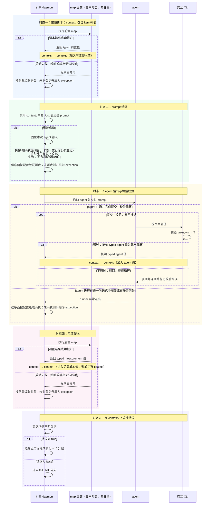
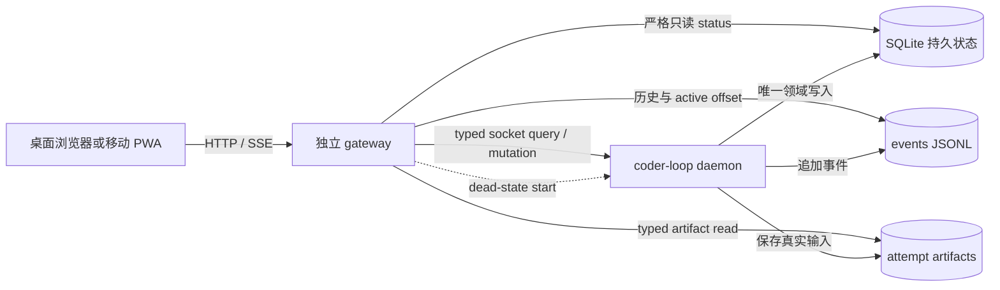
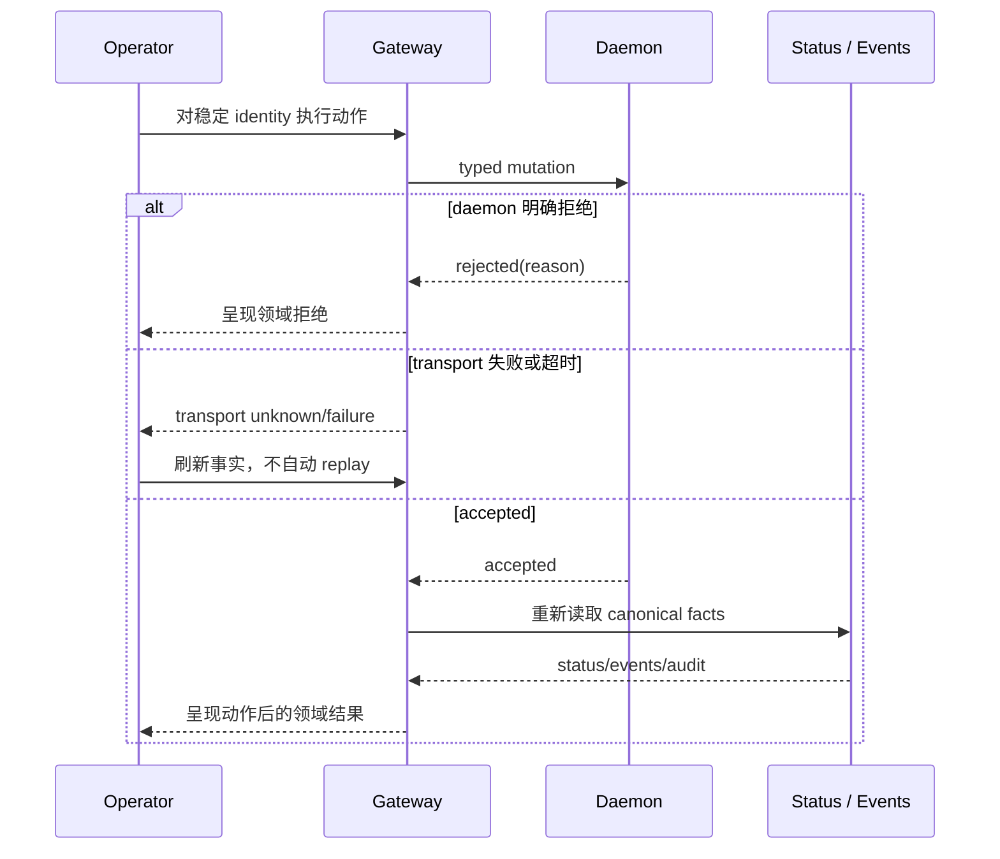
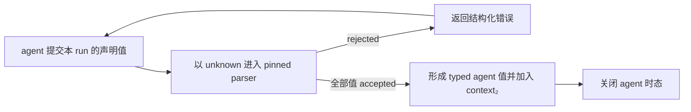
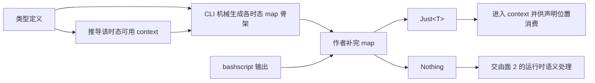
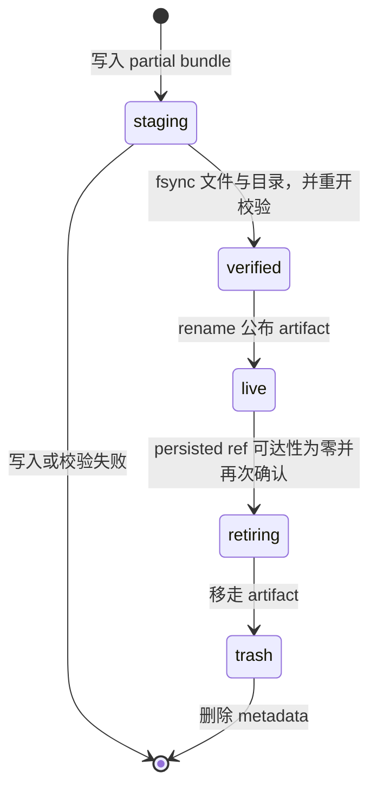

# v3 RFC A 文档合集

# 第 0 篇：v3 公共设计模型

## 0.1 本总纲的地位

v3 正从六篇旧 RFC 重划为八个责任面，但重划不能让各面重新发明一套“值从哪里来、什么时候有效、失败由谁处理”的答案。此前设计的结构性问题，正是缺少共同的时态与领域边界，导致闭包内部的产值、校验和流转事实上浮为 daemon 的 gate、journal 或 finalize 协议。本文先钉住八面共享的公共模型：定义态、函数域运行时、对象域、入站边界、出站边界、hook 与 GUI 都只能消费这里规定的词汇和边界。

本总纲是整个八面方案的词汇权威。标记后的六篇旧 RFC 正文仍是待重写材料，其中与本总纲冲突的部分不构成平行权威；冲突只在其余七个责任面的专属重写轮次中逐篇消解。本轮保留旧正文，不把尚未完成的局部改写伪装成已经统一的规范。

来源：record-3 第 12、19 轮操作员原话；八面定位与本总纲权威范围来自 division-plan.md“面 0”。

## 0.2 纯函数化公理：引擎只推理被提升的值

AI agent 不是没有副作用的函数。它会修改 worktree、调用外部程序、形成 session 内判断，也可能留下日志、进程和 Git 残迹。v3 所谓“纯函数化”，不是消灭这些 effect，而是收窄引擎承认的观察面：只有被明确提升为值的 effect 才能参与 prompt、检查与流转，其余副作用对本次交接语义一律丢弃。

针对 agent 执行及其副作用的提升口只有两个。第一，agent 在运行时向 context 填入声明允许的值，这是 self-report；第二，agent 运行结束后，由声明的脚本测量外部状态并把结果映射为 context 值，这是 measurement。除此之外的副作用并未被物理清除，只是不进入本次交接；以后若要消费，必须重新通过一个声明过的采样与 map 入口提升为值。agent 出生前的前置脚本负责准备函数输入，不构成观察 agent 副作用的第三个提升口。

两口并列不表示二者承受相同的信任。最初由 agent 自陈的“测试已通过”“文件已存在”等信息，只要能够被脚本计算，就应迁移到 measurement；能用测量承载的信息，不再用 agent 断言承载。measurement 接管可计算事实之后，self-report 才收缩到真正不可测量的意图、判断与后继选择。论证顺序不是先信任 agent 再用脚本复核，而是先把可计算边界尽量推远，最后只在测量无法覆盖之处消耗信任。因此，v3 没有让 agent 本身变得可信，而是把信任的消耗压缩到了测量不了的地方。

因此，引擎不根据未提升的文件变化、stdout 文本或 session 内部状态猜测业务结论。它能保证的是值从声明的来源产生、按声明的类型进入 context、在声明的消费位置被读取，并在交接边界得到确定结果；它不能从副作用本身推断 agent “实际上做了什么”。

来源：record-3 第 16、17 轮操作员原话；measurement 接管 self-report 的论证顺序由两轮收敛结论展开。

## 0.3 双域对偶与针眼通道

v3 同时包含两个方向相反的抽象目标。对象域处理 task 之间的真实并发，必须消灭调度时序的业务可见性：互不依赖的动作可交换，已提交事实只增，重复提交按稳定 identity 收敛。函数域处理一个 task 的闭包内部，必须精确刻画时序：前置取值、prompt 组装、agent 执行、后置测量和流转判定按固定顺序发生，前一时态没有形成合法值，后一时态就不能开始。

对象域的结构在 daemon 运行期间生长。task 有多少、何时派生、哪些成员同时存在，只能由运行时的 committed transition 决定，不能在运行前把整棵实例树编译出来。函数域的 preset 声明则是静态文本；它的类型、值来源、map 签名、prompt 消费位置、谓词槽和后继闭集可以在实例执行前形成一个可判的定义。

两域之间只有针眼大小的通道。入口处，对象域把 item 中已经存在的死值交给闭包，形成初始 context；出口处，闭包只向对象域交付 `returned(value) | exception`。闭包内五个时态的中间状态、填值驳回和脚本执行细节不进入 daemon 的任务账本。对象域也不反向解释闭包内部过程，只消费最终交付。

`await` 不构成第二条跨域通道。被等待的 B-check 是对象域中的独立 task，其结果通过 committed transition 在对象域账本内回注；函数域被保留的只是 B 闭包现场这一资源事实。步骤层的中间事实仍未上浮为 daemon 状态。

来源：record-3 第 15 轮操作员原话；针眼两端与 `await` 不构成第二通道为主 session 推导。

### 0.3.1 编译期与运行时的精确边界

编译期能够证明的是声明闭合、签名匹配以及值管道的连通性，也就是可达性：每个声明值有唯一来源，map 的输入输出类型能够拼接，消费位置所需的值存在一条类型正确的来源路径，有限后继和谓词槽得到穷尽处理。这些证明只说明运行时存在合法求值路径，不说明那条路径一定成功。

脚本是否启动成功、是否产出可提升的 `Just<T>`、agent 是否填入合法值、谓词最终为真还是为假，全部是运行时事实。运行时通过边界解析、填值校验和纯谓词求值获得具体结果。全文不得把“某值在类型图中可达”写成“运行时必定得到该值”，也不得因为运行结果仍需求值，就否认声明闭合可以在编译期判定。

来源：record-3 第 3—5 轮操作员原话；“编译期证明可达、运行时产生结果”的精确边界为对这些原话的收敛推导。

## 0.4 五时态与 context 的单调累积

一个闭包的正常交接依次经过五个时态。时态一执行前置脚本，把 item 死值和脚本输出映射成可供 prompt 使用的值；时态二只负责组装 prompt；时态三运行 agent，并在 agent 仍在场时完成填值校验；时态四执行运行后脚本，把测量结果提升为值；时态五在完整 context 上求值纯谓词，并选择正常路由或 fail 路由。

context 单调累积意味着后一个时态保留前一个时态已经形成的全部值，只增加新值，不靠删除或改写旧值改变历史。类型定义为每个值声明唯一来源：item、某个 map 或 agent 三者只能取其一。同名多来源在编译期就是非法声明，不留到运行时决定覆盖顺序。这一结论由主 session 从来源面闭合要求推导，后续类型系统 RFC 应把它落实为明确诊断。

来源：record-3 第 6、11、13、14 轮操作员原话；唯一来源约束为主 session 从来源面闭合要求推导。

### 0.4.1 五个时态的结局归属

异常不按一个全局“失败处理器”分发，而由异常发生时能够触及相应副作用面的在场者消费。程序脚本运行时 agent 尚未出生或已经退出，脚本异常只能由程序面处理；agent 填值错误发生在 agent 仍在场的时态，先驳回给 agent 修正；纯流转判定只对已经存在的值求纯谓词，不再保留“判定不可得”这一额外状态。

| 时态 | 结局 | 当时的消费者 | 对象域最终可观察结果 |
|---|---|---|---|
| 前置脚本 | 启动失败、超时、输出无法映射 | 程序面，按配置级联处理 | 不观察脚本内部状态；若程序面未在闭包内消化，出口为 `exception` |
| prompt 组装 | 缺少可拼接值或组装失败 | 程序面，按配置级联处理 | 不产生 agent run；未被程序面消化时出口为 `exception` |
| agent 运行 | 值缺失、类型错误 | 在场 agent | 不产生对象域 transition；CLI 驳回，agent 在同一时态修正后再提交 |
| agent 运行 | runner 崩溃或在场者消失 | 程序面升层 | 闭包出口为 `exception`，不得伪造成业务返回 tag |
| 后置脚本 | 启动失败、超时、输出无法映射 | 程序面，按配置级联处理 | 不观察脚本内部状态；若程序面未在闭包内消化，出口为 `exception` |
| 流转判定 | 谓词为 false | 声明的 fail 路由 | 产生确定的 fail 流转；只有 NIL 级联最终未消费时才升为 `exception` |
| 流转判定 | 谓词为 true | 声明的正常路由 | 交付 `returned(value)`，由对象域 committed transition 消费 |

这张表描述时态归属，不提前规定每一种程序异常的完整策略 ADT。程序面可以按声明或 operator 全局配置消费异常；只有最终越过针眼的结果才成为对象域事实。

来源：record-3 第 14 轮操作员原话与该轮异常消费者收敛；完整配置 ADT 仍属开放项。

### 0.4.2 两层校验：解析型填值与谓词型流转

填值校验位于时态三，其输入来自 agent，因此信任级别是未经验证的 `unknown`。它的形状是 parser：尝试完成 `unknown → T`，成功才把 typed 值加入 context。zod 或 arktype 在表单校验中的行为是准确类比：字段漏填或格式错误不会废弃整次注册流程，而是把结构化错误返回给仍在场的填写者，允许其原地修正后再次提交。交互 CLI 承担驳回与反馈通道；它不把错误记成对象域失败，也不替 agent 生成值。

流转校验位于时态五，面对的已经是由各边界解析完成的完整 `context₃`，因此信任的是值的类型与来源已成立，而不是 agent 的自陈为真。按操作员原话，它在形状上是“带异常的 map 函数中决定何时抛异常的子函数”；落实到五时态后，这个子函数自身只做纯谓词求值，不再执行脚本。谓词为 false 表示本次流转不能成立，直接进入 fail / NIL 分支，而不是把表单重新退给原 agent。

两层校验因此不能合并。填值校验防止不可信输入进入 typed context，失败后的修复者是仍在场的 agent，当前流程保持存活；流转校验判断完整 context 是否满足声明的交接条件，失败后的去向由 preset 的 fail 路由或 NIL 级联裁定，本次正常流转已经终止。前者回答“这个值能否成为 `T`”，后者回答“这些已成形的值能否共同支持这次流转”。

来源：record-3 第 11 轮操作员原话；纯谓词与异常时态的拆分同时采用第 14 轮收敛。

### 0.4.3 分形交接：一份文法，两个作用域

step 与 task 都存在“执行结束后把结果交给下一段”的动作，因而共享同一个交接合同形状：交付值包，完成必写值解析与声明测量，在完整 context 上求流转谓词，然后得到正常路由或 fail / NIL 结局。两层的抽象对象不同，打包的值也不同，但合同不应因此分裂成两种方言。preset 只需提供一份交接文法，在 task 接缝与 step 接缝两个作用域实例化；同一交接内部仍按五时态串行，而彼此无关的交接只依赖前向、单调与可交换的结果，因此合同本身不要求把可并发实例强行串行化。

共享形状不意味着共享持久性。task 层的前向推进经过 committed transition 写入 daemon 日志，是已经发生、不可撤销且崩溃后必须恢复的历史事实。step 层的前向只是一条执行纪律：现场可以随 worktree 或 session 一起蒸发，也可以整体丢弃并重放；恢复单位是 attempt，不是某一个 step。打包值所在的记账位置不同，决定了同一句“仅前向”在 task 层是历史承诺，在 step 层只是禁止写回退逻辑。

这一区分还要求可见性严格单向。step 粒度的进度、校验与失败不得进入 daemon 账本，否则分形会退化为两层共用一个执法者，重新制造 item/phase 上浮。step 层无论经历多少内部事实，对 task 层只折叠为 `returned(value) | exception`；task 层消费折叠结果，不反向解释或恢复某个 step。正因为合同形状可复用而事实账本不复用，两层才能各自保持前向并发而不互相泄漏调度语义。

来源：record-2 3:23 操作员原话；一份文法、两个作用域以及持久性与可见性差异来自 3:24 的收敛推导。

## 0.5 值管道：定义、提升与双面闭合

值管道由三类定义态资产共同构成：preset 的类型定义说明 context 在各时态应当包含什么；CLI 依据类型生成对应时态的 map 函数骨架，并在注释中枚举该函数运行前可用的 context；prompt 与其他声明消费位置说明哪些值将在何处被读取。map 的基本形态是 `map(context, bashscript())`，而不是把任意字符串输出直接包装成可信值。外部命令先产生 string，map 再结合已有 context 把它解析、检查并提升为 `Just<T>`；只有成功提升的值可以进入后续消费。

编译面进行两侧闭合。来源面要求每个声明值恰有一个来源，并要求所有运行时来源都有签名完整的 map 或 agent 填值声明；消费面要求 prompt 占位符、检查谓词和特殊路由读取都引用已声明且可达的值。没有消费位置的声明值、没有来源的消费值或未补完的 map 骨架都产生 finding；严格模式禁止执行不闭合的 preset。

本总纲只规定值管道的责任分界，不展开 ValueType 的完整递归 ADT、代码生成文件布局、finding schema、publish/pin 或 runtime resolver。这些细节由 #547 的专属重写轮次定义，但不得改变“编译期证明可达，运行时产生结果”的边界。

来源：record-3 第 3—5 轮操作员原话；唯一来源与双面 finding 的精确诊断为主 session 推导。

## 0.6 检查面、路由面与 fail 的 total 语义

产值与检查是两个正交的面。每个 context 值都有一个谓词槽；默认谓词恒为 true，因此没有显式检查时无需生成空代码。显式谓词只在时态五读取完整 context 并返回 true 或 false。检查是否通过不决定下一个 preset 是谁；路由值已经存在也不能绕过检查。任一检查失败时，正常路由值不被消费，执行转入约定的 fail 路径。

“下一个 preset”是特殊 context 值，因为引擎可以在封闭候选集足够小时接管填值。当声明允许的后继数量 `n ≥ 2`，agent 或脚本必须从合法字符串闭集中选择；`n = 1` 时引擎直接填入唯一值；`n = 0` 时发生升层，进入下一个 task 或 chain 结束。这里忠实沿用操作员的“下一个 preset”“失败模式的 preset”用法。

这一术语存在明确的历史张力：v2 中 preset 表示完整工作流，而当前 v3 讨论中的 preset 可能表示任务内部的步骤级定义单元，即任务由 preset 链组成。本文不发明替代名称；两种历史用法在后续正文中必须按上下文标明，最终命名保留为待操作员裁决的开放项。

fail 是一个特殊步骤，而不是引擎硬编码的业务失败枚举。preset 可以显式声明由哪个 fail 节点消费检查失败或程序异常，也可以完全不声明。未声明时由专用 NIL 值补位，依次查找 operator 全局配置中“步骤→任务→组→item”的级联策略；若配置仍未提供消费者，硬默认是抛出异常并停机。这个优先级使 fail 在类型追踪中始终有值，不出现 `undefined`。全局配置的精确 ADT、各层策略的完整枚举和配置文件 schema 仍是待细化项，本总纲不自行补造。

因为 context 可以完全由 item 与脚本形成，步骤不必包含 agent。纯程序节点与 agent 节点使用同一套时态和流转合同；差别只是 agent 时态是否实际实例化，而不是另开一种任务代数。

来源：record-3 第 6—10 轮操作员原话；配置 ADT 尚未裁决的边界沿用 division-plan.md 面 0 与面 2 的责任划分。

## 0.7 Hook 与 GUI 是公共模型的投影

hook 是挂在五时态转换点上的 **effectful subprocess runtime**，独立于既定主流转。它可以执行带外部副作用的脚本，因此“只读”不是它的能力边界；真正的边界是权威。map 由 preset 声明，产值进入 context，并参与主流转；hook 由 operator 声明，执行结果不进入 context，不拥有检查或路由的裁决权，也不产生领域 mutation 的权威。hook 即使改变了外部世界，该副作用也不能自行改写 daemon 账本或冒充 committed transition。后续 hook 责任面只围绕时态锚点、subprocess primitive、进程所有权与审计展开，不再承担 gate 状态机。

GUI 的本体是 context 与副作用的可观测手段。context 面展示被提升并参与交接的值、各时态快照、谓词结果、正常/fail 路径和对象域值账本；副作用面展示未进入交接语义但对人仍有诊断价值的 worktree、进程三证、events、日志和 Git 残迹。GUI 读取这些事实，不重建或美化它们。

观测本体并不禁止 #544 已经定义的有限运维动作。daemon 生命周期操作、unblock 和具备 authority 的 decision 作为附属动作面保留，并与观察面分栏；二者共享稳定 identity，却不共享权威，所有 mutation 仍由 daemon 裁决并回到权威读面核验。

来源：record-3 第 18 轮操作员原话；hook 的 effectful runtime 定位、无领域 mutation 权威与 GUI 分栏控制面来自 division-plan.md 面 6、面 7 的主 session 裁决。

## 0.8 公共词汇

- **对象域**：task、群组、锁、committed transition、消费与运行时生长结构所在的领域；以交换、单调和幂等消除无关调度顺序的可见性。
- **函数域**：单个 task 的闭包内部；以五时态刻画单次交接实例内严格串行的值生产、agent 调用和流转判定。
- **context**：闭包在当前时态已经拥有的 typed 值集合，从 item 死值开始单调累积；不是 opaque 文本库，也不等同于全部副作用。仅供 append/read 的不透明传输通道若不经过声明的解析、提升与消费，就不成为 context，也不占用这个术语。
- **针眼通道**：两域唯一的正式交接边界；入口是 item 值形成的初始 context，出口是 `returned(value) | exception`。
- **时态**：闭包内事实获得有效性的顺序位置；本模型固定为前置脚本、prompt 组装、agent 运行、后置脚本和流转判定。
- **交接合同**：step 与 task 共用的“交付值包—解析/测量—谓词判定—返回结局”文法；在两个作用域实例化，但不共享持久账本。
- **值管道**：类型定义、map 骨架、运行时提升和声明消费共同形成的 typed 数据路径。
- **来源面**：回答每个值由 item、唯一 map 或 agent 中的哪一个产生，并检查其签名与可达性。
- **消费面**：回答声明值在 prompt、检查或路由的哪个位置被读取，并拒绝无来源或不可达的消费。
- **填值校验**：agent 时态内的 `unknown → T` parser；失败驳回给在场 agent 修正，不废弃当前流程。
- **流转校验**：在完整 context 上运行的纯谓词；默认恒真，显式 false 统一进入 fail / NIL，不选择正常后继。
- **路由面**：在检查通过后决定下一 preset 或升层的正交流程；“下一个 preset”是引擎可接管的特殊 context 值。
- **fail / NIL**：fail 是 preset 可声明的特殊处理步骤；NIL 是未声明 fail 时仍然存在的专用缺省值，承接 operator 全局配置级联与最终硬默认停机。
- **self-report / measurement**：agent 自填值与程序测量值两个提升口；可计算事实归 measurement，self-report 只承载不可测量部分。
- **hook**：operator 声明、挂在时态锚点上的 effectful subprocess runtime；有副作用能力，但不参与 context、不裁决主流转、不产生领域 mutation 权威。
- **GUI**：context 面与副作用面的可观测产品，并附带与观察分权、分栏呈现的有限运维动作面。
- **preset（开放项）**：v2 指完整工作流；当前 v3 讨论中也可能指任务内部的步骤级定义单元。本文保留操作员用法，最终命名待操作员裁决。

来源：公共词汇汇总自 record-3 第 6—18 轮、record-2 3:23—3:24 与 division-plan.md 面 0、面 6、面 7；`preset` 命名张力保持开放，未作新裁决。

<!-- 543 -->

# RFC #543：生命周期扩展协议实现了什么，以及为什么必须这样实现

## 一、问题边界：从“能记录事实”到“能据事实控制推进”

coder-loop 的调度内核负责按 preset 推进 chain、item 与 phase，却不应知道“运行几轮后必须检查”“哪些修复完成才可继续”或“某个外部质量标准是否满足”。这些判断属于具体项目和操作员策略。RFC #543 要解决的核心问题，是在不把这些策略写进引擎的前提下，让外部脚本既能观察生命周期事实，也能在受控位置影响调度决定。

这不是普通的回调需求。仅在事件发生后运行一个程序，最多提供通知能力；它不能证明脚本看到了与当前运行实例一致的定义，不能在 daemon 崩溃后说明一次执行究竟是否发生，也不能让“暂停推进”成为可恢复的引擎状态。反之，若允许脚本直接改写 scheduler 内部状态，策略外置就会退化为无边界的内部扩展：不可信输出可能破坏状态机，脚本重放可能重复创建纠正任务，局部故障也会扩散到调度主路径。

因此，本 RFC 的交付对象是一条生命周期扩展协议。它从引擎已经掌握的 typed 事实出发，经声明解析、输入投影、子进程执行、决策解析、持久化消费与统一观测，将外部策略接入调度系统；与此同时，它规定哪些权威仍属于引擎、哪些能力必须由相邻 RFC 供给，以及哪些外部副作用明确不由引擎兜底。

必须先说明现状。main 已经具备 observer 挂点的类型派生、对 `hook.*` 自反订阅的结构排除、gate 决策点闭集、四层声明形状及固定合成次序等基础；global、chain、item 层已有 operator-only 持久化语义，部分 closure 生命周期事实和 chain-complete 指纹也提供了先例。然而，这些基础尚未形成运行闭环：声明视图没有完整的生产与消费路径，observer 与 gate 脚本没有真正执行，hook payload、decision ingress、evaluation journal、具名绑定、script join 与结构化 reopen 均未在当前 main 上完成。下文所称“RFC 实现”指其目标协议与修补后应成立的合同，不把这些目标误写成已经落地的事实。

## 二、为什么已有事件日志和 agent phase 不足以完成闭环

典型需求不是“某次 run 结束后记一条日志”，而是“在特定轮次检查结果，必要时创建检查与修复工作，并在它们完成前阻止原流程继续”。这条链至少跨越三种不同动作：读取运行事实、产生额外工作、作出调度决定。事件日志只解决第一种动作的可见性；普通 agent phase 虽能执行任务，却无法天然代表 scheduler 在某个决策点上的放行权。

如果把检查脚本当作普通 observer，它即使发现问题，也只能旁路执行。scheduler 可能在脚本完成前已经选择下一个 item。把新建检查任务排到较前位置也不能构成正确性保证，因为全局排序不等于“原决策点被扣住”；其他 chain、并发 writer 和重启恢复都可能改变实际选择顺序。真正需要的是一个由 scheduler 承认的 hold 状态：只约束相关 chain 或容器的推进，而不阻塞 daemon 的其他工作。

如果让 gate 的标准输出直接携带任意 mutation，脚本就获得了绕过既有 CLI admission、权限校验和审计的能力。RFC 因而把“创建纠正 item”和“决定是否推进”分开：脚本以 operator 身份通过既有命令面实施 mutation，gate stdout 只返回一个受类型约束的 decision；当 decision 引用既存 correction IDs 时，消费方再校验其归属和合法性。该分离使 mutation 继续服从原有控制面，而决策通道保持窄小、可解析、可穷尽。

上述控制面分离还不足以覆盖执行失败，因为通知与判定承担的调度责任不同。这也解释了 RFC 为何不能用单一 hook 概念覆盖全部场景：前者应当被记录但不得改变调度，后者必须按声明的失败策略折叠为 hold 或 advance。只有先拆开这两种责任，才能分别定义正确的进程所有权、持久化状态与恢复行为。

## 三、声明模型：四层来源如何形成一个可治理的生效视图

在区分 observer 与 gate 的职责后，下一个问题是这些能力由谁声明、以何种顺序生效。RFC 把 hook 声明分布在 global、chain、preset 与 item 四层，并规定生效次序为 global→chain→preset→item。四层不是重复配置入口，而是四种不同治理范围。global 表达整台运行环境的统一要求；chain 绑定某个工作流实例的操作策略；preset 提供可分发的抽象要求；item 则允许对单个工作单元追加局部约束。固定次序使同一决策点的实际执行集合能够被重建和审计，避免调用处各自拼接而产生不同含义。

声明边界使用封闭 ADT，而非任意字符串与 optional-field 集合。ObserverHookPoint 直接从统一 observability 事件词表派生，并结构性排除所有 `hook.*` 事件；因此，新增普通事件能够自动成为 observer 候选，新增 hook diagnostic 则不会意外形成递归订阅。GateDecisionPoint 是显式闭集，因为 gate 不是“凡有事件就能阻塞”：它只能位于 scheduler 真正拥有决定权的位置。closure transition 属于已发生的权威事实，只适合 observer；若需要阻止挂起，应在其前置的 run post-exit 决策点 hold，而不是试图 gate 一条已经提交的 transition。

四层声明必须由 operator 控制。agent 或 preset 授权不能创建、替换或清除 hooks，否则被调度的工作负载可以改变自己的监督条件。此处的责任属于 daemon admission，而非脚本执行器：权限问题发生在声明写入边界；一旦声明通过并进入 durable 生效视图，执行器只消费已授权事实。

当前 main 已落下这部分的主要骨架，但“能解析声明”不等于“声明已有执行语义”。完整协议还要求生产路径实际装配生效视图，status 暴露选中来源与运行状态，并让每个决策点都经过同一个 evaluator。否则，四层顺序仍只是静态结构，无法保证运行中的行为一致。

## 四、Observer：旁路观察为何仍需要严格的进程所有权

声明解析出有效 observer 后，协议才进入真实执行链。Observer 的职责是对统一事件流做匹配，并为每个“事件×匹配声明”建立独立 delivery。它不返回调度 decision，也不能改变触发事件的结果。生产者在调用栈内完成 admission、spawn/error 握手和完整 stdin 写入后即可继续，不等待子进程结束；脚本成功、非零退出、超时或派生 diagnostic 失败均不得反向改变 scheduler 的决定。

旁路并不意味着可以丢弃生命周期管理。daemon 若只 spawn 后遗忘 PID，正常停止会遗留进程，崩溃重启也无法判断旧脚本仍在运行还是已经结束。RFC 因而把 delivery 与 execution attempt 持久化：delivery 表示某个匹配应被投递的一次逻辑责任，execution 表示一次真实启动。同一 delivery 在崩溃恢复时可以有多个 attempt，但每次 attempt 都有独立身份和终态。

正常停止采取有界回收。daemon 先停止接受新的 observer dispatch，等待已有脚本在限定时间内完成；超时后对其进程组发送 TERM，再在必要时发送 KILL，等待 close 并落下权威终态后才关闭相关存储。采用进程组而非单 PID，是因为脚本可能派生子进程；仅终止直接 child 不能证明 daemon 已收回自己拥有的进程树。

崩溃恢复遵循 at-least-once，而非 exactly-once。重启后的 daemon 只处理所有权记录仍悬而未决的启动：先清除它可能遗留的进程组，再履行原来的 delivery。凡是已经写下确定结局的投递，无论结局是完成、脚本报错退出、启动或输入通道失败、达到时限，还是在正常停机中被强制结束，都不会仅因 daemon 再次启动而重跑。这样做消除的是“引擎不知自己还欠哪次投递”的状态空洞，并不声称脚本只会运行一次。

Observer 与 agent 可以共享领域无关的异步 subprocess primitive，但不能直接把现有 agent executor 当作 hook executor。公共 primitive 只处理 spawn、stdio、进程组、timeout、TERM→KILL 和 close；agent 的 slot、phase、session、credential 与 backoff 仍由 agent adapter 管理，observer 的 delivery 与 diagnostic 则由 observer adapter 管理。把领域状态塞进公共层会使两种进程的恢复语义相互污染；复制第三套底层进程代码又会让超时和回收行为漂移。因此，共享的是机制，而不是生命周期模型。

## 五、Payload：脚本看到的必须是固定事实，而非重放时的“最新解释”

进程所有权只能回答“谁负责这次执行”，还不能回答“这次执行依据什么事实”。Observer 与 gate 因而共用一个版本化、typed payload。它由三部分合成：运行实例所 pin 的定义投影、当前 runtime snapshot，以及触发上下文。定义态与运行态来自已有公共 schema/projection，而不是在每条执行路径手写字段；hook assembler 只做选择性投影和封装，不建立第二个事实源。匿名或内部状态槽不能因为“全量元数据”这一表述而原样泄给脚本，GitHub mergedness 等业务事实也不能被注入 L1 引擎 payload。

固定 payload 是 crash recovery 的必要条件。设某个 delivery 在定义版本 H1 下建立，脚本启动前后源路径已经变为 H2。若恢复流程重新解释当前文件，第一次进程和恢复进程面对的就不再是同一项投递，此前的 mutation、decision 与 diagnostic 也无法放进一条因果记录。恢复时必须重用 delivery 建立时封存的输入内容，而不能再次组装；信封以逻辑投递编号连接多次运行，并另行标明这一次子进程运行的编号。

这一要求不能由 #543 自行读取当前 preset 路径来满足。它依赖 RFC-2 提供不可变的 pinned definition artifact、跨重启 resolver 和公共 compile projection。resolver 必须对 missing、corrupt、unsupported version 给出 typed failure，不能静默退回当前路径。物理介质可以是 inline、blob 或其他形式，hash、压缩和 GC 也属于实现参数；#543 只消费“给定 definitionRef 可恢复对应定义或明确失败”的权威合同。若没有这一层，所谓稳定 payload 只是当前进程内的偶然一致，无法跨重启成立。

Payload 的版本字段同样不可省略。外部脚本是独立部署的消费者，schema 演化无法依赖 TypeScript 编译器同步提示。版本化使脚本可以显式拒绝未知形态，也使 execution terminal、decision journal 与审计记录能够指出当时究竟使用了哪一种输入契约。

## 六、Gate：把不可信脚本输出收窄为可穷尽的调度决定

固定输入解决了脚本所见事实的一致性；要让脚本影响推进，还必须把输出限制在 scheduler 能穷尽处理的范围内。Gate 位于明确的 scheduler 决策点，例如 run 结束后的下一步选择、容器 join 或 chain-complete。它执行脚本，将 stdout 在唯一信任升格点解析为 typed decision ADT，再由调度消费。基础词表是 `advance`、`hold` 与容器语境可用的 `reopen`；非容器点只接受与该点相容的子集。非法 JSON、未知 variant、缺失字段、超时和进程崩溃均属于协议失败，必须按声明的 `onFailure` 显式折叠为 hold 或 advance，不能以 default 分支静默放行。

`advance` 表示本 gate 对当前点无阻塞意见，`hold` 表示相关 chain 或容器暂不推进并按退避策略重新评估，`reopen` 则请求容器恢复到一个合法 target 并消费明确的 correction items。Decision schema 不携带任意 mutation。如此划界，是因为 stdout 是不可信字节，而 CLI mutation 已有权限、边界解析和审计；把二者混合会让 gate executor 同时承担命令解释器和调度判定器两种不相容的责任。

同一决策点可能来自四层多个 gate。执行顺序固定，但合成不是“最后一个结果覆盖前面结果”。对只允许 advance/hold 的点，全部 gate 均 advance 才能放行，任一 hold 即扣住。容器点还需要处理 reopen：reopen 优先于 hold；多个 reopen 若指向同一 target，则 correction IDs 以稳定顺序去重合并；若指向不同 target，引擎没有安全的隐式优先级，结果应收敛为 hold 并发出冲突 diagnostic。声明顺序仅用于可重建的执行次序，不能被偷换成业务冲突裁决。

Hold 必须是局部、可见的持久状态。一个 chain 的 gate 不应冻结其他 chain，也不应让 daemon 查询面失效。反复评估还需要 fingerprint：它由该决策点的 typed 评估输入与有效声明派生，排除 gate 自己写入的状态；同一 fingerprint 下已 hold 的输入不应形成无意义的重问风暴，输入变化后才产生新评估机会。Tick gate 还需为每项声明设置独立的正整数最小间隔，避免周期触发退化为高频脚本轰炸。

## 七、身份与 Journal：为什么一次 gate 不能只靠退出码记忆

Typed decision 解决单次解析，却不能独自跨越崩溃窗口；恢复还需要区分“事实发生”“逻辑投递”“实际执行”和“判定消费”。RFC 用四层身份贯穿完整因果链。Transition identity 指认上游权威状态机发生的那一次生命周期转移；delivery identity 指认该事实与某个匹配声明结合后产生的一项逻辑投递责任；execution identity 指认履行这项 delivery 时某一次真实的子进程尝试；evaluation identity 则指认 scheduler 围绕某个决策点开展的一次判定事务。四者不能互代：同一 transition 可以匹配出多个 deliveries，一项 delivery 可以因恢复产生多个 executions，而进程运行次数也不能证明某项 decision 已被消费。Epoch 与 fingerprint 都从属于 evaluation：前者划分 decision 消费后的判定代次，后者刻画该代次所见评估输入是否发生变化；它们是判定的两个维度，不是与上述四层并列的新身份。

若只有子进程退出码而没有 durable evaluation journal，daemon 可能在几个关键窗口崩溃：脚本已创建 correction item 但尚未返回 decision；decision 已解析但尚未写盘；decision 已写盘但其引擎内 effect 尚未消费；effect 落了一半但 consumed 标记未提交。重启后重新运行脚本既可能重复 mutation，也可能让脚本基于新状态改判，使旧 correction 失去归属。

Journal 因而以 `evaluating | decided | consumed` 之类的封闭状态记录权威 evaluation identity、decision 与待执行的引擎内 intent。Spawn 前必须先建立可恢复身份；decision 与 pending intent 之间有明确的原子边界；decided 但未 consumed 的记录可在重启后继续消费，而不要求原触发事件再次发生；只有消费完成后 epoch 才递增。这里不规定具体是 outbox、表还是 consumer 拓扑，要求的是每个崩溃窗口都有唯一、可穷尽的恢复后果。

Gate 脚本经 CLI 创建 mutation 时携带 evaluation scope。Admission 层把规范化 mutation key 与首次响应持久化：同一 epoch 内的重放返回第一次结果，而不是再次创建相同 item；普通 operator 命令继续维持既有语义，不被强行纳入 evaluation 幂等协议。`item.created` 等审计事实也应携带 scope，从而能追踪某项纠正工作由哪次判定产生。

这种设计仍不承诺非确定脚本没有孤儿 effect。脚本可能在留下某个外部动作后崩溃，也可能创建了最终 decision 未引用的 correction。Journal 能保证引擎拥有的 mutation、decision 和消费效果可恢复、可审计；它不能回滚任意外部世界，也不能把判定主体变成 exactly-once。

## 八、具名 Gate：可分发 preset 与本机脚本之间的接口边界

前述 evaluator 以已解析的 gate 为输入，但可分发配置还面临抽象要求与本机实现分离的问题。Preset 需要表达“这里必须经过某项策略检查”，但可分发的 preset 不能嵌入某台机器的绝对脚本路径。RFC 以具名 gate 把需求与供给分离：preset 只声明 gate 名、决策点以及 required/optional 性质；global 或 chain 层由 operator 提供名称到脚本、timeout 与 onFailure 的绑定。

绑定解析是穷尽三态。已绑定时，选中的脚本作为 preset 层成员进入统一 gate evaluator，不产生专用执行路径；optional 未绑定时显式空过并留下可观测 skip；required 未绑定时，新实例在创建边界被结构化拒绝，已存在的 pinned 实例在恢复时进入可见 hold。Required 不能在 compile 时依赖某台运行机器的绑定，也不能在重启后暗中降级为 optional。

同名绑定采用 chain 覆盖 global 的配置语义，实际只执行一个 effective binding；status 同时显示 selected 与 shadowed source，以便解释脚本为何来自某一层。它与 global、chain 自己声明的普通 hooks 是两种角色：前者为 preset 接口提供实现，后者是该层直接添加的行为。若把两者混为一组依次执行，覆盖语义会被错误地变成叠加语义。

这项机制由声明/装载层负责，而非 subprocess primitive 或 scheduler 决策合成层负责。路径可分发性、绑定优先级和缺失语义都发生在“抽象需求如何解析为有效声明”的边界；执行层只应接收已经解析完毕的 gate，不应了解 preset 来源。

## 九、Script Join 与 Reopen：脚本判断如何接入容器推进

具名绑定使脚本能够进入统一 evaluator；容器 join 则是这一判定协议必须接入的关键调度接缝。容器的成员全部 terminal 并不必然意味着外层 seq 可以推进。并行批次可能需要质量判定，chain-complete 也可能需要外部条件确认。RFC 因而为 join 判定器增加 script variant，使脚本与 agent-phase validator 共用同一 decision ADT、同一派发路径和同一 reopen consumer，而不是形成第二套容器状态机。

Script join 的输入仍来自统一 payload，输出仍经唯一 decision parser。Advance 放行容器，hold 扣住并按 fingerprint/退避重新评估，reopen 则引用脚本此前通过 evaluation-scoped CLI 创建的 correction IDs。脚本若需要检查 GitHub mergedness，应以 operator 身份调用 GitHub 能力自行查询；L1 引擎不拥有这一业务事实，也不应为了某个判定器向 payload 加入 GitHub 字段。

Reopen 不能由 #543 通过“改几张表”自行完成。一个合法 reopen 必须判断 target 是否属于当前容器、是否位于允许回退的 seq、是否已经运行，校验 correction IDs 的 membership 与 claim，解析并消耗预算，回退游标，同时保持已经 terminal 的 item 状态不变。Target reopen、cursor/budget 更新、correction claim 与 decision consumed 必须全有或全无；重复、冲突、预算耗尽和崩溃恢复也需要 typed 结果。

这些权威属于 RFC-1 的 structured reopen authority。#543 递交的是可归属到一次 evaluation 的判定、未由本层解释的 target，以及 decision 明确点名的既存 correction IDs；权威 consumer 返回结果后，#543 才推进自己的 journal。它不能用 metadata carrier 或连续若干次 CLI mutation 拼出一个貌似原子的 reopen。类似地，closure 的 create、run-spawn、run-exit、suspend、reopen、consume 六条 canonical transition 也由 RFC-1 确定发生时点、当时的 snapshot 与 transition identity。这里的 transition identity 正是§七四层因果身份的起点；observer 从该身份派生 delivery，不能拿 delivery identity 反过来充当生命周期边的去重依据，也不能从现有五类主题性 `closure.*` 事件推断缺失的权威转移。

## 十、可观测性：让扩展协议本身也成为可调查对象

执行、判定与 reopen 形成闭环后，协议还必须暴露自身行为，否则恢复保证无法由操作员核查。Hook 系统若只在成功时留下脚本输出，就无法回答最关键的运维问题：脚本是否启动、收到了哪个 payload、为何超时、哪个 gate 扣住了 chain、重启后是重新执行还是继续消费旧 decision。RFC 因而要求 `hook.*` lifecycle、decision 与 diagnostic 进入统一事件边界，并在 status 中投影有效声明、当前 hold、选中绑定及评估状态。

Observer execution 的 durable terminal record 是 diagnostic 权威。统一事件由该记录派生；若 daemon 在“终态已提交、事件尚未追加”之间崩溃，重启后可以补做派生。相反，事件追加成功但标记未完成时允许重复派生，重复记录用稳定 execution identity 关联。事件流不是第二权威，也不要求 sink exactly-once。采用这一方向，是因为进程结果属于 execution 生命周期，而事件只是面向调查者的投影；若先把事件当权威，sink 故障会错误地改变 delivery 状态。

Gate 的观测还需包含 decision、协议违规、onFailure 折叠、hold、fingerprint 命中、重新评估、journal 状态转移与重启恢复。这样，“为什么没有继续”“为什么没有再次插入 item”“为什么 required gate 没执行”都能从 status 与事件因果链回答，而不必猜测内存状态。

所有派生的 `hook.*` 事件必须在声明期和发射期双重零自反。声明期使递归订阅不可表达；发射期即使面对旧数据或边界绕过也不得再次派发 observer。若缺少后一层，一次失败 diagnostic 仍可能触发同一失败脚本，形成无限的进程与事件风暴。

## 十一、并发、外部副作用与当前仍未解除的依赖

可恢复与可观测并不等于引擎接管脚本触及的外部世界。RFC 允许不同脚本并发，也允许同一脚本跨事件、chain 和连续触发并发。每个 match 都形成独立 delivery，不因为脚本名相同而合并、跳过或串行。引擎提供稳定 identity、固定 payload、自有状态的持久化、局部 CLI 事务与审计关联，但不提供 per-script lane、全局串行、跨脚本资源锁或外部分布式事务。

因此，脚本对文件、Git、数据库和第三方服务造成的并发冲突由脚本作者负责。目标系统若提供幂等 key、CAS、锁或事务，脚本应自行使用；若不提供，引擎不会伪造 exactly-once。特别是在 observer crash 重派和 gate 判定重问中，同一逻辑责任可能产生多次外部调用。将这些 effect 纳入引擎回滚既需要理解资源协议，也会把项目业务语义带回 L1，违背本 RFC 的策略外置边界。

Gate 或 daemon 生命周期一旦决定进入 held 收敛阶段，待排空集合就必须停止增长。若 socket 仍接受 mutation、scheduler 仍建立工作、observer 仍产生 delivery，排空过程会不断获得新成员；与此同时，存储关闭可能与新 intent 的提交交错，使一项已获接纳的工作最终没有 durable outcome。查询必须继续开放，因为 operator 需要借此定位 hold 的来源、观察 drain 进度，并取得解除 hold 所需的事实；这不是把读权限等同于写权限。

`shutdown-held` 因而只让读取路径继续服务。新的 mutation、调度工作和 observer 投递在进入执行前即被 typed reject，已经接受的工作则按 drain 规则走到可记录结局；一次拒绝不能顺带写 DB、追加事件或启动进程。调用方若要再次提交被挡下的 mutation，必须自行发起新的请求，引擎不会因 held 解除而代为补交。

截至 expected foundation（即本 RFC 开工时预期由相邻 RFC 提供的地基合同）复核，三组外部能力仍是 external blocker，即缺失时无法诚实宣称相应协议闭环完成的外部依赖。第一，RFC-2 的 pinned definition artifact/resolver 与公共 compile projection，阻塞跨重启固定 payload 及具名声明的可靠解析。第二，RFC-1 的 canonical closure transitions，阻塞六条资源转移边的权威 observer 触发。第三，RFC-1 的 structured reopen authority，阻塞 target、claim、budget、cursor 与原子 reopen effect。它们只阻塞相应完成主张，不授权 #543 建立临时替代品。与此同时，外部文件或服务的幂等能力不是 external blocker，而是明确排除在引擎保证之外。

还需区分预期合同与已证明的运行事实。Observer 的 spawn/ownership kill-point、固定 payload 重派、进程树回收、diagnostic replay，gate 的 transaction crash matrix、metadata 并发 mutation、`shutdown-held` admission，以及 RFC-1/RFC-2 接缝都尚需在真实路径上验证。静态 ADT、声明测试或局部 transaction 先例不能证明这些跨进程与跨重启性质已经成立。

## 十二、结论：扩展能力的价值来自边界组合，而非脚本数量

RFC #543 最终改变的不是“系统可以多运行几段脚本”，而是 coder-loop 对外部策略的承载方式。Observer 把已发生的生命周期事实送到旁路消费者，gate 在引擎拥有决定权的位置接受受限判定；共享 payload 保证判断基于固定、可说明的输入，分层 identity 与 journal 使崩溃恢复具有确定后果，四层声明和具名绑定把治理范围与可分发接口结合，script join/reopen 则把容器判定接回 RFC-1 的权威状态转移。统一 observability 使这条协议本身也可以被查询、审计和复盘。

这些机制必须组合出现。没有 observer/gate 分离，通知故障会污染调度或决策失去阻塞力；没有 pinned payload，同一 delivery 的重放会改变问题本身；没有 evaluation journal，decision 与 mutation 在崩溃窗口中无法归属；没有具名绑定，preset 要么携带本机路径，要么只能留下无执行语义的名字；没有 RFC-1 authority，reopen 就会成为跨表的非原子猜测；没有外部 effect 边界，引擎将被迫理解 GitHub、文件和数据库的业务事务。

协议的可靠性因此来自职责精确，而非保证无限扩张。引擎保证自己拥有的声明、投递、评估、decision、admission 和状态消费可类型化、可恢复、可审计；脚本负责其策略和外部副作用；RFC-1 与 RFC-2 分别提供任务生命周期与固定定义的权威事实。正是这种分工，使业务策略能够留在引擎之外，而调度决定仍然保持为引擎内部受约束、可证明的状态转移。

<!-- 544 -->

# RFC #544：把 coder-loop 变成一个人可以独立判断和处置的系统

## 1. 从一次值班事故开始

设想操作员在手机上收到一条消息：某个 chain 很久没有继续推进。他现在有几个问题，但没有一个能靠“daemon 进程还在”回答。

他不知道 daemon 是健康、半死还是已经退出；不知道 socket 文件是活连接还是陈尸；不知道 chain 是被 rate limit、gate hold、失败 attempt 还是 operator decision 卡住；不知道最后一次 attempt 实际拿到什么 prompt；也不知道此刻按 resume、unblock 或 restart 是否合适。

在 RFC #544 之前，解决这些问题往往意味着再启动一次 agent 调查。调查者寻找 session、读日志、检查进程、比较数据库与文件，再把若干局部现象解释成一段结论。这个流程有三个结构性缺陷。

第一，操作员看到的是解释，不是原始事实。调查可能选错 run，或者把 worktree、git branch、pidfile 之类的旁证误当成领域状态。

第二，调查会受到时间漂移。当前 preset、当前 item 和当前文件不一定等于某次历史 attempt 当时看到的输入。事后重建出来的 prompt 可以语法正确，却仍然不是当时发送给 runner 的文本。

第三，观察入口依赖被观察对象。daemon 崩溃时，任何依赖 daemon RPC 的“监控”都同时失效；浏览器连接失败也无法告诉人究竟是 daemon 死亡、gateway 不可达还是 mesh 断开。

因此，这个 RFC 并不以“有一个 Web 页面”为完成条件。它要改变操作员获得事实的方式：无需 agent 代查，能够从一个仍然存活的入口识别故障域、沿稳定 identity 进入具体执行、阅读真实输入、执行有限动作，再从权威读面确认结果。

全文用四个设计命题说明为什么要实现这些能力，以及这些能力具体是什么：

1. 证据必须比被观察进程活得更久；
2. 观察不能修改、重建或美化事实；
3. 观测与控制必须共享 identity，但不能共享权威；
4. GUI 的价值由完成诊断闭环所需的时间衡量。

## 2. 命题一：证据必须比被观察进程活得更久

### 2.1 为什么 gateway 必须是另一个进程

将 HTTP server 放进 daemon 看似减少了组件，却让观察面和执行面共享同一个故障。daemon 一旦因未捕获异常、runner failure 或资源问题退出，页面、API 和实时连接也一起消失。此时浏览器只能显示“连接失败”，而无法说明 daemon 是否留下持久状态、最后事件或崩溃线索。

RFC #544 实现一个独立的 TanStack Start/Bun gateway。它与 daemon 同仓、同版本演进，但不与 daemon 共生命周期。gateway 负责静态资产、server routes 和 SSE；daemon 负责调度、领域写入和 mutation 裁决。

这项分离必须在两个方向都成立：

- daemon 已死时，gateway 仍能打开页面、读取持久状态、查询历史事件并提供 dead-state start；
- gateway 被关闭时，它此前启动的 daemon 继续运行，不被父子进程关系或信号转发带走。

gateway 不是新的 daemon，也不是通用 supervisor。它不会自动守护、循环拉起或制定重启策略。它只实现操作员明确触发的 start、stop、restart，并用外部证据判断动作之后发生了什么。

### 2.2 为什么不能只有一种数据通道

把所有读取都做成 daemon RPC，会在 daemon-down 时失去最有价值的证据。反过来，让 gateway 直接扫描所有 runtime 文件，又会绕过领域 owner，逐渐形成第二套状态解释器。

所以系统按事实的生命周期分成三个面。

**持久状态面**保存队列、chain、item、run 和 task tree 的最后持久事实。gateway 通过 engine-owned strict reader 读取 SQLite，不持有写连接，也不实现自己的 SQL 投影。

**事件面**保存过程事实。gateway 读取主 events segments 的历史与 active byte offset，把新事件推送给浏览器。daemon 退出后，既有历史和最后事件仍在，已建立的 SSE 连接也不因 daemon 退出而自动关闭。

这里真正获得“直接刮 runtime 文件”特许的只有 events JSONL，因为它已被钉成 gateway 的同仓消费合同。attempt artifacts 由专门的 artifact owner/path boundary 提供，pidfile 与 socket 也只按三证探针合同读取；它们不是 events 豁免的扩张。其他 agent、supervisor 或脚本仍不得把任意 runtime 文件当公共 API。

**瞬时控制面**处理 daemon 当前可回答的查询和写动作。它使用 typed socket transport。daemon 不可用时，该面应给出精确失败，而不是从数据库旁路执行同一个动作。

三个面在 UI 中可以互相跳转，但它们没有一个共同的全局时点。SQLite snapshot、活性探针与事件文件各自保留采样时间。系统不会为了让页面“看起来一致”而声称跨 SQLite、文件和进程的原子世界状态。

### 2.3 一个 gateway 只能观察一个 root

进程独立还不够。如果同一个 gateway 可以由 request 参数切换 loop-data root，一个浏览器请求就可能读到另一个环境，identity、监听面和缓存也会失去固定含义。

因此 gateway 在启动时解析一个 loop-data root，并把它存入不可变的 typed runtime context。URL、query、body、header 和前端状态都不能覆盖、枚举或逃逸这个 root。切换 root 的唯一方式是启动另一个明确配置的 gateway 实例。

这个不动点同时约束所有路径：status、events、attempt artifacts、daemon pid/socket 和 gateway 自己的诊断都必须来自同一个 root。它不是 UI 默认值，而是进程级隔离边界。

### 2.4 宿主、静态资产和监听必须形成一个生命周期

gateway 作为一个产品进程，对外提供四个稳定的 root 级命令：`gateway:start`、`gateway:build`、`gateway:typecheck`、`gateway:test`。生产进程由同一个 owner 管理静态资产与 routes；不会再启动第二个静态文件 server。

静态资产处理先于业务 route，并拒绝 traversal、目录和非文件路径。多个显式 listener 共享同一 handler 和同一 PID。若任一必需 listener 启动失败，整个 gateway 启动失败并清理已经建立的 listener，不能留下“本机可用、mesh 半失效”的半就绪实例。

监听集合只包含 loopback 与明确的 NetBird interface address。不存在 `0.0.0.0`、`[::]`、LAN fallback 或公网入口。NetBird 地址漂移时更新配置或重启，而不是放宽监听。

停止时，对捕获的 gateway PID 发送 `SIGINT`，等待进程退出，并确认所有 listener 都消失。这个闭环确保运行手册描述的对象就是生产进程，而不是一个遗留子进程或另一个静态 server。

## 3. 命题二：观察不能修改、重建或美化事实

### 3.1 严格只读是一种证据资格

如果 status reader 在打开数据库时创建 WAL/SHM、改变 journal mode、执行 migration 或写入 metadata，它就改变了自己正在观察的现场。在 daemon-down 排障中，这尤其危险：读取动作可能覆盖原始故障条件，也可能改变之后 daemon 重启时看到的 schema。

RFC 实现一个 engine-owned strict status 入口。它从打开到关闭都保持只读，不创建数据库或 sidecar，不执行 DDL、migration 或写 PRAGMA。live-WAL 与 daemon-down 两种状态都要经过同一个合同。

读取结果不是 `ok | missing` 两种。缺盘、权限、损坏、旧 schema、未来 schema 和合法 snapshot 都是可穷尽的结果。错误发生在打开、读某张表或组装 tree 的不同阶段，不应让同一个根因换一种领域含义。

一次 status 中的 SQLite 槽来自一个 read transaction。即使 daemon 正在提交，chain、items、current、runs 和完整 task tree 也只能整体属于提交前或提交后。系统不会从 process、worktree 或 git 旁证补造缺失 identity。

### 3.2 最终 wire 才是消费者依赖的对象

内部对象通过一次断言，不等于最终 JSON 已被证明。如果 serializer 在断言后 flatten 字段、合并 extra 或删除 `undefined`，CLI 和 HTTP 消费者实际收到的是另一个对象。

因此最终 `status --json` 与 gateway HTTP response 共享一个 engine-owned exact boundary。public wire 本身必须通过它。顶层与每个嵌套槽都有精确 shape；有限状态用 discriminated union；task tree 使用 CAP-1 的 leaf、seq、par variants；hook 与 CAP-4 的 producer shape 就绪后也必须进入同一公共 boundary。

前端类型、route result 和 CLI 输出从这一 boundary 派生。public wire 通过验证后不得再发生结构改写。这样，新增 variant 会在所有消费者上形成编译工作清单，而不是被匿名 `object` 或 default 分支吞掉。

这条规则不只适用于 status。status、socket RPC、events、attempt artifacts、compile、context、mutation 与 CAP-4 都必须从各自 owner 的 runtime boundary 派生类型。禁止 `any` 和匿名 domain shape；`unknown` 只允许短暂存在于 catch 或外部 parse 入口，并立即由精确 parser 收窄。除 `as const` 外，不用类型断言跨过已经断裂的类型链。

gateway 也不能为了接入方便复制 schema、command registry、framing、parser 或状态推断逻辑。依赖方向始终从 gateway 指向 engine/CAP owner；engine `src/` 不 import gateway，也不出现 UI route、组件或显示文案等 GUI 概念。否则观测面会反向污染被观测的领域层。

### 3.3 Hooks 的当前事实与过程事实不能混在一起

操作员看到 chain 没推进时，需要区分“没有 worker”与“正在等待 hook/gate”。status 因而提供四层 hook 声明合成后的 effective view，并标明每项来自 global、chain、preset 还是 item。gate hold 需要显示 decision point、开始时间，以及下一次重问或继续判断所需的节奏线索。

当前 effective view 属于 status；`hook.*` events 属于过程。二者通过 owner-defined hook identity 关联。GUI 既不重新执行四层合成，也不从事件历史倒推 current hooks。chain 详情展示完整有效配置，首屏异常区只提取当前 hold 和影响推进的关键信息。

### 3.4 活性证据必须保留原始分歧

界面所称的 daemon“三证”不是约定俗成的一个健康检查名称，而是三次分别发生、分别计时的观察。

第一项从 pidfile 开始：文件是否存在、内容能否解析、对应 PID 在采样时是否仍有进程。用 signal probe 检查进程活性是一种可用观察，但合同要求保留的是原始分类、errno 和采样时间，而不是把 probe 的布尔结果当作 daemon 健康。

第二项只问 Unix socket 能否建立连接。它不推导 endpoint 会读取请求、完成 framing 或返回合法领域响应。

第三项发送带 request id 的 `daemon.status`，要求在 deadline 内收齐一个 envelope，验证 id 相同，并把 result 解析成精确类型。超时、EOF、半包、非法 envelope 和 daemon 返回的错误都不是成功响应。

这三项不能互相覆盖。pidfile 缺失但 RPC 成功、PID 存活但 connect 失败、connect 成功但 RPC 卡住，都要原样呈现，并附各自时间和失败原因。只有这样，首屏才不会把最有诊断价值的半死状态压成红绿灯。

### 3.5 Events 必须保存过程，而不是伪造一条完美日志

假设 daemon 在一次 size rotation 附近退出。页面至少要回答三个不同的问题：已经写入主流的最后一条是什么，是否留下 stop/fatal 或崩溃线索，以及哪些异常与当前 chain/run 有关。它不需要把几个物理文件重新包装成一份“绝对真相日志”，但也不能因为来源不同就让这些证据在界面上消失。

为了守住正常路径，普通、timer 与 fatal 写入口共享写入所有权；day/size 翻段分配唯一 segment，并把触发翻段的那条记录写入可发现的文件。该保证止于正常 append 和 rotation，不延伸到掉电、任意 kill point、fsync 或 crash journal。

读取端扫描已封存段并跟踪 active file 的 identity 与 byte offset。文件通知只唤醒检查，不能代表“恰好来了一个事件”。浏览器可按 chain、item、runId、phase 与时间窗口查询历史。offset 只在当前 reader 生命周期中维持翻段连续性，不对外承诺 replay，也不在 gateway 重启后恢复旧订阅。

若交付范围内的真实历史暴露坏行、尾部 partial 或旧 payload，reader 要给出明确结果，并只为已经证实的格式建立最小兼容。合成非法输入仍用于验证 parser 拒绝；“以真实样本决定兼容范围”并不禁止负例 fixture。没有实际代际证据时，不预建通用版本迁移系统。

UI 将可回答的问题而不是物理文件名放在前面：事件历史、最后进展、已知死因、崩溃诊断与点名异常各自标来源。它不会声称这些来源共享全局顺序或完整因果。

### 3.6 SSE 的失败边界属于 gateway，而不是 daemon

SSE 已建立后，daemon 停止只意味着暂时没有新主事件；连接和历史查询仍可使用。浏览器断开时，watcher、reader、offset、interval 与 subscription 都应立即释放。close/enqueue race 不得杀死 gateway，断开后新的 API 与 SSE 请求必须仍可建立。

这项实现保证的是连接生命周期与资源回收，不是消息系统语义。它不提供离线队列、客户端确认、replay 或 exactly-once。

### 3.7 历史 prompt 不能靠现在重新计算

某次 attempt 的真实输入由当时的 pinned definition、item 状态和 bindings 共同决定。当前 preset 即使同名，也可能已经变化。GUI 若事后调用 renderer，会生成一份新的文本并把它错误地展示成历史事实。

每次 fresh、普通 resume 和 chain-complete finalizer attempt 都保存 `prompt.md` 与 `bindings.json`。runner argv 与 `prompt.md` 使用同一个 effective prompt；bindings 记录每个 key 的来源和当次 render string；resume 记录其 variant 和续接 session。finalizer 的固定“继续”只属于该特例。

prompt 与 bindings 都完整、属于同一 attempt identity 时，artifact 才是 present。写入失败不能阻止 runner，但要留下与 attempt 关联的 diagnostic。legacy missing、write failed、incomplete 和 parse failure 分开表示，页面不能用空文本或当前重建值填补。

spawn、retry 和 daemon restart recovery 按完整 CAP-2 identity 解引用 pinned definition，不重读当前路径。RFC 不规定 TTL、永久保留或具体 GC 算法。CAP-3 的 typed value 只能作为现有 scalar render string 上的 additive evidence，具体字段由其 owner 定义。

artifact 通过独立 typed route 读取，不进入 status 正文。页面逐字显示 prompt 和 bindings 对照，不做 Markdown 渲染、插值或重放。

### 3.8 Current compile 与历史执行回答不同问题

历史 attempt 页面回答“当时发了什么”；compile 页面回答“如果现在选择这个 preset，编译器认为什么”。同一个 definition 名称出现在两处，并不让两种时间语义变成一回事。

用户选择 preset name 后，gateway 调用 CAP-7 与 CLI 共用的编译路径。一次 refresh 只接受一个带 schemaVersion 的 artifact；状态图、phase tree、variables、tools、fragments 与 findings 都从这一个结果展开，不能各自重新编译。

失败页面必须避免提供“看起来差不多”的图。如果编译器明确 rejected，就展示 findings 与拒绝；如果 artifact 版本超出 consumer 能力，就显示实际版本并停止；如果 boundary 非法或 transport 失败，就说明失败发生在传输/解析而不是 preset 语义。任何一种都不能拿上一版缓存或 partial block 冒充本次成功。

GUI 不读取 TOML，也不实现第二个 compiler。该页面没有历史 pinned 入口或 current/pinned 双视图；历史执行证据仍由 attempt artifact 提供。

### 3.9 Context 必须保持不透明

context 页面展示的是旁路证据，不是新的控制语言。它从 daemon 的 operator read 入口消费 CAP-6，按 item 谱系、chain 公告和 group 分支组组织内容。entry 的 identity、时间、scope 与 author 由 upstream boundary 定义，body 保持不透明；分页和过滤也沿同一合同流入 gateway。

一段 body 即使长得像 Markdown 命令、状态更新或系统提示，也只能作为原文显示。前端不解释它、不直读 store，也不根据数据库内部字段发明 cursor。

获得 read 能力并不授予 write protocol 所有权。上传会话怎样跨重启、重复 commit 怎样处理、事件与数据库怎样协调、多久保留，都仍属于 context producer 的问题。RFC #544 只要求成功持久化的 entry 能通过正式读面到达浏览器。

## 4. 命题三：观测与控制必须共享 identity，但不能共享权威

### 4.1 没有稳定 identity，钻取只是页面跳转

当一个人把 run 页面 URL 发给另一位操作员，两人必须定位到同一次执行，而不是各自浏览器里的“当前 run”。这要求 URL 从 daemon、chain、item、run 一直到 phase/attempt 都携带明确 typed identity。解析结果要能说明对象存在、已经消失、已过期，或根本不属于 URL 所写的父对象；显示名、数组位置和当前选择都不能替代 identity。

task tree 直接消费 CAP-1 的 leaf/seq/par union，穷尽展示 join、reopen、closure lifecycle、branch 与 session identity。新增 variant 必须暴露编译缺口。v2 线性 chain 使用 producer 提供的退化树；前端不会复活 slot 或从 worktree/git 重建树。

event envelope 的 chain、item、runId、phase identity 用于跳到对象；对象页面用同一个 typed filter 反查事件。它们共享 identity，但不因此共享存储事务或时间顺序。

### 4.2 Socket transport 不能把“不知道”压成失败

status query、context read 和控制动作共用一条 transport 地基，但它们不能共用一个宽松 JSON 结果。command registry 决定 command、args、result 与 error 的对应关系；gateway 从该 registry 派生 client，不复制命令字符串、framing 或 response parser。

一次调用必须在 deadline 或 caller cancel 内结束。到期时 client 主动销毁底层 socket，不能只是放弃 await 而留下连接。connect failure、EOF、只收到半个 frame、非法 envelope、response id 不匹配、daemon 明确拒绝，以及 mutation 已发送但响应未知，必须保持不同类型。

这种区分直接影响人是否可以重试。daemon 的领域拒绝表示动作没有被接受；transport 未确定则可能已经提交，页面只能刷新权威事实，不能自动再发一次。反过来，protocol error 也不能被包装成普通业务拒绝，否则 parser 漂移会看起来像用户操作错误。

### 4.3 写面只覆盖诊断闭环需要的动作

GUI 的动作按目的分成三组。恢复观察对象时可以 start、stop 或 restart daemon；调整既有工作时可以 unblock、暂停/恢复 chain 或重排 item；遇到 evaluation 时，只在 capability 允许的情况下提交 `advance`、`hold` 或 `reopen`。

这三组动作构成完整闭集。创建 chain、添加 item、batch 和其他 daemon command 不进入 Web，新命令也不会自动获得 route。除 dead-state start 由 gateway 从外部拉起 daemon 外，其余 mutation 都经过 engine-derived typed façade。

gateway 沿既定 mesh 信任模型作为 operator 发起调用，但 daemon 仍是合法性裁判。页面不复制 target、状态转移或 authority 判断，也不以 agent credential 模拟 operator。

每个动作区分 accepted、rejected、failed 与 transport 未确定结果。accepted 后，从 canonical status 读取核心状态，从相关 events/audit 获得诊断证据。这个要求不等于跨 SQLite、process、events 和 response 建立共同 commit，也不要求 durable operation、query/replay、outbox、saga、command log 或 exactly-once。

### 4.4 Decision 不是另一种 resume

CAP-4 evaluation 由 par/epoch identity 及 binding version 关联，decision 是 `advance | hold | reopen` ADT。页面先查询当前 operator 对该 evaluation 的 capability，只展示允许动作；没有 capability 时显示 authority gap。提交时 daemon 再检查 currentness。

accepted decision 由真实 evaluator 消费。status、event 和 audit 引用同一 evaluation identity、operator 与 decision。resume、unblock、修改 join 或 reopen count 都不能替代 decision；GUI 也不能因为自己是 operator 就自授 capability。

### 4.5 成功必须回到权威读面

一次按钮点击可能完成 transport，却被 daemon 拒绝；也可能 daemon 已接受，但客户端在响应前断线。页面必须让这些情况保持不同。

真正的诊断闭环是：动作请求携带稳定 identity，daemon 给出 typed 结果，页面再从 canonical status 和相关 events 观察变化。若结果未确定，就明确显示未确定并允许人刷新事实；不自动重放可能已经生效的动作。

## 5. 命题四：GUI 的价值由诊断闭环时间衡量

### 5.1 首屏先回答“要不要处理”

首屏不是总览所有数据，而是压缩操作员的第一次判断。它同时显示三项 daemon 证据及采样时间、active runs、最近转移、rate-limit 冷却、当前 gate hold、点名异常、最后事件和已知死因线索。

daemon dead 时，gateway 仍显示 SQLite 终态、events 历史和诊断来源；mesh 断网时，gateway 本身不可达。两者不能共享同一个“离线”标签。

无证据时显示未知，不根据最后时间戳或进程退出码编造死因。首屏提供下一步入口：进入受影响 chain、查看 attempt 输入、阅读相关事件，或执行当前可用的有限动作。

### 5.2 深入页面按问题而不是按文件组织

chain 页面解释当前状态、task tree、active run、effective hooks 与 hold；item/run/attempt 页面逐层缩小 identity，并把事件与真实输入放回同一执行语境。compile 页面解释当前定义，context 页面提供旁路原文。用户不需要知道数据来自哪个文件才能导航，但每条事实仍标明自己的 owner 和来源。

### 5.3 安装到手机不能改变事实来源

移动入口仍是同一个 gateway。桌面与手机共享 route graph、typed clients 和 mutation façade；布局可以重排，但不能为了小屏幕改用简化 API、减少错误 variant 或建立 mobile backend。

首屏在窄 viewport 中优先放三证、active runs、异常与动作，并消除横向溢出；深层证据仍可继续钻取。可安装产物明确包含 manifest、icons 与 service worker，使页面可以加入主屏、以 standalone 窗口启动，但安装不会赋予离线读取或离线控制能力。

真实请求只到 loopback 或明确 NetBird 地址。mesh membership 是既定准入边界，所以无需再叠加登录、token、SSO 或 Keycloak；同样也绝不允许 wildcard、LAN 或公网监听。

响应式收口必须同时验证桌面非回归。PC viewport 要重新走查首屏、层级钻取、prompt/compile/context 页面和控制路径；移动布局不能通过隐藏错误、减少字段或换用不同 API 获得“适配”。

## 6. 五组反证实验如何证明系统成立

这份 RFC 不能靠“build 通过”关闭。验证应主动制造最容易让系统撒谎的场景。

### 6.1 观察是否改变现场

准备正常数据库、live-WAL 数据库、daemon-down 数据库、缺盘、只读权限、损坏与不可消费 schema。对每种输入运行真实 CLI 和 production gateway status route，比较读取前后的文件成员、bytes、metadata、journal/schema 状态。

随后在 status 多步读取之间插入 writer barrier。结果只能是完整提交前或提交后，不能出现跨提交混合。CLI 与 HTTP 的最终 JSON 必须通过同一个 exact boundary；非法 extra 或 variant 要在消费边界被拒绝。

### 6.2 观察者是否真的独立

启动 gateway 和 daemon，记录两个 PID 与两个显式 listener。杀死 daemon，确认 gateway 页面、历史事件、持久队列和三证仍可读；从浏览器执行 start，确认新 daemon 与 gateway 解耦，三证分别翻绿。再退出 gateway，确认 daemon 仍存活。

完整矩阵还要故意制造分裂：保留活 PID 但让 socket 不可达；让假 peer 接受 connect 却不返回 RPC；返回错误 request id 或非法 envelope；删除 pidfile 但保持真实 RPC 可用。页面应分别保留 process、connect 与 RPC 的原始结果、失败原因和采样时间。另从手机断开 NetBird，对照“gateway 不可达”与“gateway 可达但 daemon dead”，证明网络故障没有被折成 daemon 状态。

transport 本身用真实 Unix socket 负例验证 deadline、caller abort、EOF、半包、非法 envelope、id mismatch 与 daemon rejection。每个超时/cancel 后检查 socket 已销毁，并确认后续请求不受残留连接影响；各领域 façade 的 result/error 必须从 registry 派生，而不是测试专用 parser。

测试单 root 负例：通过 path、query、body、header 和前端状态尝试切换或逃逸 root，全部拒绝。测试监听半失败：让一个必需地址不可绑定，gateway 必须清理另一个已建立 listener 并整体失败。

测试静态资产边界：正常文件可读，traversal、目录与非文件路径拒绝；不存在第二静态 server。最后以 `SIGINT` 停止，`wait` 并确认所有 listener 消失。

### 6.3 实时链路是否在边界上保持诚实

用普通、timer、fatal 三类真实 writer 产生事件，触发 day/size rotation，并让 reader 在 active offset 上交错读取。检查 committed events 在正常 append/rotation 下无丢无重，history filter 同时覆盖 chain/item/runId/phase 与时间范围。

保持 SSE 连接后杀 daemon，连接仍存活、历史仍可查询。再强制断开客户端，确认所有 watcher/reader 被回收，gateway 未退出，新的健康请求和 SSE 可以建立。验证不要求 replay 或 restart cursor。

构造真实历史中的 bad/partial 或不兼容样本，确认读取结果明确；只对已经观察到的格式做最小兼容，不用合成样本证明一个并不存在的通用 migration framework。

### 6.4 页面展示的是否是执行事实

分别运行 fresh、普通 resume 和 finalizer attempt，记录 runner 实际 argv，并与 artifact route 返回的 prompt/bindings 对照。修改同名 preset、重启 daemon 后再读取历史 attempt，内容不能变化或被 current preset 重建。

注入 artifact 写失败，runner 仍继续，页面显示 write-failed/incomplete 并能跳到 diagnostic。legacy attempt 显示 missing，而不是空 prompt。

在同一 phase 制造多次 attempt，并为相邻 attempt 使用不同 prompt/bindings，逐个通过 URL 与 artifact route 读取，确认 identity 不串联。层级导航负例覆盖不存在、已过期和父子关系错误；同名不同 identity 的 event 不能跳到错误对象。task tree fixture 覆盖 leaf、seq、par、join、reopen、closure variants 以及 v2 退化树，渲染处保持穷尽。

为 hooks 构造 global/chain/preset/item 四层覆盖，验证 effective view 与 source layer；进入真实 gate hold，检查 decision point、开始时间和重问线索，再解除 hold，确认 status current view 与 `hook.*` events 通过同一 identity 对账。

compile 页面以 preset name 经过真实 gateway 调用 owner compiler，同时执行 CLI compile，并核对 schemaVersion 与同次 artifact 的状态图、phase tree、variables、tools、fragments、findings。分别制造 compile rejection、unsupported version、invalid boundary 和 transport failure，确认页面不使用缓存或 partial 内容冒充成功。

context 则通过真实 daemon operator read 写到 gateway 再到浏览器，覆盖 item、chain、group 三种 scope。body 放入 Markdown、状态词和类似命令的文本，确认页面仍按 opaque evidence 显示；pagination/filter 使用 upstream 实际合同，非法 request 与 transport failure 进入各自 typed 状态。

### 6.5 人能否完成一次端到端处置

在真实 production gateway 中，从首屏进入受影响 chain，沿 item、run、attempt 到 prompt，再从事件跳回对象。执行 unblock、chain stop/resume、reorder 以及有 capability 的 decision；覆盖 accepted、rejected、failed 和 transport 未确定结果，并从 status/events/audit 核验。

通过真实 NetBird 手机核对 manifest、icons 与 service worker 均由同一个 gateway 提供，再完成加入主屏、standalone 打开和至少一个生命周期/解卡动作；确认请求到达 mesh listener而不是 LAN/代理。随后在 PC viewport 重走主要页面和控制路径，证明移动改造没有回归桌面。

每次验证记录冻结 SHA、环境、root/fixture、命令、实际观察和证据位置。局部产品 issue 证明自己的行为；跨能力 integration 和发布候选 compatibility 由各自 owner 执行，不能用一次宽泛 E2E 替代所有定向证据。

最终 D14 证据账在同一冻结 SHA 上逐项覆盖十个关闭结果：可靠首屏、daemon-down 观察与恢复、实时推送、prompt 展示、完整层级、移动/PWA、严格 F 控制面、mesh-only、compile 预览和红线不破。某一行失败时回到对应 D1–D13 owner 修复并重跑，不允许在收尾文档中降低 expect。

“红线不破”需要可重跑的仓级审计，而不是一句 code review 结论：对生产边界与新增行扫描 `any`、匿名 `object`/raw record、内部滞留的 `unknown` 和非 `as const` 类型断言；沿 import graph 证明 engine `src/` 不依赖 gateway；核对每个 Web client 的 schema、command 与 parser 都来自 owner export；确认不存在第二 status builder、第二 compiler、平行 event shape 或裸 socket command 字符串。扫描命中必须逐项解释或消除，不能用 allowlist 把新 domain 退化隐藏起来。

## 7. 设计停止线

以下能力不属于本 RFC：完整 CLI parity、chain/item 创建、原生移动应用、public ingress、应用层登录、SSO/token、通用 process supervisor、server/response caps 作为统一交付门槛、events replay、通用 schema migration、crash journal、跨介质原子事务、historical compile、context write recovery、认证重构和 durable mutation 平台。

这些不是待选择的候选，而是需求强度的边界。调查发现的风险可以影响实验、参数或未来提案，但不能自动变成当前保证。实现不得用“更稳健”为理由引入 outbox、saga、exactly-once、无限 retention、全局事件序或第二审计日志。

## 8. 实现完成后，操作员获得什么

操作员不再需要先让 agent 解释系统。他可以直接区分 gateway 网络故障与 daemon 死亡；在 daemon dead 时读取最后持久状态和事件；确认进程、socket、RPC 哪一层失效；沿稳定 identity 找到具体 attempt；阅读 runner 当时真正收到的 prompt；理解 task tree、hooks、gate hold 和当前 compile；在手机或桌面执行有限动作；最后从权威 status、events 和 audit 判断结果。

这就是 RFC #544 实现的核心：它不是把内部数据公开得更多，而是建立一条不会因 daemon 死亡、时间漂移、前端猜测或控制越权而断裂的证据链。

## 9. 事实追溯

本文用当前工作目录中的稳定与纠偏后材料核验事实，但没有沿用其章节顺序：

- `SYNTH-544-gui-observability-gateway.md`：原始目标、操作员裁决与设计材料；
- `AGG-544-gui-observability-gateway.md`：稳定能力与终态边界；
- `expected-foundation-544.md`：修补后地基保证与明确排除项；
- `demand-D01-544.md` 至 `demand-D14-544.md`：各能力的原子需求；
- `supply-demand-match-544.md`：producer、consumer 与接缝所有权；
- `rationale-analysis-544.md`、`implementation-analysis-544.md`：独立事实分析，仅作为核验输入，不作为本文结构模板。

<!-- 545 -->

# 面 2：函数域运行时——闭包执行语义

## 1. 问题边界：函数域运行时管什么

函数域运行时管理针眼内侧的一次闭包执行。
它消费面 1 已经编译、发布并由 instance pin 的定义合同，以 item 中的 typed 死值建立 `context₀`，再严格执行前置 map、prompt 组装、agent、后置 map 与流转判定。
这里的运行时不会重新扫描当前 preset，也不会自行补充类型、值来源、消费位置、谓词槽或后继闭集；这些内容一律由 pinned 定义给出。

闭包对对象域只有两个可见时刻。
入口是对象域交付 item 值，出口是函数域交付 `returned(value) | exception`。
需要对象域动作的 typed escalation 只能作为 `exception` 分支中的结构化内容交付，不构成第三种出口。
内部形成的 `context₁`、`context₂`、`context₃`，agent 的填值驳回，map 的执行细节与谓词求值过程都不是 daemon 任务账本中的事实。
step 与 task 可以实例化同一份交接合同文法，但 step 现场仍可随 attempt 蒸发；本篇不把函数域进度升级成可恢复的 committed transition。

因此，本篇只回答一件事：在一份 pinned 定义已经成立之后，一次闭包怎样把输入求值为确定的交付结果。
它不回答对象域随后怎样物化 task、加锁、调度或消费该结果。

来源：division-plan.md“面 2”；A.md 第 0 篇 0.3、0.4.3、0.8；A.md 面 1 第 1、4、6、7 节。

## 2. 五时态执行协议

五个时态构成不可跳步的串行协议。
后一时态只有在前一时态形成其要求的合法产出后才能进入；任一程序异常若未在闭包内消化，就直接折叠为 `exception`，不会留下一个可供后续时态继续猜测的半成品 context。

**时态一：前置 map。**
进入条件是 pinned 定义已由 resolver 验证，item 值也已按同一类型权威解析为 `context₀`。
时态一开始时可见的 context 只有 `context₀` 中的 item 死值；前置 map 以当时可见的 context 和自身外部命令结果执行 `map(context, bashscript())`。
成功返回 `Just<T>` 时，`T` 被加入 context，全部前置值共同形成 `context₁`；返回 `Nothing` 时没有 `T` 可以加入，后续需要该值的消费位置不能把缺席伪装成默认成功。
脚本无法启动、超时、抛错或输出无法经 map 提升时，结果属于程序面异常。
同一时态多个前置 map 是否互相可见、是否存在声明顺序，沿用面 1 的开放项；本篇不借执行器顺序替定义作出裁决。

**时态二：prompt 组装。**
进入条件是时态一已经结束且 `context₁` 可用于声明的 prompt 消费面。
renderer 逐个读取 pinned prompt 与文档渲染声明中的占位符，只把对应的 `Just` 值按该声明规定的 canonical value text 渲染为文本；缺少可拼接值不能退化为空串、路径或临时说明。
所有占位符解析完成后，本次 agent 输入立即固化。
随后发生的 context 增量不得回写已经固化的 prompt；组装失败由程序面消费，并且不会产生 agent run。

**时态三：agent。**
进入条件是 agent 输入已经固化，runner invocation 可以据此建立。
agent 在场期间只能通过声明的 self-report 提升口提交本 run 的 agent source 值；每次提交先作为 `unknown` 进入 parser，全部必写值都成为 typed 值后才形成 `context₂`。
填值不完整或不合法时仍停留在时态三，不启动后置 map，也不废弃本次流程。
runner 崩溃、失联或在场者消失则转为程序面异常；它不是一次可修正的表单驳回。

**时态四：后置 map。**
进入条件是 agent 时态已经关闭，或该节点没有实例化 agent 时态。
后置 map 可以读取 item 死值、全部前置值和已经通过 parser 的 agent 值，以同样的 `map(context, bashscript())` 形状测量副作用世界。
每个 `Just<T>` 被加入 context，形成完整 `context₃`；`Nothing` 不产生 `T`，凡完整合同仍要求的值缺席，都在进入判定前成为程序面异常。
启动失败、超时、抛错或输出无法提升也在本时态由程序面消费。

**时态五：流转判定。**
进入条件是 `context₃` 已完整形成，且所有外部输入都已经在各自边界解析为 pinned 类型。
运行时在同一份 `context₃` 上一次求值全部声明谓词；未显式声明的谓词等价于恒真，不需要生成空函数。
全体谓词为 true 时才消费正常路由；任一谓词为 false 时正常路由值不被消费，转入 fail / NIL。
时态五只运行纯表达式，因此只产生 true 或 false，不再执行脚本，也没有“判定不可得”分支。

来源：record-3 第 6、11、14 轮；A.md 第 0 篇 0.4、0.4.1、0.5；A.md 面 1 第 2、3 节。

## 3. agent 时态与填值校验

agent 填值是 typed context 的 self-report 提升口，不是自由文本发布。
pinned 类型定义列出本时态允许由 agent 产生的值、每个值的精确类型与必写性；CLI 只接受这组声明值，并把调用者提供的 payload 当作 `unknown`。
parser 完成 `unknown → T` 后，值才能进入 `context₂`。

校验失败返回结构化错误，至少保留字段或路径、expected 与 actual，使仍在场的 agent 可以修正同一份提交。
遗漏与类型错误都只造成驳回，不创建对象域失败，不触发新的 attempt，也不以“曾经调用过 CLI”代替值已经成立。

author 不能由调用者自报。
daemon 从已经验证的 run credential 恢复 chain、item、run 与 phase 归因，并据此把写权限收窄到“当前 agent 只能写自己 run 的声明值”。
请求携带别的 run、别的 chain、未声明字段或伪造 author 都不能扩大权限；operator 路径也不能冒充某个 agent run 产生 self-report。

时态出口同时完成值集合接纳与写入口关闭。
只有全部必写值存在且逐项通过 parser，agent 时态才结束；结束后 credential 对该填值入口失效，迟到、重放或并发写入均被拒绝，不能改变已经形成的 `context₂`。
这些接纳与驳回属于当前闭包的瞬时执行事实，不进入 daemon 的任务账本。

来源：record-3 第 3、11 轮；A.md 第 0 篇 0.2、0.4.2；A.md 面 1 第 3、8 节；旧 545 的 credential 派生归因纪律。

## 4. 流转校验与路由执行

流转校验只回答完整 context 能否支持本次正常交接，路由只回答校验通过后向哪里继续。
运行时先穷尽求值谓词，再决定是否读取正常路由；因此，即使“下一个 preset”已经由某个来源形成，任一谓词为 false 时该值仍不被消费。

“下一个 preset”是特殊 context 值，其特殊性只在于引擎可以按 pinned 后继闭集接管填值：

- 当后继数 `n ≥ 2` 时，运行时读取声明 chooser 已经产生的 typed 值。agent chooser 在时态三完成 parser 校验，map chooser 在所属 map 时态完成提升；两条路径都必须落在 pinned 合法字符串闭集中，未知 variant 不得进入默认分支。
- 当 `n = 1` 时，引擎把唯一候选填为该特殊值，不要求 agent 或 map 重复表达一个没有选择空间的结论。
- 当 `n = 0` 时，闭包不再构造内部后继，而是把完整交付值包封装为 `returned(value)`，经针眼交给面 3；进入下一 task 还是结束 chain 由对象域消费决定。

`n ≥ 1` 的选择只实例化 pinned 定义允许的内部后继，不接受运行时任意字符串。
正常路由与 fail 路由也不共享一个 chooser：前者只在谓词全部为 true 后消费，后者只在 false 或可路由的程序异常下消费。

来源：record-3 第 6—8 轮；A.md 第 0 篇 0.6、0.8；A.md 面 1 第 3、4 节。

## 5. fail 与 NIL 的执行

fail 是闭包必有的 total 结局位，也是 preset 可以实现的特殊步骤。
流转谓词为 false 时，运行时放弃正常路由并进入显式 fail 后继；该后继可以是 agent 节点，也可以是纯程序节点，其行为仍由同一份 pinned 定义和五时态合同约束。

preset 没有声明 fail 后继时，专用 NIL 值提供默认实现。
NIL 触发对 operator 全局配置级联的查询；如果权威结果仍为空，最终硬默认是抛出异常并停机。
“未声明”因此是合法缺省，“声明了类型却没有实现”仍是面 1 应拒绝的定义失配，二者不能混同。

本面只执行能够在当前步骤内完成的动作，例如进入声明的处理节点、重新实例化一个步骤或以步骤级结局结束当前路径。
如果结局要求任务、组或 item 层动作，函数域不直接修改 daemon 账本，而是在 `exception` 分支中发出 typed escalation 交给面 3。
级联配置的 policy ADT、evaluator、各层动作枚举与最终 committed transition 都由面 3 拥有；本篇只消费其 typed 结果，不复制该策略。

来源：record-3 第 9、10 轮；A.md 第 0 篇 0.6；division-plan.md“面 2”“面 3”。

## 6. 异常的时态归属执行表

异常归属取决于异常发生时谁能够触及相应副作用面，而不是由一个全局失败处理器统一解释。
程序面先执行闭包内可用的步骤级动作；只有无法在步骤层消化的结局才越过针眼成为 `exception`，其中需要对象域动作的原因以 typed escalation 表达。

| 时态与结局 | 当时消费者 | 程序面动作 | 升层条件 |
|---|---|---|---|
| 时态一：map 启动失败、超时、抛错、输出无法提升或必需值为 `Nothing` | 程序面 | 执行显式程序异常路由；未声明时进入 NIL 查询 | 情况 A：级联给出对象域动作（如任务级放弃）时，发出 typed escalation（结构化内容，走 `exception` 分支，不构成第三种出口）；情况 B：级联穷尽、无任何消费者时，按 NIL 硬默认抛出异常并全局停机（不是交付可被 par 边界吸收的普通 `exception`） |
| 时态二：缺少可拼接的 `Just` 值、renderer 或输入固化失败 | 程序面 | 不创建 agent run，执行步骤级异常动作 | 步骤层无法消化时交付 `exception` |
| 时态三：agent 值缺失或 `unknown → T` 失败 | 在场 agent | CLI 驳回并返回结构化错误，保持同一时态 | 不升层；只有在场者随后消失才转入 runner 异常 |
| 时态三：runner 崩溃、失联或在场者消失 | 程序面 | 关闭填值入口，丢弃未接纳的部分提交 | 步骤层无法消化时交付 `exception` |
| 时态四：map 启动失败、超时、抛错、输出无法提升或必需值为 `Nothing` | 程序面 | 执行显式程序异常路由；未声明时进入 NIL 查询 | 情况 A：级联给出对象域动作（如任务级放弃）时，发出 typed escalation（结构化内容，走 `exception` 分支，不构成第三种出口）；情况 B：级联穷尽、无任何消费者时，按 NIL 硬默认抛出异常并全局停机（不是交付可被 par 边界吸收的普通 `exception`） |
| 时态五：任一谓词为 false | 声明的 fail 路由或 NIL | 不消费正常路由，执行 fail 步骤或步骤级默认动作 | 情况 A：级联给出对象域动作时，发出 typed escalation（结构化内容，走 `exception` 分支，不构成第三种出口）；情况 B：级联穷尽、无任何消费者时，按 NIL 硬默认抛出异常并全局停机（不是交付可被 par 边界吸收的普通 `exception`） |
| 时态五：全部谓词为 true | 正常路由 | 继续内部后继，或在 `n = 0` 时构造 `returned(value)` | 只有 `n = 0` 的正常交付越过针眼 |

“判定不可得”不是一个遗漏的 variant。
所有可能失败的外部求值都在时态一、二或四完成并由程序面消费；时态五只能看到已经存在的 typed `context₃`，只运行 pure predicate。
后置 map 崩溃意味着执行到不了时态五，而不是让时态五对一个未知结果作第三种判断。

来源：record-3 第 14 轮；A.md 第 0 篇 0.4.1、0.4.2；division-plan.md“面 2”。

## 7. 纯程序节点

context 可以不声明任何 agent source，因此步骤可以完全没有 agent。
纯程序节点仍使用相同的 `context₀ → context₁ → context₂ → context₃` 与流转合同，只是不实例化 agent 时态：时态二完成后直接关闭该空时态，`context₂` 在值上等于 `context₁`，随后进入后置 map。

这不是绕过时态，也不是第二种节点代数。
前置值仍须经 map 提升，时态二仍按 pinned 声明完成消费面组装与即时固化；没有 agent consumer 时，其 compiled prompt projection 为空，但时态合同不变。
后置测量仍须形成 typed 值，流转谓词也仍然只在完整 `context₃` 上求值。

fail 处理路径因而可以采用零 agent 成本的程序行为，例如测量、清理或确定性地选择一个声明后继。
需要 agent 判断时，preset 仍可把 fail 后继声明为 agent 节点；两种节点共享合同，只在 agent 时态是否实例化上不同。

来源：record-3 第 9、10 轮；A.md 第 0 篇 0.6；division-plan.md“面 2”。

## 8. runner provider 是实现细节

`claude`、`codex`、`opencode` 与 `hapi` 对本面只是不同的 argv builder。
函数调用的语义输入是 pinned prompt 定义与当前 context 的声明投影；provider 把固化输入送入副作用世界执行，函数域只从 self-report 与 measurement 两个提升口采样输出。
stdout、worktree 改动、后台进程与 session 内判断若没有经过这两个口提升，就属于本次交接明确丢弃的副作用面。

本面必须封堵两个会改变函数输入的漏气孔。
第一，prompt 内容全部来自 pinned 声明的消费面；引擎硬编码的 epilogue 常量必须并入可编译、可发布、可 pin 的 prompt 或文档渲染声明，运行时不得再隐藏拼接。
第二，废除“传地址不传值”：`SHARED_CONTEXT_FILE` 一类路径不能仅因被注入 argv 或 env 就成为 context。
若文件内容要参与 prompt、检查或路由，必须由声明 map 读取、解析并提升为值；若不提升，其路径与内容都只属于被丢弃的副作用面。

provider 合同本体、endpoint 与 loss、env/sandbox 边界以及 session identity 与 resume 归面 5。
这些传输和隔离差异可以改变调用是否成功，却不能改变五时态、typed context 或两个提升口。

来源：record-3 第 17 轮；A.md 第 0 篇 0.2、0.5；division-plan.md“面 2”“面 5”。

## 9. 旧通道的处置

旧 545 的 opaque body append/read 协议从 v3 核心删除，且不再占用 `context` 一词。
scope、分页、分块提交、存在性终判与 group membership 都是那条旁路存储协议的派生问题，不进入本篇的 typed context 合同，也不进入闭包执行的完成条件。

如果以后出现必须在同一 chain 内传递不透明信息、但又不应参与 prompt、检查或路由的真实场景，应为它独立立项并定义旁路通道的信任、生命周期、授权与故障语义。
该通道不得复用 typed context 的名称、parser 或消费面，也不得通过“先存起来再由 agent 自行解释”绕开值提升。

跨 run 的正式信息传递只有针眼路径：当前闭包把 typed 值封装进 `returned(value)`，面 3 以 committed transition 消费，再把后继所需值放入下一闭包的 item 与初始 context。
任何没有通过针眼交付、只残留在文件、stdout、session 或旁路正文中的内容，都不能成为下一 run 的函数输入。

来源：division-plan.md“面 2”；A.md 第 0 篇 0.3、0.8；旧 545 仅作为被删除协议的边界索引。

## 10. 非目标

本篇不定义对象域的调度、锁、group、task 物化、committed transition，也不定义 `returned(value) | exception` 或 typed escalation 升层后的消费；这些属于面 3。
本篇不定义 provider 合同本体、endpoint identity、active loss、env/sandbox 或 session identity；这些属于面 5。
本篇不定义 preset 声明语法、ValueType、map 文件布局、代码生成、编译 finding、publish、pin 与 resolver；这些属于面 1。

本篇也不建立 step 级 durable journal。
context 快照、填值驳回、map 结果、谓词结果与内部路由对 daemon 任务账本严格不可见；GUI 或日志可以观察运行痕迹，但观察不能把它们改写为对象域权威事实。
函数域只在针眼出口交付 `returned(value) | exception`，可见性保持单向。

来源：division-plan.md“面 1—3、面 5”；A.md 第 0 篇 0.3、0.4.3、0.7、0.8。

<!-- 546 -->

# 面 3：对象域——任务代数与调度

本篇定义针眼外侧的对象域：task 怎样在运行时物化和增长，群组怎样落定并被消费，锁与 committed transition 怎样把调度写成可重放事实，以及函数域与出站边界交来的 typed 结局怎样成为对象域动作。当前模型不解释闭包内部步骤；它只消费面 1 发布并 pin 的定义合同、面 2 的 `returned(value) | exception`，以及面 5 的封闭事实 ADT。

来源：division-plan.md“面 3”；A.md 第 0 篇 0.3、0.4.3、0.8。

## 1. 先看一个并不特殊的工作流

设一个 chain 刚创建时有三个工作单元 A、B、C。它们处理同一项目里的三个问题，却没有业务依赖，因此应该同时取得运行机会。A 完成第一次工作后，根据返回结果产生一个后继 A2；B 运行到一半发现必须等待一个审查任务 B-check；C 的 runner 进程崩溃，重试次数最终耗尽。与此同时，操作员向仍未结束的顶层工作集合追加 D。所有分支落定以后，一个 finalizer 检查这批工作是否足以结束 chain。运行期间 daemon 可能在任意两次持久化动作之间崩溃；运行结束后，系统还要判断哪些 worktree、分支和 session 可以回收，并如实报告工作成果是否曾经发布到自己负责的远端通道。

这个案例会迫使系统回答一些看似属于不同模块、实则共享同一逻辑根的问题。A2 为什么有资格运行？B-check 是 B 的内部步骤还是一个独立并发对象？C 的崩溃会不会阻止 A、B、D？追加 D 时，谁决定它属于哪一个并行集合？finalizer 看见的是哪一批已落定结果？daemon 在“记录 C 已异常”和“释放 C 的锁”之间退出后，重启应相信什么？删除 worktree 后，审计记录还能否证明那个任务存在过？

v2 的队列可以分别为这些问题增加条件分支，但那样得到的只是更多互相校正的状态字段。真正的困难不是缺少一个 `status` 值，而是系统没有明确区分：什么东西在被调度，什么东西在执行中积累状态，什么东西只是函数的输入或输出；也没有一组封闭的组合规则说明并发结构怎样产生、怎样落定、怎样被消费。

“任务代数”因此不是为了让术语更像编程语言理论。它要把上述所有行为压到少数可组合、可持久化、可验证的构造中，使非法状态没有正常写入路径。删除这层约束，系统仍可以跑简单的线性 preset，却无法对动态并行、崩溃恢复、资源回收和审计给出同一个答案。

来源：沿用旧 546 §1。【旧 RFC 候选 | A.md 旧 546 §1 | 待复核】

## 2. 现有模型为什么会在复杂场景里分裂

旧实现把 item 同时当作业务材料、队列成员和生命周期载体。`item.status` 既可能表示 agent 返回的业务结论，又可能被 scheduler 当作可运行性依据；phase 既像函数标签，又像固定流程位置；slot 的串行约束还会把本来没有依赖的工作表现成先后关系。这些概念在简单队列中看似方便，因为一行记录就能回答很多问题。一旦出现 B 的内部等待、A 派生 A2 或顶层追加 D，同一行就不再能同时代表值、执行现场与组合位置。

分裂最直观的后果是两个读面都“有依据”，却给出相反结论：兼容的 flat phase/slot 路径与已经存在的 task、closure、lock 结构可能分别回答“谁可以运行”。这不是简单的缓存延迟，而是推进权发生分叉；现有结构地基能表达对象，不等于生产 scheduler 已经只从对象域事实推导 ready task。

如果用双写补丁弥合这种分裂，新的问题马上出现：两次写之间 crash 怎么办？哪一边先写？重试如何去重？旧字段和对象域结构冲突时相信谁？每多一个派生方式，都要复制同样的协调逻辑。当前模型只允许少数事实事件进入权威历史，其余 current state 都由它们投影；兼容读面可以继续存在，却不能成为第二个推进器。

用户可观察的改变不是“状态表更漂亮”，而是同一个 task 在 CLI、daemon、GUI、重启恢复和 GC 判断中不会出现互相矛盾的生命周期。验证这一点不能只查 schema；必须构造兼容写与对象域状态冲突，证明生产系统拒绝制造额外 ready task，或者只把兼容操作翻译成合法的前向事件。

来源：沿用旧 546 §2，并删除已经失效的外部证据行号引用。【旧 RFC 候选 | A.md 旧 546 §2 | 待复核】

## 3. 三个域解决的是责任混淆，不是命名问题

设计把案例中的实体拆成三个域。对象域只有 task：A、A2、B-check、D、finalizer 都是 task。它们拥有稳定身份、在组合结构中的位置以及运行锁，但不保存 agent 的业务判断。函数域是每个 task 执行时的闭包：A 的 worktree、branch、runner session、scratch 和等待 B-check 时需要保留的现场属于这里。值域是不变数据：创建 A 的 item 是种子参数，phase 是将要调用的函数标签，status tag 是函数返回值的一部分，binding 和 exit 是参数或结果。

这个切分最重要的效果是，调度器不再解释业务词。假设 C 的 agent 返回 `needs_revision`。只要它通过声明的返回 union，并由派发表接住，这就是一次正常返回；业务上是否失败由下一个 task 处理。只有 runner 崩溃或 attempts 耗尽、从而没有提交返回值，才是引擎异常。若把两者继续混成“失败状态”，scheduler 就必须知道每个 preset 的词义，并且无法区分“已产生可路由的负面结果”和“没有结果”。

删除对象域与值域的分界，D 的种子数据就可能再次变成一个可变队列单元；删除对象域与函数域的分界，worktree 生命周期便会跟业务 status 绑定；删除函数域和值域的分界，session 中的临时现场可能被误当成可重放的持久输入。三域不是要求实现三个服务，而是要求跨模块数据类型不再用同一个松散 record 冒充三种身份。

对用户来说，这意味着 `status` 读面会明确展示“task 是否已返回或异常”“closure 资源处于何种生命周期”“业务返回值是什么”，而不是给出一个含义随命令变化的字符串。迁移期必须为旧字段建立明确投影或转换，不能继续让任何字段既是权威输入又是派生输出。

来源：沿用旧 546 §3，并以总纲的对象域、函数域、值与针眼词汇收束。【record 收敛 | record-1 assistant 评价段 | 未反驳】【旧 RFC 候选 | A.md 旧 546 §3 | 待复核】

## 4. 三个时态使“定义”和“正在运行的程序”不再互相改写

同一个工作流至少有三种不同事实。定义态描述 phase 能返回哪些 variant、每个 variant 接到什么后继、是否会 await 下级任务、chain 使用哪个 base branch，以及 finalizer 是什么。编译态把这些声明解析为精确类型并形成可引用的 compiled product。运行态只实例化已经发布并 pin 的构造，持有锁，追加事实，不修改正在运行实例的定义。定义冻结、publish、pin 与 resolver 的机制归面 1，本篇只消费 exact definition ref。

这不是“chain 先配置、再编译、最后永远运行”的三段流水线。D 在 chain 已运行后追加，仍需经过自己的定义解析和编译边界。B 运行中派生 B-check 时，B-check 的定义也必须已经被 pin 并通过同样检查。运行中可以实例化新对象，但不能热改旧对象。

pin 的消费理由保持不变：daemon crash 后若 preset 文件已经修改，A 的 `review_needed` 原来派生 A2、现在却直接 terminal，重启读取 current 文本就不再是恢复，而是用新程序解释旧历史。类似问题也出现在 join；运行中改写消费者，会让已经收集的值包失去确定含义。

用户可观察的结果是同一 run 在重启前后保持相同派发与 join 语义。磁盘漂移、bundle 缺失或 schema 不兼容时，系统消费面 1 的 typed resolution 结局并报告 pinned identity，绝不能静默采用新文本。

来源：沿用旧 546 §4；冻结机制改为只消费面 1 第 5—7 节的合同。【旧 RFC 候选 | A.md 旧 546 §4 | 待复核】

## 5. 柯里化派生把流程推进变成函数应用

A 并不在创建 chain 时携带一串预建节点。声明参数先被固定为等待运行值的函数；item 种子或前驱交付值到达后，应用结果才是具体 task。A 返回后，tag 选择 pinned 后继函数，交付值形成 A2。这里的“柯里化”只表示分阶段供参，不要求实现使用特定函数式库。

C 只产生 exception 时，没有返回值可应用到正常后继；A 即使返回业务负面 variant，只要声明了对应处理函数，后继仍正常物化。定义态穷尽有限后继，运行态只在 committed transition 后物化实际选择；没有被选择的后继不取得对象域 identity。

历史必须记录应用所用的 definition ref、输入值 identity 与派发原因。闭包仍可拥有副作用；这里要求确定的只是跨 task 的生成关系。验证应穷尽正常 variant，并证明 exception 不会预建或激活正常后继。

来源：沿用旧 546 §5，并以总纲 0.3 的运行时生长边界收束。【旧 RFC 候选 | A.md 旧 546 §5 | 待复核】

## 6. 一个节点消费一个群组

当前模型只有一个结构关系：一个节点消费一个群组。`seq` 不是与 `par` 并列的第二套运行时构造；群组只有一个成员时，消费关系退化为 seq，多个无相互依赖的成员则形成可并行落定的群组。A 的单成员交付产生 A2，A、B、C 的多成员群组则把完整落定向量交给下一个消费者。

群组成员以 `returned(value) | exception` 落定。exception 不阻塞 sibling，只作为一项 typed 结局进入消费边界。消费者不关心值时使用 drain；需要业务判断时实例化 validator 或 finalizer task。join 在诞生时固定它所消费的群组 identity、结果合同与消费者；固定的是消费含义，不是提前冻结尚可增长的成员快照，运行中不得热改为另一套消费者。

群组结束由消费触发，并可声明一个可选等待窗口。全体当前成员落定后，零等待意味着立即结束；非零窗口（例如六十秒）允许合法的新成员在结束前加入。动态增长必须发生在所属群组结束之前，结束一旦提交便不可重开，迟到提议只能重新声称别的位置。

等待期满必须写入日志；重放直接读取已经提交的期满事实，不重新等待墙钟。等待窗口内有新成员到达后，是重置计时还是保持原固定截止点，当前仍是待复核开放项，本篇不替声明模型作选择。

来源：seq 退化与统一消费关系来自 record-1 2:30—2:35【record 收敛 | record-1 2:30—2:35 | 未反驳】；等待窗口与期满日志来自 record-2 3:06—3:07【操作员原话 | record-2 3:06 | 已裁决】【record 收敛 | record-2 3:07 | 未反驳】；重置或固定保持待复核【record 收敛 | record-2 3:07 | 待复核】。

## 7. await 与 dependsOn 不是两种隐藏队列

B 需要 B-check 时，B 的闭包尚未返回。await 允许运行中的 task 派生下级 task，保存自己的函数现场，释放执行锁，等下级返回后把值送回同一个函数实例继续执行。B-check 仍是对象域中的 task，有自己的闭包、资源和锁；它不是 B session 里一个无法观察的子进程。

如果没有 await，开发者通常会用 resume prompt、共享文件或手写 status 把 B-check 结果塞回 B。这些旁路既绕开类型检查，也无法证明 crash 后值被消费了几次。await 把等待关系和继续点放进持久模型，使 B 释放计算资源而保留必要现场。若 B-check exception，B 收到的不是伪造业务值；异常如何处理由声明的消费者结构决定。

dependsOn 解决另一种需求：D 只要求 A2 先落定，却不消费 A2 的返回值。它是严格弱于消费的布尔门，只能按 identity 观察“是否落定”，不能读取返回值或成为第二条值通道。依赖图在写入或装载时查环；依赖方在前驱 exception 而无可消费结果时不会启动，系统不自动升级或猜测“也许可以继续”。

await 的成本是闭包现场需要可恢复，锁释放和重取必须有精确协议；dependsOn 的成本是动态追加时也要重复环检测。二者都不承诺任意回滚，也不引入取消传播。验证应让 B await B-check 时停止 daemon，确认重启后 B 不被重复 spawn、B-check 返回值只注入一次；另造 dependsOn 环，写入必须在执行前失败。

来源：沿用旧 546 §7；dependsOn 与群组消费的区别由 record-1 2:30 澄清。【操作员原话 | record-1 2:30 | 已裁决】【旧 RFC 候选 | A.md 旧 546 §7 | 待复核】

## 8. 动态追加是 typed admit，不是改数组

运行时新增 task 必须同时携带“位置”和“时机”两个参数，才能提交给 `admit`。位置声称它要进入的当前群组边界，时机声称它相对该群组结束事件仍可入链；引擎结合 pinned 合同、开放前沿、结束事实与授权，计算这次声称能否成立。只说明“这是未来任务”或依赖“当前 item 附近”都不足以入链。

同一个 admit 端口服务两类调用者：内部派生调用者经面 2 已声明并授权的对象域调用通道提出声称，外部注入调用者经面 4 提出同形声称。协议 owner 在本面；两条入口不能复制位置、时机、幂等或拒绝语义。

判定结果是 ADT：成功分支返回 admitted task identity 与已提交位置；拒绝分支至少以 `position-unavailable`、`timing-invalid`、`contract-rejected` 或 `unauthorized` 等 typed reason 表达，不能压成笼统错误。当前开放前沿是本次判定的副产品，随需要重新声称位置的拒绝结果返回；它不是可独立调用、随后再与 admit 竞争的查询接口。

原位置失效不产生对象域错误状态，也不由引擎自动选择替代位置。提议方可把 A2 改称为 B2，携带新位置与时机重新过同一道门；引擎只判定新声称，不判断语义上是否应该更换。幂等键绑定外部或内部事实 identity，而不绑定位置；拒绝不消耗键，只有成功准入才使该事实键收敛，防止同一事实在两个位置各生成一次。

来源：位置与时机来自 record-1 2:48【操作员原话 | record-1 2:48 | 已裁决】；重新声称与只判不选来自 record-2 3:09—3:10【操作员原话 | record-2 3:09 | 已裁决】【record 收敛 | record-2 3:10 | 未反驳】；同端口两类调用者来自 record-1 2:28【record 收敛 | record-1 2:28 | 未反驳】；owner 映射沿用 division-plan.md“面 3”【主 session 裁决 | — | 待复核】。

## 9. 异常语义必须像程序异常，而不是业务状态机的万能失败

C 的 runner 崩溃并耗尽 attempts 时，没有产生函数返回值。其单成员消费线上因此没有可应用的正常后继，异常向最近的多成员群组边界传播，在那里成为一个已落定成员结果。A、B、D 继续。若 C 不在群组内且没有声明消费者，流程就停在那里。这不是 scheduler 故障，而是程序没有定义处理路径。

业务失败完全不同。假设 A 返回 `{tag: "review_rejected", ...}`，该值是声明 union 的合法成员。派发表可以把它交给 correction task，这就相当于显式 catch。引擎不应内置“review_rejected 要重试”或“失败要通知操作员”。把业务 tag 和 exception 混合会让 validator 无法判断自己收到的是明确否决还是根本没有产出，也会诱使全局兜底绕过 preset 设计。

设计允许一个受审计的前向 decision，但它只对汇合点实施一次推进，并通过与普通返回相同的提交边界。它不是回退、删除、取消、修改 join 或重新打开结束群组。它承认判定 task 自身可能坏死，同时不破坏事件前缀单调性。

用户看到的 exception 应包含 attempt 和 closure identity，并与业务返回 tag 分栏；没有消费者时界面要显示“结构在此停止”，而非永远 spinning。验证至少包括业务负面返回派生 correction、进程崩溃不产生 correction、群组隔离 exception、无消费者时开放前沿停止，以及前向 decision 只提交一次。

来源：沿用旧 546 §9，并以面 2 的针眼出口校准异常词汇。【旧 RFC 候选 | A.md 旧 546 §9 | 待复核】

## 9.1 typed escalation 与 fail 级联的 policy owner

级联配置由本面拥有一个显式 schema，而不是若干 optional flag。其核心 ADT 枚举仍只作为示例：步骤处置至少区分放弃重试或重试（原话两读待操作员裁决）、跳过、任务停机，任务处置 `skip-task | stop-group` 与组处置 `advance-next-item | stay-on-current-item`；preset 显式 fail 路由优先，其次由 evaluator 按配置逐层选择，最终没有消费者时进入硬默认。

面 2 执行仍在函数域内完成的 retry 或 skip；当结局要求越过 task 边界时，它只在 `exception` 分支携带 typed escalation。本面的 evaluator 以该信号和 policy 为输入，纯求值出穷尽的 action ADT，不直接产生副作用；执行器再落实任务层、组层与 item 层动作，并把结果写成 committed transition。两者都不重跑面 2 的异常归属判断，也不读取闭包内部步骤状态。

级联顺序固定为：步骤异常先决定重试、跳过或任务停机；任务停机再决定跳过该任务或组停机；组停机最后决定是否推进到下一个 item。evaluator 必须对 policy ADT 穷尽，未知 variant 不得落入 default。配置与显式 fail 路由都穷尽时，硬默认是抛出异常并全局停机；它不是可被普通 par 边界吸收的成员 exception，与面 2 第 6 节执行表保持一致。

来源：级联层级来自 record-3 第 10 轮【操作员原话 | record-3 第 10 轮 | 已裁决】；步骤处置首项的原话存在两读，精确动作词表为待操作员裁决的开放项；schema、ADT、evaluator 与任务/组/item 动作 owner 来自 division-plan.md“面 3”【主 session 裁决 | — | 待复核】；硬默认对齐 A.md 面 2 第 5、6 节。

## 9.2 面 5 封闭事实 ADT 的对象域消费

面 5 只交付封闭 provider 事实，本面按 variant 穷尽消费。`pre-spawn absence` 进入 held 调度处置，不建立 run，也不虚构执行身份。`terminal winner` 经正常针眼形成 `returned(value) | exception`，再由 committed transition 消费。

`active loss` 的检测及 terminal/loss winner 判定归面 5；当 loss 胜出，本面把该 run 消费为一次 exception 落定，并按本节与 §9.1 的声明路径继续。`unknown effect` 进入 unknown hold，保留 effect 是否发生的不确定性，不重复推进、spawn 或提交另一份结果。

generic `held` 状态本身不被本面消费：它不是面 5 的事实 variant，也不能反向解释为何 held。对象域只消费上述带原因的封闭事实并投影具体处置；面 5 若新增 variant，必须同时指定唯一消费者。

来源：逐 variant 映射来自 division-plan.md“面 5”，为第三/四轮对抗后主 session 裁决，record-3 未载。【主 session 裁决（record-3 未载） | — | 待复核】

## 10. 五类事实事件和锁把 crash 变成可重放问题

当前模型以五类核心领域事实描述演化：已编译函数被应用；task 正常返回；task 异常落定；新 task 被 admit；群组结束并由 join 消费一组落定结果。可选等待期满作为第五类事实的 typed 原因和时间证据一并入日志，重放不重新等待。命令层的 `spawn`、`commit`、`admit`、`release`、`await` 是候选封闭动词表；其权威为 record 收敛与旧 RFC 候选，仍待复核。

锁表回答哪个 run 当前拥有 task 的执行权，并保证每个 task 至多一个活 run。锁不能替代事件，事件也不能替代锁：只有 current row 会在返回与派生之间留下不明中间态，只有事件却没有执行租约则允许两个 scheduler 同时启动同一 task。

一次 committed transition 原子确认锁所有权、记录交付、落定当前 task，并按 pinned 声明产生后继应用或群组消费。状态、GUI 与文本日志只是 durable history 的具名投影，不能反向拥有 mutation 权。fault injection 必须覆盖锁获取、spawn、commit、admit 与 join consume 的每个边界，重启后得到同一开放前沿且没有双跑。

来源：沿用旧 546 §10 的 committed transition、锁与 crash replay【旧 RFC 候选 | A.md 旧 546 §10 | 待复核】；动词表来自 record-1 2:35【record 收敛 | record-1 2:35 | 待复核】。

## 11. 函数域资源让并发真正隔离，而不是只让数据库行并行

即使 A、B、C 在调度表中并行，如果它们共享同一可写 checkout，内容仍会互相覆盖。当前合同为每个 task 供给私有 closure：独立 worktree、引擎命名的 closure branch、runner session 和 scratch。B await 时释放运行锁，但这些现场原地保留；恢复从 closure branch tip 和保存的 session 继续，不是回到 chain base 重新开始。

跨 task 的数据只能走声明通道。提交的值、Git 事实、授权 context CLI 和 chain 级 shared prompt 面各有明确用途。共享 Git 对象库、remotes、config 和 hooks 不是 task 私有状态；引擎对其中结构性写操作必须按稳定 repository identity 串行，并限制在自己的 namespace。cwd、remote URL、chain id 和 repository identity 不能互换。

Git 的职责还要分清。引擎负责 fetch、解析 `chain.baseBranch` 的新鲜起点、建立 branch/worktree、保存 pin、采样终态和回收；agent 负责内容性的 commit、冲突解决、push 与 PR。base branch 的权威来自 chain 声明，prompt 或 ambient checkout 不能成为第二来源。并行成员从持久 pin 派生，避免各自在不同时间 fetch 后得到不同基底。

删除这种资源合同，所谓并行只会把竞态搬到文件系统；反过来，把所有 Git 行为都收进引擎也会使引擎理解 PR 和项目策略。验证必须让 A/B 同时修改同名文件，证明未提交内容互不可见，并在 fetch、branch create、worktree create 与 DB 登记边界逐点 crash，启动对账应枚举 residue，而不是静默删除。

来源：沿用旧 546 §11 的闭包资源合同。【旧 RFC 候选 | A.md 旧 546 §11 | 待复核】

## 12. GC 和 publication 证据解决“资源已删”与“历史仍真”的冲突

完成 task 不等于立即删除 closure。其返回值可能尚未被 join 消费，活 run 或前向可达引用也可能存在。消费谓词要求没有活 run，且该 closure 不再被任何未来可达结构引用。在消费时刻，系统先采样并持久保存 observer 所需的证据；证据被冻结为历史数据后，GC 才回收 worktree、引擎分支和 session 等活资源。release 只是暂时解锁，绝不触发 GC。

资源 identity 与历史 identity 必须分开。回收 worktree 或删除引擎分支后，task 的应用、返回、异常、admit 和消费记录仍然存在；否则 delete 会变成改写过去。启动时系统对数据库、分支和 worktree 三方核对，且只清理引擎 namespace。发现不一致要暴露为可处理 residue，不能猜测某个陌生分支是垃圾。

publication 是消费时采样的证据，不是生命周期门。它回答 closure 自己负责的远端通道是否包含 closure tip：有工作且已包含、明确未包含、查询无法求值、没有工作分别保留。远端是否 merged 是业务判定 task 的职责，不应由 GC 推断。采样结果及其 origin freshness 必须持久化，通知重试使用同一份样本，而不是重启后重新查询变化后的远端。

没有四值证据，网络错误会被压成“未发布”；若 publication 参与推进，provider 抖动会阻塞任务代数；若回收时重新查询，force-push 或 ref 删除会篡改历史报告。验证应在 consume 后改变远端 ref，再重放通知，结果保持原样；模拟 fetch 失败时不得输出 unpublished；GC 后仍能查询 closure identity 与冻结证据。

来源：沿用旧 546 §12 的 GC、publication 与 residue 合同。【旧 RFC 候选 | A.md 旧 546 §12 | 待复核】

## 13. finalizer 是任务，不是 daemon 中的特殊 if

当顶层群组全部落定并按声明结束时，固定 join 不先做一次普通消费、再把结果二次交给别的判定环节。它的消费者就是被实例化并运行的 finalizer task；finalizer 直接接收顶层成员的结果值包，因而这一次消费本身就是 chain 结束判定。finalizer 使用自己的 closure 和 pinned 定义，返回 advance 时 chain 完成，返回 hold 时 chain 保持开放，exception 则按声明结构处理。

将 finalizer 特判在引擎里会重新引入业务词义：daemon 必须知道何谓“足够完成”，stdout 格式变化还可能误判。把它变成普通 task 后，preset 可以检查 GitHub、测试证据或其他声明通道，同时引擎只看返回 union。hold 后如何防抖、如何形成再次询问的幂等指纹属于相邻设计，不应在这里偷偷创造周期调度。

用户可观察到 finalizer 的输入成员集合、definition identity、返回值和异常，且这些都出现在同一 task history 中。验证应让 finalizer 分别返回 advance、hold 和 exception：只有 advance 使 chain 完成；hold 保持开放但不重开任何已结束成员；exception 不能被 stdout 文本绕过。

来源：沿用旧 546 §13。【旧 RFC 候选 | A.md 旧 546 §13 | 待复核】

## 14. 授权必须跟派生能力一起收紧

任务代数赋予 derive 和 admit 后，安全边界不再只是“runner 能写哪个目录”。被攻陷的 agent 若能向任意位置追加 task，就能改变未来程序结构；若能读取 loop-data 全局目录，就能跨 task 获得凭据或未声明输入；若能修改共享 Git config/hooks，则能影响其他 closure 的执行。

目标授权把 runner 可见面穷尽分为 task 私有资源、显式声明通道和 repo 级共享 Git 协调面。内部调用者默认拒绝，只有 phase slice 明确授予对象域调用权并限定 scope 时才能提出位置与时机声称；外部调用者也必须经面 4 的 identity、授权与审计进入同一端口。缺失 runtime binding 时不能退回全局搜索。

若授权只检查命令名、不检查目标 identity，B 可以合法调用 admit 却把 D 声称到 A 的位置。若 sandbox 只保护文件系统而允许 ambient Git credential，无声明通道仍可外泄。非目标是封装 agent 的所有计算或禁止项目允许的互联网；目标是让每一条跨 task 和共享写路径都有可说明的来源。

验证要用真实 runner credential：读取自己的 closure 成功，读取另一 task scratch 失败；读取声明 context 成功，无 binding 时不能 fallback；scope 内 admit 成功，跨 scope typed 拒绝；共享 Git 写只作用于引擎 namespace，所有结果均带 run/task/phase 审计 identity。

来源：沿用旧 546 §14，并将 append 权限收束到 typed admit。【旧 RFC 候选 | A.md 旧 546 §14 | 待复核】

## 15. 迁移不能把 v2 的偶然串行误写成业务顺序

仓库已有 task、closure、lock shape 与授权切片等实现地基，但 v2 数据怎样进入新模型仍需谨慎。最危险的转换是把旧 item 列表机械迁移成顶层 seq。v2 的 slot 串行更多是资源调度限制，不代表 item 之间有数据依赖；迁成 seq 后，前一个 item exception 会封死整条 chain，改变已有业务行为。初始 items 应视为默认并行同级，旧位置只保留为优先级；真正的依赖由 dependsOn 或群组消费合同表达。

closure 的持久键也要从旧 `(item, phase)` 观念迁向 task identity，原字段降为绑定元数据。现有 current status 列可在过渡期作为事件投影或兼容读面，却不能继续接受绕过 committed transition 的独立写入。in-flight 数据必须关联 exact definition ref；无法证明转换语义时应显式 hold，而不是用最新 preset 猜测。

迁移不承诺所有历史内部状态都能无损变成新运行实例；审计历史可以保留，而无法安全恢复的活实例应明确处置。验证应选取包含多个独立 item、exception、blocked dependency 与遗留 worktree 的 v2 fixture，证明并行性、历史 identity 和资源归属正确；bundled preset compatibility E2E 只证明旧生产路径未回归，不能替代新代数的专项验证。

来源：沿用旧 546 §15。【旧 RFC 候选 | A.md 旧 546 §15 | 未反驳】

## 16. 这项设计刻意不做什么

它不提供任何向后移动。完成是吸收态，单成员消费不倒退，群组消费后不重开，terminal task 不通过 unblock 恢复。需要纠正已完成工作时，创建新的前向 task，并保留旧历史。

它不提供子树取消和自动回滚。整 chain 的 stop/resume/delete 属于实例运维；异常不会抹掉已经提交的 sibling 结果。业务补救由声明 task 表达。

它不允许 join 热改，也不用 epoch 让同一个已实例化消费者改变意义；不以 seal/封口动词替声明决定增长，也不把开放前沿做成独立查询接口。observer、GUI、通知与文本日志都是带版本和新鲜度的投影，不拥有推进权；面 2 的步骤进度也不提升为对象域事实。

它不规定 DSL 的最终表面语法，不实现 context 工具本体，不定义所有 hook 或重问策略，也不把 GitHub mergedness 塞进 GC。它不声称“用了事件日志”就自动获得外部副作用的 exactly-once；通知采用 durable intent 与幂等重试，runner 副作用仍由各自合同约束。

这些非目标防止设计因反例无限膨胀。每个新增机制都必须追溯到实际问题；若只为守住一句过强主张而扩大系统，正确动作是弱化主张，而不是发明更多状态。

来源：沿用旧 546 §16；删除项与边界同时对齐 division-plan.md“面 3”。【旧 RFC 候选 | A.md 旧 546 §16 | 待复核】

## 17. 从用户入口看，完成后的系统应怎样表现

回到案例。chain 创建后，status 展示 A/B/C 所属群组和三个 ready task，它们有不同 closure identity 和同一冻结 base pin。scheduler 可同时锁定三者。A 提交返回时，一笔 committed transition 完成 A 并物化 A2；B 派生 B-check 后释放运行锁，closure 显示 suspended 而非 terminal；B-check 返回后，B 只消费一次该值并继续。C attempts 耗尽后记录 exception，A、B 仍运行。

D 的 admit 明示事实 identity、位置和时机。若原位置已经结束，界面返回 typed 拒绝及本次判定产生的开放前沿，提议方可以换位置重新声称，引擎不代选。群组全体成员落定后，按声明立即结束或进入等待窗口；期满事实写入日志，固定 join 再把包含 exception 与正常返回的完整值包交给 finalizer。

若 daemon 在任何一步 crash，重启先重建事件前缀和锁，再对账 branch/worktree/DB；它不会从 flat status 猜一个额外 ready task，也不会用改过的 preset 重解释旧 task。消费后，GC 依据 durable 可达性回收 closure 资源，同时保留 task history、级联决定与 publication 样本。GUI 可晚于 DB 刷新，但不能因缓存显示 completed 就触发删除。

这套行为的价值在于所有观察点共享一套因果关系。用户不必知道“对象域”这个词，也能得到稳定答案：为什么 task 能跑、从哪个值派生、在等谁、为什么一次 admit 被拒绝、哪个结果让群组放行、资源为何还没删、远端证据为何无法求值。任一问题无法回答，都说明任务代数尚未真正实现。

来源：沿用旧 546 §17，并加入 record-2 3:06—3:10 的等待窗口与重新声称路径。【旧 RFC 候选 | A.md 旧 546 §17 | 待复核】【操作员原话 | record-2 3:06、3:09 | 已裁决】

## 18. 状态分辨：目标模型与当前地基不是同一层结论

本篇陈述的是产品完成后必须成立的目标语义：三域边界、统一群组消费、typed admit、await/dependsOn、异常与 escalation 消费、封闭 provider 事实、committed transition、私有 closure、GC/publication、finalizer 与授权。它不是对当前生产路径已经具备这些行为的宣告。

当前仓库中的 task、closure、lock、typed exit、run-scoped credential 与授权切片等结构，只能作为承接目标模型的工程地基。shape 能存储某个概念，不证明 scheduler、admit、group consumption、replay、GC 或 policy evaluator 已接成运行闭环；current 投影也不能反过来成为目标语义的权威。

因此实现报告必须分别陈述 current evidence 与 target contract。没有直接触发新增行为的 runtime/integration 证据时，只能说地基或局部路径已存在，不能说对象域已经完成。

来源：压缩沿用旧 546 §18，删除所有已失效的旧文档具体行号引用。【旧 RFC 候选 | A.md 旧 546 §18 | 待复核】

## 19. 可证伪验收：怎样证明不是只换了词

代数验收构造 A/B/C 同群组并行，证明单成员群组退化为 seq、多成员无依赖动作可交换；A 返回后才物化 A2，C exception 不阻塞 sibling，未落定成员阻止消费，结束群组、terminal task 与固定 join 都没有重开或热改路径。

增长验收分别测试零等待与声明等待窗口：新成员只能在所属群组结束前加入，期满事件重放不再次等待；固定截止与到达重置两种策略在该开放项裁决前不得被实现冒充规范。原位置结束后，A2-at-A typed 拒绝且不消耗事实幂等键，A2-at-B 重新声称可独立判定；开放前沿只能来自拒绝结果副产品。

交接验收覆盖 await crash 恢复与结果恰好注入一次、dependsOn 环和 value-blind 门、业务负面返回与 exception 分栏。逐级触发 `retry | skip | stop-task`、`skip-task | stop-group`、`advance-next-item | stay-on-current-item`，证明 evaluator 穷尽、跨层动作由对象域 committed transition 执行，配置穷尽时全局停机而非被 par 吸收。

出站事实验收穷尽 `pre-spawn absence`、`terminal winner`、`active loss` 与 `unknown effect`，分别观察无 run 的 held、正常针眼提交、exception 落定与 unknown hold 不重复推进；generic held 不得作为输入 variant。持久化验收在 spawn、commit、admit、release、await、群组结束与 join consume 边界注入 crash，两个 scheduler 竞争同 task 时至多一个活 run。

资源与授权验收实际创建并行 closure，证明文件隔离、resume、base pin、residue 对账、GC 后历史与 publication 样本仍在；真实 runner 只能访问自己的资源与声明 binding，scope 外 admit 明确拒绝。单 issue 的最小 runtime/integration、冻结合流 SHA 的整链路 integration 与发布候选 compatibility E2E 各自证明自己的边界，任何一个反例仍可产生时，本篇目标语义都尚未实现。

来源：保持旧 546 §19 的可证伪验收精神，并补入 record-1 2:48、record-2 3:06—3:10、record-3 第 10 轮与 division-plan.md 面 3/面 5 的新增合同。【旧 RFC 候选 | A.md 旧 546 §19 | 待复核】

<!-- 547 -->

# 面 1：定义态——preset 定义资产、代码生成与编译面

## 1. 问题边界：定义态管什么

定义态管理的是 preset 在实例执行前能够封闭判定的声明文本闭包。
它包括类型定义、prompt md、各时态的 map 骨架、交接合同声明、谓词槽与后继闭集，也包括这些资产经过编译、发布、pin 后形成的稳定 definition identity。
它不提前执行脚本，不替 agent 填值，也不编译对象域在 daemon 运行期间才会生长的完整 task 结构。

本篇回答两个保证。
第一个是“如何保证编译面正常工作”：答案不是预言脚本与 agent 的运行结果，而是让唯一编译判定证明声明闭合、签名匹配和值管道连通。
第二个是“如何保证运行时有对应的内容”：答案不是在运行时重新扫描当前 preset，而是把严格闭合的定义资产发布为不可变 bundle，由 instance pin exact ref，再由 resolver 按 ref 取回并验证。

这两个保证必须保持总纲 0.3.1 的边界。
编译期证明的是可达性，即运行时存在一条类型正确的合法求值路径；脚本是否启动、map 是否得到 `Just<T>`、agent 是否提交合法值以及谓词真假，仍然全部是运行时事实。
定义态只保证运行所需的定义内容存在且可验证，不保证一次运行必定成功。

本篇沿用总纲中的 `preset` 用法，不处理其历史命名张力。
函数域运行时如何执行这份定义归面 2，对象域如何物化与消费 task 归面 3；定义态只向两面提供同一份经过判定、发布和 pin 的声明闭包。

来源：division-plan.md“面 1”；A.md 第 0 篇 0.3.1、0.5、0.8；record-3 第 19 轮 goal 原文。

## 2. preset 三面资产与代码生成

preset 的定义资产由三面共同构成：类型定义声明各时态的 context 形状与每个值的来源；prompt md 声明值的文本消费位置；各时态的 map 骨架文件承载外部值向纯值的提升。
任何一面缺失，preset 都不是一份完成的值管道。
map 骨架不是编译后的附属缓存，而是会进入后续编译、publish 和 pin 的 definition 资产。

作者先完成类型定义与 prompt md，再由 CLI 从类型定义机械生成每个 map source 所在时态的骨架。
生成物不是“可直接运行的 TS 文件”，也不替作者猜测业务转换；它给出可检查的输入、输出签名，并在注释中枚举该 map 开始运行前可用的 context 值及其类型。
注释与函数签名来自同一个类型定义，不能由作者另维护一份易漂移的清单。

context 的枚举遵守五时态的单调累积。
前置 map 的 context 只包含 item 死值。
同一时态内多个前置 map 之间是否相互可见、按何种顺序执行仍是待复核的开放项；本篇不自行定义，也不假设有序或无序。
后置 map 可以读取 item 死值、前置值与已经通过填值校验的 agent 值。
生成器只为 map source 生成骨架，不为 item source 或 agent source 制造虚假 map，也不让后一个时态覆盖前一时态已经形成的值。

map 的基本形态是 `map(context, bashscript())`。
外部命令先给出 string 或未经信任的结构，map 再结合当时已有的 typed context 完成解析与检查，把结果提升为 `Just<T>`；只有 `Just<T>` 可以进入 context，并被后续 prompt、检查或路由消费。
`Nothing` 表示本次运行没有形成声明的 `T`，它是运行时结局，不是编译器可以提前排除的状态，也不能由 default 伪装成成功。

因此，“map 不写完 = preset 没写完”是定义态纪律，而不是运行时容错选项。
类型、来源或时态位置改变后，旧骨架的签名或 context 注释与机械推导结果不一致，staleness 也属于同一个“未完成”检查范畴；缺失、未补完、签名不符和 stale 都必须在严格执行前被看见。

来源：record-3 第 3—5 轮操作员原话；A.md 第 0 篇 0.4、0.5、0.8；旧 547 第 3、4 节。

## 3. 双面闭合与编译面保证

编译面从来源面与消费面同时检查同一条值管道。
来源面要求每个声明值唯一来自 item、map 或 agent 三者之一；同名多来源会引入覆盖顺序和来源权威的歧义，因此是编译期非法状态。
item default 必须与声明类型相容，map 的输入必须在所在时态可达且输出类型匹配，agent source 也只能出现在允许 agent 填值的位置。

消费面反向回答值在哪里被读取。
prompt 占位符、谓词和路由只能读取已经声明、在该时态可达并且类型匹配的值；未来时态的值不能提前消费，`Nothing` 不能作为 `T` 使用，消费位置也不能重新解释来源类型。
反过来，声明值若没有任何消费位置，会形成未消费 finding，防止类型定义退化成无人负责的值仓库。

谓词槽与后继闭集也必须穷尽。
每个相关值都有谓词槽；没有显式谓词时按恒真处理，不要求生成空代码。
路由面中的有限后继必须形成闭集，零个、一个或多个候选都有 total 的 compiled product 形状。
当后继数量 `n ≥ 2` 时，chooser 由 agent 还是脚本担任是 preset 必须给出的声明位；未声明 chooser 属于闭合性 finding。`n = 1` 时由引擎自动填入唯一后继，`n = 0` 时升层，二者都不需要声明 chooser。
编译器可以证明候选集合与读取它的值类型闭合，但不能证明运行时谓词为真或最终选择某个候选。

finding 分为警告档与严格档。
警告档允许作者查看 normalized 结果、缺失项和生成建议，继续补完定义；严格档是 publish、create 与恢复执行的准入条件，任何未闭合 finding 都禁止运行。
声明内部的结构矛盾直接得到 rejected CompileEnvelope，不能靠关闭严格档放行；能够理解但尚未补完的声明仍可保留 findings，却没有运行资格。

这些检查本质上只有一个结论：可达性证明。
它们证明每个消费位置存在一条类型正确、来源唯一、时态合法的路径，并证明谓词槽与有限后继没有未处理分支；它们不把“路径存在”偷换成“运行时必定得到值”。
因此 CLI、doctor、status 与 GUI 都只能显示 compiled/reachable 的定义事实，不能显示成运行结果已经满足。

来源：A.md 第 0 篇 0.3.1、0.5、0.6、0.8；record-3 第 4 轮操作员原话；旧 547 第 5 节。

## 4. 两层交接合同的声明位

总纲 0.4.3 已经规定分形交接的共同形状：step 与 task 共用“交付值包—解析/测量—谓词判定—返回结局”这一份交接合同文法，只在两个作用域实例化。
类型定义、值包形状、谓词槽、正常后继与 fail / NIL 路由的声明位都属于 preset 定义资产，因此由本面给出语法、纳入编译并随 bundle 发布。

共享文法不意味着本面拥有两层运行账本。
step 接缝如何按五时态执行、如何形成 `returned(value) | exception`，归面 2 的函数域运行时；task 接缝如何把折叠结果写成 committed transition、如何物化后继 task，归面 3 的对象域。
本篇只保证两层读取同一份已编译声明，不展开任一层的运行时语义。

这一边界也阻止编译面越权生成完整运行树。
定义态可以穷尽有限的合同 variant、后继闭集与类型路径，却不能预知 daemon 运行期间会出现多少 task 实例、何时派生或哪些实例并发存在。
后者是对象域的运行时生长事实，不是 preset 声明文本闭包的一部分。

来源：A.md 第 0 篇 0.3、0.4.3、0.8；division-plan.md“面 1”“面 2”“面 3”。

## 5. CompileEnvelope 是唯一编译判定

当前 main 已有 canonical compiler 骨架、compiled/rejected 分支、真实 source hash 与公共 projection，这些是建立唯一判定的地基，却尚不自动保证所有入口读取同一份 findings。
旧文记录的现状是：成功结果中的 model 与 warnings 会在部分装载边界分离，daemon callback、doctor、status 与 CLI 可能形成不同读面；只给某个入口追加 checker 会产生第二份判定。

目标边界对一个稳定 source snapshot 只产生一个 `CompileEnvelope`。
成功分支同时携带 normalized compiled product 与结构化 findings；拒绝分支携带非空 diagnostics。
CLI、doctor、cache、GUI 与其他 consumer 只能投影或引用这个 envelope，不能重新编译同一静态事实。
finding variant 必须有稳定 identity 与 typed payload，message 只负责解释，不能成为控制流。

三个 identity 必须分域。
`CompileEnvelope identity` 表示一次完整编译判定及其 findings；`compiled product identity` 表示 normalized 可执行定义；`definition content identity` 表示已经发布、可供 instance pin 的完整 bundle。
finding 规则变化不应伪装成执行定义变化，定义资产变化也不能沿用旧 content identity，所以三者可以互相引用，却不能压成一个 hash。

公共 schema 同样是唯一判定的投影合同，不是另一套 parser。
compiler 边界拥有 schema producer；consumer 缺席只表示相应验证尚未完成，不授权 consumer 复制 schema 或自行解释 compiled product。
这样，编译面是否正常工作由唯一 envelope 回答，而不是由多个入口的偶然一致回答。

来源：旧 547 第 2 节；division-plan.md“面 1”；A.md 第 0 篇 0.3.1、0.5。

## 6. 不可变 publish 与 pin

严格闭合的 compiled product 必须先发布为完整 bundle，instance 才能写入并 pin 它的 definition ref。
bundle 至少包含 normalized preset、类型定义与来源声明、prompt md 与 fragments、文档渲染声明、谓词槽与后继闭集、脚本声明、相应 map 骨架文件在补完后的资产、公共 schema 与 manifest。
相较 current 的短期 materialization，类型定义和 map 资产现在都明确进入闭包，其 bytes、签名与 digest 共同参与 definition content identity。

publish 先在同一 filesystem 的 staging 目录写入尚不可解析的 partial bundle，逐个 `fsync` 文件，再 `fsync` 目录。
写完后按 canonical bytes 计算 content identity，重新打开并验证 manifest、每个 asset digest 与整体 identity；只有全部验证通过，才以原子 `rename` 公布 artifact，并把 metadata 置为 `live`。

相同 ref 与相同 content 的重复 publish 是幂等成功；相同 ref 对应不同 content 是 identity collision，必须拒绝；不同 ref 不能因“只保留最新版本”互相 prune。
publish 复用 `CompileEnvelope` 的判定，不重新计算 findings，也不把 envelope、compiled product 与 content identity 合并。

顺序保证必须是“先发布，后写 ref”。
若发布后、写 ref 前崩溃，只会留下可由 GC 回收的完整 orphan；若先写 ref 再补 bundle，则会产生已提交却无法解析的 instance。
current materialize 会在完整 parse/compile 前完成 marker 与 rename，并可能清理旧 sibling，这个现状只能提供临时副本，不能承担 publish 与 pin 的合同。

来源：旧 547 第 6.1—6.3 节与第 8 节；division-plan.md“面 1”。

## 7. resolver 兑现“运行时有对应内容”

instance 的所有定义消费者都必须经 shared resolver 按 exact tagged ref 取得 verified bundle。
cold resolve 依次验证 ref kind、schema、`live` metadata、manifest、每个 asset digest 与整体 identity；通过后才允许结果进入 process cache。
cache 的语义只能是 `definition ref → verified content`，miss 必须重读 immutable store，不能退回 current path。

这条规则修复 current cache 意外成为定义时态的问题。
旧文记录的 main 行为是：daemon 的成功 cache 以目录路径为 key 并持续到进程结束，同路径 source 改成 H2 后，进程内仍可能解释 H1；restart 后 cache 消失，又会从当前路径读取 H2。
source hash 与 tagged ref 因而只能归因，不能单独保证旧 instance 的完整定义内容可取回。

pin 与 resolver 合起来才兑现“运行时有对应内容”。
instance 先 pin H1 的完整 bundle ref；spawn、resume 与 restart 都按该 ref 取回 H1 的类型定义、prompt、map、谓词和后继声明。
H2 只进入新的编译与发布，不自动 rebind 旧 instance。
cache hit 返回已验证的 H1，cache miss 从 immutable store 冷解析 H1，任何路径都不尝试用 current H2 代替。

missing asset、map digest mismatch、unknown schema 或 kind mismatch 产生 typed `definition corrupt` resolution；新 instance 在任何副作用前拒绝，已经 pin 的 instance 进入可见 hold 并显示 exact ref。
`retiring` 同样拒绝新 resolve 与 create。
缺失或损坏不会静默失败，也不会用当前源文件、旧 cache 或兼容 bundle 掩盖。

GC 只以 persisted ref 的可达性为权威。
chain、item、task、run 或保留历史中的任何 ref 都阻止退役；零 ref 候选必须在事务中再次确认，才能从 `live` 进入 `retiring`。
清理器随后把 artifact 移入 trash 并删除 metadata，restart 从持久的 retiring/trash 状态继续；process cache 从来不是 retention authority。

pre-ref 历史没有可验证的 definition content。
旧文记录的真实中央数据为 15 个 chain、69 个 item 与 932 个 finished run；现存 repository 字段、materialized 残留、event、status 或 current source 都不能证明当时的 H1。
这些记录进入 `legacy-definition-unproven`：list、status 与 audit 可读，resume、schedule 与 mutation 停止；只有真实历史 artifact 证据能够解除。

来源：旧 547 第 2.1、6.3、6.4、10 节及第 12 节的 v14 数据调查；division-plan.md“面 1”。

## 8. typed admission 的定义态边界

类型定义还拥有 item candidate 的 parser。
create、update 或 batch 的外部值先以 `unknown` 进入 pinned definition，解析成功后才成为 typed item 值并进入初始 context；失败返回精确的 field、path、expected 与 actual，不写入业务对象。
parser 的权威来自 pinned 类型定义，CLI、renderer 与对象域都不能各自再解释一次输入。

`missing` 与空字符串是两个独立状态。
`null` 只有在声明允许时才是值，`false`、`0` 与空集合也不能被 truthiness 抹成 missing；default 只属于值声明，消费位置不得补空串或自行归一。
这个区分让 admission 判断的是声明类型，而不是某个入口的字符串习惯。

update 必须先把 patch 应用到旧对象，再对完整对象重新执行 parser 与跨字段不变量检查；只验证 patch 中孤立字段会让旧值与新值组合成非法状态。
batch 中所有元素共享同一 pinned definition 与 admission 规则，任一元素失败，整个 batch 都零写入，不能保留一部分已接纳对象。

本面只定义 parser、typed 结果与零部分写合同，因为这些结论由定义资产决定。
admitted item 值如何进入实例、如何形成初始 task 与 readiness，属于面 3 的 runtime materialization；agent 在场时的 `unknown → T` 填值修正循环属于面 2。
本篇只要求两者消费同一 pinned parser，不复制定义权威。

来源：旧 547 第 3.1、7.1 节；A.md 第 0 篇 0.4.2、0.8；division-plan.md“面 1”“面 3”。

## 9. 定义态的四类失败

定义态只保留下列四类失败。
它们分别回答声明是否可编译、具体输入是否可接纳、pinned 内容是否仍完整、历史记录是否拥有可证明的定义；面 2 的运行时异常、面 3 的调度状态以及出站边界的 provider 事实不在本表中。

| 状态 | 判定依据 | 权威结果 | 恢复动作 |
|---|---|---|---|
| `compile rejected` | schema、唯一来源、签名、谓词槽或后继闭集存在结构矛盾；或严格档仍有 map 未补完、stale、值未消费等闭合 finding | rejected `CompileEnvelope`，或同一 envelope 中禁止严格执行的 typed findings；不产生 `live` definition | 修正声明或补完 map，以新的稳定 source snapshot 重新编译并 publish |
| `admission rejected` | create、update 或 batch 的具体 candidate 不满足 pinned parser；update 完整对象不变量失败；batch 任一元素失败 | typed field/path/expected/actual；create 零写，update 与 batch 零部分写 | 调用者修正输入后，继续使用同一 pinned definition 重新提交 |
| `definition corrupt` | exact ref 的 bundle 或 asset 缺失，digest、schema、kind 或整体 identity 校验失败 | exact ref 与 typed resolution reason；new resolve 拒绝，existing instance 可见 hold | 恢复同一 identity 的真实 artifact 并重新验证；不得从 current source 重编译代替 |
| `legacy-definition-unproven` | pre-ref 历史没有能够证明当时完整 definition 的 artifact | legacy 标记与只读历史；禁止 resume、schedule 与 mutation | 取得并验证真实历史 artifact；否则保持该状态 |

四类失败不能压成一个字符串。
`compile rejected` 面向声明文本闭包，`admission rejected` 面向具体 unknown 输入，`definition corrupt` 面向已经 pin 的内容完整性，`legacy-definition-unproven` 面向历史证据缺失；判定依据不同，恢复动作也必须保持各自 identity，不能互相 fallback。

来源：旧 547 第 11 节中与定义态有关的行；division-plan.md“面 1”。

## 10. 非目标

脚本的扫描、发现、import 装配和运行时注入是纯 TypeScript 工程实现细节，不是本篇要建模的设计问题。
本篇规定 map 的来源、签名、时态、identity、bundle 归属与缺失语义，但不规定目录遍历、glob、barrel import、loader 或自动注入算法。

preset 也不会因此整体变成代码载体。
类型定义与 prompt md 仍是声明资产，CLI 生成的 TypeScript 文件只承载各时态的 map 骨架及作者补完后的值提升函数；内部使用哪一种 TypeScript 类型库，不成为公共类型语言。

本篇不定义五时态的运行时求值、脚本异常、agent 填值循环、谓词真假与 fail / NIL 消费，它们属于面 2；也不定义 task 图物化、committed transition、调度或对象域派生，它们属于面 3。
两面只能消费本篇发布的 typed 合同，不能把自己的运行事实反写成第二份定义。

tool/gate 协议已经从 v3 设计中整体删除；这部分需求由 context 类型系统的来源面、消费面、填值校验与流转校验承载。
本篇不保留相应 journal、decision point、dependency 或 proof gap。

来源：record-3 第 12、19 轮；division-plan.md“面 1—3”；旧 547 第 13 节中仍符合新边界的非目标。
<!-- 548 -->

# 面 4：外部工作注入（入站边界）

## 1. 问题边界：外部工作止于对象域入口

本篇处理入站方向：外部系统怎样把一项结构化工作可靠地提交给 coder-loop。入站链路止于面 3 的 `admit`；它不调用 runner，也不解释函数域的执行结果。出站执行由面 5 负责，两者的方向、identity 与故障窗口均不同。

链路由 router、消费 daemon、engine 三层组成。router 终结互联网入口，拥有 webhook source、验签、delivery queue 与重推；消费 daemon 终结外部业务映射，把 repository、label 和外部工作映射为通用请求；engine 只拥有 chain、item、request mutation 与调度资格。三层都不得以本层记录替代另一层的权威事实。

router 只有在获得消费 daemon 的 durable verdict 后才结束本次投递责任；该 verdict 要么证明 work 已入队、已接管，要么给出明确终态。在获得 verdict 之前，如果 coder-loop 侧不可用，router 保留 delivery 并稍后重推；一旦 work 已入队，其后的业务执行时间不计入、也不延长 delivery 的责任窗口。消费 daemon 校验签名、执行业务映射并编排公共 CLI，但不 import engine 源码、不写 SQLite、不直连内部 socket。engine 只接受 chain 声明、item identity、definition ref、item 值及 admit 声称，不识别外部系统的 label、URL 或 retry 语义。

三层只通过 delivery identity、request identity 与 work identity 关联，不共享事实账本。router 的投递完成、消费 daemon 的业务 verdict 与 engine 的 mutation 结果必须分别由各自的 durable 记录证明。

因此，任何一层的成功都只是下一层可以继续判定的输入，不自动证明整个外部工作已经完成。跨层重放以稳定 identity 收敛，不以读取另一层的内部存储补齐结果。

CLI 是跨进程公共边界，daemon socket 是 engine 内部 transport。这里使用的 router、消费 daemon 与 engine 三层名称及其权威划分，来源于旧 548 §2；它们不是对象域之外新增的业务状态机。

来源：旧 548 §1—§2，按 division-plan.md“面 4”改写。

## 2. 两种注入模式与空 chain

外部注入只有两种模式：

- `into-chain`：向既有 chain 提交一项工作；
- `new-workspace`：先创建新 chain，再向它提交第一项工作。

`workspace` 不成为新的 engine 实体。chain 已承担命名、repository、凭据与隔离边界；`new-workspace` 只是 `chain.create` 与后续 work admission 的组合语义。

两个请求各自 durable，不承诺跨命令事务。第一步成功而第二步尚未成功时，空 active chain 是合法且可长期存在的状态；engine 不自动补种、不自动删除，也不把空 chain 归给某个 delivery。

空 chain 因而不能证明 delivery 已消费或未消费。router 与消费 daemon 用自己的 durable 记录回答投递结局；engine 只回答两个通用请求及 work admission 的结果。

来源：旧 548 §3，保留 `into-chain`、`new-workspace` 与空 chain 裁决。

## 3. 公共 schema 只消费面 1 的类型权威

面 4 不生产 item schema。item 值的类型权威是面 1 发布并由 instance pin 的定义资产：`CompileEnvelope` 提供公共 projection，exact pinned parser 执行实际的 `unknown → T` admission。外部入口、CLI 与持久态写门都消费这份权威，不复制 field map、必写性、unknown-field policy 或 default 规则。

CLI JSON Schema 是 pinned parser 的对外发布形态，不是第二个 schema producer。它从面 1 的同一权威 projection 导出，携带 definition identity、schema identity/version、字段类型、必写性、unknown-field policy 与 caller 可写性。engine-owned request envelope 可以声明自己的公共字段，但不能借此重写 item-value parser。

消费 daemon 可以用该发布形态提前拒绝显然非法的 payload；最终 admission 仍由 request 绑定的 exact pinned parser 判定。预校验成功不等于 engine 接纳，预校验失败必须保留公共 schema 的 field、path、expected 与 actual，不能压成外部系统专用字符串。

schema identity、definition identity 或 typed-result version 失配时一律 fail closed。消费 daemon 不以 current preset、缓存旧 schema 或“字段大致兼容”继续提交；engine 也不以 current source 替代 request 已 pin 的 definition。

current 状态中，旧调查所见 `preset compile --json` 只输出带 `schemaVersion` 的 projection instance；该版本号本身不能证明完整字段协议已经存在。target 状态扩展的是面 1 的权威发布面，不在面 4 合成新权威。

来源：旧 548 §4，类型权威按 A.md 面 1 §5、§8 与 division-plan.md“面 4”改写。

## 4. 持久态不变量、写门、隔离与原子修复

任何可能再次执行的 item 都必须持续满足其 pinned parser。`item.add`、batch add，以及所有改变 item 值或 definition ref 的 update 共用同一写门：create 失败零写；update 合并完整对象后再解析；batch 中任一元素失败则整批零写。任何入口都不能制造 missing、unknown-field 或 type mismatch 的新可执行持久态。

历史 item 不因新 schema 发布而自动合法，也不按 current preset 统一重判。启动 reconciliation 根据记录能够证明的 exact definition ref 取得 pinned parser；可执行 item 解析失败、definition 缺失或历史 definition 无法证明时，进入 durable、可观察的 quarantine（沿用旧 548 §5，指可执行 item 的启动隔离），不创建 run，也不把同一根因反复表现为 spawn failure。

terminal item 与 deleted chain 下的 item 保留历史快照。若某个入口将来使其重新取得执行资格，该入口必须先执行同一 pinned admission；只读历史不被当前定义改写。

operator repair（沿用旧 548 §5，指解除启动隔离的专用修复入口）在一个原子 mutation 中同时替换目标 definition ref 与完整 item 值。目标 pinned parser 先验证完整候选，成功后才提交并清除 quarantine 原因；失败时旧 ref、旧值与旧原因全部保持。repair 不猜测类型转换、不编造缺失业务值，也不暴露新旧 ref 与值交叉组合的中间态。

旧调查中 58 个 item 的审计数字只证明 legacy 数据不能被一键视为合格，不证明 target reconciliation 已实现。quarantine 与 repair 的名称和含义均沿用旧 548 §5。

来源：旧 548 §5，校验权威改接 A.md 面 1 §7—§9 的 pinned resolver/parser。

## 5. 三种 identity、幂等与 admit 声称

入站链路保留三种不能合并的 identity；这些定义沿用旧 548 §6：

- delivery identity：router 的一次外部投递；
- request identity：engine 接收的一次可关联请求；
- work identity：`(chain, itemId)` 表示的规范工作。

一次 delivery 可以映射为多个 request，例如 `new-workspace` 的 create 与 admit；同一 request 也可能因 reply 丢失而重放。router 与消费 daemon 持久化 delivery 到 request 的映射，engine 持久化 request 对通用 mutation 的结果。两份记录以 request identity 关联，但互不替代。

`(chain, itemId)` 是规范 work identity。相同 identity 已存在表示该工作已经被接管，不再比较 payload，也不增加 operation fingerprint；调用者负责稳定映射 itemId。数据库唯一约束提供收敛地基，公共结果仍必须明确返回 `already-existing`，不能只暴露 generic conflict。

外部调用者随 work candidate 携带位置与时机声称，并以 work identity 作为外部事实的幂等依据，提交给面 3 §8 的同一 `admit`。本篇不复制 admit 的合法性算法或拒绝集合；消费 daemon 只负责无损传递声称，并穷尽消费面 3 返回的 typed rejection 与开放前沿副产品。

原位置失效时，消费 daemon 可依据业务映射重新声称位置与时机，再以新 request 提交。拒绝不消耗 work identity 的幂等依据；只有成功 admission 才使其收敛。engine 只判定新声称，不替调用者选择替代位置。

来源：旧 548 §6；声称、typed rejection 与开放前沿对接 A.md 面 3 §8。

## 6. Durable request record 提供线性化证据

durable request record 指 engine 为 identity 已建立的请求保存的 typed、可关联结果；该定义沿用旧 548 §7。JSONL event 只能说明某个 mutation 曾发生，不能证明它属于哪个 request，也不能代替 mutation 的事务结果。

record 至少保存 request identity、subject/admission 结果及 `created | already-existing | changed | no-op | rejected` verdict。mutation 与 `created/changed` record 共同提交或共同回滚；`already-existing`、`no-op` 与 read 在各自判定点形成 durable 结果。

malformed input 若尚未建立 request identity，不伪造可关联 record；identity 建立后的 unknown command、invalid args、权限拒绝与 admit rejection 形成 rejected record。commit 后 reply 丢失时，同一 request identity 的重放读取原 verdict；identity 碰撞返回 typed rejection，不覆盖旧记录。

request record 不是 delivery ledger。engine 记录通用请求观察或改变了什么；消费 daemon 记录 delivery 产生了哪些 request、如何解释 verdict 并向 router 回答。查询仍走公共 request registry，不通过日志或 SQLite 旁路。

来源：旧 548 §7，按 division-plan.md“面 4”保留。

## 7. CLI typed result ADT 是外部调用契约

daemon socket 的 `{ok,result|error}` 是内部 transport envelope，不直接成为跨仓公共协议。PATH CLI 为每个入站操作发布独立、无损的 success/rejection ADT，并穷尽转换内部 response。

success variant 至少区分 `created`、`already-existing`、`changed` 与 `no-op`，并返回该操作拥有的 request、work 与 admitted task identity。rejection variant 保留 schema field details、面 3 admit 的 typed reason、权限原因与 identity collision；消费 daemon 不解析 stderr 来决定 ack、retry 或重新声称。

CLI ADT 不包含 delivery identity、router retry 或外部业务 blocker。新增内部 error code 或公共 variant 必须迫使转换与 consumer 穷尽更新；unknown future variant、schema version 或 result version 失配一律 fail closed。

`new-workspace` 的两个请求各自返回 typed 结果并进入 request record。消费 daemon 用这两份 durable 结果形成 delivery verdict；空 chain 不能替代该 verdict。

来源：旧 548 §8，typed rejection 对接 A.md 面 3 §8。

## 8. Current 与 target 的状态分辨

current 状态只提供窄地基：PATH CLI 到 Unix socket 的写入路径、`chain.create` 与 `item.add` 原语、同声明 chain 复用、`(chain_id,item_id)` 唯一约束、SQLite transaction，以及 engine 源码不含外部 webhook/HMAC 领域代码。隔离并发实验还表明，同一 daemon 内并发创建同声明 chain 会返回同一 chain。

current 状态尚未提供 router 的 durable queue/retry/fire-and-forget、消费 daemon 的验签与业务映射、面 1 schema 的 CLI publication、持续写门、启动 quarantine、原子 repair、durable request record、CLI typed result ADT 或真实入站 E2E。已有窄地基不能替代这些合同。

target 状态中，router 在 target 不可用时保留 delivery，并在 work 已接管后停止重推；消费 daemon 用面 1 的公共 schema 校验并通过 CLI 提交两种注入模式；engine 以 pinned parser、request record 与面 3 admit 产生可重放 verdict。任一层缺少 runtime 证据时，只能报告该层尚未闭环。

本篇不保留旧实现排期，也不定义 runner provider、endpoint、probe、session、terminal 或 active loss；旧 548 §9 全部移交面 5。对象域的 admission 判定与调度处置仍归面 3。

来源：旧 548 §10—§12，压缩为结论性状态分辨；删除旧 §11 的过程叙事。

<!-- F5 -->

# 面 5：runner provider 与执行边界（出站边界）

## 1. 问题边界：固化调用怎样离开函数域

本篇处理出站方向：函数域把已经固化的调用交给外部执行终端，并把可持久消费的执行事实交回系统。面 4 处理工作进入对象域；本篇处理调用离开 engine 进程。两者不共享 identity、故障窗口或状态机。

provider（来源：division-plan.md“面 5”）指纯函数调用背后的执行实现。它可以使用本地进程、远端 API 或 session 完成 effect，但上层只消费显式 typed 输入与封闭事实；未通过合同提升的 stdout、文件变化和内部判断仍按总纲 §0.2 丢弃。

provider 本体是实现细节，本篇拥有的是其合同形状，以及 endpoint/probe 与执行结果事实的定义权。adapter、transport 和 binary 的具体工程实现不在本 RFC 范围内。

来源：旧 548 §1、§9；合同 owner 按 division-plan.md“面 5”与 A.md 面 2 §8 新写。

## 2. Provider 合同形状与两个漏气孔

provider 合同显式包含 argv builder、model、spawn environment/sandbox、session identity 与 resume，以及结果读取面。各槽位只消费固化 prompt 投影和 typed operator 配置，不从 ambient CLI config 或未声明进程状态补入函数输入。

| 合同槽位 | 合同要求 |
|---|---|
| argv builder | 把固化 prompt 投影与 typed 配置转换为 argv |
| model | 由调用显式给出，不从 ambient 配置推断 |
| spawn environment/sandbox | 完整声明 env、cwd、资源、网络与 sandbox 能力 |
| session identity 与 resume | 只在当前 closure 的私有函数域内创建、保存与恢复 |
| result reader | 按 endpoint 与 run identity 读取并解析封闭事实 |

第一个历史漏气孔是 spawn environment。target 合同从 allowlist 构造封闭 env，并显式给出 cwd、可见资源、网络与 sandbox 能力；不得整体透传 daemon ambient env，也不得让未声明变量、默认 credential principal 或宿主 profile 改变函数输入。地址或凭据存在于进程环境，不等于它已成为 context。

第二个历史漏气孔是 session。continuation（来源：division-plan.md“面 5”）指当前函数调用为了 resume 而保存的私有续接状态；session identity 只能标识这份 continuation，不能成为函数输入，也不能跨 task 充当共享权威。session 生命周期服从 closure authority，外部终端不另建 cwd、branch 或 cleanup owner。

v2-current 采用三目 runner 分派与平行字段；新增一个 runner 需要改动约七处代码并执行一次 DB migration。这是 current 状态陈述。target 合同把 runner 差异收敛到上述槽位；adapter 如何提取、迁移或兼容不在本 RFC 范围内。

来源：旧 548 §9.1、§10 的 current 事实；合同槽位与 env/session 边界按 division-plan.md“面 5”新写。

## 3. Endpoint identity 与 probe

endpoint identity（来源：旧 548 §9.4）是能够唯一指向真实执行终端的 typed identity，不能只取 `kind + binary`。同一 binary 可因 server URL、credential principal、machine 或 profile 指向不同终端；identity 必须由真实 provider 合同中会改变目标终端的参数推导，并贯穿 absence、recovery、terminal 与 loss 事实。

probe（来源：旧 548 §9.3—§9.4）是按真实外部合同读取 endpoint 可用性或既有 run 状态的操作。合同必须说明它是否无副作用、怎样区分 ready/absent/unknown、观测新鲜度，以及 run 开始后如何读取 terminal/status。外部工具没有承诺的 exit code、status file 或 resume 输入，engine 不得自行补造。

current 调查没有找到历史假设的 `hapi-remote-session`；实际安装的 `hapi-open-session` 0.1.0 没有无副作用 probe、headless status file 或 resume/session-id 输入，也不等待远端 turn 完成。正常路径发送 prompt 后即返回，把字面 `probe` 作为位置参数还可能创建 session。因此 exit 0 不能证明 terminal，也不能虚构 exit 69 表示 absence。

历史候选只完成 `probe-only / invocation-pending`，并以 zero HAPI spawn 为成功条件。它证明了内部接缝可被触发，没有证明真实 invocation、completion、resume 或 active loss；probe-only 不能作为 target provider 合同。

来源：旧 548 §9.2—§9.4，压缩保留真实 CLI 与 probe-only 两项教训。

## 4. 缺席与恢复只产生事实

runner endpoint 在 spawn 前缺席是正常运行态，不是本地进程 spawn failure。检测到缺席时，本篇产生 durable `pre-spawn absence`，携带 endpoint identity 与观测证据；此时不建立 run 或 worktree，也不进入普通 spawn backoff。

本篇只负责检测缺席、持久化事实并识别后续 endpoint 恢复。held 调度处置、恢复后何时重新取得资格以及 status 投影归面 3；本篇不输出没有原因的 generic `held`。

历史实验把 item create、hold、warning、clear 与 restoration 分在不同事务，暴露出 hold 无 warning、clear 无 restoration 的 crash 窗口。target 合同因此要求 provider 事实本身 durable、可重放；历史 fake probe 不构成这项保证的运行证据。

来源：旧 548 §9.4；事实生产与消费边界按 division-plan.md“面 5”和 A.md 面 3 §9.2 改写。

## 5. 封闭事实 ADT 与唯一 durable winner

本篇只产生以下四个事实 variant。variant 名称与唯一消费者逐项采用 division-plan.md“面 5”：

| Variant | 本篇负责的检测与判定 | 唯一消费者 |
|---|---|---|
| `pre-spawn absence` | spawn 前确认 endpoint 缺席；不建立 run | 面 3 以 held 调度处置消费 |
| `terminal winner` | terminal admission 在同一 run 的 durable 排序中胜出 | 经针眼通道形成 `returned(value) \| exception`，由面 3 committed transition 消费 |
| `active loss` | active run 检测到 endpoint loss，且 loss 在 winner 判定中胜出 | 面 3 把该 run 消费为 `exception` 落定 |
| `unknown effect` | 不能证明外部 effect 是否发生，且无法取得 terminal 或 loss winner | 面 3 以 unknown hold 消费，不重复推进 |

pre-spawn absence 的检测止于 run 建立之前。run 建立后，本篇检测 terminal 与 active loss，并负责 terminal/loss winner 判定；若 terminal 胜出，产生 `terminal winner`，若 loss 胜出，产生 `active loss`。若既不能证明 effect 未发生，也不能取得唯一 winner，则产生 `unknown effect`，而不是把不确定性伪装成 absence。

对同一 run，terminal admission commit 与 loss decision commit 必须形成一条 durable、可重放的线性顺序。terminal-first 只能留下 `terminal winner`，loss-first 只能留下 `active loss`；crash/restart 后不得互相覆盖。events 只能观察 winner，不能成为 winner authority。

本篇不把 `active loss` 转换为 exception，也不把 `unknown effect` 转换为 unknown hold；这两项消费均归面 3 §9.2。本 ADT 不产生 generic `held` variant。以后新增 variant 时，必须同时指定其唯一消费者，并使 producer 与 consumer 同时穷尽更新。

来源：旧 548 §9.4—§9.5；四 variant 映射以 division-plan.md“面 5”为权威，消费对接 A.md 面 3 §9.2。

## 6. 非目标

本篇不定义调度处置逻辑。held、unknown hold、retry、ready、以及 loss 作为 exception 进入 committed transition 的规则均属于面 3。

本篇不定义五时态、context 累积、self-report、measurement、prompt 固化或 fail / NIL；这些属于面 2。provider 不能改变函数域文法，也不能增加第三个提升口。

本篇不实现 provider interface、adapter、binary、远端 transport、probe service、session store 或 credential provision。真实外部合同不存在时，fake probe、zero-spawn 与自造 status file 只能作为历史实验。

本篇也不接收外部 delivery、不做业务映射、不定义 work identity 或 request ledger；这些属于面 4。入站与出站只通过各自 typed 合同与对象域相接，不重新合并成旧 548 的跨方向状态机。

来源：division-plan.md“面 2—面 5”，并删除旧 548 §11—§13 的实现排期与统一结论。
