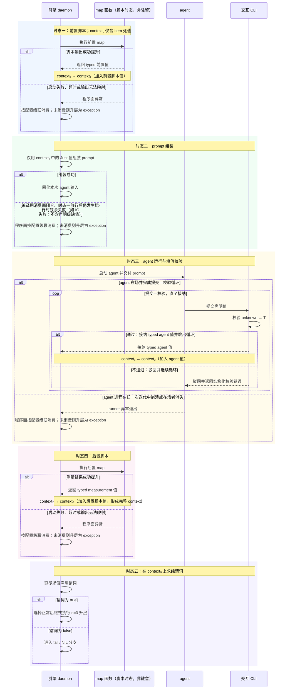
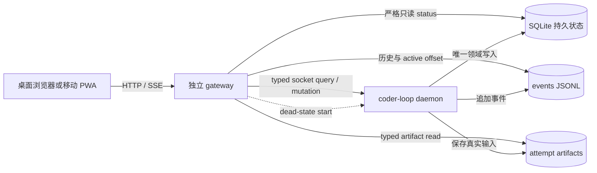
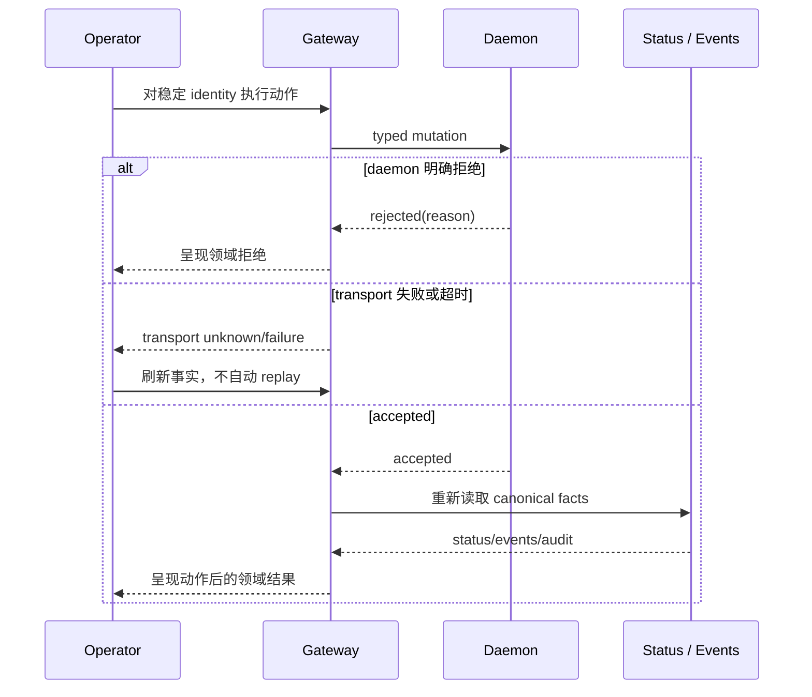
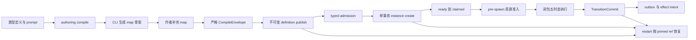
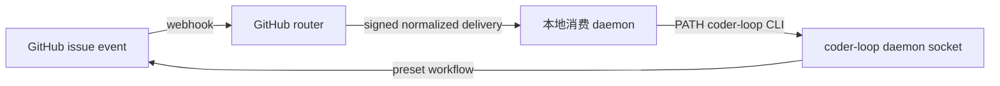

# v3 RFC A 文档合集

# 第 0 篇：v3 公共设计模型

## 0.1 本总纲的地位

v3 正从六篇旧 RFC 重划为八个责任面，但重划不能让各面重新发明一套“值从哪里来、什么时候有效、失败由谁处理”的答案。此前设计的结构性问题，正是缺少共同的时态与领域边界，导致闭包内部的产值、校验和流转事实上浮为 daemon 的 gate、journal 或 finalize 协议。本文先钉住八面共享的公共模型：定义态、函数域运行时、对象域、入站边界、出站边界、hook 与 GUI 都只能消费这里规定的词汇和边界。

本总纲是整个八面方案的词汇权威。标记后的六篇旧 RFC 正文仍是待重写材料，其中与本总纲冲突的部分不构成平行权威；冲突只在其余七个责任面的专属重写轮次中逐篇消解。本轮保留旧正文，不把尚未完成的局部改写伪装成已经统一的规范。

来源：record-3 第 12、19 轮操作员原话；八面定位与本总纲权威范围来自 division-plan.md“面 0”。

## 0.2 纯函数化公理：引擎只推理被提升的值

AI agent 不是没有副作用的函数。它会修改 worktree、调用外部程序、形成 session 内判断，也可能留下日志、进程和 Git 残迹。v3 所谓“纯函数化”，不是消灭这些 effect，而是收窄引擎承认的观察面：只有被明确提升为值的 effect 才能参与 prompt、检查与流转，其余副作用对本次交接语义一律丢弃。

针对 agent 执行及其副作用的提升口只有两个。第一，agent 在运行时向 context 填入声明允许的值，这是 self-report；第二，agent 运行结束后，由声明的脚本测量外部状态并把结果映射为 context 值，这是 measurement。除此之外的副作用并未被物理清除，只是不进入本次交接；以后若要消费，必须重新通过一个声明过的采样与 map 入口提升为值。agent 出生前的前置脚本负责准备函数输入，不构成观察 agent 副作用的第三个提升口。

两口并列不表示二者承受相同的信任。最初由 agent 自陈的“测试已通过”“文件已存在”等信息，只要能够被脚本计算，就应迁移到 measurement；能用测量承载的信息，不再用 agent 断言承载。measurement 接管可计算事实之后，self-report 才收缩到真正不可测量的意图、判断与后继选择。论证顺序不是先信任 agent 再用脚本复核，而是先把可计算边界尽量推远，最后只在测量无法覆盖之处消耗信任。因此，v3 没有让 agent 本身变得可信，而是把信任的消耗压缩到了测量不了的地方。

因此，引擎不根据未提升的文件变化、stdout 文本或 session 内部状态猜测业务结论。它能保证的是值从声明的来源产生、按声明的类型进入 context、在声明的消费位置被读取，并在交接边界得到确定结果；它不能从副作用本身推断 agent “实际上做了什么”。

来源：record-3 第 16、17 轮操作员原话；measurement 接管 self-report 的论证顺序由两轮收敛结论展开。

## 0.3 双域对偶与针眼通道

v3 同时包含两个方向相反的抽象目标。对象域处理 task 之间的真实并发，必须消灭调度时序的业务可见性：互不依赖的动作可交换，已提交事实只增，重复提交按稳定 identity 收敛。函数域处理一个 task 的闭包内部，必须精确刻画时序：前置取值、prompt 组装、agent 执行、后置测量和流转判定按固定顺序发生，前一时态没有形成合法值，后一时态就不能开始。

对象域的结构在 daemon 运行期间生长。task 有多少、何时派生、哪些成员同时存在，只能由运行时的 committed transition 决定，不能在运行前把整棵实例树编译出来。函数域的 preset 声明则是静态文本；它的类型、值来源、map 签名、prompt 消费位置、谓词槽和后继闭集可以在实例执行前形成一个可判的定义。

两域之间只有针眼大小的通道。入口处，对象域把 item 中已经存在的死值交给闭包，形成初始 context；出口处，闭包只向对象域交付 `returned(value) | exception`。闭包内五个时态的中间状态、填值驳回和脚本执行细节不进入 daemon 的任务账本。对象域也不反向解释闭包内部过程，只消费最终交付。

`await` 不构成第二条跨域通道。被等待的 B-check 是对象域中的独立 task，其结果通过 committed transition 在对象域账本内回注；函数域被保留的只是 B 闭包现场这一资源事实。步骤层的中间事实仍未上浮为 daemon 状态。

来源：record-3 第 15 轮操作员原话；针眼两端与 `await` 不构成第二通道为主 session 推导。

### 0.3.1 编译期与运行时的精确边界

编译期能够证明的是声明闭合、签名匹配以及值管道的连通性，也就是可达性：每个声明值有唯一来源，map 的输入输出类型能够拼接，消费位置所需的值存在一条类型正确的来源路径，有限后继和谓词槽得到穷尽处理。这些证明只说明运行时存在合法求值路径，不说明那条路径一定成功。

脚本是否启动成功、是否产出可提升的 `Just<T>`、agent 是否填入合法值、谓词最终为真还是为假，全部是运行时事实。运行时通过边界解析、填值校验和纯谓词求值获得具体结果。全文不得把“某值在类型图中可达”写成“运行时必定得到该值”，也不得因为运行结果仍需求值，就否认声明闭合可以在编译期判定。

来源：record-3 第 3—5 轮操作员原话；“编译期证明可达、运行时产生结果”的精确边界为对这些原话的收敛推导。

## 0.4 五时态与 context 的单调累积

一个闭包的正常交接依次经过五个时态。时态一执行前置脚本，把 item 死值和脚本输出映射成可供 prompt 使用的值；时态二只负责组装 prompt；时态三运行 agent，并在 agent 仍在场时完成填值校验；时态四执行运行后脚本，把测量结果提升为值；时态五在完整 context 上求值纯谓词，并选择正常路由或 fail 路由。

context 单调累积意味着后一个时态保留前一个时态已经形成的全部值，只增加新值，不靠删除或改写旧值改变历史。类型定义为每个值声明唯一来源：item、某个 map 或 agent 三者只能取其一。同名多来源在编译期就是非法声明，不留到运行时决定覆盖顺序。这一结论由主 session 从来源面闭合要求推导，后续类型系统 RFC 应把它落实为明确诊断。

来源：record-3 第 6、11、13、14 轮操作员原话；唯一来源约束为主 session 从来源面闭合要求推导。

### 0.4.1 五个时态的结局归属

异常不按一个全局“失败处理器”分发，而由异常发生时能够触及相应副作用面的在场者消费。程序脚本运行时 agent 尚未出生或已经退出，脚本异常只能由程序面处理；agent 填值错误发生在 agent 仍在场的时态，先驳回给 agent 修正；纯流转判定只对已经存在的值求纯谓词，不再保留“判定不可得”这一额外状态。

| 时态 | 结局 | 当时的消费者 | 对象域最终可观察结果 |
|---|---|---|---|
| 前置脚本 | 启动失败、超时、输出无法映射 | 程序面，按配置级联处理 | 不观察脚本内部状态；若程序面未在闭包内消化，出口为 `exception` |
| prompt 组装 | 缺少可拼接值或组装失败 | 程序面，按配置级联处理 | 不产生 agent run；未被程序面消化时出口为 `exception` |
| agent 运行 | 值缺失、类型错误 | 在场 agent | 不产生对象域 transition；CLI 驳回，agent 在同一时态修正后再提交 |
| agent 运行 | runner 崩溃或在场者消失 | 程序面升层 | 闭包出口为 `exception`，不得伪造成业务返回 tag |
| 后置脚本 | 启动失败、超时、输出无法映射 | 程序面，按配置级联处理 | 不观察脚本内部状态；若程序面未在闭包内消化，出口为 `exception` |
| 流转判定 | 谓词为 false | 声明的 fail 路由 | 产生确定的 fail 流转；只有 NIL 级联最终未消费时才升为 `exception` |
| 流转判定 | 谓词为 true | 声明的正常路由 | 交付 `returned(value)`，由对象域 committed transition 消费 |

这张表描述时态归属，不提前规定每一种程序异常的完整策略 ADT。程序面可以按声明或 operator 全局配置消费异常；只有最终越过针眼的结果才成为对象域事实。

来源：record-3 第 14 轮操作员原话与该轮异常消费者收敛；完整配置 ADT 仍属开放项。

### 0.4.2 两层校验：解析型填值与谓词型流转

填值校验位于时态三，其输入来自 agent，因此信任级别是未经验证的 `unknown`。它的形状是 parser：尝试完成 `unknown → T`，成功才把 typed 值加入 context。zod 或 arktype 在表单校验中的行为是准确类比：字段漏填或格式错误不会废弃整次注册流程，而是把结构化错误返回给仍在场的填写者，允许其原地修正后再次提交。交互 CLI 承担驳回与反馈通道；它不把错误记成对象域失败，也不替 agent 生成值。

流转校验位于时态五，面对的已经是由各边界解析完成的完整 `context₃`，因此信任的是值的类型与来源已成立，而不是 agent 的自陈为真。按操作员原话，它在形状上是“带异常的 map 函数中决定何时抛异常的子函数”；落实到五时态后，这个子函数自身只做纯谓词求值，不再执行脚本。谓词为 false 表示本次流转不能成立，直接进入 fail / NIL 分支，而不是把表单重新退给原 agent。

两层校验因此不能合并。填值校验防止不可信输入进入 typed context，失败后的修复者是仍在场的 agent，当前流程保持存活；流转校验判断完整 context 是否满足声明的交接条件，失败后的去向由 preset 的 fail 路由或 NIL 级联裁定，本次正常流转已经终止。前者回答“这个值能否成为 `T`”，后者回答“这些已成形的值能否共同支持这次流转”。

来源：record-3 第 11 轮操作员原话；纯谓词与异常时态的拆分同时采用第 14 轮收敛。

### 0.4.3 分形交接：一份文法，两个作用域

step 与 task 都存在“执行结束后把结果交给下一段”的动作，因而共享同一个交接合同形状：交付值包，完成必写值解析与声明测量，在完整 context 上求流转谓词，然后得到正常路由或 fail / NIL 结局。两层的抽象对象不同，打包的值也不同，但合同不应因此分裂成两种方言。preset 只需提供一份交接文法，在 task 接缝与 step 接缝两个作用域实例化；同一交接内部仍按五时态串行，而彼此无关的交接只依赖前向、单调与可交换的结果，因此合同本身不要求把可并发实例强行串行化。

共享形状不意味着共享持久性。task 层的前向推进经过 committed transition 写入 daemon 日志，是已经发生、不可撤销且崩溃后必须恢复的历史事实。step 层的前向只是一条执行纪律：现场可以随 worktree 或 session 一起蒸发，也可以整体丢弃并重放；恢复单位是 attempt，不是某一个 step。打包值所在的记账位置不同，决定了同一句“仅前向”在 task 层是历史承诺，在 step 层只是禁止写回退逻辑。

这一区分还要求可见性严格单向。step 粒度的进度、校验与失败不得进入 daemon 账本，否则分形会退化为两层共用一个执法者，重新制造 item/phase 上浮。step 层无论经历多少内部事实，对 task 层只折叠为 `returned(value) | exception`；task 层消费折叠结果，不反向解释或恢复某个 step。正因为合同形状可复用而事实账本不复用，两层才能各自保持前向并发而不互相泄漏调度语义。

来源：record-2 3:23 操作员原话；一份文法、两个作用域以及持久性与可见性差异来自 3:24 的收敛推导。

## 0.5 值管道：定义、提升与双面闭合

值管道由三类定义态资产共同构成：preset 的类型定义说明 context 在各时态应当包含什么；CLI 依据类型生成对应时态的 map 函数骨架，并在注释中枚举该函数运行前可用的 context；prompt 与其他声明消费位置说明哪些值将在何处被读取。map 的基本形态是 `map(context, bashscript())`，而不是把任意字符串输出直接包装成可信值。外部命令先产生 string，map 再结合已有 context 把它解析、检查并提升为 `Just<T>`；只有成功提升的值可以进入后续消费。

编译面进行两侧闭合。来源面要求每个声明值恰有一个来源，并要求所有运行时来源都有签名完整的 map 或 agent 填值声明；消费面要求 prompt 占位符、检查谓词和特殊路由读取都引用已声明且可达的值。没有消费位置的声明值、没有来源的消费值或未补完的 map 骨架都产生 finding；严格模式禁止执行不闭合的 preset。

本总纲只规定值管道的责任分界，不展开 ValueType 的完整递归 ADT、代码生成文件布局、finding schema、publish/pin 或 runtime resolver。这些细节由 #547 的专属重写轮次定义，但不得改变“编译期证明可达，运行时产生结果”的边界。

来源：record-3 第 3—5 轮操作员原话；唯一来源与双面 finding 的精确诊断为主 session 推导。

## 0.6 检查面、路由面与 fail 的 total 语义

产值与检查是两个正交的面。每个 context 值都有一个谓词槽；默认谓词恒为 true，因此没有显式检查时无需生成空代码。显式谓词只在时态五读取完整 context 并返回 true 或 false。检查是否通过不决定下一个 preset 是谁；路由值已经存在也不能绕过检查。任一检查失败时，正常路由值不被消费，执行转入约定的 fail 路径。

“下一个 preset”是特殊 context 值，因为引擎可以在封闭候选集足够小时接管填值。当声明允许的后继数量 `n ≥ 2`，agent 或脚本必须从合法字符串闭集中选择；`n = 1` 时引擎直接填入唯一值；`n = 0` 时发生升层，进入下一个 task 或 chain 结束。这里忠实沿用操作员的“下一个 preset”“失败模式的 preset”用法。

这一术语存在明确的历史张力：v2 中 preset 表示完整工作流，而当前 v3 讨论中的 preset 可能表示任务内部的步骤级定义单元，即任务由 preset 链组成。本文不发明替代名称；两种历史用法在后续正文中必须按上下文标明，最终命名保留为待操作员裁决的开放项。

fail 是一个特殊步骤，而不是引擎硬编码的业务失败枚举。preset 可以显式声明由哪个 fail 节点消费检查失败或程序异常，也可以完全不声明。未声明时由专用 NIL 值补位，依次查找 operator 全局配置中“步骤→任务→组→item”的级联策略；若配置仍未提供消费者，硬默认是抛出异常并停机。这个优先级使 fail 在类型追踪中始终有值，不出现 `undefined`。全局配置的精确 ADT、各层策略的完整枚举和配置文件 schema 仍是待细化项，本总纲不自行补造。

因为 context 可以完全由 item 与脚本形成，步骤不必包含 agent。纯程序节点与 agent 节点使用同一套时态和流转合同；差别只是 agent 时态是否实际实例化，而不是另开一种任务代数。

来源：record-3 第 6—10 轮操作员原话；配置 ADT 尚未裁决的边界沿用 division-plan.md 面 0 与面 2 的责任划分。

## 0.7 Hook 与 GUI 是公共模型的投影

hook 是挂在五时态转换点上的 **effectful subprocess runtime**，独立于既定主流转。它可以执行带外部副作用的脚本，因此“只读”不是它的能力边界；真正的边界是权威。map 由 preset 声明，产值进入 context，并参与主流转；hook 由 operator 声明，执行结果不进入 context，不拥有检查或路由的裁决权，也不产生领域 mutation 的权威。hook 即使改变了外部世界，该副作用也不能自行改写 daemon 账本或冒充 committed transition。后续 hook 责任面只围绕时态锚点、subprocess primitive、进程所有权与审计展开，不再承担 gate 状态机。

GUI 的本体是 context 与副作用的可观测手段。context 面展示被提升并参与交接的值、各时态快照、谓词结果、正常/fail 路径和对象域值账本；副作用面展示未进入交接语义但对人仍有诊断价值的 worktree、进程三证、events、日志和 Git 残迹。GUI 读取这些事实，不重建或美化它们。

观测本体并不禁止 #544 已经定义的有限运维动作。daemon 生命周期操作、unblock 和具备 authority 的 decision 作为附属动作面保留，并与观察面分栏；二者共享稳定 identity，却不共享权威，所有 mutation 仍由 daemon 裁决并回到权威读面核验。

来源：record-3 第 18 轮操作员原话；hook 的 effectful runtime 定位、无领域 mutation 权威与 GUI 分栏控制面来自 division-plan.md 面 6、面 7 的主 session 裁决。

## 0.8 公共词汇

- **对象域**：task、群组、锁、committed transition、消费与运行时生长结构所在的领域；以交换、单调和幂等消除无关调度顺序的可见性。
- **函数域**：单个 task 的闭包内部；以五时态刻画单次交接实例内严格串行的值生产、agent 调用和流转判定。
- **context**：闭包在当前时态已经拥有的 typed 值集合，从 item 死值开始单调累积；不是 opaque 文本库，也不等同于全部副作用。仅供 append/read 的不透明传输通道若不经过声明的解析、提升与消费，就不成为 context，也不占用这个术语。
- **针眼通道**：两域唯一的正式交接边界；入口是 item 值形成的初始 context，出口是 `returned(value) | exception`。
- **时态**：闭包内事实获得有效性的顺序位置；本模型固定为前置脚本、prompt 组装、agent 运行、后置脚本和流转判定。
- **交接合同**：step 与 task 共用的“交付值包—解析/测量—谓词判定—返回结局”文法；在两个作用域实例化，但不共享持久账本。
- **值管道**：类型定义、map 骨架、运行时提升和声明消费共同形成的 typed 数据路径。
- **来源面**：回答每个值由 item、唯一 map 或 agent 中的哪一个产生，并检查其签名与可达性。
- **消费面**：回答声明值在 prompt、检查或路由的哪个位置被读取，并拒绝无来源或不可达的消费。
- **填值校验**：agent 时态内的 `unknown → T` parser；失败驳回给在场 agent 修正，不废弃当前流程。
- **流转校验**：在完整 context 上运行的纯谓词；默认恒真，显式 false 统一进入 fail / NIL，不选择正常后继。
- **路由面**：在检查通过后决定下一 preset 或升层的正交流程；“下一个 preset”是引擎可接管的特殊 context 值。
- **fail / NIL**：fail 是 preset 可声明的特殊处理步骤；NIL 是未声明 fail 时仍然存在的专用缺省值，承接 operator 全局配置级联与最终硬默认停机。
- **self-report / measurement**：agent 自填值与程序测量值两个提升口；可计算事实归 measurement，self-report 只承载不可测量部分。
- **hook**：operator 声明、挂在时态锚点上的 effectful subprocess runtime；有副作用能力，但不参与 context、不裁决主流转、不产生领域 mutation 权威。
- **GUI**：context 面与副作用面的可观测产品，并附带与观察分权、分栏呈现的有限运维动作面。
- **preset（开放项）**：v2 指完整工作流；当前 v3 讨论中也可能指任务内部的步骤级定义单元。本文保留操作员用法，最终命名待操作员裁决。

来源：公共词汇汇总自 record-3 第 6—18 轮、record-2 3:23—3:24 与 division-plan.md 面 0、面 6、面 7；`preset` 命名张力保持开放，未作新裁决。

<!-- 543 -->

# RFC #543：生命周期扩展协议实现了什么，以及为什么必须这样实现

## 一、问题边界：从“能记录事实”到“能据事实控制推进”

coder-loop 的调度内核负责按 preset 推进 chain、item 与 phase，却不应知道“运行几轮后必须检查”“哪些修复完成才可继续”或“某个外部质量标准是否满足”。这些判断属于具体项目和操作员策略。RFC #543 要解决的核心问题，是在不把这些策略写进引擎的前提下，让外部脚本既能观察生命周期事实，也能在受控位置影响调度决定。

这不是普通的回调需求。仅在事件发生后运行一个程序，最多提供通知能力；它不能证明脚本看到了与当前运行实例一致的定义，不能在 daemon 崩溃后说明一次执行究竟是否发生，也不能让“暂停推进”成为可恢复的引擎状态。反之，若允许脚本直接改写 scheduler 内部状态，策略外置就会退化为无边界的内部扩展：不可信输出可能破坏状态机，脚本重放可能重复创建纠正任务，局部故障也会扩散到调度主路径。

因此，本 RFC 的交付对象是一条生命周期扩展协议。它从引擎已经掌握的 typed 事实出发，经声明解析、输入投影、子进程执行、决策解析、持久化消费与统一观测，将外部策略接入调度系统；与此同时，它规定哪些权威仍属于引擎、哪些能力必须由相邻 RFC 供给，以及哪些外部副作用明确不由引擎兜底。

必须先说明现状。main 已经具备 observer 挂点的类型派生、对 `hook.*` 自反订阅的结构排除、gate 决策点闭集、四层声明形状及固定合成次序等基础；global、chain、item 层已有 operator-only 持久化语义，部分 closure 生命周期事实和 chain-complete 指纹也提供了先例。然而，这些基础尚未形成运行闭环：声明视图没有完整的生产与消费路径，observer 与 gate 脚本没有真正执行，hook payload、decision ingress、evaluation journal、具名绑定、script join 与结构化 reopen 均未在当前 main 上完成。下文所称“RFC 实现”指其目标协议与修补后应成立的合同，不把这些目标误写成已经落地的事实。

## 二、为什么已有事件日志和 agent phase 不足以完成闭环

典型需求不是“某次 run 结束后记一条日志”，而是“在特定轮次检查结果，必要时创建检查与修复工作，并在它们完成前阻止原流程继续”。这条链至少跨越三种不同动作：读取运行事实、产生额外工作、作出调度决定。事件日志只解决第一种动作的可见性；普通 agent phase 虽能执行任务，却无法天然代表 scheduler 在某个决策点上的放行权。

如果把检查脚本当作普通 observer，它即使发现问题，也只能旁路执行。scheduler 可能在脚本完成前已经选择下一个 item。把新建检查任务排到较前位置也不能构成正确性保证，因为全局排序不等于“原决策点被扣住”；其他 chain、并发 writer 和重启恢复都可能改变实际选择顺序。真正需要的是一个由 scheduler 承认的 hold 状态：只约束相关 chain 或容器的推进，而不阻塞 daemon 的其他工作。

如果让 gate 的标准输出直接携带任意 mutation，脚本就获得了绕过既有 CLI admission、权限校验和审计的能力。RFC 因而把“创建纠正 item”和“决定是否推进”分开：脚本以 operator 身份通过既有命令面实施 mutation，gate stdout 只返回一个受类型约束的 decision；当 decision 引用既存 correction IDs 时，消费方再校验其归属和合法性。该分离使 mutation 继续服从原有控制面，而决策通道保持窄小、可解析、可穷尽。

上述控制面分离还不足以覆盖执行失败，因为通知与判定承担的调度责任不同。这也解释了 RFC 为何不能用单一 hook 概念覆盖全部场景：前者应当被记录但不得改变调度，后者必须按声明的失败策略折叠为 hold 或 advance。只有先拆开这两种责任，才能分别定义正确的进程所有权、持久化状态与恢复行为。

## 三、声明模型：四层来源如何形成一个可治理的生效视图

在区分 observer 与 gate 的职责后，下一个问题是这些能力由谁声明、以何种顺序生效。RFC 把 hook 声明分布在 global、chain、preset 与 item 四层，并规定生效次序为 global→chain→preset→item。四层不是重复配置入口，而是四种不同治理范围。global 表达整台运行环境的统一要求；chain 绑定某个工作流实例的操作策略；preset 提供可分发的抽象要求；item 则允许对单个工作单元追加局部约束。固定次序使同一决策点的实际执行集合能够被重建和审计，避免调用处各自拼接而产生不同含义。

声明边界使用封闭 ADT，而非任意字符串与 optional-field 集合。ObserverHookPoint 直接从统一 observability 事件词表派生，并结构性排除所有 `hook.*` 事件；因此，新增普通事件能够自动成为 observer 候选，新增 hook diagnostic 则不会意外形成递归订阅。GateDecisionPoint 是显式闭集，因为 gate 不是“凡有事件就能阻塞”：它只能位于 scheduler 真正拥有决定权的位置。closure transition 属于已发生的权威事实，只适合 observer；若需要阻止挂起，应在其前置的 run post-exit 决策点 hold，而不是试图 gate 一条已经提交的 transition。

四层声明必须由 operator 控制。agent 或 preset 授权不能创建、替换或清除 hooks，否则被调度的工作负载可以改变自己的监督条件。此处的责任属于 daemon admission，而非脚本执行器：权限问题发生在声明写入边界；一旦声明通过并进入 durable 生效视图，执行器只消费已授权事实。

当前 main 已落下这部分的主要骨架，但“能解析声明”不等于“声明已有执行语义”。完整协议还要求生产路径实际装配生效视图，status 暴露选中来源与运行状态，并让每个决策点都经过同一个 evaluator。否则，四层顺序仍只是静态结构，无法保证运行中的行为一致。

## 四、Observer：旁路观察为何仍需要严格的进程所有权

声明解析出有效 observer 后，协议才进入真实执行链。Observer 的职责是对统一事件流做匹配，并为每个“事件×匹配声明”建立独立 delivery。它不返回调度 decision，也不能改变触发事件的结果。生产者在调用栈内完成 admission、spawn/error 握手和完整 stdin 写入后即可继续，不等待子进程结束；脚本成功、非零退出、超时或派生 diagnostic 失败均不得反向改变 scheduler 的决定。

旁路并不意味着可以丢弃生命周期管理。daemon 若只 spawn 后遗忘 PID，正常停止会遗留进程，崩溃重启也无法判断旧脚本仍在运行还是已经结束。RFC 因而把 delivery 与 execution attempt 持久化：delivery 表示某个匹配应被投递的一次逻辑责任，execution 表示一次真实启动。同一 delivery 在崩溃恢复时可以有多个 attempt，但每次 attempt 都有独立身份和终态。

正常停止采取有界回收。daemon 先停止接受新的 observer dispatch，等待已有脚本在限定时间内完成；超时后对其进程组发送 TERM，再在必要时发送 KILL，等待 close 并落下权威终态后才关闭相关存储。采用进程组而非单 PID，是因为脚本可能派生子进程；仅终止直接 child 不能证明 daemon 已收回自己拥有的进程树。

崩溃恢复遵循 at-least-once，而非 exactly-once。重启后的 daemon 只处理所有权记录仍悬而未决的启动：先清除它可能遗留的进程组，再履行原来的 delivery。凡是已经写下确定结局的投递，无论结局是完成、脚本报错退出、启动或输入通道失败、达到时限，还是在正常停机中被强制结束，都不会仅因 daemon 再次启动而重跑。这样做消除的是“引擎不知自己还欠哪次投递”的状态空洞，并不声称脚本只会运行一次。

Observer 与 agent 可以共享领域无关的异步 subprocess primitive，但不能直接把现有 agent executor 当作 hook executor。公共 primitive 只处理 spawn、stdio、进程组、timeout、TERM→KILL 和 close；agent 的 slot、phase、session、credential 与 backoff 仍由 agent adapter 管理，observer 的 delivery 与 diagnostic 则由 observer adapter 管理。把领域状态塞进公共层会使两种进程的恢复语义相互污染；复制第三套底层进程代码又会让超时和回收行为漂移。因此，共享的是机制，而不是生命周期模型。

## 五、Payload：脚本看到的必须是固定事实，而非重放时的“最新解释”

进程所有权只能回答“谁负责这次执行”，还不能回答“这次执行依据什么事实”。Observer 与 gate 因而共用一个版本化、typed payload。它由三部分合成：运行实例所 pin 的定义投影、当前 runtime snapshot，以及触发上下文。定义态与运行态来自已有公共 schema/projection，而不是在每条执行路径手写字段；hook assembler 只做选择性投影和封装，不建立第二个事实源。匿名或内部状态槽不能因为“全量元数据”这一表述而原样泄给脚本，GitHub mergedness 等业务事实也不能被注入 L1 引擎 payload。

固定 payload 是 crash recovery 的必要条件。设某个 delivery 在定义版本 H1 下建立，脚本启动前后源路径已经变为 H2。若恢复流程重新解释当前文件，第一次进程和恢复进程面对的就不再是同一项投递，此前的 mutation、decision 与 diagnostic 也无法放进一条因果记录。恢复时必须重用 delivery 建立时封存的输入内容，而不能再次组装；信封以逻辑投递编号连接多次运行，并另行标明这一次子进程运行的编号。

这一要求不能由 #543 自行读取当前 preset 路径来满足。它依赖 RFC-2 提供不可变的 pinned definition artifact、跨重启 resolver 和公共 compile projection。resolver 必须对 missing、corrupt、unsupported version 给出 typed failure，不能静默退回当前路径。物理介质可以是 inline、blob 或其他形式，hash、压缩和 GC 也属于实现参数；#543 只消费“给定 definitionRef 可恢复对应定义或明确失败”的权威合同。若没有这一层，所谓稳定 payload 只是当前进程内的偶然一致，无法跨重启成立。

Payload 的版本字段同样不可省略。外部脚本是独立部署的消费者，schema 演化无法依赖 TypeScript 编译器同步提示。版本化使脚本可以显式拒绝未知形态，也使 execution terminal、decision journal 与审计记录能够指出当时究竟使用了哪一种输入契约。

## 六、Gate：把不可信脚本输出收窄为可穷尽的调度决定

固定输入解决了脚本所见事实的一致性；要让脚本影响推进，还必须把输出限制在 scheduler 能穷尽处理的范围内。Gate 位于明确的 scheduler 决策点，例如 run 结束后的下一步选择、容器 join 或 chain-complete。它执行脚本，将 stdout 在唯一信任升格点解析为 typed decision ADT，再由调度消费。基础词表是 `advance`、`hold` 与容器语境可用的 `reopen`；非容器点只接受与该点相容的子集。非法 JSON、未知 variant、缺失字段、超时和进程崩溃均属于协议失败，必须按声明的 `onFailure` 显式折叠为 hold 或 advance，不能以 default 分支静默放行。

`advance` 表示本 gate 对当前点无阻塞意见，`hold` 表示相关 chain 或容器暂不推进并按退避策略重新评估，`reopen` 则请求容器恢复到一个合法 target 并消费明确的 correction items。Decision schema 不携带任意 mutation。如此划界，是因为 stdout 是不可信字节，而 CLI mutation 已有权限、边界解析和审计；把二者混合会让 gate executor 同时承担命令解释器和调度判定器两种不相容的责任。

同一决策点可能来自四层多个 gate。执行顺序固定，但合成不是“最后一个结果覆盖前面结果”。对只允许 advance/hold 的点，全部 gate 均 advance 才能放行，任一 hold 即扣住。容器点还需要处理 reopen：reopen 优先于 hold；多个 reopen 若指向同一 target，则 correction IDs 以稳定顺序去重合并；若指向不同 target，引擎没有安全的隐式优先级，结果应收敛为 hold 并发出冲突 diagnostic。声明顺序仅用于可重建的执行次序，不能被偷换成业务冲突裁决。

Hold 必须是局部、可见的持久状态。一个 chain 的 gate 不应冻结其他 chain，也不应让 daemon 查询面失效。反复评估还需要 fingerprint：它由该决策点的 typed 评估输入与有效声明派生，排除 gate 自己写入的状态；同一 fingerprint 下已 hold 的输入不应形成无意义的重问风暴，输入变化后才产生新评估机会。Tick gate 还需为每项声明设置独立的正整数最小间隔，避免周期触发退化为高频脚本轰炸。

## 七、身份与 Journal：为什么一次 gate 不能只靠退出码记忆

Typed decision 解决单次解析，却不能独自跨越崩溃窗口；恢复还需要区分“事实发生”“逻辑投递”“实际执行”和“判定消费”。RFC 用四层身份贯穿完整因果链。Transition identity 指认上游权威状态机发生的那一次生命周期转移；delivery identity 指认该事实与某个匹配声明结合后产生的一项逻辑投递责任；execution identity 指认履行这项 delivery 时某一次真实的子进程尝试；evaluation identity 则指认 scheduler 围绕某个决策点开展的一次判定事务。四者不能互代：同一 transition 可以匹配出多个 deliveries，一项 delivery 可以因恢复产生多个 executions，而进程运行次数也不能证明某项 decision 已被消费。Epoch 与 fingerprint 都从属于 evaluation：前者划分 decision 消费后的判定代次，后者刻画该代次所见评估输入是否发生变化；它们是判定的两个维度，不是与上述四层并列的新身份。

若只有子进程退出码而没有 durable evaluation journal，daemon 可能在几个关键窗口崩溃：脚本已创建 correction item 但尚未返回 decision；decision 已解析但尚未写盘；decision 已写盘但其引擎内 effect 尚未消费；effect 落了一半但 consumed 标记未提交。重启后重新运行脚本既可能重复 mutation，也可能让脚本基于新状态改判，使旧 correction 失去归属。

Journal 因而以 `evaluating | decided | consumed` 之类的封闭状态记录权威 evaluation identity、decision 与待执行的引擎内 intent。Spawn 前必须先建立可恢复身份；decision 与 pending intent 之间有明确的原子边界；decided 但未 consumed 的记录可在重启后继续消费，而不要求原触发事件再次发生；只有消费完成后 epoch 才递增。这里不规定具体是 outbox、表还是 consumer 拓扑，要求的是每个崩溃窗口都有唯一、可穷尽的恢复后果。

Gate 脚本经 CLI 创建 mutation 时携带 evaluation scope。Admission 层把规范化 mutation key 与首次响应持久化：同一 epoch 内的重放返回第一次结果，而不是再次创建相同 item；普通 operator 命令继续维持既有语义，不被强行纳入 evaluation 幂等协议。`item.created` 等审计事实也应携带 scope，从而能追踪某项纠正工作由哪次判定产生。

这种设计仍不承诺非确定脚本没有孤儿 effect。脚本可能在留下某个外部动作后崩溃，也可能创建了最终 decision 未引用的 correction。Journal 能保证引擎拥有的 mutation、decision 和消费效果可恢复、可审计；它不能回滚任意外部世界，也不能把判定主体变成 exactly-once。

## 八、具名 Gate：可分发 preset 与本机脚本之间的接口边界

前述 evaluator 以已解析的 gate 为输入，但可分发配置还面临抽象要求与本机实现分离的问题。Preset 需要表达“这里必须经过某项策略检查”，但可分发的 preset 不能嵌入某台机器的绝对脚本路径。RFC 以具名 gate 把需求与供给分离：preset 只声明 gate 名、决策点以及 required/optional 性质；global 或 chain 层由 operator 提供名称到脚本、timeout 与 onFailure 的绑定。

绑定解析是穷尽三态。已绑定时，选中的脚本作为 preset 层成员进入统一 gate evaluator，不产生专用执行路径；optional 未绑定时显式空过并留下可观测 skip；required 未绑定时，新实例在创建边界被结构化拒绝，已存在的 pinned 实例在恢复时进入可见 hold。Required 不能在 compile 时依赖某台运行机器的绑定，也不能在重启后暗中降级为 optional。

同名绑定采用 chain 覆盖 global 的配置语义，实际只执行一个 effective binding；status 同时显示 selected 与 shadowed source，以便解释脚本为何来自某一层。它与 global、chain 自己声明的普通 hooks 是两种角色：前者为 preset 接口提供实现，后者是该层直接添加的行为。若把两者混为一组依次执行，覆盖语义会被错误地变成叠加语义。

这项机制由声明/装载层负责，而非 subprocess primitive 或 scheduler 决策合成层负责。路径可分发性、绑定优先级和缺失语义都发生在“抽象需求如何解析为有效声明”的边界；执行层只应接收已经解析完毕的 gate，不应了解 preset 来源。

## 九、Script Join 与 Reopen：脚本判断如何接入容器推进

具名绑定使脚本能够进入统一 evaluator；容器 join 则是这一判定协议必须接入的关键调度接缝。容器的成员全部 terminal 并不必然意味着外层 seq 可以推进。并行批次可能需要质量判定，chain-complete 也可能需要外部条件确认。RFC 因而为 join 判定器增加 script variant，使脚本与 agent-phase validator 共用同一 decision ADT、同一派发路径和同一 reopen consumer，而不是形成第二套容器状态机。

Script join 的输入仍来自统一 payload，输出仍经唯一 decision parser。Advance 放行容器，hold 扣住并按 fingerprint/退避重新评估，reopen 则引用脚本此前通过 evaluation-scoped CLI 创建的 correction IDs。脚本若需要检查 GitHub mergedness，应以 operator 身份调用 GitHub 能力自行查询；L1 引擎不拥有这一业务事实，也不应为了某个判定器向 payload 加入 GitHub 字段。

Reopen 不能由 #543 通过“改几张表”自行完成。一个合法 reopen 必须判断 target 是否属于当前容器、是否位于允许回退的 seq、是否已经运行，校验 correction IDs 的 membership 与 claim，解析并消耗预算，回退游标，同时保持已经 terminal 的 item 状态不变。Target reopen、cursor/budget 更新、correction claim 与 decision consumed 必须全有或全无；重复、冲突、预算耗尽和崩溃恢复也需要 typed 结果。

这些权威属于 RFC-1 的 structured reopen authority。#543 递交的是可归属到一次 evaluation 的判定、未由本层解释的 target，以及 decision 明确点名的既存 correction IDs；权威 consumer 返回结果后，#543 才推进自己的 journal。它不能用 metadata carrier 或连续若干次 CLI mutation 拼出一个貌似原子的 reopen。类似地，closure 的 create、run-spawn、run-exit、suspend、reopen、consume 六条 canonical transition 也由 RFC-1 确定发生时点、当时的 snapshot 与 transition identity。这里的 transition identity 正是§七四层因果身份的起点；observer 从该身份派生 delivery，不能拿 delivery identity 反过来充当生命周期边的去重依据，也不能从现有五类主题性 `closure.*` 事件推断缺失的权威转移。

## 十、可观测性：让扩展协议本身也成为可调查对象

执行、判定与 reopen 形成闭环后，协议还必须暴露自身行为，否则恢复保证无法由操作员核查。Hook 系统若只在成功时留下脚本输出，就无法回答最关键的运维问题：脚本是否启动、收到了哪个 payload、为何超时、哪个 gate 扣住了 chain、重启后是重新执行还是继续消费旧 decision。RFC 因而要求 `hook.*` lifecycle、decision 与 diagnostic 进入统一事件边界，并在 status 中投影有效声明、当前 hold、选中绑定及评估状态。

Observer execution 的 durable terminal record 是 diagnostic 权威。统一事件由该记录派生；若 daemon 在“终态已提交、事件尚未追加”之间崩溃，重启后可以补做派生。相反，事件追加成功但标记未完成时允许重复派生，重复记录用稳定 execution identity 关联。事件流不是第二权威，也不要求 sink exactly-once。采用这一方向，是因为进程结果属于 execution 生命周期，而事件只是面向调查者的投影；若先把事件当权威，sink 故障会错误地改变 delivery 状态。

Gate 的观测还需包含 decision、协议违规、onFailure 折叠、hold、fingerprint 命中、重新评估、journal 状态转移与重启恢复。这样，“为什么没有继续”“为什么没有再次插入 item”“为什么 required gate 没执行”都能从 status 与事件因果链回答，而不必猜测内存状态。

所有派生的 `hook.*` 事件必须在声明期和发射期双重零自反。声明期使递归订阅不可表达；发射期即使面对旧数据或边界绕过也不得再次派发 observer。若缺少后一层，一次失败 diagnostic 仍可能触发同一失败脚本，形成无限的进程与事件风暴。

## 十一、并发、外部副作用与当前仍未解除的依赖

可恢复与可观测并不等于引擎接管脚本触及的外部世界。RFC 允许不同脚本并发，也允许同一脚本跨事件、chain 和连续触发并发。每个 match 都形成独立 delivery，不因为脚本名相同而合并、跳过或串行。引擎提供稳定 identity、固定 payload、自有状态的持久化、局部 CLI 事务与审计关联，但不提供 per-script lane、全局串行、跨脚本资源锁或外部分布式事务。

因此，脚本对文件、Git、数据库和第三方服务造成的并发冲突由脚本作者负责。目标系统若提供幂等 key、CAS、锁或事务，脚本应自行使用；若不提供，引擎不会伪造 exactly-once。特别是在 observer crash 重派和 gate 判定重问中，同一逻辑责任可能产生多次外部调用。将这些 effect 纳入引擎回滚既需要理解资源协议，也会把项目业务语义带回 L1，违背本 RFC 的策略外置边界。

Gate 或 daemon 生命周期一旦决定进入 held 收敛阶段，待排空集合就必须停止增长。若 socket 仍接受 mutation、scheduler 仍建立工作、observer 仍产生 delivery，排空过程会不断获得新成员；与此同时，存储关闭可能与新 intent 的提交交错，使一项已获接纳的工作最终没有 durable outcome。查询必须继续开放，因为 operator 需要借此定位 hold 的来源、观察 drain 进度，并取得解除 hold 所需的事实；这不是把读权限等同于写权限。

`shutdown-held` 因而只让读取路径继续服务。新的 mutation、调度工作和 observer 投递在进入执行前即被 typed reject，已经接受的工作则按 drain 规则走到可记录结局；一次拒绝不能顺带写 DB、追加事件或启动进程。调用方若要再次提交被挡下的 mutation，必须自行发起新的请求，引擎不会因 held 解除而代为补交。

截至 expected foundation（即本 RFC 开工时预期由相邻 RFC 提供的地基合同）复核，三组外部能力仍是 external blocker，即缺失时无法诚实宣称相应协议闭环完成的外部依赖。第一，RFC-2 的 pinned definition artifact/resolver 与公共 compile projection，阻塞跨重启固定 payload 及具名声明的可靠解析。第二，RFC-1 的 canonical closure transitions，阻塞六条资源转移边的权威 observer 触发。第三，RFC-1 的 structured reopen authority，阻塞 target、claim、budget、cursor 与原子 reopen effect。它们只阻塞相应完成主张，不授权 #543 建立临时替代品。与此同时，外部文件或服务的幂等能力不是 external blocker，而是明确排除在引擎保证之外。

还需区分预期合同与已证明的运行事实。Observer 的 spawn/ownership kill-point、固定 payload 重派、进程树回收、diagnostic replay，gate 的 transaction crash matrix、metadata 并发 mutation、`shutdown-held` admission，以及 RFC-1/RFC-2 接缝都尚需在真实路径上验证。静态 ADT、声明测试或局部 transaction 先例不能证明这些跨进程与跨重启性质已经成立。

## 十二、结论：扩展能力的价值来自边界组合，而非脚本数量

RFC #543 最终改变的不是“系统可以多运行几段脚本”，而是 coder-loop 对外部策略的承载方式。Observer 把已发生的生命周期事实送到旁路消费者，gate 在引擎拥有决定权的位置接受受限判定；共享 payload 保证判断基于固定、可说明的输入，分层 identity 与 journal 使崩溃恢复具有确定后果，四层声明和具名绑定把治理范围与可分发接口结合，script join/reopen 则把容器判定接回 RFC-1 的权威状态转移。统一 observability 使这条协议本身也可以被查询、审计和复盘。

这些机制必须组合出现。没有 observer/gate 分离，通知故障会污染调度或决策失去阻塞力；没有 pinned payload，同一 delivery 的重放会改变问题本身；没有 evaluation journal，decision 与 mutation 在崩溃窗口中无法归属；没有具名绑定，preset 要么携带本机路径，要么只能留下无执行语义的名字；没有 RFC-1 authority，reopen 就会成为跨表的非原子猜测；没有外部 effect 边界，引擎将被迫理解 GitHub、文件和数据库的业务事务。

协议的可靠性因此来自职责精确，而非保证无限扩张。引擎保证自己拥有的声明、投递、评估、decision、admission 和状态消费可类型化、可恢复、可审计；脚本负责其策略和外部副作用；RFC-1 与 RFC-2 分别提供任务生命周期与固定定义的权威事实。正是这种分工，使业务策略能够留在引擎之外，而调度决定仍然保持为引擎内部受约束、可证明的状态转移。

<!-- 544 -->

# RFC #544：把 coder-loop 变成一个人可以独立判断和处置的系统

## 1. 从一次值班事故开始

设想操作员在手机上收到一条消息：某个 chain 很久没有继续推进。他现在有几个问题，但没有一个能靠“daemon 进程还在”回答。

他不知道 daemon 是健康、半死还是已经退出；不知道 socket 文件是活连接还是陈尸；不知道 chain 是被 rate limit、gate hold、失败 attempt 还是 operator decision 卡住；不知道最后一次 attempt 实际拿到什么 prompt；也不知道此刻按 resume、unblock 或 restart 是否合适。

在 RFC #544 之前，解决这些问题往往意味着再启动一次 agent 调查。调查者寻找 session、读日志、检查进程、比较数据库与文件，再把若干局部现象解释成一段结论。这个流程有三个结构性缺陷。

第一，操作员看到的是解释，不是原始事实。调查可能选错 run，或者把 worktree、git branch、pidfile 之类的旁证误当成领域状态。

第二，调查会受到时间漂移。当前 preset、当前 item 和当前文件不一定等于某次历史 attempt 当时看到的输入。事后重建出来的 prompt 可以语法正确，却仍然不是当时发送给 runner 的文本。

第三，观察入口依赖被观察对象。daemon 崩溃时，任何依赖 daemon RPC 的“监控”都同时失效；浏览器连接失败也无法告诉人究竟是 daemon 死亡、gateway 不可达还是 mesh 断开。

因此，这个 RFC 并不以“有一个 Web 页面”为完成条件。它要改变操作员获得事实的方式：无需 agent 代查，能够从一个仍然存活的入口识别故障域、沿稳定 identity 进入具体执行、阅读真实输入、执行有限动作，再从权威读面确认结果。

全文用四个设计命题说明为什么要实现这些能力，以及这些能力具体是什么：

1. 证据必须比被观察进程活得更久；
2. 观察不能修改、重建或美化事实；
3. 观测与控制必须共享 identity，但不能共享权威；
4. GUI 的价值由完成诊断闭环所需的时间衡量。

## 2. 命题一：证据必须比被观察进程活得更久

### 2.1 为什么 gateway 必须是另一个进程

将 HTTP server 放进 daemon 看似减少了组件，却让观察面和执行面共享同一个故障。daemon 一旦因未捕获异常、runner failure 或资源问题退出，页面、API 和实时连接也一起消失。此时浏览器只能显示“连接失败”，而无法说明 daemon 是否留下持久状态、最后事件或崩溃线索。

RFC #544 实现一个独立的 TanStack Start/Bun gateway。它与 daemon 同仓、同版本演进，但不与 daemon 共生命周期。gateway 负责静态资产、server routes 和 SSE；daemon 负责调度、领域写入和 mutation 裁决。

这项分离必须在两个方向都成立：

- daemon 已死时，gateway 仍能打开页面、读取持久状态、查询历史事件并提供 dead-state start；
- gateway 被关闭时，它此前启动的 daemon 继续运行，不被父子进程关系或信号转发带走。

gateway 不是新的 daemon，也不是通用 supervisor。它不会自动守护、循环拉起或制定重启策略。它只实现操作员明确触发的 start、stop、restart，并用外部证据判断动作之后发生了什么。

### 2.2 为什么不能只有一种数据通道

把所有读取都做成 daemon RPC，会在 daemon-down 时失去最有价值的证据。反过来，让 gateway 直接扫描所有 runtime 文件，又会绕过领域 owner，逐渐形成第二套状态解释器。

所以系统按事实的生命周期分成三个面。

**持久状态面**保存队列、chain、item、run 和 task tree 的最后持久事实。gateway 通过 engine-owned strict reader 读取 SQLite，不持有写连接，也不实现自己的 SQL 投影。

**事件面**保存过程事实。gateway 读取主 events segments 的历史与 active byte offset，把新事件推送给浏览器。daemon 退出后，既有历史和最后事件仍在，已建立的 SSE 连接也不因 daemon 退出而自动关闭。

这里真正获得“直接刮 runtime 文件”特许的只有 events JSONL，因为它已被钉成 gateway 的同仓消费合同。attempt artifacts 由专门的 artifact owner/path boundary 提供，pidfile 与 socket 也只按三证探针合同读取；它们不是 events 豁免的扩张。其他 agent、supervisor 或脚本仍不得把任意 runtime 文件当公共 API。

**瞬时控制面**处理 daemon 当前可回答的查询和写动作。它使用 typed socket transport。daemon 不可用时，该面应给出精确失败，而不是从数据库旁路执行同一个动作。

三个面在 UI 中可以互相跳转，但它们没有一个共同的全局时点。SQLite snapshot、活性探针与事件文件各自保留采样时间。系统不会为了让页面“看起来一致”而声称跨 SQLite、文件和进程的原子世界状态。

### 2.3 一个 gateway 只能观察一个 root

进程独立还不够。如果同一个 gateway 可以由 request 参数切换 loop-data root，一个浏览器请求就可能读到另一个环境，identity、监听面和缓存也会失去固定含义。

因此 gateway 在启动时解析一个 loop-data root，并把它存入不可变的 typed runtime context。URL、query、body、header 和前端状态都不能覆盖、枚举或逃逸这个 root。切换 root 的唯一方式是启动另一个明确配置的 gateway 实例。

这个不动点同时约束所有路径：status、events、attempt artifacts、daemon pid/socket 和 gateway 自己的诊断都必须来自同一个 root。它不是 UI 默认值，而是进程级隔离边界。

### 2.4 宿主、静态资产和监听必须形成一个生命周期

gateway 作为一个产品进程，对外提供四个稳定的 root 级命令：`gateway:start`、`gateway:build`、`gateway:typecheck`、`gateway:test`。生产进程由同一个 owner 管理静态资产与 routes；不会再启动第二个静态文件 server。

静态资产处理先于业务 route，并拒绝 traversal、目录和非文件路径。多个显式 listener 共享同一 handler 和同一 PID。若任一必需 listener 启动失败，整个 gateway 启动失败并清理已经建立的 listener，不能留下“本机可用、mesh 半失效”的半就绪实例。

监听集合只包含 loopback 与明确的 NetBird interface address。不存在 `0.0.0.0`、`[::]`、LAN fallback 或公网入口。NetBird 地址漂移时更新配置或重启，而不是放宽监听。

停止时，对捕获的 gateway PID 发送 `SIGINT`，等待进程退出，并确认所有 listener 都消失。这个闭环确保运行手册描述的对象就是生产进程，而不是一个遗留子进程或另一个静态 server。

## 3. 命题二：观察不能修改、重建或美化事实

### 3.1 严格只读是一种证据资格

如果 status reader 在打开数据库时创建 WAL/SHM、改变 journal mode、执行 migration 或写入 metadata，它就改变了自己正在观察的现场。在 daemon-down 排障中，这尤其危险：读取动作可能覆盖原始故障条件，也可能改变之后 daemon 重启时看到的 schema。

RFC 实现一个 engine-owned strict status 入口。它从打开到关闭都保持只读，不创建数据库或 sidecar，不执行 DDL、migration 或写 PRAGMA。live-WAL 与 daemon-down 两种状态都要经过同一个合同。

读取结果不是 `ok | missing` 两种。缺盘、权限、损坏、旧 schema、未来 schema 和合法 snapshot 都是可穷尽的结果。错误发生在打开、读某张表或组装 tree 的不同阶段，不应让同一个根因换一种领域含义。

一次 status 中的 SQLite 槽来自一个 read transaction。即使 daemon 正在提交，chain、items、current、runs 和完整 task tree 也只能整体属于提交前或提交后。系统不会从 process、worktree 或 git 旁证补造缺失 identity。

### 3.2 最终 wire 才是消费者依赖的对象

内部对象通过一次断言，不等于最终 JSON 已被证明。如果 serializer 在断言后 flatten 字段、合并 extra 或删除 `undefined`，CLI 和 HTTP 消费者实际收到的是另一个对象。

因此最终 `status --json` 与 gateway HTTP response 共享一个 engine-owned exact boundary。public wire 本身必须通过它。顶层与每个嵌套槽都有精确 shape；有限状态用 discriminated union；task tree 使用 CAP-1 的 leaf、seq、par variants；hook 与 CAP-4 的 producer shape 就绪后也必须进入同一公共 boundary。

前端类型、route result 和 CLI 输出从这一 boundary 派生。public wire 通过验证后不得再发生结构改写。这样，新增 variant 会在所有消费者上形成编译工作清单，而不是被匿名 `object` 或 default 分支吞掉。

这条规则不只适用于 status。status、socket RPC、events、attempt artifacts、compile、context、mutation 与 CAP-4 都必须从各自 owner 的 runtime boundary 派生类型。禁止 `any` 和匿名 domain shape；`unknown` 只允许短暂存在于 catch 或外部 parse 入口，并立即由精确 parser 收窄。除 `as const` 外，不用类型断言跨过已经断裂的类型链。

gateway 也不能为了接入方便复制 schema、command registry、framing、parser 或状态推断逻辑。依赖方向始终从 gateway 指向 engine/CAP owner；engine `src/` 不 import gateway，也不出现 UI route、组件或显示文案等 GUI 概念。否则观测面会反向污染被观测的领域层。

### 3.3 Hooks 的当前事实与过程事实不能混在一起

操作员看到 chain 没推进时，需要区分“没有 worker”与“正在等待 hook/gate”。status 因而提供四层 hook 声明合成后的 effective view，并标明每项来自 global、chain、preset 还是 item。gate hold 需要显示 decision point、开始时间，以及下一次重问或继续判断所需的节奏线索。

当前 effective view 属于 status；`hook.*` events 属于过程。二者通过 owner-defined hook identity 关联。GUI 既不重新执行四层合成，也不从事件历史倒推 current hooks。chain 详情展示完整有效配置，首屏异常区只提取当前 hold 和影响推进的关键信息。

### 3.4 活性证据必须保留原始分歧

界面所称的 daemon“三证”不是约定俗成的一个健康检查名称，而是三次分别发生、分别计时的观察。

第一项从 pidfile 开始：文件是否存在、内容能否解析、对应 PID 在采样时是否仍有进程。用 signal probe 检查进程活性是一种可用观察，但合同要求保留的是原始分类、errno 和采样时间，而不是把 probe 的布尔结果当作 daemon 健康。

第二项只问 Unix socket 能否建立连接。它不推导 endpoint 会读取请求、完成 framing 或返回合法领域响应。

第三项发送带 request id 的 `daemon.status`，要求在 deadline 内收齐一个 envelope，验证 id 相同，并把 result 解析成精确类型。超时、EOF、半包、非法 envelope 和 daemon 返回的错误都不是成功响应。

这三项不能互相覆盖。pidfile 缺失但 RPC 成功、PID 存活但 connect 失败、connect 成功但 RPC 卡住，都要原样呈现，并附各自时间和失败原因。只有这样，首屏才不会把最有诊断价值的半死状态压成红绿灯。

### 3.5 Events 必须保存过程，而不是伪造一条完美日志

假设 daemon 在一次 size rotation 附近退出。页面至少要回答三个不同的问题：已经写入主流的最后一条是什么，是否留下 stop/fatal 或崩溃线索，以及哪些异常与当前 chain/run 有关。它不需要把几个物理文件重新包装成一份“绝对真相日志”，但也不能因为来源不同就让这些证据在界面上消失。

为了守住正常路径，普通、timer 与 fatal 写入口共享写入所有权；day/size 翻段分配唯一 segment，并把触发翻段的那条记录写入可发现的文件。该保证止于正常 append 和 rotation，不延伸到掉电、任意 kill point、fsync 或 crash journal。

读取端扫描已封存段并跟踪 active file 的 identity 与 byte offset。文件通知只唤醒检查，不能代表“恰好来了一个事件”。浏览器可按 chain、item、runId、phase 与时间窗口查询历史。offset 只在当前 reader 生命周期中维持翻段连续性，不对外承诺 replay，也不在 gateway 重启后恢复旧订阅。

若交付范围内的真实历史暴露坏行、尾部 partial 或旧 payload，reader 要给出明确结果，并只为已经证实的格式建立最小兼容。合成非法输入仍用于验证 parser 拒绝；“以真实样本决定兼容范围”并不禁止负例 fixture。没有实际代际证据时，不预建通用版本迁移系统。

UI 将可回答的问题而不是物理文件名放在前面：事件历史、最后进展、已知死因、崩溃诊断与点名异常各自标来源。它不会声称这些来源共享全局顺序或完整因果。

### 3.6 SSE 的失败边界属于 gateway，而不是 daemon

SSE 已建立后，daemon 停止只意味着暂时没有新主事件；连接和历史查询仍可使用。浏览器断开时，watcher、reader、offset、interval 与 subscription 都应立即释放。close/enqueue race 不得杀死 gateway，断开后新的 API 与 SSE 请求必须仍可建立。

这项实现保证的是连接生命周期与资源回收，不是消息系统语义。它不提供离线队列、客户端确认、replay 或 exactly-once。

### 3.7 历史 prompt 不能靠现在重新计算

某次 attempt 的真实输入由当时的 pinned definition、item 状态和 bindings 共同决定。当前 preset 即使同名，也可能已经变化。GUI 若事后调用 renderer，会生成一份新的文本并把它错误地展示成历史事实。

每次 fresh、普通 resume 和 chain-complete finalizer attempt 都保存 `prompt.md` 与 `bindings.json`。runner argv 与 `prompt.md` 使用同一个 effective prompt；bindings 记录每个 key 的来源和当次 render string；resume 记录其 variant 和续接 session。finalizer 的固定“继续”只属于该特例。

prompt 与 bindings 都完整、属于同一 attempt identity 时，artifact 才是 present。写入失败不能阻止 runner，但要留下与 attempt 关联的 diagnostic。legacy missing、write failed、incomplete 和 parse failure 分开表示，页面不能用空文本或当前重建值填补。

spawn、retry 和 daemon restart recovery 按完整 CAP-2 identity 解引用 pinned definition，不重读当前路径。RFC 不规定 TTL、永久保留或具体 GC 算法。CAP-3 的 typed value 只能作为现有 scalar render string 上的 additive evidence，具体字段由其 owner 定义。

artifact 通过独立 typed route 读取，不进入 status 正文。页面逐字显示 prompt 和 bindings 对照，不做 Markdown 渲染、插值或重放。

### 3.8 Current compile 与历史执行回答不同问题

历史 attempt 页面回答“当时发了什么”；compile 页面回答“如果现在选择这个 preset，编译器认为什么”。同一个 definition 名称出现在两处，并不让两种时间语义变成一回事。

用户选择 preset name 后，gateway 调用 CAP-7 与 CLI 共用的编译路径。一次 refresh 只接受一个带 schemaVersion 的 artifact；状态图、phase tree、variables、tools、fragments 与 findings 都从这一个结果展开，不能各自重新编译。

失败页面必须避免提供“看起来差不多”的图。如果编译器明确 rejected，就展示 findings 与拒绝；如果 artifact 版本超出 consumer 能力，就显示实际版本并停止；如果 boundary 非法或 transport 失败，就说明失败发生在传输/解析而不是 preset 语义。任何一种都不能拿上一版缓存或 partial block 冒充本次成功。

GUI 不读取 TOML，也不实现第二个 compiler。该页面没有历史 pinned 入口或 current/pinned 双视图；历史执行证据仍由 attempt artifact 提供。

### 3.9 Context 必须保持不透明

context 页面展示的是旁路证据，不是新的控制语言。它从 daemon 的 operator read 入口消费 CAP-6，按 item 谱系、chain 公告和 group 分支组组织内容。entry 的 identity、时间、scope 与 author 由 upstream boundary 定义，body 保持不透明；分页和过滤也沿同一合同流入 gateway。

一段 body 即使长得像 Markdown 命令、状态更新或系统提示，也只能作为原文显示。前端不解释它、不直读 store，也不根据数据库内部字段发明 cursor。

获得 read 能力并不授予 write protocol 所有权。上传会话怎样跨重启、重复 commit 怎样处理、事件与数据库怎样协调、多久保留，都仍属于 context producer 的问题。RFC #544 只要求成功持久化的 entry 能通过正式读面到达浏览器。

## 4. 命题三：观测与控制必须共享 identity，但不能共享权威

### 4.1 没有稳定 identity，钻取只是页面跳转

当一个人把 run 页面 URL 发给另一位操作员，两人必须定位到同一次执行，而不是各自浏览器里的“当前 run”。这要求 URL 从 daemon、chain、item、run 一直到 phase/attempt 都携带明确 typed identity。解析结果要能说明对象存在、已经消失、已过期，或根本不属于 URL 所写的父对象；显示名、数组位置和当前选择都不能替代 identity。

task tree 直接消费 CAP-1 的 leaf/seq/par union，穷尽展示 join、reopen、closure lifecycle、branch 与 session identity。新增 variant 必须暴露编译缺口。v2 线性 chain 使用 producer 提供的退化树；前端不会复活 slot 或从 worktree/git 重建树。

event envelope 的 chain、item、runId、phase identity 用于跳到对象；对象页面用同一个 typed filter 反查事件。它们共享 identity，但不因此共享存储事务或时间顺序。

### 4.2 Socket transport 不能把“不知道”压成失败

status query、context read 和控制动作共用一条 transport 地基，但它们不能共用一个宽松 JSON 结果。command registry 决定 command、args、result 与 error 的对应关系；gateway 从该 registry 派生 client，不复制命令字符串、framing 或 response parser。

一次调用必须在 deadline 或 caller cancel 内结束。到期时 client 主动销毁底层 socket，不能只是放弃 await 而留下连接。connect failure、EOF、只收到半个 frame、非法 envelope、response id 不匹配、daemon 明确拒绝，以及 mutation 已发送但响应未知，必须保持不同类型。

这种区分直接影响人是否可以重试。daemon 的领域拒绝表示动作没有被接受；transport 未确定则可能已经提交，页面只能刷新权威事实，不能自动再发一次。反过来，protocol error 也不能被包装成普通业务拒绝，否则 parser 漂移会看起来像用户操作错误。

### 4.3 写面只覆盖诊断闭环需要的动作

GUI 的动作按目的分成三组。恢复观察对象时可以 start、stop 或 restart daemon；调整既有工作时可以 unblock、暂停/恢复 chain 或重排 item；遇到 evaluation 时，只在 capability 允许的情况下提交 `advance`、`hold` 或 `reopen`。

这三组动作构成完整闭集。创建 chain、添加 item、batch 和其他 daemon command 不进入 Web，新命令也不会自动获得 route。除 dead-state start 由 gateway 从外部拉起 daemon 外，其余 mutation 都经过 engine-derived typed façade。

gateway 沿既定 mesh 信任模型作为 operator 发起调用，但 daemon 仍是合法性裁判。页面不复制 target、状态转移或 authority 判断，也不以 agent credential 模拟 operator。

每个动作区分 accepted、rejected、failed 与 transport 未确定结果。accepted 后，从 canonical status 读取核心状态，从相关 events/audit 获得诊断证据。这个要求不等于跨 SQLite、process、events 和 response 建立共同 commit，也不要求 durable operation、query/replay、outbox、saga、command log 或 exactly-once。

### 4.4 Decision 不是另一种 resume

CAP-4 evaluation 由 par/epoch identity 及 binding version 关联，decision 是 `advance | hold | reopen` ADT。页面先查询当前 operator 对该 evaluation 的 capability，只展示允许动作；没有 capability 时显示 authority gap。提交时 daemon 再检查 currentness。

accepted decision 由真实 evaluator 消费。status、event 和 audit 引用同一 evaluation identity、operator 与 decision。resume、unblock、修改 join 或 reopen count 都不能替代 decision；GUI 也不能因为自己是 operator 就自授 capability。

### 4.5 成功必须回到权威读面

一次按钮点击可能完成 transport，却被 daemon 拒绝；也可能 daemon 已接受，但客户端在响应前断线。页面必须让这些情况保持不同。

真正的诊断闭环是：动作请求携带稳定 identity，daemon 给出 typed 结果，页面再从 canonical status 和相关 events 观察变化。若结果未确定，就明确显示未确定并允许人刷新事实；不自动重放可能已经生效的动作。

## 5. 命题四：GUI 的价值由诊断闭环时间衡量

### 5.1 首屏先回答“要不要处理”

首屏不是总览所有数据，而是压缩操作员的第一次判断。它同时显示三项 daemon 证据及采样时间、active runs、最近转移、rate-limit 冷却、当前 gate hold、点名异常、最后事件和已知死因线索。

daemon dead 时，gateway 仍显示 SQLite 终态、events 历史和诊断来源；mesh 断网时，gateway 本身不可达。两者不能共享同一个“离线”标签。

无证据时显示未知，不根据最后时间戳或进程退出码编造死因。首屏提供下一步入口：进入受影响 chain、查看 attempt 输入、阅读相关事件，或执行当前可用的有限动作。

### 5.2 深入页面按问题而不是按文件组织

chain 页面解释当前状态、task tree、active run、effective hooks 与 hold；item/run/attempt 页面逐层缩小 identity，并把事件与真实输入放回同一执行语境。compile 页面解释当前定义，context 页面提供旁路原文。用户不需要知道数据来自哪个文件才能导航，但每条事实仍标明自己的 owner 和来源。

### 5.3 安装到手机不能改变事实来源

移动入口仍是同一个 gateway。桌面与手机共享 route graph、typed clients 和 mutation façade；布局可以重排，但不能为了小屏幕改用简化 API、减少错误 variant 或建立 mobile backend。

首屏在窄 viewport 中优先放三证、active runs、异常与动作，并消除横向溢出；深层证据仍可继续钻取。可安装产物明确包含 manifest、icons 与 service worker，使页面可以加入主屏、以 standalone 窗口启动，但安装不会赋予离线读取或离线控制能力。

真实请求只到 loopback 或明确 NetBird 地址。mesh membership 是既定准入边界，所以无需再叠加登录、token、SSO 或 Keycloak；同样也绝不允许 wildcard、LAN 或公网监听。

响应式收口必须同时验证桌面非回归。PC viewport 要重新走查首屏、层级钻取、prompt/compile/context 页面和控制路径；移动布局不能通过隐藏错误、减少字段或换用不同 API 获得“适配”。

## 6. 五组反证实验如何证明系统成立

这份 RFC 不能靠“build 通过”关闭。验证应主动制造最容易让系统撒谎的场景。

### 6.1 观察是否改变现场

准备正常数据库、live-WAL 数据库、daemon-down 数据库、缺盘、只读权限、损坏与不可消费 schema。对每种输入运行真实 CLI 和 production gateway status route，比较读取前后的文件成员、bytes、metadata、journal/schema 状态。

随后在 status 多步读取之间插入 writer barrier。结果只能是完整提交前或提交后，不能出现跨提交混合。CLI 与 HTTP 的最终 JSON 必须通过同一个 exact boundary；非法 extra 或 variant 要在消费边界被拒绝。

### 6.2 观察者是否真的独立

启动 gateway 和 daemon，记录两个 PID 与两个显式 listener。杀死 daemon，确认 gateway 页面、历史事件、持久队列和三证仍可读；从浏览器执行 start，确认新 daemon 与 gateway 解耦，三证分别翻绿。再退出 gateway，确认 daemon 仍存活。

完整矩阵还要故意制造分裂：保留活 PID 但让 socket 不可达；让假 peer 接受 connect 却不返回 RPC；返回错误 request id 或非法 envelope；删除 pidfile 但保持真实 RPC 可用。页面应分别保留 process、connect 与 RPC 的原始结果、失败原因和采样时间。另从手机断开 NetBird，对照“gateway 不可达”与“gateway 可达但 daemon dead”，证明网络故障没有被折成 daemon 状态。

transport 本身用真实 Unix socket 负例验证 deadline、caller abort、EOF、半包、非法 envelope、id mismatch 与 daemon rejection。每个超时/cancel 后检查 socket 已销毁，并确认后续请求不受残留连接影响；各领域 façade 的 result/error 必须从 registry 派生，而不是测试专用 parser。

测试单 root 负例：通过 path、query、body、header 和前端状态尝试切换或逃逸 root，全部拒绝。测试监听半失败：让一个必需地址不可绑定，gateway 必须清理另一个已建立 listener 并整体失败。

测试静态资产边界：正常文件可读，traversal、目录与非文件路径拒绝；不存在第二静态 server。最后以 `SIGINT` 停止，`wait` 并确认所有 listener 消失。

### 6.3 实时链路是否在边界上保持诚实

用普通、timer、fatal 三类真实 writer 产生事件，触发 day/size rotation，并让 reader 在 active offset 上交错读取。检查 committed events 在正常 append/rotation 下无丢无重，history filter 同时覆盖 chain/item/runId/phase 与时间范围。

保持 SSE 连接后杀 daemon，连接仍存活、历史仍可查询。再强制断开客户端，确认所有 watcher/reader 被回收，gateway 未退出，新的健康请求和 SSE 可以建立。验证不要求 replay 或 restart cursor。

构造真实历史中的 bad/partial 或不兼容样本，确认读取结果明确；只对已经观察到的格式做最小兼容，不用合成样本证明一个并不存在的通用 migration framework。

### 6.4 页面展示的是否是执行事实

分别运行 fresh、普通 resume 和 finalizer attempt，记录 runner 实际 argv，并与 artifact route 返回的 prompt/bindings 对照。修改同名 preset、重启 daemon 后再读取历史 attempt，内容不能变化或被 current preset 重建。

注入 artifact 写失败，runner 仍继续，页面显示 write-failed/incomplete 并能跳到 diagnostic。legacy attempt 显示 missing，而不是空 prompt。

在同一 phase 制造多次 attempt，并为相邻 attempt 使用不同 prompt/bindings，逐个通过 URL 与 artifact route 读取，确认 identity 不串联。层级导航负例覆盖不存在、已过期和父子关系错误；同名不同 identity 的 event 不能跳到错误对象。task tree fixture 覆盖 leaf、seq、par、join、reopen、closure variants 以及 v2 退化树，渲染处保持穷尽。

为 hooks 构造 global/chain/preset/item 四层覆盖，验证 effective view 与 source layer；进入真实 gate hold，检查 decision point、开始时间和重问线索，再解除 hold，确认 status current view 与 `hook.*` events 通过同一 identity 对账。

compile 页面以 preset name 经过真实 gateway 调用 owner compiler，同时执行 CLI compile，并核对 schemaVersion 与同次 artifact 的状态图、phase tree、variables、tools、fragments、findings。分别制造 compile rejection、unsupported version、invalid boundary 和 transport failure，确认页面不使用缓存或 partial 内容冒充成功。

context 则通过真实 daemon operator read 写到 gateway 再到浏览器，覆盖 item、chain、group 三种 scope。body 放入 Markdown、状态词和类似命令的文本，确认页面仍按 opaque evidence 显示；pagination/filter 使用 upstream 实际合同，非法 request 与 transport failure 进入各自 typed 状态。

### 6.5 人能否完成一次端到端处置

在真实 production gateway 中，从首屏进入受影响 chain，沿 item、run、attempt 到 prompt，再从事件跳回对象。执行 unblock、chain stop/resume、reorder 以及有 capability 的 decision；覆盖 accepted、rejected、failed 和 transport 未确定结果，并从 status/events/audit 核验。

通过真实 NetBird 手机核对 manifest、icons 与 service worker 均由同一个 gateway 提供，再完成加入主屏、standalone 打开和至少一个生命周期/解卡动作；确认请求到达 mesh listener而不是 LAN/代理。随后在 PC viewport 重走主要页面和控制路径，证明移动改造没有回归桌面。

每次验证记录冻结 SHA、环境、root/fixture、命令、实际观察和证据位置。局部产品 issue 证明自己的行为；跨能力 integration 和发布候选 compatibility 由各自 owner 执行，不能用一次宽泛 E2E 替代所有定向证据。

最终 D14 证据账在同一冻结 SHA 上逐项覆盖十个关闭结果：可靠首屏、daemon-down 观察与恢复、实时推送、prompt 展示、完整层级、移动/PWA、严格 F 控制面、mesh-only、compile 预览和红线不破。某一行失败时回到对应 D1–D13 owner 修复并重跑，不允许在收尾文档中降低 expect。

“红线不破”需要可重跑的仓级审计，而不是一句 code review 结论：对生产边界与新增行扫描 `any`、匿名 `object`/raw record、内部滞留的 `unknown` 和非 `as const` 类型断言；沿 import graph 证明 engine `src/` 不依赖 gateway；核对每个 Web client 的 schema、command 与 parser 都来自 owner export；确认不存在第二 status builder、第二 compiler、平行 event shape 或裸 socket command 字符串。扫描命中必须逐项解释或消除，不能用 allowlist 把新 domain 退化隐藏起来。

## 7. 设计停止线

以下能力不属于本 RFC：完整 CLI parity、chain/item 创建、原生移动应用、public ingress、应用层登录、SSO/token、通用 process supervisor、server/response caps 作为统一交付门槛、events replay、通用 schema migration、crash journal、跨介质原子事务、historical compile、context write recovery、认证重构和 durable mutation 平台。

这些不是待选择的候选，而是需求强度的边界。调查发现的风险可以影响实验、参数或未来提案，但不能自动变成当前保证。实现不得用“更稳健”为理由引入 outbox、saga、exactly-once、无限 retention、全局事件序或第二审计日志。

## 8. 实现完成后，操作员获得什么

操作员不再需要先让 agent 解释系统。他可以直接区分 gateway 网络故障与 daemon 死亡；在 daemon dead 时读取最后持久状态和事件；确认进程、socket、RPC 哪一层失效；沿稳定 identity 找到具体 attempt；阅读 runner 当时真正收到的 prompt；理解 task tree、hooks、gate hold 和当前 compile；在手机或桌面执行有限动作；最后从权威 status、events 和 audit 判断结果。

这就是 RFC #544 实现的核心：它不是把内部数据公开得更多，而是建立一条不会因 daemon 死亡、时间漂移、前端猜测或控制越权而断裂的证据链。

## 9. 事实追溯

本文用当前工作目录中的稳定与纠偏后材料核验事实，但没有沿用其章节顺序：

- `SYNTH-544-gui-observability-gateway.md`：原始目标、操作员裁决与设计材料；
- `AGG-544-gui-observability-gateway.md`：稳定能力与终态边界；
- `expected-foundation-544.md`：修补后地基保证与明确排除项；
- `demand-D01-544.md` 至 `demand-D14-544.md`：各能力的原子需求；
- `supply-demand-match-544.md`：producer、consumer 与接缝所有权；
- `rationale-analysis-544.md`、`implementation-analysis-544.md`：独立事实分析，仅作为核验输入，不作为本文结构模板。

<!-- 545 -->

# RFC #545：chain 生命周期内的结构化上下文交换

## 问题不是让 agent 记住更多，而是让一次 chain 内的工作能够被后续运行取用

coder-loop 的 agent run 是一次性执行单元。一个 run 结束后，后续 run 不继承它的进程内存；不同 item、不同 phase 和并行 branch 也不能依靠同一个会话继续交谈。这种无状态性是调度器可恢复、可重试和可更换 runner 的前提，却带来一个具体缺口：前一个 run 获得了对后续判断有帮助、但又不属于永久业务事实的信息时，没有受约束的中间交换面。

把所有信息都写进 GitHub 并不能解决这个缺口。GitHub issue、PR、review 和默认分支承载的是跨 chain 仍需成立的业务事实与工作产物；它们必须在人离开 coder-loop 后仍可审计。一次调查中的临时线索、同一 item 两个 phase 间的观察、并行分支间的协调信息不一定值得永久污染 GitHub。反过来，任何会决定任务是否完成、下一条 transition 走向何处、后继必须接收什么输入的内容，都不能只存在于一个随 chain 删除的缓存里。

仓库已有 `shared.md`，但它解决的是另一类问题。该文件是 chain 级自由文本面：preset 可以把路径告诉 agent，agent 自行约定内容和写法，引擎不解释其结构，也不为每一条贡献建立作者、作用域和审计记录。它适合人工可读的共同草稿，不适合作为一组可过滤、可归因并由 daemon 执法的记录。RFC 不替换 `shared.md`，也不把它改造成数据库前端。

context CLI 增加的是第三种、生命周期更短而控制更强的通道。它把每次发布表示为 entry，由 daemon 存储并允许后续 run 主动拉取。它只在所属 chain 存活期间存在，不升格为持久业务事实。三者因此并存：

| 通道 | 保存的事实 | 引擎承担的责任 | 生命周期 |
|---|---|---|---|
| GitHub 与 git 产物 | 业务状态、评审、交付物、可追溯决定 | 调度只消费既定事实，不把它当临时消息队列 | 独立于 chain，长期存在 |
| `shared.md` | agent 自由组织的共同草稿 | 暴露文件路径，不定义内容行为 | 随工作区和 chain 使用方式存在 |
| context entry | 对同一 chain 后续判断有帮助的受控中间信息 | 归因、scope 校验、存储、查询、审计和生命周期清理 | 与 chain 同生共死 |

这条边界保留了“run 无状态”和“持久业务语义只落在 GitHub”两项原则。context 不是 agent 的隐藏记忆，也不是 transition 的替代品；它是显式调用才能读写的 chain 内服务。

## entry 是最小持久单元，envelope 受控而正文不受解释

一条 entry 由稳定身份、时间、scope、author 和 body 组成。引擎必须精确理解 envelope，因为查询、授权、清理和审计都依赖它；引擎不得理解 body，因为正文一旦参与调度判断，普通文本就会变成未声明的控制协议。

body 因而按原字符串保存和返回。正文中即便出现状态名、终态标记、prompt 片段或看似命令的文字，也不会改变 scheduler、trigger、validator 或 item 状态。引擎不抽取 topic，不匹配标签，不评估内容质量，也不以正文是否“有用”决定一条发布是否成立。证据文件等大对象继续走既有 evidence 路径，entry 可以保存引用；这不是 body 的语义解析。

scope 是封闭的三种地址，而不是任意字符串命名空间：

- `item` 表示同一 item 谱系中的共享。不同 run、不同 phase 只要属于该 item，就可按这个稳定 item 身份查询。
- `chain` 表示同一 chain 内跨 item 的公告或公共线索。
- `group` 表示真实并行容器中的分支交换，键是并行结构层赋予的稳定容器身份。

没有 `run` scope。entry 的 author 已经记录来源 run；再增加只能被同一次短命 run 使用的 scope，既不能完成跨 run 传递，也会扩大过滤和授权状态空间。没有跨 chain scope，因为 chain 本身就是隔离与删除单位。也没有 topic、tag 或自由查询字符串；若将来出现真实消费场景，应通过新增 typed variant 演进，而不是提前留下无法穷尽的字符串入口。

entry 只追加，不修改、不单条删除。更正通过发布新 entry 表达，历史贡献仍可归因。唯一删除时机是整个 chain 生命周期结束。这个选择既避免“读到的上下文后来被改写”，也使 required outcome 可以基于持久存在的发布事实判断。它并不承诺 caller 重试 exactly once：一次网络不确定性可能让 caller 不知道提交是否发生，这属于传输结果问题，不能反向制造本 RFC 没有要求的全局幂等协议。

author 不是 CLI 参数。operator 路径只能生成 operator author；agent 路径从 daemon 已验证的 run credential 恢复 chain、item、run 和 phase。调用者提交一个看似合法的 author 对象也不能改变归因。这里的目的不只是防伪，还要让 finalize 时查询“本 run 是否曾发布”具有权威数据来源。

## daemon socket 是权限边界，也是协议边界

产品读写都必须经过 daemon socket。SQLite 表和 store 方法是 daemon 内部实现持久化所需的 primitive，不构成产品 API，也不因测试或 fixture 能直接调用而成为另一条产品入口。operator 可以在无 run credential 的明确路径下操作任意 chain，agent 的可见范围则恒定收缩到其 credential 所属 chain。请求中携带另一个 chain 标识不能扩权。

agent 可调用的 context read 属于普通命令域，与事件流不是同一个权限类别。事件流仍可拒绝 agent；不能因为两者都是“读取”就把 context read 放入免鉴权分类。命令 union、daemon 的 auth classification、CLI 自动附 credential 的分类必须由同一封闭模型约束。当前两份清单会漂移：新增命令若只加入 daemon 侧，CLI 可能不附 credential，服务端便把请求误认成 operator。这是授权地基缺陷，而非文档疏漏。

每次 write admission 都留下接受或拒绝的审计记录，拒绝原因要能区分不存在的 chain/item/group、非成员、跨 chain、失效凭证和协议错误。审计描述的是 daemon 作出的 admission verdict，不是 body 的内容。接受 verdict、随之产生的 entry 与接受审计必须相互一致；拒绝 verdict 与拒绝审计也必须一致。socket response 是另一层 transport 结果，不参加这个 durable admission 关系。

socket 同时给正文传输设定真实边界。RFC 不人为规定“context 最多若干字节”，也不允许静默截断。若 JSON line、runtime 或操作系统存在实测限制，CLI 应按序列化后的真实字节边界传输，无法承载时显式返回 boundary error。普通字符数不能替代线上字节数：控制字符经 JSON escaping 会膨胀，固定按 JavaScript code unit 分块可能超过 daemon 的单请求限制。连接断开、残片、响应不完整或 daemon restart 导致一次请求不能完成时，caller 必须得到明确失败而不是永久等待。现实现把未 commit 的 begin/chunk session 放在 daemon 内存中；RFC 不要求这些 session 具备断连清理、TTL、restart 恢复或 durability，也不保证失败响应能告诉 caller entry 是否已经提交。

## read 是拉取协议，不是 prompt 自动拼接

entry 内容不会自动进入 prompt。自动注入会让 prompt 大小随 chain 历史无界增长，也会让每个 phase 在未表达需求时接收全部上下文。更严重的是，它会把“可以查询的信息”变成“默认影响 agent 判断的信息”，破坏 scope 和过滤的意义。agent 应明确调用 read，选择需要的集合，然后自行解释 body。

公开读取不是现有 `listContextEntries(chainId)` 的简单暴露。它必须有独立的 typed request/response boundary，并只接受闭合集合中的过滤条件：scope variant 与稳定 key、author subject/phase、以及 `after` cursor。多个过滤条件共同收窄结果；未声明参数应在边界解析时被拒绝，不能暗中支持 offset、自由 SQL 式条件或 topic 查询。

分页的消费者合同包含四项可观察行为：

1. caller 每次显式给出正整数 `pageSize`，不存在隐藏默认总量上限；
2. 结果按稳定 keyset 排序，而不是用会因并发插入漂移的 offset；
3. 返回值显式区分 `nextCursor` 与 `exhausted`，caller 可以一直取到集合末尾；
4. 并发 append 时，协议必须定义本轮分页所观察的集合，确保该集合中已有 entry 不重不漏。

最后一项不是要求全程持有数据库快照，也不是预先决定页间新 entry 必须可见或不可见。实现可以选择满足合同的集合语义，但必须让 cursor 与该语义一致，并以并发 append 的 runtime 场景证明。单页查询正确不能证明多页消费者合同。

read boundary 同时是未来 GUI 和 hook 的消费边界。GUI 只负责展示返回 envelope，hook 以 operator 身份调用普通读取路径；它们不能反过来定义数据库 shape。返回 JSON 的变化必须先改变精确 boundary，并明确告知消费者。当前仓库没有已落地的 GUI/context consumer，这不构成永久不存在外部消费者的证明。

大 body 的读取也服从真实 transport boundary。协议不能用一个任意 response cap 静默丢掉后半页，也不能因“可能太大”发明 RFC 未要求的 body 上限。若一页真实无法传输，应返回可识别的边界错误；分页规模由 caller 调整。malformed 持久行则以明确 boundary failure 暴露。本 RFC 不要求跳过坏行继续返回其他行，因为逐行容错会悄悄改变集合与审计含义。

## group scope 只使用并行结构的结论，不重新定义并行

group 的存在是为了真实并行分支交换，不是让 context 子系统推测“哪些节点看起来像同组”。并行结构层负责定义合法任务数学、物化容器、赋予稳定 group identity，并告诉每个 branch run 它属于哪个容器。context 只消费这个权威结论，在写入时由 daemon 校验 credential 所属 run 对目标 group 的 membership。

不能从 SQLite fixture 能构造的 ancestry 推导产品 membership。存储层可能为了恢复或兼容表达比合法 DSL 更宽的树形；能造出多个 `par` 祖先，不等于 source 数学允许嵌套并行，更不等于一个 run 自动属于所有祖先 group。RFC 不定义 nested membership，也不选择“最近祖先”或“全部祖先”。当并行层不给出合法容器身份时，group scope 不可用，daemon 应拒绝而不是猜测、合成或回退到 chain。

真正证明 group 通信需要生产调度路径：真实 `par` 被物化，两个 branch run 分别拿到自己的 credential，各自以并行层给出的同一 group key 写入，再从公开 read 双向取到对方 entry。直接写 task tree、直接插 entry 或构造 ancestry fixture，只能证明 parser、持久化与局部 admission，不能证明 producer、credential 绑定或 scheduler 接缝。

scope 是查询维度而非保密边界。同一 chain 的下游 run 可以用 chain 内允许的读取方式取得上游信息；join 后不需要专门的“handoff group”协议。组外 run 按某 group 过滤不应命中该组记录，但这不意味着它在 chain 级授权下永远不可见。真正的保密边界是 chain，不是 group。

## required 与 expected 检查可观察产出，而不是猜测 agent 是否调用过命令

preset 的工具声明需要区分“没有调用会使 run 失败”和“没有调用只记录验证事件”。context 的可执法 outcome 被定义为：该 run 的权威 author 下存在至少一条 durable entry。选择 existence 而非调用日志，原因是工具调用动作本身不能证明产生了可供后续读取的结果；失败的 begin、被拒的 scope 或中途断线都不应满足要求。

`required` 在 run finalize 时检查这个 outcome。未满足时，run 进入既有失败、指数退避和 attempts exhausted 通道，不新建一套 context 专属状态机。`expected` 未满足只产生 validation event，不改变调度、状态或 attempt。未声明工具要求的 phase 保持现有行为。空白 body、控制字样或看似终态的正文都能满足 existence，因为内容质量不属于引擎判断；其他 run 发布再多条也不能替代当前 run 的 outcome。

判定与 credential revoke 必须位于同一个收尾边界。若先判失败后仍允许该 credential 迟到写入，最终事实会与 verdict 矛盾；若先撤销又没有稳定 existence 查询，则本次 run 的贡献可能无法正确归属。finalize 需要一次确定 required、expected 或 undeclared 的 typed verdict，并在 crash/restart 后保持已提交 outcome 与最终状态的一致关系。

这套语义适用于进入统一 scheduler lifecycle 的所有 run，不按普通 phase、trigger 或 validator 做例外。当前 trigger/validator 的 lifecycle 尚不统一，因此“一切 run”是外部能力到位后必须验证的合同，不是已经存在的事实。RFC 也不定义 required-read。读取没有可以证明“后续系统获得了什么”的 durable output；把一次 read request 日志当 outcome 只会执法形式动作。若未来确需 required-read，必须先重新定义其真实产出。

## prompt 与文档给出可执行寻址，但不泄露内容或凭证

无状态 agent 不能靠记忆知道 context 命令格式和当前合法地址。声明 context capability 的 phase 应获得与实际 `--help` 一致的 append/read 用法，以及完成调用所需的 scope 寻址说明。最终命令自动推导的参数要明确标成无需填写；最终命令要求显式提交的 selector 或 stable key，则提供当前 run 可用的合法值。固定基线中的 append 仍要求 positional chain selector，未来 read/append 的最终 command shape 不能由 prompt 文案预先替实现决定。当前没有合法 group 时，文档明确说明不可用，不能要求 agent 猜 ID。

这些 handle 是地址，不是 capability。daemon 仍从 credential 独立重建身份并验证 membership；复制别的 run prompt 中的 group ID 不会获得权限。credential 本身不进入 prompt，已有 entry 的 body、摘要、计数也不进入 prompt。run/phase identity 标签若不能组成 scope 参数，也不应被误称为 scope。

文档注入只发生在声明该工具的 phase。它应沿既有 doc-binding 与 phase slicing 机制生成，而不是在 prompt 拼一段与 CLI 漂移的手写说明。新增 binding 必须进入 runtime key 的封闭集合和计数守护。根命令 help、子命令 help、preset 作者手册、项目命令列表与 schema 必须描述同一个接口；旧的“唯一持久层”或“唯一 handoff”措辞要直接替换成三类通道的当前边界，不能保留互相否定的新旧叙述。

## 持久层与恢复行为是上层能力成立前必须补齐的地基

当前代码已经提供可复用的局部构件，但不能概括为“写面已经完成”。现有资产包括：`item | chain | group` 与 `operator | agent` 的 ADT、arktype 解析、SQLite `context_entries` 表及 chain 外键、按时间和 ID 的索引、daemon 从 credential 推导 agent author、append 的 begin/chunk/commit wire、item 存在性检查、group 暂时拒绝、接受/拒绝审计事件、chain 删除成功路径中的清理，以及 `shared.md` 的独立创建与注入。

这些构件之间仍有会污染 read、group 和 outcome 的产品缺口：

- soft chain delete 与 context cleanup 是分开的事务，进程在两者之间退出会留下 deleted chain residue，restart 不会自动对账；
- admission verdict、entry 与对应审计尚未构成一致的 durable 事实；socket response 只需完整成功或显式失败，不需要与前述事实原子提交，失败时也不保证 caller 能判断 entry 是否存在；
- begin/chunk session 是 daemon 内存态，断连、残片、响应不完整或 restart 必须以失败结束而不能挂起；其清理、TTL、恢复和持久化不属于交付保证；
- 固定字符分块没有按 JSON 序列化字节计算，合法控制字符正文可以撞上请求上限；
- SQLite schema 接受的 author/scope 集合比 runtime parser 更宽，单个 malformed row 会使整次内部 list 失败，历史生产数据是否存在此类行仍未知；
- context 公开 read、过滤、分页和返回 boundary 尚不存在；group 正向 admission/read 尚不存在；tool declaration、outcome evaluator、统一 finalize 和 context doc-binding 尚不存在；
- CLI credential attribution 与 daemon auth classification 是两套事实源，新增命令可能被错误归类。

修补这些问题的目的不是追求比 RFC 更强的数据库完美性，而是防止上层合同建立在不可收敛删除或不确定读取集合之上。要求的是产品可达路径服从 daemon authority、新写入的 stable key 在 admission 当下属于 caller chain、合法数据精确保真、chain 终结后清理在故障与 restart 后收敛、协议错误分类稳定。内部 persistence primitive 可以继续直接表达存储操作；RFC 不从它的可表达能力推导产品旁路或 item-delete 生命周期。它也不要求自动清洗一切历史坏数据、不要求每行坏数据都被跳过，不要求 session cleanup/recovery，或为未知的外部调用者建立兼容旁路。

## 类型边界负责让新增状态无法被静默忽略

scope、author、命令鉴权类别、query filter、分页完成态、tool requirement verdict 和 task node 都应是封闭 ADT。外部 JSON、SQLite JSON 列、CLI 参数与 socket payload 在入口以 arktype 解析为精确类型，内部函数不继续传递匿名 object 或 raw string map。新增 variant 必须让 exhaustive switch 和类型检查暴露所有消费点。

类型检查只能证明分支被处理，不能证明生产路径真的生成该 variant。`par` node parser 完整不证明 scheduler 会生成真实 branch credential；read boundary 正确不证明 daemon confinement；prompt renderer 的 unit test 也不证明 agent 能执行文档中的命令。因此每项证明必须与主张等宽：纯 filter/cursor 用确定性测试，socket authority 与 transport 用真实 daemon/CLI，故障与 restart 用隔离 lifecycle 场景，group 用真实 `par` producer，required/expected 用真实 finalize、retry 和 exhausted 观察。

GUI 仍是 read boundary 的消费者，不在这个 RFC 内实现展示。hook 复用 operator read，不获得特殊后门。DSL 中 `[[tools]]`、`toolRequirements` 的声明位、合法 `par` 数学、真实并行 producer，以及 trigger/validator 统一 lifecycle 是本 RFC 消费的外部能力；context 实现不能为了让自己的测试通过而重新定义它们。

## 完成后的实际运行

这里描述的是 RFC 自有的 context 能力与前述工具声明、真实并行 producer、权威 membership、统一 run lifecycle 等 CAP-IN 同时到位后的组合行为，不表示这些外部能力由 RFC #545 自己实现。

一个带有效 credential 的 agent 调用 append 时，按最终 CLI 合同提交 body、目标 scope 以及命令明确要求的 selector/key。CLI 经 socket 发送请求；daemon 从 credential 恢复 author 与授权 chain，校验 item 或并行层提供的 group 身份，记录接受或拒绝审计，并在接受时追加不可变 entry。operator 不带 agent credential 走明确的 operator 路径。任何调用者都不能自报 author、写入虚空 scope 或越过 chain。

后续 agent 调用 read，给出当前合法 scope/filter、正整数页大小与可选 cursor。daemon 以 credential 限定 chain，按 typed query 返回一页精确 envelope 和下一页状态。caller 可翻页至 exhausted；prompt 从不替它预读 body。join 后的任务仍通过普通 chain 内读取取得需要的信息，不存在隐式 transition handoff。

声明 context 为 required 的 run 在 finalize 前必须已经由自己的 author 产生至少一条 entry；否则沿既有 retry，最终可能 exhausted。expected 缺失只留下 validation event。正文是什么不影响 verdict。判定完成后 credential 被撤销，迟到写不能改变结果。

chain 结束或删除后，它的 entries 最终全部消失，restart 不会永久留下已终结 chain 的 residue；其他 chain 不受影响。合法 entry 在 migration、重开和分页中保持 envelope 与 body 原样。malformed 持久数据、真实 transport 超限和鉴权失败分别作为明确错误暴露，不靠截断、fallback 或扩大权限掩盖。

## 明确不由该 RFC 实现的能力

context 不提供跨 chain 共享，不增加 run scope，不增加 topic/tag，不支持 entry update 或单条 delete。它不承担前驱到后继的必需输入交付，不替代 typed transition/exit，也不把正文变成调度信号。它不承诺 caller 重试 exactly once，不承诺无限单次 response，不为未知限制制定任意 cap，不要求 malformed rows 逐行容错。

它不定义 nested `par` 是否存在或一个 run 在嵌套结构中属于哪些 group，不实现并行 DSL、容器 producer 或 branch scheduler。它不实现 GUI 展示，也不为 hook 新建专属读取协议。它不规定 agent 必须阅读的内容质量，不实现 required-read。`shared.md`、evidence、trace、GitHub 业务事实和 git 产物继续保留各自职责。

这些排除项不是“以后顺手补”的留白，而是防止 context 从受控中间态膨胀成第二套业务数据库、消息总线或工作流语言。只有出现新的真实消费问题并重新确定其信任、生命周期与失败语义时，才应扩展现有封闭合同。

## 事实依据

文中“当前”指 RFC 调查固定基线 `main@699842eba2eefc242d19f8fa9232bc1d9d5c3bdd`，不是对未来分支的推断。

- entry ADT、persisted parser 与 scope 穷尽转换：`src/context-entry.ts:4-145`。
- SQLite 表、索引、append/list 和 chain 清理 primitive：`src/sqlite-state.ts:354-356,775-808,2045-2063`。这些源码只证明内部持久化形状，不证明另有产品入口。
- socket append admission、credential-derived author、item 检查、group 拒绝与 commit 路径：`src/daemon.ts:1763-1917`。
- chain soft delete 与 context 清理的分步产品路径：`src/daemon.ts:2505-2538`。
- CLI append、positional chain selector、固定 chunk 与 root usage：`src/loop.ts:1943-1986,3046-3058`。
- daemon 命令闭集和 auth spec：`src/daemon.ts:203,1732-1763,5731`；CLI credential attribution 清单：`src/loop.ts` 中 `AGENT_ATTRIBUTED_COMMANDS`（固定基线调查定位见 `r4-cli-consumer.md` B3）。两处是当前漂移事实的直接代码面。
- 当前 store 读取只有全 chain list：`src/sqlite-state.ts:2056-2061`；daemon command union 与 CLI context 子命令没有公开 read：`src/daemon.ts:5731`、`src/loop.ts:1969`。
- task node 的 `leaf | seq | par` ADT 与稳定 `groupId`：`src/task-runtime.ts:43-140`；context group admission 仍无条件拒绝：`src/daemon.ts:1865-1873`。
- preset boundary/runtime model 尚无工具声明，compile projection 仍输出空数组：`src/loop.ts:490-573,714-739,2935-2954`；scheduler finalize 尚无 context outcome 求值：`src/scheduler.ts:2028-2183`。
- 当前 prompt builder 无 context capability doc，作者手册只记录既有 binding：`src/loop.ts:5824-5850`、`docs/preset-authoring.md:278-294`。
- 真实 CLI 大 body、凭证归因、admission、chain 删除和不完整响应等既有运行覆盖索引：`tests/integration/cli/central-cli.integration.ts:1347-1419`、`tests/integration/daemon/context.integration.ts:4-175`、`tests/unit/runtime/context-entry.test.ts:46-91`。

阶段报告仅作为调查路径索引，不替代上述固定 SHA 源码与运行证据：pagination/concurrent set 见 `r7-d04-pagination.md`，read auth 分类见 `r7-d05-read-auth.md`，并行数学纠错见 `r8-nested-par-validity-audit.md`，prompt 寻址合同见 `r8-prompt-decision-validity-audit.md`，供需边界复核见 `r9-expected-foundation.md`、`r10-*.md` 与 `r11-supply-demand-map.md`。

<!-- 546 -->

# 为什么 coder-loop 需要任务代数，以及这套设计实际上建立了什么

> 本文不是 RFC 的缩写，也不承担规范权威。它从 coder-loop 的现实故障出发，解释为什么仅给现有队列补字段无法得到可靠并发，以及 RFC #546 所定义的目标语义、仓库里已经存在的工程地基和仍待实现的生产行为分别是什么。规范裁决以 [RFC.md](RFC.md) 为准，事实出处以 [EVIDENCE.md](EVIDENCE.md) 为准。

## 1. 先看一个并不特殊的工作流

设一个 chain 刚创建时有三个工作单元 A、B、C。它们处理同一项目里的三个问题，却没有业务依赖，因此应该同时取得运行机会。A 完成第一次工作后，根据返回结果产生一个后继 A2；B 运行到一半发现必须等待一个审查任务 B-check；C 的 runner 进程崩溃，重试次数最终耗尽。与此同时，操作员向仍未结束的顶层工作集合追加 D。所有分支落定以后，一个 finalizer 检查这批工作是否足以结束 chain。运行期间 daemon 可能在任意两次持久化动作之间崩溃；运行结束后，系统还要判断哪些 worktree、分支和 session 可以回收，并如实报告工作成果是否曾经发布到自己负责的远端通道。

这个案例会迫使系统回答一些看似属于不同模块、实则共享同一逻辑根的问题。A2 为什么有资格运行？B-check 是 B 的内部步骤还是一个独立并发对象？C 的崩溃会不会阻止 A、B、D？追加 D 时，谁决定它属于哪一个并行集合？finalizer 看见的是哪一批已落定结果？daemon 在“记录 C 已异常”和“释放 C 的锁”之间退出后，重启应相信什么？删除 worktree 后，审计记录还能否证明那个任务存在过？

v2 的队列可以分别为这些问题增加条件分支，但那样得到的只是更多互相校正的状态字段。真正的困难不是缺少一个 `status` 值，而是系统没有明确区分：什么东西在被调度，什么东西在执行中积累状态，什么东西只是函数的输入或输出；也没有一组封闭的组合规则说明并发结构怎样产生、怎样落定、怎样被消费。

“任务代数”因此不是为了让术语更像编程语言理论。它要把上述所有行为压到少数可组合、可持久化、可验证的构造中，使非法状态没有正常写入路径。删除这层约束，系统仍可以跑简单的线性 preset，却无法对动态并行、崩溃恢复、资源回收和审计给出同一个答案。

## 2. 现有模型为什么会在复杂场景里分裂

旧实现把 item 同时当作业务材料、队列成员和生命周期载体。`item.status` 既可能表示 agent 返回的业务结论，又可能被 scheduler 当作可运行性依据；phase 既像函数标签，又像固定流程位置；slot 的串行约束还会把本来没有依赖的工作表现成先后关系。这些概念在简单队列中看似方便，因为一行记录就能回答很多问题。一旦出现 B 的内部等待、A 派生 A2 或顶层追加 D，同一行就不再能同时代表值、执行现场与组合位置。

分裂最直观的后果是两个读面都“有依据”，却给出相反结论。现有生产调度仍主要沿 flat phase/slot 路径运行，而数据库已经有 task tree、closure 和 lock 的结构地基。某个兼容命令可以改变 flat item 或 closure 的状态，却没有同时产生一条合法的树演化。结果不是简单的缓存延迟，而是两个模型对“谁可以运行”各自作答。EVIDENCE 对 main 的冻结审计确认：shape 已能表达树，生产 scheduler 仍未以递归树状态作为唯一 ready-leaf 来源（[EVIDENCE.md §2](EVIDENCE.md#2-main-实然底图能力-an)）。

如果用双写补丁弥合这种分裂，新的问题马上出现：两次写之间 crash 怎么办？哪一边先写？重试如何去重？旧字段和树结构冲突时相信谁？每多一个派生方式，都要复制同样的协调逻辑。任务代数选择另一条路：只允许少数事实事件进入权威历史，其余 current state 都由它们投影；调度资格只能从一个组合结构推导。兼容读面可以继续存在，却不能成为第二个推进器。

用户可观察的改变不是“状态表更漂亮”，而是同一个任务在 CLI、daemon、GUI、重启恢复和 GC 判断中不会出现互相矛盾的生命周期。验证这一点也不能只查 schema；必须构造一次 flat 兼容写与 tree 状态冲突，证明生产系统拒绝制造额外 ready leaf，或者只把兼容操作翻译成合法的前向事件。

## 3. 三个域解决的是责任混淆，不是命名问题

设计把案例中的实体拆成三个域。对象域只有 task：A、A2、B-check、D、finalizer 都是 task。它们拥有稳定身份、在组合结构中的位置以及运行锁，但不保存 agent 的业务判断。函数域是每个 task 执行时的闭包：A 的 worktree、branch、runner session、scratch 和等待 B-check 时需要保留的现场属于这里。值域是不变数据：创建 A 的 item 是种子参数，phase 是将要调用的函数标签，status tag 是函数返回值的一部分，binding 和 exit 是参数或结果。

这个切分最重要的效果是，调度器不再解释业务词。假设 C 的 agent 返回 `needs_revision`。只要它通过声明的返回 union，并由派发表接住，这就是一次正常返回；业务上是否失败由下一个 task 处理。只有 runner 崩溃或 attempts 耗尽、从而没有提交返回值，才是引擎异常。若把两者继续混成“失败状态”，scheduler 就必须知道每个 preset 的词义，并且无法区分“已产生可路由的负面结果”和“没有结果”。

删除对象域与值域的分界，D 的种子数据就可能再次变成一个可变队列单元；删除对象域与函数域的分界，worktree 生命周期便会跟业务 status 绑定；删除函数域和值域的分界，session 中的临时现场可能被误当成可重放的持久输入。三域不是要求实现三个服务，而是要求跨模块数据类型不再用同一个松散 record 冒充三种身份。

对用户来说，这意味着 `status` 读面会明确展示“task 是否已返回或异常”“closure 资源处于何种生命周期”“业务返回值是什么”，而不是给出一个含义随命令变化的字符串。其代价是迁移期必须为旧字段建立明确的投影或转换，不能继续让任何字段既是权威输入又是派生输出。验证要覆盖类型边界和运行路径：给引擎一个业务失败 tag，应当正常派生声明的处理 task；杀死 runner 而不提交返回，应当记录 exception，且不能伪造同一个业务 tag。

## 4. 三个时态使“定义”和“正在运行的程序”不再互相改写

同一个工作流至少有三种不同事实。定义态描述 phase 能返回哪些 variant、每个 variant 接到什么后继、是否会 await 下级任务、chain 使用哪个 base branch，以及 finalizer 是什么。编译态把这些声明解析为精确类型，检查派发是否覆盖全部返回 variant、结构是否可组合、dependsOn 是否成环，并冻结一个可引用的 execution definition identity。运行态只实例化已经编译的构造，持有锁，追加事实，不修改正在运行实例的定义。

这不是“chain 先配置、再编译、最后永远运行”的三段流水线。D 是在 chain 已运行后追加的，它仍需经过自己的定义解析和编译边界。B 运行中派生 B-check 时，B-check 的定义也必须已经被 pin 并通过同样检查。每个定义对象都有自己的三时态，运行中可以实例化新对象，但不能热改旧对象。

为什么 pin 必不可少？设 daemon crash 后，preset 文件已经被人修改，A 的 `review_needed` 原来派生 A2，现在却被改成直接 terminal。若重启时读取磁盘最新文本，恢复便不再是恢复，而是用新程序解释旧历史。类似问题也出现在 join：D 加入前后若允许改写消费者，已经收集的元组将失去确定含义。冻结 definition identity 的代价是升级不能悄无声息地作用于 in-flight chain；迁移必须显式创建新定义或按受控规则转换。这个限制正是所需的可复现性，而非可用性缺陷。

用户可观察的结果是：同一 run 在重启前后保持相同派发和 join 语义；磁盘漂移或 schema 不匹配时系统明确失败并报告 pinned identity，而不是“尽力猜”。可证伪测试应启动一个暂停中的 chain，修改 preset，再重启 daemon；旧实例必须继续绑定旧定义，或以类型化不兼容错误停止，绝不能静默采用新文本。

## 5. 柯里化派生把流程推进变成函数应用

A 并不是在创建 chain 时就带着一串预建节点。phase 声明先接受静态声明参数，编译成一个等待输入值的函数；运行时把 item 种子或前驱返回值交给它，应用的结果才是具体 task。A 返回后，返回 tag 选择下一函数，应用返回值形成 A2。这里借用“柯里化”描述的是分阶段供参：声明参数先固定，运行值后到达，而不是要求实现采用某种函数式库。

这种设计消除了“未启动后继”的悬挂状态。C 没有返回，只产生 exception，因此没有任何返回值可用于应用后继函数；C 的依赖线自然停止。相反，A 即使返回的是业务负面结果，只要声明为该 variant 配置了处理函数，A2 就正常产生。派发表在编译时必须穷尽，因而不会在生产中遇到一个合法 tag 却不知道往哪里走。

若预先创建完整节点图，动态数据决定的分支必须靠 enable/disable 标志维护，未选中的节点会污染完成判定、GC 和 UI。若运行时用任意脚本决定下一个节点，系统又无法静态证明返回 variant 都有归宿。柯里化派生把两端接起来：流程可以由运行值选择，同时选择空间来自冻结定义。

其代价是运行历史必须记录应用所用的 definition ref 和输入值身份，调试工具也要展示“为何派生这个 task”，不能只列节点名。非目标是把 prompt 或 agent 内部计算变成纯函数；闭包当然有副作用。这里要求确定的是跨 task 的生成关系。验证时应为一个有三个返回 variant 的 phase 分别提交返回，确认三条派发表逐一命中；删去一个声明分支，编译必须失败；制造 exception，确认没有后继对象被预建或激活。

## 6. seq、par 和 join 给并发一个可计算的边界

案例中 A 的后继 A2 与 A 构成 seq：只有 A 返回值存在，A2 才能被应用。A、B、C 是顶层 par 的成员，因为三者没有相互依赖；所谓“初始顺序”只可作为调度优先级，不能暗中把它们变成依赖线。D 在顶层尚未落定时追加，也成为该开放并行集合的成员。

par 不仅表示可以同时运行，还必须说明何时把各成员结果交给谁。join 是消费成员落定结果的函数。它按 all-settled 语义观察每个成员：正常返回携带值，exception 也作为一种落定结果进入边界。这样 C 的崩溃不会阻止 A、B、D 继续，但最终消费者能看见 C 没有返回。若声明者不关心成员值，可以使用 drain，即明确丢弃结果并放行；若需要判断，则实例化 validator task，它消费结果元组并通过普通返回值给出决定。

join 必须在并行容器诞生时固定。允许运行中热改 join，等价于对已执行程序改写其消费者：同一组 A/B/C/D 结果在不同重启时可能走不同路径。需要新增检查时，可以在尚开放的外围结构中追加新的检查 task，或让 finalizer 把关，而不是改变已存在容器的含义。

同级 leaf 未落定就不能越过它推进到下一级，这是组合代数的基本约束。seq 的位置只向前；par 只有达到声明的落定条件并经 join 消费后才能释放后继；不存在 cursor 后退、事后恢复已越过节点或重开 terminal 容器。这个限制不仅防止状态错乱，也确保 crash replay 可以从事件前缀唯一重建 frontier。旧兼容命令若暗示“把过去节点改回 ready”，必须被退役或重新定义为只作用于尚未完成的位置。

用户会观察到：A、B、C 可并发；C exception 后其他成员不受阻；D 若在容器落定前成功追加，join 等待并消费 D；一旦 join 已提交，追加被拒绝，不能让已放行的结构重新打开。代价是某些临时运维欲望不能靠改状态解决，只能创建新的前向工作。验证需在时间上竞争 append 与 join commit，证明原子边界只允许两种结果：D 被纳入固定元组，或追加失败；绝不能出现 join 已放行但 D 又被算入旧容器。

## 7. await 与 dependsOn 不是两种隐藏队列

B 需要 B-check 时，B 的闭包尚未返回。await 允许运行中的 task 派生下级 task，保存自己的函数现场，释放执行锁，等下级返回后把值送回同一个函数实例继续执行。它是全模型中唯一允许“正在运行的函数从外部再接收一个值”的正规通道。B-check 仍是对象域中的 task，有自己的闭包、资源和锁；它不是 B session 里一个无法观察的子进程。

如果没有 await，开发者通常会用 resume prompt、共享文件或手写 status 把 B-check 结果塞回 B。这些旁路既绕开类型检查，也无法证明 crash 后值被消费了几次。await 把等待关系和继续点放进持久模型，使 B 释放计算资源而保留必要现场。若 B-check exception，B 收到的不是伪造业务值；异常如何处理由声明的消费者结构决定。

dependsOn 解决另一种需求：D 只要求 A2 先落定，却不消费 A2 的返回值。它相当于等待后丢弃，不应借用 seq 传值，也不应偷偷把 D 放进 A 的函数域。依赖图在写入或装载时查环；依赖方在前驱 exception 而无可消费结果时不会启动。系统不自动升级、不猜测“也许可以继续”，因为那会把业务政策写进引擎。

await 的成本是闭包现场需要可恢复，锁释放和重取必须有精确协议；dependsOn 的成本是动态追加时也要重复环检测。二者都不承诺分布式事务式的任意回滚，也不引入取消传播。验证应让 B await B-check 时停止 daemon，确认重启后 B 不被重复 spawn、B-check 仍可完成且返回值只注入一次；另造 A dependsOn D、D dependsOn A，写入必须在任何执行前失败。

## 8. 动态追加不是改数组，而是扩展尚未完成的结构

操作员追加 D 时，系统面对的不是“往 items 表插一行”，而是“在哪个仍开放的组合边界派生新 task”。如果目标原本是单个尚未落定 task，首次追加可把它原地物化为一个 par 容器：原 task 与 D 成为同级成员，容器取得稳定 identity，并在诞生时绑定 drain 或声明的 join。后续追加复用这份 pin。嵌套结构各自拥有独立容器 identity，不能凭路径字符串猜归属。

为什么必须限制为未落定结构？如果 finalizer 已消费 A/B/C 的结果，再加入 D，就会要求重开消费者或让 D 永远不被顶层完成条件看见。前者破坏单调性，后者制造孤儿。前向追加只允许改变尚未决定的未来，因此与崩溃重放兼容。

append 还必须经过定义编译与授权。operator 可以按产品合同操作；agent 默认拒绝，只有 phase slice 明确授予 derive/create 权利并限定 scope 时才可追加。否则任意 task 都能扩大工作树、消耗无限资源或逃出自己的结构边界。配额和并发上限属于声明参数；未声明不等于引擎偷偷给一个经验默认值。

用户可观察到稳定 group identity、追加来源、授权判定和加入后的 join 成员关系。代价是 CLI 必须要求明确目标容器或可唯一解析的 scope，不能继续依赖“当前 item 附近”这种隐式位置。验证应覆盖第一次物化、再次追加、嵌套追加、越权追加、落定后追加以及 daemon 在写容器和成员之间 crash 的恢复；每次重试都只能得到同一个 D identity，不得复制成员。

## 9. 异常语义必须像程序异常，而不是业务状态机的万能失败

C 的 runner 崩溃并耗尽 attempts 时，没有产生函数返回值。其 seq 线上因此没有可应用的后继，异常向最近的 par 边界传播，在那里成为一个已落定成员结果。A、B、D 继续。若 C 不在 par 内且没有声明消费者，流程就停在那里。这不是 scheduler 故障，而是程序没有定义处理路径。

业务失败完全不同。假设 A 返回 `{tag: "review_rejected", ...}`，该值是声明 union 的合法成员。派发表可以把它交给 correction task，这就相当于显式 catch。引擎不应内置“review_rejected 要重试”或“失败要通知操作员”。把业务 tag 和 exception 混合会让 validator 无法判断自己收到的是明确否决还是根本没有产出，也会诱使全局兜底绕过 preset 设计。

设计允许一个受审计的 `override-advance`，但它只对汇合点实施一次前向推进，并通过与普通返回相同的提交边界。它不是回退、删除、取消、修改 join 或重新打开完成节点。它的存在承认判定 task 自身可能坏死，同时不破坏事件前缀单调性。

用户看到的 exception 应包含 attempt 和闭包身份，并与业务返回 tag 分栏；没有消费者时界面要显示“结构在此停止”，而非永远 spinning。代价是 preset 作者必须完整设计业务补救，而引擎不会替其善后。验证至少包括：业务负面返回派生 correction；进程崩溃不产生 correction；par 隔离 exception；无 par 时 frontier 停止；override 只推进一次且全程留审计事实。

## 10. 五类事实事件和锁把 crash 变成可重放问题

目标运行模型可用五类领域事实描述：某个已编译函数被应用；task 正常返回；task 异常落定；新 task 由既有结构派生；join 消费一组落定结果。实际命令层还会有 spawn、release 和受控 override，但权威历史记录的是足以重建程序演化的事实。锁表回答“哪个 run 此刻拥有某 task 的执行权”，并保证每个 task 至多一个活跃 run。

锁不能代替事件，事件也不能代替锁。若只有可变 current row，daemon 在写返回值和派生 A2 之间 crash，会留下无法判断是否应重试的中间态。若只有事件却没有执行租约，两个 scheduler 可以同时启动 A，随后竞争提交。正确边界是一次 committed transition 原子地确认锁所有权、记录返回、完成当前 task，并构造由该返回选择的下一应用；失败重试依据同一 identity 去重。

状态、GUI 和日志是这份 durable history 的具名投影。它们可以因刷新延迟暂时不同，但必须携带 freshness 或 divergence，不可反向拥有 mutation 权。日志若只是文本输出，不能证明 committed transition；GUI 看到一个 terminal 卡片，也不能越过 DB 事实决定 GC。

代价是事件 schema 和投影版本需要迁移，历史量也会增长；本 RFC 不要求把所有 runner stdout 做成事件溯源，更不把 Git 对象库复制进数据库。验证的关键是 fault injection：在锁获取、runner spawn、返回提交、派生、join consume 的每个边界杀 daemon，重启后应重建同一 frontier，既不丢 task，也不双跑；并以第二个 scheduler 竞争同一 task，证明活 run 唯一性来自 closure/task identity，而非 slot 的偶然串行。

## 11. 函数域资源让并发真正隔离，而不是只让数据库行并行

即使 A、B、C 在调度表中并行，如果它们共享同一可写 checkout，内容仍会互相覆盖。目标合同为每个 task 供给私有 closure：独立 worktree、引擎命名的 closure branch、runner session 和 scratch。B await 时释放运行锁，但这些现场原地保留；恢复从 closure branch tip 和保存的 session 继续，不是回到 chain base 重新开始。

跨 task 的数据只能走声明通道。提交的值、Git origin/GitHub 事实、受权的 context CLI 和 chain 级 shared prompt 面各自有明确用途。共享 Git 对象库、remotes、config 和 hooks 不是 task 私有状态；引擎对其中结构性写操作必须按稳定 repository identity 串行，并限制在自己的 namespace。cwd、remote URL、chain id 和 repo 协调 identity 不能互换，因为同一 repo 可以有多个 worktree和路径，而多个 chain 也可能共享对象库。

Git 的职责还要分清。引擎负责 fetch、解析 `chain.baseBranch` 的新鲜起点、建立 branch/worktree、保存 pin、采样终态和回收；agent 负责内容性的 commit、冲突解决、push 与 PR。base branch 的权威来自 chain 声明，prompt 或 ambient checkout 不能成为第二来源。并行成员从持久 pin 派生，避免各自在不同时间 fetch 后得到不同基底。

删除这种资源合同，所谓 par 只会把竞态搬到文件系统。反过来，把所有 Git 行为都收进引擎也会越过业务边界，使引擎理解 PR 和项目策略。代价是更多 worktree 与磁盘占用，以及共享 Git 操作的协调。验证必须让 A/B 同时修改同名文件，证明未提交内容互不可见；让二者分别 commit/push，确认 branch identity 稳定；在 fetch、branch create、worktree create、DB登记之间逐点 crash，启动对账要枚举 residue，而不是依据单一表面静默删除。

## 12. GC 和 publication 证据解决“资源已删”与“历史仍真”的冲突

完成 task 不等于立即删除 closure。B 完成后，其返回值可能尚未被 join 消费；活 run 或前向可达引用也可能存在。目标消费谓词只要求没有活 run，且该 closure 不再被任何未来可达结构引用。在这个消费时刻，系统先采样并持久保存后续 observer 所需的证据；证据已被冻结为历史数据，而不是额外延迟 GC 的资源引用。消费事实与证据持久化后，GC 便可回收 worktree、引擎分支、session 等活资源。release 只是暂时解锁，绝不触发 GC。

资源 identity 与历史 identity 必须分开。回收 worktree 或删除引擎分支后，task 的应用、返回、异常、派生和消费记录仍然存在；否则 `delete` 会变成改写过去。启动时系统需要对数据库、分支和 worktree 三方核对，且只清理引擎 namespace。发现不一致要暴露为可处理 residue，不能猜测某个陌生分支是垃圾。

publication 是消费时采样的证据，不是生命周期门。它回答 closure 自己负责的远端通道是否包含 closure tip：有工作且 tip 被自有远端分支或已知 PR head 历史包含，可报告已发布；明确未包含则报告未发布即弃；查询失败保留为无法求值；没有工作另成一类。远端是否 merged 是业务判定 task 的职责，不应由 GC 推断。采样结果和采样所依据的 origin freshness 必须持久化，外部通知重试使用同一份样本，而不是重启后重新查询一个已变化的远端。

没有四值证据，网络错误很容易被压成“未发布”，给用户一个错误责备；若 publication 参与推进，Git provider 抖动会阻塞任务代数；若回收时重新查询，force-push 或 ref 删除会篡改历史报告。代价是系统必须保存 evidence intent、采样时间和错误类别，并接受“无法求值”不是立即可消除的状态。验证应在 consume 后改变远端 ref，再重放通知，结果必须保持原样；模拟 fetch 失败，不能输出 unpublished；GC 后查询历史，仍能看到 closure identity 与已冻结证据。

## 13. finalizer 是任务，不是 daemon 中的特殊 if

当 A、B、C、D 全部落定时，固定的顶层 join 不先做一次普通消费、再把结果二次交给别的判定环节。它的消费者就是被实例化并运行的 finalizer task；finalizer 直接接收顶层成员的结果元组，因而这一次消费本身就是 chain 结束判定。finalizer 使用自己的闭包和声明，返回 advance tag 时 chain 完成，返回 hold tag 时 chain 保持开放。它遵循相同的锁、提交、异常和审计规则，而不是由 daemon 解析 stdout 中某个魔法短语。

将 finalizer 特判在引擎里会重新引入业务词义：daemon 必须知道何谓“足够完成”，stdout 格式变化还可能误判。把它变成普通 task 后，preset 可以检查 GitHub、测试证据或其他声明通道，同时引擎只看返回 union。hold 后如何防抖、如何形成再次询问的幂等指纹属于相邻设计，不应在这里偷偷创造周期调度。

用户可观察到 finalizer 的输入成员集合、definition identity、返回值和异常，且这些都出现在同一 task history 中。代价是 chain complete 不再是一个廉价布尔字段，而是投影出的业务结果。验证应让 finalizer 分别返回 advance、hold 和 exception：只有 advance 使 chain 完成；hold 保持开放但不重开任何已完成成员；exception 按声明结构停止，不能被 stdout 文本绕过。

## 14. 授权必须跟派生能力一起收紧

任务代数赋予 derive 和 append 后，安全边界不再只是“runner 能写哪个目录”。一个被攻陷的 agent 若能向任意容器追加任务，就能改变未来程序结构；若能读取 loop-data 全局目录，就能跨 task 获得凭据或未声明输入；若能修改共享 Git config/hooks，则能影响其他 closure 的执行。

现有地基已经包含 default-deny 准入、typed exit、run-scoped credential 和 phase-sliced binding/sandbox 权利，这些可以复用，但尚不能证明整套生产语义已接通。目标授权把 runner 可见面穷尽分为 task 私有资源、显式声明通道和 repo 级共享 Git 协调面。全局读取与 host environment 暴露是两个不同能力，缺失 runtime binding 时不能退回全局搜索。derive 可复用已有 create-items 类权利，但必须加结构 scope；operator 的干预也要审计。

若授权只检查命令名，不检查目标 identity，B 可能合法调用 append 却把 D 塞进 A 的容器。若 sandbox 只保护文件系统而允许 ambient Git credential，无声明通道仍可外泄。代价是每个 phase 需要精确声明 roots、bindings 和结构权限，调试初期会看到更多明确拒绝。非目标是封装 agent 的所有计算或禁止它访问项目允许的互联网；目标是让每一条跨 task 和共享写路径都有可说明的来源。

验证要用真实 runner credential 尝试：读取自己的 closure 成功，读取另一 task scratch 失败；读取声明 context 成功，无 binding 时不能 fallback；向获授权容器 append 成功，跨 scope 失败；修改引擎外 branch/config/hooks 失败；所有拒绝与成功均带 run/task/phase 审计身份。

## 15. 迁移不能把 v2 的偶然串行误写成业务顺序

仓库已有规范化 tree、closure、lock shape，以及授权切片等实现地基，但 v2 数据怎样进入新模型仍需谨慎。最危险的转换是把旧 item 列表机械迁移成顶层 seq。v2 的 slot 串行更多是资源调度限制，不代表 item 之间有数据依赖；迁成 seq 后，前一个 item exception 会封死整条 chain，改变已有业务行为。合理目标是把初始 items 视为默认并行同级，旧位置只保留为优先级；真正的依赖由 dependsOn 或显式组合声明表达。

closure 的持久键也要从旧 `(item, phase)` 观念迁向 task identity，原字段降为绑定元数据。现有 current status 列可在过渡期作为事件投影或兼容读面，却不能继续接受绕过树的独立写入。in-flight 数据必须关联冻结 definition ref；无法证明转换语义时应显式阻断，而不是用最新 preset 猜测。

迁移的代价包括一次性数据转换、双读核对和旧 CLI 行为收缩。它不承诺所有历史内部状态都能无损变成新运行实例；审计历史可以保留，而无法安全恢复的活实例应明确处置。验证应选取包含多个独立 item、失败 item、blocked dependency、已存在 worktree 的 v2 fixture，迁移后证明并行性、历史身份和资源归属正确；再跑现有 bundled preset compatibility E2E，确认没有把旧生产路径的 PR/merge/issue closure 行为误当作新代数已完成。

## 16. 这项设计刻意不做什么

它不提供任何向后移动。完成是吸收态，seq 不倒退，par 消费后不重开，terminal leaf 不通过 unblock 恢复。需要纠正已完成工作时，创建新的前向 task，并保留旧历史。

它不提供子树取消和自动回滚。整 chain 的 stop/resume/delete 属于实例运维；异常不会抹掉已经提交的 sibling 结果。业务补救由声明 task 表达。

它不允许 join 热改，也不靠 epoch 技巧让同一个已实例化消费者改变意义。新增验证只能作为未来结构中的新 task。它不把 observer、GUI、event notification 或文本日志提升为推进权威；这些只是带版本和新鲜度的投影。

它不规定 DSL 的最终表面语法、不实现 context 工具本体、不定义所有 hook 或重问策略，也不把 GitHub mergedness塞进 GC。它不声称“用了事件日志”就自动获得分布式 exactly-once；外部通知采用 durable intent 与幂等重试，runner 副作用仍须由各自合同约束。

这些非目标不是缺页，而是防止设计因反例无限膨胀。每个新增机制都必须追溯到实际问题：若只为守住一句过强主张而扩大系统，正确动作是弱化主张，而不是发明更多状态。

## 17. 从用户入口看，完成后的系统应怎样表现

回到案例。chain 创建后，status 展示一个顶层并行结构及 A/B/C 三个 ready task，它们有不同 closure identity 和同一冻结 base pin。scheduler 可同时锁定三者。A 提交返回时，一笔 transition 完成 A 并派生 A2；界面能解释 A2 使用了哪个返回 variant。B 派生 B-check 后释放自己的运行锁，closure 显示 suspended 而非 terminal；B-check 返回后，B 只消费一次该值并继续。C attempts 耗尽后记录 exception，A、B 仍运行。

追加 D 的调用指出顶层容器，授权和定义检查通过后只增地加入；若调用与 join 落定竞争，结果要么明确纳入，要么明确拒绝。所有规定成员落定后，固定的顶层 join 实例化 finalizer，并把包含 C exception 以及 A2、B、D 返回的整个结果元组直接交给它。这里没有一个先行的普通 join 消费步骤；finalizer 就是该顶层 join 的消费者，最终以普通返回选择 advance 或 hold。

若 daemon 在任何一步 crash，重启先重建事件前缀和锁，再对账 branch/worktree/DB；它不会从 flat status 猜一个额外 ready leaf，也不会用改过的 preset重解释旧 task。消费后，GC 依据 durable 可达性回收 closure 资源，同时保留 task history 与 publication 样本。GUI 可晚于 DB 刷新，但会说明自己的 projection version；它不能因为缓存显示 completed 就触发删除。

这套行为的价值在于所有观察点共享一套因果关系。用户不必知道“对象域”这个词，也能得到稳定答案：为什么这个任务能跑、它从哪个值派生、在等谁、哪个结果让容器放行、资源为何还没删、远端证据为何无法求值。若产品无法回答其中任一个问题，就还没有真正实现任务代数。

## 18. 状态分辨：目标语义、现有地基与尚未落地

### 18.1 RFC 已经定义的目标语义

RFC 已定义 task/closure/value 的责任边界，定义态—编译态—运行态的冻结关系，以及以部分应用和返回派发产生后继的机制。它规定 seq、par、固定 join、drain、validator、await、dependsOn、动态 append、异常传播与顶层 finalizer怎样组合；规定运行演化只能前向，完成结构不可重开；规定事件历史、锁与 committed transition 是恢复和唯一活 run 的基础。

它也定义每 task 私有 closure、Git 结构供给与 agent 内容职责的边界，消费驱动 GC、durable history、publication 四值证据、启动 residue 对账，以及派生和资源访问必须受 phase-sliced 权利约束。迁移方向上，旧顶层队列应解释为默认并行而非业务 seq，closure identity 转向 task id，旧 current 字段降为投影。

这些都是“产品完成后必须成立”的语义，不是对当前代码的描述。

### 18.2 当前代码已经具备的地基

冻结 main 审计显示，数据库和类型层已经有规范化任务树、closure 生命周期与锁表的 shape；`chain.baseBranch` 已有消费路径；default-deny 准入、typed exit 协议、run-scoped credential、binding 切片与 sandbox 权利为提交和授权提供了可复用底座。部分 closure activate、worktree/branch 资源和 runtime metadata 也已经存在。具体冻结位置与 SHA 见 [EVIDENCE.md §2](EVIDENCE.md#2-main-实然底图能力-an) 和 [EVIDENCE.md §3](EVIDENCE.md#3-供给审计)。

这些地基只证明某些结构可以存、某些权限可以表达。它们不证明 scheduler 已按树运行，不证明 exit 已成为原子 committed transition，也不证明 GC、append、await、validator 或 finalizer 已按本设计工作。

### 18.3 尚未实现的生产行为

生产 scheduler 仍以 v2 flat phase/slot 路径为主，尚未仅从递归组合结构导出 ready leaves。返回、完成和后继派生尚未统一成原子 transition；五事件投影、crash replay 和 task-identity 活 run 唯一性尚未形成完整生产闭环。运行时 par 物化、动态 append、固定 join 消费、validator task、await 的现场保存与值注入、dependsOn 的统一构造语义，以及顶层 finalizer 的普通 task 化仍需实现。

每 task Git closure 的完整 create/reconcile/consume/GC 事务、publication 冻结采样、三方 residue 对账和共享 repository identity 串行也未闭合。授权地基还需要接到 derive scope 与所有 runner-visible surface；迁移需要把旧队列和 closure key 转为新身份而不改变并发语义。GUI/observer 需要读取具名投影和 divergence，而不是拥有推进权。

因此本文不能说 RFC “已经实现”。它建立的是目标模型和可检验合同；代码只落地了其中若干承重结构。

## 19. 可证伪验收：怎样证明不是只换了词

验收首先应证明代数。构造 A/B/C 顶层并行，确认三者能在没有显式依赖时同时获得锁；让 A 返回并派生 A2，确认 A2 只在提交后出现；让 C exception，确认 sibling 继续且 exception 被 join 看见；让一个同级 leaf 永不落定，确认外层绝不推进。尝试重开 terminal、倒退 seq、热改 join，都必须没有合法 mutation 路径。

其次证明动态结构。并发执行 append D 与 join consume，重复数百次并在事务边界注入 crash；每次恢复后 D 要么是同一 identity 的成员，要么追加明确失败，不能重复、丢失或出现在已消费容器。嵌套 append 必须落到指定稳定 group，越权 scope 必须拒绝。

再证明 await 和依赖。B await B-check 时杀 daemon，重启后保持 B 现场，B-check 结果恰好注入一次；构造 dependsOn 环在写入期失败。dependsOn 的前驱以 exception 落定时，原依赖方永不启动；即使声明结构为该异常提供 consumer 或 catch，它也只能派生另一条新的前向 task，不能解封原依赖方。业务负面 tag 必须走正常派发，runner exception 则没有返回值。

然后证明持久化和锁。在应用、spawn、返回、派生、join 消费的每个间隙 crash，事件前缀重放得到唯一 frontier；两个 daemon 竞争同 task 时最多一个活 run；projection 删除重建后，status 与原历史一致。flat 兼容字段任意改写都不能制造树外 ready leaf。

资源验收要实际创建并行 closure。A/B 修改同名文件互不污染；resume 从各自 branch tip 继续；fetch 和 base pin 在同 repo 下协调。分别在 branch、worktree、DB create 前后 crash，启动对账准确分类 residue，只清引擎 namespace。closure consume 后回收活资源，history identity仍可查询。

publication 验收在采样后 force-push、删除 ref 或制造网络错误。已持久化通知重试必须复用旧样本；网络错误显示无法求值而非未发布；tag、他人 branch 或 provider synthetic ref 不应冒充 closure 自有发布通道；merged 判定只能由业务 task给出。

授权验收使用真实 runner 路径，而非 mock 一个布尔函数。phase 能访问自己的 worktree和声明 binding，不能读取其他 task scratch或全局 loop-data fallback；允许 derive 的 phase只能在 scope内追加；共享 Git写只作用于引擎 namespace并留下审计。ambient host env和Git credential必须按独立表面核验。

最后区分三层 gate。单个 implementation issue 运行类型检查、单元测试和直接触发其新增行为的最小 runtime/integration；冻结合流 SHA 上由专用 integration 连接 compile、tree、scheduler、gate、context、ingress、status/events 与 GUI；发布候选再跑两个真实 GitHub preset的 compatibility E2E。后者只能证明现有 runner—PR—merge—issue closure路径没有回归，不能替代前面对新任务代数的专项证明。只要上述任何一个反例仍可产生，RFC 的目标语义就尚未实现。

<!-- 547 -->

# RFC #547：从类型定义到可恢复的运行时值管道

## 1. 本文建立的不是“更多类型”，而是一条唯一值链

RFC #547 描述 coder-loop 的目标实现合同，不把 main 已有的局部资产写成已经闭合的能力。全文继续区分四种事实：**current** 是 main 当前真实运行的行为；**target** 是本 RFC 完成后必须成立的合同；**dependency** 是由其他 owner 提供、#547 只消费的边界；**proof** 是合同确定后仍需由真实路径验证的结论。后文中“目标系统会”只表示 target。

本篇的核心责任，是让 preset 从可变源文件变成一个类型闭合、可生成 map 骨架、可不可变发布并能在运行时按 ref 取回的 definition。对象域仍由 #546 管理运行时生长的 task、ready、claim 和 committed transition；函数域内部则沿总纲规定的五时态运行值管道。#547 负责这两域共同依赖的类型权威和 definition identity，不把闭包内的中间时态写进 daemon 账本。

main 已有统一 compiler 骨架、真实 source hash、compiled/rejected 结果形状、声明驱动的文档 renderer、tagged ref/FK、unknown-first 边界、SQLite 事务和 outbox 基础。这些资产可以复用，但不能证明 findings 已经同源、definition content 可以按 ref 恢复、ValueType 已贯穿来源面与消费面、map 资产能够生成和 pin，或 runner exit 已经只经一次 TransitionCommit 推进。

## 2. H1 必须只有一个 CompileEnvelope

### 2.1 Current 为什么会给出多个答案

current compiler 已能把 preset 解析为 canonical model，也有 compiled/rejected 分支、source hash 和公共 projection 函数。然而，成功结果中的 model 与 warnings 会在部分装载边界分离，daemon callback、doctor、status 和 CLI 也未必读取同一份 finding 集合。daemon 的成功 cache 以目录路径为 key 并持续到进程结束，其他入口却可以重新读取当前文件；同一时刻，长寿命 daemon 可能仍解释 H1，另一个入口已经解释 H2。

cache 因而意外成为定义时态的一部分。失败 cache 会被删除并重试，成功 cache 却没有等价的 source identity 与失效事实。仅给某个入口补一个 checker 或 JSON projection，仍会产生第二份判定，不能建立定义权威。

### 2.2 Target 的唯一判定与三种 identity

目标 compiler 对一次稳定 source snapshot 只产生一个 CompileEnvelope。成功分支包含 normalized compiled product 和结构化 findings；拒绝分支包含非空 diagnostics。CLI、doctor、cache、GUI 和第三方 consumer只能投影或引用这个 envelope，不能重新计算同一静态事实。finding variant 具有稳定 identity 和 typed payload，message 只用于解释，不能成为控制流。

三种 identity 必须分域。CompileEnvelope identity 表示一次完整编译判定及其 findings；compiled product identity 表示 normalized 可执行定义；definition content identity 表示已经发布、可供实例 pin 的完整 bundle。修改 finding 规则不应伪装成执行定义变化，执行资产变化也不能沿用旧 content identity，因此三者可以引用，不能压成一个 hash。

公共 schema 是可分发合同，不是一次 projection instance，也不是源码内部 parser 的别名。compiler 边界拥有 schema producer；独立 consumer 尚未存在，只表示 cross-owner proof 未完成，不授权另一个入口复制 schema 或自行解释 compiled product。

## 3. ValueType 与每值唯一来源

### 3.1 ValueType 只表达值，不承担文档布局

目标系统使用封闭递归 ValueType：`string | number | boolean | null | array | record | union`。外部 candidate 以 `unknown` 进入精确 parser，解析成功后才形成 refined value。missing 是独立状态，不等于空串；`null` 只有在声明允许时才是值；`false`、`0` 与空集合都不能被 truthiness 抹成缺失。default 属于值声明，use-site 不得重新解释 source type。

ValueType 同时拥有 canonical serialization：标量有唯一文本，structured value 使用 canonical JSON。它不拥有 Markdown label、prefix、suffix、fence 或空行规则；这些仍由版本化的文档渲染声明负责。类型系统决定“值是什么”，renderer 决定“值怎样进入 prompt”，二者不能互相重做对方的解析。

### 3.2 来源声明是一个封闭和类型

每个 context 值在类型定义中恰有一个来源：

- **item source**：instance 创建前已经存在的死值，经 typed admission 成为初始 context；
- **map source**：前置或后置脚本产生原始输出，再由声明的 map 结合当时时态已有的 context 提升；
- **agent source**：agent 在运行时填写，并在 agent 仍在场的时态出口接受填值校验。

同一个值名声明多个来源是编译期非法状态，不能留给运行时决定覆盖顺序。context 按五时态单调累积：后继时态保留既有值，只添加本时态唯一来源产生的新值。map 或 agent 不能覆盖 item authority，后置 map 也不能重写前置 map 已经形成的值。

### 3.3 map 的签名与 Just/Nothing

map 的抽象签名是 `map(context, scriptOutput)`。scriptOutput 在外部程序边界仍是 string 或未经信任的结构；map 可以读取该时态开始前已经存在的 typed context，把二者解析为 `T`，再提升为 `Just<T>`。只有 `Just<T>` 能进入 context 并被后续 prompt、检查面或路由面消费。

`Nothing` 表示这次运行没有形成声明的 `T`，不等同于编译错误，也不能用 default 值伪造成功。它发生在运行时，并按所在时态进入 #545 定义的程序异常或 fail/NIL 路径。编译器能够证明 map 的输入 context 和输出类型可以接入管道，却不能证明脚本一定成功、map 一定返回 `Just`，或最终谓词一定为 true。

agent source 不通过 map 冒充 measurement。它使用同一 ValueType parser 完成填值校验，但值的信任来源仍是 self-report；运行后 map 则是 measurement。二者最终都形成 typed context 值，来源 provenance 不能被抹平。

## 4. CLI 生成的是 map 骨架，不是替作者写完程序

### 4.1 生成物属于 preset 的定义态

作者先写 prompt 与类型定义，再由 CLI 根据所有 map source 生成对应时态的 map 文件骨架。骨架不是一个只有函数名的空壳：它包含可检查的输入/输出签名，并用注释枚举该 map 运行前可用的 context 值及其类型。前置 map 只能看到 item source 和此前已经形成的前置值；后置 map 可以看到运行前 context 与已通过填值校验的 agent 值。

生成器不为 item source 或 agent source制造虚假 map。它也不猜业务转换，不自动把 bash string 强转为目标类型。作者必须补完每个声明的 map；未补完表示 preset 仍处于 authoring 状态，而不是运行时再找一个 fallback。

### 4.2 完整性与 staleness 必须可判

生成骨架的期望签名由类型定义和时态位置机械推导。类型、来源或可用 context 改变后，旧 map 文件若仍对应旧签名，就是 definition 失配。compiler 必须识别缺失、未补完、签名不符和 stale map，并把 finding 放进唯一 CompileEnvelope；不能等到脚本已运行后才以普通异常暴露定义没有写完。

精确文件布局、命名、import 装配和生成器如何发现已有文件属于 TypeScript 工程实现，不构成本 RFC 的抽象。RFC 只要求生成结果具有稳定 identity、能够和声明一一对账，并在严格执行前成为 definition bundle 的完整资产。

## 5. 双面闭合决定 definition 是否可执行

### 5.1 来源面闭合

来源面回答每个声明值从哪里来。compiler 必须穷尽检查：值有且仅有一个 item、map 或 agent source；item default 与 ValueType 相容；map 所在时态能够取得其声明的 context 输入；map 输出与目标值类型一致；agent source 位于允许 agent 填值的步骤；所有 map 骨架均存在、已补完且不 stale。

多来源、悬空 source identity 和不可能成立的签名是结构矛盾，直接产生 rejected CompileEnvelope。缺失实现、未补完骨架等 authoring 不完整项进入 typed finding，使作者仍能查看 normalized model 和生成建议，但不能在严格执行路径中被当成完成的 preset。

### 5.2 消费面闭合

消费面回答值在何处被读取。prompt 占位符、检查谓词和特殊路由读取都必须引用已声明且在该时态可达的值；引用未来时态的值、把 `Nothing` 当值消费或在 use-site 改写类型都属于编译拒绝。反向地，声明值若没有任何消费位置，compiler 产生未消费 finding；严格模式禁止执行这种未闭合定义，避免类型表逐渐变成无人负责的值仓库。

检查面为每个相关值提供谓词槽。未声明自定义检查时，槽位由恒真谓词补齐，因此穷尽性不要求生成无意义代码。路由面使用封闭后继集合：“下一个 preset”的候选数为零、一个或多个，都必须在 compiled product 中形成 total 形状；compiler 能证明候选集合与 chooser 类型闭合，不能证明运行时 chooser 会选择哪个值。

### 5.3 Warning 与严格模式承担不同职责

authoring compile 允许以 finding 告诉作者“还缺什么”，以便继续生成和补完；严格模式则是 live publish、instance create 和运行恢复的准入条件，任何来源面或消费面未闭合都不得执行。结构上自相矛盾的声明始终 rejected，不因关闭严格模式而放行；可继续编辑但尚未完成的声明可以保留 normalized 结果和 warnings，却没有运行资格。

这个分层不是把错误推迟。它区分“编译器能否理解这份半成品”与“这份 definition 是否足以驱动运行”。两档都使用同一 CompileEnvelope 和 finding 词表，不建立第二个 checker。

### 5.4 可达性证明不是运行结果

编译面能够判定的范围止于声明闭合、签名匹配、值管道连通、谓词槽穷尽和后继闭集穷尽。这些都是可达性证明。脚本是否启动成功、map 是否产出 `Just`、agent 是否填写合法值、谓词真假和 chooser 选择，全部在运行时求值。任何 status、doctor 或 GUI 都不得把“compiled and reachable”显示成“运行时已经满足”。

## 6. 完整 definition 必须不可变发布

### 6.1 H1/H2 是最直接的反例

current 会计算 source hash，也可能持久化 tagged ref，但完整 definition content 不能可靠地按 ref 恢复。scheduler 在 spawn 或 resume 前仍可能根据路径读取 preset；进程内 cache 暂时保留 H1，daemon restart 后 cache 消失，旧 instance 便可能被 H2 重新解释。若 H2 修改类型、map、prompt 或后继，status 仍显示 H1 ref 而实际执行 H2，ref 就只剩归因价值。

current materialize 顺序也存在同源风险：source 先被复制到 staging，完成 marker 和 rename 早于完整 parse/compile，旧 sibling 还可能先被清除。非法 H2 因而可能成为唯一“完成”artifact；并发 materialize 也可能互相 prune，使成功返回的路径最终不存在。

### 6.2 Bundle 必须闭合所有运行时消费者

严格 compiled product 发布为完整 pre-run bundle。bundle 至少包含 normalized preset、ValueType 与来源声明、prompt 与 fragments、文档渲染声明、谓词槽与后继闭集、脚本声明、已补完且签名匹配的 map 资产、公共 schema 和 manifest。对象域 task 声明只以 #546 定义的 typed seam 进入 bundle；#547 不在这里编译一棵完整运行树。

map 文件是 definition 资产，而不是环境中按名字重新发现的程序。其 bytes、签名和 manifest digest 都参与 definition content identity。运行结果不进入 bundle；运行前无法求得的 `Just/Nothing`、agent 值和谓词结果也不能伪装成 definition 字段。

### 6.3 Publish、resolver 与 cache

发布先在同一 filesystem 的 staging 目录写入不可解析的 partial bundle，再逐个 fsync 文件并 fsync 目录；随后按 canonical bytes 计算 content identity，重新打开并验证 manifest、每个 asset digest 和整体 identity。全部验证通过后，才以 rename 公布 artifact，并把 metadata 置为 `live`。

相同 ref 与相同 content 的重复 publish 是幂等成功；相同 ref 对应不同 content 是 identity collision，必须拒绝；不同 ref 不得因“只保留最新版本”互相 prune。CompileEnvelope 保留原 findings，publish 不重新计算第二份判定，也不把 envelope、product 和 content identity 混为一个。

所有 instance consumer 通过 shared resolver 按 tagged ref 取得 verified bundle。cold resolve 依次验证 kind、schema、`live` metadata、manifest、每个 asset digest 和整体 identity；通过后才可进入 process cache。cache 只保存 `definition ref → verified content`，miss 必须重读 immutable store，不能退回 current path。

### 6.4 Corrupt、retiring、GC 与 legacy

missing asset、map digest mismatch、unknown schema、kind mismatch或 retiring 都产生 typed definition resolution 状态。新 instance 在副作用前拒绝；已经 pinned 的 instance 进入可见 hold，并显示 exact ref。系统不得用 H2、旧 cache 或兼容 bundle“修复”H1。

GC 只以 persisted ref 可达性为权威。任何 chain、item、task、run 或保留历史中的 ref 都阻止退役；零 ref 候选在事务中再次确认后从 `live` 进入 `retiring`，此后新 resolve 与 create 立即拒绝。清理器再把 artifact 移入 trash 并删除 metadata，restart 从 retiring/trash 状态继续。cache 不是 retention authority。

真实中央数据中的 15 个 chain、69 个 item 和 932 个 finished run 都属于 pre-ref legacy，没有可验证的历史 definition content。repository 字段、materialized 残留、event、status 或 current source 都不能证明当时的 H1。此类记录标记 `legacy-definition-unproven`：list、status 和 audit 可读，resume、schedule 和 mutation 停止；只有真实历史 artifact 证据可以解除。

## 7. Typed admission 把值管道接到实例与闭包

### 7.1 Item source 在最早拥有信息的边界解析

具体 chain/item candidate 在 create 前以 unknown 进入 pinned definition 的 parser。成功后形成 admitted item values，保留 owner、source、definition ref、provenance 和 refined value；失败返回精确 field/path/expected/actual，不写 business row。missing、default 和 null 的语义只由 source declaration 决定，renderer 不补空串，CLI 也不私自归一。

update 必须把 patch 应用到旧对象后验证完整对象不变量，不能只看 patch 中的孤立字段。batch 中所有元素共享同一 pinned definition 和 admission 规则，任一元素失败则整个 batch 零写。agent 运行时只能填写声明为 agent source 的值，不能覆盖 item 或 map authority；其填值修正循环由 #545 定义。

### 7.2 运行时必须只使用 pinned map

前置脚本、prompt 组装、agent 填值、后置脚本和流转判定都从同一 verified bundle 取得类型与 map 资产。pre-run map 的 context 从 admitted item values 开始；post-run map 在此基础上还能读取已验证的 agent 值。相同 definition ref、context 与脚本输出必须进入同一 map 实现，不能在 resume 或 restart 时扫描当前目录找到另一个版本。

若 resolver 发现 map asset 缺失或损坏，沿既有 definition corrupt 语义拒绝或 hold；若 asset 完整但脚本启动失败、map 返回 Nothing 或谓词为 false，那是运行时结果，分别进入 #545 规定的异常或 fail/NIL 流程。两者不能都压成“map failed”。

闭包内 context、填值驳回、map 中间结果与谓词求值属于函数域，不进入 daemon 的 ToolOutcome 或 GateEvaluation journal。对象域最终只观察 `returned(value) | exception`。

### 7.3 Canonical value 与 prompt bytes 的 owner 链

ValueType owner 输出 canonical value text；文档 renderer 读取 pinned DocRenderDeclaration，把文本放入声明的 label、prefix、suffix、style 与 blankBefore 结构。renderer 不重新解析 raw JSON，ValueType 也不携带任意 Markdown 布局。相同 ref、步骤、context 和 typed value 在 create、resume 与 restart 必须生成逐字节相同的 prompt 输入。

unknown render declaration version、corrupt declaration或 unsupported style 在任何 worktree/process 副作用前产生 typed failure。多类型 item 经过 create、map、prompt、agent 填值和后置 map 的真实路径仍是 proof gap，不能由现有 renderer 的存在替代。

## 8. Publish 与 create 分相，create 自身保持单事务

artifact 必须先完整 publish，instance 才能引用它。先 publish、后写 DB ref，崩溃最多留下可由 GC 回收的完整 orphan；先写 DB 再补 bundle，会产生已经 committed 却无法解析的 instance。

create 前，typed admission 已经得到 admitted item values，shared resolver 也已经证明 exact definition 可用。#546 提供对象域所需的合法初始 task/readiness 计划；该计划是运行时实例化输入，不是 #547 对完整未来任务树的编译结果。目标系统在一个 `BEGIN IMMEDIATE` 事务中写入 chain/item business row、tagged definition ref、admitted item values、初始对象域事实与 readiness，以及 transactional outbox row。commit 前 scheduler、status 和 dispatcher 都看不到半实例；commit 后 dispatcher 才能处理已经提交的 intent。

create 前任何错误都导致零 business row。客户端若无法确认 commit 结果，恢复顺序是按 instance identity 查询 business row 与 outbox，再决定返回既有结果或安全重试，不能盲目再造一份对象结构或外部资源。

## 9. Attempt 与 TransitionCommit 只持久化对象域事实

### 9.1 ready、claimed 与 pre-spawn 资源准入

事务提交后，scheduler 只从 #546 的 runtime readiness 选择 task。`ready` 经 revision/epoch 约束的 CAS 变为 `claimed`，并在同一权威步骤分配稳定 RunIntent 和 RunId。claim 是调度租约与身份分配，不是业务完成。

只有依赖明确 run host 的资源准入留在 claim 之后、任何 worktree、closure 或 process 副作用之前。它检查 exact definition、runner provider 和本次资源前置条件是否能够兑现；它不是函数域检查面，不执行 preset 谓词，也不建立 GateEvaluation journal。暂时不可用时，instance 以同一 intent 进入 typed hold并释放 scheduler capacity；恢复后重用同一 identity 重新准入。

### 9.2 Runner exit 是事实，TransitionCommit 才推进业务

允许 spawn 后，process exit 先写成不可变 fact。闭包 runtime 按 pinned definition 完成五时态，并把最终结果收窄为 `returned(value) | exception`；该结果在 exact ValueType 边界验证后，才可构造 transition request。runner exit 本身不改写业务 readiness。

TransitionCommit 是唯一业务推进 authority。它记录 from/to readiness、host identity、RunIntent/RunId、validated closure outcome 和幂等 identity；stale revision、foreign credential、错误host或重复提交在写入前得到穷尽结果。事务原子写入 transition、#546 派生的下一批对象域事实/readiness、effect intent 与 outbox row。event 只投影 authority，不能反向成为推进依据。

外部 effect 只在 commit 后由 dispatcher 执行。明确结果可以按 TransitionId/effect identity 幂等确认；调用可能已经发生但结果无法证明时，进入 unknown-effect hold，等待外部证据或 operator 裁定，不能从日志猜成功，也不能无条件重试。

### 9.3 Restart 从持久事实继续

`claimed` 但没有 process fact 时，按同一 intent 重新执行 pre-spawn 资源准入；process 已 exit 而 transition 未 commit 时，从 exit fact 和 pinned definition 重建同一 transition request；transition 已 commit 而 outbox 未 dispatch 时，只恢复 dispatcher，不产生第二次 readiness。restart 的问题因此被压缩为“从哪条持久事实继续”，而不是猜测旧进程走到了哪里。

## 10. H2 出现后，旧 instance 仍然只属于 H1

item 创建时，business row、admitted item values、初始对象域事实和 readiness 在同一事务中引用 H1 definition ref。daemon restart 后，shared resolver 读取 H1 verified bundle；prompt renderer、map runtime、填值 parser、谓词与后继声明都来自 H1。H2 只进入 current compile 接口，并只影响随后创建且显式 pin H2 的 instance。

status 分别展示 pinned ref 的完整性健康和 current source 的编译健康。operator 可以看见“current 已是 H2，旧 instance 仍 pin H1”，系统不因此自动 rebind。cache hit 返回 H1 verified content，cache miss 从 immutable store 重读 H1；digest mismatch 进入 corrupt hold；任何分支都不得尝试 current H2。

pre-ref legacy 的边界更严格：没有证据证明历史 instance 使用哪个完整 definition，就永久不能声称可恢复。保留只读历史和明确 hold，比用当前 source 构造一份可运行但虚假的 definition 更可靠。

## 11. Reject、Hold、Unsupported、Exception 与 Unknown 必须分开

| 状态 | 发生条件 | 权威结果 | 对 instance / capacity 的影响 | 恢复条件 | 明确禁止 |
|---|---|---|---|---|---|
| Compile rejected | schema、唯一来源、签名或闭集存在结构矛盾 | rejected CompileEnvelope 与 diagnostics | 不产生 live definition | 修正 source 后以新 snapshot 编译 | 关闭严格模式放行结构矛盾 |
| Strict-definition rejected | map 未补完/stale、值未消费等闭合 finding 尚存 | 同一 CompileEnvelope 的 findings | live create 零写 | 补完 definition 并重新编译/publish | 把 authoring 半成品投入运行 |
| Admission rejected | create/update/batch 的具体 item 值不满足 pinned definition | typed field/path/expected/actual | create 零写；update/batch 零部分写 | caller 修正输入 | 先写 row、render 时补判 |
| Dependency unsupported | ChainDefinition、对象域 runtime 等必需 provider 未交付或版本不兼容 | dependency identity 与 reason | new instance 拒绝；已有 instance 可见 hold | provider 提供兼容版本 | fallback、stub success、silent inert |
| Definition corrupt / retiring | pinned bundle missing、digest/schema/kind 不匹配或正在退役 | exact ref 与 resolution reason | new resolve 拒绝；existing hold | 同一 identity 的 artifact 恢复可验证 | current source 重编译替代 |
| Resource held | claimed 后的 runner/host/资源前置条件暂不可用 | RunIntent、reason 与持久 hold | 保留同一 intent，释放 capacity | 条件恢复后重新准入 | 分配第二 RunId、伪装 spawn failure |
| Runtime exception | 脚本异常、map Nothing 未被 fail/NIL 消费、runner 崩溃等 | 闭包 `exception` | 由 #546 的对象结构消费或停止 | 按声明产生新的前向处理 | 伪造成业务返回 tag |
| Unknown effect held | 外部调用可能发生但结果不可证明 | Transition/effect identity 与 unknown fact | 不重复业务推进 | 可验证外部事实或 operator 裁定 | 从 event 猜成功、无条件 retry |
| Legacy-definition-unproven | 历史 instance 没有可验证 definition | legacy 标记与只读历史 | 禁止 resume/schedule/mutation | 取得真实历史 artifact | 用 repository/current source 伪造 ref |

统一判据是：当前边界信息充分且输入无效时 reject；合法 existing instance 被可恢复的完整性、provider 或资源条件阻断时 hold；声明所需实现根本不存在时 unsupported；闭包运行已经发生且没有正常返回时 exception；外部 effect 的事实无法确定时 unknown。它们不能共享一个“失败”字符串。

## 12. 单一类型权威同时移除隐藏业务原语

current engine 仍包含多套 GitHub 语义：CLI 使用 `--issue`，部分 wire 归一化 `owner/repo#id`，batch 兼容路径回填 issue/issueNumber，repository 物理列与 forge 格式参与 chain 身份，省略 preset 还可能触发内置 default。不同入口对同一字符串应用不同转换，typed admission 就不可能成为唯一权威。

目标在一个可消费 breaking checkpoint 中移除 engine-owned GitHub notation、alias、normalize、repository selector、git inference 与 default preset fallback。合法 preset 仍可拥有名为 issue 或 repository 的业务值；清理必须按 ownership 与 API surface 区分 engine 原语和 preset domain，不能用全文字符串删除业务模型。

repository 迁入 typed business binding 后，不参与 chain selector、definition content identity 或 local worktree identity。明确需要远端 repository 的 adapter 按需读取该值；缺失只阻断该 operation。baseBranch 继续作为引擎真实消费的 typed ChainDefinition 输入，不是 repository 物理列的替身。

新 item 显式 pin PresetDefinitionRef；省略或 null 不落到 default，legacy null 不隐式 rebind，empty chain 不需要虚构代表 preset，mixed chain 不能任选一个 item 的 preset 解释全链。真实 v14 数据中 15 个 chain 均为 repository column-only，未发现 column/binding 冲突，因此值可以迁入 business binding并保留 69 个 item、932 个 run、baseBranch 和资源关联；这项 shape migration仍不能制造 historical definition 证据。

## 13. #547 明确不实现什么

#547 不把整个 preset 改写为代码载体，也不把内部 ArkType 表达式当作公共类型语言。prompt、类型与路由声明仍是 declarative assets；生成的 TypeScript map 文件只是 definition 中承载外部值提升的函数资产。

脚本的扫描、发现、import 装配和运行时注入属于纯 TypeScript 工程事务，不是 RFC 抽象面。RFC 规定 map 的来源、签名、时态、identity、bundle 归属与缺失语义，不规定目录遍历算法、glob、barrel import 或 loader 实现。

#547 不定义 task algebra、await、join、异常传播或对象域派生规则；这些属于 #546。它不定义 agent 填值交互、fail/NIL 配置级联的完整 ADT 或五时态 executor；这些属于 #545。它不实现 hook、GUI 或 remote adapter；#543、#544、#548 只消费本篇发布的 typed projection 与 definition ref。

worktree 起点、branch 命名、resource pin、回收和 publication sampling仍是 engine 原生机制，不进入 preset 值语言。历史 pre-ref instance 也不会被“兼容修复”；没有真实 definition 证据时，永久 hold 是事实边界。

## 14. Current、Target、Dependency 与 Proof 对账

### 14.1 Current 可复用资产及其证明边界

| Current 资产 | 可以复用 | 不能据此证明 |
|---|---|---|
| canonical compiler、compiled/rejected 骨架、source hash、projection | 单一编译入口与 identity 素材 | findings 同源、双面闭合、严格执行资格 |
| source/binding tagged union、unknown-first boundary、JSON-safe store | candidate parsing 与 provenance 形状 | recursive ValueType、唯一来源、Just/Nothing 管道 |
| doc declaration 与 production renderer | prompt 布局的单一 consumer 基础 | typed context 输入、map 生成、resume 字节一致 |
| tagged definition ref/FK、source hash | attribution 与引用形状 | definition content、shared resolver、H1 restart |
| WAL、BEGIN IMMEDIATE、migration/outbox 基础 | 原子 create 与 TransitionCommit 的工程地基 | 当前业务动作已单 commit、effect 已可恢复 |
| runtime leaf/seq/par/join ADT 与 SQLite 约束 | #546 对象域持久化素材 | 编译期完整运行树、production scheduler 已以它为权威 |
| opaque item 主体、per-item preset、baseBranch/closure 资源 | 去隐藏原语与资源恢复素材 | typed business binding 已贯穿所有入口 |

### 14.2 Target 保证

目标完成后，同一 source snapshot 与 contract version只有一个 CompileEnvelope；每个值有唯一 item、map 或 agent source；CLI 能从类型定义生成并校验对应时态的 map 骨架；来源面、消费面、谓词槽与后继闭集在严格执行前闭合；完整 definition 连同 map 资产不可变 publish并按 ref resolve；item 值在 create/update/batch 最早边界准入；运行时五时态只消费 pinned 类型与 map；create 和 TransitionCommit 各自在自己的事务中形成唯一 authority；restart 不读取 H2；engine 不再通过 GitHub notation、repository selector 或 default preset 猜业务含义。

这些保证可以分阶段交付，但任何启用路径都不能绕过 CompileEnvelope、definition ref、typed boundary 或 committed fact。旧 R12 的 unit 数量与零批次结论建立在已经删除的 tool/gate 划分上，不再作为当前 source-ready 判断；新的 implementation split 必须按本篇重写后的 producer、consumer 和 proof 重新建立。

### 14.3 具名 Dependency

- **independent schema consumer**：在本仓之外真实消费公共 schema；缺席不阻断 producer，但保留 cross-owner proof gap。
- **typed ChainDefinition provider**：唯一拥有 ChainDefinition ADT、parser、version 与 error；#547 只消费 verified ref/payload，不复制 parser。
- **#546 对象域 runtime**：提供合法初始 task/readiness 计划、ready/claimed 语义与 TransitionCommit 后的对象域派生；#547 不编译完整运行树。
- **#545 函数域 context runtime**：执行五时态、agent 填值修正、map 调用、谓词与 fail/NIL；#547 提供其唯一类型和 pinned definition 输入。

### 14.4 Proof Gap

仍需真实路径证明：CompileEnvelope 的 findings 在 CLI、doctor、status 与 GUI projection 中同源；map 骨架生成确定、上下文注释正确、类型变化能识别 staleness；普通与严格模式对同一 finding 给出规定结果；多种 ValueType 经过 create、pre-map、prompt、agent、post-map 和 transition；H1/H2 restart/resume 不漂移；publish 每个崩溃窗口、GC竞争和 map asset corrupt 都按 ref 收敛；create reply-loss 与 batch/update 零写成立；pre-spawn 资源 hold 重用同一 RunIntent；TransitionCommit、outbox 和 unknown effect 在 fault injection 下不重复推进；repository present/missing 与 v14 migration 保持边界；冻结候选 SHA 上的 integration 与 compatibility real E2E 仍需单独执行。

proof 未完成不自动说明 producer 不存在；反过来，存在 schema、表、renderer 或生成文件也不能证明整条值管道已经运行。每项实现 issue 必须直接触发自己新增的 producer 与 consumer，不能用静态类型检查替代运行结果。

## 15. 结论

沿一个 H1 item 的生命周期重新看，类型定义与 prompt 先产生可生成的 map 需求；作者补完骨架后，严格 CompileEnvelope 证明声明闭合、签名匹配和管道可达；compiled product 连同 map 资产发布为 immutable definition；item source 在 create 前准入，单事务写入 pinned ref 与初始对象域事实；closure 运行时只使用 H1 的类型、prompt 和 map，把五时态最终折叠成 `returned(value) | exception`；TransitionCommit 再成为唯一业务推进；restart 只从 verified H1 和持久对象域事实继续。

这条链保留了旧 RFC 最可靠的定义冻结、事务和恢复纪律，同时删除了把函数域时态写入 daemon journal 的补偿机制。#547 的价值不在于声称运行必定成功，而在于让系统能够在运行前证明一条合法值路径存在，并在运行时确保所有实际值都只能沿这条被 pin 的路径产生、提升、消费和交付。
<!-- 548 -->

# RFC #548：外部调用与执行终端的能力、现状与设计理由

## 1. 问题不是缺少一个入口，而是缺少一条可信的跨边界链路

coder-loop 的核心职责是调度：读取 preset，把 item 放入 chain，在适当 phase 启动 runner，并根据持久化状态推进、恢复或终结任务。GitHub webhook、HMAC、组织级 App、远端 HAPI session 和网络重试都不属于这个领域。如果为了接收 GitHub 事件而在 coder-loop daemon 内增加 HTTP server、webhook 验签和 label 映射，引擎会同时承担网络入口、第三方身份、业务映射与任务调度。这样做不仅扩大攻击面，也使 GitHub 的失败模型渗入通用 scheduler。

RFC #548 处理的是更严格的问题：外部系统如何在不成为引擎领域对象的情况下，把一个结构化工作可靠地交给 coder-loop；反向地，coder-loop 又如何把一次执行交给可能暂时不存在的外部终端，而不把“终端缺席”误判为普通进程启动失败。

这两个方向看似不同，实际共享同一条原则：边界两侧必须各自保留唯一权威。网络端拥有 delivery、验签和重推；引擎拥有 chain、item、request mutation、closure 与调度资格；外部 runner 拥有远端 session 的真实执行结果。任何一侧都不能用自己的局部记录冒充另一侧的事实。

## 2. 外部事件的三层结构

RFC 采用三层结构，而不是让 GitHub 直接调用 coder-loop：

### 2.1 Router 终结互联网入口

Router 负责 GitHub webhook、GitHub App source、外部鉴权、持久 delivery identity、队列与重推。它不能把一次网络投递的完成等同于 coder-loop 业务任务完成。对 coder-loop target 而言，item 入队即代表投递责任结束；后续 PR、merge 和 issue closure 属于 preset 工作流，而不是 router 的占槽条件。

这一分离的理由是故障域不同。coder-loop daemon 停机时，router 必须保留原 delivery 并稍后重推；工作已经入队但尚未执行时，router 又必须停止重推，避免把业务执行时间误认为投递失败。只有 durable queue、稳定 delivery identity 和 per-target fire-and-forget 同时成立，这个闭环才成立。当前调查尚未取得 router 侧这些契约的运行证据，因此它们仍是外部地基缺口，不是消费 daemon 可以用本地 retry 替代的功能。

### 2.2 消费 daemon 终结 GitHub 业务映射

消费 daemon 负责 HMAC 校验、repository/label 到 preset 的映射、issue 到规范 item identity 的映射、schema 预校验、两步 CLI 编排以及 delivery verdict。GitHub 知识到此为止，不进入 coder-loop 源码。

它只通过 PATH 上的 `coder-loop` CLI 写入引擎，不 import engine 源码、不直写 SQLite，也不直接连接内部 socket。CLI 是这里的稳定公共边界；socket 是 daemon 内部传输边界。把两者分开，允许内部 wire 演进，同时迫使 CLI 为外部调用者提供无损、版本化的公共契约。

### 2.3 Engine 只接受通用结构化请求

引擎只看到 chain 声明、item identity、preset 引用和 preset 声明的字段。它不知道这些值来自 GitHub，也不知道 label、repository URL 或 delivery 的业务含义。

这种纯度不是代码风格偏好，而是防止依赖倒置。若 engine 保存 delivery id、GitHub issue number 或 router retry 状态，通用 request ledger 就会变成 GitHub 专用投递账本；若 consumer 直接解释 SQLite 行，它又会绕过 engine 的事务、授权和迁移边界。RFC 因此同时要求“engine 不吸收 delivery 领域”和“consumer 不绕过 CLI”。

## 3. 两种调用语义与 chain 的真实含义

外部调用只有两种语义：

- `into-chain`：把 item 追加到既有 chain；
- `new-workspace`：创建一条新 chain，再添加第一个 item。

“独立 workspace”没有引入新的引擎实体，因为 chain 已经承担命名、凭据、repository 和隔离边界。新增 workspace 实体只会与 chain 重复，并迫使 scheduler 同时理解两套容器语义。

`new-workspace` 保持两个普通命令，而不是增加组合事务命令。`chain.create` 与 `item.add` 各自 durable，二者之间没有跨命令事务。操作员裁决明确允许第一步成功、第二步未完成后留下空 active chain。空 chain 是长期合法状态，不归属某个 delivery，不触发自动补种或自动删除，也不能证明 `consumed` 或 `not-consumed`。投递状态必须由 router/consumer 自己的 durable 记录给出。

这个选择保留了 chain 的通用语义：chain 可以先创建、稍后再加 item，也可以长期为空。若引擎从空 chain 反推某次 delivery 尚未完成，它就会把调用历史误当成领域状态。

## 4. Schema 不是 compile 输出上的一个版本号

### 4.1 Current main 的实际情况

当前 `preset compile --json` 输出带有 `schemaVersion: 1` 的 projection instance，但它不是 JSON Schema，也不包含完整 item field map、required 集合或 unknown-field policy。当前 daemon 在 `item.add` 时会加载 preset，却没有用 preset field model 校验 `extra`。隔离运行已经证明：缺少声明字段、额外字段和类型错误都可以落库并抵达 scheduler。

因此，现有 compile projection 只能描述编译结果的一部分，不能承担外部请求校验协议。给一个实例对象添加 `schemaVersion` 不会使它变成 schema；没有 consumer、版本失配处理和字段约束时，这个版本号也没有兼容性意义。

### 4.2 RFC 决定交付真正的 CLI JSON Schema

公共 schema 通过 PATH CLI 输出，而不是通过私有 TypeScript package 共享。CLI schema document 与现有 compile projection 保持不同身份。前者是跨仓协议，后者仍是编译结果投影。

Schema 来自同一权威归一模型，并包含：

- preset identity 与 schema identity/version；
- field type；
- required；
- unknown-field policy；
- engine-owned 字段与 preset-owned 字段；
- 每个字段对外是否可写。

`required` 在 field object 内逐字段表达。旧 shorthand 和旧 `{type = ...}` 默认 required；optional 必须显式写 `required = false`。这一默认值避免旧 preset 在升级后把原本参与 prompt binding 的字段静默变成 optional。

### 4.3 为什么 schema 必须同时包含 engine 与 preset 字段

真实 SQLite 数据表明，`extra` 不是纯业务 payload。它同时包含 preset business fields、`dependsOn`、scheduler backoff 等 engine control fields，以及历史迁移残留。如果只拿 preset field map 对整个 `extra` 做 `additionalProperties: false` 校验，合法的 engine 字段会被误判为 unknown。

RFC 因此选择合成完整 schema：engine-control model 与 preset model 各自保持权威，然后合成为整个持久化 `extra` 的公共 schema。外部调用者可以看到 engine 字段，但“可见”不等于“可写”；只供 engine 维护的字段必须在公共 ADT 中标记为 caller 不可写。

这项决定仍有一个外部前置：preset 权威归一模型及稳定 identity 归 RFC-2 所有，目前尚未形成 current supply。正因为该前置未闭合，schema artifact、write gate、startup quarantine 和 repair 没有被提前拆成实现 issue。

## 5. 持久态不变量与历史 item 修复

RFC 不接受“创建时校验一次，随后 update 可以破坏数据”的弱保证。所有可能再次执行的 item 必须持续符合当前合成 schema。`item.add`、batch add 以及所有改变 `extra` 的 update 都消费同一归一模型；任何写入口都不能制造 missing、unknown 或 type mismatch 的新持久态。

历史数据不能通过一次 schema 发布被假定为合法。对真实 loop-data 的只读检查发现，58 个 item 中，54 个引用当前 bundled GitHub preset，但按新 required 和当前 field types 重判均不合格；另外 4 个引用已经不存在的 preset。这个结果说明升级不能用“从现在起只校验新行”回避旧数据。

daemon 启动时会对可能再次执行的历史 item 做 reconciliation。校验失败的 item 获得 durable、可观察的“不可启动”状态与具体原因，不进入 scheduler，也不反复形成 spawn failure。terminal item 和 deleted chain 下的 item 保持历史快照，不强制满足当前 schema；但如果未来存在让它们重新进入可执行状态的入口，该入口必须先经过同一 schema gate。

修复通过专用 operator CLI 完成。该命令在一个原子操作中替换 preset 与完整 `extra`，先按目标 preset 的当前合成 schema 校验，再提交并清除不可启动原因。它不能自动猜测旧字符串应转换成什么数字，也不能为缺失业务字段编造值。原子替换同时解决两个风险：preset 已删除时可以迁移到新 preset；修复过程中不会暴露“新 preset + 旧 extra”或“旧 preset + 新 extra”的中间态。

## 6. Identity、幂等和重放为何必须分层

系统中至少有三种不同 identity：

- delivery identity：router 的一次外部投递；
- request identity：engine 接收的一次可关联请求；
- work identity：`(chain, itemId)` 表示的规范工作。

操作员裁决规定 `(chain, itemId)` 就是规范工作身份。相同 identity 的 item 已存在时，不再比较 payload，也不引入 operation fingerprint；它表示该工作已经被接管。这个规则把 itemId 映射正确性的责任放在调用方，同时让 engine 的唯一约束成为重放收敛地基。

delivery identity 不能取代 request identity。一次 delivery 可能依次调用 `chain.create` 和 `item.add`，也可能因断连重放同一 engine request。反过来，engine request 也不能取代 delivery：engine 不知道 GitHub 映射和 router queue。两者只能通过 request identity 关联，各自保留自己的 durable record。

Current main 已有两项可保留资产：串行和同一 daemon 并发下，同声明 `chain.create` 会复用同一 chain；SQLite 对 `(chain_id, item_id)` 有唯一约束。运行调查还推翻了早期关于“同一 daemon 并发创建 chain 会让败者收到 sqlite_error”的假设：关键区间没有 `await`，隔离并发实验中的所有调用都成功返回同一 chain。

不足之处在 caller-visible contract。item duplicate 当前表现为通用 conflict，不比较既存 payload；PATH CLI 又把 socket 的结构化 details 压成文本。因此 RFC 需要公共 CLI typed result/rejection ADT，使 created、already-existing、rejected、no-op 等结果可以被机器穷尽处理，而不是解析 stderr。

## 7. Durable request record 解决的不是日志格式，而是线性化证据

现有 JSONL observability events 不能证明逐请求结果。`item.created` 可以证明某行曾成功插入，却没有 request/delivery identity；rights admission 发生在实际 insert 之前，duplicate 同样会产生 allow；`chain.layout` 不能区分首次创建与复用。事件写入与 SQLite mutation 不在同一事务，写失败会被吞掉，因此“CLI 成功”不能推出“审计事件存在”。

RFC 决定新增 durable、可关联的 typed request record。它记录稳定 request identity、subject/admission 结果以及 created、already-existing、changed、no-op、rejected 等 verdict，并明确 record 与 mutation/read decision 的线性化关系。

这不是把 consumer delivery log 搬进 engine。Engine record 回答“这个 engine request 在哪个身份下观察或改变了什么”；consumer log 回答“这个 GitHub delivery 被映射成哪些 CLI 请求，最终向 router 返回什么 verdict”。两者通过 request identity 关联，但不能互相替代。

Request record 还必须覆盖失败和不确定窗口：

- identity 尚未成功解析的 malformed input 不产生可关联 record；
- identity 已建立后的 unknown command、invalid args、权限拒绝产生 rejected record；
- mutation 与 created/changed record 共同提交或共同回滚；
- already-existing/no-op/read verdict 在其判定点形成 durable record；
- commit 后 reply 丢失时，重放相同 request identity 能读到相同 durable 结果；
- request identity 碰撞返回 typed rejection，不能覆盖原 record。

Request query 自身也是 engine request，也进入同一 registry 并产生 record；查询不会自动递归查询自身，因此不会形成无限调用。最终草案要求唯一 production registry 穷尽 23 个可关联 request variants，包括 `request.get` 和 `request.list`，并用类型层双向 equality 与 runtime 独立期望集合共同防止新增 variant 漏接审计。

这一能力是本 RFC 当前唯一能够合法滚动拆出的 next-batch child。原因并非它最简单，而是它没有依赖 RFC-2 schema authority、router wire 或 HAPI contract，并且现有真实 socket、隔离 daemon、SQLite、restart、reply-loss、rollback 和 credential admission 路径足以直接验收。

## 8. CLI 公共契约为何不能直接暴露 socket envelope

Daemon socket 已经有结构化 `{ok,result|error}` 形状，但它是内部协议。RFC 选择让 CLI 定义独立、无损的 success/rejection ADT，由 socket response 穷尽转换而来。这样做有三个理由。

第一，内部 wire 字段可以随 daemon 实现演进，公共 CLI variant 保持兼容。第二，CLI 可以把多个内部错误归一成稳定领域 rejection，同时保留调用者做 verdict 所需的 details。第三，新增内部 error code 后，穷尽转换会让编译器或 contract test 暴露未处理项，而不是静默把它变成文本。

CLI ADT 不包含 delivery id、router retry 或 GitHub blocker。这些字段属于 consumer contract。它也不能把 unknown future variant 当作 generic failure 后继续执行；schema version 和 typed result version 不匹配时必须 fail closed。

## 9. External-terminal 不是第四个本地进程 runner

### 9.1 Current closure authority 是唯一资源所有者

Current main 已形成 per-closure authority：closure identity、run、runtime node、worktree path/branch、session、reachability、consumption intent、cleanup 和 startup reconciliation 都绑定到 closure。stop 保留 closure 资源供 resume；consume 删除 session 并清理资源；cleanup 失败保留可重试状态。

历史 HAPI 候选使用 `(chain, repo)` slot 作为 worktree owner，并用 item/phase session 恢复。这会与 current closure 同时拥有 cwd、branch、session 和 cleanup 事实，形成双重权威。因此历史 scheduler/SQLite hunks不能整块恢复；能保留的只有 runner/domain/probe/hold 等隔离概念和 `closure_sessions` 的 runner variant。

### 9.2 历史实现只完成了 probe-only

被回退的历史实现明确把 HAPI 建模为 `probe-only / invocation-pending`。它可以执行 fake probe、把缺席 item hold、在恢复时清除 hold，并测试若干 loss latch 状态；但 invocation builder 不产生真实 spawn plan，验收脚本甚至把 zero HAPI spawn 当作成功条件。

这意味着它没有证明真实远端 session、headless completion、status admission、retry/resume 或 active loss。RFC 明确规定 zero-spawn 和 `invocation_pending` 不能作为 production 交付终点。

### 9.3 真实本地 CLI 与历史假设不一致

调查没有找到历史设计假设的 `hapi-remote-session` binary。实际安装的是 `hapi-open-session` 0.1.0，它没有无副作用 `probe`、没有 headless status file、没有 resume/session-id 输入，也不等待远端 turn 完成。正常路径创建 session、发送 prompt 后即返回；把字面 `probe` 当位置参数还可能进入创建路径。

因此，不能用现有 CLI 的 exit 0 表示 runner 完成，也不能发明 exit 69 表示缺席。Production binary、readiness、invocation、terminal/status、session resume/cleanup 都必须先成为真实外部契约，engine 才能实现对应 adapter。

### 9.4 Availability、hold 与恢复

稳定目标要求：external terminal 缺席是正常运行态，不是普通 spawn failure。Item 已创建后，若其 endpoint 不可用，应进入 durable hold，保持 preset status，不创建 run/worktree，也不进入指数 backoff；status/events 必须能区分长期缺席与瞬时进程错误。Endpoint 恢复后清除 hold，item 重新获得调度资格。

历史机制证明了这种状态机的大致形状，也暴露了事务裂缝：item create、hold、warning、clear 和 restoration 分属不同事务，daemon 在这些边界崩溃可能留下 hold 无 warning或 clear 无 restoration。更重要的是，没有真实无副作用 probe 时，这些路径只能由 fake 验证，不能写成 current guarantee。

Endpoint identity 也不能只用 `kind + binary`。同一 binary 可能因 server URL、credential principal、machine 或 profile 指向不同 endpoint。最终 identity 必须从真实 runner/probe contract 推导，不能从历史 hold key 反推。

### 9.5 Terminal 与 loss 必须有唯一 durable winner

外部执行期间可能同时发生业务 terminal 和 endpoint loss。历史 latch 算法在“重读 non-terminal”与“提交 loss latch”之间存在竞争窗口：terminal 可能先提交，随后 loss latch 又覆盖结果。现有测试分别覆盖窗口两侧，没有证明最窄竞争点。

正确交付必须在同一个真实 invocation 上定义 terminal admission commit 与 loss decision commit 的线性化关系，并证明 terminal-first、loss-first、crash/restart 后只有一个 winner。Events 只能观察结果，不能成为 winner authority。由于真实 invocation 和 status admission 尚不存在，这项语义目前仍是事实阻塞。

## 10. Current main 已经实现的窄地基

RFC 的大部分终态尚未落地，但 current main 并非空白。已经存在并可直接复用的资产包括：

| 能力 | Current main 的真实供给 | 不能据此声称的保证 |
|---|---|---|
| 外部写入传输 | PATH CLI → Unix socket → daemon | 不等于 GitHub consumer 已存在 |
| 调用原语 | `chain.create`、`item.add`、per-item preset | 不等于两分支外部 E2E 已完成 |
| 唯一性 | chain 同声明复用；`(chain,itemId)` 唯一 | 不等于 delivery/request verdict 已可追溯 |
| 输入边界 | 顶层 known-key、JSON 安全/大小、preset 存在检查 | 不等于 preset field schema 校验 |
| 持久化 | SQLite WAL、immediate transaction、foreign key | 不等于跨命令事务或 event 原子性 |
| Engine 纯度 | 没有 GitHub webhook/HMAC 领域代码 | 不等于 router/consumer 链路已交付 |
| Closure lifecycle | per-closure run/worktree/session/cleanup/recovery | 不等于 HAPI 已真实进入该路径 |
| Observability | typed events 与当前态查询 | 不等于 durable request/delivery 审计 |

“可复用”在这里表示已有结构能承担未来保证的一部分，不表示测试绿色或 symbol 存在已经证明 RFC 语义。正式供需匹配把 67 项原子保证分为 9 项直接复用、24 项修补后复用、4 项过渡兼容、11 项 consumer 自建和 19 项地基仍缺。这个分布解释了为什么不能把整个 RFC 称为“基本实现，只差接线”。

## 11. 为什么不能一次拆完整实现树

RFC 的依赖不是文件依赖，而是证据依赖。Schema 链需要 RFC-2 的 preset authority；GitHub 链需要 router 的真实 queue/retry/fire-and-forget contract；external-terminal 需要真实 binary、probe、status/session 和 loss ordering。若在这些事实出现前创建实现 issue，issue 的验收只能依赖未来 issue 才能解释，或者通过 fake、stub 和自写测试制造伪完成。

滚动拆分因此只允许拆现场已经闭合的下一批。R12 最初尝试起草 schema、CLI、write gate、quarantine、repair 和 request record 六个 child，独立复核发现前五个直接或传递依赖 RFC-2 authority，且若干 checkpoint 使用并不存在的内部 hook。草案随后归零，再通过专门 runtime-seam 调查确认 durable request record 是无入边的独立节点。

Request-record child 的验收最终固定为真实隔离路径：独立 Git repository、scheduler-disabled production daemon、真实 CLI/raw socket、SQLite 查询、restart、commit 后 reply loss、外部 abort trigger、并发 duplicate、request identity collision，以及由 production scheduler mint 的真实 agent credential admission。固定 driver 在 current main 上应精确失败于 `request.get` unknown command；实现者不能修改 driver 的预期来让错误实现通过。

这种拆分纪律的目的不是拖延实现，而是保证每个 issue 的通过能够证明它自己的新行为，而不是证明一个 stub、未来依赖或测试里的手工注值。

## 12. 尚未实现的完整业务闭环

下列能力仍没有 current runtime 证据：

1. RFC-2 preset authority 与稳定 model identity；
2. CLI JSON Schema、合成 schema 和 version mismatch fail-closed；
3. 所有可执行 item 的持续 write gate、startup quarantine 与原子 repair；
4. CLI 独立 typed success/rejection ADT；
5. GitHub consumer 的 HMAC ingress、映射、schema cache、delivery ledger 与两步 orchestration；
6. Router 的 normalized envelope、durable retry、per-target fire-and-forget 与 GitHub App source model；
7. External-terminal 的 production binary/probe、真实 invocation、headless terminal/status、session resume/cleanup、endpoint identity和 loss ordering；
8. 真实 GitHub 业务 E2E、真实 HAPI E2E，以及冻结 candidate/live merge-base 双基线 gate。

这些条目不是被取消的需求，也不是“后续优化”。它们是 RFC 完整终态的一部分，只是尚未获得足以进入实现的地基或运行证据。当前能够实施的 request record 也不能替代它们；它只先建立以后所有外部调用都需要的 engine 侧线性化证据。

## 13. 结论

RFC #548 要建立的是一条可证明的外部工作链，而不是两个产品集成点。GitHub 方向通过 router、consumer 和 CLI 分层，使网络 delivery、业务映射与 engine mutation 各自拥有权威；external-terminal 方向要求远端 session 进入 current closure lifecycle，并把缺席、恢复、完成和 loss 建模为 durable 状态，而不是本地 `spawn` 的异常分支。

Current main 已经提供 Unix socket 调用、chain/item 原语、部分唯一性、SQLite transaction、引擎纯度和 per-closure lifecycle。这些资产足以支撑后续工作，却不足以证明 schema、verdict、审计、router retry 或真实 HAPI invocation。RFC 调查最终把这些差距收敛为明确契约，并通过操作员裁决固定了 schema、历史数据、规范 work identity、空 chain 和 request audit 的语义。

当前唯一具备独立实现与直接运行验收条件的能力是 durable request record/query。其余能力继续等待各自真正的权威输入：RFC-2 model、router contract 或 external runner contract。这个边界是 RFC 的核心成果之一，因为它阻止系统用错误层的局部事实拼出一个表面完整、实际不可恢复的集成。

## 证据索引

- `implementation-audit.md`：current main 的存在性底图。
- `supply-main-contract-audit.md`：CLI、schema、校验、幂等与审计供给事实。
- `supply-hapi-reconcile-audit.md`：历史 HAPI 候选与 current closure lifecycle 对照。
- `operator-decisions.md`：D1–D11 的操作员裁决。
- `expected-foundation.md`：修补后预期保证与仍未证明项。
- `supply-demand-match.md`：67 项原子保证、owner、接缝与阻塞。
- `detail-historical-extra-migration.md`：真实历史数据与迁移边界。
- `detail-request-record-runtime-seam.md`、`detail-request-record-scope-fixture.md`、`detail-request-record-variant-admission.md`：request-record 独立性与真实验收路径。
- `rolling-resplit-next-batch.md`：当前唯一 next-batch child 的完整契约。
- `r9-foundation-review.md`、`r12-resplit-review.md`：预期地基与滚动拆分的独立 PASS 复核。
