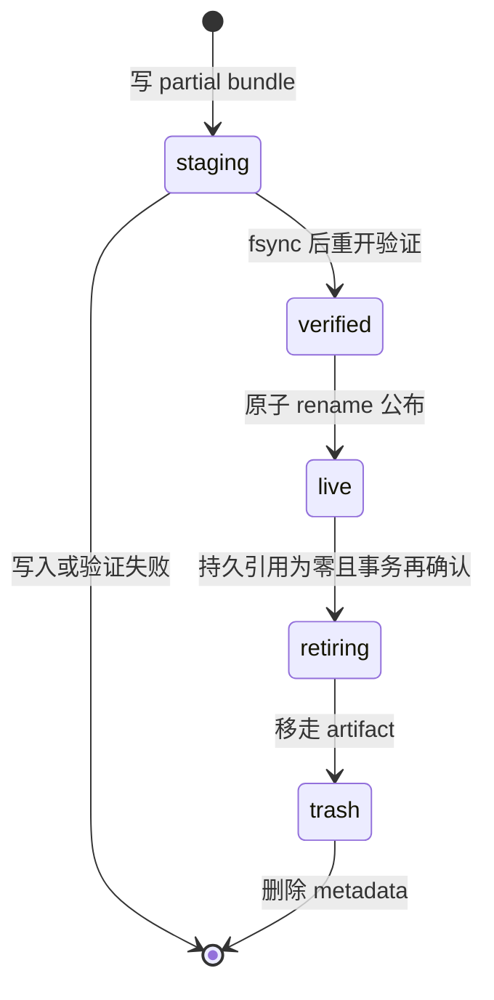
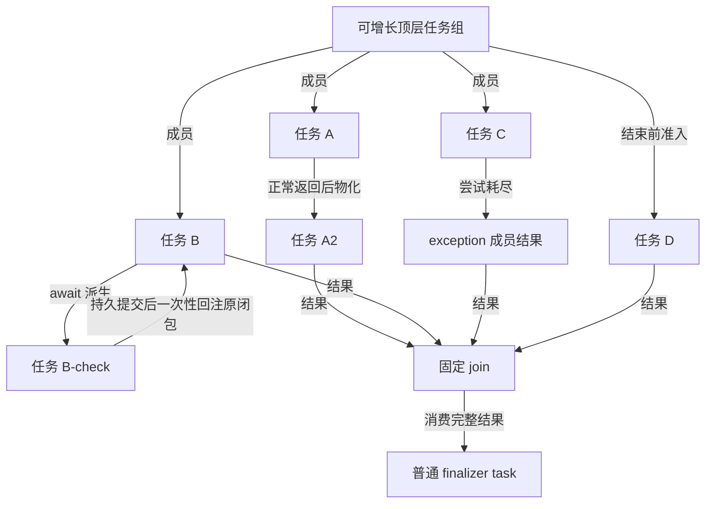
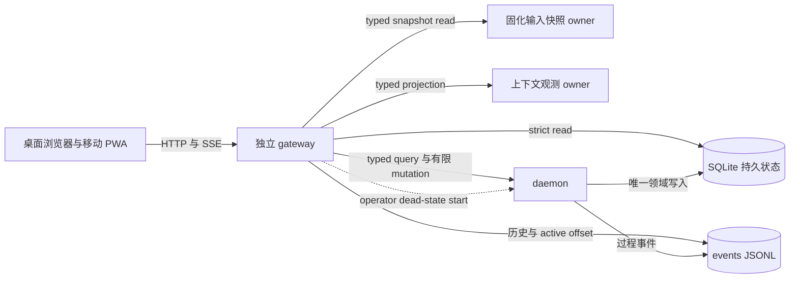

# coder-loop v3 现行设计规范

## 阅读指南

本文是 v3 的唯一现行设计规范，规定有效状态、责任边界、失败处理和验收条件，不宣称这些能力已经在生产中实现。[A：设计依据与决策记录](A.md#a-guide)保存历史推理与候选；[BE：Effect v3 实现指南](BE.md#be-guide)解释实现方式，二者均不得覆盖本文合同。历史调查与来源集中在[来源附录](#b-provenance)，不作为当前运行证据。

规范中的“必须”和“禁止”是强制约束，“应”表达设计要求的优先选择，“可以”表示边界内允许的选项。代码标识保持固定拼写，章节标题不承担引用身份。

首次阅读按下列顺序；实现某一边界时，先读公共模型，再读该责任章及集中验收。

- [规范词表](#b-terms)与[公共模型](#b-model)：对象、值、执行阶段和唯一交接边界。
- [定义资产与编译](#b-definition)、[函数域执行](#b-function)：定义如何成为可验证的执行输入，以及闭包如何求值。
- [任务代数与调度](#b-task)、[工作空间](#b-workspace)：持久事实、并发组合和执行资源。
- [入站工作接纳](#b-ingress)、[执行提供者](#b-provider)：两个方向各自的身份、授权和故障责任。
- [旁路钩子](#b-hook)、[观测与有限操作](#b-observe)：观察可以做什么、不能取得什么权力。
- [集中验收](#b-verify)与[来源附录](#b-provenance)。

## 规范词表

下表给出正文使用的规范名称及其领域含义。“标识或对应表达”列保留实际使用的英文名称、类型或字段；没有独立代码标识的概念直接说明，不另造字段。初始输入值、值提升与运行结果的区别，以定义列为准。

### 对象与执行资源

| 规范名称 | 标识或对应表达 | 定义 |
|---|---|---|
| 任务链 | `chain` | 组织工作项和任务组的运行实例，不等于工作空间或 Git 仓库。 |
| 工作项 | `item` | 进入或派生任务时携带的类型化输入值；其外部身份用于工作接纳和去重，不构成另一个可变调度对象。 |
| 任务 | `task` | 对象域中具有稳定身份、组合位置和执行权的调度对象。 |
| 步骤 | `step` | 任务内部的工作流定义单元，以 `nextStep` 表达后继选择；不等于任务或执行阶段。 |
| 函数标签 | `phase` | 值域中标识被调用函数的标签，同时用于授权和审计；不表示步骤或执行阶段。 |
| 执行阶段 | 不设独立标识 | 一次交接内严格依次发生的五个位置：前置映射、提示词组装、agent 执行、后置映射、流转判定；不等于 `phase` 或 `step`。 |
| 运行 | `run` | 由引擎追踪、授权和观测的执行记录，运行身份关联执行工具与结果。它与任务尝试承担不同责任；本文不规定二者的一对一或其他基数关系。 |
| 任务尝试 | `attempt` | 重试与恢复所针对的一次任务求值尝试。原续接状态丢失后，不能在同一尝试内从头执行并声称恢复了原函数实例。 |
| 任务组 | `group` | 将成员的完整结果交给固定消费者的组合。单成员组同样适用这一合同，任务组不等于任务链。 |
| 汇合消费者 | `join` | 针对任务组的固定结果消费者。实例化后，所消费的结果合同与消费含义不得热改。 |
| 执行闭包 | `closure` | 任务私有的函数域执行范围，包含工作空间、会话和临时资源；不提供可持久重放的步骤账本。 |
| 工作空间 | `workspace` | 提供执行目录及访问、保留、重新接入和回收能力的资源接口。后端选择与 Git 状态的值消费相互独立。 |
| 会话 | `session` | 执行工具保存的当前闭包私有会话，不能直接成为跨任务输入。 |
| 续接状态 | `continuation` | 为继续原函数实例而保留的私有执行状态。恢复时必须验证身份和存续，路径存在本身不足以证明可续接。 |
| 临时资源 | `scratch` | 执行闭包私有的临时文件等资源，不能构成未声明的跨任务传值通道。 |

### 值与定义资产

| 规范名称 | 标识或对应表达 | 定义 |
|---|---|---|
| 业务上下文 | `context` | 当前执行阶段已拥有的类型化值。各阶段使用 `context₀`、`context₁`、`context₂`、`context₃`，逐次增加值，不改写既有值；与 Effect 的 `Context` 不同。 |
| 初始输入值 | `item`、`context₀` | 工作项直接交给闭包、用于建立 `context₀` 的类型化不可变值，不要求额外经过映射提升。未解析的外部文件或输出不是初始输入值。 |
| 映射 | `map` | 读取已有上下文，对声明的脚本输出进行解析、检查和类型化提升的程序；原始标准输出本身不是映射结果值。 |
| 值提升 | `promotion` | 通过声明的解析与类型检查，使外部结果成为可消费值。文件存在或仅提供资源地址都不构成值提升。 |
| 自报告 | `self-report` | agent 在场期间，通过填值解析器提交声明允许的值。 |
| 测量 | `measurement` | 脚本读取外部状态，再由映射将结果提升为值；可计算事实优先由测量产生。 |
| 工作流预设 | `preset` | 完整工作流及其可发布定义资产，不指单个步骤。 |
| 定义 | `definition` | 类型、值来源、提示词消费、映射、谓词和后继的静态声明。 |
| 定义包 | `bundle` | 发布后的完整不可变定义资产，包括提示词、映射、公共 schema、manifest 等。 |
| 编译结果 | `CompileEnvelope` | 一次完整编译判定，保留 `compiled` 或 `rejected` 分支及全部编译诊断。其身份不同于编译产物身份和定义内容身份。 |
| 编译诊断 | `finding` | 具有稳定身份和类型化内容的编译诊断；显示文字只作解释，不能用于控制流判定。 |
| 定义发布 | `publish` | 验证并公布完整定义包，之后才允许实例写入其引用；不等于 Git 交付。 |
| 固定定义引用 | `pin` | 实例固定精确的已发布定义引用。执行和恢复必须使用该引用，不能改读当前源定义。 |
| 定义解析 | `resolve` | 按精确引用取得并验证定义包；不同于对外部输入执行类型解析的边界解析器。 |

### 交接与持久事实

| 规范名称 | 标识或对应表达 | 定义 |
|---|---|---|
| 唯一交接边界 | `returned(value) \| exception` | 对象域与函数域唯一的正式值交接：入口由工作项值直接建立 `context₀`，出口只交付正常返回或执行异常。中间上下文和内部执行过程不进入对象域任务账本。 |
| 填值校验 | `parser` | agent 在场时，将外部 `unknown` 解析为声明类型 `T`。错误返回同一在场 agent 修正，不直接转为任务失败。 |
| 流转校验 | `predicate` | 在完整上下文上求值的纯谓词。结果为 `false` 时进入 `fail` 或 `NIL`，不作为填值解析错误处理。 |
| 正常返回 | `returned(value)` | 符合声明联合类型的业务结果；负面业务结果也可以是正常返回。 |
| 执行异常 | `exception` | 未正常交付结果的异常分支，可以携带类型化异常升层信息，但不增加第三种出口。 |
| 异常升层 | `escalation` | 当前步骤无法处理、通过 `exception` 交给对象域的结构化异常信息，不能另设控制通道。 |
| 失败处理步骤 | `fail` | 工作流声明的特殊步骤，用于处理失败；不是所有错误的统称。 |
| 缺省处理标记 | `NIL` | 没有显式处理声明时，沿既定作用域查找策略的专用标记，不是普通空值。 |
| 准入判定 | `admit` | 判定请求提出的位置、时机和授权是否合法；不替调用者选择其他位置。 |
| 任务结果提交 | `settlement` | 单任务的正常返回或执行异常成为已提交结果，不等于任务组结束或组结果消费。 |
| 任务组结束 | `termination` | 按声明与等待窗口结束成员收集；结束后不重开。 |
| 组结果消费 | `consumption` | 固定消费者处理任务组的完整成员结果，不等于某个成员返回。 |
| 持久状态转换 | `committed transition` | 经 SQLite 提交的对象域状态变更，是唯一的对象域写入权威；任意 `commit` 回调不因此获得领域写入权。 |

### 外部执行、观察与回收

| 规范名称 | 标识或对应表达 | 定义 |
|---|---|---|
| 终结判定任务 | `finalizer` | 接收顶层组结果的普通任务。返回 `advance` 才完成任务链，`hold` 保持开放，`exception` 按声明处理。 |
| 执行提供者 | `provider` | 将固化调用送到真实执行端，并产生封闭执行事实的适配实现。 |
| 执行工具 | `runner` | 执行 agent 调用的工具，不负责工作空间的业务语义。 |
| 执行端 | `endpoint` | 由真实目标参数确定的外部执行终端，不能只按可执行文件识别。 |
| 可用性/状态探测 | `probe` | 按真实外部合同读取执行端可用性或运行状态；保留 `unknown` 结果和观测新鲜度。 |
| 启动前缺席 | `pre-spawn absence` | 启动前确认执行端缺席的事实。不建立运行，不为本次调用新建工作空间，也不进入普通进程启动退避。 |
| 终态提交胜出 | `terminal winner` | 同一运行的持久排序中，终态接纳（terminal admission）先提交并胜出的事实。 |
| 运行中丢失 | `active loss` | 同一运行的持久排序中，丢失判定胜出的事实；由对象域这一唯一消费者转为 `exception` 提交。 |
| 副作用结果未知 | `unknown effect` | 无法证明外部副作用结果，且无法取得唯一终态或丢失结论的事实；由对象域挂起处理，不重复推进。 |
| 旁路钩子 | `hook` | operator 配置的观察脚本，可以产生外部副作用，但不构建业务上下文，也不拥有流转判定权。 |
| 投递 | `delivery` | 入站或旁路钩子各自作用域中的逻辑投递责任。两套投递必须标明所属作用域，不能合并身份。 |
| 请求 | `request` | 一次面向引擎命令的请求身份及其持久判定，与投递身份、工作身份不同。 |
| 工作身份 | `work identity` | 已接管工作的规范去重身份，以 `(chain, itemId)` 表示。 |
| 钩子执行 | `execution` | 履行一次钩子投递的实际启动尝试，不等于该投递本身。 |
| 只读投影 | `projection` | 对既有事实的读取表达，不拥有事实判定权或写入权。 |
| 责任方 | `owner` | 唯一负责指定合同的定义、判定或写入的模块。职责须明确到具体权力；调用或展示该合同不转移权力。 |
| 资源回收 | `GC` | 在持久可达性允许、证据已冻结之后释放资源，不等于任务返回或连接关闭。 |
| 交付观测 | `publication` | Git 交付场景中冻结的旁路证据，不决定任务流转，也不等于定义发布。 |

### 不能混淆的概念

| 概念 | 必须保持的区别 |
|---|---|
| 步骤、函数标签、执行阶段 | 步骤是内部定义单元；函数标签用于标识调用、授权和审计；执行阶段规定一次交接内的顺序。五个执行阶段不等于五个步骤或五个任务。 |
| 运行与任务尝试 | 运行身份关联授权、执行工具和结果；任务尝试是重试与恢复单位。本文不规定二者的一对一或其他基数关系。 |
| 提交、结束、消费 | 任务结果提交确定单成员结局；任务组结束停止成员收集；组结果消费由固定消费者处理完整结果。三者不能互相替代。 |
| 工作项、任务、任务链 | 工作项提供输入值与工作身份；任务是被调度对象；任务链组织工作项和任务组，不等于执行工作空间。 |
| 预设、步骤、定义包 | 预设表示完整工作流，步骤是内部定义单元，定义包是已发布的不可变资产；不使用“步骤级 preset”另指一种粒度。 |
| 初始输入、值提升与副作用 | 类型化工作项值直接建立 `context₀`，不要求额外映射。外部测量或自报告须经声明边界解析、提升；文件、标准输出、会话正文、资源地址及后端准备参数不会自动进入业务上下文。业务上下文也不是 Effect 的 `Context`。 |
| 值提升、定义发布与交付观测 | 值提升使外部结果成为可消费值；定义发布公布不可变定义包；交付观测保存 Git 旁路证据。三者分别对应 `promotion`、`publish`、`publication`。 |
| 准入与消费 | 准入判定新增任务的位置、时机和授权；组结果消费处理已收集的结果。准入成功不代表执行完成。 |
| 定义解析与填值解析 | 定义解析按精确引用验证定义包，不能以当前源定义替代；填值解析按固定定义验证边界输入，其他入口不能复制解析权威。 |
| 挂起处置与提供者事实 | `held`、`unknown hold` 是对象域处置；提供者的四类封闭事实才是处置依据。generic `held` 不是第五种事实。 |
| 钩子副作用与流转权力 | 旁路钩子可以改变外部世界，但其结果不进入业务上下文，也不能判定路由、撤销已提交结果或取得领域写入权。 |

“来源面”说明值从何处产生及何时可达；“消费面”说明提示词、谓词和路由在哪里读取值。“值管道”由这两面及解析、提升共同构成。对象域和函数域是两个执行域，值域只是二者之间不变数据的分类，不是第三个执行服务。

历史材料曾将唯一交接边界称为“针眼通道”。该名称仅用于理解历史引用，不是现行规范名称或代码标识。

## 公共模型

对象域拥有任务、任务组、执行锁、准入和持久状态转换。互不依赖的动作必须可交换；已提交事实只能增加，重复提交按稳定身份收敛，调度顺序不得成为业务语义。任务数量、派生时机和并发成员由运行时的持久状态转换决定，不能预先编译成完整实例树。

函数域拥有单任务的执行闭包。它必须按五个执行阶段刻画值何时成立；上一阶段未形成合法产出时，下一阶段不能开始。工作流定义是静态声明，类型、值来源、映射签名、提示词消费、谓词槽和后继闭集必须在执行前可判定。

两域只有一个正式值交接边界：对象域以工作项的初始输入值建立 `context₀`；闭包只交付 `returned(value) | exception`。异常升层放在 `exception` 的结构化内容中，不新增第三出口。中间上下文、填值驳回、脚本执行和步骤进度不进入 daemon 任务账本。

`await` 仍服从这一边界：被等待任务的结局由对象域持久提交并按一次性消费规则回注；保留的闭包只是续接资源，不是第二条值通道或步骤账本。

### 值来源与两个提升入口

引擎只推理已提升的值。agent 可以修改文件、启动进程、调用外部系统或积累会话判断；未提升副作用在物理上仍可能存在，但不进入本次交接的提示词、校验或流转。以后需要消费时，必须重新通过声明的采样和映射提升。

观察 agent 及其副作用的提升入口只有两个：自报告在 agent 在场时经 parser 提交声明值；测量在 agent 执行后通过脚本与 map 形成值。前置映射负责准备输入，不是第三个 agent 副作用提升入口。

可计算事实应由测量产生：测试结果、文件存在性等能够计算的信息，不再依赖 agent 断言。自报告只承载测量不能覆盖的意图、判断与后继选择。信任边界是先扩大可计算测量的范围，再使用不可测量的判断，不是先相信自报告再复核。

每个值必须唯一来自工作项、某一个 map 或 agent。同名多来源是编译非法状态，禁止在运行时按覆盖顺序选择来源。上下文保留已经形成的值，只增加新值，不通过删除或改写既有值改变历史。

编译期只能证明声明闭合、签名匹配和类型正确的来源路径可达；不能证明脚本必能启动、map 必得 `Just<T>`、agent 必提交合法值或谓词必为真。运行结果必须在实际边界解析和求值后取得。

### 五个执行阶段

| 执行阶段 | 输入与责任 | 合法产出 |
|---|---|---|
| 前置映射 | 读取初始 `context₀` 与声明脚本结果，完成解析提升 | 全批合法后原子形成 `context₁` |
| 提示词组装 | 按固定定义消费 `context₁`，组装并立即固化输入 | 本次 agent 的固定输入 |
| agent 执行 | 在场 agent 提交声明值，parser 接纳全部必写值 | `context₂`；未接纳时停留本阶段 |
| 后置映射 | 读取 `context₂`，测量副作用并解析提升 | 全批合法后原子形成完整 `context₃` |
| 流转判定 | 在同一 `context₃` 上穷尽求值纯谓词，再消费相应路由 | 正常后继、正常返回或 fail/NIL 路径 |

阶段之间严格串行；同一映射阶段内部没有声明顺序，执行器可以并行，具体 barrier 见[映射合同](#b-map-contract)。因此阶段串行不要求把独立映射或独立任务串行化。

### 两层校验

填值校验在 agent 在场时将 `unknown` 解析为 `T`。字段缺失或类型错误必须反馈结构化错误给同一 agent，让它原地修正。该驳回不产生对象域失败、不创建新任务尝试，也不替 agent 补值。

流转校验在完整上下文上执行纯谓词。类型与来源已由边界证明，不等于自报告内容真实；谓词判断这些值是否支持正常交接。false 终止本次正常流转，进入 fail/NIL，不能再当表单错误退给已经结束的 agent。

每个上下文值都有谓词槽，未显式声明时恒为 true，不生成空代码。最终判定只有 true/false；外部脚本或输入固化的失败必须在此前所属阶段处理，不能增设“判定不可得”。

### 校验、后继选择与失败路由

校验与后继选择是正交责任。必须先穷尽谓词；任一 false 时不得消费已经形成的正常路由值。正常 chooser 与 fail 路由不共享一个选择过程。

| 合法后继数量 | `nextStep` 合同 |
|---|---|
| `n ≥ 2` | 定义必须声明 agent 或 map chooser；运行值必须属于 pinned 合法 step identity 字符串闭集，未知 variant 不进入 default。 |
| `n = 1` | 引擎填唯一候选，不要求 agent 或 map 重复选择。 |
| `n = 0` | 不构造内部后继；以完整值包形成 `returned(value)`，由对象域决定后续任务或任务链结束。 |

`fail` 是可由预设声明的特殊步骤。未声明时专用 `NIL` 补足结局位，按步骤、任务、组、工作项作用域查询配置；不存在 `undefined` 结局。重试与耗尽后的动作分轴，由[重试与异常升层](#b-retry)唯一规定。

### 同一交接语法的两个作用域

步骤与任务共用一份交接语法：交付值包、必写值解析与声明测量、完整上下文谓词、正常路由或 fail/NIL。定义资产必须声明两种作用域所需的值包、谓词和路由，不能形成两套语义。

持久性不同：任务提交是不可撤销、崩溃后必须恢复的历史事实；步骤前向只是闭包内执行纪律，恢复单位是任务尝试，不是单个步骤。步骤资源不具单步骤持久恢复保证，可以整体丢弃并按既定重试策略重放；恢复单位始终是任务尝试。续接丢失后的重放必须属于策略允许的新尝试，禁止冒充原函数实例恢复。

步骤内部事实只能折叠为 `returned(value) | exception`。对象域不得解释或恢复某个内部步骤；观测投影可以保留诊断痕迹，却不能据此取得调度权。任务结果提交、任务组结束与组结果消费仍是三个不同动作。

## 定义资产与编译

定义责任方管理执行前可封闭判定的声明文本，向函数域和对象域提供同一份已编译、发布并固定引用的定义。它证明合法路径存在并保证内容可取回，不预执行脚本、不替 agent 填值，也不生成完整运行实例树。

### 三面资产与机械生成

完整预设必须同时具有类型定义、提示词 Markdown、映射资产。类型定义说明各执行阶段的上下文形状及唯一来源；提示词说明文本消费位置；map 文件承载外部结果的解析与提升。映射骨架属于定义资产，必须参加编译、发布和固定引用，不是附属缓存。

作者先写类型与提示词，再由 CLI 按每个 map source 的阶段机械生成骨架。生成器只提供可检查的输入、输出签名，以及开始执行前可用上下文及类型的注释，不猜测业务转换，也不把未完成骨架称为可直接运行文件。注释和签名必须来自同一类型定义。

生成器禁止为 item source 或 agent source 制造虚假 map。缺失、未补完、签名不符，以及类型、来源或阶段变更导致的 stale 骨架与注释，都属于定义未完成，必须在严格执行前报告。

两层交接的类型、值包、谓词槽、正常后继和 fail/NIL 声明均随定义包发布。定义态只拥有语法和编译权；[函数域](#b-function)执行步骤交接，[对象域](#b-task)提交任务结果并物化后继。

脚本扫描、发现、import、glob、barrel、loader 与运行时注入是 TypeScript 工程细节，本文不规定其算法或目录布局。预设整体不变成代码载体，内部类型库也不成为公共类型语言。v3 不提供 tool/gate 的 journal、decision point、dependency 或 proof gap。

### 映射的输入、结局与汇集屏障

映射形状为 `map(context, bashscript())`。外部命令的 string 或未验证结构必须结合已有上下文解析、检查，才能提升为 `Just<T>`。`Nothing` 表示本次没有形成声明的 `T`，不得补默认值伪装成功。

同一前置或后置阶段的映射集合由 pinned 定义固定。每个 map 只能读阶段入口处同一份只读上下文快照，不可读同阶段其他 map 的产出；既没有声明顺序，也没有以执行顺序形成的可见性。前置快照只含工作项值，后置快照还包含前置值与已接纳的 agent 值。

每个 map 归结为 `produced(T) | absent | fault(MapFault)`。执行器可以任选物理顺序与并行度，但任何同批结果都不得取消或跳过其他 map，也不提供 preset 级 fail-fast 参数。

汇集屏障（all-settled barrier）收齐全部结果后，先聚合 fault，再按 compiled contract 判断必需值缺席。`produced(T)` 在屏障之前仅是待提交值。有 fault 或必需值缺席时，整批只产生一次聚合程序异常，不发布部分上下文；整批合法时，按唯一值名原子形成 `context₁` 或 `context₃`。

执行闭包级 stop、deadline 或进程丢失是外部中断，不是同批失败传播。复用同一测量的成本由观测单元级 product value 解决，不能通过 map 互见补偿。前置与后置映射完全对称。

### 双面闭合与唯一编译结果

编译器必须同时检查来源面与消费面：

- 每个值唯一来自工作项、map 或 agent；工作项 default 与类型相容，map 输入在所属阶段可达、输出签名匹配，agent source 只出现在允许提交的位置。
- 提示词占位符、谓词和路由只能读已声明、可达且类型匹配的值。禁止提前读未来阶段值、把 `Nothing` 当作 `T`，或在消费处重新解释来源类型。
- 未消费的声明值、无来源的消费值、未完成 map 形成 finding。谓词槽与有限后继必须穷尽；多后继未声明 chooser 也是闭合性 finding，零或单后继不要求 chooser。

诊断有警告档与严格档。警告档供作者查看 normalized 结果、缺项和生成建议；publish、create 与恢复执行必须通过严格档，任何未闭合 finding 都禁止执行。声明内部结构矛盾直接产生 rejected `CompileEnvelope`，不能关闭严格档放行。可理解但未完成的定义可以保留 findings，不具运行资格。

每个稳定 source snapshot 只有一个 `CompileEnvelope` 判定。compiled 分支同时包含 normalized compiled product 与结构化 findings；rejected 分支包含非空 diagnostics。CLI、doctor、cache、status、GUI 只投影或引用该结果，不另行判定同一静态事实。finding 必须有稳定 identity 与 typed payload；message 只解释，不决定控制流。

| 身份 | 代表什么 | 不可替代的原因 |
|---|---|---|
| `CompileEnvelope identity` | 编译判定与全部 findings | 诊断规则变化不等于执行定义变化。 |
| `compiled product identity` | normalized 可执行定义 | 它不是完整发布资产的内容身份。 |
| `definition content identity` | 已发布、可供固定引用的完整 bundle | 资产变化不能复用旧内容身份。 |

三种身份可以互引，不得合成一个 hash。公共 schema 由 compiler 边界产生，是同一判定的投影，不是另一 parser。消费者未接入只说明验证尚未完成，不授权它复制 schema。所有读面只能显示 compiled/reachable，不得显示成运行结果已满足。

### 不可变发布与固定引用

严格闭合产物必须先发布完整 bundle，实例才能写入 exact definition ref。bundle 至少包含 normalized preset、类型与来源声明、prompt 与 fragments、文档渲染声明、谓词槽、后继闭集、脚本声明、补完的 map 资产、公共 schema 和 manifest。资产 bytes、签名与 digest 共同参与内容身份。

发布必须依次执行：在同一 filesystem 的 staging 目录写入不可解析的 partial bundle；逐文件 `fsync` 后 `fsync` 目录；按 canonical bytes 计算内容身份；重新打开并验证 manifest、每个 asset digest 与整体身份；全部通过后原子 `rename` 公布 artifact，并将 metadata 置为 `live`。

同 ref 同 content 重复发布是幂等成功；同 ref 不同 content 是 identity collision，必须拒绝。不同 ref 不能因“只留最新版”互相清理。发布复用原 `CompileEnvelope`，不重新算 findings，也不合并三种身份。

先发布后写引用保证崩溃最多留下完整、可回收的孤立定义包；禁止先提交实例引用再补内容。

### 精确解析、保留与定义失败

所有实例定义消费者必须经 shared resolver 按 exact tagged ref 取得 verified bundle。冷解析验证 ref kind、schema、`live` metadata、manifest、每个 asset digest 与整体 identity，通过后才缓存。cache 只能表达 `definition ref → verified content`；miss 重读 immutable store，禁止回退 current path。

实例固定 H1 后，spawn、resume、restart 都取 H1 的类型、提示词、映射、谓词和后继。H2 只进入新的编译发布，不重绑旧实例。cache hit 与 miss 必须保持同一语义。

定义 GC 仅以 persisted ref 可达性为权威。chain、item、task、run 或保留历史中的任意 ref 都阻止退役。零引用候选须在事务中再次确认后才从 `live` 进入 `retiring`；再移至 trash、删除 metadata。重启从持久的 retiring/trash 继续，进程 cache 不是保留权威。`retiring` 拒绝新 resolve 与 create。

| 失败类别 | 判定与结果 | 恢复边界 |
|---|---|---|
| `compile rejected` | 结构矛盾直接 rejected；严格档未完成、stale、未消费等 findings 禁止执行，不产生 live 定义。 | 修改声明或补完 map，以新稳定 snapshot 编译并发布。 |
| `admission rejected` | 具体 create/update/batch 不满足 pinned parser 或完整对象不变量；保留 field/path/expected/actual，零写或零部分写。 | 修正输入，以同一 pinned 定义重交。 |
| `definition corrupt` | bundle/asset 缺失，digest、schema、kind 或整体身份不符。新实例在副作用前拒绝；已固定引用的实例可见 hold 并显示 exact ref。 | 恢复同一身份的真实 artifact 并验证；禁止 current 重编译、旧 cache 或兼容包替代。 |
| `legacy-definition-unproven` | pre-ref 历史缺少能证明当时完整定义的 artifact。list/status/audit 可读；resume、schedule、mutation 停止。 | 仅真实历史 artifact 经验证可解除；repository 字段、残留目录、event、status 或 current 源码不足以证明。 |

这些类别不能压成一个字符串或相互 fallback。定义失败也不等于函数域异常、对象域调度状态或 provider 事实。

### 类型化工作项接纳

工作项 candidate 必须以 `unknown` 进入 request 绑定的 pinned parser；成功后才成为初始输入值。失败至少保留 field、path、expected、actual，不写业务对象。CLI、renderer、入站适配器与对象域不得各自重解释类型。

`missing`、空字符串、`null`、`false`、`0` 和空集合须保持区别；`null` 仅在声明允许时合法，禁止 truthiness 丢值。default 只属于值声明，消费位置不能补空串或另做归一化。

update 先把 patch 应用到旧对象，再解析完整对象并检查跨字段不变量，不能只查孤立 patch 字段。batch 的全部元素共享同一 pinned 定义和接纳规则，任一失败整批零写。运行时物化由对象域负责；在场 agent 的填值循环由函数域负责，二者只消费同一类型权威。

## 函数域执行

函数域只消费已验证的固定定义，不重新扫描 current preset，也不补类型、来源、消费位置、谓词或后继。其职责是把初始输入求值为 `returned(value) | exception`，对象域负责随后物化、加锁、调度与消费。

### 执行顺序与进入条件

1. **前置映射。** resolver 已验证 pinned 定义，工作项已按同一 parser 形成 `context₀`。执行声明映射并遵守[汇集屏障](#b-map-contract)；全批合法才形成 `context₁`。启动失败、超时、抛错、无法提升或必需值缺席由程序面处理。
2. **提示词组装。** 仅在 `context₁` 满足消费合同后进入。renderer 逐个读取 pinned prompt 与文档渲染占位符，按 canonical value text 渲染对应 `Just` 值，不以空串、地址或说明补缺。全部解析后立即固化输入；后来的上下文增量不能回写。renderer、IO 或固化的运行时残余失败不创建 agent run，由程序面处理；声明级缺值须先被编译拒绝。
3. **agent 执行。** 固定输入形成后建立 runner invocation。在场 agent 只提交当前运行声明的 agent source；必写值全部合法后形成 `context₂`。不完整或错误提交停留本阶段，不启动后置映射。崩溃、失联或在场者消失属于程序异常，不是表单驳回。
4. **后置映射。** agent 阶段关闭或为空后进入。读取工作项值、前置值与已接纳 agent 值，在同一现场测量；按对称屏障形成完整 `context₃`。`Nothing` 不产生值，必需值缺席和脚本故障必须在判定前处理。
5. **流转判定。** 仅在所有外部输入已解析且 `context₃` 完整时进入。一次穷尽求值所有声明谓词；全 true 才消费正常路由，任一 false 进入 fail/NIL。禁止执行脚本或补出第三种判定结果。

上一阶段的异常若未在闭包内处理，直接折叠为 `exception`，禁止让下一阶段消费部分上下文。

### 自报告、归因与提交关闭

pinned 定义列出当前阶段的允许值、精确类型和必写性。交互 CLI 只接受这组值，将 payload 视为 `unknown`；parser 通过后才能加入上下文。驳回必须含结构化字段或路径、expected、actual，供同一在场 agent 修正；调用过 CLI 不代表值已成立。

author 不可由调用者自报。daemon 从验证过的 run credential 恢复 chain、item、run 与 phase 归因，把写权限限定为当前运行自己的声明值。其他运行、其他任务链、未声明字段或伪造 author 均不能扩权，operator 也不能冒充 agent 自报告。

接纳完整必写集合与关闭写入口必须在阶段出口共同完成。关闭后 credential 对该填值入口失效；迟到、重放和并发写入必须拒绝，不能改写 `context₂`。在场者丢失时关闭入口并丢弃未接纳的部分提交。这些瞬时事实不写 daemon 任务账本。

### 失败处理及异常归属

显式 fail 后继优先，可以是 agent 或纯程序步骤，仍服从固定定义和五阶段合同。未声明 fail 时使用 NIL；“未声明”是合法缺省，“声明类型却未实现”是定义失配，必须由编译拒绝。

函数域只执行当前步骤内可完成的处理、重试、跳过或结束路径。跨任务、任务组和工作项动作只能通过 `exception` 携带 typed escalation 交给[对象域 evaluator](#b-retry)，不能直接写账本，也不复制策略。

| 发生位置与结局 | 当时消费者与动作 |
|---|---|
| 前置或后置 map 启动失败、超时、抛错、无法提升、必需值 `Nothing` | 程序面走显式异常路由；未声明时查询 NIL。步骤内无法处理时按声明异常升层。 |
| 提示词组装、renderer 或固定输入失败 | 程序面执行步骤级异常动作，不创建 agent run；无法处理则交付 exception。 |
| agent 值缺失或 parser 拒绝 | 返回结构化错误给在场 agent，保持同阶段，不升层。 |
| runner 崩溃、失联或在场者消失 | 程序面关闭填值入口，清除未接纳部分；步骤层无法处理则交付 exception。 |
| 谓词 false | 不消费正常路由，执行 fail 或 NIL 的步骤动作；需要跨层处理时异常升层。 |
| 谓词全部 true | 继续合法内部后继；仅 `n = 0` 的正常值包交给对象域。 |

异常归属取决于当时谁能触及相应副作用，不存在统一解释所有失败的全局处理器。前后置脚本执行时 agent 尚未启动或已经退出，不能要求它修正脚本故障。

跨层配置给出对象域动作时，异常携带该 typed escalation；配置穷尽时携带“级联穷尽” escalation。后者由对象域产生最高层级全局停机动作，不能被普通并行组吸收，不通过特殊 exception 或第三出口实现。

### 无 agent 的步骤

未声明 agent source 的步骤可以完全不实例化 agent。提示词组装仍按 pinned 声明完成消费和固化；没有 agent consumer 时 compiled prompt projection 为空。随后关闭空 agent 阶段，`context₂` 在值上等于 `context₁`，再执行后置映射和纯谓词。

这是一套合同的退化实例，不是跳阶段或第二种任务代数。fail 路径可以用零 agent 的测量、清理或确定性后继选择；需要判断时也可以声明 agent 处理步骤。

### 调用与信息传递边界

`claude`、`codex`、`opencode`、`hapi` 在函数域只体现为不同 argv builder。语义输入仍是 pinned 提示词与上下文声明投影，输出只从自报告、测量采样。未提升 stdout、文件、后台进程与会话判断不能成为正常返回。

运行时禁止隐藏拼接提示词。引擎 epilogue 常量必须进入可编译、发布、固定引用的 prompt 或文档渲染声明。`SHARED_CONTEXT_FILE` 等路径即使注入 argv/env，也不能代替值；需要其内容时，必须通过声明 map 读取、解析、提升。

需要任务文件的 map 与 runner 必须使用[同一工作空间引用](#b-workspace-interface)。工作项的类型化入口值直接建立 context₀，不要求额外 map 提升。准备、访问或传输资源本身不产生上下文；提供者差异不能改变五阶段、类型合同或两个提升入口。

v3 核心禁止 opaque body append/read 旁路协议占用 `context` 概念。其 scope、分页、分块提交、存在性终判和 group membership 不构成闭包完成条件。未来若出现独立的不透明信息需求，必须另行定义信任、生命周期、授权与故障合同，不能借存储正文让 agent 自行解释来绕过值提升。

跨运行正式传值只有：当前闭包正常返回值，经对象域持久提交，形成后继工作项输入，再建立新闭包 `context₀`。文件、stdout、会话和旁路正文的残留都不能绕过此边界。禁止步骤级 durable journal；观察到的上下文、map、谓词或内部路由不具有持久调度权。

## 任务代数与调度

对象域拥有准入、任务物化、组合位置、运行锁、任务结果提交、任务组结束与消费。它只消费已发布且固定引用的定义、闭包二分结局和提供者封闭事实，不解释内部步骤或业务词义。

### 对象、值与运行身份

A、A2、B-check、D 和 finalizer 都是任务，拥有稳定身份、组合位置与执行权。私有工作空间、runner session、scratch 和等待期间的续接状态属于执行闭包。工作项是初始参数；phase 是函数标签；status tag、binding、exit 是输入或输出值，不是可变调度对象。

调度器不解释业务 tag。`needs_revision` 或 `{tag: "review_rejected", ...}` 只要属于声明返回 union，并有穷尽派发，就是正常返回，业务后果由后续任务处理。没有正常返回值的 runner 崩溃或任务尝试耗尽才是执行异常。

状态读面必须分开显示任务返回/异常、闭包资源生命周期和业务返回值；exception 还要关联 attempt 与 closure identity。旧字段只能明确投影或转换，不得既是权威输入又是派生输出。

定义态描述 phase 返回分支、后继、await 与 finalizer；编译态形成精确且可引用产物；运行态只实例化固定定义。任务链运行中追加 D 或派生 B-check，仍必须完成其定义检查并固定精确引用，不得热改已有任务和 join。工作空间准备参数来自显式 typed 配置，不因后端使用 Git 就成为业务输入。

### 派生是按返回值应用固定定义

声明参数先固定为等待运行值的函数；工作项初始值或前驱交付值到达后才应用并形成具体任务。这一分阶段供参不要求特定函数式库。A 正常返回后，tag 选择 pinned 后继函数，交付值形成 A2。

未选择的后继不取得对象域身份。exception 没有可应用的正常返回值，不得预建或激活正常后继；合法负面业务分支仍可正常物化 correction task。历史必须保存派生所用 definition ref、输入值 identity 和派发原因。

### 任务组、固定消费与等待窗口

统一结构是一个节点消费一个任务组。单成员消费退化为 `seq`，`seq` 不与 `par` 构成两套运行时构造；多成员无依赖时可并行提交结果，消费者接收完整结果向量。

成员结局为 `returned(value) | exception`。exception 作为一项 typed 结果到达最近多成员组边界，不阻塞其他成员；单成员消费链上没有正常后继可应用时沿声明结构传播。不在可处理组内且没有消费者时，结构在此停止，界面必须明确展示，不无限显示运行中。

不关心结果值的消费者使用 drain；需要业务判断时实例化 validator 或 finalizer task。join 创建时固定任务组 identity、结果合同与消费者，固定的是消费含义，不是尚可增长成员的提前快照。禁止运行中热改消费者。

任务结果提交只确定一个成员的结局。任务组结束停止收集，组结果消费由固定消费者处理完整向量；这三项事实不得合并。组结束由消费触发，并遵守声明的等待窗口；当前全体成员提交后，零等待立即结束，非零窗口允许合法新增成员。结束事件提交后禁止重开，迟到请求只能重新提议其他位置。

| `WaitWindow` | 截止点与成员增长 |
|---|---|
| `none` | 全体当前成员提交后立即结束。 |
| `{ duration, mode: fixed-deadline }` | 第一次全体提交时建立固定截止点。窗口内增长后，若截止点已过，新成员全体提交便立即结束。 |
| `{ duration, mode: sliding-deadline }` | 每次成员增长且再次全体提交后，重新建立完整时长窗口。 |

`mode = fixed-deadline | sliding-deadline` 是定义参数，不由 operator 临时裁决。两者只改变结束事件何时能提交，不改变结束前可准入、结束后不可重开的边界。期满必须记录 typed 原因和时间证据，重放不重新等待。

### 等待、依赖与原续接状态

`await` 允许运行任务派生独立下级任务，并持久记录 `AwaitId(parentTask, parentAttempt, awaitSite)`、child identity 和一次性结果消费 token。父任务保存私有 continuation 资源并释放执行锁；子任务拥有自己的闭包、资源和锁。子任务结局提交后，父任务重新取得执行权，向同一函数实例注入一次结局并继续。

continuation 不序列化为步骤账本。子任务 exception 不伪造为业务值，仍由声明消费者结构处理。禁止用 resume prompt、共享文件或手改 status 替代等待关系和一次性消费。

`dependsOn` 是不消费值的布尔门，只按 identity 观察前驱是否提交，不读返回值，不成为第二值通道。写入或装载依赖图必须查环；前驱 exception 且没有可消费结果时，依赖方不启动，系统不能自动放宽条件。

续接恢复必须按[原现场恢复合同](#b-workspace-recovery)分流：原资源和身份可验证时，用同一 AwaitId 继续等待或一次性注入；确认续接丢失时，以 `active loss` 的消费路径提交 exception，再按策略决定新 attempt。不能在同一 attempt 从头执行并称为恢复。

### 统一准入判定

新增任务必须同时提出位置和时机：位置指向当前任务组边界，时机说明相对结束事件是否仍可准入。对象域结合 pinned 合同、开放前沿、结束事实与授权判定，不能仅凭“未来任务”或“当前 item 附近”写入。

同一端口服务已授权的内部派生和[外部入站](#b-ingress)。内部通道由函数域适配，外部通道由入站适配；位置、时机、幂等和拒绝语义只有对象域一个责任方。

成功结果返回 admitted task identity 与已提交位置。拒绝须保留类型化 reason，包括 `position-unavailable`、`timing-invalid`、`contract-rejected`、`unauthorized`，不能压成笼统错误。开放前沿只作为需要重提位置的拒绝结果副产品，不提供独立查询接口再与 admit 竞争。

原位置失效不生成对象域错误状态，引擎也不选替代位置。提议方可换位置和时机重新请求；引擎只判合法性，不判断换位是否业务上合适。事实幂等键绑定外部或内部事实 identity，不绑定位置。拒绝不耗键，只有成功准入才收敛，同一事实不得在两个位置生成两次。

### 重试、耗尽处置与异常升层

对象域拥有唯一显式策略 schema 与纯 evaluator，禁止 optional flag 组合或把“重试/放弃重试”混成一轴。

| 作用域 | 封闭声明 | 求值顺序与限制 |
|---|---|---|
| 步骤重试 | `RetryPolicy = never \| limited { maxAttempts, backoff }` | 先判断是否重试。 |
| 步骤不再重试 | `StepExhaustedAction = skip-step \| stop-task` | 仅 never 或 attempts 耗尽后读取。skip-step 必须由 compiled consumption graph 证明后继不需要缺失产出，否则产生 finding；stop-task 以 exception 结束任务。 |
| 任务处置 | `skip-task \| stop-group` | 任务停止后选择跳过任务或停止组。 |
| 组处置 | `advance-next-item \| stay-on-current-item` | 组停止后决定是否推进下一个工作项。 |

显式 fail 路由优先，其次由 evaluator 按配置逐层选择，最终无消费者时使用硬默认。函数域执行 retry 和 skip-step；跨任务边界的 stop-task 仅通过 exception 携带 typed escalation。

对象域 evaluator 以 escalation 与 policy 为输入，纯求值出穷尽的 task/group/item action ADT；执行器实施动作并写成持久状态转换。二者不重跑函数域异常归属，不读取内部步骤状态。未知 policy variant 禁止进入 default。

显式处理与配置级联全部穷尽时，evaluator 产生全局停机 action，执行器作为最高层级对象域动作执行。它不是特殊 exception，也不能被普通 par 边界吸收。

提供者事实的处置同样逐 variant 唯一消费：启动前缺席产生无 run 的 held 调度处置；terminal winner 经正常交接提交返回或异常；active loss 由对象域把该 run 作为一次 exception 提交；unknown effect 保留结果不确定性，进入 unknown hold，禁止重复推进、spawn 或提交第二份结果。generic held 不作为输入事实，提供者新增 variant 时必须指定唯一消费者并穷尽更新。

### 持久状态转换与执行锁

领域闭集是五类 transition family，不是五个命令名：

| Family | 持久责任 |
|---|---|
| `task admission` | 应用 pinned 定义，经 typed admit 物化任务。 |
| `lease lifecycle` | 取得或释放任务唯一执行权。 |
| `task settlement` | 提交 `returned(value) \| exception`。 |
| `await suspension/resumption` | 保存 AwaitId、child identity 与一次性结果消费。 |
| `group termination/consumption` | 记录 waiting、期满或立即结束，将完整成员结果交给固定消费者。 |

`spawn`、`admit`、`release`、`await` 可以是 CLI 或内部命令名。`commit` 只表示上述转换的原子持久化边界，不能成为允许任意 mutation 的万能动词。

SQLite 提交的持久状态转换是唯一对象域写入权威。每笔转换必须原子验证 family 前置条件、写封闭事实，并更新同事务中的 lease、后继应用或组消费。锁表说明哪个 run 持有当前任务执行权，每个 task 至多一个活 run；锁不能替代结果和组事实，事件也不能替代执行租约。

提交前崩溃只能恢复旧前缀，不推进；提交后崩溃读已提交前缀，不重复推进。status、GUI 和文本日志是具名投影，不能反向写领域状态。兼容操作若存在，必须翻译为合法前向事件，禁止独立制造 ready task。

### 顶层组的终结判定任务

顶层任务组按声明结束后，固定 join 的消费者就是普通 finalizer task。它直接接收完整成员结果值包，这一次消费本身就是任务链结束判定，不先普通消费再二次交给其他环节。

finalizer 使用自己的执行闭包与 pinned 定义。返回 `advance` 才完成任务链；`hold` 保持任务链开放，不重开任何已结束成员；exception 按声明结构处理。输入成员集合、definition identity、返回与异常必须进入同一任务历史。

引擎不特判“足够完成”，不根据 stdout 或 GitHub 状态猜测业务结论。hold 后的防抖、再次询问幂等指纹属于相邻设计，本文不新增周期调度。

### 派生授权与私有资源

runner 可见范围必须明确分为任务私有资源与显式声明通道。涉及共享 Git 存储时，结构性写另受 repository identity 协调，限定在引擎 namespace；这不代替 task identity，也不是隐式业务依赖。

内部调用默认拒绝。只有 phase slice 明确授予对象域调用权并限定 scope，才能提出 admit 位置、时机请求；仅校验命令名不足以授权目标。外部调用者须经过入站身份、授权和审计进入同一端口。缺失 runtime binding 禁止回退全局搜索。

目录分开不是访问控制。env、文件可见性、网络、sandbox 与 credential principal 仍须显式限定，禁止借 ambient Git credential 或共享 config/hooks 绕过声明通道。授权不要求封装全部计算或禁止项目允许的互联网，但每条跨任务和共享写路径必须有明确来源，审计关联 run/task/phase。

### 前向边界与迁移约束

禁止后向状态转换：禁止通过 `unblock` 复活已完成任务，单成员消费不倒退，已结束或已消费任务组不重开。需要纠正时创建新的前向任务并保留旧历史。禁止子树取消和自动回滚；整 chain 的 stop/resume/delete 是实例运维，异常不得删除已提交成员结果。

禁止特殊 forward decision、override-advance、join 热改或用 epoch 改写同一消费者含义；禁止用 seal 等额外动词替声明决定增长。判定任务失效时按 exception 与策略提交；需要继续时通过普通 correction/finalizer task、同一 admit 和持久转换推进。运维命令不伪造业务返回，不替 join 选分支。

迁移初始工作项必须默认视为并行同级，旧位置仅保留优先级，不能把资源 slot 的偶然串行机械变成顶层 seq。真正依赖由 dependsOn 或组消费表达。closure 持久键以 task identity 为依据，旧 `(item, phase)` 降为绑定元数据；current status 只能是事件投影或兼容读面。

in-flight 数据必须关联 exact definition ref；不能证明转换语义时显式 hold，不用最新预设猜测。只读审计可以保留，无法安全恢复的活实例必须明确处置，不承诺所有历史内部状态无损迁移。

本文不规定 DSL 最终表面语法、全部 hook 或重问策略，不把 GitHub mergedness 放入 GC。事件日志不保证外部副作用 exactly-once；通知采用 durable intent 与幂等重试，runner 副作用遵守自己的合同。观察、通知与日志只保留版本和新鲜度，不拥有推进权。

### 组合示例

A、B、C 在同组并行；A 返回后才派生 A2；B await 独立 B-check 并保留原闭包；C 重试耗尽提交 exception，不阻塞其他成员。D 在组结束前通过准入加入。固定消费者最终接收正常值与异常的完整结果，并运行 finalizer。

## 工作空间与资源生命周期

工作空间接口负责执行目录及访问、保留、重新接入、回收，不决定工作流消费哪些值。每个执行闭包私有地拥有工作空间、runner session 和 scratch。Git worktree、独立复制目录、远程容器都是可替换实现；后端可选，私有写互不污染、恢复可验证、回收受控的保证不可选。

后端及完整准备参数必须由显式 typed 配置选择，返回对应资源引用。本机路径字符串不能冒充远程现场，准备失败不能静默换后端或退回 operator checkout。无 Git 任务链正常使用同一接口，不要求 Git、仓库或空仓库。

### 统一接口的五项职责

| 职责 | 必须兑现的合同 |
|---|---|
| 准备 | 接收 task/closure identity 与已解析参数，建立私有可写目录，返回同时定位执行环境与目录的 typed 资源引用；重启可凭归属信息核对准备残留。 |
| 使用 | 为 runner 与需访问任务文件的 map 提供同一现场的执行、文件和输出访问；远程路径只在所属环境解释，不默认由 daemon 本机操作。 |
| 保留 | await 释放锁时保留文件、scratch 和恢复资源；连接或本地句柄释放不销毁现场。工作空间不另行拥有 runner session 生命周期。 |
| 重新接入 | 按持久引用核对原现场与归属，向既有恢复逻辑报告事实；区分连接失败、确认丢失和结果未知，禁止以新空目录冒充恢复。 |
| 回收 | 仅在对象域许可 GC 后清理可证明归属于该 closure 的资源；暴露未完成清理与不一致残留，不凭相似名称删除陌生资源。 |

对象域决定何时准备、保留和允许回收；后端只实施并报告，不新增任务状态机，不决定 ready、retry、业务成功或结束。现场准备与资源引用登记不是跨介质原子事务；中间崩溃必须可按归属对账并暴露 residue。

工作空间与 provider 分别负责执行位置和调用工具，必须由同一 typed 资源引用接通。远程传输保持 pinned prompt、脚本和素材内容 identity；map 在同一远程现场执行或通过该现场受控访问测量，不读本机同名路径。不支持必要访问或恢复能力的组合必须拒绝，不能静默本地降级。

### 工作空间准备与 Git 值消费独立

worktree 后端可以负责 fetch、解析显式 base branch、固定起点、创建引擎 namespace 中的 branch/worktree 及清理。同声明起点的并行工作副本必须从同一持久 base pin 派生，不各自读取变化中的 HEAD。内容性 commit、冲突解决、push 与 PR 仍由工作流 agent 或脚本执行。

这些是 worktree 的准备责任，不是所有后端共同的 branch/worktree API。使用 worktree 不要求消费 Git 状态；复制目录或远程容器也可以通过声明 map 读取 Git 状态。只有经解析、提升且在声明位置消费的值才参与提示词、校验和流转。

资源引用、准备参数、文件和 Git 状态都不会因后端选择自动成为 context。禁止新增 Git 任务链模式、Git 资源领域或第二值通道。共享 Git 的结构性写按 repository identity 协调并限制 namespace，不能替代任务身份或授权。

### 原现场恢复与续接丢失

daemon 重启后，后端必须按持久引用定位原工作空间，并验证 session、continuation identity 及归属。原续接仍存在时读取同一 AwaitId：child 未提交则继续等待，已提交则凭消费 token 只向原 continuation 注入一次。

确认 continuation 丢失或 provider 的 active loss 胜出时，对象域提交该 attempt 的 exception，再由声明 retry/fail 策略决定是否创建新 attempt。新 attempt 使用新的 AwaitId；旧 child 结果只作历史，除非预设显式将其提升为新尝试输入。

远程断线不证明现场丢失，不证明执行终结，也不授权另建现场重跑。不能确定结果时按提供者封闭事实处理；工作空间只报告资源事实，不替 provider 判终态，不把本地连接进程退出码当真实 run 结果。

### 先冻结证据，再回收资源

任务返回不是回收许可：结果可能尚未消费，也可能仍有活 run 或前向可达引用。消费和 GC 必须确认没有活 run、闭包不再被未来可达结构引用，并在消费时先采样、持久保存声明的观测与审计证据。之后才由对应后端清理工作空间，并按 closure 归属清理 session 等资源。release、调用结束或连接关闭都不触发 GC。

资源身份与历史身份分离。目录或容器回收后，任务应用、返回、异常、准入、消费、级联决定和冻结证据仍可查询。启动对账只清理能证明属于引擎的资源；不一致残留必须可见，不能猜测垃圾。worktree 后端对账具体包括数据库、branch 与 worktree。

Git 交付观测 `publication` 是消费时冻结的旁路证据，不是生命周期门，也不由后端决定是否观察。它询问该 closure 负责的远端通道是否包含 closure tip，保留四种结果：有工作且已包含、明确未包含、查询无法求值、没有工作。

样本及 origin freshness 必须持久保存；通知重试使用原样本，不重新查询变化后的远端。网络错误不能压成 unpublished，远端 merged 由业务判定任务处理。非 Git 工作不为回收制造 branch、tip 或 publication；Git 决策仍必须通过 map 值提升，不能把该观测样本当正式输入。

## 入站工作接纳

入站链路把结构化外部工作可靠交给对象域，止于[准入判定](#b-admit)。它不调用 runner，不解释函数域执行结局；与出站执行不共享身份、故障窗口或状态机。两者只经各自的类型化合同与对象域相接，禁止合并为跨方向状态机。

### 三层责任与投递终结

| 责任方 | 拥有的责任 | 禁止越过的边界 |
|---|---|---|
| router | 互联网 webhook source、验签、delivery queue 与重推。 | 未获消费 daemon 的 durable verdict 前不能结束投递责任。 |
| 消费 daemon | 校验签名，将 repository、label 和外部工作映射为通用请求，编排 PATH CLI。 | 不 import engine 源码，不写 SQLite，不直连内部 socket。 |
| engine | chain、item、request mutation 及调度资格。 | 不识别外部 label、URL 或 router retry 语义。 |

router 取得的 durable verdict 必须证明工作已入队、已接管，或已有明确终态。此前 coder-loop 不可用时，router 保留 delivery 并重推；工作接管后的业务执行时间不计入投递责任窗口。

engine 只接收 chain 声明、item identity、definition ref、item 值和 admit 请求。三层用 delivery、request、work identity 关联，各自持久记录投递完成、业务 verdict 和 mutation 结果，禁止以某层记录替代另一层权威。跨进程公共边界是 CLI，daemon socket 仅为 engine 内部 transport。

### 两种模式与空任务链

入站模式只有 `into-chain` 与 `new-workspace`。前者向既有任务链提交工作；后者先 `chain.create`，再提交第一项工作。`new-workspace` 是操作名，不是执行工作空间，不新增任务实体，不要求立即创建目录或 Git 仓库。

两个请求分别持久，不承诺跨命令事务。创建成功而首项尚未接纳时，空 active chain 合法且可长期存在；engine 不补种、不自动删除，也不把空链归给某个 delivery。空链不能证明投递是否消费，投递结果仍由上游各自记录证明。

### 公共 schema 与类型权威

入站不生产 item schema。`CompileEnvelope` 提供公共投影，request 绑定的 exact pinned parser 执行最终解析。CLI、外部入口与持久写门不能复制 field map、必写性、unknown-field policy 或 default。

CLI JSON Schema 是该 parser 的发布形式，携带 definition identity、schema identity/version、字段类型、必写性、unknown-field policy 和 caller 可写性。engine-owned request envelope 可以声明自身字段，不能重写 item parser。

消费 daemon 可以预校验，但成功不等于 engine 接纳；失败仍保留公共 field/path/expected/actual。schema identity、definition identity 或 typed-result version 失配必须 fail closed，禁止用 current preset、旧缓存或“近似兼容”继续提交。

### 持续写门、启动隔离与修复

可再次执行的 item 必须持续满足自己的 pinned parser。`item.add`、batch add 和改变 item 值或 definition ref 的 update 共用同一写门：create 失败零写，update 验证合并后的完整对象，batch 任一失败整批零写。任何入口不能制造新的可执行 missing、unknown-field 或 type mismatch 状态。

启动 reconciliation 根据记录可证明的 exact ref 取得 parser。可执行 item 解析失败、定义缺失或历史定义无法证明时，进入持久且可见的 quarantine，不创建 run，不把同一原因重复表现为 spawn failure。新 schema 不使旧数据自动合法，也不能以 current 统一重判历史。

terminal item 与 deleted chain 中的 item 保留历史快照；任何重新赋予执行资格的入口都必须先过同一 pinned admission，不改写只读历史。

operator repair 在一个原子 mutation 中替换目标 definition ref 和完整 item 值。目标 parser 先验证完整候选，成功才提交并清除 quarantine 原因；失败保留旧 ref、旧值、旧原因。禁止猜测转换、编造业务值或暴露新旧 ref/value 的交叉中间态。

### 投递、请求与工作去重

router 的 delivery identity、engine 的 request identity、规范工作身份 `(chain, itemId)` 必须分开。一次 delivery 可生成多个 request，例如创建任务链与准入；同一 request 可因 reply 丢失重放。router 与消费 daemon 持久记录 delivery 到 request 映射，engine 持久记录 request 结果，互不代替。

同 work identity 已存在表示已接管，不再比较 payload，不加 operation fingerprint。调用方负责稳定映射 itemId，数据库唯一约束保证收敛，公共结果必须显式 `already-existing`，不能只报 generic conflict。

外部 candidate 携带位置、时机和 work identity，走同一 admit。消费 daemon 无损转发类型化拒绝与开放前沿副产品，不复制算法。原位置失效可按业务映射重新提议，以新 request 提交；拒绝不消耗工作事实的幂等依据，引擎不选替代位置。

### 请求记录与线性化

engine 必须为已建立 request identity 的请求保存 typed、可关联的 durable request record。至少包括 request identity、subject/admission 结果和 `created | already-existing | changed | no-op | rejected` verdict。

mutation 与 created/changed record 必须同事务提交或回滚。already-existing、no-op 与 read 在各自判定点形成持久结果。JSONL event 不能证明请求归属，也不能替代事务结果。

尚未建立 request identity 的 malformed input 不伪造记录。身份建立后的 unknown command、invalid args、权限拒绝和 admit rejection 必须形成 rejected record。提交后 reply 丢失，同身份重放读取原 verdict；身份碰撞类型化拒绝，不覆盖原记录。

查询走公共 request registry，不读日志或 SQLite 旁路。请求记录只证明通用操作；消费 daemon 仍需记录 delivery 生成的 request 及业务解释，再向 router 返回 verdict。

### CLI 结果合同

内部 socket 的 `{ok,result|error}` 不是跨仓公共协议。PATH CLI 必须为每个入站操作发布无损 success/rejection ADT，并穷尽转换内部 response。

success 至少区分 created、already-existing、changed、no-op，返回操作拥有的 request、work、admitted task identity。rejection 保留 schema 字段详情、准入 typed reason、权限原因和 identity collision。消费 daemon 禁止解析 stderr 决定 ack、retry 或重新提议。

CLI ADT 不包含 delivery identity、router retry 或外部业务 blocker。新增内部 error code 或公共 variant 必须迫使转换与消费者穷尽更新；未知未来 variant、schema 或 result version 必须 fail closed。new-workspace 的两个结果分别持久，再由消费 daemon 形成 delivery verdict。

## 执行提供者与出站事实

执行提供者将函数域固化调用送到真实执行端，按显式 typed 输入产生封闭事实。合同责任方拥有调用形状、执行端身份、探测与结果事实，不拥有调度处置。adapter、binary、transport、probe service、session store 和凭据供应的具体实现不在本规范中新增设计。

### 五个调用槽位

| 槽位 | 必须遵守的合同 |
|---|---|
| argv builder | 只将固化 prompt 投影和 typed 配置转成 argv。 |
| model | 调用显式给出，不从 ambient CLI 配置推断。 |
| spawn environment/sandbox | 绑定已选工作空间的环境与目录，声明 env、文件可见性、网络和 sandbox；远程目录不得作为本地 cwd。 |
| session identity 与 resume | 只在当前执行闭包私有范围创建、保存与恢复。 |
| result reader | 按 endpoint 和 run identity 读取并解析封闭事实。 |

env 必须从 allowlist 构造，禁止整体透传 daemon 环境、宿主 profile、默认 credential principal 或未声明状态。环境里有地址或凭据不表示它成为 context。

session 生命周期服从 closure authority，不能跨任务充当输入或共享权威。runner 使用已绑定工作空间，外部工具不另建现场或另设 cleanup owner。[统一现场合同](#b-workspace-interface)同时约束远程素材传输和文件测量。

远程 self-report、admit 仍以匹配当前 run 的授权进入既有边界。transport 不能扩权、不能增设值通道。远程启动、停止、输出和终态必须关联真实 run，不能以连接客户端退出代替；必要能力缺失须拒绝，不得静默降级。

### 执行端身份与真实探测

endpoint identity 必须由真实调用中会改变目标终端的参数推导，不能只用 `kind + binary`。同一 binary 可因 server URL、credential principal、machine 或 profile 指向不同执行端；同一身份必须贯穿 absence、recovery、terminal 和 loss。

probe 按外部工具真实合同读取可用性或既有运行状态，明确是否无副作用、ready/absent/unknown 区分、新鲜度及运行后的 terminal/status 读取方法。外部工具未承诺的 exit code、status file、resume 输入不得补造。probe-only、zero-spawn 或虚构状态文件都不能证明真实调用合同。

### 四类封闭事实及消费责任

| Variant | 提供者检测与持久判定 | 对象域唯一消费 |
|---|---|---|
| `pre-spawn absence` | 启动前确认 endpoint 缺席，记录身份和证据。 | held 调度处置；不建立 run，不为本次调用新建工作空间，不进入普通 spawn backoff。 |
| `terminal winner` | 同一 run 的 terminal admission 在持久排序中胜出。 | 经唯一交接边界形成 `returned(value) \| exception`，再持久提交。 |
| `active loss` | 活运行 loss 判定在排序中胜出。 | 将该 run 提交为一次 exception，按声明策略继续。 |
| `unknown effect` | 无法证明外部 effect 结果，且无法取得 terminal 或 loss winner。 | unknown hold；不重复推进、spawn 或提交另一结果。 |

启动前缺席是正常运行事实，不是本地 spawn failure。提供者负责缺席记录与后续恢复识别；恢复后何时重获调度资格、held 和 status 投影由对象域决定。

run 建立后不得再把不确定性写成启动前缺席。提供者不自行把 active loss 转 exception，也不把 unknown effect 转 unknown hold；它只交事实。generic held 不是事实 variant，新增事实须同时指定唯一消费者并穷尽双方处理。

### 终态与丢失的唯一提交次序

同一 run 的 terminal admission commit 与 loss decision commit 必须形成持久、可重放的线性顺序。terminal-first 只能留下 terminal winner；loss-first 只能留下 active loss。崩溃重启后不得互相覆盖，events 仅观察胜出结果，不决定胜出者。

无法证明 effect 未发生、也无法取得唯一结论时保留 unknown effect，不能通过重复调用消除不确定性。事实自身必须持久且可重放，不能依靠分散事务中的 hold、warning、clear、restoration 偶然一致。

## 旁路钩子

hook 是可产生外部副作用的 subprocess 执行设施。它观察既存锚点，不向业务上下文产值，不拥有校验、路由、调度或领域写入权。其成功、失败、超时或被杀死均不能改变已成立的主流转事实。

### 声明归属与权力边界

声明仅有 operator/global 单一层级。preset、chain、item 和被调度工作负载不能声明、替换、清除 hook，也不存在多层叠加、覆盖或绑定合成。operator 可调整全局声明，脚本自身不能取得该控制权，payload 也不改变声明归属。

map 与 hook 共享领域无关 subprocess primitive，不共享语义。map 由 preset 声明并经解析提升产值，其失败由所属执行阶段处理；hook 由 operator 声明，只写旁路审计。需要任务文件的 map 使用绑定现场；hook 执行位置来自显式配置，不因共享 primitive 获得私有目录或回收权。

v3 不提供 gate、decision、journal、reopen 或脚本调度消费协议。值和流转由预设合同处理，人工干预走既有运维动作。hook 审计是观测证据，不是 GUI 或领域判定权威。

### 锚点闭集与禁止自触发

锚点只从公共模型已有位置推导：五个执行阶段的转换点、唯一交接的入口与出口、对象域已提交状态转换。锚点不能创造新生命周期阶段，也不能把内部痕迹变成对象域事实。

新增锚点必须能归约到一个既存转换位置。声明边界禁止订阅 hook 自身产物；发射边界也不得把 hook 的启动、输出、失败、超时或审计记录再发给自身或其他 hook。两侧均实行 no self-trigger。

### 进程终态、投递与恢复

公共 subprocess primitive 在声明环境负责启动、stdio、进程树、timeout、停止及真实终态确认，不解释领域含义。hook adapter 把锚点触发接到该机制。

本地实现持续排空并关闭 stdio，用进程组覆盖子进程，按 TERM 后 KILL 升级，等待 close 后归结退出码、超时或信号。远程执行端必须兑现真实进程树停止、输出收尾和终态；连接客户端 close 不等于脚本结束。

每次“锚点触发 × 匹配 hook”形成独立 delivery。实际启动尝试是 execution，有独立身份和明确结局；同一 delivery 在恢复后可关联多次 execution，二者不能合并。

未决 delivery 按 at-least-once 恢复：只扫描未决启动记录，对未知结局再次执行，不把未知当完成。已有明确成功、失败、超时或信号结局的 execution 不重跑；进程未建立也须明确失败闭合。保证不遗漏投递尝试，不保证脚本仅执行一次。

正常停止先禁止新投递，再限时等待在途进程自然结束；超时由真实执行端有界停止，本地进程组先 TERM、再超时 KILL。取得真实终态并记录后才关闭存储；远程终态无法确认须保留未决 execution，不伪造成功停止。

### 输入投影与最小审计

payload 只包含锚点之前已进入公共可见范围的只读投影，禁止未提升副作用和任何 credential。hook 不要求临时重建事实源，也不能把 stdout、文件或内部判断提升为业务 context。

最小审计至少保存锚点标识、触发时刻、脚本结局，以及 delivery/execution 关联。结局明确区分成功、非零退出码、超时、被信号杀死；重复尝试仍属于同次逻辑投递。

GUI 只展示这些原始记录，不能重解释进程结局或生成领域事实。hook 成功不增加流转权力；失败不撤销校验、不改路由、不回滚持久转换。

### 并发与外部幂等责任

不同 hook、同一 hook 的多次触发都可以并发。每个匹配独立投递，不合并触发，不建跨触发等待队列。

引擎不保证 per-script 串行化、跨脚本锁或外部系统事务。脚本作者自行负责文件、Git、数据库、第三方调用的冲突处理与幂等，可使用外部提供的幂等键、CAS、锁或事务，但不把这些变成引擎保证。at-least-once 可能重复外部调用，禁止宣称 exactly-once。

## 观测产品与有限操作

GUI 必须让 operator 无需再次委托 agent 调查，即可区分故障域、沿稳定身份定位执行、读取当时输入、实施有限动作并核对权威结果。完成标准是诊断过程可闭合，不只是出现页面。

观测分为两面。业务上下文面展示各执行阶段的已提升值、谓词结果、正常/fail 路径及对象域值账本；副作用面展示工作空间、进程三证、events、日志、hook 审计和声明的 Git 等外部观测。未提升副作用对人有诊断价值，但不能据此推断 returned、exception 或持久状态转换。

动作区与观察区分栏；二者共享 daemon、chain、item、task、run、phase、attempt 的稳定身份，不共享写入或判定权。事实 owner 仍是定义、函数域、对象域、provider、hook 及 daemon，GUI 只拥有呈现、transport 与交互结果。

### 独立 gateway 与三个数据面

gateway 是独立的 TanStack Start / Bun 进程，与 daemon 同仓同版本演进，但不共生命周期。它负责静态资产、server routes、SSE；daemon 负责调度、领域写入和 mutation 裁决。

独立性必须双向成立：daemon 退出后 gateway 仍可读持久状态、历史事件并提供 dead-state start；gateway 关闭后，其先前启动的 daemon 继续运行，不被父子关系或信号转发终止。gateway 不自动守护、循环拉起或制定重启策略，只执行 operator 明确的 start/stop/restart，并以外部证据核对。

| 数据面 | 读取与权威 |
|---|---|
| 持久状态 | engine-owned strict reader 读取 SQLite 的 queue、chain、item、run 与任务组消费结构。gateway 不持写连接，不另行实现 SQL 投影。 |
| 事件 | 读取主 events segments 历史和 active byte offset，向浏览器推送新增事实。daemon 退出不删除历史，也不自动关闭既有 SSE。 |
| 瞬时控制 | typed socket 处理 daemon 当前查询与 mutation；不可用时返回精确 transport 结局，禁止改走数据库写入。 |

直接读 runtime 文件的特许仅限同仓消费合同明确的 events JSONL。固化输入快照由专门 owner/path boundary 提供；pidfile/socket 仅按三证探针读取，其余 runtime 文件不成为公共 API。

SQLite snapshot、进程探针和事件各有采样时刻，没有共同全局时点。GUI 不为视觉一致伪造跨介质原子状态。

### 单 root、宿主和监听生命周期

gateway 启动时只解析一个 loop-data root，保存为不可变 typed runtime 配置。URL、query、body、header、前端状态不能覆盖、枚举或逃逸 root。切换只能启动另一显式配置实例；status、events、固化快照、context 投影、pid/socket、自诊断必须使用同一 root。

稳定 root 命令是 `gateway:start`、`gateway:build`、`gateway:typecheck`、`gateway:test`。同一生产进程同时拥有静态资产和业务 routes，不起第二静态 server。静态处理先于业务 route，拒绝 traversal、目录和非文件路径。

多个显式 listener 共用 handler 和 PID；任一必需 listener 启动失败，整体失败并清理已起 listener，禁止半就绪。监听只允许 loopback 和明确 NetBird interface address，禁止 `0.0.0.0`、`[::]`、LAN fallback 与公网。地址变化须更新配置或重启，不能放宽监听。

停止向捕获的 gateway PID 发 `SIGINT`，等待退出并确认全部 listener 消失；运行手册必须对应同一个生产进程。

### 严格只读与精确公开边界

status reader 从打开到关闭必须只读：不创建数据库、WAL/SHM，不改 journal mode，不执行 DDL、migration、写 PRAGMA 或 metadata 写入。live-WAL 与 daemon-down 使用同一合同；缺盘、权限、损坏、旧 schema、未来 schema、合法 snapshot 必须是可穷尽不同结果。

一次 status 的 SQLite 槽来自同一个 read transaction。chain、items、current、runs 和任务组结构必须整体属于提交前或后，不能从进程、目录或 Git 补造身份。

`status --json` 与 gateway HTTP response 共用 engine-owned exact boundary，验证 public wire 本身。顶层和嵌套 shape 精确，有限状态使用 discriminated union，组消费、hook 审计等 owner-defined variant 必须穷尽。

前端类型、route result 与 CLI 输出从 owner boundary 派生，验证后不 flatten、不合并 extra、不删字段。status、socket、events、快照、CompileEnvelope、context、mutation 各消费自己 owner 的 boundary，禁止 `any`、匿名 domain shape 或复制 parser。

依赖只由 gateway 指向事实 owner。engine `src/` 不 import gateway，不含 UI route、组件或显示文案；gateway 不复制 schema、command registry、framing、compiler 或状态推断。

hook 页仅展示 operator/global 声明和[最小审计](#b-hook-audit)，不进行层级合成，不从 events 反推 current 声明。按 owner identity 关联 delivery/execution 并保留原始结局，不把输出提升为 context。

### 三证分歧与首屏诊断

| 证据 | 必须保留的原始信息 |
|---|---|
| pidfile probe | 文件存在性、解析结果、PID 活性分类、errno、采样时刻。 |
| socket probe | 能否 connect 及其采样时刻，不声称 RPC 健康。 |
| RPC probe | 带 request id 的 `daemon.status`，deadline 内收齐 envelope、核对 id、解析精确结果及采样时刻。 |

三次独立观察可能分歧：pidfile 缺失但 RPC 成功、PID 存活但 connect 失败、connect 成功但 RPC 超时必须原样展示。任何一证不覆盖另外两证，不合成单一“健康/故障”信号。

首屏优先三证及时间、active runs、最近 committed transition、rate-limit 冷却、点名异常、最后事件和已知死因线索。没有证据显示 unknown，不从旧时间戳、单一退出码或 Git 残留编造原因。

daemon dead 时 gateway 仍显示最后 SQLite 状态和事件来源；mesh 断网是 gateway 不可达，二者不能共用“离线”标签。首屏必须提供受影响任务链、固化输入、相关事件和可用有限动作入口。rate-limit 等诊断线索不是 provider 的新增事实 variant。

### 事件、翻段与 SSE

普通、timer、fatal writer 共用写入所有权。day/size rotation 分配唯一 segment，触发翻段的记录写入可发现文件。保证限于正常 append 和 rotation，不扩张为掉电、任意 kill point、fsync 或 crash journal 保证。

reader 扫描 sealed segments，跟踪 active file identity 与 byte offset；文件通知仅唤醒检查。历史可按 chain、item、run、phase、时间窗口查询。offset 只维护当前 reader 生命周期连续性，不承诺 replay 或 gateway 重启后恢复旧订阅。

坏行、尾部 partial、旧 payload 必须有明确读取结果，只为已证实格式提供最小兼容，不造通用 migration。UI 按最后进展、已知死因、崩溃诊断、点名异常等问题组织并标明来源，不声称跨来源全局顺序或完整因果。

SSE 建立后 daemon 停止仅表示暂时无新主事件，连接与历史查询仍可用。浏览器断开须立即释放 watcher、reader、offset、interval、subscription。close/enqueue 竞争不能使 gateway 退出，后续 API/SSE 仍可建立。此合同不提供离线队列、客户端确认、replay 或 exactly-once。

### 历史输入与编译结果分别读取

agent 输入在提示词组装阶段完成后立即固化。fresh、普通 resume 和 chain-complete finalizer 均保存 prompt 与 bindings；runner argv 与所存 prompt 使用同一个 effective input，bindings 保留当时来源与 render string，resume 保留其 variant 和续接 session。

attempt artifact 回答当时发送了什么，不能从 current preset、item 或文件重算。prompt 与 bindings 完整且属于同一 attempt identity 才是 present；write failed、incomplete、parse failure、legacy missing 分别显示。写失败不阻止 runner，但必须留下关联 diagnostic。页面逐字展示，不 Markdown 渲染、不插值、不重放。

compile 页回答选定稳定 source snapshot 的唯一编译判定，不是历史执行。一次 refresh 只消费一个 CompileEnvelope：compiled 同时展示 normalized 产物与 findings；rejected 展示非空 diagnostics；unsupported schema、invalid boundary、transport failure 分别保留，不以旧 cache 或 partial product 冒充成功。

GUI 不读 TOML、不建立第二个 compiler，不把 current envelope 当历史 pinned 定义，也不复制或扩写公共 schema。

### 上下文投影与对象身份钻取

context 页读取 `context₀`、`context₁`、`context₂`、`context₃` 快照、自报告与测量提升结果、谓词和正常/fail 路径；对象页关联值账本。observed 值逐字显示，不补值、不重放、不重新求值谓词、不改路由。内部事实仍不写任务账本。

**尚未定义的读取细节：** context 观测的具体字段、cursor 和存储形态仍待实现设计细化，本文不虚构。无论 transport 如何，schema 与解释权属于生产者，GUI 只消费 typed projection。这是已知合同边界，不表示已有完整读取 API。

URL 必须携带 daemon、chain、item、task、run、phase/attempt 的 typed identity。解析结果区分存在、消失、过期、父子关系不成立；显示名、数组位置、当前选择不能替代身份。

对象页直接读取组、消费者、持久转换、闭包生命周期、工作空间引用和会话身份。branch 等后端细节只由对应 owner 投影，不是所有任务必有字段；前端不从目录、容器、Git 或旧 slot 重建结构。新增 variant 必须暴露编译缺口。

event 的 chain/item/run/phase 可跳转对象，对象以同样 typed filter 反查事件；共享身份不代表共享事务或时间顺序。chain 页展示当前对象域、消费结构、active run 和 hook 声明；更深页面按身份缩小范围，把事件、输入、上下文和副作用放回同次执行。每项证据标明 owner、来源和采样点，远程失联不显示为回收，也不能改读本机同名路径。

### 四类动作、传输结果与权威核对

Web 写面只提供四类动作：daemon start/stop/restart（含 dead-state start）、unblock、chain 暂停/恢复、item 重排。创建 chain、添加 item、batch 和其他 daemon 命令不进入 Web，新命令不自动得到 route。

除 dead-state start 从 gateway 外部启动 daemon，其余 mutation 经 engine-derived typed façade。gateway 在 mesh 信任模型下以 operator 身份调用，不模拟 agent credential；daemon 唯一判合法性，页面不复制状态转换规则。

status query、context read 与动作共用 transport 机制，不共用宽松 JSON。command registry 定义 command/args/result/error 对应关系，gateway 只派生 client，不复制字符串、framing 或 parser。调用必须在 deadline 或 caller cancel 内结束并销毁 socket。

connect failure、EOF、半 frame、非法 envelope、response id mismatch、daemon 明确拒绝、mutation 已发送但响应未知必须分型。领域拒绝表示未接受；transport unknown 表示可能已提交，只能刷新权威事实，不能自动重发；protocol error 不包装为业务拒绝。

每个动作显示 `accepted | rejected | failed | transport unknown`。transport 完成不等于接受，客户端断线不等于失败。accepted 后重读 canonical status、events、audit，不凭 response 改本地领域状态；unknown 明示并允许人工刷新，不自动 replay。

```mermaid
sequenceDiagram
    participant U as Operator
    participant G as Gateway
    participant D as Daemon
    participant R as 权威读面
    U->>G: 对稳定 identity 执行有限动作
    G->>D: typed mutation
    alt 明确拒绝
        D-->>G: rejected reason
        G-->>U: 展示领域拒绝
    else 结果未确定
        G-->>U: transport unknown 或 failure
        U->>G: 刷新事实，不自动重发
    else 已接受
        D-->>G: accepted
        G->>R: 重读 status、events、audit
        R-->>G: owner-defined facts
        G-->>U: 展示权威结果
    end
```

该有限动作面不要求 durable operation、query/replay、outbox、saga、command log、跨介质事务或 exactly-once，也不成为通用 durable mutation 平台。

### 移动 PWA 与明确非目标

桌面与移动共用 gateway、route graph、typed clients 和 mutation façade。窄屏可重排布局，不可简化 API、删除错误 variant 或另建 mobile backend。首屏优先三证、活运行、异常、有限动作且无横向溢出；深层证据仍可钻取。

manifest、icons、service worker 支持加入主屏和 standalone 启动，不承诺离线读写。真实请求只到 loopback 或明确 NetBird 地址，mesh membership 是准入边界，不叠加应用登录、token、SSO、Keycloak，不开放 wildcard、LAN 或公网。

移动适配必须保持桌面非回归，不能靠隐藏字段、错误或换 API 达成。本文不交付完整 CLI parity、Web 创建工作、原生移动应用、public ingress、认证重构、通用 supervisor、events replay、通用 schema migration、crash journal、historical compile 或跨介质事务。风险发现不自动授权增加无限 retention、全局事件序、第二审计日志或 exactly-once 平台。

## 集中验收

本章是实现验收要求，不是本次文档整理已运行的验证报告。结构、schema 或局部代码存在不能证明生产路径具备目标语义。每次验收记录冻结 SHA、环境、root/fixture、命令、实际观察和证据位置，并区分目标合同与已有运行证据。

局部实现任务以最小 runtime/integration 证明自身边界；冻结合流 SHA 的整链路 integration 证明跨能力连接；发布候选 compatibility E2E 证明既有路径不回归。三类证据不能互相替代，任一目标反例仍可出现时不得宣称完成。

### 定义与输入验收

必须证明三面资产及生成签名、上下文注释同源；缺失、未完成、stale、同名多来源、未来值提前消费、无来源消费、未消费值与多后继缺 chooser 均进入同一 CompileEnvelope 的对应诊断。警告展示与严格禁止执行不混同，结构矛盾不可关闭严格档放行。

同一 snapshot 的 CLI、doctor、status、cache、GUI 必须读取同一 envelope 与 findings。发布顺序必须为 staging、文件与目录 fsync、重开验证、rename/live、实例引用；覆盖同 ref 同内容幂等、同 ref 不同内容拒绝及发布后写 ref 前崩溃。

固定 H1 后修改为 H2，再分别经历 cache hit、miss、spawn、resume、restart，旧实例仍读取完整 H1。缺失资产、map digest mismatch、未知 schema、kind mismatch 必须产生 definition corrupt；新实例副作用前拒绝，既有实例可见 hold，禁止 current fallback。持久引用阻止 GC，retiring/trash 可恢复；历史无真实 artifact 时保持 legacy-definition-unproven。

输入覆盖 missing、空字符串、null、false、0、空集合与 unknown field；update 验证完整组合，batch 任一失败零部分写。所有入口共用 pinned parser，失败保留精确字段信息，不以消费处 default 掩盖。

### 函数域验收

使用真实调用覆盖五阶段进入条件、固定 prompt 不回写、前后置对称 all-settled、同批快照不可互见、fault 聚合和必需值缺席不发布部分上下文。不得用物理顺序制造声明顺序或同批失败取消。

在场 agent 错误提交应获字段级驳回，并在同阶段修正，不产生对象域失败或新 attempt。全部必写接纳后写入口关闭，迟到、重放、并发及跨 run 写拒绝；runner 丢失关闭入口，不把部分提交当完整值。归因来自 credential 而非自报 author。

覆盖纯谓词 true/false、零/单/多后继、非法 chooser、显式 fail 与 NIL。程序异常发生于其实际阶段，后置失败不得变成“判定不可得”；异常升层只在 exception 分支。无 agent 节点以空提示词投影、相等的 context₁/context₂ 和相同后置、谓词合同运行。

核对实际 argv 输入来自已固定声明，隐藏 epilogue 与 SHARED_CONTEXT_FILE 地址不能绕过值提升；跨运行只经正常返回、持久提交与后继工作项输入传值。内部快照和日志不能形成步骤持久账本。

### 任务代数、崩溃与迁移验收

构造 A/B/C 同组并行，A 正常返回后才物化 A2，C exception 不阻塞其他成员；单成员退化为 seq，无依赖动作可交换，未提交成员阻止组消费。穷尽正常业务 variant，证明负面返回可派生 correction，崩溃不伪造该返回；无消费者时明确显示结构停止。

同时覆盖 fixed-deadline 与 sliding-deadline；期满事件只提交一次，重放不重新等待。原位置结束后，A2-at-A 拒绝不消耗事实键，A2-at-B 可重新判定；开放前沿仅来自拒绝副产品。结束组、terminal task 与固定 join 均无重开、后向或热改路径。

保留 continuation 时停止 daemon，重启后 parent 不重复 spawn，child 结果只注入原实例一次；丢失 continuation 时提交 active loss 对应 exception，不向新现场注入旧 child。dependsOn 写入环必须失败，布尔门不读值，前驱 exception 不自动放行。

逐级触发 RetryPolicy、skip-step/stop-task、skip-task/stop-group、advance-next-item/stay-on-current-item；skip-step 缺消费图证明须拒绝，evaluator 必须穷尽，跨层动作经持久转换执行，配置穷尽全局停机且不被 par 吸收。

在 admission、lease、settlement、await suspension/resumption、group termination/consumption 的提交边界注入崩溃，重启重建相同事件前缀、锁和开放前沿，无重复推进。两个 scheduler 竞争同 task 至多一个活 run。兼容写与对象域冲突时不能多生成 ready task。

finalizer 分别返回 advance、hold、exception：仅 advance 完成任务链，hold 不重开已结束成员，exception 不被 stdout 或运维命令绕过。核对其完整输入组、固定定义、返回和异常身份。

迁移 fixture 包含多个独立 item、exception、blocked dependency、遗留 worktree；默认并行、优先级、历史身份与资源归属必须保留。不能证明的 in-flight 转换显式 hold，不用 current 解释历史。旧生产 compatibility E2E 不替代新任务代数专项证据。

### 工作空间、Git 独立性与授权验收

至少用本地 worktree 和远程容器两个真实后端运行同一工作流，证明替换后端不改变初始输入、值消费和任务流转，不只验证配置可解析。文件复制是其他实现的例子，不增加第三个强制交付后端；以后接入也服从同一合同。

并行任务修改同名文件，私有修改互不可见；await 后重新接入仍读原现场；确认丢失不能冒充原 attempt。准备与登记中间崩溃必须保留可对账归属和 residue，不静默删残留或陌生资源。

远程容器覆盖不提供 Git 的任务链；worktree 覆盖不消费 Git 状态的工作流；非 worktree 后端覆盖声明 map 消费 Git 状态。相同声明起点的 worktree 使用同一冻结 base pin。三个场景共同证明准备方式与 Git 值消费独立，无 Git 工作不增加 Git 前提。

远程 runner 与文件测量必须访问同一现场，pinned 内容身份不变；断线不冒充执行结束或资源回收。不支持的访问/恢复组合明确拒绝，不改成本地执行。

本地和远程均使用真实 runner credential：读自己的 closure 成功、读另一 task scratch 失败；读声明 context 成功、无 binding 不 fallback；scope 内 admit 成功、跨 scope 类型化拒绝；共享 Git 结构性写只作用于引擎 namespace，审计关联 run/task/phase。

组消费后改变远端 ref，再重放通知，publication 样本必须保持原值与 freshness；fetch 失败不得输出 unpublished。GC 后仍能读 closure identity、任务历史和冻结证据。无 Git 工作不为 GC 伪造 branch、tip 或样本，release 与连接关闭不能触发清理。

### 入站、提供者与旁路钩子验收

入站覆盖两模式及空 active chain：创建成功而首项未接纳时不自动补种或删除；目标不可用时 router 保留 delivery，工作接管后结束投递窗口。逐层核对 durable verdict、delivery-request 映射、请求结果，不能以空链或 event 代替。

同 work identity 重交得到 already-existing，不比较 payload；准入拒绝不耗 work 键。commit 后 reply 丢失时同 request 返回原 verdict；identity 碰撞拒绝且不覆盖。malformed 未建立身份不伪造记录，身份建立后的 unknown command、invalid args、权限和准入拒绝持久记录。schema/result 失配 fail closed。

启动隔离覆盖非法可执行 item、缺定义、历史不可证明；不反复 spawn。repair 成功原子切换完整 ref/value 并清除隔离原因，失败全部保留。只读终态历史不按新 schema 改写。

提供者四事实逐项触发：pre-spawn absence 无 run、无本次新工作空间且不走普通 backoff；terminal winner 经正式交接；active loss 由对象域提交 exception；unknown effect 保持 unknown hold 不重复调用。generic held 不作为输入。竞争 terminal-first/loss-first 并跨重启，唯一胜出结果不可覆盖。真实 invocation、completion、resume、active loss 必须有外部执行证据，probe-only 不足以验收。

hook 覆盖独立 delivery/execution、未决恢复 at-least-once、已知终态不重跑、启动失败闭合、子进程停止、TERM/KILL 升级、stdio 收尾与远程真实终态。终态未知保留未决，不以连接 close 代替。验证声明与发射两侧 no self-trigger、payload 无 credential、执行结果不改上下文或流转；并发不伪称脚本串行或 exactly-once。

### 观测与有限操作验收

1. **只读资格。** 对正常、live-WAL、daemon-down、缺盘、只读权限、损坏、旧/未来 schema 运行真实 CLI 和 production gateway route。对比前后文件成员、bytes、metadata、journal/schema；writer barrier 证明一次 status 只属于完整提交前或后。
2. **进程独立与边界。** 分别结束 daemon 和 gateway，另一进程仍履行自身合同。制造 pid/connect/RPC 分歧、半 frame、错误 request id、非法 envelope、deadline、cancel，保留原始结果并回收 socket。各 request 槽尝试切换/逃逸 root 均拒绝；必需 listener 失败不留下半就绪，SIGINT 后全部 listener 消失。
3. **事件与 SSE。** 普通、timer、fatal 写入触发 rotation，交错历史与 active offset；daemon 退出后 SSE 仍存活，浏览器断开后资源释放，gateway 可再服务。坏行、partial、旧 payload 有明确结果，不伪造完整日志或通用 migration。
4. **执行证据。** 对照 runner 实际输入与固化 prompt/bindings；修改同名 current preset 并重启，历史不变且相邻 attempt 不串身份。覆盖 present、write failed、incomplete、parse failure、legacy missing。compile 的 compiled/rejected 与读取错误分开，context observed 逐字展示且不重放。hook 声明和审计按 delivery/execution 对账，不做层级合成。
5. **真实处置。** 从 production gateway 首屏依次钻取 chain、item、task、run、attempt，阅读上下文和副作用，执行四类有限动作可用样本，覆盖 accepted/rejected/failed/transport unknown，再以 status/events/audit 核对。unknown 不自动重发，accepted 不靠前端自改状态。
6. **移动与桌面。** 通过真实 NetBird 手机安装 PWA，完成至少一个生命周期或解卡动作；PC viewport 重走首屏、身份钻取、固化输入、compile、context 和控制路径。只允许既定监听与 mesh 准入，不添加登录或第二 API，不靠隐藏错误、字段达成适配。

仓级边界检查还须证明：生产边界无 `any`、匿名 domain shape、未解析而滞留的 `unknown` 或越权断言；engine 不依赖 gateway；Web schema、command、parser 均来自 owner export；没有第二 status builder、第二 compiler、平行 event shape 或裸 socket command 字符串。

## 来源附录与历史证据

本附录仅记录设计来源、历史调查和已结束的候选判定，不是当前实现或本次运行证明。保护基线为 `dfc0720`；历史记录中的 main/current、CLI 版本、数据数量和实现缺口均只对应当时调查，不能直接作为今天系统状态。

### 历史问题与已拒绝候选

公共模型形成于旧实现把闭包产值、校验和路由分散到 daemon gate、journal、finalize 协议的问题。旧 item 同时承担业务材料、队列和生命周期，phase 与 slot 混合函数标签和流程位置；flat phase/slot 与 task/closure/lock 可以给出不同运行资格。现行规范以对象域唯一写入、函数域五阶段和初始输入/二分出口取代这些混合责任，具体推理见[A 公共模型](A.md#a-model-origin)与[A 任务依据](A.md#a-tasks-origin)。

| 历史候选 | 已确定处置与现行落点 |
|---|---|
| preset 同时指完整工作流和内部单位 | 拒绝双粒度同名；内部统一 step，见[规范词表](#b-terms)。 |
| 同阶段 map 可见性或 fail-fast | 入口快照、互不可见、all-settled 唯一合同，见[映射](#b-map-contract)。 |
| 固定或重置等待窗口 | 均为合法定义参数 fixed/sliding，见[任务组](#b-group)，不重新开放裁决。 |
| 续接丢失后同 attempt 重放恢复 | 拒绝；按 active loss/exception 与新 attempt 处理，见[恢复](#b-workspace-recovery)。 |
| 内外准入各自判定 | 拒绝复制；对象域唯一 admit，见[准入](#b-admit)。 |
| 特殊 forward decision 或 override-advance | 拒绝第二推进权；普通 correction/finalizer 前向任务，见[前向边界](#b-task-nongoals)。 |
| 重试与放弃重试同枚举 | 拒绝混轴；retry policy 与 exhausted action 分离，见[策略](#b-retry)。 |
| spawn/commit/admit/release/await 五词就是领域代数 | 拒绝；五类 transition family 才是闭集，commit 仅事务边界，见[持久转换](#b-transitions)。 |
| committed transition 作为 hook anchor | 保留稳定只读锚点，不增状态或写权，见[钩子锚点](#b-hook-anchors)。 |
| opaque body append/read 和 tool/gate 协议 | 不进入现行核心，不占用 context，也不保留完成条件与调度权，见[函数边界](#b-function-boundary)。 |

### B 保留的历史实现调查

- **编译入口分歧。** 旧调查记录 main 已有 canonical compiler、compiled/rejected、真实 source hash 和公共 projection，但成功结果的 model/warnings 在部分装载边界分离，daemon callback、doctor、status、CLI 未必读同一 findings。这只证明已有实现基础，不证明统一 CompileEnvelope 已完成。
- **临时 materialization 与缓存。** 旧 materialize 在完整 parse/compile 前完成 marker/rename，并可能清理 sibling；daemon 成功 cache 以目录路径为 key，持续到进程结束。同路径由 H1 改 H2，进程内仍可读 H1、重启后却读 H2。source hash/tagged ref 可归因，但不能独自保证历史完整内容可取回。
- **pre-ref 数据。** 旧 547 的 v14 调查记录 15 个 chain、69 个 item、932 个 finished run。repository 字段、materialized 残留、events、status 与 current source 无法证明当时 H1；这些数字支持历史证据缺口判断，不是当前数据库统计。
- **对象域实现基础。** 当时已有 task、closure、lock、typed exit、run-scoped credential、授权切片等 shape，但不证明 scheduler、admit、组消费、replay、GC、policy evaluator 已连通。旧 v2 slot 串行是资源限制，不能据此把迁移后的独立工作项解释成业务 seq。
- **入站公共协议缺口。** 旧 `preset compile --json` 仅输出含 schemaVersion 的 projection instance，版本号不能证明字段协议完整。58 个 item 的旧审计也不证明启动 reconciliation 已完成。PATH CLI 到 Unix socket、chain.create/item.add、同声明 chain 复用、`(chain_id,item_id)` 唯一约束及 SQLite transaction 只构成局部实现证据；隔离实验中同一 daemon 并发创建同声明 chain 返回同一 chain。
- **入站未覆盖部分。** 当时 engine 源码没有外部 webhook/HMAC 领域代码，但未提供 router durable queue/retry/fire-and-forget、消费 daemon 验签和映射、schema CLI publication、持续写门、quarantine、原子 repair、durable request record、CLI 结果 ADT 或真实入站 E2E。旧 548 的实现排期不作为现行规范。
- **runner 分派成本。** v2-current 使用三目分派和平行字段，新增 runner 约需修改七处代码并执行一次 DB migration。该历史数量不规定现在的 adapter 提取或迁移方式。
- **HAPI 真实合同。** 旧调查未找到假设中的 `hapi-remote-session`；当时安装的 `hapi-open-session` 0.1.0 不提供无副作用 probe、headless status file 或 resume/session-id 输入，也不等待远程 turn 完成。正常路径发送 prompt 即返回，把字面 probe 当位置参数还可能创建 session。因此 exit 0 不能证明终态，也不能自造 exit 69 表示 absence。
- **未完成调用实验。** 历史 `probe-only / invocation-pending` 候选以 zero HAPI spawn 为成功条件，只证明内部接缝可触发，没有证明真实 invocation/completion/resume/active loss。另有 item create、hold、warning、clear、restoration 分事务实验暴露 hold 无 warning、clear 无 restoration 的崩溃窗口；fake probe 不证明持久事实合同。
- **观测问题。** 旧 544 之前的调查常通过再次启动 agent 查 session、日志、进程与文件来解释故障，存在选错运行、用 current 重建历史输入及监控依赖 daemon 共故障的问题。这些是独立 gateway、固定输入快照和事实分权的设计依据，见[A 观测依据](A.md#a-observation-origin)，不是当前故障报告。

### 原始来源索引

下列记录按保护版 B 的实质小节标识保留其来源声明。旧 RFC 编号、record 时间和 A 的旧篇章编号只用于历史定位，不承担现行章节引用；现行阅读始终使用本文显式锚点。下列来源文字按历史引用阅读，包含的旧术语不是规范名称。原来源中的“未反驳”等标签表示来源强度，不重新打开已确定设计。

**第 0 篇：v3 公共设计模型 / 0.1 本总纲的地位**

record-3 第 12、19 轮操作员原话；八面定位与本总纲权威范围来自 division-plan.md“面 0”。

**第 0 篇：v3 公共设计模型 / 0.2 纯函数化公理：引擎只推理被提升的值**

record-3 第 16、17 轮操作员原话；measurement 接管 self-report 的论证顺序由两轮收敛结论展开。

**第 0 篇：v3 公共设计模型 / 0.3 双域对偶与针眼通道**

record-3 第 15 轮操作员原话；针眼两端与 `await` 不构成第二通道为主 session 推导。

**第 0 篇：v3 公共设计模型 / 0.3.1 编译期与运行时的精确边界**

record-3 第 3—5 轮操作员原话；“编译期证明可达、运行时产生结果”的精确边界为对这些原话的收敛推导。

**第 0 篇：v3 公共设计模型 / 0.4 五时态与 context 的单调累积**

record-3 第 6、11、13、14 轮操作员原话；唯一来源约束为主 session 从来源面闭合要求推导。

**第 0 篇：v3 公共设计模型 / 0.4.1 五个时态的结局归属**

record-3 第 14 轮操作员原话与该轮异常消费者收敛；完整配置由面 3 §9.1 按步骤、任务、群组三个正交层级闭合。

**第 0 篇：v3 公共设计模型 / 0.4.2 两层校验：解析型填值与谓词型流转**

record-3 第 11 轮操作员原话；纯谓词与异常时态的拆分同时采用第 14 轮收敛。

**第 0 篇：v3 公共设计模型 / 0.4.3 分形交接：一份文法，两个作用域**

record-2 3:23 操作员原话；一份文法、两个作用域以及持久性与可见性差异来自 3:24 的收敛推导。

**第 0 篇：v3 公共设计模型 / 0.5 值管道：定义、提升与双面闭合**

record-3 第 3—5 轮操作员原话；唯一来源与双面 finding 的精确诊断为主 session 推导。

**第 0 篇：v3 公共设计模型 / 0.6 检查面、路由面与 fail 的 total 语义**

record-3 第 6—10 轮操作员原话；配置 ADT 尚未裁决的边界沿用 division-plan.md 面 0 与面 2 的责任划分。

**第 0 篇：v3 公共设计模型 / 0.7 Hook 与 GUI 是公共模型的投影**

record-3 第 18 轮操作员原话；hook 的 effectful runtime 定位、无领域 mutation 权威与 GUI 分栏控制面来自 division-plan.md 面 6、面 7 的主 session 裁决。

**第 0 篇：v3 公共设计模型 / 0.8 公共词汇**

公共词汇汇总自 record-3 第 6—18 轮、record-2 3:23—3:24 与 division-plan.md 面 0、面 6、面 7；preset/step 的双粒度命名按 identity 唯一性完成插入判定。

**面 1：定义态——preset 定义资产、代码生成与编译面 / 1. 问题边界：定义态管什么**

division-plan.md“面 1”；A.md 第 0 篇 0.3.1、0.5、0.8；record-3 第 19 轮 goal 原文。

**面 1：定义态——preset 定义资产、代码生成与编译面 / 2. preset 三面资产与代码生成**

record-3 第 3—5 轮操作员原话；A.md 第 0 篇 0.4、0.5、0.8；旧 547 第 3、4 节。

**面 1：定义态——preset 定义资产、代码生成与编译面 / 3. 双面闭合与编译面保证**

A.md 第 0 篇 0.3.1、0.5、0.6、0.8；record-3 第 4 轮操作员原话；旧 547 第 5 节。

**面 1：定义态——preset 定义资产、代码生成与编译面 / 4. 两层交接合同的声明位**

A.md 第 0 篇 0.3、0.4.3、0.8；division-plan.md“面 1”“面 2”“面 3”。

**面 1：定义态——preset 定义资产、代码生成与编译面 / 5. CompileEnvelope 是唯一编译判定**

旧 547 第 2 节；division-plan.md“面 1”；A.md 第 0 篇 0.3.1、0.5。

**面 1：定义态——preset 定义资产、代码生成与编译面 / 6. 不可变 publish 与 pin**

旧 547 第 6.1—6.3 节与第 8 节；division-plan.md“面 1”。

**面 1：定义态——preset 定义资产、代码生成与编译面 / 7. resolver 兑现“运行时有对应内容”**

旧 547 第 2.1、6.3、6.4、10 节及第 12 节的 v14 数据调查；division-plan.md“面 1”。

**面 1：定义态——preset 定义资产、代码生成与编译面 / 8. typed admission 的定义态边界**

旧 547 第 3.1、7.1 节；A.md 第 0 篇 0.4.2、0.8；division-plan.md“面 1”“面 3”。

**面 1：定义态——preset 定义资产、代码生成与编译面 / 9. 定义态的四类失败**

旧 547 第 11 节中与定义态有关的行；division-plan.md“面 1”。

**面 1：定义态——preset 定义资产、代码生成与编译面 / 10. 非目标**

record-3 第 12、19 轮；division-plan.md“面 1—3”；旧 547 第 13 节中仍符合新边界的非目标。

**面 2：函数域运行时——闭包执行语义 / 1. 问题边界：函数域运行时管什么**

division-plan.md“面 2”；A.md 第 0 篇 0.3、0.4.3、0.8；A.md 面 1 第 1、4、6、7 节。

**面 2：函数域运行时——闭包执行语义 / 2. 五时态执行协议**

record-3 第 6、11、14 轮；A.md 第 0 篇 0.4、0.4.1、0.5；A.md 面 1 第 2、3 节。

**面 2：函数域运行时——闭包执行语义 / 3. agent 时态与填值校验**

record-3 第 3、11 轮；A.md 第 0 篇 0.2、0.4.2；A.md 面 1 第 3、8 节；旧 545 的 credential 派生归因纪律。

**面 2：函数域运行时——闭包执行语义 / 4. 流转校验与路由执行**

record-3 第 6—8 轮；A.md 第 0 篇 0.6、0.8；A.md 面 1 第 3、4 节。

**面 2：函数域运行时——闭包执行语义 / 5. fail 与 NIL 的执行**

record-3 第 9、10 轮；A.md 第 0 篇 0.6；division-plan.md“面 2”“面 3”。

**面 2：函数域运行时——闭包执行语义 / 6. 异常的时态归属执行表**

record-3 第 14 轮；A.md 第 0 篇 0.4.1、0.4.2；division-plan.md“面 2”。

**面 2：函数域运行时——闭包执行语义 / 7. 纯程序节点**

record-3 第 9、10 轮；A.md 第 0 篇 0.6；division-plan.md“面 2”。

**面 2：函数域运行时——闭包执行语义 / 8. runner provider 是实现细节**

record-3 第 17 轮；A.md 第 0 篇 0.2、0.5；division-plan.md“面 2”“面 5”。

**面 2：函数域运行时——闭包执行语义 / 9. 旧通道的处置**

division-plan.md“面 2”；A.md 第 0 篇 0.3、0.8；旧 545 仅作为被删除协议的边界索引。

**面 2：函数域运行时——闭包执行语义 / 10. 非目标**

division-plan.md“面 1—3、面 5”；A.md 第 0 篇 0.3、0.4.3、0.7、0.8。

**面 3：对象域——任务代数与调度 / committed transition 与崩溃恢复**

division-plan.md“面 3”；A.md 第 0 篇 0.3、0.4.3、0.8。

**面 3：对象域——任务代数与调度 / 1. 先看一个并不特殊的工作流**

沿用旧 546 §1，并通过公共模型的对象域/函数域边界检验。【旧 RFC 候选 | A.md 旧 546 §1 | 已纳入】

**面 3：对象域——任务代数与调度 / 2. 现有模型为什么会在复杂场景里分裂**

沿用旧 546 §2，并删除已经失效的外部证据行号引用；其问题诊断与当前双域模型一致。【旧 RFC 候选 | A.md 旧 546 §2 | 已纳入】

**面 3：对象域——任务代数与调度 / 3. 三个域解决的是责任混淆，不是命名问题**

沿用旧 546 §3，并以总纲的对象域、函数域、值与针眼词汇收束。【record 收敛 | record-1 assistant 评价段 | 未反驳】【旧 RFC 候选 | A.md 旧 546 §3 | 已纳入】

**面 3：对象域——任务代数与调度 / 4. 三种事实形态使“定义”和“正在运行的程序”不再互相改写**

沿用旧 546 §4；冻结机制只消费面 1 第 5—7 节的合同，符合定义不热改运行实例的不变量。【旧 RFC 候选 | A.md 旧 546 §4 | 已纳入】

**面 3：对象域——任务代数与调度 / 5. 柯里化派生把流程推进变成函数应用**

沿用旧 546 §5，并以总纲 0.3 的运行时生长边界收束；这里的分阶段供参不要求引入额外函数式运行时。【旧 RFC 候选 | A.md 旧 546 §5 | 已纳入】

**面 3：对象域——任务代数与调度 / 6. 一个节点消费一个群组**

seq 退化与统一消费关系来自 record-1 2:30—2:35【record 收敛 | record-1 2:30—2:35 | 未反驳】；等待窗口与期满日志来自 record-2 3:06—3:07【操作员原话 | record-2 3:06 | 已裁决】【record 收敛 | record-2 3:07 | 未反驳】；固定与滑动两种行为按 record-2 3:07 的“均自洽”结论建模为声明 ADT。【设计插入判定 | 当前单调结束模型 | 已纳入】

**面 3：对象域——任务代数与调度 / 7. await 与 dependsOn 不是两种隐藏队列**

await/dependsOn 的对象域关系沿用旧 546 §7；dependsOn 与群组消费的区别由 record-1 2:30 澄清。【操作员原话 | record-1 2:30 | 已裁决】 continuation 存续时的恢复由 durable AwaitId 与消费 token 闭合；continuation 丢失后的同 attempt 重放候选违反函数域不持久化和面 5 active-loss 合同，予以拒绝。【设计插入判定 | 针眼边界与 provider 事实 ADT | 已拒绝】

**面 3：对象域——任务代数与调度 / 8. 动态追加是 typed admit，不是改数组**

位置与时机来自 record-1 2:48【操作员原话 | record-1 2:48 | 已裁决】；重新声称与只判不选来自 record-2 3:09—3:10【操作员原话 | record-2 3:09 | 已裁决】【record 收敛 | record-2 3:10 | 未反驳】；同端口两类调用者来自 record-1 2:28【record 收敛 | record-1 2:28 | 未反驳】。owner 按副作用边界唯一落定：面 3 拥有 admit 协议与 committed transition，面 2/面 4 分别拥有内部/外部 adapter。【设计插入判定 | 单一 admission 端口 | 已纳入】

**面 3：对象域——任务代数与调度 / 9. 异常语义必须像程序异常，而不是业务状态机的万能失败**

异常与业务状态分离沿用旧 546 §9，并以面 2 的针眼出口校准词汇；旧 §9 的特殊 forward decision 与单一推进权威冲突，未纳入当前设计。【设计插入判定 | 针眼通道与封闭推进权威 | 已拒绝】

**面 3：对象域——任务代数与调度 / 9.1 typed escalation 与 fail 级联的 policy owner**

级联层级来自 record-3 第 10 轮【操作员原话 | record-3 第 10 轮 | 已裁决】；原含混表述通过拆分 retry policy 与 exhausted action 消解，不需要在相互重叠的词义间选择。schema/evaluator 归面 3，步骤内执行归面 2，跨 task/group/item 动作归面 3。【设计插入判定 | 时态副作用边界与 ADT 正交性 | 已纳入】

**面 3：对象域——任务代数与调度 / 9.2 面 5 封闭事实 ADT 的对象域消费**

逐 variant 映射来自 division-plan.md“面 5”，并通过“producer 只产封闭事实、consumer 按 variant 唯一穷尽”的边界检验。【设计插入判定 | 面 5 producer / 面 3 consumer | 已纳入】

**面 3：对象域——任务代数与调度 / 10. 五类事实事件和锁把 crash 变成可重放问题**

committed transition、锁与 crash replay 沿用旧 546 §10；原 `spawn/commit/admit/release/await` 五词表把事务原语与领域语义混在同一层，无法覆盖 waiting/consume 与 await resume，故不作为规范闭集。transition family 由当前对象域事实和 owner 边界直接推导。【设计插入判定 | 构造性封闭与原子提交 | 已纳入】

**面 3：对象域——任务代数与调度 / 11. 工作空间接口统一现场合同，不固定准备方式**

私有 closure 与资源生命周期沿用 A.md 旧 546 §11；可替换工作空间、远程容器、无 Git 任务链及工作空间准备与 Git 值消费相互独立，按操作员明确要求纳入。

**面 3：对象域——任务代数与调度 / 12. GC 先冻结观测证据，再回收工作空间**

沿用旧 546 §12 的 GC、publication 与 residue 合同；先冻结证据再回收资源保持历史单调。【旧 RFC 候选 | A.md 旧 546 §12 | 已纳入】

**面 3：对象域——任务代数与调度 / 13. finalizer 是任务，不是 daemon 中的特殊 if**

沿用旧 546 §13；finalizer 作为普通 typed task 消除了 daemon 业务特判。【旧 RFC 候选 | A.md 旧 546 §13 | 已纳入】

**面 3：对象域——任务代数与调度 / 14. 授权必须跟派生能力一起收紧**

沿用旧 546 §14，并将 append 权限收束到 typed admit；授权与 admission owner 边界一致。【旧 RFC 候选 | A.md 旧 546 §14 | 已纳入】

**面 3：对象域——任务代数与调度 / 15. 迁移不能把 v2 的偶然串行误写成业务顺序**

沿用旧 546 §15。【旧 RFC 候选 | A.md 旧 546 §15 | 未反驳】

**面 3：对象域——任务代数与调度 / 16. 这项设计刻意不做什么**

沿用旧 546 §16；删除项与边界同时对齐 division-plan.md“面 3”，且不再保留特殊 forward decision。【旧 RFC 候选 | A.md 旧 546 §16 | 已纳入】

**面 3：对象域——任务代数与调度 / 17. 从用户入口看，完成后的系统应怎样表现**

沿用旧 546 §17，并加入 record-2 3:06—3:10 的 waiting policy 与重新声称路径。【旧 RFC 候选 | A.md 旧 546 §17 | 已纳入】【操作员原话 | record-2 3:06、3:09 | 已裁决】

**面 3：对象域——任务代数与调度 / 18. 状态分辨：目标模型与当前地基不是同一层结论**

压缩沿用旧 546 §18，删除所有已失效的旧文档具体行号引用；current/target 分层继续作为证据边界。【旧 RFC 候选 | A.md 旧 546 §18 | 已纳入】

**面 3：对象域——任务代数与调度 / 19. 可证伪验收：怎样证明不是只换了词**

保持旧 546 §19 的可证伪验收精神，并补入 record-1 2:48、record-2 3:06—3:10、record-3 第 10 轮与 division-plan.md 面 3/面 5 的合同；所有曾悬置的行为已经由插入判定转成规范参数、纳入项或拒绝项。【旧 RFC 候选 | A.md 旧 546 §19 | 已纳入】

**面 4：外部工作注入（入站边界） / 1. 问题边界：外部工作止于对象域入口**

旧 548 §1—§2，按 division-plan.md“面 4”改写。

**面 4：外部工作注入（入站边界） / 2. 两种注入模式与空 chain**

旧 548 §3，保留 `into-chain`、`new-workspace` 与空 chain 裁决。

**面 4：外部工作注入（入站边界） / 3. 公共 schema 只消费面 1 的类型权威**

旧 548 §4，类型权威按 A.md 面 1 §5、§8 与 division-plan.md“面 4”改写。

**面 4：外部工作注入（入站边界） / 4. 持久态不变量、写门、隔离与原子修复**

旧 548 §5，校验权威改接 A.md 面 1 §7—§9 的 pinned resolver/parser。

**面 4：外部工作注入（入站边界） / 5. 三种 identity、幂等与 admit 声称**

旧 548 §6；声称、typed rejection 与开放前沿对接 A.md 面 3 §8。

**面 4：外部工作注入（入站边界） / 6. Durable request record 提供线性化证据**

旧 548 §7，按 division-plan.md“面 4”保留。

**面 4：外部工作注入（入站边界） / 7. CLI typed result ADT 是外部调用契约**

旧 548 §8，typed rejection 对接 A.md 面 3 §8。

**面 4：外部工作注入（入站边界） / 8. Current 与 target 的状态分辨**

旧 548 §10—§12，压缩为结论性状态分辨；删除旧 §11 的过程叙事。

**面 5：runner provider 与执行边界（出站边界） / 1. 问题边界：固化调用怎样离开函数域**

旧 548 §1、§9；合同 owner 按 division-plan.md“面 5”与 A.md 面 2 §8 新写。

**面 5：runner provider 与执行边界（出站边界） / 2. Provider 合同形状与两个漏气孔**

旧 548 §9.1、§10 的 current 事实；合同槽位与 env/session 边界按 division-plan.md“面 5”新写。

**面 5：runner provider 与执行边界（出站边界） / 3. Endpoint identity 与 probe**

旧 548 §9.2—§9.4，压缩保留真实 CLI 与 probe-only 两项教训。

**面 5：runner provider 与执行边界（出站边界） / 4. 缺席与恢复只产生事实**

旧 548 §9.4；事实生产与消费边界按 division-plan.md“面 5”和 A.md 面 3 §9.2 改写。

**面 5：runner provider 与执行边界（出站边界） / 5. 封闭事实 ADT 与唯一 durable winner**

旧 548 §9.4—§9.5；四 variant 映射以 division-plan.md“面 5”为权威，消费对接 A.md 面 3 §9.2。

**面 5：runner provider 与执行边界（出站边界） / 6. 非目标**

division-plan.md“面 2—面 5”，并删除旧 548 §11—§13 的实现排期与统一结论。

**面 6：hook 执行（旁路脚本） / 1. 问题边界：独立于 preset 的旁路观察**

division-plan.md“面 6”；A.md 第 0 篇 0.7、0.8；record-3 第 2、18 轮操作员原话。

**面 6：hook 执行（旁路脚本） / 2. 锚点：从公共时态结构推导闭集**

A.md 第 0 篇 0.3、0.4、0.7、0.8；五时态的转换点与闭包经针眼进入、交付两侧的锚点来自 record-3 第 18 轮操作员原话；对象域 committed transition 已是公共模型中的稳定持久事实，作为只读 hook anchor 不创造新时态或 mutation 权威，因此直接纳入闭集；A.md 旧 543 第十节的零自反纪律。

**面 6：hook 执行（旁路脚本） / 3. subprocess primitive、delivery 与进程所有权**

division-plan.md“面 6”；A.md 旧 543 第四节的 observer 进程所有权与崩溃恢复语义。

**面 6：hook 执行（旁路脚本） / 4. payload 与最小审计**

A.md 第 0 篇 0.2、0.5、0.7；division-plan.md“面 6”“面 7”；A.md 旧 543 第四、十节的执行审计边界。

**面 6：hook 执行（旁路脚本） / 5. 并发与外部副作用**

A.md 旧 543 第十一节；A.md 第 0 篇 0.7；division-plan.md“面 6”。

**面 6：hook 执行（旁路脚本） / 6. 非目标与声明归属**

division-plan.md“面 2”“面 3”“面 6”“面 7”；A.md 第 0 篇 0.7、0.8；A.md 旧 543 第三节的监督条件治理原则。

**面 7：观测产品（GUI） / 1. 从一次值班事故开始**

A.md 旧 544 第 1 节；division-plan.md“面 7”。

**面 7：观测产品（GUI） / 2. 定位：观测二分本体与分栏动作面**

division-plan.md“面 7”；A.md 第 0 篇 0.7、0.8；A.md 面 2 第 8、10 节。

**面 7：观测产品（GUI） / 3.1 gateway 必须是独立进程**

A.md 旧 544 第 2.1 节；division-plan.md“面 7”。

**面 7：观测产品（GUI） / 3.2 三个数据面不能互相冒充**

A.md 旧 544 第 2.2 节；A.md 面 3 第 1、6 节。

**面 7：观测产品（GUI） / 3.3 单 root 是进程级不动点**

A.md 旧 544 第 2.3 节。

**面 7：观测产品（GUI） / 3.4 宿主、静态资产与监听共用生命周期**

A.md 旧 544 第 2.4 节；division-plan.md“面 7”的 mesh-only 交付纪律。

**面 7：观测产品（GUI） / 4.1 strict reader 决定证据资格**

A.md 旧 544 第 3.1 节。

**面 7：观测产品（GUI） / 4.2 wire exact boundary 是最终消费边界**

A.md 旧 544 第 3.2 节；A.md 面 1 第 5 节；division-plan.md“面 7”。

**面 7：观测产品（GUI） / 4.3 hook 只展示 operator 声明与最小审计投影**

A.md 面 6 第 4、6 节；division-plan.md“面 6”“面 7”。

**面 7：观测产品（GUI） / 4.4 三证必须保留原始分歧**

A.md 旧 544 第 3.4 节；A.md 第 0 篇 0.7。

**面 7：观测产品（GUI） / 4.5 events 保存过程，不伪造完美日志**

A.md 旧 544 第 3.5 节。

**面 7：观测产品（GUI） / 4.6 SSE 的失败边界属于 gateway**

A.md 旧 544 第 3.6 节。

**面 7：观测产品（GUI） / 4.7 历史输入是时态二固化输入的持久快照**

A.md 面 2 第 2 节“时态二”；A.md 旧 544 第 3.7 节。

**面 7：观测产品（GUI） / 4.8 current compile 与历史执行有两种时间语义**

A.md 面 1 第 3、5 节；A.md 旧 544 第 3.8 节。

**面 7：观测产品（GUI） / 4.9 context 页观察闭包，不建立新通道**

A.md 面 2 第 2、3、4、10 节；A.md 第 0 篇 0.7、0.8。

**面 7：观测产品（GUI） / 5.1 稳定 identity 使钻取落到同一对象**

A.md 旧 544 第 4.1 节；A.md 面 3 第 3、6 节。

**面 7：观测产品（GUI） / 5.2 socket transport 不把“不知道”压成“失败”**

A.md 旧 544 第 4.2 节。

**面 7：观测产品（GUI） / 5.3 写面是四类有限动作的闭集**

division-plan.md“面 7”；A.md 旧 544 第 4.3、4.5 节中仍有效的动作纪律。

**面 7：观测产品（GUI） / 5.4 成功必须回到权威读面**

A.md 旧 544 第 4.5 节；division-plan.md“面 7”。

**面 7：观测产品（GUI） / 6.1 首屏先回答“要不要处理”**

A.md 旧 544 第 5.1 节；A.md 第 0 篇 0.7。

**面 7：观测产品（GUI） / 6.2 深入页面按问题组织**

A.md 旧 544 第 5.2 节；division-plan.md“面 7”；A.md 面 6 第 4 节。

**面 7：观测产品（GUI） / 6.3 移动 PWA 不改变事实来源**

A.md 旧 544 第 5.3 节；division-plan.md“面 7”的 mesh-only 纪律。

**面 7：观测产品（GUI） / 7. 反证实验：主动制造系统最容易撒谎的场景**

A.md 旧 544 第 6 节中仍有效的反证实验；division-plan.md“面 7”；A.md 面 1、面 2、面 6 第 4 节。

**面 7：观测产品（GUI） / 8. 设计停止线与交付结果**

A.md 旧 544 第 7、8 节；division-plan.md“面 7”；A.md 第 0 篇 0.7、0.8。
