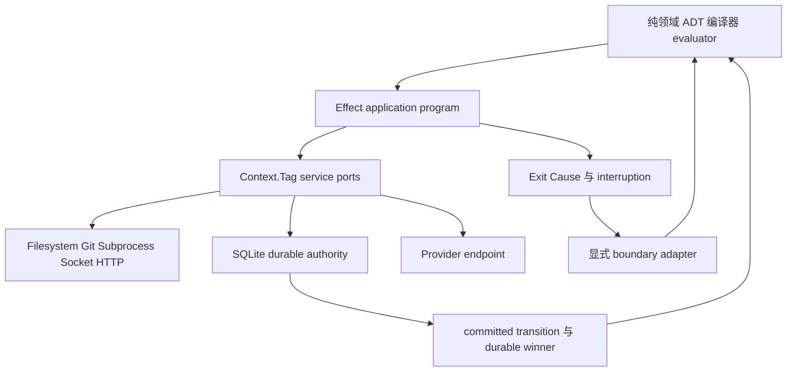
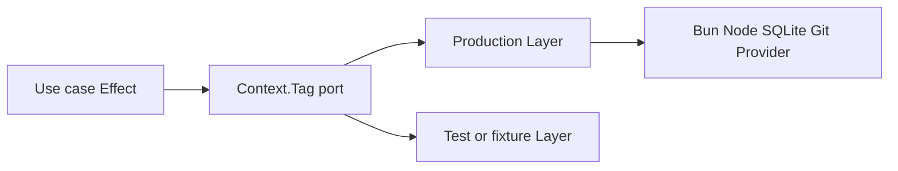

# B.md × Effect 逐行设计映射

## 1. 文档目的与覆盖合同

本文逐行解释 `v3-issue/B.md` 的设计在 Effect v3 中对应什么、为什么对应，以及哪些部分**不能**交给 Effect。本文保留 B.md 的领域语义，并为实现者划清三层：

1. **领域语义层**：B.md 的 ADT、identity、状态转换、权限与持久事实仍由 coder-loop 定义；
2. **应用执行层**：IO、并发、取消、资源、重试、服务依赖和 typed error 默认由 Effect 表达；
3. **基础设施层**：SQLite、文件系统、Git、child process、socket、HTTP 与外部 provider 通过 Effect service adapter 接入。

逐行覆盖采用无间隙源码区间。下文每行表格的“B.md 行”包含该区间内的标题、正文、表格、Mermaid 与来源说明；全部区间的并集精确覆盖 `B.md:1-2183`。纯排版、来源追溯或章节导航标为“文档层”，不为其虚构运行时对应物。

本文针对当前稳定 Effect v3。服务使用 `Context.Tag` + `Layer`；程序在进程入口通过 `ManagedRuntime` 或 `Effect.runPromiseExit` 执行。B.md 的业务 `context₀…context₃` 与 Effect 的 service `Context` 是两个不同概念，全文分别称为“业务 context”和“service context”。

## 2. 总结论

Effect 应作为 v3 **application/runtime substrate**，但不是公共类型语言、持久账本或领域状态机：



关键边界：

- `Effect.Effect<A, E, R>` 表达“一次计算成功得到 `A`、预期失败为 `E`、需要服务 `R`”；它适合面 1、2、4、5、6、7 的 IO orchestration。
- B.md 的业务负面返回、provider fact、admission result 等通常是 **success channel 中的领域 ADT**，不能一律塞进 `E`。
- `Cause`、fiber interruption 或 Promise rejection 不能直接变成 `active loss`、`exception`、`held`；必须由唯一 boundary adapter 结合 durable evidence 分类。
- `Scope` 保证进程内资源释放，不保证 crash 后事实存在；SQLite transaction、文件发布协议、request record、AwaitId 和 winner ordering 仍是 durable authority。
- ArkType 继续是当前公共 parser/schema producer。Effect 负责调用 parser 并保留 typed rejection；不同时引入 Effect Schema 形成第二份权威。

## 3. Effect 对应物图例

| 代号 | Effect 对应物 | 在本设计中的用途与限制 |
|---|---|---|
| `E0` | 无直接对应 | 标题、来源、产品边界或纯领域结论；不能为了“全面 Effect 化”制造运行时对象。 |
| `E1` | TypeScript discriminated union + `Match.exhaustive` | 封闭领域 ADT 与穷尽消费。ADT 由 coder-loop 拥有，Effect 只承载它。 |
| `E2` | pure function、`Effect.succeed`、`Effect.map` | 编译器、predicate、policy evaluator、projection 等确定性计算；优先保持纯函数。 |
| `E3` | `Effect.Effect<A, E, R>`、`Effect.gen` | 串联有类型成功、失败和依赖的应用流程。 |
| `E4` | `Context.Tag`、`Layer`、`Layer.scoped` | 声明 Filesystem、Store、Git、Subprocess、Provider、Socket、Clock、Workspace 等能力；Workspace 端口承载面 3 §11 的工作空间统一接口（本机 worktree / 文件复制 / 远程容器为可替换后端）；不是业务 context。 |
| `E5` | ArkType parser adapter + `Either`/typed error | 在 `unknown → T` 边界调用唯一 parser；不复制 schema，不以 Effect Schema 建第二权威。 |
| `E6` | `Option` | 表达运行时可能缺席；仅在其语义与 `Nothing`/optional observation 一致时使用。 |
| `E7` | `Either`、`Exit`、`Cause`、`catchTag` | 保留 expected error、defect 与 interruption；进入领域前必须显式分类。 |
| `E8` | `Effect.all`/`Effect.forEach` + bounded concurrency + 每项 `Either`/`Exit` | all-settled、并发 map、并行 probe；必须先把 sibling failure 数据化，避免默认 fail-fast 取消。 |
| `E9` | `Scope`、`acquireRelease`、`ensuring`、`onInterrupt`、`uninterruptibleMask` | child process、socket、listener、文件句柄和事务 finalization；只保证当前 runtime 生命周期。 |
| `E10` | `Fiber`、`Deferred`、`Queue`、`Semaphore` | 进程内并发、协调、等待和限流；不能替代 task、lease、AwaitId 或 committed transition。 |
| `E11` | `Clock`、`Duration`、`Schedule`、`TestClock` | deadline、timeout、backoff、等待窗口；需要 crash 恢复的时间事实必须持久化。 |
| `E12` | `Cache` 或 service-owned cache | exact ref 到 verified content 的进程缓存；cache 永远不是定义或 retention authority。 |
| `E13` | `Stream`、`Queue`、`PubSub` | events tail、SSE、router delivery 消费和 backpressure；durable queue 仍需外部持久实现。 |
| `E14` | SQL service + transaction wrapper | 原子验证与写入、只读 snapshot、rollback-on-error/interruption；数据库记录拥有 durable 语义。 |
| `E15` | Filesystem service | read/write/fsync/rename/watch；原子发布与 durability 仍由 B.md 的文件协议定义。 |
| `E16` | Subprocess/Command service + scoped process handle | spawn、stdio、timeout、TERM→KILL、close；业务结局由 adapter 解释。 |
| `E17` | Socket/HTTP client/server service | daemon RPC、webhook、gateway route、SSE；transport error 与领域拒绝分型。 |
| `E18` | `Config`、secret/redacted value adapter | typed env、root、endpoint 与 credential 注入；不得读取 ambient config 扩大函数输入。 |
| `E19` | Logger、Tracer、Metric | 观测执行过程；日志、span、event 不成为 committed fact 或 winner authority。 |
| `E20` | `ManagedRuntime`/顶层 `Layer` graph | daemon、gateway、consumer 各自一个 runtime；不能跨进程共享 service context 或 Scope。 |
| `E21` | test Layer、`TestClock`、可替换 service | 确定性验证 timeout/retry/concurrency；crash、SQLite、Git、browser 等仍需真实 integration/E2E。 |
| `D1` | coder-loop durable protocol，非 Effect primitive | committed transition、request record、AwaitId、winner、immutable publish；Effect 负责执行，不拥有事实。 |
| `D2` | 外部系统事实，非 Effect primitive | Git remote、provider terminal、mesh、OS process 等；Effect 只能 probe，不能凭运行时状态补造事实。 |

官方依据：[Effect type](https://effect.website/docs/v3/getting-started/the-effect-type)、[services](https://effect.website/docs/v3/requirements-management/services)、[expected errors](https://effect.website/docs/v3/error-management/expected-errors)、[resource management](https://effect.website/docs/v3/resource-management/introduction)、[concurrency](https://effect.website/docs/v3/concurrency/basic-concurrency)。

## 4. B.md 元信息与第 0 篇

| B.md 行 | Effect 对应 | 理由与边界 |
|---|---|---|
| `1-6` | `E0` | 文档身份、重编来源与候选采纳原则属于规范 provenance；Effect 不参与。 |
| `7-80` | `E3`、`E4`、`D1` | 导航图整体可实现为“纯定义 → Effect 应用程序 → durable transition → 只读 projection”；箭头是 owner 依赖，不应直接等同 Layer 依赖。 |
| `81-84` | `E0` | 阅读顺序是文档拓扑；实现时可据此组织模块依赖，但没有运行时构造。 |
| `85-115` | `E1`、`E2`、`Match.exhaustive` | 插入判定要求封闭 ADT、正交参数与唯一 owner，适合纯 evaluator + 穷尽匹配；Effect 不能替 operator 自动选语义。 |
| `116-117` | `E0` | 篇章边界。 |
| `118-119` | `E0` | 图解目录。 |
| `120-133` | `E3`、`E5`、`E6` | agent effect 由 Effect 程序执行；self-report 经 parser，measurement 经 map 形成 `Option.Option<T>` 或项目 ADT。未提升副作用留在 success/error 通道之外，不因 Effect 捕获就自动成为业务值。 |
| `134-143` | `E1`、`E3`、`E7` | 函数域出口可由 Effect `Exit` 承载，但必须折叠为项目自己的 `returned(value) \| exception`；中间 Effect 状态不进入对象账本。 |
| `144-159` | `E2`、`E5` | 来源/消费闭合是纯 typed graph compiler；service context 不能承载这些业务值，否则会混淆依赖与数据来源。 |
| `160-174` | `E1`、`E2` | predicate、后继数和 fail/NIL 是 total domain function，使用 discriminated union 与穷尽匹配；不需要 IO。 |
| `175-186` | `E3`、`E9`、`D1` | step 现场可由 Scope 管理并整体丢弃；task 交接必须由 durable transaction 提交。Scope 不能冒充 crash recovery。 |
| `187-194` | `E0` | 总纲的词汇权威是设计治理，不是 Effect service。 |
| `195-206` | `E3`、`E5`、`E16`、`D2` | Effect 统一执行文件、进程、Git 等 IO；只有显式 parser/map 输出进入业务 context。Effect 捕获 stdout 或异常不等于获得领域意义。 |
| `207-218` | `E3`、`E10`、`D1` | 函数域内部可严格顺序组合，独立 task 可由 fiber 并发；对象域生长和幂等由持久账本决定，不能以 fiber topology 代替。 |
| `219-226` | `E2`、`E3`、`E5` | 编译期纯函数证明可达性；运行期 Effect 执行 parser、map、runner 与 IO。类型可达不能被 `Effect.succeed` 伪造成运行成功。 |
| `227-301` | `E3`、`E8`、`E16`、`E5` | 五时态用一个 `Effect.gen` 串行；同一 map 时态内部用 all-settled；业务 context 用不可变 product 逐时态扩展，不使用 service Context。 |
| `302-319` | `E7`、`catchTag` | 每类 expected error 在仍能处理它的局部 scope 消费；不得用顶层 `catchAll` 抹平 parser rejection、runner loss、predicate false 与 defect。 |
| `320-329` | `E5`、`E2` | 填值是 effectful boundary 上的 ArkType parse；流转是已解析值上的纯 predicate。二者不能合成一个 Effect error。 |
| `330-339` | `E2`、`E3`、`E9`、`D1` | step/task 可共享纯交接 combinator；step runtime 由 Scope 管理，task 结果由 durable store 提交。复用函数不代表复用持久性。 |
| `340-349` | `E5`、`E6`、`E16` | shell output 是 unknown/string，map 将其解析为 `Option.some/none` 或项目 `produced/absent`；compile finding 保持纯数据。 |
| `350-363` | `E1`、`E2`、`E7` | predicate、chooser、fail/NIL policy 均是封闭 ADT；程序异常可在 `E` 通道流转，业务路由仍在 success value 中。 |
| `364-373` | `E13`、`E16`、`E17`、`E19` | hook 是有 Scope 的 effectful subprocess；GUI 是 Stream/HTTP projection。两者可观测 Effect 执行，但日志和 UI 不拥有 mutation。 |
| `374-398` | `E0`、`E1`、`E4` | 公共词汇由 coder-loop 领域模型拥有；可在实现中引用前述 Effect 构造，但不得把 service Context、Fiber、Exit 等名称覆盖这些术语。新增工作空间条目声明统一资源接口（`E4` service port），三种准备方式是可替换实现，不改变任务链与值管道分类。 |

## 5. 面 1：定义态

| B.md 行 | Effect 对应 | 理由与边界 |
|---|---|---|
| `399-400` | `E0` | 篇章边界。 |
| `401-402` | `E0` | 图解目录。 |
| `403-415` | `E2`、`E5` | 三面资产与 CompileEnvelope 是纯编译输入/输出；骨架中的 map 函数才在运行时返回 Effect。 |
| `416-425` | `E1`、`E2` | 三种 identity 应是不同 branded/domain types；Effect 的 tag 标识 service，不应拿来代替内容 identity。 |
| `426-444` | `E3`、`E15`、`E12`、`D1` | compile 保持纯；publish/resolver 是 Filesystem effects；pin 是 durable fact；cache 只缓存已验证 bundle。 |
| `445-457` | `E1`、`E5`、`E7` | admission、compile rejection、corrupt 与 legacy-unproven 是不同领域 ADT；可由 Effect error/value 承载，但不能压成同一异常。 |
| `458-476` | `E2`、`E3`、`D1` | 声明闭合由纯 compiler 判定；publish/resolve 用 Effect；运行结果和对象图不属于定义态。 |
| `477-515` | `E2`、`E5`、`E6`、`E8`、`E16` | codegen 是纯转换；map 是 `Effect.Effect<Option.Option<T>, MapFault, Subprocess>`；sibling 先转 `Either/Exit` 后 `Effect.all`，barrier 后一次聚合，禁止默认 fail-fast。 |
| `516-541` | `E2`、`E1` | 双面闭合、时态可达、后继 totality 与 findings 是纯 graph analysis；`Match.exhaustive` 守护 finite variants。 |
| `542-556` | `E2`、`D1` | 两层合同可共享纯类型和 combinator；运行账本与实例树仍由各 owner 管理，Layer 不能生成业务对象图。 |
| `557-576` | `E1`、`E2`、`E5` | CompileEnvelope 是项目 canonical ADT；Effect 只在读取 source 或发布时包围它。公共 schema 仍由 compiler 单一生产。 |
| `577-605` | `E3`、`E9`、`E15`、`D1` | staging、write、fsync、reopen、digest、rename 用 Filesystem service 串联；critical publish window 可 masked/finalized，但 durability 来自协议和 OS 操作，不来自 Scope。 |
| `606-634` | `E3`、`E12`、`E15`、`E14`、`D1` | resolver 是 exact-ref Effect service；verified result 才入 Cache。GC reachability、retiring/trash 与 legacy hold 必须持久化，cache 不参与 retention。 |
| `635-653` | `E5`、`E1`、`E14` | create/update/batch 调唯一 ArkType parser；完整对象 parse 后由 transaction 零部分写。`missing/null/false/0` 用精确 ADT，不用 truthiness 或 `Option` 误吞合法值。 |
| `654-670` | `E1`、`E7`、`Match.exhaustive` | 四类失败是不同 typed variants 和恢复路径；Effect error channel可携带它们，consumer 必须按 tag 穷尽。 |
| `671-688` | `E0`、`E3`、`E4` | 公共类型语言保持库中立；Effect 只作为内部 runtime。不得引入第二 parser、第二定义或把运行事实反写定义。 |

## 6. 面 2：函数域运行时

| B.md 行 | Effect 对应 | 理由与边界 |
|---|---|---|
| `689-690` | `E0` | 篇章边界。 |
| `691-692` | `E0` | 图解目录。 |
| `693-714` | `E3`、`E5`、`E8`、`E16` | 一个 `Effect.gen` 表达五时态；map、runner、CLI 是 services；时态边界显式产生不可变业务 context。 |
| `715-726` | `E1`、`E2` | predicate 与后继选择是纯 total function；`Match.exhaustive` 比 exception-driven routing 更符合设计。 |
| `727-740` | `E1`、`E7` | fail/NIL 与 escalation 是项目 ADT；局部 `catchTag` 可消费程序异常，跨 task 动作只能作为 typed exception payload 出口。 |
| `741-753` | `E3` | 纯程序节点复用同一 Effect pipeline，只把 agent service 调用替换为 `Effect.succeed` 的空时态；不是第二套 executor。 |
| `754-765` | `E3`、`D1` | 跨 run 值必须先作为 returned value durable commit，再成为下个输入；FiberRef、service Context、stdout 或共享文件均不能绕过针眼。 |
| `766-782` | `E3`、`E4`、`D1` | ClosureExecutor service 读取 pinned contract 并返回项目 `Exit` ADT；Effect 内部 trace/context 不写 daemon 任务账本。 |
| `783-820` | `E3`、`E5`、`E8`、`E16`、`E7` | 时态严格 `flatMap`；map batch all-settled；renderer/runner/map errors 分 tag；predicate 留纯。任何未处理 error 直接折叠，不携带半 context。 |
| `821-848` | `E5`、`E17`、`E18`、`E10` | CLI/socket 接受 unknown 并 parse；run credential 由 service context 提供，不由 payload 自报；时态关闭可用 Deferred/Ref 协调，但接纳规则是领域状态。 |
| `849-864` | `E1`、`E2` | chooser 结果是 finite union；n=0/1/many 用 ADT 穷尽，未知字符串 parse 失败，不进入 default。 |
| `865-879` | `E7`、`E1`、`D1` | fail step 可在 Effect 内恢复；对象域 action 只作为 typed escalation 返回，由面 3 transaction 执行。 |
| `880-900` | `E7`、`Cause`、`catchTag` | 表中的程序异常各有局部 handler；parser rejection 是交互结果，runner loss 是 runtime error，predicate false 是业务分支，defect/Cause 不得混合。 |
| `901-914` | `E3`、`E4` | agent dependency 可选实例化；同一 program 仍依赖 map/renderer services。空 agent 时态不是直接跳到对象域。 |
| `915-930` | `E4`、`E16`、`E18`、`D2` | RunnerProvider 是 service adapter；argv/env/cwd/session 都是 typed 输入。runner 与需访问任务文件的 map 经 Workspace service 绑定同一现场，接线本身不产生业务值。ambient env 和共享路径不能通过 Layer 偷渡为业务 context。 |
| `931-943` | `E0`、`D1` | 删除 opaque append/read 协议；Effect service Context、FiberRef 或 Queue 也不能成为新的跨-run旁路。正式传值仍经 durable针眼。 |
| `944-957` | `E0`、`E19` | 函数域痕迹可记录 trace/log，但不可升级成 task authority；本节列出的 owner 边界不由 Effect 改写。 |

## 7. 面 3：对象域

| B.md 行 | Effect 对应 | 理由与边界 |
|---|---|---|
| `958-959` | `E0` | 篇章边界。 |
| `960-961` | `E0` | 图解目录。 |
| `962-980` | `E3`、`E10`、`D1` | A/B/C/D 可并发执行为 fibers，但 task identity、动态派生、join 和 finalizer 由 durable object graph 决定。 |
| `981-993` | `E4`、`E9`、`D1` | 函数域资源可由 scoped services 管理；对象域和 immutable value 不等于 Effect runtime 内存。 |
| `994-1006` | `E8`、`E1`、`D1` | 单/多成员聚合可用 all-settled 的 typed vector；何时 group settled/consumed 必须持久提交，不以 fiber join 为权威。 |
| `1007-1022` | `E10`、`E9`、`D1` | live continuation 可用 Deferred/fiber；AwaitId、child identity 和 once-consumption token 必须入账。Scope 丢失后不能假装恢复 fiber。 |
| `1023-1036` | `E2`、`E1`、`E14` | admit 是纯判定 + SQL transaction；四类 rejection 是 success-side ADT，开放前沿仅随拒绝结果返回。 |
| `1037-1048` | `E1`、`E7`、`E2` | 业务 variant 保持 success value；runner 无返回进入 typed error；policy evaluator 纯求值，executor 再 effectfully commit。 |
| `1049-1063` | `E9`、`D1` | Scope 管活资源，durable lifecycle 管 crash 后状态和 GC eligibility；EvidenceFrozen 不能只放 finalizer 内存。 |
| `1064-1086` | `E14`、`E9`、`D1` | committed transition 用 transaction 原子验证锁、settlement 和后继；可用 uninterruptible finalization，但线性化来自 SQLite commit。 |
| `1087-1098` | `E3`、`E8`、`E11`、`D1` | 示例需要并发、retry、await、GC 和外部 probe 的统一 Effect orchestration；每个可重放决定仍写 durable fact。 |
| `1099-1110` | `E4`、`D1` | Effect services 可消除散落 callback/状态协调，但不能用一个 mutable Ref 修补两个推进权威；只允许一个 durable writer。 |
| `1111-1124` | `E1`、`E9`、`D1` | task、closure、value 是不同领域类型；Scope 仅对应 closure 资源，status/tag 仍是 immutable data。 |
| `1125-1136` | `E2`、`E12`、`D1` | definition compile/pin 是纯数据与 durable identity；运行时 Effect 只实例化 pinned product，Cache 不允许热改语义。 |
| `1137-1146` | `E2`、`E3` | “柯里化”是纯函数分阶段供参；无需 Effect 特殊 API。实际 task materialization 是 commit 后的 Effect。 |
| `1147-1158` | `E8`、`E11`、`D1` | group members all-settled；WaitWindow 编译为 Clock/Schedule 行为，但 deadline、growth 和 termination 原因需持久化，不能仅靠 sleep fiber。 |
| `1159-1172` | `E10`、`E9`、`E1`、`D1` | await live path 可暂停 fiber/Deferred；恢复须重定位原工作空间并验证 session/continuation identity，再凭 AwaitId 与消费 token 注入结果。continuation 丢失或 provider 报告 active loss 时落为 exception，是否创建新 attempt 由声明的 retry/fail policy 决定。远程连接中断本身不证明现场丢失，不能另建现场重跑；未确认结局按面 5 封闭事实处理。dependsOn 是纯 identity gate，不是 Queue 或 value channel。 |
| `1173-1184` | `E2`、`E1`、`E14` | typed admit 先纯判位置/时机/授权，再原子提交；拒绝不应放 Effect failure 导致调用者误以为请求未判定。 |
| `1185-1196` | `E1`、`E7`、`Match.exhaustive` | 业务负面 variant 与 runtime exception 分通道；禁止 catch-all 将二者统一重试，也禁止运维命令伪造 success value。 |
| `1197-1206` | `E1`、`E2`、`E11`、`D1` | RetryPolicy 可编译为 Schedule；attempt、exhaustion 与跨层 action 必须由纯 evaluator + committed transition决定。 |
| `1207-1216` | `E1`、`Match.exhaustive`、`D1` | provider 四事实作为 success-side ADT 穷尽消费；`unknown effect` 不应转换为 generic Effect error 后自动重试。 |
| `1217-1234` | `E14`、`E1`、`D1` | 五类 transition family 是数据库领域协议；Effect transaction wrapper执行它，但 `commit` 不是万能 mutation API。 |
| `1235-1260` | `E4`、`E3`、`E9`、`E10`、`E5`、`D1`、`D2` | Workspace 是统一资源接口的 `Context.Tag` service port，worktree、文件复制、远程容器是可替换 Layer；runner 与需读任务文件的 map 绑定同一现场。Scope 管当前进程的连接和句柄，不拥有 await 保留或 GC 资格；后端只执行面 3 已决定的资源操作，crash 后凭持久引用与归属信息对账。worktree 后端的 fetch/pin/branch 与共享 Git 协调属于准备实现；Git 状态值消费仍由声明 map 负责，不新增 Git 资源领域、链模式或值通道。 |
| `1261-1272` | `E9`、`E3`、`E1`、`D1` | GC 是持久可达性判断后的 effectful cleanup，经对应后端回收工作空间并按 closure 归属回收 session；本地调用结束或远程连接关闭不构成回收许可，`ensuring` 不能在 task 返回时立即误删资源。publication 四值是与后端选择无关的冻结旁路观测 ADT；非 Git 工作不制造 branch/tip 样本，Git 状态参与决策仍须经声明 map 提升。 |
| `1273-1282` | `E3`、`E1` | finalizer 是普通 Effect task，返回 advance/hold/exception；不得放进 daemon shutdown finalizer 或硬编码 if。 |
| `1283-1294` | `E4`、`E18`、`E5` | capability 由窄 service/tag 和 run-scoped credential Layer 提供，本地与远程现场用同一真实 credential 验证；secret/redacted，不允许 ambient fallback；scope 外调用与 scope 外资源访问 typed reject。目录分离不构成访问控制；后端涉及共享 Git 存储时结构性写限于引擎 namespace，该约束不代替 task identity。 |
| `1295-1304` | `E2`、`E5`、`D1` | migration 是显式纯转换 + transactional write；不能让 Layer 默认值或 current config 猜旧语义。 |
| `1305-1318` | `E0`、`E9`、`D1` | 取消 fiber、rollback Effect 或 replay Stream 都不能突破吸收态、无子树回滚和无 exactly-once 等产品停止线。 |
| `1319-1330` | `E3`、`E19`、`D1` | 用户路径由多 service program 实现并观测；status/trace 是 projection，不能驱动 GC 或 readiness。并行 closure 引用各自工作空间；worktree 后端在使用同一声明起点时共享冻结 base pin。crash 后先重建事件前缀和锁，再经工作空间后端对账实际资源与持久引用。 |
| `1331-1340` | `E0`、`E21` | current type shape 不等于 Effect program 已接通；必须以实际 runtime/integration 证据证明 target contract。 |
| `1341-1356` | `E21`、`E11`、`E8`、`D1` | TestClock/test Layer适合 deadline、retry、probe；crash、双 scheduler、Git、SQLite 与真实 runner 必须走 integration/E2E，不能只测纯 Effect。资源与授权验收按 §11 真实后端场景执行：并行 closure 文件隔离、同一现场恢复、residue 对账、GC 后历史与冻结证据；远程场景另证 runner 与文件测量访问同一现场、断线不冒充结束、scope 外资源与 admit 明确拒绝；Git 工作副本与 publication 样本只在涉 Git 时验证，不作无 Git 场景前置。 |

## 8. 面 4：入站边界

| B.md 行 | Effect 对应 | 理由与边界 |
|---|---|---|
| `1357-1358` | `E0` | 篇章边界。 |
| `1359-1360` | `E0` | 图解目录。 |
| `1361-1374` | `E3`、`E5`、`E14` | 两种模式组合为 typed Effect program，最终共用 parser + admit transaction；rejection 是确定结果，不是 transport failure。 |
| `1375-1385` | `E1`、`D1` | delivery/request/work identities 是不同 branded types 与 durable关系；不能用 Effect fiber/request id 合并。 |
| `1386-1405` | `E14`、`E1`、`D1` | durable request record 用 transaction 线性化 mutation 和 verdict；Effect Request/Deferred 只能做进程内去重，不能替代记录。 |
| `1406-1428` | `E4`、`E13`、`E17`、`E20`、`D1` | router、consumer、engine 是独立 runtimes/services；HTTP、durable queue、CLI transport 分层。每层成功只成为下一层输入。 |
| `1429-1443` | `E3`、`E1`、`D1` | `new-workspace` 是 `chain.create` 与后续 work admission 两个 durable command 的顺序组合，不新增 engine 任务实体，更不表示立即创建面 3 的执行工作空间（task 私有现场经工作空间接口按需提供，无 Git 任务链不要求仓库）；把两步写在同一个 Effect 程序中也不会产生跨命令原子性。空 chain 是合法 ADT 状态。 |
| `1444-1457` | `E5`、`E17` | 公共 JSON Schema 是 ArkType owner projection；consumer 可预校验，engine 仍按 pinned parser终判。版本失配 typed fail closed。 |
| `1458-1471` | `E5`、`E14`、`D1` | write gate 在 transaction 内解析完整对象；quarantine/repair 是 durable ADT。Effect retry 不得把同一 schema 根因反复表现为 spawn failure。 |
| `1472-1489` | `E1`、`E2`、`E14` | identity、claim、rejection 与 idempotency 是领域协议；Effect 负责调用，数据库唯一约束和 committed admit 负责收敛。 |
| `1490-1501` | `E14`、`E1`、`D1` | request record 与 mutation 同事务；reply loss 后重读同一 verdict。Logger/event 不具有关联和线性化权威。 |
| `1502-1513` | `E1`、`E5`、`E17` | CLI boundary 将内部 transport envelope 穷尽转换为公共 ADT；stderr、throw 和未知 future variant 均不能驱动业务 ack。 |
| `1514-1527` | `E0`、`E21` | current/target 是证据分层；Effect adoption 本身不证明 router queue、request ledger 或真实入站 E2E 已完成。 |

## 9. 面 5：出站边界

| B.md 行 | Effect 对应 | 理由与边界 |
|---|---|---|
| `1528-1529` | `E0` | 篇章边界。 |
| `1530-1531` | `E0` | 图解目录。 |
| `1532-1547` | `E4`、`E16`、`E18`、`E3` | Provider 是 `Context.Tag` service；argv、model、env/sandbox、session、reader 都是 typed slots，返回封闭 provider fact。 |
| `1548-1563` | `E1`、`Match.exhaustive` | 四事实是项目 ADT，不等于 `Exit` 的 success/failure/interruption；每个 variant 有唯一 consumer。 |
| `1564-1583` | `E8`、`E14`、`D1` | terminal reader 与 loss detector 可并发；两方提交由 SQL transaction 决定唯一 winner。`Effect.race` 的内存 winner 不能承担 crash replay。 |
| `1584-1593` | `E3`、`E4`、`D2` | Provider effect 将固化输入送到外部终端并采样事实；未提升 stdout/file/session 不进入返回值。 |
| `1594-1615` | `E4`、`E16`、`E18`、`E9` | spawn environment 绑定已选工作空间的执行环境与目录（Workspace 端口的 typed 资源引用），完整声明 env/可见资源/网络/sandbox；远程目录不能作本地 cwd，ambient env 不得透传。session/continuation 是 closure-scoped resource，服从 closure authority；runner 用已绑定工作空间，外部终端不另建现场。工作空间后端与 RunnerProvider 经同一资源引用接通：远程执行把 pinned 输入送到声明可见位置并保内容 identity，需读任务文件的 map 在同一远程现场执行或经其受控访问测量；transport 不扩大授权、不增加值通道，终态对应真实 run，不支持的组合明确拒绝、不静默降级本地。 |
| `1616-1627` | `E3`、`E11`、`E1`、`D2` | probe 是明确 typed Effect，返回 ready/absent/unknown + freshness；不能从 exit code 或不存在的 CLI contract 猜 terminal。 |
| `1628-1637` | `E1`、`E14`、`D1` | pre-spawn absence 是成功观测到的 durable事实，不是 spawn exception；此时不建立 run，也不为本次调用新建工作空间；held/recovery 由面 3 消费。 |
| `1638-1656` | `E1`、`E8`、`E14`、`D1` | 四 variant 穷尽；terminal/loss 并发采样后由 durable ordering提交。`unknown effect` 保留不确定性并阻止自动 replay。 |
| `1657-1670` | `E0`、`E4` | provider service 不拥有 scheduler、五时态、入站 ledger 或假 probe；Effect adapter 不能扩张 owner。 |

## 10. 面 6：hook

| B.md 行 | Effect 对应 | 理由与边界 |
|---|---|---|
| `1671-1672` | `E0` | 篇章边界。 |
| `1673-1674` | `E0` | 图解目录。 |
| `1675-1691` | `E1`、`E2` | hook anchor 是从公共模型推导的封闭 enum；用纯映射和穷尽匹配，不创建新的 event runtime 语义。 |
| `1692-1710` | `E3`、`E16`、`E14`、`D1` | delivery 建立、execution spawn、audit closure 是一个 Effect program；at-least-once 决定由 durable delivery record恢复。 |
| `1711-1723` | `E4`、`E16`、`E1` | map 与 hook 共享 Subprocess service，但分别用不同 adapter/result type；共享 Layer 不等于共享 authority。 |
| `1724-1739` | `E3`、`E16`、`E19` | hook 可 effectful，但结果只写 audit/trace，不进入业务 context 或主流转 error recovery。 |
| `1740-1755` | `E1`、`E2`、`E13` | anchor 闭集是纯 ADT；零自反在声明 compiler 与 dispatch filter中保证。PubSub/Stream 不能把 hook 自身事件重新喂回。 |
| `1756-1780` | `E16`、`E9`、`E11`、`E10`、`D1` | 领域无关 subprocess primitive 统一负责启动、stdio、进程树跟踪、timeout、停止与终态确认；终态以真实执行进程为准，本地 drain/close 后归结，远程经真实执行端兑现，连接客户端 close 不等于远程脚本结束。需读任务文件的 map 用已绑定工作空间；hook 执行位置来自显式配置，不因共用 primitive 获 task 私有目录或接管回收。有界停止由执行端实施（本地进程组 TERM→KILL，远程停实际进程树）；无法确认远程结局保留未决 execution，不伪造成功。delivery/execution identity 持久化，fiber identity 不可替代。 |
| `1781-1797` | `E5`、`E19`、`E1` | payload 消费 owner projection并排除 credential；execution outcome 是封闭 audit ADT。Logger只记录，不把 stdout 提升为 context。 |
| `1798-1811` | `E8`、`E10`、`D2` | hook 可无界或显式限流并发，但每项独立 delivery；外部幂等、锁、CAS/transaction 由脚本/外部系统负责，Effect 不承诺 exactly-once。 |
| `1812-1829` | `E0`、`E4` | hook Layer 只由 operator/global 配置；preset/workload 不可 provide 或 override 监督 service。非目标保持 owner 单一。 |

## 11. 面 7：GUI 与 gateway

| B.md 行 | Effect 对应 | 理由与边界 |
|---|---|---|
| `1830-1831` | `E0` | 篇章边界。 |
| `1832-1833` | `E0` | 图解目录。 |
| `1834-1856` | `E1`、`E13`、`E17` | 三栏是 UI domain model；gateway 通过 typed services/streams 提供数据。副作用面含本地或远程工作空间（工作空间 owner 投影位置与资源状态），不假定 worktree 或本机可读目录。React 组件不必运行 Effect 业务逻辑。 |
| `1857-1872` | `E4`、`E13`、`E14`、`E15`、`E17` | 五类通道分别是 status store、event Stream、artifact FS、context projection、socket client services；不能合成一个宽松 repository。 |
| `1873-1883` | `E8`、`E1`、`E11` | 三证并发 all-settled，保留各自 typed result 与采样时间；不得用 first-success/race 合成健康灯。 |
| `1884-1897` | `E3`、`E1` | 诊断闭环是 Effect workflow，但 accepted/rejected/failed/unknown 与最终权威读面是项目 ADT。 |
| `1898-1913` | `E0`、`E19` | 值班问题说明观测需求；Effect tracing可降低代查成本，但原始 durable evidence优先于解释。 |
| `1914-1925` | `E13`、`E17`、`E1`、`D1` | context/副作用是两种 projection；有限动作经 typed transport。UI/Stream 不把观察数据升级为权威。副作用面展示本地或远程工作空间、进程三证与 Git 等外部残迹；现场位置与资源状态来自工作空间 owner，Git 旁证独立展示，不因后端选择自动出现或成为业务值；现场、日志与 Git 残迹不得解释成 `returned(value)`、`exception` 或 committed transition。 |
| `1926-1927` | `E0` | 命题标题。 |
| `1928-1956` | `E20`、`E17`、`E13`、`E14` | gateway 与 daemon 各自 ManagedRuntime；gateway routes/SSE/read-only store在 daemon 死后仍运行。gateway start daemon 是显式外部 action，不建立父子 supervision。 |
| `1957-1966` | `E14`、`E13`、`E15`、`E17`、`E11` | 状态、events、artifact/control 分 service读取，各保留 snapshot/offset/采样时间；Layer composition 不表示跨介质原子性。 |
| `1967-1972` | `E18`、`E20` | loop-data root 是进程启动时一次解析的 typed Config，注入顶层 Layer；request 不能 override service config。 |
| `1973-1984` | `E17`、`E9`、`E20`、`E18` | HTTP listeners/static routes同一 scoped runtime；任一 listener acquire失败即释放已建立listener。监听地址来自封闭 Config，不 fallback wildcard。 |
| `1985-1986` | `E0` | 命题标题。 |
| `1987-1992` | `E14`、`E1`、`D1` | strict reader 使用只读 SQL transaction，返回 snapshot/缺盘/损坏/schema variant；Effect acquire不能执行隐式 migration或补造 identity。 |
| `1993-2002` | `E5`、`E1`、`Match.exhaustive` | public wire 在最终边界由 owner parser验证；frontend/client从同一 schema派生。Effect Schema不应与 ArkType并行生产 shape。 |
| `2003-2012` | `E13`、`E1`、`E19` | GUI只消费 hook声明与audit projection；Stream保持 delivery/execution identity和原始 outcome，不重解释。 |
| `2013-2020` | `E8`、`E11`、`E17`、`E1` | pid/socket/RPC probes各自 timeout并返回 typed evidence；all-settled 后并列展示，不用 fallback覆盖分歧。 |
| `2021-2030` | `E13`、`E15`、`E9`、`E1` | event reader用 scoped Stream跟踪segment、file identity、offset与watcher；坏行/partial是typed data。Stream不承诺durable replay或全局顺序。 |
| `2031-2036` | `E13`、`E9`、`E17` | 每条 SSE connection 是 scoped Stream；disconnect立即释放watcher/reader/timer/subscription，close/enqueue race转typed transport outcome而非杀gateway。 |
| `2037-2046` | `E15`、`E5`、`E1`、`D1` | prompt artifact在时态二固化后写入持久路径；present/write-failed/incomplete/parse-failure/legacy是ADT。写失败只记diagnostic，不回滚runner。 |
| `2047-2056` | `E3`、`E5`、`E1` | current compile与历史artifact是两个独立Effect query和时间语义；refresh只消费一个CompileEnvelope，不用cache fallback。 |
| `2057-2066` | `E13`、`E5`、`D1` | context页消费typed projection；观察值不写回业务 context、不重跑predicate、不建立新transport authority。 |
| `2067-2068` | `E0` | 命题标题。 |
| `2069-2078` | `E1`、`E5` | route params先parse为typed identity；parent/child关系由owner query判定。对象页展示工作空间引用与 session identity；branch 等后端具体信息由对应 owner 投影，不作所有 task 必有字段；显示名、数组位置、目录、容器与 worktree 均不得重建identity。 |
| `2079-2088` | `E17`、`E11`、`E9`、`E1` | socket client以deadline/cancel运行并确保destroy；connect/EOF/half-frame/id-mismatch/rejected/unknown是不同ADT，protocol error不进业务拒绝。 |
| `2089-2098` | `E1`、`E17` | 四类动作由封闭command registry和typed façade承载；route不会因新增daemon command自动生成。`transport unknown`不是Effect retry信号。 |
| `2099-2128` | `E3`、`E17`、`E1`、`D1` | mutation后必须flatMap到canonical status/events/audit重读；transport未知时只显示unknown并允许人工refresh，不自动retry可能已提交的Effect。 |
| `2129-2130` | `E0` | 命题标题。 |
| `2131-2138` | `E8`、`E11`、`E1` | 首屏并发读取三证与owner facts，缺证据保留unknown；gateway unreachable与daemon dead是不同variant。 |
| `2139-2146` | `E3`、`E13`、`E17` | 深入页按typed identity组合多个query/stream；每项保留owner、source和sample time，不创建全局snapshot幻觉。副作用页回答本地或远程现场、进程、日志与外部系统遗留；远程失联不显示成已回收，不退回读本机同名路径。 |
| `2147-2158` | `E17`、`E18`、`E0` | 移动与桌面共享相同route/client/schema；PWA布局不是新的Effect runtime。mesh listener由Config限定，不因移动端增加认证或离线语义。 |
| `2159-2172` | `E21`、`E9`、`E11`、`E14`、`D2` | 可用test Layer/TestClock覆盖deadline与cleanup；只读资格、独立进程、真实SSE、Git/artifact、NetBird手机路径必须用integration/E2E实测。 |
| `2173-2183` | `E0`、`D1`、`D2` | 停止线明确拒绝因Effect已有Schedule/Stream/transaction就顺手加入replay、saga、exactly-once或跨介质原子性；交付的现场读面为本地或远程工作空间及已声明的 Git 等外部观测，仍是可信人类读面，不新增写权威。 |

## 12. 推荐的实现骨架

### 12.1 纯领域层

以下模块不依赖 Effect：

- preset ValueType、source/consumer graph 与 CompileEnvelope；
- task/group/transition/provider-fact/request-result ADT；
- predicate、routing、admit、policy evaluator；
- wire/persistence domain types 与 ArkType boundary producer。

这些函数接收精确值并返回精确值或项目 ADT。有限 variant 必须穷尽匹配。

### 12.2 application 层

所有会触及外部世界的 use case 返回 Effect：

```ts
Effect.Effect<Success, ExpectedError, Requirements>
```

建议的 service ports 至少包括：

- `DefinitionStore`
- `ObjectDomainStore`
- `RequestStore`
- `EventStore`
- `ArtifactStore`
- `Filesystem`
- `Workspace`
- `RepositoryGit`
- `Subprocess`
- `RunnerProvider`
- `DaemonSocket`
- `IngressRouter`
- `Clock`

service method 返回的错误必须是窄的 tagged union；禁止统一成 `Error` 或字符串。

### 12.3 infrastructure Layer

每个 service 有生产 Layer 与测试 Layer。生产 Layer 可以调用 Bun、Node 和 SQLite API，但这些 API 不越过 adapter：



每个进程独立装配：

- daemon：scheduler/store/Workspace/subprocess/provider/socket，按所选后端接入 Git 等基础设施依赖，不要求无 Git 场景安装 Git；
- gateway：strict reader/event stream/artifact reader/socket client/HTTP；
- consumer：webhook mapping/schema client/CLI client/delivery store；
- CLI：command client/parser/renderer。

### 12.4 唯一 Effect 退出边界

`Effect.runPromiseExit` 或 `ManagedRuntime.runPromiseExit` 只出现在进程/命令入口。入口将 `Exit/Cause` 穷尽转换为：

- CLI exit code 与 typed wire result；
- daemon fatal lifecycle result；
- gateway HTTP/transport response；
- integration-test observation。

业务模块内部不反复 `runPromise`，否则 Scope、tracing、service dependencies 与 interruption 会被切断。

## 13. 不能由 Effect 代替的设计

1. **Durable authority**：SQLite row、transaction、request record、AwaitId、winner、definition ref 和 committed transition。
2. **跨进程 identity**：Effect Fiber、Scope、Deferred、Request identity 都是运行时工具，不能当 task/run/delivery/work identity。
3. **外部 effect 事实**：`unknown effect` 必须来自 probe + durable ordering，不能从 Cause 猜测。
4. **公共 schema owner**：ArkType/compiler 继续单一生产；Effect Schema 若未来采用，必须完整替换而非并存。
5. **领域异常语义**：业务负面返回留在 success ADT；expected runtime error、defect、interruption各自分类。
6. **Exactly-once**：Effect retry、Schedule、Queue、Stream 和 Scope 都不会自动提供外部 exactly-once。
7. **跨介质原子事务**：SQL transaction 无法同时原子提交 Git、filesystem、provider 或浏览器状态；工作空间准备与其资源引用的持久登记同样不构成跨介质事务，其间 crash 由归属信息对账并暴露 residue；继续使用 residue、reconciliation 和冻结证据。

## 14. 采用顺序

1. 先定义纯领域 ADT、ArkType boundary 与 service ports；
2. 以共享 Subprocess service 落地 spawn/stdio/timeout/signal/close；
3. 用 Effect 重写面 2 的五时态 executor，并明确 all-settled map barrier；
4. 接入面 1 publish/resolver 与面 5 provider adapters；
5. 将面 3 transaction、lease、await 和 GC orchestration 接入 Store/Workspace services，由所选后端装配所需基础设施；以本地 worktree 与远程容器两个真实后端运行同一工作流验证，文件复制等其他实现接入时服从同一合同和验收；
6. 最后接入 ingress、gateway Stream/SSE 与 per-process ManagedRuntime；
7. 每步以真实 runtime/integration 场景验证，不以类型检查或 Effect 单元测试代替 B.md 的持久化、进程和浏览器合同。
