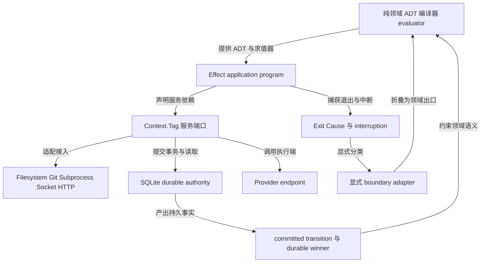
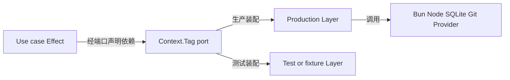

# Effect v3 实现指南

本指南说明如何用 Effect v3 实现 [B 规范](B.md#b-guide)，不另立领域语义。实现者按问题查阅对应主题节即可。

- [阅读指南与文档角色](#be-guide)
- [角色与 Effect 词汇](#be-terms)
- [不可替代边界](#be-boundaries)
- [服务分组与分层](#be-services)
- [定义态实现](#be-definition)
- [函数域实现](#be-function)
- [对象域任务实现](#be-task)
- [工作空间实现](#be-workspace)
- [入站实现](#be-ingress)
- [出站实现](#be-provider)
- [钩子实现](#be-hook)
- [观测与网关实现](#be-observation)
- [进程入口与退出边界](#be-entry)
- [验收](#be-verification)
- [主题对应表](#be-crosswalk)
- [官方依据](#be-sources)

## 阅读指南与文档角色 

对应 [阅读指南](B.md#b-guide)、[公共设计模型](B.md#b-model)。

必须把 [B 规范](B.md#b-guide)作为唯一现行设计依据。本指南只解释实现方式，以及 Effect 不能代替的保证，不增减任何设计。

必须把 A 中的历史候选、未决含义和已拒绝方案继续当作历史材料。禁止把历史实现调查反写成现行要求。

实现分三层。领域语义层由 coder-loop 定义：封闭 ADT、各类身份、状态转换、权限与持久事实。应用执行层默认由 Effect 表达：输入输出、并发、取消、资源、重试、服务依赖和类型化错误。基础设施层通过 Effect 服务适配器接入：SQLite、文件系统、Git、子进程、socket、HTTP 与外部执行端。

说明：上图箭头是责任方依赖，不是 Layer 依赖。持久提交与只读投影之间只有单向的事实流动，Effect 程序负责执行，不拥有事实。

必须区分两种上下文。业务上下文指当前执行阶段已经拥有的类型化值，写作 `context₀` 至 `context₃`，逐次扩展，不改写已有值。Effect 服务上下文指 `Context.Tag` 声明的服务依赖。禁止把业务上下文放进服务上下文，也禁止把服务上下文当作业务数据来源。

本指南中，“必须”与“禁止”标出硬性合同；其余陈述句为说明或对 B 合同的转述，不新增约束。阅读时先读 [B 规范](B.md#b-guide)对应主题节，再读本指南同名节。

## 角色与 Effect 词汇 

对应 [公共词汇](B.md#b-terms)。

必须使用中文规范名加固定英文标识，代码字段、ADT 变体名、命令与 API 拼写一字不动。禁止把 `Context`、`Fiber`、`Exit`、`Scope` 等 Effect 名称覆盖 B 的领域术语。

### 执行资源词汇

| Effect 词 | B 领域词 | 区分 |
|---|---|---|
| `Fiber`、`Deferred`、`Queue`、`Semaphore` | 任务（task）、任务组（group）、续接状态（continuation） | 说明：进程内并发与协调工具，不能替代任务身份、组合位置、执行权、AwaitId 或持久提交转换。 |
| `Scope`、`acquireRelease`、`ensuring`、`onInterrupt` | 执行闭包（closure）资源、资源回收（GC） | 说明：只保证当前运行时的进程内释放，不管崩溃后的事实存在，不管等待保留，不管回收资格。 |
| `Cache` 或服务自有缓存 | 定义包（bundle）、固定定义引用（pin） | 说明：只缓存精确引用到已验证内容的进程缓存。缓存不是定义权威，也不是保留权威，不允许热改语义。 |
| `Stream`、`Queue`、`PubSub` | 事件、投递（delivery） | 说明：只做进程内消费与背压，不承诺持久重放或全局顺序。 |

### 数据与事实词汇

| Effect 词 | B 领域词 | 区分 |
|---|---|---|
| 服务上下文（`Context`） | 业务上下文（`context₀…context₃`） | 说明：前者是服务依赖声明，后者是已拥有的类型化值。两者禁止互换。 |
| `Exit`、`Cause`、中断 | 正常返回（`returned(value)`）、执行异常（`exception`）、执行提供者事实（provider fact） | 说明：进入领域前必须经显式边界适配器折叠分类，不能直接等同。 |
| `Schedule`、Effect 重试 | 重试策略（RetryPolicy）、任务尝试（attempt） | 说明：`Schedule` 只表达等待与重复行为。尝试划分、耗尽判定与跨层动作由纯求值器加持久提交决定。 |
| 环境配置（`Config`）、宿主环境变量 | 初始输入值、填值校验（parser） | 说明：禁止读取未声明的宿主环境变量与配置来扩大函数输入。运行凭证由服务上下文提供，不由负载自报。 |
| 日志、Span、事件 | 持久状态转换（committed transition）、终态提交胜出（terminal winner） | 说明：观测记录只记录，不成为已提交事实或胜出权威。 |

## 不可替代边界 

### 持久权威仍归存储与文件协议

对应 [提交转换](B.md#b-transitions)、[验收边界](B.md#b-verify-boundaries)。

必须由 SQLite 行、事务、请求记录、AwaitId、胜出判定、定义引用和持久提交转换承担持久权威。Effect 负责执行这些协议，不拥有事实。

禁止用 SQL 事务同时原子提交 Git、文件系统、执行提供者或浏览器状态。工作空间准备与其资源引用的持久登记之间同样不构成跨介质事务，其间崩溃按归属信息对账并暴露残留。对账使用残留记录、一致性核对和冻结证据。

### 身份不能跨进程借用

对应 [任务身份](B.md#b-task-identity)、[入站身份](B.md#b-ingress-identity)。

禁止把 `Fiber`、`Scope`、`Deferred`、`Request` 的运行时身份当作任务、工作项、运行、投递或工作身份。任务身份、运行身份、投递身份与工作身份是不同的品牌类型（名义类型）与持久关系，实现中必须分开建模。

### 外部事实只能探测，不能补造

对应 [执行提供者事实](B.md#b-provider-facts)、[胜出判定](B.md#b-provider-winner)、[执行端](B.md#b-provider-endpoint)。

副作用结果未知（unknown effect）必须来自探测加持久排序，不能从 `Cause`、退出码或缺席的命令行合同猜测。Git 远端、提供者终态、网格、操作系统进程等外部系统事实只能探测，不能凭运行时状态补造。

### 公共类型权威唯一

对应 [定义](B.md#b-definition)、[入站 schema](B.md#b-ingress-schema)。

必须由编译器与 ArkType 作为唯一的公共解析与类型生产者。Effect 只在边界调用解析器并保留类型化驳回。禁止并存第二份 Effect Schema 权威；若未来采用，必须完整替换而非并存。

### 异常语义分通道

对应 [函数域](B.md#b-function)、[步骤与任务的交接](B.md#b-step-task)。

必须把业务负面结果留在成功通道的领域 ADT 中，禁止一律塞进 Effect 的预期失败通道。预期运行时错误、程序缺陷与中断各自分类，在仍能处理它的局部作用域消费。禁止用顶层全捕获抹平填值驳回、执行工具丢失、流转否定与程序缺陷。

### 重试不决定领域重试

对应 [重试](B.md#b-retry)、[任务非目标](B.md#b-task-nongoals)。

Effect 重试、`Schedule`、`Queue`、`Stream`、`Scope` 都不会自动提供外部精确一次语义。禁止因 Effect 自带调度、流或事务就顺手加入重放、长事务补偿、精确一次或跨介质原子性。

### 产品停止线不受运行时回滚突破

对应 [任务非目标](B.md#b-task-nongoals)。

禁止用取消 fiber、回滚 Effect 或重放 Stream 来突破吸收态、无子树回滚、无精确一次等产品停止线。

## 服务分组与分层 

对应 [公共设计模型](B.md#b-model)、[定义](B.md#b-definition)、[工作空间接口](B.md#b-workspace-interface)、[执行提供者合同](B.md#b-provider-contract)。

### 纯领域层不依赖 Effect

以下模块必须保持纯函数，不依赖 Effect：预设值类型、来源与消费图、编译结果 `CompileEnvelope`；任务、任务组、提交转换、提供者事实、请求结果等 ADT；流转校验、路由、准入判定、策略求值器；线上传输与持久化领域类型，以及 ArkType 边界生产者。

这些函数接收精确值，返回精确值或领域 ADT。有限变体由 TypeScript 穷尽检查，不为匹配引入 Effect 依赖；应用执行层使用 Effect 时，可以采用 `Match.exhaustive`。

### 应用执行层返回 Effect

会触及外部世界的用例必须返回 `Effect.Effect<Success, ExpectedError, Requirements>`，表达一次计算的成功类型、预期失败类型与所需服务。复杂流程使用 `Effect.gen` 串联，确定性片段保持纯函数，或用 `Effect.succeed`、`Effect.map`、`Effect.flatMap` 组合。

服务端口至少包括以下分组。存储类：`DefinitionStore`、`ObjectDomainStore`、`RequestStore`、`EventStore`、`ArtifactStore`。执行类：`Filesystem`、`Workspace`、`RepositoryGit`、`Subprocess`、`RunnerProvider`、`DaemonSocket`、`IngressRouter`。时间：`Clock`。

必须把每个服务方法的错误声明为窄的类型化联合，禁止统一成 `Error` 或字符串。

### 基础设施按进程装配

说明：生产 Layer 可以调用 Bun、Node 与 SQLite API，但这些 API 禁止越过适配器。每个服务同时提供生产 Layer 与测试 Layer。

说明：需要绑定资源生命周期的服务使用 `Layer.scoped` 提供，随作用域退出释放；这只管理进程内资源，不改变持久权威归属。

必须按进程独立装配运行时：

- daemon 装配调度器、存储、工作空间、子进程、执行提供者与 socket，按所选后端接入 Git 等基础设施依赖；无 Git 场景不要求安装 Git。
- gateway 装配只读器、事件流、制品读取器、socket 客户端与 HTTP。
- 消费端装配路由映射、schema 客户端、命令行客户端与投递存储。
- 命令行装配命令客户端、解析器与渲染器。

## 定义态实现 

### 编译保持纯函数

对应 [定义](B.md#b-definition)、[定义资产](B.md#b-definition-assets)、[编译](B.md#b-compile)。

三面资产与编译结果是纯编译输入输出，是纯数据。双面闭合、执行阶段可达性、后继完全性与编译诊断是纯图分析，有限变体由穷尽匹配守护。类型可达禁止用 `Effect.succeed` 伪造成运行成功。

说明：设计插入判定要求封闭 ADT、正交参数与唯一责任方，适合纯求值器加穷尽匹配；Effect 不替操作员选择语义。

说明：来源与消费闭合由纯类型图编译器判定。运行结果和对象图不属于定义态。两层合同可共享纯类型和组合子；运行账本与实例树仍由各责任方管理，Layer 不能生成业务对象图。

### 身份类型互相独立

对应 [定义资产](B.md#b-definition-assets)。

三种内容身份必须是不同的品牌类型，禁止混用。服务标签只标识服务，禁止拿来代替内容身份。

### 发布与解析是文件系统效应

对应 [定义发布](B.md#b-publish)、[定义解析](B.md#b-resolve)。

编译判定保持纯函数；发布与解析走文件系统服务。暂存、写入、刷盘、重开、摘要、改名用文件系统服务串联；关键发布窗口可以用不可中断掩码与终结器保护，但持久性来自文件协议与操作系统操作，不来自 `Scope`。

解析器是精确引用服务，只兑现已验证内容。已验证结果才进入缓存。回收可达性、退役与废弃区、历史保留都必须持久化，缓存不参与保留判定。

### 准入与失败分属不同 ADT

对应 [编译](B.md#b-compile)、[输入校验](B.md#b-input-validation)。

类型化准入、编译驳回、损坏与历史未证是不同的领域 ADT，可以由 Effect 错误或值通道承载，但禁止压成同一异常。四类定义失败是不同的类型化变体与恢复路径，消费者必须按标签穷尽处理。

### 创建与写门经唯一解析器

对应 [输入校验](B.md#b-input-validation)。

创建、更新与批量写入必须调用唯一的 ArkType 解析器；完整对象解析成功后由事务零部分写入。`missing`、`null`、`false`、`0` 必须用精确 ADT 区分，禁止用真值判断或 `Option` 误吞合法值。

### 映射执行用汇集屏障

对应 [映射合同](B.md#b-map-contract)。

代码生成是纯转换。定义骨架中的映射函数才在运行时返回 Effect。
映射是 `Effect.Effect<Option.Option<T>, MapFault, Subprocess>` 形状的效果：把同胞结果先转成 `Either` 或 `Exit`，再用 `Effect.all` 或 `Effect.forEach` 加有界并发构成汇集屏障（all-settled），屏障后一次汇总。禁止使用默认的快速失败取消。

### 公共类型语言保持库中立

对应 [定义](B.md#b-definition)。

公共类型语言保持库中立，Effect 只作为内部运行时。禁止引入第二解析器、第二定义，或把运行事实反写回定义。

## 函数域实现 

### 五个执行阶段组成一条管线

对应 [函数域](B.md#b-function)、[执行顺序](B.md#b-function-sequence)。

必须用一个 `Effect.gen` 表达五个执行阶段：前置映射、提示词组装、agent 执行、后置映射、流转判定。执行阶段边界显式产生不可变的业务上下文，从 `context₀` 起逐段扩展，不使用服务上下文。
同一映射执行阶段内部使用汇集屏障：先把同胞结果转成数据，屏障后一次汇总，禁止默认快速失败取消。

各执行阶段之间严格排序组合。任何未处理的错误直接折叠，不携带半成品上下文。渲染器、执行工具与映射错误分标签，流转校验保持纯函数。

说明：Effect 统一执行文件、进程与 Git 等输入输出；只有显式解析与映射输出进入业务上下文，捕获到的标准输出或异常不等于获得领域意义。

说明：函数域出口可由 Effect `Exit` 承载，但必须折叠为项目自己的正常返回或执行异常；中间 Effect 状态不进入对象域账本。

### 填值与流转必须分离

对应 [自报告](B.md#b-self-report)。

填值是效果边界上的 ArkType 解析：agent 在场时通过解析器提交声明允许的值，错误驳回给同一在场 agent。流转是已解析值上的纯谓词判定，否定转为失败处理或缺省标记。禁止把两者合成一个 Effect 错误。

说明：测量由脚本度量外部状态，再经映射提升为值；可计算事实优先由测量产生。Shell 输出是未知字符串，映射把它解析为 `Option.some`、`Option.none` 或项目自身的产出与缺席 ADT；编译诊断保持纯数据。

### 路由与失败用封闭 ADT

对应 [失败处理](B.md#b-fail)。

流转谓词与后继选择是纯全函数，优先使用穷尽匹配而非异常驱动路由，不依赖输入输出。选择器结果是有限联合，零、一、多成员用 ADT 穷尽，未知字符串解析失败，不进入默认分支。

失败处理步骤、缺省标记与异常升层是项目 ADT。程序异常可以在 Effect 错误通道流转，业务路由仍留在成功值中。

局部 `catchTag` 可以消费程序异常；跨任务动作只能作为类型化异常负载出口，由对象域事务执行。失败处理步骤可以在 Effect 内恢复。

说明：填值驳回是交互结果，执行工具丢失是运行时错误，流转否定是业务分支，程序缺陷单独分类，四者禁止混合。

### 跨交接只走正式值路径

对应 [函数域边界](B.md#b-function-boundary)。

跨运行的值必须先作为正常返回持久提交，再成为下一个输入。`FiberRef`、服务上下文、标准输出或共享文件都不能绕过唯一交接边界。已删除的不透明追加与读取协议禁止以任何 Effect 机制复活。

说明：步骤现场可由 `Scope` 管理并整体丢弃；任务交接必须由持久事务提交。步骤与任务可共享纯交接组合子，但复用函数不代表复用持久性。

### 执行器与执行工具绑定同一现场

对应 [函数域](B.md#b-function)、[纯程序节点](B.md#b-program-only)。

闭包执行器服务读取固定定义引用，返回项目自己的出口 ADT；Effect 内部的追踪与上下文不写入 daemon 任务账本。执行提供者是服务适配器：参数、环境、工作目录与会话都是类型化输入。执行工具与需要访问任务文件的映射经工作空间服务绑定同一现场；服务装配不使未声明的宿主环境变量与配置、共享路径成为业务值。

Agent 依赖可选实例化；同一程序仍依赖映射与渲染服务。纯程序节点复用同一管线，只把 agent 服务调用替换为空执行阶段，不是第二套执行器。

### 命令行与套接字输入先解析

对应 [函数域](B.md#b-function)。

命令行与套接字接受未知输入并解析。运行凭证由服务上下文提供，不由负载自报。执行阶段关闭可以用 `Deferred` 与引用协调，但接纳规则是领域状态。

### 痕迹不升级为权威

对应 [函数域边界](B.md#b-function-boundary)。

函数域痕迹可以记录追踪与日志，但禁止升级成任务权威。本节列出的责任方边界不由 Effect 改写；观测需求见[观测实现](#be-observation)。

## 对象域任务实现 

### 并发执行，身份归持久图

对应 [任务](B.md#b-task)、[任务身份](B.md#b-task-identity)、[派生](B.md#b-derive)。

示例中的多个任务可以并发执行为 fibers，但任务身份、动态派生、生长、幂等、汇合消费与终结判定由持久对象图决定。任务、执行闭包与值是不同的领域类型；`Scope` 只对应闭包资源的进程内管理，状态与标签仍是不可变数据。

函数域资源可以用带作用域的服务管理；对象域与不可变值不等于 Effect 运行时内存。柯里化派生是纯函数分阶段供参，不需要 Effect 特殊 API；实际任务物化是提交后的 Effect。

### 聚合用完整成员结果向量

对应 [任务组](B.md#b-group)。

单成员与多成员聚合使用完整成员结果向量，单成员也是组。任务组何时结束、何时被消费必须持久提交，不以 fiber 会合为权威。等待窗口编译为时钟与调度行为，但截止期、组增长与结束原因必须持久化，不能只靠休眠 fiber。

### 准入先纯判再原子提交

对应 [准入判定](B.md#b-admit)。

准入判定是纯判定加 SQL 事务。四类驳回是成功侧 ADT，开放前沿只随拒绝结果返回。

类型化准入先纯判位置、时机与授权，再原子提交；拒绝禁止放进 Effect 失败通道，以免调用者误以为请求未经判定。

### 尝试与重试由求值器加提交决定

对应 [重试](B.md#b-retry)。

重试策略可以编译为 `Schedule` 的等待行为，但任务尝试划分、耗尽与跨层动作必须由纯求值器加持久提交转换决定。业务负面变体与运行时异常分通道；禁止用全捕获把两者统一重试，也禁止运维命令伪造成功值。

### 等待与续接凭票据回注

对应 [等待](B.md#b-await)。

存续的续接状态可以用 `Deferred` 与 fiber 暂停等待，但 AwaitId、子身份与一次消费票据必须入账。恢复必须重定位原工作空间并验证会话与续接身份，再凭 AwaitId 与消费票据注入结果。`Scope` 丢失后禁止假装恢复 fiber。

续接丢失或执行提供者报告运行中丢失时，落为执行异常；是否创建新任务尝试由声明的重试与失败策略决定。远程连接中断本身不证明现场丢失，禁止另建现场重跑；未确认结局按出站封闭事实处理。`dependsOn` 是纯身份门，不是队列或值通道。

### 提交转换由事务线性化

对应 [提交转换](B.md#b-transitions)。

持久提交转换使用事务原子验证锁、任务结果提交与后继。终结可用不可中断保护，但线性化来自 SQLite 提交。五类转换族是数据库领域协议，Effect 事务包装器只负责执行；`commit` 不是万能变更接口。

必须只保留一个持久写入权威。禁止用一个可变引用修补两个推进权威；Effect 服务可以消除散落回调与状态协调，但不能替代写入权威。

### 定义引用与迁移

对应 [任务](B.md#b-task)。

定义编译与固定引用是纯数据与持久身份；运行时 Effect 只实例化已固定的产物，缓存不允许热改语义。迁移是显式纯转换加事务写入；禁止让 Layer 默认值或当前配置猜测旧语义。

### 终结任务是普通任务

对应 [终结判定任务](B.md#b-finalizer)。

终结判定任务是普通 Effect 任务，返回推进、保持或异常。禁止放进 daemon 关闭终结器，也禁止硬编码分支。证据冻结状态禁止只放在终结器内存。

### 授权与能力跟派生一起收紧

对应 [责任方](B.md#b-authority)。

能力由窄服务与标签加运行期凭证 Layer 提供；本地与远程现场用同一真实凭证验证，秘密值脱敏，禁止环境兜底。作用域外调用与作用域外资源访问做类型化驳回。

目录分离不构成访问控制；后端涉及共享 Git 存储时，结构性写限定在引擎命名空间，该约束不代替任务身份。

## 工作空间实现 

### 统一端口，可替换后端

对应 [工作空间](B.md#b-workspace)、[工作空间接口](B.md#b-workspace-interface)。

工作空间是统一资源接口的 `Context.Tag` 服务端口，提供执行目录及访问、保留、重新接入与回收能力。本机工作树、文件复制、远程容器是可替换的 Layer 后端。后端只执行已决定的资源操作；崩溃后凭持久引用与归属信息对账实际资源。

### 现场绑定与 Git 值消费独立

对应 [工作空间 Git](B.md#b-workspace-git)。

执行工具与需要读取任务文件的映射绑定同一现场。工作树后端的拉取、固定与分支协调属于准备实现；Git 状态值消费仍由声明的映射负责，不新增 Git 资源领域、任务链模式或值通道。后端选择与 Git 状态值消费互相独立；无 Git 的任务链不要求仓库。

### 恢复重定位原现场

对应 [工作空间恢复](B.md#b-workspace-recovery)。

恢复必须重定位原工作空间并验证会话与续接身份。准备与其资源引用登记之间崩溃时，按归属信息对账并暴露残留，不伪造成功。

### 回收先冻结证据

对应 [工作空间回收](B.md#b-workspace-gc)。

资源回收是持久可达性判断后的效果清理，经对应后端回收工作空间，并按闭包归属回收会话。本地调用结束或远程连接关闭不构成回收许可。

`ensuring` 禁止在任务返回时立即删除仍需保留的资源。`Scope` 不拥有等待保留或回收资格。

交付观测是与后端选择无关的冻结旁路证据 ADT。非 Git 工作不制造分支与端点样本；Git 状态参与决策仍须经声明的映射提升。

### 能力窄接口

对应 [工作空间接口](B.md#b-workspace-interface)。

工作空间能力由窄服务端口提供，调用或展示端口不转移判定与写入权。远程执行把固定输入送到声明可见位置并保持内容身份；传输不扩大授权，不增加值通道。

## 入站实现 

### 两种模式汇入同一准入

对应 [入站](B.md#b-ingress)、[入站模式](B.md#b-ingress-modes)。

两种注入模式组合为类型化 Effect 程序，最终共用解析器加准入事务。驳回是确定结果，不是传输失败。

新建工作空间是任务链创建与后续工作准入两个持久命令的顺序组合：不新增引擎任务实体，不表示立即创建执行工作空间，把两步写在同一个 Effect 程序中也不会产生跨命令原子性。空任务链是合法 ADT 状态。

### 身份三分立

对应 [入站身份](B.md#b-ingress-identity)。

投递、请求与工作身份是不同的品牌类型与持久关系。禁止用 Effect 的 fiber 或请求身份合并三者。请求身份及持久判定与投递责任、工作去重身份互相区分。

### 请求记录提供线性化

对应 [入站请求](B.md#b-ingress-request)。

持久请求记录用事务线性化变更与裁决；进程内请求去重只能做进程内合并，不能代替记录。请求记录与变更同事务；回复丢失后重读同一裁决。日志与事件不具有关联和线性化权威。

### 运行时按层装配

对应 [入站责任方](B.md#b-ingress-owners)。

路由器、消费者与引擎是独立运行时的服务；HTTP、持久队列、命令行传输分层。每层成功只成为下一层的输入。网关与 daemon 各自独立，见[进程入口](#be-entry)。

### 公共 schema 与写门

对应 [入站 schema](B.md#b-ingress-schema)、[入站写门](B.md#b-ingress-write)。

公共 JSON Schema 是 ArkType 责任方投影；消费者可以预校验，引擎仍按固定解析器终判，版本失配类型化失败关闭。

写门在事务内解析完整对象；隔离与修复是持久 ADT。Effect 重试禁止把同一 schema 根因反复表现为生成失败。

身份、声称、驳回与幂等是领域协议；Effect 负责调用，数据库唯一约束与已提交准入负责收敛。

### 命令行边界穷尽转换

对应 [入站命令行](B.md#b-ingress-cli)。

命令行边界把内部传输封套穷尽转换为公共 ADT。标准错误、抛错与未知未来变体都不能驱动业务确认。

## 出站实现 

### 执行提供者是类型化服务

对应 [执行提供者](B.md#b-provider)、[执行提供者合同](B.md#b-provider-contract)。

执行提供者是 `Context.Tag` 服务。参数、模型、环境与沙箱、会话、读取器都是类型化槽位，返回封闭的提供者事实。执行提供者把固化输入送到外部终端并采样事实；未经提升的标准输出、文件与会话不进入返回值。

### 封闭事实穷尽消费

对应 [执行提供者事实](B.md#b-provider-facts)。

四个事实是项目 ADT，不等于 `Exit` 的成功、失败与中断；每个变体有唯一消费者。启动前缺席是成功观测到的持久事实，不是生成异常：此时不建立运行，也不为本次调用新建工作空间；保持与恢复由对象域消费。

四个变体穷尽处理；终态与丢失并发采样后由持久排序提交。副作用结果未知保留不确定性并阻止自动重放。

### 胜出由持久排序决定

对应 [胜出判定](B.md#b-provider-winner)。

终态读取器与丢失探测器可以并发；两方提交由 SQL 事务决定唯一胜出。`Effect.race` 的内存胜出不能承担崩溃重放。

### 执行端绑定工作空间现场

对应 [执行端](B.md#b-provider-endpoint)、[执行提供者合同](B.md#b-provider-contract)。

生成环境绑定已选工作空间的执行环境与目录，即工作空间端口的类型化资源引用；完整声明环境、可见资源、网络与沙箱。远程目录禁止当作本地工作目录，未声明的宿主环境变量与配置禁止透传。

会话与续接是闭包作用域资源，服从闭包权威；执行工具使用已绑定的工作空间，外部终端不另建现场。工作空间后端与执行提供者经同一资源引用接通：远程执行把固定输入送到声明可见位置并保持内容身份，需要读取任务文件的映射在同一远程现场执行或经其受控访问测量。

传输不扩大授权，不增加值通道；终态对应真实运行，不支持的组合明确拒绝，禁止静默降级为本地。

探测是明确的类型化 Effect，返回就绪、缺席或未知加新鲜度。禁止从退出码或不存在的命令行合同猜测终态。

### 适配器不扩张责任

对应 [执行提供者](B.md#b-provider)。

执行提供者服务不拥有调度器、五个执行阶段、入站账本或虚假探测。Effect 适配器禁止扩张责任方；归属见[不可替代边界](#be-boundaries)。

## 钩子实现 

### 触发点是封闭集合

对应 [旁路钩子](B.md#b-hook)、[钩子触发点](B.md#b-hook-anchors)。

说明：此处的触发点指钩子触发条件（B 称 hook anchor），不是文档锚点。触发点是从公共模型推导的封闭枚举，用纯映射和穷尽匹配，不创建新的事件运行时语义。

触发点闭集是纯 ADT；零自反由声明编译器与分发过滤器保证。发布订阅与流禁止把钩子自身事件重新喂回。

### 投递与执行是一个程序

对应 [钩子执行](B.md#b-hook-execution)。

投递建立、钩子执行生成、审计关闭是一个 Effect 程序；至少一次决定由持久投递记录恢复。投递与执行身份持久化，fiber 身份禁止代替。

领域无关的子进程原语统一负责启动、标准输入输出、进程树跟踪、超时、停止与终态确认。终态以真实执行进程为准：本地在排空与关闭后归结，远程经真实执行端兑现，连接客户端关闭不等于远程脚本结束。需要读取任务文件的映射使用已绑定的工作空间；钩子执行位置来自显式配置，不因共用原语获得任务私有目录或接管回收。

有界停止由执行端实施：本地进程组先接收 `TERM`，再次超时后接收 `KILL`；远程执行端停止实际进程树。无法确认远程结局时保留未决执行，不伪造成功。

### 作用域与审计

对应 [钩子作用域](B.md#b-hook-scope)、[钩子审计](B.md#b-hook-audit)。

映射与钩子共享子进程服务，但分别使用不同的适配器与结果类型；共享 Layer 不等于共享权威。钩子可以带效果，但结果只写审计与追踪，不进入业务上下文或主流转错误恢复。

负载消费责任方投影并排除凭证；执行结果是封闭审计 ADT。日志只记录，不把标准输出提升为业务上下文。

### 并发与配置归属

对应 [钩子并发](B.md#b-hook-concurrency)。

钩子可以无界或显式限流并发，但每项是独立投递。外部幂等、锁、比较交换与事务由脚本与外部系统负责，Effect 不承诺精确一次。钩子 Layer 只由操作员与全局配置提供；预设与工作负载禁止提供或覆盖监督服务。

## 观测与网关实现 

### 分栏与通道

对应 [观测](B.md#b-observe)、[观测架构](B.md#b-observe-architecture)。

三栏是界面领域模型；网关通过类型化服务与流提供数据，React 组件不运行 Effect 业务逻辑。副作用面包含本地或远程工作空间，即工作空间责任方投影的位置与资源状态，不假定工作树或本机可读目录。

五类通道分别是状态存储、事件流、制品文件系统、上下文投影、套接字客户端服务；禁止合成一个宽松仓库。Layer 组合不表示跨介质原子性。

### 证据保留分歧

对应 [观测健康](B.md#b-observe-health)。

三证并发且分别保留每项结局，各自保留类型化结果与采样时间；禁止用首个成功或竞速合成健康灯。进程、套接字与远程调用探测各自设超时并返回类型化证据，探测结束后并列展示，不用兜底覆盖分歧。首屏缺证据时保留未知；网关不可达与 daemon 已停是不同变体。

深入页按类型化身份组合多个查询与流；每项保留责任方、来源与采样时间，不制造全局快照幻觉。副作用页回答本地或远程现场、进程、日志与外部系统遗留；远程失联不显示成已回收，不退回读本机同名路径。

诊断闭环是 Effect 工作流，但接受、驳回、失败与未知连同最终权威读面都是项目 ADT。值班场景说明观测需求；Effect 追踪可以降低代查成本，但原始持久证据优先于解释。

### 只读边界与有限动作

对应 [只读观测](B.md#b-observe-readonly)、[观测上下文](B.md#b-observe-context)、[观测命令](B.md#b-observe-commands)。

严格读取器使用只读 SQL 事务，返回快照、缺盘、损坏与 schema 变体；Effect 获取禁止执行隐式迁移或补造身份。公共线界在最终消费边界由责任方解析器验证；前端与客户端从同一 schema 派生，禁止与 ArkType 并行生产形状。

业务上下文与副作用面是两种投影；有限动作经类型化传输。界面与流禁止把观察数据升级为权威。

副作用面展示本地或远程工作空间、进程三证与 Git 等外部残迹；现场位置与资源状态来自工作空间责任方，Git 旁证独立展示，不因后端选择自动出现，也不成为业务值。现场、日志与 Git 残迹禁止解释成正常返回、执行异常或持久提交转换。

对象页展示工作空间引用与会话身份；分支等后端具体信息由对应责任方投影，不作所有任务必有字段。显示名、数组位置、目录、容器与工作树都不能重建身份。

路由参数先解析为类型化身份；父子关系由责任方查询判定。

四类动作由封闭命令注册表与类型化门面承载；路由不会因新增 daemon 命令自动生成。传输未知不是 Effect 重试信号。变更后必须经 `flatMap` 回到权威状态、事件与审计重读；传输未知时只显示未知并允许人工刷新，禁止自动重试可能已提交的效果。

套接字客户端以截止期与取消运行并确保销毁；连接、结束、半帧、身份失配、驳回与未知是不同 ADT，协议错误不进入业务拒绝。

### 事件与推送

对应 [观测事件](B.md#b-observe-events)。

事件读取器用带作用域的流跟踪段、文件身份、偏移与观察器；坏行与半包是类型化数据。流不承诺持久重放或全局顺序。每条服务端推送（SSE）连接是带作用域的流；断开立即释放观察器、读取器、计时器与订阅，关闭与入队竞态转为类型化传输结果，不杀死网关。

界面只消费钩子声明与审计投影；流保持投递与执行身份和原始结果，不重解释。

### 制品与时间语义

对应 [观测快照](B.md#b-observe-snapshot)。

提示词制品在第二个执行阶段固化后写入持久路径；存在、写失败、不完整、解析失败与历史是 ADT。写失败只记诊断，不回滚执行工具。当前编译与历史制品是两个独立 Effect 查询和两种时间语义；刷新只消费一个编译结果 `CompileEnvelope`，不用缓存兜底。上下文页消费类型化投影；观察值不写回业务上下文，不重跑谓词，不建立新传输权威。

### 移动端与现场读面

对应 [观测移动端](B.md#b-observe-mobile)。

移动与桌面共享相同路由、客户端与 schema；PWA 与响应式布局不建立新的 Effect 运行时。NetBird 监听由配置限定，不因移动端增加应用认证或离线语义。

用户路径由多服务程序实现并观测。状态与追踪是投影，不能驱动回收或就绪。

并行闭包引用各自工作空间；工作树后端在使用同一声明起点时共享冻结基线。崩溃后先重建事件前缀和锁，再经工作空间后端对账实际资源与持久引用。交付的现场读面为本地或远程工作空间及已声明的 Git 等外部观测，是可信人类读面，不新增写权威。

## 进程入口与退出边界 

### 每进程独立运行时

对应 [单根配置](B.md#b-observe-root)、[入站责任方](B.md#b-ingress-owners)。

daemon、网关、消费端各自一个受管运行时，不能跨进程共享服务上下文或 `Scope`。网关路由、SSE 与只读存储在 daemon 死后仍运行；网关启动 daemon 是显式外部动作，不建立父子监管。

loop-data根目录是进程启动时一次解析的类型化配置，注入顶层 Layer；请求禁止覆盖服务配置。

HTTP 监听器与静态路由在同一带作用域运行时；任一监听器获取失败即释放已建立监听器。监听地址只能是回环地址或显式配置的 NetBird 地址；禁止兜底到通配、局域网或公网地址。

### 唯一 Effect 退出边界

对应 [入站命令行](B.md#b-ingress-cli)。

`Effect.runPromiseExit` 或 `ManagedRuntime.runPromiseExit` 只出现在进程与命令入口。入口把 `Exit` 与 `Cause` 穷尽转换为四种出口：命令行退出码与类型化线结果；daemon 致命生命周期结果；网关 HTTP 与传输响应；集成测试观察。

业务模块内部禁止反复执行入口运行，否则 `Scope`、追踪、服务依赖与中断会被切断。

## 验收 

### 证据分层

对应 [验收](B.md#b-verify)。

当前类型形状不等于 Effect 程序已接通；必须以实际运行时与集成证据证明目标合同。采用 Effect 本身不证明路由队列、请求账本或真实入站端到端已完成。

### 测试替身只覆盖确定性部分

对应 [验收](B.md#b-verify)。

测试 Layer 与测试时钟适合覆盖截止期、重试、探测与清理。崩溃、双调度器、Git、SQLite、真实执行工具、只读资格、独立进程、真实 SSE、制品、经 NetBird 访问的手机 PWA 路径必须用集成与端到端实测，不能只测纯 Effect。

### 工作空间按双后端验收

对应 [工作空间验收](B.md#b-verify-workspace)。

必须以本地工作树与远程容器两个真实后端运行同一工作流验证。资源与授权验收按真实后端场景执行：并行闭包文件隔离、同一现场恢复、残留对账、回收后历史与冻结证据。

远程场景另证执行工具与文件测量访问同一现场、断线不冒充结束、作用域外资源与准入明确拒绝。Git 工作副本与交付观测样本只在涉 Git 时验证，不作无 Git 场景前置。

### 验收锚点对照

| B 验收锚点 | 证据落点 |
|---|---|
| [函数验收](B.md#b-verify-function) | [函数域实现](#be-function)的管线、汇集屏障与现场绑定 |
| [任务验收](B.md#b-verify-task) | [对象域任务实现](#be-task)的提交、等待、重试与终结 |
| [工作空间验收](B.md#b-verify-workspace) | 上一小节双后端场景 |
| [边界验收](B.md#b-verify-boundaries) | [不可替代边界](#be-boundaries)逐条须有集成证据 |
| [界面验收](B.md#b-verify-gui) | [观测实现](#be-observation)的只读、三证分歧与 SSE 边界 |

### 接入顺序

对应 [验收](B.md#b-verify)。
必须按以下顺序接入，每步以真实运行时与集成场景验证，不以类型检查或 Effect 单元测试代替持久化、进程与浏览器合同：先定义纯领域 ADT、ArkType 边界与服务端口；以共享子进程服务落地生成、标准输入输出、超时、信号与关闭；用 Effect 重写函数域五个执行阶段执行器，明确汇集屏障。

接入定义发布解析与出站执行提供者适配器；把对象域事务、等待与回收编排接入存储与工作空间服务，由所选后端装配所需基础设施；最后接入入站、网关事件流与 SSE，以及每进程受管运行时。

## 主题对应表 

说明：本表列出全部 B 实质锚点的实现归属，允许多对一。标“无运行时实现”的是纯指南、词表与来源锚点，BE 只引用不实现。

### 指南与词表

| B 锚点 | BE 落点 | 说明 |
|---|---|---|
| [b-guide](B.md#b-guide) | [阅读指南](#be-guide) | 无运行时实现；BE 只声明文档角色与三层 |
| [b-terms](B.md#b-terms) | [词汇](#be-terms) | 无运行时实现；BE 只做 Effect 词汇区分 |
| [b-provenance](B.md#b-provenance) | [官方依据](#be-sources) | 无运行时实现；BE 只保留 Effect 官方链接 |

### 公共模型

| B 锚点 | BE 落点 | 说明 |
|---|---|---|
| [b-model](B.md#b-model) | [阅读指南](#be-guide)、[服务分组](#be-services) | 三层结构与装配 |
| [b-values](B.md#b-values) | [定义态实现](#be-definition) | 来源消费闭合纯编译器 |
| [b-stages](B.md#b-stages) | [函数域实现](#be-function) | 五个执行阶段管线 |
| [b-validation](B.md#b-validation) | [函数域实现](#be-function) | 填值与流转分离 |
| [b-routing](B.md#b-routing) | [函数域实现](#be-function) | 路由与失败封闭 ADT |
| [b-step-task](B.md#b-step-task) | [函数域实现](#be-function)、[不可替代边界](#be-boundaries) | 步骤与任务共用的交接合同；持久性边界 |

### 定义态

| B 锚点 | BE 落点 | 说明 |
|---|---|---|
| [b-definition](B.md#b-definition) | [定义态实现](#be-definition) | 编译纯性、库中立 |
| [b-map-contract](B.md#b-map-contract) | [定义态实现](#be-definition)、[函数域实现](#be-function) | 映射声明与汇集屏障 |
| [b-compile](B.md#b-compile) | [定义态实现](#be-definition) | 准入失败分域 |
| [b-publish](B.md#b-publish) | [定义态实现](#be-definition) | 不可变发布窗口 |
| [b-resolve](B.md#b-resolve) | [定义态实现](#be-definition) | 精确引用兑现 |
| [b-input-validation](B.md#b-input-validation) | [定义态实现](#be-definition) | 唯一解析器与写门 |

### 函数域

| B 锚点 | BE 落点 | 说明 |
|---|---|---|
| [b-function](B.md#b-function) | [函数域实现](#be-function) | 管线、执行器、输入 |
| [b-function-sequence](B.md#b-function-sequence) | [函数域实现](#be-function) | 执行阶段顺序与上下文扩展 |
| [b-self-report](B.md#b-self-report) | [函数域实现](#be-function) | 自报告与测量提升 |
| [b-fail](B.md#b-fail) | [函数域实现](#be-function) | 失败缺省与升层 |
| [b-program-only](B.md#b-program-only) | [函数域实现](#be-function) | 纯程序节点退化实例 |
| [b-function-boundary](B.md#b-function-boundary) | [函数域实现](#be-function)、[不可替代边界](#be-boundaries) | 正式值路径；痕迹不升级 |

### 对象域任务

| B 锚点 | BE 落点 | 说明 |
|---|---|---|
| [b-task](B.md#b-task) | [对象域任务实现](#be-task) | 并发、引用与迁移 |
| [b-task-identity](B.md#b-task-identity) | [对象域任务实现](#be-task) | 身份归持久图 |
| [b-derive](B.md#b-derive) | [对象域任务实现](#be-task) | 派生与物化 |
| [b-group](B.md#b-group) | [对象域任务实现](#be-task) | 聚合与等待窗口 |
| [b-await](B.md#b-await) | [对象域任务实现](#be-task) | 票据回注与恢复 |
| [b-admit](B.md#b-admit) | [对象域任务实现](#be-task) | 纯判加事务 |
| [b-retry](B.md#b-retry) | [对象域任务实现](#be-task)、[不可替代边界](#be-boundaries) | 策略编译；决定权归求值器 |
| [b-transitions](B.md#b-transitions) | [对象域任务实现](#be-task) | 事务线性化 |
| [b-finalizer](B.md#b-finalizer) | [对象域任务实现](#be-task) | 普通任务 |
| [b-authority](B.md#b-authority) | [对象域任务实现](#be-task)、[工作空间实现](#be-workspace) | 窄能力与凭证 |
| [b-task-nongoals](B.md#b-task-nongoals) | [不可替代边界](#be-boundaries) | 停止线 |

### 工作空间

| B 锚点 | BE 落点 | 说明 |
|---|---|---|
| [b-workspace](B.md#b-workspace) | [工作空间实现](#be-workspace) | 统一端口与后端 |
| [b-workspace-interface](B.md#b-workspace-interface) | [工作空间实现](#be-workspace) | 端口能力 |
| [b-workspace-git](B.md#b-workspace-git) | [工作空间实现](#be-workspace) | Git 值消费独立 |
| [b-workspace-recovery](B.md#b-workspace-recovery) | [工作空间实现](#be-workspace) | 重定位与对账 |
| [b-workspace-gc](B.md#b-workspace-gc) | [工作空间实现](#be-workspace) | 先冻结后回收 |

### 入站

| B 锚点 | BE 落点 | 说明 |
|---|---|---|
| [b-ingress](B.md#b-ingress) | [入站实现](#be-ingress) | 双模式同一准入 |
| [b-ingress-owners](B.md#b-ingress-owners) | [入站实现](#be-ingress)、[进程入口](#be-entry) | 独立运行时装配 |
| [b-ingress-modes](B.md#b-ingress-modes) | [入站实现](#be-ingress) | 建链命令与空链 |
| [b-ingress-schema](B.md#b-ingress-schema) | [入站实现](#be-ingress) | 责任方投影终判 |
| [b-ingress-write](B.md#b-ingress-write) | [入站实现](#be-ingress) | 写门与幂等收敛 |
| [b-ingress-identity](B.md#b-ingress-identity) | [入站实现](#be-ingress) | 三分立 |
| [b-ingress-request](B.md#b-ingress-request) | [入站实现](#be-ingress) | 记录线性化 |
| [b-ingress-cli](B.md#b-ingress-cli) | [入站实现](#be-ingress) | 穷尽转换 |

### 出站

| B 锚点 | BE 落点 | 说明 |
|---|---|---|
| [b-provider](B.md#b-provider) | [出站实现](#be-provider) | 服务形状与归属 |
| [b-provider-contract](B.md#b-provider-contract) | [出站实现](#be-provider) | 槽位与现场绑定 |
| [b-provider-endpoint](B.md#b-provider-endpoint) | [出站实现](#be-provider) | 执行端与探测 |
| [b-provider-facts](B.md#b-provider-facts) | [出站实现](#be-provider) | 封闭事实消费 |
| [b-provider-winner](B.md#b-provider-winner) | [出站实现](#be-provider) | 持久排序胜出 |

### 钩子

| B 锚点 | BE 落点 | 说明 |
|---|---|---|
| [b-hook](B.md#b-hook) | [钩子实现](#be-hook) | 旁路观察定位 |
| [b-hook-scope](B.md#b-hook-scope) | [钩子实现](#be-hook) | 审计作用域 |
| [b-hook-anchors](B.md#b-hook-anchors) | [钩子实现](#be-hook) | 触发点闭集 |
| [b-hook-execution](B.md#b-hook-execution) | [钩子实现](#be-hook) | 投递执行程序 |
| [b-hook-audit](B.md#b-hook-audit) | [钩子实现](#be-hook) | 负载与结果 |
| [b-hook-concurrency](B.md#b-hook-concurrency) | [钩子实现](#be-hook) | 并发与配置归属 |

### 观测

| B 锚点 | BE 落点 | 说明 |
|---|---|---|
| [b-observe](B.md#b-observe) | [观测实现](#be-observation) | 分栏与诊断 |
| [b-observe-architecture](B.md#b-observe-architecture) | [观测实现](#be-observation) | 通道划分 |
| [b-observe-root](B.md#b-observe-root) | [观测实现](#be-observation)、[进程入口](#be-entry) | 单根配置 |
| [b-observe-readonly](B.md#b-observe-readonly) | [观测实现](#be-observation) | 严格读取器 |
| [b-observe-health](B.md#b-observe-health) | [观测实现](#be-observation) | 三证分歧保留 |
| [b-observe-events](B.md#b-observe-events) | [观测实现](#be-observation) | 事件与推送 |
| [b-observe-snapshot](B.md#b-observe-snapshot) | [观测实现](#be-observation) | 制品与时间语义 |
| [b-observe-context](B.md#b-observe-context) | [观测实现](#be-observation) | 上下文投影 |
| [b-observe-commands](B.md#b-observe-commands) | [观测实现](#be-observation) | 有限动作闭集 |
| [b-observe-mobile](B.md#b-observe-mobile) | [观测实现](#be-observation) | 移动端同源 |

### 验收

| B 锚点 | BE 落点 | 说明 |
|---|---|---|
| [b-verify](B.md#b-verify) | [验收](#be-verification) | 证据分层与替身范围 |
| [b-verify-definition](B.md#b-verify-definition) | [验收](#be-verification) | 定义验收对照 |
| [b-verify-function](B.md#b-verify-function) | [验收](#be-verification) | 函数验收对照 |
| [b-verify-task](B.md#b-verify-task) | [验收](#be-verification) | 任务验收对照 |
| [b-verify-workspace](B.md#b-verify-workspace) | [验收](#be-verification) | 双后端场景 |
| [b-verify-boundaries](B.md#b-verify-boundaries) | [验收](#be-verification) | 边界逐条证据 |
| [b-verify-gui](B.md#b-verify-gui) | [验收](#be-verification) | 界面验收对照 |

## 官方依据 

本指南针对 Effect v3，API 依据为对应版本的官方文档：[Effect 类型](https://effect.website/docs/v3/getting-started/the-effect-type)、[服务](https://effect.website/docs/v3/requirements-management/services)、[预期错误](https://effect.website/docs/v3/error-management/expected-errors)、[资源管理](https://effect.website/docs/v3/resource-management/introduction)、[并发](https://effect.website/docs/v3/concurrency/basic-concurrency)。

B 的规范出处与候选采纳原则由 B 承担，本指南不复述，也不通过实现选择增加或修改设计裁决。
