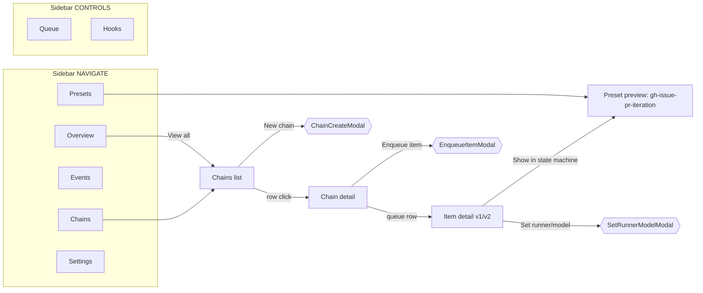

# 旧原型结构考古 — gui-prototype.pen @ git HEAD

考古对象：`/Users/mouriya/Ext/code/coder-loop` 仓库 `HEAD:gui-prototype.pen`（opus 制作的旧 GUI 原型）。
本文档所有 nodeId 都可在该文件中回查。

## 0. 文件同一性

```
git -C /Users/mouriya/Ext/code/coder-loop show HEAD:gui-prototype.pen > old-head.pen
shasum old-head.pen gui-prototype.pen.bak
6bbd7b7c51e53b42ee3d764153d76971c9b0cd91  old-head.pen
6bbd7b7c51e53b42ee3d764153d76971c9b0cd91  gui-prototype.pen.bak
```

**结论：`gui-prototype.pen.bak` 与 git HEAD 版本是同一文件**（1,291,389 bytes）。

## 1. 访问方式与限制（复现须知）

- 文件 import 了 `pencil:shadcn.lib.pen`。**pencil CLI headless 无法解析该 import**（`Base URI must be absolute!` bug），导致所有 `S:*` ref 变 broken_ref：`batch_get` 一旦序列化到 broken ref 即 crash（`Cannot read properties of undefined (reading 'id')`），`get_screenshot` 渲染红三角，`export_html` 静默丢弃对应子树。headless 下只有 `get_editor_state` / `get_variables` / `snapshot_layout`（纯布局）可靠。
- 完整读取的通路：`open -a Pencil old-head.pen` 让桌面 app 打开（app 缓存有 shadcn 库），然后用 pencil MCP 显式传 `filePath` 读——refs 全部解析，`batch_get`/`get_screenshot` 均正常。本次考古主体数据来自这条通路。
- 全程只读：未 save、未 batch_design、未触碰仓库内 `gui-prototype.pen`。

## 2. 设计 token（get_variables，全量）

文档级 variables，全部带 light/dark 双主题（theme 轴 `mode`）；shadcn 库另带自己的 `S:Mode` Light/Dark 轴（画板上实际用的是后者）。

| 组 | 变量 | light | dark |
|---|---|---|---|
| 背景 | `bg-canvas` | #F7F7F5 | #0E0F13 |
| | `bg-surface` | #FFFFFF | #16181E |
| | `bg-elevated` | #FFFFFF | #1D2028 |
| 边框 | `border-subtle` | #E4E4E1 | #22242D |
| | `border-strong` | #C7C7C1 | #313540 |
| 文字 | `text-primary` | #16181E | #E8E9EC |
| | `text-secondary` | #4A4E58 | #A8ACB6 |
| | `text-muted` | #8B8F98 | #6B7080 |
| 语义 | `accent` | #5B67D9 | #7B87F0 |
| | `success` | #2F9E5B | #47C77D |
| | `warning` | #C88A2B | #E5A54B |
| | `danger` | #C93D3D | #E56464 |
| | `info` | #4880C8 | #6BA0E6 |
| | 每个语义色配 `*-subtle`（10%/14% alpha 底色） | | |
| 字体 | `font-ui` = Inter；`font-mono` = JetBrains Mono | | |
| 间距 | `sp-1..7` = 4/8/12/16/24/32/48 | | |
| 圆角 | `r-sm/md/lg/xl` = 4/6/8/12 | | |

注意：画板上的组件实际大量直接引用 shadcn 库变量（`$S:--foreground`、`$S:--muted-foreground`、`$S:--card`、`$S:--border`、`$S:--secondary`、`$S:--sidebar-accent` 等），文档自有 token 只在少数地方用到（如 Live Dot 用 `$success`、告警用 `$warning`）。**双 token 体系并存是旧原型的一个未收敛点。**

## 3. 顶层节点地图（28 个）

画布布局：x=-8200/-6200 两列 Light 组件表 → x=-4200/-2200 两列 Dark 组件表 → x=1544 一列 Dark 屏幕 → x=3080 一列 Light 屏幕。**每块 Dark 画板都有同名 Light 双胞胎**（PageShell ref + `S:Mode: Light`），内容结构相同，只是主题轴不同。

### 屏幕（1440×1440，全部是 PageShell `V1OCc9` 的 ref 实例 + overrides）

| Dark nodeId | Light nodeId | 名称 |
|---|---|---|
| `KPn7b` | `b2UOz` | Desktop / Overview |
| `m6NtoX` | `qMmUo` | Desktop / Chains list |
| `jyiS1` | `ZdqM6` | Desktop / Chain detail |
| `eJ20n` | `CCBQd` | Desktop / Item detail |
| `x931Cz` | `f9jYAj` | Desktop / Preset preview |
| `F1HZc8` | `yCSW0` | Desktop / Item detail v2 (tabbed) |

### 组件表（1800 宽 holder frames）

| Dark nodeId | Light nodeId | 名称 |
|---|---|---|
| `oepV3` | `k3QV5` | Components / Pills family |
| `HpOg9` | `c5VLC` | Components / Field family |
| `w4M75g` | `e8Ww8` | Components / Row family |
| `x5KMd` | `i9RFu` | Components / Rich cards |
| `E0Dp1` | `LWJF4` | Components / Preset viz |
| `PCFRB` | `Bbt6y` | Components / Prompt · Context · Hooks (v3 signature) |
| `xtpGx` | `GWqdT` | Components / coder-loop composites（app shell） |
| `G3UFtB` | `UfVBp` | Components / Modals & flow atoms |

## 4. Reusable 组件体系

两层：**本地纯组件**（editor state 列出的 39 个，多为 frame+text 组合，不依赖 shadcn）与 **shadcn 派生组件**（ref 到 `S:*` 库组件 + overrides，`reusable: true` 但 headless 下 broken）。

### 4a. 本地组件（39 个，含 nodeId）

**App shell**
- `V1OCc9` PageShell — 1440×900：`chWvq` Sidebar（ref → R8WPN）+ `OLltT` Main（slot；内含 TopBar：`x0ibD` Crumbs / spacer / `UQLn4` Actions，及 `ORAnJ` Content）。**每个屏幕通过 override Crumbs/Actions/Content 三个槽位实例化**。

**Pills family（oepV3 表）**
- `aKfld` DaemonStatusPill（dot+label "Alive"）
- `RzVbD` ItemStatusPill（dot+label "iterating"）
- `D8pLKN` PhasePill
- `UAhU5` RunnerPill（runnerName "claude" + source "source: engine-builtin"）——**runner 溯源直接做进 pill**
- `pmTP2` PriorityBadge
- `oYQxr` EventKindChip（icon+label "LIFECYCLE"）
- `k5EXXm` RateLimitTag（clock + "Rate-limited: 4m 12s"）
- `FJUk6` LiveIndicator（pulse + "LIVE 2.4/s"）

**Field family（HpOg9 表）**
- `AXXq4` RepoPathText（git-branch icon + "mouriya-s-lab/coder-loop"）
- `k1YVj` ChainNameGroup（RepoPathText + sub "chain id 1042 · 3 items lifetime"）
- `JIyYy` QueueDepthSummary（pending/iterating/blocked 三个 dot+count chip，可单独禁用）
- `XOkKb` ChainMetaRow（REPOSITORY/DEFAULT PRESET/DEFAULT RUNNER/SHARED CONTEXT 四列，各 Label+Value+Sub）

**Row family（w4M75g 表）**
- `NZ9lg` ItemIdChip（#546）
- `GVPa3` AttemptCounter（"2/8"）
- `ySARP` ItemQueueRow — 10 个 Cell：position / item_id / title / phase / status / runner / attempts / priority / updated / action
- `l9ry5H` RunCard — top（run id / ItemIdChip / runner·model）+ progress（"elapsed 42s of 15m timeout"）+ actions
- `LsqTb` CurrentRunsStrip（Header "Current runs" + N × RunCard）
- `qAWqO` RunHistoryRow — Cell：run_id / phase / status("succeeded") / exit("0") / started / ended / duration("1m 8s") / action
- `LpIRy` ItemMetadataCard — "Metadata" + 11 行 KV：ITEM_ID/CHAIN/REPO_CWD/PRESET("gh-issue-pr-iteration (source: chain-bind)")/POSITION/ATTEMPTS("2 / 8")/PRIORITY/PHASE/RUNNER("claude (source: item)")/CREATED/UPDATED

**Rich cards（x5KMd 表）**
- `m46uTH` EventKindLegend（LIFECYCLE/DECISION/VALIDATION/AUDIT/DIAGNOSTIC 五种事件 kind chips）
- `w7a9X` MetricStatCard（label/value/delta，如 "ACTIVE CHAINS / 3 / +1 since yesterday"）
- `XF4LL` KeyValueRow、`Hwr3H` KeyValueGrid（REPO/PRESET/BASE BRANCH/MAX ITERATIONS/MODEL/STARTED）
- `cZdFD` EventStreamRow — TIME("14:22:26.412") / KIND chip / SOURCE / EVENT_TYPE("agent.exit") / CTX("coder-loop · #546 · run-3f8a2c") / SUMMARY("phase=iteration exit=0 duration=2m 8s") / ACTION
- `uLdmL` EventCompactRow（kind icon + "agent.spawn" + "12s ago"）
- `gbw8I` BindingRow — KEY/SOURCE/USED_BY/TYPE/VALUE_PREVIEW

**Preset viz（E0Dp1 表）**
- `oYTFM` PresetStateNode（"iterating" + "preset-declared"）
- `n58QFp` PresetTransitionArrow（label "needs_review"）
- `IAlw5` PresetPhaseNode（Title "iteration" + runner line + entry "iter-entry.md" + produces 状态列表）
- `FfU15` PresetPhaseConnector、`IaBRP` PresetLegendItem（"terminal"）
- `qtJzB` PresetStaticCheckRow（check icon + "DAG well-formed" + note "RFC-2"）
- `EK20e` PresetInfoCard — source/preset dir/idField("issueNumber")/phases("iteration → review")/fragments("12 files")/statuses declared(6)/engine fallback("codex")/DAG check/loaded

**Prompt · Context · Hooks（PCFRB 表，"v3 signature"）**
- `D8UrJ` PromptPathBar（"~/.coder-loop/loop-data/logs/coder-loop/run-3f8a2c/iteration/prompt.md"）
- `w00iJ` PromptToolbar — kicker "PROMPT VIEWER · v3 RFC-5"、sub "Rendered prompt persisted at spawn time — same bytes the agent process saw. Deterministic re-read after the fact."
- `dArft` PromptCodeLine（LineNo + mono Code）
- `mlb2O` PromptCodeBlock — header（"Rendered prompt" + "render 12ms · sha256:9c1a…f3"）+ 14 行示例 prompt（含 "## Read first"、"## Bindings"、REPO/BASE_BRANCH/ITEM_ID/RUN_ID）
- `a983W` HookInvocationRow（"before.attempt" → "~/.coder-loop/hooks/insert-review-gate.sh" · "42ms"）

### 4b. shadcn 派生组件（ref → `S:*` + overrides；headless 不可读，MCP 读全）

- `R8WPN` **CoderLoopSidebar**（shadcn sidebar `S:PV1ln`，256×800）— header "coder-loop" + "v3 · dev daemon"（icon: infinity）；NAVIGATE 组：Overview(layout-dashboard)/Chains(link-2)/Events(activity)/Presets(puzzle)/Settings(settings)；CONTROLS 组：Queue(list-ordered)/Hooks(webhook)；footer "pid 84213 · 1h 24m" + "loop-data"
- `vyNMr` **DaemonHealthCard**（shadcn card `S:pcGlv`，520×345）— 说明文案钉死判活语义："Alive requires all three certificates to agree. If only some agree, state is Split. If none, state is Down."；CertRow 三证书卡（pid file ~/loop-data/daemon.pid ✓ / socket listen daemon.sock LISTEN ✓ / daemon.status RPC 200 OK ✓）；MetaGrid（UPTIME "1h 24m 08s" / LAST EVENT "2s ago · agent.exit" / ACTIVE RUNS "2 / 8 slots" / EVENTS/S "2.4"）；按钮 View logs / Restart / Stop
- `BMoMO` **ChainSummaryCard**（320 宽）— ChainNameGroup + StatusBadge "Active" + KV（preset/branch/updated）+ View / Enqueue
- `FAzMR` **ChainListRow**（shadcn table row `S:LoAux`，1220 宽）— Name(ChainNameGroup) / Preset(+"bundled" badge) / Base(git-branch "main") / Status badge / Phase badge / Queue(QueueDepthSummary) / Updated / Action
- `JldzO` **RunnerFallbackAlert**（shadcn alert）— "Runner fallback to engine-builtin"，正文精确解释 fallback 语义（no [phases.runner] declared → falls back to codex (engine-builtin)，建议显式声明）
- `luVnK` **BlockedRemediationCard**（黄描边 card）— "Item cannot progress until the missing context is provided. Auto-retry disabled."；动作：Show run stderr / Provide context / Escalate to human / Re-admit
- `q0wNEj` **ChainCreateModal**（640）— "Register a chain against a repository and pick a default preset. Preset is a seed default — items override at admit time."；Cancel / Create chain
- `YXr7x` **EnqueueItemModal**（640）— "Item id is a plain TEXT string (v12 schema). Status is preset-declared. Runner precedence: item > phase > engine-builtin."；Cancel / Enqueue
- `BV2UA` **SetRunnerModelModal**（520）— "Override lands via `coder-loop chain set-runner-model` and applies to future runs only."；内嵌提示 "Existing precedence: item > phase > engine-builtin (codex)." / "Effective source will be: item override"；Cancel / Save override

非 reusable 的示例卡（同在 PCFRB 表）：
- `dSv0S` **PromptBindingsCard** — "Bindings resolved for this render · 15 keys · 11 engine · 4 preset"；表列 KEY/SOURCE/VALUE；行：REPO/ITEM_ID/RUN_ID/PHASE/LOG_DIR/SHARED_CONTEXT_PATH（source=engine badge）、BASE_BRANCH（source=chain）、ISSUE/BRANCH("546-iter-2")/PR("(unset)")/EVIDENCE_DIR(".coder-loop/runtime/evidence/546")（source=preset）
- `qqXi1` **SharedContextCard (RFC-3)** — "Chain-scoped shared file. Prompts declare the CLI tool the agent MUST call to append / read context. Persistence lives at SHARED_CONTEXT_PATH."；文件预览（.coder-loop/runtime/shared/coder-loop.md · 2.1 KB · v14；两条 `[iter run-xxx]` 追加记录 + "…8 more entries"）；badges：scope: chain / append-only / required: iteration / tool: cl-ctx；动作 Open file / Version history
- `bg6Q1` **HookLifecycleCard (RFC-4)** — "Hook points · 3 attached · 8 available"；"Scripts run with the full event metadata piped in as JSON on stdin; verdict on stdout gates admission or logs an audit event."；3×HookInvocationRow + "5 unattached: before.spawn · on.attempt.timeout · on.item.status · on.daemon.start · on.daemon.stop"；动作 Attach hook / Test invocation
- `HnpEU` **ThirdPartyTriggerCard (RFC-6)** — "Third-party trigger inbox · 2 pending · 6 today"；"External systems select {chain | workspace} × preset × metadata. GitHub App is an outboard consumer; typed request schema."；两条 inbox 示例（github-app: `mouriya-s-lab/coder-loop#546`，"label 'iac:deploy' → workflow gh-issue-pr-iteration…"；hapi-remote: "workspace hapi-9d2b6e · ephemeral workspace · preset real-e2e-minimal · metadata { taskRef: 'hapi-session#8' }"）；动作 View schema / Admit

## 5. 屏幕逐一考古

所有屏幕 = PageShell 实例，override 三槽位：Crumbs（面包屑）、Actions（右上动作组）、Content。侧边栏高亮项随屏幕切换（override `chWvq/<nav-item>` 的 fill = `$S:--sidebar-accent`）。

### 5.1 Overview（`KPn7b`，Content override `m3WllL`）

回答的问题：**"daemon 活着吗？现在整体在跑什么？刚发生了什么？"**

- H1 "Overview" + 副标 "Central daemon at ~/.coder-loop/loop-data — registered chains, live runs, recent events"；右侧 ViewTabs：Live / Snapshot
- Actions：Search / + New chain
- StatsRow 三个 MetricStatCard：ACTIVE CHAINS 3 (+1 since yesterday) / ITEMS IN FLIGHT 4 (2 iterating · 2 review) / QUEUE DEPTH 8 (3 pending · 1 blocked)
- DaemonHealth：整卡复用 `vyNMr` DaemonHealthCard（三证书判活）
- TwoColumn：RecentChainsCard（表头+5 行，"View all →"）+ RecentEventsCard（420 宽，LiveBadge + 8 条事件行）

### 5.2 Chains list（`m6NtoX`，Content override `ksyZo`）

回答的问题：**"我注册了哪些 chain，每条现在什么状态、队列多深？"**

- Title "Chains" + 副标 "6 registered · 3 active · 2 with running phase · queue depth 8"
- Actions：Import / + New chain
- FilterRow：状态 tabs（All (6) / Active (3) / Stopped (1) / Completed (1) / Deleted (1)）+ 右侧 "filter by name / repo…" 输入框 + Advanced
- Chains Card：表格（Header Row + 8 行 ChainListRow 结构）+ footer "Showing 8 of 8 records" + 分页

### 5.3 Chain detail（`jyiS1`）

回答的问题：**"这条 chain 的配置绑定是什么、正在跑什么、队列里排着什么？"**

- Chain Header：Live Dot（$success + glow）+ mono 标题 "mouriya-s-lab/coder-loop" + Active badge；meta 行 "chain id 1042 · created 3d ago · base main · 6 items lifetime · last activity 8s ago"
- Actions：Restart chain / Stop / + Enqueue item
- Meta Cards Row 四卡：REPOSITORY / DEFAULT PRESET（gh-issue-pr-iteration · bundled）/ DEFAULT RUNNER（codex · source: engine-builtin）/ SHARED CONTEXT（.coder-loop/runtime/shared/coder-loop.md · 2.1 KB · updated 42s ago）——**每个值都标注来源层**
- Current Runs Card：run 行（RunCard 结构，含 elapsed/timeout）
- Queue Card：ItemQueueRow 表格（position/id/title/phase/status/runner/attempts/priority/updated/action），截图可见 blocked 行红 badge、快捷操作列

### 5.4 Item detail（`eJ20n`，Content override `pSVc1`）

回答的问题：**"这个 item 现在卡在哪、跑过什么、上下文与元数据是什么？"**

- Crumbs：coder-loop › Chains › coder-loop › Item #546（**四级层级：Overview→Chain→Item**）
- Actions：Skip / Cancel run / Force retry
- Header Row：#546 + 副标 "daemon-restart docs after app update"
- Runner fallback alert（`S:QyzNg` 黄色警示，"Runner fallback active" + 精确原因）
- Body 左列：CurrentRunsStrip（2 个 RunCard：claude·claude-opus-4-7 与 codex·gpt-5.5 同 item 并行）→ Runs history（RunHistoryRow 表）→ Recent events
- Body 右列：ItemMetadataCard（11 行 KV）→ Sessions (2) → Preset [item.fields]（"Persisted under items.extra"）→ Dependencies

### 5.5 Preset preview（`x931Cz`，Content override `Zw6QI`）

回答的问题：**"这个 preset 编译出来的状态机/phase 管线/绑定到底长什么样，静态检查过没有？"**——把 preset.toml 可视化。

- Crumbs：coder-loop › Presets › gh-issue-pr-iteration
- TitleRow：mono "gh-issue-pr-iteration" + bundled badge + **"DAG passed" 绿 badge**；副标 "2 phases · 8 item statuses · 15 bindings · statically compiled at load"
- Actions：Show source / **Diff vs real-e2e-minimal** / Reload preset
- Tabs：Overview / State machine / Bindings / Fragments / Source（5 tab，只做了 Overview）
- 左列三卡：
  - **Item state machine**（"Compiled from preset.toml · statically verified at load (RFC-2)"）：手绘 DAG（layout:none 画布 `q2vB86`）：pending →admit→ iterating →needs_review→ awaiting_review →review_ok→ review_passed(终态绿)；iterating →timeout→ iteration_failed(红)；awaiting_review →ctx_missing→ blocked_needs_context(黄) →escalate→ needs_human(终态黄)；iteration_failed →unblocked→ blocked_needs_context；legend：initial/terminal/active/error
  - **Phase pipeline (2)**（"Linear v2 shape. RFC-1 (v3) will add parallel branches."）：iteration → review → 虚线 future phase 占位
  - **Bindings (15)**（"11 engine-owned · 4 preset-business"）：BindingRow 表
- 右列 `PdY2R`：**空的**（380 宽占位，PresetInfoCard 等组件已做但没放上屏）——未完成

### 5.6 Item detail v2 (tabbed)（`F1HZc8`，override root `MxNau`）

同一 item 页的**第二方案**：把 v1 的纵向堆叠改为 tab 化。

- Head：#546 + ItemStatusPill + PhasePill + PriorityBadge + "Show in state machine →" + copy 按钮；副标同 v1
- RunnerFallbackAlert 顶置（直接 ref 组件 `JldzO`）
- ItemTabs（shadcn tabs `S:PbofX`）：Overview / Prompt / **Runs (4)** / Events / Metadata / Dependencies
- TwoCol：左 CurrentRun（RunCard）→ RunsCard（4×RunHistoryRow + "Open Runs tab →"）→ BlockedRemediation（ref `luVnK`）；右 ItemMetadata → Sessions (2) → Preset [item.fields]（5×KeyValueRow）

### 导航信息架构



Events / Settings / Queue / Hooks 有导航入口但**没有对应屏幕**；Hooks/Shared context/Trigger inbox 内容只以组件卡形态存在（PCFRB 表，标 RFC-3/4/5/6）。

## 6. 设计决策提炼

### 信息架构
- 屏幕层级 Overview → Chains → Chain → Item，面包屑完整表达四级；Preset 是平行的一级实体（不挂在 chain 下）。
- 6 屏分工：全局健康（Overview）/ 资产清单（Chains list）/ 单链运行面（Chain detail）/ 单 item 排障面（Item detail ×2 方案）/ preset 编译产物可视化（Preset preview）。
- 一屏一个核心问题，副标题直接把该屏数据来源/统计写成一句话。

### 组件拆分粒度
- 四层粒度清晰：pill/chip 原子 → field 组合（Name+meta）→ row（表行）→ card/strip（区块）；screen 只做布局和 override。
- 领域概念全部组件化：status/phase/runner/priority/attempt/eventKind 各有专属 pill，没有裸文本状态。
- PageShell 是唯一 app 骨架组件，屏幕=PageShell 实例 + 三槽位 override（Crumbs/Actions/Content）——**screen-as-component-instance** 是旧原型最强的结构决策。

### 值得注意的做法
- **来源可追溯性贯穿一切**：RunnerPill 带 "source: engine-builtin"，Metadata 行写 "(source: item)" "(source: chain-bind)"，BindingRow 有 SOURCE 列（engine/chain/preset badge），SetRunnerModelModal 直接展示 precedence 链。engine/preset/chain/item 分层被翻译成 UI 一等公民。
- **判活语义可视化**：DaemonHealthCard 把 `daemon-restart-after-app-update` rule 里的三证书判活（pid file / socket LISTEN / RPC）做成三张 cert 卡 + Alive/Split/Down 文案。
- **Prompt viewer 钉住 determinism**："same bytes the agent process saw"、sha256、render 耗时——把 spawn 时物化的 prompt 当审计对象。
- **文案全是真实领域数据**：路径（~/.coder-loop/loop-data/...）、preset 名、状态词表、CLI 命令（`coder-loop chain set-runner-model`）、schema 备注（"plain TEXT string (v12 schema)"）都对得上仓库实况，不是 lorem ipsum。
- 大量前瞻 v3 概念挂 RFC 编号做成组件卡：RFC-1 并行 phase、RFC-2 静态 DAG 校验、RFC-3 shared context、RFC-4 hooks、RFC-5 prompt viewer、RFC-6 third-party trigger inbox。

### 占位/未完成
- Preset preview 右列空占位（`PdY2R`）；5 个 tab 只有 Overview 有内容。
- Events / Settings / Queue / Hooks 四个导航项无屏幕。
- Item detail 存在 v1/v2 两方案并存未裁决。
- 状态机 DAG 在屏幕上是手绘 layout:none 画布，没有复用 E0Dp1 表里做好的 PresetStateNode/PresetTransitionArrow 组件。
- 文档自有 token（bg-canvas 等）与 shadcn `S:--*` 变量双体系并存，实际引用几乎全走 shadcn。
- ItemQueueRow 的 phase/priority Cell、EventStreamRow 的 SOURCE cell 等个别 cell 内容为空。

## 7. 读不了/未逐一展开的部分

- headless CLI 下所有 `S:*`（shadcn lib）ref 不可读（见 §1）；本次已通过桌面 app + MCP 全部读到，无残余完全不可读节点。
- 未逐节点展开（结构可从同类推断，未逐字抄录）：Overview RecentChains 5 行 / RecentEvents 8 行的每行文案；Chains list 8 行每行数据；jyiS1 Queue Card 每行；Light 双胞胎画板（抽查 `b2UOz`/`GWqdT` 确认为同结构 + `S:Mode: Light`，未逐屏 diff）；shadcn 库组件本身的内部结构（属外部库，非本文件资产）。
- 每屏 Dark 截图已在考古过程中核验（对应 MCP get_screenshot，与节点树一致，无布局崩坏）。
