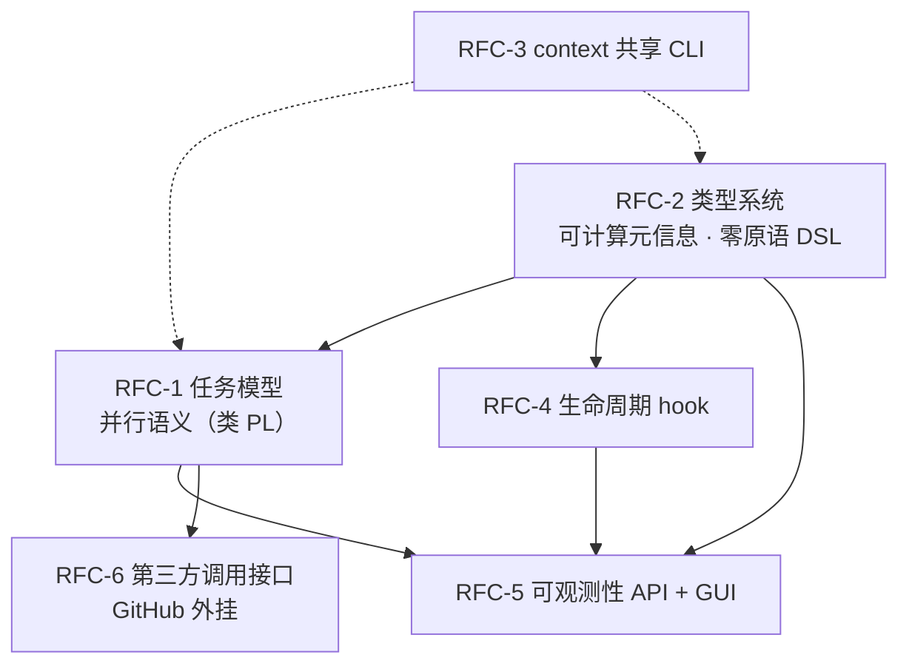

# v3 RFC 拆分（总控裁定，2026-07-02）

> 读者：各 RFC 子会话。每个子会话认领一个 RFC，先读 `.v3-design/v3-goals.md`（业务目标权威）+ `.v3-design/survey-engine-daemon.md` + `.v3-design/survey-preset-types.md`（现状事实），再按本文件自己那节的授权范围开展调查，与操作员讨论决策点，最终产出 RFC issue（用 `writing-issue` / `writing-complex-issues` skill，repo：`mouriya-s-lab/coder-loop`）。
>
> 边界纪律：只做自己 RFC 的调查与设计；触到跨 RFC 接缝时，把"我需要对方给我什么契约"写成显式接口假设登记在自己的 RFC 里，不替对方设计。发现拆分本身有问题（边界错、缺一块、两块该合并），报告操作员，不要自行重划。

## 全景

RFC-2 是地基：任务结构（含并行）如何被 DSL 表达并静态计算，决定 RFC-1 的声明面、RFC-4 的元数据 schema、RFC-5 的预览产物。RFC-1 是语义核心。RFC-3/4/6 相对独立可并行推进。RFC-5 消费其他各家的产物做展示，但 API 层设计可先行。

## 与既有 issue 线的关系（全体子会话须知）

- **#413（RFC: v3 chain 节点泛化为 item|容器）**：这是操作员 2026-06-10 的前史定义，现已被 #546 的统一 `leaf | seq | par` 任务代数 supersede 并关闭；现行 validator、join、reopen 与闭包契约只以 #546 及专项裁决报告为权威。#413 组成部分 1/2（GitHub App + item 可选 hapi 端执行）已重挂 #548。
- **#418（hapi headless 适配 spike）+ `mouriya-s-lab/hapi-remote-session#1/#2`**：归 RFC-6 线；设计书与实现 child 均已建立，完整依赖链和实时状态见 `v3/execution-orchestration.md` P1-B/P2-B/P6-A。
- **#453 / #396（类型权威 + 状态机收敛，children 与 umbrella 均已关闭）**：RFC-2 的直接前史。#453 里操作员 2026-06-12 裁决"context 流转能力暂缓"——RFC-3 就是重启这条线。
- **#534 audit 修复树**：9 个 children（#535-#542、#600）均已关闭，umbrella #534 尚待关闭；该树是 v2 质量收尾，各 RFC 不要把这些 bug 修复吸进自己范围。
- **全仓代码红线**（操作员裁决 2026-06-12，v3 一体适用）：全链路 ADT，禁止 `any`/匿名形状；`unknown` 仅限 catch 与边界 parse；禁止真 `as`（`as const` 除外）；外部输入经 arktype 边界 parse。

---

## RFC-1：任务模型——并行执行语义（类 PL 的任务代数）

**目标**（v3-goals 目标 2 + 目标 4 的并行部分）：任务设计类似 PL 设计——除依赖之外还有"平行函数"。需要完整独立思考它应该是什么样，**不只是加并发**。必须同时覆盖两个并行层次：
- **任务/item 级**：#413 的容器语义——并发执行、随时追加平行任务、验证者判定推进/退回。
- **phase 级**：目标 4 的"iter 实际是三个阶段，其中两个并行做不同的事"——一个 item 的 pipeline 内部有并行分支与汇合。

**现状事实**（survey-engine-daemon §1-2）：并发粒度 slot=(chainId, repoCwd)，slot 内严格串行；phase 推进是数组顺序（严格线性 pipeline）；`Bun.spawnSync` worktree 操作是隐藏串行点；trigger 机制（afterPhase/whenStatus、chain-complete）是现有的唯一非线性结构。

**调查与设计议题**：
1. 以 PL 语义第一性审视：任务结构应该是什么代数？（结构化并发 spawn/join？数据流图？#413 的链表+容器？调用图？）"依赖"与"平行"作为两个组合子够不够，还需要什么（join 策略、select/race、错误传播、取消传播）？
2. #413 容器模型的批判性评估：默认包裹容器、drain vs 验证者判定、退回上一步——哪些保留、哪些被更好的抽象替代。#413 的三个开放问题（退回时状态重置与副作用、判定状态修改主体与授权对接、包裹粒度）在新模型下如何回答或消解。
3. phase 级并行与 item 级并行是同一个抽象的两层实例，还是两套机制？（提示：如果任务代数足够干净，"iter 内两阶段并行"和"容器内多 item 并行"可能是同构的。）
4. 资源模型：并行分支的 worktree/repoCwd 隔离与合流；并发上限；`Bun.spawnSync` 串行点的消解。
5. 验证者 gate（#413）与 RFC-4 的 hook gate 的关系——是否同一个机制的两种绑定（LLM 验证者 vs 脚本判定）。登记接口假设即可，不设计 hook。
6. 与 RFC-2 的接缝：并行结构必须能被 DSL 声明且装载期可静态计算（死锁、不可达、汇合完备性）。登记对 DSL 表达力的需求清单。

## RFC-2：类型系统——可计算元信息与零原语任务定义

**目标**（目标 3 + 目标 4 的定义语言部分）：全链路类型化，状态机判定来源是可计算类型——每项约束在最早可决定的阶段验证（装载期/实例创建期/执行边界，#547 裁决 D 对目标 3「不需要运行时验证」的正式改写），元信息本身可计算，且可被 GUI 预览。零预定义原语，仅凭 meta（字符串定义）就能构造复杂任务（含"三阶段两个并行"的结构、含"必须调用某 CLI 工具"的约束声明）。

**现状事实**（survey-preset-types 全文，尤其 §7）：arktype 装载期校验、phase-exits ADT、品牌类型、DAG 装载期校验已在；但状态字面量/phase 名/变量 KEY 仍是运行时字符串 + 加载期校验，非静态可枚举；变量绑定目标端坍缩为 string，无结构化值流动；渲染失败语义三套不一致；businessKeys 只有 literal variant；plan 链 fragment 跳转完全 stringly-typed 且游离于状态机之外。

**调查与设计议题**：
1. "可计算元信息"的精确定义与产物形态：preset/任务定义装载后产出什么编译产物（typed model）？哪些判定从"运行时校验"前移到"定义期计算"？（现状已有 DAG check——盘点还缺什么：并行结构的汇合完备性、工具调用约束、hook 声明、变量类型流。）
2. "零原语"的边界：现在 iter+review 是 bundled preset 里的业务内容还是有引擎侧残留假设？（survey-engine §9 的六处残留 + `DEFAULT_PRESET_NAME`。）纯 meta 定义"三阶段两并行 + 强制 CLI 工具调用"需要 DSL 增加什么表达力——从 RFC-1 拿并行结构需求清单。
3. DSL 载体决策：toml 继续演进 vs 换载体（更可类型化的形态）。变量绑定的结构化类型流（目标端不再坍缩 string）；渲染失败语义统一。
4. 元信息可预览的输出契约：给 RFC-5 GUI 的"编译产物"长什么样（状态机图、phase 图、变量流、并行结构——机器可读 JSON）。
5. "可选的 prompt 要求必须调用某种特殊定义的 CLI 工具"——这个约束在 DSL 里如何声明、装载期如何校验、运行期谁执法（提示：现状 `phaseExitsEpilogue` 是引擎注入尾注的先例）。与 RFC-3 的接缝：工具本身归 RFC-3，约束声明归本 RFC。

## RFC-3：context 共享 CLI——无状态 agent 的受控上下文传递

**目标**（目标 4 的 context 部分）：一种特殊定义的 CLI 工具用于 context 共享，prompt 可要求 agent 必须调用它，使独立运行的无状态 agent 有一定程度的 context 传递能力。

**现状事实**：#453 操作员 2026-06-12 裁决"context 流转能力暂缓"——本 RFC 是重启。#396 已登记的设计事实：handoff/shared 文件是自由文本通道，影响下游判断质量但**不构成流转信号通道**——新工具必须维持"内容通道 ≠ 流转信号"边界（流转信号已全部收口于 CLI + 出边校验）。现有雏形：`sharedContextPath` binding（chain 级 shared.md）、evidence/issues 目录、`item.sessionIds`。CLAUDE.md 前提："每个 agent 运行都是无状态的……持久业务语义只能依赖 GitHub"——本 RFC 实质是给这条前提补一个引擎自有的受控例外，须显式重述该前提的新边界。

**调查与设计议题**：
1. 工具的读写模型：结构化（typed entries）还是自由文本？append-only 还是可覆写？谁能读谁的（作用域：chain / 并行容器 / item 谱系 / run）？
2. 与 RFC-1 并行模型的关系：并行分支间的 context 共享正是"平行函数"的通信面——是否就是并行任务间的唯一合法通道？
3. 授权对接：#406 run-scoped 凭证、#409/#410 权利矩阵——context 写入权按 phase 声明？
4. "必须调用"的执法：声明归 RFC-2，运行期怎么验证 agent 真调了（审计事件？完成前置检查？）。
5. 存储与生命周期：SQLite 还是文件？跨 chain 可见性？GC 策略？GUI 展示面（登记给 RFC-5）。

## RFC-4：生命周期 hook——引擎扩展点与用户态 gate

**目标**（目标 5）：生命周期事件可挂脚本；元数据全量传入；hook 能操作队列（例：每轮计算迭代次数 → 插队全面检查任务 → 派生修复任务 → 放行）。gate 策略归使用者设计，引擎只提供接口和能力。

**现状事实**（survey-engine §7）：hook 机制完全不存在。可复用地基：observability 约 40 种事件类型（五 kind）是现成的生命周期事件面草稿；daemon tick 模型；socket RPC 命令面（hook 操作队列可以就是调 CLI）；#409 鉴权分类（hook 以什么主体跑——operator? 新主体类?）。

**调查与设计议题**：
1. hook 点清单与命名：tick 级、run 级（pre-spawn/post-exit）、item 转移级、phase 级、chain 级（complete）、daemon 级（startup/shutdown）——哪些是 v3 必须、哪些留扩展。与 observability 事件枚举的关系（hook 点 = 事件订阅点？还是独立清单？）。
2. 执行模型：同步阻塞调度（gate 语义需要）vs 异步旁路（通知语义）；超时与失败语义（hook 挂了调度停不停）；幂等与重入。
3. 输入契约：元数据"全量传进去"的 schema——与 RFC-2 的可计算元信息产物对齐（登记接缝）。
4. 输出/能力契约：hook 怎么表达"插队"——返回结构化指令 vs 直接调 CLI mutation 命令？后者复用现有鉴权面，前者要新协议。操作员例子里"插队检查任务 → 通过才放行"是一个阻塞 gate + 队列 mutation 的组合，把它作为设计的验收场景。
5. 声明位：hook 挂在哪一层（全局 loop-data root / chain / preset / item）？脚本形态（任意可执行文件 + JSON stdin/stdout 契约?）。
6. 与 RFC-1 验证者 gate 的关系：LLM 验证者（item+preset）和脚本 hook 是否是同一 gate 接口的两种实现。

## RFC-5：可观测性 API 与 Web GUI

**目标**（目标 1 + 目标 3 的预览部分）：web GUI，PC + 移动端；一眼可见跑没跑；全链路展示；prompt 展示；可计算元信息（状态机/任务结构）预览。

**现状事实**（survey-engine §6、survey-preset-types §8）：无 HTTP/WS API——socket 是每请求一连接的行 JSON RPC，无推送；`logs --follow` 是客户端轮询。**渲染后 prompt 不落盘**（只有 `promptChars`），事后不可重建——prompt 展示的硬前置是新增持久化点（建议位置：`spawnOneAttempt` 写 `<logDir>/<runId>/<phase>/prompt.md`）。events JSONL 全局单流 + 约 40 种类型化事件、`status --json` 快照、SQLite 四表是可用数据源。`logs.query` 对 agent hard-deny，GUI 以 operator 身份消费无障碍。

**调查与设计议题**：
1. API 层形态：独立 HTTP/WS 网关进程包 socket 客户端 vs daemon 内直接长出 HTTP server——权衡（daemon 单线程 tick 阻塞点、故障隔离、部署形态、移动端经 mesh 访问）。推送机制（WS/SSE）vs 轮询。
2. prompt 持久化：落盘点、格式、保留策略（含渲染前模板+绑定值还是只有最终文本——给"prompt 展示"多大深度）。
3. 信息架构：全链路展示的层级（daemon → chains → items → runs → phases → attempts）；"跑没跑"的一眼判据（现状 daemon 活性判断连 CLI 都不可靠——见 repo 规则 daemon-restart-after-app-update）；移动端裁剪。
4. 元信息预览：消费 RFC-2 编译产物渲染状态机图/并行结构图（登记接缝：需要什么 JSON shape）；RFC-4 hook、RFC-3 context 的展示面。
5. 技术栈与仓库归属（monorepo 里养 GUI 还是独立 repo）；鉴权（局域网 operator 面? mesh 暴露?）。
6. 现状哪些观测数据缺失/不可靠需要引擎侧补（例：daemon 健康自报、run 进度心跳）。

## RFC-6：第三方调用接口与 GitHub 外挂

**目标**（目标 6）：coder-loop 预留第三方调用接口适配任意外部系统。调用语义是结构化的：**选定某条 chain 或独立 workspace + 选择工作流程 + 提供元信息**——不是传 prompt。GitHub 耦合功能（webhook → 自动开工作，参照 iac 的 github-hapi-agent-router 形态）做成外挂，不是原生功能。

**现状事实**（survey-engine §8）：外部触发入口只有 CLI→socket；无 webhook receiver、无对外 API。参考形态：`/Users/mouriya/Ext/code/github-hapi-agent-router`（GitHub webhook → 过滤 labeled-issue 触发 → NetBird mesh → Mac 本地 HAPI session daemon）。既有线：#413 组成部分 1/2 已重挂 #548；#418 spike、`hapi-remote-session#1` 设计书、`hapi-remote-session#2` CLI 实现与 #602/#603 外部执行终端样板均已进入实时 issue graph。

**调查与设计议题**：
1. 第三方调用面的形态：就是把 daemon socket API 正式化为对外契约（+网络可达层），还是独立 ingress 进程？与 RFC-5 API 层是否共用同一个对外协议面（登记接缝，避免两套 API）。
2. 调用语义的类型化：「chain | 独立 workspace」×「工作流程选择」×「元信息」的请求 schema。**"独立 workspace"是现状没有的概念**（现在必须先建 chain）——它是临时 chain 的语法糖还是新的一等实体？工作流程选择 = preset 选择（#412 已给 item 级 preset）还是更大的东西？
3. GitHub 外挂的架构：外挂进程的职责边界（webhook 摄入、label→工作流映射、去重/重放、鉴权）；它与 #413 组成部分 2 的"独立服务端 GitHub App + 本地 daemon 消费"的关系；复用 github-hapi-agent-router 还是新建。
4. #418 hapi 执行通道在本 RFC 的定位：item 在 hapi 端执行是"第三方调用 coder-loop"的反方向（coder-loop 调第三方执行器）——确认它归本 RFC 还是独立小 RFC，向操作员提议。
5. 鉴权与信任模型：外部系统的凭证形态（#406 现有 agent/operator 二分需要第三类主体?）；重放/幂等。

---

## 各会话统一交付形态

1. 先调查（读代码/issue/参考 repo），产出议题结论与备选方案对比；
2. 决策点逐个与操作员在**本会话**内讨论裁决（一次别抛太多）；
3. 裁决完后用 `writing-issue` / `writing-complex-issues` skill 编写 RFC issue 落到 `mouriya-s-lab/coder-loop`；
4. RFC 间接口假设写进 issue 的显式小节，注明"待 RFC-x 确认"。
