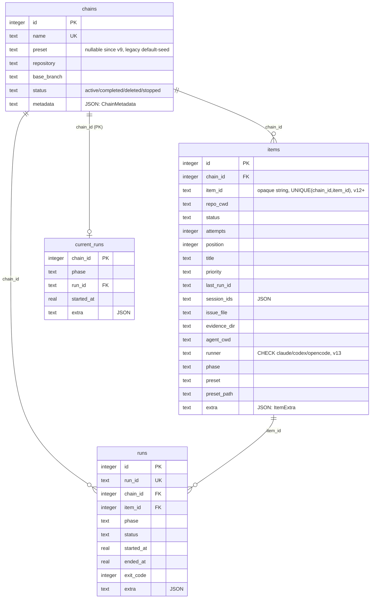

# coder-loop 引擎/调度/守护进程层现状架构报告（面向 v3 重新设计）

> 调查时间：2026-07-02，基线 pr-529 分支。调查者：code-explorer 子会话。本文件是 v3 总控会话的调查存档，供各 RFC 子会话消费。

调查范围：`src/daemon.ts`（5259 行）、`src/scheduler.ts`（2494 行）、`src/loop.ts`（6705 行）、`src/sqlite-state.ts`（1796 行）、`src/runtime-data.ts`、`src/observability.ts`、`src/rate-limit.ts`、`src/runners/session-id.ts`、`src/install-commands.ts`、`src/runtime-paths.ts`。

---

## 1. 进程与调度模型

三层调用链：CLI（`loop.ts` 命令解析）→ 中央 daemon（`daemon.ts`，Unix socket RPC 服务端）→ scheduler（`scheduler.ts`，被 daemon 定时调用的纯函数式 tick）。daemon 与 scheduler 不是两个进程，是**同一进程内**的两个模块：daemon 持有 `SchedulerState`（内存态：slots/backoff/凭据）并周期性调用 `schedulerTick()`。

- **daemon 职责**：进程生命周期（`daemon.ts:855-1110`）、Unix domain socket 服务、命令鉴权分类（`DaemonCommandAuthClass` 四类：`hard-deny-for-agent`/`per-phase-authorized`/`mutation-credential-gated`/`read-no-auth`，`daemon.ts:127-131`）、SQLite store 持有者、账号限流冷却状态与持久化、孤儿进程/run 回收（`recoverStaleSchedulerState`，`daemon.ts:1743`）。
- **scheduler 职责**：纯粹的"这个 tick 该 spawn 谁"决策函数 `schedulerTick(options, limits)`（`scheduler.ts:425`），不持有长期状态。
- **loop.ts 职责**：CLI 命令树（cmd-ts）、preset 加载/校验（`loadPreset`/`parsePreset`，`loop.ts:4038-4085`）、runner 命令行构造、`status`/`doctor` 快照构建、daemon 客户端 RPC 封装。CLI 进程本身不直接碰 SQLite——全部经 socket 打到 daemon。

**多 target/多 chain 管理**：一个 loop-data root（默认 `~/.coder-loop/loop-data`）对应**一个**常驻 daemon 进程和**一份** SQLite 文件。可创建任意多 chain，每 chain 绑定 `repository` + `baseBranch`，item 级可各自声明 preset（#412）。`schedulerTick` 对所有 `active` chain 做一轮遍历（`scheduler.ts:426-500`）。

**item 选中优先级**（`selectNextItemAndPhase`，`scheduler.ts:554-602`）：① 显式 `--phase` 强制；② trigger phase（`afterPhase/whenStatus`）；③ 上一 phase 跑完进入下一非 trigger phase；④ 兜底按 `(position, id)` 从 pending 状态集取下一条。

## 2. 并发现状

**存在并发，粒度是 `slot = (chainId, repoCwd)`**（`schedulerSlotKey`，`scheduler.ts:791`）：

- **多 chain 并行**：每个 `(chain, repoCwd)` slot 空闲即异步 spawn，互不等待。
- **同一 chain 内多 repoCwd 并行**：引擎层合法。历史 pre-v3 执行波次表曾把"一条 chain 内严格串行"作为**运维约定**记录，非引擎限制——引擎真实约束是"同一 slot 内串行"。
- **同一 slot 内严格串行**：`slot.activeRun !== null` 时本 tick 跳过（`scheduler.ts:460-469`），无 phase 内并行。
- **无总并发上限**（除 #478 限流网关 `limits.maxSpawns` 与 staggered resume 每 tick 1 spawn + 30s 冷却）。

**调度循环形态**：`setInterval` tick（默认 1000ms，`daemon.ts:2861`），非事件驱动。同一时刻只允许一个 tick in-flight，tick 期间再被请求则完成后立即重跑（`daemon.ts:2912-2926`）。

**隐藏串行点（重要架构债）**：`spawnSchedulerRun` 内 git worktree 操作走 **`Bun.spawnSync`**（`scheduler.ts:2473-2484`）——**同步阻塞整个 daemon 主线程**。agent 进程本身是 OS 级并行，但同一 tick 内多 slot 的 worktree add/remove/prune 串行执行且阻塞 socket 请求处理。v3 提升调度吞吐需关注。

## 3. 状态机推进机制

**当前形态（#405/#451 之后）**：状态完全由 agent 显式经 CLI 写，**不存在任何 stdout/SUMMARY 解析**（`loop.ts:984-990`）。

- **写路径**：agent 调 `coder-loop item update --status <X>` 或 `coder-loop item exit-action --action stop`。agent 先经 `coder-loop item exits` 查询合法出边；每个 daemon-spawn prompt 强制附加 `phaseExitsEpilogue`（`loop.ts:5320-5330`）。
- **默认拒绝网关（#397）**：`admitItemStatusForRequest`（`daemon.ts:3048-3069`）双重校验（词表 + phase.exits）；未声明 exits 的 phase 写权限为空集。每次判定写 `item.status.write_admission` 审计事件。
- **类型兜底**：SQLite 层 status 参数类型是品牌类型 `AdmittedItemStatus`，只能经请求流网关或 `engineLifecycleAdmittedItemStatus` 产出。
- **phase 完成判定**：引擎只看"进程退出没有、退出码是什么"。`latestRun.endedAt !== null && exitCode === 0` 才前进下一 phase；非 0 且未落 terminal 则指数退避（初始 60s、上限 480s，`scheduler.ts:1980-2014`）。
- **超时/看门狗三件套**：attempt 超时（默认 3600s，SIGTERM→SIGKILL）；startup idle watchdog（#462：10min 内 stdout < 200B 判挂死）；状态写入后回收窗口（#452：写完 status 给 500s 自然退出，超时 SIGKILL）。
- **契约形态**：状态词表、terminal/continuable 划分、phase 顺序、trigger 边、每 phase 可写状态，**全部**由 preset.toml 声明；引擎不含状态字面量业务含义。"机制归引擎、参数归 preset"在状态机维度已基本达成。

## 4. SQLite schema（当前 v13）

`STATE_SCHEMA_VERSION = 13`（`sqlite-state.ts:488`，#481 opencode runner CHECK 触发的 bump）。四张表：

#419 已完成：`issue_number INTEGER` → `item_id TEXT`，`branch`/`pr` 物理列退役（经 `[item.fields]` 存 `extra`）。`ChainMetadata`（`runtime-data.ts:105-135`）：`bindings`、per-runner `claude`/`codex`/`opencode` 覆盖、`maxItemAttempts`、`coderLoopChainCompleteTrigger`（trigger 幂等指纹）。

## 5. Agent spawn 机制

**命令行形态**（`buildRunnerInvocation`，`loop.ts:6217-6238`）：claude（`-p <prompt>` + `--add-dir`）、codex（`--ask-for-approval never exec [resume <sessionId>] --json --sandbox danger-full-access --cd ... <prompt>`，#463 默认注入 `RUST_LOG=info`）、opencode（#481 新增，`run --format json --dangerously-skip-permissions -m <model> [-s <sessionId>] <prompt>`）。

**prompt 注入**：渲染后完整字符串经命令行参数直传，不走 stdin/文件。

**worktree 管理**：`createGitWorktreeManager`（`scheduler.ts:802-824`）为每个 slot 建 worktree，分支名 `coder-loop/<chainName>-<sha256(repoCwd)[:12]>`，路径在 `<loopDataRoot>/chains/<name>/worktrees/`。

**resume 语义**：`item.sessionIds[phase][runner.kind]` 有值走 resume（`resumeDecisionForItem`，`scheduler.ts:2129`），无值 fresh。scheduler 主路径 resume 时仍发送**重新渲染的完整 phase prompt**（`scheduler.ts:1029-1035`，`AGENT_CWD`/`RESUMED_*` 绑定随之更新）；固定 `"继续"`（`RESUME_CONTINUE_PROMPT`，`loop.ts:994`）仅用于 chain-complete finalizer 路径（`spawnOneAttempt`，`loop.ts:6048`），不是 scheduler 通用行为。session id 从 stdout 首个 JSON 事件解析。**invalid-session detector**（`src/runners/session-id.ts`，pr-529 新增）：三 runner 各自 stderr 正则，命中即清 sessionIds + emit `session_id.invalidated`，下次自动 fresh。

**账号限流冷却**（#478）：stdout 扫 `rate_limit_event`，记录 `resetsAt` 全局暂停 spawn，冷却持久化到 `<loopDataRoot>/daemon/rate-limit.json`；限流 exit 不消耗 attempt。

## 6. 可观测性现状

**协议**：daemon socket 是**换行分隔 JSON、每请求一个新连接**的同步 RPC（`daemon.ts:3833-3864`）。无长连接、无订阅/推送；`logs --follow` 是客户端 1s 轮询模拟。**没有任何 HTTP/WebSocket API**——只有 `node:net` Unix socket。**GUI 没有现成网络协议可用，需新增一层。**

**`status --json`**（`buildCoderLoopStatusSnapshot`，经 `StatusSnapshotBoundary` arktype 校验）：`state`、`target.preset.name`、`target.runner.{hostDefault,default,phases}`、`queue.{total,continuable,terminal,selected}`、`current.{id,run,runner,phaseStatus}`、`events.{...}`、`processes.live`。`doctor` 复用 snapshot + operator 先决条件检查。

**events**：`ObservabilityEventTypeBoundary`（`observability.ts:24-121`）约 40 种事件类型，五种 kind：`audit`/`decision`/`lifecycle`/`validation`/`diagnostic`。持久化到 `<loopDataRoot>/events/`（JSONL，daemon 全局单流）。每条 mutation 请求对应 1-3 条审计事件。`logs.query` 对 agent hard-deny（#409 最小可见性）——GUI 以 operator 身份消费无障碍。

per-run 状态文件：`<logDir>/<runId>/<phase>/status.json`（fallback/debug 层，非第一契约面）。

## 7. 生命周期/hook 现状

**不存在**。全仓 grep "hook" 唯一命中是已废弃机制的注释（`loop.ts:5632`）。没有可注册回调点、没有 preset 侧脚本声明机制、没有 pre-spawn/post-exit/pre-transition 扩展点。preset 唯一扩展面是声明式 toml + prompt 模板。v3 hook 层需从零设计。

## 8. 外部触发现状

**只有 CLI**。无 webhook 接收端、无对外 REST API、无第三方推事件入口。GitHub 状态是 agent 在 prompt 里主动调 `gh` 查询，引擎完全被动（tick 轮询自己的 SQLite）。外部事件→daemon 需要新增独立 receiver 把事件转译成 socket 调用；当前无任何雏形。

## 9. 硬编码/契约债（现状核实）

旧偏离（#370/#396/#412 清单）**大部分已收敛**。现存 GitHub 形状残留六处（均带注释、非隐藏债）：

1. **`DEFAULT_PRESET_NAME = "gh-issue-pr-iteration"`**（`daemon.ts:374`, `loop.ts:70`）：chain.create 未传 preset 时的默认种子——引擎"禁止 preset 字面量"红线的**唯一现存违例**。
2. **`--issue` CLI flag 名**（六处）：底层已泛化为 `itemId`，flag 名保留 backward compat。
3. **`normalizeQueueIssueId`**（`loop.ts:4000-4009`）：硬编码 `owner/repo#123` / `#123` GitHub 引用记法解析。
4. **`inferRepositoryFromGit`**（`loop.ts:3977-3998`）：只认 `github.com` URL 正则。
5. **`doctor` 无条件检查 `gh` CLI**（`install-commands.ts:143-154`）：与 preset 无关。
6. **`REPOSITORY_REF_PATTERN`**（`daemon.ts:395`）：`chains.repository` NOT NULL + GitHub owner/repo 正则——非 GitHub 场景无法建 chain。

另：#539（renderRuntimeInputsDoc 按 `"ISSUE"` 变量名特判）已在 #534 audit 树登记待修。

---

## 关键文件清单（v3 设计必读）

- `src/daemon.ts` — daemon 生命周期、socket 协议、鉴权分类、限流冷却、孤儿回收
- `src/scheduler.ts` — tick 决策、slot/worktree/spawn、三套看门狗、退避
- `src/loop.ts` — CLI 命令树、preset 加载校验、runner 命令行构造、status/doctor 快照
- `src/sqlite-state.ts` — schema v13、迁移历史、store API
- `src/runtime-data.ts` — 品牌类型、`ChainMetadata`/`ItemExtra`
- `src/observability.ts` — 事件类型枚举
- `src/rate-limit.ts`、`src/runners/session-id.ts`、`src/install-commands.ts`
- `docs/architecture-v2.md` — v2 历史叙述（本次审查已同步至 schema v13）
- （已退役）`docs/execution-plan-pre-v3.md` — pre-v3 波次表；波次全部完成后 doc 已从仓库删除
