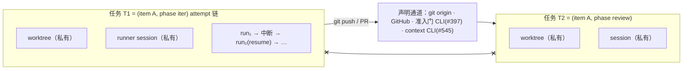

# v3 裁决报告：任务闭包与系统自证完备（边界 2）

> 裁决日期 2026-07-10，裁决主体操作员，产生于对旧命题「边界 2：resume session × per-run 独立 worktree」的受边界约束设计审查会话；该命题已被本文裁决替换为 per-task-closure worktree。
> 本报告是该裁决的权威记录；#546 body 的对应条款以本报告为源同步修订。影响面：#546、#560、#558、#559、#545、#567 与 `design-boundary.md` §2.3。

## 1. 裁决内容

三条，层层递进：

1. **执行单元 = 任务闭包**。任务 = 同一 `(item, phase)` 的 attempt 链（正是 v2 resume 机制既有的键，`resumeDecisionForItem` 按 `sessionIds[phase][runner]` 判定，`src/scheduler.ts:2129-2133`）。闭包 = worktree + session + per-task scratch，其资源生命周期服从闭包可达性：suspend 原地保留，只有控制流证明闭包已完全消费后才回收。worktree 独立性的粒度是**任务**，不是单次 run：同 item 的先后 phase 不共享、并行分支不共享；同任务的中断/重试续跑共享同一 worktree。#546 原「最强解读」（每次 agent run 一个 worktree）由本裁决替换——操作员 verbatim（"我认为无论并发不并发，永远都是独立worktree"）本身不含粒度信息，run 粒度是 RFC 会话代加的解释层，本次收回。

2. **「任务无状态」的准确含义是对外无状态**。闭包有私有内存（worktree 文件、session 记忆），resume 唤醒的正是这块私有内存；并发原语（par）的成立条件只有一条——任意两个活跃任务之间不存在未声明的共享可变状态，跨任务状态只经声明通道流动。因此 **resume 是闭包内动作**，对并发原语零影响；「跨 worktree resume」这个概念出局，此前为它设计的一切 relocation contract 不需要存在。

3. **系统自证完备，agent 逃逸不进证明**。设计不保证百分之百函数式（LLM 不 FP）；证明义务只对**引擎自己递出的面**量化（引擎代码有限、静态、可证），不对 agent 行为量化（等同于在编译期对不确定值求值，不可能）。agent 的不完备是 agent 的问题；系统的义务上限是把运行时问题**暴露**出来，且暴露可以延后——它是动态侧的 contract check，不参与完备性定理。

### 操作员 verbatim（2026-07-10）

> "我个人的认知里面，worktree是一个task的工作环境，那resume的核心是唤醒这个task，跨worktree resume等于改了我认知里的原语"

> "核心不在于worktree，边界在于什么是任务，任务是无状态的所以并发原语成立，那么要证明的点在任务是什么，会不会泄露状态，resume在哪里只是一种在闭包内的动作"

> "我们的设计不保证百分之百的函数式，因为llm不FP，而应该是自证我们的系统自己完备，agent的不完备是他的问题，而我们尽可能的把运行时的问题暴露出来就行，而这个暴露也不一定现在要做，他等同于在编译期对不确定值求值，这不可能"

## 2. 闭包模型

不变式：

- **session 生命周期 ⊆ worktree 生命周期 ⊆ 闭包可达生命周期**（session 不得跨 worktree 存活；suspend 不缩短任何一层生命周期；只有控制流证明闭包已完全消费后，才同步回收 worktree 并清该 phase 的 `sessionIds`）。
- **单活性**：每任务同一时刻至多一个活 run；par 只存在于任务之间，闭包内部串行。v2 由 slot 串行与 `current_runs` PK=chain_id 偶然保证，两者在 v3 均退役（#559/#558），须显式重立，归属 #558/#559。
- worktree 粒度与并发**正确性**无关（run 粒度与任务粒度都给出"不同任务不同目录"，前者只是比需要的更细）；粒度只影响资源账。选任务粒度的收益：resume 醒在原环境，记忆与磁盘一致，claude session store 按 cwd 键控的事实（`~/.claude/projects/<cwd-slug>/`）不再构成任何问题。

## 3. 引擎递出面定理（blame 语义）

系统侧唯一需要证明的命题：

> **引擎递给任务的每个面，必须穷尽归入三类之一：任务私有面、声明通道、repo 级共享 Git 协调面。前两类承载业务状态；第三类只承载 Git 对象存储、远端视图分发、引擎 pin 与 linked-worktree 管理，不得成为未声明的业务状态通道。**

三类面的边界不同：任务私有面给出闭包现场隔离；声明通道给出业务状态流合同；共享 Git 协调面只给出协议与 blame，不给出 hostile-agent capability isolation。只有引擎先穷尽递出面、禁止 preset 制度性要求越界操作、并保证自身 repo-wide Git 操作健全后，任务违反共享 Git 协议的操作才可归为 agent escape。引擎主动递出的未分类可写面、合法契约操作之间的互扰、或被共享 config/hooks 被动影响，blame 均在系统。这是 gradual typing blame 定理的形态：静态侧（引擎）自证健全，动态侧（agent）越界时 blame 才落在动态侧。定理在设计期可证，因为量化域是引擎代码。暴露机制（runtime 监测 escape）可永远后补，谓词就是下表的面清单——证明用的枚举与监测用的谓词是同一张表；房式已有先例（`session_id.invalidated`、#397 准入审计事件）。

### 递出面审计（2026-07-10，逐面核实）

| 引擎递出面 | 代码事实 | 判定 |
|---|---|---|
| spawn cwd（worktree） | `src/scheduler.ts:1063` | 任务私有 |
| runner session | 按 cwd 键控，寄生于 cwd 唯一性 | 任务私有（派生） |
| git 产物 | 经 origin 流动 | 声明通道 |
| GitHub 面 | — | 声明通道 |
| 引擎状态写 | #397 default-deny 准入门 + #406 run-scoped credential | 声明通道 |
| context | #545 context CLI | 声明通道（v3） |
| **`--add-dir` 集合** | `runnerAdditionalDirs = [presetDir, loopDataRoot, agentCwd]`（`src/loop.ts:6457-6459`）——整个 loop-data root 被授权，含他 chain 目录、全部 evidence、中央 SQLite DB | **系统侧缺口①（最重）**：prompt 侧刻意隐藏 DB 路径（`stateFile` 绑定为描述字符串，`src/scheduler.ts:2219`）、状态写走准入门，而权限授予侧把整根目录递出——引擎自己发的通行证旁路自己的准入门 |
| **sharedContextPath** | chain 级共享文件绑进每个 phase prompt（`src/scheduler.ts:2218`） | **边界②（操作员裁决 2026-07-11）**：保留现有 `shared.md` 创建与注入行为，显式分类为 chain 级自由 prompt 注入面（声明通道闭集成员，零行为定义）；#545 context CLI 只垄断结构化、受控、可审计的 context entry 通道，不替代此自由注入面 |
| **evidenceDir / currentIssueFile** | per-item 路径绑进 prompt（`src/scheduler.ts:2205-2221`） | **系统侧缺口③（扩围）**：与 `SHARED_CONTEXT_FILE`（chain 级面）一样寿命长于任务——不止 phase 级 par 下共享，纯 seq 下已是「生命周期 ⊆ 任务」反例（同 item 先后 phase 两个任务共享同一 evidenceDir）；按定理口径逐面作用域化，归 #567 落地时处置 |
| base repo `.git`：objects / packs | 所有 worktree 共享对象库 | **共享 Git 协调面**：正常 commit/fetch 只增对象；active/suspended 闭包存在时引擎不做显式 `git gc`，任务执行破坏性 `gc/repack/prune` = escape |
| base repo `.git`：`refs/remotes/*` | 一次 repo fetch 向所有 worktree 分发当前远端视图；其后可随合法 fetch 漂移 | **共享 Git 协调面**：是时间相关观察，不是稳定计算输入；稳定输入只读持久化 base SHA / par pin；引擎 fetch per-repo 串行化/去重并显式记录新鲜度 |
| base repo `.git`：闭包分支 / pin refs | refs 物理共享，闭包分支逻辑所有权 per-task，pin 归引擎 namespace | **共享 Git 协调面**：引擎只改自身 namespace；per-task 唯一命名；任务改写/删除他闭包 ref 或 pin = escape |
| base repo `.git`：config / hooks | repo-scoped 修改可被其他 worktree 被动消费 | **系统高危面**：不得作为任务间通道；preset 不得指示任务修改；#560 创建/对账合同封闭并暴露漂移，不能仅靠 blame |
| base repo `.git`：linked-worktree metadata | `worktree add/remove/prune/repair` 影响全 repo | **引擎独占协调面**：结构性 worktree 操作归 #560；任务操作他闭包或执行 repo-wide prune/repair = escape |

缺口归属：① #601（收敛 `--add-dir`）；② 非缺口——已由操作员裁为保留（边界②，见上表）；③ #567 落地时处置（扩围口径）。

**移出证明范围（escape，不设计应对，最多日后暴露）**：agent 绕路写 base repo 工作树、改写/删除他任务分支或引擎 pin、修改 repo config/hooks、执行破坏性 `git gc/repack/prune` 或 `git worktree remove/prune/repair`、动 `~/.claude.json`、滥用 ambient 凭据、猜路径读他人 worktree。这里是 blame boundary，不是 capability isolation；若 preset 制度性指示其中任何动作，或引擎自己的授权/并发使合法任务被动受影响，则不得归类为 escape。

## 4. 事实核查记录（修正被讹传的前提）

边界 2 会话对生产代码的核查，修正了两处已写入 issue/survey 的错误记载：

1. **「resume prompt 固定『继续』」不是 scheduler 通用行为。** scheduler 主路径 resume 时发送**重新渲染的完整 phase prompt**（`src/scheduler.ts:1029-1035`；claude 形态 `--resume <sessionId> -p <完整prompt>`，`src/loop.ts:6406-6407`），`AGENT_CWD` 绑定当次 worktree（`src/scheduler.ts:2217`）、`RESUMED_*` 三值随注（2238-2241）。`RESUME_CONTINUE_PROMPT = "继续"`（`src/loop.ts:994`）唯一使用点在 `spawnOneAttempt`（`src/loop.ts:6048`），仅被 chain-complete finalizer 路径消费（`src/loop.ts:5050 → 5773`），该路径 `agentCwd = targetCwd` 固定目录。错误源头 `v3/survey-engine-daemon.md` §5 与 #560 body 上下文节，均已修正。
2. **v2 worktree 实为 slot 粒度**（`chain × repoCwd`，`src/scheduler.ts:791-823`），比任务还粗；v2 里 resume 醒在同环境是 slot 粒度的偶然副产品。任务粒度既不是 v2 实然也不是原 RFC 文本，是本裁决新钉。
3. 相关外围事实：codex resume 分支不带 `--cd`（`src/loop.ts:6503-6509`，靠进程 cwd 兜底）；session 失效检测三 runner 词表在 `src/runners/session-id.ts`，命中即清 sessionIds 自动降级 fresh（`src/scheduler.ts:1294-1306`）；新 worktree 起点 `origin/<base> → <base> → HEAD`（`src/scheduler.ts:2436-2441`）。

## 5. 对既有产物的修正清单

| 产物 | 修正 | 状态 |
|---|---|---|
| #546 body | 裁决 1 粒度重裁；leaf 定义注明 attempt 链；资源模型公理改任务闭包 + 单活性不变式；新增「引擎递出面定理」节；答复 #545 中「文件系统旁路天然不存在」句替换为引擎侧可证断言；实现约束「resume 适配」句重写；关闭验证行 7 改任务粒度、增行 12（单活性） | 本次执行 |
| #560 body | 承接条款快照同步；上下文节「继续」讹误修正；目标/预期/验收由 per-run 改 per-task（回收点 = 任务终结；resume 醒在原 worktree；任务终结清 sessionIds） | 本次执行 |
| `v3/survey-engine-daemon.md` §5 | resume 语义两条路径分开陈述 | 已修 |
| `v3/design-boundary.md` §2.3 | 「per-run 隔离」→ 任务闭包隔离 | 已修 |
| 新 child（#546 sub-issue） | 收敛 `--add-dir`：剥离 loopDataRoot 整根授权 | 本次创建 |
| #558/#559 | 单活性不变式归属（经 #546 body 登记） | 本次登记 |
| #545 / #567 | 边界②（`shared.md` 保留，操作员 2026-07-11 裁决）与缺口③（扩围）的登记（经 #546 body） | 已登记 |

## 6. 方法论记录：初始审查方向为何错

边界 2 会话的初始方向（为「跨 worktree resume」设计 relocation contract，给出 A/B/C 三选项）被证明是错误框架。错因四条，供后续审查会话对照：

1. **从记录进入而非从语义进入**。审查以 #560/survey 的「prompt 固定继续」与「worktree=资源、resume=问题」为给定框架，在框架内优化（契约补缝），没有先问「resume 唤醒的本体是什么」。症状级设计 = 在错误原语上叠契约；方向 C 的全部复杂度都是给伪概念付的税。
2. **证明义务放错侧**。初版隔离审计把「agent 可能干什么」当约束对象——对不确定值量化，不可证也不该证。可证的只有「引擎递了什么」。放错侧的直接后果是把 escape 类风险与系统侧缺口混在一张表里，掩盖了真正最重的缺口（`--add-dir` 整根授权）。
3. **对「某选项使问题消失」的信号迟钝**。三选项中 B 让边界 2 整体不存在——一个答案能让问题消失，是问题框架本身错了的最强信号；初版却把 A/B/C 当对称选项呈报，让裁决者在伪对称里选。
4. **未区分 verbatim 与代理解释层**。把 #546「最强解读」当不可动的公理输入，而它是 RFC 会话对操作员一句话的自选解读。审查会话应默认核查每条继承条款的裁决出处强度：操作员原话钉了什么、解释层加了什么，只有前者不可动。
