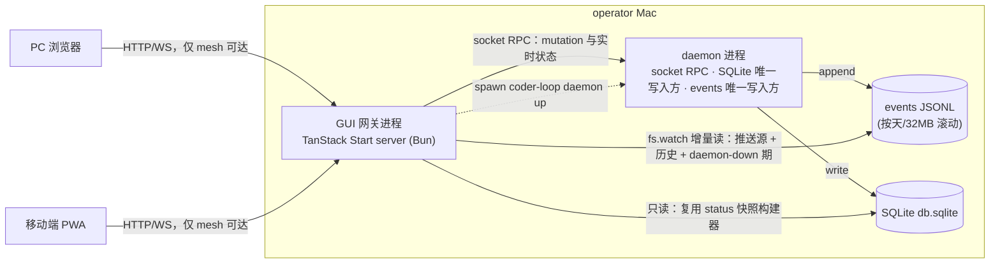

# #544 RFC: v3 可观测性 API 与 Web GUI——mesh 内独立网关进程（PC+移动端）

- state: **open**  | author: `RiriAgent`  | created: 2026-07-02T07:48:18Z  | updated: 2026-07-26T16:15:01Z
- labels: (none)
- url: https://github.com/mouriya-s-lab/coder-loop/issues/544
- comments: 4  | timeline events: 84
- sub-issues:
  - #571 [CLOSED] Spike: TanStack Start (Bun) 网关宿主——多接口选择性绑定与 SSE/WS 推送可行性 (mouriya-s-lab/coder-loop)
  - #572 [CLOSED] feat(engine): 渲染后 prompt 与绑定值快照落盘（prompt.md + bindings.json） (mouriya-s-lab/coder-loop)
  - #573 [CLOSED] feat(engine): events 消费契约固化——boundary 导出与滚动段规则测试钉住 (mouriya-s-lab/coder-loop)
  - #574 [CLOSED] feat(engine): status 快照 boundary 收紧——七个匿名 object 槽换精确 schema (mouriya-s-lab/coder-loop)
  - #575 [CLOSED] feat(engine+gui): status 快照 hooks 节与 gate hold 可见性 (mouriya-s-lab/coder-loop)
  - #576 [CLOSED] feat(gui): 网关进程骨架——TanStack Start (Bun) + mesh-only 监听 + socket RPC/SQLite 只读两数据面 (mouriya-s-lab/coder-loop)
  - #577 [CLOSED] feat(gui): events 直读与实时推送——fs.watch 增量读 + WS/SSE 到前端 (mouriya-s-lab/coder-loop)
  - #578 [CLOSED] feat(gui): 首屏「跑没跑」——daemon 三证活性与一键生命周期控制 (mouriya-s-lab/coder-loop)
  - #579 [CLOSED] feat(gui): 控制面解卡动作与 F 档写入口收口 (mouriya-s-lab/coder-loop)
  - #580 [CLOSED] feat(gui): 全链路层级展示——daemon→chains→items→runs→phases/attempts 钻取与任务树渲染 (mouriya-s-lab/coder-loop)
  - #581 [CLOSED] feat(gui): prompt 展示——per attempt 渲染全文与变量→值对照 (mouriya-s-lab/coder-loop)
  - #582 [CLOSED] feat(gui): 元信息预览——消费 preset compile 编译产物渲染状态机图与任务树 (mouriya-s-lab/coder-loop)
  - #583 [CLOSED] feat(gui): context entries 展示面——纯消费 #545 read boundary (mouriya-s-lab/coder-loop)
  - #584 [CLOSED] feat(gui): 移动端与 PWA——mesh 内手机可用的首屏与控制面 (mouriya-s-lab/coder-loop)
  - #585 [CLOSED] docs(v3): GUI 网关收尾对齐——红线审计与文档终态 (mouriya-s-lab/coder-loop)
  - #716 [OPEN] feat(engine): status snapshot 严格只读 SQLite 入口 (mouriya-s-lab/coder-loop)
  - #717 [OPEN] feat(engine): 渲染后 prompt 与 bindings 快照 (mouriya-s-lab/coder-loop)
  - #718 [OPEN] feat(engine): status snapshot 精确 schema boundary (mouriya-s-lab/coder-loop)
  - #719 [OPEN] feat(engine+gui): status hooks 与 gate hold 可见性 (mouriya-s-lab/coder-loop)
  - #720 [OPEN] feat(gui): TanStack 网关与严格只读数据面 (mouriya-s-lab/coder-loop)
  - #721 [OPEN] feat(gui): events 增量读取与实时推送 (mouriya-s-lab/coder-loop)
  - #722 [OPEN] feat(gui): daemon 活性首屏与生命周期控制 (mouriya-s-lab/coder-loop)
  - #723 [OPEN] feat(gui): 控制面解卡动作与写入口收口 (mouriya-s-lab/coder-loop)
  - #724 [OPEN] feat(gui): chain/item/run 任务树层级展示 (mouriya-s-lab/coder-loop)
  - #725 [OPEN] feat(gui): per-attempt prompt 与 bindings 展示 (mouriya-s-lab/coder-loop)
  - #726 [OPEN] feat(gui): 编译元信息与任务树预览 (mouriya-s-lab/coder-loop)
  - #727 [OPEN] feat(gui): context entries 只读展示 (mouriya-s-lab/coder-loop)
  - #728 [OPEN] feat(gui): mesh 内移动端与 PWA (mouriya-s-lab/coder-loop)
  - #729 [OPEN] docs(v3): GUI 网关冻结 SHA 收尾验收 (mouriya-s-lab/coder-loop)

---

## Body

## 摘要

v3 目标 1（GUI）与目标 3 的预览部分的 RFC。形态（操作员裁决 2026-07-02，RFC-5 子会话，七项裁决记录见下）：coder-loop monorepo 内新增一个**独立 GUI 网关进程**（TanStack Start server，Bun 运行时），mesh-only 暴露，对内走三个数据面（daemon socket RPC、events JSONL 特许直读、SQLite 只读快照复用），对外承载 PC + 移动端 Web GUI：一眼可见跑没跑、全链路展示、prompt 展示、可计算元信息预览，以及「观测 + daemon 生命周期 + 解卡」控制面。

## 操作员目标（verbatim）

> "v2 已经 daemon 化，但是 v2 的可观测性很弱，每次都是 agent 去找 session 看。假如存在一个好的 web GUI，则看一眼就知道跑没跑。所以我希望 v3 有 GUI，GUI 的设计需要同时考虑 PC 和移动端，GUI 除了做全链路展示，还得有 prompt 展示。" — `v3/v3-goals.md` 目标 1（2026-07-02）

> "因为全链路类型化，所以状态机的判定来源是可计算类型……我认为这部分需要 GUI 可预览。" — `v3/v3-goals.md` 目标 3（预览部分归本 RFC）

## 上下文

- **Repo**: `mouriya-s-lab/coder-loop`（path: `/Users/mouriya/Ext/code/coder-loop`）
- **Design source**: `v3/v3-goals.md`（业务目标权威）、`v3/rfc-split.md` RFC-5 节（授权范围）、`v3/survey-engine-daemon.md` §6、`v3/survey-preset-types.md` §8（现状事实）
- **当前 baseline 锚点**（pr-529 系基线，实施前自行 grep 行号）：socket RPC `sendDaemonRequest`（`src/daemon.ts:3833-3864`）、`logs --follow` 轮询（`src/loop.ts:1830-1844`）、`spawnOneAttempt` prompt 边界（`src/loop.ts:5829-5880`）、`StatusSnapshotBoundary`（`src/loop.ts:490-498`）、事件 union（`src/observability.ts:24-132`）、status 构建器 SQLite 只读读取（`src/loop.ts:3868-3903`）

## 现状问题

1. **对外协议真空**。daemon 唯一控制面是 Unix socket 行 JSON RPC，每请求一连接（`src/daemon.ts:3833-3864`），无长连接、无订阅推送、无任何 HTTP/WS。`coder-loop logs --follow` 是 CLI 侧 1s 轮询全量重查再 slice（`src/loop.ts:1836-1844`）——每秒重读全部 events 段文件，事件量增长后线性退化。GUI 没有现成网络协议可用。
2. **prompt 事后不可见**。`spawnOneAttempt` 只把 `promptChars`（字符数）写进 `status.json`（`src/loop.ts:5861`）；渲染后 prompt 全文只作为子进程 argv 传给 runner（`src/loop.ts:5879`），不落盘。事后重放 `renderPrompt` 不可行——ctx 依赖 item 当时状态快照与一次性 `runId`。「prompt 展示」缺硬前置。
3. **「跑没跑」恰是现状最不可靠的判据**。repo 规则 `daemon-restart-after-app-update` 明载 `status --json` 的 daemon 字段不可信、sock/pid 可能是陈尸文件；#359 实证过进程存活但 socket pathname 丢失的控制面分裂；#387/#388/#536 是 daemon 崩溃史；且 app 每次更新都必须重启 daemon——**daemon 是一个会频繁死、且死时最需要被看见的进程**，而现在死了就整个观测面一起消失。
4. **status 快照对 GUI 无契约力**。`StatusSnapshotBoundary` 顶层是七个匿名 `"object"` 槽（`src/loop.ts:490-498`），内部形态靠实现自觉，GUI 消费前必须收紧。
5. **数据源良好但无消费面**。#411 已建成 44 种编译期 union 事件（五 kind，信封含 chain/item/runId/phase 关联键）、单一 JSONL 流按天/32MB 滚动、`daemon.status`（pid/running/activeRuns/rateLimit）、SQLite 四表——缺的只是一个网络可达、可推送、daemon 死时仍在的消费面。

## 裁决记录（操作员，2026-07-02，RFC-5 子会话）

| # | 决策点 | 裁决 | 决定性理由 |
|---|---|---|---|
| A | API 层宿主 | **独立 GUI 网关进程**（否决 daemon 内嵌 HTTP） | GUI 价值最高的时刻恰是 daemon 不健康的时刻；观测面与被观测者同进程 = 监控随对象一起死。网关常驻可展示 daemon 死因并远程拉起，补上 `daemon-restart-after-app-update` 的运维闭环 |
| B | 推送通道 | **网关直读 events JSONL**（`fs.watch` + offset 增量），否决 socket 订阅 verb | daemon 死时通道依然活；零引擎改动。**豁免声明**：#411「消费者从此不刮 runtime 文件」禁令对网关一家豁免（同仓同版本演进的特许消费者），对 supervisor/agent/脚本等其他消费者禁令不变 |
| C | prompt 持久化深度 | **渲染文本 + 绑定值快照**（`prompt.md` + `bindings.json`） | GUI 可展示变量→值对照，与 RFC-2 元信息预览衔接；绑定表本在内存，成本≈0 |
| D | 暴露与鉴权 | **mesh-only 裸信任**：只绑 localhost + netbird 接口，无应用层鉴权 | 控制面动作全在 mesh 内，与既有运维面信任模型一致；bearer token 登记为可选演进，不进 v3 验收 |
| E | 仓库归属 | **monorepo**（coder-loop repo 内） | B 裁决使 events 文件形态成为网关正式契约面，「钦定内部契约」只有同仓同版本演进才安全；跨 repo 即变成事实公共 API |
| F | 控制面范围 | **观测 + daemon 生命周期 + 解卡动作**（否决完整 CLI parity） | 手机场景 = 看见异常当场处置；创建类重交互（chain create / item add）留给 CLI/agent，不进 v3 |
| G | 前端栈 | **TanStack Start** | 操作员指定。自带服务端运行时——网关进程即 TanStack Start server 本身，一个进程承载静态资产 + API server routes + WS/SSE 推送 |

## 架构

- **三个数据面各司其职**：mutation 与瞬时状态走 socket RPC（网关无 agent 凭证，daemon 视之为 operator 主体，`logs.query` hard-deny-for-agent 不影响它，零新增鉴权面）；事件推送与历史走 events JSONL 直读；队列/链快照走 SQLite 只读——这不是新侧门，`buildCoderLoopStatusSnapshot` 本就以 `openSqliteStateStore({ createIfMissing: false })` 只读直读 SQLite（`src/loop.ts:3868-3875`），网关同仓 import 复用同一构建器。
- **daemon-down 行为（本 RFC 立身场景）**：daemon 死后网关照常服务——events 历史与死前最后事件（JSONL）、队列终态（SQLite 只读）、死因线索（`daemon.fatal`/`daemon.stop` 事件与 #388 落盘的崩溃记录）可读；活性判定用三证探针（pid 文件 + socket connect + `daemon.status` 应答），三证呈现给前端而非折叠成一个布尔——#359 型「进程活但 socket 死」的分裂状态如实展示。GUI 提供一键 `daemon up` / restart。
- **推送**：网关把 events 增量经 WS/SSE 推给前端；前端快照类数据走 server routes 查询 + 事件驱动失效。

## 引擎侧新增工作（实现 children 具体化）

1. **prompt 持久化点**：`spawnOneAttempt` 构造 argv 前把渲染后全文写 `<runDir>/<phase>/prompt.md`、绑定值快照写 `bindings.json`（`{{KEY}}` → 实际值）；resume attempt 同样落盘当次真实 `effectivePrompt` 并标记 resume；固定「继续」只属于 chain-complete finalizer 特例，不外推到普通 resume。保留策略跟随 run 目录既有生命周期，不新增 GC 语义。
2. **events 契约面固化**：`ObservabilityEventBoundary` 与滚动段命名/顺序规则作为网关消费契约导出（同仓类型 import），滚动/翻段行为有测试钉住——网关按契约读段，不逆向猜文件名。
3. **status 快照 boundary 收紧**：七个匿名 `"object"` 槽换成精确 schema——GUI 的快照契约。此项与 RFC-2 的编译产物 schema 互补不重叠（快照=运行态，编译产物=定义态）。

## 信息架构

- **层级**：daemon → chains → items → runs → phases/attempts，与既有关联键（chain/item/runId/phase）一致；事件→run→item 可关联跳转。
- **首屏「跑没跑」判据**：daemon 三证状态 + 每 chain 的活 run/最近转移 + rate-limit 冷却（`daemon.status.rateLimit`）+ 最近异常事件（`daemon.fatal`/`scheduler.tick_failed`/`attempt.timeout` 等）。daemon 死与断网可区分：网关仍应答即非断网。
- **prompt 展示**：per attempt 的渲染全文 + 变量→值对照表 + fresh/resume 标记。
- **元信息预览**：消费 RFC-2 编译产物渲染状态机图/phase 结构/变量流（见接口假设）。
- **移动端**：同一响应式应用 + PWA（可加主屏），不做原生壳；移动首屏偏「跑没跑 + 异常清单 + 控制面动作」，深层浏览与 PC 同构。

## 控制面范围（F 裁决展开）

GUI 全部写动作即以下清单，不多不少：daemon start / stop / restart（start 由网关 spawn `coder-loop daemon up`，stop/restart 经 socket RPC）、`queue.unblock`、`chain.stop` / `chain.resume`、`item.reorder`，以及当前 operator 对指定 evaluation epoch 有 capability 时的 `advance | hold | reopen` decision。全部经 operator RPC 转发；GUI 不推导 decision，也不用 resume/unblock/改 join 冒充；创建类（`chain.create` / `item.add` / batch）不进 v3。

## 与其他 RFC 的接口假设

- **RFC-2（#547，已答）**：元信息预览消费 `coder-loop preset compile --json` 编译产物（schemaVersion 稳定契约，六块：preset 元信息 / statuses+stateGraph / phases+任务树 / tools / fragments / findings）。本 RFC 只消费不定义 shape；快照 boundary 收紧与编译产物互补不重叠（快照=运行态，编译产物=定义态）；typed bindings 使 `bindings.json` 携带类型化值。
- **RFC-1（#546，已裁）**：operator per-epoch decision 是定义态 join 卡死时的正式解卡能力，纳入 F 档：GUI 仅在 daemon 返回当前 operator 对该 epoch 的 capability 时渲染 `advance | hold | reopen`，携带 evaluation scope 原样转发，不自行判定。slot 语义退役，不再是展示对象；chains→items 层的展示对象是任务树（节点 = leaf/seq/par + join 声明与状态 + reopen 计数），「活 run 并行分支」= par 内多 leaf 各自的 run。**leaf 节点携带闭包生命周期态（活跃/挂起/已消费）与闭包分支名**（#546 body「答复 #544（RFC-5）」节 2026-07-10 修订，逐字快照）：

  > "GUI 的展示对象是任务树（节点 = leaf/seq/par + join 声明与状态 + reopen 计数；leaf 节点携带闭包生命周期态 活跃/挂起/已消费 与闭包分支名——GUI 是闭包状态机同一事实源的展示投影，不另建状态推断），引擎经 status 面暴露树结构快照……闭包状态表（生命周期态、worktree 路径、闭包分支、sessionIds、par pin commit）随同一 shape 承诺一并钉住——它是四视图（执行/GC/hook/暴露谓词）的持久化事实源。"

  **展示原则**：GUI 是闭包状态机同一事实源的展示投影，禁止另建状态推断——不得从 worktree 目录存在性、git 现状、进程状态等运行时痕迹反推闭包态。**数据来源**：#558 闭包状态表经 status 面暴露（生命周期态、worktree 路径、闭包分支、sessionIds、par pin commit 逐字段随 shape 承诺一并钉住）。树运行态持久化形态与 status 快照的树结构 shape 由 #546 首个实现 child 在设计期钉住——该 shape 是本 RFC 快照 boundary 收紧（引擎侧新增工作 3）的输入，实施顺序在其后。
- **RFC-3（#545，已裁）**：context entries 展示面消费 #545 read 命令的 arktype boundary（shape 归 #545 拥有），本 RFC 纯消费；分页/过滤形态随其实现 child。
- **RFC-4（#543，已裁）**：hook 执行发射统一 observability 事件（`hook.*` 类型与字段归 #543 children），GUI 经既有事件通道零成本获得 hook 展示面；gate hold 状态与 hook 声明清单（四层合成后的生效视图）进 status 快照新增的 hooks 节，并入本 RFC 快照 boundary 收紧工作。
- **RFC-6（#548，已裁）**：第三方 ingress 不与本网关共用宿主/对外协议面（#548 裁决 B）；本 RFC「HTTP 面模块化可挂 route」的保证登记但无人消费。

## 开放问题

- events 长历史的查询性能：JSONL 顺扫在多大历史量下不够、网关侧要不要加索引/缓存层——实现期以真实事件量实测后定，不预设索引层。

## 约束

- **代码红线（操作员裁决 2026-06-12，全仓 issue 统一）**：必须全链路 ADT，禁止任何类型退化。不引入 `any` / 匿名形状；`unknown` 仅限 catch 与边界 parse 入口；禁止真 `as` 断言（`as const` 除外）；外部输入经边界 parse（arktype）为精确类型后流转；不得删除类型依赖、绕过或降级既有类型边界。违反红线 = changes requested，无例外。前端同样适用（边界 parse 进精确类型）。
- 网关对 SQLite **严格只读**；一切 mutation 经 daemon socket RPC。
- 网关只绑 localhost + netbird 接口，**无公网监听**；无应用层鉴权（D 裁决），token 为登记在案的可选演进。
- #411 的「消费者不刮 runtime 文件」禁令对网关之外的一切消费者继续有效；events 直读豁免仅限同仓网关。
- 一个网关实例绑定一个 loop-data root（默认生产 `~/.coder-loop/loop-data`）；隔离 e2e root 不带 GUI。

## 关闭验证

逐条钉终态条件。本 RFC 的实现 children 落地时把各行具体化为可逐字重跑的操作步骤。

| # | 终态条件 | 验证 | Expect |
|---|---|---|---|
| 1 | 「跑没跑」一眼可见且判据可靠 | daemon 活/死两种状态下打开 GUI 首屏 | 活：呈现活 run 与最近事件；死：明确显示死了、死于何时、最后事件与三证细节；与断网可区分（网关仍应答） |
| 2 | daemon-down 可观测且可恢复 | 杀掉 daemon 后从浏览器/手机操作 | events 历史与队列终态照常可读；GUI 一键拉起 daemon 成功且状态翻绿 |
| 3 | 实时推送 | 起一轮真实 run（可用 real-e2e fixture chain），开着 GUI 观察 | 无手动刷新，agent.spawn → phase 推进 → agent.exit 全链路事件实时到达 |
| 4 | prompt 展示 | 打开任一已完成 attempt | 渲染全文 + 变量→值对照 + fresh/resume 标记；全文与实际 argv 所发一致 |
| 5 | 全链路层级展示 | 从 daemon 首屏钻取到 chain → item → run → phase/attempt | 各层可达；从任一事件可跳到其 run/item |
| 6 | 移动端可用 | 手机经 netbird mesh 打开 + PWA 安装 | 首屏与控制面动作在移动端可完成；PWA 可加主屏 |
| 7 | 控制面范围恰为 F 档 | 遍历 GUI 全部写入口 | 仅 daemon 生命周期 + unblock + chain stop/resume + item reorder + capability-gated per-epoch operator decision；无任何创建类入口 |
| 8 | mesh-only 暴露 | 从非 mesh 网络访问网关端口；mesh 内访问 | 前者不可达，后者可达；监听面仅 localhost + netbird 接口 |
| 9 | 元信息预览 | 在 GUI 选任一 preset 查看结构 | 状态机图/phase 任务树/变量类型流渲染自 #547 `preset compile --json` 编译产物（stateGraph 与 phases+任务树块），与 CLI 导出一致 |
| 10 | 引擎红线不破 | grep 引擎与网关代码 | 网关无 SQLite 写路径；引擎无 GUI 字面量/反向依赖；#411 禁令措辞对非网关消费者保持 |

## 范围外

- 完整 CLI parity（创建类表单 UI）——F 裁决明确排除。
- 公网暴露 / Keycloak SSO / bearer token——D 裁决排除，token 为可选演进。
- 原生移动 app——PWA 覆盖。
- A 域资产收编（trace / evidence / handoff 的格式化展示）——#411 两域边界不变，GUI 对 A 域只做路径引用与原文透传。
- 第三方调用 ingress 的实现——归 RFC-6。

## 本 issue 的验证边界

- **验证层级**：本 RFC umbrella 不直接运行测试，也不以任一 implementation PR 的局部测试关闭。
- **关闭所需证明**：所有直接 children 达到各自正文声明的验证深度；跨 child 的 v3 新语义接缝由 #684 在冻结合流 SHA 上证明；现有 bundled preset 兼容性由 #685 在发布候选 SHA 上证明。
- **不在本 issue 内执行**：不在 RFC 迭代中重复运行 `scripts/real-e2e.ts`，不把 compatibility E2E 绿解释成 `RFC: v3 可观测性 API 与 Web GUI——mesh 内独立网关进程（PC+移动端）` 的新语义已经成立。
- **现有 GitHub real E2E**：本 issue 不运行 `bun scripts/real-e2e.ts`；该 compatibility 验证只由 #685 在冻结发布候选 SHA 上执行。
## 依赖关系

- Relates to: #413（v3 前 RFC；GUI 不在其范围，本 RFC 是 2026-07-02 目标陈述新增线）、#411（events 单一流与五 kind 词表是本 RFC 数据面的直接前史；其「不刮文件」禁令的网关豁免由本 RFC 裁决记录 B 承载）
- 接口假设已全部对接（#543 / #545 / #546 / #547 / #548，见「与其他 RFC 的接口假设」节）：关闭验证行 9（元信息预览）对 #547 编译产物是硬依赖；快照 boundary 收紧（引擎侧新增工作 3）对 #546 的树快照 shape 是顺序依赖；operator decision 写入口依赖 #700 的 evaluation identity、decision ADT 与 capability 契约；其余功能不被阻塞。

---

## Comments (4)

### comment #4863549862 by `RiriAgent` — 2026-07-02T08:05:07Z

RFC-2 已落地为 #547。接缝答复：元信息预览消费的 JSON 编译产物由 #547 定义（`coder-loop preset compile --json`，schemaVersion 稳定契约，六块：preset 元信息 / statuses+stateGraph / phases+任务树 / tools / fragments / findings）——本 RFC 关闭验证行 9 的硬依赖由此对接；status 快照 boundary 收紧与编译产物定性互补不重叠（快照=运行态，编译产物=定义态）；typed bindings 使 bindings.json 携带类型化值。

### comment #4864284614 by `RiriAgent` — 2026-07-02T09:34:44Z

RFC-6 已落地为 #548。接缝答复：第三方 ingress **不与** GUI 网关共用宿主/对外协议面（#548 裁决 B）——网关是观测+运维控制面（F 裁决已排除创建类），第三方 ingress 是创建类写入面，共用会耦合两条生命线并把 GitHub 知识带进网关进程；本 RFC「HTTP 面模块化可挂 route」的保证登记但不消费。

### comment #4866586654 by `RiriAgent` — 2026-07-02T14:02:39Z

## 实现 children 拆解 master record（2026-07-02）

本 RFC 的「实现 children 具体化」承诺落地为 15 个 sub-issues。基线 main@b92ddaa（拆解时逐锚点核实）。

### children 与关闭验证覆盖矩阵（伞行 = children 验收并集，无缩水）

| 关闭验证行 | 覆盖 child |
|---|---|
| 1 跑没跑一眼可见 | #578 |
| 2 daemon-down 可观测可恢复 | #578 |
| 3 实时推送 | #577 |
| 4 prompt 展示 | #572（引擎半：落盘与 argv 同源）+ #581（GUI 半） |
| 5 全链路层级展示 | #580 |
| 6 移动端可用 | #584 |
| 7 控制面恰为 F 档 | #579（daemon 生命周期入口在 #578，收口遍历在 #579） |
| 8 mesh-only 暴露 | #576 |
| 9 元信息预览 | #582 |
| 10 引擎红线不破 | #585（收尾 gate）+ 各 child「不应残留」 |

引擎侧新增工作 1/2/3 ↔ #572/#573/#574+#575。spike：#571（TanStack Start (Bun) 宿主假设验证，Blocks #576/#577）。接缝承诺 child（无关闭验证行）：#583（context entries 展示面，#545 接缝三处互指归本 RFC）——验收自足于该 issue，不回填本表。

### 拆解决策记录

1. **hooks 节单列（#575）**：body 写「并入快照 boundary 收紧工作」；拆解时把 hooks 节从 #574 单列——其数据源（hook 声明四层合成、gate hold 运行态）由 #543 实现 children 提供，若并入则整条 GUI 快照契约链（#574→#580→下游）被 #543 树阻塞。归属不变（仍在本 RFC 树），只解耦排序。
2. **机制事实精化（#578）**：body 控制面节「stop/restart 经 socket RPC」按代码实态精化——不存在 `daemon.stop`/`daemon.restart` RPC（2026-07-02 核实：daemon 进程级唯一 RPC 是 `daemon.down`，`src/daemon.ts:1292`；CLI `daemon stop <target>` 实为 `chain.stop`，`daemon restart` 不重启进程）。GUI 语义钉为：start = spawn `coder-loop daemon up`；stop = `daemon.down`；restart = `daemon.down` + spawn。F 档动作清单不变。
3. **豁免面枚举（#585）**：B 裁决豁免声明只点名 events JSONL，但网关按本 body 架构节实际还有两个文件直读面——run 目录 prompt 快照（#572 为 GUI 而生的产物）与 daemon.pid/sock 三证探针（架构节明文）。#585 的禁令成文按同一条件（同仓同版本演进、仅网关一家）枚举全部三面；豁免不延伸到 SQLite 直写与其他 runtime 文件。
4. **开放问题分配**：唯一开放问题（events 长历史查询性能，实测后定）→ #577 显式决策项。
5. **落盘失败语义裁决（#572）**：prompt 快照写失败不挡 attempt、发 diagnostic 事件——快照是观测辅助非执行前置，静默丢失被事件可见性排除。

### 对抗审查记录（换面扫至干涸）

扫描面：设计自洽、验收表最省事路径、组合一致性（依赖图无环、覆盖矩阵齐）、主体（网关 operator 主体 / hard-deny-for-agent 词表核对）、字段（`rateLimit` 宽 `JsonObject` → #578 边界 parse 注记）、调用面全集（F 档 ↔ RPC dispatch 表逐条核对）、引用真实性（全部逐字引用与源文对照通过）。

- 坐实并已修：豁免面枚举缺口（上第 3 条）、`rateLimit` 匿名形状消费注记、#548「HTTP 面模块化」保证登记进 #576 上下文（登记不消费）、三个 child 标题单一问题化。
- 落空怀疑（正例登记）：F 档动作与 `src/daemon.ts:1279-1305` dispatch 表逐条吻合；#388 崩溃记录确认即 `daemon.fatal`/`daemon.stop` 事件（同一 events 流，无独立 crash 文件），body 表述成立；`chain.resume` RPC 存在。
- 末轮无新发现，判定干涸。

### known-open（有意不设 child，防后人误堵）

- hook 展示面不设专属 child：`hook.*` 事件经 #577 通道零成本到达（#543 接缝原文「零成本获得」）；gate hold 可见性归 #575。
- bearer token / 公网暴露 / A 域格式化展示 / 第三方 ingress：body 范围外节已裁，不进树。

### 回填义务与排序

- #575 依赖 #543 的 hook 声明合成与 gate hold 实现 children、#583 依赖 #545 的 read 命令实现 child——两 RFC 2026-07-02 尚无 children，编号产生后回填对应 issue 的 Depends 行。
- 排序默认（总控简报）：#534 audit 树 children 先合，引擎 children（#572–#575）在其后 rebase；网关 children 落新目录无重叠面。跨树边：#574 Depends #558（边 1）、#582 Depends #549（边 2）、#572 先行且引用 #552（边 6）。

### comment #4954840334 by `RiriAgent` — 2026-07-13T05:51:24Z

## Coder-loop umbrella finalizer (run-1783919204171-49-review-item-5)

### What was checked

- Umbrella #544 body, all comments, full timeline, and the live parent/sub-issue graph.
- All 15 explicit children (#571–#585), including their bodies, comments, timelines, dependency declarations, state, and closing-PR references.
- Candidate implementation PRs #654 and #671, including bodies, issue/PR comments, reviews, review threads, checks, closing links, and merge state. PR #654 is closed and unmerged historical evidence; PR #671 is merged after an accepted ordinary review.
- Current chain `v3-573`: item #573 is `done`; item #576 was added by this finalizer as the next executable umbrella child and is now `queued`.

### Child closure table

| Child | GitHub closure / PR evidence | Finalizer assessment |
|---|---|---|
| #571 | CLOSED; no implementation PR; passed spike result and reproducible evidence are recorded in issue comments | Complete no-code spike |
| #572 | OPEN; no closing PR | Remaining; depends on #552 and #605 |
| #573 | CLOSED by merged PR #671; accepted review: https://github.com/mouriya-s-lab/coder-loop/pull/671#issuecomment-4954803721 | Complete |
| #574 | OPEN; no closing PR | Remaining; depends on #558 |
| #575 | OPEN; no closing PR | Remaining; depends on #574, #578, #586, #590 |
| #576 | OPEN; no closing PR | Remaining; #571 is complete, so queued in `v3-573` as row 10 |
| #577 | OPEN; no closing PR | Remaining; #571/#573 complete, still depends on #576 |
| #578 | OPEN; no closing PR | Remaining; depends on #576 and #577 |
| #579 | OPEN; no closing PR | Remaining; depends on #576, #578, #561 |
| #580 | OPEN; no closing PR | Remaining; depends on #574, #576, #577 |
| #581 | OPEN; no closing PR | Remaining; depends on #572, #552, #576, #580 |
| #582 | OPEN; no closing PR | Remaining; depends on #549 and #576 |
| #583 | OPEN; no closing PR | Remaining; depends on #576, #580, #595 |
| #584 | OPEN; no closing PR | Remaining; depends on #578, #579, #580 |
| #585 | OPEN; no closing PR | Remaining; final gate after #575, #581, #582, #583, #584 |

### Remaining scope

Umbrella #544 is not complete: 13 of 15 explicit children remain open, covering prompt persistence, precise status boundaries, gateway foundation, event streaming, daemon health/control, chain/run UI, prompt and metadata views, context views, PWA/mobile behavior, and final documentation/redline audit.

The next safe root is existing child #576. This finalizer did not create a duplicate issue; it injected #576 into the current chain. Downstream children remain outside the queue until their declared prerequisites are complete.

### Local evidence

- Chain handoff: `/Users/mouriya/.coder-loop/loop-data/chains/v3-573/shared.md`
- Accepted review trace: `/Users/mouriya/.coder-loop/loop-data/chains/v3-573/runs/run-1783919204171-49-review-item-5/review/stdout.jsonl`
- Independent replay: `/Users/mouriya/.coder-loop/loop-data/chains/v3-573/evidence/573/replay-run-1783919204171-49-review-item-5/`
- Runtime state after injection: `coder-loop item list v3-573 --json` shows #573=`done`, #576=`queued`; `coder-loop status /Users/mouriya/Ext/work/coder-loop-v3/issue-573 --json` shows one continuable item selected (#576).

### Finalizer decision

**Keep active.** Do not close #544 and do not mark the chain completed. Continue with queued child #576, then reassess the dependency graph after each newly terminal child.

---

## Timeline (84)

- 2026-07-02T07:48:19Z `assigned` @RiriAgent
- 2026-07-02T07:59:59Z `cross-referenced` @RiriAgentsrc=546
- 2026-07-02T08:04:39Z `cross-referenced` @RiriAgentsrc=547
- 2026-07-02T08:05:07Z `commented` @RiriAgent
- 2026-07-02T09:33:31Z `cross-referenced` @RiriAgentsrc=548
- 2026-07-02T09:34:44Z `commented` @RiriAgent
- 2026-07-02T10:29:07Z `cross-referenced` @RiriAgentsrc=543
- 2026-07-02T10:29:10Z `cross-referenced` @RiriAgentsrc=545
- 2026-07-02T11:11:54Z `cross-referenced` @RiriAgentsrc=549
- 2026-07-02T11:12:27Z `cross-referenced` @RiriAgentsrc=552
- 2026-07-02T11:12:32Z `cross-referenced` @RiriAgentsrc=554
- 2026-07-02T11:12:43Z `cross-referenced` @RiriAgentsrc=555
- 2026-07-02T11:15:41Z `cross-referenced` @RiriAgentsrc=558
- 2026-07-02T12:01:57Z `cross-referenced` @RiriAgentsrc=571
- 2026-07-02T12:01:59Z `cross-referenced` @RiriAgentsrc=572
- 2026-07-02T12:02:02Z `cross-referenced` @RiriAgentsrc=573
- 2026-07-02T12:02:05Z `cross-referenced` @RiriAgentsrc=574
- 2026-07-02T12:02:07Z `cross-referenced` @RiriAgentsrc=575
- 2026-07-02T12:02:09Z `cross-referenced` @RiriAgentsrc=576
- 2026-07-02T12:02:11Z `cross-referenced` @RiriAgentsrc=577
- 2026-07-02T12:02:14Z `cross-referenced` @RiriAgentsrc=578
- 2026-07-02T12:02:16Z `cross-referenced` @RiriAgentsrc=579
- 2026-07-02T12:02:19Z `cross-referenced` @RiriAgentsrc=580
- 2026-07-02T12:02:21Z `cross-referenced` @RiriAgentsrc=581
- 2026-07-02T12:02:24Z `cross-referenced` @RiriAgentsrc=582
- 2026-07-02T12:02:26Z `cross-referenced` @RiriAgentsrc=583
- 2026-07-02T12:02:28Z `cross-referenced` @RiriAgentsrc=584
- 2026-07-02T12:02:32Z `cross-referenced` @RiriAgentsrc=585
- 2026-07-02T12:02:40Z `cross-referenced` @RiriAgentsrc=586
- 2026-07-02T12:02:43Z `cross-referenced` @RiriAgentsrc=587
- 2026-07-02T14:01:47Z `sub_issue_added` @RiriAgent
- 2026-07-02T14:01:48Z `sub_issue_added` @RiriAgent
- 2026-07-02T14:01:50Z `sub_issue_added` @RiriAgent
- 2026-07-02T14:01:51Z `sub_issue_added` @RiriAgent
- 2026-07-02T14:01:52Z `sub_issue_added` @RiriAgent
- 2026-07-02T14:01:53Z `sub_issue_added` @RiriAgent
- 2026-07-02T14:01:54Z `sub_issue_added` @RiriAgent
- 2026-07-02T14:01:56Z `sub_issue_added` @RiriAgent
- 2026-07-02T14:01:57Z `sub_issue_added` @RiriAgent
- 2026-07-02T14:01:58Z `sub_issue_added` @RiriAgent
- 2026-07-02T14:02:00Z `sub_issue_added` @RiriAgent
- 2026-07-02T14:02:01Z `sub_issue_added` @RiriAgent
- 2026-07-02T14:02:02Z `sub_issue_added` @RiriAgent
- 2026-07-02T14:02:03Z `sub_issue_added` @RiriAgent
- 2026-07-02T14:02:04Z `sub_issue_added` @RiriAgent
- 2026-07-02T14:02:39Z `commented` @RiriAgent
- 2026-07-02T14:04:08Z `cross-referenced` @RiriAgentsrc=595
- 2026-07-02T14:04:23Z `cross-referenced` @RiriAgentsrc=596
- 2026-07-13T05:51:24Z `commented` @RiriAgent
- 2026-07-15T10:52:19Z `cross-referenced` @RiriAgentsrc=683
- 2026-07-17T20:36:31Z `cross-referenced` @RiriAgentsrc=716
- 2026-07-17T20:36:33Z `cross-referenced` @RiriAgentsrc=717
- 2026-07-17T20:36:36Z `cross-referenced` @RiriAgentsrc=718
- 2026-07-17T20:36:38Z `cross-referenced` @RiriAgentsrc=719
- 2026-07-17T20:36:40Z `cross-referenced` @RiriAgentsrc=720
- 2026-07-17T20:36:42Z `cross-referenced` @RiriAgentsrc=721
- 2026-07-17T20:36:44Z `cross-referenced` @RiriAgentsrc=722
- 2026-07-17T20:36:46Z `cross-referenced` @RiriAgentsrc=723
- 2026-07-17T20:36:48Z `cross-referenced` @RiriAgentsrc=724
- 2026-07-17T20:36:51Z `cross-referenced` @RiriAgentsrc=725
- 2026-07-17T20:36:53Z `cross-referenced` @RiriAgentsrc=726
- 2026-07-17T20:36:55Z `cross-referenced` @RiriAgentsrc=727
- 2026-07-17T20:36:57Z `cross-referenced` @RiriAgentsrc=728
- 2026-07-17T20:37:00Z `cross-referenced` @RiriAgentsrc=729
- 2026-07-17T20:37:02Z `cross-referenced` @RiriAgentsrc=730
- 2026-07-17T20:37:11Z `cross-referenced` @RiriAgentsrc=734
- 2026-07-17T20:37:23Z `cross-referenced` @RiriAgentsrc=739
- 2026-07-17T20:37:25Z `cross-referenced` @RiriAgentsrc=740
- 2026-07-17T20:39:46Z `sub_issue_added` @RiriAgent
- 2026-07-17T20:39:47Z `sub_issue_added` @RiriAgent
- 2026-07-17T20:39:48Z `sub_issue_added` @RiriAgent
- 2026-07-17T20:39:49Z `sub_issue_added` @RiriAgent
- 2026-07-17T20:39:50Z `sub_issue_added` @RiriAgent
- 2026-07-17T20:39:52Z `sub_issue_added` @RiriAgent
- 2026-07-17T20:39:53Z `sub_issue_added` @RiriAgent
- 2026-07-17T20:39:54Z `sub_issue_added` @RiriAgent
- 2026-07-17T20:39:56Z `sub_issue_added` @RiriAgent
- 2026-07-17T20:39:57Z `sub_issue_added` @RiriAgent
- 2026-07-17T20:39:58Z `sub_issue_added` @RiriAgent
- 2026-07-17T20:39:59Z `sub_issue_added` @RiriAgent
- 2026-07-17T20:40:01Z `sub_issue_added` @RiriAgent
- 2026-07-17T20:40:02Z `sub_issue_added` @RiriAgent
- 2026-07-26T23:49:07Z `cross-referenced` @RiriAgentsrc=710
- 2026-07-26T23:49:40Z `cross-referenced` @RiriAgentsrc=737