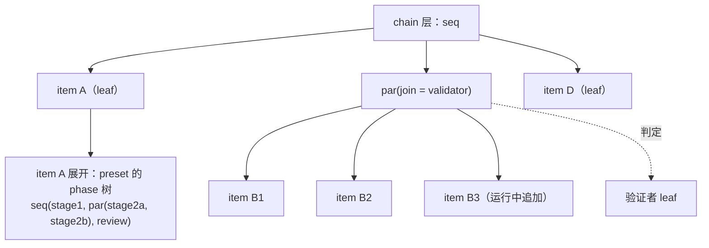
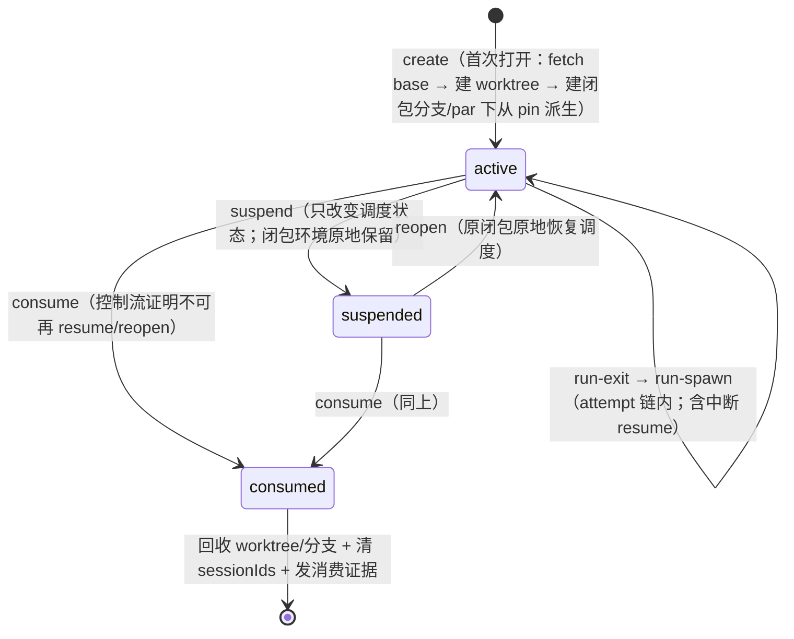

# #546 RFC: v3 任务模型——统一序/并任务代数与并行执行语义

- state: **open**  | author: `RiriAgent`  | created: 2026-07-02T07:59:58Z  | updated: 2026-07-27T01:21:07Z
- labels: (none)
- url: https://github.com/mouriya-s-lab/coder-loop/issues/546
- comments: 13  | timeline events: 121
- sub-issues:
  - #558 [CLOSED] feat(engine): v3 任务树运行态持久化与 status 快照树结构 shape（含闭包状态表） (mouriya-s-lab/coder-loop)
  - #559 [CLOSED] feat(scheduler): v3 序/并任务树调度——seq 游标推进、par 真并发与 slot 退役 (mouriya-s-lab/coder-loop)
  - #560 [OPEN] feat(scheduler): 任务闭包资源生命周期——起点、挂起/重开/消费与启动状态对账 (mouriya-s-lab/coder-loop)
  - #561 [CLOSED] feat(engine): par join 评估与 validator 判定通道——drain / validator 与 advance | hold | reopen (mouriya-s-lab/coder-loop)
  - #562 [CLOSED] feat(engine): reopen 执行语义——纠正追加、seq 游标回退、级联再验证与预算耗尽 (mouriya-s-lab/coder-loop)
  - #563 [CLOSED] feat(engine): 运行中追加平行任务——leaf 原地物化 par 与 createItems 作用域授权 (mouriya-s-lab/coder-loop)
  - #564 [CLOSED] feat(daemon): 物化容器 join 判定权演化——绑定版本追加、候选引用与授权方向 (mouriya-s-lab/coder-loop)
  - #565 [CLOSED] feat(engine): 子树取消向下传播 (mouriya-s-lab/coder-loop)
  - #566 [CLOSED] feat(engine): chain 层任务树声明位——chain metadata 承载顶层 join 与 chain-complete 迁移 (mouriya-s-lab/coder-loop)
  - #567 [CLOSED] feat(scheduler): item 展开 preset phase 任务树——数组推进退役与 trigger phase 迁移 (mouriya-s-lab/coder-loop)
  - #568 [CLOSED] docs(v3): 任务模型收尾对齐——文档、旧概念退场登记与机制/参数分离守护 (mouriya-s-lab/coder-loop)
  - #601 [CLOSED] feat(engine): 收敛引擎递出授权面——runner --add-dir 剥离 loopDataRoot 整根授权 (mouriya-s-lab/coder-loop)
  - #604 [CLOSED] feat(presets): bundled preset v3 化——闭包分支契约落地与 agent 结构性 git 操作退役 (mouriya-s-lab/coder-loop)
  - #698 [OPEN] feat(scheduler): 从公开入口实例化并调度 seq/par drain (mouriya-s-lab/coder-loop)
  - #699 [OPEN] feat(scheduler): 任务闭包资源生命周期与 Git supply (mouriya-s-lab/coder-loop)
  - #700 [OPEN] feat(engine): 共享 decision core 与 validator join (mouriya-s-lab/coder-loop)
  - #701 [OPEN] feat(engine): reopen、纠正项与 leaf 重激活一致语义 (mouriya-s-lab/coder-loop)
  - #702 [OPEN] feat(engine): 运行中动态物化 par (mouriya-s-lab/coder-loop)
  - #703 [OPEN] feat(daemon): 物化容器 join binding 演化 (mouriya-s-lab/coder-loop)
  - #704 [OPEN] feat(engine): 子树取消向下传播 (mouriya-s-lab/coder-loop)
  - #705 [OPEN] feat(engine): chain 任务树与顶层 join (mouriya-s-lab/coder-loop)
  - #706 [OPEN] feat(scheduler): preset phase tree 与 trigger 迁移 (mouriya-s-lab/coder-loop)
  - #707 [OPEN] feat(presets): bundled preset 闭包 Git 契约迁移 (mouriya-s-lab/coder-loop)
  - #708 [OPEN] docs(v3): 旧概念退役与任务模型收尾 (mouriya-s-lab/coder-loop)
  - #709 [OPEN] test(v3): 在冻结 SHA 上完成 #546 综合验收 (mouriya-s-lab/coder-loop)

---

## Body

## 摘要

v3 任务模型定为统一的序/并任务树（结构化并发代数）：`task ::= leaf | seq(task…) | par(task…, join)`。chain 层与 phase 层是同一代数的两层实例；join 策略是封闭 ADT（基础阶段由 #739/#700 落 `drain | validator`；本轮 v3 再由 #714 按 variant 准入纪律一次性加入 `script`，v3 关闭终态为 `drain | validator | script`；`best-of-n` 仍是未来方向）；「退回上一步」定义为 reopen（追加纠正 item + seq 游标回退，零状态重置；target 的任务闭包按持久对象重开）；`dependsOn` 保留为跨结构约束边；资源模型公理——每任务（任务闭包 = 同一 (item, phase) 的 attempt 链）一个独立 worktree，闭包是**持久对象**（活跃/挂起/已消费三态，retry/reopen 作用于闭包本身），resume 与业务打回重入都是闭包内动作；引擎自身 git 行为由**供给条款**五条钉住（起点、闭包分支程序化、seq 流转、par pin、回收与消费采样；权威记录 `v3/closure-lifecycle-decision.md`）。本 RFC 替代 #413 的核心模型部分，其三个开放问题全部回答或消解；#413 组成部分 1/2（GitHub App 外挂、item 可选 hapi 端执行）归 RFC-6 线（`v3/rfc-split.md` 已划）。

## 操作员输入（verbatim）

目标源（操作员，2026-07-02，`v3/v3-goals.md` 目标 2 与目标 4）：

> "安全的任务设计有点像 PL 的设计，除了依赖之外还应该有平行函数，所以 v3 加入了可并行任务。这部分需要完整的独立思考到底应该是什么样，而不只是并行这么简单。"

> "iter 实际上是三个不同的阶段，其中两个阶段并行做两个不同的事情。"

（phase 级并行与 item 级并行是两个层次，任务模型须同时覆盖——`v3/v3-goals.md` 目标 2 注。）

#413 核心模型（操作员，2026-06-10，#413 body）：

> "如果把 chains 视作一个链表，链表的任意一个节点可以是一个 item 或者容器，容器可以并发执行所有 item，容器可以在任意时刻添加 item……决定容器能不能到下一步则是由一个验证人员决定，验证人员觉得不行，得退回上一步。然后实际上容器的抽象可以是，默认每一个 item 都被一个容器包裹，所以 item 只要没执行结束都可以随时添加平行任务。"

RFC-1 设计会话裁决（操作员，2026-07-02）：

1. **独立 worktree 公理**：
   > "我认为无论并发不并发，永远都是独立worktree"

   粒度按任务闭包落定（操作员重裁，2026-07-10，边界 2 审查会话，权威记录 `v3/task-closure-decision.md`）：执行单元 = 任务 = 同一 (item, phase) 的 attempt 链；每任务一个独立 worktree——同 item 的先后 phase 不共享、并行分支不共享；同任务的中断/重试续跑（resume）共享同一 worktree，resume 是闭包内动作。工作产物在任务之间只经闭包分支/origin/GitHub 声明通道流动；agent 业务上下文只经 context CLI 流动；repo 级共享 Git 协调面不得承载未声明业务状态。

   闭包升格为**持久对象**（操作员裁决，2026-07-10，边界 1 审查会话，权威记录 `v3/closure-lifecycle-decision.md`）：活跃/挂起/已消费三态——phase 推进离开 = 挂起且只改变调度状态，完整闭包环境原地保留、零 GC；retry 与业务打回重入 = 原闭包恢复活跃；只有控制流证明不可能再合法 resume/reopen 时才进入已消费并允许回收。item terminal、预算耗尽或取消本身不是消费证明。「对谁 retry/reopen」的答案是闭包本身，不是再造一个抽象；worktree 是抽象闭包的可程序化边界，结构性 git 操作（worktree 创建、分支创建命名、起点解析、pin、终态采样、回收）归引擎，内容性 git 操作（commit、解决冲突、push、PR）归 agent。引擎自身 git 行为由供给条款五条钉住（见资源模型公理节）。
2. 任务代数按统一序/并树定案（下节）。
3. 退回语义按「reopen = 追加纠正 + 游标回退，零状态重置」定案；验证者判定经 CLI 写回。
4. 嵌套任意深度、稀疏容器表示、#413 由本 RFC 替代关闭——均裁可。

## 核心模型

### 任务代数

```
task ::= leaf(执行单元)              -- 一个任务：同一 (item, phase) 的 attempt 链（agent run 是其内部步骤）
       | seq(task, task, …)          -- 依序推进
       | par(task, …, join)          -- 并行执行 + 汇合判定；打开期间可追加子任务
join ::= drain                       -- 全部子任务 terminal 即放行
       | validator(item 调用声明)     -- 专用验证者 leaf 判定放行/reopen
```

- join 是封闭 ADT，union 只含语义、持久化、观测投影与全部穷尽消费点同时落地的 variant（#547 约束）；`script`（RFC-4 hook 判定器）由本轮 v3 child #714 按该准入纪律加入 union，并一次落齐持久化、status/events 投影与全部穷尽消费点；`best-of-n`（并行 N 取一）仍是未来方向。
- 递归定义，嵌套深度不设限。「最多两层」不是代数约束，只是 bundled preset 的实际用法。
- **preset = 任务函数定义**（phase 上的任务树），**item = 一次调用**：chain 树的叶子是 item，item 展开为其 preset 声明的 phase 任务树，phase 树的叶子才是任务（其内部为串行 attempt 链，agent run 是 attempt）。业务打回重入（如 changes_requested 后的第二轮迭代）不是新任务——是重开同一任务闭包（同 worktree 路径、同闭包分支、resume session，见资源模型公理）。#413 的「链表+容器」与「iter 三阶段两并行」由同一代数在两层实例化，引擎只实现一套调度语义。



### 路径携带类型化状态与后继 prompt 构造

`seq` / `par` 只给出结构顺序还不构成完整转移。每条可选后继路径由 preset 声明：目标 step/preset invocation、可选 prompt 模板，以及模板每个输入的类型与来源。来源分为两类：

- `exit.*`：当前 agent 在结束任务时必须提交的类型化状态对象；CLI 查询当前合法出边时同时返回所选路径要求的 exit schema。
- `item.*` / `chain.*` / `runtime.*` / typed literal：由引擎沿 preset 既有 binding、`required | default` 与 projection 逻辑解析，agent 无权自报。

当前任务的业务完成事实不是 runner exit，也不是裸 terminal status，而是合法的 committed transition：路径合法、`exit.*` 对象完整且类型正确、可提前决定的其余 required binding 已满足，并在一次原子提交中持久化 transition、完成当前 leaf、构造后继 invocation。后继运行时，所选路径的模板以该 transition state 与既有外部 bindings 渲染为 prompt。runner exit 只表示执行载体结束；未提交合法 transition 不得推进后继。该协议扩展 #451/#452 已落地的“查询出边 → CLI 写入即完成”，不建立第二套完成面。

### join 策略与验证者判定

验证者是普通 leaf（item+preset 调用），判定经 CLI 写回，走 #397 default-deny 准入门形态（判定词表由 preset 声明，无 stdout 解析）：

```
decision ::= advance                       -- 放行，外层 seq 推进
           | hold                          -- 暂不放行，退避后重问（keep-active 语义）
           | reopen(target, correctionItemIds) -- 退回并精确引用已创建的纠正 item
             target      ::= self | 同一 seq 内更早的兄弟节点
             correctionItemIds ::= 同 evaluation scope 下先经 CLI 创建、属于 target 的 item stable id，≥1
```

三词 ADT 与 #543 script gate 共用（统一判定器契约）：`hold` 承接 #543 操作员裁决 2 与 chain-complete keep-active 先例——本 RFC 把 chain-complete trigger 定性为顶层 join 实例，该先例的 `keep-active` 正是 `hold`，`advance | reopen` 二词表达不了它；「rollback 不需要第三词」仅指 rollback = reopen。hold 的重问节奏/幂等指纹机制归 #543（fingerprint 先例）。

- **reopen 零状态重置**：已 terminal 的 item 保持 terminal；纠正 item 追加进 target，target 重开，seq 游标回退到 target。副作用（PR/commit/comment）append-only，新一轮可见。「零状态重置」指不回滚任何已记账状态，不指丢弃执行现场——target 的任务闭包按持久对象从挂起态原地恢复调度（同 worktree、同分支、同 session；环境自挂起起从未被动过，无任何 checkout/还原步骤），现场完整。先例：`gh-issue-pr-iteration` 的 `changes_requested` 重试即此模式——retry 从来是状态转移 + 追加工作，不是回滚。
- **级联再验证**：seq(A,B,C) 中 C 的验证者 reopen A 后，seq 再次途经 B——drain 且无新工作瞬时通过，validator 重新裁决。不需要「跳过未受影响节点」机制。
- **reopen 预算**：容器带 reopen 上限（类比 `maxItemAttempts`），耗尽时引擎写容器级 exhausted 终态。预算值归 preset/chain 元数据，机制归引擎。
- **target 静态可检查**：只能指向 self 或同 seq 更早兄弟——不能指向未跑节点、不能跨出所在 seq 作用域；装载期校验（RFC-2 接缝）。
- **join 判定权演化**（操作员裁决 2026-07-11，权威记录 `v3/join-evolution-decision.md`；#413「判定是 DB 里可随时修改的状态」条款废止）：join 是 future function——未归约汇合 redex 的函数位 + 判定主体绑定，不入 control-plane 字段类（`repoCwd`/`runner`/`priority` 改变 leaf 怎么被执行，join 携带判定权并生成纠正结构）。**定义态 join**（preset/#739 与 chain metadata/#705 声明，#743 保护域内）实例生命周期内不可变，救济 = operator per-epoch decision 或 cancel + 以修正后定义重建；**物化态 join**（#702 诞生，运行态域）允许演化——同容器 append-only **绑定版本追加**（每次演化 = 一等审计事件，含作者/授权类别/生效起始 epoch），**epoch 创建时采样生效**（同 epoch 主体冻结、在途 evaluation 零影响，下一 epoch 用新绑定），值域限 enclosing 实例 pinned 定义内的**编译期候选引用**（`(definitionRef, candidateId)`；`definitionRef` 是 #743 的 tagged `ExecutionDefinitionRef = preset | chain`，运行时可补边界 parse 的绑定值，不可注入调用结构）。授权方向敏感：加严（drain→validator）可经 preset rights 授 agent；放宽（validator→drain）恒 operator-only；授权语义复用 #409/#410 权利矩阵形态，不新增授权面。

### 汇总事实与判定主体

join 不只声明“怎样汇合”，还必须声明**谁拥有推进判定权**。引擎只负责确定性收集并冻结当前 evaluation 所见的 child outcome vector；它不得从 terminal/status 字面量自行推导业务成功。`drain` 的判定主体是引擎内建结构谓词（全成员 terminal）；`validator(item 调用声明)` 的判定主体是该声明实例化出的 validator leaf；script variant 落地后主体是具名 script gate。推进判定权 = join binding 唯一确定的主体 ∪ **operator 显式 override**（同一准入门、同一 epoch 语义、独立审计词条——承接「一次性放行/否决」的运维需求，使「为放行一次而改 join」的需求形态消解；`v3/join-evolution-decision.md` 裁决 5）；判定主体只能通过统一 `advance | hold | reopen` 准入门产生控制效果，普通 child、GUI、observer 与 scheduler 的其他路径都无权代判。判定主体在 epoch 创建时对 join 绑定采样并冻结进 evaluation identity，同 epoch 内不换。#700 必须钉住主体身份、输入快照、evaluation identity 与授权；“收集事实”与“做出业务判定”不得合并成一个隐式 scheduler 分支。

### 动态追加平行任务（#413「默认包裹容器」的替代）

- **语义能力无条件**：任何未终结节点可随时被追加平行兄弟。
- **表示稀疏**：不预建包裹容器；首次追加时把运行中 leaf 原地物化为 par——物化请求可显式指定 join（值域 = pinned 定义内候选引用；追加者在物化时刻最知道这批工作要不要 gate），未指定默认 `join=drain`；诞生后演化按「join 判定权演化」条款（绑定版本追加，归 #703）。物化时容器获得稳定 id（RFC-3 的 `group` scope 键，见接口假设）。
- **粒度**（#413 开放问题「包裹粒度」的消解）：调度、状态准入保持 item 粒度；par 节点是控制流节点，不是可调度单元。
- **授权**：追加 = 现有 `createItems` right 增加目标作用域维度，不发明新授权面。

### dependsOn：保留为跨结构约束边

seq/par 是控制结构；`dependsOn` 是横跨结构的「start-after」数据约束（PL 类比：结构化并发 + await 一个外部 promise），不进代数本体。现状机制原样保留：写入期查环（`src/daemon.ts:4647`）、全部依赖到 success 状态后恢复 entry（`src/scheduler.ts:1710`）；静态声明部分增加装载期查环（RFC-2 接缝）。

### 取消与错误传播

- **取消向下传播**：cancel 任一子树 → 终止其全部下属 run（SIGTERM→SIGKILL，复用现有看门狗路径）+ 未启动 item 落取消终态。
- **错误向上归 join 消化**：子任务失败（exhausted 等非 success 终态）不自动传播；由所在 par 的 join 策略处置——drain 照常放行（终态即完成），validator 看得见失败并可 reopen。
- select/race 不设一等组合子：它是 `par + best-of-n join` 的组合，待 `best-of-n` 按 variant 准入纪律引入时自然获得。

## 资源模型公理：每任务独立 worktree，闭包是持久对象

闭包 = 同一 (item, phase) attempt 链的执行环境：worktree + 引擎创建的工作分支 + session + per-task scratch。三态生命周期（权威记录 `v3/closure-lifecycle-decision.md` §2）：



- **挂起只改变调度状态**：worktree、工作分支、index、未提交文件、session 与 per-task scratch 全部原地保留；不得在 suspend 上 stash、commit、删除或重建闭包环境。挂起和闭包被完全消费是两件事。
- **重开是原闭包原地恢复调度**：从 suspended 切回 active，无 cwd/文件系统/index/分支/session 的搬运或还原步骤。
- **消费证明先于 GC**：`consumed` 是控制流事实，不是 item terminal/预算耗尽/取消的别名。只有控制流能证明该闭包不再处于任何合法 resume/reopen 的可达域时才可 consume；精确可计算谓词由 #699 实施前钉死，证明未成立时闭包环境必须保留。
- **单活性不变式**：每闭包同一时刻至多一个活 run（执法键 = 闭包；挂起态无活 run但环境仍完整保留；par 只存在于闭包之间）；v2 由 slot 串行与 `current_runs` PK=chain_id 偶然保证，二者在 v3 均退役，由 #558/#698 显式重立。
- **GC 只消费 consumed 闭包**：active/suspended 都必须保有 worktree 与闭包分支；consume 后才回收。daemon 启动状态对账：active/suspended→目录与分支都该在；consumed→都不该在；异常暴露不掩盖。
- **hook 挂点**：闭包转移边（create / run-spawn / run-exit / suspend / reopen / consume）作为新事件类型进 observer 事件词表；gate 决策点闭集不扩，**转移边不可 gate**——gate 挡推进决策，suspend/consume 是推进后的闭包状态转移；suspend 零资源副作用，consume 才允许 GC，在副作用上放 gate 即发明第二推进语义；要阻止挂起，在 run post-exit gate 上 hold 即可。
- **一个类型，四张视图**：闭包状态机同时是执行语义、GC 表（仅 consumed 可回收）、hook 挂点表、暴露谓词表（suspend/consume）。四视图共同事实源，持久化归 #558 shape。
- **slot 串行退役**：现行 `(chainId, repoCwd)` slot 内串行（`schedulerSlotKey`，`src/scheduler.ts:791`）的存在理由就是共享单份 worktree（per-slot 分支名，`src/scheduler.ts:813`）；公理落定后「谁能并行」完全由任务结构决定，资源键不再参与语义。
- **并发上限退化为纯限流参数**：全局上限 + per-par 上限，参数归元数据声明（#396 契约），机制归引擎。
- **并行汇合是 git 层动作**：par 各闭包产出各自分支/PR；join 后怎么合并/取舍由 join 策略与下游任务消费决定，引擎不做自动 merge（par pin 只钉入口输入侧确定性，输出侧归 join 与下游）。

### 供给条款（引擎自身 git 行为契约）

递出面定理的对偶：定理证「引擎递出了什么面」（隔离视角），供给条款证「引擎自身 git 行为的承诺是什么」（供给视角）——量化域同样只是引擎代码，设计期可证。终版五条（权威记录 `v3/closure-lifecycle-decision.md` §3）：

| # | 条款 |
|---|---|
| 1 | **起点公理**：worktree 底座 = 创建时刻 `chain.baseBranch`（integration base，默认 main，per-chain 可配——系统迁就现场）最新快照；引擎创建前 fetch base（per-repo 串行化/去重，网络失败显式化，pin 成员免 fetch）；重开时 checkout 闭包分支尖端（底座无关）；声明面历史回退永久出局；无 origin 的 target 走 doctor 警告，不装载拒绝 |
| 2 | **闭包分支程序化**：引擎创建 per-闭包工作分支随闭包递出，贯穿闭包全生命周期至完全消费（PR headRef 即闭包分支）；agent 契约 = 在其上 commit、解决冲突、push、开 PR；preset 指示 agent 自建分支退役；push 到 origin 的 ref 属声明通道，未发布的自建 ref 是 escape 类 |
| 3 | **seq 流转**：worktree 之间无依赖关系，只有并发时等待问题——前驱需被构建于其上的工作已合入 base（不然不流转）；引擎不执法——合并真相是 GitHub 面事实，经声明通道由 preset 判定器（validator/script 自查）按 `advance\|hold\|reopen` 消费；引擎零产物传递机制；引擎级 mergedness gate 出局 |
| 4 | **par 同 commit 派生**：par 展开/物化时引擎 pin base 尖端 commit 并持久化；成员子树共同启动入口任务集的闭包首次打开从 pin 派生（凝固点语义：后续追加复用同 pin）；嵌套 par 内层重新 pin；rationale = 并发代数语义不被调度时序引入副作用 |
| 5 | **回收与消费采样**：GC = 生命周期转移副作用 + 启动状态对账；引擎只回收自己命名空间；证据谓词对象 = 闭包分支，suspend 只发状态事件，consume 时发 `{无工作, 已发布, 未发布即弃, 无法求值}` + origin 新鲜度戳——运行时暴露的首个实例，只暴露不参与推进 |

mergedness 可计算性检验记录（squash merge 杀可达性、v2 自建分支致恒假阳性，「合没合」ground truth 归声明通道判定器；引擎可靠计算的是「自有面上有无工作、发布没发布」）见 `v3/closure-lifecycle-decision.md` §4。

## 引擎递出面定理（系统自证完备）

操作员裁决（2026-07-10，边界 2 审查会话；权威记录与完整审计表见 `v3/task-closure-decision.md`）：设计不保证 agent 百分之百函数式（LLM 不 FP）；完备性证明只对**引擎递出的面**量化（引擎代码有限、静态、可证），不对 agent 行为量化（等同于编译期对不确定值求值）。定理：

> **引擎递给任务的每个面，必须穷尽归入三类之一：任务私有面、声明通道、repo 级共享 Git 协调面。前两类承载业务状态；第三类只承载 Git 对象存储、远端视图分发、引擎 pin 与 linked-worktree 管理，不得成为未声明的业务状态通道。**

三类面的边界不同：任务私有面给出闭包现场隔离；声明通道给出业务状态流合同；共享 Git 协调面只给出协议与 blame，不给出 hostile-agent capability isolation。只有引擎先穷尽递出面、禁止 preset 制度性要求越界操作、并保证自身 repo-wide Git 操作健全后，任务违反共享 Git 协议的操作才可归为 agent escape。引擎主动递出的未分类可写面、合法契约操作之间的互扰、或被共享 config/hooks 被动影响，blame 均在系统。runtime 暴露可延后，谓词即递出面清单本身，事件流房式已有先例（`session_id.invalidated`、#397 准入审计事件）。声明通道闭集：git origin、GitHub 面、#397 准入门 CLI、#545 context CLI、`shared.md` chain 级自由 prompt 注入面、presetDir（只读）；共享 Git 协调面闭集：objects/packs、`refs/remotes/*`、闭包分支与引擎 pin refs、repo config/hooks、linked-worktree metadata。`shared.md` 保留现有创建与 prompt 注入行为；它是显式分类的自由 prompt 注入面，不是结构化 context entry 通道，引擎与 preset 对其内容零行为定义。

定理的对偶面是供给条款（资源模型公理节）：隔离视角证「递出了什么」，供给视角证「引擎自身 git 行为承诺什么」。git 操作按闭包边界分类——**结构性**（worktree 创建、分支创建命名、起点解析、pin、终态采样、回收）归引擎程序化，**内容性**（commit、解决冲突、push、PR）归 agent，程序无法替代（LLM 处理合并冲突）。escape 清单中「用 ambient 凭据」按此收窄为**凭据滥用**——agent 在闭包分支上合法 push 本就使用 ambient git 凭据（git 面凭据不在 #406 run-scoped credential 覆盖内，登记事实）；escape 的是拿凭据越出声明通道（写他人分支、动引擎外 refs），不是使用本身。

当前系统侧缺口登记：

- **缺口①（最重）**：`runnerAdditionalDirs` 把 loopDataRoot 整根授权给每个任务（`src/loop.ts:6457-6459`，含他 chain 目录、全部 evidence、中央 SQLite DB），旁路 #397/#406 准入门——归 #601。
- **边界②**：`sharedContextPath` chain 级共享文件继续绑进每个 phase prompt（`src/scheduler.ts:2218`）——保留现有 `shared.md` 创建与注入行为，并把它显式分类为 chain 级自由 prompt 注入面；#545 context CLI 只垄断结构化、受控、可审计的 context entry 通道，不替代此自由注入面。
- **缺口③（扩围）**：`evidenceDir`/`currentIssueFile`（item 级面）与 `SHARED_CONTEXT_FILE`（chain 级面）寿命都长于任务（`src/scheduler.ts:2205-2221`）——不止 phase 级 par 下共享，纯 seq 下已是「生命周期 ⊆ 任务」反例（同 item 先后 phase 两个任务共享同一 evidenceDir）。按定理口径逐面作用域化，归 #706 落地时处置。
- **共享 Git 协调面（#699/#707 合同）**：worktree 的独立限于 cwd/index/HEAD/WIP/session/scratch；对象库、remote-tracking refs、refs 物理存储、repo config/hooks 与 linked-worktree metadata 仍按 repo 共享。稳定输入只读持久化 base SHA / par pin；`origin/*` 只表达带新鲜度的当前远端观察。fetch/create/consume/worktree 管理由引擎 per-repo 串行化并只改自身 namespace；preset 不得指示任务修改 repo config/hooks、他闭包 refs、pin 或执行破坏性 `gc/repack/prune/worktree remove|prune|repair`。违反者才是 escape；若合法 preset 操作即可破坏他闭包 pin/分支/WIP/resume，则 worktree 载体裁决被证伪。

## 旧概念 → 新代数映射

| 现状概念 | v3 归宿 |
|---|---|
| chain | 顶层 task（通常 seq）；chain 作为命名/凭证/隔离边界保留 |
| item | leaf = preset 调用；可被原地物化为 par 成员 |
| phase 数组顺序推进（`src/scheduler.ts:604-632`） | preset 内 seq；「iter 三阶段两并行」= seq 内嵌 par |
| trigger phase（`afterPhase`/`whenStatus`） | 状态条件化动态 spawn；映射细节归实现 children |
| chain-complete trigger（`src/scheduler.ts:1809`） | 顶层 task 的 join 判定实例（#543 已认定其为 gate 实例）；声明位从 preset trigger 迁至 chain metadata（chain 层树语义的一部分，见接口假设答复 #547） |
| `dependsOn` | 原样保留，跨结构约束边 |
| slot = (chainId, repoCwd) 串行 | 退役 |
| per-slot worktree 与分支名 | 退役，改 per-闭包 worktree 与引擎创建的 per-闭包工作分支（PR headRef 即闭包分支） |
| preset 指示 agent 自建分支（`git switch -c`） | 退役——设计错误，闭包分支由引擎创建随闭包递出（供给条款 2）；bundled preset 改写由 #707 承接 |
| chain 完成时清理 worktree（`cleanupSchedulerChainWorktrees`） | 退役，改闭包生命周期转移副作用（suspend 零 GC、consume 才回收）+ daemon 启动状态对账 |

## 与 #413 的关系

本 RFC 替代 #413 核心模型（superseded）。其三个开放问题的处置：

- **退回语义** → reopen 定义（零状态重置、级联再验证、预算耗尽落 exhausted）。
- **判定状态修改主体与授权对接** → 「判定是可随时修改的 DB 状态」废止；判定权由 join binding 唯一确定 + operator 显式 override，物化态演化经绑定版本追加、授权方向敏感，复用 #409/#410 权利矩阵形态（`v3/join-evolution-decision.md`）。
- **默认包裹粒度** → 稀疏表示消解：能力无条件、容器按需物化、调度保持 item 粒度。

#413 组成部分 1/2（GitHub App 外挂、item 可选 hapi 端执行）与 #418、mouriya-s-lab/hapi-remote-session#1 的重挂归 RFC-6 会话（`v3/rfc-split.md` 已划），本 RFC 不动。#413 在本 issue 发布后 comment 指向替代关系并关闭。

## 接口假设（跨 RFC 接缝）

- **对 RFC-2（#547，已确认）的表达力需求清单**：递归 seq/par 结构的声明语法；join 策略字段（封闭 ADT；#739 基础阶段为 `drain | validator`，#714 在本轮 v3 终态加入 `script`）；validator 的 item 调用声明（preset 引用 + 变量绑定）；reopen target 的静态可检引用形态；per-par 并发上限与 reopen 预算的声明位；装载期检查清单——树 well-formedness、reopen target 合法性（self/更早兄弟）、join 声明完备性、静态 dependsOn 查环；编译产物含任务树结构（供 RFC-5 渲染）；具名 join 候选声明位（运行时进入 join 位的值只能引用 pinned 定义内候选）。八项已由 #547「DSL 演进面」全部承接。
- **答复 #543（RFC-4）**：统一 gate 接口成立——join 的 `validator`（agent-phase 判定器）与 `script` variant（hook 判定器，随 #543 侧执行机制落地、按 variant 准入纪律进 union）共用同一 decision 契约 `advance | hold | reopen(target, correctionItemIds)`（三词 ADT 见「join 策略与验证者判定」节；`hold` 承接 #543 裁决 2 与 keep-active 先例，「rollback」即 reopen 不需要独立词）。判定点合并完成：#543 挂点清单 ∪ 本 RFC 容器推进点（par join；chain-complete 为顶层实例）。闭包生命周期落定后的挂点补充：闭包转移边（create / run-spawn / run-exit / suspend / reopen / consume）作为新事件类型进 **observer 事件词表**；gate 决策点闭集**不因此扩大**——转移边不可 gate（suspend/consume 是推进后的闭包状态转移；suspend 零资源副作用，consume 才允许 GC，副作用上放 gate = 让用户态扣住引擎资源管理、发明第二推进语义）；要阻止挂起，在 run post-exit gate 上 hold，推进被扣则闭包自然不挂起。
- **答复 #544（RFC-5）**：slot 语义退役，不再是展示对象；GUI 的展示对象是任务树（节点 = leaf/seq/par + join 声明与状态 + reopen 计数；leaf 节点携带闭包生命周期态 活跃/挂起/已消费 与闭包分支名——GUI 是闭包状态机同一事实源的展示投影，不另建状态推断），引擎经 status 面暴露树结构快照；「活 run 并行分支」即 par 内多 leaf 各自的 run。**shape 承诺**：树运行态的持久化形态与 status 快照的树结构 shape 由本 RFC 首个实现 child 在设计期钉住（不推迟到编码期），该 shape 是 #544 快照 boundary 收紧与 #545 `group` 键存储的输入——两家依赖它，先行。shape 必须包含任务树节点的稳定 identity 及其与编译产物节点 id 的关联方式：compile/SQLite/status/events 沿同一 identity 链关联，结构路径只用于展示（#547 已钉）。闭包状态表（生命周期态、worktree 路径、闭包分支、sessionIds、par pin commit）随同一 shape 承诺一并钉住——它是四视图（执行/GC/hook/暴露谓词）的持久化事实源。
- **答复 #545（RFC-3）**：`group` scope 键 = par 节点物化时的稳定容器 id（存储位随上条 shape 承诺一并钉住）。context CLI 是并行分支间唯一的结构化、受控、可审计上下文通道；`shared.md` 保留现有创建与 prompt 注入行为，作为 chain 级自由 prompt 注入面，运行时决定内容，引擎与 preset 对内容零行为定义。git 工作产物与 GitHub 面是产物通道，不属 context；供给条款 2 精化产物通道口径：push 到 origin 的闭包分支 ref 属声明通道，agent 未发布的自建 ref 是 escape 类。「不存在文件系统旁路」不作为对 agent 行为的断言成立，改为对引擎的可证断言——引擎递出的每个跨任务面必须显式分类（见「引擎递出面定理」节）；`shared.md` 已作为自由 prompt 注入面入闭集，不是遗漏旁路。
- **答复 #547（RFC-2）反向登记项**：`DEFAULT_PRESET_NAME` 退役后「无 item 在手的 chain 级判定」的落点 = **chain metadata**——chain 层任务树（含顶层 join/chain-complete 判定）声明在 chain 自身元数据，不来自任何 preset（#412 已使 chain 退出 preset 事实源，preset 无处兜底）；声明的边界 parse 与校验归 #547 编译/校验面。item 恢复词表（`entryItemStatusForRecovery`）仍取自 per-item preset，不受影响。

## 实现约束登记（实现 children 承接，本 RFC 不展开）

- git worktree 操作异步化：现同步 git 调用阻塞 daemon 主线程（`createGitWorktreeManager`，`src/scheduler.ts:802`）；per-task worktree churn 下必须消解。
- 回收改闭包生命周期语义：「chain 完成时清理」（`cleanupSchedulerChainWorktrees`）与「daemon 启动扫尸」（`removeStaleSlotBranchWorktree`，`src/scheduler.ts:832`）改为仅在 consumed 后回收，suspend 零 GC；daemon 启动负责状态对账（磁盘目录 + 引擎命名空间分支 vs SQLite 闭包状态表，异常暴露不掩盖）——归 #699。
- 起点解析改起点公理：现行 fallback 链 `origin/<base> → <base> → HEAD`（`chooseWorktreeStartRef`，`src/scheduler.ts:2436-2441`）中 HEAD 兜底与起点公理冲突（底座必须是 base 快照），删除；引擎 fetch 义务（创建前 fetch base，per-repo 串行化/去重，网络失败显式化）新增。fetch 推进共享 `origin/*` 只改变当前远端观察，不得改变闭包持久化 base SHA/par pin/HEAD/index/WIP/分支；suspend 禁止 stash/suspend-commit/目录回收，消费谓词与 consumed 后 GC 归 #699。
- resume 适配：任务闭包粒度下 resume 醒在原 worktree（cwd、session、工作现场与记忆一致），不存在跨 worktree resume，无需 relocation 交代；挂起后的重开只是原闭包原地恢复调度，零重建、零还原；「每个 agent 运行都是无状态的」（CLAUDE.md）精确化为**对外无状态**——闭包私有内存（worktree/session/闭包分支）正是 resume 与重开唤醒的对象。事实核查（2026-07-10）：scheduler 主路径 resume 实发**重新渲染的完整 phase prompt**（`src/scheduler.ts:1029-1035`），固定「继续」仅存在于 chain-complete finalizer 路径（`src/loop.ts:6048`）。
- 全仓代码红线不变：全链路 ADT，禁 `any`/匿名形状，`unknown` 仅限 catch 与边界 parse，禁真 `as`（`as const` 除外）——操作员裁决 2026-06-12，#413 约束节延续。

## 关闭验证

RFC 体裁：钉终态条件，具体命令面由实现 children 落地时具体化为可逐字重跑的命令。

| # | 终态条件 | 验证 | Expect |
|---|---|---|---|
| 1 | seq/par 任意深度可声明可调度 | 声明含嵌套 par 的任务树并真跑 | 嵌套结构按代数语义推进到全树 terminal |
| 2 | par 真并发 | par 内 ≥2 item，daemon 调度下观察 run 时间区间 | 执行区间重叠（真并发，非串行） |
| 3 | 运行中追加平行任务 | 对运行中 leaf 追加兄弟 | 原地物化 par、新 item 被同一容器调度，无需重建 |
| 4 | 物化容器 join 演化 + 定义态零漂移 | 对执行中物化容器追加绑定版本（drain→validator 候选引用；再 validator→drain）；对定义态声明的 join 尝试改写；无授权 agent 尝试放宽 | 追加即审计事件（作者/版本/生效 epoch）；在途 epoch 按旧绑定跑完，下一 epoch 采样新绑定生效；定义态改写被拒并点名；agent 放宽方向被拒；非候选引用值被拒 |
| 5 | reopen 语义 | 验证者先经带 evaluation scope 的 CLI 创建 correction items，再写 `reopen(target, correctionItemIds)` 精确引用 | consumer 校验并原子认领既存 corrections，seq 游标回退、已 terminal item 状态不变、途经节点级联再验证；先前 CLI mutation 不冒充 decision 消费事务的一部分 |
| 6 | reopen 预算 | 预算耗尽再 reopen | 引擎写容器级 exhausted，链不死锁 |
| 7 | 独立 worktree + 闭包三态生命周期 | 任意两个任务的 run（含同 item 先后 phase、同 repo 并发分支）比对路径；触发同任务中断后 resume；触发 phase 推进后对同 item 打回重入 | 不同任务路径互不相同；同任务 resume 醒在同一 worktree；phase 推进后闭包挂起且目录/分支/index/未提交文件/session/scratch 全部保留；打回重入在原闭包原地恢复；只有消费谓词成立后才回收目录/分支并清该 phase `sessionIds` |
| 8 | dependsOn 正交保留 | par 成员携带跨结构 dependsOn | 约束边与并行结构独立生效，环在写入期/装载期被拒 |
| 9 | 取消向下传播 | cancel 一个含活 run 的子树 | 下属 run 全部终止、未启动 item 落取消终态 |
| 10 | 机制/参数分离（#396 契约延续） | grep 引擎源码 | join 策略的取值选择、状态字面量、reopen 预算值均不在引擎，归 preset/元数据声明（join union 的 variant 定义是引擎原生 ADT，不在此列） |
| 11 | 判定器 hold | validator 对未收敛的 par 返回 `hold` | 容器不推进不退回，决策点退避重问（幂等防抖，机制归 #543），下次判定可改判 advance/reopen |
| 12 | 每闭包单活 | 对已有活 run 的闭包再触发调度/唤醒；对挂起态闭包核查 | 引擎拒绝第二个活 run（执法键 = 闭包），拒绝留可审计事件；挂起态闭包无活 run |
| 13 | 闭包分支程序化（供给条款 1/2） | 观察闭包首次打开与 agent 产出的 PR | worktree 底座 = 创建时刻 base 最新快照（引擎先 fetch）；工作分支由引擎创建，agent 未自建分支；PR headRef 即闭包分支 |
| 14 | par 同 commit 派生（供给条款 4） | par 展开含 ≥2 成员并真跑；运行中追加成员；嵌套 par | 成员入口闭包底座 commit 相同且等于持久化的 pin；追加成员复用同 pin；嵌套 par 内层重新 pin |
| 15 | 启动状态对账（供给条款 5） | 人为构造磁盘/分支/DB 三方不一致（多目录、少分支、幽灵记录）后重启 daemon | 对账按闭包状态表逐项核查，异常暴露为可审计事件、不静默清理不掩盖 |
| 15a | 共享 Git 协调面 | 两个 active 闭包 + 一个 suspended 闭包并发执行获准 fetch/commit/push；随后恢复 suspended 闭包并比对 pin/分支/HEAD/index/WIP；另构造 repo config/hooks 漂移 | `origin/*` 可前移且带新鲜度；三闭包保存的稳定输入与私有现场不变；config/hooks 漂移显式暴露；引擎 repo-wide 操作串行且只改自身 namespace |
| 16 | operator 一次性判定 override | operator 对未收敛容器的当前 evaluation epoch 显式写 advance/hold/reopen | 经同一准入门生效 + 独立审计词条；join 绑定不变，下一 epoch 判定主体照旧 |

## 范围外

- DSL 具体语法与装载期校验实现——RFC-2。
- context 共享工具本体——#545（RFC-3）。
- script 判定器执行机制与 hook 点清单——#543（RFC-4）。
- 任务树展示面——#544（RFC-5）。
- GitHub 外挂、hapi 执行通道、#418 与 hapi-remote-session#1 重挂——RFC-6。
- bundled preset v3 化改写（`git switch -c` 退役、implement.md retry 契约改闭包重开形态、e2e standing worktree 兼容形态、spike 分支流、submit.md retry 分支语义）——另立 issue 承接（供给条款 2 的 preset 侧对应物）。
- #534 audit 修复树的 v2 缺陷——并行不悖，不吸进范围。

## 本 issue 的验证边界

- **验证层级**：本 RFC umbrella 不直接运行测试，也不以任一 implementation PR 的局部测试关闭。
- **关闭所需证明**：所有直接 children 达到各自正文声明的验证深度；跨 child 的 v3 新语义接缝由 #684 在冻结合流 SHA 上证明；现有 bundled preset 兼容性由 #685 在发布候选 SHA 上证明。
- **不在本 issue 内执行**：不在 RFC 迭代中重复运行 `scripts/real-e2e.ts`，不把 compatibility E2E 绿解释成 `RFC: v3 任务模型——统一序/并任务代数与并行执行语义` 的新语义已经成立。
- **现有 GitHub real E2E**：本 issue 不运行 `bun scripts/real-e2e.ts`；该 compatibility 验证只由 #685 在冻结发布候选 SHA 上执行。


---

## Comments (13)

### comment #4863549313 by `RiriAgent` — 2026-07-02T08:05:03Z

RFC-2 已落地为 #547。接缝答复：本 RFC 登记的七项 DSL 表达力需求（递归 seq/par 声明、join ADT、validator item 调用声明、reopen target 静态引用、per-par 上限与 reopen 预算声明位、装载期检查清单、编译产物含任务树）在 #547「DSL 演进面」节全部承接；反向登记一项——DEFAULT_PRESET_NAME 退役后「无 item 在手的 chain 级判定」来源随本 RFC chain 层树语义落点，#547 只钉「引擎不得以 preset 名兜底」。


### comment #4864284797 by `RiriAgent` — 2026-07-02T09:34:45Z

RFC-6 已落地为 #548。#413 组成部分 1/2（GitHub App 外挂、item 可选 hapi 端执行）重挂完成：#418 与 mouriya-s-lab/hapi-remote-session#1 已挂为 #548 的 sub-issues，两者 body 中指向已关闭 #413 的依赖行已更新为 #548。本 RFC 独立 worktree 公理已作为 #418 spike 的 v3 新增输入登记于 #548（远端 session worktree 生命周期须与 per-run 模型对齐）。


### comment #4865126516 by `RiriAgent` — 2026-07-02T11:20:27Z

实现拆解 children 已落地并全部挂为 sub-issues（11 个，2026-07-02，按 `writing-complex-issues` 流程 + 对抗审查后发布）。

## children 名录与依赖边

| Issue | 职责 | Depends on | Blocks |
|---|---|---|---|
| #558 | 任务树运行态持久化 + status 快照树 shape（**首个 child，shape 设计期钉住**） | — | #559 #561–#566；跨树：#544 快照 boundary 收紧 child、#545 group scope 键 child（均待立，W2） |
| #559 | 序/并树调度：seq 游标、par 真并发、slot 退役、并发上限参数化、drain 结构性放行 | #558、#560 | #561 #562 #563 #565 #566 #567 |
| #560 | per-run 独立 worktree：异步 git、终结回收、启动扫尸、resume cwd | — | #559 |
| #561 | join 评估与 validator 判定通道（validator/hold；决策契约执行的 join 侧） | #558、#559 | #562 #564 #566 |
| #562 | reopen 执行：纠正追加、游标回退、级联再验证、预算耗尽 | #561 | #566 |
| #563 | 运行中追加平行任务：稀疏物化 + createItems 作用域 | #558、#559 | — |
| #564 | join 声明运行时可改：control-plane 化与授权 | #558、#561 | — |
| #565 | 子树取消向下传播 | #558、#559 | — |
| #566 | chain 层树声明位：chain metadata + chain-complete 迁移（FINALIZER stdout 退役） | #558、#561、#562；跨树 #547 编译面 | — |
| #567 | item 展开 preset phase 树 + trigger 迁移 | #559、#561；跨树 #547 DSL 第 1/6 项（硬依赖） | — |
| #568 | 收尾对齐：文档 + 机制/参数分离全局守护 | #558–#567 全部 | 本 RFC 关闭复核 |

跨 RFC 边按总控简报物化：边 1（#558 先行 Blocks #544/#545 两家）已在 #558 body 登记；边 5（统一判定契约 `advance | hold | reopen` 以本 RFC body「join 策略与验证者判定」节为唯一权威文本，#561/#562 与 #543 children 共同引用不复制）已在 #561/#562 body 登记。#547/#544/#545/#543 的 children 编号产生后在对应 Depends/Blocks 行回填。

## 关闭验证行覆盖映射（并集完整，无缩水）

| 行 | 覆盖 children |
|---|---|
| 1 seq/par 任意深度可声明可调度 | #559（调度）+ #566（chain 层声明）+ #567（preset 层） |
| 2 par 真并发 | #559（item 级）+ #567（phase 级） |
| 3 运行中追加 | #563 |
| 4 join 运行时可改 | #564 |
| 5 reopen 语义 | #562 |
| 6 reopen 预算 | #562 |
| 7 独立 worktree | #560 |
| 8 dependsOn 正交 | #559（写入期；装载期查环归 #547 接缝） |
| 9 取消向下传播 | #565 |
| 10 机制/参数分离 | #568（全局）+ #559/#562/#565（切片） |
| 11 判定器 hold | #561 |

## 延后决策项分配（RFC「实现 child 落地时裁」的落位）

- reopen 预算未声明语义（行 10 禁引擎驻留值 vs `DEFAULT_MAX_ITEM_ATTEMPTS` 先例的张力）→ #562。
- createItems 目标作用域维度词表 → #563。
- 取消终态声明键名/声明位 + cancel 主体分级 → #565。
- trigger phase 映射细节（触发时点、追加位置、重复触发）→ #567。
- shape 全部细节 → #558（实现前以 issue comment 发布设计记录，#544/#545 以其为输入）。

## 对抗审查记录

五轮换面扫描（设计自洽 / 行覆盖 / 主体 / 组合一致性 / 验收可钻性），修正后干涸：

- **坐实并修正**：drain 放行的归属冲突（seq 越过 par 需要放行，原划分使 #559 验收依赖未落地的 #561）——裁定 drain 为结构性放行归 #559，#561 收窄为 validator/hold 判定通道；#561 补 reopen 派发在 #562 落地前的显式拒绝行为（防静默中间态）；#559 补全局上限验收行；#563 补 item 粒度性质验收；#565 补授权验收行；#566 的 grep 行扩到 `on = "chain-complete"` 声明位退役。
- **坐实的现状张力（已写进 #564 body）**：现 control-plane 类语义是「preset 不可授」（`src/daemon.ts:190-249`），与本 RFC「preset rights 显式授权」的 join 行为需要调和——行为契约以本 RFC 为准，归类机制归实现。
- **落空的怀疑（正例）**：`current_runs` PK=chain_id 的单活 run 约束已被 #558 shape 承诺显式消解（body 点名）；daemon recovery 路径（`recoverStaleSchedulerState`）对 shape 变更的适配已在 #558 上下文登记。
- 全体 scheduler/daemon 面 children 已登记与 #534 树（#535/#536/#538）的排序默认：audit 先合、v3 后 rebase。


### comment #4865334518 by `RiriAgent` — 2026-07-02T11:47:08Z

对抗审查第二轮登记（换面：调用面全集 + 字段面，2026-07-02）：

- **坐实一处缺口**：「leaf 事后重激活」类语义（`queue.unblock`，`src/daemon.ts:2069-2112`；dependsOn 满足恢复，`src/scheduler.ts:1705-1748`——两条 terminal→entry 通道对已放行容器的树语义未定义）→ 已发范围补充 comment 到 #559（决策项，联动 #561/#558）。非新 child：属树调度语义内的决策项，不独立成因。
- **落空的怀疑（正例）**：`comparePendingItems`（`src/scheduler.ts:712-715`）只按 `(position, id)` 排序，`priority` 不参与 pending 选取——本 RFC「chain 默认树 = seq(items by position)」映射与代码实态一致，#559 的退化 seq 零回归验收无隐藏排序键。
- 其余调用面（`item.reorder`/`chain.stop`/`daemon.stop`/rate-limit 冷却/staggered resume）逐个对照树语义：均为正交机制或已被 children 上下文点名，无新发现。

本轮唯一新发现已落位，下一轮扫描待有新触发（children 落地评审或操作员镜头修正）时进行。


### comment #4932303885 by `RiriAgent` — 2026-07-10T05:31:53Z

边界 2 审查会话裁决登记（操作员，2026-07-10；权威记录 `v3/task-closure-decision.md`，body 已同步修订）：

1. **裁决 1 粒度重裁**：独立 worktree 公理由「每次 agent run」改为**任务闭包**粒度——任务 = 同一 (item, phase) 的 attempt 链；resume 是闭包内动作，跨 worktree resume 概念出局。不变式：session ⊆ worktree ⊆ 任务；每任务单活。
2. **新增「引擎递出面定理」节**（系统自证完备/blame 语义）：完备性证明只对引擎递出面量化，agent escape 不进证明、暴露可延后。系统侧缺口登记：① `--add-dir` 整根授权 loopDataRoot → 新 child #601；② `sharedContextPath` binding → #545 落地时退役；③ `evidenceDir`/`currentIssueFile` phase-par 共享 → #567 决策项。
3. **children 影响**：#560 body 已按任务粒度同步（回收点 = 任务终结 + 清 sessionIds；resume 醒在原 worktree）；关闭验证新增行 12（每任务单活）覆盖归 #558/#559；行 7 验收语义更新。#546 原「文件系统旁路天然不存在」断言替换为引擎侧可证断言。
4. **事实核查修正**：「resume prompt 固定『继续』」不是 scheduler 通用行为（实发完整渲染 prompt，`src/scheduler.ts:1029-1035`；「继续」仅 finalizer 路径 `src/loop.ts:6048`）——#560 上下文节与 `v3/survey-engine-daemon.md` §5 均已修正。


### comment #4932362051 by `RiriAgent` — 2026-07-10T05:43:36Z

边界 2 审查会话方法论记录（为什么初始审查方向是错的；操作员要求登记，详见 `v3/task-closure-decision.md` §6）：

初始方向——为「跨 worktree resume」设计 relocation contract 并呈报 A/B/C 三选项——被三轮纠偏推翻。错因四条，后续审查会话对照：

1. **从记录进入而非从语义进入。** 审查接受了 #560/survey 的「prompt 固定继续 + worktree=资源 + resume=问题」框架，在框架内做契约优化，没有先问「resume 唤醒的本体是什么」。症状级设计的产物（四层 relocation contract）全是给伪概念付的税——记录本身还可能讹传（「继续」实为 finalizer 专用路径）。
2. **证明义务放错侧。** 初版隔离审计对「agent 可能干什么」量化——不可证也不该证（等同编译期对不确定值求值）。可证的只有「引擎递了什么」。放错侧的直接代价：escape 风险与系统侧缺口混在一张表里，最重的缺口（`--add-dir` 整根授权 loopDataRoot，现 #601）直到 blame 框架给出后才浮出。
3. **对「某选项使问题消失」信号迟钝。** 三选项中任务闭包方向让边界 2 整体不存在——这是问题框架错误的最强信号，初版却把三选项当对称呈报，让裁决者在伪对称里选。
4. **未区分 verbatim 与解释层。** 把「最强解读」当不可动的公理输入，而它是 RFC 会话对操作员一句话的代理解读。审查会话应默认核查每条继承条款的裁决出处强度：操作员原话钉了什么、解释层加了什么——只有前者不可动。


### comment #4934666406 by `RiriAgent` — 2026-07-10T11:07:03Z

**边界 1 裁决登记（2026-07-10，操作员裁决，权威记录 `v3/closure-lifecycle-decision.md`，commit f193830）**

「边界 1：任务代数的数据流/产物流」受边界约束设计审查会话收口，body 已按裁决同步修订。原问题「控制代数是否缺配套 Value/Artifact algebra」的答案：**不需要**——产物语义与传递全部在声明通道上（agent 侧），系统侧配套物是「闭包边界程序化」原则下的供给条款五条 + 闭包升格为持久对象。

本次 body 修订要点：

1. **闭包 = 持久对象，三态生命周期**（活跃/挂起/终结）：phase 推进离开 = 挂起（现场程序化保存进闭包分支、回收目录），retry 与业务打回重入 = 重开同一闭包（确定性重建，零启发式还原），终结 = 删闭包分支 + 清 sessionIds + 发终态证据。「对谁 retry/reopen」的答案是闭包本身。资源模型公理节整体重写，含状态机图与「一个类型四张视图」（执行/GC/hook/暴露谓词）。
2. **供给条款五条**（起点公理、闭包分支程序化、seq 流转、par pin、回收与终态采样）新增为资源模型公理子节——递出面定理的对偶（隔离视角 vs 供给视角）。preset 指示 agent 自建分支（`git switch -c`）裁定为设计错误退役，闭包分支由引擎创建递出，PR headRef 即闭包分支。
3. **递出面定理精化**：git 操作按闭包边界分类（结构性归引擎、内容性归 agent）；escape 清单「ambient 凭据」收窄为凭据滥用；缺口③扩围（item/chain 级面在纯 seq 下已是反例）。
4. **hook 挂点补充**：闭包转移边进 observer 事件词表；gate 决策点闭集不扩，转移边不可 gate（阻止挂起走 run post-exit gate hold）。
5. **mergedness 检验**：「程序遍历可达性算合没合」经对抗检验修正——squash merge 与自建分支双重击穿；引擎可靠计算的是「自有面上有无工作、发布没发布」（终态采样谓词），「合没合」ground truth 归声明通道判定器（引擎级 mergedness gate 出局，引擎不注入 GitHub 字段进判定 payload）。
6. 关闭验证新增行 13-15（闭包分支程序化、par pin、启动状态对账），行 7/12 按三态与闭包执法键改写。

影响面与执行顺序见权威记录 §7：重写级 #546（本次）/#560/#558/#562，实质修改与局部登记共 16 个 issue 随后落地，bundled preset v3 化改写另立 issue 承接。


### comment #4935012382 by `RiriAgent` — 2026-07-10T11:55:44Z

## 2026-07-10 对抗审查纠正登记

操作员纠正并已同步进 body/children：

1. `seq` 的任务/产物流正确性归事先编排契约；引擎不替错误编排兜底。
2. join 补钉“汇总判定权”：引擎收集 outcome vector，判定主体由 join binding 唯一确定；#561 已同步。
3. suspend 只改变调度状态，**零 GC**；worktree/分支/index/未提交文件/session/scratch 原地保留。只有控制流证明闭包完全消费后才 `consumed` 并回收；#558/#559/#560/#562/#565/#567 与 hook/GUI 投影已同步。
4. 运行实例定义漂移由 #605 承接：只保护事前可完整计算的不可变执行定义，明确禁止用运行态 MVCC/事务快照替代。
5. 运行中 join 改写提升为 future-function mutation 设计问题 #606；#564 在裁决前 blocked。
6. Git 原生 per-closure clone 可行性由 #607 spike 实测；只允许 Git 现成命令组合，不自研 clone manager。
7. #572 已修正普通 resume 实发完整 `effectivePrompt` 的事实；固定“继续”仅是 chain-complete finalizer 特例。
8. `execution-orchestration.md` 已补 #601/#604/#605/#606/#607 的任务组、Gate 与 RFC 覆盖。


### comment #4935065822 by `RiriAgent` — 2026-07-10T12:03:27Z

纠正：上一条登记中的 #607 同样属于过早 issue 化。它已从本 RFC sub-issue tree 移除并以 not planned 关闭，也不再阻塞 #560。clone 方向目前只保留为待讨论/验证的候选：已知 Git 原生 `clone --local` 可提供独立 refs，`--shared`/长期 alternates 有 source GC 风险；尚未完成 GC 安全、成本和完整生命周期验证，因此不构成 v3 合同。


### comment #4937852021 by `RiriAgent` — 2026-07-10T17:26:54Z

**边界 B 裁决登记（2026-07-11，操作员裁决，权威记录 `v3/join-evolution-decision.md`）**

「边界 B：运行中修改 join 为什么等同于修改 future function，以及是否应被允许」受边界约束设计审查会话收口，body 已按裁决同步修订。六条裁决：

1. **join 的语义定位 = future function**：未归约汇合 redex 的函数位 + 判定主体绑定——改 join 改的是归约规则，不是执行参数。#413「判定是 DB 里可随时修改的状态」条款废止，join 不入 control-plane 字段类。
2. **定义态 join 实例内不可变**（preset/#554、chain metadata/#566 声明，#605 保护域）；救济 = operator per-epoch decision 或 cancel + 重建。
3. **物化态 join 允许演化**：同容器 append-only 绑定版本追加（一等审计事件）+ epoch 创建时采样生效（同 epoch 主体冻结、在途 evaluation 零影响）+ 值域限 pinned 定义内编译期候选引用（`(definitionHash, candidateId)`，禁运行时自由注入调用结构）。
4. **物化请求增加诞生时 join 参数**；「join 可随后改」无条件承诺废止；未指定默认 drain 保留。
5. **operator 一次性判定权进 #561 契约**：判定权 = join binding 主体 ∪ operator 显式 override（同准入门、同 epoch 语义、独立审计词条）——「为放行一次而改 join」的需求形态消解。
6. **授权方向敏感**：加严（drain→validator）可授 agent，放宽（validator→drain）恒 operator-only。

本次 body 修订要点：

- 「join 策略与验证者判定」节原「join 策略运行时可改」条款整条替换为「join 判定权演化」条款；「汇总判定权」节补 epoch 采样冻结与 operator override；「动态追加平行任务」节物化 join 参数化；「与 #413 的关系」判定主体处置更新；关闭验证行 4 改写（物化演化 + 定义态零漂移 + 授权方向）并新增行 16（operator override）；「范围外」的 #564 冻结句删除。
- 关闭验证行覆盖更新：行 4 → #564（含定义态拒绝负向验收）+ #563（诞生时 join 参数）；行 16 → #561。
- children 同步：#564 整体重写（题目改「物化容器 join 判定权演化——绑定版本追加、候选引用与授权方向」，解除 blocked）；#563 诞生时 join 参数进目标/预期/验收；#561 补 epoch 采样冻结、operator override 契约与验收行；#554 补 join 候选具名声明位（预期结果 7）；#558 shape 补绑定版本序列与 evaluation 绑定版本引用存储位；#547 接缝 comment 登记表达力需求第八项。
- 本地文档：`design-boundary.md` §3.1、`execution-orchestration.md` P3-B/P4-D、`gui-business-flows.md` 两处引用同步。
- 与边界 A（`v3/definition-pin-decision.md`）的相容性：其 §3「rebind 在 API 面不可表达、#564 设计空间限定在运行态域」钉子原样成立——绑定版本是运行态事实，永不表现为 definitionHash 变更；其 Falsifier 4（若函数演化必须就地 rebind 则不变量 5 被证伪）未被触发。
- #599/#562 零改动：epoch 生命周期与 decided 原子消费原样被本裁决消费。

不变量七条、在途语义表、候选模型比较（不可变/裸覆写/换容器/绑定版本追加/预编译候选）、最强反例与 falsifier 四条见权威记录。


### comment #4986058113 by `RiriAgent` — 2026-07-15T22:55:11Z

## Coder-loop umbrella finalizer (run-1784155528348-20-closure-item-8)

### What was checked

- Live umbrella [#546](https://github.com/mouriya-s-lab/coder-loop/issues/546): body, all comments, timeline, and all 13 explicit sub-issues.
- Every explicit child issue: body, comments, timeline, sub-issue links, and structural closing-PR references.
- Candidate/relevant PR records, including open closing PR [#675](https://github.com/mouriya-s-lab/coder-loop/pull/675) for #558 and merged closing PR [#678](https://github.com/mouriya-s-lab/coder-loop/pull/678) for #601: bodies, issue comments, reviews, review comments, review threads, timeline, checks/status, and closing edges.
- Chain `v3-601`: one queue item (#601), now terminal `done`; shared handoff, review evidence, closure logs, and global chain ownership.

### Child closure table

| Child | Live state | Closing / review evidence | Closure assessment |
|---|---|---|---|
| [#558](https://github.com/mouriya-s-lab/coder-loop/issues/558) | OPEN | [PR #675](https://github.com/mouriya-s-lab/coder-loop/pull/675) OPEN; latest [changes requested](https://github.com/mouriya-s-lab/coder-loop/pull/675#issuecomment-4985491175) | Remaining implementation and evidence work |
| [#559](https://github.com/mouriya-s-lab/coder-loop/issues/559) | OPEN | No structural closing PR | Remaining scope |
| [#560](https://github.com/mouriya-s-lab/coder-loop/issues/560) | OPEN | No structural closing PR | Remaining scope |
| [#561](https://github.com/mouriya-s-lab/coder-loop/issues/561) | OPEN | No structural closing PR | Remaining scope |
| [#562](https://github.com/mouriya-s-lab/coder-loop/issues/562) | OPEN | No structural closing PR | Remaining scope |
| [#563](https://github.com/mouriya-s-lab/coder-loop/issues/563) | OPEN | No structural closing PR | Remaining scope |
| [#564](https://github.com/mouriya-s-lab/coder-loop/issues/564) | OPEN | No structural closing PR | Remaining scope |
| [#565](https://github.com/mouriya-s-lab/coder-loop/issues/565) | OPEN | No structural closing PR | Remaining scope |
| [#566](https://github.com/mouriya-s-lab/coder-loop/issues/566) | OPEN | No structural closing PR | Remaining scope |
| [#567](https://github.com/mouriya-s-lab/coder-loop/issues/567) | OPEN | No structural closing PR | Remaining scope |
| [#568](https://github.com/mouriya-s-lab/coder-loop/issues/568) | OPEN | No structural closing PR | Remaining scope |
| [#601](https://github.com/mouriya-s-lab/coder-loop/issues/601) | CLOSED (completed) | [PR #678](https://github.com/mouriya-s-lab/coder-loop/pull/678) MERGED; [accepted verdict](https://github.com/mouriya-s-lab/coder-loop/pull/678#issuecomment-4985991758); [closure record](https://github.com/mouriya-s-lab/coder-loop/issues/601#issuecomment-4986014427) | Complete |
| [#604](https://github.com/mouriya-s-lab/coder-loop/issues/604) | OPEN | No structural closing PR | Remaining scope |

### Remaining scope

Twelve explicit children remain open. The umbrella body additionally requires all direct children to complete before umbrella closure and assigns frozen-SHA cross-subsystem / compatibility proof to #684 and #685. A merged child PR is not enough to waive those requirements.

No duplicate follow-up issue was created: all remaining coherent work already has an explicit child. Queue injection into `v3-601` is not safe now: #558 is already owned by active chain `v3-558`, while downstream children declare dependencies on #558 and/or later children. Injecting #558 would duplicate live execution, and injecting a dependent child would run it before its declared prerequisites.

### Local evidence

- Chain handoff: `/Users/mouriya/.coder-loop/loop-data/chains/v3-601/shared.md`
- Accepted #601 review evidence: `/Users/mouriya/.coder-loop/loop-data/chains/v3-601/evidence/601/review-run-1784154803375-18/`
- #601 closure run: `/Users/mouriya/.coder-loop/loop-data/chains/v3-601/runs/run-1784155528348-20-closure-item-8/`
- Current chain readback: `v3-601` active; queue `done=1`, actionable `0`; #601 terminal `done`.

### Finalizer decision

`keep-active`. Umbrella #546 must remain open. Chain completion is not honest while 12 explicit children remain open and #558's current closing PR still has unresolved changes requested. No follow-up issue or duplicate queue item was created in this pass.


### comment #4987798633 by `RiriAgent` — 2026-07-16T03:16:00Z

## Coder-loop umbrella finalizer (run-1784171078043-43-closure-item-4)

### What was checked

- Live umbrella graph for #546, all 13 explicit sub-issues, their complete issue comments/timelines, and candidate closing PRs #675 and #678 (including PR comments, reviews, review threads, checks, and closing links).
- Chain `v3-558` runtime state, queue items, shared handoff, issue attachments, evidence directories, and run logs.
- Child closure semantics: a merged PR alone was not treated as completion; accepted review verdict, merge/closing link, closed issue state, and closure comment were checked together.

### Child closure table

| Child | Live state | Closure evidence / remaining scope |
|---|---|---|
| #558 | CLOSED | PR #675 merged; accepted verdict [4987733057](https://github.com/mouriya-s-lab/coder-loop/pull/675#issuecomment-4987733057); closure [4987757375](https://github.com/mouriya-s-lab/coder-loop/issues/558#issuecomment-4987757375) |
| #559 | OPEN | Tree scheduler / true parallelism remains; depends on #560 |
| #560 | OPEN | Closure create/suspend/reopen/consume and startup reconciliation remains; depends on completed #558 |
| #561 | OPEN | Join evaluation and validator decision channel remains |
| #562 | OPEN | Reopen execution semantics remains |
| #563 | OPEN | Dynamic parallel materialization remains |
| #564 | OPEN | Materialized-container join binding evolution remains |
| #565 | OPEN | Subtree cancellation propagation remains |
| #566 | OPEN | Chain-level task-tree declaration and top-level join migration remains |
| #567 | OPEN | Preset phase-tree scheduler integration remains |
| #568 | OPEN | Final documentation / legacy-concept retirement audit remains; explicitly gated on all structural children |
| #601 | CLOSED | PR #678 merged; accepted verdict [4985991758](https://github.com/mouriya-s-lab/coder-loop/pull/678#issuecomment-4985991758); closure [4986014427](https://github.com/mouriya-s-lab/coder-loop/issues/601#issuecomment-4986014427) |
| #604 | OPEN | Bundled-preset closure-branch contract migration remains |

### Remaining scope

Eleven explicit children remain open: #559, #560, #561, #562, #563, #564, #565, #566, #567, #568, and #604. This is already represented coherent scope, so no duplicate follow-up issue was created. The next dependency-ready child, #560, was added to the current `v3-558` chain queue; #559 and #604 explicitly depend on it, while #568 is the final gate after all structural children.

### Local evidence

- Chain handoff: `/Users/mouriya/.coder-loop/loop-data/chains/v3-558/shared.md`
- #558 evidence root: `/Users/mouriya/.coder-loop/loop-data/chains/v3-558/evidence/558`
- #560 initialized evidence root: `/Users/mouriya/.coder-loop/loop-data/chains/v3-558/evidence/560`
- Final closure run: `/Users/mouriya/.coder-loop/loop-data/chains/v3-558/runs/run-1784171078043-43-closure-item-4`
- Runtime readback after injection: queue item #558=`done`; queue item #560=`queued` at insertion readback.

### Finalizer decision

`keep-active`. #546 must remain open because 11 explicit children are still open. The current chain now has executable remaining work (#560), so allowing chain completion would be dishonest.


### comment #4996046032 by `RiriAgent` — 2026-07-16T19:59:44Z

## Coder-loop umbrella finalizer (run-2026-07-16-19-54-50-322-issue-chain-4)

### What was checked

- Live umbrella [#546](https://github.com/mouriya-s-lab/coder-loop/issues/546), all comments/timeline entries, and all 13 explicit GitHub sub-issues.
- Every child issue's complete body/comments/timeline and all referenced candidate PR records. Closing candidates [#675](https://github.com/mouriya-s-lab/coder-loop/pull/675), [#678](https://github.com/mouriya-s-lab/coder-loop/pull/678), and [#690](https://github.com/mouriya-s-lab/coder-loop/pull/690) were checked with comments, reviews, review comments, timeline, and checks; historical replaced PRs were also inspected.
- Chain `v3-558` status, queue, shared handoff, evidence roots, and run records. A merged PR was treated as evidence only; accepted review, issue closure, and closure record were checked separately.

### Child closure table

| Child | Live state | Closing / review evidence | Assessment |
|---|---|---|---|
| [#558](https://github.com/mouriya-s-lab/coder-loop/issues/558) | CLOSED (completed) | [PR #675](https://github.com/mouriya-s-lab/coder-loop/pull/675) merged; [accepted review](https://github.com/mouriya-s-lab/coder-loop/pull/675#issuecomment-4987733057); [closure record](https://github.com/mouriya-s-lab/coder-loop/issues/558#issuecomment-4987757375) | Complete |
| [#559](https://github.com/mouriya-s-lab/coder-loop/issues/559) | OPEN | No closing PR | Remaining scope |
| [#560](https://github.com/mouriya-s-lab/coder-loop/issues/560) | OPEN | [PR #690](https://github.com/mouriya-s-lab/coder-loop/pull/690) is closed, draft, and unmerged; latest publication result is [contract invalid](https://github.com/mouriya-s-lab/coder-loop/pull/690#issuecomment-4995151857) | Remaining scope; no accepted delivery |
| [#561](https://github.com/mouriya-s-lab/coder-loop/issues/561) | OPEN | No closing PR | Remaining scope |
| [#562](https://github.com/mouriya-s-lab/coder-loop/issues/562) | OPEN | No closing PR | Remaining scope |
| [#563](https://github.com/mouriya-s-lab/coder-loop/issues/563) | OPEN | No closing PR | Remaining scope |
| [#564](https://github.com/mouriya-s-lab/coder-loop/issues/564) | OPEN | No closing PR | Remaining scope |
| [#565](https://github.com/mouriya-s-lab/coder-loop/issues/565) | OPEN | No closing PR | Remaining scope |
| [#566](https://github.com/mouriya-s-lab/coder-loop/issues/566) | OPEN | No closing PR | Remaining scope |
| [#567](https://github.com/mouriya-s-lab/coder-loop/issues/567) | OPEN | No closing PR | Remaining scope |
| [#568](https://github.com/mouriya-s-lab/coder-loop/issues/568) | OPEN | No closing PR | Remaining scope / final alignment gate |
| [#601](https://github.com/mouriya-s-lab/coder-loop/issues/601) | CLOSED (completed) | [PR #678](https://github.com/mouriya-s-lab/coder-loop/pull/678) merged; [accepted review](https://github.com/mouriya-s-lab/coder-loop/pull/678#issuecomment-4985991758); [closure record](https://github.com/mouriya-s-lab/coder-loop/issues/601#issuecomment-4986014427) | Complete |
| [#604](https://github.com/mouriya-s-lab/coder-loop/issues/604) | OPEN | No closing PR | Remaining scope |

### Remaining scope

Eleven explicit children remain open: #559, #560, #561, #562, #563, #564, #565, #566, #567, #568, and #604. The current chain already contains the dependency-ready #560, but that item is `exhausted`, not complete. Its closed/unmerged PR #690 cannot satisfy the child closure gate.

No duplicate product follow-up issue was created because the umbrella's remaining product scope is already represented by those children. Queue injection is not safe in this pass: `coder-loop status` reports invalid runtime state because #560's `evidenceDir` is absolute, and injecting downstream work would bypass the blocked dependency-ready child. Proposed operational follow-up titles (not created here):

1. `fix(runtime): persist chain-relative evidenceDir for queued items`
2. `fix(preset): make the gh-issue-pr iteration route compatible with repository no-subagent policy`

### Local evidence

- Chain handoff: `/Users/mouriya/.coder-loop/loop-data/chains/v3-558/shared.md`
- #558 evidence: `/Users/mouriya/.coder-loop/loop-data/chains/v3-558/evidence/558/`
- #560 evidence: `/Users/mouriya/.coder-loop/loop-data/chains/v3-558/evidence/560/`
- Completed #558 closure run: `/Users/mouriya/.coder-loop/loop-data/chains/v3-558/runs/run-1784171078043-43-closure-item-4/`
- Latest #560 contract-enrichment run: `/Users/mouriya/.coder-loop/loop-data/chains/v3-558/runs/run-1784231335795-43-contract-enrichment-item-20/`
- Current readback: chain active; #558=`done`, #560=`exhausted`; queue actionable count `0`; target state `invalid-runtime` at `state.queue[1].evidenceDir`.

### Finalizer decision

`keep-active`. Umbrella #546 remains open. Completion would be dishonest while 11 explicit children remain open, #560 has no merged/accepted delivery, and the current chain cannot safely schedule its next dependency-ready work.


---

## Timeline (121)

- 2026-07-02T07:59:59Z `assigned` @RiriAgent
- 2026-07-02T08:00:12Z `cross-referenced` @RiriAgentsrc=413
- 2026-07-02T08:04:39Z `cross-referenced` @RiriAgentsrc=547
- 2026-07-02T08:05:03Z `commented` @RiriAgent
- 2026-07-02T09:33:31Z `cross-referenced` @RiriAgentsrc=548
- 2026-07-02T09:34:13Z `cross-referenced` @RiriAgentsrc=418
- 2026-07-02T09:34:45Z `commented` @RiriAgent
- 2026-07-02T10:29:07Z `cross-referenced` @RiriAgentsrc=543
- 2026-07-02T10:29:09Z `cross-referenced` @RiriAgentsrc=544
- 2026-07-02T10:29:10Z `cross-referenced` @RiriAgentsrc=545
- 2026-07-02T11:11:54Z `cross-referenced` @RiriAgentsrc=549
- 2026-07-02T11:12:32Z `cross-referenced` @RiriAgentsrc=554
- 2026-07-02T11:12:43Z `cross-referenced` @RiriAgentsrc=555
- 2026-07-02T11:12:47Z `cross-referenced` @RiriAgentsrc=557
- 2026-07-02T11:15:41Z `cross-referenced` @RiriAgentsrc=558
- 2026-07-02T11:15:44Z `cross-referenced` @RiriAgentsrc=559
- 2026-07-02T11:15:46Z `cross-referenced` @RiriAgentsrc=560
- 2026-07-02T11:15:49Z `cross-referenced` @RiriAgentsrc=561
- 2026-07-02T11:15:52Z `cross-referenced` @RiriAgentsrc=562
- 2026-07-02T11:15:55Z `cross-referenced` @RiriAgentsrc=563
- 2026-07-02T11:15:57Z `cross-referenced` @RiriAgentsrc=564
- 2026-07-02T11:15:59Z `cross-referenced` @RiriAgentsrc=565
- 2026-07-02T11:16:02Z `cross-referenced` @RiriAgentsrc=566
- 2026-07-02T11:16:05Z `cross-referenced` @RiriAgentsrc=567
- 2026-07-02T11:16:08Z `cross-referenced` @RiriAgentsrc=568
- 2026-07-02T11:19:02Z `sub_issue_added` @RiriAgent
- 2026-07-02T11:19:03Z `sub_issue_added` @RiriAgent
- 2026-07-02T11:19:04Z `sub_issue_added` @RiriAgent
- 2026-07-02T11:19:06Z `sub_issue_added` @RiriAgent
- 2026-07-02T11:19:07Z `sub_issue_added` @RiriAgent
- 2026-07-02T11:19:08Z `sub_issue_added` @RiriAgent
- 2026-07-02T11:19:09Z `sub_issue_added` @RiriAgent
- 2026-07-02T11:19:11Z `sub_issue_added` @RiriAgent
- 2026-07-02T11:19:12Z `sub_issue_added` @RiriAgent
- 2026-07-02T11:19:13Z `sub_issue_added` @RiriAgent
- 2026-07-02T11:19:14Z `sub_issue_added` @RiriAgent
- 2026-07-02T11:20:27Z `commented` @RiriAgent
- 2026-07-02T11:47:08Z `commented` @RiriAgent
- 2026-07-02T11:58:01Z `cross-referenced` @RiriAgentsrc=569
- 2026-07-02T11:58:07Z `cross-referenced` @RiriAgentsrc=570
- 2026-07-02T12:02:05Z `cross-referenced` @RiriAgentsrc=574
- 2026-07-02T12:02:19Z `cross-referenced` @RiriAgentsrc=580
- 2026-07-02T12:02:24Z `cross-referenced` @RiriAgentsrc=582
- 2026-07-02T12:02:26Z `cross-referenced` @RiriAgentsrc=583
- 2026-07-02T12:02:40Z `cross-referenced` @RiriAgentsrc=586
- 2026-07-02T12:02:48Z `cross-referenced` @RiriAgentsrc=589
- 2026-07-02T12:02:50Z `cross-referenced` @RiriAgentsrc=590
- 2026-07-02T12:02:55Z `cross-referenced` @RiriAgentsrc=592
- 2026-07-02T12:02:58Z `cross-referenced` @RiriAgentsrc=593
- 2026-07-02T14:03:55Z `cross-referenced` @RiriAgentsrc=594
- 2026-07-02T14:04:23Z `cross-referenced` @RiriAgentsrc=596
- 2026-07-02T14:04:29Z `cross-referenced` @RiriAgentsrc=597
- 2026-07-10T04:50:27Z `cross-referenced` @RiriAgentsrc=599
- 2026-07-10T05:26:58Z `cross-referenced` @RiriAgentsrc=601
- 2026-07-10T05:27:28Z `sub_issue_added` @RiriAgent
- 2026-07-10T05:31:53Z `commented` @RiriAgent
- 2026-07-10T05:32:20Z `referenced` @RiriAgentcommit=49d84106d5a3a23d8420278a739d6d4f992758ce
- 2026-07-10T05:43:36Z `commented` @RiriAgent
- 2026-07-10T05:58:14Z `cross-referenced` @RiriAgentsrc=603
- 2026-07-10T11:07:03Z `commented` @RiriAgent
- 2026-07-10T11:17:17Z `cross-referenced` @RiriAgentsrc=604
- 2026-07-10T11:17:33Z `sub_issue_added` @RiriAgent
- 2026-07-10T11:18:23Z `cross-referenced` @RiriAgentsrc=587
- 2026-07-10T11:51:49Z `cross-referenced` @RiriAgentsrc=606
- 2026-07-10T11:51:52Z `sub_issue_added` @RiriAgent
- 2026-07-10T11:54:10Z `cross-referenced` @RiriAgentsrc=607
- 2026-07-10T11:54:12Z `sub_issue_added` @RiriAgent
- 2026-07-10T11:55:44Z `commented` @RiriAgent
- 2026-07-10T11:57:24Z `sub_issue_removed` @RiriAgent
- 2026-07-10T12:03:04Z `sub_issue_removed` @RiriAgent
- 2026-07-10T12:03:27Z `commented` @RiriAgent
- 2026-07-10T17:26:54Z `commented` @RiriAgent
- 2026-07-10T17:27:30Z `referenced` @RiriAgentcommit=a720d74f93ef04080c001cf0fec1202db9e450b5
- 2026-07-11T08:33:36Z `referenced` @RiriAgentcommit=6bad6fcea488533dd230d4a26548957ddf0eec69
- 2026-07-12T02:00:16Z `cross-referenced` @RiriAgentsrc=653
- 2026-07-13T12:35:31Z `cross-referenced` @RiriAgentsrc=676
- 2026-07-15T10:52:19Z `cross-referenced` @RiriAgentsrc=683
- 2026-07-15T22:55:11Z `commented` @RiriAgent
- 2026-07-16T03:16:00Z `commented` @RiriAgent
- 2026-07-16T19:59:44Z `commented` @RiriAgent
- 2026-07-17T20:13:14Z `cross-referenced` @RiriAgentsrc=698
- 2026-07-17T20:13:16Z `cross-referenced` @RiriAgentsrc=699
- 2026-07-17T20:13:18Z `cross-referenced` @RiriAgentsrc=700
- 2026-07-17T20:13:21Z `cross-referenced` @RiriAgentsrc=701
- 2026-07-17T20:13:25Z `cross-referenced` @RiriAgentsrc=702
- 2026-07-17T20:13:27Z `cross-referenced` @RiriAgentsrc=703
- 2026-07-17T20:13:30Z `cross-referenced` @RiriAgentsrc=704
- 2026-07-17T20:13:32Z `cross-referenced` @RiriAgentsrc=705
- 2026-07-17T20:13:34Z `cross-referenced` @RiriAgentsrc=706
- 2026-07-17T20:13:36Z `cross-referenced` @RiriAgentsrc=707
- 2026-07-17T20:13:38Z `cross-referenced` @RiriAgentsrc=708
- 2026-07-17T20:13:40Z `cross-referenced` @RiriAgentsrc=709
- 2026-07-17T20:14:26Z `sub_issue_added` @RiriAgent
- 2026-07-17T20:14:27Z `sub_issue_added` @RiriAgent
- 2026-07-17T20:14:28Z `sub_issue_added` @RiriAgent
- 2026-07-17T20:14:29Z `sub_issue_added` @RiriAgent
- 2026-07-17T20:14:29Z `sub_issue_added` @RiriAgent
- 2026-07-17T20:14:30Z `sub_issue_added` @RiriAgent
- 2026-07-17T20:14:31Z `sub_issue_added` @RiriAgent
- 2026-07-17T20:14:32Z `sub_issue_added` @RiriAgent
- 2026-07-17T20:14:33Z `sub_issue_added` @RiriAgent
- 2026-07-17T20:14:33Z `sub_issue_added` @RiriAgent
- 2026-07-17T20:14:34Z `sub_issue_added` @RiriAgent
- 2026-07-17T20:14:35Z `sub_issue_added` @RiriAgent
- 2026-07-17T20:36:17Z `cross-referenced` @RiriAgentsrc=710
- 2026-07-17T20:36:21Z `cross-referenced` @RiriAgentsrc=712
- 2026-07-17T20:36:26Z `cross-referenced` @RiriAgentsrc=714
- 2026-07-17T20:36:28Z `cross-referenced` @RiriAgentsrc=715
- 2026-07-17T20:36:46Z `cross-referenced` @RiriAgentsrc=723
- 2026-07-17T20:36:48Z `cross-referenced` @RiriAgentsrc=724
- 2026-07-17T20:37:04Z `cross-referenced` @RiriAgentsrc=731
- 2026-07-17T20:37:23Z `cross-referenced` @RiriAgentsrc=739
- 2026-07-17T20:37:30Z `cross-referenced` @RiriAgentsrc=742
- 2026-07-17T20:37:34Z `cross-referenced` @RiriAgentsrc=744
- 2026-07-17T20:37:36Z `cross-referenced` @RiriAgentsrc=745
- 2026-07-17T20:37:46Z `cross-referenced` @RiriAgentsrc=748
- 2026-07-22T03:19:00Z `referenced` @RiriAgentcommit=d67fec5bf245616e1a0bd67508a443e5842c2722
- 2026-07-26T23:49:27Z `cross-referenced` @RiriAgentsrc=726
- 2026-07-26T23:49:28Z `cross-referenced` @RiriAgentsrc=727
- 2026-07-26T23:49:43Z `cross-referenced` @RiriAgentsrc=740
- 2026-07-26T23:49:50Z `cross-referenced` @RiriAgentsrc=746