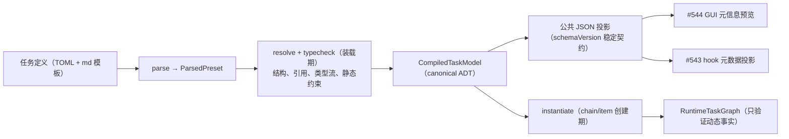

# #547 RFC: v3 类型系统——装载期编译、可计算元信息与零原语任务定义

- state: **open**  | author: `RiriAgent`  | created: 2026-07-02T08:04:38Z  | updated: 2026-07-26T16:15:06Z
- labels: (none)
- url: https://github.com/mouriya-s-lab/coder-loop/issues/547
- comments: 5  | timeline events: 88
- sub-issues:
  - #549 [CLOSED] v3 编译管线：CompiledTaskModel 与 `preset compile --json` 稳定编译产物 (mouriya-s-lab/coder-loop)
  - #550 [CLOSED] doc 渲染声明驱动化：非法化引擎按变量名分支 (mouriya-s-lab/coder-loop)
  - #551 [CLOSED] 引擎 GitHub 记法与 repository 原语退役 (mouriya-s-lab/coder-loop)
  - #552 [CLOSED] 变量绑定类型流：目标端类型化与缺失语义统一（required 校验前移创建期） (mouriya-s-lab/coder-loop)
  - #553 [CLOSED] [[tools]] 注册表与 per-phase toolRequirements 编译 (mouriya-s-lab/coder-loop)
  - #554 [CLOSED] phase 任务树声明面：seq/par 递归结构、join ADT 与装载期检查 (mouriya-s-lab/coder-loop)
  - #555 [CLOSED] 具名 gate 点声明位 (mouriya-s-lab/coder-loop)
  - #556 [CLOSED] dead-fragment 编译检查与 plan 面退役 (mouriya-s-lab/coder-loop)
  - #557 [CLOSED] chain 级 preset 兜底退役：DEFAULT_PRESET_NAME 清除与显式 null (mouriya-s-lab/coder-loop)
  - #605 [CLOSED] 运行实例绑定事前可计算的不可变执行定义 (mouriya-s-lab/coder-loop)
  - #735 [OPEN] feat(engine): doc 渲染声明驱动化 (mouriya-s-lab/coder-loop)
  - #736 [OPEN] feat(engine): GitHub 记法与 repository 原语退役 (mouriya-s-lab/coder-loop)
  - #737 [OPEN] feat(engine): 变量绑定类型流与创建期 required 校验 (mouriya-s-lab/coder-loop)
  - #738 [OPEN] feat(engine): tools 注册表与 phase requirements 编译 (mouriya-s-lab/coder-loop)
  - #739 [OPEN] feat(engine): phase task tree 声明与装载期检查 (mouriya-s-lab/coder-loop)
  - #740 [OPEN] feat(engine): 具名 gate point 声明位 (mouriya-s-lab/coder-loop)
  - #741 [OPEN] feat(engine): dead-fragment 检查与 plan 面退役 (mouriya-s-lab/coder-loop)
  - #742 [OPEN] feat(engine): chain preset fallback 退役 (mouriya-s-lab/coder-loop)
  - #743 [OPEN] feat(engine): immutable execution definition ref (mouriya-s-lab/coder-loop)
  - #744 [OPEN] test(v3): 编译契约冻结 SHA 综合验收 (mouriya-s-lab/coder-loop)

---

## Body

## 摘要

v3 类型系统定为**分阶段编译与验证**：任务定义（TOML 载体演进，不换代码载体）装载一次产出 canonical `CompiledTaskModel`（内存 ADT）及其版本化公共 JSON 投影（`coder-loop preset compile --json`）。凡只依赖定义即可决定的性质在装载期完成；依赖 chain/item 输入的性质在实例创建期完成；依赖工具调用、hook/gate 结果等运行事实的性质保留运行期验证。变量类型权威归来源 schema，binding 只声明来源引用、缺失策略与显式文本投影；新增 `[[tools]]` 注册表与 per-phase 工具调用约束，但将工具来源、输出条件与执法等级正交建模。任务树节点具有跨 compile/SQLite/status 稳定关联的 identity。引擎零原语残留六处全部退役；plan 面从 preset 退役并新增 dead-fragment 编译检查。本 RFC 是 #453 类型权威线在 v3 的直接后继，承接 #546 登记的八项 DSL 表达力需求。

## 操作员输入（verbatim）

目标源（操作员，2026-07-02，`v3/v3-goals.md` 目标 3 与目标 4）：

> "因为全链路类型化，所以状态机的判定来源是可计算类型，所以不需要运行时验证，元信息本身是可计算的。我认为这部分需要 GUI 可预览。"

> "因为类型可计算，所以只需要定义字符串就可以做复杂任务。现在只是 iter+review 循环，我的目的是想要不预先定义任何原语，仅凭 meta 就能做到。……然后可选的 prompt 要求必须调用某种特殊定义的 CLI 工具用于 context 共享，这样独立运行的无状态 agent 也有一定程度上的 context 传递能力。"

类型化路线的第一性表述（操作员，2026-06-12，#453 body）：

> "正常来说这个软件就如同readme一样所说，是个字符串构造器加状态机，而外部的所谓的preset文件本质上是另一种dsl，而dsl可以类型化……因为有了类型，所以内存内的原本是无类型的数据变成了有类型，所以纯动态后天添加的preset想怎么设计流程就怎么设计流程"

## 定位事实

引擎是通用解释器，preset 在引擎 TS 编译**之后**到来——「状态字面量静态可枚举」不可能落在引擎自身的 TS 字面量联合里（那要求 preset 与引擎一起编译，与上引「纯动态后天添加」矛盾），落点是**任务定义装载期**。但「不需要运行时验证」不能解释为运行期零验证：外部工具是否真正调用、动态 context 是否出现、hook/gate 判定等事实只有执行时才存在。v3 的准确性质是：**每项约束在最早可决定的阶段验证，且同一约束只有一个权威判定点**。现状已是半个编译器：`loadPreset`（arktype 边界 parse + 约 15 条局部校验，`docs/preset-authoring.md` §3）→ 跨表 DAG 校验（`src/preset-dag-check.ts`，#408）→ typed `Preset` ADT，且 #454 后 daemon 校验、scheduler 调度、渲染、CLI 查询已唯一消费该产物（#453 T2）。缺口：产物不可导出；检查不完备；变量来源虽是 ADT，目标端仍一律坍缩为 `String(...)`；渲染失败语义三套不一致；doc 渲染存在按变量名分支的特判；plan fragments 游离于状态机之外。

## 裁决记录（操作员，2026-07-02，RFC-2 设计会话）

| # | 决策点 | 裁决 | 理由要点 |
|---|---|---|---|
| A | 编译产物形态 | 装载即编译：canonical `CompiledTaskModel`（内存 ADT）+ `coder-loop preset compile <name\|path> --json` 版本化公共投影（带 `schemaVersion`），按需计算不落缓存 | 单一事实源是定义文件本身；公共 DTO 与内存模型同源但不强求同 shape，必须由唯一投影函数与 boundary round-trip 守护 |
| B | DSL 载体 | TOML 演进，否决代码载体（preset.ts） | 纯 meta 声明与零原语哲学一致；代码载体需求值任意代码、GUI 不可逆向生成；编辑器校验由边界 schema 导出 JSON Schema 补 |
| C | 类型声明表达力 | 类型权威归 source schema；公开 DSL 使用可序列化、递归、封闭的 `ValueType` ADT，四型是基线 variant，结构化 JSON 由 array/record/union 等 schema variant 精化；arktype 仅作实现层 boundary parser，不作为公共类型语言 | 同一 source 不得在不同 phase 被重新解释成冲突类型；GUI、hook、第三方消费者无需实现 arktype 表达式语言 |
| D | 缺失语义与验证阶段 | binding 显式声明 `required`（默认）或 typed `default`；杀 `item.*` 静默 `""`。定义可决定的 default/type compatibility 在装载期验证；chain/item 值完备性在对应实例创建期验证；动态 runtime 值在执行边界验证 | 「不需要运行时验证」改写为「最早可决定阶段验证」；不把尚不存在的运行事实伪装成定义事实 |
| E | businessKeys | 不加 `computed` variant | 派生需求由模板侧相邻占位符组合覆盖；单 variant ADT 已留扩展位，YAGNI |
| F | doc 渲染特判 | 非法化引擎按变量名分支；doc 渲染完全声明驱动（现有 `label/suffix/style/blankBefore` 扩 `prefix`） | #539 一类问题根除于机制而非逐个修 |
| G | 工具约束 | `[[tools]]` 注册表 + per-phase `toolRequirements`；工具 `provider`（engine/external）、`availability`、`outcome` 与 `enforcement`（required/expected）正交建模。`outcome` = 工具的确定性输出条件：合规使用必然使其成立（达成确定）、run 收尾点可计算（判定确定）、不经该工具不可成立（达成唯一）。`required` 合法性的判据是工具定义了 outcome，不是 provider 必须为 engine；无 outcome 的工具至多 `expected`。outcome 为工具固有——一个 capability 携带唯一输出条件，`toolRequirements` 只选档位 | 执法对象是确定性输出条件而非调用动作，不存在「合规但不可观测」类别；不把当前观测能力冻结成长期类型语义；一张表服务 doctor、约束执法、prompt 文档注入三个消费端 |
| H | 零原语清理 | 六残留全部退役（下节清单）；引擎不得以任何 preset 名兜底 | #453 T1/T4 红线补全 |
| I | plan 面 | 从 preset 退役；planning 定性为 operator 侧活动（skill 空间 + 队列 CLI + RFC-6 调用面），不属于任务定义 DSL；新增 dead-fragment 编译检查（warn）；不加 fragment 跳转边声明位 | 调查证据见下节；跳转链唯一样本随 plan 退役消失 |

## 核心设计

### 编译管线

公共 JSON 投影六块：`preset` 元信息（name/dir/源 hash）；`statuses` + `stateGraph`；`phases` + 任务树结构；`tools`；`fragments`；`findings`。编译接口返回 typed `CompileResult = compiled(model, warnings) | rejected(non-empty diagnostics)`；CLI/GUI/doctor/第三方不得解析 exception 文本。JSON 是 canonical model 的稳定投影，不是第二套模型。

任务树的每个可引用节点必须有稳定显式 identity。compile 输出、SQLite 运行态、status/events/hook 投影使用同一 identity 链关联；结构路径只用于展示，不得代替身份。

### DSL 演进面（承接 #546 八项表达力需求，全部接受）

1. **phase 任务树声明**：`[[phases]]` 线性数组演进为可声明递归 seq/par 结构；每个可引用节点有稳定显式 id；join 策略字段为封闭 ADT。#739 基础阶段只落 `drain | validator`；本轮 v3 的 #714 在语义、持久化、观测投影和所有消费点齐备时一次加入 `script`，v3 关闭终态为 `drain | validator | script`；`best-of-n` 仍是未来演进方向。
2. **validator 的 item 调用声明**：preset 引用 + 变量绑定，复用三前缀绑定 DSL。
3. **reopen target 静态可检引用**：`self | 同 seq 更早兄弟`，装载期校验。
4. **per-par 并发上限与 reopen 预算声明位**：参数归元数据、机制归引擎（#396 契约）。
5. **装载期检查清单**：树 well-formedness、reopen target 合法性、join 声明完备性、静态 `dependsOn` 查环——并入编译管线，与 #408 既有两规则同层。
6. **编译产物含任务树结构**（供 #544 渲染）。
7. **具名 gate 点声明位**（#543 需求）：preset 声明「此处需要一道命名 gate」（名字 + required/optional 标志），脚本绑定归全局/chain 层。声明只有在运行时 capability 能识别并执行时才可进入可调度模型；不得出现 compile 接受 required gate、scheduler 静默忽略的中间状态。
8. **具名 join 候选声明位**（#546 / `v3/join-evolution-decision.md` 需求）：preset 声明具名 validator 调用候选，编译产物携带稳定 candidate id；#702 物化诞生与 #703 演化通道只能引用 enclosing 实例 pinned 定义内的 `(definitionRef, candidateId)`；`definitionRef` 为 #743 的 tagged `ExecutionDefinitionRef = preset | chain`，运行时不得自由构造调用声明。候选完备性与悬空引用在装载期拒绝。

### 类型化转移路径与 prompt 输入

编译模型必须把状态图边从裸 `status + when` 提升为可计算的 transition path。每条路径的公共投影至少包含：稳定 path identity、目标 step/preset invocation、可选 prompt template identity/hash、完整输入 bindings、由 agent 提供的 `exit.*` 子 schema，以及每个 binding 的 source/type/required/default/projection。

binding source union 新增 `exit.*`：它只允许出现在转移路径输入中，其值由当前 agent 在完成 CLI 中提交。固定或外部值不进入 exit object，继续复用 `item.*` / `chain.*` / `runtime.*` / typed literal 的既有最早可决定阶段验证。编译器必须双向检查模板占位符与 bindings、exit 输出与目标输入的类型兼容性、非终结路径的目标唯一性；非法路径不得进入可调度模型。

CLI 的 per-phase 出边查询是该编译产物的最小投影：除 path/status 选项外，必须返回所选路径要求的 agent-owned exit schema。完整 transition commit 是唯一业务完成信号；公共编译产物使 GUI、CLI 与第三方调用方无需解析 prompt 散文即可构造合法退出。

### 零原语退役清单

| 残留 | 位置 | 处置 |
|---|---|---|
| `DEFAULT_PRESET_NAME`（红线唯一违例） | `src/daemon.ts:374` / `src/loop.ts:70` | 退役；chain 级 preset 显式传或 null，legacy default-seed（`src/daemon.ts` `handleChainCreate` 注释自证）随 chain 层语义归 #546 后消解 |
| `REPOSITORY_REF_PATTERN` + `chains.repository NOT NULL` | `src/daemon.ts:395`、`src/sqlite-state.ts` | `repository` 降为 chain binding 业务字段，引擎不校验格式不设物理列；`baseBranch` 保留引擎一等（worktree 机制真实消费，`src/scheduler.ts` `chooseWorktreeStartRef`） |
| `--issue` CLI flag（六处） | `src/loop.ts` 命令树 + epilogue 文本 | 干净改名 `--item`，不留 alias |
| `normalizeQueueIssueId`（GitHub 记法解析） | `src/loop.ts:4000` | 退役；引擎收 opaque string，记法便利归调用方工具 |
| `inferRepositoryFromGit` | `src/loop.ts:3977` | 随 repository 降级退役 |
| doctor 无条件查 `gh` | `src/install-commands.ts` | 改为 `[[tools]]` `provider = external` 声明驱动，与既有「按 phase runner 推导 runner CLI 检查」同构 |

### plan 面退役（裁决 I 的调查证据）

12 个 `plan/*.md` fragments 注册于 `[[fragments]]`（role="plan"）但**无任何 phase 的 `roles` 含 "plan"**（四 phase 分别为 `["common","quality","iter"]`/`["common","quality","review"]`/`["common"]`/`["common"]`）——引擎从不渲染，仅过 `assertReadable`。`plan/index.md` 自证："Planning is **not** a `preset.phases` member… The L1 engine does not see planning."。真实调用路径是 `/dev-plan` slash command 的交互会话，而该入口已烂：引用 `config.json`（#433 退役）、`coder-loop install`（#436 退役）、`workflow.md`（#434 退役）、`kind:*` labels（#450→#420→#401 删除）——按其步骤今天第一步即失败，烂而无人报障即不在生产路径的实证。planning 实践早已由 issue 写作 skill 会话 + `item add/batch-add` CLI 承担（#412 已使创建面显式化）。`contract.md` 中被 iter/review 执行侧消费的部分留任。`/dev-plan` 命令去留归 operator 工具空间，本 RFC 只登记。

dead-fragment 编译检查（warn：声明了却无任何 phase role 可见的 fragment）与 #408 dead-vocabulary 同构——该检查若早存在，12 个死 fragment 第一天即暴露。

## 接口假设（跨 RFC 接缝）

- **答复 #546（RFC-1）**：八项表达力需求全部承接（上节）；代数语义、调度、reopen 机制归 #546，声明面与装载期校验归本 RFC。反向登记项已闭合：`DEFAULT_PRESET_NAME` 退役后「无 item 在手的 chain 级判定」落点 = **chain metadata**（#546 已裁：chain 层任务树含顶层 join/chain-complete 判定声明在 chain 自身元数据，不来自任何 preset）；该声明的边界 parse 与校验归本 RFC 编译/校验面（chain metadata 声明与 preset 编译产物同层校验，引擎不以 preset 名兜底）；item 恢复词表（`entryItemStatusForRecovery`）仍取自 per-item preset。
- **供给条款五条不进 DSL**（#546 body「资源模型公理·供给条款（引擎自身 git 行为契约）」节 + 权威记录 `v3/closure-lifecycle-decision.md` §3）：起点公理、闭包分支程序化、seq 流转、par 同 commit 派生（pin）、回收与消费采样——五条全部是**引擎原生行为**（结构性 git 操作归引擎，供给视角对偶于递出面定理），不进 DSL 声明面。具体到 DSL 无声明位的项：起点解析（引擎按 `chain.baseBranch` 创建时刻最新快照，fetch 义务与快照一致性归引擎）、闭包分支创建与命名（引擎自有命名空间，agent 契约是在其上工作）、par pin 的钉入/复用/嵌套内层重钉、回收（suspend 零 GC、仅 consumed 后回收、启动状态对账）、终态谓词采样（谓词对象即闭包分支）——preset 作者无声明位、无可 override 参数。唯一相关的声明位是 `chain.baseBranch`（**chain metadata 字段**，非 preset 字段，归 #705 声明位；其边界 parse 与校验归本 RFC 的编译/校验面，同层于 preset 编译产物）。preset 指示 agent 自建分支（`git switch -c`）退役后（#546 供给条款 2 兑现），DSL 层不留任何分支命名/起点/pin 相关声明位——本 RFC 编译器不需为其新增 variant，实现 children（#739/#742 等）在其声明面上零触碰这些机制项。
- **答复 #545（RFC-3）**：`required | expected` 两档词表采其裁决 4；本 RFC 拥有声明语法、provider/availability/outcome/enforcement ADT、可执法性编译检查（判据双向：不可伪造 + 构造性完备）与 `toolRequirementsDoc` doc builder；工具本体、outcome 达成通道与 run-fail 执法机制归 #545。
- **答复 #543（RFC-4）**：hook「全量元数据」= 编译产物投影 + 运行态快照，不另造第二套 shape；具名 gate 点 DSL 声明位由本 RFC 提供（上节第 7 项）。
- **答复 #544（RFC-5）**：其关闭验证行 9（元信息预览）唯一硬依赖本 RFC 的 JSON 编译产物；其 status 快照 boundary 收紧与编译产物互补不重叠（快照=运行态，编译产物=定义态）；prompt 落盘（`prompt.md` + `bindings.json`）归 #544，本 RFC 的 typed bindings 使 `bindings.json` 携带类型化值。
- **答复 RFC-6（#548，已确认）**：「工作流程选择」= preset 引用，`preset compile --json` 编译产物是第三方调用的请求校验面——消费端为外挂消费 daemon 的请求预校验（#548 裁决 D），引擎创建期 required 校验兜底。

## 开放问题（实现 child 落地时裁，本 RFC 不臆断答案）

- seq/par 在 TOML 的具体语法形态（嵌套内联表 vs 引用式节点表）。
- `json` 渲染呈现形态默认值（fenced code block vs inline）。
- `preset compile` findings 与 doctor 的关系（doctor 是否吸收 compile findings 作为其 preset 健康节）。

## 范围外

- 任务代数语义、调度、reopen、worktree 公理——#546。
- context 工具本体与执法机制——#545。
- hook 执行模型与 gate 语义——#543。
- GUI、prompt 落盘、快照 boundary 收紧——#544。
- GitHub 外挂与第三方调用面——RFC-6。
- #534 audit 树的 v2 缺陷（含 #539 的 v2 修复）——并行不悖，不吸进范围。
- bundled preset 的「iter 三阶段两并行」与闭包分支契约迁移——由 #707 承接；其依赖本 RFC 的声明/编译能力与 #546 的运行语义。

## 约束

- **代码红线（操作员裁决 2026-06-12，全仓 issue 统一）**：必须全链路 ADT，禁止任何类型退化。不引入 `any` / 匿名形状；`unknown` 仅限 catch 与边界 parse 入口；禁止真 `as` 断言（`as const` 除外）；外部输入经边界 parse（arktype）为精确类型后流转；不得删除类型依赖、绕过或降级既有类型边界。违反红线 = changes requested，无例外。依据：#78 / #109 原始约束、#453 契约 T3/T5。
- #453 契约 T1-T5 在 v3 全部延续，本 RFC 不重定义。
- 验证阶段不得错位：装载期不臆造动态事实，运行期不得重复解释定义期已编译的结构。
- 公共类型语言必须可稳定序列化；arktype 可实现边界校验，但消费者不得被迫执行 arktype expression。
- 新 ADT variant 只有在语义、持久化、status/事件投影和所有穷尽消费者同时存在时才可加入；禁止空预留 variant。

## 关闭验证

本 RFC 是设计契约，自身不产出 PR。编译管线 #549 已合入；实现 children #735 / #736 / #737 / #738 / #739 / #740 / #741 / #742 / #743 与冻结 SHA 综合验收 child #744 已挂接，全部落地后按下表复核关闭。

| # | 终态条件 | Command | Env | Expect |
|---|---|---|---|---|
| 1 | 编译产物可导出且六块齐全 | `coder-loop preset compile gh-issue-pr-iteration --json \| jq '.schemaVersion, (.stateGraph.edges \| length), (.phases[0].variables[0].type)'` | local | schemaVersion 输出；边数 > 0；变量带 type 字段 |
| 2 | 零原语清零 + 变量名特判死亡 | `grep -rnE 'DEFAULT_PRESET_NAME\|REPOSITORY_REF_PATTERN\|normalizeQueueIssueId\|inferRepositoryFromGit\|=== "ISSUE"' src/` | local | 无输出 |
| 3 | required 校验前移创建期 | fixture chain 缺 required chain binding 跑 `chain create`；缺 required item 字段跑 `item add` | local | 均创建被拒，错误点名缺失字段；无静默 `""` render 通路 |
| 4 | json 类型可渲染 | fixture preset 声明 json 字段绑定，真实 spawn 路径渲染 | local | 规范化 JSON 出现在渲染产物，无 throw |
| 5 | 工具约束定义期判定 | fixture 分别声明 outcome 缺失+required（任意 provider）、outcome=entry-existence+required → compile | local | 前者编译错误，错误点名 required 需要确定性输出条件（不提及 provider）；后者编译通过；可执法性判定只消费 outcome 轴，provider 不出现在判定路径 |
| 6 | dead fragment 定义期暴露 | fixture preset 含无 phase role 消费的 fragment → compile | local | warn finding，点名 fragment id |
| 7 | plan 面退役 | `ls presets/gh-issue-pr-iteration/plan/ 2>&1; grep -c 'role = "plan"' presets/gh-issue-pr-iteration/preset.toml` | local | 目录不存在；计数 0 |
| 9 | 验证阶段不漂移 | fixture 分别制造定义错误、实例缺值、run 内 required-tool 的 outcome 不成立 | local | 三类错误分别在 compile、create、run-finalize 最早可决定点被拒；无重复判定或提前臆断 |
| 10 | 运行实例定义不漂移 | 用 H1 创建实例，改同路径 preset 为 H2，kill -9/restart daemon | local | 旧实例继续绑定 H1、新实例使用 H2；只保护事前可计算定义，无运行态 MVCC/事务快照 |
| 11 | identity 连续 | 编译 `seq(leaf, par(leaf, leaf))`，构造运行态并读取 SQLite/status/events | local | 同一节点 identity 可跨 compile/持久化/观测关联，结构路径不充当主键 |
| 12 | 公共投影契约 | 对 compile success/rejected 两分支做 boundary round-trip，并让一个独立消费者只靠 schema 读取 | local | 无 exception 文本解析、私有补丁、字段猜测或 arktype expression 执行 |

## 本 issue 的验证边界

- **验证层级**：本 RFC umbrella 不直接运行测试，也不以任一 implementation PR 的局部测试关闭。
- **关闭所需证明**：所有直接 children 达到各自正文声明的验证深度；跨 child 的 v3 新语义接缝由 #684 在冻结合流 SHA 上证明；现有 bundled preset 兼容性由 #685 在发布候选 SHA 上证明。
- **不在本 issue 内执行**：不在 RFC 迭代中重复运行 `scripts/real-e2e.ts`，不把 compatibility E2E 绿解释成 `RFC: v3 类型系统——装载期编译、可计算元信息与零原语任务定义` 的新语义已经成立。
- **现有 GitHub real E2E**：本 issue 不运行 `bun scripts/real-e2e.ts`；该 compatibility 验证只由 #685 在冻结发布候选 SHA 上执行。
## 依赖关系

- Relates to: #546（互为接缝：代数归它、声明面归本 RFC；其八项需求清单以本 RFC 为答复）、#545 / #543（声明语法在本 RFC、语义在各家）、#544（其关闭验证行 9 硬依赖本 RFC）、#453（已关闭的前史 umbrella，T 契约延续；其 child #456 已关闭，不再构成本 RFC 的阻塞项）、#412（preset 事实源已到 item 级，本 RFC 的创建期校验建立在其上）。
- Children: #549（编译管线）、#735（doc 渲染声明驱动化）、#736（GitHub 记法与 repository 原语退役）、#737（变量绑定类型流）、#738（`[[tools]]` 注册表）、#739（phase 任务树声明面）、#740（具名 gate 点声明位）、#741（dead-fragment 检查与 plan 面退役）、#742（chain 级判定声明化）、#743（运行实例绑定事前可计算的不可变执行定义；禁止运行态 MVCC/事务快照）、#744（编译契约冻结 SHA 综合验收）。本 umbrella 的关闭依赖这些 children 全部完成并通过上表关闭验证；umbrella 不阻塞 children 开工。

---

## Comments (5)

### comment #4864284473 by `RiriAgent` — 2026-07-02T09:34:43Z

RFC-6 已落地为 #548。接缝答复：确认本 RFC 登记的待确认假设——「工作流程选择」= preset 引用，`preset compile --json` 编译产物是第三方调用的请求校验面；消费端为外挂消费 daemon 的请求预校验（#548 裁决 D），错误在外挂侧带 delivery id 可审计地拒绝，引擎创建期 required 校验兜底。

### comment #4865089013 by `RiriAgent` — 2026-07-02T11:15:24Z

## 实现拆解 children 落地登记（2026-07-02）

本 RFC「Blocks: 实现拆解 children（后续规划挂接）」承诺兑现：九个原子 children 已创建并挂为 sub-issues。

### children 与裁决/验收映射

| Child | 承接 | 覆盖关闭验证行 | 树内依赖 |
|---|---|---|---|
| #549 编译管线与 `preset compile --json` | 裁决 A；开放问题「findings 与 doctor 关系」 | 行 1 | 地基，无上游 |
| #552 变量绑定类型流 | 裁决 C + D；开放问题「json 渲染形态默认值」 | 行 3、4 | #549 |
| #550 doc 渲染声明驱动化 | 裁决 F | 行 2（`=== "ISSUE"` 份额） | 无（排序：#539 先合） |
| #553 [[tools]] + toolRequirements | 裁决 G；零原语清单第 6 行（doctor） | 行 5 | #549 |
| #551 GitHub 记法与 repository 退役 | 裁决 H；零原语清单第 2–5 行 | 行 2（三符号份额） | 无 |
| #557 chain 级判定声明化 | 裁决 H；零原语清单第 1 行；接口假设·答复 #546 反向登记 | 行 2（`DEFAULT_PRESET_NAME` 份额） | #546 的 chain 层声明 child（编号待其拆解落地回填） |
| #554 phase 任务树声明面 | DSL 演进面第 1–6 项；开放问题「seq/par TOML 语法形态」 | —（新表达力，行 1 产物 shape 内真实化） | #549 |
| #555 具名 gate 点声明位 | DSL 演进面第 7 项 | — | #549 |
| #556 dead-fragment 检查与 plan 面退役 | 裁决 I | 行 6、7 | #549 |

行 8（`typecheck && test && real-e2e`）由全部 children 的 assumption 维度验收行并集覆盖。裁决 B/E 是纯决策无实现工作，不设 child。

### 跨 RFC 边物化（总控简报边 2/3/4/6，供 W2 引用）

- **边 2**：#549 Blocks → #544「元信息预览」、#543「全量元数据投影」、#548「外挂请求预校验」各 child（W2 拆解后回填编号至 #549 body 依赖行）。
- **边 3**：#555 Blocks → #543「preset 级抽象 gate 点」child。
- **边 4**：#553 Blocks → #545「required|expected 执法」child。
- **边 6**：#544「prompt 落盘」child 的 `bindings.json` 类型化值形态引用 #552。

### 排序登记

#534 audit 树（#535–#542）默认先合：#551/#552/#557 触 `src/daemon.ts`/`src/scheduler.ts` 同一批面，在其后 rebase；#550 在 #539 之后 rebase。#557 在 #546 的 chain 层声明 child 编号回填前不进队。

### 对抗审查记录（干涸于第 5 轮）

坐实并已修入 body 的发现：
1. 验收可达性面：`grep 'gh-issue-pr-iteration' src/` 在注释/测试 fixture 有大量合法命中——#557 验收收窄为 `DEFAULT_PRESET_NAME` grep + 功能性「不 seed」检查。
2. 同步范围面：`--issue` 字面量在 bundled preset fragment 文本另有命中（`review/actions/*.md`、`real-e2e-minimal`）——#551 同步范围补全。
3. 留白收口：「par 声明在调度落地前 warn 还是退化执行」全局求解裁死为调度侧点名拒绝（退化串行会错跑 validator join 语义）——#554。
4. 留白收口：`chain create --repository` flag 裁死保留为写 binding 的糖（去除会无收益破坏既有调用方）——#551。
5. 引用对照面：零原语清单行号笔误（2/3/4/6 → 2–5）——#551。

落空怀疑正例：`entryItemStatusForRecovery`（本 RFC 与 #546 接口假设引用的符号）在仓内不存在——它是概念名，真实机制是 `preset.statuses.entry` 经 `scheduler.recovery-entry-restore` / `scheduler.dependency-unblock-restore` 审计源写回（`src/scheduler.ts:1735`、`src/runtime-data.ts:38`）。语义与两 RFC 所述一致，仅符号名不实；#557 body 已按核实锚点登记更正，两 RFC body 不回改（append-only）。

有意不开 child 的 known-open：裁决 B 理由要点提及「编辑器校验由边界 schema 导出 JSON Schema 补」——未列入任何关闭验证行，属需求出现再做的增益项，不属于本 RFC 关闭条件；在此登记以防后人误判为拆解遗漏。

### 观测义务总表

- #549/#553/#554/#556：编译 findings 经既有 observability callback / findings 通道，无运行期新事件（#554 另有 scheduler guard 拒绝的 diagnostic 记录义务）。
- #552/#557：创建期/写入期拒绝沿既有 daemon `invalid_request` + 审计事件契约；新增事件类型必须过 `ObservabilityEventTypeBoundary` 枚举。
- #550/#551/#555：无新事件义务（#551 的审计事件字段随 `--item` 改名同步，PR 列 shape diff）。

### comment #4865384529 by `RiriAgent` — 2026-07-02T11:53:29Z

## 对抗审查追加轮登记（2026-07-02，第 6–7 轮）

按「再验换新面」纪律追加两轮，扫描面为前五轮未覆盖的**调用面全集**（CLI flags 之外的 batch JSON 字段、socket wire 字段、便利 flag）与 **src/ 全量 GitHub 形状字面量**。

### 第 6 轮：坐实三处 RFC 六处清单之外的同类残留，已并入 #551 范围（body 直接更新）

1. `parseBatchItemsJson` legacy back-fill（`src/loop.ts:2068-2084`）：batch JSON `{"issue":…}`/`{"issueNumber":…}` → `itemId` 记法 alias。
2. `--umbrella` flag + `parseUmbrellaRef`（`src/loop.ts:1879-1886`、`2094-2102`）：GitHub 记法解析 + bundled preset 业务 binding 名 `umbrellaRepo`/`umbrellaIssue` 字面量进 L1——双重违反；`scripts/ templates/ docs/` 零使用，退役无外溢。
3. `queue.unblock` socket wire 字段 `issue`（`src/daemon.ts:498/2072`）：#419 `itemId` 迁移漏网；#548 将把 socket 正式化为第三方契约，GitHub-shaped wire 字段会泄进对外契约——一并改名。

处置依据：三处与 #551 是同一问题类（引擎解析/私运 GitHub 记法），其性质表述（「不解析任何引用记法」）本已覆盖，仅锚点与验收未枚举——按验收缺口补入该 issue，不另立 child。#551 已加两条验收行（`parseUmbrellaRef|umbrellaRepo|umbrellaIssue|issueNumber` grep、wire 字段 grep）。

本 RFC body 零原语清单仍为六处不回改（append-only）；新三处的权威登记位是 #551 body「对抗审查第 6 轮」节。

### 第 7 轮：无新发现（干涸）

src/ 全量 GitHub 形状扫描的落空登记（正例）：`github.com` 正则（`src/loop.ts:3993/3995`）在 `inferRepositoryFromGit` 函数体内，随 #551 既有范围消亡；doctor 的 `cli.github.com` 安装提示文本随 #553 声明驱动化消亡；`src/sqlite-state.ts` 的 `…GitHubShapeRetire` 迁移标识符是 #419 历史迁移的内部命名，b 类不动。

### comment #4937847685 by `RiriAgent` — 2026-07-10T17:26:25Z

接缝登记（边界 B 裁决，操作员 2026-07-11，权威记录 `v3/join-evolution-decision.md`）：#546 对本 RFC 的表达力需求清单新增第八项——**join 候选具名声明位**：preset 可声明具名 join 候选（validator 调用声明的具名注册），编译产物携带候选表（每候选稳定 id）。运行时进入 join 位的值（#563 物化诞生时 join 参数、#564 演化通道）只能引用该候选表（`(definitionHash, candidateId)`，解析域 = enclosing 实例的 pinned 定义，边界 A `v3/definition-pin-decision.md` 不变量 7），运行时不接受自由构造的调用声明——G2 行 5「非法 join 引用在 load/compile 期失败」由此对运行时进入的 join 值同样成立。声明语法与装载期校验由 #554 承接（其 body 预期结果 7 已登记），本 RFC 层无新增决策。

### comment #4981521435 by `RiriAgent` — 2026-07-15T14:08:26Z

## Coder-loop umbrella finalizer (run-1784123834676-62-closure-item-1)

### What was checked

Read the live umbrella #547, all 10 explicit GitHub sub-issues, their bodies/comments/timelines/parent links, and every candidate closing PR (#670, #673, #674) including PR bodies, comments, reviews, review comments, timelines, commits, checks, and combined statuses. Also checked `v3-549` central chain state, queue metadata, shared handoff, and issue #549 review/verification/closure evidence.

### Child closure table

| Child | GitHub closure | Closing PR / review state | `v3-549` queue | Assessment |
|---|---|---|---|---|
| #549 | CLOSED (completed) | #674 MERGED; coder-loop review accepted; closure evidence present | `done` | Complete |
| #550 | OPEN | #670 OPEN; reviewer request remains; no accepting review | `queued` | Remaining |
| #551 | OPEN | #673 OPEN; changes-requested comment followed by retry evidence, but no accepting review/merge; reviewer request remains | `queued` | Remaining |
| #552 | OPEN | No closing PR | `queued` | Remaining |
| #553 | OPEN | No closing PR | `queued` | Remaining |
| #554 | OPEN | No closing PR | `queued` | Remaining |
| #555 | OPEN | No closing PR | `queued` | Remaining |
| #556 | OPEN | No closing PR | `queued` | Remaining |
| #557 | OPEN | No closing PR | `queued` | Remaining |
| #605 | OPEN | No closing PR | `queued` | Remaining |

### Remaining scope

Nine explicit children remain open. Two have unmerged PRs with unresolved reviewer requests; seven have no closing PR. The umbrella closing-verification table therefore cannot be executed honestly yet.

The remaining work was already represented by existing issues, so no duplicate follow-up issues were created. All nine open children (#550, #551, #552, #553, #554, #555, #556, #557, #605) were atomically added to the current `v3-549` chain queue. #550 and #551 had historical stopped single-issue chains; those stopped chains do not provide active scheduling ownership.

### Local evidence

- Full live GitHub snapshots: `/Users/mouriya/.coder-loop/loop-data/chains/v3-549/evidence/umbrella-finalizer-run-1784123834676-62/`
- Post-injection queue: `/Users/mouriya/.coder-loop/loop-data/chains/v3-549/evidence/umbrella-finalizer-run-1784123834676-62/queue-after.json`
- Post-injection chain state: `/Users/mouriya/.coder-loop/loop-data/chains/v3-549/evidence/umbrella-finalizer-run-1784123834676-62/chain-status-after.json`
- Chain handoff: `/Users/mouriya/.coder-loop/loop-data/chains/v3-549/shared.md`
- #549 accepted review: `/Users/mouriya/.coder-loop/loop-data/chains/v3-549/evidence/549/review-verdict-run-1784123148064-61.md`

### Finalizer decision

`keep-active`. #547 remains open and `v3-549` now has nine actionable queued children. No PR was merged and no issue was closed by this finalizer.

---

## Timeline (88)

- 2026-07-02T08:04:39Z `assigned` @RiriAgent
- 2026-07-02T08:05:04Z `cross-referenced` @RiriAgentsrc=546
- 2026-07-02T08:05:05Z `cross-referenced` @RiriAgentsrc=545
- 2026-07-02T08:05:07Z `cross-referenced` @RiriAgentsrc=543
- 2026-07-02T08:05:08Z `cross-referenced` @RiriAgentsrc=544
- 2026-07-02T09:33:31Z `cross-referenced` @RiriAgentsrc=548
- 2026-07-02T09:34:43Z `commented` @RiriAgent
- 2026-07-02T11:11:54Z `cross-referenced` @RiriAgentsrc=549
- 2026-07-02T11:12:02Z `cross-referenced` @RiriAgentsrc=550
- 2026-07-02T11:12:04Z `cross-referenced` @RiriAgentsrc=551
- 2026-07-02T11:12:27Z `cross-referenced` @RiriAgentsrc=552
- 2026-07-02T11:12:30Z `cross-referenced` @RiriAgentsrc=553
- 2026-07-02T11:12:32Z `cross-referenced` @RiriAgentsrc=554
- 2026-07-02T11:12:43Z `cross-referenced` @RiriAgentsrc=555
- 2026-07-02T11:12:45Z `cross-referenced` @RiriAgentsrc=556
- 2026-07-02T11:12:47Z `cross-referenced` @RiriAgentsrc=557
- 2026-07-02T11:13:03Z `sub_issue_added` @RiriAgent
- 2026-07-02T11:13:05Z `sub_issue_added` @RiriAgent
- 2026-07-02T11:13:06Z `sub_issue_added` @RiriAgent
- 2026-07-02T11:13:07Z `sub_issue_added` @RiriAgent
- 2026-07-02T11:13:08Z `sub_issue_added` @RiriAgent
- 2026-07-02T11:13:09Z `sub_issue_added` @RiriAgent
- 2026-07-02T11:13:11Z `sub_issue_added` @RiriAgent
- 2026-07-02T11:13:12Z `sub_issue_added` @RiriAgent
- 2026-07-02T11:13:13Z `sub_issue_added` @RiriAgent
- 2026-07-02T11:15:24Z `commented` @RiriAgent
- 2026-07-02T11:15:41Z `cross-referenced` @RiriAgentsrc=558
- 2026-07-02T11:15:44Z `cross-referenced` @RiriAgentsrc=559
- 2026-07-02T11:15:52Z `cross-referenced` @RiriAgentsrc=562
- 2026-07-02T11:15:55Z `cross-referenced` @RiriAgentsrc=563
- 2026-07-02T11:15:57Z `cross-referenced` @RiriAgentsrc=564
- 2026-07-02T11:15:59Z `cross-referenced` @RiriAgentsrc=565
- 2026-07-02T11:16:02Z `cross-referenced` @RiriAgentsrc=566
- 2026-07-02T11:16:05Z `cross-referenced` @RiriAgentsrc=567
- 2026-07-02T11:16:08Z `cross-referenced` @RiriAgentsrc=568
- 2026-07-02T11:17:46Z `cross-referenced` @RiriAgentsrc=561
- 2026-07-02T11:53:29Z `commented` @RiriAgent
- 2026-07-02T11:58:07Z `cross-referenced` @RiriAgentsrc=570
- 2026-07-02T12:01:59Z `cross-referenced` @RiriAgentsrc=572
- 2026-07-02T12:02:24Z `cross-referenced` @RiriAgentsrc=582
- 2026-07-02T12:02:43Z `cross-referenced` @RiriAgentsrc=587
- 2026-07-02T12:02:52Z `cross-referenced` @RiriAgentsrc=591
- 2026-07-02T14:04:29Z `cross-referenced` @RiriAgentsrc=597
- 2026-07-10T05:34:44Z `cross-referenced` @RiriAgentsrc=592
- 2026-07-10T11:50:22Z `cross-referenced` @RiriAgentsrc=605
- 2026-07-10T11:50:31Z `sub_issue_added` @RiriAgent
- 2026-07-10T17:26:25Z `commented` @RiriAgent
- 2026-07-10T17:27:31Z `referenced` @RiriAgentcommit=a720d74f93ef04080c001cf0fec1202db9e450b5
- 2026-07-13T05:07:53Z `cross-referenced` @RiriAgentsrc=674
- 2026-07-13T12:35:31Z `cross-referenced` @RiriAgentsrc=676
- 2026-07-15T10:52:19Z `cross-referenced` @RiriAgentsrc=683
- 2026-07-15T14:08:26Z `commented` @RiriAgent
- 2026-07-17T20:13:18Z `cross-referenced` @RiriAgentsrc=700
- 2026-07-17T20:13:21Z `cross-referenced` @RiriAgentsrc=701
- 2026-07-17T20:13:25Z `cross-referenced` @RiriAgentsrc=702
- 2026-07-17T20:13:30Z `cross-referenced` @RiriAgentsrc=704
- 2026-07-17T20:13:34Z `cross-referenced` @RiriAgentsrc=706
- 2026-07-17T20:36:17Z `cross-referenced` @RiriAgentsrc=710
- 2026-07-17T20:37:00Z `cross-referenced` @RiriAgentsrc=729
- 2026-07-17T20:37:13Z `cross-referenced` @RiriAgentsrc=735
- 2026-07-17T20:37:15Z `cross-referenced` @RiriAgentsrc=736
- 2026-07-17T20:37:18Z `cross-referenced` @RiriAgentsrc=737
- 2026-07-17T20:37:20Z `cross-referenced` @RiriAgentsrc=738
- 2026-07-17T20:37:23Z `cross-referenced` @RiriAgentsrc=739
- 2026-07-17T20:37:25Z `cross-referenced` @RiriAgentsrc=740
- 2026-07-17T20:37:28Z `cross-referenced` @RiriAgentsrc=741
- 2026-07-17T20:37:30Z `cross-referenced` @RiriAgentsrc=742
- 2026-07-17T20:37:32Z `cross-referenced` @RiriAgentsrc=743
- 2026-07-17T20:37:34Z `cross-referenced` @RiriAgentsrc=744
- 2026-07-17T20:37:46Z `cross-referenced` @RiriAgentsrc=748
- 2026-07-17T20:40:10Z `sub_issue_added` @RiriAgent
- 2026-07-17T20:40:11Z `sub_issue_added` @RiriAgent
- 2026-07-17T20:40:12Z `sub_issue_added` @RiriAgent
- 2026-07-17T20:40:13Z `sub_issue_added` @RiriAgent
- 2026-07-17T20:40:14Z `sub_issue_added` @RiriAgent
- 2026-07-17T20:40:15Z `sub_issue_added` @RiriAgent
- 2026-07-17T20:40:16Z `sub_issue_added` @RiriAgent
- 2026-07-17T20:40:18Z `sub_issue_added` @RiriAgent
- 2026-07-17T20:40:19Z `sub_issue_added` @RiriAgent
- 2026-07-17T20:40:20Z `sub_issue_added` @RiriAgent
- 2026-07-26T23:48:53Z `cross-referenced` @RiriAgentsrc=698
- 2026-07-26T23:49:01Z `cross-referenced` @RiriAgentsrc=705
- 2026-07-26T23:49:11Z `cross-referenced` @RiriAgentsrc=713
- 2026-07-26T23:49:12Z `cross-referenced` @RiriAgentsrc=714
- 2026-07-26T23:49:27Z `cross-referenced` @RiriAgentsrc=726
- 2026-07-26T23:49:51Z `cross-referenced` @RiriAgentsrc=747
- 2026-07-26T23:52:36Z `cross-referenced` @RiriAgentsrc=708
- 2026-07-26T23:52:36Z `cross-referenced` @RiriAgentsrc=709