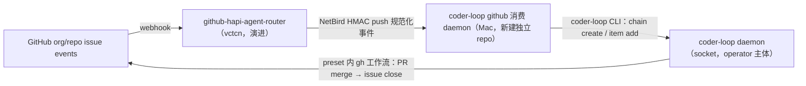

# #548 RFC: v3 第三方调用接口与 GitHub 外挂——socket 原生契约 + 外挂消费 daemon

- state: **open**  | author: `RiriAgent`  | created: 2026-07-02T09:33:30Z  | updated: 2026-07-26T16:15:08Z
- labels: (none)
- url: https://github.com/mouriya-s-lab/coder-loop/issues/548
- comments: 4  | timeline events: 41
- sub-issues:
  - #418 [CLOSED] Spike: coder-loop headless 调度经通用 hapi 交互 CLI 适配 HAPI 远端 session (mouriya-s-lab/coder-loop)
  - #1 [CLOSED] 设计书：通用 HAPI 远端 session 交互 CLI (mouriya-s-lab/hapi-remote-session)
  - #569 [CLOSED] GitHub 消费 daemon 立项：router 规范化事件到 coder-loop CLI 结构化调用（新建独立 repo） (mouriya-s-lab/coder-loop)
  - #570 [CLOSED] GitHub 消费 daemon 请求预校验：消费 preset compile --json 编译产物 (mouriya-s-lab/coder-loop)
  - #602 [OPEN] 外部执行终端 runner 的缺席语义与 daemon 显式警告路径 (mouriya-s-lab/coder-loop)
  - #603 [CLOSED] hapi runner 接入：外部执行终端样板与真实远端 session 验收 (mouriya-s-lab/coder-loop)
  - #2 [CLOSED] 实现：通用 HAPI 远端 session 交互 CLI (mouriya-s-lab/hapi-remote-session)
  - #745 [OPEN] feat(engine): preset compile schema artifact 分发 (mouriya-s-lab/coder-loop)
  - #746 [OPEN] feat(router): GitHub 事件到 coder-loop CLI 的独立消费 daemon (mouriya-s-lab/coder-loop)
  - #747 [OPEN] feat(router): 使用 compile schema 预校验请求 (mouriya-s-lab/coder-loop)
  - #3 [OPEN] feat(cli): 通用 HAPI 远端 session 交互 CLI (mouriya-s-lab/hapi-remote-session)
  - #748 [OPEN] test(v3): 外部 router 与 HAPI runner 冻结 SHA 综合验收 (mouriya-s-lab/coder-loop)

---

## Body

## 摘要

v3 第三方调用面定为：**引擎不长网络、不长第三方主体类**——daemon socket 命令面（经 `coder-loop` CLI）就是第三方调用的正式契约。调用语义类型化为「选定既有 chain | 新建 workspace（= 新建 chain，不引入新实体）」×「工作流程选择（= per-item preset 引用）」×「元信息（= preset 声明的 fields/bindings）」，请求校验面对接 #547 编译产物。每类外部系统一个本地消费 daemon 终结网络可达与外部鉴权（`github-hapi-iac-daemon` 已验证形态）。GitHub 外挂 = `github-hapi-agent-router` 演进（完成模型 per-target 化 + GitHub App scale path）+ 新建独立 repo 的 coder-loop 消费 daemon。hapi 执行通道（#413 组成部分「item 可选在 hapi 端执行」）留在本 RFC 范围：#413 三条已裁约束续命，#418 → mouriya-s-lab/hapi-remote-session#1 依赖链重挂为本 RFC children；实现线按裁决 I（2026-07-10）预建——#602（外部终端缺席语义与警告路径）、mouriya-s-lab/hapi-remote-session#2（CLI 实现）、#748（hapi runner 接入样板）。

## 操作员输入（verbatim）

目标源（操作员，2026-07-02，`v3/v3-goals.md` 目标 6）：

> "v3 我希望加入一种和 GitHub 耦合的可选功能，这个应该是外挂，而不是 coder loop 自己的原生功能。现在的 iac 存在监听 GitHub webhook 自动打开 agent session 去部署，v3 我想要有类似的能力。coder loop 自己预留第三方调用的机会以适应任何形态的外部系统。对于第三方 daemon 来说，传递的值不是某个 prompt，而是选定某个链，或者独立的 workspace，并且选择工作流程并提供元信息。"

v3 组成部分裁决（操作员，2026-06-10，#413 comment）：

> "第一，item 可选在 hapi 端执行，第二，可以有一个独立的服务端作为 github app 监听任意的 org 的 webhook，然后本地的 daemon 用于消费，对于这种形态 preset 通常是专用的。"

hapi 通道架构约束（操作员，2026-06-11，#413 comment）：

> "对于执行器是 hapi 而不是本地 agent，headless 协议会有较大冲突，需要有合适的抽象，要研究过三者的交互，hapi 走远端 http 交互，对于 github-hapi-agent-router 来说他是包了另一个 hapi open session 程序，把 http 调用包了起来，这个部分不要在 coder loop 自己做，因为 hapi 的交互 cli 可以是通用工具，这个 hapi cli 和 npm install -g hapi 的自带命令无关不要混淆。"

## 定位事实

- 外部触发入口现状只有 CLI→Unix socket（行 JSON、每请求一连接，`src/daemon.ts:3833-3864`）；无 HTTP、无 webhook receiver（`v3/survey-engine-daemon.md` §8）。信任模型：本机 socket 无凭证调用 = operator 主体，agent 身份靠引擎自铸 env 凭证（#406）——**不存在第三方主体类**。
- 结构化调用面已在：`chain.create`（name/preset/repository/baseBranch/metadata，`src/daemon.ts:396-403`）+ `item.add`（itemId + per-item preset（#412）+ preset 声明 fields + dependsOn，`src/daemon.ts:404-429`）。`chain.create` 同名同字段幂等返回既有链（`src/daemon.ts:1600-1608`）；`(chain_id, item_id)` 唯一约束拒绝重复 add（`src/daemon.ts:2214-2215`）——幂等键天然存在。
- 参考架构两端已在产：`github-hapi-agent-router`（vctcn：webhook 验签、多 target 路由策略、持久化队列 + push loop、NetBird HMAC push）+ `github-hapi-iac-daemon`（Mac：HMAC 校验 POST、clean-workspace gate、spawn 本地工具、consumed/not-consumed verdict）。router 的 detection zone 是**全局单槽**（"The detection zone holds at most one inflight task"，其 `src/detection-zone.ts:5-8`）——iac 串行部署的专用完成策略，非通用。
- 姊妹裁决已清除的障碍：#547 裁 `REPOSITORY_REF_PATTERN` + `chains.repository NOT NULL` 退役（repository 降为 binding 业务字段）、`DEFAULT_PRESET_NAME` 退役、`normalizeQueueIssueId` 退役（「记法便利归调用方工具」）；#546 裁 chain = 顶层 task + 命名/凭证/隔离边界。

## 裁决记录（操作员，2026-07-02，RFC-6 设计会话）

| # | 决策点 | 裁决 | 理由要点 |
|---|---|---|---|
| A | 调用面形态与信任边界 | 引擎原生面 = daemon socket；不长 HTTP、不长 token、不新增第三方主体类；每类外部系统一个本地消费 daemon 终结网络可达与外部鉴权；「本机 socket = operator」信任模型不变 | 与「GitHub 耦合做外挂不做原生」同构；iac 链路端到端验证过此形态；引擎零新增攻击面；故障隔离——coder-loop daemon 死时消费端回 not-consumed，router 队列自然重推 |
| B | 与 #544 网关的关系 | 不共用宿主 | 网关是观测+运维控制面（其 F 裁决明确排除创建类写动作）；第三方 ingress 是创建类写入面；共用会把两条生命线耦合成一次故障、把 GitHub 知识带进 GUI 进程。#544「HTTP 面模块化可挂 route」的保证登记但不消费 |
| C | 「独立 workspace」语义 | 不引入新实体：= 新建一条 chain。调用语义两分支 `into-chain \| new-workspace`；不加引擎组合命令，外挂两步调用（chain.create 幂等 + item.add 唯一拒绝使部分失败重放安全） | #546 已裁 chain = 命名/凭证/隔离边界，正是 workspace 要的三样；#547 已清除建 chain 的 GitHub 形状障碍 |
| D | 工作流程选择与元信息 | = per-item preset 引用（#412）+ preset 声明 fields/required bindings；确认 #547 接口假设：`preset compile --json` 编译产物是外挂侧请求预校验面 | #547 裁决 D 已把 required 校验前移创建期——第三方漏字段在 item add 即拒，不会 spawn 后才炸 |
| E | GitHub 外挂服务端 | 演进 `github-hapi-agent-router`，不新建：完成模型降为 per-target 策略（`detection-zone \| fire-and-forget`），coder-loop target 用 fire-and-forget；「任意 org」经其 README 既有 GitHub App scale path 承载。演进落 router repo，本 RFC 只登记需求 | 其路由策略本就多 target 泛型（其 `src/types.ts:13-31` targets 表）；detection zone 全局单槽是 iac 端无队列能力下的代偿——coder-loop 自己是队列引擎，排队/并发/完成（PR merge → issue close）是引擎与 preset 既有业务 |
| F | GitHub 消费 daemon | 新建独立 repo（`github-hapi-iac-daemon` 形态：NetBird 监听 + HMAC + delivery 幂等）；消费面 = PATH 上的 `coder-loop` CLI，零 import 引擎源码；「label→preset、issue→itemId、chain 命名、repo→本地 checkout」映射配置全归消费端 | #544 网关拿 monorepo 资格靠 events 直读特许面；消费 daemon 无任何特许需求，CLI 即 CLAUDE.md 钉过的稳定 API；GitHub 知识彻底不进 coder-loop repo |
| G | hapi 执行通道定位 | 留在本 RFC 作组成部分，不另立 RFC；#413 三条已裁约束原文续命；#418 → hapi-remote-session#1 依赖链原样续命并重挂为本 RFC children | 骨架已裁定（CLI 边界/独立 repo/runner binary 收敛），剩 spike 验证；#481 后 runner 已是三元 ADT，加第四 kind 是机械扩展 |
| H | 引擎 origin 审计字段 | 登记为可选演进，不进 v3 验收 | 外挂日志 + delivery id 已构成审计闭环；引擎面能不动就不动 |
| I | hapi 通道实施时点与缺席前提（操作员 2026-07-10，修正 G 的 staged 安排） | hapi 实现是外部执行终端接入样板，随 v3 主线立即预建 issue、并行调查和准备；issue 创建不 gated on spike verdict，但实现合并与关闭仍严格依赖 #418 → hapi-remote-session#1 的已验证契约——实现本身就是 runner 抽象与领域模型边界的验证义务；前提：通道随时可能不存在是正常运行态，daemon 须有显式警告提醒路径（超越可达性检测），缺席 item warn + hold 不 fail-fast | 不实现就无从证伪「抽象对不对、领域边界在哪」；缺席伪装成 spawn 失败盲重试让操作员无从观察通道不在（`src/scheduler.ts:1259`） |

## 核心设计

### 调用语义

```
invocation ::= into-chain(chain 选择, item…)      -- 选定既有链，追加工作
             | new-workspace(chain 声明, item…)   -- 建新链（=独立 workspace）+ 播种工作
item       ::= itemId + preset 引用 + 元信息（该 preset 声明的 bindings / [item.fields]）
```

- 校验三层：外挂侧用 `preset compile --json` 产物预校验（字段名/类型/required，错误带 delivery id 在外挂侧可审计地拒绝）→ CLI/socket 边界 parse → 引擎创建期 required 完备性校验（#547 裁决 D）兜底。
- 幂等三层：GitHub delivery id 去重归 router（既有）；itemId 约定（如 `owner/repo#N`）+ `(chain, itemId)` 唯一约束兜底重放；`chain.create` 同字段幂等。
- chain 命名约定归外挂配置——与 #547「记法便利归调用方工具」同一原则。

### GitHub 外挂架构



- 消费 daemon 的 consumed 语义：`item.add` 成功即 `consumed`（入队 = 接管）；coder-loop daemon 不可达/拒绝 → `not-consumed` + blocker，router 保留队列重推。完成语义归引擎与 preset（fire-and-forget target 不占 router 槽）。
- router 侧演进需求（落 router repo 的 issue，本 RFC 只登记）：① 完成模型 per-target 化；② GitHub App source model（其 README 既有 scale path）。

### hapi 执行通道（G 裁决展开）

#413 三条约束续命：HAPI 远端 HTTP 交互不在 coder-loop 内实现；通用交互 CLI 归 `mouriya-s-lab/hapi-remote-session`；coder-loop 对 hapi 通道的全部感知收敛为「又一个 runner binary」（退出码 + `status.json` headless 契约）。#418 spike 新增两条 v3 输入：① #546 独立 worktree 公理——远端 session 必须绑定任务闭包既有 worktree：同一 `(item, phase)` attempt 链的 retry/resume 复用，闭包 consumed 后才回收；② runner 扩展点现状是三元 ADT（`claude/codex/opencode`，#481 SQLite CHECK + per-phase 声明），spike 结论须回答第四 kind 的接入形态。

裁决 I（2026-07-10）落地：实现线预建为三个 children；#418 spike 与 hapi-remote-session#1 设计书不 gate children 创建，但继续 gate 实现合并与关闭。依赖链：#418 → hapi-remote-session#1 → hapi-remote-session#2（CLI 实现）→ #602（真实 hapi 调用 + 外部终端缺席语义，两腿已合并为单一原子交付单元，由 PR #676 承载）；冻结 SHA 综合验收归 #748。缺席语义：外部执行终端 runner 随时可能不存在，缺席 item warn + hold（可恢复，不 fail-fast），不进 spawn 失败盲 backoff，警告在 events/status 显式可观察——设计展开归 #602。

## 接口假设（跨 RFC 接缝）

- **答复 #547（RFC-2）**：确认其待确认假设——「工作流程选择」= preset 引用，`preset compile --json` 编译产物是第三方调用的请求校验面（消费端：外挂预校验）。
- **答复 #544（RFC-5）**：裁决 B——第三方 ingress 不与 GUI 网关共用宿主/协议面；其「HTTP 面模块化可挂 route」保证登记不消费。
- **对 #546（RFC-1）**：无新需求；调用语义直接消费其「chain = 顶层 task/命名/凭证/隔离边界」裁决。#413 组成部分 1/2 的重挂由本 RFC 完成（children 见依赖关系）。
- **对 #545（RFC-3）/ #543（RFC-4）**：无接缝——context 工具与 hook 不进第三方调用面。

## 开放问题（实现期裁，本 RFC 不臆断）

- 消费 daemon repo 命名、router config 中 coder-loop target 的具体形态。
- fire-and-forget 下的 GitHub 侧回执（「已入队」comment 之类）——是否要、归哪端。

## 约束

- **代码红线（操作员裁决 2026-06-12，全仓 issue 统一）**：必须全链路 ADT，禁止任何类型退化。不引入 `any` / 匿名形状；`unknown` 仅限 catch 与边界 parse 入口；禁止真 `as` 断言（`as const` 除外）；外部输入经边界 parse（arktype）为精确类型后流转；不得删除类型依赖、绕过或降级既有类型边界。违反红线 = changes requested，无例外。消费 daemon repo 同样适用。
- 引擎低改动原则：本 RFC 引擎侧必改项收敛为两个（裁决 I）——外部执行终端缺席语义与警告路径（#602）、hapi runner 接入（#748）；除此之外引擎面能不动就不动（repository 泛化等前置归 #547），裁决 H 的 origin 审计字段仍为可选演进不进 v3。

## 关闭验证

RFC 体裁：钉终态条件，具体命令由实现 children 落地时具体化为可逐字重跑的操作步骤。

| # | 终态条件 | 验证 | Expect |
|---|---|---|---|
| 1 | 结构化调用两分支可达 | 外挂形态调用方对引擎执行 into-chain 与 new-workspace 各一次 | 既有链追加 item 成功；新链建立 + item 入队并被调度执行；全程无 prompt 传递 |
| 2 | 请求校验面生效 | 元信息漏 required 字段 / preset 引用不存在的调用 | 外挂预校验或引擎创建期拒绝，错误点名缺失字段；无 spawn 后才失败的通路 |
| 3 | 幂等 | 同一 delivery id / 同一 itemId 重放 | 不产生第二个 item / 第二次执行 |
| 4 | GitHub 事件端到端 | labeled issue → router → 消费 daemon → 引擎 → preset 工作流 | issue 最终被 PR close；一次触发恰好一次执行 |
| 5 | 重试闭环 | coder-loop daemon 停机时触发事件，随后恢复 | not-consumed → router 保留重推 → 恢复后消费成功，事件不丢失 |
| 6 | 外挂纯度 | grep coder-loop repo 与消费 daemon repo | 引擎无 GitHub 外挂知识新增；消费 daemon 不 import coder-loop 源码，仅经 CLI |
| 7 | hapi 通道能力与边界 | 两腿同归 #602 原子交付：① 一个真实 item 以 runner=hapi 在真实 HAPI 远端 session 完成 run；② 通道缺席时 daemon 显式警告 + item hold，恢复后无人工干预执行；冻结 SHA 复核归 #748；#418 spike 结论与 hapi-remote-session#1 设计书落地 | 退出码 / `status.json` / per-task-closure worktree 生命周期与其他 runner 同构；同一闭包的 retry/resume 复用既有 cwd，consumed 后才回收；警告在 events/status 可观察且区分于瞬时故障；coder-loop 内无 HAPI HTTP 客户端 |

## 范围外

- GUI 网关与观测面——#544。任务代数——#546。DSL 与编译产物定义——#547。context CLI——#545。hook——#543。
- router repo 的实现细节——其 repo 自己的 issue 承载，本 RFC 只登记需求。
- 消费 daemon 的部署 IaC——归 IaC repo 惯例路径。
- #534 audit 树的 v2 缺陷——并行不悖，不吸进范围。

## 本 issue 的验证边界

- **验证层级**：本 RFC umbrella 不直接运行测试，也不以任一 implementation PR 的局部测试关闭。
- **关闭所需证明**：所有直接 children 达到各自正文声明的验证深度；跨 child 的 v3 新语义接缝由 #684 在冻结合流 SHA 上证明；现有 bundled preset 兼容性由 #685 在发布候选 SHA 上证明。
- **不在本 issue 内执行**：不在 RFC 迭代中重复运行 `scripts/real-e2e.ts`，不把 compatibility E2E 绿解释成 `RFC: v3 第三方调用接口与 GitHub 外挂——socket 原生契约 + 外挂消费 daemon` 的新语义已经成立。
- **现有 GitHub real E2E**：本 issue 不运行 `bun scripts/real-e2e.ts`；该 compatibility 验证只由 #685 在冻结发布候选 SHA 上执行。
## 依赖关系

- Relates to: #546（#413 替代方；组成部分 1/2 划归本 RFC 的来源）、#547（编译产物 = 请求校验面）、#544（宿主不共用，对接其登记项）、#412（per-item preset 是调用语义基础）。
- Children（sub-issues）: #418（hapi 通道 spike，已完成）、mouriya-s-lab/hapi-remote-session#1（通用 CLI 设计书）、#745（compile schema artifact 分发）、#746（GitHub 事件消费 daemon）、#747（router 请求预校验）、#602（真实 hapi 调用 + 外部终端缺席语义，原子交付）、#748（外部 router 与 HAPI runner 冻结 SHA 综合验收）、mouriya-s-lab/hapi-remote-session#2（CLI 实现）。
- Closure depends on: #745、#746、#747、#418、mouriya-s-lab/hapi-remote-session#1、#602、#748、mouriya-s-lab/hapi-remote-session#2；这些 children/外部实现线完成后，本 umbrella 才执行关闭验证。umbrella 不阻塞 children 开工；router 演进需求登记在 router repo，本 RFC 只留指针。


---

## Comments (4)

### comment #4865425461 by `RiriAgent` — 2026-07-02T11:58:38Z

## 实现拆解 children 落地登记（2026-07-02）

本 RFC「Blocks: 实现拆解 children（后续规划挂接）」承诺兑现。

### children 与裁决/验收映射

| Child | 承接 | 覆盖关闭验证行 | 依赖 |
|---|---|---|---|
| #569 消费 daemon 立项 | 裁决 A/C/F + consumed 语义；开放问题「repo 命名」「GitHub 回执归属」 | 行 1、3、4、5、6 | #551；router 演进 issue（仅 gate 端到端行） |
| #570 请求预校验 | 裁决 D + 校验三层 | 行 2 外挂半边（引擎兜底半边归 #552——行 2 Expect 本就是「外挂预校验**或**引擎创建期拒绝」的并集结构） | #549（总控简报边 2）、#552、#569 |
| #418 hapi spike（既有） | 裁决 G | 行 7 前半 | — |
| mouriya-s-lab/hapi-remote-session#1（既有） | 裁决 G | 行 7 后半 | #418 |

hapi 通道实现 issue 按 #418 结果分支「If passed 届时另开挂 #548 线」，本轮不预建。

### router 演进需求指针（裁决 E「本 RFC 只登记」，落 router repo，不挂 sub-issue）

- mouriya-s-lab/github-hapi-agent-router#12：完成模型 per-target 化（`detection-zone | fire-and-forget`）。开放问题「router config 中 coder-loop target 的具体形态」分配至该 issue；其 Blocks #569 的端到端验收行。
- mouriya-s-lab/github-hapi-agent-router#11：GitHub App source model（「任意 org」scale path）。不 gate 本 RFC 关闭验证——行 4 用 repository webhook 即可闭合。

### 有意不开 child 的 known-open

- 裁决 H origin 审计字段：可选演进不进 v3，外挂日志 + delivery id 已构成审计闭环——在此登记防后人误判为拆解遗漏。

### 排序登记

- #569 在 #551 之后（`--issue`→`--item` 干净改名不留 alias，消费端调用面只建一次）；#570 在 #549 + #552 之后。
- 与 #534 audit 树无共同代码面（新 repo + router repo，coder-loop 引擎零改动），无 rebase 约束——总控简报排序默认值对本组 children 空适用。
- 消费 daemon repo 创建前，repo owner 按操作员 GitHub 账号路由规则与操作员确认。

### 对抗审查记录（干涸于第 5 轮）

坐实并已修入 body 的发现：
1. 验收自身的洞：#569 行 1「无 prompt 字段」原缺观察载体——补「决策日志记录构造的 CLI 调用参数」为可核对面。
2. 验收自身的洞：#569 行 3「无第二次执行痕迹」在本地（链未必被调度）不可观测——收窄为「队列 item 总数不变」，「执行恰好一次」归行 5 端到端观察。
3. 验收自身的洞：#570 行 1 加「coder-loop daemon 停机状态下执行」判别面——若实现偷懒先调引擎再校验，停机下只能回 not-consumed 而非点名字段拒绝，最省事路径无法通过。
4. 组合一致性面：router per-target 化 issue 只 gate #569 验收行 5，但行 5 是关闭证据的一部分——依赖行明写「gate 关闭证据、不阻开发」，防被读成可先关。
5. 设计自洽面：裁决 E 未逐字裁「iac inflight 是否阻塞 coder-loop 推送」——按裁决目的（解除与 iac 串行化的耦合）全局求解裁死为不阻塞，推论依据登记在 router issue 尾注。
6. 组合一致性面：CLI 面漂移处置分级——#551（flag 干净改名，正中消费端核心调用）设硬依赖；#557（chain metadata 演进，gated 于 #546 child 时点不定，消费端经 `--config-json` 透传消费）只设软性预警不设边，理由写入 #569 上下文。

落空怀疑正例：
- 「delivery id 去重归 router（既有）」查实成立：`src/delivery-store.ts` `DeliveryStore.check` → `already-forwarded`（HEAD 14de4e4）。
- 重放攻击面：router→daemon HMAC 无时效窗（iac-daemon 先例同样没有），但重放在幂等三层下收敛为无害（consumed、零重复 item）——与 RFC 设计一致，不加新要求。
- 同 itemId「重跑」诉求（issue 重打 label 期望再执行）会被按 consumed 吞掉——RFC 关闭验证行 3 明文「不产生第二个 item / 第二次执行」，重跑语义归映射配置的 itemId 约定自由度，非缺口。

### 观测义务总表

- #569 / #570：消费 daemon 结构化 JSON 决策日志（deliveryId / 映射结果 / verdict / blocker / 违规明细），对齐 router 与 iac-daemon 既有形态；coder-loop 引擎侧零新增事件义务。
- router 两 issue：沿 router repo 既有 decision JSON 行日志惯例，归其 repo。


### comment #4867797957 by `RiriAgent` — 2026-07-02T16:08:43Z

## 对抗审查追加轮登记（2026-07-03，干涸再确认）

落地登记 comment 的审查记录（干涸于第 5 轮）之后，换两个未扫过的面追加一轮，均重验通过、零新发现：

- **字段面**：`item.add` wire 含 RFC 调用文法之外的引擎控制字段（`status` / `attempts` / `runner` / `lastRunId` / `agentCredential`，`src/daemon.ts:404-429`）。#569 预期结果 2「传递的只有 chain 选择、preset 引用、preset 声明的元信息字段」忠实镜像 RFC 调用文法 `item ::= itemId + preset 引用 + 元信息`，引擎控制字段已被该性质排除在外挂调用面之外；`agentCredential` 缺省即 operator leg（裁决 A 信任模型）。若日后需要 per-label runner 映射，是对 RFC 调用文法的镜头修正，不是本树缺口。
- **发布终态一致性面**：#549 Blocks 行的 `= #570` 回填在 #543 会话并发回填（#587 同行合并）后存活；#548 sub-issues 保持 4 项（#418、hapi-remote-session#1、#569、#570）；thread 无未处理活动。

连续一轮无新发现，干涸判定维持。


### comment #4932453975 by `RiriAgent` — 2026-07-10T05:59:57Z

## 设计修正（2026-07-10，操作员裁决）

操作员裁决原文（verbatim）：

> 「hapi的实现是一个样板，现在就要做，这是典型的外部执行终端，他的核心目的是实现后是接口的验证，而不会出现抽象做了压根不知道抽象对不对，以及更核心的领域模型边界在哪。然后hapi的实现有个前提，必须当作这个部分随时可能不存在，所以daemon必须有显式的警告提醒路径，这不只是现在用什么手段检测hapi通道是否可达这么简单」 — 操作员（2026-07-10）

### 收回

- 裁决 G 的 staged 安排「剩 spike 验证」与落地登记 comment（2026-07-02）的「hapi 通道实现 issue 按 #418 结果分支『If passed 届时另开挂 #548 线』，本轮不预建」——实现 children 现在预建并随主线实施，spike 与设计书降为实现输入，不再 gate 创建。
- 关闭验证行 7 旧文（spike 结论 + 设计书落地即达标）——设计书不能替代真实远端 session 实证。
- 约束区「引擎近零改动原则：本 RFC 引擎侧无必改项」——daemon 显式警告路径与 runner 接入是引擎侧必改项。

### 改为（body 已按此修订）

- 裁决记录追加 I 行：hapi 实现 = 外部执行终端接入样板，立即立项；前提「通道随时可能不存在」→ daemon 显式警告路径 + 缺席 item warn + hold（不 fail-fast，不进 spawn 失败盲 backoff）。
- 「hapi 执行通道」节：登记三个预建 children 与依赖链 #418 → hapi-remote-session#1 → hapi-remote-session#2 → #603；#602 无树内硬上游可先行。
- 关闭验证行 7 改双腿终态：① 真实 item 以 runner=hapi 在真实远端 session 完成 run（#603）；② 缺席显式警告 + hold + 恢复执行（#602）。
- 约束区改「引擎低改动原则」：必改项收敛为 #602、#603 两个。
- Children/Blocks 更新：新增 #602、#603、mouriya-s-lab/hapi-remote-session#2（均已挂 sub-issue，totalCount 4 → 7）。

### children 与裁决/验收映射（增补 2026-07-02 落地登记表）

| Child | 承接 | 覆盖关闭验证行 | 依赖 |
|---|---|---|---|
| #602 缺席语义与警告路径 | 裁决 I 前提半边；`hapi` kind 词表准入 | 行 7 腿② | 无树内硬上游（与 #558/#559 协调边） |
| #603 hapi runner 接入样板 | 裁决 I 样板半边 + 裁决 G 三条边界约束 | 行 7 腿① | #602、hapi-remote-session#2、#418 结论 |
| hapi-remote-session#2 CLI 实现 | 裁决 G「通用 CLI 归 hapi-remote-session」的实现兑现 | 行 7 腿①前提 | hapi-remote-session#1 |

### 对编排的影响

`v3/execution-orchestration.md` 同步修订（P1-A/P1-B/P2-B gating 解除、P6-A 验收锚点、G6-6 增补缺席场景、§10 覆盖核对），见 repo commit。


### comment #4949059167 by `RiriAgent` — 2026-07-11T22:55:04Z

## Coder-loop umbrella finalizer (run-1783809495622-13-review-item-140)

### What was checked

- Live umbrella `mouriya-s-lab/coder-loop#548`: body, all 3 comments, 7 explicit sub-issues, and all available timeline entries (no pagination remained).
- Each explicit child: complete body/comments/timeline and closing-PR search. No child has a candidate closing PR in its timeline; the only closed child, #418, uses the reviewed no-code spike closure path.
- Chain `v3-418`: SQLite-backed status, the sole queue item, shared handoff, issue evidence, and review/run artifacts.
- Dependency readiness: #551, #549, #552, and `github-hapi-agent-router#12` are still open; #602 is already queued in active chain `v3-602`.

### Child closure table

| Scope | State | Closure / remaining proof |
|---|---|---|
| `coder-loop#418` (explicit child + `v3-418` queue item) | CLOSED; local `done` | Valid no-PR source-writing spike closure: [accepted review](https://github.com/mouriya-s-lab/coder-loop/issues/418#issuecomment-4949043410), real HAPI positive/negative replay, and explicit closure comment. |
| `hapi-remote-session#1` | OPEN | Design contract is not landed; blocks #2, #603, and #548 row 7. No closing PR. |
| `coder-loop#569` | OPEN | Depends on open #551 and `github-hapi-agent-router#12`; target repo/owner decision remains part of execution. No closing PR. |
| `coder-loop#570` | OPEN | Depends on open #549, #552, and #569. No closing PR. |
| `coder-loop#602` | OPEN | Design is ready for implementation, but no implementation PR exists; already queued once in active chain `v3-602`. |
| `coder-loop#603` | OPEN | Depends on #602, `hapi-remote-session#2`, #418, and `hapi-remote-session#1`; real runner E2E is absent. No closing PR. |
| `hapi-remote-session#2` | OPEN | Depends on #1; executable CLI and real failure-path proof are absent. No closing PR. |

### Remaining scope

Six explicit children remain open. They cover coherent, already-represented deliverables: the HAPI CLI design/implementation chain, external-terminal absence semantics, real HAPI runner integration, and the GitHub consumer/prevalidation path. The umbrella's own closing verification therefore cannot pass.

No duplicate follow-up issue or queue item was created. All remaining work already has an explicit child. Re-adding #602 would duplicate the active `v3-602` assignment; cross-repo #1/#2 cannot safely run under this coder-loop target; #569/#570/#603 still have open dependency gates.

### Local evidence

- Chain handoff: `/Users/mouriya/.coder-loop/loop-data/chains/v3-418/shared.md`
- Accepted spike command/runtime proof: `/Users/mouriya/.coder-loop/loop-data/chains/v3-418/evidence/418/command-log.md` and `runtime-manifest.md`
- Independent replay: `/Users/mouriya/.coder-loop/loop-data/chains/v3-418/evidence/418/replay-13-hapi-positive.log`, `replay-13-result-readback.log`, and `replay-13-hapi-negative.log`
- Review run record: `/Users/mouriya/.coder-loop/loop-data/chains/v3-418/runs/run-1783809495622-13-review-item-140/status.json`

### Finalizer decision

**Keep active.** `coder-loop#548` remains OPEN because six explicit children and their closure evidence remain outstanding. Chain completion would be dishonest; no umbrella closure action was taken.


---

## Timeline (41)

- 2026-07-02T09:33:31Z `assigned` @RiriAgent
- 2026-07-02T09:33:47Z `sub_issue_added` @RiriAgent
- 2026-07-02T09:33:49Z `sub_issue_added` @RiriAgent
- 2026-07-02T09:34:13Z `cross-referenced` @RiriAgentsrc=418
- 2026-07-02T09:34:44Z `cross-referenced` @RiriAgentsrc=547
- 2026-07-02T09:34:45Z `cross-referenced` @RiriAgentsrc=544
- 2026-07-02T09:34:46Z `cross-referenced` @RiriAgentsrc=546
- 2026-07-02T11:11:54Z `cross-referenced` @RiriAgentsrc=549
- 2026-07-02T11:52:47Z `cross-referenced` @RiriAgentsrc=551
- 2026-07-02T11:57:44Z `cross-referenced` @RiriAgentsrc=11
- 2026-07-02T11:57:50Z `cross-referenced` @RiriAgentsrc=12
- 2026-07-02T11:58:01Z `cross-referenced` @RiriAgentsrc=569
- 2026-07-02T11:58:07Z `cross-referenced` @RiriAgentsrc=570
- 2026-07-02T11:58:26Z `sub_issue_added` @RiriAgent
- 2026-07-02T11:58:27Z `sub_issue_added` @RiriAgent
- 2026-07-02T11:58:38Z `commented` @RiriAgent
- 2026-07-02T12:02:09Z `cross-referenced` @RiriAgentsrc=576
- 2026-07-02T16:08:43Z `commented` @RiriAgent
- 2026-07-05T09:15:12Z `referenced` @RiriAgentcommit=128b13eb115198d0e94bd53f6f7ac764e2b42909
- 2026-07-10T05:56:41Z `cross-referenced` @RiriAgentsrc=602
- 2026-07-10T05:57:24Z `cross-referenced` @RiriAgentsrc=2
- 2026-07-10T05:58:14Z `cross-referenced` @RiriAgentsrc=603
- 2026-07-10T05:58:46Z `sub_issue_added` @RiriAgent
- 2026-07-10T05:58:47Z `sub_issue_added` @RiriAgent
- 2026-07-10T05:58:48Z `sub_issue_added` @RiriAgent
- 2026-07-10T05:59:57Z `commented` @RiriAgent
- 2026-07-11T22:55:04Z `commented` @RiriAgent
- 2026-07-15T10:52:19Z `cross-referenced` @RiriAgentsrc=683
- 2026-07-15T10:53:40Z `cross-referenced` @RiriAgentsrc=684
- 2026-07-17T20:37:36Z `cross-referenced` @RiriAgentsrc=745
- 2026-07-17T20:37:39Z `cross-referenced` @RiriAgentsrc=746
- 2026-07-17T20:37:41Z `cross-referenced` @RiriAgentsrc=747
- 2026-07-17T20:37:43Z `cross-referenced` @RiriAgentsrc=3
- 2026-07-17T20:37:46Z `cross-referenced` @RiriAgentsrc=748
- 2026-07-17T20:40:21Z `sub_issue_added` @RiriAgent
- 2026-07-17T20:40:23Z `sub_issue_added` @RiriAgent
- 2026-07-17T20:40:24Z `sub_issue_added` @RiriAgent
- 2026-07-17T20:40:25Z `sub_issue_added` @RiriAgent
- 2026-07-17T20:40:26Z `sub_issue_added` @RiriAgent
- 2026-07-26T23:49:20Z `cross-referenced` @RiriAgentsrc=720
- 2026-07-26T23:49:39Z `cross-referenced` @RiriAgentsrc=736