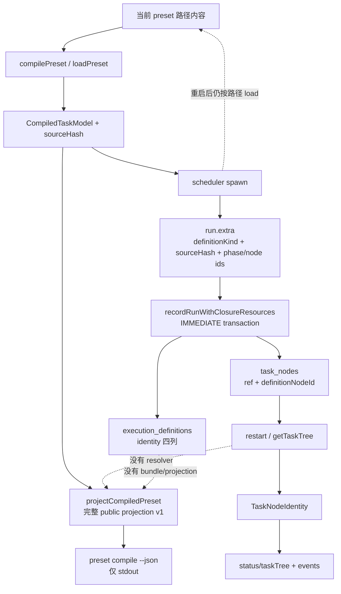

# RFC #543 · R7-DI-02 · definitionRef 到 pinned compile projection 的真实供给

> 调查基线：`/Users/mouriya/Ext/code/coder-loop` main
> `699842eba2eefc242d19f8fa9232bc1d9d5c3bdd`。  
> 唯一设计锚点：`08-detail-investigation-index.md` 的 R7-DI-02；稳定条款 F3、D1；
> ledger `S1-U03`。  
> 外部供给契约：
> [RFC-2 #547](https://github.com/mouriya-s-lab/coder-loop/issues/547) 与其
> [definition pin child #743](https://github.com/mouriya-s-lab/coder-loop/issues/743)。
> 本报告只调查供给事实，不设计 HookPayload、named binding、补法或 issue 边界。

## A. 主 agent 摘要

### A1. 一页结论

**当前 main 没有 `definitionRef -> PresetCompileProjection` 的解引用能力。**
实际存在的是两条尚未接合的链：

1. `load/compile -> CompiledTaskModel -> PresetCompileProjection`：编译器从当前路径读取
   TOML、prompt、fragment，计算 `sourceHash`，并可即时投影版本 1 的完整公共 DTO；
   该 DTO 只返回 CLI/调用者，不写 SQLite。
2. `scheduler -> sourceHash/phase ids -> execution_definitions + task_nodes -> restart read ->
   status/events identity`：scheduler 在 spawn 前再次按当前 item/chain 的 preset 路径装载，
   将 `sourceHash` 当作 `PresetDefinitionRef.contentIdentity`，但 definition 表只写
   `(kind, content_identity, semantic_hash, schema_version)` 四列；task node 只写 ref 与
   `definitionNodeId`。重启后只能重建 identity，不能重建编译投影。

因此 `definitionRef` 当前是**可持久化的 tagged 内容身份**，不是可解引用的 pinned bundle
句柄。`semantic_hash` 当前机械等于 `content_identity`，没有 bundle/blob/projection 列；
全仓也没有对 `execution_definitions` 的 SELECT 或 resolver API。

RFC-2 的冻结契约明确要求：运行前完整计算不可变执行定义；旧实例在路径变化及 daemon
重启后继续消费原定义；scheduler resume、status/events、hook、GUI 均沿 ref 同源读取；
缺失/损坏时 hold/报错，禁止回退到当前路径。这个能力由仍为 **OPEN** 的 #743 承接，
而不是当前 main 已供给的事实。#547 中已合入的 #549/#674 只提供编译产物与公共投影；
main 的 #675/#9ac3b87 提供运行态 identity 持久化。

### A2. 对 F3 / D1 的确定地基与缺口

| 条款 | 当前确定地基 | 当前仍缺 |
|---|---|---|
| F3 | `ExecutionDefinitionRef` 是 `preset | chain` tagged union；preset identity 使用完整源目录 hash；task node、run、status/event 能连续携带 ref 与 definition node id；公共 projection 有版本化 boundary。 | 完整 projection/bundle 的持久化；ref resolver；重启后 scheduler/prompt/fragment/rights 等从 pin 读取；缺失/损坏的 hold/error；旧 H1/新 H2 分流。 |
| D1（仅 preset 定义供给部分） | canonical `CompiledTaskModel` 与唯一 `projectCompiledPreset` 可提供 typed preset 定义投影。 | preset 层的生产 consumer 不能从运行实例 ref 取得该投影；现有 hook effective view 的 preset placeholder 仍不是 producer 证据。 |

可直接保留的资产是：tagged ref、内容 hash、稳定 node identity、SQLite 外键与事务写入、
compile projection boundary/唯一投影函数、task-tree/status/event identity 读面。
不能把“当前路径可重新 compile”或“materialized preset 目录”当成 pin：daemon 的普通加载
仍按当前路径进行，materialized 目录还会在 daemon 启动清理未保留目录。

### A3. 根因集合与消费者影响

根因不是 hash 算错，而是供给链只完成了**identity projection**：

- 编译公共 DTO 是按需返回值，没有 durable artifact writer。
- `execution_definitions` 是 identity catalog，不是 definition store。
- scheduler 的 definition producer只把 hash 和 phase/node 对照塞入 run extra，随后持久化
  identity；完整 `CompiledTaskModel`/public projection 在事务前已丢失。
- restart loader 和 scheduler resolver仍以 `item.preset/item.presetPath/chain.preset` 指向当前源，
  没有 ref-first resolution 分支。

放大条件是同路径内容变化、materialized 副本被清理、daemon 重启、resume 重新渲染，
或 definition row 缺失/损坏。影响面包括 scheduler 行为与 prompt、status/GUI 定义展示、
hook preset metadata、join candidate resolution；当前只有 status/events 的 identity 字段不漂移，
定义语义仍可能重新读取 H2。

### A4. 确定未知

当前无法从 main 确定 #743 最终采用何种 durable bundle 物理形态、projection 与 canonical
model 的存储关系、schema migration 版本、resolver 返回类型及 corruption diagnostic。
确定方法是：以 #743 合流 SHA 为新基线，逐字段核对其保护闭集和 schema；执行
H1 create/hold → 同路径改 H2 → kill/restart → old/new resolve，以及删除/破坏 artifact 后
restart；同时枚举 resolver 的全部调用者。不得用当前 placeholder 或本报告反推这些答案。

---

## B. 证据附录

### B1. 上游冻结契约与落地状态

#### B1.1 RFC-2 的权威要求

本调查完整拉取了 #547 body/comments 到
`/tmp/r7-di02-gh/issue-547.json`。其冻结正文明确：

- 装载即编译，产出 canonical `CompiledTaskModel` 与版本化公共 JSON 投影。
- 公共投影六块包括 preset、状态图、phase/task tree、tools、fragments、findings。
- hook 的“全量元数据”定义为编译产物投影 + 运行态快照，不另造 shape。
- 关闭验证行 10 要求 H1 创建旧实例、路径改 H2、kill/restart 后旧实例仍 H1、新实例 H2。
- children 表中 #743 的职责是“运行实例绑定事前可计算的不可变执行定义”。

#743 的冻结正文进一步要求：

- preset/chain 两种 tagged definition ref；
- 定义在实例创建成功前完成编译、规范化、boundary validation、内容寻址；
- daemon/scheduler/status/events/hook/GUI 都沿实例 ref 读取同一份定义；
- scheduler resume 的完整 effective prompt 也必须来自 pin；
- 缺失/损坏显式 hold/error，禁止读当前源 fallback；
- 运行事实不得混入 definition bundle。

截至本调查，#743 状态为 OPEN，零 comments。由此不能把冻结期望写成 main 的已实现事实。

#### B1.2 commit 归属

- `55ff3b2 feat: 导出 CompiledTaskModel 与 preset compile 稳定编译产物 (#674)`：
  #549 的 compile/public projection 地基。
- `9ac3b87 feat(engine): v3 任务树运行态持久化与 status 快照树结构 shape（含闭包状态表） (#675)`：
  identity/ref 持久化地基。
- main HEAD 中不存在 #743 closing implementation commit；GitHub issue仍 OPEN。

### B2. 完整生产链



#### B2.1 compile 与 projection producer

- `src/loop.ts:4590-4605`：`compilePreset` 返回
  `compiled(model,warnings) | rejected(diagnostics)`；`loadPreset`只取 model。
- `src/loop.ts:4608-4696`：compiler读取当前 `sourceDir`，parse TOML、读取 prompt/fragment，
  在 `4686` 计算源 hash，在 `4687-4696` 返回内存 product。
- `src/loop.ts:4699-4707`：hash 覆盖目录全部文件的相对路径与字节，排序后 SHA-256；
  因此它是内容 identity 地基。
- `src/loop.ts:533-583`：`PresetCompileProjectionBoundary` 是 schemaVersion 1 的完整公共 shape。
- `src/loop.ts:2900-2960`：`projectCompiledPreset` 是 canonical model 到 DTO 的唯一投影函数。
- `src/loop.ts:2990-3002`：CLI 即时 compile 后将 projection 写 stdout；这里没有 store writer。

直接机制：完整 projection 在内存中可生成，但生命周期止于调用返回/CLI stdout。
上游来源是 #549/#674；它解决公共 compile 契约，不等于 #743 pin。

#### B2.2 scheduler identity producer

- `src/scheduler.ts:1583-1588`：每次 spawn 从当前 item resolver取得 loaded preset，再计算 identity。
- `src/scheduler.ts:3438-3440`：`presetExecutionContentIdentity` 直接返回
  `loaded.preset.sourceHash`。
- `src/scheduler.ts:1607-1637`：run 写入 packet 只有：
  `definitionKind = preset`、`definitionContentIdentity`、各 phase 的
  `phase/definitionNodeId`，另加运行资源事实；没有 compiled projection。
- `src/scheduler.ts:1623-1626`：definition phase 对照从 compiled task tree 取 leaf identity；
  这是 node 关联资产，不是完整定义 bundle。

#### B2.3 SQLite pin 写入

- `src/sqlite-state.ts:654-660`：`execution_definitions` 四列仅为
  `kind/content_identity/semantic_hash/schema_version`；无 JSON/blob/path/projection。
- `src/sqlite-state.ts:661-671`：`task_nodes` 外键引用 definition identity，并保存
  `definition_node_id`。
- `src/sqlite-state.ts:2338-2357`：run packet parser只 admission tagged kind、identity 和
  非空且唯一的 phase/node 对照。
- `src/sqlite-state.ts:2359-2361`：`insertDefinition` 使用 `INSERT OR IGNORE`；
  `semantic_hash` 被写成 identity 本身，schema version硬编码 1。
- `src/sqlite-state.ts:1643-1671` 与 `1915-1917`：closure/task node、definition row、run row
  在同一个 store write 中产生。
- `src/sqlite-state.ts:1605-1611`：所有 store write 包在
  `db.transaction(fn).immediate()`，所以这批 identity 行与 run 创建原子提交。

事务能防止“run 已提交但 node/ref 未提交”，但不能产生未写入的 bundle。

#### B2.4 restart 与 read

- `src/sqlite-state.ts:2477-2509`：`getTaskTree` 从 task tables递归重建 snapshot。
- `src/sqlite-state.ts:2491-2496`：read 直接由 task node三列重建
  `{kind, contentIdentity}` 和 `definitionNodeId`；不会 JOIN definition content。
- 全仓 `execution_definitions` 代码引用只有 schema存在检查、CREATE、FK、INSERT；
  没有 SELECT，也没有 `resolveDefinition*` API。
- `src/daemon.ts:2366-2388`：startup recovery从 tree读取 identity并写 recovery event。
- `src/daemon.ts:2400-2420`：orphan reconciliation 同样只能携带 identity。
- `src/daemon.ts:813-824`：普通 scheduler event用 run.runtimeNodeId 在 persisted tree找到
  TaskNodeIdentity。
- `src/observability.ts:230-237,289-295`：event boundary严格携带 tagged ref；
  证明 identity continuity，不证明 projection resolution。

#### B2.5 当前 scheduler 的实际 reload

- `src/daemon.ts:3681-3719`：production scheduler resolver走
  `loadedPresetForItem/loadedPresetForChain`，来源仍是 item/chain 的 preset 声明。
- `src/daemon.ts:5479-5492`：daemon-side loader以当前 `presetDir` 调 `loadPreset`，
  只是 materialize到 loop-data root。
- `src/loop.ts:4548-4569`：daemon启动会 prune未列入 keep set 的 materialized directories。

materialization固定一次 load 期间的 prompt root，不能替代跨重启 definition store。
路径 H1 改成 H2 后，下次 load 的 source hash与 model都会变化；旧 task node仍显示 H1 ref，
但 scheduler行为的 model来自 H2，当前不存在 mismatch hold。

### B3. schema、迁移、历史兼容与错误恢复

#### B3.1 schema/migration

- `src/sqlite-state.ts:948-999`：若 v3 runtime 11 表不存在，设置
  `needsLegacyRuntimeMigration`；完整迁移在一个 schema transaction内执行。
- `src/sqlite-state.ts:1000-1087`：CREATE v3 tables、legacy migration、run identity migration、
  user_version写入同一 IMMEDIATE transaction。
- `src/sqlite-state.ts:1121-1153`：legacy item逐项解析当时路径定义，插 identity/root/phase leaf。
- `src/sqlite-state.ts:1183-1209`：
  因 migration transaction同步，另起 Bun child执行 canonical loader/materializer；
  child输出仍只有 identity + phase ids。
- `src/preset-migration-definition.ts:21-31`：migration child加载当前可解析 preset，返回
  `definitionKind/sourceHash/definitionPhases`；不返回 projection。

历史原因可从代码直接确定：v13→v3 migration目标是为历史线性任务树补 durable identity，
其 packet有意窄化到 ref+phase。它没有承担后来 #743 的 immutable bundle。

#### B3.2 transaction/crash

- definition identity 与首次 closure/node/run 行由同一 IMMEDIATE transaction提交；
  中途异常会整体 rollback。
- schema migration也在 IMMEDIATE transaction内；child loader失败、JSON错误、phase冲突会抛
  `SqliteStateError("invalid_json")` 并阻止 migration提交
  (`src/sqlite-state.ts:1194-1213`)。
- `INSERT OR IGNORE` 只按 `(kind,content_identity)` 去重；当前没有针对同 identity 不同
  projection 的 collision validation，因为 projection根本未存。
- FK 能阻止 task node引用不存在的 definition identity；它不能检测 definition bundle
  缺失，因为 schema没有 bundle。
- restart 对 orphan run的恢复会验证 runtime node存在；不会验证 definition projection存在。

因此当前 crash consistency只覆盖 identity catalog，不覆盖 pinned definition content。

### B4. 所有当前读取者

| 读取者 | 实际读取 | 能否取得 projection |
|---|---|---|
| `SqliteStateStore.getTaskTree` | task node ref/node id + runtime kind rows | 否 |
| daemon startup recovery | persisted task identity | 否 |
| daemon orphan reconciliation | persisted task identity | 否 |
| scheduler event adapter | run→tree→identity | 否 |
| status snapshot | `readDbTaskTree` 的 snapshot | 否，只展示 ref |
| observability event consumers | event boundary里的 tagged identity | 否 |
| scheduler spawn/resume | 当前路径重新 `loadPreset` 的 model | 不是按 ref resolve |
| `preset compile --json` consumers | 当前路径即时 projection | 不是运行实例 pin |

不存在 definition projection storage reader，故也不存在完整 projection 的 consumer集合。

### B5. 隔离运行观察

#### B5.1 compile H1/H2

未触碰中央 daemon或生产 DB。将 bundled single-phase preset复制到本机 `/tmp`，
compile H1 后只追加一行 TOML comment，再 compile H2：

```text
h1 = 185f1843e012998caddcadb40f46defbbb200216eb65188e896d1ba302146010
h2 = 5dd2e993b3ff7a307c8190ca2964625d74e8642300304f1f0c4f96c438cfa543
different = true
schema1 = schema2 = 1
```

证据目录：`/tmp/r7-di02-runtime-49758/`。这证明 source identity随任意受 hash 覆盖的内容
变化，且完整 projection可即时生成；不证明 H1可由 ref 重建。

#### B5.2 新空 DB schema

用 `openSqliteStateStore({loopDataRoot: isolatedRoot})` 创建隔离 DB后直接读取 PRAGMA：

```text
user_version = 16
execution_definitions columns =
  kind, content_identity, semantic_hash, schema_version
task_nodes definition columns =
  definition_kind, definition_content_identity, definition_node_id
```

证据目录：`/tmp/r7-di02-schema-50151/`。观察与 source schema一致：没有 projection/bundle列。

不能执行真正的 compile→pin→restart→resolve 实验，因为 main 不存在 resolve入口；
伪造一个 resolver会越过调查边界，并把期望当事实。

### B6. 测试资产与盲区

可保留资产：

- `tests/unit/preset/compile.test.ts:20-...` 覆盖 compile success/rejected 与 public projection。
- `tests/unit/preset/compile.test.ts:99-113` 覆盖 fragment/template/auxiliary文件变化会改变 hash。
- `tests/integration/scheduler/core.integration.ts:19` 只核对 execution identity等于 sourceHash。
- `tests/unit/sqlite-state/task-tree.test.ts` 覆盖 tagged ref/task identity跨 reopen持久化读取。
- daemon/CLI integration fixtures覆盖 persisted tree进入 status/events。

同错/盲区：

- 大量 task-tree、daemon、scheduler fixture手工构造
  `{kind,contentIdentity}` 与 `definitionPhases`；它们绕过完整 compiled producer。
- 没有测试向 `execution_definitions` 写完整 projection，因为 production schema/API没有此能力。
- 没有 ref→projection boundary round-trip、corruption、missing bundle、hash collision检查。
- 没有 H1旧实例/H2新实例 + kill/restart + resume prompt验证。
- status/event测试只能证明 ref shape与连续性，不能证明消费者同源取得 definition content。
- hook effective-view测试手工传 preset placeholder，不能升级为 D1 preset producer证据。

### B7. 观察事实到根因与修补边界

| 层次 | 结论 |
|---|---|
| 观察事实 | compile DTO存在；identity表存在；两者没有 durable连接。 |
| 直接机制 | scheduler丢弃完整 model/projection，仅写 hash+phase ids；restart read只重建 ref。 |
| 上游来源 | #549/#674 与 #675 分别交付 compile boundary、runtime identity；#743仍 OPEN。 |
| 历史原因 | v3 runtime migration先解决稳定 node identity/闭包持久化，不等于 immutable definition bundle。 |
| 放大条件 | 同路径源变化、restart/resume、materialized prune、definition损坏。 |
| 消费者影响 | scheduler/prompt可漂移；hook/GUI无完整 pinned metadata；status/events仅 identity稳定。 |
| 根因集合 | 无 artifact writer、无 content store、无 resolver、无 ref-first consumer、无缺损恢复语义。 |
| 修补边界 | 本调查只钉住上述缺席与可复用资产；物理 schema/API/consumer接线由 #743 实际落地事实决定。 |

### B8. 证据索引

| 主题 | 证据 |
|---|---|
| compile boundary | `src/loop.ts:533-592` |
| projection producer | `src/loop.ts:2900-2966` |
| CLI stdout | `src/loop.ts:2990-3002` |
| compile/current source | `src/loop.ts:4590-4707` |
| scheduler producer | `src/scheduler.ts:1583-1588,1607-1637,3438-3440` |
| definition schema | `src/sqlite-state.ts:653-671` |
| write transaction | `src/sqlite-state.ts:1605-1611,1643-1671` |
| packet parse/insert | `src/sqlite-state.ts:2292-2361` |
| restart read | `src/sqlite-state.ts:2477-2509` |
| migration | `src/sqlite-state.ts:948-1087,1121-1213` |
| migration loader | `src/preset-migration-definition.ts:17-31` |
| daemon current-path resolution | `src/daemon.ts:3681-3719,5479-5492` |
| recovery/event identity | `src/daemon.ts:813-824,2350-2420` |
| event boundary | `src/observability.ts:230-237,289-295` |
| RFC-2 | [#547](https://github.com/mouriya-s-lab/coder-loop/issues/547) |
| definition pin child | [#743](https://github.com/mouriya-s-lab/coder-loop/issues/743) |
| isolated observations | `/tmp/r7-di02-runtime-49758/`, `/tmp/r7-di02-schema-50151/` |

## 文件尾部核对

- [x] 基线严格为 main `699842eba2eefc242d19f8fa9232bc1d9d5c3bdd`。
- [x] 追踪 compile→identity/ref→持久化→restart→read→consumer 全链。
- [x] 覆盖 schema、迁移、事务、crash/error、历史兼容。
- [x] 枚举完整 projection是否存储/可重建及所有当前读取者。
- [x] 区分 RFC-2 冻结契约、已合入 compile资产、仍 OPEN 的 #743。
- [x] 隔离实验未触碰中央 daemon、生产 DB、代码、测试、配置或 WORKFLOW。
- [x] 未设计 HookPayload、named binding、实现选项、issue拆分或工作量。
- [x] 未以符号、绿色测试、commit或 placeholder充当 end-to-end pin证明。
- [x] 未知均给出以 #743 合流 SHA 和故障场景重新确定的方法。
