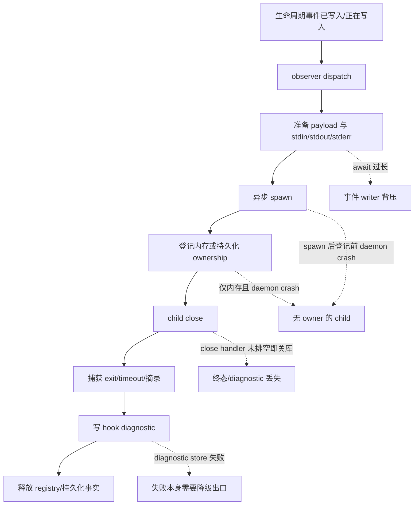
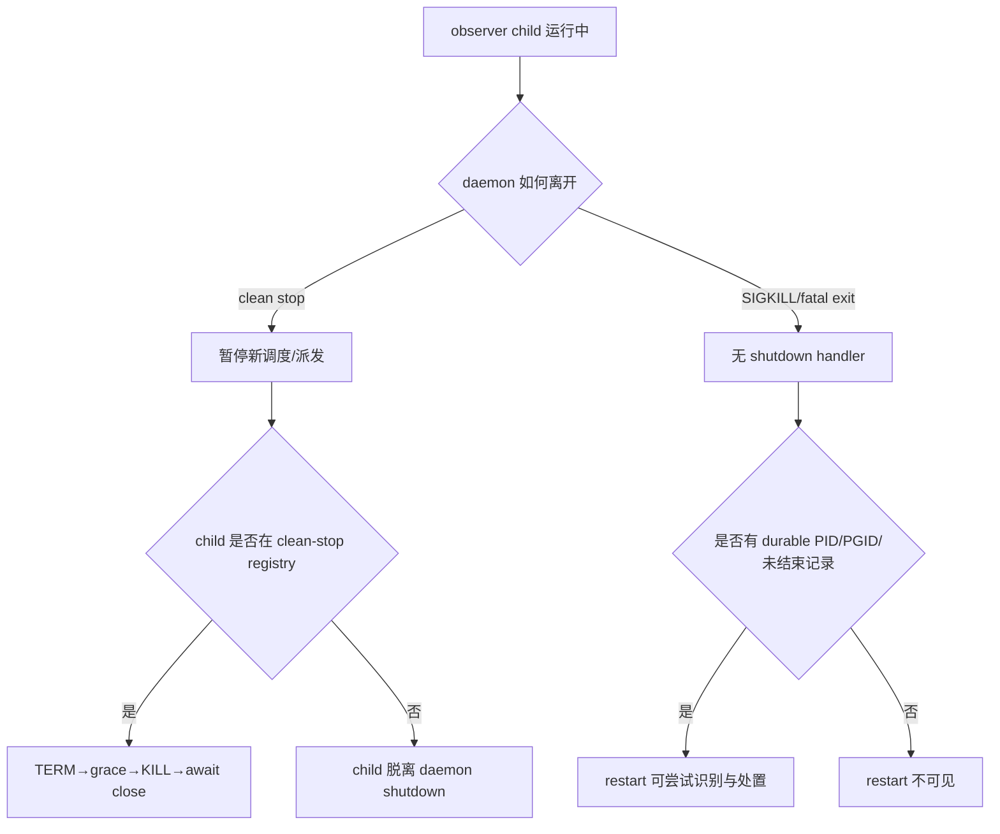

# RFC #543 · R8 observer/process 决策档案

> 决策输入边界：本档案只综合 `09-detail-observer-process-lifecycle.md`、`08-detail-investigation-index.md` 的 R7-PO-01，以及 `aggregation.md` 中与 observer/process 直接相关的稳定条款。未读源码、未运行实验、未实现机制。候选形态是从已证事实推出的可裁决空间，不是推荐或完备枚举。

## A. 一页摘要

### 问题来源

稳定目标要求 observer 订阅生命周期事件，以异步旁路运行，调度不受影响；事件元数据经 stdin 传入；失败只产生 diagnostic；`hook.*` 自反订阅不可表达；主线程不得用 `spawnSync` 执行 observer。声明 ADT、四层装载合并、订阅词表减法与 operator-only 写入已经存在，但当前声明零执行副作用，observer 子进程本身不存在。

R7 调查确认：现有 agent runner 有经过真实进程测试的局部机制资产，却没有 observer 可直接复用的公共 executor。若直接把“异步 spawn”当作完整答案，会遗漏子进程所有权、daemon clean stop、daemon crash、进程组、stdin/stdio、close handler、diagnostic 写失败与持久化之间的因果边界。

### 稳定要求与现状之间的缺口

| 稳定要求 | 当前事实 | 必须裁决或继续调查的缺口 |
|---|---|---|
| observer 异步旁路，不影响调度 | agent child 是异步 spawn；但 observer 尚无 dispatch caller，event writer 内 await spawn/stdio 准备仍可能造成背压 | 派发承诺在哪个边界结束；是否允许排队/丢弃/并发 |
| 失败只记 diagnostic | agent 有 typed lifecycle event 与 persistence-failure fallback 经验；没有 observer diagnostic producer | diagnostic 的最低持久性与写失败处置 |
| daemon 生命周期可收敛 | clean stop 只能看见内存 active-run；crash recovery 只能看见 durable run/PID | observer child 由谁拥有，clean stop 与 crash/restart 各如何处置 |
| timeout/崩溃可回收 | POSIX detached PGID、TERM→grace→KILL→await close 已验证于 agent leader；孙进程仅机制推断，Windows 不足 | observer 是否采用进程组、跨平台保证强度、超时后的完成边界 |
| stdin 传完整 payload | 现有报告未验证 observer stdin、早退 EPIPE、大 payload/backpressure | stdin 写入与“已派发/已失败”的定义需实现后调查验证 |

### 决策地图

本档案提出 5 个工程分叉和 1 个纯口径项：

1. observer child 的 daemon clean-stop ownership；
2. daemon crash/restart 后 observer child 的处置；
3. observer 执行 primitive 的边界；
4. diagnostic 的持久性与失败降级；
5. dispatch/stdio 何时与事件生产者解耦；
6. **P3 纯口径：** 同脚本跨事件/chain 的并发与重入要求。

其中第 6 项不能由当前不存在的 observer 事实推导；操作员需先给需求强度。前五项是工程语义分叉，但部分形态仍受孙进程、Windows、stdin backpressure 和 crash kill-point 证据不足约束。

### 已证可保留、不得误称现有 observer 资产

- 可保留的机制经验：异步 spawn/error 握手、POSIX detached PGID、TERM→bounded grace→KILL、await close、流式摘录、diagnostic persistence 失败不阻止信号动作、shutdown 等 close handlers 后关 SQLite。
- 必须隔离的 agent 语义：slot/current-run/closure、attempt/recycle/backoff、session/credential、item/phase、agent event 名称。
- `SchedulerActiveRun`、startup orphan reconciliation 和 legacy executor 都不是现有 observer executor；未来若抽取公共 primitive，须以 observer 真实调用链重新取得资格。

## B. 问题因果

### B1. 从事件到子进程终态

“异步 spawn”只覆盖 S；稳定目标还要求明确 D/P 是否阻塞生产者、R 的 owner 事实、C/X/G 的收敛和 Q 的清理。现有 agent 路径以多次独立 SQLite transaction 和补偿完成这些步骤，不提供 observer 原子 delivery/retry 语义。

### B2. daemon 停止与崩溃的分叉

clean stop 与 crash/restart 是两个独立裁决，不能用“纳入内存 registry”推导 crash 后也可恢复，也不能用 agent durable run 表推导 observer 已有持久层。

### B3. 进程组与平台条件

- POSIX 当前 agent child 使用 `detached: true`，以 PID 作为 PGID，优先向 `-pid` 发信号，失败退回 leader kill。
- agent timeout/terminate 使用 `SIGTERM → grace → SIGKILL → await close`。
- 现有聚焦测试主要证明 leader 消失；没有显式记录并断言 observer 的 child/grandchild 全部消失。
- Windows 路径只退回 leader kill；孙进程回收保证未证。
- 因而“进程组回收”是可抽取的条件性机制资产，不是已经跨平台成立的 observer 保证。

### B4. 放大条件

以下条件会把局部缺口放大为资源泄漏、重复副作用或调度背压：

1. 脚本 fork 孙进程、忽略 TERM、继承 stdout/stderr；
2. daemon 在 spawn 后、ownership 登记前被 SIGKILL；
3. diagnostic writer 失败且 child 回收等待 diagnostic；
4. child 在 stdin 写入期间早退，或 payload 触发 backpressure；
5. close handler 尚未排空，SQLite 已关闭；
6. 同脚本在多个事件/chain 同时被触发，而并发/重入口径未定义。

## C. 事实基线

### C1. 稳定、不再重设计的要求

1. observer 与 gate 是不同 hook kind；observer 订阅事件、异步旁路，不改变调度结果。
2. observer 收到版本化 stdin payload；引擎不注入 GitHub 业务字段。
3. observer 失败只记 diagnostic，不把失败升级成 gate。
4. `hook.*` 自反订阅已在声明类型层结构排除，未来发射仍须保持零自反派发。
5. observer 执行不得以主线程 `spawnSync` 实现；该红线不等于全仓禁止 `spawnSync`。
6. hook 执行要进入统一事件流；不新增旁路观测通道。
7. 已有声明是“零执行副作用”资产；不得把它描述为已有 child registry、executor 或恢复机制。

### C2. 当前真实进程设施

| 设施 | 已证事实 | 资格边界 |
|---|---|---|
| scheduler agent runner | detached async spawn、spawn/error 握手、stdio 流式写、close handler、TERM/KILL、pending close handlers | 强绑定 run/item/phase/slot/session/backoff，不是公共 observer executor |
| preparation containment | child 已启动时可 abort；run/active row/slot 清理；兄弟继续 | cleanup 模式可参考，agent completion/backoff 不可搬用 |
| daemon clean stop | pause scheduler，terminate 内存 active runs，等 close handler，再关库 | 只能拥有登记在 active-run registry 的 agent |
| startup recovery | 扫 durable 未结束 run/PID，检查 PGID，回收并标 orphaned | observer 无 durable row/PID；不能自动获得此语义 |
| legacy executor | 另有一套 detached group/timeout | 证明相似代码尚未形成公共边界 |

### C3. 已有运行证据及外推限制

- R7 在隔离 fixture 中运行 99 项聚焦测试，覆盖 slow、nonzero、timeout、spawn/preparation failure、clean stop、startup recovery。
- 这些测试都经过 agent scheduler，证明 agent 局部机制，不证明 observer 异步旁路、observer diagnostic 或 observer crash policy。
- kill 断言主要看 leader PID；孙进程矩阵缺失。
- restart 测试证明 agent 可重新调度，不证明 observer side effect 次数或“不重试”。
- timeout 短参数证明信号顺序，不定义 observer 默认 timeout。

## D. 可裁决问题清单

| ID | 问题 | 类型 | 为何现在必须显式 |
|---|---|---|---|
| OP-01 | clean daemon stop 是否拥有并回收正在运行的 observer child？ | 工程分叉 | 不登记则 shutdown 看不见；登记则 shutdown completion 必须等待或截断 |
| OP-02 | daemon crash/restart 后如何对待旧 observer child？ | 工程分叉 | 仅内存 owner 在 crash 后消失；durable owner 会引入恢复与副作用语义 |
| OP-03 | observer 是否共享一个领域无关 subprocess primitive，还是持有独立执行器？ | 工程分叉 | 两套 agent 实现已显示复制风险，但现有边界均被 agent 语义污染 |
| OP-04 | observer diagnostic 的最低持久性及 diagnostic 写失败时的出口是什么？ | 工程分叉 | “失败只记 diagnostic”未说明 diagnostic 本身失败时是否允许丢失、降级或持久重放 |
| OP-05 | 事件生产者与 spawn/stdin/stdio 准备在哪一步解耦？ | 工程分叉 | async child 不等于 dispatch 不背压；event writer 内 await 仍可阻塞 |
| PO-01 | 同脚本跨事件/chain 的并发与重入强度是什么？ | **P3 纯口径** | 当前 observer 不存在，继续观察不能产生产品需求 |

## E. 各问题的事实支持形态、确定后果、触点与未知

### E1. OP-01 · clean-stop ownership

#### 形态 A：observer 纳入 daemon 内存 registry，clean stop bounded terminate 并 await close

**确定后果**

- stop 必须先封住新的 observer dispatch，再对 registry child 执行 TERM→grace→KILL。
- SQLite/event sink 关闭必须晚于 observer close/diagnostic handler 排空。
- slow 或忽略 TERM 的 observer 会把 clean stop 延长到 bounded grace，但不会无限等待。
- 该形态只解决 clean stop；daemon SIGKILL 后 registry 消失。

**触点**

- 现有参照函数/流程：`daemon.stop()`、scheduler pause、active-run terminate、`pendingCloseHandlers`、SQLite close。
- 未来 observer 触点：dispatch 注册/注销、observer pending-close 集合、shutdown admission、hook diagnostic writer。
- 测试触点：运行中 observer + daemon down；TERM 响应、KILL 升级、close 后 diagnostic、关库顺序、孙进程残留。

**仍未知**

- observer grace 是否等同 daemon `shutdownGraceMs`；当前事实不能推导。
- diagnostic 失败是否允许阻止 registry 清除。

#### 形态 B：clean stop 停止新派发，但允许已启动 observer 脱离 daemon 自然完成

**确定后果**

- daemon 不能在关闭 SQLite/event sink 后保证 observer diagnostic 被统一持久化。
- child 若继承 stdio或需要 daemon-owned pipe，daemon 退出会改变其行为。
- 脚本若不自行退出，clean stop 后可能持续存在。
- 该形态与“daemon clean stop 回收所有 child”的 agent 现状不同，但不与“observer 失败不影响调度”直接矛盾。

**触点**

- dispatch stdio ownership、daemon socket/event sink 生命周期、daemon pid/socket cleanup。
- 测试触点：down 返回后的 observer PID、stdio EOF、side effect 与 diagnostic 可见性。

**仍未知**

- 稳定需求是否允许 daemon 退出后仍有 observer 进程；现有材料未裁决。

#### 形态 C：clean stop 等待自然完成至期限，期限后不杀而记录未完成

**确定后果**

- 若期限后 daemon 退出，后果接近形态 B；若 daemon 保持存活，则 shutdown 不再是 bounded completion。
- 需要定义“未完成” diagnostic 写到何处以及数据库何时可关。

**触点与未知**

- 与 A/B 相同；当前事实不足以证明该混合形态满足任何额外稳定需求，若考虑它需继续调查真实 shutdown contract。

### E2. OP-02 · crash/restart policy

#### 形态 A：observer 仅内存 ownership；crash 后不识别、不回收、不重派

**确定后果**

- daemon SIGKILL 后旧 child 可能继续运行；restart 不知道其 PID、是否完成或是否产生副作用。
- 不会因 restart 主动制造 observer 重派；但旧 child 自然继续仍可能晚到地产生一次副作用。
- 无法给出 crash 后资源收敛保证。

**触点**

- 仅 observer 内存 registry；不新增 durable row/startup scanner。
- 测试触点：spawn 后 SIGKILL、restart、旧 leader/孙进程存活、side effect 次数。

**仍未知**

- 操作员是否接受 crash 后孤儿进程；现有稳定条款未给出。

#### 形态 B：持久化 PID/PGID 与未结束事实；restart 只回收旧 group，不重派

**确定后果**

- startup 可尝试 TERM/KILL 旧 child 并清理未结束记录。
- spawn 成功到 PID durable commit 之间仍有不可见窗口；多 transaction 需要补偿。
- 可降低孤儿寿命，但不能判断脚本在 crash 前是否已完成外部副作用；“只回收”不提供 exactly-once。
- 需要 PID/PGID 误杀防护，不能直接复用 agent run row。

**触点**

- future observer durable execution row、spawn 后 PID update、startup reconciliation、PGID probe/kill、cleanup transaction。
- 参照：daemon startup `endedAt=null` run scan、`terminateStaleProcessGroup`、`completeRun`。
- 测试触点：spawn 前/后未登记/登记后/diagnostic 前后四类 kill point，PID reuse/PGID guard、孙进程。

**仍未知**

- observer 记录的稳定 identity 与 retention；本轮无事实。

#### 形态 C：持久化 execution/delivery 事实；restart 回收并按规则重派

**确定后果**

- 引入 delivery/retry 与外部副作用重复问题；现有 agent recovery 不能证明 observer 幂等。
- 必须定义 retry identity、次数/终态、payload 固定性与 diagnostic replay。
- 这超出当前“失败只记 diagnostic”的最低事实，不能由现有材料推出重派是需求。

**触点**

- durable delivery journal、restart consumer、payload persistence/hash、dedupe identity、diagnostic event identity。
- 测试触点：每个 kill point的 observer side effect 次数与最终清理。

**仍未知**

- 是否要求 at-most-once、at-least-once 或只做 best-effort；必须先取得需求，不能想象实现。

### E3. OP-03 · subprocess primitive 边界

#### 形态 A：抽取领域无关 async subprocess primitive，observer 与 agent 分别适配

**确定后果**

- primitive 只能拥有 spawn/error、stdio、detached group、TERM/KILL、close 等过程事实；不得暴露 item/phase/slot/backoff/session。
- agent 现有行为必须通过 adapter 保持；observer diagnostic/ownership 仍在 observer 层。
- 抽取本身不能自动解决 OP-01/02/04/05。

**触点**

- 参照位置：scheduler spawn/waitForChildSpawn、termination/group signal、legacy executor 相似逻辑。
- 未来测试：primitive 的真实 subprocess matrix；agent 回归；真实 observer caller matrix。

**仍未知**

- scheduler 与 legacy executor 的差异是否允许无行为变化抽取；R7 未做此实现级证明。

#### 形态 B：observer 独立执行器，只复制经证实的最小过程顺序

**确定后果**

- 不会把 agent 领域语义泄漏给 observer。
- detached group、timeout、stdio、close 的相似逻辑形成第三套实现，后续差异与修复漂移可预期。
- observer 可以按自己的 ownership/diagnostic 语义最小落地。

**触点**

- observer dispatch/runner 新边界；现有 scheduler/legacy executor不作为直接调用者。
- 测试需单独证明 slow/nonzero/timeout/spawn failure/孙进程/daemon stop/crash。

**仍未知**

- 是否存在足够稳定的共同机制边界；当前事实只证明候选，不证明必须共享。

#### 形态 C：直接复用 scheduler active-run/executor

**确定后果**

- 会把 slot/current-run/closure/attempt/backoff/session/credential/item/phase 或 agent event 语义带入 observer，除非先做实质抽取。
- 这不是事实支持的可接受“直接复用”形态；R7 已明确现有 executor 不具公共边界资格。

**结论边界**

- 若希望“复用”，可裁决对象只能是形态 A 的抽取后 primitive，不能把未来抽取称为现有资产。

### E4. OP-04 · diagnostic durability

#### 形态 A：best-effort 统一事件写；失败仅走 stderr/fallback，不重放

**确定后果**

- child failure 不阻塞回收和调度；这与现有 timeout diagnostic sink failure 不妨碍 kill 的经验一致。
- event store 不可用时，observer failure 可能只在 fallback 可见，统一事件流中缺记录。
- 无 durable retry 状态。

**触点**

- hook event type boundary、observer close/timeout/spawn failure producer、event persistence fallback、stderr。
- 测试：event sink failure + child timeout/nonzero/spawn failure，确认回收继续且 fallback 可见。

**仍未知**

- RFC 的“记 diagnostic”是否允许统一事件流永久缺失；现有措辞未给最低持久性。

#### 形态 B：先持久化 diagnostic intent，再异步发统一事件

**确定后果**

- 可在 event sink 恢复后重放，但新增持久化记录、consumer、去重与清理。
- diagnostic intent 写入自身仍可能失败；仍需最终 fallback。
- 若 close 必须等 intent commit，数据库延迟会延长 observer cleanup，但不必阻塞原调度决策。

**触点**

- future diagnostic intent/outbox、event emission consumer、startup recovery、dedupe identity、retention。
- 测试：commit 前后 crash、重复发射、清理、SQLite close 顺序。

**仍未知**

- 当前材料没有证明 existing outbox 可作为此机制地基；若选择需继续专项调查。

#### 形态 C：将 execution row 终态作为权威 diagnostic，统一事件为派生

**确定后果**

- OP-02 的 durable ownership 与 OP-04 合并到一份记录，但会把“不需要 crash ownership”的选择空间收窄。
- 必须定义 execution row schema、事件派生与 retention；这不是现有资产。

**未知**

- 当前事实不足以列出可信 schema 或证明 execution 与 diagnostic 应同一事务；需要继续调查而非填充字段。

### E5. OP-05 · dispatch 与事件生产者解耦

#### 形态 A：事件 writer 内完成 spawn 握手与 stdin 写入后即返回

**确定后果**

- child 执行本身不被 await，但 spawn、pipe 建立、payload 序列化和 stdin backpressure 会延长事件 writer。
- spawn failure 可在原事件调用栈内立即产生 diagnostic。
- 大 payload/早退 EPIPE 的最坏延迟未证。

**触点**

- 统一 event emission caller、observer subscription lookup、payload builder、spawn handshake、stdin writer。
- 测试：slow child、早退、EPIPE、超大 payload、多个 observer。

**仍未知**

- “调度不受影响”允许多少同步准备延迟；当前没有数值或边界口径。

#### 形态 B：event writer 只入内存队列，由 dispatcher 启动与写 stdin

**确定后果**

- 事件生产者只承担 bounded enqueue；daemon crash 会丢失尚未启动的队列项。
- 需要 queue capacity、overflow 和 shutdown drain/abandon 语义。
- queue worker 的并发又依赖 PO-01。

**触点**

- daemon-owned observer queue/worker、enqueue admission、shutdown、diagnostic on overflow。
- 测试：队列满、daemon down/crash、慢脚本、跨 chain 公平性。

**仍未知**

- queue 容量/overflow 是产品要求还是工程默认；当前事实不足，不能虚构。

#### 形态 C：event writer 只写 durable dispatch intent，由独立 consumer 启动

**确定后果**

- event producer 与 spawn/stdio 完全解耦，并可 crash 后消费。
- 立即引入 delivery、重放、去重、retention 与副作用次数语义，和 OP-02/04 强耦合。
- 现有 agent run 或未调查的 outbox 不能被称为已可用 observer queue。

**触点**

- future durable dispatch store、consumer/startup、payload identity、cleanup。
- 测试：intent commit 前后 kill、重复消费、side effect 次数。

**仍未知**

- durable delivery 是否为需求；若无明确需求，不应由“异步旁路”自动推导。

### E6. PO-01 · P3 并发/重入口径

这是纯产品口径，不是从代码事实自动选择的工程形态。需要操作员明确至少以下强度：

- 同一脚本在不同事件上是否允许同时运行；
- 同一脚本在不同 chain 上是否允许同时运行；
- 同一事件连续触发时，是并发、排队、合并还是跳过；
- 是否需要全局、per-script、per-chain 或 per-subscription 的并发边界；
- 脚本是否被要求自行可重入。

在口径给出前，不应把以下任一项写成既定机制：全局串行、无限并发、固定 worker pool、per-chain mutex、事件合并或 overflow 丢弃。它们都会实质改变 slow observer 的隔离、daemon stop 时间、资源上限和副作用顺序。

口径确定后的工程触点包括：OP-05 queue/dispatcher、OP-01 registry、subscription identity、status/hooks 可见性、slow observer 与跨 chain 测试。当前事实不能列出一个事实优越的候选。

## F. 纯口径与工程分叉

| 项目 | 分类 | 裁决输入 | 不应混淆之处 |
|---|---|---|---|
| 同脚本跨事件/chain 并发与重入 | P3 纯口径 | 操作员需要的隔离、顺序、资源强度 | 不能以 Node 可并发 spawn 或当前 agent slot 推导 |
| clean stop 是否杀/等 observer | 工程分叉，但含产品后果 | daemon 退出后是否允许 child 存活 | 内存 registry 不能解决 crash |
| crash 后回收/忽略/重派 | 工程分叉，重派前需 delivery 口径 | orphan 接受度与副作用语义 | agent orphan recovery 不等于 observer policy |
| 公共 primitive 或独立执行器 | 工程结构分叉 | 能否保持领域隔离与现有行为 | “有相似代码”不等于已有公共 executor |
| diagnostic best-effort 或 durable | 工程可靠性分叉 | “记 diagnostic”的最低可见性 | fallback 可见不等于统一事件持久化 |
| inline handshake、内存队列或 durable intent | 工程派发分叉 | 可接受背压与 crash 丢失 | async spawn 不等于 event writer 零等待 |

裁决顺序不是实现顺序，但存在逻辑依赖：PO-01 会约束 OP-05 dispatcher；OP-02 durable policy 会影响 OP-04/05 是否需要存储；OP-01 与 OP-04 共同决定 shutdown 何时能关闭 SQLite。若这些输入未定，继续扩展 schema、queue 参数或 retry 规则属于想象。

## G. 证据来源与尾部核对

### G1. 证据来源

1. `09-detail-observer-process-lifecycle.md`
   - A：结论、因果链、消费者影响、未知；
   - B2–B5：agent spawn/close/timeout、daemon stop/crash/recovery、事务与并发；
   - B7–B10：根因、放大条件、测试盲区、可保留资产与后续调查法。
2. `08-detail-investigation-index.md:85-90,121`
   - R7-PO-01：同脚本跨事件/chain 并发与重入是纯口径；现状调查不能产出需求强度。
3. `aggregation.md`
   - §一：observer 异步旁路与 stdin payload 的顶层目标；
   - §二：已落地声明/词表/四层合并/operator-only 与零执行副作用；
   - §三：observer、diagnostic 与 hooks 可观测交付标准；
   - §四：无 `spawnSync` 热路径、自反排除、引擎边界等稳定约束；
   - §五：`hook.*` 统一事件流与 observer 自动覆盖新非 `hook.*` 事件；
   - §六：P3 并发/重入仍为显式决策项。

### G2. 未决事实

1. observer stdin 写入期间 child 早退/EPIPE、大 payload/backpressure 的真实行为；
2. observer child/grandchild 的 PID/PGID 与 TERM/KILL 后残留；
3. Windows 孙进程回收能力；
4. observer spawn 前、spawn 后未登记、登记后、diagnostic 前后的 daemon SIGKILL 后果；
5. 若考虑 durable diagnostic/dispatch，现有 outbox 或其他 store 是否有合格地基；
6. 若考虑公共 primitive，scheduler 与 legacy executor 的差异能否在不改变 agent 行为下抽取；
7. 操作员对 P3 并发/重入的需求强度；
8. “失败只记 diagnostic”是否要求统一事件流中的 durable 可见性；
9. daemon clean stop 后是否允许 observer child 继续存在；
10. crash 后 observer 的 delivery 目标是忽略、只回收，还是需要重派。

### G3. 尾部核对

- [x] 只使用指定报告与必要 aggregation 稳定条款；未读源码、未运行实验。
- [x] 区分了现有 agent 机制资产、未来候选机制与 observer 当前缺席事实。
- [x] 每个工程问题列出事实支持形态、确定后果、具体函数/进程/存储/测试触点与未知。
- [x] P3 纯口径与工程分叉分离，未用现状替操作员生成需求。
- [x] 未推荐、未裁决、未估工作量、未拆 issue、未创建 worktree。
- [x] 对事实不足的 durable store/schema、并发参数与跨平台保证明确要求继续调查，没有想象填充。
