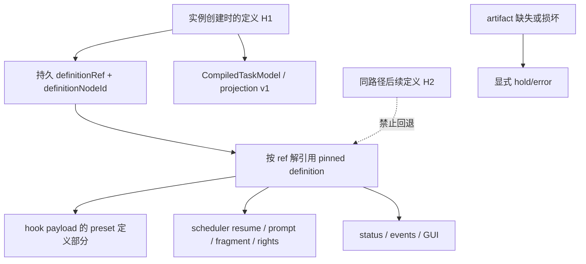
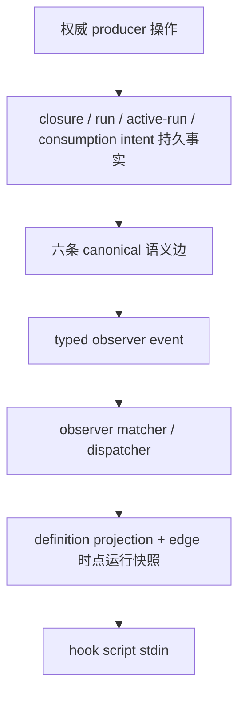
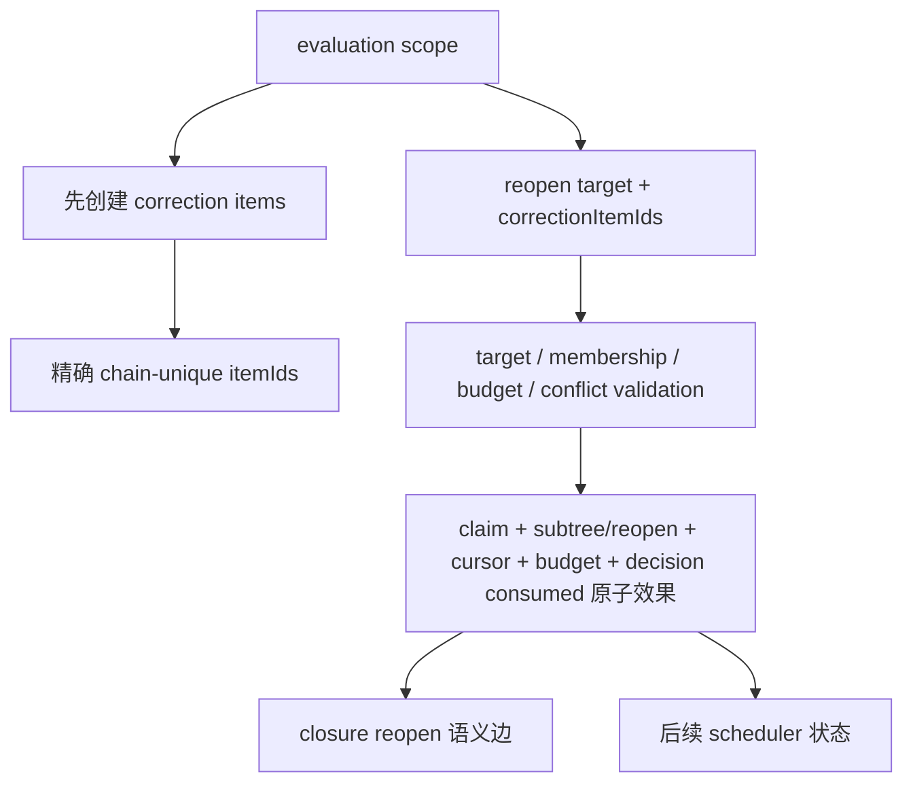

# RFC #543 · R8 external contracts 决策档案

> 基线仅取 `10-detail-pinned-definition-projection.md`、`11-detail-closure-transition-events.md`、`15-detail-reopen-authority.md` 与 `aggregation.md` 中的稳定条款。本文不读取源码、不复做实验，也不把外部冻结契约写成当前实现。
>
> 本档案的目的不是替外部 RFC 裁决，而是把 #543 在 R8 必须面对的接缝压缩成可裁决问题、事实支持的形态及其确定后果。凡现有证据不能区分者均标为“继续调查”。

## A. 摘要

### A1. 三组外部接缝为什么会在 #543 相遇

#543 的稳定 payload 契约要求“编译产物投影 + 运行态快照，不另造第二套 shape”，并要求运行实例沿 pinned `definitionRef` 取得定义；observer 又必须覆盖 RFC-1 的 closure 六条语义转移边；script gate 的 `reopen(target, correctionItemIds)` 还必须消费 target、correction、cursor、budget 四类权威事实。三者不是平行依赖：

1. **定义接缝**决定 hook/gate 在重启和同路径定义变化后看到哪一份 preset、节点和 binding 语义。
2. **转移边接缝**决定 observer 的触发事实来自哪一个权威 producer，以及 payload 中的 closure/run/runtime identity 对应哪个时点。
3. **reopen 接缝**决定 gate 输出的 target 与 corrections 如何被验证、认领并原子变成 cursor/budget/decision/closure 效果；成功效果随后又应成为 closure 的 `reopen` 语义边。

若三者各自取当前最接近的名称拼装，会产生三种假接合：把 hash 当可解引用定义、把五类 `closure.*` 当六条语义边、把 `decided-reopen` reachability seed 或资源恢复当结构化 reopen authority。三份调查均明确排除了这些推断。

### A2. 已稳定、尚未供给、需要裁决

| 接缝 | 已稳定要求 | 当前事实 | R8 状态 |
|---|---|---|---|
| definitionRef → projection | payload 复用 RFC-2 编译投影；运行实例按 pinned ref 同源读取；旧 H1 在路径变 H2、重启后仍为 H1；缺失/损坏不得回退当前路径 | tagged ref、完整 source hash、projection v1、稳定 node identity 已有；完整投影/定义未持久化，无 resolver，scheduler 仍读当前路径；外部承接项仍未落地 | **外部供给阻塞**；物理存储/解析形态是真工程分叉，不能由 #543 代裁 |
| closure 六边 | `create/run-spawn/run-exit/suspend/reopen/consume` 均为 observer-only 转移边，gate 闭集不扩；run 两边允许 active→active | 当前五类 `closure.*` 是操作主题而非六边；create/run 两边没有同构 closure event；DB commit 与 JSONL append非原子 | **producer 契约未落地**；边词表本身无需重裁，权威记录/投影路径仍有工程分叉 |
| reopen 四类事实 | decision 三词闭集；corrections 先创建且 decision 精确引用；claim + target 重开 + cursor/budget + consumed 全有或全无；terminal item 不变 | 四类 shape 分散；只有 item 创建有 mutation ingress；无 decision carrier、target validator、claim、rewind、budget writer或共同事务 | **外部供给阻塞**；target wire identity、budget resolver、claim/journal shape 是真实工程分叉 |

### A3. 本档案提出的可裁决问题

共 **8 个**：D1–D2 为 definition，D3–D4 为 closure，D5–D8 为 reopen。它们只询问现有事实不能唯一确定、且会改变 schema/API/producer/consumer/test 的分叉。事实已经固定的词表、顺序与禁止项不再列为问题。

阻塞 #543 进入实现边界的外部事实有三项：

- RFC-2 的 pinned definition durable artifact + resolver 尚未落地；
- RFC-1 的 closure 六边 canonical producer/record 尚未落地；
- RFC-1 的结构化 reopen decision admission/consumer 与四类事实的原子 authority 尚未落地。

## B. 因果与触发

### B1. definitionRef / projection 因果链

**触发条件：** 同路径内容变化、materialized 目录清理、daemon restart、resume 再渲染、status/hook/GUI 读取、artifact 缺失或损坏。

**当前断点：** compile projection 只在内存/CLI stdout；`execution_definitions` 仅存 identity 四列；task node只存 ref与 definition node id；无 SELECT/resolver。identity continuity 已成立，定义语义 continuity 未成立。

### B2. closure 六边因果链

**触发条件：** closure/create tree 物化、child 真正 spawn、run completion、phase leave、phase enter或结构化 reopen、consume decision/effect；以及每个 DB commit→event append crash 窗口和 consume emit→mark 重放窗口。

**当前断点：** create 有 lazy 与显式 tree 两类 producer；run-spawn 的 durable row早于 OS spawn；run-exit分多次 store write；suspend/reopen 共用 lifecycle event；consume 有 intent/outbox但 event位于 effect 中段。现有事件流不能单独无歧义重建六边全序。

### B3. reopen 四类事实因果链

**触发条件：** gate 返回 reopen、重复/并发 evaluation、correction batch commit后崩溃、target跨 seq或未跑、budget耗尽、daemon restart、decision重放。

**当前断点：** item row能先行原子创建，却无 evaluation/target/claim 关联；target identity域未定；cursor和budget只有初始化/读取 shape；`decided-reopen`只影响 GC reachability且无生产 caller；没有共同 writer。

## C. 基线：无需再裁决的稳定事实

### C1. definition 接缝

1. `ExecutionDefinitionRef` 是 `preset | chain` tagged union；preset identity 来自完整源目录内容 hash。
2. 公共 compile projection 已有 schema version 1 与唯一 canonical model→DTO 投影函数。
3. task node、run、status/event 可连续携带 definition ref 与 definition node id。
4. hook payload 的定义部分必须复用 RFC-2 编译产物投影，不另造 hook 专属 preset shape。
5. 运行实例必须读 pinned definition；缺失/损坏显式 hold/error，禁止读当前源 fallback。
6. 当前 main 只有 identity catalog，没有可复用的 pinned artifact/resolver；“当前路径重新 compile”和 materialized目录均不是 pin。

### C2. closure 接缝

1. 六个语义边名已冻结：`create / run-spawn / run-exit / suspend / reopen / consume`。
2. run-spawn/run-exit 是 attempt 链内 active→active 边；不是 lifecycle 列必须变化。
3. 六边 observer-only；不得扩展 gate 决策点闭集。
4. 当前五类 `closure.*` 不等价于六边：其中 lifecycle_changed合并两个边，resource_prepared跨多种操作，git_failed/reconciled不是边。
5. DB 状态写与 JSONL append目前不是共同原子提交；缺失 event通常不会自动补发；consume event为至少一次窗口。
6. observer dispatcher当前不存在，故现有事件可读不等于 hook 触发供给已完成。

### C3. reopen 接缝

1. decision ADT 固定为 `advance | hold | reopen(target, correctionItemIds)`；point×decision合法组合由 RFC-1 定义。
2. correction 必须先经 evaluation scope CLI 创建，decision 精确引用已存在 IDs；script与agent-phase只在decision通道不同。
3. B4要求的是**效果原子**，不要求公开 API 必须恰好一个函数。
4. target重开、seq cursor回退、既有 terminal item不改写是稳定效果语义。
5. current item ID 是 chain 内唯一的 opaque string；内部 row id 是另一 identity域。
6. current runtime node id、closure id、item id 是不同 identity域，不能互换。
7. cursor的稳定读取 shape是 `next(nodeId) | complete`；budget的稳定持久 shape是 par-local `{count,budgetRef}`。shape存在不等于 authority存在。
8. `decided-reopen` seed只用于closure reachability，既不携带四类事实，也没有decision lifecycle。

## D. 可裁决问题

### D1. pinned definition 的 durable canonical artifact 是什么？

需由 RFC-2 落地事实回答：持久化公共 projection、持久化可重投影的 canonical bundle，还是 content-addressed artifact加位置索引。三者都会改变 schema、hash校验、migration和corruption测试；#543不能把自己的 payload slice 反推成上游存储事实。

### D2. definition resolver 的稳定返回边界与失败 ADT 是什么？

需明确 resolver 返回完整 projection、canonical model、或二者的命名 product；同时明确 missing/corrupt/version-unsupported 的typed failure及 hold/error归属。稳定要求只排除了 fallback，没有确定公开 API shape。

### D3. 六边的 canonical durable record 位于哪里？

需确定 observer消费的是：权威写事务随附的 transition record/outbox，还是由各 producer在commit后形成的统一 typed transition。当前 JSONL主题事件无法补齐create/run边且有crash窗口，因此不能默认为canonical record。

### D4. 六边 payload 的时点与重复身份如何定义？

需确定每边的 authoritative before/after快照时点，以及至少一次路径下用于consumer去重的稳定 identity。尤其 run-spawn 是“running row写入”还是“OS child spawn成功”，consume是“decision commit”还是“effect emitted”，现有事实不同步。

### D5. reopen wire target 使用哪个 identity域？

候选域是 runtime node、closure，或另一个正式 scope identity。稳定语义要求“已跑、同seq、可回退”，但当前 API没有声明 wire target；三者的lookup/predicate和历史兼容后果不同。

### D6. correction item 与 evaluation/target 的 claim 关系如何持久化？

需明确一组已创建 itemIds 如何证明属于某 evaluation、某target且未被另一decision认领，以及重复decision如何得到幂等结果。当前 item/event schema没有关联字段。

### D7. `budgetRef` 的解析来源、版本与耗尽事实是什么？

当前只有非空字符串与count，没有额度值、remaining、resolver或exhausted writer。其是否沿 pinned definition、runtime binding或另一个权威表解析会直接改变 gate/reopen的一致性边界。

### D8. 原子 reopen 效果的持久 journal/transaction 边界是什么？

需明确 claim、tree/cursor、budget、decision consumed、reachability/closure效果如何共享一个提交边界及restart重放证据。B4允许内部多函数，但当前不存在任何共同 writer，无法由已有 immediate transaction能力推导接口。

## E. 事实支持的形态、确定后果、触点与未知

### E1. definition artifact / resolver

| 形态 | 事实基础 | 确定后果 | schema/API/producer/consumer/test 触点 | 未知 |
|---|---|---|---|---|
| 持久化完整 public projection | projection v1已存在且是hook所需共享shape | ref可直接返回版本化DTO；scheduler若需要canonical语义则还需证明projection足够或另有内部解码 | `execution_definitions`需内容/关联；compile成功时writer；ref resolver；scheduler/status/events/hook/GUI；H1/H2+restart、missing/corrupt/version测试 | projection是否可无损驱动prompt/fragments/rights；物理列/blob/artifact位置 |
| 持久化 canonical compiled bundle，读取时调用唯一projection函数 | canonical model与唯一投影函数已存在 | scheduler与payload可同源；reader必须有版本化持久boundary并处理旧bundle升级/拒绝 | definition store schema；compile→bundle writer；resolver product；scheduler与`projectCompiledPreset`；round-trip/hash/version/migration测试 | canonical model中哪些字段可稳定持久；bundle schema version和migration |
| content-addressed immutable artifact + DB identity/index | sourceHash/tagged ref与durable identity catalog已存在 | DB保留引用，artifact单独校验；必须定义commit原子性、GC、missing/corrupt以及跨restart位置 | identity row到artifact locator；artifact writer/resolver/GC；所有ref-first consumers；commit-killpoint、orphan/missing/corrupt、H1/H2测试 | artifact介质、locator是否持久、写入顺序与GC authority |

以上三种都是当前事实允许的工程形态；没有证据允许选出其一。把“当前路径重编译”列为第四形态会违反已稳定的H1/H2与no-fallback要求，因此不是可裁决实现形态。

### E2. closure canonical transition producer

| 形态 | 事实基础 | 确定后果 | schema/API/producer/consumer/test 触点 | 未知 |
|---|---|---|---|---|
| 与权威状态事务同提交的 transition outbox/record | consume已有pending intent先例；现有commit→append窗口已知 | restart可重放，observer可按record identity去重；create/run事实分散时需明确每边在哪笔事务写record | closure/run/active-run/intent旁的record schema；create tree/lazy create、spawn、complete、lifecycle、consume producers；dispatcher；每边killpoint/replay/duplicate测试 | run-spawn采用哪一权威时点；outbox保留/清理策略 |
| 各 producer commit后调用统一 typed transition emitter | 现有scheduler/daemon已在操作后emit typed events | 改动可局部接线，但commit后crash仍可永久缺边；若稳定要求需要durable completeness，则必须另有恢复事实 | 六边ADT/API；所有create/run/lifecycle/consume producers；observer dispatcher；旁路producer覆盖和crash缺失测试 | 缺失是否可接受；如何给重复事件稳定identity |
| 由现有五主题事件加DB查询合成六边 | 当前事件与DB identity均可读 | create/run边存在歧义和缺失窗口，显式createTaskTree无事件；不能保证六边全序或完整重建 | 需要复杂event+DB correlator；跨日志/DB窗口测试 | 没有事实能消除歧义；在稳定“六边真实触发”下应标继续调查而非假定成立 |

第三种仅是当前材料可描述的兼容合成尝试，其确定后果是无法由现有事实证明契约；不能作为“已有能力可复用”。

### E3. closure payload 时点

| 语义边 | 当前最接近的权威事实 | 若选择该时点的确定后果 | 触点 | 未知 |
|---|---|---|---|---|
| create | closure/leaf/run同一lazy transaction；或显式tree import | lazy与显式producer都必须纳入，否则create不全 | tree/lazy producers、transition boundary、observer test | 显式导入非active初态是否产生create及before state |
| run-spawn | running run row；active_runs；OS spawn success | 选前两者会允许“event存在但child未spawn”；选OS success则必须桥接非DB事实与durable identity | scheduler spawn/active-run/event/outbox、spawn-failure/restart test | canonical时点与重复identity |
| run-exit | run completion row、active-run删除、agent.exit append | 多write导致snapshot时点不同；必须固定before/after字段来源 | completeRun/clearCurrentRun/transition producer、killpoint test | 是否要求两write原子化不由本报告决定 |
| suspend/reopen | lifecycle active↔suspended transaction | 可直接依据持久from/to，但结构化reopen未来效果不能由phase-entered冒充 | lifecycle writer、未来reopen consumer、transition event tests | 同态调用是否发边；结构reopen与phase-entered关系 |
| consume | consumed+intent transaction；或外部effect event | 选decision时点可重放但cleanup未必完成；选effect时点至少一次且迟于状态 | consume transaction/outbox/effect/observer tests | payload是decision snapshot还是effect evidence |

### E4. reopen target

| 形态 | 事实基础 | 确定后果 | schema/API/producer/consumer/test 触点 | 未知 |
|---|---|---|---|---|
| `runtimeNodeId` | task tree主键、parent/child/kind、definition identity均持久 | 可直接表达结构节点；仍需lookup、已跑/同seq predicate、legacy校验 | decision boundary；`getTaskNode`/validator；tree reopen writer；nested/cross-seq/legacy tests | “已跑”的权威证据及允许的ancestor/direct-child集合 |
| `closureId` | closure三态、item/phase/leaf关联与资源事实持久 | 直接定位生命周期对象；需反查leaf/seq，且一个结构target是否等同一个closure必须裁决 | decision boundary；closure→node lookup；lifecycle+tree validator；consumed/phase tests | 容器或非leaf target如何表达 |
| 新的正式 scope identity | evaluation scope与结构化target在当前均缺失 | 可把容器/epoch纳入类型，但需新增producer、migration和映射，不能从现有名字派生 | scope schema/API；decision carrier；node/closure mapping；restart/migration/concurrency tests | identity生成、寿命、与runtimeNodeId/closureId基数关系 |

### E5. correction scope / claim

| 形态 | 事实基础 | 确定后果 | schema/API/producer/consumer/test 触点 | 未知 |
|---|---|---|---|---|
| item rows附 evaluation/target/claim 关联 | item在decision前已持久创建且chain唯一 | ownership可随item读取；普通item schema/migration与删除语义被扩大 | items或关联表；item add/batch boundary；decision validator/consumer；batch rollback、orphan、delete、duplicate claim tests | 是否允许普通item后绑定；claim cardinality |
| 独立 evaluation/claim relation引用 itemIds | 四类事实需共同scope而item本身仍可保持普通 | 可在不改变item domain的情况下表达多item集合；必须保证FK、唯一性和decision幂等 | evaluation/claim schema；CLI创建/attach API；reopen transaction；concurrency/restart/orphan tests | relation建立时点、孤儿回收、一个item能否被多scope引用 |
| 仅以 `item.created` event 或调用返回证明归属 | 当前event在item commit后逐条发，失败不回滚 | 不能提供transactional claim或restart authority | event correlator/consumer | 事实已表明不足，不是满足B4的可复用authority |

### E6. cursor / budget / decision effect

| 形态 | 事实基础 | 确定后果 | schema/API/producer/consumer/test 触点 | 未知 |
|---|---|---|---|---|
| 单一store command在一笔immediate transaction内完成全部效果 | store已有统一transaction wrapper，但无对应command | 最直接证明全有或全无；公开surface可能是一条typed command/result | claim/journal、tree/cursor、par budget、decision consumed、reachability/closure writes；crash-before/after、duplicate、conflict tests | command字段与内部更新顺序 |
| 外层service编排多个私有writer但共享一个DB transaction/context | B4只要求效果原子，不要求公开单函数 | 可保留内部职责分层；所有writer必须接受同一transaction且禁止中间外部effect | transaction API、私有writers、post-commit event/outbox；故障注入与可见性测试 | 当前store surface是否允许该组合；外部effect如何延后 |
| 多次独立immediate transactions + restart补偿 | 当前各局部writer即这种能力分布 | 会出现claim/cursor/budget/consumed部分状态；只有新增durable journal与严格恢复状态机才可能证明等价原子效果 | journal schema/state machine、每个step writer、recovery、全部killpoint tests | 补偿是否允许被观察、何种状态算consumed；事实不足，继续调查 |

### E7. budgetRef resolver

| 形态 | 事实基础 | 确定后果 | 触点 | 未知 |
|---|---|---|---|---|
| 沿 pinned definition/binding 解引用 | definition与runtime business binding是既有外部概念，budgetRef当前仅字符串 | H1/H2下预算语义随实例pin，resolver失败可并入definition failure | pinned artifact schema、binding resolver、reopen validator、H1/H2+restart tests | RFC-1/RFC-2是否正式把budget放入定义闭集 |
| 独立运行态budget authority | par row已有count/ref但无额度值 | 可动态调整额度，但需版本/并发/审计真相，且与definition pin分离 | budget table/API、CAS/increment/exhaust、status/event、concurrency tests | 谁写额度、scope与生命周期 |
| 每次由gate脚本自行解释字符串 | gate脚本可有策略，但B4要求engine原子消费budget | engine无法权威判断耗尽或原子increment；不能由现有事实证明满足稳定要求 | script contract与reopen consumer之间缺authority | 不应把策略自由误写成budget authority已供给 |

## F. 事实缺口与工程分叉

### F1. 外部供给尚未落地（阻塞事实，不由 #543 裁决）

1. **RFC-2 pin：** durable definition content、ref resolver、ref-first scheduler/status/events/hook/GUI consumer、missing/corrupt处理均不存在；当前只可复用typed ref/hash/projection boundary等地基。
2. **RFC-1 transition producer：** 六边语义已冻结，但canonical durable record、完整producer覆盖、replay/duplicate identity尚不存在；当前五主题事件不能代替。
3. **RFC-1 reopen：** decision carrier/parser、wire target、scope/claim、target legality、cursor rewind、budget resolution/increment、decision consumed与共同transaction均不存在。

这些是接口供给阻塞，不是“#543再写一个adapter即可”的本地缺口。

### F2. 无需裁决的事实缺口

以下只需等待或核实外部落地，不应升级成新的设计问题：

- #743 当前仍open、main无resolver：待其合流SHA后重新枚举schema/API/consumer即可。
- 当前没有 observer dispatcher：这是 #543 后续执行交付事实，不改变六边词表。
- 当前无 `decided-reopen` producer：不能据此讨论它“应该”承载decision；它已确定不是四类authority。
- 当前测试没有H1/H2、六边全producer、claim竞争、cursor回退、budget耗尽：这是实现缺席的对应盲区，不是新增需求来源。
- current materialization会被prune、status/events只带identity：用于否定“pin已完成”，不要求另裁一套pin语义。

### F3. 真正工程分叉

只有下列问题会在稳定要求内产生多个仍可能成立的实现后果：

1. pinned definition保存projection、canonical bundle还是独立content-addressed artifact；resolver返回边界及failure ADT。
2. 六边采用transactional record/outbox还是post-commit统一emitter；每边的authoritative时点与duplicate identity。
3. reopen target采用runtime node、closure还是新scope identity。
4. correction ownership附item还是独立relation；claim唯一性与孤儿处理。
5. budgetRef沿pinned definition还是独立运行authority解析。
6. 原子效果由单store command、共享transaction内多writer，还是有可证明等价的durable journal状态机完成。

本档案不推荐其中任何一项；凡没有外部正式契约或合流实现证据者均保持“继续调查”。

## G. 证据索引与文件尾部核对

### G1. 证据来源

- definition pin ground truth：`10-detail-pinned-definition-projection.md`，尤其 A1–A4、B2–B7。
- closure transition producer：`11-detail-closure-transition-events.md`，尤其 A1–A3、B2–B5。
- reopen authority：`15-detail-reopen-authority.md`，尤其 A1–A3、B2–B10。
- 稳定目标、关闭验证、裁决与共享契约：`aggregation.md` §一、§三–§六。

### G2. 不得误称为可复用实现

- current-path reload/materialized preset目录不是 pinned definition resolver。
- `execution_definitions` identity row不是definition bundle。
- 五类 `closure.*` 不是六边canonical producer。
- `resourceState:"reopen"`与phase-entered lifecycle activate不是结构化 `reopen(target, correctionItemIds)` consumer。
- `decided-reopen` reachability seed不是decision、claim、cursor或budget authority。
- cursor/budget round-trip shape不是运行writer。
- SQLite immediate transaction能力不是B4共同writer已经存在的证据。

### G3. 尾部核对

- [x] 解释 definitionRef/projection、closure六边、reopen四类事实的因果接缝与触发条件。
- [x] 分离稳定要求、当前事实、外部未落地供给与真实工程分叉。
- [x] 列出 8 个可裁决问题；未推荐、未自行裁决。
- [x] 对事实支持的形态逐项给出确定后果、schema/API/producer/consumer/test触点与未知。
- [x] 未把 enum、hash、identity row、placeholder、round-trip或绿色测试称为可复用的完整能力。
- [x] 未估工、未重拆issue、未创建worktree、未修改产品代码/测试/配置/WORKFLOW。
- [x] 证据不足处标为继续调查。
