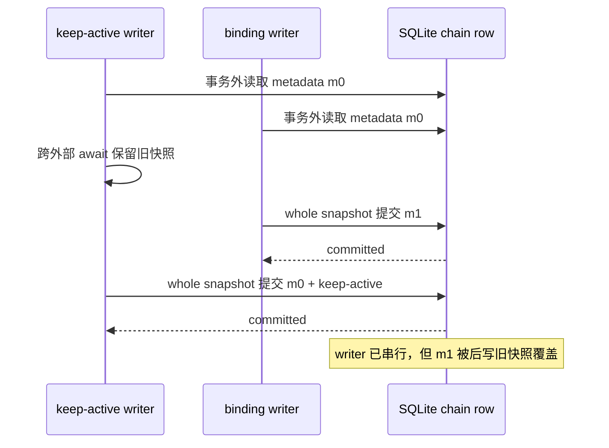
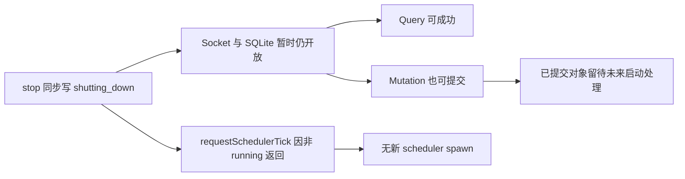
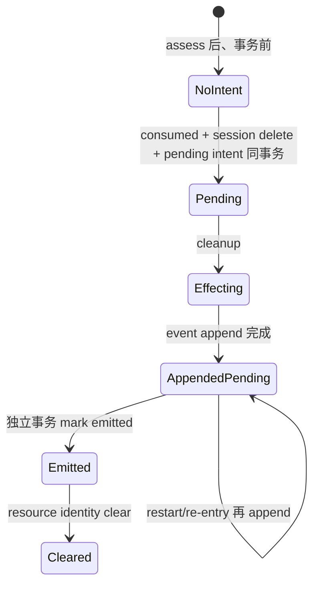

# R8 decision dossier：runtime consistency

> 证据边界：本档案只综合 `12-detail-chain-metadata-concurrency.md`、`13-detail-shutdown-admission.md`、`14-detail-journal-killpoints.md`、`08-detail-investigation-index.md` 的 PO-02，以及 `aggregation.md` 已登记的稳定条款。没有读取源码、补做实验或把专用 closure 先例提升为通用机制。  
> 本档案只建立可裁决面，不作推荐、裁决、估工或 issue 拆分。

## A. 摘要

R8 runtime consistency 有四个相邻但不可混成一个协议的问题：

1. **chain metadata lost update**：两个 writer 从事务外旧快照构造 whole metadata；SQLite 只串行提交，最后一次提交会覆盖先前已提交的子树。需要裁决 stale read 到 commit 的冲突语义。
2. **shutdown admission**：现有 `shutting_down` 窗口允许 query、允许 mutation，但 scheduler 不接受新 tick；因此已经具备“可查 + no-spawn”的机械组合，却不具备稳定的 query-allow / mutation-deny command admission。
3. **decision/effect 与 outbox kill windows**：现有 closure consumption 把主 DB 决定与 pending intent 同事务，但 cleanup、事件 append、mark emitted、resource clear 分属事务外/后续事务。event append 后、mark 前被杀会重放并产生重复事件，现状是 at-least-once，而非 exactly-once。
4. **旧专用历史行**：旧 keep-active 二词/专用 metadata 可能存在，且不能静默解释为新 journal epoch。迁移、忽略或清理属于 PO-02 产品处置口径，不由现状自动推出。

三类裁决必须分开：

- **纯口径**：PO-02 旧历史行处置。
- **工程分叉**：metadata 冲突协议、shutdown command admission 的承载位置、journal/outbox 的 durable state 与恢复入口。
- **仅需证明的缺口**：事务内真实 `SIGKILL`、完整 command 闭集在 shutdown 下的行为、外部 sink durability 等尚未实测事实。

## B. 因果与触发

### B1. metadata lost update

- **问题来源**：通用 whole-record replacement 被 keep-active 专用状态和 operator binding patch 共同复用。
- **直接机制**：事务内虽重读 current row，但传入 metadata 时无条件采用调用方在事务外构造的 replacement；SQL predicate 只有 chain id，没有 revision/旧值条件。
- **触发条件**：两个 writer 都先读旧快照；其中至少一个跨异步窗口；两者按任意顺序提交。
- **确定影响**：后提交 keep-active 可回滚 runner model/bindings/path/hook；后提交 binding snapshot 可删除 keep-active，并可能令相同 completion context 再次触发。两项审计仍可都显示成功。
- **稳定要求边界**：B6/J4 只允许把 WAL、immediate transaction、canonical fingerprint 视为局部地基；fingerprint 与 epoch 正交，专用 keep-active 状态不是 journal epoch。

### B2. shutdown query / mutation / no-spawn

- **问题来源**：daemon lifecycle state 没有进入统一 command dispatch admission；socket 的关闭晚于 tick/run/finalizer drain。
- **直接机制**：`starting` 有前置拒绝，`shutting_down` 没有；scheduler request 另有 `state === running` gate。
- **触发条件**：shutdown 已写 state、socket/store 尚未关闭时到达请求；长 tick、runner termination 或 close handler 会扩大窗口。
- **确定影响**：查询可见真实 shutting-down 状态；mutation 可以成功落 DB；同一 mutation 的普通 tick request 不会产生新 spawn。
- **稳定要求边界**：A5/H3 的 point-local hold 不能等同 daemon-wide pause 或 shutdown；“可查询、mutation 不准入、no-spawn”若成为宿主要求，三个维度都必须被独立表达和验证。

### B3. outbox at-least-once 与 kill windows

- **问题来源**：SQLite、Git 与事件文件跨介质；只有主 DB 决定与 pending intent 在同一 SQLite transaction。
- **直接机制**：cleanup → append event → mark emitted → clear resource；append 与 mark 分离。
- **触发/后果**：
  - assess 后、事务前 kill：无 durable evaluation，重新进入时重新评估；
  - decision transaction 后 kill：consumed + pending 已持久化，cleanup/event 均为 0；
  - cleanup 周围 kill：Git effect 可能 0、部分或已收敛，pending 保留；
  - append 后、mark 前 kill：event 已有 1 条、intent 仍 pending；重放再次 append，最终为 2 条或更多；
  - mark 后、clear 前 kill：不再 emit，但继续 cleanup/resource clear；
  - 全部完成后重入：当前 closure 专用 consumer 静默。
- **恢复入口差异**：active-chain completion 可再次进入 consumer；delete socket 请求没有 startup resume worker；startup reconciliation只收敛 consumed Git residue，不 drain pending intent。
- **稳定要求边界**：J1–J7 是 evaluation state、代次、幂等、journal、恢复与 epoch 正交的新增可靠性面。closure 两态 intent只是可参考的专用先例，不能证明通用 journal、统一 consumer、evaluation identity 或 exactly-once。

### B4. 旧历史行

- **问题来源**：旧 metadata 可跨升级存活；旧 keep-active 专用二词与未来 journal/epoch 语义不等价。
- **触发**：升级后读取到旧专用 carrier，或新 runtime 首次接触含旧字段的 chain。
- **确定约束**：不得静默把旧行当成新 epoch/journal decision。
- **未定后果**：保留、转换或删除会分别改变首次新评估、历史可见性与清理行为；这些后果取决于 PO-02 口径，现有工程事实不能替代裁决。

## C. 基线

| 域 | 已有可保留资产 | 明确不能据此主张 |
|---|---|---|
| metadata | WAL、`busy_timeout`、`BEGIN IMMEDIATE`、异常回滚、typed metadata、canonical fingerprint、migration transaction | 跨 await 的 read-modify-write 隔离、字段合并、CAS、epoch |
| shutdown | 同步写 `shutting_down`、daemon-wide nested pause、tick state gate、finalizing/pending close-handler drain、晚关闭 socket | query-only admission、point-local hold、全 command 统一 lifecycle 语义 |
| outbox | DB 决定 + pending intent 同事务、保存 observation 重放、幂等 mark、可重试 cleanup、延迟 clear、consumed residue reconciliation | 四态 evaluation journal、统一 restart drainer、exactly-once event、evaluation scope |
| history | metadata migration 能保留/重写旧值 | 旧二词等同新 journal epoch、自动选择迁移处置 |

## D. 可裁决问题

### D1. 工程分叉

1. **RC-E01：metadata 冲突语义放在哪里？**  
   是让 mutation 在 store transaction 内基于最新值更新；还是显式 revision/CAS 后由 caller 冲突重试；还是把互不相属的 metadata 资产分离持久化；抑或组合这些边界。裁决必须说明 stale writer 的可观察结果，而不只是声明“使用 transaction”。
2. **RC-E02：哪些 shutdown lifecycle states 对哪些 command class 准入？**  
   至少需要明确 query、mutation、daemon control、new scheduling 四类；还需决定矩阵由统一 dispatch 承载，还是由各 typed command handler 承载。
3. **RC-E03：mutation 被拒绝时的 typed outcome 是什么？**  
   需要明确是否为可重试 lifecycle rejection，以及 response/audit/status 的可见事实；当前材料未给出错误 ADT，继续调查契约面。
4. **RC-E04：future journal 的 durable 边界是什么？**  
   需要明确 evaluation identity、epoch、decision body、effect intent、consumption state分别由哪些表/事务承载；不能直接复刻 closure 两态 intent 名称。
5. **RC-E05：pending effect 由谁在 restart 后推进？**  
   统一 startup/outbox drainer、scheduler point re-entry、command-specific recovery，或其有明确分工的组合，都会产生不同的“无活动 chain/无重复 socket 请求时是否前进”后果。
6. **RC-E06：事件交付契约是否就是 at-least-once？**  
   现有顺序已确定允许重复；若稳定要求只需 at-least-once，则必须携带可供消费端去重的稳定身份并验证重放。若主张更强语义，跨 SQLite/事件 sink 的额外机制及其事实基础均须另行建立；当前材料不足。
7. **RC-E07：cleanup、event 与 journal consumption 的完成关系是什么？**  
   必须裁决哪些失败保持 pending、哪些 effect 可独立重试、何时允许进入 consumed，以及 resource identity 何时清空。

### D2. 纯口径

8. **RC-PO02：旧专用历史行如何处置？**  
   已登记的产品选项只有迁移、忽略、清理。现状只排除“静默等同新 epoch”；选择哪项及升级时/首次读取时执行，必须由操作员口径决定。

### D3. 仅需证明、不是新设计需求

9. **RC-P01：SQLite transaction 指令中真实 SIGKILL 的 WAL/OS 结果。** 需要 deterministic child-process barrier；普通 throw rollback 不能替代。
10. **RC-P02：全部 command 闭集在 `shutting_down` 下的 response/DB/event/spawn 矩阵。** 当前只实测 status、chain list、chain create、item add。
11. **RC-P03：事件 append 返回与真实持久化之间的 durability。** 没有 fsync 协议证据，不能从函数返回推出 crash durability。
12. **RC-P04：外部直接 store writer 与生产历史发生次数。** 仓内入口已穷尽，但外部调用者与历史完整次数未知。

## E. 实现形态、确定后果、触点与未知

### E1. metadata consistency

| 形态 | 确定后果 | 事务 / 表 / command / state / test 触点 | 未知 |
|---|---|---|---|
| **M-A：transaction 内 typed patch**：writer传入领域 patch，store在同一 immediate transaction重读 current并构造新 metadata | 不相交子树更新不再因旧 whole snapshot互相覆盖；同字段冲突仍按事务提交顺序 last-write-wins | `chains.metadata`；通用 write transaction；keep-active persist；`chain.updateBindings`；双连接 barrier测试两种提交顺序 | patch ADT 的字段所有权、删除语义、外部 store caller |
| **M-B：revision/CAS**：row带 revision，update predicate包含预期 revision，冲突显式返回并由 caller重读/重算 | stale snapshot不能静默提交；冲突会成为显式 typed outcome；跨 await 的业务决定是否可安全重算仍由 caller处理 | `chains` revision/schema/migration；`updateChain` command result；keep-active trigger重试边界；binding CLI response；CAS冲突与重启测试 | 重试上限、公平性、外部 effect已执行后是否允许重算 |
| **M-C：资产分离**：keep-active/journal、runner binding等写入各自 typed row/column/table | 不相属 writer不再竞争同一 JSON replacement；每类资产可有独立版本/迁移；跨资产一致读取需要显式 transaction/projection | 新/既有专用表；chain status projection；migration；cleanup；status/query；并发 writer integration | 稳定存储 shape尚未裁；哪些 metadata仍需开放 carrier |
| **M-D：组合边界**：分离高价值 runtime state，并对剩余 carrier使用 transaction patch或CAS | 同时消除专用状态与配置的直接覆盖，并保留剩余 carrier的冲突检测；机制与测试面叠加 | M-A/M-B/M-C全部触点；跨表 transaction；status projection | 是否有需求证明组合复杂度；由后续裁决，本文不判断 |

仅以 daemon-wide mutex 串行调用、tick single-flight或“继续用 immediate transaction”不构成独立有效形态：DI-04 已证明 writer 串行仍会提交 stale replacement。

### E2. shutdown admission

| 形态 | 确定后果 | 事务 / 表 / command / state / test 触点 | 未知 |
|---|---|---|---|
| **S-A：统一 dispatch lifecycle matrix**：typed command class × daemon state在handler前判定 | `shutting_down` 可统一 allow query、deny mutation/control中被裁定的集合；scheduler no-spawn继续由既有 state gate提供；拒绝不会触达DB | command spec闭集；request dispatch；daemon state；typed rejection/audit；18-command矩阵；DB/event/spawn diff | command分类与daemon.down重入语义、错误ADT |
| **S-B：typed handler admission**：每个command spec携带允许state并穷尽匹配 | 每条命令可以不同，但新增command必须显式声明；若无编译/派生守护会产生遗漏风险 | command registry/spec；各handler；state ADT；闭集穷尽测试 | 当前spec能否无平行词表承载；需继续调查声明结构 |
| **S-C：更早关闭 mutation 入口、保留独立只读查询面** | mutation自然不可达，同时查询仍可用；这要求查询面与被关闭的写socket/store生命周期分离 | server/socket生命周期；只读store连接或状态快照；shutdown/status客户端E2E | 现有单socket/单store能否支持；材料不足，继续调查 |
| **S-D：S-A/S-B 准入 + 既有 drain** | 保留晚关闭socket供查询，同时从公共准入拒绝mutation；已进入tick/run/finalizer按既有机制收敛 | dispatch、pause、tick gate、pending close handlers、shutdown integration | 拒绝发生时与正在执行mutation的线性化点 |

daemon-wide pause不是 point-local gate held 的实现形态；它只能作为 shutdown drain 的既有资产。

### E3. journal / outbox / recovery

| 形态 | 确定后果 | 事务 / 表 / command / state / test 触点 | 未知 |
|---|---|---|---|
| **J-A：journal decision + effect intent 同 SQLite transaction，统一 drainer** | restart后即使无原scheduler point或重复socket请求，pending effect仍可被发现；外部 effect仍为at-least-once | future evaluation/journal与outbox表；immediate transaction；daemon startup worker；pending/consumed states；逐kill-point子进程测试 | journal ADT/schema、drainer排序/并发/退避 |
| **J-B：journal持久化，按scheduler point re-entry消费** | active point重入可恢复；没有再次到达该point时不会自动推进 | scheduler决策点；evaluation identity/epoch；chain/item state；restart integration | terminal/delete/无active chain如何恢复；覆盖范围须裁决 |
| **J-C：按command/领域的专用恢复器** | 各effect可利用领域identity收敛；不同入口的恢复保证可能不同 | deletion recovery、completion consumer、resource reconciler、各自intent表/state/test | 如何证明全点无遗漏；不能称统一J1–J7机制 |
| **J-D：at-least-once event + stable delivery identity** | append-before-mark窗口仍允许重复，但消费者可按稳定identity去重；DB不虚称exactly-once | event payload schema；journal/effect id；JSONL append；mark transaction；重复event测试 | sink消费者是否承诺去重、identity生命周期 |
| **J-E：幂等外部effect + pending保留至全部effect确认** | cleanup部分完成可安全重试；identity延迟clear支持定位；event仍需J-D或更强sink协议 | cleanup command、resource columns、pending/error/consumed转移；restart reconciliation | 各effect的真实幂等键与第三方语义 |
| **J-F：跨介质更强交付协议** | 只有建立事件sink的幂等写/事务能力后，才可能把重复对外隐藏；当前事实不支持具体协议 | event sink API、durability/ack、journal consume transaction、crash E2E | sink能力、fsync/ack契约全部继续调查 |

closure consumption只能支持 J-A/J-C/J-E 中的局部形态证据：主状态+pending intent同事务、专用re-entry/reconciliation、cleanup可重试。它不支持把这些形态直接命名为通用 evaluation journal。

### E4. PO-02 历史处置

| 产品处置形态 | 确定后果 | 迁移 / 表 / command / state / test 触点 | 未知 |
|---|---|---|---|
| **H-A：迁移** | 必须显式定义旧字段到新状态的映射；因语义不等价，不能只改名或默认生成可信epoch | schema migration；`chains.metadata`旧carrier；新journal初始state；upgrade fixture | 映射口径、哪些旧值可转换、首次评估行为 |
| **H-B：忽略** | 新协议不消费旧字段；旧字段是否保留为只读历史、是否影响fingerprint必须另定 | parser/projection；fingerprint self-state排除；status/query；upgrade test | 用户可见性、长期残留、首次新评估 |
| **H-C：清理** | 升级或首次读取后旧专用状态消失；不会误当新epoch，但历史信息被删除 | migration/cleanup transaction；metadata rewrite；audit；upgrade/reopen test | 清理时机、审计要求、回滚口径 |

三者都是 PO-02 待裁产品形态；本档案不选择。

## F. 口径 / 工程 / 证明分类

| 分类 | 项目 | 裁决前允许做什么 | 不得做什么 |
|---|---|---|---|
| 纯口径 | RC-PO02；H-A/H-B/H-C | 保留三种处置及确定后果，等待操作员口径 | 从代码便利性推导选择；静默等同epoch |
| 工程分叉 | RC-E01–RC-E07；M/S/J各形态 | 核对每种形态的事务、typed boundary、恢复入口与验收触点 | 推荐、估工、拆issue；把closure先例泛化成契约 |
| 仅需证明 | RC-P01–RC-P04 | 用隔离、可确定性实验或外部调用面审计消账 | 因“应当如此”新增产品机制；用普通throw代替SIGKILL |

## G. 证据与尾部

### G1. 证据索引

| 结论 | 来源 |
|---|---|
| whole-snapshot lost update、两种提交顺序、writer锁等待、崩溃回滚 | `12-detail-chain-metadata-concurrency.md` A、B3–B7 |
| shutdown query成功、mutation成功、spawn不增加、pause/finalizing边界 | `13-detail-shutdown-admission.md` A、B1–B6 |
| closure intent事务、effect顺序、四kill window、at-least-once、恢复入口差异 | `14-detail-journal-killpoints.md` A、B1–B7 |
| PO-02为纯口径；旧专用历史行与新语义不等价；迁移/忽略/清理未裁 | `08-detail-investigation-index.md` C、D1 EX-05 |
| B6 fingerprint、J1–J7 journal/epoch、A5/H3 gate宿主等稳定交付面 | `aggregation.md` §3、§4 |

### G2. 仍需继续调查

1. future journal/evaluation 的最终 ADT、表结构与 typed ingress 尚未由这些材料提供。
2. shutdown lifecycle rejection 的错误类型、audit payload与全部 command 分类尚未提供。
3. event sink 的 fsync/ack/dedup能力未知。
4.真实 SQLite transaction 中间 `SIGKILL` 未有 deterministic fault harness 证据。
5. 外部直接 store writer 与生产历史 lost-update 次数未知。
6. PO-02 的处置口径未裁。

### G3. 尾部核对

- [x] 区分 metadata、shutdown、outbox/journal、旧历史行四个问题，不把它们压成单一协议。
- [x] 记录问题来源、稳定要求边界、因果与触发。
- [x] 列出事实支持的实现形态、确定后果、事务/表/command/state/test触点与未知。
- [x] 区分纯口径、工程分叉与仅需证明的缺口。
- [x] 未推荐、未裁决、未估工、未拆 issue、未实现代码。
- [x] 未把 closure consumption、keep-active fingerprint、daemon pause 等专用先例称为通用机制。
- [x] 事实不足处标为“继续调查”。
