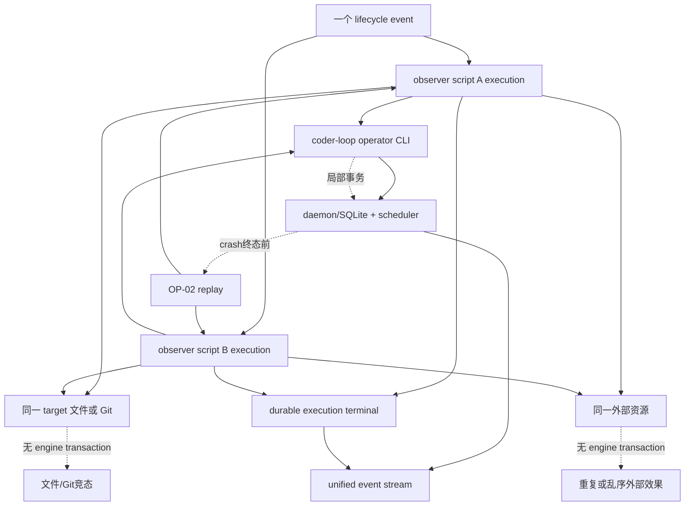

# RFC #543 · R8 补充事实调查：独立 observer 脚本并发副作用

> 调查基线：`/Users/mouriya/Ext/code/coder-loop` main `699842eba2eefc242d19f8fa9232bc1d9d5c3bdd`。本报告只回答 PO-01 暴露的“不同 observer 脚本并发时会共享什么、现有机制保证什么”问题。未实现 observer，未修改产品代码、测试、配置、`WORKFLOW.md` 或数据库，未启动 daemon，未创建 worktree。

## A. 主 agent 摘要（≤1 页）

### 结论

**不同脚本并发不是天然隔离。** observer 的 `script` 只是非空字符串，声明没有 effect/resource key、幂等键、锁域或权限沙箱。按稳定基线，hook 内不带 agent credential 调用 coder-loop CLI 时被识别为 **operator**；operator 是全权控制面身份，而不是自动冲突安全身份。两个脚本因此可能同时触达：

1. 同一 daemon/SQLite 中的 chain、item、queue 与 scheduler；
2. 同一 target checkout、Git index/refs、worktree 管理元数据及普通文件；
3. 同一外部 API、GitHub 对象、消息端点、数据库或其他不可事务资源；
4. 同一 unified event/diagnostic 流及由 observer 终态派生的 diagnostic。

现有保护是**局部的**：

- SQLite 每个 store write 使用 `BEGIN IMMEDIATE` 事务；`batchAdd` 的整批插入原子；item identity 有 `(chain_id,item_id)` 唯一约束；`reorder` 的全链 position 重写在一个事务内。
- daemon 同一 socket 内逐请求排序，但不同 CLI 连接可并行进入 handler；async admission/event/file validation 会形成交错点。
- `item.update` / `reorder` 在真正 store write 前暂停 scheduler，避免 scheduler 与该 mutation 同时推进；这不是两个 operator handler 之间的 mutex。
- operator 请求经过 shape、status、dependency 等领域验证，并产生若干 audit；operator 绕过 agent rights/field grants，且 audit subject 只写 `{kind:"operator"}`，不能区分两个 hook execution。

现有机制**不保证**：

- 不同脚本、同脚本或同一 event 的先后完成顺序；
- 跨多个 CLI 请求、SQLite 与文件/Git、SQLite 与外部服务之间的事务；
- `extraPatch` 等 read/derive/write 复合动作的无丢失更新；
- target 文件、Git index/ref、外部 API 的互斥、幂等或回滚；
- OP-02 crash replay 后副作用恰好一次。旧 execution 可能已完成外部效果但未写终态，重派会再次执行。

### 问题分类

| 分类 | 本轮结论 |
|---|---|
| 已证事实问题 | operator CLI 并发存在局部原子性但无跨请求全局事务；不同 socket 可交错；外部与文件副作用不受 SQLite 事务覆盖；audit 不能区分 hook execution。 |
| 纯口径 | 是否允许不同脚本并发；若允许，稳定 contract 是否明确“脚本作者负责共享资源协调与幂等”。当前不存在的 observer 无法观察出该需求。 |
| 工程分叉 | 若产品口径要求引擎协调，协调域是全局、同 event、同 chain/item、同 script，还是显式资源键；这些形态改变旁路延迟、吞吐和零业务策略边界。 |
| 范围外风险 | 任意两个 operator 脚本可能修改同一第三方对象或任意文件为真，但稳定问题清单未要求通用分布式事务、effect sandbox 或外部 exactly-once；不能据此发明它们。 |

### 恢复 PO-01 需要操作员回答

先只裁决需求强度，不从风险反推机制：

1. **不同 observer 脚本是否允许并发运行？**
2. 若允许，稳定 contract 是：
   - **脚本作者负责**跨脚本共享资源协调与幂等，引擎只提供 execution/delivery identity、payload 与审计关联；还是
   - **引擎必须提供某一明确协调域**（需另行指定域，不能由源码推导）？
3. 无论并发与否，OP-02 重派是否要求脚本以稳定 delivery/execution identity 去重外部效果？若不要求，则 contract 必须接受 at-least-once replay 下的重复副作用。

“两个脚本可能冲突”本身不裁决以上三问，也不推出全局串行。

---

## B. 证据附录

## B1. 调查边界与因果模型



直接机制是 observer 进程具有普通脚本能力，且无 credential 的 CLI 请求进入 operator path。上游来源是同 event 或不同 event 同时匹配多个声明。放大条件包括长脚本、多个 chain、脚本 read-modify-write、共享 checkout、非幂等 API、daemon 在副作用后终态前 crash。消费者影响是队列最终状态、Git/文件一致性、外部重复、audit 可归因性与 replay 结果。

根因集合保持最小：

1. observer declaration 没有 effect/resource model；
2. operator identity 是授权分类，不是并发隔离；
3. SQLite transaction 只覆盖单个 store method；
4. 文件/Git/外部服务不在 daemon transaction 中；
5. OP-02 已选择 replay，外部效果与 execution 终态之间存在不可原子窗口。

## B2. 共享资源矩阵

| 共享资源 / 入口 | 原子性 | 隔离与顺序 | 幂等 | 审计 | 失败、重试、crash replay |
|---|---|---|---|---|---|
| `item.add` | 单次 `createItem` 是 SQLite immediate transaction；identity unique | 同 socket 排序；不同 socket handler 可交错。重复同 id 最终一个成功、一个 conflict | 仅同 `(chain,itemId)` 的重复被 unique 抑制；换 id 会新增 | rights admission + `item.created`；hook operator 都显示 operator | DB commit 后 audit 前 crash 可有 item 无对应 created event；observer replay 再 add 同 id 会 conflict，不等同业务幂等成功 |
| `item.batchAdd` | `createItems(inputs)` 整批一个 transaction，批内全成/全败 | 前置 preset/rights/dependency 检查在 transaction 外，可与其他请求交错 | 批内 duplicate 拒绝；与并发 add 由 unique 决胜 | 每个已创建 item 逐条 append，事件之间可有其他 handler 交错 | transaction commit 后逐条 audit；crash 可留下完整 batch、部分 audit；重派整批可能 conflict |
| `item.update` | 最终单 row update 是 immediate transaction | handler 先读 item，再 await admission/validation，最后 pause scheduler/write；不同 operator handler无互斥 | 无 request/delivery id；same-value 写偶然幂等，status/extra 业务语义不普遍幂等 | caller/field/status admission 与 status audit；subject 不能区别两个 hook execution | `extraPatch` 基于 handler 早先读取的 `item.extra` 合并，两个并发 patch 可后写覆盖先写；replay 可重复状态或覆盖更新后的字段 |
| `item.reorder` | 单链全部 positions 在一个 immediate transaction 中重算 | 每次重排自身原子；多个重排按实际 transaction 获取顺序成为 last-writer ordering，不保留触发 event 顺序 | 重排同一目标到同一 position通常结果相同；与另一重排组合不交换 | `item.reordered` 在 transaction 后写 | commit 后 audit 前 crash；重派会再次基于当时新顺序执行，结果可能不同 |
| chain/queue/privileged CLI | 各 handler/store 方法各自边界 | operator 可调用 hard-deny-for-agent/per-phase surfaces；没有 hook 专属缩权或跨命令 transaction | 逐命令而异 | privileged admission记录 operator，但无 hook execution identity | 一组命令中途失败会留下前缀效果；replay 重走整组 |
| scheduler | mutation handler 可 pause 并等待 in-flight tick | pause depth阻止 scheduler，不是 operator request mutex；add 在 commit 后 queue tick | 不提供脚本级幂等 | scheduler/queue有自身 event | 两脚本的多步 CLI 流程之间 scheduler 可在各请求完成后推进 |
| target 普通文件 | 单个 syscall能力取决于脚本写法；引擎不包装 | 无引擎锁、路径 ownership 或 snapshot | 取决于脚本 | 默认无统一细粒度文件 effect audit | 部分写、rename窗口、replay重复均由脚本/工具决定 |
| target Git checkout/index/refs | Git 单个命令有自己的 lockfile/原子 ref 规则 | 同一 checkout 的 index/worktree内容可互扰；不同命令序列无跨脚本 transaction | commit/ref操作语义各异 | coder-loop unified stream不自动记录任意 Git effect | lock contention、dirty tree、错误 base、重复 commit/push；replay可能再次 push/评论 |
| coder-loop worktree 管理元数据 | 现有 scheduler closure有自己的领域流程 | observer 不是 slot/closure owner；不得推导其拥有隔离 worktree | 无 observer保证 | agent/closure audit不等于 hook audit | 本 RFC 禁止为调查创建 worktree；稳定 observer也未声明每 execution 分配 worktree |
| 外部 API / GitHub / DB /消息 | 由远端系统的单请求语义决定 | 无跨服务 transaction、锁或统一顺序 | 只有脚本使用远端 idempotency key/compare-and-set 时才可能成立 | daemon最多记录 hook execution终态，不自动知道远端对象变化 | timeout/未知提交结果 + OP-02 replay 是典型重复窗口 |
| unified event JSONL | 每次 append一行；async writer执行 mkdir/rotate/append 三步 | 无显式 append mutex；不同 producer await 次序和完成次序不构成稳定全序 contract | 无 event dedupe | 文件本身是审计面；写失败降级 stderr | rotation/append失败可缺事件；hook diagnostic按 OP-04从 execution终态派生，但派生规则尚未闭合 |
| observer execution/diagnostic | OP-04选定 durable terminal为权威；schema尚不存在 | execution之间尚无顺序/锁定义 | OP-02要求重派，但 retry identity/次数未裁决 | 未来应能以 execution/delivery事实归因；现有 operator CLI audit尚无该关联 | crash kill-point可导致外部效果已发生、terminal未写，恢复后重派 |

## B3. 入口与调用链事实

### B3.1 声明没有冲突域

`ObserverHookDeclaration` 只有 `kind/point/script/timeoutMs`；parser只验证已知 event、非空 script、正 timeout。没有 concurrency、resource、effect、identity 或 ordering 字段（`src/hook-declarations.ts:29-34,60-65,103-116`）。

有效视图保留 `global → chain → preset → item` 层顺序与各数组顺序（`src/hook-declarations.ts:138-145`）。这只证明**声明枚举顺序**；当前没有 dispatcher，未来即便依序 spawn，OP-05 已裁决的“spawn/stdin后即返回、不等 child”仍不能推出 child completion 或副作用顺序。

### B3.2 CLI connection 只在连接内串行

daemon 为每个 socket 建立独立 `requestSequence`，同一连接的 newline request 逐个 `handleLine`；该 promise chain 是 `acceptConnection` 局部变量（`src/daemon.ts:1660-1693`）。两个独立 observer 脚本各起 CLI 通常建立不同 socket，因此会各自拥有 request chain，并可在 handler 的 `await` 处交错。`handleRequest` 本身只运行 auth gate再调用 handler（`src/daemon.ts:1919-1930`），没有 daemon-wide request mutex。

### B3.3 operator admission 的含义

`resolveItemMutationCaller` 在请求没有 `agentCredential` 字段时返回 `{kind:"operator"}`（`src/daemon.ts:3934-3957`）。`item.update` 的 operator caller仍记录 caller admission（`src/daemon.ts:4027-4071`）；字段 rights gate对 operator“always allow”。因此：

- admission可拒绝 malformed request、非法 status、坏 dependency等；
- admission不判断两个 operator脚本的业务意图是否冲突；
- audit subject无法仅凭 `{kind:"operator"}`区分脚本 A/B 或原 event/delivery；
- “operator全权”不得改写成“operator并发安全”。

### B3.4 SQLite边界

所有 store `write` 用 `db.transaction(fn).immediate()`（`src/sqlite-state.ts:1605-1612`）。这提供单 store method 的原子提交/回滚与 writer序列化，不覆盖 handler 在 transaction 前后的 await，也不覆盖脚本的多个 CLI 请求。

- `createItem`单条事务，`createItems`整个 inputs map 同一事务（`src/sqlite-state.ts:1739-1743`）。
- items 表以 `(chain_id,item_id)` unique（`src/sqlite-state.ts:559`）。
- `updateItem`在 transaction 内重新读取 current，再把给定 `input`覆盖到 row（`src/sqlite-state.ts:1762-1804`）。但 daemon 的 `extraPatch` 已在 transaction 前基于早先 resolved item 合并（`src/daemon.ts:3185-3193`），因此两个不同 key 的并发 patch也可能各携带旧完整 extra，后提交者覆盖前者。
- `reorderItem`在同一 transaction读取全链顺序并重写所有 positions（`src/sqlite-state.ts:1806-1828`）。它避免半条队列，却不保存两个并发重排各自期望的事件顺序。

### B3.5 scheduler pause不是脚本锁

`item.update`与`item.reorder`在最终 write 前调用 `pauseSchedulerForMutation`（`src/daemon.ts:3194-3196,3260-3262`）。pause只增加 depth、停 timer并等待 `schedulerTickInFlight`，resume在 depth归零时恢复（`src/daemon.ts:3646-3662`）。它防 scheduler 与 mutation 的特定竞态；两个 caller都可取得 pause depth并继续，不形成相互排斥。

### B3.6 event与diagnostic

async event append依次 `mkdir → rotate → appendFile`，没有显式互斥队列（`src/observability.ts:923-936`）。本报告不声称现有 JSONL 必然损坏；可证的是源码没有为不同 async producer提供声明的全局顺序/rotation critical section，因而不能把 append调用或 hook声明顺序提升为稳定副作用顺序。

OP-04已裁决 future observer execution terminal是权威 diagnostic，统一 `hook.*` event从它派生；OP-02已裁决 crash后回收旧 group并重派。尚未裁决的 execution schema、派生事务、retry identity/次数与去重规则正是跨脚本审计和 replay 的缺口。

## B4. 逐类副作用的竞态机制

### B4.1 item add / batch add

两个脚本新增同一 item id时，unique constraint使最多一个 commit；失败者获得 conflict。这是**一致拒绝**，不是幂等成功：脚本若把 conflict当失败，execution终态与重派策略可能继续触发；也不能确认 existing item内容等于本次意图。

两个不同 add可都成功，其最终 position/queue观察顺序取决于实际 commit。`batchAdd`只保证本 batch插入全有或全无；其前置检查与 transaction后逐条 `item.created` audit不在同一事务。故另一个请求可能在检查后先写，或在 batch commit后、全部 audit写完前完成。

### B4.2 item update

单 request没有 partial row write，但 handler是 read/validate/derive/transaction：

```mermaid
sequenceDiagram
  participant A as Script A
  participant B as Script B
  participant D as daemon handler
  participant DB as SQLite
  A->>D: extraPatch {a:1}
  D->>DB: read extra {base:true}
  B->>D: extraPatch {b:1}
  D->>DB: read extra {base:true}
  D->>DB: write {base:true,a:1}
  D->>DB: write {base:true,b:1}
  Note over DB: each write atomic; a:1 can be lost
```

同理，status admission针对handler早先读取的 item/phase/status事实；后续另一个 mutation可能改变状态。现有验证仍会限制字面量与declared exit，但没有 compare-and-swap版本字段证明“我更新的就是刚验证的版本”。

### B4.3 reorder

每次重排不会留下重复/间断 position；两个重排的组合按获得 SQLite write transaction的顺序生效。因为“将 X 放到 position n”依赖当时全链顺序，A→B与B→A可不同。现有 audit记录各请求的position，不记录调用者期望的前置队列版本。

### B4.4 文件、Git、外部服务

observer是脚本声明而非受限effect DSL。稳定基线还要求引擎零GitHub/业务策略，因此引擎不知道：

- 两条路径是否同一逻辑文件；
- 两个Git命令是否操作同一index/ref；
- 两个HTTP请求是否修改同一issue、deployment或消息；
- 哪个远端支持idempotency key、ETag或transaction。

Git自身的lockfile能使某些同时写index/ref的命令之一等待或失败，但不把“读文件→编辑→commit→push”变成跨脚本事务。普通文件和外部API也不会因SQLite immediate transaction获得保护。

这些风险可以由脚本使用原子rename、`flock`、独立checkout、Git ref CAS、远端idempotency key等缓解，但本轮只登记能力边界，不把任何具体做法规定为RFC要求。

## B5. 同一 event 的 dispatch 与不同 event

应区分三种顺序：

1. **effective declaration order**：当前view确定 global/chain/preset/item数组顺序；
2. **spawn/stdin handshake order**：OP-05只要求event生产路径内完成启动和stdin写入；
3. **副作用/完成顺序**：child后续不await，取决于进程调度、I/O与外部服务。

即便未来dispatcher严格按view顺序对A完成spawn/stdin再对B完成spawn/stdin，A仍可能晚于B产生副作用。不同event还可能由不同event producer并发进入；当前没有per-event、per-script或per-chain execution lane。

因此“按声明顺序启动”与“脚本串行/副作用有序”是不同contract，不能互相替代。

## B6. OP-02 replay 的重复窗口

已裁决的replay至少存在这些事实窗口：

| crash点 | durable execution可能看到 | 外部世界可能看到 | restart重派后 |
|---|---|---|---|
| spawn前 | pending | 无 | 首次执行 |
| spawn/stdin后、副作用前 | running | 无 | 旧group被回收，再执行 |
| 副作用commit后、terminal前 | running | 已有一次效果 | 再执行，可能重复 |
| terminal写后、diagnostic派生前 | terminal | 已有效果 | 是否仅重派diagnostic尚未裁决；不应重跑script |
| 多步副作用中途 | running | 前缀效果 | 全脚本重跑会重复前缀并继续 |

本地SQLite不能与任意外部服务原子提交terminal。即使不同脚本完全串行，crash replay重复仍存在；所以“禁止不同脚本并发”不解决OP-02的幂等问题。

稳定 execution/delivery identity可以给脚本和audit提供相关键，但identity本身不会让外部effect自动幂等。是否把“脚本必须消费稳定identity并自行去重”写成contract，仍是操作员口径。

## B7. 稳定 RFC 要求与范围控制

### 已有要求可追溯

- observer异步旁路，不改变调度决策；
- hook内以operator身份调用CLI；
-引擎零策略业务语义；
- OP-01 bounded clean-stop ownership；
- OP-02 durable execution/delivery、回收并重派；
- OP-04 terminal为权威diagnostic；
- OP-05事件路径只等spawn/stdin，不等child完成。

“是否跨脚本协调”尚不能追溯到一个已裁决要求。若新增全局串行，会直接改变异步旁路的吞吐、event producer的spawn等待、shutdown待回收集合和不同chain隔离；若新增资源键，会让引擎承载脚本作者声明的effect taxonomy。两者都必须来自明确需求，而不是风险存在本身。

### 范围外但需登记

- 通用跨SQLite/Git/HTTP transaction；
- 自动推断脚本读写集；
- 任意外部服务exactly-once；
- operator脚本沙箱/能力系统；
- 为每个observer自动创建worktree；
- 基于GitHub对象的引擎内锁。

以上可能有价值，但稳定问题清单没有要求；本报告不建议、不估工、不拆issue。

## B8. 可保留资产

1. hook declaration ADT、observer point结构减法、effective layer/provenance顺序。
2. daemon typed caller/admission与operator/agent区分。
3. store `BEGIN IMMEDIATE`单method事务、batch insert事务、item identity unique。
4. item mutation时scheduler pause机制（资格仅为scheduler隔离，不升级为caller锁）。
5. unified typed audit/event stream。
6. OP-02/04将execution/delivery与terminal设为未来审计相关事实的裁决。

它们都不能单独证明跨脚本冲突安全。

## B9. 未知与确定方法

| 未知 | 为何源码不能回答 | 确定方法 |
|---|---|---|
| 不同脚本是否允许并发 | 产品强度，不是当前实现事实 | 操作员裁决PO-01 |
| 若允许，引擎或脚本谁承担协调 | 信任/责任边界 | 操作员裁决contract |
| 同event多个observer启动顺序是否稳定 | dispatcher不存在 | 实现spec固定后，真实observer integration记录spawn/stdin时间 |
| execution/delivery identity、retry次数 | OP-02只选了形态 | 后续R8裁决 |
| audit如何关联operator CLI到hook execution | 当前CLI无hook credential/correlation | 设计后验证每次CLI audit carries correlation或明确不提供 |
| JSONL并发rotation是否可保持完整/顺序 | 无显式writer mutex，未做跨日边界实验 | 不创建worktree的隔离eventsFile并发append/rotation测试；实现前不把结果当observer保证 |
| 外部effect是否幂等 | 每个脚本/服务不同 | 脚本契约与目标服务真实API实验 |

## B10. 最小实验与本轮为何未运行

本轮未运行实验。当前生产代码明确没有observer dispatcher/execution，任何“两个hook脚本并发”实验都只能由调查者自造调度器，无法证明未来产品语义。现有daemon CLI fixture若覆盖真实queue则还需构造preset/chain/item；源代码已足以证明transaction、socket和admission边界，不需用合成时序重复证明。

实现后最小、且不得创建worktree的隔离实验应为：

1. 独立loop-data-root/SQLite，预建不触发runner的chain/items；
2. 两个observer barrier脚本并发从不同CLI connection执行：
   - same-id add与different-id add；
   - disjoint `extraPatch`；
   - 两个reorder；
3. 记录request start/end、DB row、queue order、audit subject与event顺序；
4. 文件实验只写隔离目录，以barrier制造read-modify-write丢失；
5. 外部effect用本地可持久计数fixture，不调用真实服务；
6. 在effect计数递增后、execution terminal前kill隔离daemon，重启验证OP-02重复；
7. 全程确认没有worktree、中央daemon、生产DB接触。

## B11. 测试同错与盲区

- hook declaration/effective view测试只能证明解析与数组顺序，不能证明执行顺序或冲突隔离。
- SQLite store unit若逐调用测试，只证明单transaction，不证明不同socket handler的read/await/write交错。
- 两个请求最终都返回成功，不证明disjoint patch都保留、外部effect只发生一次或audit可归因。
- 只测同item add conflict会高估保护；unique不覆盖update、files、Git与external API。
- 只测daemon clean stop不覆盖OP-02 crash replay。
- 用同一CLI socket批量发请求会被`requestSequence`串行，掩盖不同observer各自连接的真实并发。
- 用agent credential测试会触发item/phase rights与wrong-item保护，不能代表hook operator身份。
- 用engine integration harness可能创建worktree，违反本调查边界；不得使用。

## B12. 证据索引

| 事实 | 证据 |
|---|---|
| observer声明无resource/concurrency字段 | `src/hook-declarations.ts:29-34,60-65,103-116` |
| effective view只有layer/array顺序 | `src/hook-declarations.ts:138-145` |
| per-socket request sequence | `src/daemon.ts:1660-1693` |
| handler仅auth gate后dispatch，无全局mutex | `src/daemon.ts:1919-1930` |
| 无credential即operator | `src/daemon.ts:3934-3957` |
| operator caller admission | `src/daemon.ts:4027-4071` |
| add commit后才写created audit | `src/daemon.ts:2910-2937` |
| batch前置检查、单batch commit、逐条audit | `src/daemon.ts:2940-2998` |
| update extraPatch在transaction前合并 | `src/daemon.ts:3185-3196` |
| reorder transaction后写audit | `src/daemon.ts:3250-3277` |
| scheduler pause语义 | `src/daemon.ts:3646-3662` |
| store immediate transaction wrapper | `src/sqlite-state.ts:1605-1612` |
| item unique identity | `src/sqlite-state.ts:559` |
| createItems整批transaction | `src/sqlite-state.ts:1739-1743` |
| updateItem单row read/write transaction | `src/sqlite-state.ts:1762-1804` |
| reorder全链单transaction | `src/sqlite-state.ts:1806-1828` |
| async event mkdir/rotate/append，无显式critical section | `src/observability.ts:923-936` |
| OP-02/04/05已裁决摘要 | `WORKFLOW.md:427-430` |

## B13. 尾部核对

- [x] 只调查独立observer脚本并发副作用与PO-01阻塞面。
- [x] 区分原子性、隔离、顺序、幂等、审计、失败/重试与crash replay。
- [x] 覆盖item add/batch/update/reorder、target文件/Git、外部资源、event/diagnostic。
- [x] 未把operator全权误写成自动冲突安全。
- [x] 未从风险推出全局事务、串行或资源锁。
- [x] 区分事实问题、纯口径、工程分叉与范围外风险。
- [x] 未裁决、推荐、估工或拆issue。
- [x] 未修改产品代码/测试/配置/`WORKFLOW.md`/数据库。
- [x] 未启动或修改中央daemon，未创建worktree。

