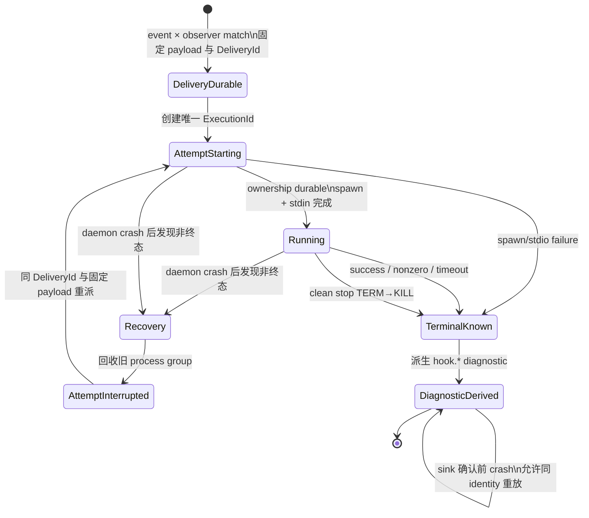

# RFC #543 · R8 observer/process 裁决汇合

> 输入边界：本报告只读 `16-decision-dossier-observer-process.md`、`19-detail-independent-hook-concurrency.md` 的摘要与结论、`aggregation.md` 稳定条款和 `WORKFLOW.md` 已登记裁决。未读源码、未运行实验、未实现代码、未创建 worktree。本文收敛 expected foundation 的最弱结果合同，不指定物理 schema，也不把外部 effect 去重重新变成操作员问题。

## A. 摘要

observer/process 域的操作员可见分叉已经闭合，剩余操作员裁决为 **0**。

已裁内容可以收敛为一个不承诺 exactly-once 的 durable at-least-once 合同：每次事件匹配产生独立、持久且有稳定 identity 的 delivery；每次真实进程启动是该 delivery 下一个独立 execution attempt。daemon crash 后，非终态 attempt 先按已登记进程组回收并记入权威终态，再以同一 delivery、同一固定 payload 创建新 attempt。已知的普通终态——包括成功、非零退出、spawn 失败、timeout、clean-stop 强制终止——只产生 diagnostic，不自动重试，也不改变调度结果。只有 crash/restart 留下的非终态 attempt 触发恢复重派；反复 crash 可产生多个 attempt，系统不承诺执行次数上限、完成顺序或外部副作用恰好一次。

execution 终态是 diagnostic 的权威事实；统一 `hook.*` diagnostic 是该事实的可重放派生。派生可重复，消费者依靠稳定 identity 关联或去重；派生失败不得反过来改变调度、重跑一个已经有权威终态的脚本或阻止进程回收。`hook.*` 继续被 observer 订阅类型结构排除，因此 diagnostic 派生不会形成自反派发。

payload 固定性与 identity 生命周期不是新的产品选项，而是 OP-02/OP-04 所选 durable recovery 语义成立的必要条件。delivery identity 在一次事件匹配到该 delivery 终态期间保持不变；每次进程 attempt 有独立且不可变的 execution identity，并链接到 delivery；所有 recovery attempt 获得同一份版本化、pinned payload。持久化整份 payload、artifact reference 或其他等价表示属于实现选择，但不得在 replay 时重新读取可漂移运行态并把它冒充同一 delivery。

外部文件、Git、服务、数据库及跨脚本 effect 明确不属于引擎兜底范围。不同脚本以及同一脚本跨事件、跨 chain、连续触发均可并发；每个匹配独立投递，不合并、不跳过、不承诺完成或副作用顺序。脚本作者承担可重入、共享资源协调和外部幂等；引擎只提供自身 durable 状态、stable identity、固定 payload、局部 CLI 事务与审计关联。

## B. 逐项决议

### B1. clean stop

- daemon 先停止接纳新的 observer dispatch。
- 已运行 attempt 进入 bounded drain；期限后按 process group 执行 TERM→KILL，并等待 close/回收完成。
- execution 终态与其必要的 diagnostic 权威事实完成后，才关闭 SQLite/event sink。
- clean stop 是已知的引擎终止结果；最弱合同不把它升级成下次启动必须 replay 的 retry intent。

这只规定正常停止。grace 数值、TERM 与 KILL 间隔、多个 child 的具体遍历方式属于实现参数，但必须保持总停止时间有界并证明不残留已拥有的进程组。

### B2. crash/restart recovery 与 retry/terminal

重启恢复只处理 durable 状态中仍非终态的 attempt：

1. 识别同一 delivery 下的非终态 execution 及其已登记 process-group ownership；
2. 回收旧 group，并把该 attempt 收敛为可审计的恢复/中断终态；
3. 以同一 delivery identity 与同一 payload 创建新的 execution attempt；
4. 新 attempt 到达任一已知终态后，delivery 收敛，不因脚本业务失败自动再试。

因此 retry 强度的最弱闭合是：

- **会重派：** daemon crash 留下的非终态/结果不确定 attempt；每次 restart recovery 至多为该未决状态启动下一 attempt，若再次 crash 可再次恢复。
- **不会因本 RFC 自动重派：** nonzero、spawn error、timeout、clean-stop termination 或其他已经形成权威终态的结果。
- **无额外 retry budget/backoff：** 不新增常驻全局重试队列、失败次数阈值或业务失败重试政策。反复 crash 所产生的 attempt 数不作有限上界承诺。
- **delivery guarantee：** 引擎保证至少发起一次可审计 attempt，并对 crash 后仍非终态的 delivery 恢复投递；不保证脚本成功，不保证最多一次，也不保证外部 effect 只发生一次。

“旧 group 回收后再重派”要求实现关闭 spawn、ownership durable commit 与脚本开始执行之间的无主窗口。具体采用何种启动握手或持久化协议是实现问题，但在 kill-point 证明覆盖前，该 expected foundation 仍未取得资格；不能以普通 spawn 后补写 PID 的最佳努力冒充已满足裁决。

### B3. subprocess primitive

抽取领域无关 async subprocess primitive，其职责只包含：spawn/error 握手、stdin/stdout/stderr、detached process group、timeout、TERM→KILL、close/回收等过程事实。agent 与 observer 使用各自的领域 adapter；delivery、execution、diagnostic、item/phase/slot/session/backoff 均不进入 primitive 的公共领域模型。

这是一项边界裁决，不证明现有 agent executor 已经可直接复用。抽取必须保持 agent 既有行为，并由 observer 的真实调用链重新取得运行资格。

### B4. payload 固定性

- 每个事件匹配先确定一份版本化 payload；它遵守聚合稳定条款：来自编译产物投影与运行态快照，不另造平行 shape，不注入 GitHub 业务字段，pinned 定义按既定外部合同解引用。
- 同一 delivery 的全部 execution attempts 必须接收语义与字节表示等价的固定 payload，并包含稳定 delivery identity 与本 attempt 的 execution identity。
- recovery 不重新采样当前 chain/item/runtime 状态来改写旧 delivery；变化后的状态只能由新的生命周期事件形成新的 delivery。
- 固定 payload 的存储介质、压缩、hash、artifact reference 和 GC 方式是实现选择；replay 可解析性、版本识别和不可漂移是结果合同。

### B5. identity 生命周期

采用两层 identity，而不是把多次进程启动压成同一个不可区分事实：

- **delivery identity：** 每次 event × matching observer 独立创建；跨 crash/restart replay 保持稳定；不因脚本、event、chain 相同而合并或复用。
- **execution identity：** 每次实际 spawn attempt 独立创建且不可变；链接到唯一 delivery；从启动准备到权威终态保持稳定。
- 两者都进入 stdin payload、权威 execution/delivery 事实、派生 diagnostic 与可关联审计面。
- identity 的数据库字段名、编码、索引和物理 retention 不在本轮规定；但在保留的事实中不得重用 identity，且 retention 不能破坏本 RFC 要求的 recovery 与 diagnostic 派生。

这一区分使“same delivery replay”与“same process execution”不再混淆，也使 at-least-once 的重复 attempt 可被脚本和审计明确识别。

### B6. diagnostic 派生

- 每个 execution 的 terminal record 是权威 diagnostic；至少能区分正常成功、脚本失败、spawn/stdio 基础设施失败、timeout、clean-stop 强制终止及 crash recovery 中断等结果类别。具体 tag 字面量与字段布局属于 schema 设计。
- 统一 `hook.*` diagnostic 从 terminal record 派生，不另设与 execution 事实竞争的权威旁路。
- 派生必须可在 daemon restart 后补做；重复派生允许，因此 diagnostic 自身需要由 execution identity 导出的稳定关联 identity。合同是 durable at-least-once derivation，不是 exactly-once append。
- event sink 暂时失败不撤销 execution 终态、不阻止回收、不影响 scheduler decision，也不重新执行已有终态的 delivery。
- observer 声明无法订阅 `hook.*`，保持零自反 dispatch。
- 不承诺不同 executions 的 diagnostic 全局顺序；能依赖的是各 terminal 与其 identity/因果链接。

terminal record 与派生游标/outbox 是否同表、是否同 transaction、如何扫描与清理属于实现选择；实现必须证明 terminal 已持久而 event 未写时可恢复，以及 event 已写而派生确认未持久时的重复不会丢失因果身份。

### B7. dispatch 边界与并发

- 原生命周期事件的生产路径内完成：匹配、durable delivery/attempt admission、spawn/error handshake 与完整 stdin 写入；随后返回，不等待 child 结束。
- spawn、序列化、pipe 建立和 stdin backpressure 因而在调用栈内；这不是“零延迟”合同。实现必须以真实 observer 验证最坏路径不会把异步旁路误作同步执行。
- 每个匹配创建独立 delivery；同一脚本跨 event、跨 chain、同一 event 连续触发以及不同脚本均允许并发。
- 声明枚举或 spawn 顺序不构成 completion、副作用或 diagnostic 顺序保证；不合并、不跳过、不提供 per-script/global lane。

### B8. 外部 effect 责任边界

引擎不提供通用跨脚本锁、文件/Git 锁、外部事务、回滚、distributed exactly-once 或 effect sandbox。operator admission 只表达授权，不表达互斥；单个 store method、batch、unique constraint 等局部 SQLite 保证也不能外推成跨 CLI 请求或跨系统事务。

脚本作者须利用 stable delivery/execution identity，结合目标资源真实提供的 idempotency key、compare-and-set、锁或命名空间，自行处理可重入、并发冲突与 replay 重复。引擎负责把重复风险变成可识别、可审计的事实，不负责消灭外部重复。

## C. expected foundation 最弱合同

### C1. 结果合同

1. **独立投递：** 每个生命周期事件与每个匹配 observer 形成一个 durable delivery；不存在隐式 coalescing、skip 或完成顺序。
2. **稳定因果：** delivery identity 标识逻辑投递，execution identity 标识一次真实 attempt；二者贯穿 stdin、持久事实、diagnostic 与审计。
3. **固定输入：** 同一 delivery 的所有 attempts 使用同一版本化 pinned payload；runtime 漂移不会改写 replay 输入。
4. **异步旁路：** producer 只等待 durable admission、spawn handshake 与 stdin 完整写入，不等待 child completion；observer 的任一结果均不改变 scheduler decision。
5. **有界拥有：** clean stop 有界回收 owned groups；crash recovery 对 durable 非终态 attempt 先回收再重派，且实现必须关闭无主执行窗口。
6. **at-least-once：** 每个 delivery 至少产生一个可审计 attempt；crash 留下的非终态 delivery恢复重派。成功、业务失败或外部副作用均不承诺 exactly-once。
7. **已知终态即收敛：** success、nonzero、spawn/stdio failure、timeout、clean-stop termination 等已知结果终结 delivery，只记 diagnostic，不触发通用失败重试。
8. **权威终态：** execution terminal 是 diagnostic source of truth；`hook.*` event 是可恢复、可重复、带稳定因果 identity 的派生。
9. **零自反：** 派生 `hook.*` event 不可再次匹配 observer。
10. **并发但不兜底外部：** delivery 可全面并发；脚本作者承担外部协调与幂等，引擎只保证自身状态、identity、payload、局部事务及审计。

### C2. 最小状态机

图中 `AttemptInterrupted` 是旧 execution 的权威终态；它不会让 delivery 结束，而是 recovery 创建新的 execution。`TerminalKnown` 包括失败终态，因 observer 失败只记 diagnostic。派生事件的最终物理保留与 rotation 沿统一事件流现有合同处理，不由本域创造第二套观测通道。

## D. 实现参数与证明计划

### D1. 实现参数，不是新的操作员裁决

| 项目 | 本轮约束 | 可留给实现确定的部分 |
|---|---|---|
| clean-stop grace | 总等待有界，超时 TERM→KILL 并 await close | 默认毫秒值、并行/分批回收方式 |
| timeout | 声明中的正 timeout 生效并进入终态 | timer 实现、signal 间隔 |
| 持久化布局 | 能表达 delivery、attempt、ownership、固定 payload、terminal、派生进度 | 表/列名、JSON/关系列、索引、migration 物理形态 |
| payload 保存 | replay 不漂移且版本可解析 | inline、content-addressed artifact、压缩/hash |
| diagnostic 派生 | terminal 为权威、restart 可补、重复有稳定 identity | 同表游标、outbox、扫描批大小、清理方式 |
| subprocess primitive | 领域无关且 agent/observer adapter 隔离 | 模块名、函数签名、内部 buffer/chunk 策略 |
| 并发 | 不加 per-script/global serialization | 进程调度自然并发、内部 registry 数据结构 |
| retry | 只恢复 crash 后非终态 attempt；已知终态不重试 | recovery 扫描批次与启动节奏；不新增业务 retry budget/backoff |

retention 若会让尚待 recovery 的 delivery、尚未派生的 terminal 或仍需审计关联的 identity 提前消失，就违反结果合同；具体保留期必须沿统一存储/事件的既有运维合同确定，而不是在此发明永久保留保证。

### D2. 必须取得的运行证明

1. **spawn/ownership kill-point matrix：** durable delivery 前、attempt reservation 后、spawn 后 ownership commit 前、stdin 中、stdin 完成后、child effect 后 terminal 前、terminal 后 diagnostic 前逐点 crash；证明不存在不可回收且无法归因的执行窗口，旧 group 先回收再重派。
2. **固定 payload：** crash 前后捕获 stdin，证明同一 DeliveryId 的 replay payload 不因 runtime/pinned source 漂移而改变，ExecutionId 按 attempt 更新。
3. **已知失败不重试：** nonzero、spawn failure、EPIPE/stdio failure、timeout、clean-stop kill 各形成权威终态和派生 diagnostic，restart 后不重新执行该 delivery。
4. **重复 crash：** 同一 delivery 经多次 crash 产生多个独立 ExecutionId，最终一个已知终态收敛；审计能重建完整因果链。
5. **进程树回收：** leader、child、grandchild、忽略 TERM、继承 stdio 的矩阵；POSIX group 保证与非 POSIX 降级边界分别证明，不把 leader 消失冒充整组回收。
6. **diagnostic replay：** terminal commit 后 event append 前 crash、append 后确认前 crash、event sink failure；证明不丢权威 terminal、允许带相同因果 identity 的重复、不阻塞 shutdown/scheduler。
7. **producer 边界：** slow child、早退、EPIPE、大 payload/backpressure、多个 observers；证明 producer 只等待已裁的 spawn/stdin 边界，child 后续执行确实旁路。
8. **clean stop 顺序：** 封 dispatch→bounded wait→TERM→KILL→close/terminal→diagnostic durable→event sink/SQLite close；证明关闭后没有 owned group 与未完成 close handler。
9. **并发与无顺序承诺：** 同/不同脚本跨 event/chain 并发启动，每个 match 恰有独立 delivery；测试不把声明顺序误写成 completion/effect 顺序。
10. **agent 回归：** 公共 subprocess primitive 抽取后，agent adapter 的真实进程、timeout、回收与现有领域状态行为不变。

这些是 expected foundation 的资格证明，不是本报告声称已经通过的测试。单 implementation issue 是否执行其中哪一组，仍按其明确验证边界决定；本报告不提前拆 issue，也不扩大到 `real-e2e.ts` compatibility gate。

## E. 真正剩余操作员裁决

**0。**

retry 次数、终态、payload 固定性、identity 生命周期、diagnostic replay 与 recovery 状态机，均已由稳定条款和 OP-01～OP-05、PO-01、外部责任边界裁决收敛为上述最弱合同。schema、时长、batch、存储表示与测试 fixture 是实现参数或证明计划。增加普通失败自动重试、retry budget/backoff、全局队列、per-script lane、外部锁或 exactly-once 都没有当前需求来源，不进入 expected foundation，也不再向操作员提问。

## F. 尾部核对

- [x] 只使用指定四类输入，未读源码、未运行实验。
- [x] 汇合 clean stop、crash/restart、公共 primitive、权威 diagnostic、spawn/stdin producer 边界与完整并发裁决。
- [x] 明确 durable at-least-once，不声称 exactly-once、成功保证或完成顺序。
- [x] 将 delivery 与 execution identity 分层，并固定 replay payload。
- [x] 不重新询问或引入外部 effect 去重；责任明确归脚本作者。
- [x] 未添加无需求来源的 retry budget/backoff、全局队列、锁域或串行 lane。
- [x] 区分 expected contract、实现参数和运行证明。
- [x] 剩余操作员裁决数：0。
- [x] 未实现代码、未重拆 issue、未创建 worktree、未修改其他文件。

<!-- END: 22-observer-process-resolution.md -->
