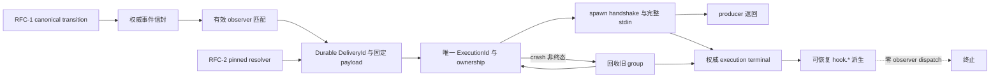

# RFC #543 · R10 需求侧：observer execution / payload / diagnostic

> 输入边界：只读 `01-clauses.md` 的 A1–A4、E、F、G，`23-expected-foundation.md`，以及 `04/09/19/22` 的主 agent 摘要。本文不调查源码、不运行实验、不选择 schema、表、队列、锁、artifact 或模块签名，不实现代码、不拆 issue、不创建 worktree。本文把稳定语义推导为原子需求；“地基供给”表示可消费合同，不表示 main 已实现。

## A. 摘要

本能力的最小闭环是：权威 lifecycle event 与每个 matching observer 形成独立 durable delivery；delivery 固定版本化 payload，并为每次真实启动创建独立 execution attempt。producer 只等待 durable admission、spawn/error handshake 与完整 stdin 写入，不等待 child 完成。clean stop 有界回收；crash/restart 只恢复非终态 attempt，先回收旧 owned process group，再以同一 delivery 和固定 payload 重派。任何已知终态都结束该 delivery，不因成功、非零退出、spawn/stdio failure、timeout 或 clean-stop termination 自动重试。

execution terminal 是 diagnostic 权威事实；`hook.*` 是可在重启后补做、允许重复但保留稳定因果 identity 的派生，并在声明装载与事件派发两层保持零自反。所有 delivery 全面并发，不合并、不跳过、不承诺完成或 effect 顺序；文件、Git、数据库与第三方 effect 的协调、幂等和 replay 去重由脚本作者负责。

本文得到 **30 项原子需求**：`23` 已供给合同/资产 7 项，本能力必须新建 21 项，外部 blocker 2 项。外部 blocker 仅为 RFC-2 pinned definition artifact/resolver 与 RFC-1 canonical closure transition/identity；它们不授权 #543 建替代权威。当前 main 尚无 observer execution、payload 与 diagnostic 闭环，因此本报告只证明需求完备性，不证明实现完成。

## B. 稳定语义

### B1. 投递、attempt 与进程 ownership

1. 每个权威 event × 每个有效 observer match 产生一个独立 delivery；相同脚本、事件类型、chain 或相邻触发不复用 identity，不 coalesce、不 skip。
2. delivery 在真实启动前成为 durable fact；每次真实 spawn 都创建新的、不可变 execution identity，并唯一链接同一 delivery。
3. attempt 的 ownership 必须在脚本可能运行与进程组可回收之间闭合；不得留下“child 已产生 effect，但恢复端既不知道 group 也无法归因”的窗口。
4. clean stop 先停止新 dispatch，再 bounded drain，超时 process-group TERM→KILL，等待 close 与权威终态收敛后才关闭 durable store/event sink。
5. restart 对非终态 attempt 先回收旧 group并记录该 attempt 的恢复中断终态，再以原 delivery 创建新 attempt；重复 crash 可以继续产生新 attempt。
6. success、nonzero、spawn/stdio failure、timeout、clean-stop termination 等已知终态结束 delivery；它们只形成 diagnostic，不自动 retry，不改变 scheduler decision。

### B2. payload

1. observer 与 gate 共用唯一 typed payload assembly contract；observer 不拥有第二套 shape。
2. envelope 由触发上下文、公共 compile projection 与 runtime snapshot 三部分构成；事件、编译、状态及 closure 投影从各自权威 boundary 派生，不平行复制。
3. payload 带版本、delivery identity 与本 attempt execution identity；可导出精确 shape。
4. 同一 delivery 的所有 attempts 获得语义与字节表示等价的固定 payload；restart 不重新采样漂移后的 runtime/source。
5. pinned definition 必须通过 RFC-2 权威 resolver 解引用；missing/corrupt/unsupported 是穷尽 typed failure，不回退当前 preset 路径。
6. closure transition payload 只消费 RFC-1 canonical transition identity 与发生时点 snapshot；delivery identity 不冒充 transition identity。
7. 匿名 status object 不透传，GitHub mergedness/PR 等业务事实不注入 L1 payload。

### B3. diagnostic、授权、并发与 outcome

1. observer declaration 的 event type 来自事件 union 减去固定 `hook.*`；装载期拒绝订阅 `hook.*`，发射路径对 `hook.*` 零 observer dispatch。
2. execution terminal 是 observer outcome 与 diagnostic 的唯一权威；派生 event 不能成为竞争权威。
3. terminal 至少可穷尽表达 success、nonzero、spawn/stdio infrastructure failure、timeout、clean-stop termination 与 crash-recovery interruption，并关联 hook、trigger event、delivery、execution 与失败分类。
4. `hook.*` 派生在 terminal durable 后可恢复；重复派生携带稳定 execution 因果 identity。sink failure 不撤销 terminal、不阻塞 scheduler/shutdown、不重跑已终态 delivery。
5. hook 以 operator 身份使用既有 CLI admission；authorization 仍由命令边界校验。审计必须能关联 delivery/execution，但 operator authority 不等于互斥或外部 effect 安全。
6. producer 在其调用栈内完成匹配、durable admission、spawn/error handshake 与完整 stdin；随后返回，不等待 child completion。observer 任一 outcome 均不修改调度判定。
7. 同/不同脚本跨 event、chain、连续触发全面并发；声明或 spawn 顺序不构成 completion、diagnostic 或副作用顺序。
8. 引擎只保证自身 durable facts、固定输入、identity、局部 CLI transaction 与审计；外部资源的重入、锁、CAS、idempotency 与重复 effect 由脚本作者承担。

## C. 原子需求矩阵

| ID | 原子读写 / transaction / identity / ownership / authorization / outcome 需求 | 必须保持的原子边界或可观察结果 | 分类 |
|---|---|---|---|
| O-01 | 读取权威 event envelope 与有效 observer view，穷尽匹配 | 每个 match 恰建一个独立 delivery；无合并、跳过 | 本能力新建 |
| O-02 | 原子建立 delivery identity、observer/event 因果与固定 payload reference/value | 任一可执行 attempt 都已有可恢复 delivery；重复 match 不复用 identity | 本能力新建 |
| O-03 | 为每次真实启动原子保留唯一 execution identity并链接 delivery | 每 attempt 可独立审计；replay 不覆盖旧 attempt | 本能力新建 |
| O-04 | 建立 spawn/ownership write-ahead 边界 | child 可运行时，恢复端已有足以归因和回收的 ownership；否则 spawn 不取得执行资格 | 本能力新建 |
| O-05 | 异步 subprocess primitive 提供 spawn/error、stdio、group、timeout、TERM→KILL、close 过程事实 | primitive 不携带 delivery/item/phase/session/backoff 领域语义 | 地基供给 |
| O-06 | producer 完成 delivery admission、spawn/error handshake 和完整 stdin write | 返回后不等待 child；spawn/stdio admission failure成为已知 outcome | 本能力新建 |
| O-07 | runtime registry 读取 owned running attempts；clean stop 封闭新 dispatch | bounded drain 后 group TERM→KILL，await close/terminal 后才关 store/sink | 本能力新建 |
| O-08 | restart 扫描 durable 非终态 attempt 与 ownership | 旧 group 先回收并令旧 attempt terminal，再创建新 attempt | 本能力新建 |
| O-09 | terminal 写入与 attempt 当前状态执行原子准入 | 每 execution 至多一个权威 terminal；迟到 completion 不覆写 recovery terminal | 本能力新建 |
| O-10 | delivery completion 从已知 terminal 穷尽决定 | success/nonzero/spawn/stdio/timeout/clean-stop 不自动 retry；仅 crash 非终态恢复 | 本能力新建 |
| O-11 | 读取公共 event/compile/status typed boundaries 组装唯一 payload | observer/gate 零平行 shape；匿名槽与 GitHub 业务事实不进入 payload | 地基供给 |
| O-12 | 固定 payload 带版本、DeliveryId 与本次 ExecutionId | 同 delivery 重派时业务内容与字节表示等价，仅 attempt identity按新 execution表达 | 本能力新建 |
| O-13 | delivery 创建时捕获/固定 runtime snapshot | restart 不以当前 runtime 改写旧 delivery；变化只由新 event 形成新 delivery | 本能力新建 |
| O-14 | 读取 pinned definitionRef 并经 RFC-2 resolver取得公共 compile projection | source 漂移后旧 delivery仍解析原定义；failure typed且无 current-path fallback | 外部 blocker |
| O-15 | 读取 RFC-1 canonical closure transition identity及发生时点 snapshot | 六边 payload可归因；transition identity与delivery identity分离 | 外部 blocker |
| O-16 | payload version boundary 可解析且 schema 可导出 | hook 作者可获得精确形态；不支持版本显式失败 | 本能力新建 |
| O-17 | observer points = event union − `hook.*` | 事件词表扩张自动传导；声明装载期拒绝任何 `hook.*` subscription | 地基供给 |
| O-18 | event emission 对 `hook.*` 施加零 dispatch hard boundary | diagnostic 派生永不创建新 observer delivery | 本能力新建 |
| O-19 | terminal outcome ADT 穷尽记录 hook/trigger/failure/delivery/execution 因果 | status/log/event 查询可区分所有已知终态类别 | 本能力新建 |
| O-20 | terminal record 是 diagnostic source of truth | event append、stderr 或 process close 不得成为竞争 authority | 本能力新建 |
| O-21 | 从 terminal 生成稳定 diagnostic identity并持久表示待派生/已观察进度 | terminal durable 而 event 未写时 restart 可补做 | 本能力新建 |
| O-22 | diagnostic append 与派生确认间允许 crash 重放 | append 后确认前 crash可重复同因果 identity；不谎称 exactly-once | 本能力新建 |
| O-23 | event sink failure 与 scheduler/delivery execution 解耦 | 不撤销 terminal、不重跑已终态 delivery、不改变调度、不阻塞回收 | 本能力新建 |
| O-24 | hook CLI caller 经既有 operator admission/typed mutation boundary | 非法请求仍拒绝；operator 权限不扩张为跨命令 transaction或互斥 | 地基供给 |
| O-25 | CLI/audit 接收或继承 delivery/execution correlation | mutation/event可追溯至具体 attempt；不把所有 hook仅折叠为无差别 operator | 本能力新建 |
| O-26 | 每 delivery/attempt 独立调度且无 per-script/global lane | 同/不同脚本跨 event/chain 真并发；无完成/effect顺序保证 | 本能力新建 |
| O-27 | 外部 effect 不进入引擎 transaction/rollback/lock authority | 文件/Git/API重复与冲突由脚本利用 identity及目标系统能力处理 | 地基供给 |
| O-28 | observer completion 不作为 scheduler decision ingress | 任一 success/failure/timeout 均只旁路记录 diagnostic | 地基供给 |
| O-29 | event envelope、typed runtime facts、compile projection 与声明 provenance 可复用 | 本能力消费同一边界，不维护镜像字段表 | 地基供给 |
| O-30 | retention/cleanup 读取 recovery、未派生 terminal 与审计关联状态后才能删除 | 未恢复 delivery、未派生 terminal、仍需因果关联的 identity 不得提前消失 | 本能力新建 |

## D. 地基供给 / 自建 / 外部阻塞分类

### D1. `23` 已供给的合同与资产（7）

| 原子项 | 供给内容 | 消费限制 |
|---|---|---|
| O-05 | 领域无关 async subprocess primitive 的职责边界 | 只是预期地基；不得称现有 agent executor 已满足，抽取后需 agent runtime 回归 |
| O-11 | 公共 typed event/compile/status projection 与唯一 payload shape 原则 | 匿名 status 槽不透传；不复制上游字段 |
| O-17 | observer point 的结构减法与 `hook.*` 声明排除 | emission 侧 hard boundary仍由本能力接线 |
| O-24 | operator CLI admission 与局部 typed transaction/audit seam | 不等于脚本锁、跨请求事务或外部 effect 安全 |
| O-27 | 外部 effect 责任明确归脚本作者 | 不是 blocker，也不得反向新增引擎锁/事务 |
| O-28 | observer 为异步旁路，不消费退出码改变 scheduler | producer 仍须等待已裁定的 spawn/stdin 边界 |
| O-29 | typed runtime facts、compile DTO/projection、event envelope、声明 provenance 可保留 | 资产存在不证明 observer payload 已组装 |

### D2. 本能力必须新建（21）

- **delivery / execution / ownership：** O-01～O-04、O-06～O-10。
- **payload 固定与边界：** O-12、O-13、O-16。
- **diagnostic 与零自反：** O-18～O-23。
- **授权关联、并发与 retention：** O-25、O-26、O-30。

这些需求共同构成一个闭环，不能只实现 spawn 或 event append：缺 O-02/O-04 会出现无主执行；缺 O-09/O-10 会把已知失败误当 retry；缺 O-12/O-13 会令同一 delivery replay 输入漂移；缺 O-20～O-22 会让 terminal 与 event 争夺权威或在 crash 中丢 diagnostic；缺 O-18 会形成 `hook.*` 自激励。

### D3. 外部 blocker（2）

| 原子项 | 外部 owner / 缺口 | 阻塞主张 | 不允许的替代 |
|---|---|---|---|
| O-14 | RFC-2 (#547) pinned definition artifact/resolver 与 typed failure | pinned compile projection、同 delivery 固定输入、source 漂移后恢复 | 重编译当前路径、由 #543 自建第二 resolver |
| O-15 | RFC-1 (#546) canonical closure 六边 transition producer、identity、发生时点 snapshot | A4/F7 的真实 closure observer trigger 与 payload | 从旧 `closure.*` 主题事件推断六边、以 delivery identity冒充 transition identity |

外部 blocker 只阻塞依赖该接缝的 completion claim。普通非 closure event 的 observer execution/diagnostic 闭环，以及不依赖 pinned compile projection 的局部证明，仍可分别取得资格；不得用局部证明宣称整个 RFC 完成。

## E. 接缝与证明

### E1. 原子接缝

必须保持的 transaction/ordering 接缝：

1. **event→delivery：** match 不得在 durable delivery 之前产生不可归因 child。
2. **attempt→ownership→spawn：** 任一 kill point 后，要么无 child，要么恢复端能识别并先回收 owned group。
3. **terminal→delivery：** terminal 准入必须拒绝迟到/冲突 outcome；known terminal 令 delivery 收敛且无自动 retry。
4. **terminal→diagnostic：** terminal 先成为 authority；event 派生可丢确认后重放，但不可丢因果 identity。
5. **recovery→new attempt：** 旧 attempt 先有 recovery terminal，再创建同 DeliveryId 的新 ExecutionId；payload不漂移。

### E2. 必须取得的运行证明

| 证明组 | 必须触发 | 必须观察 |
|---|---|---|
| P-01 spawn/ownership kill points | delivery前、attempt保留后、spawn前后、ownership边界、stdin中/后、effect后terminal前 | 无不可归因/不可回收 child；旧 group先回收再重派 |
| P-02 fixed payload | H1 delivery运行后 source/runtime漂移至H2并 crash/restart | DeliveryId不变；ExecutionId更新；业务 payload字节不变；RFC-2 failure穷尽 |
| P-03 known terminal | success、nonzero、spawn error、EPIPE/stdio、timeout、clean-stop kill | 每类唯一权威 terminal；restart 不重跑 delivery；scheduler结果不变 |
| P-04 repeated crash | 同 delivery 连续 crash 两次后成功/失败终态 | 多个唯一 ExecutionId、一个稳定 DeliveryId、完整因果链、无 attempt 覆写 |
| P-05 process ownership | leader/child/grandchild、忽略TERM、继承stdio | bounded TERM→KILL、close完成、无 owned group遗留 |
| P-06 diagnostic replay | terminal后append前 crash、append后确认前 crash、sink failure | terminal不丢；可重复同因果 diagnostic；`hook.*` 零 dispatch |
| P-07 producer boundary | slow child、早退、大 payload/backpressure、多 observers | producer只等 admission/spawn/stdin，不等completion；每match独立delivery |
| P-08 concurrency | 同/不同脚本跨event/chain barrier并发 | 全面并发且无隐式lane；测试不假定effect/completion顺序 |
| P-09 authorization/audit | hook以operator调用合法/非法 CLI mutation | admission仍生效；audit可关联DeliveryId/ExecutionId；无额外外部保证 |
| P-10 agent adapter regression | 公共 primitive 抽取后的真实 agent spawn/timeout/recycle | agent既有领域行为不变，observer状态未污染primitive |
| P-11 closure seam | RFC-1 六边合法 producer触发 | transition identity、发生时点snapshot、delivery identity三者可区分 |

### E3. 证明边界

- P-01～P-10 不证明 RFC-1 closure 六边；P-11 必须在冻结的 RFC-1 供给 SHA 上执行。
- payload 的 pinned/source-drift 主张必须在冻结的 RFC-2 供给 SHA 上执行；当前路径 fallback 永远不是通过证据。
- 单次成功、类型检查、unit mock、event 文件出现一行、leader PID 消失或同一 CLI socket 串行测试，都不能证明 crash ownership、diagnostic recovery、process group 回收或全面并发。
- 测试不得为 observer 自动创建 worktree，也不得把外部 effect exactly-once 写成引擎验收。

## F. 尾部核对

- [x] 只覆盖 observer execution、payload、diagnostic/observability；未进入 gate evaluation、binding 或 reopen consumer 设计。
- [x] 保持 durable at-least-once、delivery/execution 双 identity、同 delivery 固定 payload、known terminal no-auto-retry、crash 非终态恢复重派。
- [x] 保持 terminal diagnostic authority、producer 等待 spawn/stdin 后返回、全面并发、外部 effect 脚本负责、`hook.*` 双层零自反。
- [x] 明确原子读写、transaction/ordering、process ownership、恢复、授权与 observable outcome。
- [x] 未选择 schema、表、队列、锁、artifact、retention 数值或模块签名。
- [x] 未把 RFC-1/RFC-2 blocker 反向实现进 #543。
- [x] 原子需求：**30**；`23` 已供给：**7**；本能力新建：**21**；外部 blocker：**2**。
- [x] blocker：RFC-2 pinned definition artifact/resolver；RFC-1 canonical closure transition/identity。
- [x] 未调查源码、未运行实验、未修改其他文件、未创建 worktree。

<!-- END: 25-demand-observer-payload.md -->
