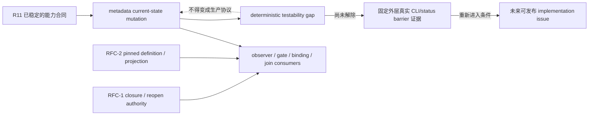

# RFC #543 · R12 下一批滚动重拆

> 输入边界：本文汇合 `30-supply-demand-fit.md`、`32-next-batch-review.md` 与 `33-detail-concurrency-harness.md` 的当前结论。未实施代码、未运行新实验、未创建 GitHub issue / PR / worktree，也未展开完整未来 issue 树。

## A. 摘要

本轮 **0 个可发布候选**。

当前没有一项现场边界同时满足：

1. 一个 issue 只解决一个问题；
2. 不依赖 RFC-1 / RFC-2 尚未取得资格的 authority；
3. 能在本 issue 内以当前真实 runtime 路径自闭合验收；
4. 不由实现者编写的 bundle 自己制造刺激、证据与通过结论；
5. 不把验证所需的 testability seam 反向编译为生产机制。

metadata current-state mutation 原本满足原子性与 owner 边界，但不满足可发布的 runtime 验收条件。`33-detail-concurrency-harness.md` 已证明：当前 checkout 没有公开、现成的双 pre-read / release barrier；operator runner-model writer 的 pre-read→commit 之间没有可控 seam，scheduler callback只能暂停 keep-active 一侧。其补充结论进一步确认，在“当前 R12 不改代码”边界内，外层无法独立证明真实 keep-active pre-read barrier；若退回由 harness 自报 ack / transcript，又违反 issue 不能自己出题自己改卷的验收纪律。

因此不再继续膨胀一个无法诚实发布的 spike 合同。本轮完成态是记录 **testability gap**、冻结重新进入条件，并明确不创建 issue。验证纪律不是产品需求；不能为了让 checkpoint 可写而要求生产 daemon、operator CLI、metadata schema 或 socket 暴露测试协议。

## B. 选择准则与本轮判定

| 准则 | 判定方式 | 本轮结果 |
|---|---|---|
| 原子性 | 一个问题、一个未来 closing PR、共享 seam唯一 owner | metadata 边界通过；其余大能力尚需继续滚动 |
| 现场资格 | 完成主张不依赖尚缺外部 authority | metadata、subprocess、shutdown部分边界可满足；observer/gate/binding/join部分主张被外部 blocker阻塞 |
| 直接 runtime 验收 | issue内命令直接触发并观察新增行为 | 当前无候选同时满足 |
| 外层独立证据 | 刺激、原始证据和判定不能全由实现bundle掌控 | metadata deterministic harness 当前不满足 |
| 不预裁生产机制 | checkpoint不强迫 CAS、revision、merge、锁、typed conflict或生产测试协议 | 继续写 harness spike会越过边界，因此停止 |
| 滚动收敛 | 不因没有候选而拆完整未来树 | 通过；只登记能力边界与重新进入条件 |

`30-supply-demand-fit.md` §F 所称“事实已足够用于消费设计”或“已有修补后合同”不等于 implementation issue 已具备可发布验收面。R12 还必须满足仓库 issue 规则：单 issue 必须直接运行并观察自身新增行为，不能以自写测试名、自产 transcript或未来补充 fixture代替。

## C. 能力与 testability gap

testability gap 只阻止当前 issue 发布，不改变 S-07 的生产 owner，也不授权新建第二套 metadata authority。RFC-1 / RFC-2 blocker仍由外部 RFC 提供；#543 只消费。

## D. 现场证据与停止理由

### D1. 已证明的真实入口

`33-detail-concurrency-harness.md` 已证明：

- 真实 `chain set-runner-model --json` → daemon → SQLite → read-back 可覆盖 single writer 与同值幂等。
- 正常 runtime metadata writer闭集包含 operator runner-model mutation 与 scheduler keep-active mutation。
- scheduler callback可暂停 keep-active writer，确定覆盖“keep-active stale pre-read → operator先提交 → release keep-active”这一侧交错。
- 隔离 smoke fixture可做到 scheduler disabled、无 item、无 runner spawn、无 worktree。

这些事实足以证明问题与一个方向的现状，不足以证明一个修复在 A→B / B→A 两种顺序都成立。

### D2. 已证明不存在的验收能力

`33-detail-concurrency-harness.md` 及其补充结论已证明：

- operator handler 的 metadata pre-read、merge、commit连续同步执行，pre-read之后没有公开 await、callback、store injection或test latch。
- auth await发生在pre-read之前；audit发生在commit之后；两者都不能建立目标 barrier。
- shell并发、sleep、轮询、外部SQLite lock只能推测时序，不能证明两个writer都已完成pre-read。
- private monkey patch或直接store replacement不是受支持的真实 operator runtime验收面。
- 外层在当前禁止改代码边界下无法独立观察真实 keep-active pre-read ack。
- 由待实现 harness 自己写 barrier transcript、outcome JSON或“无副作用”boolean，再由同一合同读取，不能成为独立验收证据。

### D3. 为什么不再发布 spike

继续写 spike 只有两条路，均不合格：

1. **弱化证据**：相信 harness 自报 pre-read/release/commit。这样最省事实现可以不建立真实 barrier而直接生成通过 artifact。
2. **加强产品 seam**：要求生产 daemon、CLI、metadata boundary或socket暴露test ack/release。这样把人的验证纪律编译成系统机制，并提前选择实现结构。

因此当前没有诚实的 spike PASS 条件。调查结论已经足够明确，再创建一个只会重新陈述“缺 seam”的 issue不会增加事实，也没有一个可独立关闭的 runtime交付。

## E. 暂缓边界

| # | 现场边界 | 暂缓原因 | 重新进入条件 |
|---:|---|---|---|
| 1 | Metadata current-state mutation + deterministic harness/testability gap | 原子结果合同已稳定，但当前无法由固定外层独立证明两个真实writer的双pre-read与两种commit顺序；harness自证不合格，生产test协议又越界 | **二选一**：① 仓库中出现不由实现bundle自证的固定外层真实 CLI/status barrier证明，可原样运行并覆盖A→B/B→A、single-writer与cleanup；② 需求或仓库规则明确接受另一种具名验证面，并说明为何它足以替代真实双writer barrier。满足前不得发布implementation或spike |
| 2 | Async subprocess primitive | 无外部 blocker，但现有摘要不足以给出跨agent/observer adapter且不预裁API的直接runtime checkpoint | 专项事实报告给出真实child process路径、agent adapter回归与observer adapter结果的固定外层验收面 |
| 3 | Observer delivery / payload / diagnostic | execution闭环尚未取得资格；pinned payload与closure transition还依赖外部供给 | subprocess/delivery seam先取得runtime资格，且相关RFC-1/RFC-2供给在冻结SHA解除 |
| 4 | Gate evaluator | 消费subprocess、journal、metadata、shutdown admission；reopen分支依赖RFC-1 | 共享seam分别取得资格，并能为一个穷尽point/decision子问题给出直接runtime checkpoint |
| 5 | Evaluation journal / recovery | 与execution ownership、pending intent、operator mutation replay和shutdown交叠；当前拆会成为拼盘 | 专项滚动固定唯一identity/consumer owner及kill-point外层证据，再判断原子issue边界 |
| 6 | Named gate binding | typed declaration、公共compile projection与pinned resolver依赖RFC-2 | RFC-2供给取得资格，且创建/恢复/binding可见性拥有可直接运行的消费checkpoint |
| 7 | Script join / reopen | typed script variant依赖RFC-2；join-ready、target、claim、budget、cursor与原子reopen依赖RFC-1 | 两组外部authority解除后再按真实consumer边界滚动 |
| 8 | `shutdown-held` admission | 无外部 blocker，但当前没有已证稳定触发held window且可从公开读面观察完整准入闭集的路径 | 专项事实调查给出固定trigger/query及DB/event/spawn差分命令 |
| 9 | Hook diagnostic derivation | execution terminal尚未成为已取得资格的authority | observer execution terminal seam完成并可从外层观察terminal→derived event、restart replay与零自反 |

暂缓数：**9**。本表只记录能力边界与进入条件，不是未来 issue 树；没有标题、编号、实现顺序或估工。

## F. 外部 blocker

| Blocker组 | Owner | 当前阻塞的完成主张 | 本轮处置 |
|---|---|---|---|
| Pinned definition artifact / resolver / public projection | RFC-2 | 固定payload、source漂移后replay、named declaration、typed script variant | 留待外部供给；#543不建current-path fallback或临时resolver |
| Canonical closure transitions | RFC-1 | closure六边真实trigger、transition identity与发生时点snapshot | 留待外部供给；不从旧`closure.*`主题事件推断 |
| Structured reopen authority | RFC-1 | target、claim、budget、cursor、terminal preservation与原子reopen effect | 留待外部供给；#543 journal不冒充authority |

外部 blocker组：**3**。文件、Git、外部数据库或第三方服务的锁、幂等与副作用仍由脚本作者和目标系统负责，不回流为引擎机制或blocker。

## G. 原子性 / 验收 / 收敛审计

### G1. 候选审计

- 可发布候选：**0**。
- 创建 issue：**否**。
- 创建 spike：**否**。
- 提前实现或预选生产机制：**否**。
- 完整未来树拆分：**否**。

### G2. Metadata 审计

- 问题本身原子：**是**。
- S-07 owner明确：**是**。
- 外部RFC blocker：**无**。
- 当前直接runtime验收自闭合：**否**。
- 外层独立双writer barrier证据：**否**。
- 是否允许以harness自报替代：**否**。
- 是否允许为验收强加生产test协议：**否**。
- 结论：**连同testability gap暂缓，不发布issue**。

### G3. 范围与循环

- 外部 blocker owner转移：**0**。
- 双 owner seam：**0**。
- 循环依赖：**0**。
- 以验证纪律新增生产需求：**0**。
- 自写测试/自产artifact冒充业务覆盖：**0**。
- 不满足条件却以“后续补fixture”二次延期：**0**。

### G4. R12 完成结论

R12 已完成下一批滚动筛选。当前现场没有满足“原子问题 + 当前事实足够 + 独立自闭合 runtime验收”的下一批，因此正确结果是 **0 个候选**，而不是为了维持推进表象创建不可验收的 implementation issue或spike。

重新进入只由 E 节具名条件触发。条件未变化时，不重复扩写 harness合同，不重新包装同一个testability gap，也不把仓库验证纪律编译成产品机制。

## H. 尾部

- 报告：`31-next-batch-redecomposition.md`
- 可发布候选：**0**
- 暂缓边界：**9**
- 外部 blocker组：**3**
- issue / PR / worktree / 实现：**均未创建**
- 运行新实验：**否**
- 审计结论：**R12 完成；当前无可诚实发布的下一批**
