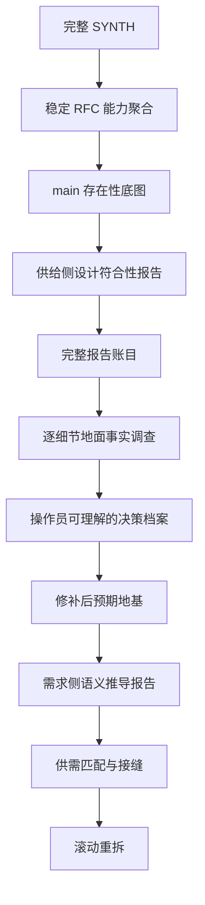

# RFC #543 · 标准调查、决策与滚动重拆 prompt

- **主题：** 生命周期 hook、可观测性与 gate 执行
- **唯一 SYNTH 输入：** `v3-issue/synthesized/SYNTH-543-hook-observability-gate.md`
- **工作目录：** `v3-issue/n/543/`
- **事实源：** 本 RFC 稳定设计 + 操作员裁决 + v3 权威记录 + 真实系统；旧 issue/测试/非 v3 docs 仅作线索。

## 0. 这是执行 prompt，不是原则摘要

本文件从 RFC #546 的完整 session（包括 Read/Bash/Write/Edit、Codex 任务书、任务失败与恢复、报告落盘和后续纠偏）抽取标准流程。后续主 agent 必须按本文件恢复工作，不得只看阶段名自由发挥。

目标不是“把旧 issue 修好”，而是建立这条证据链：

## 1. 主 agent 与 subagent 的硬边界

### 1.1 主 agent 只保留目标层信息

主 agent 必须掌握：

- 本 RFC 的稳定问题清单和设计公理；
- 当前处于哪一阶段，为什么不能跳步；
- 已有哪些正式报告，各自回答什么问题；
- 报告之间的矛盾、未知和依赖；
- 哪个细节需要下一位 subagent 调查；
- 哪些问题已经具备向操作员请求裁决的材料。

主 agent **不应**把下列内容持续装入会话：

- 大量源码调用链、SQL、测试行号和 shell 输出；
- subagent 的工具调用记录和中间推理；
- 每个细节调查的全部取证过程；
- 为了“确认”报告而亲自重跑同一套细节调查。

主 agent 读取正式报告的摘要、结论边界、因果说明、未知和证据索引。报告不够可信时，派复核或 follow-up subagent；不要自己吞入细节。这样 compact 后只需本文件、报告索引和当前问题树即可恢复目标。

### 1.2 subagent 是细节事实的唯一调查者

以下工作默认必须派 subagent：

- 源码、表结构、事务、锁、迁移、runner profile、Git 对账等细节取证；
- 某个不变量在所有写入口是否真被执法；
- 崩溃、并发、历史数据或真实 runner 下的实验；
- 旧测试是否与实现共同偏离；
- 一个观察到的偏离为什么产生、跨了哪些层；
- 事实支持哪些实现形态及其确定后果；
- 从某个未实现设计语义推导原子地基需求。

主 agent 可以设计问题、切片和报告格式，但不把答案写进 prompt。

### 1.3 细节是调查起点，不是根因边界

“调查 D-x”只确定调查种子，不预设根因只在一个函数。一个细节可能由声明、存储、迁移、调度、恢复、权限、历史兼容和下游消费者共同产生。

subagent 必须区分：

1. **观察事实**：具体哪里表现异常或与设计不同；
2. **直接机制**：哪条生产路径生成该事实；
3. **上游来源**：数据/状态/声明来自哪里；
4. **历史原因**：迁移、旧兼容、回退或双事实源如何形成；
5. **放大条件**：并发、崩溃、特定 runner、未来能力出现时才触发什么；
6. **消费者影响**：谁读取它，错误会如何传播；
7. **根因集合**：允许多因一果、一因多果或尚不可判定；
8. **修补边界**：修直接症状是否会保留根因。

调查可以沿因果链扩展，但不能据此新增需求；稳定 RFC 不要求防的风险只登记，不自动实施。

## 2. Codex subagent 的统一任务书

每次派发都必须包含以下段落，不能只写“查一下 X”。

### 2.1 调查问题

写成可证伪问题，说明它为什么阻塞当前阶段。不得预设答案，不得把候选方案说成完备集。

### 2.2 固定基线

- repo、branch、HEAD SHA；
- 允许写入的位置仅限指定报告和明确实验临时目录；
- 禁止修改产品代码、测试、配置和生产数据库；
- 需要运行实验时说明真实环境和副作用边界。

### 2.3 唯一设计锚点

只列与该切片直接相关的 RFC 聚合“语义定义”、操作员裁决和明确的 v3 权威记录。测试、issue、marker、验收脚本只能作线索。

### 2.4 必须建立的事实

逐条列出问题，不列预期结论。每条要求：

- 生产代码或运行证据；
- 事务/并发/迁移/错误恢复语义；
- 所有写入口或消费者，而不是单一命中；
- 静态不可判定时所需的最小实验；
- 现有测试覆盖与同错风险；
- 可保留资产。

### 2.5 防污染纪律

- 符号存在不算符合；
- 测试绿色不算设计证明；
- commit message 不算实现证据；
- 不得自行裁决；
- 不得写“小/中/大 PR”“约几十行”；规模只能列具体函数、表、调用点、测试名；
- 不确定就写不确定以及如何确定；
- 如果事实揭示第四种形态或复杂根因，必须报告，不能服从 prompt 暗示。

### 2.6 报告双层结构

报告写入本 RFC 目录，必须让主 agent 无需读取取证细节也能使用：

**A. 主 agent 摘要（最多一页）**

- 问题；
- 结论与置信边界；
- 复杂因果的简明解释；
- 当前影响、未来影响、纯证明缺口；
- 可保留资产；
- 尚未确定的事实；
- 下一步是否需要裁决或继续调查。

**B. 证据附录（供复核 subagent 使用）**

- 逐条设计对照；
- `path:line`、SQL、命令、运行观察；
- 全部调用方/写入口/消费者；
- 事务、锁、迁移和崩溃窗口；
- 测试同错/盲区；
- 实验脚本和环境限制；
- 证据索引。

## 3. Codex 任务运行与收件流程

#546 的完整 session 证明“Agent 调用返回”不代表调查完成。主 agent 必须：

1. 记录 Codex runtime task id、目标报告路径和预期章节；
2. 轮询**任务终态**，不能只等文件出现；
3. 报告出现后核对行数、章节、尾部和明确结论，防止半写文件；
4. 任务失败时读取失败原因：
   - 容量/流中断且 session 有有效进度：优先 resume；
   - 任务挂死：取消该实例，再 fresh 重发同一问题；
   - 环境不能实验：保留“不可判定”，要求交付可复现实验脚本；
5. 不因某个任务慢而降低问题或改用未经允许的模型；
6. 只在全部切片报告完整后进入汇合；
7. 汇合发现遗漏时派报告核算/复核 subagent，不由主 agent补做代码调查。

## 4. 标准流程：每一步到底解决什么

### R0 · 完整读取 SYNTH，先恢复材料全貌

**要解决的问题：** 当前文件混合了稳定 RFC、旧/新 issue、marker 循环、评论裁决和状态快照；如果没读全就会再次沿坏边界工作。

**实际做法：**

- 大文件分段读取；
- 先扫描后半部分章节标题，识别大段重复供替循环，再逐段读取独特内容；
- 未经操作员授权不写文件、不查代码；
- 对话中固定：只看本 RFC、跨树只记能力、现在只聚合。

**不得前进：** 尚不能说清哪些是稳定设计、哪些是拆分、哪些只是历史证据。

### R1 · 先做 source inventory，再做能力聚合

**要解决的问题：** 旧 issue 边界是错误来源，不能直接“整理 issue”。

**产物顺序：**

1. source inventory：每个行段标“进聚合/捞金/丢弃/仅现状”；
2. 全局公理与完整终态交付标准；
3. 能力块：每块写语义定义、真实交付标准、现状快照；
4. annex：未决项、跨树能力 inbound/outbound、验收 owner、冲突；
5. README/索引。

**关键判断：**

- 重复 marker 中只捞已经稳定且有设计来源的语义；
- issue 编号只留在出处和历史，不进入依赖合同；
- 跨树编号翻译为能力，但不打开其他 RFC；
- 冲突只登记，不裁决；
- 聚合不是重拆，不排未来 issue 顺序。

**校验：** 行数、全交付标准去向、正文编号依赖 grep、源行号回溯。

### R2 · 只做 main 存在性底图

**要解决的问题：** 聚合使用了历史快照，main 可能已经前进；重拆前必须知道哪些东西真实存在。

**必须派 subagent，因为：** 这是大量源码检索和新旧路径成对核对；让主 agent 亲自读会污染目标会话。

**调查方式：** 按全部能力块逐项核对：新机制是否存在、旧机制是否退役、声明/存储/执行/执法/消费分别到哪。默认未实现，只登记生产证据。

**报告只能回答：** “有什么”。不能回答“符合 v3”“测试绿”“可作地基”。

### R3 · 把真实问题改写成“现有实现能否作为地基”

**触发：** R2 出现“已实现/部分实现”。

必须分开两个问题：

1. 它是否符合稳定 v3 语义；
2. 它能否提供未实现能力真正需要的保证。

现有测试不能认证第一个问题，因为代码和测试可能由同一错误 issue 生成。旧 issue 的接口清单也不能直接回答第二个问题，因为依赖边界本来就可能写错。

**切片：**

- 供给侧：按现存实现的语义/事务边界切片；
- 需求侧：按未实现能力的稳定语义切片；
- 先供给，暂不启动需求。

### R4 · 供给侧设计符合性深审

**要解决的问题：** 把“已存在”拆成：符合、偏离、静态不可判定、可保留底座、负资产。

**为什么多个 subagent：** 每片需要深查事务、并发、恢复、迁移和旁路；单 agent 容量不足且容易被代码—测试自洽迷惑。切片之间应能交叉核对同一接缝。

**每片报告必须包含：** 逐条稳定语义三态判断、严重偏离、静态未知、测试同错、可保留资产和能否作下游地基。

### R5 · 先完整核算供给报告，不能立刻跑需求侧

**要解决的问题：** “有偏离”仍不足以定义下游应依赖什么。

必须完整收进账目的内容：

- 每条偏离；
- 每条静态不可判定；
- 每条测试同错/盲区；
- 每项可保留资产；
- 报告互证或冲突；
- 原报告条目到总账的全覆盖映射。

**必须派报告核算 subagent，因为：** 逐条搬运和覆盖检查属于细节劳动；主 agent只读核算报告摘要和覆盖结论。

**禁止：** 只看 findings 就下“零重写”“都是小修”结论。

### R6 · 从总账生成“待调查细节索引”

**要解决的问题：** 哪些偏离只是明确事实，哪些真正形成设计/工程分叉，哪些还缺地面事实。

每个索引项必须写：

- 对应稳定条款；
- 报告观察到的事实；
- 为什么现有证据不足以决定补法；
- 可能涉及哪些层，但不预设根因；
- 需要何种代码、数据或运行实验；
- 为什么要单独派 subagent。

此时不写选项、不估成本、不回写“修补决策”。

### R7 · 一个细节一个 subagent，查清复杂成因和确定后果

**要解决的问题：** 为操作员裁决建立地面事实，而不是让模型编选项。

典型调查包括：

- 多条恢复通道真实行为和已消费资源交互；
- 跨表不变量、trigger 先例、迁移兼容和存量违规数据；
- sandbox 语言能力、真实 runner 读需求和不可测环境；
- delete/consume 两条完整调用链、孤儿资源、对账和运维契约。

**关键纪律：** 一个细节可能有复杂历史根因；报告必须从观察点追到所有必要层。prompt 中的候选不是完备集。没有事实就保留未知。

### R8 · 由报告生成决策档案，再请求操作员裁决

**要解决的问题：** 操作员不能只看一句推荐，也不能基于模型想象裁决。

每个决策档案应由专门 subagent 只读相关报告生成，包含：

- 为什么会出现这个问题；
- 稳定设计要求什么；
- 当前代码/数据/运行事实；
- 复杂因果和影响触发条件；
- 事实支持的所有形态，不把预设候选当完备；
- 每种形态的确定后果、具体触点和仍未知项；
- 哪些是纯口径选择，哪些是工程分叉；
- 不给主观工作量。

主 agent只检查档案是否完整，然后逐项呈现给操作员。操作员未裁决前不得写进规格。

### R9 · 建立“修补后预期地基”

**要解决的问题：** 需求侧不能依赖当前有洞的代码，也不能依赖未经裁决的想象修补。

只有操作员裁决和事实充分的修补方向，才能回锚到聚合原文：稳定条款、实然问题、裁决、预期保证、仍未证明的运行项。由回写 subagent 修改，再由独立复核 subagent检查是否残留旧预裁或互相矛盾的文本。

### R10 · 需求侧从稳定语义推导原子地基需求

**前置条件：** R9 通过。#546 中需求侧被暂停是正确行为。

每个未实现能力一个 subagent。输入只给：该能力稳定语义、相关预期地基摘要、必要的供给报告摘要。禁止抄旧 issue 或让 subagent 自裁。

报告回答：需要哪些原子读写、事务、身份、恢复和授权保证；预期地基已供什么；缺口应由本能力新建还是说明地基未闭合。

### R11 · 供需匹配与接缝识别

主 agent只消费供给/需求汇合报告，不进入代码细节。逐条标：直接复用、修补后复用、过渡兼容、消费能力自建、地基仍缺。把“双方各吞半个”的能力抽成接缝，消灭循环依赖。

### R12 · 滚动重拆

只拆现场足够清楚的下一批。每个新 issue 的验收只能依赖 main 已有/已明确修补的地基和本 issue 自己的 diff。实现推进后重新运行 R2–R11 的必要子集，再拆后续，不一次写完整未来树。

## 5. 明确的失败回退条件

出现以下任一情况，必须退回对应阶段：

- 用现有测试通过证明符合 v3 → 退回 R3/R4；
- subagent 只列 symbol 命中，没有事务/并发/恢复语义 → 退回 R4；
- 供给报告未读完整就启动需求侧 → 退回 R5；
- 总账漏掉静态未知或测试同错 → 退回 R5；
- 主 agent 根据报告措辞编出选项/范围 → 退回 R6/R7；
- 出现“小 PR、约 30 行、中等工程”但没有具体触点计数 → 退回 R7；
- 把尚未实现的机制称为“可复用” → 退回 R7；
- 操作员只收到一句推荐、无法理解问题来源 → 退回 R8；
- 未裁决内容已回写成决定 → 将其标为不可信，退回 R8/R9；
- 需求侧依赖当前缺陷而非修补后预期 → 退回 R9；
- 当前 issue 的验收依赖未来 issue 才能解释 → 退回 R11。

## 6. 进度记法

- `[x]`：该阶段的 gate 已满足；
- `[~]`：进行中；
- `[ ]`：未开始；
- `[!]`：已有产物但被证实不可信或需要返工。

每项必须同时记录：状态、产物、已经证明什么、仍未证明什么、下一批 subagent 及其必要性。

## 7. 当前进度

### [x] R0

- **状态：** 已完整读取 SYNTH，并完成本 RFC 范围确认。
- **产物：** SYNTH 源文件
- **已证明：** 稳定材料与历史材料已进入同一视野。
- **仍未证明：** 尚未证明任何代码符合 v3。
- **下一批 subagent：** 无；进入下一步前只需读聚合产物。

### [x] R1

- **状态：** 已完成条款抽取、编号→能力翻译和聚合。
- **产物：** 01-clauses.md；02-capability-map.md；aggregation.md
- **已证明：** 能力视图与跨树能力关系已形成。
- **仍未证明：** 聚合内容尚未经过地基符合性审查。
- **下一批 subagent：** 无。

### [x] R2

- **状态：** 已完成一次 A–M 实现存在性调查。
- **产物：** 03-implementation-status.md
- **已证明：** 声明层与部分 closure 底料的存在性已有代码证据。
- **仍未证明：** “存在”不等于“符合设计或足够供下游依赖”。
- **下一批 subagent：** 下一步由多个供给侧 subagent 按语义边界审查 hook 声明、执行、decision、journal/恢复、事件/observer 等现存底料。

### [x] R3

- **状态：** 已按现存实现的语义与事务边界冻结三片供给侧深审；切片不按旧 issue 边界，允许在明确接缝处交叉核对。
- **产物：** 本进度账本中的 R4 三片定义。
- **已证明：** R4 的调查边界已覆盖声明/投影/observer、gate 执行/决策点、持久化/恢复/绑定/reopen 三组现存底料；同一关键接缝（四层视图、decision ADT、closure/join）至少由相邻切片互证。
- **仍未证明：** 三片现存实现是否符合稳定 v3 语义、能否作为未实现能力的地基。
- **下一批 subagent：** 按 R4-S1、R4-S2、R4-S3 各派一个细节调查 subagent；主 agent 只收正式报告。

### [x] R4

- **状态：** 三片供给侧深审均已完成，主 agent 已核对行数、章节与文件尾部。
- **产物：**
  - R4-S1 → `04-supply-observer-payload.md`：声明有效视图、事件/闭包投影、payload 可派生性、observer 进程边界与可观测性（主条款 A1–A4、D1–D2、E、F、G；交叉核对 I2/I9）。
  - R4-S2 → `05-supply-gate-runtime.md`：gate 进程执行、decision ADT/合法组合、全决策点接线、AND/hold/onFailure、节流与指纹（主条款 A5–A7、B、H、I；交叉核对 D2–D3、J1/J4）。
  - R4-S3 → `06-supply-persistence-binding-reopen.md`：evaluation scope、journal/恢复/幂等、具名绑定、join script/reopen、closure 消费与 operator mutation 接缝（主条款 C、D3–D4、J、K、L；交叉核对 B2–B4、I4–I5）。
- **已证明：** 三片报告已分别给出稳定语义三态、因果、影响、测试同错/盲区、可保留资产与静态未知；共同结论是声明/身份/事务/closure 等底料可保留，但 observer、payload、gate consumer、evaluation journal、binding 与 reopen 尚无生产闭环。
- **仍未证明：** 三份报告的每条偏离、未知、测试盲区和资产是否已无遗漏地进入统一账目；跨报告互证与冲突尚未核算。
- **下一批 subagent：** 派独立报告核算 subagent 建立 R5 总账与全覆盖映射。

### [x] R5

- **状态：** 完整供给报告核算已完成；主 agent 已核对报告结构、计数公式和尾部。
- **产物：** `07-supply-ledger.md`（150 个源原子：S1 60、S2 42、S3 48；未映射 0）。
- **已证明：** 三份 R4 报告的偏离、未知、测试同错/盲区、资产和影响均进入总账；4 组边界/表述差异已登记，未发现事实互斥；无 coverage gap。
- **仍未证明：** 哪些总账项构成需要独立地面调查的设计/工程分叉，哪些只是明确缺席或纯证明缺口。
- **下一批 subagent：** 只读总账生成 R6 待调查细节索引，不写选项或修补决定。

### [x] R6

- **状态：** 待调查细节索引已完成并核对。
- **产物：** `08-detail-investigation-index.md`（7 个事实调查项、2 个纯口径项、141 个排除项；150/150 覆盖，未映射 0）。
- **已证明：** R7 问题树已有限化为 DI-01～DI-07；每项都有稳定条款、账目来源、证据不足点、跨层范围、所需证据/实验及独立派发理由；未生成选项或补法。
- **仍未证明：** 7 个细节的地面事实、复杂根因和确定后果；P3 并发/重入与旧历史行处置仍属待操作员裁决口径。
- **下一批 subagent：** 按可用并发槽分批派发 DI-01～DI-07，一个细节一份正式报告。

### [x] R7

- **状态：** DI-01～DI-07 全部完成；主 agent 已逐份核对行数、双层章节与尾部。
- **产物：**
  - DI-01 → `09-detail-observer-process-lifecycle.md`
  - DI-02 → `10-detail-pinned-definition-projection.md`
  - DI-03 → `11-detail-closure-transition-events.md`
  - DI-04 → `12-detail-chain-metadata-concurrency.md`
  - DI-05 → `13-detail-shutdown-admission.md`
  - DI-06 → `14-detail-journal-killpoints.md`
  - DI-07 → `15-detail-reopen-authority.md`
- **已证明：** 七项均已建立观察事实、机制、来源、影响、根因集合、资产与未知；运行证据包括进程测试、compile/pin 隔离检查、closure integration、metadata 并发 barrier、shutdown admission、outbox 路径测试及 reopen 相关测试。
- **仍未证明：** 事实支持的实现形态及确定后果尚未整理成操作员可裁决档案；P3 与旧历史行处置仍未裁。
- **下一批 subagent：** 按三个决策域，只读相关 R7 报告生成 R8 档案；不得重新查源码或自行推荐。

### [x] R8

- **状态：** 三份决策档案、补充并发调查及三份归属/裁决汇合报告均已完成；必要操作员裁决与责任边界已收敛，剩余操作员裁决 0。
- **产物：**
  - `16-decision-dossier-observer-process.md`：DI-01 + PO-01。
  - `17-decision-dossier-external-contracts.md`：DI-02、DI-03、DI-07。
  - `18-decision-dossier-runtime-consistency.md`：DI-04、DI-05、DI-06 + PO-02。
- **已证明：** 三档案均已说明问题来源、稳定要求、当前事实、复杂因果、事实支持形态、确定后果、具体触点与未知，并区分纯口径/工程分叉/证明缺口；未推荐、未估工、未重拆 issue。
- **操作员裁决进度：**
  - [x] OP-01 clean-stop ownership：选择形态 A——停止新 observer 派发；将运行中 observer 纳入 daemon 内存 registry；clean stop 在 bounded grace 内等待，随后 TERM→KILL；observer close/diagnostic handler 排空后才关闭 SQLite/event sink。本裁决只覆盖 clean stop，不推导 crash/restart 语义。
  - [x] OP-02 crash/restart policy：选择形态 C——持久化 observer execution/delivery 事实；daemon 重启后回收旧进程组，并按规则重派。引擎内 delivery 是 at-least-once；stable execution/delivery identity 随 payload 暴露并进入审计。外部副作用协调与幂等不属于引擎保证；尚待闭合的只有引擎内 retry 次数/终态、payload 固定性及 recovery 状态机。
  - [x] OP-03 subprocess primitive：选择形态 A——抽取领域无关的异步 subprocess primitive，只拥有 spawn/error、stdio、detached process group、timeout、TERM→KILL 与 close 等过程事实；agent 与 observer 分别通过领域 adapter 使用。不得把现有 agent executor 直接称为可复用公共层。
  - [x] OP-04 diagnostic durability：选择形态 C——observer execution 记录的终态是权威 diagnostic，统一 `hook.*` diagnostic 事件由该记录派生。此裁决与 OP-02 共用 durable execution/delivery 事实，但尚未确定 execution schema、事件派生事务边界、retention 与派生重放规则。
  - [x] OP-05 dispatch 解耦：选择形态 A——事件生产路径内完成 observer spawn 握手与 stdin 写入后返回；child 后续执行不被 await。此裁决接受 spawn、payload 序列化、pipe 建立及 stdin backpressure 位于事件生产调用栈；最坏延迟边界尚待验证。
  - [x] 外部副作用责任边界（操作员裁决）：引擎不为文件、Git、外部服务或跨系统 effect 兜底，不提供通用跨脚本事务、锁、回滚或 exactly-once。引擎只保证自身 execution/delivery 状态、稳定 identity、payload 与局部 CLI 事务/审计；重派对脚本执行采用 at-least-once，脚本作者用稳定 delivery/execution identity 自行处理外部协调与幂等。后续决策档案中同类“引擎是否保证外部 effect”的问题直接按本条收敛，不再请求操作员逐项裁决。
  - [x] PO-01 P3 并发/重入口径：
    - [x] 同一脚本由不同事件触发时允许并发运行。
    - [x] 已完成独立脚本并发副作用补充调查：`19-detail-independent-hook-concurrency.md`。现有机制只保证单 store method / batch / reorder 等局部 SQLite 原子性；operator admission 是授权而非互斥；`extraPatch` 有事务前 stale merge 窗口；文件、Git、外部服务与 OP-02 replay 不受跨脚本事务保护。
    - [x] 不同 observer 脚本允许并发运行；该裁决不自动提供跨脚本事务、文件/Git 锁或外部副作用去重。
    - [x] 并发冲突协调由脚本作者承担；引擎只提供稳定 identity、局部 CLI 事务与审计，不新增跨脚本锁、文件/Git 锁或外部资源协调域。
    - [x] 每个事件匹配产生独立 delivery；同一脚本跨事件、跨 chain 及同一事件连续触发均允许并发，不合并、不跳过、不承诺完成顺序；脚本作者承担可重入性与外部副作用幂等。
  - [x] external contracts D1–D8 归属核算：`20-external-contract-resolution.md`。D1–D2 是 RFC-2 owner 供给、#543 消费；D3–D8 是 RFC-1 owner 供给、#543 消费；#543 本域剩余操作员裁决 0。三组外部 blocker 为 RFC-2 pinned artifact/resolver、RFC-1 closure 六边 canonical producer/identity、RFC-1 structured reopen authority。
  - [x] runtime consistency 归属核算：`21-runtime-consistency-resolution.md`。RC-E01–E07 由稳定条款/既有裁决直接确定；旧历史行以新旧 authority 隔离收敛，不构成 #543 blocker；RC-P01–P04 是纯证明/审计；本域剩余操作员裁决 0。
- **已证明：** `20` 将 external D1–D8 全部归回 RFC-1/RFC-2 owner，#543 只消费最弱合同；`21` 将 runtime consistency 收敛为 6 条结果合同和纯证明计划；`22` 将 observer/process 收敛为 durable at-least-once、delivery/attempt identity、同 delivery 固定 payload、仅 crash 非终态恢复重派、terminal diagnostic authority 与全面并发。外部 effect 明确不由引擎兜底。
- **仍未证明：** 这些裁决尚未回锚聚合原文形成单一“修补后预期地基”；三组外部 blocker 尚未落地，运行证明仍待实现阶段。
- **下一批 subagent：** R9 回写 subagent 基于 `20/21/22` 建立预期地基并修正聚合中的未决项；随后独立复核。

### [x] R9

- **状态：** 预期地基已回写并通过独立复核。
- **产物：** `23-expected-foundation.md`；更新后的 `aggregation.md`；`24-expected-foundation-review.md`。
- **已证明：** 20/21/22 的最弱合同 28/28 完整进入预期地基；findings/冲突/遗漏均为 0；三组外部 blocker 3/3、运行证明组 5/5 保留；无 current/expected 混淆、无需求膨胀，剩余操作员产品裁决 0。
- **仍未证明：** 未实现能力各自需要哪些原子读写、事务、身份、恢复和授权保证；预期地基与需求之间的缺口尚未逐能力推导。
- **下一批 subagent：** 按未实现能力语义切为五片 R10 需求侧报告，每片只读稳定语义与 `23`，不得抄旧 issue 或自裁。

### [x] R10

- **状态：** 五片需求侧原子地基推导均已完成，主 agent 已核对章节、计数与尾部。
- **产物：**
  - `25-demand-observer-payload.md`：observer 执行、payload、diagnostic/observability。
  - `26-demand-gate-evaluator.md`：gate decision、全点接线、AND/hold/fingerprint/tick。
  - `27-demand-evaluation-journal.md`：evaluation scope、identity、journal、恢复、operator mutation。
  - `28-demand-named-gate-binding.md`：preset DSL、required/optional、binding/遮蔽。
  - `29-demand-script-join-reopen.md`：script join、typed ingress、reopen consumer 接缝。
- **已证明：** observer 30、gate 32、journal 26、named binding 18、script join/reopen 27 条原子需求已形成；每片均区分预期地基供给、#543 自建和 RFC-1/RFC-2 blocker，且未把外部 authority/effect 反向实现进 #543。
- **仍未证明：** 五片之间哪些直接复用、修补后复用、消费能力自建或仍被外部 blocker 阻塞；共享 identity/payload/journal/typed ingress 接缝是否已消除循环依赖。
- **下一批 subagent：** 派供需汇合 subagent 建立全量匹配与接缝报告。

### [x] R11

- **状态：** 供需匹配与接缝识别完成。
- **产物：** `30-supply-demand-fit.md`。
- **已证明：** 133 个原子需求全部唯一映射：直接复用 10、修补后复用 13、过渡兼容 3、消费能力自建 85、地基仍缺 22；11 个 seam 均有唯一 owner/provider/consumer/合同/blocker；未映射、重复、循环依赖、双 owner、无 owner 均为 0。
- **仍未证明：** 哪一小批现场就绪问题能形成原子、验收自闭合且不依赖未来 issue 解释的下一批 implementation issue。
- **下一批 subagent：** 只从 `30` 的现场就绪边界滚动生成下一批问题树草案，不一次拆完整未来树，不创建 GitHub issue。

### [x] R12

- **状态：** 滚动重拆已完成并通过独立复核；本轮可诚实发布候选为 0，不创建 implementation issue 或 spike。
- **产物：** `31-next-batch-redecomposition.md`（最终 0 候选/9 暂缓）；`32-next-batch-review.md`（Verdict PASS，findings 0）；`33-detail-concurrency-harness.md`（deterministic harness assumption FAIL）。
- **已证明：** 当前 checkout 无公开或现成的双 writer pre-read/release barrier；shell 并发不能代替；在不修改产品代码的边界下，外层无法独立证明真实 keep-active barrier。将其弱化为 harness 自证会违反 issue 的结果 checkpoint 纪律，将其增强为生产 typed conflict/lost-update 修复又会预裁 S-07。因此当前没有同时满足原子性、现场就绪和自闭合 runtime 验收的下一批。
- **仍未证明：** 9 个暂缓边界尚未具备重新进入条件；其中 metadata seam 需出现不由实现 bundle 自证的固定外层真实 CLI/status barrier 证据，或需求/仓库规则明确接受另一具名验证面；另有 RFC-1/RFC-2 三组外部 blocker。
- **下一批 subagent：** 无。重新进入只在 `31` 暂缓表所列事实发生变化后，重跑 R2–R11 的必要子集；禁止凭当前材料创建 issue。

## 8. compact 后的恢复顺序

下一位主 agent：

1. 先读本文件的“当前进度”；
2. 只读最近一个已完成阶段的主 agent 摘要，以及当前进行中阶段的报告摘要；
3. 不读取历史工具调用记录，不重新展开全部源码细节；
4. 检查当前 gate 缺的是什么；
5. 按“下一批 subagent”派发有限调查；
6. subagent 报告不完整时 follow-up，不由主 agent 接管细节；
7. 未经操作员授权，不实现代码、不创建或修改 GitHub issue/PR。
