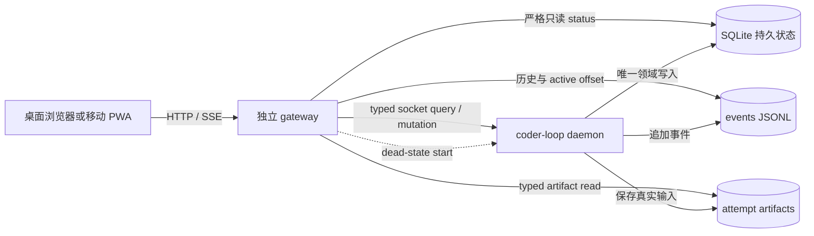
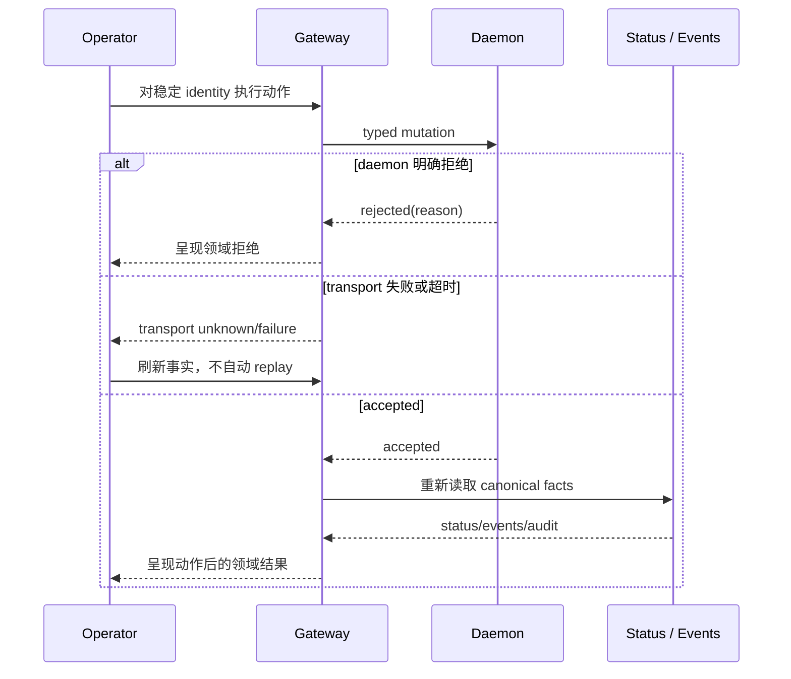

# RFC #544：把 coder-loop 变成一个人可以独立判断和处置的系统

## 1. 从一次值班事故开始

设想操作员在手机上收到一条消息：某个 chain 很久没有继续推进。他现在有几个问题，但没有一个能靠“daemon 进程还在”回答。

他不知道 daemon 是健康、半死还是已经退出；不知道 socket 文件是活连接还是陈尸；不知道 chain 是被 rate limit、gate hold、失败 attempt 还是 operator decision 卡住；不知道最后一次 attempt 实际拿到什么 prompt；也不知道此刻按 resume、unblock 或 restart 是否合适。

在 RFC #544 之前，解决这些问题往往意味着再启动一次 agent 调查。调查者寻找 session、读日志、检查进程、比较数据库与文件，再把若干局部现象解释成一段结论。这个流程有三个结构性缺陷。

第一，操作员看到的是解释，不是原始事实。调查可能选错 run，或者把 worktree、git branch、pidfile 之类的旁证误当成领域状态。

第二，调查会受到时间漂移。当前 preset、当前 item 和当前文件不一定等于某次历史 attempt 当时看到的输入。事后重建出来的 prompt 可以语法正确，却仍然不是当时发送给 runner 的文本。

第三，观察入口依赖被观察对象。daemon 崩溃时，任何依赖 daemon RPC 的“监控”都同时失效；浏览器连接失败也无法告诉人究竟是 daemon 死亡、gateway 不可达还是 mesh 断开。

因此，这个 RFC 并不以“有一个 Web 页面”为完成条件。它要改变操作员获得事实的方式：无需 agent 代查，能够从一个仍然存活的入口识别故障域、沿稳定 identity 进入具体执行、阅读真实输入、执行有限动作，再从权威读面确认结果。

全文用四个设计命题说明为什么要实现这些能力，以及这些能力具体是什么：

1. 证据必须比被观察进程活得更久；
2. 观察不能修改、重建或美化事实；
3. 观测与控制必须共享 identity，但不能共享权威；
4. GUI 的价值由完成诊断闭环所需的时间衡量。

## 2. 命题一：证据必须比被观察进程活得更久

### 2.1 为什么 gateway 必须是另一个进程

将 HTTP server 放进 daemon 看似减少了组件，却让观察面和执行面共享同一个故障。daemon 一旦因未捕获异常、runner failure 或资源问题退出，页面、API 和实时连接也一起消失。此时浏览器只能显示“连接失败”，而无法说明 daemon 是否留下持久状态、最后事件或崩溃线索。

RFC #544 实现一个独立的 TanStack Start/Bun gateway。它与 daemon 同仓、同版本演进，但不与 daemon 共生命周期。gateway 负责静态资产、server routes 和 SSE；daemon 负责调度、领域写入和 mutation 裁决。

这项分离必须在两个方向都成立：

- daemon 已死时，gateway 仍能打开页面、读取持久状态、查询历史事件并提供 dead-state start；
- gateway 被关闭时，它此前启动的 daemon 继续运行，不被父子进程关系或信号转发带走。

gateway 不是新的 daemon，也不是通用 supervisor。它不会自动守护、循环拉起或制定重启策略。它只实现操作员明确触发的 start、stop、restart，并用外部证据判断动作之后发生了什么。

### 2.2 为什么不能只有一种数据通道

把所有读取都做成 daemon RPC，会在 daemon-down 时失去最有价值的证据。反过来，让 gateway 直接扫描所有 runtime 文件，又会绕过领域 owner，逐渐形成第二套状态解释器。

所以系统按事实的生命周期分成三个面。

**持久状态面**保存队列、chain、item、run 和 task tree 的最后持久事实。gateway 通过 engine-owned strict reader 读取 SQLite，不持有写连接，也不实现自己的 SQL 投影。

**事件面**保存过程事实。gateway 读取主 events segments 的历史与 active byte offset，把新事件推送给浏览器。daemon 退出后，既有历史和最后事件仍在，已建立的 SSE 连接也不因 daemon 退出而自动关闭。

这里真正获得“直接刮 runtime 文件”特许的只有 events JSONL，因为它已被钉成 gateway 的同仓消费合同。attempt artifacts 由专门的 artifact owner/path boundary 提供，pidfile 与 socket 也只按三证探针合同读取；它们不是 events 豁免的扩张。其他 agent、supervisor 或脚本仍不得把任意 runtime 文件当公共 API。

**瞬时控制面**处理 daemon 当前可回答的查询和写动作。它使用 typed socket transport。daemon 不可用时，该面应给出精确失败，而不是从数据库旁路执行同一个动作。

三个面在 UI 中可以互相跳转，但它们没有一个共同的全局时点。SQLite snapshot、活性探针与事件文件各自保留采样时间。系统不会为了让页面“看起来一致”而声称跨 SQLite、文件和进程的原子世界状态。

### 2.3 一个 gateway 只能观察一个 root

进程独立还不够。如果同一个 gateway 可以由 request 参数切换 loop-data root，一个浏览器请求就可能读到另一个环境，identity、监听面和缓存也会失去固定含义。

因此 gateway 在启动时解析一个 loop-data root，并把它存入不可变的 typed runtime context。URL、query、body、header 和前端状态都不能覆盖、枚举或逃逸这个 root。切换 root 的唯一方式是启动另一个明确配置的 gateway 实例。

这个不动点同时约束所有路径：status、events、attempt artifacts、daemon pid/socket 和 gateway 自己的诊断都必须来自同一个 root。它不是 UI 默认值，而是进程级隔离边界。

### 2.4 宿主、静态资产和监听必须形成一个生命周期

gateway 作为一个产品进程，对外提供四个稳定的 root 级命令：`gateway:start`、`gateway:build`、`gateway:typecheck`、`gateway:test`。生产进程由同一个 owner 管理静态资产与 routes；不会再启动第二个静态文件 server。

静态资产处理先于业务 route，并拒绝 traversal、目录和非文件路径。多个显式 listener 共享同一 handler 和同一 PID。若任一必需 listener 启动失败，整个 gateway 启动失败并清理已经建立的 listener，不能留下“本机可用、mesh 半失效”的半就绪实例。

监听集合只包含 loopback 与明确的 NetBird interface address。不存在 `0.0.0.0`、`[::]`、LAN fallback 或公网入口。NetBird 地址漂移时更新配置或重启，而不是放宽监听。

停止时，对捕获的 gateway PID 发送 `SIGINT`，等待进程退出，并确认所有 listener 都消失。这个闭环确保运行手册描述的对象就是生产进程，而不是一个遗留子进程或另一个静态 server。

## 3. 命题二：观察不能修改、重建或美化事实

### 3.1 严格只读是一种证据资格

如果 status reader 在打开数据库时创建 WAL/SHM、改变 journal mode、执行 migration 或写入 metadata，它就改变了自己正在观察的现场。在 daemon-down 排障中，这尤其危险：读取动作可能覆盖原始故障条件，也可能改变之后 daemon 重启时看到的 schema。

RFC 实现一个 engine-owned strict status 入口。它从打开到关闭都保持只读，不创建数据库或 sidecar，不执行 DDL、migration 或写 PRAGMA。live-WAL 与 daemon-down 两种状态都要经过同一个合同。

读取结果不是 `ok | missing` 两种。缺盘、权限、损坏、旧 schema、未来 schema 和合法 snapshot 都是可穷尽的结果。错误发生在打开、读某张表或组装 tree 的不同阶段，不应让同一个根因换一种领域含义。

一次 status 中的 SQLite 槽来自一个 read transaction。即使 daemon 正在提交，chain、items、current、runs 和完整 task tree 也只能整体属于提交前或提交后。系统不会从 process、worktree 或 git 旁证补造缺失 identity。

### 3.2 最终 wire 才是消费者依赖的对象

内部对象通过一次断言，不等于最终 JSON 已被证明。如果 serializer 在断言后 flatten 字段、合并 extra 或删除 `undefined`，CLI 和 HTTP 消费者实际收到的是另一个对象。

因此最终 `status --json` 与 gateway HTTP response 共享一个 engine-owned exact boundary。public wire 本身必须通过它。顶层与每个嵌套槽都有精确 shape；有限状态用 discriminated union；task tree 使用 CAP-1 的 leaf、seq、par variants；hook 与 CAP-4 的 producer shape 就绪后也必须进入同一公共 boundary。

前端类型、route result 和 CLI 输出从这一 boundary 派生。public wire 通过验证后不得再发生结构改写。这样，新增 variant 会在所有消费者上形成编译工作清单，而不是被匿名 `object` 或 default 分支吞掉。

这条规则不只适用于 status。status、socket RPC、events、attempt artifacts、compile、context、mutation 与 CAP-4 都必须从各自 owner 的 runtime boundary 派生类型。禁止 `any` 和匿名 domain shape；`unknown` 只允许短暂存在于 catch 或外部 parse 入口，并立即由精确 parser 收窄。除 `as const` 外，不用类型断言跨过已经断裂的类型链。

gateway 也不能为了接入方便复制 schema、command registry、framing、parser 或状态推断逻辑。依赖方向始终从 gateway 指向 engine/CAP owner；engine `src/` 不 import gateway，也不出现 UI route、组件或显示文案等 GUI 概念。否则观测面会反向污染被观测的领域层。

### 3.3 Hooks 的当前事实与过程事实不能混在一起

操作员看到 chain 没推进时，需要区分“没有 worker”与“正在等待 hook/gate”。status 因而提供四层 hook 声明合成后的 effective view，并标明每项来自 global、chain、preset 还是 item。gate hold 需要显示 decision point、开始时间，以及下一次重问或继续判断所需的节奏线索。

当前 effective view 属于 status；`hook.*` events 属于过程。二者通过 owner-defined hook identity 关联。GUI 既不重新执行四层合成，也不从事件历史倒推 current hooks。chain 详情展示完整有效配置，首屏异常区只提取当前 hold 和影响推进的关键信息。

### 3.4 活性证据必须保留原始分歧

界面所称的 daemon“三证”不是约定俗成的一个健康检查名称，而是三次分别发生、分别计时的观察。

第一项从 pidfile 开始：文件是否存在、内容能否解析、对应 PID 在采样时是否仍有进程。用 signal probe 检查进程活性是一种可用观察，但合同要求保留的是原始分类、errno 和采样时间，而不是把 probe 的布尔结果当作 daemon 健康。

第二项只问 Unix socket 能否建立连接。它不推导 endpoint 会读取请求、完成 framing 或返回合法领域响应。

第三项发送带 request id 的 `daemon.status`，要求在 deadline 内收齐一个 envelope，验证 id 相同，并把 result 解析成精确类型。超时、EOF、半包、非法 envelope 和 daemon 返回的错误都不是成功响应。

这三项不能互相覆盖。pidfile 缺失但 RPC 成功、PID 存活但 connect 失败、connect 成功但 RPC 卡住，都要原样呈现，并附各自时间和失败原因。只有这样，首屏才不会把最有诊断价值的半死状态压成红绿灯。

### 3.5 Events 必须保存过程，而不是伪造一条完美日志

假设 daemon 在一次 size rotation 附近退出。页面至少要回答三个不同的问题：已经写入主流的最后一条是什么，是否留下 stop/fatal 或崩溃线索，以及哪些异常与当前 chain/run 有关。它不需要把几个物理文件重新包装成一份“绝对真相日志”，但也不能因为来源不同就让这些证据在界面上消失。

为了守住正常路径，普通、timer 与 fatal 写入口共享写入所有权；day/size 翻段分配唯一 segment，并把触发翻段的那条记录写入可发现的文件。该保证止于正常 append 和 rotation，不延伸到掉电、任意 kill point、fsync 或 crash journal。

读取端扫描已封存段并跟踪 active file 的 identity 与 byte offset。文件通知只唤醒检查，不能代表“恰好来了一个事件”。浏览器可按 chain、item、runId、phase 与时间窗口查询历史。offset 只在当前 reader 生命周期中维持翻段连续性，不对外承诺 replay，也不在 gateway 重启后恢复旧订阅。

若交付范围内的真实历史暴露坏行、尾部 partial 或旧 payload，reader 要给出明确结果，并只为已经证实的格式建立最小兼容。合成非法输入仍用于验证 parser 拒绝；“以真实样本决定兼容范围”并不禁止负例 fixture。没有实际代际证据时，不预建通用版本迁移系统。

UI 将可回答的问题而不是物理文件名放在前面：事件历史、最后进展、已知死因、崩溃诊断与点名异常各自标来源。它不会声称这些来源共享全局顺序或完整因果。

### 3.6 SSE 的失败边界属于 gateway，而不是 daemon

SSE 已建立后，daemon 停止只意味着暂时没有新主事件；连接和历史查询仍可使用。浏览器断开时，watcher、reader、offset、interval 与 subscription 都应立即释放。close/enqueue race 不得杀死 gateway，断开后新的 API 与 SSE 请求必须仍可建立。

这项实现保证的是连接生命周期与资源回收，不是消息系统语义。它不提供离线队列、客户端确认、replay 或 exactly-once。

### 3.7 历史 prompt 不能靠现在重新计算

某次 attempt 的真实输入由当时的 pinned definition、item 状态和 bindings 共同决定。当前 preset 即使同名，也可能已经变化。GUI 若事后调用 renderer，会生成一份新的文本并把它错误地展示成历史事实。

每次 fresh、普通 resume 和 chain-complete finalizer attempt 都保存 `prompt.md` 与 `bindings.json`。runner argv 与 `prompt.md` 使用同一个 effective prompt；bindings 记录每个 key 的来源和当次 render string；resume 记录其 variant 和续接 session。finalizer 的固定“继续”只属于该特例。

prompt 与 bindings 都完整、属于同一 attempt identity 时，artifact 才是 present。写入失败不能阻止 runner，但要留下与 attempt 关联的 diagnostic。legacy missing、write failed、incomplete 和 parse failure 分开表示，页面不能用空文本或当前重建值填补。

spawn、retry 和 daemon restart recovery 按完整 CAP-2 identity 解引用 pinned definition，不重读当前路径。RFC 不规定 TTL、永久保留或具体 GC 算法。CAP-3 的 typed value 只能作为现有 scalar render string 上的 additive evidence，具体字段由其 owner 定义。

artifact 通过独立 typed route 读取，不进入 status 正文。页面逐字显示 prompt 和 bindings 对照，不做 Markdown 渲染、插值或重放。

### 3.8 Current compile 与历史执行回答不同问题

历史 attempt 页面回答“当时发了什么”；compile 页面回答“如果现在选择这个 preset，编译器认为什么”。同一个 definition 名称出现在两处，并不让两种时间语义变成一回事。

用户选择 preset name 后，gateway 调用 CAP-7 与 CLI 共用的编译路径。一次 refresh 只接受一个带 schemaVersion 的 artifact；状态图、phase tree、variables、tools、fragments 与 findings 都从这一个结果展开，不能各自重新编译。

失败页面必须避免提供“看起来差不多”的图。如果编译器明确 rejected，就展示 findings 与拒绝；如果 artifact 版本超出 consumer 能力，就显示实际版本并停止；如果 boundary 非法或 transport 失败，就说明失败发生在传输/解析而不是 preset 语义。任何一种都不能拿上一版缓存或 partial block 冒充本次成功。

GUI 不读取 TOML，也不实现第二个 compiler。该页面没有历史 pinned 入口或 current/pinned 双视图；历史执行证据仍由 attempt artifact 提供。

### 3.9 Context 必须保持不透明

context 页面展示的是旁路证据，不是新的控制语言。它从 daemon 的 operator read 入口消费 CAP-6，按 item 谱系、chain 公告和 group 分支组组织内容。entry 的 identity、时间、scope 与 author 由 upstream boundary 定义，body 保持不透明；分页和过滤也沿同一合同流入 gateway。

一段 body 即使长得像 Markdown 命令、状态更新或系统提示，也只能作为原文显示。前端不解释它、不直读 store，也不根据数据库内部字段发明 cursor。

获得 read 能力并不授予 write protocol 所有权。上传会话怎样跨重启、重复 commit 怎样处理、事件与数据库怎样协调、多久保留，都仍属于 context producer 的问题。RFC #544 只要求成功持久化的 entry 能通过正式读面到达浏览器。

## 4. 命题三：观测与控制必须共享 identity，但不能共享权威

### 4.1 没有稳定 identity，钻取只是页面跳转

当一个人把 run 页面 URL 发给另一位操作员，两人必须定位到同一次执行，而不是各自浏览器里的“当前 run”。这要求 URL 从 daemon、chain、item、run 一直到 phase/attempt 都携带明确 typed identity。解析结果要能说明对象存在、已经消失、已过期，或根本不属于 URL 所写的父对象；显示名、数组位置和当前选择都不能替代 identity。

task tree 直接消费 CAP-1 的 leaf/seq/par union，穷尽展示 join、reopen、closure lifecycle、branch 与 session identity。新增 variant 必须暴露编译缺口。v2 线性 chain 使用 producer 提供的退化树；前端不会复活 slot 或从 worktree/git 重建树。

event envelope 的 chain、item、runId、phase identity 用于跳到对象；对象页面用同一个 typed filter 反查事件。它们共享 identity，但不因此共享存储事务或时间顺序。

### 4.2 Socket transport 不能把“不知道”压成失败

status query、context read 和控制动作共用一条 transport 地基，但它们不能共用一个宽松 JSON 结果。command registry 决定 command、args、result 与 error 的对应关系；gateway 从该 registry 派生 client，不复制命令字符串、framing 或 response parser。

一次调用必须在 deadline 或 caller cancel 内结束。到期时 client 主动销毁底层 socket，不能只是放弃 await 而留下连接。connect failure、EOF、只收到半个 frame、非法 envelope、response id 不匹配、daemon 明确拒绝，以及 mutation 已发送但响应未知，必须保持不同类型。

这种区分直接影响人是否可以重试。daemon 的领域拒绝表示动作没有被接受；transport 未确定则可能已经提交，页面只能刷新权威事实，不能自动再发一次。反过来，protocol error 也不能被包装成普通业务拒绝，否则 parser 漂移会看起来像用户操作错误。

### 4.3 写面只覆盖诊断闭环需要的动作

GUI 的动作按目的分成三组。恢复观察对象时可以 start、stop 或 restart daemon；调整既有工作时可以 unblock、暂停/恢复 chain 或重排 item；遇到 evaluation 时，只在 capability 允许的情况下提交 `advance`、`hold` 或 `reopen`。

这三组动作构成完整闭集。创建 chain、添加 item、batch 和其他 daemon command 不进入 Web，新命令也不会自动获得 route。除 dead-state start 由 gateway 从外部拉起 daemon 外，其余 mutation 都经过 engine-derived typed façade。

gateway 沿既定 mesh 信任模型作为 operator 发起调用，但 daemon 仍是合法性裁判。页面不复制 target、状态转移或 authority 判断，也不以 agent credential 模拟 operator。

每个动作区分 accepted、rejected、failed 与 transport 未确定结果。accepted 后，从 canonical status 读取核心状态，从相关 events/audit 获得诊断证据。这个要求不等于跨 SQLite、process、events 和 response 建立共同 commit，也不要求 durable operation、query/replay、outbox、saga、command log 或 exactly-once。

### 4.4 Decision 不是另一种 resume

CAP-4 evaluation 由 par/epoch identity 及 binding version 关联，decision 是 `advance | hold | reopen` ADT。页面先查询当前 operator 对该 evaluation 的 capability，只展示允许动作；没有 capability 时显示 authority gap。提交时 daemon 再检查 currentness。

accepted decision 由真实 evaluator 消费。status、event 和 audit 引用同一 evaluation identity、operator 与 decision。resume、unblock、修改 join 或 reopen count 都不能替代 decision；GUI 也不能因为自己是 operator 就自授 capability。

### 4.5 成功必须回到权威读面

一次按钮点击可能完成 transport，却被 daemon 拒绝；也可能 daemon 已接受，但客户端在响应前断线。页面必须让这些情况保持不同。

真正的诊断闭环是：动作请求携带稳定 identity，daemon 给出 typed 结果，页面再从 canonical status 和相关 events 观察变化。若结果未确定，就明确显示未确定并允许人刷新事实；不自动重放可能已经生效的动作。

## 5. 命题四：GUI 的价值由诊断闭环时间衡量

### 5.1 首屏先回答“要不要处理”

首屏不是总览所有数据，而是压缩操作员的第一次判断。它同时显示三项 daemon 证据及采样时间、active runs、最近转移、rate-limit 冷却、当前 gate hold、点名异常、最后事件和已知死因线索。

daemon dead 时，gateway 仍显示 SQLite 终态、events 历史和诊断来源；mesh 断网时，gateway 本身不可达。两者不能共享同一个“离线”标签。

无证据时显示未知，不根据最后时间戳或进程退出码编造死因。首屏提供下一步入口：进入受影响 chain、查看 attempt 输入、阅读相关事件，或执行当前可用的有限动作。

### 5.2 深入页面按问题而不是按文件组织

chain 页面解释当前状态、task tree、active run、effective hooks 与 hold；item/run/attempt 页面逐层缩小 identity，并把事件与真实输入放回同一执行语境。compile 页面解释当前定义，context 页面提供旁路原文。用户不需要知道数据来自哪个文件才能导航，但每条事实仍标明自己的 owner 和来源。

### 5.3 安装到手机不能改变事实来源

移动入口仍是同一个 gateway。桌面与手机共享 route graph、typed clients 和 mutation façade；布局可以重排，但不能为了小屏幕改用简化 API、减少错误 variant 或建立 mobile backend。

首屏在窄 viewport 中优先放三证、active runs、异常与动作，并消除横向溢出；深层证据仍可继续钻取。可安装产物明确包含 manifest、icons 与 service worker，使页面可以加入主屏、以 standalone 窗口启动，但安装不会赋予离线读取或离线控制能力。

真实请求只到 loopback 或明确 NetBird 地址。mesh membership 是既定准入边界，所以无需再叠加登录、token、SSO 或 Keycloak；同样也绝不允许 wildcard、LAN 或公网监听。

响应式收口必须同时验证桌面非回归。PC viewport 要重新走查首屏、层级钻取、prompt/compile/context 页面和控制路径；移动布局不能通过隐藏错误、减少字段或换用不同 API 获得“适配”。

## 6. 五组反证实验如何证明系统成立

这份 RFC 不能靠“build 通过”关闭。验证应主动制造最容易让系统撒谎的场景。

### 6.1 观察是否改变现场

准备正常数据库、live-WAL 数据库、daemon-down 数据库、缺盘、只读权限、损坏与不可消费 schema。对每种输入运行真实 CLI 和 production gateway status route，比较读取前后的文件成员、bytes、metadata、journal/schema 状态。

随后在 status 多步读取之间插入 writer barrier。结果只能是完整提交前或提交后，不能出现跨提交混合。CLI 与 HTTP 的最终 JSON 必须通过同一个 exact boundary；非法 extra 或 variant 要在消费边界被拒绝。

### 6.2 观察者是否真的独立

启动 gateway 和 daemon，记录两个 PID 与两个显式 listener。杀死 daemon，确认 gateway 页面、历史事件、持久队列和三证仍可读；从浏览器执行 start，确认新 daemon 与 gateway 解耦，三证分别翻绿。再退出 gateway，确认 daemon 仍存活。

完整矩阵还要故意制造分裂：保留活 PID 但让 socket 不可达；让假 peer 接受 connect 却不返回 RPC；返回错误 request id 或非法 envelope；删除 pidfile 但保持真实 RPC 可用。页面应分别保留 process、connect 与 RPC 的原始结果、失败原因和采样时间。另从手机断开 NetBird，对照“gateway 不可达”与“gateway 可达但 daemon dead”，证明网络故障没有被折成 daemon 状态。

transport 本身用真实 Unix socket 负例验证 deadline、caller abort、EOF、半包、非法 envelope、id mismatch 与 daemon rejection。每个超时/cancel 后检查 socket 已销毁，并确认后续请求不受残留连接影响；各领域 façade 的 result/error 必须从 registry 派生，而不是测试专用 parser。

测试单 root 负例：通过 path、query、body、header 和前端状态尝试切换或逃逸 root，全部拒绝。测试监听半失败：让一个必需地址不可绑定，gateway 必须清理另一个已建立 listener 并整体失败。

测试静态资产边界：正常文件可读，traversal、目录与非文件路径拒绝；不存在第二静态 server。最后以 `SIGINT` 停止，`wait` 并确认所有 listener 消失。

### 6.3 实时链路是否在边界上保持诚实

用普通、timer、fatal 三类真实 writer 产生事件，触发 day/size rotation，并让 reader 在 active offset 上交错读取。检查 committed events 在正常 append/rotation 下无丢无重，history filter 同时覆盖 chain/item/runId/phase 与时间范围。

保持 SSE 连接后杀 daemon，连接仍存活、历史仍可查询。再强制断开客户端，确认所有 watcher/reader 被回收，gateway 未退出，新的健康请求和 SSE 可以建立。验证不要求 replay 或 restart cursor。

构造真实历史中的 bad/partial 或不兼容样本，确认读取结果明确；只对已经观察到的格式做最小兼容，不用合成样本证明一个并不存在的通用 migration framework。

### 6.4 页面展示的是否是执行事实

分别运行 fresh、普通 resume 和 finalizer attempt，记录 runner 实际 argv，并与 artifact route 返回的 prompt/bindings 对照。修改同名 preset、重启 daemon 后再读取历史 attempt，内容不能变化或被 current preset 重建。

注入 artifact 写失败，runner 仍继续，页面显示 write-failed/incomplete 并能跳到 diagnostic。legacy attempt 显示 missing，而不是空 prompt。

在同一 phase 制造多次 attempt，并为相邻 attempt 使用不同 prompt/bindings，逐个通过 URL 与 artifact route 读取，确认 identity 不串联。层级导航负例覆盖不存在、已过期和父子关系错误；同名不同 identity 的 event 不能跳到错误对象。task tree fixture 覆盖 leaf、seq、par、join、reopen、closure variants 以及 v2 退化树，渲染处保持穷尽。

为 hooks 构造 global/chain/preset/item 四层覆盖，验证 effective view 与 source layer；进入真实 gate hold，检查 decision point、开始时间和重问线索，再解除 hold，确认 status current view 与 `hook.*` events 通过同一 identity 对账。

compile 页面以 preset name 经过真实 gateway 调用 owner compiler，同时执行 CLI compile，并核对 schemaVersion 与同次 artifact 的状态图、phase tree、variables、tools、fragments、findings。分别制造 compile rejection、unsupported version、invalid boundary 和 transport failure，确认页面不使用缓存或 partial 内容冒充成功。

context 则通过真实 daemon operator read 写到 gateway 再到浏览器，覆盖 item、chain、group 三种 scope。body 放入 Markdown、状态词和类似命令的文本，确认页面仍按 opaque evidence 显示；pagination/filter 使用 upstream 实际合同，非法 request 与 transport failure 进入各自 typed 状态。

### 6.5 人能否完成一次端到端处置

在真实 production gateway 中，从首屏进入受影响 chain，沿 item、run、attempt 到 prompt，再从事件跳回对象。执行 unblock、chain stop/resume、reorder 以及有 capability 的 decision；覆盖 accepted、rejected、failed 和 transport 未确定结果，并从 status/events/audit 核验。

通过真实 NetBird 手机核对 manifest、icons 与 service worker 均由同一个 gateway 提供，再完成加入主屏、standalone 打开和至少一个生命周期/解卡动作；确认请求到达 mesh listener而不是 LAN/代理。随后在 PC viewport 重走主要页面和控制路径，证明移动改造没有回归桌面。

每次验证记录冻结 SHA、环境、root/fixture、命令、实际观察和证据位置。局部产品 issue 证明自己的行为；跨能力 integration 和发布候选 compatibility 由各自 owner 执行，不能用一次宽泛 E2E 替代所有定向证据。

最终 D14 证据账在同一冻结 SHA 上逐项覆盖十个关闭结果：可靠首屏、daemon-down 观察与恢复、实时推送、prompt 展示、完整层级、移动/PWA、严格 F 控制面、mesh-only、compile 预览和红线不破。某一行失败时回到对应 D1–D13 owner 修复并重跑，不允许在收尾文档中降低 expect。

“红线不破”需要可重跑的仓级审计，而不是一句 code review 结论：对生产边界与新增行扫描 `any`、匿名 `object`/raw record、内部滞留的 `unknown` 和非 `as const` 类型断言；沿 import graph 证明 engine `src/` 不依赖 gateway；核对每个 Web client 的 schema、command 与 parser 都来自 owner export；确认不存在第二 status builder、第二 compiler、平行 event shape 或裸 socket command 字符串。扫描命中必须逐项解释或消除，不能用 allowlist 把新 domain 退化隐藏起来。

## 7. 设计停止线

以下能力不属于本 RFC：完整 CLI parity、chain/item 创建、原生移动应用、public ingress、应用层登录、SSO/token、通用 process supervisor、server/response caps 作为统一交付门槛、events replay、通用 schema migration、crash journal、跨介质原子事务、historical compile、context write recovery、认证重构和 durable mutation 平台。

这些不是待选择的候选，而是需求强度的边界。调查发现的风险可以影响实验、参数或未来提案，但不能自动变成当前保证。实现不得用“更稳健”为理由引入 outbox、saga、exactly-once、无限 retention、全局事件序或第二审计日志。

## 8. 实现完成后，操作员获得什么

操作员不再需要先让 agent 解释系统。他可以直接区分 gateway 网络故障与 daemon 死亡；在 daemon dead 时读取最后持久状态和事件；确认进程、socket、RPC 哪一层失效；沿稳定 identity 找到具体 attempt；阅读 runner 当时真正收到的 prompt；理解 task tree、hooks、gate hold 和当前 compile；在手机或桌面执行有限动作；最后从权威 status、events 和 audit 判断结果。

这就是 RFC #544 实现的核心：它不是把内部数据公开得更多，而是建立一条不会因 daemon 死亡、时间漂移、前端猜测或控制越权而断裂的证据链。

## 9. 事实追溯

本文用当前工作目录中的稳定与纠偏后材料核验事实，但没有沿用其章节顺序：

- `SYNTH-544-gui-observability-gateway.md`：原始目标、操作员裁决与设计材料；
- `AGG-544-gui-observability-gateway.md`：稳定能力与终态边界；
- `expected-foundation-544.md`：修补后地基保证与明确排除项；
- `demand-D01-544.md` 至 `demand-D14-544.md`：各能力的原子需求；
- `supply-demand-match-544.md`：producer、consumer 与接缝所有权；
- `rationale-analysis-544.md`、`implementation-analysis-544.md`：独立事实分析，仅作为核验输入，不作为本文结构模板。
