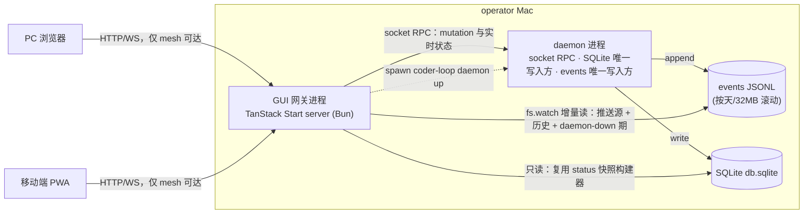

# AGG-#544 — v3 可观测性 API 与 Web GUI 网关：全局聚合视图

> **性质**：本文件是聚合产物（草稿），唯一事实源为 `v3-issue/synthesized/SYNTH-544-gui-observability-gateway.md`（下称 SYNTH，溯源标注 `SYNTH:<行号>`）。
> **目的**：溶解 issue 容器边界，把设计、终态、已成立事实、交付物与其全部代际验收标准、跨树能力依赖聚在一起，供全局视角重新拆分。
> **方法约定**：
> 1. 只搬运不判断——冲突的标准并排列出并标注，不裁决取舍。
> 2. supersession 链取链尾版本，链上被真实运行证明过的修正事实保留。
> 3. 树内 issue（原 #571–#585 与 #716–#729）之间的 Depends/Blocks 全部溶解，不保留任何以 issue 编号表达的先后关系。
> 4. 跨树引用一律翻译为**能力描述**（见第六节），编号仅作溯源标注。
> 5. 源文件里没有的信息显式标「**本文件未含**」，不脑补、不回 GitHub 查证。
> 6. 旧拆分的流程性内容（blocked 路径指令、当时的依赖状态陈述、chain/evidence 现场路径）不属于交付标准，已剔除；剔除处有标注。

---

## 一、裁决层（不可动摇）

### 1.1 操作员七项裁决（2026-07-02，RFC-5 子会话，逐字）［SYNTH:40-50］

| # | 决策点 | 裁决 | 决定性理由 |
|---|---|---|---|
| A | API 层宿主 | **独立 GUI 网关进程**（否决 daemon 内嵌 HTTP） | GUI 价值最高的时刻恰是 daemon 不健康的时刻；观测面与被观测者同进程 = 监控随对象一起死。网关常驻可展示 daemon 死因并远程拉起，补上 `daemon-restart-after-app-update` 的运维闭环 |
| B | 推送通道 | **网关直读 events JSONL**（`fs.watch` + offset 增量），否决 socket 订阅 verb | daemon 死时通道依然活；零引擎改动。**豁免声明**：「消费者从此不刮 runtime 文件」禁令（溯源 #411）对网关一家豁免（同仓同版本演进的特许消费者），对 supervisor/agent/脚本等其他消费者禁令不变 |
| C | prompt 持久化深度 | **渲染文本 + 绑定值快照**（`prompt.md` + `bindings.json`） | GUI 可展示变量→值对照，与编译产物元信息预览衔接；绑定表本在内存，成本≈0 |
| D | 暴露与鉴权 | **mesh-only 裸信任**：只绑 localhost + netbird 接口，无应用层鉴权 | 控制面动作全在 mesh 内，与既有运维面信任模型一致；bearer token 登记为可选演进，不进 v3 验收 |
| E | 仓库归属 | **monorepo**（coder-loop repo 内） | B 裁决使 events 文件形态成为网关正式契约面，「钦定内部契约」只有同仓同版本演进才安全；跨 repo 即变成事实公共 API |
| F | 控制面范围 | **观测 + daemon 生命周期 + 解卡动作**（否决完整 CLI parity） | 手机场景 = 看见异常当场处置；创建类重交互（chain create / item add）留给 CLI/agent，不进 v3 |
| G | 前端栈 | **TanStack Start** | 操作员指定。自带服务端运行时——网关进程即 TanStack Start server 本身，一个进程承载静态资产 + API server routes + WS/SSE 推送 |

### 1.2 代码红线（操作员裁决 2026-06-12，全仓统一，逐字）［SYNTH:112］

> 必须全链路 ADT，禁止任何类型退化。不引入 `any` / 匿名形状；`unknown` 仅限 catch 与边界 parse 入口；禁止真 `as` 断言（`as const` 除外）；外部输入经边界 parse（arktype）为精确类型后流转；不得删除类型依赖、绕过或降级既有类型边界。违反红线 = changes requested，无例外。前端同样适用（边界 parse 进精确类型）。

### 1.3 约束（逐字）［SYNTH:113-116］

- 网关对 SQLite **严格只读**；一切 mutation 经 daemon socket RPC。
- 网关只绑 localhost + netbird 接口，**无公网监听**；无应用层鉴权（D 裁决），token 为登记在案的可选演进。
- 「消费者不刮 runtime 文件」禁令（溯源 #411）对网关之外的一切消费者继续有效；events 直读豁免仅限同仓网关。
- 一个网关实例绑定一个 loop-data root（默认生产 `~/.coder-loop/loop-data`）；隔离 e2e root 不带 GUI。

---

## 二、终态层（到底要做什么）

### 2.1 操作员目标（verbatim）［SYNTH:22-24］

> "v2 已经 daemon 化，但是 v2 的可观测性很弱，每次都是 agent 去找 session 看。假如存在一个好的 web GUI，则看一眼就知道跑没跑。所以我希望 v3 有 GUI，GUI 的设计需要同时考虑 PC 和移动端，GUI 除了做全链路展示，还得有 prompt 展示。" — `v3/v3-goals.md` 目标 1（2026-07-02）

> "因为全链路类型化，所以状态机的判定来源是可计算类型……我认为这部分需要 GUI 可预览。" — `v3/v3-goals.md` 目标 3（预览部分归本 RFC）

### 2.2 关闭验证十行（逐字）——全局目标的完整枚举［SYNTH:118-133］

| # | 终态条件 | 验证 | Expect |
|---|---|---|---|
| 1 | 「跑没跑」一眼可见且判据可靠 | daemon 活/死两种状态下打开 GUI 首屏 | 活：呈现活 run 与最近事件；死：明确显示死了、死于何时、最后事件与三证细节；与断网可区分（网关仍应答） |
| 2 | daemon-down 可观测且可恢复 | 杀掉 daemon 后从浏览器/手机操作 | events 历史与队列终态照常可读；GUI 一键拉起 daemon 成功且状态翻绿 |
| 3 | 实时推送 | 起一轮真实 run（可用 real-e2e fixture chain），开着 GUI 观察 | 无手动刷新，agent.spawn → phase 推进 → agent.exit 全链路事件实时到达 |
| 4 | prompt 展示 | 打开任一已完成 attempt | 渲染全文 + 变量→值对照 + fresh/resume 标记；全文与实际 argv 所发一致 |
| 5 | 全链路层级展示 | 从 daemon 首屏钻取到 chain → item → run → phase/attempt | 各层可达；从任一事件可跳到其 run/item |
| 6 | 移动端可用 | 手机经 netbird mesh 打开 + PWA 安装 | 首屏与控制面动作在移动端可完成；PWA 可加主屏 |
| 7 | 控制面范围恰为 F 档 | 遍历 GUI 全部写入口 | 仅 daemon 生命周期 + unblock + chain stop/resume + item reorder + capability-gated per-epoch operator decision；无任何创建类入口 |
| 8 | mesh-only 暴露 | 从非 mesh 网络访问网关端口；mesh 内访问 | 前者不可达，后者可达；监听面仅 localhost + netbird 接口 |
| 9 | 元信息预览 | 在 GUI 选任一 preset 查看结构 | 状态机图/phase 任务树/变量类型流渲染自 preset 编译产物（stateGraph 与 phases+任务树块，能力 CAP-7），与 CLI 导出一致 |
| 10 | 引擎红线不破 | grep 引擎与网关代码 | 网关无 SQLite 写路径；引擎无 GUI 字面量/反向依赖；「不刮 runtime 文件」禁令措辞对非网关消费者保持 |

### 2.3 范围外（逐字）［SYNTH:135-141］

- 完整 CLI parity（创建类表单 UI）——F 裁决明确排除。
- 公网暴露 / Keycloak SSO / bearer token——D 裁决排除，token 为可选演进。
- 原生移动 app——PWA 覆盖。
- A 域资产收编（trace / evidence / handoff 的格式化展示）——两域边界（溯源 #411）不变，GUI 对 A 域只做路径引用与原文透传。
- 第三方调用 ingress 的实现——归 RFC-6（溯源 #548）。

### 2.4 伞级验证边界［SYNTH:143-148］

- 本 RFC umbrella 不直接运行测试，也不以任一 implementation PR 的局部测试关闭。
- 跨 child 的 v3 新语义接缝由**专用整链路 integration 验收**在冻结合流 SHA 上证明（文件记为 #684，流程锚，溯源保留）。
- 现有 bundled preset 兼容性由**专用 compatibility real E2E 验收**在发布候选 SHA 上执行 `bun scripts/real-e2e.ts`（文件记为 #685，流程锚）；本 RFC 不运行该命令。

---

## 三、固定设计骨架（设计不变，拆分可变）

### 3.1 架构［SYNTH:52-74］

- **三个数据面各司其职**：mutation 与瞬时状态走 socket RPC（网关无 agent 凭证，daemon 视之为 operator 主体，`logs.query` hard-deny-for-agent 不影响它，零新增鉴权面）；事件推送与历史走 events JSONL 直读；队列/链快照走 SQLite 只读——`buildCoderLoopStatusSnapshot` 本就只读直读 SQLite，网关同仓 import 复用同一构建器。
- **daemon-down 行为（本 RFC 立身场景）**：daemon 死后网关照常服务——events 历史与死前最后事件（JSONL）、队列终态（SQLite 只读）、死因线索（`daemon.fatal`/`daemon.stop` 事件与落盘崩溃记录）可读；活性判定用三证探针（pid 文件 + socket connect + `daemon.status` 应答），三证呈现给前端而非折叠成一个布尔——「进程活但 socket 死」的分裂状态（溯源 #359）如实展示。GUI 提供一键 `daemon up` / restart。
- **推送**：网关把 events 增量经 WS/SSE 推给前端；前端快照类数据走 server routes 查询 + 事件驱动失效。（通道种类后经 spike 定案为 SSE，见 4.2。）

### 3.2 信息架构［SYNTH:82-88］

- **层级**：daemon → chains → items → runs → phases/attempts，与既有关联键（chain/item/runId/phase）一致；事件→run→item 可关联跳转。
- **首屏「跑没跑」判据**：daemon 三证状态 + 每 chain 的活 run/最近转移 + rate-limit 冷却（`daemon.status.rateLimit`）+ 最近异常事件（`daemon.fatal`/`scheduler.tick_failed`/`attempt.timeout` 等）。daemon 死与断网可区分：网关仍应答即非断网。
- **prompt 展示**：per attempt 的渲染全文 + 变量→值对照表 + fresh/resume 标记。
- **元信息预览**：消费编译产物（CAP-7）渲染状态机图/phase 结构/变量流。
- **移动端**：同一响应式应用 + PWA（可加主屏），不做原生壳；移动首屏偏「跑没跑 + 异常清单 + 控制面动作」，深层浏览与 PC 同构。
- **展示原则（任务树）**：GUI 是闭包状态机同一事实源的展示投影，禁止另建状态推断——不得从 worktree 目录存在性、git 现状、进程状态等运行时痕迹反推闭包态［SYNTH:97-101］。slot 语义已退役，不再是展示对象；chains→items 层的展示对象是任务树（CAP-1）。

### 3.3 控制面 F 档清单（写动作闭集，逐字）［SYNTH:90-92］

> GUI 全部写动作即以下清单，不多不少：daemon start / stop / restart（start 由网关 spawn `coder-loop daemon up`，stop/restart 经 socket RPC）、`queue.unblock`、`chain.stop` / `chain.resume`、`item.reorder`，以及当前 operator 对指定 evaluation epoch 有 capability 时的 `advance | hold | reopen` decision。全部经 operator RPC 转发；GUI 不推导 decision，也不用 resume/unblock/改 join 冒充；创建类（`chain.create` / `item.add` / batch）不进 v3。

---

## 四、已成立事实层

### 4.1 基线现状事实（本 RFC 要消除的缺陷，五条）［SYNTH:32-38］

1. **对外协议真空**：daemon 唯一控制面是 Unix socket 行 JSON RPC，每请求一连接，无长连接、无订阅推送、无任何 HTTP/WS；`logs --follow` 是 CLI 侧 1s 轮询全量重查再 slice，事件量增长后线性退化。
2. **prompt 事后不可见**：`spawnOneAttempt` 只把 `promptChars` 写进 `status.json`；渲染后 prompt 全文只作为 argv 传给 runner，不落盘；事后重放 `renderPrompt` 不可行（ctx 依赖 item 当时状态快照与一次性 `runId`）。
3. **「跑没跑」判据不可靠**：`status --json` 的 daemon 字段不可信、sock/pid 可能是陈尸文件；有过「进程活但 socket pathname 丢失」的控制面分裂实证（溯源 #359）与 daemon 崩溃史（溯源 #387/#388/#536）；app 每次更新都必须重启 daemon——daemon 是会频繁死、且死时最需要被看见的进程。
4. **status 快照无契约力**：`StatusSnapshotBoundary` 顶层是七个匿名 `"object"` 槽。行号锚在文件内两处不一致：RFC 记 `src/loop.ts:490-498`［SYNTH:37］，后期观察记 `src/loop.ts:504-512`［SYNTH:1737,1854］——同一事实的时间漂移，两处均如实记录。
5. **数据源良好但无消费面**：44 种编译期 union 事件（五 kind，信封含 chain/item/runId/phase 关联键）、单一 JSONL 流按天/32MB 滚动、`daemon.status`（pid/running/activeRuns/rateLimit）、SQLite 四表——缺的只是网络可达、可推送、daemon 死时仍在的消费面。
6. **（后期核实补充）现状 SQLite 打开路径非只读**：`openSqliteStateStore` 以 `readwrite: true` 打开、可能执行 `PRAGMA journal_mode = WAL`、总是调用 `migrateStateSchema`（文件记 `src/sqlite-state.ts:500-527`）；`buildCoderLoopStatusSnapshot` 经由它读取——「网关严格只读 + 复用该构建器 + 零引擎改动」三者在现状下不可同时成立，这是被独立 review 证实过的硬矛盾［SYNTH:174-178,1737-1738］。

### 4.2 Spike 已验证事实：TanStack Start (Bun) 网关宿主（2026-07-05 passed）［SYNTH:903-1281］

**结论**：G 裁决（单进程承载静态资产 + API + SSE 推送）与 D 裁决（只绑 localhost + netbird，无公网监听）均验证通过。四条证据可复现：

1. JSON API server route 本机 loopback 与远端 mesh peer 均可达。
2. SSE 长连接 65s 无中断、65 条事件无丢无断；客户端断开后进程存活、后续请求正常。
3. 静态资产与 API 由同一进程承载。
4. 监听面收窄成立：`lsof` 仅 `127.0.0.1` 与 netbird IP 两行监听，无 `*:port`/`0.0.0.0`/LAN 网卡；LAN IP 从本机与 mesh peer 两侧均拒达，netbird IP 从 mesh peer 可达。

**四条副作用发现（落地指引，其中第 1 条是硬门）**：

1. **【硬门】SSE handler 必须绑 `request.signal` 干净跟随客户端断开——否则进程崩**。未接 `abort` 时：客户端断开 → `controller.close()` 已跑 → 下一次 push `enqueue` 抛 `TypeError: Invalid state: Controller is already closed` → uncaught → **Bun 进程整个退出**（实测日志在案）。单个恶意/意外断开可打死网关进程。标准写法要点：`closed` 单 latch 保护 push；push 加 try/catch 兜 race window；`request.signal.addEventListener('abort', close, { once: true })` 回收全部旁路资源（fs.watch handle、offset 状态、订阅句柄、interval）。
2. **静态资产伺服归网关自实现**：TanStack Start 生产 `handler.fetch(request)` 只处理 SSR route + server routes，不 serve `dist/client/*`；自定义 server 入口必须前置 `serveStatic` 层（含 path traversal guard）。
3. **macOS 本机 curl → 自身 netbird IP 触发 utun 自环 quirk**（路由决策问题，非绑定问题）；不影响 GUI 使用（本机走 127.0.0.1，其他设备走 mesh IP）；文档登记一句即可，无需机制。
4. **`Bun.serve` 一次调用一个 hostname**——多接口靠多次 `Bun.serve()` 共享同一 `fetch` handler（稳定官方 API，无框架侵入）。

**环境事实（spike 当时值，地址会漂移，复用前须刷新，不得因漂移退回通配绑定）**：Bun `1.3.14`，macOS arm64；本机 LAN `en0=192.168.1.220`，netbird `utun100=100.85.126.69`；mesh peer `vctcn-runner`（`100.85.156.166`，OVH，LAN 不同段，只能经 mesh 到达本机）；TanStack Start scaffold `@tanstack/react-start` latest + `vite ^8` + `react ^19.2`，`vite build` 产出 `dist/client/*` + `dist/server/server.js`（导出 `{ fetch(request) }`）。

**推送通道定案**：SSE（spike 实测满足长连接 + 断开语义 + 增量推送）；WS 未测，若落地实测发现 SSE 独有短板（二进制帧、双向控制）可追加设计修正［SYNTH:2092-2095］。

### 4.3 已合入的 events 消费契约（2026-07-13 关闭，squash-merge）［SYNTH:964-1032,1310-1624］

网关直读 events JSONL 所需的一切事实已从实现内部事实升格为导出契约并有测试钉住：

- **导出面**（`src/observability.ts`）：`ObservabilityEventBoundary`（信封 schema，base 字段 `ts`/`chain?`/`item?`/`runId?`/`phase?`/`subject?`）、`ObservabilityKindBoundary`（五 kind：`audit`/`decision`/`lifecycle`/`validation`/`diagnostic`）、44 种事件类型 union、`discoverObservabilityEventSegments` / `parseObservabilityEventSegmentName` / `orderObservabilityEventSegments` / `activeObservabilityEventBasename`、`OBSERVABILITY_EVENT_SEGMENT_BYTES = 32MB`、`shouldRotateObservabilityEventStream`（日界或超量触发）。
- **契约性质**：任意一组段文件名有确定全序（含同日多段；legacy 等时间戳 tie 用稳定 filename/id tie-breaker 确定排序而非拒绝）；新格式因果序来自显式 sequence，不来自 UUID；跨翻段顺序读取无丢无重（日界、32MB 两条触发路径各有用例）；写入与消费共享同一规则实现（无第二套正则/命名模板/独立排序）；消费者零字面量拷贝（import）。
- **真实 daemon 轮转路径已验证**：三轮 daemon 生命周期 + 日界 + 32MiB 轮转后，导出发现面给出 history `1,2` + active，九事件序列逐条相等且无重复。
- **链上实测修正（保留）**：(a) 前台 `daemon up` 命令永远走不到后续生命周期步骤——正确形态是同 shell 后台启动、捕获 PID、`daemon down` + `wait` 收尸；(b) `daemon-up.stderr` 非空是正常 lifecycle/audit 输出，是要保留的诊断证据，**不是**失败条件。
- **契约定位约束**：该导出面不得被文档表述为通用公共 API——豁免仅限同仓网关（B 裁决）。

### 4.4 v2 既有可消费数据源［SYNTH:38,990-993］

44 种编译期 union 事件、单一 JSONL 流按天/32MB 滚动、`daemon.status`（pid/running/activeRuns/rateLimit）、SQLite 四表。信封关联键 chain/item/runId/phase 即信息架构的关联键。

---

## 五、交付物清单层

> 树内 issue 间的 Depends/Blocks 已全部溶解。每个交付物名下归集源文件中它的**全部**验收标准，按代际标注：
> - **G-contract**：旧拆分 thread 上演化出的 executable contract（取 supersession 链尾版）；
> - **G-comment**：spike/评论层沉淀的硬门与补充验收；
> - **G-new**：新 issue（#716–#729 一代）body 的验收表。
> 代际之间的覆盖差异如实标注，不裁决。

### D1 引擎：严格只读 status snapshot 入口

**定义**［SYNTH:160-193,839］：一条引擎侧的严格只读 status snapshot 路径——SQLite 以 read-only 打开；无 WAL/journal mutation；无 schema migration；磁盘 DB 不可消费时返回显式类型化的 schema-version mismatch 结果；daemon down 期间重复读取被证明 byte/metadata 中立。动机：消除 4.1 第 6 条的硬矛盾（现状打开路径 readwrite + WAL + migrate）。

**验收标准归集**：
- **G-new**：**本文件未含验收表**——新一代 body 只有性质描述，无 command 级验收行。这是显式缺口。
- **G-contract**（从旧网关 contract 的 C0/C4 与收尾件目标转述）：
  - 存在专项测试证明：read-only 打开、无 schema migration/journal mutation、精确 parse 输出、daemon down 期间可读［SYNTH:1785］。
  - 经生产 HTTP status route 重复读取后，DB/WAL/journal/schema 文件 byte/metadata 不变（daemon down 状态下）［SYNTH:839,1789］。
- **代际差异**：G-new 完全没有给出验证命令；G-contract 侧的两条是从消费方（网关）契约反推出的供给方义务。

**消费跨树能力**：无。

### D2 引擎：渲染后 prompt 与 bindings 快照落盘

**定义**［SYNTH:78,196-247］：凡经 `spawnOneAttempt` 发出的 attempt（fresh 与 resume、全部 runner kind）在其 run 目录（`<runDir>/<phase>/`）留下 `prompt.md`（渲染全文）与 `bindings.json`（每个 `{{KEY}}` 的 source 与渲染值）。性质：
1. 落盘输入与 argv 构造取自**同一个** `effectivePrompt` 值——展示的与实发的在构造点同源，不可能分叉。
2. resume 如实：落盘内容 = 当次实发的真实 `effectivePrompt`，携带 resume 标记与所续 session 引用；scheduler 主路径 resume 重新渲染完整 phase prompt；固定「继续」只属于 chain-complete finalizer 特例，不外推到普通 resume。
3. 绑定快照完整；值形态基线为现状渲染值，类型化值能力（CAP-3）落地后 additive 携带——shape 预留类型化位，届时不做 breaking 重构。
4. 落盘失败不挡 run、不静默：发 diagnostic observability 事件后 attempt 照常执行（唯一新增事件义务；成功路径零新事件）。
5. 定义来源固定：effective prompt 与 bindings 从该 attempt 所属实例的 pinned definition（CAP-2）解引用；不得在 spawn、retry 或 daemon 重启恢复后重读同路径当前 preset。
- 保留策略跟随 run 目录既有生命周期，不新增 GC 语义。

**验收标准归集**：
- **G-new**［SYNTH:224-232］：

| Dimension | Check | Command | Env | Expect |
|---|---|---|---|---|
| function | fresh attempt 落盘 | `bun test`（新增用例：spawn 一次 fresh attempt 后断言 `prompt.md` 内容 === 传给 `buildRunnerInvocation` 的 prompt 参数、`bindings.json` 含全部 KEY 与值） | 本机 | 断言通过；同源断言（同一变量引用）在场 |
| function | resume attempt 落盘 | `bun test`（新增用例：普通 scheduler resume 断言落盘内容等于当次完整 `effectivePrompt`；chain-complete finalizer 专用路径另断言固定「继续」；两者均含 resume 标记 + session 引用） | 本机 | 两条路径分别与实际 argv 完全一致，不把 finalizer 专用 prompt 外推到普通 resume |
| function | 落盘失败语义 | `bun test`（新增用例：注入写失败，断言 attempt 继续 + diagnostic 事件发射） | 本机 | 断言通过 |
| environment | 既有测试不回归 | `bun run typecheck && bun test` | 本机 | 全绿 |

**消费跨树能力**：CAP-2（pinned definition，性质 5 的硬前提）、CAP-3（类型化值，additive 演进位）。

### D3 引擎：status snapshot 精确 schema boundary

**定义**［SYNTH:80,250-301］：`StatusSnapshotBoundary` 顶层七个匿名 `"object"` 槽全部换成精确 arktype schema，使 `status --json` 成为 GUI 可依赖的运行态契约。性质：
1. 无匿名槽：顶层与各槽内部不存在匿名 `"object"`/宽松 record 兜底；非法形状被 parse 拒绝。
2. 类型单源：TS 消费端类型从 boundary schema 派生，不手写平行 shape；快照字段演进时编译器暴露全部消费点。
3. 树结构节采外部任务树快照 shape（CAP-1），本交付物集成不改写；其余槽的收紧不侵入该 shape 的所有权范围。
4. shape diff 可审：PR body 显式列出收紧前后 shape diff（先例溯源 #456）；既有消费者（CLAUDE.md 登记的 status JSON 稳定 API 面）字段语义不变或 diff 中显式声明。
- 与编译产物 schema（CAP-7）互补不重叠：快照=运行态，编译产物=定义态。

**验收标准归集**：
- **G-new**［SYNTH:277-285］：

| Dimension | Check | Command | Env | Expect |
|---|---|---|---|---|
| function | 匿名槽清零 | `grep -n '"object"' src/loop.ts`（限 `StatusSnapshotBoundary` 定义区）+ 阅读 boundary 全文 | 本机 | 零匿名槽；每槽字段显式 |
| function | 负例拒绝 | `bun test`（新增用例：对每个槽注入非法形状，断言 parse 拒绝） | 本机 | 七槽各至少一条负例，全部拒绝 |
| integration | 真实快照过 boundary | `coder-loop status <target> --json` 对活 chain 跑一次 | 本机（真实 loop-data root） | 输出通过收紧后 boundary parse；`state.kind == "ok"` |
| assumption | 树结构节与外部 shape 一致 | 对照任务树 shape 设计记录逐字段核对 | GitHub + 本机 | 树结构节 schema 与该记录一致，无本地改写 |
| environment | 既有消费不回归 | `bun run typecheck && bun test` | 本机 | 全绿 |

**消费跨树能力**：CAP-1（树结构节 shape 的输入，实施顺序在其后）。

### D4 引擎+GUI：status hooks 节与 gate hold 可见性

**定义**［SYNTH:103,304-353］：status 快照新增 hooks 节（精确 schema，与 D3 同一红线）：hook 声明四层合成后的生效视图（标注来源层）+ gate hold 状态（哪个决策点、hold 起始、重问节奏线索）；GUI 在 chain 视图/首屏异常区呈现 gate hold，生效 hook 清单在 chain 详情可达。快照与事件互补：hooks 节反映「现在」，`hook.*` 事件反映「过程」，两者字段可关联（同一 hook 标识）。回答「这个 chain 为什么不动」与「现在生效的 hook 是哪些」。

**验收标准归集**：
- **G-new**［SYNTH:330-337］：

| Dimension | Check | Command | Env | Expect |
|---|---|---|---|---|
| function | 四层合成生效视图 | 全局+chain+preset+item 各声明 hook 后 `coder-loop status <target> --json` | 本机（hook 机制已落地） | hooks 节列出全部生效 hook 且标注来源层，与合成语义一致 |
| function | gate hold 可见 | 用必 hold 的 gate 脚本触发 hold 后查快照与 GUI | 本机 + 浏览器 | 快照 hooks 节与 GUI chain 视图都显示 hold 中的决策点 |
| function | 负例拒绝 | `bun test`（hooks 节非法形状 parse 拒绝用例） | 本机 | 断言通过 |
| environment | 不回归 | `bun run typecheck && bun test` | 本机 | 全绿 |

**消费跨树能力**：CAP-5（hook 四层合成运行态 + gate hold + `hook.*` 事件词表）。

### D5 GUI：网关进程宿主与两数据面

**定义**［SYNTH:356-397 + G-contract］：coder-loop 仓内的 TanStack Start server（Bun 运行时），一条命令启动，静态资产与 server routes 同进程；监听地址集合 = {localhost, netbird 接口}（配置不动点，非默认 `0.0.0.0` 加防火墙备注）；一个实例绑定一个 loop-data root（默认生产 root，可配置），网关内不存在跨 root 访问路径；两数据面就位——socket RPC typed client（零凭证 = operator 主体；命令词表从引擎 `DaemonCommandName` 派生，不复制字符串表）与 SQLite 只读快照 route（复用 `buildCoderLoopStatusSnapshot` 经 D1 只读入口，网关代码无任何 SQLite 写路径）；网关↔前端数据经边界 parse 为精确类型。静态资产自伺服是网关自有职责（4.2 副作用 2）。

**验收标准归集**：
- **G-new**［SYNTH:384-392］：

| Dimension | Check | Command | Env | Expect |
|---|---|---|---|---|
| function | 进程可起 | 网关启动命令（PR 落定后逐字记录于 PR body） | operator Mac | 进程起、浏览器打开最小状态页、快照数据在场 |
| environment | mesh-only（终态行 8 具体化） | `lsof -iTCP -sTCP:LISTEN -P \| grep <port>`；LAN IP `curl`；mesh 设备访问 | operator Mac + mesh 内第二设备 | 监听仅 localhost + netbird 接口；LAN 不可达；mesh 可达 |
| function | SQLite 零写路径 | `grep` 网关代码中的 SQLite 写 API 调用 + code review | 本机 | 网关只经 `buildCoderLoopStatusSnapshot` 只读；无写调用 |
| function | RPC 词表单源 | 阅读网关 socket client：命令名来源 | 本机 | 类型自引擎 `DaemonCommandName` 派生，无字符串表拷贝 |
| environment | 不回归 | `bun run typecheck && bun test` | 本机 | 全绿 |

- **G-contract**（旧网关 executable contract 链尾版，2026-07-13 第三代 marker；已剔除旧拆分的 blocked 路径指令与当时依赖状态陈述；C0 前置契约门的实质转述进 D1）［SYNTH:1920-2001］：
  - **交付形态**：稳定 root 级 operator 命令 `gateway:start` / `gateway:build` / `gateway:typecheck` / `gateway:test`（内部包目录是实现选择，非契约）。
  - **C1 网关专项测试**（`bun run gateway:test`）：覆盖单 root 绑定、typed status route 成功/拒绝、daemon-down 快照可用、typed socket 请求/响应 parse、静态资产 traversal 拒绝、精确 host 配置、多 server 优雅关闭、响应式最小页渲染数据。
  - **C2 类型/构建完整性**（`bun run gateway:typecheck && bun run gateway:build`）：产出 client 资产 + Bun 可加载 server handler；全程引擎派生精确类型，无 `any`/匿名域形状/内部 `unknown`/非 const `as`。
  - **C3 仓级回归**（`bun run typecheck && bun test`）：root typecheck 必须把网关包纳入项目图，不得游离。
  - **C4 真实数据面 driver**（`bun scripts/gateway-e2e.ts`，自有隔离 root/端口/daemon 生命周期/网关 PID/清理）：经引擎 API 建真实活 chain → 停 daemon → 起生产网关 → daemon down 期间经 HTTP status route 读该 chain → 证明重复读取后 DB/schema/WAL byte/metadata 不变 → 起 daemon → 经网关 typed client 完成一次引擎声明的 read RPC；boundary 非法响应显式失败；全部资源回收。
  - **C5 既有引擎 E2E 不依赖 GUI**：`bun scripts/real-e2e.ts` 全绿且 harness 不启动、不需要 GUI。
  - **C6 本机浏览器真实路径**：移动宽度视口打开生产页；页面从同一网关 PID 加载构建静态资产、无横向溢出、渲染 seeded chain 身份与快照状态且数据来自 arktype parse 过的 HTTP 边界；shell 生成的 HTML 替身或伪造页截图不满足本行。
  - **C7 mesh 浏览器真实路径**：从另一台已连接 netbird peer 的浏览器打开 netbird IP，同一页面与快照可用、无应用层登录；请求到达 netbird listener 而非 LAN/公网/代理。
  - **C8 网络收窄**：`lsof` 仅两条精确监听（loopback + netbird IP），永不出现 `*:port`/`0.0.0.0`/`[::]`/LAN IP；LAN curl 失败、mesh peer curl 成功；接口地址漂移时更新字面行而非放宽监听。
  - **C9 diff 与契约审计**：`git diff --check` + 全量 diff 对照 pattern 逐行审：无运行工件入库、无引擎文件改动、无测试完整性损失。
  - **P1**（全树）：快照 schema/builder 单源——网关/前端派生 + HTTP 边界 parse；无复制 union、无匿名兜底、无手写 SQL 投影、无第二 builder。
  - **P2**（全树）：网关生产代码零 SQLite 打开/写/PRAGMA/DDL 位点——只 import 引擎只读入口。
  - **P3**（全树）：RPC 命令词表引擎派生闭集——无复制 string union/registry/宽松命令串/agent 凭证/平行 wire parser。
  - **P4**（全树）：单 root 不动点——一个启动期配置 parser + 不可变 typed runtime context；请求不能提供/覆盖/枚举/逃逸 root。
  - **P5**（全树）：一个 server-owner 模块按显式配置的每 hostname 一个 `Bun.serve` 共享一个 handler；通配/LAN 派生/静默 fallback/漂移 handler 收敛为零。
  - **P6**（全树）：唯一静态资产层在 server owner，同 PID 先于 route 处理；traversal 与非文件路径显式失败；无第二静态服务进程。
  - **P7**（changed）：新增行扫描 `any`/`unknown`/`as`/`"object"`/`Record<string`——`unknown` 仅限外部 catch/parse 入口且立即被精确 parser 消费；`as const` 除外。
  - **运行手册要点**：启动 `bun run gateway:start -- --loop-data-root "$ROOT" --hostname <loopback> --hostname <netbird> --port 
`（后台 + 捕获 PID）；就绪 = PID 活 + `lsof` 两条精确监听 + status route 返回 `state.kind == "ok"` 的精确 parse 快照；停止 = 捕获 PID 的 shell 发 `kill -INT`、wait、证明监听消失；测试增量为 required，不得 mock 掉 SQLite 打开模式/生产构建/`Bun.serve`/socket 传输/浏览器渲染/网络绑定换绿。
- **代际差异标注**：G-new 五行表未包含 G-contract 的以下内容——`gateway:*` 四条稳定命令、`scripts/gateway-e2e.ts` 真实数据面 driver（含 daemon-down byte/metadata 中立证明）、两条真实浏览器行（本机 + mesh peer）、网络收窄的精确 `lsof` 反例清单、七条 pattern 收敛审计、启动/就绪/停止运行手册。G-new 明显弱于 G-contract。

**消费跨树能力**：无（消费的是本 RFC 树内 D1/D3 的产物）。

### D6 GUI：events 增量读取与实时推送

**定义**［SYNTH:400-444 + G-comment］：网关按 4.3 契约直读 events JSONL（active 段 fs.watch + offset 增量、历史段全序读取），经 SSE 推给前端；事件历史可查询。性质：
1. 增量而非重扫：稳态推送对每个新事件的成本与历史总量无关；翻段按契约无丢不重。
2. daemon-down 通道存活：daemon 死亡不影响事件历史读取与已建立推送连接的存活（新事件自然停止，通道与历史查询照常）。
3. 过滤查询：按信封关联键（chain/item/runId/phase）与时间范围过滤。
4. 类型不塌：文件 → 契约 parse → 推送 → 前端边界 parse 全程精确类型，无 `any` 透传。

**验收标准归集**：
- **G-new**［SYNTH:431-439］：

| Dimension | Check | Command | Env | Expect |
|---|---|---|---|---|
| function | 翻段一致性 | `bun test`（网关 reader 用例：跨 rotation 读取断言无丢无重，复用已合入契约的测试基建） | 本机 | 断言通过 |
| function | daemon-down 存活 | 杀 daemon 后查询事件历史 + 保持已开 GUI 页面 | operator Mac | 历史照常返回；页面不崩、显示最后事件 |
| function | 过滤查询 | 对含多 chain/item 的 root 按关联键查询 | 本机 | 结果与 JSONL 实际内容一致 |
| assumption | 长历史性能实测（决策项） | 对真实事件量跑查询延迟测量，结论落 thread | operator Mac（生产 root 副本） | thread 有实测数据 + 裁决记录 |
| environment | 不回归 | `bun run typecheck && bun test` | 本机 | 全绿 |

- **G-comment**（SSE 硬门补充验收，逐字）［SYNTH:2086-2090］：

| Dimension | Check | Command | Env | Expect |
|---|---|---|---|---|
| assumption | SSE 断开不打死 daemon 网关进程 | GUI 建立 SSE 连接后强断（`kill -9 curl`），随后本机 `curl http://127.0.0.1:PORT/api/health` | local | 网关进程存活，新 API 立刻响应，`request.signal.abort` 事件已回收全部旁路资源 |

- **代际差异标注**：G-new 表**没有**收录 SSE 断开硬门行——该硬门只存在于 G-comment（4.2 副作用 1 的实测后果：不接 signal 则单客户端断开可杀死整个网关进程）。

**消费跨树能力**：无（消费的是本 RFC 树内已合入的 events 契约，见 4.3）。

**归属的开放问题**：OQ-1（见第七节）。

### D7 GUI：daemon 活性首屏与生命周期控制

**定义**［SYNTH:447-500］：首屏一眼回答「跑没跑」，判据可靠。性质：
1. 三证独立呈现：pid 文件存在性+进程存活、socket connect 结果、`daemon.status` 应答——各自展示，任意分裂组合（「进程活/socket 死」型）如实可见，不折叠成单布尔。
2. 死态可观测：明示死了、死于何时（最后 `daemon.stop`/`daemon.fatal` 事件或最后事件时间）、死因线索事件、队列终态照常可读。
3. 断网可区分：网关仍应答即非断网——daemon 死与网络不可达在 UI 上是不同状态。
4. 一键恢复闭环：start/stop/restart 按上钉机制（start = 网关 spawn `daemon up`，stop/restart 经 RPC）；restart 后三证翻绿；spawn 的 daemon 进程与网关解耦（网关退出不带走 daemon）。
5. 首屏判据齐全：三证 + 每 chain 活 run/最近转移 + `rateLimit` 冷却 + 最近异常事件，一屏可见。`rateLimit` 宽 `JsonObject` 经边界 parse 收精确。

**验收标准归集**：
- **G-new**［SYNTH:475-484］：

| Dimension | Check | Command | Env | Expect |
|---|---|---|---|---|
| integration | 活态首屏（终态行 1 具体化） | daemon 活 + 至少一活 run 时打开 GUI | operator Mac + 浏览器 | 三证全绿、活 run 与最近事件在场、rateLimit 状态在场 |
| integration | 死态首屏（行 1+2 具体化） | `daemon.down`（或 kill -9）后打开/刷新 GUI | 同上 | 明确显示死了、死于何时、死因线索事件、三证细节；events 历史与队列终态照常可读 |
| integration | 一键恢复（行 2 具体化） | 死态下从浏览器点 start；再从手机（mesh）重复 | operator Mac + mesh 手机 | daemon 拉起、三证翻绿；手机路径同样成功 |
| function | 分裂状态如实 | 构造 pid 活/socket 不可达（如陈尸 sock 文件场景）后看首屏 | 本机 | 三证各自如实、无「假活」判定 |
| function | 断网区分 | mesh 断开 vs daemon 死两场景对照 | mesh 设备 | 前者网关不可达（浏览器层报错），后者网关应答且明示 daemon 死 |
| environment | 不回归 | `bun run typecheck && bun test` | 本机 | 全绿 |

**消费跨树能力**：无。

### D8 GUI：控制面解卡动作与写入口收口

**定义**［SYNTH:503-554］：F 档清单（3.3）的完整实现与收口。性质：
1. 解卡动作可用：unblock / chain stop / chain resume / item reorder 在对应对象视图可达并生效；decision dossier 在 daemon 返回当前 operator 对指定 epoch 的 capability 时显示 `advance | hold | reopen`，无 capability 时只显示 authority 缺口；失败有明确错误呈现，不静默。
2. mutation 面是编译期闭集：一切 socket mutation 经单一 typed mutation client 模块，方法集合恰为 daemon 生命周期、`queue.unblock`、`chain.stop`、`chain.resume`、`item.reorder`、operator decision typed operation（CAP-4）、以及 spawn `daemon up`（非 RPC）；前端无裸 socket 访问路径——新增写动作必须扩该闭集，编译器与 review 双重可见。
3. 无创建类入口：不存在 `chain.create`/`item.add`/batch 的任何调用路径。
4. 转发不加语义：动作参数与结果 shape 来自引擎类型派生；网关不做第二套合法性判断（daemon 准入门是唯一裁判），只呈现 daemon 的接受/拒绝。
- mutation 审计事件由 daemon 既有机制发射；网关零新增义务。

**验收标准归集**：
- **G-new**［SYNTH:530-538］：

| Dimension | Check | Command | Env | Expect |
|---|---|---|---|---|
| integration | 四动作生效 | 对真实 chain 各执行一次：blocked item unblock、chain stop、chain resume、item reorder；另对持有 evaluation capability 的 epoch 执行一次 operator decision，随后用 status/events 核对 | operator Mac + 浏览器 | 每个动作后 status/events 反映预期变化；operator decision 的 evaluation identity、主体、decision 与审计事件一致 |
| function | F 档收口（终态行 7 具体化） | 遍历 GUI 全部可点写入口清单（人工遍历 + mutation client 方法集合 code review） | 浏览器 + 本机 | 写入口恰为：daemon start/stop/restart + unblock/stop/resume/reorder + capability-gated per-epoch operator decision；无任何创建类入口 |
| function | mutation 闭集 | 阅读 mutation client 模块 + `grep` 网关代码中 socket 写命令字符串 | 本机 | 一切写经 mutation client；方法集合与 F 档清单一致 |
| function | 失败呈现 | daemon 死态下执行任一动作 | 浏览器 | 明确错误呈现，无静默吞掉 |
| environment | 不回归 | `bun run typecheck && bun test` | 本机 | 全绿 |

**消费跨树能力**：CAP-4（operator decision typed operation + capability 契约）。

### D9 GUI：chain/item/run 任务树层级钻取

**定义**［SYNTH:557-608］：全链路层级钻取。性质：
1. 各层可达：daemon → chains → items → runs → phases/attempts 每层有视图且相邻层互链；任一层可直达（可分享 URL 定位）。
2. 树如实渲染：任务树节点（leaf/seq/par + join 声明与状态 + reopen 计数）按快照树结构节渲染；节点类型是 discriminated union 穷尽渲染（新增 kind 编译器暴露渲染缺口）；v2 退化树正常显示。
3. 事件↔对象跳转：从任一携带关联键的事件跳到其 run/item；从 run/item 视图反查其事件序列。
4. 契约消费：数据 shape 全部从快照 boundary（D3）与事件契约（4.3）派生，无平行 shape、无匿名透传；slot 概念（已裁退役）不得复活编码进前端。

**验收标准归集**：
- **G-new**［SYNTH:585-592］：

| Dimension | Check | Command | Env | Expect |
|---|---|---|---|---|
| integration | 钻取全链（终态行 5 具体化） | 对真实 root 从首屏逐层点到一个 attempt | operator Mac + 浏览器 | 各层可达、无死链；URL 直达任一层 |
| integration | 事件跳转 | 在事件流选取带 runId 的事件点跳转；从该 run 反查事件 | 同上 | 双向跳转正确落位 |
| function | 树渲染（含退化树） | v2 线性 chain 与含 par 的树 fixture（外部树能力落地前用 migration 后的退化树）各看一次 | 本机 | 节点类型/join/reopen 计数如实；退化树正常 |
| function | 穷尽渲染 | code review：树节点渲染处的 union 穷尽检查 | 本机 | 存在 `assertNever` 型穷尽保障 |
| environment | 不回归 | `bun run typecheck && bun test` | 本机 | 全绿 |

**消费跨树能力**：CAP-1（树结构 shape）；另有一条悬空引用 GAP-698（能力未知，见 6.2）。

### D10 GUI：per-attempt prompt 与 bindings 展示

**定义**［SYNTH:612-664］：D2 落盘产物的唯一 GUI 消费者。性质：
1. 全文如实：attempt 页展示 `prompt.md` 全文，与文件字节一致（不截断、不 markdown 二次加工——原文透传呈现）。
2. 对照表：`bindings.json` 每个 KEY→值成对展示；resume attempt 明示 resume 标记、所续 session，并展示当次实发完整 `effectivePrompt`；固定「继续」只属于 finalizer 特例。
3. 缺失如实：落盘机制之前的历史 attempt 显示「该 attempt 早于 prompt 持久化，无快照」——不报错、不留空白骗人。
4. 类型不塌：`bindings.json` 经边界 parse 进精确类型再渲染；GUI 不重放渲染（第二套值来源被封死）。

**验收标准归集**：
- **G-new**［SYNTH:641-648］：

| Dimension | Check | Command | Env | Expect |
|---|---|---|---|---|
| integration | 展示如实（终态行 4 具体化） | 起一轮真实 run 后打开该 attempt 页，与 `<logDir>/<runId>/<phase>/prompt.md`、`bindings.json` 逐字对照 | operator Mac + 浏览器 | 全文一致；对照表 KEY/值与文件一致；fresh 标记正确 |
| integration | resume 形态 | 对普通 scheduler resume attempt 与 chain-complete finalizer resume 特例分别重复上项 | 同上 | 普通 resume 显示 resume 标记 + 所续 session + 当次完整 `effectivePrompt`；仅 finalizer 特例显示固定「继续」；两者均与实际 argv 完全一致 |
| function | 历史缺失如实 | 打开一个落盘机制之前的旧 attempt | 同上 | 明示无快照的原因说明 |
| environment | 不回归 | `bun run typecheck && bun test` | 本机 | 全绿 |

**消费跨树能力**：无（消费树内 D2 产物）。

### D11 GUI：编译元信息与任务树预览

**定义**［SYNTH:667-718］：定义态展示面——preset 编译产物（CAP-7）的 GUI 消费者，不在 GUI 重建编译器。性质：
1. 三视图在场：状态机图（stateGraph 块：状态节点 + exit 边 + 引擎自有转移）、phase 任务树（phases 块树结构）、变量类型流（每 phase variables 的 KEY/type/source/required 视图）渲染自同一份编译产物。
2. 与 CLI 一致：GUI 所渲染产物与 `coder-loop preset compile <name> --json` 输出来自同一计算路径与同一 schemaVersion——不存在 GUI 专属第二份解析。
3. schemaVersion 严格：产物 schemaVersion 不被 GUI 支持时显式报错并显示版本号，不静默降级渲染。
4. findings 可见：warn findings 随预览展示。

**验收标准归集**：
- **G-new**［SYNTH:694-702］：

| Dimension | Check | Command | Env | Expect |
|---|---|---|---|---|
| integration | 三视图与 CLI 一致（终态行 9 具体化） | GUI 选 `gh-issue-pr-iteration` 与 `single-phase-example` 各看三视图；对照 `coder-loop preset compile <name> --json` 输出逐块核对 | operator Mac + 浏览器 | 图上节点/边/类型与 CLI 产物一致；两个 preset 都正确 |
| function | schemaVersion 严格 | 构造不支持的 schemaVersion 产物（测试注入） | 本机 | 显式报错含版本号，无静默降级 |
| function | findings 展示 | 选一个带 warn findings 的 preset（fixture） | 本机 | warn 列表在预览可见 |
| function | 类型单源 | code review：产物消费类型来源 | 本机 | 从编译产物 boundary 派生，无平行 shape |
| environment | 不回归 | `bun run typecheck && bun test` | 本机 | 全绿 |

**消费跨树能力**：CAP-7（编译产物，终态行 9 的硬依赖）；另有两条悬空引用 GAP-739、以及对 CAP-2（pinned definition）的依赖声明（文件仅在依赖行给出编号，未说明消费方式——**本文件未含**其消费语义）。

### D12 GUI：context entries 只读展示

**定义**［SYNTH:722-771］：context entries 的 GUI 只读展示面，纯消费外部 read boundary（CAP-6）。性质：
1. 三 scope 视图：item 谱系 / chain 公告 / group 分支组三种 scope 的 entries 在对应对象视图可浏览，envelope 字段（id/ts/scope/author）与 body 原文如实展示。
2. shape 零定义：网关与前端的 entries 类型全部从外部 read boundary 派生——GUI 代码无 entry shape 平行定义；分页/过滤跟随该 boundary 落地形态，GUI 不自造维度。
3. body 不透明贯穿：GUI 对 body 只做原文透传（等宽/原样渲染），不 markdown 解析、不提取结构。
- 读取路径：daemon context 服务域 →（operator 主体 socket read 命令）→ 网关 → 前端；不触 entries 存储表；读命令审计归外部机制。

**验收标准归集**：
- **G-new**［SYNTH:748-755］：

| Dimension | Check | Command | Env | Expect |
|---|---|---|---|---|
| integration | 三 scope 浏览 | 用 CLI 分别写 item/chain/group scope entries 若干，GUI 对应视图查看 | operator Mac + 浏览器 | 各 scope entries 落位正确、envelope 与 body 与写入一致 |
| function | shape 零定义 | code review + `grep` 网关代码 entry 字段的类型定义来源 | 本机 | 类型全部 import 自外部 read boundary，无平行定义 |
| function | body 不透明 | 写入含状态字面量/markdown/控制记号的 body 后查看 | 浏览器 | 原文透传显示，无解析副作用 |
| environment | 不回归 | `bun run typecheck && bun test` | 本机 | 全绿 |

**消费跨树能力**：CAP-6（context entries read boundary）。

### D13 GUI：mesh 内移动端与 PWA

**定义**［SYNTH:774-824］：同一应用的移动形态收口。性质：
1. PWA 成立：manifest + 可安装性达标，手机可加主屏并以独立窗口打开。
2. 移动首屏裁剪：移动视口下优先呈现跑没跑（三证+活 run）、异常清单、控制面动作；深层信息可达但不挤占首屏。
3. 控制面动作可完成：D7/D8 全部动作在手机上可触达并生效；有 capability 时可从 decision dossier 提交 operator decision，无 capability 时只展示 authority 缺口。
4. 同构不分叉：移动与 PC 是同一应用同一路由——无移动专用第二实现。

**验收标准归集**：
- **G-new**［SYNTH:801-808］：

| Dimension | Check | Command | Env | Expect |
|---|---|---|---|---|
| integration | 真机全流程（终态行 6 具体化） | 手机经 netbird mesh 打开网关 → 安装 PWA → 主屏打开 → 首屏核对 → 执行一次控制面动作（如 unblock、daemon restart，或有 capability 时的 operator decision） | mesh 内真机手机 | 每步成功；动作生效（status 核对）；证据截图（经 image-share 上传）附 PR |
| function | 移动首屏裁剪 | 移动视口（真机或 devtools 模拟）打开首屏 | 手机/浏览器 | 跑没跑 + 异常清单 + 控制面动作无滚动可见 |
| function | PC 不回归 | PC 视口过一遍 D7/D8/D9 主要页面 | 浏览器 | 布局与功能无回归 |
| environment | 不回归 | `bun run typecheck && bun test` | 本机 | 全绿 |

**消费跨树能力**：CAP-4（经 D8 的决策入口在移动端可用）。

### D14 文档与红线收尾

**定义**［SYNTH:827-895］：GUI 网关落地后的文档与红线终态对齐；唯一综合验收 owner——在冻结 SHA 上逐条复核终态十行（2.2）并留证据，任一行不成立时回到拥有该契约的交付物修复，不在收尾件内写产品修复。性质：
1. 终态行 10 审计通过且可复跑：三项检查（网关无 SQLite 写路径；引擎无 GUI 字面量/反向依赖——`src/` 不 import 网关代码、无网关概念字面量；「不刮 runtime 文件」禁令措辞对非网关消费者力度不变）各有具体 grep/检查命令记录于 PR body，任何人可逐字重跑。
2. 豁免边界成文且枚举完整：CLAUDE.md 禁令处更新为「禁令 + 网关唯一豁免及其条件（同仓同版本演进）」，并枚举网关实际存在的全部文件直读面——events JSONL 直读（B 裁决本体）、run 目录 prompt 快照产物（D2 产物，D10 读取）、daemon.pid/daemon.sock 三证探针（D7）；豁免不延伸到 SQLite 直写与其他 runtime 文件。替换式改写（no-legacy），不留新旧并存。
3. 运维成文：网关启动/停止/访问在 CLAUDE.md Commands 节登记；`daemon-restart-after-app-update` 规则补 GUI 履约路径。
4. 文档无 drift：文档所述命令逐条真实可跑；计数从代码派生或不写。
- 另含：必须通过生产 HTTP status route 证明 daemon-down 重复读取不改变 DB/WAL/journal/schema（与 D1 的供给义务对应）。

**验收标准归集**：
- **G-new**［SYNTH:854-862］：

| Dimension | Check | Command | Env | Expect |
|---|---|---|---|---|
| function | 网关零 SQLite 写 | PR body 记录的 grep 命令（写 API 调用面盘点） | 本机 | 零命中；命令可复跑 |
| function | 引擎无反向依赖 | `grep` `src/` 对网关目录的 import 与网关概念字面量 | 本机 | 零命中 |
| function | 禁令措辞终态 | 阅读 CLAUDE.md 两处禁令 + `grep` 全仓禁令相关表述 | 本机 | 豁免边界成文、仅网关一家、其余消费者力度不变、无叠层批注 |
| assumption | 文档命令真实 | 逐条执行文档新增的网关命令 | operator Mac | 全部按文档行为工作 |
| environment | 不回归 | `bun run typecheck && bun test` | 本机 | 全绿 |

**消费跨树能力**：无。

---

## 六、跨树能力依赖层

### 6.1 本 RFC 消费的外部能力（依赖锚在能力描述上，编号仅溯源）

| 能力 ID | 能力描述 | 文件内编号锚（溯源） | 树内消费者 | 备注 |
|---|---|---|---|---|
| CAP-1 | **运行态任务树快照 shape**：任务树节点 = leaf/seq/par + join 声明与状态 + reopen 计数；leaf 节点携带闭包生命周期态（活跃/挂起/已消费）与闭包分支名；闭包状态表（生命周期态、worktree 路径、闭包分支、sessionIds、par pin commit）随同一 shape 承诺一并钉住，经 status 面暴露 | #546（RFC-1 裁决）、#558（状态表/shape 设计记录） | D3（树结构节集成）、D9（树渲染） | 该 shape 是 D3 收紧的**输入，实施顺序在其后**［SYNTH:101］；GUI 是同一事实源的展示投影，禁止另建状态推断 |
| CAP-2 | **attempt 级 pinned preset definition 解引用**：effective prompt 与 bindings 从该 attempt 所属实例的 pinned definition 取得；spawn、retry、daemon 重启恢复后不得重读同路径当前 preset | #743 | D2（性质 5 的硬前提）、D11（依赖行声明，消费语义**本文件未含**） | |
| CAP-3 | **变量绑定值的类型化携带**（变量绑定类型流） | #737 | D2（`bindings.json` 值形态的 additive 演进位，shape 预留、不做 breaking 重构） | 非启动阻塞：基线为现状渲染值 |
| CAP-4 | **per-epoch operator decision**：evaluation identity、decision ADT（`advance \| hold \| reopen`）、capability 查询契约；daemon 返回当前 operator 对指定 epoch 的 capability | #700（另 #546 裁决语境） | D8（决策写入口）、D13（移动端决策入口）、F 档清单本体 | RFC 依赖节明言 operator decision 写入口依赖此契约，其余功能不被阻塞［SYNTH:152］ |
| CAP-5 | **hook 运行态可查询性**：hook 声明四层（全局/chain/preset/item）合成后的生效视图、gate hold 状态、`hook.*` observability 事件类型与字段 | #543（RFC-4）、#710、#712（后两者语义见 6.2） | D4 | `hook.*` 事件经既有事件通道零成本获得展示面 |
| CAP-6 | **context entries 类型化读取边界**：按 scope（item 谱系/chain 公告/group 分支组）读取，envelope（id/ts/scope/author）+ 不透明 body；分页/过滤形态随其实现落定 | #545（RFC-3）、#730（见 6.2） | D12 | shape 归对方拥有，本 RFC 纯消费 |
| CAP-7 | **preset 编译产物**：`coder-loop preset compile --json`，schemaVersion 稳定契约，六块（preset 元信息 / statuses+stateGraph / phases+任务树 / tools / fragments / findings）；typed bindings 落地后产物携带类型化值 | #547（RFC-2）、#549 | D11（终态行 9 的硬依赖） | 本 RFC 只消费不定义 shape |

### 6.2 悬空引用（文件内无能力定义的裸编号——显式缺口）

以下编号在源文件中仅以依赖行/裁决语境出现，**文件内没有任何能力描述**。重拆前必须补齐定义或删除引用；此处不做推测：

| 裸编号 | 出现位置 | 文件内可得的全部上下文 |
|---|---|---|
| GAP-698（#698） | D9 依赖行［SYNTH:607］ | 无任何说明。 |
| GAP-710（#710） | D4 依赖行［SYNTH:352］ | 无说明；同交付物正文依赖 hook 运行态（CAP-5），可能相关但文件未证实。 |
| GAP-712（#712） | D4 依赖行［SYNTH:352］ | 同上。 |
| GAP-730（#730） | D12 依赖行［SYNTH:770］ | 无说明；同交付物正文纯消费 CAP-6，可能为其实现载体但文件未证实。 |
| GAP-739（#739） | D11 依赖行［SYNTH:717］ | 无任何说明。 |

### 6.3 本 RFC 对外提供的能力

| 能力 | 描述 | 消费者 |
|---|---|---|
| HTTP 面模块化可挂 route | 网关 HTTP 面保证模块化可挂载额外 route | **登记在案但无人消费**——第三方 ingress（RFC-6，溯源 #548）已裁不与本网关共用宿主/对外协议面［SYNTH:104］ |

（D1 只读入口、D2 落盘产物、D3 精确 boundary、4.3 events 契约均为**树内**供给，消费者都在本 RFC 内，不列为对外提供。）

---

## 七、开放问题层

| ID | 问题（逐字） | 裁决义务 |
|---|---|---|
| OQ-1 | "events 长历史的查询性能：JSONL 顺扫在多大历史量下不够、网关侧要不要加索引/缓存层——实现期以真实事件量实测后定，不预设索引层。"［SYNTH:108,429］ | 归属 D6。以真实 loop-data root 的事件量实测查询延迟，把「顺扫够用到什么量级、超过后的方案方向」写进实现讨论记录（G-new 表中已有对应 assumption 行） |

---

## 八、编号处置约定（摘要）

- **翻译为能力**：#543、#545、#546、#547、#549、#558、#700、#737、#743 → CAP-1…CAP-7（见 6.1）。
- **悬空缺口**：#698、#710、#712、#730、#739（见 6.2）。
- **溯源保留**（历史事实/先例/流程锚，不构成依赖）：#411（events 前史与「不刮文件」禁令）、#413（v3 前 RFC）、#359/#387/#388/#536（daemon 失效史）、#456（shape diff 先例）、#529（基线锚 pr-529）、#684/#685（伞级验收流程锚）、#654/#671/#675（已关闭/已合 PR 史实）、#548（RFC-6 边界）。
- **树内溶解**：#571–#585（旧一代）、#716–#729（新一代）之间的一切 Depends/Blocks 与编号互指——内容已按交付物归位，先后关系一条不留。

完整对账见同目录 `inventory-check.md`。
