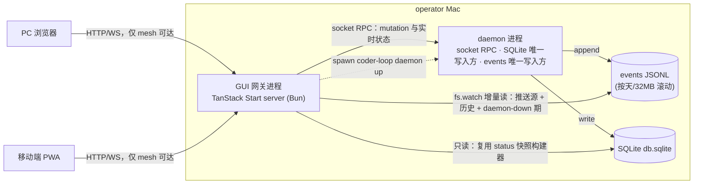

# SYNTH-#544 v3 可观测性 API 与 Web GUI 网关

> 本文档是**本地合成**，未写回 GitHub。依据 RFC #544 与其全部 sub-issue 合并而成。
> 来源：`v3-issue/issues/<N>/`（issue.json + comments.json + timeline.json + subissues.json）+ `v3-issue/design/`。

## 范围与组成

- **源 RFC**：#544 — RFC: v3 可观测性 API 与 Web GUI——mesh 内独立网关进程（PC+移动端）
- **子 issue 总数**：29（OPEN 14 / CLOSED·COMPLETED 2 / CLOSED·NOT_PLANNED 13）
- **本合成 issue 编号**：`SYNTH-#544`（仅本地标识）

---

## 一、RFC 设计骨架（#544 原文）

## 摘要

v3 目标 1（GUI）与目标 3 的预览部分的 RFC。形态（操作员裁决 2026-07-02，RFC-5 子会话，七项裁决记录见下）：coder-loop monorepo 内新增一个**独立 GUI 网关进程**（TanStack Start server，Bun 运行时），mesh-only 暴露，对内走三个数据面（daemon socket RPC、events JSONL 特许直读、SQLite 只读快照复用），对外承载 PC + 移动端 Web GUI：一眼可见跑没跑、全链路展示、prompt 展示、可计算元信息预览，以及「观测 + daemon 生命周期 + 解卡」控制面。

## 操作员目标（verbatim）

> "v2 已经 daemon 化，但是 v2 的可观测性很弱，每次都是 agent 去找 session 看。假如存在一个好的 web GUI，则看一眼就知道跑没跑。所以我希望 v3 有 GUI，GUI 的设计需要同时考虑 PC 和移动端，GUI 除了做全链路展示，还得有 prompt 展示。" — `v3/v3-goals.md` 目标 1（2026-07-02）

> "因为全链路类型化，所以状态机的判定来源是可计算类型……我认为这部分需要 GUI 可预览。" — `v3/v3-goals.md` 目标 3（预览部分归本 RFC）

## 上下文

- **Repo**: `mouriya-s-lab/coder-loop`（path: `/Users/mouriya/Ext/code/coder-loop`）
- **Design source**: `v3/v3-goals.md`（业务目标权威）、`v3/rfc-split.md` RFC-5 节（授权范围）、`v3/survey-engine-daemon.md` §6、`v3/survey-preset-types.md` §8（现状事实）
- **当前 baseline 锚点**（pr-529 系基线，实施前自行 grep 行号）：socket RPC `sendDaemonRequest`（`src/daemon.ts:3833-3864`）、`logs --follow` 轮询（`src/loop.ts:1830-1844`）、`spawnOneAttempt` prompt 边界（`src/loop.ts:5829-5880`）、`StatusSnapshotBoundary`（`src/loop.ts:490-498`）、事件 union（`src/observability.ts:24-132`）、status 构建器 SQLite 只读读取（`src/loop.ts:3868-3903`）

## 现状问题

1. **对外协议真空**。daemon 唯一控制面是 Unix socket 行 JSON RPC，每请求一连接（`src/daemon.ts:3833-3864`），无长连接、无订阅推送、无任何 HTTP/WS。`coder-loop logs --follow` 是 CLI 侧 1s 轮询全量重查再 slice（`src/loop.ts:1836-1844`）——每秒重读全部 events 段文件，事件量增长后线性退化。GUI 没有现成网络协议可用。
2. **prompt 事后不可见**。`spawnOneAttempt` 只把 `promptChars`（字符数）写进 `status.json`（`src/loop.ts:5861`）；渲染后 prompt 全文只作为子进程 argv 传给 runner（`src/loop.ts:5879`），不落盘。事后重放 `renderPrompt` 不可行——ctx 依赖 item 当时状态快照与一次性 `runId`。「prompt 展示」缺硬前置。
3. **「跑没跑」恰是现状最不可靠的判据**。repo 规则 `daemon-restart-after-app-update` 明载 `status --json` 的 daemon 字段不可信、sock/pid 可能是陈尸文件；#359 实证过进程存活但 socket pathname 丢失的控制面分裂；#387/#388/#536 是 daemon 崩溃史；且 app 每次更新都必须重启 daemon——**daemon 是一个会频繁死、且死时最需要被看见的进程**，而现在死了就整个观测面一起消失。
4. **status 快照对 GUI 无契约力**。`StatusSnapshotBoundary` 顶层是七个匿名 `"object"` 槽（`src/loop.ts:490-498`），内部形态靠实现自觉，GUI 消费前必须收紧。
5. **数据源良好但无消费面**。#411 已建成 44 种编译期 union 事件（五 kind，信封含 chain/item/runId/phase 关联键）、单一 JSONL 流按天/32MB 滚动、`daemon.status`（pid/running/activeRuns/rateLimit）、SQLite 四表——缺的只是一个网络可达、可推送、daemon 死时仍在的消费面。

## 裁决记录（操作员，2026-07-02，RFC-5 子会话）

| # | 决策点 | 裁决 | 决定性理由 |
|---|---|---|---|
| A | API 层宿主 | **独立 GUI 网关进程**（否决 daemon 内嵌 HTTP） | GUI 价值最高的时刻恰是 daemon 不健康的时刻；观测面与被观测者同进程 = 监控随对象一起死。网关常驻可展示 daemon 死因并远程拉起，补上 `daemon-restart-after-app-update` 的运维闭环 |
| B | 推送通道 | **网关直读 events JSONL**（`fs.watch` + offset 增量），否决 socket 订阅 verb | daemon 死时通道依然活；零引擎改动。**豁免声明**：#411「消费者从此不刮 runtime 文件」禁令对网关一家豁免（同仓同版本演进的特许消费者），对 supervisor/agent/脚本等其他消费者禁令不变 |
| C | prompt 持久化深度 | **渲染文本 + 绑定值快照**（`prompt.md` + `bindings.json`） | GUI 可展示变量→值对照，与 RFC-2 元信息预览衔接；绑定表本在内存，成本≈0 |
| D | 暴露与鉴权 | **mesh-only 裸信任**：只绑 localhost + netbird 接口，无应用层鉴权 | 控制面动作全在 mesh 内，与既有运维面信任模型一致；bearer token 登记为可选演进，不进 v3 验收 |
| E | 仓库归属 | **monorepo**（coder-loop repo 内） | B 裁决使 events 文件形态成为网关正式契约面，「钦定内部契约」只有同仓同版本演进才安全；跨 repo 即变成事实公共 API |
| F | 控制面范围 | **观测 + daemon 生命周期 + 解卡动作**（否决完整 CLI parity） | 手机场景 = 看见异常当场处置；创建类重交互（chain create / item add）留给 CLI/agent，不进 v3 |
| G | 前端栈 | **TanStack Start** | 操作员指定。自带服务端运行时——网关进程即 TanStack Start server 本身，一个进程承载静态资产 + API server routes + WS/SSE 推送 |

## 架构



- **三个数据面各司其职**：mutation 与瞬时状态走 socket RPC（网关无 agent 凭证，daemon 视之为 operator 主体，`logs.query` hard-deny-for-agent 不影响它，零新增鉴权面）；事件推送与历史走 events JSONL 直读；队列/链快照走 SQLite 只读——这不是新侧门，`buildCoderLoopStatusSnapshot` 本就以 `openSqliteStateStore({ createIfMissing: false })` 只读直读 SQLite（`src/loop.ts:3868-3875`），网关同仓 import 复用同一构建器。
- **daemon-down 行为（本 RFC 立身场景）**：daemon 死后网关照常服务——events 历史与死前最后事件（JSONL）、队列终态（SQLite 只读）、死因线索（`daemon.fatal`/`daemon.stop` 事件与 #388 落盘的崩溃记录）可读；活性判定用三证探针（pid 文件 + socket connect + `daemon.status` 应答），三证呈现给前端而非折叠成一个布尔——#359 型「进程活但 socket 死」的分裂状态如实展示。GUI 提供一键 `daemon up` / restart。
- **推送**：网关把 events 增量经 WS/SSE 推给前端；前端快照类数据走 server routes 查询 + 事件驱动失效。

## 引擎侧新增工作（实现 children 具体化）

1. **prompt 持久化点**：`spawnOneAttempt` 构造 argv 前把渲染后全文写 `<runDir>/<phase>/prompt.md`、绑定值快照写 `bindings.json`（`{{KEY}}` → 实际值）；resume attempt 同样落盘当次真实 `effectivePrompt` 并标记 resume；固定「继续」只属于 chain-complete finalizer 特例，不外推到普通 resume。保留策略跟随 run 目录既有生命周期，不新增 GC 语义。
2. **events 契约面固化**：`ObservabilityEventBoundary` 与滚动段命名/顺序规则作为网关消费契约导出（同仓类型 import），滚动/翻段行为有测试钉住——网关按契约读段，不逆向猜文件名。
3. **status 快照 boundary 收紧**：七个匿名 `"object"` 槽换成精确 schema——GUI 的快照契约。此项与 RFC-2 的编译产物 schema 互补不重叠（快照=运行态，编译产物=定义态）。

## 信息架构

- **层级**：daemon → chains → items → runs → phases/attempts，与既有关联键（chain/item/runId/phase）一致；事件→run→item 可关联跳转。
- **首屏「跑没跑」判据**：daemon 三证状态 + 每 chain 的活 run/最近转移 + rate-limit 冷却（`daemon.status.rateLimit`）+ 最近异常事件（`daemon.fatal`/`scheduler.tick_failed`/`attempt.timeout` 等）。daemon 死与断网可区分：网关仍应答即非断网。
- **prompt 展示**：per attempt 的渲染全文 + 变量→值对照表 + fresh/resume 标记。
- **元信息预览**：消费 RFC-2 编译产物渲染状态机图/phase 结构/变量流（见接口假设）。
- **移动端**：同一响应式应用 + PWA（可加主屏），不做原生壳；移动首屏偏「跑没跑 + 异常清单 + 控制面动作」，深层浏览与 PC 同构。

## 控制面范围（F 裁决展开）

GUI 全部写动作即以下清单，不多不少：daemon start / stop / restart（start 由网关 spawn `coder-loop daemon up`，stop/restart 经 socket RPC）、`queue.unblock`、`chain.stop` / `chain.resume`、`item.reorder`，以及当前 operator 对指定 evaluation epoch 有 capability 时的 `advance | hold | reopen` decision。全部经 operator RPC 转发；GUI 不推导 decision，也不用 resume/unblock/改 join 冒充；创建类（`chain.create` / `item.add` / batch）不进 v3。

## 与其他 RFC 的接口假设

- **RFC-2（#547，已答）**：元信息预览消费 `coder-loop preset compile --json` 编译产物（schemaVersion 稳定契约，六块：preset 元信息 / statuses+stateGraph / phases+任务树 / tools / fragments / findings）。本 RFC 只消费不定义 shape；快照 boundary 收紧与编译产物互补不重叠（快照=运行态，编译产物=定义态）；typed bindings 使 `bindings.json` 携带类型化值。
- **RFC-1（#546，已裁）**：operator per-epoch decision 是定义态 join 卡死时的正式解卡能力，纳入 F 档：GUI 仅在 daemon 返回当前 operator 对该 epoch 的 capability 时渲染 `advance | hold | reopen`，携带 evaluation scope 原样转发，不自行判定。slot 语义退役，不再是展示对象；chains→items 层的展示对象是任务树（节点 = leaf/seq/par + join 声明与状态 + reopen 计数），「活 run 并行分支」= par 内多 leaf 各自的 run。**leaf 节点携带闭包生命周期态（活跃/挂起/已消费）与闭包分支名**（#546 body「答复 #544（RFC-5）」节 2026-07-10 修订，逐字快照）：

  > "GUI 的展示对象是任务树（节点 = leaf/seq/par + join 声明与状态 + reopen 计数；leaf 节点携带闭包生命周期态 活跃/挂起/已消费 与闭包分支名——GUI 是闭包状态机同一事实源的展示投影，不另建状态推断），引擎经 status 面暴露树结构快照……闭包状态表（生命周期态、worktree 路径、闭包分支、sessionIds、par pin commit）随同一 shape 承诺一并钉住——它是四视图（执行/GC/hook/暴露谓词）的持久化事实源。"

  **展示原则**：GUI 是闭包状态机同一事实源的展示投影，禁止另建状态推断——不得从 worktree 目录存在性、git 现状、进程状态等运行时痕迹反推闭包态。**数据来源**：#558 闭包状态表经 status 面暴露（生命周期态、worktree 路径、闭包分支、sessionIds、par pin commit 逐字段随 shape 承诺一并钉住）。树运行态持久化形态与 status 快照的树结构 shape 由 #546 首个实现 child 在设计期钉住——该 shape 是本 RFC 快照 boundary 收紧（引擎侧新增工作 3）的输入，实施顺序在其后。
- **RFC-3（#545，已裁）**：context entries 展示面消费 #545 read 命令的 arktype boundary（shape 归 #545 拥有），本 RFC 纯消费；分页/过滤形态随其实现 child。
- **RFC-4（#543，已裁）**：hook 执行发射统一 observability 事件（`hook.*` 类型与字段归 #543 children），GUI 经既有事件通道零成本获得 hook 展示面；gate hold 状态与 hook 声明清单（四层合成后的生效视图）进 status 快照新增的 hooks 节，并入本 RFC 快照 boundary 收紧工作。
- **RFC-6（#548，已裁）**：第三方 ingress 不与本网关共用宿主/对外协议面（#548 裁决 B）；本 RFC「HTTP 面模块化可挂 route」的保证登记但无人消费。

## 开放问题

- events 长历史的查询性能：JSONL 顺扫在多大历史量下不够、网关侧要不要加索引/缓存层——实现期以真实事件量实测后定，不预设索引层。

## 约束

- **代码红线（操作员裁决 2026-06-12，全仓 issue 统一）**：必须全链路 ADT，禁止任何类型退化。不引入 `any` / 匿名形状；`unknown` 仅限 catch 与边界 parse 入口；禁止真 `as` 断言（`as const` 除外）；外部输入经边界 parse（arktype）为精确类型后流转；不得删除类型依赖、绕过或降级既有类型边界。违反红线 = changes requested，无例外。前端同样适用（边界 parse 进精确类型）。
- 网关对 SQLite **严格只读**；一切 mutation 经 daemon socket RPC。
- 网关只绑 localhost + netbird 接口，**无公网监听**；无应用层鉴权（D 裁决），token 为登记在案的可选演进。
- #411 的「消费者不刮 runtime 文件」禁令对网关之外的一切消费者继续有效；events 直读豁免仅限同仓网关。
- 一个网关实例绑定一个 loop-data root（默认生产 `~/.coder-loop/loop-data`）；隔离 e2e root 不带 GUI。

## 关闭验证

逐条钉终态条件。本 RFC 的实现 children 落地时把各行具体化为可逐字重跑的操作步骤。

| # | 终态条件 | 验证 | Expect |
|---|---|---|---|
| 1 | 「跑没跑」一眼可见且判据可靠 | daemon 活/死两种状态下打开 GUI 首屏 | 活：呈现活 run 与最近事件；死：明确显示死了、死于何时、最后事件与三证细节；与断网可区分（网关仍应答） |
| 2 | daemon-down 可观测且可恢复 | 杀掉 daemon 后从浏览器/手机操作 | events 历史与队列终态照常可读；GUI 一键拉起 daemon 成功且状态翻绿 |
| 3 | 实时推送 | 起一轮真实 run（可用 real-e2e fixture chain），开着 GUI 观察 | 无手动刷新，agent.spawn → phase 推进 → agent.exit 全链路事件实时到达 |
| 4 | prompt 展示 | 打开任一已完成 attempt | 渲染全文 + 变量→值对照 + fresh/resume 标记；全文与实际 argv 所发一致 |
| 5 | 全链路层级展示 | 从 daemon 首屏钻取到 chain → item → run → phase/attempt | 各层可达；从任一事件可跳到其 run/item |
| 6 | 移动端可用 | 手机经 netbird mesh 打开 + PWA 安装 | 首屏与控制面动作在移动端可完成；PWA 可加主屏 |
| 7 | 控制面范围恰为 F 档 | 遍历 GUI 全部写入口 | 仅 daemon 生命周期 + unblock + chain stop/resume + item reorder + capability-gated per-epoch operator decision；无任何创建类入口 |
| 8 | mesh-only 暴露 | 从非 mesh 网络访问网关端口；mesh 内访问 | 前者不可达，后者可达；监听面仅 localhost + netbird 接口 |
| 9 | 元信息预览 | 在 GUI 选任一 preset 查看结构 | 状态机图/phase 任务树/变量类型流渲染自 #547 `preset compile --json` 编译产物（stateGraph 与 phases+任务树块），与 CLI 导出一致 |
| 10 | 引擎红线不破 | grep 引擎与网关代码 | 网关无 SQLite 写路径；引擎无 GUI 字面量/反向依赖；#411 禁令措辞对非网关消费者保持 |

## 范围外

- 完整 CLI parity（创建类表单 UI）——F 裁决明确排除。
- 公网暴露 / Keycloak SSO / bearer token——D 裁决排除，token 为可选演进。
- 原生移动 app——PWA 覆盖。
- A 域资产收编（trace / evidence / handoff 的格式化展示）——#411 两域边界不变，GUI 对 A 域只做路径引用与原文透传。
- 第三方调用 ingress 的实现——归 RFC-6。

## 本 issue 的验证边界

- **验证层级**：本 RFC umbrella 不直接运行测试，也不以任一 implementation PR 的局部测试关闭。
- **关闭所需证明**：所有直接 children 达到各自正文声明的验证深度；跨 child 的 v3 新语义接缝由 #684 在冻结合流 SHA 上证明；现有 bundled preset 兼容性由 #685 在发布候选 SHA 上证明。
- **不在本 issue 内执行**：不在 RFC 迭代中重复运行 `scripts/real-e2e.ts`，不把 compatibility E2E 绿解释成 `RFC: v3 可观测性 API 与 Web GUI——mesh 内独立网关进程（PC+移动端）` 的新语义已经成立。
- **现有 GitHub real E2E**：本 issue 不运行 `bun scripts/real-e2e.ts`；该 compatibility 验证只由 #685 在冻结发布候选 SHA 上执行。
## 依赖关系

- Relates to: #413（v3 前 RFC；GUI 不在其范围，本 RFC 是 2026-07-02 目标陈述新增线）、#411（events 单一流与五 kind 词表是本 RFC 数据面的直接前史；其「不刮文件」禁令的网关豁免由本 RFC 裁决记录 B 承载）
- 接口假设已全部对接（#543 / #545 / #546 / #547 / #548，见「与其他 RFC 的接口假设」节）：关闭验证行 9（元信息预览）对 #547 编译产物是硬依赖；快照 boundary 收紧（引擎侧新增工作 3）对 #546 的树快照 shape 是顺序依赖；operator decision 写入口依赖 #700 的 evaluation identity、decision ADT 与 capability 契约；其余功能不被阻塞。


---

## 二、当前实现 children（OPEN，当前 spec）

### #716 feat(engine): status snapshot 严格只读 SQLite 入口

- state: **OPEN** | author: `RiriAgent` | created: 2026-07-17

## 必须先读的关联 issue

继承 [#544](https://github.com/mouriya-s-lab/coder-loop/issues/544) 的共享契约与关闭验证。

## 目标

提供真正 read-only、零 WAL/journal/schema mutation 的 snapshot 入口；schema 不兼容返回精确错误。

## 问题

#544 把 daemon 定为 SQLite 唯一 writer、独立网关严格只读，并要求网关经 `openSqliteStateStore({ createIfMissing: false })` 复用 `buildCoderLoopStatusSnapshot`——但当前源码与该前提矛盾：

- 当前源码： `openSqliteStateStore` opens `Database(... readwrite: true)`, may execute `PRAGMA journal_mode = WAL`, and always calls `migrateStateSchema`.

后果：网关在 daemon 存活或死亡时都可能改变 journal 状态与 schema。这个进程/所有权边界在任何 GUI 代码写下之前就已不成立，且引擎侧没有任何 issue 拥有「严格只读 snapshot 入口」。

## 预期结果

本 issue 交付一条引擎侧的严格只读 status snapshot 路径：

- SQLite opened read-only;
- no WAL/journal mutation;
- no schema migration;
- explicit typed schema-version mismatch result when the on-disk DB is not consumable;
- repeated gateway reads proven byte/metadata neutral while daemon is down.

## 依赖关系

- Depends on: 无。
- Blocks: #718、#720、#722、#724、#729。


### #717 feat(engine): 渲染后 prompt 与 bindings 快照

- state: **OPEN** | author: `RiriAgent` | created: 2026-07-17

## 必须先读的关联 issue

继承 [#544](https://github.com/mouriya-s-lab/coder-loop/issues/544) 的共享契约与关闭验证。

## 目标

落盘 per-attempt prompt.md 与 bindings.json，作为 GUI 只读输入。

每个 attempt 实际发给 runner 的 prompt 全文与绑定值，在该 run 目录留下持久快照，事后可查。

## 问题

> "**prompt 事后不可见**。`spawnOneAttempt` 只把 `promptChars`（字符数）写进 `status.json`……渲染后 prompt 全文只作为子进程 argv 传给 runner……不落盘。事后重放 `renderPrompt` 不可行——ctx 依赖 item 当时状态快照与一次性 `runId`。「prompt 展示」缺硬前置。" — #544 现状问题 2

## 预期结果

性质表述：

1. **一切 attempt 都留快照**：凡经 `spawnOneAttempt` 发出的 attempt（fresh 与 resume、全部 runner kind）在其 run 目录留下 prompt 全文与绑定值快照；落盘输入与 argv 构造取自同一个 `effectivePrompt` 值——「展示的」与「实发的」在构造点同源，不可能分叉。
2. **resume 如实**：resume attempt 落盘内容 = 当次实发的真实 `effectivePrompt`，并携带 resume 标记与所续 session 引用。scheduler 主路径 resume 会重新渲染完整 phase prompt；不得把 chain-complete finalizer 专用的固定「继续」外推到普通 resume。
3. **绑定快照完整**：每个 `{{KEY}}` 的 source 与渲染值都在 `bindings.json`；值形态基线为现状渲染值，#737（变量绑定类型流）落地后 additive 携带类型化值——shape 预留类型化位，届时不做 breaking 重构。
4. **落盘失败不挡 run、不静默**：写入失败发 diagnostic observability 事件后 attempt 照常执行（快照是观测辅助，不是执行前置；静默丢失被事件可见性排除）。
5. **定义来源固定**：effective prompt 与 bindings 从该 attempt 所属实例的 #743 pinned definition 解引用；不得在 spawn、retry 或 daemon 重启恢复后重读同路径当前 preset。

## 验收标准

| Dimension | Check | Command | Env | Expect |
|---|---|---|---|---|
| function | fresh attempt 落盘 | `bun test`（新增用例：spawn 一次 fresh attempt 后断言 `prompt.md` 内容 === 传给 `buildRunnerInvocation` 的 prompt 参数、`bindings.json` 含全部 KEY 与值） | 本机 | 断言通过；同源断言（同一变量引用）在场 |
| function | resume attempt 落盘 | `bun test`（新增用例：普通 scheduler resume 断言落盘内容等于当次完整 `effectivePrompt`；chain-complete finalizer 专用路径另断言固定「继续」；两者均含 resume 标记 + session 引用） | 本机 | 两条路径分别与实际 argv 完全一致，不把 finalizer 专用 prompt 外推到普通 resume |
| function | 落盘失败语义 | `bun test`（新增用例：注入写失败，断言 attempt 继续 + diagnostic 事件发射） | 本机 | 断言通过 |
| environment | 既有测试不回归 | `bun run typecheck && bun test` | 本机 | 全绿 |

## 架构切片

1. **系统定位**：L1 引擎 spawn 路径（`spawnOneAttempt`）的观测产物出口级——run 目录新增两个 per-attempt 工件；不改调度与渲染语义。
2. **全局坐标**：引擎 typed 域（渲染现场的 `effectivePrompt` + 绑定表）→ 文件系统观测域（`prompt.md`/`bindings.json`）；同源投影，无信任级变化（两侧均 engine-owned）。
3. **类型↔值不漂移**：防值漂移——「实发 prompt」与「展示 prompt」若各自来源即漂移，同一 `effectivePrompt` 值单源封死；`bindings.json` 值形态锚 #737 类型流，防第二套值编码。
4. **消除的错误类别**：「事后无法知道 agent 收到什么」从必然变为不可表达（每 attempt 必有快照）；「拿 `promptChars` 反猜」退役。

## log/观测义务

落盘失败发 diagnostic 事件（kind=diagnostic）——唯一新增事件义务；成功路径零新事件（文件本身即观测产物）。

## 依赖关系

- Depends on: 无。
- Blocks: #725、#729。


### #718 feat(engine): status snapshot 精确 schema boundary

- state: **OPEN** | author: `RiriAgent` | created: 2026-07-17

## 必须先读的关联 issue

继承 [#544](https://github.com/mouriya-s-lab/coder-loop/issues/544) 的共享契约与关闭验证。

## 目标

收紧匿名 object 槽；不再把现有 read-write builder 描述为只读。

`StatusSnapshotBoundary` 顶层七个匿名 `"object"` 槽全部换成精确 arktype schema，使 `status --json` 成为 GUI 可依赖的运行态契约。

## 问题

> "**status 快照对 GUI 无契约力**。`StatusSnapshotBoundary` 顶层是七个匿名 `"object"` 槽（`src/loop.ts:490-498`），内部形态靠实现自觉，GUI 消费前必须收紧。" — #544 现状问题 4

## 预期结果

性质表述：

1. **无匿名槽**：`StatusSnapshotBoundary` 顶层与各槽内部不存在匿名 `"object"`/宽松 record 兜底——每个字段有精确 schema，非法形状被 parse 拒绝。
2. **类型单源**：TS 消费端类型从 boundary schema 派生，不手写平行 shape；快照字段演进时编译器暴露全部消费点。
3. **树结构节如约集成**：树结构节采 #558 shape 设计 comment 的 schema，本 child 不改写；其余槽的收紧不侵入 #558 范围。
4. **shape diff 可审**：PR body 显式列出收紧前后 shape diff（#456 先例）；既有消费者（CLAUDE.md 登记的 status JSON 稳定 API 面）字段语义不变或 diff 中显式声明。

## 验收标准

| Dimension | Check | Command | Env | Expect |
|---|---|---|---|---|
| function | 匿名槽清零 | `grep -n '"object"' src/loop.ts`（限 `StatusSnapshotBoundary` 定义区）+ 阅读 boundary 全文 | 本机 | 零匿名槽；每槽字段显式 |
| function | 负例拒绝 | `bun test`（新增用例：对每个槽注入非法形状，断言 parse 拒绝） | 本机 | 七槽各至少一条负例，全部拒绝 |
| integration | 真实快照过 boundary | `coder-loop status <target> --json` 对活 chain 跑一次 | 本机（真实 loop-data root） | 输出通过收紧后 boundary parse；`state.kind == "ok"` |
| assumption | 树结构节与 #558 一致 | 对照 #558 shape 设计 comment 逐字段核对 | GitHub + 本机 | 树结构节 schema 与 #558 记录一致，无本地改写 |
| environment | 既有消费不回归 | `bun run typecheck && bun test` | 本机 | 全绿 |

## 架构切片

1. **系统定位**：L1 观测面 status 快照的边界收紧——`StatusSnapshotBoundary` 从「形状靠实现自觉」升格为精确契约；构建器数据来源与只读语义不动。
2. **全局坐标**：引擎运行态域（SQLite/内存）→ 快照消费域（CLI JSON / 网关 route）；arktype boundary 是 parse 点；树结构节 shape 权威在 #558，本 child 集成不定义。
3. **类型↔值不漂移**：防类型泄露——消费端手写平行 shape 即把快照形状编码进前端，从 schema 派生封死；防值漂移——匿名槽内部形态自觉即漂移源。
4. **消除的错误类别**：「快照字段变更静默破坏消费者」从可能变为编译期可见（派生类型 + 七槽负例测试）。

## log/观测义务

无新增事件义务；shape diff 义务在 PR body（#456 先例）。

## 依赖关系

- Depends on: #716、#573。
- Blocks: #719、#720、#724、#729。


### #719 feat(engine+gui): status hooks 与 gate hold 可见性

- state: **OPEN** | author: `RiriAgent` | created: 2026-07-17

## 必须先读的关联 issue

继承 [#544](https://github.com/mouriya-s-lab/coder-loop/issues/544) 的共享契约与关闭验证。

## 目标

只扩展精确 status/GUI projection，依赖真实 producer。

status 快照新增 hooks 节（精确 schema）：hook 声明四层合成后的生效视图 + gate hold 状态；GUI 呈现之。

## 问题

#543 落地后，hook 声明与 gate hold 是影响调度的一等运行态，但 status 快照没有它们的位置：operator 无法从 `status --json` 或 GUI 回答「这个 chain 为什么不动」（gate hold 中）与「现在生效的 hook 是哪些」（四层合成结果）——只能翻事件流反推。

## 预期结果

性质表述：

1. **hooks 节精确 schema**：快照新增 hooks 节，含生效 hook 清单（四层合成后视图，标注来源层）与 gate hold 状态（哪个决策点、hold 起始、重问节奏线索）；schema 精确无匿名槽，与 #718 同一红线。
2. **GUI 可见**：gate hold 状态在 GUI 的 chain 视图/首屏异常区呈现；生效 hook 清单在 chain 详情可达。
3. **快照与事件互补**：hooks 节反映「现在」，`hook.*` 事件反映「过程」；两者字段可关联（同一 hook 标识）。

## 验收标准

| Dimension | Check | Command | Env | Expect |
|---|---|---|---|---|
| function | 四层合成生效视图 | 全局+chain+preset+item 各声明 hook 后 `coder-loop status <target> --json` | 本机（#543 机制已落地） | hooks 节列出全部生效 hook 且标注来源层，与 #543 合成语义一致 |
| function | gate hold 可见 | 用必 hold 的 gate 脚本触发 hold 后查快照与 GUI | 本机 + 浏览器 | 快照 hooks 节与 GUI chain 视图都显示 hold 中的决策点 |
| function | 负例拒绝 | `bun test`（hooks 节非法形状 parse 拒绝用例） | 本机 | 断言通过 |
| environment | 不回归 | `bun run typecheck && bun test` | 本机 | 全绿 |

## 架构切片

1. **系统定位**：status 快照的 hooks 节（运行态投影级）+ GUI 呈现位——#543 hook 状态的快照面；hook 语义与执行不在此。
2. **全局坐标**：#543 hook 运行态域 → 快照消费域（只读投影）→ GUI 呈现；GUI 只呈现快照事实。
3. **类型↔值不漂移**：防值漂移——「生效 hook 视图」若 GUI 侧自行合成即与 daemon 四层合成语义漂移；快照单源封死。
4. **消除的错误类别**：「gate hold 导致的停滞无线索」从必然变为不可表达（hold 状态必在快照与 GUI）。

## log/观测义务

无新增事件义务（`hook.*` 事件归 #543 children）；本 child 只加快照节与呈现。

## 依赖关系

- Depends on: #718、#710、#712。
- Blocks: #729。


### #720 feat(gui): TanStack 网关与严格只读数据面

- state: **OPEN** | author: `RiriAgent` | created: 2026-07-17

## 必须先读的关联 issue

继承 [#544](https://github.com/mouriya-s-lab/coder-loop/issues/544) 的共享契约与关闭验证。

## 目标

网关只消费严格只读 snapshot 入口；不得迁移 SQLite、改变 WAL/journal 或复制 SQL snapshot builder。

网关进程存在且形态合规：coder-loop 仓内的 TanStack Start server（Bun），mesh-only 监听，绑定一个 loop-data root，带 socket RPC 客户端与 SQLite 只读快照两个数据面。

## 问题

> "**对外协议真空**。daemon 唯一控制面是 Unix socket 行 JSON RPC……无长连接、无订阅推送、无任何 HTTP/WS。……GUI 没有现成网络协议可用。" — #544 现状问题 1

## 预期结果

性质表述：

1. **进程形态合规**：一条命令启动网关进程；进程即 TanStack Start server（Bun 运行时），静态资产与 server routes 同进程。
2. **监听面收窄是配置不动点**：监听地址集合 = {localhost, netbird 接口}——不是默认 `0.0.0.0` 加防火墙备注；非 mesh 网络不可达。
3. **root 绑定单一**：一个网关实例绑定一个 loop-data root（默认生产 root，可配置）；网关内不存在跨 root 访问路径。
4. **两数据面就位**：socket RPC typed client（零凭证 = operator 主体；命令词表从引擎 `DaemonCommandName` 派生，不复制字符串表）；SQLite 只读快照 route（复用 `buildCoderLoopStatusSnapshot`，网关代码无任何 SQLite 写路径）。
5. **红线在前端同样成立**：网关↔前端之间的数据经边界 parse 为精确类型；无 `any`/匿名形状。

## 验收标准

| Dimension | Check | Command | Env | Expect |
|---|---|---|---|---|
| function | 进程可起 | 网关启动命令（PR 落定后逐字记录于 PR body） | operator Mac | 进程起、浏览器打开最小状态页、快照数据在场 |
| environment | mesh-only（#544 关闭验证行 8 具体化） | `lsof -iTCP -sTCP:LISTEN -P \| grep <port>`；LAN IP `curl`；mesh 设备访问 | operator Mac + mesh 内第二设备 | 监听仅 localhost + netbird 接口；LAN 不可达；mesh 可达 |
| function | SQLite 零写路径 | `grep` 网关代码中的 SQLite 写 API 调用 + code review | 本机 | 网关只经 `buildCoderLoopStatusSnapshot` 只读；无写调用 |
| function | RPC 词表单源 | 阅读网关 socket client：命令名来源 | 本机 | 类型自引擎 `DaemonCommandName` 派生，无字符串表拷贝 |
| environment | 不回归 | `bun run typecheck && bun test` | 本机 | 全绿 |

## 依赖关系

- Depends on: #571、#716、#718。
- Blocks: #721、#722、#723、#724、#725、#726、#727、#728、#729。


### #721 feat(gui): events 增量读取与实时推送

- state: **OPEN** | author: `RiriAgent` | created: 2026-07-17

## 必须先读的关联 issue

继承 [#544](https://github.com/mouriya-s-lab/coder-loop/issues/544) 的共享契约与关闭验证。

## 目标

消费已落地 events contract，经 gateway 推送。

网关按 #573 契约直读 events JSONL（active 段 fs.watch + offset 增量、历史段全序读取），经 WS/SSE 推给前端；事件历史可查询。

## 问题

> "无长连接、无订阅推送……`coder-loop logs --follow` 是 CLI 侧 1s 轮询全量重查再 slice……GUI 没有现成网络协议可用。" — #544 现状问题 1

## 预期结果

性质表述：

1. **增量而非重扫**：稳态推送路径对每个新事件的成本与历史总量无关（offset 增量读 active 段；翻段按 #573 契约无丢不重）。
2. **daemon-down 通道存活**：daemon 进程死亡不影响事件历史读取与已建立的推送连接的存活（新事件自然停止，通道与历史查询照常）。
3. **过滤查询**：历史查询支持按信封关联键（chain/item/runId/phase）与时间范围过滤。
4. **类型不塌**：事件从文件到前端全程精确类型（#573 契约 parse → 推送 → 前端边界 parse），无 `any` 透传。

### 显式决策项（RFC 开放问题分配，落地时裁，裁决留本 thread）

- "events 长历史的查询性能：JSONL 顺扫在多大历史量下不够、网关侧要不要加索引/缓存层——实现期以真实事件量实测后定，不预设索引层。" — #544 开放问题（唯一一条，分配给本 child）。裁决义务：以真实 loop-data root 的事件量实测查询延迟，把「顺扫够用到什么量级、超过后的方案方向」写进本 thread。

## 验收标准

| Dimension | Check | Command | Env | Expect |
|---|---|---|---|---|
| function | 翻段一致性 | `bun test`（网关 reader 用例：跨 rotation 读取断言无丢无重，复用 #573 测试基建） | 本机 | 断言通过 |
| function | daemon-down 存活 | 杀 daemon 后查询事件历史 + 保持已开 GUI 页面 | operator Mac | 历史照常返回；页面不崩、显示最后事件 |
| function | 过滤查询 | 对含多 chain/item 的 root 按关联键查询 | 本机 | 结果与 JSONL 实际内容一致 |
| assumption | 长历史性能实测（决策项） | 对真实事件量跑查询延迟测量，结论落本 thread | operator Mac（生产 root 副本） | thread 有实测数据 + 裁决记录 |
| environment | 不回归 | `bun run typecheck && bun test` | 本机 | 全绿 |

## 依赖关系

- Depends on: #573、#720。
- Blocks: #722、#724、#729。


### #722 feat(gui): daemon 活性首屏与生命周期控制

- state: **OPEN** | author: `RiriAgent` | created: 2026-07-17

## 必须先读的关联 issue

继承 [#544](https://github.com/mouriya-s-lab/coder-loop/issues/544) 的共享契约与关闭验证。

## 目标

交付 daemon 三证活性和 daemon-down 终态展示。

首屏一眼回答「跑没跑」，判据可靠（三证不折叠）；daemon 死时可观测（何时死、死因线索、最后事件）且可从浏览器一键恢复。

## 问题

> "**「跑没跑」恰是现状最不可靠的判据**。……daemon 是一个会频繁死、且死时最需要被看见的进程，而现在死了就整个观测面一起消失。" — #544 现状问题 3

## 预期结果

性质表述：

1. **三证独立呈现**：pid 文件存在性+进程存活、socket connect 结果、`daemon.status` 应答——三个证据各自展示，任意分裂组合（如 #359 型「进程活/socket 死」）如实可见，不折叠成单布尔。
2. **死态可观测**：daemon 死时首屏明示死了、死于何时（最后 `daemon.stop`/`daemon.fatal` 事件或最后事件时间）、死因线索事件、队列终态照常可读。
3. **断网可区分**：网关仍应答即非断网——daemon 死与网络不可达在 UI 上是不同状态。
4. **一键恢复闭环**：start/stop/restart 按上钉机制工作；restart 后三证翻绿。spawn 的 daemon 进程与网关解耦（网关退出不带走 daemon）。
5. **首屏判据齐全**：三证 + 每 chain 活 run/最近转移 + `rateLimit` 冷却 + 最近异常事件，一屏可见。

## 验收标准

| Dimension | Check | Command | Env | Expect |
|---|---|---|---|---|
| integration | 活态首屏（#544 关闭验证行 1 具体化） | daemon 活 + 至少一活 run 时打开 GUI | operator Mac + 浏览器 | 三证全绿、活 run 与最近事件在场、rateLimit 状态在场 |
| integration | 死态首屏（行 1+2 具体化） | `daemon.down`（或 kill -9）后打开/刷新 GUI | 同上 | 明确显示死了、死于何时、死因线索事件、三证细节；events 历史与队列终态照常可读 |
| integration | 一键恢复（行 2 具体化） | 死态下从浏览器点 start；再从手机（mesh）重复 | operator Mac + mesh 手机 | daemon 拉起、三证翻绿；手机路径同样成功 |
| function | 分裂状态如实 | 构造 pid 活/socket 不可达（如陈尸 sock 文件场景）后看首屏 | 本机 | 三证各自如实、无「假活」判定 |
| function | 断网区分 | mesh 断开 vs daemon 死两场景对照 | mesh 设备 | 前者网关不可达（浏览器层报错），后者网关应答且明示 daemon 死 |
| environment | 不回归 | `bun run typecheck && bun test` | 本机 | 全绿 |

## 架构切片

1. **系统定位**：GUI 首屏级 + daemon 生命周期控制面——三证探针是网关对 daemon 活性的独立观测件（不信任任何单一来源）。
2. **全局坐标**：网关 ↔ daemon 进程边界的三条独立证据线（pid 文件 / socket connect / RPC 应答）；控制线 = `daemon.down` RPC + spawn `daemon up`（进程域操作）。
3. **类型↔值不漂移**：防值漂移——三证折叠成布尔即把多源事实坍缩为可漂移单值（#359 教训）；`rateLimit` 宽 `JsonObject` 经边界 parse 收精确。
4. **消除的错误类别**：「daemon 死了但看起来活着 / 活着但看起来死了」从常态变为不可表达（三证独立呈现）；「app 更新后忘重启且无远程手段」闭环消除。

## log/观测义务

无引擎事件义务；死因线索纯消费既有 `daemon.fatal`/`daemon.stop` 事件（经 #721 面）。

## 依赖关系

- Depends on: #716、#720、#721。
- Blocks: #728、#729。


### #723 feat(gui): 控制面解卡动作与写入口收口

- state: **OPEN** | author: `RiriAgent` | created: 2026-07-17

## 必须先读的关联 issue

继承 [#544](https://github.com/mouriya-s-lab/coder-loop/issues/544) 的共享契约与关闭验证。

## 目标

所有 mutation 经 daemon RPC，不从 gateway 直写 SQLite。

GUI 的队列/链解卡动作齐备（`queue.unblock`、`chain.stop`、`chain.resume`、`item.reorder`），并提供 capability-gated per-epoch operator decision；全 GUI 写入口恰为 F 档清单——不多不少。

## 问题

F 裁决把「看见异常当场处置」定为控制面价值，但 #722 只覆盖 daemon 生命周期——队列/链层面的解卡动作（unblock、stop/resume、reorder）以及 join evaluation 的 operator decision 在 GUI 尚无入口；同时 F 档是范围收口承诺（"不多不少"），需要一个可验证的收口面防止入口蔓延。

## 预期结果

性质表述：

1. **解卡动作可用**：unblock / chain stop / chain resume / item reorder 在对应对象的视图上可达并生效；decision dossier 在 daemon 返回当前 operator 对指定 epoch 的 capability 时显示 `advance | hold | reopen`，无 capability 时只显示 authority 缺口；失败有明确错误呈现，不静默。
2. **mutation 面是编译期闭集**：网关内一切 socket mutation 经单一 typed mutation client 模块，其方法集合恰为 daemon 生命周期、`queue.unblock`、`chain.stop`、`chain.resume`、`item.reorder` 与 #700 暴露的 operator decision typed operation（+ #722 的 spawn `daemon up`，非 RPC）；前端无裸 socket 访问路径——新增写动作必须扩该闭集，编译器与 review 双重可见。
3. **无创建类入口**：GUI 不存在 `chain.create`/`item.add`/batch 的任何调用路径。
4. **转发不加语义**：动作参数与结果 shape 来自引擎类型派生；网关不做第二套合法性判断（daemon 准入门是唯一裁判），只呈现 daemon 的接受/拒绝。

## 验收标准

| Dimension | Check | Command | Env | Expect |
|---|---|---|---|---|
| integration | 四动作生效 | 对真实 chain 各执行一次：blocked item unblock、chain stop、chain resume、item reorder；另对持有 evaluation capability 的 epoch 执行一次 operator decision，随后用 status/events 核对 | operator Mac + 浏览器 | 每个动作后 status/events 反映预期变化；operator decision 的 evaluation identity、主体、decision 与审计事件一致 |
| function | F 档收口（#544 关闭验证行 7 具体化） | 遍历 GUI 全部可点写入口清单（人工遍历 + mutation client 方法集合 code review） | 浏览器 + 本机 | 写入口恰为：daemon start/stop/restart（#722）+ unblock/stop/resume/reorder + capability-gated per-epoch operator decision；无任何创建类入口 |
| function | mutation 闭集 | 阅读 mutation client 模块 + `grep` 网关代码中 socket 写命令字符串 | 本机 | 一切写经 mutation client；方法集合与 F 档清单一致 |
| function | 失败呈现 | daemon 死态下执行任一动作 | 浏览器 | 明确错误呈现，无静默吞掉 |
| environment | 不回归 | `bun run typecheck && bun test` | 本机 | 全绿 |

## 架构切片

1. **系统定位**：控制面 mutation 级——网关内唯一 socket 写通道（typed mutation client 闭集）。
2. **全局坐标**：前端动作 → 网关 mutation client → daemon 准入门；合法性裁判唯一在 daemon，网关不加第二套判断。
3. **类型↔值不漂移**：防类型泄露——mutation 动词字符串拷贝即把 RPC 词表编码进前端，闭集派生封死。
4. **消除的错误类别**：「GUI 写入口蔓延出 F 档」从 review 负担变为编译期可见（闭集扩张必过类型与 review 双关）。

## log/观测义务

mutation 审计事件由 daemon 既有机制发射（每 mutation 1-3 条）；网关零新增义务。

## 依赖关系

- Depends on: #720。
- Blocks: #728、#729。


### #724 feat(gui): chain/item/run 任务树层级展示

- state: **OPEN** | author: `RiriAgent` | created: 2026-07-17

## 必须先读的关联 issue

继承 [#544](https://github.com/mouriya-s-lab/coder-loop/issues/544) 的共享契约与关闭验证。

## 目标

消费 status tree，展示完整层级。

GUI 全链路层级钻取成立：从首屏到任一 attempt 各层可达，chains→items 层渲染任务树（含 v2 退化树），事件与 run/item 可互相跳转。

## 问题

#544 现状问题 5："数据源良好但无消费面"——44 种事件、快照、SQLite 四表齐备，但 operator 没有任何层级化视图；v3 任务树落地（#546 树）后，「chain 里发生什么」将进一步超出 flat 队列直觉，无树渲染则 par/join/reopen 状态完全不可见。

## 预期结果

性质表述：

1. **各层可达**：daemon → chains → items → runs → phases/attempts 每层有视图且相邻层互链；任一层可直达（可分享的 URL 定位）。
2. **树如实渲染**：任务树节点（leaf/seq/par + join 声明与状态 + reopen 计数）按快照树结构节渲染；节点类型是 discriminated union 穷尽渲染——新增节点 kind 时编译器暴露渲染缺口；v2 退化树正常显示。
3. **事件↔对象跳转**：从任一携带关联键的事件跳到其 run/item；从 run/item 视图反查其事件序列。
4. **契约消费**：数据 shape 全部从 #718/#721 的边界类型派生，无平行 shape、无匿名透传。

## 验收标准

| Dimension | Check | Command | Env | Expect |
|---|---|---|---|---|
| integration | 钻取全链（#544 关闭验证行 5 具体化） | 对真实 root 从首屏逐层点到一个 attempt | operator Mac + 浏览器 | 各层可达、无死链；URL 直达任一层 |
| integration | 事件跳转 | 在事件流选取带 runId 的事件点跳转；从该 run 反查事件 | 同上 | 双向跳转正确落位 |
| function | 树渲染（含退化树） | v2 线性 chain 与含 par 的树 fixture（#546 children 落地前用 #558 migration 后的退化树）各看一次 | 本机 | 节点类型/join/reopen 计数如实；退化树正常 |
| function | 穷尽渲染 | code review：树节点渲染处的 union 穷尽检查 | 本机 | 存在 `assertNever` 型穷尽保障 |
| environment | 不回归 | `bun run typecheck && bun test` | 本机 | 全绿 |

## 架构切片

1. **系统定位**：GUI 信息架构主干——层级钻取视图树 + 事件↔对象关联；消费 #718/#721 两契约。
2. **全局坐标**：快照契约域 + 事件契约域 → 前端渲染域；关联键（chain/item/runId/phase）是跨域连接值。
3. **类型↔值不漂移**：防类型泄露（平行 shape）与值漂移——slot 概念复活（#546 已裁退役的展示对象）不得再编码进前端。
4. **消除的错误类别**：「par/join/reopen 状态不可见」从必然变为不可表达（树节点穷尽渲染，新增 kind 编译期暴露）。

## log/观测义务

无新增义务；纯消费。

## 依赖关系

- Depends on: #698、#716、#718、#720、#721。
- Blocks: #729。


### #725 feat(gui): per-attempt prompt 与 bindings 展示

- state: **OPEN** | author: `RiriAgent` | created: 2026-07-17

## 必须先读的关联 issue

继承 [#544](https://github.com/mouriya-s-lab/coder-loop/issues/544) 的共享契约与关闭验证。

## 目标

消费 prompt/bindings 快照。

任一 attempt 的实发 prompt 在 GUI 可见：渲染全文 + 变量→值对照 + fresh/resume 标记。

## 问题

> "**prompt 事后不可见**……「prompt 展示」缺硬前置。" — #544 现状问题 2

#717 补上持久化后，GUI 若无消费面，操作员目标「还得有 prompt 展示」仍未闭环。

## 预期结果

性质表述：

1. **全文如实**：attempt 页展示 `prompt.md` 全文，与文件字节一致（不截断、不 markdown 二次加工导致语义损失——原文透传呈现）。
2. **对照表**：`bindings.json` 的每个 KEY→值成对展示；resume attempt 明示 resume 标记、所续 session，并展示该 attempt 实发的完整 `effectivePrompt`；固定「继续」只属于 chain-complete finalizer 特例，不外推到普通 scheduler resume。
3. **缺失如实**：#717 落地前的历史 attempt（无落盘产物）显示「该 attempt 早于 prompt 持久化，无快照」——不报错、不留空白骗人。
4. **类型不塌**：`bindings.json` 经边界 parse 进精确类型再渲染。

## 验收标准

| Dimension | Check | Command | Env | Expect |
|---|---|---|---|---|
| integration | 展示如实（#544 关闭验证行 4 具体化） | 起一轮真实 run 后打开该 attempt 页，与 `<logDir>/<runId>/<phase>/prompt.md`、`bindings.json` 逐字对照 | operator Mac + 浏览器 | 全文一致；对照表 KEY/值与文件一致；fresh 标记正确 |
| integration | resume 形态 | 对普通 scheduler resume attempt 与 chain-complete finalizer resume 特例分别重复上项 | 同上 | 普通 resume 显示 resume 标记 + 所续 session + 当次完整 `effectivePrompt`；仅 finalizer 特例显示固定「继续」；两者均与实际 argv 完全一致 |
| function | 历史缺失如实 | 打开一个 #717 之前的旧 attempt | 同上 | 明示无快照的原因说明 |
| environment | 不回归 | `bun run typecheck && bun test` | 本机 | 全绿 |

## 架构切片

1. **系统定位**：attempt 明细级的 prompt 展示视图——#717 产物的唯一 GUI 消费者。
2. **全局坐标**：run 目录观测产物域 → 前端（`bindings.json` 边界 parse；`prompt.md` 原文透传）。
3. **类型↔值不漂移**：防值漂移——GUI 重放渲染即第二套值来源（#544 已钉不可行亦不可为）；只读文件单源。
4. **消除的错误类别**：「展示的 prompt ≠ 实发的 prompt」不可表达（#717 同源性质 + 原文透传）。

## log/观测义务

无新增义务。

## 依赖关系

- Depends on: #717、#720。
- Blocks: #729。


### #726 feat(gui): 编译元信息与任务树预览

- state: **OPEN** | author: `RiriAgent` | created: 2026-07-17

## 必须先读的关联 issue

继承 [#544](https://github.com/mouriya-s-lab/coder-loop/issues/544) 的共享契约与关闭验证。

## 目标

消费 preset compile 产物，不在 GUI 重建编译器。

GUI 可选任一 preset 查看其可计算元信息：状态机图、phase 任务树、变量类型流——渲染自 #549 编译产物，与 CLI 导出一致。

## 问题

#544 现状问题 5 的定义态侧：装载期已可计算的元信息（状态图、phase 结构、变量流）只存在于进程内存与 toml 源文件，operator 无任何可视化面；#549 落地后产物存在但无 GUI 消费者，关闭验证行 9 无法闭合。

## 预期结果

性质表述：

1. **三视图在场**：状态机图（stateGraph 块：状态节点 + exit 边 + 引擎自有转移）、phase 任务树（phases 块树结构）、变量类型流（每 phase variables 的 KEY/type/source/required 视图）渲染自同一份编译产物。
2. **与 CLI 一致**：GUI 所渲染产物与 `coder-loop preset compile <name> --json` 输出来自同一计算路径与同一 schemaVersion——不存在 GUI 专属的第二份解析。
3. **schemaVersion 严格**：产物 schemaVersion 不被 GUI 支持时显式报错并显示版本号，不静默降级渲染。
4. **findings 可见**：warn findings 随预览展示——preset 作者的定义期反馈回路延伸到 GUI。

## 验收标准

| Dimension | Check | Command | Env | Expect |
|---|---|---|---|---|
| integration | 三视图与 CLI 一致（#544 关闭验证行 9 具体化） | GUI 选 `gh-issue-pr-iteration` 与 `single-phase-example` 各看三视图；对照 `coder-loop preset compile <name> --json` 输出逐块核对 | operator Mac + 浏览器 | 图上节点/边/类型与 CLI 产物一致；两个 preset 都正确 |
| function | schemaVersion 严格 | 构造不支持的 schemaVersion 产物（测试注入） | 本机 | 显式报错含版本号，无静默降级 |
| function | findings 展示 | 选一个带 warn findings 的 preset（fixture） | 本机 | warn 列表在预览可见 |
| function | 类型单源 | code review：产物消费类型来源 | 本机 | 从 #549 boundary 派生，无平行 shape |
| environment | 不回归 | `bun run typecheck && bun test` | 本机 | 全绿 |

## 架构切片

1. **系统定位**：定义态展示面——#549 编译产物的 GUI 消费者；与运行态展示（#724）分面不混（快照=运行态，编译产物=定义态）。
2. **全局坐标**：编译产物契约域（schemaVersion 边界）→ 前端渲染域；GUI 不触 preset.toml 源域。
3. **类型↔值不漂移**：防类型泄露——产物 shape 平行定义；防值漂移——GUI 第二份解析路径 vs CLI，同一计算路径封死。
4. **消除的错误类别**：「GUI 预览与实际装载语义不一致」不可表达（同源）；「schemaVersion 不匹配静默渲染」被显式报错封死。

## log/观测义务

无新增义务。

## 依赖关系

- Depends on: #549、#720、#739、#743。
- Blocks: #729、#744。


### #727 feat(gui): context entries 只读展示

- state: **OPEN** | author: `RiriAgent` | created: 2026-07-17

## 必须先读的关联 issue

继承 [#544](https://github.com/mouriya-s-lab/coder-loop/issues/544) 的共享契约与关闭验证。

## 目标

只消费 #545 context read boundary。

context entries 在 GUI 可见：按 scope（item / chain / group）浏览某 chain 的 entries，shape 纯消费 #545 read boundary。

## 问题

#545 落地后 entries 是影响 agent 判断质量的一等中间态，但只有 CLI 查询面；#544/#545 接缝三处互指「展示面归 RFC-5」，若无本 child 该承诺无 owner。

## 预期结果

性质表述：

1. **三 scope 视图**：item 谱系 / chain 公告 / group 分支组三种 scope 的 entries 在对应对象视图可浏览，envelope 字段（id/ts/scope/author）与 body 原文如实展示。
2. **shape 零定义**：网关与前端的 entries 类型全部从 #545 read boundary 派生——GUI 代码无 entry shape 的平行定义；分页/过滤跟随 #545 实现 child 落地的形态，GUI 不自造维度。
3. **body 不透明贯穿**：GUI 对 body 只做原文透传（等宽/原样渲染），不 markdown 解析、不提取结构。

## 验收标准

| Dimension | Check | Command | Env | Expect |
|---|---|---|---|---|
| integration | 三 scope 浏览 | 用 CLI 分别写 item/chain/group scope entries 若干，GUI 对应视图查看 | operator Mac + 浏览器 | 各 scope entries 落位正确、envelope 与 body 与写入一致 |
| function | shape 零定义 | code review + `grep` 网关代码 entry 字段的类型定义来源 | 本机 | 类型全部 import 自 #545 boundary，无平行定义 |
| function | body 不透明 | 写入含状态字面量/markdown/控制记号的 body 后查看 | 浏览器 | 原文透传显示，无解析副作用 |
| environment | 不回归 | `bun run typecheck && bun test` | 本机 | 全绿 |

## 架构切片

1. **系统定位**：A 域内容通道（context entries）的 GUI 只读展示面——纯消费 #545 read boundary。
2. **全局坐标**：daemon context 服务域 →（operator 主体 socket read 命令）→ 网关 → 前端；不触 entries 存储表。
3. **类型↔值不漂移**：防类型泄露——entry shape 平行定义；body 不透明贯穿——不解析即不把 body 语义编码进前端。
4. **消除的错误类别**：「查 entries 必须开终端跑 CLI」退役；「GUI 解析 body 引入第二套语义」不可表达（原文透传）。

## log/观测义务

无新增义务（读命令审计归 #545 机制）。

## 依赖关系

- Depends on: #720、#730。
- Blocks: #729。


### #728 feat(gui): mesh 内移动端与 PWA

- state: **OPEN** | author: `RiriAgent` | created: 2026-07-17

## 必须先读的关联 issue

继承 [#544](https://github.com/mouriya-s-lab/coder-loop/issues/544) 的共享契约与关闭验证。

## 目标

在 gateway/control 页面完成后交付移动端。

手机经 netbird mesh 使用 GUI 成立：PWA 可加主屏，移动首屏聚焦「跑没跑 + 异常清单 + 控制面动作」，深层浏览与 PC 同构。

## 问题

PC 浏览器可用不等于手机可用：无 PWA manifest 则无法加主屏、每次翻浏览器输 mesh 地址；首屏信息密度按 PC 设计时，手机上「一眼跑没跑」退化为滚动翻找；控制面按钮的触控可用性未经真机验证——关闭验证行 6 在此之前无法闭合。

## 预期结果

性质表述：

1. **PWA 成立**：manifest + 可安装性达标，手机可加主屏并以独立窗口打开。
2. **移动首屏裁剪**：移动视口下首屏优先呈现跑没跑（三证+活 run）、异常清单、控制面动作；深层信息可达但不挤占首屏。
3. **控制面动作可完成**：#722/#723 全部动作在手机上可触达并生效；有 capability 时可从 decision dossier 提交 per-epoch operator decision，无 capability 时只展示 authority 缺口。
4. **同构不分叉**：移动与 PC 是同一应用同一路由——无移动专用第二实现。

## 验收标准

| Dimension | Check | Command | Env | Expect |
|---|---|---|---|---|
| integration | 真机全流程（#544 关闭验证行 6 具体化） | 手机经 netbird mesh 打开网关 → 安装 PWA → 主屏打开 → 首屏核对 → 执行一次控制面动作（如 unblock、daemon restart，或有 capability 时的 per-epoch operator decision） | mesh 内真机手机 | 每步成功；动作生效（status 核对）；证据截图（经 image-share 上传）附 PR |
| function | 移动首屏裁剪 | 移动视口（真机或 devtools 模拟）打开首屏 | 手机/浏览器 | 跑没跑 + 异常清单 + 控制面动作无滚动可见 |
| function | PC 不回归 | PC 视口过一遍 #722/#723/#724 主要页面 | 浏览器 | 布局与功能无回归 |
| environment | 不回归 | `bun run typecheck && bun test` | 本机 | 全绿 |

## 架构切片

1. **系统定位**：同一应用的移动形态收口级——PWA 化 + 首屏裁剪 + 真机验证；无独立部件。
2. **全局坐标**：mesh 网络域 ↔ 手机浏览器/PWA；无新增服务边界。
3. **类型↔值不漂移**：防值漂移——移动专用平行实现即双副本；同一路由同构封死。
4. **消除的错误类别**：「手机上不可用/不可达」从未验证假设变为真机证据钉住。

## log/观测义务

无新增义务。

## 依赖关系

- Depends on: #720、#722、#723。
- Blocks: #729。


### #729 docs(v3): GUI 网关冻结 SHA 收尾验收

- state: **OPEN** | author: `RiriAgent` | created: 2026-07-17

## 必须先读的关联 issue

继承 [#544](https://github.com/mouriya-s-lab/coder-loop/issues/544) 的共享契约与关闭验证。

## 目标

唯一 GUI 综合验收 owner；必须通过生产 HTTP status route 证明 daemon-down 重复读取不改变 DB/WAL/journal/schema。

GUI 网关落地后的文档与红线终态对齐：豁免边界成文、运维路径成文、row 10 三项审计以可复跑形态通过。

## 问题

结构性 children 各自交付代码与局部验证，但三类全局终态没有 owner：(a) row 10 的跨代码库红线审计是全局性质，不属任何单一功能 child；(b) B 裁决豁免只存在于 issue body，CLAUDE.md 禁令原文未更新则每个未来读者都会把网关判为违例（或反向：把豁免误读为普遍放开）；(c) 网关运维路径无文档，`daemon-restart-after-app-update` 的 GUI 履约路径无人知晓。

## 预期结果

性质表述：

1. **row 10 审计通过且可复跑**：三项检查（网关无 SQLite 写路径；引擎无 GUI 字面量/反向依赖——`src/` 不 import 网关代码、无网关概念字面量；#411 禁令措辞对非网关消费者力度不变）各有具体 grep/检查命令记录于 PR body，任何人可逐字重跑。
2. **豁免边界成文且枚举完整**：CLAUDE.md 禁令处更新为「禁令 + 网关唯一豁免及其条件（同仓同版本演进）」，并枚举网关实际存在的全部文件直读面——events JSONL 直读（B 裁决本体）、run 目录 prompt 快照产物（#717 为 GUI 消费而生的产物，#725 读取）、daemon.pid/daemon.sock 三证探针（#722，#544 架构节明文）；豁免不延伸到 SQLite 直写与其他 runtime 文件。替换式改写（no-legacy），不留新旧并存。
3. **运维成文**：网关启动/停止/访问在 CLAUDE.md Commands 节登记；`daemon-restart-after-app-update` 规则补 GUI 履约路径。
4. **文档无 drift**：文档所述命令逐条真实可跑；计数从代码派生或不写。

## 验收标准

| Dimension | Check | Command | Env | Expect |
|---|---|---|---|---|
| function | 网关零 SQLite 写 | PR body 记录的 grep 命令（写 API 调用面盘点） | 本机 | 零命中；命令可复跑 |
| function | 引擎无反向依赖 | `grep` `src/` 对网关目录的 import 与网关概念字面量 | 本机 | 零命中 |
| function | 禁令措辞终态 | 阅读 CLAUDE.md 两处禁令 + `grep` 全仓禁令相关表述 | 本机 | 豁免边界成文、仅网关一家、其余消费者力度不变、无叠层批注 |
| assumption | 文档命令真实 | 逐条执行文档新增的网关命令 | operator Mac | 全部按文档行为工作 |
| environment | 不回归 | `bun run typecheck && bun test` | 本机 | 全绿 |

## 伞 #544 的关闭终态条件（本 issue 复核对象）

以下是伞 #544 的关闭终态条件。本 issue 负责在冻结 SHA 上逐条复核并留证据；任一行不成立时回到拥有该契约的实现 issue 修复，不在本 issue 内写产品修复。

| # | 终态条件 | 验证 | Expect |
|---|---|---|---|
| 1 | 「跑没跑」一眼可见且判据可靠 | daemon 活/死两种状态下打开 GUI 首屏 | 活：呈现活 run 与最近事件；死：明确显示死了、死于何时、最后事件与三证细节；与断网可区分（网关仍应答） |
| 2 | daemon-down 可观测且可恢复 | 杀掉 daemon 后从浏览器/手机操作 | events 历史与队列终态照常可读；GUI 一键拉起 daemon 成功且状态翻绿 |
| 3 | 实时推送 | 起一轮真实 run（可用 real-e2e fixture chain），开着 GUI 观察 | 无手动刷新，agent.spawn → phase 推进 → agent.exit 全链路事件实时到达 |
| 4 | prompt 展示 | 打开任一已完成 attempt | 渲染全文 + 变量→值对照 + fresh/resume 标记；全文与实际 argv 所发一致 |
| 5 | 全链路层级展示 | 从 daemon 首屏钻取到 chain → item → run → phase/attempt | 各层可达；从任一事件可跳到其 run/item |
| 6 | 移动端可用 | 手机经 netbird mesh 打开 + PWA 安装 | 首屏与控制面动作在移动端可完成；PWA 可加主屏 |
| 7 | 控制面范围恰为 F 档 | 遍历 GUI 全部写入口 | 仅 daemon 生命周期 + unblock + chain stop/resume + item reorder + capability-gated per-epoch operator decision；无任何创建类入口 |
| 8 | mesh-only 暴露 | 从非 mesh 网络访问网关端口；mesh 内访问 | 前者不可达，后者可达；监听面仅 localhost + netbird 接口 |
| 9 | 元信息预览 | 在 GUI 选任一 preset 查看结构 | 状态机图/phase 任务树/变量类型流渲染自 #547 `preset compile --json` 编译产物（stateGraph 与 phases+任务树块），与 CLI 导出一致 |
| 10 | 引擎红线不破 | grep 引擎与网关代码 | 网关无 SQLite 写路径；引擎无 GUI 字面量/反向依赖；#411 禁令措辞对非网关消费者保持 |

## 架构切片

1. **系统定位**：收尾对齐件——文档域与代码终态的一致性审计；不产生运行行为。
2. **全局坐标**：代码实态域 → 文档域（CLAUDE.md / rules）；豁免边界成文是把 issue 裁决投影到文档域。
3. **类型↔值不漂移**：防值漂移——文档手写计数/命令与代码 drift；从代码派生或可复跑封死。
4. **消除的错误类别**：「未来读者把网关文件直读判为违例，或把豁免误读为普遍放开」不可表达（豁免面枚举成文）。

## log/观测义务

无运行期义务；审计命令记录于 PR body。

## 依赖关系

- Depends on: #716、#717、#718、#719、#720、#721、#722、#723、#724、#725、#726、#727、#728。
- Blocks: #544 closure。


---

## 三、已落地 children（CLOSED·COMPLETED，含关闭证据）

### #571 Spike: TanStack Start (Bun) 网关宿主——多接口选择性绑定与 SSE/WS 推送可行性

- state: **CLOSED·COMPLETED（已落地）** | author: `RiriAgent` | created: 2026-07-02
- closed: 2026-07-05
- 关联: referenced `05ee53cc4202`

## 必须先读的关联 issue

#544（RFC: v3 可观测性 API 与 Web GUI）。本 child 是其 G/D 两项裁决所依赖假设的前置验证。继承条款逐字快照：

> "前端栈｜**TanStack Start**｜操作员指定。自带服务端运行时——网关进程即 TanStack Start server 本身，一个进程承载静态资产 + API server routes + WS/SSE 推送" — #544 裁决记录 G

> "网关只绑 localhost + netbird 接口，**无公网监听**；无应用层鉴权（D 裁决），token 为登记在案的可选演进。" — #544 约束

## 目标

验证一个假设：Bun 运行时下的 TanStack Start server 能同时做到——(a) 单进程承载静态资产 + API server routes + SSE/WS 长连接推送；(b) 监听面可选择性收窄到 localhost + netbird 接口两个地址，不监听其余接口。

## 上下文

- Repo: `mouriya-s-lab/coder-loop`。基线 main@b92ddaa（2026-07-02 核实）。
- 仓内无任何 HTTP server 先例；repo 为单包（`package.json` 无 `workspaces`），TanStack Start 依赖尚未引入。
- 验证环境：operator Mac（netbird 接口在场，mesh 内另有可发起访问的设备）。

## 假设原文

上引 G 裁决与约束节两句即假设本体。TanStack Start 是较新框架，其 Bun 运行时下的多地址选择性绑定与长连接行为属未文档化/未在本环境验证的第三方行为——#576（网关骨架）与 #577（实时推送）的实现形态整体建立在其上。

## 验证步骤

在 scratch 目录（不并入仓）起最小 TanStack Start app（Bun 运行时），逐项取证：

1. **server route**：一个返回 JSON 的 API route，`curl` 验证。
2. **长连接推送**：一个 SSE 流 route（或 WS，取更受支持者）持续推送递增事件，客户端观察到增量到达、连接保持 ≥60s 不被运行时切断。
3. **静态资产同进程**：build 后的前端资产由同一进程服务。
4. **监听面收窄**：配置只绑 `127.0.0.1` + netbird 接口 IP；`lsof -iTCP -sTCP:LISTEN` 证明无 `0.0.0.0`/LAN 接口监听；从 LAN IP 访问不可达、mesh 内设备访问可达。

## 结果分支

- **passed**：证据（版本号、关键配置、命令与输出）落本 issue comment；#576/#577 按 G 裁决实现，绑定与推送机制引用本 spike 结论。
- **failed**（任一能力缺失）：带证据回 #544 thread 走设计修正 comment（宿主形态重裁，例如 `Bun.serve` 自管 HTTP + TanStack Start 仅作前端层），**不进实现**。

## 不应残留

- 产出是证据与结论，不是生产代码；scratch 工程不并入仓、不留半成品目录。
- 不预写网关业务代码（归 #576）；不引入生产依赖变更。

## 验收标准

| Dimension | Check | Command | Env | Expect |
|---|---|---|---|---|
| assumption | 四条验证步骤全部有可复现证据 | 按 comment 中记录的命令逐条重跑 | operator Mac + mesh 内第二设备 | 每条命令输出与 comment 证据一致 |
| assumption | 监听面收窄成立 | `lsof -iTCP -sTCP:LISTEN -P \| grep <port>` | operator Mac | 仅 127.0.0.1 与 netbird IP 两行监听；LAN IP `curl` 连接拒绝/超时，mesh 设备可达 |
| assumption | 结果分支已执行 | 查本 issue comment | GitHub | passed 证据 comment，或 failed 证据 + #544 设计修正 comment 存在 |

## 依赖关系

- Depends on: 无。
- Blocks: #576（网关骨架）、#577（events 直读与实时推送）。


### #573 feat(engine): events 消费契约固化——boundary 导出与滚动段规则测试钉住

- state: **CLOSED·COMPLETED（已落地）** | author: `RiriAgent` | created: 2026-07-02
- closed: 2026-07-13
- 关联: referenced `9a3140ff1a84`, referenced `a3ff0e9ce64c`, referenced `05ee53cc4202`

## 必须先读的关联 issue

#544（RFC: v3 可观测性 API 与 Web GUI）。继承条款逐字快照：

> "**events 契约面固化**：`ObservabilityEventBoundary` 与滚动段命名/顺序规则作为网关消费契约导出（同仓类型 import），滚动/翻段行为有测试钉住——网关按契约读段，不逆向猜文件名。" — #544 引擎侧新增工作 2

> "推送通道｜**网关直读 events JSONL**（`fs.watch` + offset 增量），否决 socket 订阅 verb｜daemon 死时通道依然活；零引擎改动。**豁免声明**：#411「消费者从此不刮 runtime 文件」禁令对网关一家豁免（同仓同版本演进的特许消费者），对 supervisor/agent/脚本等其他消费者禁令不变" — #544 裁决记录 B

## 目标

把网关直读 events JSONL 所需的一切事实——事件 schema、段文件发现与全序规则、翻段行为——从实现内部事实升格为导出契约并用测试钉住。

## 使用场景

基座 child：#577（网关 events 直读与推送）按本契约读段。无 CLI/UI 触感，只为消费者提供不漂移的读取面。

## 上下文

Repo `mouriya-s-lab/coder-loop`，基线 main@b92ddaa（2026-07-02 核实，实施前自行 grep 行号）。

- 事件类型 union：`ObservabilityEventTypeBoundary`（`src/observability.ts:24-132`），44 种事件类型；kind 词表 `ObservabilityKindBoundary`（`:16-22`）：`audit`/`decision`/`lifecycle`/`validation`/`diagnostic`。
- 信封：`ObservabilityEventBoundary`（`:243`，导出类型 `ObservabilityEvent` `:705`），base 字段 `ts`/`chain?`/`item?`/`runId?`/`phase?`/`subject?`（`:234-241`）——chain/item/runId/phase 即 #544 信息架构的关联键。
- 滚动机制：`OBSERVABILITY_EVENT_SEGMENT_BYTES = 32MB`（`:753`）；`shouldRotateObservabilityEventStream`（`:1120`，日界或超量触发）；段命名 `rotatedObservabilityEventSegment`（`:1125`，`${activeBasename}-${sanitizedTimestamp}-${randomUUID()}.jsonl`）；写入 `appendObservabilityEvent`（`:795`）/`appendObservabilityEventSync`（`:806`）。
- 现状反例：`logs --follow` 是 CLI 1s 轮询全量重查（`runLogsCommand`，`src/loop.ts:1824`，loop `:1836-1844`）——不是可复用的消费契约。

## 问题

段命名、滚动触发、段间顺序都是实现内部事实：命名模板含 `randomUUID()`，历史段之间的全序没有任何被声明或被测试的规则；boundary 类型虽存在但「消费者怎么发现段、按什么序读、翻段瞬间怎么不丢不重」无契约无测试。#544 裁决 B 把 events 文件钦定为网关正式契约面（见上引豁免声明）——契约面不能建立在可静默漂移的隐式行为上。

## 预期结果

性质表述：

1. **消费所需事实全部经导出面获得**：同仓消费者需要的一切——事件 union 与信封 schema、active 段识别、历史段发现与全序判定、翻段一致性语义——由导出的类型/常量/纯函数承载；消费者零字面量拷贝（import，不复制正则/命名模板）。
2. **段全序可判定**：任意一组段文件名，导出的规则函数给出确定全序（含同日多段）；该规则有测试钉住。
3. **翻段不丢不重**：跨翻段的顺序读取语义有测试——模拟消费者在 rotation 前后按契约读取，事件序列无丢失无重复。
4. **穷尽演进**：事件类型/信封字段演进时，编译器（arktype schema 派生类型 + 穷尽消费）暴露消费端全部处置点，不靠 grep。

## 不应残留

- 本 child 范围内：不留「契约导出」与「写入实现」两份平行的命名/滚动逻辑（导出规则必须就是写入方使用的那一份）。
- 范围之外不动：事件类型词表内容与发射点（#411 既有格局）、`logs --follow` CLI 行为、网关 reader 实现（归 #577）、daemon socket 协议。

## 约束

- 代码红线（#544 约束节逐字）："必须全链路 ADT，禁止任何类型退化。不引入 `any` / 匿名形状；`unknown` 仅限 catch 与边界 parse 入口；禁止真 `as` 断言（`as const` 除外）；外部输入经边界 parse（arktype）为精确类型后流转；不得删除类型依赖、绕过或降级既有类型边界。违反红线 = changes requested，无例外。"
- "#411 的「消费者不刮 runtime 文件」禁令对网关之外的一切消费者继续有效；events 直读豁免仅限同仓网关。"（#544 约束节逐字）——本 child 的导出面不得被文档表述为通用公共 API。
- 排序默认（总控简报 2026-07-02）：#534 audit 树 children 先合，本 child 在其后 rebase；偏离需在 PR 说明。

## 验收标准

| Dimension | Check | Command | Env | Expect |
|---|---|---|---|---|
| function | 段全序规则 | `bun test`（新增用例：构造乱序段文件名集合，含同日多段，断言规则函数输出确定全序） | 本机 | 断言通过 |
| function | 翻段不丢不重 | `bun test`（新增用例：写入跨 rotation 的事件序列，用导出 API 顺序读，断言与写入序列逐条相等） | 本机 | 断言通过；rotation 两条触发路径（日界、32MB）各有用例 |
| function | 单一事实源 | `bun test`（用例：写入方实际产生的段名必须被导出规则函数识别并排序） | 本机 | 断言通过——写入与消费共享同一规则实现 |
| environment | 既有测试不回归 | `bun run typecheck && bun test` | 本机 | 全绿 |

## 依赖关系

- Depends on: 无。
- Blocks: #577（网关 events 直读与实时推送）。


---

## 四、已替代草稿（CLOSED·NOT_PLANNED，仅摘要）

- #572 [CLOSED·NOT_PLANNED（已替代草稿）] feat(engine): 渲染后 prompt 与绑定值快照落盘（prompt.md + bindings.json） — 每个 attempt 实际发给 runner 的 prompt 全文与绑定值，在该 run 目录留下持久快照，事后可查。
- #574 [CLOSED·NOT_PLANNED（已替代草稿）] feat(engine): status 快照 boundary 收紧——七个匿名 object 槽换精确 schema — `StatusSnapshotBoundary` 顶层七个匿名 `"object"` 槽全部换成精确 arktype schema，使 `status --json` 成为 GUI 可依赖的运行态契约。
- #575 [CLOSED·NOT_PLANNED（已替代草稿）] feat(engine+gui): status 快照 hooks 节与 gate hold 可见性 — status 快照新增 hooks 节（精确 schema）：hook 声明四层合成后的生效视图 + gate hold 状态；GUI 呈现之。
- #576 [CLOSED·NOT_PLANNED（已替代草稿）] feat(gui): 网关进程骨架——TanStack Start (Bun) + mesh-only 监听 + socket RPC/SQLite 只读两数据面 — 网关进程存在且形态合规：coder-loop 仓内的 TanStack Start server（Bun），mesh-only 监听，绑定一个 loop-data root，带 socket RPC 客户端与 SQLite 只读快照两个数据面。
- #577 [CLOSED·NOT_PLANNED（已替代草稿）] feat(gui): events 直读与实时推送——fs.watch 增量读 + WS/SSE 到前端 — 网关按 #573 契约直读 events JSONL（active 段 fs.watch + offset 增量、历史段全序读取），经 WS/SSE 推给前端；事件历史可查询。
- #578 [CLOSED·NOT_PLANNED（已替代草稿）] feat(gui): 首屏「跑没跑」——daemon 三证活性与一键生命周期控制 — 首屏一眼回答「跑没跑」，判据可靠（三证不折叠）；daemon 死时可观测（何时死、死因线索、最后事件）且可从浏览器一键恢复。
- #579 [CLOSED·NOT_PLANNED（已替代草稿）] feat(gui): 控制面解卡动作与 F 档写入口收口 — GUI 的队列/链解卡动作齐备（`queue.unblock`、`chain.stop`、`chain.resume`、`item.reorder`），并提供 capability-gated per-epoch operator decision；全 GUI 写入口恰为 F 档清单——不多不少。
- #580 [CLOSED·NOT_PLANNED（已替代草稿）] feat(gui): 全链路层级展示——daemon→chains→items→runs→phases/attempts 钻取与任务树渲染 — GUI 全链路层级钻取成立：从首屏到任一 attempt 各层可达，chains→items 层渲染任务树（含 v2 退化树），事件与 run/item 可互相跳转。
- #581 [CLOSED·NOT_PLANNED（已替代草稿）] feat(gui): prompt 展示——per attempt 渲染全文与变量→值对照 — 任一 attempt 的实发 prompt 在 GUI 可见：渲染全文 + 变量→值对照 + fresh/resume 标记。
- #582 [CLOSED·NOT_PLANNED（已替代草稿）] feat(gui): 元信息预览——消费 preset compile 编译产物渲染状态机图与任务树 — GUI 可选任一 preset 查看其可计算元信息：状态机图、phase 任务树、变量类型流——渲染自 #549 编译产物，与 CLI 导出一致。
- #583 [CLOSED·NOT_PLANNED（已替代草稿）] feat(gui): context entries 展示面——纯消费 #545 read boundary — context entries 在 GUI 可见：按 scope（item / chain / group）浏览某 chain 的 entries，shape 纯消费 #545 read boundary。
- #584 [CLOSED·NOT_PLANNED（已替代草稿）] feat(gui): 移动端与 PWA——mesh 内手机可用的首屏与控制面 — 手机经 netbird mesh 使用 GUI 成立：PWA 可加主屏，移动首屏聚焦「跑没跑 + 异常清单 + 控制面动作」，深层浏览与 PC 同构。
- #585 [CLOSED·NOT_PLANNED（已替代草稿）] docs(v3): GUI 网关收尾对齐——红线审计与文档终态 — GUI 网关落地后的文档与红线终态对齐：豁免边界成文、运维路径成文、row 10 三项审计以可复跑形态通过。

---

## 五、关键评论摘录（≥200 字符的决策性回复）

#### #571 评论 by `RiriAgent` (2026-07-02)

## 架构切片

1. **系统定位**：#544 架构图中「GUI 网关进程」宿主选型的前置验证件——不是系统部件，是 G/D 两裁决所依赖假设的证据供给。
2. **全局坐标**：验证的边界是「mesh 网络域 ↔ 网关监听面」（接口绑定收窄）与「网关 ↔ 浏览器」（长连接推送），不触引擎任何域。
3. **类型↔值不漂移**：不适用（无生产代码）；防的是「框架能力假设漂移」——假设写在 RFC，能力在第三方，spike 使两者以证据对齐。
4. **消除的错误类别**：「宿主选型错误在 #576/#577 实现中途才暴露」从可能变为不可能（先证后建）。

## log/观测义务

无运行期事件义务；证据与结论落本 issue comment（结果分支义务见 body）。

#### #571 评论 by `RiriAgent` (2026-07-05)

## Spike 结果：**passed**

四条验证步骤全部有可复现证据。TanStack Start (Bun 运行时) 生产 build 产出的 handler 可直接被两个 `Bun.serve` 实例共享，绑到 loopback + netbird 接口，LAN 面完全不监听；SSE 长连接 65s 无中断、客户端断开后进程存活；静态资产、API server routes、SSE 由同一进程承载。#576/#577 的 G/D 裁决假设成立。

## 环境事实

- Bun `1.3.14`（`bun --version`）；macOS Darwin 24.6.0 arm64。
- 本机接口（`ifconfig`）：`en0=192.168.1.220` (LAN)、`utun100=100.85.126.69` (netbird)；其余 `bridge*` / `utun[0-5]` 为其他隧道，不参与本 spike。
- 远端 mesh peer 选定 `vctcn-runner`：netbird IP `100.85.156.166`，物理位置 OVH 云、LAN `172.16.1.181/24`——与本机 LAN `192.168.1.0/24` 完全不同段，**只能经 netbird mesh 到达本机**（`ssh root@100.85.156.166 ip -4 addr show eth0/wt0` 已核）。
- TanStack Start 版本：CLI scaffold `bunx @tanstack/cli create app --framework react -y`（`@tanstack/react-start` latest，`vite ^8.0.0`，`react ^19.2.0`）。scaffold 未加显式 nitro plugin——新版 `tanstackStart()` plugin 内部处理 build target，`vite build` 直接产出 `dist/client/*` + `dist/server/server.js`（59.49 kB），server 模块导出 `default` `{ fetch(request) }` 与 named `fetch`。

## 关键代码（可复现路径）

**`src/routes/api/hello.ts`**（JSON API route）：

```ts
import { createFileRoute } from '@tanstack/react-router'
export const Route = createFileRoute('/api/hello')({
  server: { handlers: {
    GET: async ({ request }) => Response.json({
      hello: 'world', spike: '571', url: request.url, ts: new Date().toISOString(),
    }),
  }},
})
```

**`src/routes/api/events.ts`**（SSE server route，用 `request.signal` 干净跟随断开——见"副作用发现 1"）：

```ts
import { createFileRoute } from '@tanstack/react-router'
export const Route = createFileRoute('/api/events')({
  server: { handlers: {
    GET: async ({ request }) => {
      const encoder = new TextEncoder()
      const stream = new ReadableStream({
        start(controller) {
          let n = 0, closed = false
          const close = () => {
            if (closed) return
            closed = true
            clearInterval(iv)
            try { controller.close() } catch {}
          }
          const push = () => {
            if (closed) return
            try {
              const line = `data: ${JSON.stringify({ n: n++, ts: Date.now() })}\n\n`
              controller.enqueue(encoder.encode(line))
            } catch { close() }
          }
          push()
          const iv = setInterval(push, 1000)
          request.signal.addEventListener('abort', close, { once: true })
        },
      })
      return new Response(stream, {
        headers: {
          'Content-Type': 'text/event-stream',
          'Cache-Control': 'no-cache',
          Connection: 'keep-alive',
        },
      })
    },
  }},
})
```

**`server.ts`**（自定义 Bun 生产入口，两个 `Bun.serve` 实例共享同一 handler）：

```ts
import { existsSync } from 'node:fs'
import { join, resolve } from 'node:path'
// @ts-expect-error - built artifact
import handler from './dist/server/server.js'

const CLIENT_DIR = resolve(import.meta.dir, 'dist/client')
const PORT = Number(process.env.PORT ?? 3571)

async function serveStatic(request: Request): Promise<Response | null> {
  const url = new URL(request.url)
  let pathname = url.pathname
  if (pathname === '/') return null
  if (pathname.endsWith('/')) pathname = pathname.slice(0, -1)
  const abs = join(CLIENT_DIR, pathname)
  if (!abs.startsWith(CLIENT_DIR)) return null
  if (!existsSync(abs)) return null
  const file = Bun.file(abs)
  const stat = await file.stat()
  if (!stat.isFile()) return null
  return new Response(file)
}

async function fetchHandler(request: Request): Promise<Response> {
  const staticResponse = await serveStatic(request)
  if (staticResponse) return staticResponse
  return handler.fetch(request)
}

const HOSTNAMES = ['127.0.0.1', '100.85.126.69'] as const
const servers = HOSTNAMES.map((hostname) =>
  Bun.serve({ hostname, port: PORT, fetch: fetchHandler }),
)
for (const s of servers) console.log(`listening on http://${s.hostname}:${s.port}`)
process.on('SIGINT', () => { for (const s of servers) s.stop(true); process.exit(0) })
```

## 验证证据

### 1. server route（JSON API）

命令：`curl -s http://127.0.0.1:3571/api/hello`（本机 loopback）+ `curl -sm 5 http://100.85.126.69:3571/api/hello`（远端 mesh peer 侧）。

本机侧：

```json
{"hello":"world","spike":"571","url":"http://127.0.0.1:3571/api/hello","ts":"2026-07-05T08:55:59.477Z"}
```

远端 mesh peer 侧（`ssh root@100.85.156.166 curl -sm 5 http://100.85.126.69:3571/api/hello`）：

```json
{"hello":"world","spike":"571","url":"http://100.85.126.69:3571/api/hello","ts":"2026-07-05T09:00:16.213Z"}
```

### 2. 长连接推送（SSE，≥60s 不切）

命令（远端 mesh peer）：`ssh root@100.85.156.166 'timeout --signal=INT 65 curl -sN --output /tmp/sse.out http://100.85.126.69:3571/api/events'`。

结果：

```
elapsed=65s
bytes=2265
events=65
first 2 events:
data: {"n":0,"ts":1783242122974}

last 3 events:

data: {"n":64,"ts":1783242187059}
```

65s 期间事件计数 65（每秒 1 条，`n=0..64`），无丢无断。断开后立即：

```
$ ps -p 43569 -o pid,command
  PID COMMAND
43569 bun --bun run server.ts
```

进程未 crash，`curl http://127.0.0.1:3571/api/hello` 立刻正常返回——**SSE 客户端断开时正确回收 setInterval，subsequent request 无影响**。

### 3. 静态资产同进程

命令：`curl -sI http://127.0.0.1:3571/favicon.ico` + 远端 mesh peer 侧同请求。

```
HTTP/1.1 200 OK
content-length: 3870
```

两侧一致。scaffold 生成的 `dist/client/favicon.ico`（`Bun.file` 直接返回）——同一进程既 serve `/favicon.ico` 静态字节，又 handle `/api/*` server route。

### 4. 监听面收窄

`lsof -iTCP -sTCP:LISTEN -P | grep 3571`：

```
bun  43569 mouriya  4u  IPv4  TCP localhost:3571 (LISTEN)          # 127.0.0.1
bun  43569 mouriya  6u  IPv4  TCP macmini.mouriya.lan:3571 (LISTEN) # 100.85.126.69
```

**无 `*:3571` / `0.0.0.0:3571`，无 `192.168.1.220:3571`**——收窄成立。

- **LAN IP 从本机拒达**：`curl -sm 3 http://192.168.1.220:3571/api/hello` → `http_code=000 time=0.001265`（1ms 内 connection refused，因本机没在 en0 绑）。
- **LAN IP 从 mesh peer 拒达**：`ssh root@100.85.156.166 'curl -sm 4 http://192.168.1.220:3571/api/hello'` → `http_code=000 time=4.001663`（4s timeout，vctcn-runner 在 OVH 172.16.1.181/24，与本机 LAN 完全不通）。
- **netbird IP 从 mesh peer 可达**：见证据 1/2/3 三条远端命令的输出。

## 副作用发现（写进 #576/#577 的落地指引）

### 1. SSE handler 必须绑 `request.signal` 干净跟随客户端断开——否则进程崩

首次实现时未接 `request.signal.abort`，客户端断开后：`controller.close()` 已跑 → 下一次 `setInterval` `push` → `controller.enqueue` 抛 `TypeError: Invalid state: Controller is already closed` → uncaught → **Bun 进程退出**。日志证据：

```
TypeError: Invalid state: Controller is already closed
      at push (/.../dist/server/assets/router-Dc0KoRjR.js:268:16)
Bun v1.3.14 (macOS arm64)
```

修法（上「关键代码」`events.ts` 已内含）：`request.signal.addEventListener('abort', close, { once: true })` + `push` 用 try/catch 兜后手一次。**#577（events 直读与实时推送）落地时必须写这层——否则单个恶意/意外断开可打死 daemon 侧网关进程**，与「Bun 的可靠性优势」直接冲突。

### 2. 静态资产伺服归网关自实现——TanStack Start handler 不自动服务 `dist/client/*`

`handler.fetch(request)` 只处理 SSR route + server routes，不 serve `dist/client/*` 下的构建静态资产。自定义 `server.ts` 里前置 `serveStatic` 是**必需**一层（上「关键代码」已示范：路径存在性判断 + `Bun.file` 直接返回）。生产品质版可参考 TanStack Start hosting docs 的 Bun reference example（预压缩 gzip、ETag、Cache-Control）。**#576（网关骨架）应把该层作为自有职责登记**。

### 3. macOS 本机 curl → netbird IP 触发自 utun 自环 quirk

本机 `curl http://100.85.126.69:3571/api/hello` 超时。`route -n get 100.85.126.69` 显示 destination 走 `utun100` 接口，包被 route 到隧道内自身 IP 但不 loopback 回本地 socket——**这是 macOS 路由决策 quirk，不是 Bun.serve 绑定问题**。lsof 证明监听存在、远端 mesh peer 完美到达即证。**GUI 客户端方案不受影响**：本机浏览器访问 `http://127.0.0.1:PORT`；其他设备经 mesh 访问 `http://100.85.126.69:PORT`；无场景需要「本机 curl 到自身 netbird IP」。#576 文档里登记一句即可，不需要额外机制。

### 4. `Bun.serve` 一次调用一个 hostname——多接口靠多实例共享 handler

Bun 原生 `Bun.serve` `hostname` 参数是单值。多接口通过**多次 `Bun.serve()` 共享同一 `fetch` handler** 实现（上「关键代码」`HOSTNAMES.map(...)`）。这是稳定官方 API，无框架侵入——#576 落地时该模式可直接搬。若未来需要 SO_REUSEPORT / SO_BINDANY 之类 kernel 级多绑，需另开 spike，本 spike 不覆盖。

## 结论

- G 裁决（TanStack Start (Bun) 单进程承载静态资产 + API + SSE/WS 推送）：**验证通过**。
- D 裁决约束（网关只绑 localhost + netbird 接口，无公网监听）：**验证通过**——LAN IP 在本机与远端 mesh peer 两侧均拒达；`lsof` 无 `*` / LAN 网卡监听。
- #576 / #577 按 #544 已裁决实现，绑定与推送机制参照本 comment「关键代码」+「副作用发现」四条落地指引；SSE handler 必须接 `request.signal` 是硬门（否则进程崩）。
- spike scratch 工程留在本机 `/private/tmp/claude-501/.../scratchpad/571-spike/app`，不并入仓；本 issue 关闭。


#### #572 评论 by `RiriAgent` (2026-07-02)

## 架构切片

1. **系统定位**：L1 引擎 spawn 路径（`spawnOneAttempt`）的观测产物出口级——run 目录新增两个 per-attempt 工件；不改调度与渲染语义。
2. **全局坐标**：引擎 typed 域（渲染现场的 `effectivePrompt` + 绑定表）→ 文件系统观测域（`prompt.md`/`bindings.json`）；同源投影，无信任级变化（两侧均 engine-owned）。
3. **类型↔值不漂移**：防值漂移——「实发 prompt」与「展示 prompt」若各自来源即漂移，同一 `effectivePrompt` 值单源封死；`bindings.json` 值形态锚 #552 类型流，防第二套值编码。
4. **消除的错误类别**：「事后无法知道 agent 收到什么」从必然变为不可表达（每 attempt 必有快照）；「拿 `promptChars` 反猜」退役。

## log/观测义务

落盘失败发 diagnostic 事件（kind=diagnostic）——唯一新增事件义务；成功路径零新事件（文件本身即观测产物）。

#### #573 评论 by `RiriAgent` (2026-07-02)

## 架构切片

1. **系统定位**：B 域事件流的消费契约出口级——写入实现（rotation/段命名）升格为导出契约；事件语义与发射点不动。
2. **全局坐标**：引擎 events 写入域 → 同仓特许消费者域（网关）；边界物 = 导出类型/常量/纯函数 + 钉住测试；信任级为同仓同版本演进（B 裁决豁免条件）。
3. **类型↔值不漂移**：防类型泄露——消费者复制段名正则/信封 shape 即把引擎内部编码进消费端；防值漂移——写入规则变更而消费者不知，单一规则实现共享封死。
4. **消除的错误类别**：「网关逆向猜文件名、翻段丢/重事件」从可能变为不可表达。

## log/观测义务

无新增事件义务（契约固化，非行为变更）。

#### #573 评论 by `RiriAgent` (2026-07-13)

<!-- coder-loop:executable-contract schema=1 source-issue=573 -->

## Intent source

- Issue: https://github.com/mouriya-s-lab/coder-loop/issues/573
- Observed body update timestamp: `2026-07-02T14:02:18Z`
- Operator comments used:
  - https://github.com/mouriya-s-lab/coder-loop/issues/573#issuecomment-4866583408
- Inherited architecture source: https://github.com/mouriya-s-lab/coder-loop/issues/544
- Downstream consumer source: https://github.com/mouriya-s-lab/coder-loop/issues/577
- Current-source observation: `main@f01560d5d0b324e791db7f599e502f09fc78a652`; `src/observability.ts` still keeps the three ArkType boundaries private, generates history names with `randomUUID()`, and discovers/sorts segments through private filename logic. Historical PR #654 is closed and unmerged, so iteration starts from current `main` rather than migrating that head.

## Deliverable

`implementation-pr`

One PR closes #573. It exports the same-repository events-consumption contract from `src/observability.ts` and pins it with tests; it does not implement #577's gateway reader, change event vocabulary/emission sites, change `logs --follow`, or change the daemon socket protocol.

## Checks

| ID | Dimension | Kind | Command / cwd / env | Expected exit/output |
|---|---|---|---|---|
| `C1` | contract-focused behavior | `shell` | `bun test src/observability.test.ts` from repository root; local Bun environment | Exit 0. Tests cover exported event/schema parsing, deterministic discovery and total ordering of shuffled active/history filenames including multiple same-day segments and an ordering tie, writer-produced names recognized by the exported contract, and exact event-sequence equality across both day-boundary and `OBSERVABILITY_EVENT_SEGMENT_BYTES` rotations. |
| `C2` | type integrity | `shell` | `bun run typecheck` from repository root; local Bun environment | Exit 0. Exported ArkType schemas and their inferred unions remain one type/value source; exhaustive consumers compile without `any`, anonymous loose event shapes, non-boundary `unknown`, or non-const `as` assertions introduced by this change. |
| `C3` | full regression | `shell` | `bun test` from repository root; local Bun environment | Exit 0 with no failed tests. Existing tests are not removed, skipped, or weakened; the prior rotation query test may be renamed only if its assertions are strengthened to the new contract. |
| `C4` | real daemon rotation path | `shell` | `ROOT="$(mktemp -d /tmp/coder-loop-573-runtime.XXXXXX)"; env -u CODER_LOOP_RUN_CRED bun src/loop.ts daemon up --loop-data-root "$ROOT" --json; env -u CODER_LOOP_RUN_CRED bun src/loop.ts daemon down --loop-data-root "$ROOT" --json; touch -t 202607102200 "$ROOT/events/events.jsonl"; env -u CODER_LOOP_RUN_CRED bun src/loop.ts daemon up --loop-data-root "$ROOT" --json; env -u CODER_LOOP_RUN_CRED bun src/loop.ts daemon down --loop-data-root "$ROOT" --json; dd if=/dev/zero bs=1048576 count=32 2>/dev/null | tr '\\000' ' ' >> "$ROOT/events/events.jsonl"; env -u CODER_LOOP_RUN_CRED bun src/loop.ts daemon up --loop-data-root "$ROOT" --json; env -u CODER_LOOP_RUN_CRED bun src/loop.ts daemon down --loop-data-root "$ROOT" --json` from repository root, followed in the same local root by a `bun -e` consumer importing only the exported contract to discover, order, parse, and compare the stream | Every daemon command exits 0; readiness is a successful `daemon up` JSON response and live socket before consumption; exported discovery reports two ordered history segments followed by active; parsed lifecycle sequence matches the writer sequence exactly with equal total and unique counts; all daemon PIDs are absent after stop. Preserve raw command/output evidence and remove the temporary root after capture. |
| `C5` | project canonical E2E | `shell` | `bun scripts/real-e2e.ts` from repository root with configured `gh`/runner CLIs and its isolated loop-data root | Exit 0; fixture PR is MERGED and fixture issue is CLOSED. This is the repository-mandated real daemon/agent path and proves the events-contract change did not break scheduling, while `C4` is the feature-specific runtime proof. |

## Pattern scope

| ID | Scope | Pattern / query | Allowed sites | Expected convergence |
|---|---|---|---|---|
| `P1` | `whole-tree` | `Observability(Kind|EventType|Event)Boundary` | Canonical definitions/exports in `src/observability.ts`; imports/usages in tests and same-repository consumers | Exactly one ArkType definition for each schema. Exported runtime schemas and inferred `ObservabilityKind` / `ObservabilityEventType` / `ObservabilityEvent` types derive from those same definitions; no copied event union or envelope shape. |
| `P2` | `whole-tree` | `randomUUID|rotatedObservabilityEventSegment|listObservabilityEventSegments|activeObservabilityEventBasename|events-.*jsonl` | One canonical segment-contract implementation in `src/observability.ts`; focused fixtures/assertions in `src/observability.test.ts` | Active recognition, history parsing/discovery, naming and comparison are exported typed functions/ADTs. Async and sync writers call that same implementation. No second regex, filename template, or independent lexical sort remains in production code. Random UUID is not the ordering key; any retained uniqueness component is separate from the exported deterministic order key. |
| `P3` | `whole-tree` | `OBSERVABILITY_EVENT_SEGMENT_BYTES|shouldRotateObservabilityEventStream` | One definition/decision path in `src/observability.ts`; direct test imports/usages in `src/observability.test.ts` | Day and size rotation share one decision contract, and both async/sync write paths use it. Tests exercise both real triggers rather than reimplementing the predicate. |
| `P4` | `changed` | added-line scan for `\bany\b|\bunknown\b|\bas\b` | `unknown` only at external parse/catch boundaries already required by project rules; `as const` only | No new `any`, true `as` assertion, anonymous loose event object, or internal `unknown`. External JSON/file input is parsed through the exported ArkType boundary before precise internal flow. |

## Canonical runtime

- Setup: clean current `main`, `bun install --frozen-lockfile`, Bun 1.3.x, and configured local `gh`, `codex`/declared runner CLIs for the repository E2E.
- Start: feature runtime uses `env -u CODER_LOOP_RUN_CRED bun src/loop.ts daemon up --loop-data-root "$ROOT" --json` against a fresh local `/tmp` root; canonical full-loop driver is `bun scripts/real-e2e.ts`.
- Readiness: `daemon up` exits 0 with JSON success and `$ROOT/daemon.sock` exists before reading events.
- Behavior: drive baseline, day-boundary rotation, and 32 MiB rotation through the real daemon writer; consume only via the newly exported segment/schema contract and assert ordered parsed events are complete and unique. Then run the full fixture E2E.
- Logs: capture daemon up/down JSON, discovered typed segments, ordered event types/counts, equality/uniqueness assertions, process cleanup, and `scripts/real-e2e.ts` terminal fixture URLs under the issue evidence directory.
- Stop ownership: the iteration agent owns every isolated daemon it starts, calls `daemon down` for each root, verifies spawned PIDs are gone, and removes only its own temporary roots after evidence capture. `scripts/real-e2e.ts` owns its isolated daemon/tripwire teardown.

## Test delta

`required`

Add contract-focused tests for deterministic total order, same-day/tie handling, writer/consumer single-source naming, and lossless/duplicate-free day and size rotations. Integrity rule: preserve all existing behavioral coverage and assertion strength; tests may be renamed or refactored only when the replacement asserts a strict superset. Do not lower the 32 MiB contract, mock away writer rotation, sort expected data with the implementation under test, skip cases, or weaken exact sequence equality to counts/set equality.

## Dependencies

- No implementation blocker is declared by #573 (`Depends on: 无`), and current local/source inspection found none.
- #544 is the architecture authority: events JSONL is a same-repository, same-version gateway exception to the general prohibition on scraping runtime files; the exported surface is not a general API for supervisors, agents, or scripts. Source: https://github.com/mouriya-s-lab/coder-loop/issues/544
- #577 is open and blocked on this contract; it is the intended gateway consumer and must import rather than copy segment/schema facts. Source: https://github.com/mouriya-s-lab/coder-loop/issues/577
- Historical PR #654 is closed, unmerged, and explicitly superseded by a fresh current-main contract-enrichment run. It is investigation history only, not a branch/cherry-pick source: https://github.com/mouriya-s-lab/coder-loop/pull/654
- Repository rules require real runtime proof. `src/observability.ts` is the implementation locus; `src/observability.test.ts` currently has only a day-rotation query test and does not yet declare stable multi-segment total order or size-rotation continuity.

## Supersedes

`none`


#### #573 评论 by `RiriAgent` (2026-07-13)

<!-- coder-loop:executable-contract schema=1 source-issue=573 -->

## Intent source

- Issue: https://github.com/mouriya-s-lab/coder-loop/issues/573
- Observed body update timestamp: `2026-07-02T14:02:18Z`
- Operator comments used:
  - https://github.com/mouriya-s-lab/coder-loop/issues/573#issuecomment-4866583408
- Inherited architecture source: https://github.com/mouriya-s-lab/coder-loop/issues/544
- Downstream consumer source: https://github.com/mouriya-s-lab/coder-loop/issues/577
- Re-enrichment evidence: https://github.com/mouriya-s-lab/coder-loop/pull/671#issuecomment-4954377981 proves the prior marker's foreground `daemon up` command could never reach its later lifecycle steps and identifies the remaining legacy-tie ordering deviation.
- Current-source observation: base `main@f01560d5d0b324e791db7f599e502f09fc78a652`; current implementation PR #671 head `2be6ef0fc0da3cf1de96869b448e80b156ccb99e`. The head exports the schema/segment contract and introduces explicit sequence ordering, but `orderObservabilityEventSegments` currently rejects two valid legacy names with identical timestamps instead of producing the issue-required total order.

## Deliverable

`implementation-pr`

Continue the existing PR https://github.com/mouriya-s-lab/coder-loop/pull/671; it alone closes #573. It exports the same-repository events-consumption contract from `src/observability.ts` and pins it with tests. It does not implement #577's gateway reader, change event vocabulary/emission sites, change `logs --follow`, or change the daemon socket protocol.

## Checks

| ID | Dimension | Kind | Command / cwd / env | Expected exit/output |
|---|---|---|---|---|
| `C1` | contract-focused behavior | `shell` | `bun test src/observability.test.ts` from repository root; local Bun environment | Exit 0. Tests cover exported event/schema parsing; discovery and deterministic total ordering of shuffled active/history names; multiple same-day segments; two valid legacy history names with identical `startedAt`/`endedAt` ordered deterministically rather than rejected; writer-produced names recognized by the exported contract; and exact event-sequence equality across day-boundary and `OBSERVABILITY_EVENT_SEGMENT_BYTES` rotations. |
| `C2` | type integrity | `shell` | `bun run typecheck` from repository root; local Bun environment | Exit 0. Exported ArkType schemas and inferred unions remain one type/value source; no `any`, anonymous loose event shape, non-boundary `unknown`, or non-const `as` assertion is introduced. |
| `C3` | full regression | `shell` | `bun test` from repository root; local Bun environment | Exit 0 with no failed tests. Existing tests are not removed, skipped, or weakened; a renamed/refactored test must assert a strict behavioral superset. |
| `C4` | real daemon rotation path | `shell` | From repository root in one local shell, run the literal block below with Bun 1.3.x and `CODER_LOOP_RUN_CRED` removed for operator calls. | Exit 0. Each background owner reaches socket readiness, `daemon status` reports running, `daemon down` succeeds, and `wait` reaps that exact foreground-owner process. Final exported discovery yields history sequences `1,2` then active; parsed event types equal the exact nine-event writer sequence; serialized total and unique counts are both 9; no daemon PID survives. |
| `C5` | project canonical E2E | `shell` | `bun scripts/real-e2e.ts --fixture-cwd /Users/mouriya/Ext/code/coder-loop-e2e-fixture` from repository root with configured `gh` and declared runner CLIs | Exit 0; fixture PR is MERGED, fixture issue is CLOSED, and the isolated daemon/fixture/mutex teardown completes. This is repository-level regression proof; `C4` is the feature-specific runtime proof. |

Literal `C4` block:

```sh
ROOT="$(mktemp -d /tmp/coder-loop-573-runtime.XXXXXX)"
run_cycle() {
  env -u CODER_LOOP_RUN_CRED bun src/loop.ts daemon up --loop-data-root "$ROOT" --json >>"$ROOT/daemon-up.jsonl" 2>>"$ROOT/daemon-up.stderr" &
  DAEMON_UP_PID=$!
  while [ ! -S "$ROOT/daemon.sock" ]; do
    kill -0 "$DAEMON_UP_PID"
    sleep 0.05
  done
  env -u CODER_LOOP_RUN_CRED bun src/loop.ts daemon status --loop-data-root "$ROOT" --json
  env -u CODER_LOOP_RUN_CRED bun src/loop.ts daemon down --loop-data-root "$ROOT" --json
  wait "$DAEMON_UP_PID"
}
run_cycle
touch -t 202607102200 "$ROOT/events/events.jsonl"
run_cycle
dd if=/dev/zero bs=1048576 count=32 2>/dev/null | tr '\\000' ' ' >>"$ROOT/events/events.jsonl"
run_cycle
EVENTS_FILE="$ROOT/events/events.jsonl" bun -e '
import { readFile } from "node:fs/promises"
import { discoverObservabilityEventSegments, ObservabilityEventBoundary } from "./src/observability.ts"
const eventsFile = process.env.EVENTS_FILE
if (eventsFile === undefined) throw new Error("EVENTS_FILE is required")
const segments = await discoverObservabilityEventSegments(eventsFile)
const shape = segments.map((segment) => segment.kind === "history" ? segment.sequence : segment.kind)
if (JSON.stringify(shape) !== JSON.stringify([1, 2, "active"])) throw new Error(`unexpected segment order ${JSON.stringify(shape)}`)
const events = []
for (const segment of segments) {
  for (const line of (await readFile(segment.path, "utf8")).split("\n")) {
    if (line.trim() !== "") events.push(ObservabilityEventBoundary.assert(JSON.parse(line)))
  }
}
const types = events.map((event) => event.type)
const expected = ["daemon.start", "privileged_op.caller_admission", "daemon.stop", "daemon.start", "privileged_op.caller_admission", "daemon.stop", "daemon.start", "privileged_op.caller_admission", "daemon.stop"]
if (JSON.stringify(types) !== JSON.stringify(expected)) throw new Error(`unexpected event sequence ${JSON.stringify(types)}`)
const serialized = events.map((event) => JSON.stringify(event))
if (serialized.length !== 9 || new Set(serialized).size !== 9) throw new Error("event loss or duplication")
console.log(JSON.stringify({ shape, types, count: serialized.length, unique: new Set(serialized).size }))
'
cat "$ROOT/daemon-up.jsonl"
test ! -s "$ROOT/daemon-up.stderr"
test ! -S "$ROOT/daemon.sock"
rm -rf "$ROOT"
```

## Pattern scope

| ID | Scope | Pattern / query | Allowed sites | Expected convergence |
|---|---|---|---|---|
| `P1` | `whole-tree` | `Observability(Kind|EventType|Event)Boundary` | Canonical definitions/exports in `src/observability.ts`; imports/usages in tests and same-repository consumers | Exactly one ArkType definition for each schema. Runtime schemas and inferred `ObservabilityKind` / `ObservabilityEventType` / `ObservabilityEvent` types derive from those same definitions; no copied event union or envelope shape. |
| `P2` | `whole-tree` | `randomUUID|rotatedObservabilityEventSegment|parseObservabilityEventSegmentName|discoverObservabilityEventSegments|orderObservabilityEventSegments|activeObservabilityEventBasename|events-.*jsonl` | One canonical segment-contract implementation in `src/observability.ts`; focused fixtures/assertions in `src/observability.test.ts` | Active recognition, history parsing/discovery, naming and comparison are exported typed functions/ADTs, and async/sync writers call the same implementation. Every valid filename set receives a deterministic total order. New-format causal order comes from explicit sequence, never UUID; legacy equal-timestamp ties use a stable filename/id tie-breaker rather than throwing. No second regex, filename template, or independent production sort remains. |
| `P3` | `whole-tree` | `OBSERVABILITY_EVENT_SEGMENT_BYTES|shouldRotateObservabilityEventStream` | One definition/decision path in `src/observability.ts`; direct test imports/usages in `src/observability.test.ts` | Day and size rotation share one decision contract, and both async/sync write paths use it. Tests exercise both real triggers rather than reimplementing the predicate. |
| `P4` | `changed` | added-line scan for `\bany\b|\bunknown\b|\bas\b` | `unknown` only at external parse/catch boundaries required by project rules; `as const` only | No new `any`, true `as` assertion, anonymous loose event object, or internal `unknown`. External JSON/file input is parsed through the exported ArkType boundary before precise internal flow. |

## Canonical runtime

- Setup: clean PR #671 head derived from current `main`, `bun install --frozen-lockfile`, Bun 1.3.x, and configured local `gh` plus the declared runner CLI for the canonical E2E.
- Start: `C4` starts `daemon up` in the background of the same owning shell, captures `$!`, and retains ownership until `daemon down` plus `wait`; canonical full-loop start is owned by `bun scripts/real-e2e.ts`.
- Readiness: the owning process remains alive and `$ROOT/daemon.sock` exists; `daemon status --json` must then report `running: true` before behavior proceeds.
- Behavior: run baseline, day-boundary rotation, and 32 MiB rotation through the real daemon writer; consume only through exported discovery/schema APIs and assert the exact segment and event sequences. Then run the full fixture E2E.
- Logs: preserve daemon up/status/down output, discovered typed segments, ordered event types/counts, equality/uniqueness assertions, owner-process cleanup, and canonical E2E fixture URLs under the issue evidence directory before removing the temporary runtime root.
- Stop ownership: the same shell that backgrounds each `daemon up` sends `daemon down`, waits for its captured PID, verifies the socket is absent, and removes only its own root. `scripts/real-e2e.ts` owns its isolated daemon, fixture and mutex teardown.

## Test delta

`required`

Add and retain contract-focused tests for deterministic total order, same-day and equal-timestamp legacy ties, writer/consumer single-source naming, and lossless/duplicate-free day and size rotations. Integrity rule: preserve all existing behavioral coverage and assertion strength; tests may be renamed or refactored only when the replacement asserts a strict superset. Do not reject a valid filename set, lower the 32 MiB contract, mock away writer rotation, sort expected data with the implementation under test, skip cases, or weaken exact sequence equality to counts/set equality.

## Dependencies

- No external implementation blocker is declared by #573 (`Depends on: 无`) or found in the current review state.
- #544 is the architecture authority: events JSONL is a same-repository, same-version gateway exception to the general prohibition on scraping runtime files; this export is not a general API for supervisors, agents, or scripts. Source: https://github.com/mouriya-s-lab/coder-loop/issues/544
- #577 is open and blocked on this contract; it is the intended gateway consumer and must import rather than copy segment/schema facts. Source: https://github.com/mouriya-s-lab/coder-loop/issues/577
- PR #671 is the existing implementation route and remains open at head `2be6ef0fc0da3cf1de96869b448e80b156ccb99e`; review must continue there after re-enrichment. Source: https://github.com/mouriya-s-lab/coder-loop/pull/671
- Historical PR #654 is closed and unmerged. It remains investigation history only, not a branch/cherry-pick source: https://github.com/mouriya-s-lab/coder-loop/pull/654
- The verified contract defect and implementation deviation are recorded at https://github.com/mouriya-s-lab/coder-loop/pull/671#issuecomment-4954377981. The next iteration must both use the executable `C4` lifecycle and replace legacy-tie rejection at `src/observability.ts:1228` / `src/observability.test.ts:131` with deterministic ordering coverage.

## Supersedes

https://github.com/mouriya-s-lab/coder-loop/issues/573#issuecomment-4953811022


#### #573 评论 by `RiriAgent` (2026-07-13)

<!-- coder-loop:executable-contract schema=1 source-issue=573 -->

## Intent source

- Issue: https://github.com/mouriya-s-lab/coder-loop/issues/573
- Observed body update timestamp: `2026-07-02T14:02:18Z`
- Operator comments used:
  - https://github.com/mouriya-s-lab/coder-loop/issues/573#issuecomment-4866583408
- Inherited architecture source: https://github.com/mouriya-s-lab/coder-loop/issues/544
- Downstream consumer source: https://github.com/mouriya-s-lab/coder-loop/issues/577
- Re-enrichment evidence:
  - https://github.com/mouriya-s-lab/coder-loop/pull/671#issuecomment-4954377981 proves the v1 marker's foreground `daemon up` command could never reach its later lifecycle steps and identifies the legacy-tie ordering deviation.
  - Local run `run-1783916631954-36-iteration-item-5`, `/Users/mouriya/.coder-loop/loop-data/chains/v3-573/runs/run-1783916631954-36-iteration-item-5/iteration/stdout.jsonl` and sibling `status.json`, proves the v2 C4 behavior reached `[1,2,"active"]`, nine exact/unique events and clean PID/socket teardown, but its `test ! -s daemon-up.stderr` rejected normal lifecycle/audit stderr (969 bytes) and therefore made the Check timing-dependent.
  - Before publication, this run (`run-1783917785382-40-contract-enrichment-item-5`) executed the exact v3 C4 block from its phase stdout: exit 0; owner PIDs `24969/24976/24993` were reaped; shape was `[1,2,"active"]`; event count and unique count were both 9; normal lifecycle/audit stderr was printed; the temporary root was removed.
- Current-source observation: base `main@f01560d5d0b324e791db7f599e502f09fc78a652`; current implementation PR #671 head `2be6ef0fc0da3cf1de96869b448e80b156ccb99e`. The worktree contains an uncommitted two-file correction that replaces legacy equal-timestamp rejection with stable filename ordering and a strict-superset test; iteration must preserve, verify and submit that correction on the existing PR.

## Deliverable

`implementation-pr`

Continue the existing PR https://github.com/mouriya-s-lab/coder-loop/pull/671; it alone closes #573. It exports the same-repository events-consumption contract from `src/observability.ts` and pins it with tests. It does not implement #577's gateway reader, change event vocabulary/emission sites, change `logs --follow`, or change the daemon socket protocol.

## Checks

| ID | Dimension | Kind | Command / cwd / env | Expected exit/output |
|---|---|---|---|---|
| `C1` | contract-focused behavior | `shell` | `bun test src/observability.test.ts` from repository root; local Bun environment | Exit 0. Tests cover exported event/schema parsing; discovery and deterministic total ordering of shuffled active/history names; multiple same-day segments; two valid legacy history names with identical `startedAt`/`endedAt` ordered deterministically rather than rejected; writer-produced names recognized by the exported contract; and exact event-sequence equality across day-boundary and `OBSERVABILITY_EVENT_SEGMENT_BYTES` rotations. |
| `C2` | type integrity | `shell` | `bun run typecheck` from repository root; local Bun environment | Exit 0. Exported ArkType schemas and inferred unions remain one type/value source; no `any`, anonymous loose event shape, non-boundary `unknown`, or non-const `as` assertion is introduced. |
| `C3` | full regression | `shell` | `bun test` from repository root; local Bun environment | Exit 0 with no failed tests. Existing tests are not removed, skipped, or weakened; a renamed/refactored test must assert a strict behavioral superset. |
| `C4` | real daemon rotation path | `shell` | From repository root in one local shell, run the literal block below with Bun 1.3.x and `CODER_LOOP_RUN_CRED` removed for operator calls. | Exit 0. Each background owner reaches socket readiness, `daemon status` reports running, `daemon down` succeeds, and `wait` reaps that exact foreground-owner process. Final exported discovery yields history sequences `1,2` then active; parsed event types equal the exact nine-event writer sequence; serialized total and unique counts are both 9; no daemon PID survives. `daemon-up.stderr` is emitted into the transcript as diagnostic evidence and may contain normal lifecycle/audit lines; its non-emptiness is not a failure condition. |
| `C5` | project canonical E2E | `shell` | `bun scripts/real-e2e.ts --fixture-cwd /Users/mouriya/Ext/code/coder-loop-e2e-fixture` from repository root with configured `gh` and declared runner CLIs | Exit 0; fixture PR is MERGED, fixture issue is CLOSED, and the isolated daemon/fixture/mutex teardown completes. This is repository-level regression proof; `C4` is the feature-specific runtime proof. |

Literal `C4` block:

```sh
set -e
ROOT="$(mktemp -d /tmp/coder-loop-573-runtime.XXXXXX)"
run_cycle() {
  env -u CODER_LOOP_RUN_CRED bun src/loop.ts daemon up --loop-data-root "$ROOT" --json >>"$ROOT/daemon-up.jsonl" 2>>"$ROOT/daemon-up.stderr" &
  DAEMON_UP_PID=$!
  while [ ! -S "$ROOT/daemon.sock" ]; do
    kill -0 "$DAEMON_UP_PID"
    sleep 0.05
  done
  env -u CODER_LOOP_RUN_CRED bun src/loop.ts daemon status --loop-data-root "$ROOT" --json
  env -u CODER_LOOP_RUN_CRED bun src/loop.ts daemon down --loop-data-root "$ROOT" --json
  wait "$DAEMON_UP_PID"
}
run_cycle
touch -t 202607102200 "$ROOT/events/events.jsonl"
run_cycle
dd if=/dev/zero bs=1048576 count=32 2>/dev/null | tr '\000' ' ' >>"$ROOT/events/events.jsonl"
run_cycle
EVENTS_FILE="$ROOT/events/events.jsonl" bun -e '
import { readFile } from "node:fs/promises"
import { discoverObservabilityEventSegments, ObservabilityEventBoundary } from "./src/observability.ts"
const eventsFile = process.env.EVENTS_FILE
if (eventsFile === undefined) throw new Error("EVENTS_FILE is required")
const segments = await discoverObservabilityEventSegments(eventsFile)
const shape = segments.map((segment) => segment.kind === "history" ? segment.sequence : segment.kind)
if (JSON.stringify(shape) !== JSON.stringify([1, 2, "active"])) throw new Error(`unexpected segment order ${JSON.stringify(shape)}`)
const events = []
for (const segment of segments) {
  for (const line of (await readFile(segment.path, "utf8")).split("\n")) {
    if (line.trim() !== "") events.push(ObservabilityEventBoundary.assert(JSON.parse(line)))
  }
}
const types = events.map((event) => event.type)
const expected = ["daemon.start", "privileged_op.caller_admission", "daemon.stop", "daemon.start", "privileged_op.caller_admission", "daemon.stop", "daemon.start", "privileged_op.caller_admission", "daemon.stop"]
if (JSON.stringify(types) !== JSON.stringify(expected)) throw new Error(`unexpected event sequence ${JSON.stringify(types)}`)
const serialized = events.map((event) => JSON.stringify(event))
if (serialized.length !== 9 || new Set(serialized).size !== 9) throw new Error("event loss or duplication")
console.log(JSON.stringify({ shape, types, count: serialized.length, unique: new Set(serialized).size }))
'
cat "$ROOT/daemon-up.jsonl"
cat "$ROOT/daemon-up.stderr"
test ! -S "$ROOT/daemon.sock"
rm -rf "$ROOT"
```

## Pattern scope

| ID | Scope | Pattern / query | Allowed sites | Expected convergence |
|---|---|---|---|---|
| `P1` | `whole-tree` | `Observability(Kind|EventType|Event)Boundary` | Canonical definitions/exports in `src/observability.ts`; imports/usages in tests and same-repository consumers | Exactly one ArkType definition for each schema. Runtime schemas and inferred `ObservabilityKind` / `ObservabilityEventType` / `ObservabilityEvent` types derive from those same definitions; no copied event union or envelope shape. |
| `P2` | `whole-tree` | `randomUUID|rotatedObservabilityEventSegment|parseObservabilityEventSegmentName|discoverObservabilityEventSegments|orderObservabilityEventSegments|activeObservabilityEventBasename|events-.*jsonl` | One canonical segment-contract implementation in `src/observability.ts`; focused fixtures/assertions in `src/observability.test.ts` | Active recognition, history parsing/discovery, naming and comparison are exported typed functions/ADTs, and async/sync writers call the same implementation. Every valid filename set receives a deterministic total order. New-format causal order comes from explicit sequence, never UUID; legacy equal-timestamp ties use a stable filename/id tie-breaker rather than throwing. No second regex, filename template, or independent production sort remains. |
| `P3` | `whole-tree` | `OBSERVABILITY_EVENT_SEGMENT_BYTES|shouldRotateObservabilityEventStream` | One definition/decision path in `src/observability.ts`; direct test imports/usages in `src/observability.test.ts` | Day and size rotation share one decision contract, and both async/sync write paths use it. Tests exercise both real triggers rather than reimplementing the predicate. |
| `P4` | `changed` | added-line scan for `\bany\b|\bunknown\b|\bas\b` | `unknown` only at external parse/catch boundaries required by project rules; `as const` only | No new `any`, true `as` assertion, anonymous loose event object, or internal `unknown`. External JSON/file input is parsed through the exported ArkType boundary before precise internal flow. |

## Canonical runtime

- Setup: clean PR #671 head derived from current `main`, `bun install --frozen-lockfile`, Bun 1.3.x, and configured local `gh` plus the declared runner CLI for the canonical E2E.
- Start: `C4` starts `daemon up` in the background of the same owning shell, captures `$!`, and retains ownership until `daemon down` plus `wait`; canonical full-loop start is owned by `bun scripts/real-e2e.ts`.
- Readiness: the owning process remains alive and `$ROOT/daemon.sock` exists; `daemon status --json` must then report `running: true` before behavior proceeds.
- Behavior: run baseline, day-boundary rotation, and 32 MiB rotation through the real daemon writer; consume only through exported discovery/schema APIs and assert the exact segment and event sequences. Then run the full fixture E2E.
- Logs: preserve daemon up stdout and normal diagnostic stderr, status/down output, discovered typed segments, ordered event types/counts, equality/uniqueness assertions, owner-process cleanup, and canonical E2E fixture URLs under the issue evidence directory before removing the temporary runtime root.
- Stop ownership: the same shell that backgrounds each `daemon up` sends `daemon down`, waits for its captured PID, verifies the socket is absent, and removes only its own root. `scripts/real-e2e.ts` owns its isolated daemon, fixture and mutex teardown.

## Test delta

`required`

Add and retain contract-focused tests for deterministic total order, same-day and equal-timestamp legacy ties, writer/consumer single-source naming, and lossless/duplicate-free day and size rotations. Integrity rule: preserve all existing behavioral coverage and assertion strength; tests may be renamed or refactored only when the replacement asserts a strict superset. Do not reject a valid filename set, lower the 32 MiB contract, mock away writer rotation, sort expected data with the implementation under test, skip cases, or weaken exact sequence equality to counts/set equality.

## Dependencies

- No external implementation blocker is declared by #573 (`Depends on: 无`) or found in the current review state.
- #544 is the architecture authority: events JSONL is a same-repository, same-version gateway exception to the general prohibition on scraping runtime files; this export is not a general API for supervisors, agents, or scripts. Source: https://github.com/mouriya-s-lab/coder-loop/issues/544
- #577 is open and blocked on this contract; it is the intended gateway consumer and must import rather than copy segment/schema facts. Source: https://github.com/mouriya-s-lab/coder-loop/issues/577
- PR #671 is the existing implementation route and remains open at head `2be6ef0fc0da3cf1de96869b448e80b156ccb99e`; review must continue there after re-enrichment. Source: https://github.com/mouriya-s-lab/coder-loop/pull/671
- Historical PR #654 is closed and unmerged. It remains investigation history only, not a branch/cherry-pick source: https://github.com/mouriya-s-lab/coder-loop/pull/654
- The first verified contract defect and implementation deviation are recorded at https://github.com/mouriya-s-lab/coder-loop/pull/671#issuecomment-4954377981. The second defect is recorded by local run `run-1783916631954-36-iteration-item-5`: normal daemon lifecycle/audit stderr is evidence to retain, not an emptiness invariant. The same run left the required deterministic legacy-tie correction uncommitted in `src/observability.ts` and `src/observability.test.ts`; the next iteration must continue from those preserved changes on PR #671.

## Supersedes

https://github.com/mouriya-s-lab/coder-loop/issues/573#issuecomment-4954409084


#### #573 评论 by `RiriAgent` (2026-07-13)

## Coder-loop closure review (run-1783919204171-49-review-item-5)

Review verified this issue is fully handled.

- Acceptance criteria: independently replayed; C1–C5 all matched at PR head, and C4/C5 matched again through the recreatable manifest.
- Child/subtask issues: none; the live sub-issue graph is empty.
- Final transition made by coder-loop review.

Reason:
PR #671 converges the exported event/schema and segment-order contract, gives legacy equal-timestamp segments a deterministic filename/id tie-breaker, preserves test integrity, and passes the real daemon rotation path plus the repository canonical daemon/runner/GitHub E2E. The PR was squash-merged only after diff-audit, replay, protocol, evidence, and closure gates passed.


#### #574 评论 by `RiriAgent` (2026-07-02)

## 架构切片

1. **系统定位**：L1 观测面 status 快照的边界收紧——`StatusSnapshotBoundary` 从「形状靠实现自觉」升格为精确契约；构建器数据来源与只读语义不动。
2. **全局坐标**：引擎运行态域（SQLite/内存）→ 快照消费域（CLI JSON / 网关 route）；arktype boundary 是 parse 点；树结构节 shape 权威在 #558，本 child 集成不定义。
3. **类型↔值不漂移**：防类型泄露——消费端手写平行 shape 即把快照形状编码进前端，从 schema 派生封死；防值漂移——匿名槽内部形态自觉即漂移源。
4. **消除的错误类别**：「快照字段变更静默破坏消费者」从可能变为编译期可见（派生类型 + 七槽负例测试）。

## log/观测义务

无新增事件义务；shape diff 义务在 PR body（#456 先例）。

#### #575 评论 by `RiriAgent` (2026-07-02)

## 架构切片

1. **系统定位**：status 快照的 hooks 节（运行态投影级）+ GUI 呈现位——#543 hook 状态的快照面；hook 语义与执行不在此。
2. **全局坐标**：#543 hook 运行态域 → 快照消费域（只读投影）→ GUI 呈现；GUI 只呈现快照事实。
3. **类型↔值不漂移**：防值漂移——「生效 hook 视图」若 GUI 侧自行合成即与 daemon 四层合成语义漂移；快照单源封死。
4. **消除的错误类别**：「gate hold 导致的停滞无线索」从必然变为不可表达（hold 状态必在快照与 GUI）。

## log/观测义务

无新增事件义务（`hook.*` 事件归 #543 children）；本 child 只加快照节与呈现。

#### #576 评论 by `RiriAgent` (2026-07-02)

## 架构切片

1. **系统定位**：#544 架构图的「GUI 网关进程」本体 + 三数据面中两面（socket RPC、SQLite 只读）的接入端；A 裁决的独立进程边界即此。
2. **全局坐标**：mesh 网络域 ↔ 网关（监听面收窄）；网关 ↔ daemon（socket RPC，operator 主体）；网关 ↔ SQLite（只读，复用引擎构建器）。三条边各有约束点。
3. **类型↔值不漂移**：防类型泄露——RPC 命令词表从引擎 `DaemonCommandName` 派生不复制；防值漂移——快照复用引擎同一构建器，无第二套 SQL。
4. **消除的错误类别**：「观测面随 daemon 一起死」（A 裁决动机）从结构上不可表达——进程独立。

## log/观测义务

网关自身运行日志形态归实现；对引擎零新增事件义务。

#### #576 评论 by `RiriAgent` (2026-07-05)

## #571 spike 结论：assumption 已验证，本 child 可启动

Spike #571（TanStack Start (Bun) 网关宿主可行性）已 passed，四条验证全绿，evidence comment https://github.com/mouriya-s-lab/coder-loop/issues/571#issuecomment-4885479901。#544 G/D 裁决所依赖的假设成立：TanStack Start (Bun) 生产 build 产出的 handler 可被两个 `Bun.serve` 实例共享，绑到 loopback + netbird 接口，LAN 面完全不监听。

## 本 child 从 spike 直接消费的两条模式（copy 即可）

### 1. 多接口选择性绑定 = 多次 `Bun.serve()` 共享同一 `fetch` handler

`Bun.serve` 的 `hostname` 参数是单值，多接口靠多实例共享 handler。稳定官方 API，无框架侵入：

```ts
// server.ts —— 自定义 Bun 生产入口（TanStack Start 官方 hosting docs 的 custom Bun implementation 路径）
// @ts-expect-error - built artifact
import handler from './dist/server/server.js'

const HOSTNAMES = ['127.0.0.1', '100.85.126.69'] as const
const PORT = Number(process.env.PORT ?? 3571)

const servers = HOSTNAMES.map((hostname) =>
  Bun.serve({ hostname, port: PORT, fetch: fetchHandler }),
)
```

`lsof` 证据（`spike` 期实测）：无 `*:port` / `0.0.0.0:port` / LAN 网卡监听，只有两条精确 hostname:port 条目。#544 D 裁决约束满足。

### 2. 静态资产伺服归网关自实现（**本 child 自有职责**）

TanStack Start 生产 `handler.fetch(request)` **不 serve `dist/client/*`**——只处理 SSR route + server routes。自定义 `server.ts` 必须前置 `serveStatic` 层：

```ts
async function serveStatic(request: Request): Promise<Response | null> {
  const url = new URL(request.url)
  let pathname = url.pathname
  if (pathname === '/') return null // let handler render index HTML
  if (pathname.endsWith('/')) pathname = pathname.slice(0, -1)
  const abs = join(CLIENT_DIR, pathname)
  if (!abs.startsWith(CLIENT_DIR)) return null // path traversal guard
  if (!existsSync(abs)) return null
  const file = Bun.file(abs)
  const stat = await file.stat()
  if (!stat.isFile()) return null
  return new Response(file)
}
async function fetchHandler(request: Request): Promise<Response> {
  const staticResponse = await serveStatic(request)
  if (staticResponse) return staticResponse
  return handler.fetch(request)
}
```

生产品质增强（预压缩 gzip、ETag、Cache-Control、intelligent asset preloading）参考 TanStack Start hosting docs 的 Bun reference example；spike 已验最小可用形态，本 child 落地时可按需要拔高。

## 副作用登记（文档一句即可，非机制）

macOS 本机 curl → 自身 netbird IP 触发路由自 utun 自环 quirk（100.85.126.69 → utun100 → 隧道内自身包不 loopback 回 socket）。**不影响 GUI 使用**：本机浏览器访问 `http://127.0.0.1:PORT`；其他设备经 mesh 访问 `http://100.85.126.69:PORT`；无场景需要「本机 curl 自身 netbird IP」。#576 README/文档一句登记即可，无需机制。

## 与 #577 的边界

推送通道种类 SSE（#571 已实测 65s 无中断，65 条事件无丢无断）；SSE handler 必须绑 `request.signal` 干净跟随客户端断开是**硬门**（#571 副作用 1，已同步 #577）——本 child 不实现推送逻辑，只承担进程宿主与静态资产伺服。


#### #576 评论 by `RiriAgent` (2026-07-11)

## Review verdict: blocked

Independent review cannot advance #576 on current `main@f01560d5d0b324e791db7f599e502f09fc78a652` without violating the live issue contract.

### Verified blockers

1. **The required exact snapshot boundary is not available.** `StatusSnapshotBoundary` still exposes seven anonymous `"object"` slots in `src/loop.ts:504-512`; #574 remains open and itself depends on open #558. #576 requires the gateway/frontend boundary to parse into exact engine-derived types and forbids a parallel gateway schema.
2. **The mandated snapshot builder is not strictly read-only today.** `buildCoderLoopStatusSnapshot` reaches `openSqliteStateStore`; that store opens SQLite with `readwrite: true`, may execute `PRAGMA journal_mode = WAL`, and always invokes schema migration (`src/sqlite-state.ts:500-527`). #576 simultaneously requires strict gateway read-only access, reuse of `buildCoderLoopStatusSnapshot`, and zero engine changes.

### Independent replay

- No closing PR or implementation head exists; the issue branch equals `origin/main` at `f01560d5…` and has an empty diff.
- Acceptance rows 1-4 fail on current head: there is no gateway process/start command, mesh listener runtime, snapshot route, or typed socket client; no PR evidence packet or runtime manifest exists.
- Acceptance row 5 passed after documented fixture-checkout setup: `bun scripts/real-e2e.ts` closed fixture issue #277 and merged fixture PR #278 at `50552fbb2b89e8bd471c31c0679972dbd1247581` (exit 0, 240s, isolated daemon self-cleaned).
- Acceptance row 6 passed: `bun run typecheck && bun test` exited 0 with `505 pass`, `0 fail`.

### Contract repairs needed before unblock

- Land #574/#558 so the exact snapshot boundary is importable, or literally rescope #576 to an already-available exact boundary.
- Land a dedicated engine-owned strict-read-only snapshot read path, or literally revise #576's strict-read-only/reuse/zero-engine-change combination.
- Repair the live acceptance table to include its required `#` column and add `## Pattern 验收` with exact `Pattern | Scope | Criterion` rows for the prose-named whole-tree/changed patterns.

Resume only after both implementation prerequisites are landed (or the live body explicitly authorizes a different contract). This is not a failed implementation retry: an immediate rerun against the same main cannot create the missing engine contracts without breaking #576's zero-engine-change boundary.

blockerRepo: mouriya-s-lab/coder-loop
blockerRef: #574 plus strict-read-only status-snapshot engine path


#### #576 评论 by `RiriAgent` (2026-07-13)

<!-- coder-loop:executable-contract schema=1 source-issue=576 -->

## Intent source

- Issue: https://github.com/mouriya-s-lab/coder-loop/issues/576
- Observed body last-edited timestamp: `2026-07-02T12:02:50Z` (`lastEditedAt`; the issue-wide `updatedAt` observed during enrichment was `2026-07-11T22:50:47Z`).
- Operator comments used:
  - https://github.com/mouriya-s-lab/coder-loop/issues/576#issuecomment-4866583993
  - https://github.com/mouriya-s-lab/coder-loop/issues/576#issuecomment-4885492862
  - https://github.com/mouriya-s-lab/coder-loop/issues/576#issuecomment-4949048303
- Verified hosting evidence used: https://github.com/mouriya-s-lab/coder-loop/issues/571#issuecomment-4885479901
- Architecture authority: https://github.com/mouriya-s-lab/coder-loop/issues/544
- Current-source observation: fetched `origin/main@a3ff0e9ce64c5a55feed029dee3e07a5b7b3cb8d`; its tree is byte-identical to the inspected checkout tree. `StatusSnapshotBoundary` still has seven anonymous `"object"` slots (`src/loop.ts:504-512`), `buildCoderLoopStatusSnapshot` still reads through `openSqliteStateStore` (`src/loop.ts:2762-2825,3904-3936`), and that store still opens with `readwrite: true`, may set WAL, and always migrates (`src/sqlite-state.ts:500-527`). The baseline `bun run typecheck` and `bun test` both exited 0 on this tree during enrichment.

## Deliverable

`implementation-pr`

One PR closes #576. It adds the same-repository TanStack Start gateway and stable root-level operator commands `gateway:start`, `gateway:build`, `gateway:typecheck`, and `gateway:test`; the internal package directory remains an implementation choice. The Bun gateway process serves static assets, server routes, and the minimal responsive status page, binds exactly loopback plus configured NetBird addresses, binds exactly one loop-data root at startup, imports the engine-owned typed socket/status contracts, and has no agent-credential or events-stream implementation. Events reading remains #577; lifecycle/control actions remain #578/#579; full first-screen behavior remains #578; PWA/mobile completion remains #584; engine changes are not part of this PR.

## Checks

| ID | Dimension | Kind | Command / cwd / env or browser procedure | Expected exit/output or observation |
|---|---|---|---|---|
| `C0` | prerequisite contracts | `shell` | `test "$(gh issue view 558 -R mouriya-s-lab/coder-loop --json state --jq .state)" = CLOSED && test "$(gh issue view 574 -R mouriya-s-lab/coder-loop --json state --jq .state)" = CLOSED && bun test src/sqlite-state.test.ts src/db-main-loop.test.ts -t "read-only status snapshot"` from repository root with active `RiriAgent` GitHub auth | Exit 0. #558 and #574 are closed by merged implementations, and the engine-owned status-snapshot read path proves read-only SQLite open, no schema migration/journal mutation, exact parsed snapshot output, and successful reads while the daemon is down. Do not start #576 implementation while this row cannot pass; do not satisfy it by changing engine files in the #576 PR. |
| `C1` | gateway focused behavior | `shell` | `bun run gateway:test` from repository root with the test-owned isolated loop-data roots and loopback-only test ports | Exit 0. Tests cover one-root binding, typed status-route success/rejection, daemon-down snapshot availability, typed socket request/response parsing, static-asset traversal rejection, exact host configuration, graceful multi-server shutdown, and responsive minimal-page rendering data. |
| `C2` | gateway type/build integrity | `shell` | `bun run gateway:typecheck && bun run gateway:build` from repository root with Bun 1.3.14 and frozen dependencies | Exit 0. TanStack Start produces client assets plus a Bun-loadable server handler; gateway and frontend compile from engine-derived exact types with no `any`, anonymous domain shape, internal `unknown`, or non-const `as` assertion. |
| `C3` | repository regression | `shell` | `bun run typecheck && bun test` from repository root | Exit 0 with no failed tests. The root typecheck includes the gateway package rather than leaving it outside the project graph; existing tests are not removed, skipped, renamed to evade collection, or weakened. |
| `C4` | real gateway data planes | `shell` | `bun scripts/gateway-e2e.ts` from repository root with Bun 1.3.14; the driver owns an isolated loop-data root, loopback port, real daemon lifecycle, gateway owner PID, and cleanup | Exit 0. The driver creates a real active chain through engine APIs, stops the daemon, starts the production gateway, reads that chain through the HTTP status route while the daemon remains down, proves the DB/schema/WAL files are byte/metadata unchanged by repeated reads, then starts the daemon and sends a typed read RPC through the gateway client. Boundary-invalid responses fail explicitly. The owner PID, socket, listener, and isolated root are cleaned. |
| `C5` | canonical engine E2E | `shell` | `bun scripts/real-e2e.ts` from repository root with configured `gh` and phase-selected runner CLIs | Exit 0; fixture PR is `MERGED`, fixture issue is `CLOSED`, isolated daemon/fixture/mutex teardown completes, and the harness does not start or require the GUI. |
| `C6` | local browser user path | `browser` | Start/readiness: run the Canonical runtime start command below against the C4 seeded root and wait for `curl -fsS 'http://127.0.0.1:3571/api/status?target=%2Fabsolute%2Ffixture%2Fcwd&chain=gateway-e2e'`; action: in a real browser at a mobile-width viewport open `http://127.0.0.1:3571/`; observation: inspect the rendered page and network response | The production page loads its built static assets from the same gateway PID, has no horizontal overflow at mobile width, and visibly renders the seeded chain identity plus snapshot state from an ArkType-parsed HTTP boundary. A shell-generated HTML substitute or screenshot of a fabricated page does not satisfy this row. |
| `C7` | mesh browser user path | `browser` | Start/readiness: same production gateway, with listeners on `127.0.0.1` and `100.85.126.69`; action: from a browser running on a distinct connected NetBird peer open `http://100.85.126.69:3571/`; observation: inspect the rendered page and its status request | The same minimal status page and seeded snapshot are usable from the mesh peer without application login, while the local page remains usable. The request reaches the NetBird listener, not a LAN/public listener or proxy. |
| `C8` | network confinement | `shell` | With the canonical gateway live on operator Mac, run `PORT=3571; lsof -nP -iTCP:$PORT -sTCP:LISTEN; ! curl -fsS --connect-timeout 3 http://192.168.1.220:$PORT/; ssh root@100.85.156.166 "curl -fsS --connect-timeout 5 http://100.85.126.69:$PORT/ >/dev/null"` from repository root; the remote command writes no temporary artifact | Exit 0. `lsof` shows only `127.0.0.1:3571` and `100.85.126.69:3571`, never `*:3571`, `0.0.0.0:3571`, `[::]:3571`, or `192.168.1.220:3571`; LAN access fails and the separate mesh peer succeeds. If current interface addresses differ, re-enrichment must update this literal row rather than silently widening the listener. |
| `C9` | diff and contract audit | `shell` | `git diff --check origin/main...HEAD && git diff --unified=0 origin/main...HEAD -- '*.ts' '*.tsx' '*.json'` from repository root | Exit 0. Review the complete added/modified output against every Pattern row below; no runtime artifact is staged, no engine file is changed, and no test/assertion integrity loss is hidden by the diff. |

## Pattern scope

| ID | Scope | Pattern / query | Allowed sites | Expected convergence |
|---|---|---|---|---|
| `P1` | `whole-tree` | `StatusSnapshotBoundary|CoderLoopStatusSnapshot|buildCoderLoopStatusSnapshot` | Canonical engine definitions/exports and gateway imports/calls/tests | One exact engine-owned snapshot schema and builder. Gateway/frontend derive from it and parse at the HTTP boundary; no copied snapshot union, anonymous fallback object, hand-written SQL projection, or second builder remains. |
| `P2` | `whole-tree` | `openSqliteStateStore|new Database|PRAGMA|INSERT|UPDATE|DELETE|CREATE TABLE|ALTER TABLE` within gateway production code | No gateway production site; engine-owned strict-read-only snapshot entrypoint is imported instead | Gateway cannot write, migrate, change journal mode, or issue SQL. Repeated gateway reads leave DB, WAL and schema state unchanged, including with daemon down. |
| `P3` | `whole-tree` | `DaemonCommandName|sendDaemonRequest|daemon\.|chain\.|item\.|logs\.|queue\.` within gateway production code | Engine command/auth definitions and a gateway generic typed client importing them; endpoint-specific uses may select an engine-declared member but may not declare a second vocabulary | Command names and request/response variants remain engine-derived closed types. No copied string union, registry, permissive command string, agent credential, or parallel wire parser remains. |
| `P4` | `whole-tree` | `loopDataRoot|loop-data-root|CODER_LOOP_GATEWAY_ROOT` within gateway production code | One startup configuration parser and immutable typed runtime context passed to server routes | Exactly one root is selected at process start. HTTP/browser/RPC requests cannot supply, override, enumerate, or escape to another root; there is no fallback to a request-relative or target-local root. |
| `P5` | `whole-tree` | `Bun\.serve|hostname|0\.0\.0\.0|\[::\]|::` within gateway production code | One gateway server-owner module plus focused tests | The server owner creates one `Bun.serve` per explicitly configured loopback/NetBird hostname over one shared TanStack handler. Wildcard, LAN-derived, public, silent fallback, and independently drifting handlers converge to zero. |
| `P6` | `whole-tree` | static-file path resolution and `dist/client` access within gateway production code | One canonical static-asset layer in the server owner plus focused tests | Built client assets are served by the same PID before TanStack route handling; traversal and non-file paths fail explicitly; no second static server/process exists. |
| `P7` | `changed` | added/modified TypeScript/TSX lines containing `\bany\b|\bunknown\b|\bas\b|"object"|Record<string` | `unknown` only at external catch/parse entry immediately consumed by an exact ArkType parser; `as const` only | No explicit/implicit `any`, true assertion, anonymous domain shape, unchecked map, or internal `unknown`. Socket, HTTP, environment/CLI, and gateway-to-frontend data enter through named exact parsers and flow as discriminated types. |

## Canonical runtime

- Setup: clean #576 branch from a current `origin/main` that already contains the merged C0 prerequisites; `bun install --frozen-lockfile`; Bun 1.3.14; configured `gh`; current operator interfaces observed during enrichment were loopback `127.0.0.1`, NetBird `100.85.126.69`, LAN `192.168.1.220`, and connected remote peer `vctcn-runner.mouriya.lan` (`100.85.156.166`). `bun scripts/gateway-e2e.ts` creates the isolated root and seeded active chain without touching production `~/.coder-loop`.
- Start: from repository root, `bun run gateway:start -- --loop-data-root "$ROOT" --hostname 127.0.0.1 --hostname 100.85.126.69 --port 3571 >"$EVIDENCE/gateway.stdout" 2>"$EVIDENCE/gateway.stderr" & GATEWAY_PID=$!`. This root-level command is the stable operator surface; internal package layout is not contractual.
- Readiness: require `kill -0 "$GATEWAY_PID"`, both exact listeners in `lsof -nP -iTCP:3571 -sTCP:LISTEN`, and `curl -fsS 'http://127.0.0.1:3571/api/status?target=%2Fabsolute%2Ffixture%2Fcwd&chain=gateway-e2e'` returning an exact parsed snapshot whose `state.kind` is `ok`.
- Behavior: execute C4, then C6-C8 against the production build. Snapshot reads must continue while daemon is down; after daemon start, the typed client must complete an engine-declared read RPC. Browser rows prove actual static asset, route, responsive render, and mesh reachability behavior; C5 separately proves the pre-existing full daemon/runner/GitHub loop remains green without a GUI dependency.
- Logs: preserve source SHA, Bun/dependency versions, exact start command, PID, listener output, status/RPC responses, before/after SQLite/WAL/schema evidence, browser URL/observations, network results, C1-C5 exits, and teardown under `/Users/mouriya/.coder-loop/loop-data/chains/v3-573/evidence/576/`. Do not stage these artifacts.
- Stop ownership: the shell that captured `GATEWAY_PID` sends `kill -INT "$GATEWAY_PID"`, waits for that PID, and proves both listeners are absent. C4 owns and removes only its isolated local root; C5 owns its daemon, fixture, and mutex teardown. Remote mesh checks write no assistant artifact and leave no process.

## Test delta

`required`

Add gateway-focused tests and the real `scripts/gateway-e2e.ts` driver for exact host selection, one-root immutability, static assets/traversal, typed status HTTP parsing, daemon-down read behavior, byte/metadata-stable SQLite reads, typed socket request/response handling, build/start/stop ownership, and responsive render data. Integrity rule: the root typecheck must include gateway code; preserve all existing collected tests and assertion strength; do not mock away SQLite open mode, TanStack production build, `Bun.serve`, socket transport, browser rendering, or network binding merely to obtain green output. Tests may move only when the replacement is a strict behavioral superset and the base/head inventory is reported.

## Dependencies

- #571 is closed `passed`; its evidence proves TanStack Start's Bun handler can be shared by multiple `Bun.serve` instances, static assets need the gateway-owned front layer, and loopback plus NetBird selective binding works: https://github.com/mouriya-s-lab/coder-loop/issues/571#issuecomment-4885479901
- #573 is closed by merged PR #671 and does not remove either current status prerequisite: https://github.com/mouriya-s-lab/coder-loop/pull/671
- #558 remains open with PR #675 open and unmerged. #574 explicitly depends on #558's persisted task-tree/status shape, so C0 cannot yet pass: https://github.com/mouriya-s-lab/coder-loop/issues/558 and https://github.com/mouriya-s-lab/coder-loop/pull/675
- #574 remains open with no closing PR. Current main still exposes all seven anonymous `"object"` slots, so the gateway cannot legally create the exact frontend boundary required by #576: https://github.com/mouriya-s-lab/coder-loop/issues/574
- A second hard blocker remains exactly as recorded at https://github.com/mouriya-s-lab/coder-loop/issues/576#issuecomment-4949048303: current `buildCoderLoopStatusSnapshot` reaches the read-write/migrating `openSqliteStateStore`. No separate issue or PR for an engine-owned strict-read-only snapshot path was found during enrichment. Because #576 forbids engine changes, that prerequisite must receive and land its own issue/PR before this implementation starts; do not copy SQL or add a gateway-local workaround.
- #576 currently has no linked/closing PR and no sub-issues. Its complete timeline contains no earlier executable-contract marker, so this comment supersedes none.
- Current local network fact at enrichment time: NetBird 0.74.2 reported `macmini.mouriya.lan` as `100.85.126.69/16` and `vctcn-runner.mouriya.lan` (`100.85.156.166`) connected; `en0` was `192.168.1.220`. #571 is the durable source for the two-device verification shape; address drift requires explicit contract refresh, never wildcard binding.

## Supersedes

none


#### #576 评论 by `RiriAgent` (2026-07-13)

<!-- coder-loop:executable-contract schema=1 source-issue=576 -->

## Intent source

- Issue: https://github.com/mouriya-s-lab/coder-loop/issues/576
- Observed body last-edited timestamp: `2026-07-02T12:02:50Z` (`lastEditedAt`; the issue-wide `updatedAt` observed during re-enrichment was `2026-07-13T06:00:19Z`).
- Operator comments used:
  - https://github.com/mouriya-s-lab/coder-loop/issues/576#issuecomment-4866583993
  - https://github.com/mouriya-s-lab/coder-loop/issues/576#issuecomment-4885492862
  - https://github.com/mouriya-s-lab/coder-loop/issues/576#issuecomment-4949048303
- Verified hosting evidence used: https://github.com/mouriya-s-lab/coder-loop/issues/571#issuecomment-4885479901
- Architecture authority: https://github.com/mouriya-s-lab/coder-loop/issues/544
- Superseded contract: https://github.com/mouriya-s-lab/coder-loop/issues/576#issuecomment-4954886360
- Re-enrichment evidence: iteration run `run-1783922480956-59-iteration-item-10` recorded in `/Users/mouriya/.coder-loop/loop-data/chains/v3-573/shared.md` that the prior marker was contradictory: it selected `implementation-pr` while its `C0` was a currently impossible start gate and explicitly prohibited implementation. The superseding contract therefore keeps the issue's real deliverable route, removes dependency state from `Checks`, and records it only under `Dependencies` so the current run can take the ordinary planning-stage blocked path rather than `contract_invalid`.
- Current-source observation: fetched `origin/main@a3ff0e9ce64c5a55feed029dee3e07a5b7b3cb8d`; its tree is byte-identical to the inspected checkout tree. `StatusSnapshotBoundary` still has seven anonymous `"object"` slots (`src/loop.ts:504-512`), `buildCoderLoopStatusSnapshot` still reads through `openSqliteStateStore` (`src/loop.ts:2762-2825,3904-3936`), and that store still opens with `readwrite: true`, may set WAL, and always migrates (`src/sqlite-state.ts:500-527`). The baseline `bun run typecheck` and `bun test` both exited 0 on this tree during enrichment.

## Deliverable

`implementation-pr`

One PR closes #576. It adds the same-repository TanStack Start gateway and stable root-level operator commands `gateway:start`, `gateway:build`, `gateway:typecheck`, and `gateway:test`; the internal package directory remains an implementation choice. The Bun gateway process serves static assets, server routes, and the minimal responsive status page, binds exactly loopback plus configured NetBird addresses, binds exactly one loop-data root at startup, imports the engine-owned typed socket/status contracts, and has no agent-credential or events-stream implementation. Events reading remains #577; lifecycle/control actions remain #578/#579; full first-screen behavior remains #578; PWA/mobile completion remains #584; engine changes are not part of this PR.

`implementation-pr` describes #576's eventual deliverable; it does not authorize work around missing external contracts. While the blockers in `Dependencies` remain, iteration must use its planning-stage blocked path and leave implementation/verification/submission unstarted. `blocker-removal` is not the route for #576 because this issue does not deliver either missing engine contract.

## Checks

| ID | Dimension | Kind | Command / cwd / env or browser procedure | Expected exit/output or observation |
|---|---|---|---|---|
| `C1` | gateway focused behavior | `shell` | `bun run gateway:test` from repository root with the test-owned isolated loop-data roots and loopback-only test ports | Exit 0. Tests cover one-root binding, typed status-route success/rejection, daemon-down snapshot availability, typed socket request/response parsing, static-asset traversal rejection, exact host configuration, graceful multi-server shutdown, and responsive minimal-page rendering data. |
| `C2` | gateway type/build integrity | `shell` | `bun run gateway:typecheck && bun run gateway:build` from repository root with Bun 1.3.14 and frozen dependencies | Exit 0. TanStack Start produces client assets plus a Bun-loadable server handler; gateway and frontend compile from engine-derived exact types with no `any`, anonymous domain shape, internal `unknown`, or non-const `as` assertion. |
| `C3` | repository regression | `shell` | `bun run typecheck && bun test` from repository root | Exit 0 with no failed tests. The root typecheck includes the gateway package rather than leaving it outside the project graph; existing tests are not removed, skipped, renamed to evade collection, or weakened. |
| `C4` | real gateway data planes | `shell` | `bun scripts/gateway-e2e.ts` from repository root with Bun 1.3.14; the driver owns an isolated loop-data root, loopback port, real daemon lifecycle, gateway owner PID, and cleanup | Exit 0. The driver creates a real active chain through engine APIs, stops the daemon, starts the production gateway, reads that chain through the HTTP status route while the daemon remains down, proves the DB/schema/WAL files are byte/metadata unchanged by repeated reads, then starts the daemon and sends a typed read RPC through the gateway client. Boundary-invalid responses fail explicitly. The owner PID, socket, listener, and isolated root are cleaned. |
| `C5` | canonical engine E2E | `shell` | `bun scripts/real-e2e.ts` from repository root with configured `gh` and phase-selected runner CLIs | Exit 0; fixture PR is `MERGED`, fixture issue is `CLOSED`, isolated daemon/fixture/mutex teardown completes, and the harness does not start or require the GUI. |
| `C6` | local browser user path | `browser` | Start/readiness: run the Canonical runtime start command below against the C4 seeded root and wait for `curl -fsS 'http://127.0.0.1:3571/api/status?target=%2Fabsolute%2Ffixture%2Fcwd&chain=gateway-e2e'`; action: in a real browser at a mobile-width viewport open `http://127.0.0.1:3571/`; observation: inspect the rendered page and network response | The production page loads its built static assets from the same gateway PID, has no horizontal overflow at mobile width, and visibly renders the seeded chain identity plus snapshot state from an ArkType-parsed HTTP boundary. A shell-generated HTML substitute or screenshot of a fabricated page does not satisfy this row. |
| `C7` | mesh browser user path | `browser` | Start/readiness: same production gateway, with listeners on `127.0.0.1` and `100.85.126.69`; action: from a browser running on a distinct connected NetBird peer open `http://100.85.126.69:3571/`; observation: inspect the rendered page and its status request | The same minimal status page and seeded snapshot are usable from the mesh peer without application login, while the local page remains usable. The request reaches the NetBird listener, not a LAN/public listener or proxy. |
| `C8` | network confinement | `shell` | With the canonical gateway live on operator Mac, run `PORT=3571; lsof -nP -iTCP:$PORT -sTCP:LISTEN; ! curl -fsS --connect-timeout 3 http://192.168.1.220:$PORT/; ssh root@100.85.156.166 "curl -fsS --connect-timeout 5 http://100.85.126.69:$PORT/ >/dev/null"` from repository root; the remote command writes no temporary artifact | Exit 0. `lsof` shows only `127.0.0.1:3571` and `100.85.126.69:3571`, never `*:3571`, `0.0.0.0:3571`, `[::]:3571`, or `192.168.1.220:3571`; LAN access fails and the separate mesh peer succeeds. If current interface addresses differ, re-enrichment must update this literal row rather than silently widening the listener. |
| `C9` | diff and contract audit | `shell` | `git diff --check origin/main...HEAD && git diff --unified=0 origin/main...HEAD -- '*.ts' '*.tsx' '*.json'` from repository root | Exit 0. Review the complete added/modified output against every Pattern row below; no runtime artifact is staged, no engine file is changed, and no test/assertion integrity loss is hidden by the diff. |

## Pattern scope

| ID | Scope | Pattern / query | Allowed sites | Expected convergence |
|---|---|---|---|---|
| `P1` | `whole-tree` | `StatusSnapshotBoundary|CoderLoopStatusSnapshot|buildCoderLoopStatusSnapshot` | Canonical engine definitions/exports and gateway imports/calls/tests | One exact engine-owned snapshot schema and builder. Gateway/frontend derive from it and parse at the HTTP boundary; no copied snapshot union, anonymous fallback object, hand-written SQL projection, or second builder remains. |
| `P2` | `whole-tree` | `openSqliteStateStore|new Database|PRAGMA|INSERT|UPDATE|DELETE|CREATE TABLE|ALTER TABLE` within gateway production code | No gateway production site; engine-owned strict-read-only snapshot entrypoint is imported instead | Gateway cannot write, migrate, change journal mode, or issue SQL. Repeated gateway reads leave DB, WAL and schema state unchanged, including with daemon down. |
| `P3` | `whole-tree` | `DaemonCommandName|sendDaemonRequest|daemon\.|chain\.|item\.|logs\.|queue\.` within gateway production code | Engine command/auth definitions and a gateway generic typed client importing them; endpoint-specific uses may select an engine-declared member but may not declare a second vocabulary | Command names and request/response variants remain engine-derived closed types. No copied string union, registry, permissive command string, agent credential, or parallel wire parser remains. |
| `P4` | `whole-tree` | `loopDataRoot|loop-data-root|CODER_LOOP_GATEWAY_ROOT` within gateway production code | One startup configuration parser and immutable typed runtime context passed to server routes | Exactly one root is selected at process start. HTTP/browser/RPC requests cannot supply, override, enumerate, or escape to another root; there is no fallback to a request-relative or target-local root. |
| `P5` | `whole-tree` | `Bun\.serve|hostname|0\.0\.0\.0|\[::\]|::` within gateway production code | One gateway server-owner module plus focused tests | The server owner creates one `Bun.serve` per explicitly configured loopback/NetBird hostname over one shared TanStack handler. Wildcard, LAN-derived, public, silent fallback, and independently drifting handlers converge to zero. |
| `P6` | `whole-tree` | static-file path resolution and `dist/client` access within gateway production code | One canonical static-asset layer in the server owner plus focused tests | Built client assets are served by the same PID before TanStack route handling; traversal and non-file paths fail explicitly; no second static server/process exists. |
| `P7` | `changed` | added/modified TypeScript/TSX lines containing `\bany\b|\bunknown\b|\bas\b|"object"|Record<string` | `unknown` only at external catch/parse entry immediately consumed by an exact ArkType parser; `as const` only | No explicit/implicit `any`, true assertion, anonymous domain shape, unchecked map, or internal `unknown`. Socket, HTTP, environment/CLI, and gateway-to-frontend data enter through named exact parsers and flow as discriminated types. |

## Canonical runtime

- Setup: after every blocker in `Dependencies` has landed, create a clean #576 branch from current `origin/main`; run `bun install --frozen-lockfile`; use Bun 1.3.14 and configured `gh`. Current operator interfaces observed during enrichment were loopback `127.0.0.1`, NetBird `100.85.126.69`, LAN `192.168.1.220`, and connected remote peer `vctcn-runner.mouriya.lan` (`100.85.156.166`). `bun scripts/gateway-e2e.ts` creates the isolated root and seeded active chain without touching production `~/.coder-loop`.
- Start: from repository root, `bun run gateway:start -- --loop-data-root "$ROOT" --hostname 127.0.0.1 --hostname 100.85.126.69 --port 3571 >"$EVIDENCE/gateway.stdout" 2>"$EVIDENCE/gateway.stderr" & GATEWAY_PID=$!`. This root-level command is the stable operator surface; internal package layout is not contractual.
- Readiness: require `kill -0 "$GATEWAY_PID"`, both exact listeners in `lsof -nP -iTCP:3571 -sTCP:LISTEN`, and `curl -fsS 'http://127.0.0.1:3571/api/status?target=%2Fabsolute%2Ffixture%2Fcwd&chain=gateway-e2e'` returning an exact parsed snapshot whose `state.kind` is `ok`.
- Behavior: execute C4, then C6-C8 against the production build. Snapshot reads must continue while daemon is down; after daemon start, the typed client must complete an engine-declared read RPC. Browser rows prove actual static asset, route, responsive render, and mesh reachability behavior; C5 separately proves the pre-existing full daemon/runner/GitHub loop remains green without a GUI dependency.
- Logs: preserve source SHA, Bun/dependency versions, exact start command, PID, listener output, status/RPC responses, before/after SQLite/WAL/schema evidence, browser URL/observations, network results, C1-C5 exits, and teardown under `/Users/mouriya/.coder-loop/loop-data/chains/v3-573/evidence/576/`. Do not stage these artifacts.
- Stop ownership: the shell that captured `GATEWAY_PID` sends `kill -INT "$GATEWAY_PID"`, waits for that PID, and proves both listeners are absent. C4 owns and removes only its isolated local root; C5 owns its daemon, fixture, and mutex teardown. Remote mesh checks write no assistant artifact and leave no process.

## Test delta

`required`

Add gateway-focused tests and the real `scripts/gateway-e2e.ts` driver for exact host selection, one-root immutability, static assets/traversal, typed status HTTP parsing, daemon-down read behavior, byte/metadata-stable SQLite reads, typed socket request/response handling, build/start/stop ownership, and responsive render data. Integrity rule: the root typecheck must include gateway code; preserve all existing collected tests and assertion strength; do not mock away SQLite open mode, TanStack production build, `Bun.serve`, socket transport, browser rendering, or network binding merely to obtain green output. Tests may move only when the replacement is a strict behavioral superset and the base/head inventory is reported.

## Dependencies

- #571 is closed `passed`; its evidence proves TanStack Start's Bun handler can be shared by multiple `Bun.serve` instances, static assets need the gateway-owned front layer, and loopback plus NetBird selective binding works: https://github.com/mouriya-s-lab/coder-loop/issues/571#issuecomment-4885479901
- #573 is closed by merged PR #671 and does not remove either current status prerequisite: https://github.com/mouriya-s-lab/coder-loop/pull/671
- #558 remains open with PR #675 open and unmerged. #574 explicitly depends on #558's persisted task-tree/status shape, so #576 implementation remains blocked: https://github.com/mouriya-s-lab/coder-loop/issues/558 and https://github.com/mouriya-s-lab/coder-loop/pull/675
- #574 remains open with no closing PR. Current main still exposes all seven anonymous `"object"` slots, so the gateway cannot legally create the exact frontend boundary required by #576: https://github.com/mouriya-s-lab/coder-loop/issues/574
- A second hard blocker remains exactly as recorded at https://github.com/mouriya-s-lab/coder-loop/issues/576#issuecomment-4949048303: current `buildCoderLoopStatusSnapshot` reaches the read-write/migrating `openSqliteStateStore`. No separate issue or PR for an engine-owned strict-read-only snapshot path was found during enrichment. Because #576 forbids engine changes, that prerequisite must receive and land its own issue/PR before this implementation starts; do not copy SQL or add a gateway-local workaround.
- #576 currently has no linked/closing PR and no sub-issues. The previous marker is superseded because its dependency gate was incorrectly encoded as an implementation Check; the underlying source/dependency facts remain current: https://github.com/mouriya-s-lab/coder-loop/issues/576#issuecomment-4954886360
- Current local network fact at enrichment time: NetBird 0.74.2 reported `macmini.mouriya.lan` as `100.85.126.69/16` and `vctcn-runner.mouriya.lan` (`100.85.156.166`) connected; `en0` was `192.168.1.220`. #571 is the durable source for the two-device verification shape; address drift requires explicit contract refresh, never wildcard binding.

## Supersedes

https://github.com/mouriya-s-lab/coder-loop/issues/576#issuecomment-4954886360


#### #576 评论 by `RiriAgent` (2026-07-13)

<!-- coder-loop:executable-contract schema=1 source-issue=576 -->

## Intent source

- Issue: https://github.com/mouriya-s-lab/coder-loop/issues/576
- Observed body last-edited timestamp: `2026-07-02T12:02:50Z` (`lastEditedAt`; the issue-wide `updatedAt` observed during this resumed re-enrichment was `2026-07-13T06:11:24Z`).
- Operator comments used:
  - https://github.com/mouriya-s-lab/coder-loop/issues/576#issuecomment-4866583993
  - https://github.com/mouriya-s-lab/coder-loop/issues/576#issuecomment-4885492862
  - https://github.com/mouriya-s-lab/coder-loop/issues/576#issuecomment-4949048303
- Verified hosting evidence used: https://github.com/mouriya-s-lab/coder-loop/issues/571#issuecomment-4885479901
- Architecture authority: https://github.com/mouriya-s-lab/coder-loop/issues/544
- Superseded contracts:
  - https://github.com/mouriya-s-lab/coder-loop/issues/576#issuecomment-4954886360
  - https://github.com/mouriya-s-lab/coder-loop/issues/576#issuecomment-4954951173
- Re-enrichment evidence: iteration run `run-1783923119030-65-iteration-item-10`, recorded at `/Users/mouriya/.coder-loop/loop-data/chains/v3-573/shared.md:206-230`, verified marker `4954951173` as structurally current and semantically valid but then selected the conditional `contract_invalid` exit. The materialized preset proves the ordinary route is instead `iteration` `on = "completed"` → `review` (`preset.toml:141-143`); `contract_invalid` is a separate conditional exit only for a missing, malformed, stale, or contradictory marker (`preset.toml:145-151`). This revision makes that no-status planning-stage route literal so the valid contract is not recycled again.
- Current-source observation: fetched `origin/main@a3ff0e9ce64c5a55feed029dee3e07a5b7b3cb8d`. The inspected cross-task worktree is `issue-573` HEAD `9a3140ff1a841b82216f456f51b95d7a32e535dd`, not a byte-identical checkout of main; its only main-relative differences are in `src/observability.ts` and `src/observability.test.ts`. The #576-relevant `src/loop.ts`, `src/sqlite-state.ts`, `package.json`, and `bun.lock` match `origin/main` byte-for-byte. On those current source files, `StatusSnapshotBoundary` still has seven anonymous `"object"` slots (`src/loop.ts:504-512`), `buildCoderLoopStatusSnapshot` still reads through `openSqliteStateStore` (`src/loop.ts:2762-2825,3904-3936`), and that store still opens with `readwrite: true`, may set WAL, and always migrates (`src/sqlite-state.ts:500-527`). The earlier enrichment baseline `bun run typecheck` and `bun test` both exited 0; this factual correction changes no implementation check or dependency verdict.

## Deliverable

`implementation-pr`

One PR closes #576. It adds the same-repository TanStack Start gateway and stable root-level operator commands `gateway:start`, `gateway:build`, `gateway:typecheck`, and `gateway:test`; the internal package directory remains an implementation choice. The Bun gateway process serves static assets, server routes, and the minimal responsive status page, binds exactly loopback plus configured NetBird addresses, binds exactly one loop-data root at startup, imports the engine-owned typed socket/status contracts, and has no agent-credential or events-stream implementation. Events reading remains #577; lifecycle/control actions remain #578/#579; full first-screen behavior remains #578; PWA/mobile completion remains #584; engine changes are not part of this PR.

`implementation-pr` describes #576's eventual deliverable; it does not authorize work around missing external contracts. While the blockers in `Dependencies` remain, iteration must leave implementation/verification/submission unstarted, record the verified blockers in its handoff, and exit successfully without an item-status write so the preset's declared `completed` edge advances to review. Review then publishes the blocker verdict and selects its declared `blocked` exit. Iteration must not select its conditional `contract_invalid` exit because this marker is current and valid. `blocker-removal` is not the route for #576 because this issue does not deliver either missing engine contract.

## Checks

| ID | Dimension | Kind | Command / cwd / env or browser procedure | Expected exit/output or observation |
|---|---|---|---|---|
| `C1` | gateway focused behavior | `shell` | `bun run gateway:test` from repository root with the test-owned isolated loop-data roots and loopback-only test ports | Exit 0. Tests cover one-root binding, typed status-route success/rejection, daemon-down snapshot availability, typed socket request/response parsing, static-asset traversal rejection, exact host configuration, graceful multi-server shutdown, and responsive minimal-page rendering data. |
| `C2` | gateway type/build integrity | `shell` | `bun run gateway:typecheck && bun run gateway:build` from repository root with Bun 1.3.14 and frozen dependencies | Exit 0. TanStack Start produces client assets plus a Bun-loadable server handler; gateway and frontend compile from engine-derived exact types with no `any`, anonymous domain shape, internal `unknown`, or non-const `as` assertion. |
| `C3` | repository regression | `shell` | `bun run typecheck && bun test` from repository root | Exit 0 with no failed tests. The root typecheck includes the gateway package rather than leaving it outside the project graph; existing tests are not removed, skipped, renamed to evade collection, or weakened. |
| `C4` | real gateway data planes | `shell` | `bun scripts/gateway-e2e.ts` from repository root with Bun 1.3.14; the driver owns an isolated loop-data root, loopback port, real daemon lifecycle, gateway owner PID, and cleanup | Exit 0. The driver creates a real active chain through engine APIs, stops the daemon, starts the production gateway, reads that chain through the HTTP status route while the daemon remains down, proves the DB/schema/WAL files are byte/metadata unchanged by repeated reads, then starts the daemon and sends a typed read RPC through the gateway client. Boundary-invalid responses fail explicitly. The owner PID, socket, listener, and isolated root are cleaned. |
| `C5` | canonical engine E2E | `shell` | `bun scripts/real-e2e.ts` from repository root with configured `gh` and phase-selected runner CLIs | Exit 0; fixture PR is `MERGED`, fixture issue is `CLOSED`, isolated daemon/fixture/mutex teardown completes, and the harness does not start or require the GUI. |
| `C6` | local browser user path | `browser` | Start/readiness: run the Canonical runtime start command below against the C4 seeded root and wait for `curl -fsS 'http://127.0.0.1:3571/api/status?target=%2Fabsolute%2Ffixture%2Fcwd&chain=gateway-e2e'`; action: in a real browser at a mobile-width viewport open `http://127.0.0.1:3571/`; observation: inspect the rendered page and network response | The production page loads its built static assets from the same gateway PID, has no horizontal overflow at mobile width, and visibly renders the seeded chain identity plus snapshot state from an ArkType-parsed HTTP boundary. A shell-generated HTML substitute or screenshot of a fabricated page does not satisfy this row. |
| `C7` | mesh browser user path | `browser` | Start/readiness: same production gateway, with listeners on `127.0.0.1` and `100.85.126.69`; action: from a browser running on a distinct connected NetBird peer open `http://100.85.126.69:3571/`; observation: inspect the rendered page and its status request | The same minimal status page and seeded snapshot are usable from the mesh peer without application login, while the local page remains usable. The request reaches the NetBird listener, not a LAN/public listener or proxy. |
| `C8` | network confinement | `shell` | With the canonical gateway live on operator Mac, run `PORT=3571; lsof -nP -iTCP:$PORT -sTCP:LISTEN; ! curl -fsS --connect-timeout 3 http://192.168.1.220:$PORT/; ssh root@100.85.156.166 "curl -fsS --connect-timeout 5 http://100.85.126.69:$PORT/ >/dev/null"` from repository root; the remote command writes no temporary artifact | Exit 0. `lsof` shows only `127.0.0.1:3571` and `100.85.126.69:3571`, never `*:3571`, `0.0.0.0:3571`, `[::]:3571`, or `192.168.1.220:3571`; LAN access fails and the separate mesh peer succeeds. If current interface addresses differ, re-enrichment must update this literal row rather than silently widening the listener. |
| `C9` | diff and contract audit | `shell` | `git diff --check origin/main...HEAD && git diff --unified=0 origin/main...HEAD -- '*.ts' '*.tsx' '*.json'` from repository root | Exit 0. Review the complete added/modified output against every Pattern row below; no runtime artifact is staged, no engine file is changed, and no test/assertion integrity loss is hidden by the diff. |

## Pattern scope

| ID | Scope | Pattern / query | Allowed sites | Expected convergence |
|---|---|---|---|---|
| `P1` | `whole-tree` | `StatusSnapshotBoundary|CoderLoopStatusSnapshot|buildCoderLoopStatusSnapshot` | Canonical engine definitions/exports and gateway imports/calls/tests | One exact engine-owned snapshot schema and builder. Gateway/frontend derive from it and parse at the HTTP boundary; no copied snapshot union, anonymous fallback object, hand-written SQL projection, or second builder remains. |
| `P2` | `whole-tree` | `openSqliteStateStore|new Database|PRAGMA|INSERT|UPDATE|DELETE|CREATE TABLE|ALTER TABLE` within gateway production code | No gateway production site; engine-owned strict-read-only snapshot entrypoint is imported instead | Gateway cannot write, migrate, change journal mode, or issue SQL. Repeated gateway reads leave DB, WAL and schema state unchanged, including with daemon down. |
| `P3` | `whole-tree` | `DaemonCommandName|sendDaemonRequest|daemon\.|chain\.|item\.|logs\.|queue\.` within gateway production code | Engine command/auth definitions and a gateway generic typed client importing them; endpoint-specific uses may select an engine-declared member but may not declare a second vocabulary | Command names and request/response variants remain engine-derived closed types. No copied string union, registry, permissive command string, agent credential, or parallel wire parser remains. |
| `P4` | `whole-tree` | `loopDataRoot|loop-data-root|CODER_LOOP_GATEWAY_ROOT` within gateway production code | One startup configuration parser and immutable typed runtime context passed to server routes | Exactly one root is selected at process start. HTTP/browser/RPC requests cannot supply, override, enumerate, or escape to another root; there is no fallback to a request-relative or target-local root. |
| `P5` | `whole-tree` | `Bun\.serve|hostname|0\.0\.0\.0|\[::\]|::` within gateway production code | One gateway server-owner module plus focused tests | The server owner creates one `Bun.serve` per explicitly configured loopback/NetBird hostname over one shared TanStack handler. Wildcard, LAN-derived, public, silent fallback, and independently drifting handlers converge to zero. |
| `P6` | `whole-tree` | static-file path resolution and `dist/client` access within gateway production code | One canonical static-asset layer in the server owner plus focused tests | Built client assets are served by the same PID before TanStack route handling; traversal and non-file paths fail explicitly; no second static server/process exists. |
| `P7` | `changed` | added/modified TypeScript/TSX lines containing `\bany\b|\bunknown\b|\bas\b|"object"|Record<string` | `unknown` only at external catch/parse entry immediately consumed by an exact ArkType parser; `as const` only | No explicit/implicit `any`, true assertion, anonymous domain shape, unchecked map, or internal `unknown`. Socket, HTTP, environment/CLI, and gateway-to-frontend data enter through named exact parsers and flow as discriminated types. |

## Canonical runtime

- Setup: after every blocker in `Dependencies` has landed, create a clean #576 branch from current `origin/main`; run `bun install --frozen-lockfile`; use Bun 1.3.14 and configured `gh`. Current operator interfaces observed during enrichment were loopback `127.0.0.1`, NetBird `100.85.126.69`, LAN `192.168.1.220`, and connected remote peer `vctcn-runner.mouriya.lan` (`100.85.156.166`). `bun scripts/gateway-e2e.ts` creates the isolated root and seeded active chain without touching production `~/.coder-loop`.
- Start: from repository root, `bun run gateway:start -- --loop-data-root "$ROOT" --hostname 127.0.0.1 --hostname 100.85.126.69 --port 3571 >"$EVIDENCE/gateway.stdout" 2>"$EVIDENCE/gateway.stderr" & GATEWAY_PID=$!`. This root-level command is the stable operator surface; internal package layout is not contractual.
- Readiness: require `kill -0 "$GATEWAY_PID"`, both exact listeners in `lsof -nP -iTCP:3571 -sTCP:LISTEN`, and `curl -fsS 'http://127.0.0.1:3571/api/status?target=%2Fabsolute%2Ffixture%2Fcwd&chain=gateway-e2e'` returning an exact parsed snapshot whose `state.kind` is `ok`.
- Behavior: execute C4, then C6-C8 against the production build. Snapshot reads must continue while daemon is down; after daemon start, the typed client must complete an engine-declared read RPC. Browser rows prove actual static asset, route, responsive render, and mesh reachability behavior; C5 separately proves the pre-existing full daemon/runner/GitHub loop remains green without a GUI dependency.
- Logs: preserve source SHA, Bun/dependency versions, exact start command, PID, listener output, status/RPC responses, before/after SQLite/WAL/schema evidence, browser URL/observations, network results, C1-C5 exits, and teardown under `/Users/mouriya/.coder-loop/loop-data/chains/v3-573/evidence/576/`. Do not stage these artifacts.
- Stop ownership: the shell that captured `GATEWAY_PID` sends `kill -INT "$GATEWAY_PID"`, waits for that PID, and proves both listeners are absent. C4 owns and removes only its isolated local root; C5 owns its daemon, fixture, and mutex teardown. Remote mesh checks write no assistant artifact and leave no process.

## Test delta

`required`

Add gateway-focused tests and the real `scripts/gateway-e2e.ts` driver for exact host selection, one-root immutability, static assets/traversal, typed status HTTP parsing, daemon-down read behavior, byte/metadata-stable SQLite reads, typed socket request/response handling, build/start/stop ownership, and responsive render data. Integrity rule: the root typecheck must include gateway code; preserve all existing collected tests and assertion strength; do not mock away SQLite open mode, TanStack production build, `Bun.serve`, socket transport, browser rendering, or network binding merely to obtain green output. Tests may move only when the replacement is a strict behavioral superset and the base/head inventory is reported.

## Dependencies

- #571 is closed `passed`; its evidence proves TanStack Start's Bun handler can be shared by multiple `Bun.serve` instances, static assets need the gateway-owned front layer, and loopback plus NetBird selective binding works: https://github.com/mouriya-s-lab/coder-loop/issues/571#issuecomment-4885479901
- #573 is closed by merged PR #671 and does not remove either current status prerequisite: https://github.com/mouriya-s-lab/coder-loop/pull/671
- #558 remains open with PR #675 open and unmerged. #574 explicitly depends on #558's persisted task-tree/status shape, so #576 implementation remains blocked: https://github.com/mouriya-s-lab/coder-loop/issues/558 and https://github.com/mouriya-s-lab/coder-loop/pull/675
- #574 remains open with no closing PR. Current main still exposes all seven anonymous `"object"` slots, so the gateway cannot legally create the exact frontend boundary required by #576: https://github.com/mouriya-s-lab/coder-loop/issues/574
- A second hard blocker remains exactly as recorded at https://github.com/mouriya-s-lab/coder-loop/issues/576#issuecomment-4949048303: current `buildCoderLoopStatusSnapshot` reaches the read-write/migrating `openSqliteStateStore`. No separate issue or PR for an engine-owned strict-read-only snapshot path was found during enrichment. Because #576 forbids engine changes, that prerequisite must receive and land its own issue/PR before this implementation starts; do not copy SQL or add a gateway-local workaround.
- #576 currently has no linked/closing PR and no sub-issues. Marker `4954886360` was superseded because its dependency gate was incorrectly encoded as an implementation Check. Marker `4954951173` is superseded here only to correct its whole-tree checkout identity claim and to make the preset-declared completed-to-review blocked route literal; its Checks, Pattern scope, canonical runtime, test delta, deliverable variant, and underlying dependency facts remain current.
- Current local network fact at enrichment time: NetBird 0.74.2 reported `macmini.mouriya.lan` as `100.85.126.69/16` and `vctcn-runner.mouriya.lan` (`100.85.156.166`) connected; `en0` was `192.168.1.220`. #571 is the durable source for the two-device verification shape; address drift requires explicit contract refresh, never wildcard binding.

## Supersedes

https://github.com/mouriya-s-lab/coder-loop/issues/576#issuecomment-4954951173


#### #577 评论 by `RiriAgent` (2026-07-02)

## 架构切片

1. **系统定位**：三数据面中第三面（events 直读）+ 推送级——网关内「文件 → 契约 parse → 推送 → 前端」流水线。
2. **全局坐标**：引擎 events 文件域 → 网关（#573 契约 parse 点）→ 前端（边界 parse）；B 裁决豁免边界即此面。
3. **类型↔值不漂移**：防类型泄露——段名/信封 shape 零拷贝（import #573 导出）；防值漂移——翻段丢/重 = 消费值偏离写入值，契约测试封死。
4. **消除的错误类别**：「事件量增长后观测线性退化」（`logs --follow` 形态）在推送路径不可表达（增量成本与历史总量无关）。

## log/观测义务

长历史性能实测结论落本 thread（显式决策项义务）；无引擎事件义务。

#### #577 评论 by `RiriAgent` (2026-07-05)

## #571 spike 结论：SSE 推送通道 assumption 已验证

Spike #571（TanStack Start (Bun) 网关宿主可行性）已 passed，evidence comment https://github.com/mouriya-s-lab/coder-loop/issues/571#issuecomment-4885479901。本 child body「推送机制（SSE vs WS）依 #571 spike 证据实现自选」现落定：**采用 SSE**。

## SSE 实测证据（#571 spike，从远端 mesh peer curl 到本机 netbird IP）

- 连接持续 **65s 无中断**（超本 child「实时到达」性质门槛；`elapsed=65s`）
- 每秒 1 条，共 **65 条事件（`n=0..64`）无丢无断**
- 客户端断开后**服务器进程存活**（前提是 handler 用 `request.signal` 干净跟随断开——见下节硬门）

## 本 child 落地硬门：SSE handler 必须绑 `request.signal.addEventListener('abort', ...)`

**这是硬门，非建议**——#571 spike 首次实现未接 `request.signal`，客户端断开后：`controller.close()` 已跑 → 下一次 `setInterval` `push` → `controller.enqueue` 抛 `TypeError: Invalid state: Controller is already closed` → uncaught 异常 → **Bun 进程整个退出**。日志证据（#571 spike 期实测）：

```
TypeError: Invalid state: Controller is already closed
      at push (/.../dist/server/assets/router-Dc0KoRjR.js:268:16)
Bun v1.3.14 (macOS arm64)
```

**含义**：如果本 child 的 SSE handler 不接 `request.signal`，**单个恶意或意外断开的 GUI 客户端可打死 daemon 侧网关进程**——与 #544 G 裁决的「一个进程承载全部」的可靠性前提直接冲突。

### 标准写法（本 child 落地照抄）

```ts
import { createFileRoute } from '@tanstack/react-router'

export const Route = createFileRoute('/api/events')({
  server: { handlers: {
    GET: async ({ request }) => {
      const encoder = new TextEncoder()
      const stream = new ReadableStream({
        start(controller) {
          let closed = false
          const close = () => {
            if (closed) return
            closed = true
            // 清理所有旁路资源：fs.watch handle、setInterval、订阅等
            try { controller.close() } catch {}
          }
          const push = (chunk: unknown) => {
            if (closed) return
            try {
              controller.enqueue(encoder.encode(`data: ${JSON.stringify(chunk)}\n\n`))
            } catch { close() }
          }
          // 本 child 真实数据源：#573 契约驱动的 fs.watch active 段 + offset 增量
          // ...
          request.signal.addEventListener('abort', close, { once: true })
        },
      })
      return new Response(stream, {
        headers: {
          'Content-Type': 'text/event-stream',
          'Cache-Control': 'no-cache',
          Connection: 'keep-alive',
        },
      })
    },
  }},
})
```

关键点：`closed` 单 latch 保护 `push`；`push` 加 try/catch 兜后手一次（race window）；`request.signal.abort` 回收所有旁路资源（本 child 里包括 fs.watch handle、offset 状态、订阅句柄）。

### 验收补一行

建议本 child「验收标准」表补一行 `assumption` 维度：

| Dimension | Check | Command | Env | Expect |
|---|---|---|---|---|
| assumption | SSE 断开不打死 daemon 网关进程 | GUI 建立 SSE 连接后强断（`kill -9 curl`），随后本机 `curl http://127.0.0.1:PORT/api/health` | local | 网关进程存活，新 API 立刻响应，`request.signal.abort` 事件已回收全部旁路资源 |

## 通道决策

- **SSE 定案**：#571 已实测，长连接 + 断开语义 + 增量推送全部满足本 child「性质」要求
- WS 未在 spike 内测试，若本 child 落地实测发现 SSE 有独有短板（如二进制帧需求、双向控制），可回本 thread 追加设计修正 comment


#### #578 评论 by `RiriAgent` (2026-07-02)

## 架构切片

1. **系统定位**：GUI 首屏级 + daemon 生命周期控制面——三证探针是网关对 daemon 活性的独立观测件（不信任任何单一来源）。
2. **全局坐标**：网关 ↔ daemon 进程边界的三条独立证据线（pid 文件 / socket connect / RPC 应答）；控制线 = `daemon.down` RPC + spawn `daemon up`（进程域操作）。
3. **类型↔值不漂移**：防值漂移——三证折叠成布尔即把多源事实坍缩为可漂移单值（#359 教训）；`rateLimit` 宽 `JsonObject` 经边界 parse 收精确。
4. **消除的错误类别**：「daemon 死了但看起来活着 / 活着但看起来死了」从常态变为不可表达（三证独立呈现）；「app 更新后忘重启且无远程手段」闭环消除。

## log/观测义务

无引擎事件义务；死因线索纯消费既有 `daemon.fatal`/`daemon.stop` 事件（经 #577 面）。

#### #579 评论 by `RiriAgent` (2026-07-02)

## 架构切片

1. **系统定位**：控制面 mutation 级——网关内唯一 socket 写通道（typed mutation client 闭集）。
2. **全局坐标**：前端动作 → 网关 mutation client → daemon 准入门；合法性裁判唯一在 daemon，网关不加第二套判断。
3. **类型↔值不漂移**：防类型泄露——mutation 动词字符串拷贝即把 RPC 词表编码进前端，闭集派生封死。
4. **消除的错误类别**：「GUI 写入口蔓延出 F 档」从 review 负担变为编译期可见（闭集扩张必过类型与 review 双关）。

## log/观测义务

mutation 审计事件由 daemon 既有机制发射（每 mutation 1-3 条）；网关零新增义务。

#### #580 评论 by `RiriAgent` (2026-07-02)

## 架构切片

1. **系统定位**：GUI 信息架构主干——层级钻取视图树 + 事件↔对象关联；消费 #574/#577 两契约。
2. **全局坐标**：快照契约域 + 事件契约域 → 前端渲染域；关联键（chain/item/runId/phase）是跨域连接值。
3. **类型↔值不漂移**：防类型泄露（平行 shape）与值漂移——slot 概念复活（#546 已裁退役的展示对象）不得再编码进前端。
4. **消除的错误类别**：「par/join/reopen 状态不可见」从必然变为不可表达（树节点穷尽渲染，新增 kind 编译期暴露）。

## log/观测义务

无新增义务；纯消费。

#### #581 评论 by `RiriAgent` (2026-07-02)

## 架构切片

1. **系统定位**：attempt 明细级的 prompt 展示视图——#572 产物的唯一 GUI 消费者。
2. **全局坐标**：run 目录观测产物域 → 前端（`bindings.json` 边界 parse；`prompt.md` 原文透传）。
3. **类型↔值不漂移**：防值漂移——GUI 重放渲染即第二套值来源（#544 已钉不可行亦不可为）；只读文件单源。
4. **消除的错误类别**：「展示的 prompt ≠ 实发的 prompt」不可表达（#572 同源性质 + 原文透传）。

## log/观测义务

无新增义务。

#### #582 评论 by `RiriAgent` (2026-07-02)

## 架构切片

1. **系统定位**：定义态展示面——#549 编译产物的 GUI 消费者；与运行态展示（#580）分面不混（快照=运行态，编译产物=定义态）。
2. **全局坐标**：编译产物契约域（schemaVersion 边界）→ 前端渲染域；GUI 不触 preset.toml 源域。
3. **类型↔值不漂移**：防类型泄露——产物 shape 平行定义；防值漂移——GUI 第二份解析路径 vs CLI，同一计算路径封死。
4. **消除的错误类别**：「GUI 预览与实际装载语义不一致」不可表达（同源）；「schemaVersion 不匹配静默渲染」被显式报错封死。

## log/观测义务

无新增义务。

#### #583 评论 by `RiriAgent` (2026-07-02)

## 架构切片

1. **系统定位**：A 域内容通道（context entries）的 GUI 只读展示面——纯消费 #545 read boundary。
2. **全局坐标**：daemon context 服务域 →（operator 主体 socket read 命令）→ 网关 → 前端；不触 entries 存储表。
3. **类型↔值不漂移**：防类型泄露——entry shape 平行定义；body 不透明贯穿——不解析即不把 body 语义编码进前端。
4. **消除的错误类别**：「查 entries 必须开终端跑 CLI」退役；「GUI 解析 body 引入第二套语义」不可表达（原文透传）。

## log/观测义务

无新增义务（读命令审计归 #545 机制）。

#### #584 评论 by `RiriAgent` (2026-07-02)

## 架构切片

1. **系统定位**：同一应用的移动形态收口级——PWA 化 + 首屏裁剪 + 真机验证；无独立部件。
2. **全局坐标**：mesh 网络域 ↔ 手机浏览器/PWA；无新增服务边界。
3. **类型↔值不漂移**：防值漂移——移动专用平行实现即双副本；同一路由同构封死。
4. **消除的错误类别**：「手机上不可用/不可达」从未验证假设变为真机证据钉住。

## log/观测义务

无新增义务。

#### #585 评论 by `RiriAgent` (2026-07-02)

## 架构切片

1. **系统定位**：收尾对齐件——文档域与代码终态的一致性审计；不产生运行行为。
2. **全局坐标**：代码实态域 → 文档域（CLAUDE.md / rules）；豁免边界成文是把 issue 裁决投影到文档域。
3. **类型↔值不漂移**：防值漂移——文档手写计数/命令与代码 drift；从代码派生或可复跑封死。
4. **消除的错误类别**：「未来读者把网关文件直读判为违例，或把豁免误读为普遍放开」不可表达（豁免面枚举成文）。

## log/观测义务

无运行期义务；审计命令记录于 PR body。


---

## 六、依赖与关联

Sub-issue graph（来自 GraphQL）：
- #571 [CLOSED] Spike: TanStack Start (Bun) 网关宿主——多接口选择性绑定与 SSE/WS 推送可行性
- #572 [CLOSED] feat(engine): 渲染后 prompt 与绑定值快照落盘（prompt.md + bindings.json）
- #573 [CLOSED] feat(engine): events 消费契约固化——boundary 导出与滚动段规则测试钉住
- #574 [CLOSED] feat(engine): status 快照 boundary 收紧——七个匿名 object 槽换精确 schema
- #575 [CLOSED] feat(engine+gui): status 快照 hooks 节与 gate hold 可见性
- #576 [CLOSED] feat(gui): 网关进程骨架——TanStack Start (Bun) + mesh-only 监听 + socket RPC/SQLite 只读两数据面
- #577 [CLOSED] feat(gui): events 直读与实时推送——fs.watch 增量读 + WS/SSE 到前端
- #578 [CLOSED] feat(gui): 首屏「跑没跑」——daemon 三证活性与一键生命周期控制
- #579 [CLOSED] feat(gui): 控制面解卡动作与 F 档写入口收口
- #580 [CLOSED] feat(gui): 全链路层级展示——daemon→chains→items→runs→phases/attempts 钻取与任务树渲染
- #581 [CLOSED] feat(gui): prompt 展示——per attempt 渲染全文与变量→值对照
- #582 [CLOSED] feat(gui): 元信息预览——消费 preset compile 编译产物渲染状态机图与任务树
- #583 [CLOSED] feat(gui): context entries 展示面——纯消费 #545 read boundary
- #584 [CLOSED] feat(gui): 移动端与 PWA——mesh 内手机可用的首屏与控制面
- #585 [CLOSED] docs(v3): GUI 网关收尾对齐——红线审计与文档终态
- #716 [OPEN] feat(engine): status snapshot 严格只读 SQLite 入口
- #717 [OPEN] feat(engine): 渲染后 prompt 与 bindings 快照
- #718 [OPEN] feat(engine): status snapshot 精确 schema boundary
- #719 [OPEN] feat(engine+gui): status hooks 与 gate hold 可见性
- #720 [OPEN] feat(gui): TanStack 网关与严格只读数据面
- #721 [OPEN] feat(gui): events 增量读取与实时推送
- #722 [OPEN] feat(gui): daemon 活性首屏与生命周期控制
- #723 [OPEN] feat(gui): 控制面解卡动作与写入口收口
- #724 [OPEN] feat(gui): chain/item/run 任务树层级展示
- #725 [OPEN] feat(gui): per-attempt prompt 与 bindings 展示
- #726 [OPEN] feat(gui): 编译元信息与任务树预览
- #727 [OPEN] feat(gui): context entries 只读展示
- #728 [OPEN] feat(gui): mesh 内移动端与 PWA
- #729 [OPEN] docs(v3): GUI 网关冻结 SHA 收尾验收
