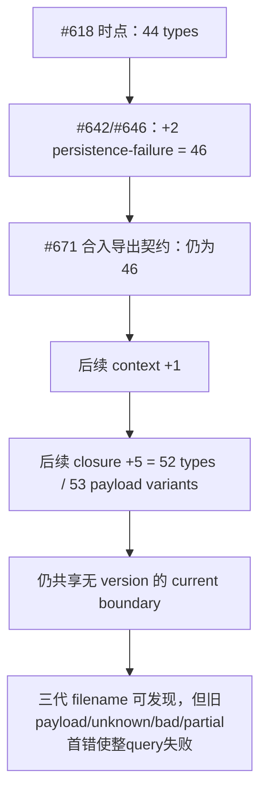
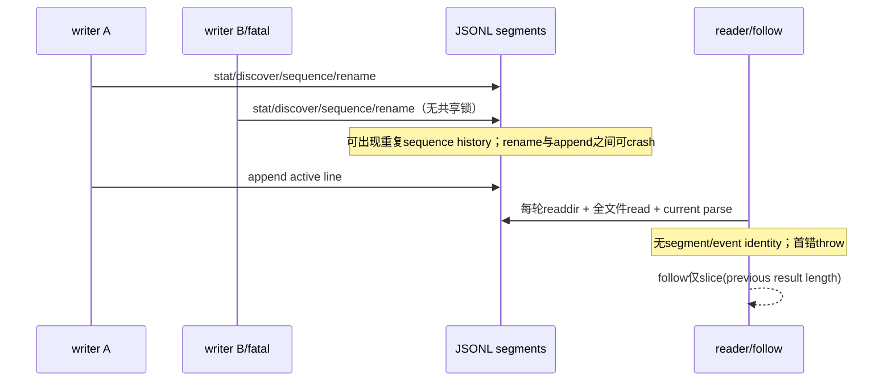

# RFC #544 R8 / S3 — events 身份、提交、连续性与可见结果决策档案

> 事实基线：`main@699842eba2eefc242d19f8fa9232bc1d9d5c3bdd`。输入仅为 AGG §2.2/§3.1/§3.2/§4.3/D6、`detail-I06-544.md`–`detail-I09-544.md` 与 `detail-investigation-audit-544.md`；未重读源码、未运行实验。本档案列出事实允许的形态与固定可见结果，不推荐、不估规模、不拆 issue，也不新增断电 durability、生产规模、统一三流全集或跨流因果全序保证。

## A. 主 agent 摘要（≤一页）

**既定目标不再重审。** D6必须以4.3主segments提供daemon-down可读的真实历史、按active offset增量读取/推送、过滤、精确类型链，以及翻段无丢无重；已建立的SSE连接必须存活，client断开时必须清理watch/reader资源。§2.2/§3.1/§3.2还要求首屏/死态展示最近事件、最后事件、具名异常和落盘崩溃记录。当前运行已证的交付偏离是：rotate+append非提交事务且并发可生成重复sequence；full-query/结果计数follow不满足active offset增量成本，合法前缀插入与rotation时可丢重；坏行/partial/duplicate sequence可使整批失败。断线后的event replay、`Last-Event-ID`和gateway restart后的cursor恢复是可靠性强化，不是D6固定交付。

**44→46→52不是单一“文档少写8项”。** 44是#618时点；#671契约合入前两个persistence-failure type已把集合变46；合入后context 1项、closure 5项使当前52 type/53 payload variants。44→46是契约文档与合入时点口径错位，46→52说明无version union持续演进。它要求修正口径并以交付范围内真实历史验证可读性；不能据此假定历史已经不兼容，也不能推出通用migration/version framework。

**必须修的偏离分三层。** (1) writer commit：单writer完整行是资产，但同进程多writer无串行所有权，rotate与append分离；不得把普通readback提升为断电保证。(2) reader continuity：必须以active offset增量消费并在rotation时无丢无重；内部segment identity/offset是满足该保证的工程状态，不是对外replay cursor合同。(3) failure可见性：主流与两个fallback流逻辑ADT同源、物理发现面不同；现状`logs.query`三流timestamp merge不是目标契约。schema/file层的交付要求只到“真实历史可读”。

**事实支持的工程分叉：** writer交付可保留JSONL并建立单writer所有权与正常rotation/append顺序；权威append journal、crash publication/recovery协议是更强可靠性形态。交付内continuity以segment identity+active byte offset/已处理段集合处理append与rotation。event级稳定identity、持久canonical index、`Last-Event-ID`与restart cursor persistence只在选择断线replay强化时进入。

**可见结果已经固定：** events历史由4.3主active/history segments提供；死态仍能看到最后事件；`daemon.fatal`等死因线索、落盘崩溃记录与首屏具名异常必须可见。两个fallback文件如何被查询、投影、标来源、去重、排序及在单流损坏时降级，均属工程实现。固定结果不等于“把三流全部记录并入一个统一历史”，也不产生跨流因果全序。

**档案计数：** 1种writer交付形态、1种可选journal/recovery强化、1种交付内continuity状态族、2种可选replay强化、3种fallback消费形态；另有3种条件兼容处理族。

## B. 完整决策档案

### B1. 稳定要求、已证事实与禁止外推

| 层 | 稳定要求 | 已证现状 | 本档案边界 |
|---|---|---|---|
| 主历史 | 4.3主active/history segment；daemon-down可读；过滤；精确parse | current ADT与三代filename parser可保留；坏一行整批失败 | 必须证明交付范围真实历史可读；只对实证不兼容/损坏作最小处理 |
| 实时/续读 | active offset增量；翻段无丢无重；SSE连接存活且client断开回收资源 | 无tail；follow每秒全读并用结果长度；watch通知可合并 | 必须建立内部segment/offset连续性；断线replay、`Last-Event-ID`、restart cursor persistence为可选强化 |
| writer | daemon events唯一写入方是架构目标；正常rotation应可连续消费 | 真实多writer可并发；rotate+append分步；tolerant错误可成功返回 | 必须修已证并发/publication偏离；不新增fsync/断电承诺 |
| 首屏语义 | 主历史、最后事件、具名异常、死因线索与落盘崩溃记录可见 | 三物理流；same-ts无全局因果序 | 可见结果固定；物理归集/展示/去重排序属工程，不把“最后”偷换成全局因果序 |
| compatibility | 4.3导出契约由同仓网关消费 | 44/46/52口径漂移；无schema version；legacy仅是filename身份 | 无version是演进风险；不在没有真实不兼容证据时要求version/migration framework |

已证可达状态不得因生产频率未知降级：并发rotate重复sequence、reader/rename `ENOENT`、rename后append前crash、partial/bad行、late legacy前缀均须在真实历史读取与rotation continuity路径中处理或明确呈现。断线重放与restart后cursor丢失只登记为风险；I07未证明断电durability与生产overlap概率。

### B2. 44→46→52 与 schema/file 演进风险

- **身份差异：** event `type`只决定当前union分支，不表达schema generation；extra `schemaVersion`会被当普通extra保留，不能dispatch。envelope/payload/subject也不是exact object。
- **文件差异：** active、sequence history、pre-sequence legacy history是segment filename identity与排序身份；三类文件每一行仍用同一个current `ObservabilityEventBoundary`。因此“legacy filename可读”只说明能发现该文件，不说明其历史line shape可读。
- **失败传播：** query在parse后才filter，任一坏行也阻断整个查询；尾partial不是暂时返回合法前缀，而是整批throw，后续追加完整行仍被中间坏行阻断。这是当前真实读取韧性问题，不等于存在多代schema不兼容。
- **测试同错：** canonical schema只round-trip `daemon.stop`；current writer/current parser与exhaustive switch可一起演进而保持自洽。交付仍需真实历史样本、关键current variants、bad/partial矩阵；version/unknown-generation矩阵只在实际采用对应兼容机制时需要。

对应触点（均来自I06）：`src/observability.ts` 的 `ObservabilityEventBoundary`、52-type/payload boundaries、`queryObservabilityEvents`、`parseObservabilityEventSegmentName`、`discoverObservabilityEventSegments`、`orderObservabilityEventSegments`；`tests/unit/observability/observability.test.ts` 的schema/segment/query fixtures；daemon/status/logs的共享query消费者。

### B3. rotate/crash、follow/cursor 与三流沉默的完整因果

#### Writer→disk→reader

1. writer public append入口与跨socket/timer/fatal路径可并发；UUID只避免目标文件名碰撞，不给sequence CAS。
2. rotation的discover/rename/append不是一个publication transaction。并发实测产生重复sequence histories与失败writer丢event；kill在rename后append前留下history、active缺失、新event未提交。append返回普通readback可见，但无fsync，故本档案不新增断电保证。
3. reader全序是legacy整体→sequence history→active以及文件内行序，不是event identity。合法late legacy会改变既有结果前缀；结果计数follow由此漏新、重旧，且每轮全读不满足active offset增量。断线或重启后全部重放是额外可靠性风险，不是本交付的replay合同。
4. `fs.watch`只可作“重新检查”的触发信号：101次变化实测可合并成1次rename通知。它不能是逐event账本。
5. I06坏行、I07重复sequence/rename竞态进入full query后，现有follow直接退出，没有resume point或恢复语义。reader不能恢复writer从未提交的event。

#### 三流目标沉默

主events、lifecycle persistence-failure、runner persistence-failure三个物理流使用同一event ADT，但只有主流具有4.3导出的segment discovery/rotation身份。现状主query只读主流；`logs.query`顺序全读三流后仅按`ts` stable sort，same-ts实际退化为main→lifecycle→runner来源拼接序，且一流坏行使整个RPC失败。AGG把D6历史面固定为主events JSONL，同时固定死因、最后事件、具名异常与落盘崩溃记录的可见结果；未规定的是fallback记录如何归集、展示、去重/排序，不是是否要展示这些结果，也不是要求统一三流全集。

对应触点（来自I07/I08）：`src/observability.ts` append/rotate/discovery/query；`src/daemon.ts`普通/OrThrow/fatal/fallback writer与`logs.query`；`src/runtime-paths.ts`两个failure path；`src/loop.ts` status recent events及`logs --follow`的`emitted/slice`；scheduler timer-owned emit；现有observability rotation tests与未来D6 gateway reader/SSE连接生命周期tests。

### B4. 真实不兼容出现时的3种兼容处理族

44/46/52首先是口径修正与真实历史验证输入。只有交付范围内实际历史行不能被current boundary读取时，才按已证shape选择下列最小处理族；不得仅因“无version”预建它们。

| ID | 形态 | 确定后果 | 函数/文件/测试触点 | 仍未知/必须显式决定 |
|---|---|---|---|---|
| SC-1 | **line显式version + 多version parser**：新写行携schema identity；reader按version解析为current domain event；无version历史走已声明legacy parser | 未来generation可判别；旧行无需改盘；一个segment可混version。当前non-exact extra不能冒充version语义 | `ObservabilityEventBoundary`前的version envelope/dispatch；全部writer编码；`queryObservabilityEvents`; 52/53×version fixtures、unknown version、mixed segment、filter-after-parse tests | 无version存量如何归类；支持哪些历史generation；unsupported version是整批失败、隔离还是显式partial result |
| SC-2 | **读取前/升级时canonical migration**：先把可识别历史行转换为当前versioned canonical segments，再由D6只读一种schema | steady reader单schema；迁移成功后filename与line generation可统一；迁移本身成为daemon-down历史可用性的前置状态 | segment discovery/order、migration command/startup边界、canonical writer、query；原盘保全、幂等重跑、中断恢复、混合代际、迁移后逐事件等价 tests | 何时/谁迁移；坏行/partial处理；daemon已死而尚未迁移时GUI呈现；真实历史payload全集未知 |
| SC-3 | **无version的historical shape adapters**：按type与字段shape识别已知旧分支并normalize；新写仍current shape | 可不改既有line envelope；只能对已枚举shape提供兼容；两个generation形状重叠时没有可靠身份 | current boundary之前的adapter registry；query；每个已知旧shape→current fixture、ambiguous shape、unknown shape tests | 已知旧payload全集尚未由生产root证明；未来同shape语义变化无法可靠区分；何时停止支持某adapter |

共同触点：I06列出的三代filename parser可作为文件身份资产；测试须覆盖交付范围内真实历史样本与current关键variant。只有发现实际不兼容generation，才增加对应fixture与上表最小adapter/version/migration证明。是否为未来演进主动采用version是可选强化，不是本RFC新增保证。

### B5. Writer：1种交付形态与1种可选可靠性强化

交付必须消除已证多writer竞争，并让正常day/size rotation与append对reader无丢无重。rename后append前进程崩溃、断电稳定介质与重建账本属于额外可靠性风险，不由D6自动生成恢复协议。

| ID | 形态 | 确定后果 | 函数/文件/测试触点 | 仍未知/不新增的保证 |
|---|---|---|---|---|
| WC-1（交付） | **JSONL仍为权威账本：单writer所有权 + 正常rotation/append顺序**。async、timer与fatal写入口共享串行所有权；day/size rotation产生唯一sequence并完成后续append | 同进程sequence与rotate顺序唯一；正常并发与rotation不再制造重复段或丢event；D6仍直读4.3 JSONL | 四个append API、rotate/discover/order、daemon writer入口、timer/fatal路径、query；跨writer rotate、正常reader并发、day/size rotation tests | fatal同步入口如何加入所有权；进程在文件步骤间崩溃仍是风险 |
| WC-2（可选） | **权威append journal或显式publication/recovery协议** | 可区分crash时已接收/已投影/待恢复，并可重建projection | journal/marker、projector、startup recovery；kill各阶段、重复恢复tests | 物理介质、保留期、成功定义、断电durability均需另有需求 |

WC-1必须关闭I07的多writer与重复sequence，并证明正常rotation无丢重。只有选择WC-2时，才要求crash publication分类与恢复测试。

### B6. Continuity：1种交付状态族与2种可选replay强化

| ID | 形态 | 确定后果 | 函数/文件/测试触点 | 仍未知/必须绑定的语义 |
|---|---|---|---|---|
| CR-1（交付） | **segment identity + active byte offset + 已处理segment集合**：reader只从active已读line boundary继续；rotation时识别被rename段并无丢无重切到新active；watch只触发rescan | 增量成本不随总历史增长；rotation连续性不依赖结果长度；状态只需覆盖当前连接/reader生命周期 | filename identity/discovery/order、incremental line parser、gateway reader内存状态；active append、day/size rotation、late segment、partial completion、watch合并tests | late segment相对既有event的展示顺序；segment被修复/替换的处理 |
| CR-2（可选） | **event级稳定identity + SSE replay id** | 可在断线后按id续读；需要历史id策略与保留边界 | event schema/writer、query cursor、SSE id；断线/replay/gap tests | `Last-Event-ID`合同、id保留期、旧历史identity均未由D6要求 |
| CR-3（可选） | **gateway持久canonical index/cursor** | 可跨gateway restart恢复消费位置；引入index/source reconciliation | gateway index、scanner、restart恢复tests | index权威性、retention、删除/修复源语义均属额外强化 |

CR-1必须定义坏行、partial与duplicate sequence对当前reader的显式结果；若采用CR-2/CR-3，再证明对应replay/restart语义。“retry full query”“结果计数”“timestamp+offset”“只用watch”不能证明active offset与rotation无丢重。

### B7. Fallback消费：3种物理实现形态

| ID | 形态 | 确定后果 | 函数/文件/测试触点 | 仍未知/不得预设 |
|---|---|---|---|---|
| FV-1 | **语义端点分别读取**：主历史、最后事件、死因/异常视图分别读取所需物理源；不制造统一三流历史 | 单fallback坏行不必击穿无关主历史；UI可标来源；固定可见结果可分别证明 | 主segment query、两个failure path reader、首屏selector、过滤routes；单流坏行、daemon-down tests | 多来源“最后”的候选比较/tie；是否实时推fallback |
| FV-2 | **读取时逻辑union**：每流保留source identity与当前读取位置，语义层只为具体视图组成需要的结果；不改物理文件 | 可对不同页面复用reader；必须保留source tag，不能沿用现状匿名`ts` sort冒充全局序 | three-source reader、source-tagged identity、view selectors、SSE multiplex；same-ts、单流断点、live source独立性、filter tests | merge展示顺序/tie；一个流失败时partial还是该视图整体失败；不得把内部union宣称为统一三流历史 |
| FV-3 | **异步投影到统一消费面**：两个fallback记录保留原文件作为救援源，由reconciler投影固定可见结果所需记录 | GUI可走一个cursor/query；必须防重复并保留origin；main写失败时不能要求同步回写main才能算fallback成功 | fallback writer/path、reconciler、unified index/segment、dedup identity、startup recovery；main故障、重复投影、crash、daemon-down tests | 投影延迟；未投影fallback的可见时点；统一消费面不等于“全部三流记录属于主历史” |

三种形态不预设三流物理合流或跨流顺序。现状`logs.query`的main→lifecycle→runner拼接后`ts` stable sort只是现状事实，不自动等于FV-2的目标语义。

### B8. 固定可见结果与工程边界

| 结果面 | 已固定结果 | 未被固定、留给工程 |
|---|---|---|
| events历史 | 4.3主active/history segments在daemon-down时仍可读、可过滤 | 不要求两个fallback文件的全部记录并入主历史；可另设详情/诊断入口 |
| 最后事件 | daemon死态仍显示最后事件 | 多物理来源的候选收集、比较、same-ts tie、来源标签 |
| 死因线索/崩溃记录 | `daemon.fatal`/`daemon.stop`等死因线索与落盘崩溃记录可见 | 从主流、fallback或投影取得；故障时partial呈现与恢复 |
| 最近异常 | 首屏显示具名异常，如`daemon.fatal`、`scheduler.tick_failed`、`attempt.timeout` | fallback记录的映射、去重、展示顺序、是否实时推送 |

这些结果可由FV-1/FV-2/FV-3任一形态实现。不得把物理实现反向写成“统一三流全集”，也不得以未规定全局tie为由退回是否展示固定结果。

### B9. 固定后果与验证账本

无论工程轴如何组合，下列是相同验收范围：

1. **真实历史：** 修正44/46/52来源口径；以交付范围真实segments证明可读；覆盖bad/partial的显式结果。若发现不兼容shape，再对该shape增加最小兼容fixture；不预设unknown-version或多generation framework。
2. **Writer：** 跨socket/timer/fatal实际writer overlap；day/size rotate；duplicate sequence；reader同时rotate；证明正常rotation/append无丢重。仅在采用WC-2时测试rename/append阶段kill与恢复分类。
3. **Continuity：** active offset append、day/size rotation、late legal segment、watch通知合并、过滤改变、坏行/partial/duplicate sequence；逐项证明当前reader在append/翻段中无丢无重。仅在采用replay强化时测试断连重放、`Last-Event-ID`或gateway restart恢复。
4. **主流/fallback：** 每个源单独损坏/停止；daemon-down主历史、最后事件、死因线索与具名异常结果均可见；source identity保留；若多来源提供最后候选，tie规则单测；验证不把内部归集冒充统一三流历史。
5. **D6/SSE：** 稳态按active offset读取而非全量重扫；事件驱动推送；daemon kill后连接与历史查询存活；SSE client强断回收watch/reader资源且网关健康。不要求断开client随后补发事件。

现有资产可复用：current typed ADT、filename parser/segment boundary、单writer正常day/size rotation夹具、信封关联键过滤、SSE `request.signal`硬门。它们分别只证明当前shape、正常串行段与transport宿主，不能相互替代。

### B10. 决策状态与证据索引

| 类别 | 状态 | 数量 |
|---|---|---:|
| 已确定必须修的偏离 | writer publication、active offset/rotation continuity、固定可见结果实现前置、真实历史读取中的已证坏行/partial失败 | 3层+读取韧性 |
| 纯口径修正 | 44（#618）→46（#671合入时）→52 current / 53 payload variants | 1 |
| 操作员契约裁决 | 无；可见结果已固定 | 0 |
| 工程形态 | WC-1 + CR-1 + FV 3为交付形态；WC-2、CR-2/3及SC 3均为条件强化/处理族 | 5个交付形态+6个条件族 |
| 不足事实 | 断电durability、生产频率、真实旧payload全集、retention/规模、跨流因果全序 | 不转成保证 |

证据索引：

- 稳定目标：`AGG-544-gui-observability-gateway.md` §2.2、§3.1、§3.2、§4.3、D6。
- schema/count/file：`detail-I06-544.md` A、B1–B7。
- writer commit/concurrency/crash：`detail-I07-544.md` A、B1–B7。
- reader/order/cursor/reconnect/watch/三流现状：`detail-I08-544.md` A、B1–B7。
- fallback物理流现状与稳定可见结果边界：`detail-I09-544.md` A、B1–B6。
- R7 gate与S3归并：`detail-investigation-audit-544.md` A、B1、B3–B5。

本档案未读取上述范围外文件、未访问生产root、未做实验、未实现代码。最终选择任何SC/WC/CR/FV形态时，只能以既定D6与固定可见结果为约束；不能用工程形态反向扩张为统一三流全集。
