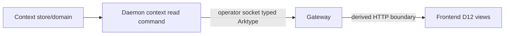

# RFC #544 R8 / S5：context read boundary 决策档案

> 事实边界：仅压缩 AGG CAP-6/D12、`detail-I12-544.md` 与 R7 收口核算。固定事实面为 `main@699842eba2eefc242d19f8fa9232bc1d9d5c3bdd`。本文没有重读源码、运行实验或实现。RFC #544 只消费外部 CAP-6 typed boundary，不定义 context 写入恢复合同。

## A. 主 agent 摘要（≤一页）

D12 是 CAP-6 的纯只读消费者。稳定范围已经固定：

1. 读取拓扑为 daemon context 服务域 → operator 主体 socket read 命令 → gateway → frontend。
2. 请求、响应与错误从 upstream Arktype boundary 派生，网关和前端不复制 entry shape。
3. chain 公告、item 谱系、group 分支组三种 scope 可浏览。
4. 展示 `id/ts/scope/author` envelope 与 opaque body；body 原样显示，不解释 markdown、状态字面量或控制记号。
5. pagination/filter 采用 upstream 实际接口，RFC #544 不自造 cursor、limit、filter 或 error shape。
6. 经既有成功写入路径持久化的 entry 必须能通过该 read boundary 读出并在 D12 展示。

当前只有严格类型的内部 store 和 `listContextEntries(chainId)`：全 chain、无公开 pagination/filter，请求不带 operator read boundary，生产代码无调用者，daemon/CLI 也没有 read/list command。因此“内部能列”不等于 CAP-6；外部 typed read boundary 缺失是唯一属于本 RFC 的已确定偏离。

I12 还证实了现有三段写的风险：session 在内存，restart 会丢 partial upload；commit 顺序可造成 session/DB/event 分裂；没有 idempotency 或 reconciliation identity。这些是外部 context owner 的写入恢复、审计和持久性风险。CAP-6/D12 没有要求 partial upload 跨 restart、commit retry、DB/event 原子性、outbox、ledger 或 staging，故它们不是 RFC #544 的必修项、R9 地基或前置 gate。若外部 owner 另有稳定合同，才由该 owner 选择相应工程机制。

本档案没有操作员裁决，也没有 R9 前置 owner 裁决。R9 只需建立 typed consumer seam，并承诺成功持久化的 entries 可经实际 upstream boundary 浏览。

## B. 完整档案

### B1. 稳定要求与当前事实

| 对象 | RFC #544 稳定要求 | 当前事实 | 分类 |
|---|---|---|---|
| read topology | operator socket read，经daemon context服务域 | 无daemon/CLI read command | 已确定偏离 |
| typed boundary | request/result/error派生自upstream Arktype boundary | 只有内部row/store parser | 已确定偏离 |
| scopes | chain公告、item谱系、group分支组可浏览 | store ADT有三scope；daemon写group当前拒绝；外部身份未形成 | read boundary需消费upstream定义 |
| envelope/body | `id/ts/scope/author` + opaque body | store round-trip已有相近typed资产 | 可保留资产，不等于外部合同 |
| pagination/filter | 跟随upstream实际实现 | 内部list全chain、仅chainId | 外部接口细节，不由本RFC裁决 |
| successful-write visibility | 已成功持久化entry可由read boundary返回 | 只能经内部store list观察 | D12必须直接证明 |
| write recovery | 无新增要求 | restart、DB失败、event失败存在分裂风险 | 外部owner风险，不是RFC #544保证 |

### B2. 可保留资产与不能外推的事实

- closed scope/author ADT、typed persisted-row parser、chain FK/index、single INSERT transaction、daemon-derived author、sequence gate、chain isolation与delete cleanup均可保留。
- `listContextEntries(chainId)` 能证明成功写入的 envelope/body 在内部可读，但不能冒充 socket read contract。
- 当前内部 `(created_at,id)` 排序不能自动成为公开 order/cursor。
- store允许group、daemon拒绝group，只说明当前写路径与未来三scope消费存在接缝；不能由本RFC发明group identity或写入协议。
- 当前write credential与author推导不能生成额外read-auth矩阵；operator socket read语义和具体upstream boundary应直接消费外部能力。
- 一坏行导致内部全量list失败只是现状风险，不能由此生成CAP-6 bad-row/partial-result合同。

### B3. 唯一外部形态与内部放置分叉

外部合同只有一种：

允许的内部工程放置有两种，均不改变外部shape：

| 放置 | 确定后果 | 不成立边界 |
|---|---|---|
| daemon handler直接委托context store query | 路径短；handler仍必须按upstream boundary解析并返回 | 直接暴露内部full-list shape、UUID cursor或store error |
| 独立context service module封装store，daemon handler转发 | domain/query逻辑可与transport分离；gateway仍只见upstream boundary | service另造第二套entry/request/result schema |

gateway/frontend 直读SQLite、复制entry union、从内部list猜pagination/filter，均违反D12。

### B4. 外部接口依赖与保持未知

| 项目 | R9处理 |
|---|---|
| upstream request/result/error具体Arktype shape | 保留typed import/parse seam，接口落地后直接消费 |
| pagination/filter | 跟随upstream实际实现，不阻塞R9、不复制 |
| item谱系/group分支组身份 | 消费upstream scope identity，不从当前scope_key反推 |
| auth/audit、bad-row/partial、snapshot、retention/GC、deleted-chain行为 | 保持外部owner风险或接口细节，不生成RFC #544保证 |
| partial upload restart、idempotency、session/DB/event reconciliation | 保持外部context owner写入风险；不进入RFC #544 R9地基 |
| outbox/ledger/staging/commit identity | 可由外部owner在其稳定合同要求时选择；本RFC不要求或排除 |

### B5. 具体触点与证明面

| 责任 | 当前触点 |
|---|---|
| domain types/parsers | `src/context-entry.ts:4-15,17-85,87-145` |
| table/index/migration | `src/sqlite-state.ts:775-784,948-1005` |
| internal append/list/delete | `src/sqlite-state.ts:354-356,1605-1619,2045-2063` |
| daemon三段写现状 | `src/daemon.ts:203-205,1732-1917` |
| CLI写入口 | `src/loop.ts:1943-1986,2507-2556` |
| event风险 | `src/daemon.ts:1777-1785,2285-2289`; `src/observability.ts:923-950` |

未来实现必须直接证明：

1. operator socket read command存在，request/result/error均过upstream Arktype boundary；
2. chain、item谱系、group分支组三scope成功持久化fixtures可从同一boundary读出；
3. envelope和body与写入值一致，body无解析副作用；
4. gateway/frontend只import upstream类型，无平行shape或SQLite直读；
5. pagination/filter严格按实际upstream接口运行；
6. daemon-down条件若属于CAP-6 owner合同，则按其真实boundary验证，不由内部store测试代替。

现有 unit/integration tests通过内部 `listContextEntries` 核对写结果，只能作为store资产，不能证明CAP-6或D12浏览路径。

### B6. 分类结论

| 类别 | 内容 |
|---|---|
| 已确定必须修 | 缺少operator socket typed read boundary；D12无法消费成功持久化entries |
| 固定消费合同 | 三scope、envelope、opaque body、upstream Arktype、pagination/filter随upstream |
| 操作员裁决 | 0 |
| R9前置owner裁决 | 0 |
| 工程放置 | handler直接委托store，或经context service module |
| 外部owner风险/可选工程 | partial restart、idempotency、session/DB/event reconciliation、outbox/ledger/staging、auth/audit、bad-row、snapshot、retention |

### B7. 档案结论

- RFC #544 read形态：**1个外部合同、2种内部放置**
- 操作员裁决：**0**
- R9前置owner裁决：**0**
- 写入恢复/一致性形态：**不属于本RFC，不计数**

