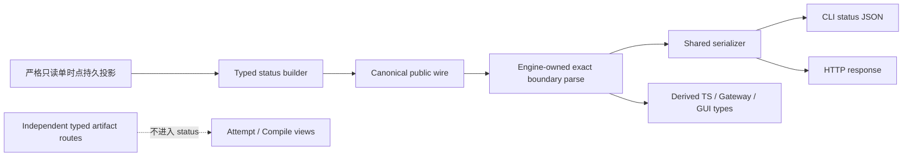

# RFC #544 R10 / D3 — status 精确 schema boundary 需求侧报告

> 输入仅限 `AGG-544-gui-observability-gateway.md` 的 D3、`expected-foundation-544.md` 与 `decision-S1-status-544.md` 摘要。本报告不读取源码、旧 issue 或实现，不选择实现机制。

## A. 主 agent 摘要（≤一页）

### 问题与结论

D3 要把 `status --json` 变成 GUI 可依赖的精确运行态契约。它需要的不是“内部对象大致有类型”，而是一条从单时点持久读取到公共 wire 的闭合证据链：各槽有精确 shape、所有 variant 穷尽、最终 CLI JSON 与 HTTP response 都通过同一个 engine-owned boundary、消费类型从该 boundary 派生，且序列化后不存在绕开 boundary 的结构改写。

稳定设计已经排除了 C1 式 domain-vs-wire 裁决：**规范对象就是最终 CLI/HTTP wire**。内部 domain 可以与 wire 同形，也可以先投影为 canonical wire；这是工程布局，不改变最终 wire 必须经同一 boundary parse 的义务。

### 原子需求计数

D3 共需要 **9 项原子保证**：

1. 顶层 exact schema；
2. 每个槽 exact schema，无匿名 object/宽 record；
3. variant/optional/nullability 穷尽并由 parse 拒绝非法组合；
4. CAP-1 taskTree shape 原样集成，不复制或改写；
5. CAP-4运行态字段通过同一 status boundary 接入；
6. 一次 status 的 SQLite 持久槽来自同一 read snapshot；
7. canonical wire 在公共序列化之前形成，序列化后无未验证改写；
8. 最终 CLI JSON 与 HTTP response 由同一 engine-owned boundary parse；
9. TS、gateway、GUI 类型从 boundary 派生，并提供可审 shape diff 与正反例证明。

分类结果：

- **地基已供：2项**——CAP-1 exact taskTree输入与SQLite单时点快照（F03/F04）；严格读取/error基础F01–F02是前置地基但不另计D3原子项。
- **D3自建：6项**——顶层exact、各槽exact、variant parse、canonical wire/serialization、CLI/HTTP同boundary、类型派生与shape-diff证明（F04–F05）。
- **接缝输入：1项**——CAP-1 shape已由F03/F04接入；CAP-4字段由F30提供后进入同一boundary，D3只提供extension位置和同源规则。
- **地基未闭合：0项。** U04只决定golden/兼容样本，不阻塞D3需求定义。

Attempt prompt/bindings等artifact不进入status；它们由独立typed artifact route消费。编译产物CAP-7也不是运行态status槽。

### F01–F30映射结论

F01–F30 已 **30/30 映射**：D3直接依赖F01–F05；通过X01接收F30的CAP-4投影；F06、F15、F27等只把各自已经定义的运行态值投影进exact槽，不把它们的领域语义转交D3；F16–F24的artifact/context数据不强塞status；其余保证与D3无结构性依赖。

## B. 原子需求与地基映射

### B1. 原子保证矩阵

| ID | D3原子保证 | 必要性 | 地基状态 | 责任归属 | 验收证明 |
|---|---|---|---|---|---|
| **D3-A1** | snapshot顶层是exact product schema；字段集合、required/optional与nullability显式 | 顶层宽口会让任意槽绕过契约 | F04给出目标保证 | D3自建 | 顶层extra/missing/wrong-null负例被拒绝；合法完整wire通过 |
| **D3-A2** | 每个既有槽都有命名exact schema；无匿名`object`、raw record或unknown透传 | D3性质1的直接要求 | F04 | D3自建 | 每槽至少一条非法shape负例；boundary定义区匿名槽为零 |
| **D3-A3** | 有限状态、错误、节点与主体采用穷尽variant；非法字段组合在boundary parse处失败 | 仅列字段但保留flag/optional soup仍不能作为稳定契约 | F04及CAP-1 exact ADT资产 | D3自建；CAP-1 variant原样消费 | 每variant正例、unknown tag与variant字段串位负例 |
| **D3-A4** | taskTree槽逐字段采用CAP-1 shape，不本地复制、重命名或推断 | D3只集成外部任务树shape，不取得其所有权 | F03/F04、X01 | 地基/接缝已供；D3负责引用集成 | CAP-1 shape逐字段对照；类型来源相同；无第二taskTree parser |
| **D3-A5** | CAP-4运行态字段到达时进入同一status boundary，并保持evaluation identity/operator/decision一致 | F30要求CAP-4状态可被同一status消费 | F30、X01 | F30提供domain字段；D3提供同一boundary extension seam | CAP-4各variant通过同一CLI/HTTP boundary；无parallel status wire |
| **D3-A6** | 一次status内所有SQLite持久槽与完整taskTree来自同一read snapshot；events/process旁证保持独立采样语义 | exact shape不能掩盖跨commit撕裂 | F03已供 | 地基已供，D3只消费结果 | writer barrier下持久槽同提交；不声称跨SQLite/events/process全局时点 |
| **D3-A7** | 在公共序列化前形成canonical wire；任何flatten/projection都发生在boundary parse之前，parse后不得再改shape | 否则内部parse通过而公共wire越界 | F05 | D3自建 | 序列化前后round-trip；冲突/extra/非JSON值负例；无post-parse rewrite |
| **D3-A8** | 最终CLI JSON和HTTP response通过同一个engine-owned boundary；两条路径不各建parser/builder | 这是稳定消费合同和C1纠偏后的唯一规范对象 | F05 | D3自建 | 同fixture CLI/HTTP逐字段一致且均经同boundary；任一路非法wire显式失败 |
| **D3-A9** | engine/TS/gateway/GUI类型从boundary派生；shape演进产生编译期消费清单；PR提供收紧前后shape diff | 防止运行schema和手写类型再次漂移 | F04/F05 | D3自建 | 无平行interface；类型级exhaustiveness；shape diff、golden与真实status通过 |

### B2. Parse、serialization与错误边界

必须保持以下方向：

- boundary验证的是canonical public wire，而不是验证domain后再由serializer改变结构；
- parse failure是typed契约失败，不能catch-all降成正常missing状态；具体底层读取分类由F01/F02提供；
- JSON serialization只编码已经通过boundary的值，不负责补字段、flatten `extra`、推断variant或重写nullability；
- CLI和HTTP可以有不同传输封装，但其status payload必须是同一boundary的值；不能出现第二套HTTP schema；
- shape diff记录公共契约变化，不把旧宽槽永久保留为compat fallback。

### B3. CAP-1、CAP-4与artifact接缝

| 接缝 | producer保证 | D3消费义务 | 禁止越界 |
|---|---|---|---|
| CAP-1 taskTree | leaf/seq/par、join、closure lifecycle及相关状态由同一exact shape提供 | 直接组合进status boundary并保持variant穷尽 | 本地复制taskTree interface、重命名字段或从queue反推tree |
| CAP-4 / F30 | evaluation identity、operator、decision与authority缺口形成同源运行态投影 | 通过同一status boundary新增精确槽/variant；CLI/HTTP共同消费 | 为CAP-4建parallel status wire；由D3发明decision/capability语义 |
| D2/D10 artifact / F16–F18 | prompt、bindings及missing/write-failed由独立typed artifact route提供 | status最多保留已有引用身份；不吸收artifact正文 | 把prompt/bindings强塞status或由status重建artifact |
| CAP-7 compile / F20–F21 | current name-based定义态compile artifact | 与status并列但不共享运行态槽 | 把compile views并入status snapshot或建立历史compile字段 |

### B4. F01–F30全量映射

| F范围 | 与D3关系 | 映射结论 |
|---|---|---|
| **F01–F02** | status读取与typed错误前置 | 地基已供；D3不重复定义opener/migration/error taxonomy，但不能吞掉其typed失败 |
| **F03** | SQLite单时点持久投影 | 直接依赖，对应D3-A6；已供 |
| **F04** | exact顶层/槽、boundary派生类型 | D3核心自建，对应A1–A5、A9 |
| **F05** | 最终CLI/HTTP同一boundary与无post-parse rewrite | D3核心自建，对应A7–A9 |
| **F06** | daemon三证值可能进入status | 只消费F06定义的typed分类/采样值；D3不重新定义三证语义 |
| **F07–F10** | transport与daemon lifecycle | HTTP/gateway调用可消费其结果；不改变status schema原子要求 |
| **F11–F15** | events历史/SSE/死因线索 | events是独立数据面；若status含当前摘要，只按其producer typed shape接入，不构造跨介质snapshot |
| **F16–F18** | attempt artifacts | 独立route；明确不进入status正文 |
| **F19–F21** | pinned definition/current compile/CAP-3 seam | 与运行态status正交；不新增historical compile或typed binding槽 |
| **F22–F24** | context read与展示 | 独立context route；不把entry集合强塞status |
| **F25–F27** | F mutation与四动作结果 | mutation完成后由status读回核心状态；D3只保证相关槽exact，不取得verb语义所有权 |
| **F28–F29** | evaluation identity/decision/capability | producer domain事实；通过F30接缝进入status，不由D3创建 |
| **F30** | CAP-4 status/event/audit同源 | 直接接缝，对应D3-A5；D3提供同一boundary，F30提供字段语义 |

**覆盖：30/30。** 直接核心F04–F05；前置地基F01–F03；显式接缝F30；其余保证均被分类为typed producer输入、独立route或无结构依赖，没有遗漏，也没有把邻域能力吸收到D3。

### B5. 地基供给、D3自建与未闭合清单

| 分类 | 原子项 | 数量 | 结论 |
|---|---|---:|---|
| 地基已供 | D3-A4 CAP-1输入、D3-A6单时点读取 | 2 | 直接消费，不在D3重复实现；F01/F02为前置但不另计原子项 |
| D3自建 | D3-A1/A2/A3/A7/A8/A9：exact schema、parse、canonical serialization、同boundary和类型派生/shape diff | 6 | 属于D3交付 |
| 接缝输入 | D3-A5 CAP-4字段 | 1 | F30产出时接入同一boundary；D3不得发明domain语义 |
| 地基未闭合 | — | 0 | U04影响样本与兼容diff，不改变需求或阻塞R10 |

A1–A9均独立计数，责任分类为2+6+1=9；F01/F02是D3读取路径的前置保证，不重复计作新的schema原子项。

### B6. 验收矩阵

| 层 | 最小验收 | 证明什么 |
|---|---|---|
| schema | 顶层和每槽无匿名object；每槽非法shape负例；variant exhaustive | A1–A3 |
| taskTree | CAP-1合法各variant正例与本地改写负例 | A4 |
| CAP-4接缝 | identity/operator/decision合法组合与非法串位；同CLI/HTTP boundary | A5 |
| consistency | 活跃writer barrier下完整持久槽与taskTree同一read snapshot | A6 |
| serialization | canonical wire parse后序列化round-trip；无post-parse flatten/rewrite | A7 |
| public consumers | 真实活chain `status --json`与HTTP payload均通过同boundary；shape逐字段一致 | A8 |
| type/diff | TS/gateway/GUI类型派生、编译期exhaustive、收紧前后shape diff与golden | A9 |
| negative boundary | missing/extra/wrong tag/wrong nullability/非JSON值/冲突字段均显式失败 | A1–A3、A7–A8 |

### B7. 结论与计数

- D3原子保证：**9**
- 地基已供原子项：**2**
- D3自建原子项：**6**
- 接缝输入责任包：**1**
- 地基未闭合：**0**
- F01–F30映射：**30/30**
- 操作员裁决：**0**
- 新增需求：**0**
