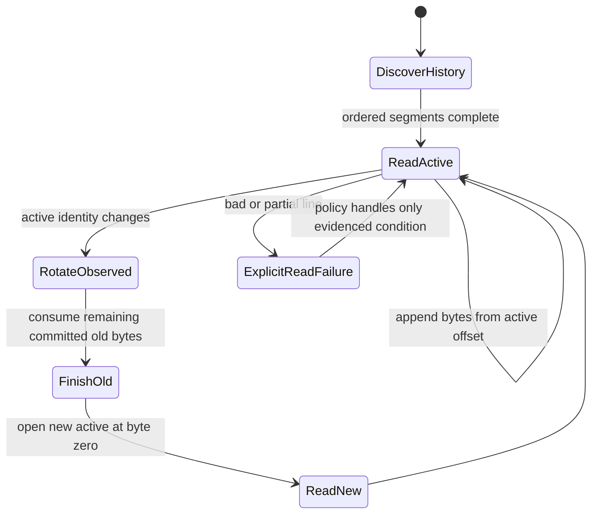

# RFC #544 R10 / D6 — events 增量读取与实时推送需求侧报告

> 输入仅限 AGG §4.3/D6、`expected-foundation-544.md` 与 `decision-S3-events-544.md` 摘要。本报告不读取源码、旧 issue 或实现，不选择具体实现机制。

## A. 主 agent 摘要（≤一页）

### 问题与结论

D6需要在daemon存活和停止两种状态下消费同仓events契约：历史查询必须发现并精确解析主active/history segments，按关联键过滤；实时路径必须从active byte offset增量读取，在正常day/size rotation中对已提交事件无丢无重；已建立的SSE连接在daemon停止后仍由gateway维持，客户端断开则立即清理watch/reader资源且gateway继续健康。

固定可见结果同时要求：主events历史、主JSONL最后事件、`daemon.fatal`/`daemon.stop`等死因线索、落盘崩溃记录与具名异常可见，并如实标明来源。该结果不等于构造统一“三流events历史”，也不要求跨流因果全序。

### 原子保证计数

D6共需要 **11项原子保证**：

1. 主active/history segments可发现并按4.3规则排序；
2. 交付范围真实历史由当前event boundary精确parse，坏行/partial有显式结果；
3. 按chain/item/runId/phase等关联键过滤，结果等于源记录；
4. writer在普通、timer、fatal入口共享唯一写入所有权；
5. normal day/size rotation形成唯一段身份并完成append；
6. reader按active byte offset增量读取，不按结果计数或全量重扫续读；
7. append与normal rotation期间已提交事件无丢无重；
8. 新事件经SSE及时推送，已建立连接不依赖daemon继续存活；
9. client abort立即关闭watch/reader/interval/订阅且gateway继续健康；
10. daemon-down历史查询仍可用，并显示主流最后事件和死因线索；
11. 落盘崩溃记录与具名异常可见、来源如实，不宣称统一三流全集或跨流全序。

分类结果：

- **地基已供：3项**——A1所需的4.3 segment发现排序规则，以及A4/A5所需的F12 writer所有权与normal rotation保证。gateway SSE宿主和`request.signal`硬门是A8/A9可复用资产，但具体订阅/清理仍由D6自建。
- **D6自建：8项**——真实历史读取/filter、active-offset continuity、SSE订阅生命周期、daemon-down查询与固定可见结果投影。
- **地基未闭合：0项。** U08–U10决定兼容fixture、压力参数与浏览器E2E，不生成新合同。

### 明确排除

D6不要求：断线replay、`Last-Event-ID`、gateway restart cursor persistence、通用schema-version/多代parser/history migration framework、crash journal/publication recovery、fsync/power-loss、对外cursor合同、fallback六格membership、统一三流历史或跨流因果全序。

### F01–F30映射结论

F01–F30已 **30/30映射**。直接核心为F11–F15，F10只提供daemon lifecycle场景触发而非events读取机制；F17/F27/F30通过X03提供各自domain event/diagnostic语义，D6只消费；F01–F05 status与events保持独立数据面；其余保证为独立route或无结构依赖。

## B. 原子需求与地基映射

### B1. 原子保证矩阵

| ID | D6原子保证 | 地基/输入 | 责任归属 | 最小证明 |
|---|---|---|---|---|
| **D6-A1** | 主active/history segments按4.3导出规则发现并确定排序，不复制filename regex/template | F11、4.3 segment exports | 地基提供规则；D6调用 | 多segment、同日多段、legacy tie fixture顺序一致 |
| **D6-A2** | 交付范围真实历史逐event精确parse；坏行/partial不伪装合法事件并产生显式读取结果 | F11、current event ADT、U08 | D6自建读取边界 | 真实样本与bad/partial fixture；只有实证不兼容才加最小处理 |
| **D6-A3** | 历史与增量结果可按envelope关联键过滤，filter不重定义event shape | F11、4.3 envelope | D6自建 | 多chain/item/run/phase源记录与结果逐条相等 |
| **D6-A4** | 普通、timer、fatal写入口共享唯一写入所有权 | F12 | 地基已供的producer保证 | 实际writer overlap下无重复sequence/竞争rotation |
| **D6-A5** | normal day/size rotation产生唯一segment并完成对应append | F12 | 地基已供的producer保证 | 两种rotation触发各自完整append；不宣称crash/断电恢复 |
| **D6-A6** | active续读状态是segment identity + byte offset或等价内部状态；成本随新增字节而非历史总量增长 | F13 | D6自建 | 长active追加只读取新字节；不得用结果条数当file offset |
| **D6-A7** | active append和normal rotation交错时，已提交事件对该reader恰好一次呈现 | F12/F13 | D6自建，消费writer保证 | append、day/size rotate、watch合并通知交错，无丢无重 |
| **D6-A8** | 事件驱动SSE推送；连接建立后daemon停止不终止gateway连接或历史能力 | F14、F10场景 | D6自建 | daemon kill/down后既有页面/连接存活，历史仍可查询 |
| **D6-A9** | client abort触发单次close并清理watch/reader/offset/interval/订阅；race中enqueue失败不杀gateway | F14、`request.signal`硬门 | D6自建 | 强断client后资源归零，health/API立即响应，新连接可建 |
| **D6-A10** | daemon-down时主历史、主流最后事件、`daemon.stop/fatal`等死因线索可读 | F15、F10场景 | D6自建投影 | active daemon→stop/kill→查询，最后主流事实与来源正确 |
| **D6-A11** | 落盘崩溃记录和具名异常可见且来源标明；多来源归集不声称统一全集/全序 | F15、X03 | D6自建消费/展示 | 各源单独存在/损坏/停止；稳定结果仍可见，tie规则只作展示工程处理 |

### B2. 历史、增量与rotation状态机

必须保持：

- segment identity/offset是gateway内部continuity状态，不升级为公共cursor合同；
- normal rotation只保证已提交事件无丢无重，不扩成rename/append任意kill点恢复或power-loss durability；
- watch通知只是“可能有变化”的触发，不是事件计数，通知合并不能丢数据；
- filter施加于精确parse后的event，不以文件名、结果长度或前端猜测代替关联键；
- 坏行/partial的处理必须显式，不能把后续合法事件静默当成完整历史；具体最小策略由真实样本决定。

### B3. SSE生命周期与daemon lifecycle接缝

| 场景 | D6必须保证 | 不承担的保证 |
|---|---|---|
| daemon运行 | active offset读取并推送新增事件 | server-side通用connection cap或handler deadline |
| daemon正常stop | 已建立SSE由gateway维持；主历史和最后事件仍读 | 自动重启daemon或把start做成socket RPC |
| daemon kill/fatal | gateway仍健康；已有磁盘历史、崩溃记录与死因线索可查 | crash journal、fsync、保证fatal事件一定落盘 |
| client主动断开/网络消失 | `request.signal`驱动一次清理；任何enqueue race被收口 | 断线期间event replay、`Last-Event-ID` |
| gateway restart | 新连接可从历史查询并从当前active建立新内部offset | 恢复旧连接cursor或持久subscription |

F10只提供start/stop/restart与daemon-down测试场景；D6不接管daemon生命周期控制。

### B4. 固定可见结果与物理来源

| 用户可见结果 | 合法来源 | D6消费义务 | 禁止主张 |
|---|---|---|---|
| events历史 | 4.3主active/history segments | 精确parse、filter、daemon-down可读 | fallback全量自动属于主历史 |
| 最后事件 | 主JSONL中最后可读事件 | 显示时间/type/source | 三物理流有全局最后因果事件 |
| 死因线索 | 主流`daemon.stop/fatal`及落盘崩溃记录 | 各自读取并标来源 | 所有崩溃都必有两类证据 |
| 最近具名异常 | 稳定文本点名的异常events及相关诊断记录 | 过滤/投影后可见 | 开放式“所有相关异常”或fallback六格membership合同 |

物理读取可以独立查询后联合投影，也可以在gateway内部形成带source的逻辑视图；这属于工程形态，不改变结果，也不能改写成统一三流历史。

### B5. F01–F30全量映射

| F范围 | 与D6关系 | 映射结论 |
|---|---|---|
| **F01–F05** | status严格读取与exact wire | 独立数据面；可与events同页展示，但不构造跨SQLite/events单时点 |
| **F06–F09** | liveness三证与typed transport | 页面可并列消费；D6直读events不借socket RPC代替历史 |
| **F10** | daemon lifecycle | 提供stop/kill/restart测试场景；D6连接和历史不依赖daemon存活 |
| **F11** | 主历史发现/parse/filter | 直接核心，对应A1–A3 |
| **F12** | writer所有权与normal rotation append | producer地基，对应A4–A5，并支撑A7 |
| **F13** | active byte offset与rotation continuity | 直接核心，对应A6–A7 |
| **F14** | SSE存活和abort清理 | 直接核心，对应A8–A9 |
| **F15** | 固定可见结果 | 直接核心，对应A10–A11 |
| **F16** | attempt artifact成功路径 | 独立route；不进入events历史 |
| **F17** | artifact写失败diagnostic | 经X03作为domain定义的diagnostic event消费；D6不重定义payload或提交协议 |
| **F18–F24** | artifact/compile/context | 独立消费面；不强塞events或借events重建正文 |
| **F25–F27** | GUI mutation及结果 | F27既有action events可供核验；D6不把event presence改成mutation commit判据 |
| **F28–F30** | CAP-4 decision链 | F30定义event/audit payload语义；D6按同一events boundary消费，不建第二日志 |

**覆盖：30/30。** 直接核心F11–F15；lifecycle场景F10；domain event接缝F17/F27/F30；其他保证全部明确为独立数据面或无结构依赖。

### B6. 地基供给、D6自建与缺口

| 分类 | 原子项 | 数量 | 结论 |
|---|---|---:|---|
| 地基已供 | A1 segment导出规则、A4 writer所有权、A5 normal rotation | 3 | D6复用，不复制规则；SSE宿主硬门是A8/A9资产但不替D6落地 |
| D6自建 | A2/A3/A6/A7/A8/A9/A10/A11 | 8 | 历史/filter、continuity、SSE资源生命周期和固定可见结果 |
| 地基未闭合 | — | 0 | U08–U10只决定fixture、最小兼容与E2E参数 |

责任计数为3+8=11；SSE宿主与`request.signal`硬门是A8/A9的可复用资产，不另计原子保证。

### B7. 明确排除的强化

| 排除项 | 原因 |
|---|---|
| replay / `Last-Event-ID` / disconnect补发 | D6只保证已连接continuity与新连接历史查询 |
| gateway restart cursor persistence | 内部offset不构成外部subscription合同 |
| 通用schema-version、多代parser、history migration framework | 仅在真实历史出现具体不兼容时做对应最小处理 |
| crash journal/publication recovery、fsync/power-loss | stable scope只要求normal writer/rotation；未要求断电durability |
| 公共cursor API | segment identity/offset仅为内部工程状态 |
| 统一三流历史、fallback六格membership、跨流因果全序 | 稳定设计只固定可见结果和来源如实 |

### B8. 验收矩阵

| 层 | 最小验收 | 对应原子项 |
|---|---|---|
| history | 真实active/history、三代合法filename、bad/partial、multi-key filter | A1–A3 |
| writer | normal/timer/fatal overlap；day/size rotation完成append | A4–A5 |
| continuity | active追加、watch合并、reader与normal rotation交错，无丢无重且不全量重扫 | A6–A7 |
| daemon-down | 已开SSE/页面存活，历史、最后事件、死因线索仍可见 | A8、A10 |
| abort | 强断SSE client，资源立即清理，gateway health与新API正常 | A9 |
| visibility | 主流、崩溃记录、具名异常分别存在/损坏/停止并保留source | A10–A11 |
| browser | 活态实时新增、daemon stop/kill、client abort、重新连接历史查询完整路径 | A2–A11 |

### B9. 结论与计数

- D6原子保证：**11**
- 地基供给包：**3**
- D6自建原子项：**8**
- 地基未闭合：**0**
- F01–F30映射：**30/30**
- 操作员裁决：**0**
- 新增需求：**0**
