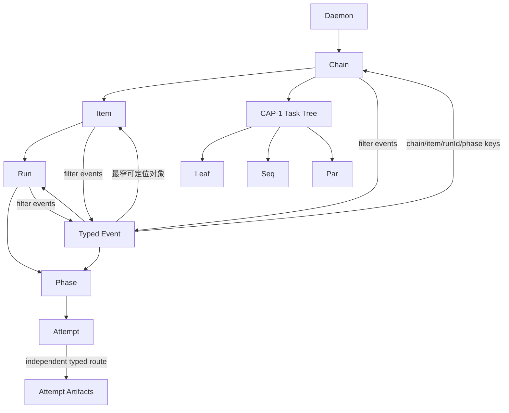

# RFC #544 R10 / D9 — chain/item/run 任务树层级钻取需求侧报告

> 输入仅限 AGG D9、CAP-1、`expected-foundation-544.md` 以及D3/D6接缝报告。本报告不读取源码、旧 issue 或实现，不选择具体router或组件机制。

## A. 主 agent 摘要（≤一页）

### 问题与结论

D9要把同一运行态事实组织成两条可互相跳转的导航轴：

- 层级轴：daemon → chain → item → run → phase/attempt；
- 任务树轴：CAP-1的leaf/seq/par树、join声明与状态、reopen计数及closure运行态。

每层必须可从相邻层进入，也能用可分享URL直接定位。事件以4.3 envelope中的chain/item/runId/phase关联键跳到对象；对象视图用同一关联键反查事件。导航只关联真实identity，不重新推断对象关系，也不构造跨status/events的全局时点或事件全序。

D9所有数据shape必须从D3最终status boundary、CAP-1 taskTree union和4.3 event boundary派生。前端不能建立parallel interface、匿名透传或slot概念。V2没有完整显式树时，必须按CAP-1提供的退化树shape正常显示，不能用slot或UI推断生成另一棵树。

### 原子保证计数

D9共需要 **12项原子保证**：

1. daemon/chain/item/run/phase/attempt均有稳定typed identity；
2. 相邻层父子关系由status事实给出并双向互链；
3. 任一层有canonical、可分享、可刷新直达URL；
4. URL参数经typed parse并精确区分存在、缺失、过期或不属于父对象；
5. 页面读取只消费D3最终status boundary，不复制运行态shape；
6. taskTree按CAP-1 leaf/seq/par discriminated union穷尽渲染；
7. join声明/状态、reopen计数、closure lifecycle/branch等CAP-1字段如实显示；
8. v2退化树按同一CAP-1 shape正常显示，不复活slot；
9. 带关联键event可跳到最窄可定位对象；
10. run/item/chain视图可用同一关联键反查其event序列；
11. status与events保持各自时间/来源语义，不生成跨介质全局snapshot或全局event序；
12. attempt详情通过独立typed route读取自身artifact；artifact正文不强塞status，D9只负责identity与导航。

分类结果：

- **地基已供：3项**——A5所需的D3最终status boundary、A6所需的CAP-1 taskTree union、A10所需的D6/4.3 typed event filter。F03同一read snapshot为A1/A2提供可信关系事实，但导航仍由D9自建。
- **D9自建：9项**——typed层级identity/互链、URL直达与错误、CAP-1字段展示、v2退化显示、event→object跳转、跨数据面呈现边界、attempt独立route接缝。
- **地基未闭合：0项。** U03/U04/U08/U14只决定真实fixture、规模和浏览器E2E，不改变导航合同。

### F01–F30映射结论

F01–F30已 **30/30映射**。核心依赖F03–F05、F11、F15、F18和F28–F30；F06/F10提供daemon活死页面状态，F12–F14只支撑events可用性；其余为页面可链接的邻域能力或独立route。没有把artifact正文、context集合、compile产物或mutation协议吸收到status。

## B. 原子需求与地基映射

### B1. Identity、读取、类型与导航矩阵

| ID | D9原子保证 | 地基/输入 | 责任归属 | 最小证明 |
|---|---|---|---|---|
| **D9-A1** | daemon、chain、item、run、phase、attempt均有命名typed identity；跨层不使用裸index/显示名猜测 | F03–F05 status wire；F18 attempt接缝 | D9自建route identity投影 | 相同显示名、跨chain重复item字段、多个attempt仍定位唯一对象 |
| **D9-A2** | 每层显示其parent与children的真实identity链接；child必须属于URL中的parent | F03单时点层级事实、F04 exact槽 | D9自建 | daemon→chain→item→run→phase/attempt逐层往返；wrong-parent typed not-found/mismatch |
| **D9-A3** | 每层有canonical URL，刷新、复制、从外部打开仍落同一对象 | typed identities | D9自建 | 五层以上URL逐一冷启动直达，无需先访问父页面 |
| **D9-A4** | route params在边界parse；missing、malformed、stale、wrong-parent有明确状态，不静默回首页或选首项 | F02 typed failure原则、F04 exact type | D9自建 | 每类负例有可见错误和返回父层入口 |
| **D9-A5** | chain/item/run/phase页面数据从D3最终CLI/HTTP同一boundary派生，不建parallel DTO/parser | F04/F05、D3-A7–A9 | 地基提供shape；D9消费 | UI types来自boundary；字段变更产生编译缺口；无匿名object透传 |
| **D9-A6** | taskTree renderer对leaf/seq/par discriminated union穷尽，unknown kind不能被default吞掉 | CAP-1、F04 | 地基提供union；D9自建renderer | 三kind fixture和`assertNever`型穷尽检查 |
| **D9-A7** | join声明/状态、reopen计数、leaf closure lifecycle/branch与closure状态按CAP-1原字段显示 | CAP-1、F03/F04 | D9自建展示 | seq/par/join/reopen/closure组合fixture逐字段一致 |
| **D9-A8** | v2退化树使用CAP-1提供的退化shape；与一般树走同一renderer | CAP-1 migration/degenerate shape | D9自建展示 | v2线性chain可展开、直达、无slot字段或第二树模型 |
| **D9-A9** | event携chain/item/runId/phase时跳到存在的最窄对象；缺少更细键则落最窄可证层 | F11 event boundary/关联键 | D9自建 | chain-only、item、runId、phase事件逐类落位；坏关联键明确不可定位 |
| **D9-A10** | chain/item/run页面按同一event关联键反查精确事件序列，filter不在前端复制event shape | F11、D6-A3 | D9调用D6 query/filter | 多chain/item/run混合events，反查结果与源逐条一致 |
| **D9-A11** | status对象与event列表分别保留各自采样/来源；页面不声称两者同一全局时点或跨流因果序 | X07、F15、D6-A11 | D9自建呈现边界 | 并发status更新与event追加时不重排/合成虚假全序；source可见 |
| **D9-A12** | phase/attempt导航可达独立artifact route；prompt/bindings正文不进入status snapshot | F18、X01 | D9自建链接；artifact producer独立 | attempt URL到artifact页；legacy-missing/write-failed如实；status payload不含artifact正文 |

### B2. 层级与树导航模型

层级轴与任务树轴可以在chain/item页面交叉显示，但不能互相冒充：taskTree表达CAP-1任务结构，run/phase/attempt表达执行历史。UI不得从run列表反推tree，也不得从tree节点合成不存在的run identity。

### B3. URL直达与错误边界

| URL状态 | 必须结果 | 禁止行为 |
|---|---|---|
| 合法identity且对象存在 | 直接渲染对象及parent/children链接 | 要求先从首屏走一遍才能加载 |
| 参数malformed | typed invalid-route状态 | 把裸string继续传入store/filter |
| 对象不存在/已删除 | typed not-found，保留可返回的最近合法父层 | 静默选择第一个chain/item/run |
| child存在但不属于URL parent | typed relation-mismatch/not-found | 仅按child ID全局命中造成越权或错链 |
| daemon down但持久对象可读 | 继续展示D3持久事实与D6历史events，标活性状态 | 把daemon down误报成对象不存在 |
| event关联键指向不存在对象 | event仍可读并显示unresolved target | 丢弃event或伪造对象 |

URL的具体path segment和router库是工程选择；稳定要求只约束canonical identity、直达性和错误结果。

### B4. CAP-1 taskTree与v2退化树

| 输入variant | D9必须渲染 | 穷尽要求 |
|---|---|---|
| leaf | identity、closure lifecycle、closure branch及CAP-1携带状态 | 不从run/status其他槽猜closure |
| seq | children顺序、join声明/状态、reopen计数 | children全部可达；新增字段编译暴露 |
| par | branches、join声明/状态、reopen计数及pin/closure相关状态 | branch identity稳定；不称slot |
| v2 degenerate | CAP-1给出的线性/退化结构 | 走同一union renderer，不建`LegacyTree`平行shape |

slot已裁退役：禁止URL、component prop、filter、event mapping或fallback tree中重新引入slot字段/术语。

### B5. Event↔object双向跳转

1. Event→object只使用4.3 typed envelope已有的chain/item/runId/phase键。
2. 有多个键时选择最窄且关系验证通过的对象；不能只看runId而忽略chain/item归属。
3. Object→events调用D6的typed filter/query；前端不扫描全历史后自行解释payload。
4. 事件的时间、segment/source和D6固定可见性保持原样；对象当前status只是另一数据面。
5. fallback崩溃记录若不具备完整object identity，只展示它实际拥有的链接层级，不补猜run/item。
6. 不对主流与fallback建立统一sequence，也不以页面排序声称跨流因果顺序。

### B6. F01–F30全量映射

| F范围 | 与D9关系 | 映射结论 |
|---|---|---|
| **F01–F02** | status严格读与typed失败 | daemon-down直达和route读取继承其结果；D9不吞成not-found |
| **F03** | status持久槽/taskTree同一read snapshot | 层级与树身份直接地基，对应A1/A2/A7 |
| **F04–F05** | exact最终status boundary及派生类型 | 核心type/read地基，对应A4–A6；禁止parallel shape |
| **F06–F10** | daemon三证、transport、lifecycle | daemon页展示与活死导航状态；不改变对象identity或tree |
| **F11** | events精确parse/filter | event↔object核心地基，对应A9/A10 |
| **F12–F14** | writer/continuity/SSE | 保证event列表可用；D9不取得offset/rotation/replay语义 |
| **F15** | 最后事件/死因/异常可见 | 页面可链接并保留source；不建全局序 |
| **F16–F17** | attempt落盘与diagnostic | diagnostic可进入event跳转；artifact正文不进status |
| **F18** | attempt artifact typed route | 对应A12，phase/attempt链接消费其present/legacy/write-failed结果 |
| **F19–F21** | pinned definition/current compile/typed seam | 可从attempt/definition页面另行导航；不并入D9 status tree |
| **F22–F24** | context read | 可作为对象邻接页面，但不影响D9层级identity或status shape |
| **F25–F27** | mutation与结果 | 动作后D9刷新status/events；不把mutation request当对象事实 |
| **F28–F30** | CAP-4 evaluation/decision | identity与status/event接缝进入同一对象导航；D9只展示/链接，不定义decision语义 |

**覆盖：30/30。** 核心供给F03–F05、F11、F18、F28–F30；邻接消费F06–F10、F12–F17、F19–F27；无遗漏或能力吞并。

### B7. 地基供给、D9自建与缺口

| 分类 | 原子项 | 数量 | 结论 |
|---|---|---:|---|
| 地基已供 | A5 D3 boundary、A6 CAP-1 union、A10 D6 typed event filter | 3 | D9消费，不复制schema/reader/filter；F03为A1/A2提供可信关系事实 |
| D9自建 | A1/A2/A3/A4/A7/A8/A9/A11/A12中的identity、互链、直达、树展示、event跳转与artifact链接 | 9 | A2消费F03事实，但导航与关系校验属于D9 |
| 地基未闭合 | — | 0 | 真实fixture与browser路径未证明，但不缺语义保证 |

责任计数为3+9=12；每条原子保证只归入一类。

### B8. 明确排除

| 排除项 | 原因 |
|---|---|
| slot identity、slot URL或slot tree fallback | slot已裁退役，CAP-1无此variant |
| parallel frontend status/event/taskTree shape | D3与4.3已固定类型单源 |
| prompt/bindings正文进入status | F18/X01固定独立artifact route |
| 从run列表推断tree或从tree合成run | 两条导航轴所有权不同 |
| 跨SQLite/events全局snapshot | X07明确两数据面独立 |
| 主流/fallback全局event序 | D6只固定来源如实和可见结果 |
| 断线replay/cursor作为D9导航前提 | 属于D6明确排除的强化 |

### B9. 验收矩阵

| 层 | 最小验收 | 对应原子项 |
|---|---|---|
| full drilldown | 真实root从daemon逐层点到attempt，再逐层返回 | A1–A2 |
| direct URLs | daemon/chain/item/run/phase/attempt逐层冷启动、刷新、分享；malformed/stale/wrong-parent | A3–A4 |
| exact types | 所有页面types来自D3/CAP-1/4.3；无anonymous/parallel DTO | A5–A6 |
| taskTree | leaf/seq/par、join/reopen/closure与v2退化fixture；exhaustive renderer | A6–A8 |
| event→object | chain-only/item/run/phase事件与unresolved target | A9、A11 |
| object→events | chain/item/run混合历史按关联键反查逐条一致 | A10–A11 |
| attempt route | present、legacy-missing、write-failed artifact；status不含正文 | A12 |
| daemon-down | 持久层级和events仍可浏览，daemon活性另行标示 | A4、A10–A11 |

### B10. 结论与计数

- D9原子保证：**12**
- 地基已供原子项：**3**
- D9自建原子项：**9**
- 地基未闭合：**0**
- F01–F30映射：**30/30**
- 操作员裁决：**0**
- 新增需求：**0**
