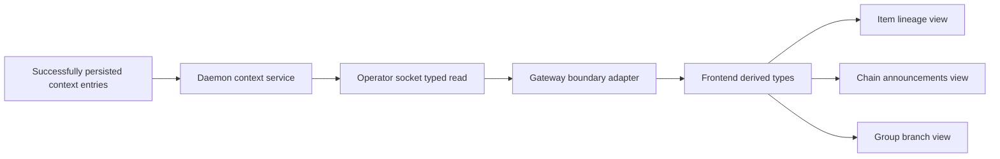

# RFC #544 R10 / D12 — context entries 只读展示需求侧报告

> 输入仅限 AGG D12/CAP-6、`expected-foundation-544.md` 与CAP-6 seam摘要。本报告不读取源码、旧 issue 或实现，不定义外部CAP-6 shape。

## A. 主 agent 摘要（≤一页）

### 问题与结论

D12是CAP-6的纯只读消费者。完整读取链固定为：daemon context服务域的operator socket typed read command → gateway → frontend。请求、结果和错误都必须从upstream ArkType boundary派生，网关和前端不复制entry、scope、pagination、filter或error shape。

GUI在对应对象视图浏览三种scope：item谱系、chain公告、group分支组。每条entry如实显示`id/ts/scope/author` envelope和body原文；body始终opaque，只做等宽/原样显示，不做Markdown、状态词、控制记号或结构提取。

D12只要求：**已经通过既有成功写入路径持久化的entries**能经实际upstream read boundary读出并显示。它不取得context写入协议所有权，也不新增partial upload跨restart、commit retry/idempotency、DB/event原子性、outbox/ledger/staging、retention/GC、read auth/audit、bad-row/partial-result或cross-page snapshot合同。

### 原子保证计数

D12共需要 **11项原子保证**：

1. daemon context服务域存在operator socket typed read命令；
2. request/result/error均由upstream ArkType boundary parse；
3. gateway HTTP与frontend类型直接派生，不存在parallel shape；
4. item谱系scope在对应item视图可浏览；
5. chain公告scope在对应chain视图可浏览；
6. group分支组scope在对应group视图可浏览；
7. `id/ts/scope/author` envelope逐字段如实展示；
8. body字节/文本语义原样透传，不解析；
9. 成功持久化entry经真实socket→gateway→browser路径可见；
10. pagination/filter严格跟随upstream实际接口，不自造维度或cursor；
11. loading/empty/success/typed error与翻页/过滤交互明确，不把daemon-down、protocol error或空结果混同。

分类结果：

- **外部CAP-6供给：5项**——typed request/result/error、三scope identity、envelope/body、pagination、filter的实际shape。
- **D12自建：6项**——operator socket消费链、gateway/frontend类型派生、三scope页面落位、opaque渲染、成功写入可见性和typed UI状态。
- **地基未闭合：0项。** U13/U14表示真实upstream shape和浏览器fixture尚待运行验证，但typed seam已足够进入R10。

### F01–F30映射结论

F01–F30已 **30/30映射**。直接核心为F22–F24；F07–F09通过X02提供typed socket transport，不替CAP-6领域error；F03–F05可提供对象视图的status identity但不定义entry shape；其余是邻接页面能力或独立数据面。

## B. 原子需求与地基映射

### B1. 原子保证矩阵

| ID | D12原子保证 | 地基/输入 | 责任归属 | 最小证明 |
|---|---|---|---|---|
| **D12-A1** | daemon context服务域暴露operator主体socket read command；gateway不直读store/SQLite | F22、X02 | D12消费链自建 | 真实operator socket请求返回typed result；grep/code review无gateway store import |
| **D12-A2** | request/result/error全部经upstream ArkType boundary parse，unknown/invalid shape显式失败 | CAP-6、F22 | 外部供shape；D12调用 | 合法正例、invalid request/result/error负例；无internal row直接泄露 |
| **D12-A3** | gateway HTTP和frontend types从同一upstream boundary派生，无平行entry/scope/page/error定义 | F22、X05 | D12自建派生接缝 | 类型import来源唯一；外部variant新增产生编译缺口 |
| **D12-A4** | item谱系entries按upstream item-scope identity在对应item视图显示 | F23、CAP-6 | 外部供identity；D12自建页面 | 两个item谱系fixtures不串位，直达item页结果一致 |
| **D12-A5** | chain公告entries按chain scope在对应chain视图显示 | F23、CAP-6 | 外部供identity；D12自建页面 | 多chain fixture隔离，envelope/body与写入一致 |
| **D12-A6** | group分支组entries按upstream group identity在对应group视图显示 | F23、CAP-6 | 外部供identity；D12自建页面 | 多group fixture隔离；不从内部scope_key猜group |
| **D12-A7** | 每条entry展示`id/ts/scope/author`，字段值不由GUI重算或省略 | F23、CAP-6 envelope | 外部供shape；D12自建展示 | 各scope/author variant逐字段与boundary result相等 |
| **D12-A8** | body作为opaque text原样显示；Markdown、状态词、模板/控制记号均无解析副作用 | F23 | D12自建renderer | 特殊字符、多行、Markdown、状态字面量fixture显示内容一致 |
| **D12-A9** | 经既有成功写入路径持久化的entry能走实际read boundary和browser完整路径 | F24 | D12自建集成 | CLI/既有成功writer写三scope→socket read→gateway→GUI逐条一致 |
| **D12-A10** | pagination和filter只暴露upstream实际支持的args/result/page state；cursor/order/limit不由本RFC发明 | CAP-6、F24、U13 | 外部CAP-6供给 | 按实际boundary翻页/filter；请求与结果round-trip；无本地UUID cursor |
| **D12-A11** | UI穷尽表示loading、empty、success、upstream typed error及transport error；翻页/filter失败不丢已有语义 | F07–F09、F22 | D12自建UI；消费两层error | 空结果与失败分离；daemon-down/connect/protocol/domain reject逐类可见 |

### B2. 唯一读取拓扑

必须保持：

- gateway只调用operator read命令，不接触context表、内部full-list store或row parser；
- daemon handler和gateway adapter均parse upstream boundary，而不是把内部对象断言成兼容；
- transport错误由F07–F09表达，CAP-6领域错误保持自己的typed variant；两者不能压成统一“daemon down”；
- 若upstream boundary尚未提供某pagination/filter能力，UI不以内部index、UUID或本地数组扫描补造；
- D12是只读展示，不发context mutation，也不借读取功能定义write recovery。

### B3. 三scope页面与identity

| Scope | 定位来源 | 页面责任 | 禁止推断 |
|---|---|---|---|
| item谱系 | upstream item lineage identity/filter | 在对应item谱系区域显示结果与page/filter状态 | 从当前单item ID自行展开谱系规则 |
| chain公告 | upstream chain scope identity | 在chain详情显示公告entries | 把所有无item entry都猜作公告 |
| group分支组 | upstream group scope identity | 在group/branch对象视图显示结果 | 从内部`scope_key`或taskTree branch名反推外部group合同 |

页面routing可以复用D9对象identity，但CAP-6 scope identity仍由upstream拥有；D12不能让前端route参数成为第二份scope schema。

### B4. Envelope、opaque body与UI状态

| 对象 | 必须行为 | 不允许行为 |
|---|---|---|
| `id` | 原值显示/用于稳定list key | 由timestamp/index重新生成 |
| `ts` | 按产品既定时间显示但保留原值语义 | 与其他scope建立未声明全局序 |
| `scope` | 穷尽渲染upstream variant | 用裸string/default吞unknown variant |
| `author` | 穷尽渲染upstream author variant | 根据body或当前登录主体猜作者 |
| `body` | 原样、等宽、安全text渲染 | Markdown/HTML执行、状态解析、模板展开、控制命令提取 |
| UI state | loading/empty/success/typed domain error/transport error分离 | 空数组冒充失败或catch-all文案吞variant |

“原样”约束内容语义，不要求绕过正常安全文本转义；必须防止HTML执行，同时不改变用户可见文本。

### B5. Pagination/filter随upstream

D12只做以下动作：

1. 从upstream request boundary派生可用filter/page参数；
2. 从result boundary派生entries与next/previous/page状态；
3. 在URL或组件状态中编码时仍通过同一boundary parse；
4. 用户改变filter/page后展示对应typed loading/success/error；
5. 不声明cursor snapshot、失效、跨页一致性、retention或deleted-chain可见性，除非upstream实际boundary明确提供。

具体cursor/offset、order、limit、filter集合与error variant均不是D12需求决策。

### B6. 成功持久化可见性边界

F24只要求已成功持久化entry可读。验收起点必须是既有成功写入路径返回成功并能由CAP-6读取；以下状态不属于D12交付保证：

- begin/chunk partial session在daemon restart后的恢复；
- commit response丢失后的idempotent retry或结果查询；
- DB成功但event失败的reconciliation；
- outbox、ledger、staging或commit identity；
- entry retention/GC、deleted chain历史可见性；
- read auth/audit矩阵、坏行partial-result、cross-page snapshot。

这些只能在外部owner另有稳定合同后进入其能力实现，不能由D12 UI反推。

### B7. F01–F30全量映射

| F范围 | 与D12关系 | 映射结论 |
|---|---|---|
| **F01–F05** | strict status与exact wire | 提供chain/item/group邻接对象事实；不定义context entry shape或read path |
| **F06** | daemon liveness | UI可并列显示daemon状态；不把context empty等同daemon dead |
| **F07–F09** | typed socket transport | A1/A11直接消费；领域error不压成transport failure |
| **F10** | daemon lifecycle | 独立控制面；D12不要求daemon-down读取，除非upstream合同实际支持 |
| **F11–F15** | events读取与可见性 | 独立数据面；context body不解析成event/status |
| **F16–F21** | attempt artifacts/pinned/compile | 独立route；不进入context entry或body解释 |
| **F22** | operator socket typed read seam | D12核心，对应A1–A3/A11 |
| **F23** | 三scope/envelope/opaque body | D12核心，对应A4–A8 |
| **F24** | 成功持久化entry实际可见 | D12核心，对应A9–A10；不扩成write recovery |
| **F25–F27** | mutation typed façade | D12无context写入口；不把context read塞进GUI mutation面 |
| **F28–F30** | CAP-4 decision | 独立领域；body中的`advance/hold/reopen`字面量仍是opaque text |

**覆盖：30/30。** 直接核心F22–F24；transport接缝F07–F09；其余全部明确为邻接对象、独立数据面或无依赖。

### B8. 地基供给、D12自建与缺口

| 分类 | 原子项 | 数量 | 结论 |
|---|---|---:|---|
| 外部CAP-6供给 | A2 boundary、A4–A6 scope identity、A7 envelope、A8 body语义、A10 pagination/filter实际shape | 5 | 按能力包计为typed boundary、scope、envelope/body、pagination、filter；D12不定义字段 |
| D12自建 | A1/A3/A4–A9/A11中的socket消费、type派生、页面、渲染、成功路径与UI状态 | 6 | 页面责任跨多个供给shape，按六个交付包计数 |
| 地基未闭合 | — | 0 | U13/U14为接口落地与E2E未知，不是语义缺口 |

> A1–A11是11条独立验收保证。供给/自建在A4–A10上分别承担shape与消费责任；上表数量是责任包，不与原子保证做互斥加法。

### B9. 明确排除

| 排除项 | 原因 |
|---|---|
| partial upload restart / write retry / idempotency | D12只消费成功持久化entries |
| DB/event atomicity、outbox/ledger/staging | context写入恢复不属于本RFC |
| retention/GC、deleted-chain visibility | upstream未固定，不能从FK/delete现状生成 |
| read auth/audit矩阵 | operator socket read拓扑已固定；具体外部机制不由D12扩写 |
| bad-row/partial-result、cross-page snapshot | 实现风险不是RFC #544合同 |
| 自造cursor/order/limit/filter/error | pagination/filter必须跟随upstream实际boundary |
| gateway/frontend平行entry shape或SQLite直读 | 违反CAP-6纯消费者边界 |
| Markdown/状态词/控制记号解析 | body固定opaque |

### B10. 验收矩阵

| 层 | 最小验收 | 对应原子项 |
|---|---|---|
| socket boundary | operator command正例；invalid request/result/error；transport/domain error分离 | A1–A3、A11 |
| three scopes | 既有成功路径分别写item/chain/group fixtures，三页面不串位 | A4–A6、A9 |
| envelope/body | scope/author variants、特殊字符、多行、Markdown/控制记号 | A7–A8 |
| pagination/filter | 完全按实际upstream boundary翻页与过滤，URL/state round-trip | A10–A11 |
| shape single-source | gateway/frontend只import upstream types，无parallel definitions/store access | A2–A3 |
| browser | loading→success/empty/error；三scope浏览；成功写入值逐字段一致 | A4–A11 |

### B11. 结论与计数

- D12原子保证：**11**
- 外部CAP-6供给责任包：**5**
- D12自建责任包：**6**
- 地基未闭合：**0**
- F01–F30映射：**30/30**
- 操作员裁决：**0**
- 新增需求：**0**
