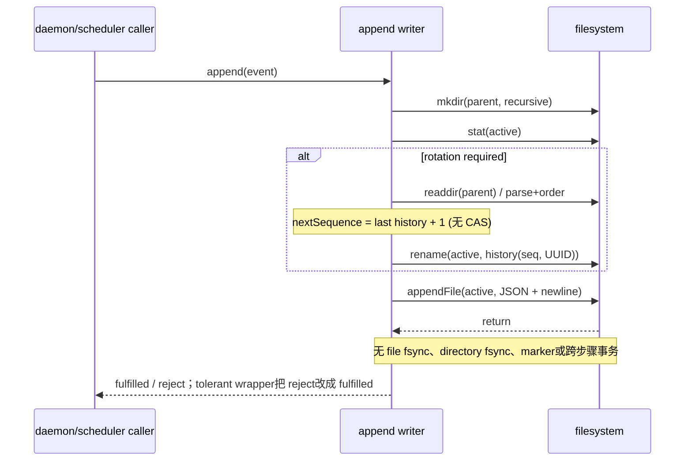

# RFC #544 R7 / I07 — events 写入提交、并发与崩溃事实

调查基线：`main@699842eba2eefc242d19f8fa9232bc1d9d5c3bdd`（Bun 1.3.14 / macOS arm64）。范围只回答 I07 写侧问题；不调查 reader 修法、cursor/reconnect 或 D6 消费实现。

## A. 主 agent 摘要（≤一页）

1. **“daemon 唯一 writer”不成立为同步性质。** 产品主流入口虽集中在 `CoderLoopDaemon`，但同一 socket 内仅按连接串行，不同 socket 并行；scheduler timer-owned lifecycle emit 是显式 fire-and-forget；fatal handler还可同步写。所有路径最终共享无 mutex/queue 的导出 append 函数。源码因此证明真实工作负载**可并发触达**，但现存 loop-data 中发生频率没有可归因计量，不能给概率。
2. **提交单位只是一次 `appendFile(line)` 返回；rotate+append 不是提交事务。** async 序列为 `mkdir → stat(active) → readdir/discover → rename(active, unique history name) → appendFile(active,line)`；sync 同构。没有 file/dir `fsync`、commit marker、owner lock 或 sequence CAS。`randomUUID` 只避免目标名碰撞，不能避免多个 history 使用同一 sequence。
3. **实际并发实验比 R5 已知的单一“丢一条”更坏。** 10/10 次以 8 个真实 `appendObservabilityEventOrThrow` 同时触发 rotation：每次 4–5 个 promise 报错、产生 3–4 个同为 sequence 1 的 history，query 100% 因 duplicate sequence 整批失败；多个新 event 被分散进 history/active，失败 writer 的 event 不存在。非 rotate 的 100 并发 append 在本机得到 100 条唯一完整行，但这只是一轮平台观测，不证明 atomicity/durability。
4. **reader 与 rotate 的现实竞态已触达。** 80 次真实 query/rotate 并发读中 2 次 `ENOENT`（discover 看见 active，readFile 前被 rename）；成功读在不同瞬间见 1–8 条。这里只记录写侧产生的可达状态，不提出 reader 修法。
5. **受控 SIGKILL 矩阵钉住 crash 状态。** 在 stat/discover 前后 kill：旧 active 原样可读、新 event 丢；rename 后、append 前 kill：只有 history，旧事件可读、新 event 丢、active 不存在；append 返回后 kill：本次机器重启式 readback 看见 history+新 active。但因为实现从未 fsync 文件或目录，实验不能把“append 返回后仍在 page cache 可读”提升为断电持久性保证。
6. **错误传播分叉。** `OrThrow` 传播 mkdir/stat/discover/rename/append 错；tolerant async/sync 仅写 stderr并向调用方成功返回。daemon 的普通 event 路径用 tolerant writer，之后仍写 rendered log；timer lifecycle 部分用 `OrThrow` 并进入 failure stream；fatal 路径调用 tolerant sync，且其外层 try/catch无法察觉已吞错误。因此调用成功、rendered 日志出现均不证明 JSONL 已提交。
7. **结论边界。** L12/L13 从偏离升级为运行可证；L17 中“真实路径能否并发”已回答为能，“并发频率、单 append 的跨 crash/断电 atomicity 与 durability”仍未知；L19 的并发/kill/fsync盲区成立。可保留资产仍是 typed event、segment naming/parser、串行完整行路径；它们不构成提交协议。

## B. 完整调查

### B1. 全部 writer、await 与 ownership

| writer / 来源 | 主流文件 | 调用与同步事实 | 错误面 |
|---|---|---|---|
| daemon 普通 lifecycle/decision/diagnostic | `paths.eventsFile` | 多数 handler `await recordObservabilityEvent*`；该方法直达 append。单 socket 用 `requestSequence.then` 串行，但每个 accepted socket各有独立 sequence，故跨 socket可重叠。 | tolerant；stderr 后 fulfilled，随后仍 `writeRenderedObservabilityEvent` |
| scheduler tick 的普通事件 | 同上 | scheduler 的 `emit` await daemon callback；单个同步链会等写完，但 scheduler close/timer来源并不全串在该链。 | 普通事件 tolerant；timer-owned 选择见下一行 |
| attempt/startup/recycle timer-owned lifecycle | 同上 | `emitTimerOwnedLifecycleEvent(options, emit(...))` 用 `void persistence.catch(...)`，多个 timer/close/socket写可同时在途。 | daemon 对 timer-owned event 用 `record...OrThrow`；reject 转为 lifecycle persistence failure |
| fatal/uncaught handler | 同上 | `recordFatalSync` 在进程退出前走同步 rotate+append；可与事件循环中尚未完成的 async fs operation交错，源码无 drain/lock。 | 内层 tolerant sync先吞错；外层 catch通常观察不到落盘失败 |
| runner status persistence failure | 独立 `runner-persistence-failures.jsonl` | sync `OrThrow`，daemon内存状态先更新；与主流不同文件。 | catch 后 stderr rendered fallback |
| lifecycle persistence failure | 独立 `lifecycle-event-failures.jsonl` | sync `OrThrow`，由 timer persistence rejection callback触发；与主流不同文件。 | catch 后 stderr rendered fallback |
| 导出的四个 append API | 任意调用方指定路径 | public module API无 daemon identity/owner token；repo产品 `src/` 内主流调用集中于 daemon，测试/scheduler harness亦直接调用。 | tolerant 与 OrThrow 两套不等价契约 |

“频率”事实：代码提供至少三类真实并发源（跨 socket、fire-and-forget timer lifecycle、fatal sync 对在途 async）；没有 writer-in-flight metric、lock contention metric或事件来源并发计数，现有持久文件也无法反推两个调用的 overlap，故生产频率保持未知。

### B2. 系统调用/异步边界

源码位置：`src/observability.ts:923-950,1246-1272,1308-1358`。active stat 的 `mtime`同时被用作 history `startedAt`；sequence来自一次目录 snapshot。两个 writer均可对不同瞬间的 active成功 rename到不同 UUID 文件，并各自把 sequence写成同一值；后续 `orderObservabilityEventSegments` 在发现重复 sequence 时直接 throw（`:1344-1353`）。

### B3. 可达磁盘状态与丢失/重复/不可见结果

| 交错/崩溃点 | 实验磁盘状态 | write result / readback | 分类 |
|---|---|---|---|
| kill before stat / after stat / after discover | 旧 active hash不变 | exit 137；只读到旧 pid -1 | 新 event 丢失；旧内容可见 |
| kill after rename, before append | 一个 history，active缺失；旧 hash不变 | exit 137；旧 pid -1可读 | 新 event 丢失；active暂时/永久不可见直到下一写 |
| kill after append returns | history + 一行 active | exit 137；读到 -1,999 | 本机进程崩溃 readback可见；断电 durability未知 |
| 8 writers共争 rotate | 3–4 个重复 sequence-1 history + active | 4–5 reject；query duplicate-sequence throw | 失败 event丢失；成功 event分散；全历史对 query不可见 |
| reader并发 rotate | discover snapshot含即将 rename的 active | 2/80 `ENOENT`；其余见不同前缀 | 整批暂时不可见；不是 event duplicate 证明 |
| 100 writers不 rotate | 单 active 100行/100 unique | 全部 fulfilled/readback | 本机本轮未观测撕行；不构成 OS atomic/durable保证 |

“重复”要精确定义：实验产生的是**segment sequence identity 重复**，并未观测同一个 event payload被写两次。当前 writer无 retry/request id，因此 reject后的上层若业务重试，是否产生 payload duplicate取决于调用方重试，I07 证据不足，保持未知。

### B4. 错误与 RPC/业务传播

隔离 fault（把预期 parent directory预置为普通文件）得到：async tolerant `fulfilled`、sync tolerant `returned`；两个 `OrThrow` 均返回 `EEXIST mkdir`。stderr各有一条 failure。由此结合 daemon代码：

- 普通 socket handler await的是 tolerant path，RPC业务可继续成功，JSONL failure没有结构化进入该 RPC response；
- `recordObservabilityEvent` 无返回 ADT，调用者无法区分“写成”与“只写了 stderr”；
- `recordFatalSync` 调 tolerant sync，注释所称“guarantee ... durable storage”既无 fsync证据，又因吞错不能由控制流证明；
- timer-owned lifecycle选择 `OrThrow`，其 reject由 scheduler转存 failure stream；但 failure stream自己仍是同一无锁 rotate/append算法，仅换文件，不能升级为原子提交保证。

### B5. 完整因果八层

1. **症状：** event缺失、多个 sequence相同、query整批失败、并发 read `ENOENT`、调用成功但文件无记录。  
2. **直接触发：** rotation窗口内多 writer/reader，或 mkdir/stat/discover/rename/append失败，或进程在步骤间退出。  
3. **执行机制：** 每次调用独立 stat+目录发现+rename+append；UUID仅区分文件名。  
4. **竞争根因：** 没有共享 writer queue/mutex/open-fd owner/sequence CAS；不同 daemon异步来源不共用 await链。  
5. **提交根因：** rename 与 append是两个独立 FS操作；无 marker/file fsync/dir fsync。  
6. **ownership 根因：** public append API只收 path+event，类型/运行时不表达 daemon writer authority。  
7. **传播根因：** tolerant wrapper把所有错误压成 stderr+成功；rendered log与JSONL提交相互独立。  
8. **保证影响：** AGG 4.3/D6所依赖的 rotate后历史可遍历、唯一 sequence、死态末事件可读，均不能从当前写侧建立；I08仍需只消费本文确认的磁盘状态，不应倒推 writer保证。

### B6. 测试同错、资产、未知与“症状修补残留”

- **同错/盲区：** unit测试只覆盖串行 rotation和同一 `discover/order` helper读回；next sequence与验证排序共享实现，可在错误协议上自洽。没有跨 socket/timer/fatal重叠、duplicate sequence、reader-vs-rename、逐阶段 SIGKILL、fsync/断电测试。
- **可保留资产：** `ObservabilityEventBoundary`与 parser、完整 JSON+newline编码、segment filename ADT/UUID、串行 `OrThrow`错误传播、32MiB/day predicate。资产边界不扩张为并发或durability保证。
- **仍未知：** 生产 overlap发生频率；Bun/libuv单次 append在各文件系统/尺寸下的原子性；append返回后断电结果；rename/append的目录项跨断电结果；sync append是否真正落稳定介质。没有执行 power-cut/故障文件系统实验，不猜。
- **症状修补残留核对：** UUID目标名缓解 rename目标碰撞，却留下 duplicate sequence；sync fatal缩短退出窗口，却无 fsync且错误被吞；timer event用 OrThrow能生成failure记录，却把同一不具提交协议的算法递归用于failure stream；reader duplicate-sequence throw能暴露损坏，却使所有历史不可见。这里只登记因果，不提出选项、推荐、成本或 issue拆分。

### B7. 实验矩阵与证据索引

| 证据 | 命令/文件 | 结果定位 |
|---|---|---|
| E1 并发/reader/crash矩阵 | `bun /tmp/coder-loop-544-I07-experiment.ts > /tmp/coder-loop-544-I07-results.json` | JSON含平台、每文件 bytes/SHA-256/line count、promise errors、readback IDs、exit 137 |
| E2 error传播 | `bun /tmp/coder-loop-544-I07-errors.ts > /tmp/coder-loop-544-I07-errors.json 2>/tmp/coder-loop-544-I07-errors.stderr` | tolerant成功、OrThrow EEXIST、stderr两条 |
| E3 writer实现 | `src/observability.ts:923-950,1246-1272,1308-1358` | append/rotate/discover/sequence/order完整链 |
| E4 daemon调用/并发 | `src/daemon.ts:1248,1660-1703,2285-2333,3612-3643,3728-3747` | 跨连接并发、普通/timer路径、错误分叉 |
| E5 timer并发源 | `src/scheduler.ts:2340-2463,2507-2517,3251-3253` | timer fire-and-forget emit及failure callback |
| E6 三条failure流 | `src/daemon.ts:1309-1362`; `src/runtime-paths.ts:117-132` | 独立文件、sync fallback writer |
| E7 既有测试边界 | `tests/unit/observability/observability.test.ts:155-289` | 串行 append/rotation，无上述并发/crash矩阵 |

实验仅写 `/tmp/coder-loop-544-I07-*`；未启动中央 daemon、未访问生产 loop-data、未修改产品/测试/配置。`crash-*` 子进程只杀自身；kill矩阵用与产品相同的 FS步骤和同一 naming/discovery helper，但为稳定控制点手工编排，因此证明步骤间磁盘状态，不冒充对产品私有函数的注入覆盖。
