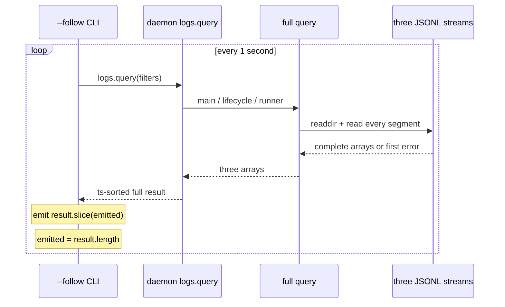

# RFC #544 R7 / I08 — events 跨 segment 顺序与 cursor/reconnect

> 基线 `main@699842eba2eefc242d19f8fa9232bc1d9d5c3bdd`（Bun 1.3.14 / macOS arm64）。锚点仅 AGG §4.3/D6、R5 L14/L15/L16/L19、R6 I08，并复用 I06/I07 已证事实。本文只调查现存 reader/consumer 与可达磁盘状态；不设计 reader、SSE 或实现选项。实验只使用 `/tmp/coder-loop-544-I08-*`。

## A. 主 agent 摘要（≤一页）

1. **当前没有 D6 所需的 cursor/tail/watch reader。** 导出消费面只有“每次重新发现全部 segment、逐文件全读、逐行 parse”的 `queryObservabilityEvents`。产品唯一近实时消费者 `coder-loop logs --follow` 每秒调用 daemon `logs.query`，用进程内数组长度 `emitted` 对新一次全量结果做 `slice(emitted)`；没有 segment identity、byte offset、line identity、last-event-id、watch recovery 或持久 reconnect token。仓内 `fs.watch` 为零；脚本中的同名 `watch` 是状态轮询，不消费 events。
2. **文件全序不是事件时间全序。** discovery 固定为“所有 legacy（started/ended/name 字典序）→所有 sequence history（sequence 数字序）→active”；文件内保留行序。实验在五个事件 timestamp 完全相同的情况下得到 legacy `[1,2]`、history `[3,4]`、active `[5]`。legacy 永远整体先于 new，即使其 timestamp 更晚；new history 的 sequence 只排 segment，不给行或跨流事件全局 identity。
3. **串行正常日界/阈值 rotate 的一次 full query 集合与次序闭合。** 真实 writer 实验分别得到 history+active 与 `[10,11]`、`[20,21]`，与既有单元夹具一致。但这只证明 I07 可达状态中的“单 writer、完整合法行、无并发冲突”子集；不能外推断连重连。
4. **现存 `--follow` 已有确定的丢重反例。** 初次全量为 `[1,2,3,4,5]`、`emitted=5`；随后一个合法 legacy segment 被发现，下一全量为 `[9,1,2,3,4,5]`，产品算法输出 `slice(5)=[5]`：新事件 9 丢失、旧事件 5 重复。进程断开后重新启动则 `emitted=0`，必然重放匹配查询的全部历史。即使没有 late legacy，过滤条件/文件修复导致结果前缀变化时，计数也不是身份 cursor。
5. **I06/I07 的坏状态没有恢复层。** partial/bad line均使整次 query throw；duplicate sequence在 discovery阶段 throw；I07 的 discover→rename 竞态可 `ENOENT`，rename-before-append crash只留下history且新事件从未提交。`--follow` 遇任一 RPC/query error直接退出，没有 retry/rebuild；未提交事件也不可能由 reader恢复。
6. **三流合并只有 timestamp sort。** daemon依次全读主流、lifecycle failure、runner failure，再对 `ts` 做稳定排序；same-ts实验为固定来源拼接序 `[main,lifecycle,runner]`，不是因果序或全局 sequence。任一流坏行使整个 `logs.query` 在合并前失败。三流是否都属于目标可见集合仍留给 I09；I08只钉现状。
7. **watch通知不能充当事件账本。** 虽产品未使用 `fs.watch`，受控目录 watcher在100次append加一次真实rotate（101次写变化）中只收到一次 `rename:events.jsonl`；通知发生了合并/遗漏。文档中的手工 `tail -F` 是 active basename 的原始行观察：在线rename实验读到 A/B，断开并再次rotate后重启只读到active C，未回放history B。两者都没有 reconnect identity。
8. **结论：当前不能声称 cursor/reconnect 无丢无重。** §4.3 的“串行完整段跨翻段读取”资产仍成立于其夹具范围；D6 的“增量、稳态成本与历史无关、翻段无丢不重”尚无现存供给，且 `--follow` 的计数伪cursor有运行反例。只增加 watcher、只容忍partial、只修 segment sort、或只重试 query，均会残留事件身份、断连重放、三流same-ts、坏历史和 I07 未提交/重复sequence等同根问题。

## B. 完整调查

### B1. consumer 穷尽与实际调用链

| 消费面 | 实际行为 | cursor/reconnect 事实 |
|---|---|---|
| `queryObservabilityEvents` | 每次 `readdir → parse/order names → readFile每段 → split每行 → 当前boundary → filter` | 返回 `{path,events}`；无 offset、segment token、event id、limit/page |
| daemon `logs.query` | 顺序全读主流、lifecycle failure、runner failure；拼接后按 `ts.localeCompare` 排序 | 任一流先失败则无响应集合；无 continuation |
| CLI `logs` | 单次RPC返回全量 | 无 cursor |
| CLI `logs --follow` | 每秒重复RPC；`events.slice(emitted)`；随后 `emitted=events.length` | 仅当前进程的结果长度；RPC失败退出；重启归零 |
| status recent events | 只全读主流并按 run过滤，再取尾20 | 错误折为status中的字符串；不是 tail |
| daemon启动 failure-tail | 两个failure文件各全读后 `.at(-1)` | 启动时一次性恢复诊断；不是实时consumer |
| 运维文档 `tail -F` | 直接跟 active basename 的原始文本 | 无历史段发现、schema parse或断连cursor |
| tests/scripts | 测试断言调用 full query；`engine-integration.ts`/`real-e2e.ts` 的 `watch` 轮询status/GitHub | 不存在产品 events watcher |

证据：`src/observability.ts:953-965,1308-1358`；`src/daemon.ts:1310-1340,2679-2727`；`src/loop.ts:2138-2163,3592-3615`；`docs/operations.md:153,234`、`docs/operator-quickstart.md:167`。对 `src/ scripts/ tests/ docs/` 穷尽搜索 `queryObservabilityEvents|logs.query|--follow|tail -F|fs.watch|watch(`：没有 events `fs.watch`、tail parser或cursor实现。

### B2. segment、行与三流的顺序矩阵

| 层 | 排序键 | tie/异常 | 能证明什么 |
|---|---|---|---|
| legacy history | `startedAt/endedAt/name` 字符串 | UUID/name最终破tie | 同一目录snapshot内确定文件序 |
| sequence history | `sequence` 数字 | 重复sequence直接throw | 唯一sequence时确定文件序 |
| active | 固定最后，最多一个basename | parser只会生成一个精确active path | 当前snapshot内在history之后 |
| 三类segment混合 | 全部legacy先于全部history，再active | 不比较事件timestamp | 确定分层序，不是时间序 |
| segment内部 | 文件物理行序 | same-ts无额外键 | 保留writer写入顺序（仅已落盘行） |
| daemon三流 | main→lifecycle→runner拼接，再stable `ts` sort | same-ts保留拼接序 | timestamp可比较时排序；无因果/global identity |

实验：四个history加active的五事件均为 `2026-06-12T00:00:00.000Z`，query为 `[1,2,3,4,5]`；三流same-ts合并为 `[30,31,32]`（main、lifecycle、runner）。把legacy事件timestamp改得比history晚，文件类别规则仍把它放在history前；`since`只在parse后比较timestamp，且是包含式过滤，不提供same-ts唯一续点。

### B3. 断连/重连与通知对账

| 场景 | 权威集合/顺序 | 现存consumer结果 | 丢/重判定 |
|---|---|---|---|
| 单writer跨日rotate | full query `[10,11]` | 单次query相同 | 此次无丢重 |
| 单writer跨32MiB阈值 | full query `[20,21]` | 单次query相同 | 此次无丢重 |
| follow后late legacy出现 | poll1 `[1,2,3,4,5]`; poll2 `[9,1,2,3,4,5]` | poll2 `slice(5)=[5]` | 9丢、5重 |
| follow进程断开/重启 | full query仍含全部历史 | 新进程从0输出全部 | 对已收历史全部重放 |
| duplicate sequence | discovery无合法全序 | `logs.query` throw/CLI退出 | 无增量恢复 |
| partial/bad line | 完整行前缀存在，但I06 parser首错throw | 整次失败/CLI退出 | 前缀也不交付 |
| I07 discover→rename | 某瞬间read旧active path得`ENOENT` | 整次失败/CLI退出 | 无retry/rebuild |
| rename-before-append crash | history保存旧事件；新事件未落盘 | full query只见旧事件 | reader无法恢复未提交事件 |
| `fs.watch` burst+rotate | 101次文件变化 | 本机仅1个rename通知 | 通知不是逐事件账本 |
| 手工 `tail -F` 在线rotate | 原始行A后basename重建B | 输出A、B | 仅此在线实验连续 |
| 手工tail断开后再rotate | histories含A/B，active为C | 重启只输出C | B不回放 |

late-legacy不是声称产品writer会在正常串行路径“新造legacy”；它是 parser明确接受的合法目录状态，也可来自历史文件恢复/复制。该反例证明长度无法作为**所有契约接受状态**上的事件身份。I07 的并发重复sequence和reader/rename竞态则是当前writer本身已运行可达的失败状态。

### B4. I06/I07 接缝：合法集合与可达状态

| 输入事实 | I08消费结论 |
|---|---|
| I06：三代filename可发现；每行一律走当前schema | 排序可跨三代，但旧payload/坏行无恢复分支 |
| I06：partial、bad、unknown/old payload整次throw | filter、follow与watch均不能绕开坏历史 |
| I06：52 type / 53 payload variants，无schema version | cursor即使存在也不能凭文件名推断line版本 |
| I07：正常串行day/size rotate可完整 | B3两条正常路径复现实验闭合 |
| I07：并发rotate可重复sequence，query必败 | reader没有可继续的segment全序 |
| I07：discover/read与rename竞态可`ENOENT` | 现有follow不重试，full query snapshot也不原子 |
| I07：rename后append前crash，新事件未提交 | “reader无丢”不能覆盖writer未提交事件 |
| I07：无fsync/commit marker | 本调查不把普通readback提升为断电持久保证 |

### B5. 八层因果链

1. **观察：** full query在正常串行完整段上有确定结果；`--follow`在late-prefix与重启时分别丢重/全重放；坏行、重复sequence、rename竞态使其退出。
2. **机制：** segment顺序来自文件类别/sequence，不是事件identity；follow只保存结果长度；三流只按timestamp合并；query是每轮全量、首错失败。
3. **直接来源：** 导出契约只含 discovery/order/full query；CLI `emitted` 是局部number；schema无event id/version；仓内没有events watcher/cursor。
4. **触发条件：** rotation/历史段集合改变、进程重启、same-ts、多流、合法legacy恢复、I06坏内容、I07并发/rename/crash状态。
5. **放大路径：** daemon把三流先全读后合并，单流错误放大为整RPC失败；follow每秒重扫让成本随历史增长，并把任何前缀变化解释成“尾部新增”。
6. **用户影响：** D6要求的稳态增量成本、断连续读、翻段无丢重和实时推送供给均未被现存路径证明；CLI follow本身可漏新事件并重复旧事件。
7. **多因根因：** 缺少跨segment/跨流事件identity与continuation语义；读取不是一致snapshot；写侧存在不可提交/重复sequence状态；schema/坏尾无恢复语义；通知非可靠账本。
8. **只修症状的残留：** 只监听active仍漏history/reconnect；只保留byte offset跨rename失去文件身份；只用timestamp在same-ts重/漏；只重试仍卡永久坏行/duplicate sequence；只容忍partial仍不处理旧schema/三流/断连；只调整排序仍没有持久cursor，且不能恢复I07未提交事件。

### B6. 测试资产、盲区与未知

**可保留资产：**

- 当前event ADT/parser与segment filename boundary（I06限定范围）。
- legacy稳定tie、sequence history顺序、active-last规则。
- 单writer完整合法行的日界/size rotate夹具及本轮运行复现。
- query filters与daemon三流入口；它们是未来消费可复用的事实面，不等于continuity。

**现有测试盲区：**

- 无 `logs --follow` 的两轮结果前缀改变、进程重启、RPC失败恢复测试。
- 无 event identity/cursor/offset/tail/watch实现，自然也无其契约测试。
- 无 same-ts跨segment/三流的“因果顺序”断言；现有legacy tie只断言文件名序。
- 无 partial/bad/旧schema、duplicate sequence、discover→rename、通知合并的consumer恢复测试。
- rotation单测由同一 discovery/order helper写后再读，证明内部自洽，不证明外部reader续点。

**仍未知且不得升级为保证：**

- 生产root是否实际含late legacy、坏尾、重复sequence，以及出现频率（本轮未读生产root）。
- macOS/Bun `fs.watch` 在所有负载下的精确合并规则；本轮只证明一次受控运行不是一写一通知。
- GNU/BSD `tail -F` 在所有rename时序、长断连和文件系统上的行为；它也不是typed产品consumer。
- I07已限定的断电durability、生产并发频率仍未知。
- 三个流在D6目标中应包含哪些由I09裁定，本报告不从代码现状倒推需求。

### B7. 实验、证据与清理

受控脚本 `bun /tmp/coder-loop-544-I08-experiment.ts` 覆盖 mixed legacy/new、same-ts、late-prefix follow模拟、真实day/size rotate、duplicate sequence、partial/bad line、三流same-ts与目录watch burst。另用BSD `tail -F`做active rename与断连实验。产品follow模拟严格复制 `src/loop.ts:2154-2162` 的两变量算法，但明确不是新reader实现。

关键输出：

- `mixed [1,2,3,4,5]`
- `lateLegacy after [9,1,2,3,4,5], productSlice [5]`
- `day/size segments [history,active], events [10,11]/[20,21]`
- duplicate/partial/bad均throw
- `threeTie [30,31,32]`
- `watch writes=101, signalCount=1, rename:events.jsonl`
- `tail -F live=A,B; restart=C`

证据索引：AGG `:153-161,288-315`；R5 ledger `:57-65`；R6 `detail-investigation-index-544.md:61-95`；I06 `detail-I06-544.md`；I07 `detail-I07-544.md`；源码锚点见B1/B2。实验临时文件在报告完成后全部清理；未访问或修改生产loop-data、产品源码、测试或配置。
