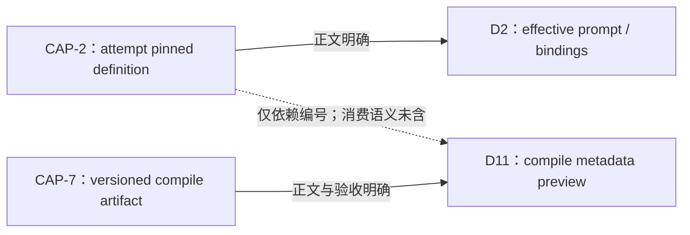

# I11 — D11 对 pinned definition 的消费语义

调查基线：`main@699842eba2eefc242d19f8fa9232bc1d9d5c3bdd`。本报告是纯契约调查；事实源仅为 `AGG-544-gui-observability-gateway.md` 全文、其明确指向的 SYNTH 相关段、I10 实现摘要、R5 L21/L24/L25 与 R6 I11。旧 issue、测试和当前代码均不作为需求来源。本报告不提出候选方案、推荐、shape 或 issue 拆分。

## A. 主 agent 摘要（≤一页）

**可证伪问题的结论：权威文本明确要求 D11 展示“所选 preset 的定义态 compile 产物”，并与同名 CLI compile 的输出保持同计算路径、同 schemaVersion；权威文本没有定义 D11 如何消费 attempt pinned definition，也没有要求 D11 同时提供当前定义与历史 attempt 定义两种视图。**

三类对象的文本边界如下：

1. **preset 选择预览：有正面定义。** 关闭验证要求“在 GUI 选任一 preset”，并与 `coder-loop preset compile <name> --json` 对照；D11 又把对象称为“装载期已可计算的元信息”和“定义态展示面”。三视图来自同一份 compile 产物，GUI 不触 `preset.toml`、不另建解析器。这个表述支持一个以 preset 选择/名称为入口的定义态预览。
2. **attempt 历史展示：在别处有定义，但不在 D11。** D2/CAP-2 把 effective prompt 与 bindings 绑定到“该 attempt 所属实例”的 pinned definition；D10 展示每个 attempt 的落盘 prompt/bindings。D11 没有 run、attempt、definition identity、历史时间点或从 attempt 跳转 compile metadata 的正文/验收语句。
3. **compile CLI 当前态：文本呈现为 name-based on-demand 对照，但时间语义没有被显式命名。** `compile <name>`、“选任一 preset”、“装载期元信息”共同把 D11 主路径描述成当前可选择并编译的定义面；然而权威文本从未写出“current/latest/on-disk current”，也未说明名称解析与可变路径、pinned identity 或 repository resolver 的关系。因此可以排除“文本已经规定 attempt 历史 compile”的主张，却不能把“当前”的精确身份/时点规则补成已裁决契约。

**CAP-2 引用链是悬空依赖，而不是消费语义。** CAP-2 的能力定义只承诺 attempt 级 pinned preset definition 解引用，并明确服务 D2；D11 只在旧依赖行出现 `#743`。AGG 已主动标注“消费语义本文件未含”，R5 L24 与 R6 I11也保持同一未知。SYNTH 的 D11 目标、性质、验收、架构切片均未使用 CAP-2；唯一命中是依赖编号。不能从编号推导 D11 应编译 pinned definition。

**CAP-7 的主张强度明确。** D11 硬依赖 CAP-7 的 versioned compile artifact，消费六块中的 stateGraph、phases/任务树、variables，并展示 findings；GUI 与 CLI 必须共享计算路径和 schemaVersion，unsupported version 必须显错。CAP-7 是“定义态产物契约”，不是历史 repository。I10/R5 已确认现状 compile projection 只表达当前定义态，且不能替代 CAP-2；这项现状事实与文本边界一致，但不能反向裁决 D11 的悬空 CAP-2 依赖。

**因果与消费者影响：** D11 的正文链条足以约束三视图的来源一致性、版本处理和 findings，却缺少“预览对象由什么 definition identity 定位”的一环。于是 GUI 消费者可以被验收为与同次 CLI 输出一致，但文本不能证明该输出对应某 historical attempt；若 preset 同路径发生变化，D11 应显示变化前、变化后还是两者，权威文本均没有答案。I10 证明 hash 虽持久但旧 definition 不可解引用，正好使这个文本缺口成为可观测问题；它不构成需求裁决。

**仍需操作员裁决的最小问题：** D11 的元信息预览是否只针对 GUI 当下选择并由 `preset compile <name>` 解析出的定义，还是还必须能从 historical attempt 的 pinned definition identity 打开同样三视图？权威文本没有规定；在此之前，不得声称 D11 要求 pinned、current 的精确时点语义，或两者并存。

## B. 逐句映射、来源索引与未知

### B1. 来源层级与使用边界

| 层级 | 本报告中的用途 | 能产生的主张 | 不能产生的主张 |
|---|---|---|---|
| 操作员目标/裁决、RFC 稳定关闭验证 | 最高强度目标与终态 | GUI 要有可计算元信息预览；状态机/phase 任务树/变量类型流来自 compile 产物并与 CLI 一致 | 未写出的历史 identity/retention/resolver |
| AGG 的 D11、CAP-2、CAP-7 聚合定义 | 当前稳定能力语义及显式缺口 | D11 的三视图、schemaVersion、findings、类型单源；CAP-2 attempt pin；CAP-7 compile boundary | 用裸依赖编号补造消费方式 |
| SYNTH 中 D11 当前 child 文本 | 解释 AGG 标注的逐句来源 | name-based 选择、CLI 对照、定义态/运行态分面、依赖行原貌 | 旧 issue 编号本身升级为新需求 |
| R5/R6 | 已核算未知与调查问题 | L21/L24/L25 的事实边界；I11 必须保持未知 | 对未知作裁决 |
| I10 | 当前实现事实 | hash/materialization/argv/prune 的现状，及 compile 非 historical repository | 从实现倒推 D11 应有语义 |

### B2. D11 逐句映射

| 文本主张 | 来源 | 直接语义 | 关于 definition 时点能推出什么 |
|---|---|---|---|
| GUI 元信息预览消费编译产物，显示状态机图/phase 结构/变量流 | AGG 3.2 第 112 行；SYNTH:87 | D11 是 compile artifact 消费者 | 只确定“定义态”，未给 historical identity |
| “在 GUI 选任一 preset”，并与 `preset compile <name> --json` 一致 | AGG 2.2 第 62 行；SYNTH:132 | 入口是 preset 选择/name-based CLI 对照 | 支持当下选择预览；未明文定义 current/latest 或 path 解析时点 |
| “定义态展示面”，与运行态快照分面 | AGG D11 第 405–410 行；SYNTH:706 | D11 不把 runtime snapshot 当 compile artifact | “定义态”不等于“historical pinned definition” |
| 三视图来自“同一份编译产物” | AGG D11 第 407–409 行；SYNTH:689 | 三个投影共享一个 artifact | “同一份”约束视图间一致性，不说明跨 attempt/跨时间身份 |
| GUI 与 CLI 来自同一计算路径、同一 schemaVersion | AGG D11 第 409 行；SYNTH:690 | 禁止 GUI 第二编译器/第二 parser | 证明同次/同输入路径一致，不证明历史 attempt 一致 |
| unsupported schemaVersion 显式报错；warn findings 可见 | AGG D11 第 410–411 行；SYNTH:691–692 | 消费者的版本与诊断行为 | 与 pinned/current 选择无关 |
| GUI 不触 `preset.toml` 源域 | SYNTH:706–708 | GUI 只接收 compile contract，不自行读源 | 没说明 compile producer 从 current path 还是 pinned repository 取输入 |
| “GUI 预览与实际装载语义不一致不可表达” | SYNTH:708–709 | 同一计算路径消除 GUI/CLI 平行解析的漂移 | “实际装载”没有绑定到某 attempt；不能扩写为 historical argv/definition 同一性 |
| Depends on `#743` | AGG D11 第 424 行；SYNTH:717 | 仅存在依赖编号 | 无消费方式；AGG 明示为悬空语义 |

### B3. CAP-2 逐句映射

| 文本主张 | 来源 | 主张强度 | 对 D11 的效力 |
|---|---|---|---|
| effective prompt 与 bindings 从“该 attempt 所属实例”的 pinned definition 取得；spawn/retry/restart 不重读同路径当前 preset | AGG CAP-2 第 497 行；AGG D2 第 197、210 行；SYNTH:222 | 强、对象与禁止行为均明确 | 对 D2 是硬前提；对象是 attempt 输入 |
| CAP-2 是 attempt 级 pinned preset definition 解引用 | AGG 6.1 第 497 行 | 强 | 没有 compile artifact、三视图或 GUI metadata 的字段/operation 描述 |
| D11 有 CAP-2 依赖声明，但消费语义“本文件未含” | AGG D11 第 424 行、CAP-2 第 497 行 | 强，明确宣告缺口 | 禁止把依赖编号解释为 pinned compile 要求 |
| CAP-2 retention/GC、D11 对 CAP-2 的消费语义未决 | R5 L24；R6 I11 | 强，核算后的未知 | 只能保持未知 |

CAP-2 与 D11 的唯一可证引用链为：

这条链不能被改写为 `CAP-2 → pinned compile artifact → D11`，因为中间产物和 operation 在权威文本中不存在。

### B4. CAP-7 逐句映射

| 文本主张 | 来源 | 主张强度 | 身份/时间边界 |
|---|---|---|---|
| `coder-loop preset compile --json`，稳定 schemaVersion，六块产物 | AGG CAP-7 第 502 行；SYNTH:96 | 强，外部能力定义 | 未规定 historical repository 或 identity lookup |
| D11 是 CAP-7 的硬消费者，本 RFC 不定义 shape | AGG 第 502 行；SYNTH:96,132,152 | 强 | consumer 不能自行补 pinned shape |
| 三视图与 CLI 输出逐块一致 | AGG D11 第 418 行；SYNTH:698 | 强，可验收 | 对照对象是 `compile <name>` 输出，没有 attempt 参数 |
| 类型从 compile boundary 派生，无平行 shape | AGG D11 第 421 行；SYNTH:701 | 强 | 约束类型所有权，不约束 definition retention |
| typed bindings 后产物携带类型化值 | AGG CAP-7 第 502 行 | additive 能力陈述 | 仍未把值绑定到 historical attempt |

### B5. 三类展示对象的契约判定

| 展示对象 | 判定 | 依据 | 置信边界 |
|---|---|---|---|
| preset 选择预览 | **明确要求** | “选任一 preset”、`compile <name>`、定义态展示、三视图 | preset 的精确 name/path/identity 解析语义未定义 |
| historical attempt 的 compile metadata | **未要求，也未排除** | D11 正文/验收没有 attempt/run/identity；仅有 CAP-2 裸依赖 | 不能把沉默解释成“不允许”；只能说未裁决 |
| compile CLI 的当前定义态 | **文本强烈指向，但精确时点未定义** | name-based 当下调用、装载期元信息、当前 compile projection | 没有“current/latest”原文，也没有 source mutation 时点规则 |
| current 与 pinned 两者同时展示 | **无文本依据** | 无双视图、切换、关联或一致性规则 | 依赖行不足以产生双视图要求 |

### B6. I10/L21/L24/L25 与契约的交界

- **I10 / L21：** 当前 run 持有精确 hash，但 definition 内容不可按 hash 解引用；restart 会从同路径当前内容重新 load，旧 materialization 会被 prune。这证明“若 D11 要 historical pinned preview，现状没有相应 repository/resolver”，但不证明 RFC 要求它。
- **L25：** compile projection 具有共享计算路径、精确 versioned boundary、findings 与六块投影，是 D11/CAP-7 可保留资产；它只表达当前定义态，不是 historical/pinned。此事实支持 CAP-7 与 CAP-2 不可互相替代。
- **L24：** D11 如何消费 CAP-2 被明确列为未决。I10 的缺失不能把未决自动升级为偏离，因为需求锚点尚未给出该保证。
- **消费者影响：** 在现契约强度下，GUI 能证明三视图与某次 `compile <name>` 输出一致；不能向用户声称“这是该 attempt 当时运行的定义”。如果 UI 将 preview 与 historical attempt 相邻展示而不标 identity，文本也没有足够规则判断其真伪。

### B7. 文本沉默、冲突与悬空引用

1. **沉默：** 没有从 attempt/run 页面打开 compile preview 的导航语义；没有 compile command 接受 definition identity 的语义；没有 pinned artifact 的 schema、resolver、retention 或错误分类。
2. **表面张力但非可裁冲突：** D11 主体文字是 name-based 定义态 preview，依赖行又列 CAP-2。两者可同时成立于多种未定义关系，因此不能判为逻辑矛盾；它们之间缺的是连接语句。
3. **悬空引用：** D11 的 `#743`（CAP-2）只有依赖行；`#739` 在 AGG GAP-739 中也被明确记为无任何说明（AGG 第 504–514 行）。二者都不能补充 D11 语义。
4. **无权用旧 issue补洞：** SYNTH 保存了旧/新 child 文本和编号沿革；按本调查边界，它们只能解释 AGG 的来源，不能越过 AGG 已声明的“本文件未含”生成新要求。

### B8. 最小待裁决问题与证据索引

**唯一最小待裁决问题：** D11 的 preview identity 是仅由 GUI 当下所选 preset/name 解析，还是还需要接受 historical attempt 的 pinned definition identity？若后者成立，二者是否属于同一 D11 消费面仍需另有明确文本；本报告不预设答案。

| 结论 | 权威位置 |
|---|---|
| 关闭验证是“选任一 preset”并与 CLI compile 一致 | `AGG-544-gui-observability-gateway.md:50-63`; `SYNTH:122-133` |
| D11 三视图、同计算路径/schemaVersion、findings | `AGG-544-gui-observability-gateway.md:405-422`; `SYNTH:675-713` |
| D11 的 CAP-2 消费语义明确缺失 | `AGG-544-gui-observability-gateway.md:424`; `supply-ledger-544.md:L24`; `detail-investigation-index-544.md:I11` |
| CAP-2 只明确 attempt prompt/bindings pin | `AGG-544-gui-observability-gateway.md:190-210,497`; `SYNTH:214-223` |
| CAP-7 是 versioned compile artifact 且 D11 硬依赖 | `AGG-544-gui-observability-gateway.md:494-503`; `SYNTH:94-96,132,152` |
| current compile 不是 historical/pinned repository | `supply-ledger-544.md:L21,L25`; `detail-I10-544.md:A,B6-B7` |
| #739 无能力定义 | `AGG-544-gui-observability-gateway.md:504-514` |
