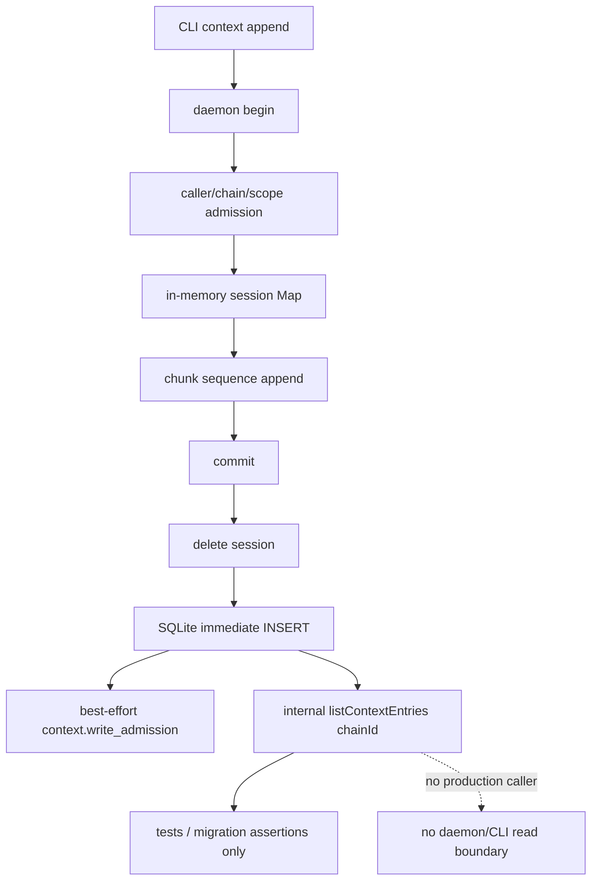

# RFC 544 · R7 I12 — context read boundary 与写入一致性

调查基线：`main@699842eba2eefc242d19f8fa9232bc1d9d5c3bdd`。唯一设计锚点为 AGG CAP-6 / D12、R5 L23/L24/L26/L27、R6 I12。本报告只给出现状事实、因果和未决边界；不裁决未来 shape、实现机制或成本。

## A. 主 agent 摘要（≤一页）

### 问题与结论

问题：当前 context schema/store/list/append session/event 是否形成 CAP-6 可供外部消费者使用的完整持久数据流；scope/author、写后可见性及失败重试后的 DB/event/session 是否一致？

**结论（高置信）：当前供给是“严格类型的内部持久表 + daemon 三段写协议 + 非抛错的写准入审计”，不是 CAP-6 外部 read boundary。**

1. 存储 envelope 已有 `id/chainId/createdAt/scope/author/body`，scope 是 `chain | item | group`，author 是 `operator | agent(chainId,itemId,runId,phase)`；单次 INSERT 在 SQLite immediate transaction 中，成功返回后同进程新开 store 可见。
2. 唯一读取是内部 `listContextEntries(chainId)`：全 chain、无分页/limit/cursor/filter/auth/audit，按 `(created_at,id)` 升序，一次读取并严格解析所有行；任一坏 scope/author 行使整次读取失败。生产 `src` 没有调用者；daemon/CLI 没有 read/list command 或 response schema，故 D12 当前没有可消费协议。
3. daemon 写面只允许 operator 或有效 active-run credential；author 由 daemon 推导，不能由请求伪造。item scope 在 begin 时验证 item 存在；group 即使 ADT/table/store 能保存，也被 daemon 无条件拒绝 `group-unavailable-v2`。因此“三 scope 外部写→读”当前不成立。
4. session 仅在 daemon 内存 Map。restart 后 partial session 消失；旧 session commit 返回 `unknown-session`。commit 在 DB INSERT **之前删除 session**：DB 写失败后 body/session 丢失，重试同 session 只得到 `unknown-session`，且事件流会呈现 begin/chunk allow、随后 retry commit deny，却没有能表示首次 commit 持久化失败的 context event。
5. commit 成功后再发 `context.write_admission allow`。该事件写使用吞错路径：事件文件失败时 RPC 仍成功且 DB entry 可见，但持久事件缺 commit allow；stderr 有诊断但无可查询 durable reconciliation marker。重复 commit 不重复写 entry，而返回 unknown-session。不存在 idempotency key 或按 session/entry 对账关系。

### 八层因果摘要

- **观察事实**：写存储可用，外部读为零；失败后 DB/event/session 可分裂。
- **直接机制**：内部 list 未进入 daemon command union；session 是 Map；commit 顺序为 `session.delete → DB INSERT → best-effort event`。
- **上游来源**：表/ADT允许三 scope，但 daemon v2 admission 缺 addressable group；author依赖 caller credential registry。
- **历史/迁移**：schema 初始化/迁移只保证表存在及旧行保留，不扫描规范化 author；严格解析发生在读时。
- **放大条件**：daemon restart、DB INSERT 失败、event sink 失败、坏历史行、chain 大量 entries。
- **消费者影响**：GUI 无协议可调用；内部全量读被一坏行整体阻断；审计流不能证明 DB commit 的完整集合。
- **根因集合**：公开 read contract 缺失；写 session/DB/event 分属三种持久性边界且无共同 identity/idempotency/reconciliation；group admission 与存储能力错层。
- **只修症状的残留**：仅包装 `listContextEntries` 仍无已裁决分页/filter/auth；仅重试 event 不恢复丢失事件；仅持久 session 不解决 DB/event 原子性；仅开放 group 不建立 read boundary。

### 当前/未来/证明缺口、资产与未知

- **当前影响**：外部消费者只能写不能读；D12 不可运行。写成功不等于审计成功，首次 DB 失败也没有专用 context failure event。
- **未来影响**：CAP-6 owner 必须提供类型化外部 read boundary 后 D12 才能派生 shape；本 RFC 不得从内部全量 list 猜分页/filter/auth。
- **纯证明缺口**：现有测试均用内部 store list 验证写结果，正好绕过缺失 read boundary；没有 restart partial-session、DB commit failure/retry、event sink failure 后三方对账的既有测试。
- **可保留资产**：closed scope/author ADT、typed persisted-row parser、FK/index、single-INSERT transaction、daemon-derived author、sequence gate、chain isolation、delete cleanup、已有 admission event type。
- **仍未知且归 CAP-6 owner**：分页/cursor/limit、scope/time/author filter、item“谱系”与 group 分支组的精确定义、operator/agent read 权限及 read audit、坏行/partial-result策略、snapshot consistency、retention/GC。AGG 仅说“分页/过滤随其实现落定”，现状不能裁决。
- **下一步**：无需再查“是否已有 read API”；事实已闭合。进入决策档案时只登记 CAP-6 owner 未决合同与写一致性事实，不生成选项、不估成本。

## B. 证据附录

### B1. 设计对照矩阵

| 稳定条款 | 当前可证事实 | 判断边界 |
|---|---|---|
| CAP-6 类型化读取边界 | 类型化 row/store 存在；无 daemon/CLI read command、request/response boundary | 外部 read **未实现**；内部 method 不是 contract |
| 按 scope 读取 | store 仅 `chain_id` filter；daemon group write 拒绝 | 三 scope 浏览链路不成立 |
| envelope + 不透明 body | store round-trip 精确 envelope；body 纯 string | 可保留存储资产，不证明外部 shape |
| 分页/过滤随 owner 落定 | 当前无 cursor/limit/filter | 保持未决，不反推目标 |
| D12 纯消费外部 boundary | 无可消费 socket read command | D12 当前被 CAP-6 阻塞 |
| D12 operator socket read | command union/spec 只有 append begin/chunk/commit | 权限/read audit 尚无对象 |

### B2. 完整数据流与全部入口/消费者



**声明与存储**

- `src/context-entry.ts:4-15`：closed scope/author ADT。
- `src/context-entry.ts:17-58,62-85`：begin/session/chunk/result/admission/session/envelope types。body仅为 string。
- `src/context-entry.ts:87-117,121-145`：persisted row union、边界解析和 scope 转换。
- `src/sqlite-state.ts:775-784`：表、chain FK cascade、`(chain_id,created_at,id)` index。表 CHECK 只限制 scope_kind；scope_key 配对由读边界执法。
- `src/sqlite-state.ts:948-1005`：迁移在单 transaction 中确保 current schema/table；fast-path 显式检查 context table存在。没有逐行 author/scope 规范化。

**写入口（穷尽）**

1. store `appendContextEntry`：`src/sqlite-state.ts:354-356,1605-1619,2045-2054`；UUID、秒级 timestamp、immediate transaction 单 INSERT。
2. daemon commands/spec：`src/daemon.ts:203-205,1732-1766`；只有 begin/chunk/commit。
3. CLI：`src/loop.ts:1943-1986`；body/body-file，256 KiB 字符 chunk，顺序发送后 commit。
4. 测试/fixture 的直接 store append 不是 operator协议入口：unit、scheduler integration、daemon residue test。

**读取入口与消费者（穷尽）**

- 唯一原语 `src/sqlite-state.ts:2056-2061`。全 repo 产品 `src` 无调用者。
- 调用者仅：`tests/unit/runtime/context-entry.test.ts`、`tests/unit/sqlite-state/migrations.test.ts`、`tests/integration/{daemon,cli,scheduler}`、`scripts/issue-558-integration.ts`；都是断言/迁移验证，不向外暴露。
- daemon command union/spec、CLI subcommands、context boundary 文件都没有 read/list 请求与响应类型。

**删除入口**

- store 显式 chain delete：`src/sqlite-state.ts:2063`。
- daemon soft-delete/retry 两支均 invalidates sessions 后删 entries：`src/daemon.ts:2505-2538`；状态更新、runtime cleanup、session invalidation、entry delete并非一个 SQLite transaction。
- 物理 chain delete另受 FK `ON DELETE CASCADE` 保护。

### B3. scope / author / 排序 / visibility 实然矩阵

| 维度 | store | daemon write | 外部 read |
|---|---|---|---|
| chain scope | 可写可列 | operator/active agent可 begin | 无 |
| item scope | 可写可列；store不验证 item归属/存在 | begin验证目标 item 在 chain 存在 | 无；无“谱系”语义 |
| group scope | 可写可列 | 一律 `group-unavailable-v2` | 无；无分支组语义 |
| operator author | typed round-trip | 无 credential 请求即 operator；author daemon-derived | 无权限定义 |
| agent author | typed round-trip | active credential推导 chain/item/run/phase，cross-chain/expired拒绝 | 无权限定义 |
| 排序 | `created_at ASC, id ASC` | createdAt由store当前秒生成 | 无公开 cursor/order contract |
| 写后可见 | INSERT return后新 store list可见 | commit成功返回后可见 | 无协议观察点 |
| body | opaque string | chunk join，无解释 | 无展示面 |

代表性实验同时写入 chain/operator（daemon）、item/operator（store）、group/agent（store）。内部 list 返回三条并严格保留 scope/author/body；两个相同 `createdAt=100` 的 entry 以随机 UUID 字典序作 tie-break，随后是较新 chain entry。daemon group begin 明确失败。该实验只证明当前内部形状与排序，绝不把随机 UUID cursor或store直写认定为 CAP-6 shape。

### B4. session、DB、event 事务与失败对账

#### 正常顺序

- begin：完成 caller/chain/scope/author validation，先把 session 放入 Map，再 best-effort 发 allow event，最后响应（`src/daemon.ts:1830-1883`）。事件失败仍响应成功。
- chunk：先把 chunk push 并递增 sequence，再 best-effort 发 allow event，再响应（`:1886-1906`）。
- commit：先从 Map 删除 session，再 immediate DB INSERT，再 best-effort 发 allow event，再响应（`:1909-1917`）。DB transaction不包含 session/event；event文件也无 DB relation。
- event writer：`src/daemon.ts:1777-1785,2285-2289` 调非抛错 `appendObservabilityEvent`；`src/observability.ts:923-935` 捕获写错仅写 stderr。

#### 失败/重试运行矩阵（隔离 fixture）

| 场景 | session | DB | durable context event | RPC / retry |
|---|---|---|---|---|
| daemon restart after begin+chunk | restart前1，后0 | 无 entry | begin/chunk allow保留；restart后commit deny unknown-session | old commit失败；body不可恢复 |
| 正常commit后重复commit | 首次删除 | 恰好1 entry | 首次commit allow；第二次commit deny | 第二次 unknown-session，非idempotent success |
| DB table在commit前安全移除（故障注入） | commit先删除，失败后不存在 | INSERT失败，无 entry | begin/chunk allow；首次DB失败无context event；retry产生commit deny | 首次internal_error；retry unknown-session |
| event sink在commit前变为目录（故障注入） | 删除 | entry存在 | commit allow未持久；仅stderr | RPC仍ok；无durable对账marker |

重要纠正：R5 L23 的“DB/event 非原子重试窗口”成立，但更精确的现状不是“event失败使 RPC失败”。`context.write_admission` 使用吞错 writer，故 event失败时 RPC成功、DB成功、durable event缺失。

#### 并发/锁边界

- store每次 append/delete单独 `BEGIN IMMEDIATE`；并发 writer由SQLite串行，单 entry不产生半行。
- session Map由单 daemon JS event loop操作；chunk的 sequence check与push同步完成，但不同 socket请求可交错到各自 handler边界。
- list是单 SELECT，无显式 transaction；一次 `.all()`得到单 statement snapshot。当前无跨页语义，因为没有分页。
- createdAt为秒级；同秒顺序由随机 UUID决定，稳定可重复读取但不表达调用发生顺序。CAP-6是否承诺其他 order 未定义。

### B5. 权限与审计实际事实

- append commands标为 `mutation-credential-gated`，但实际走 context专用 caller/session gate；operator是请求无 credential 的路径，agent credential从CLI环境自动注入（`src/loop.ts:2507-2556`）。
- 请求若携 author 字段被拒，防止伪造（`src/daemon.ts:1848-1850`）。agent author绑定 active run credential、chain、item、runId、phase（`:1769-1775`）；session后续请求检查同 owner（`:1819-1825`）。
- `context.write_admission`只审计写 begin/chunk/commit allow/deny。没有 read command，所以没有 read auth class、read subject、read audit或“谁能看哪个scope”的当前事实。
- store method没有 caller概念；任何进程内调用者拿到store即可全 chain读取。这是内部层事实，不是外部授权策略。

### B6. 迁移、坏行与历史兼容

- current schema version 16；schema SQL以 `CREATE TABLE IF NOT EXISTS` 加表，迁移 transaction确保 context table存在。历史 fixture/迁移测试证明已存在context数据可保留。
- author为 JSON TEXT，表无 author CHECK；写 API把 typed input JSON stringify，但 TS runtime store input本身没有边界 parse。读时 `JSON.parse → parseContextAuthor`。
- scope_kind有枚举 CHECK，scope_key配对没有表级 CHECK；读时 persisted-row union拒绝 chain+key、item/group缺key。
- 因 list一次 map全量，任一 malformed/future variant行导致整个 chain list抛错，无 partial result/quarantine。未来外部 boundary如何处理是未决，不应从当前 throw推导。

### B7. 测试同错、盲区与可保留资产

**现有覆盖**

- `tests/unit/runtime/context-entry.test.ts:18-110`：ADT、CLI/persisted scope、chain isolation、delete、migration、malformed row。
- `tests/integration/daemon/context.integration.ts:1-177`：agent attribution与deny、session owner、chain deletion、write audit、scope admission。
- `tests/integration/cli/central-cli.integration.ts:1377-1406`：CLI append/agent author/delete。
- migration与issue-558 script覆盖旧盘保留。

**共同盲区/同错**

- 所有写结果都通过内部 `listContextEntries` 核对，完全绕过缺失的daemon read boundary；绿测不能证明CAP-6。
- 没有分页/filter/order contract/auth/read audit测试，因为产品面不存在。
- 没有 restart partial session、DB失败后retry三方对账、event sink失败后的durable audit缺口测试。
- tests对 group 的结论是daemon拒绝，与 store/ADT允许同时成立；不能据此证明三scope外部消费。

**资产**：B1/A所列 ADT、row parser、index/FK、single-insert transaction、daemon author derivation、sequence enforcement、chain delete cleanup、admission event schema均可独立保留；保留不等于 read contract 已有。

### B8. 未知、症状修补残留与证据索引

**必须保持未知（CAP-6 owner）**

1. 分页是 cursor/offset/其他、limit/default/max；排序是否仍为 `(createdAt,id)`。
2. scope filter请求形状；item“谱系”如何扩展，group与task tree identity如何绑定。
3. author/time/body等是否允许filter；坏行是全错、跳过、quarantine还是typed diagnostic。
4. operator/agent read权限矩阵、socket read是否审计、agent能否跨scope/chain。
5. 多页snapshot一致性、retention/GC、deleted chain可见性。

这些不能由表/index/内部方法反推；AGG已明确 shape随CAP-6实现落定。

**只修症状会留下什么**

- 给daemon加一个无参全量list：仍自造分页/filter/auth且可能OOM/坏行全阻断。
- 只把session持久化：仍缺commit idempotency、DB/event reconciliation。
- 只把event writer改成抛错：会制造“DB已成功但RPC失败”的重试歧义。
- 只给commit加retry：没有稳定 idempotency identity，客户端无法分辨首次commit是否已落DB。
- 只开放group：没有addressable group身份与read filter，不构成D12三scope链路。

**证据索引**

| ID | 证据 |
|---|---|
| E1 | `src/context-entry.ts:4-15,17-85,87-145` |
| E2 | `src/sqlite-state.ts:775-784,948-1005,1605-1619,2045-2063` |
| E3 | `src/daemon.ts:1732-1785,1789-1917,2505-2538` |
| E4 | `src/loop.ts:1943-1986,2507-2556` |
| E5 | `src/observability.ts:923-950` |
| E6 | 全树 `rg 'listContextEntries\('`：产品src零消费者；仅tests/scripts |
| E7 | 隔离 Bun 实验：4/4 pass；代表数据、restart、重复commit、DB failure、event failure；逐场景输出已归纳于 B3/B4，临时脚本、日志与 fixture 已清理 |
| E8 | `tests/unit/runtime/context-entry.test.ts:18-110`; `tests/integration/daemon/context.integration.ts:1-177` |

### B9. 实验环境与限制

实验在本地 checkout、隔离 loop-data fixture执行，不触生产 `~/.coder-loop`，不改产品/测试/config。故障注入只作用于各自隔离数据库/event path：一例删除隔离 fixture 的 context table，一例把隔离 event file替换为目录。测试收尾已清理全部 `/tmp/coder-loop-544-I12-*` 与四个隔离 fixture root。命令：

```bash
cd /Users/mouriya/Ext/code/coder-loop
bun test /tmp/coder-loop-544-I12-experiment.test.ts
```

结果：4 pass / 0 fail。限制：未模拟进程在每条机器指令间被 SIGKILL；但运行实验验证了由源码顺序预言的三个关键终态。未做负载规模测试，因为 CAP-6 未定义规模/分页目标，擅自建立阈值会生成需求。
