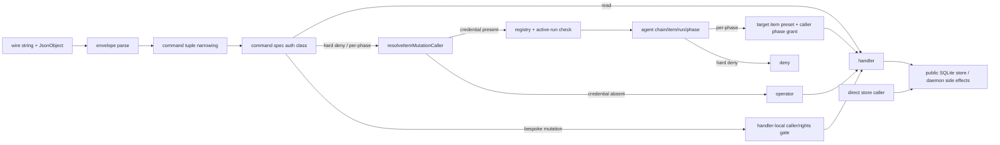

# RFC #544 R7 I13 — mutation 闭集、主体与准入绑定

> 基线：`main@699842eba2eefc242d19f8fa9232bc1d9d5c3bdd`。稳定锚点只取 AGG D5/D8/F 档；事实线索取 R5 L28/L29/L31/L33、R6 I13，transport 仅复用 I05。本文不调查 I14 的跨副作用提交/并发原子性，不推荐方案、不估成本、不拆 issue。

## A. 主 agent 摘要（≤一页）

**可证伪问题：** daemon 每个 command 从 wire parse → auth classification → credential resolution → handler → store 的真实可达路径是什么；operator/agent、同/跨 item/chain、直接 store 与 socket 旁路组合是否支持 D8/F 档的“daemon 唯一裁判、编译期闭集”？

**结论（高置信）：当前不能稳定陈述这两项性质。** 现有可稳定陈述的是：21 个 `DaemonCommandName` 由 tuple、`Record<DaemonCommandName, DaemonCommandSpec>` 和 dispatch narrowing 形成**daemon 大闭集**，每项都有四类 auth 之一；四个 F 档解卡 verb 均经 daemon handler，operator happy path可达。不能提升成 D8/F 闭集，因为 request/response仍是 `command:string + JsonObject`，exported client接受全部21命令；F 四 verb没有独立 typed subset/client，CLI又维护一份平行 `AGENT_ATTRIBUTED_COMMANDS`。该平行表已实测漂移：`chain.updateBindings`被分类为 hard-deny-for-agent，却不在自动注入表；带 `CODER_LOOP_RUN_CRED=not-minted` 的真实 `chain set-runner-model` CLI成功并被审计成operator，而同参数显式携 credential 的wire请求被拒绝。

主体也不是目标绑定的统一能力：credential解析精确绑定 active `(chainId,rowId,runId,phase)`；但 hard-deny仅区分“无字段operator/有credential agent”，read完全不解析，四个 bespoke mutation自行判断。`item.reorder` 的 per-phase gate用**目标 item 的 preset**检查 caller phase grant，却不比较caller的chain/item与目标：受控实验中review credential合法重排自身，也成功重排同链 sibling；跨链目标先获allow、完成 `reorderItem`，随后action audit组装因目标树中找不到caller run identity而返回`internal_error`，数据库位置已是目标值。错误/空/未知 credential则在handler前拒绝并留下deny audit。无credential的任意socket client都走operator，socket peer UID/PID/用户/capability未参与判定。

daemon更不是体系级唯一store裁判：`openSqliteStateStore`公开返回完整mutator；daemon与scheduler均直接调用，脚本/测试/任意同仓import也可调用。隔离实验在daemon运行中直接`store.updateItem`成功，未产生daemon admission/action audit。这里的scheduler直写是现有引擎正常内部写者，但足以反证“所有 mutation 经RPC/daemon准入”这一全局性质。

**因果链：** 历史命令面按功能逐项增长 → auth只在daemon dispatch收口、wire与CLI仍用宽 envelope/平行清单 → “operator”沿用 credential缺席这一消极分类，缺少连接身份 → per-phase授权只问目标preset是否给caller phase某verb，未消费credential自带target binding → store为daemon/scheduler/工具共享公开API。放大后表现为：新command可在daemon表中分类正确却漏掉CLI attribution；同phase跨目标权限扩张；跨链可“RPC报错但目标已改”；直接store完全绕过审计。只补 `item.reorder` 的同item比较会残留CLI attribution漂移、零凭证operator与store旁路；只补CLI清单会残留F子闭集/target binding；只封socket会残留公开store写者。D8/F的最终机制、成本与issue归属必须留给R8裁决。

**可保留资产：** command tuple↔union双向覆盖、command→auth→handler `Record`、unknown command拒绝、active-run credential registry及撤销/active复核、错误credential typed deny、四verb参数校验与handler、item.update的wrong-item gate、action/admission audit vocab。**测试同错/盲区：** 现有review reorder只测phase有grant且目标即测试item；没有same-item/sibling/cross-chain矩阵，也没有 `chain.updateBindings` CLI env attribution回归；大量fixture直开store会自然绕过RPC，无法证明唯一裁判。资产未知：仓外是否有直接socket/store消费者未做全机器扫描；本报告只穷尽固定基线仓内生产源码、scripts、tests。

## B. 证据账本

### B1. 21-command逐项可达矩阵

共同wire路径：newline JSON → `parseDaemonRequest`只验证`id/command/args` envelope → `narrowDaemonCommandName` → spec auth gate → handler；command-specific args由handler手工解析，success仍为`JsonObject`（`src/daemon.ts:283-297,1695-1722,1920-2121,4652-4693,4978-5018,5728-5802`）。表中“CLI凭证”表示 `AGENT_ATTRIBUTED_COMMANDS` 自动附加env credential；“store/副作用”只记本I13的可达落点，不评价跨副作用提交。

| command | auth class | CLI凭证 | handler → store/副作用 | target绑定结论 |
|---|---|---:|---|---|
| `chain.create` | hard-deny | 是 | createChain/delete+create | operator；agent硬拒绝 |
| `chain.list` | read | 否 | listChains | 不解析主体 |
| `chain.status` | read | 否 | get/list | 不解析主体 |
| `chain.stop` | hard-deny | 是 | updateChain；terminate runs | operator；agent硬拒绝 |
| `chain.resume` | hard-deny | 是 | updateChain | operator；agent硬拒绝 |
| `chain.delete` | hard-deny | 是 | update/delete context/current | operator；agent硬拒绝 |
| `chain.updateBindings` | hard-deny | **否（漂移）** | updateChain metadata | 真实agent CLI被误分operator |
| `item.add` | bespoke mutation | 是 | createItem | agent按caller phase create rights及chain判断 |
| `item.batchAdd` | bespoke mutation | 是 | createItems | 同上，一批一个credential |
| `item.list` | read | 否 | listItems | 不解析主体 |
| `item.update` | bespoke mutation | 是 | updateItem | 有显式wrong-item绑定 |
| `item.reorder` | per-phase | 是 | reorderItem | **无caller↔target item/chain绑定** |
| `item.exits` | read | 否 | preset/read | 使用caller声明run/phase，不走credential auth |
| `item.exitAction` | bespoke mutation | 是 | 可路由updateChain stop | agent attribution/声明pair有专门比对 |
| `daemon.status` | read | 否 | snapshot | 不解析主体 |
| `daemon.down` | hard-deny | 是 | terminate/stop daemon | operator；agent硬拒绝 |
| `logs.query` | hard-deny | 是 | read events | operator；agent硬拒绝（虽是read） |
| `queue.unblock` | hard-deny | 是 | updateItem/clearCurrentRun | operator；agent硬拒绝 |
| `context.append.begin` | bespoke mutation | 是 | memory session | caller与chain author resolution |
| `context.append.chunk` | bespoke mutation | 是 | memory session | session caller equality |
| `context.append.commit` | bespoke mutation | 是 | appendContextEntry | session caller equality |

来源：union/spec `src/daemon.ts:132-218,1725-1766`；CLI平行表 `src/loop.ts:2487-2556`。union/tuple/spec只能证明“大闭集分类”，无法证明D8的F子集或client方法集恰等于F。

### B2. credential与auth真实调用链

- `resolveItemMutationCaller`：字段缺失即 `{kind:"operator"}`；非空string查`runCredentialRegistry`并复核active run，构造带chain/item/run/phase的agent（`src/daemon.ts:3949-4010`）。没有Unix peer credential、调用进程或用户验证。
- hard-deny与per-phase两类在handler前各写一次`privileged_op.caller_admission`；bespoke/read直接返回，授权归handler或无授权（`:1920-2121`）。
- per-phase gate解析的是请求**目标item→目标chain→目标preset**，随后只查询`preset.phases[caller.phase].rights.privilegedOps`；caller自带`chainId/rowId`没有比较（`:2008-2117`）。
- `item.update`另有正确的wrong-item gate，可证目标绑定不是系统性缺失，而是`reorder`没有复用（`:4049`起）。

### B3. 四个F解卡verb路径

| verb | operator无credential | agent credential | handler/store | I13准入结论 |
|---|---|---|---|---|
| `queue.unblock` | allow | hard deny（包括正确active agent） | preset unblockable判断→updateItem，可能clearCurrentRun | operator无正身份；agent不能跨目标 |
| `chain.stop` | allow | hard deny | updateChain stopped | operator无正身份；agent只能经另一个`item.exitAction`入口 |
| `chain.resume` | allow | hard deny | updateChain active | operator无正身份 |
| `item.reorder` | allow | phase grant allow；错/失效credential deny | reorderItem | caller target未绑定；same-chain sibling成功；cross-chain先写后错 |

handlers：`src/daemon.ts:2554-2610,2739-2817,3242-3277`。本表只说明主体/准入与store可达；DB/event/进程是否原子属于I14，本文不裁定。

### B4. 受控runtime矩阵

环境：macOS、Bun `1.3.14`；全部root为`/tmp/coder-loop-544-I13-*`，scheduler使用真实daemon socket与stub runner取得真实active review credential；未接触`~/.coder-loop`。

| 场景 | wire结果 | store结果 | 关键审计 |
|---|---|---|---|
| operator无credential reorder sibling | success | sibling→0 | operator allow + `item.reordered` |
| 合法review credential reorder自身 | success | source→0 | agent allow + action audit |
| 同credential reorder同链sibling | **success** | sibling→0 | agent allow + action audit |
| 同credential reorder另一chain item | `internal_error` | **foreign已reorder为0** | gate写agent allow；无action audit |
| 未知credential reorder | `invalid_caller` | 未进入handler | deny reason=`unknown-credential` |
| daemon运行中直接`store.updateItem` | 无RPC | title成功变`direct-bypass` | 无daemon admission/action audit |
| 显式credential `chain.updateBindings` | `invalid_caller` | 未写 | hard-deny unknown-credential |
| 同env经真实CLI `chain set-runner-model` | **exit 0 / success** | model写为`cli-bypass` | 被记为operator allow |

跨链机制定位：gate在目标preset发现review grant后allow；handler先`reorderItem`，随后为agent action audit调用`requireStoredRunTaskIdentity(targetChain, callerRunId)`，因caller run属于另一chain而抛`internal_error`（`:2008-2117,3260-3276`）。这既反证target binding，也说明“错误响应=未写”不能作为D8客户端假设；原子性修法仍归I14。

CLI漂移机制：`chain.updateBindings`在spec和audit vocab中均为hard-deny，但缺席`AGENT_ATTRIBUTED_COMMANDS`，所以`requestDaemonResult`不把env credential放入args，resolver只能走operator（`src/daemon.ts:1739,5785-5792`; `src/loop.ts:2487-2556`）。这是“大闭集分类正确”仍不能保证入口主体正确的直接反例。

### B5. 直接store caller与旁路穷尽

固定基线生产源码的mutator caller分两组：

1. **daemon handlers**：chain create/delete/stop/resume/updateBindings、item add/batch/update/reorder、queue unblock、context append、phase-exit stop（`src/daemon.ts:1914,2198-2209,2375,2513-2529,2563,2594,2661,2780-2787,2916,2976,3196,3262,3456`）。
2. **scheduler内部写者**：item backoff/spawn/phase completion/terminal、run/current-run、chain complete/recovery（`src/scheduler.ts:821,1607,1640-1656,1708,1876,1900,2065,2101-2115,2647,2714,2813`）。

`openSqliteStateStore`与包含mutator的`SqliteStateStore`公开导出（`src/sqlite-state.ts:311-357,822-856`）。仓内scripts `issue-558-integration.ts`、`issue-560-integration.ts`和大量tests直接打开；这些是测试/迁移工具，不冒充生产GUI路径，但证明模块边界没有capability/ownership使daemon成为唯一裁判。仓内未发现四verb的另一个生产CLI直写实现；旧queue unblock已迁入daemon。裸socket同样无需共享client：协议只是一行JSON，缺credential即operator；I05已另证transport性质，本文不重复。

### B6. 测试同错、盲区与历史来源

- 可保留：`admission.integration.ts:1240-1421`真实phase grant allow/deny；`chain-crud.integration.ts:1039-1136`证明无credentialoperator大面；四verb happy paths覆盖行为存在。
- 同错：reorder grant用目标item自身，测试只问phase是否有grant，和实现一样遗漏credential-bound target；fixture普遍直接开store准备/断言，不能证明store不可旁路。
- 缺失：same-chain sibling、cross-chain“先写后错”、`chain.updateBindings` env注入覆盖、raw socket peer身份、直接store无审计断言；未知credential只有部分mutation已有覆盖。
- 历史来源可从注释定位：#406/#407引入run credential与item.update wrong-item；#409再加dispatch auth class和CLI attributed表；#481/#526后加入`chain.updateBindings`，但没有同步Attributed表，形成现存漂移（`src/daemon.ts:132-218`; `src/loop.ts:2510-2556`）。这是多因演进，不是单一漏一行即可解释D8全部偏离。
- 未知：仓外消费者与操作系统socket ACL/部署权限未纳入本仓固定基线穷尽，不能据此声称“任何机器用户都可达”；可稳定陈述仅为daemon协议本身不使用peer identity。

### B7. 证据索引与清理

- command/wire/spec：`src/daemon.ts:132-218,283-297,1695-1766,1920-2121,4652-4693,4978-5018,5728-5802`
- CLI清单/调用：`src/loop.ts:2188-2257,2487-2556`
- caller：`src/daemon.ts:534-612,3949-4080`
- 四verb：`src/daemon.ts:2554-2610,2739-2817,3242-3277`
- store导出/事务面：`src/sqlite-state.ts:311-357,822-856,1605-1612,1806-1827`
- runtime：隔离脚本验证了B4全部行；日志与root核对后均已删除。未创建worktree、未修改产品/测试/配置/生产root。
