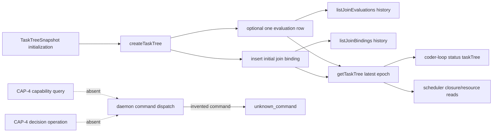

# RFC #544 R7 / I15 — CAP-4 decision 契约与现存 join identity

> 固定基线：`main@699842eba2eefc242d19f8fa9232bc1d9d5c3bdd`，Bun 1.3.14 / macOS arm64。锚点仅取 AGG CAP-4、D8、D13、F decision，R5 L31/L32/L33 与 R6 I15；主体准入复用 I13，跨副作用事实复用 I14。本文只调查现状，不提出方案、选项、推荐、成本或 issue 拆分。

## A. 主 agent 摘要（≤一页）

**可证伪问题：** CAP-4 的 evaluation identity、`advance | hold | reopen`、capability query、current operator、epoch 与现存 join evaluation / bindingVersion 的 schema、writer、reader、scheduler/status/events 如何逐项对应；epoch 变化、重复/过期 decision、无 capability 时系统实际接受或拒绝什么？

**结论（高置信）：CAP-4 的操作与权限契约当前不可达；现存资产只能证明“某 par node 的某 epoch 绑定某 join binding version，并有 evaluation lifecycle 状态”，不能证明 operator decision。** 可复用 identity 最小核是 `(parNodeId, epoch)`：SQLite 以它为 evaluation 主键，行另带 `bindingVersion` 外键；task-tree/status 的最新投影带 `runtimeNodeId + evaluation.{epoch,bindingVersion}`。binding 行另有 `(parNodeId,version)`、join value、author/authority/effective epoch。它们足以定位一次 join evaluation 所属 par、epoch 与绑定版本，但不含 decision value、decision author/operator、capability、decision request identity、decidedAt 或审计引用。

现存 `JoinEvaluationSnapshot` 的 `decided` 是**无 payload 的 lifecycle tag**，不是 CAP-4 decision ADT；`ParReopenSnapshot.count/budgetRef` 与 supplemental reachability seed `decided-reopen` 也不是 operator 的 `reopen` decision。仓内唯一 join writer 是 `createTaskTree` 初始化路径；公开 store 只有 `getTaskTree/listJoinBindings/listJoinEvaluations`，没有推进 evaluation 的方法。scheduler 只读取 task tree 处理 closure/资源，不评估 join；daemon 21-command 闭集没有 capability query 或 decision operation，未知 command在dispatch前拒绝。因此不能用实验伪造一个并不存在的 operation，再把 raw SQL 接受/拒绝冒充 daemon 语义。

**实际接受/拒绝边界：** 初始化可接受 `not-evaluating`（不落 evaluation 行）或单个 `evaluating|decided|consumed` 行；相同 `(parNodeId,epoch)` 重复插入被主键拒绝，负 epoch与把 `advance|hold|reopen` 填进 `evaluation_state` 被 CHECK 拒绝。不同 epoch没有单调/CAS约束：受控 DB 实验在 epoch 2 后插入 epoch 0 成功，读列表保留两者，而 task-tree/status只选数值最大 epoch。store连接开启外键，能保护 bindingVersion 引用；但公开API没有后续 evaluation writer。用另一个默认未启用FK的裸 SQLite 连接可旁路并插入 `bindingVersion=99`，随后 store读面把 epoch 3 / version 99当最新合法形状返回；这与 I13 的公开 DB/路径旁路是同一信任边界，不是正常 daemon operation。

**无 capability 的真实行为不是“拒绝 decision”，而是“系统没有这项询问与提交”。** status无条件暴露 taskTree evaluation lifecycle；没有 current-operator 或 capability字段。raw socket若提交自造 decision command会由现存闭集返回 `unknown_command`，而不是 capability-denied；events schema没有 CAP-4 decision/audit类型或消费者。D13移动端因此也没有可消费入口。

**八层因果：** 任务树持久化先提供结构快照与未来 writer 所需的 normalized tables → evaluation只建 lifecycle tag和历史键 → 初始化writer把定义态一次性物化 → 后续 engine/scheduler没有 join evaluator → daemon没有capability/decision命令与正向operator identity → status只投影最新epoch，events不记录CAP-4 → 重复/过期请求不存在可判定语义 → GUI/移动端无从区分“无权、过期、重复、已决定”。只把 `decided` 映成 `advance` 会丢失 hold/reopen、author/capability；只增加三个 command字符串会残留 evaluation identity、epoch竞争、主体准入与审计；只从最新status推 capability会把生命周期事实误作授权。哪些机制成立由R8裁决。

**可保留资产：** normalized par/join/evaluation PK与FK、epoch/bindingVersion字段、严格 task-tree ADT边界、join binding provenance字段、历史列表reader、status taskTree投影、SQLite store连接的FK与单方法事务。**测试同错/盲区：** round-trip测试只初始化 `evaluating(epoch=2,binding=2)`并相等比较；没有任何CAP-4 operation、主体/capability、epoch竞争、重复/过期、decision payload、审计或移动端测试。资产未知：#700 自身的未落地设计不在本固定基线，仓外消费者未扫描；不能从编号猜字段。

## B. 证据账本

### B1. CAP-4 字段与现存字段逐项矩阵

| CAP-4要求 | 现存最近字段/状态 | 能证明 | 不能证明 |
|---|---|---|---|
| evaluation identity | DB PK `(par_node_id,epoch)`；task-tree par `identity.runtimeNodeId` + evaluation epoch | 同一par内epoch行唯一 | chain id不在行内；没有命名的公共 `EvaluationIdentity` 类型/请求边界 |
| epoch | non-negative integer；latest snapshot按 `ORDER BY epoch DESC LIMIT 1` | 可保存多epoch历史并取最大值 | 不保证单调创建、currentness、expected epoch/CAS或过期判定 |
| bindingVersion | evaluation行字段；FK `(parNodeId,bindingVersion)`→binding PK | store正常连接下evaluation引用某版本binding | capability、decision权限或“当前binding”一致性；snapshot分别取最大binding与最大epoch，未交叉验证 |
| decision ADT | lifecycle `evaluating|decided|consumed` | evaluation曾处于某 lifecycle tag | `advance|hold|reopen` payload；`decided`为何决定、由谁决定 |
| reopen | `par.reopen.{count,budgetRef}`；seed字面量`decided-reopen` | reopen资源/可达性数据有预留 | CAP-4 `reopen` decision；没有二者转换writer |
| capability query | 无字段、无store方法、无daemon command | 无 | 当前operator对指定epoch是否有权限、denial reason、有效期 |
| current operator | I13仅有socket mutation的“缺credential=operator”分类 | 现存mutation gate有operator标签 | CAP-4 operator identity、peer主体、capability owner；join行初始化author恒为engine |
| decision operation | 无store mutator、无daemon command、无CLI/client方法 | operation不可达 | 重复、过期、无权、成功的typed结果 |
| audit/event | 现有scheduler decision events是调度限流/chain-complete等另一语义 | 不能与CAP-4混同 | evaluation identity + operator + decision的一致审计 |

字段来源：`src/task-runtime.ts:28-52,158-164`；`src/sqlite-state.ts:298-303,695-725`。注意 join binding 的 `author_kind/author_id/authority_class/effective_from_epoch` 是**binding provenance**，初始化writer固定写 `engine/initial/definition/0`（`:2421-2427`），不能移作尚不存在的 decision author。

### B2. 权威状态矩阵

| 现存形态 | DB行 | snapshot/status | 现存writer/transition |
|---|---|---|---|
| `not-evaluating` | 无evaluation行 | `{kind:"not-evaluating"}` | `createTaskTree`在初始化时跳过insert |
| `evaluating(e,v)` | `(par,e,v,evaluating)` | 最新epoch投影同值 | 仅初始化insert |
| `decided(e,v)` | `(par,e,v,decided)` | 最新epoch投影同值 | 仅初始化insert；无decision payload |
| `consumed(e,v)` | `(par,e,v,consumed)` | 最新epoch投影同值 | 仅初始化insert |
| `advance` | 不可表达 | 不可表达 | 无 |
| `hold` | 不可表达 | 不可表达 | 无 |
| `reopen` decision | 不可表达 | 不可表达 | 无 |

`JoinEvaluationSnapshot`虽然是穷尽ADT，但仅对四个**snapshot lifecycle** variant穷尽；不能因名字 `decided` 就提升为CAP-4三分decision（`src/task-runtime.ts:34-38`）。`createTaskTree`先严格解析整棵tree且拒绝第二棵tree，然后一次insert；公开接口此后没有 evaluation/binding写方法（`src/sqlite-state.ts:311-355,1974-1983,2430-2433`）。

### B3. writer / reader / consumer 穷尽

1. **Writer：** 生产源码唯一SQL insert调用为 `insertTaskNode(par)`→`insertJoinBinding`→`insertJoinEvaluation`；调用者只有 `createTaskTree`（`src/sqlite-state.ts:1974-1980,2397-2401,2421-2433`）。没有UPDATE evaluation语句。
2. **Readers：** `listJoinBindings`、`listJoinEvaluations`是store history readers；`getTaskTree`分别选择最大binding version与最大evaluation epoch（`:2041-2043,2519-2527`）。
3. **Status：** CLI status读取DB task tree并由严格boundary验证后暴露（`src/loop.ts:520-529,3169-3177,4239-4245`）。
4. **Scheduler/daemon consumers：** 对 `getTaskTree` 的生产调用用于task identity、closure定位、reachability/cleanup/recovery；全仓没有按 join evaluation kind/epoch 做join推进的consumer。字符串 `decision` 的其他出现属于rate-limit、scheduler observability或chain-complete，字段没有evaluation identity，不能算CAP-4。
5. **Operation/query：** 21项 `DaemonCommandName` 与精确tuple均无join/evaluation/capability/decision（`src/daemon.ts:161-205,5731-5766`）；dispatch对tuple外command返回`unknown_command`（`:1920-1924`）。公开store也无该mutator。
6. **Events：** 仓内没有携带`parNodeId+epoch+advance|hold|reopen+operator`的event shape/emitter/reader。现有 `decision` event命名不能凭同词视为同一领域事件。

### B4. epoch、重复、过期与无capability实验

环境：隔离root `/tmp/coder-loop-544-I15-<pid>`，用真实`openSqliteStateStore`初始化par epoch 1；随后只为观察schema约束使用独立 Bun SQLite连接。没有创建worktree、没有启动中央daemon、没有碰生产root。结果：

| 输入 | 实际结果 | 边界解释 |
|---|---|---|
| 再insert同 `(par,epoch=1)` state=`decided` | `SQLITE_CONSTRAINT_PRIMARYKEY` | epoch identity唯一；不是idempotent重放，也不返回旧decision |
| insert epoch 2 state=`decided` | 接受 | 不要求epoch1先consumed |
| 在epoch2后insert epoch0 state=`consumed` | **接受** | schema不要求epoch单调；history排序为0,1,2 |
| state=`hold` | `SQLITE_CONSTRAINT_CHECK` | decision字面量不能放进lifecycle列 |
| epoch=-1 | `SQLITE_CONSTRAINT_CHECK` | 非负约束有效 |
| raw连接默认FK关闭，insert epoch3/binding99 | **接受**；store snapshot读成epoch3/version99 | 外部DB旁路可越过FK；store读shape只验证整数，不复核对应binding |
| 正常store连接写缺失binding | 不可实验：没有evaluation writer；该连接启用FK | 不伪造不存在的operation；schema FK与store pragma为静态证据 |
| 无capability提交decision | 不可实验：无query/operation | 自造command只会是`unknown_command`，不存在“capability deny”分支 |

实验重点不是把raw SQL称作CAP-4，而是区分三层事实：schema自身的PK/CHECK、store连接的FK配置、以及**缺失的领域operation**。`PRAGMA foreign_keys=ON`是per-connection设置（`src/sqlite-state.ts:838-840`）；I13已说明裸DB/store旁路不受daemon准入，这里不重复推导主体政策。

latest投影还有一个重要独立性：reader单独取最大binding version与最大evaluation epoch，不检查evaluation.bindingVersion等于当前最大binding；历史evaluation绑定旧version本可合理存在，但现有snapshot没有“current epoch是否用current binding”的额外判定。该事实不能自行转化为缺陷，CAP-4尚未规定这层关系。

### B5. 八层因果、放大路径与症状修补残留

1. **需求层：** CAP-4要按指定epoch查询当前operator capability并提交三分decision。
2. **领域层：** 现存ADT只有join value、evaluation lifecycle、par reopen计数；没有decision ADT/capability/operator。
3. **持久化层：** normalized表保存par/epoch/binding历史，PK/FK/CHECK可复用；没有decision值/作者/请求/审计列或领域writer。
4. **执行层：** task tree只在初始化创建；scheduler没有join evaluator或epoch推进器。
5. **准入层：** daemon mutation主体模型与I13相同，但没有CAP-4 command可套用；“operator”甚至没有CAP-4正身份。
6. **读取层：** status无条件返回latest lifecycle，不能回答capability；history readers只给状态行。
7. **可观察层：** 没有CAP-4 outcome/admission event，无法把identity、subject、decision对齐；I14的mutation commit缺口即使复用也不能生成缺失领域事实。
8. **消费层：** D8/D13只能看到结构状态，不能决定何时展示按钮、提交什么、如何呈现stale/duplicate/no-capability。

症状修补残留：

- 把现有`decided`固定解释为`advance`：仍无`hold/reopen`、主体、capability、审计，且改变既有lifecycle含义。
- 用`par.reopen.count`反推`reopen` decision：计数不是decision identity，不能区分engine动作与operator选择。
- 用status latest epoch推断“当前可决”：latest只是数值排序，没有operator/capability或并发新鲜度。
- 只在GUI隐藏按钮：服务端仍无query/operation，移动端与其他client无法共享契约。
- 只向daemon tuple加命令名：store没有领域transition；I13/I14的target binding、身份与跨副作用问题仍在。
- 只向evaluation表加decision字符串：仍不能判定重复/过期、current operator/capability与审计消费者。

这些只是残留分析，不构成实现选项或推荐。

### B6. 可保留资产、测试边界与未知

**资产：**

- `(parNodeId,epoch)` evaluation PK与 `(parNodeId,bindingVersion)` FK；
- binding version、value、provenance、effective epoch历史；
- exact-key task-tree boundary与evaluation exhaustive lifecycle parsing；
- `listJoinBindings/listJoinEvaluations/getTaskTree` reader；
- status对同一taskTree shape的投影；
- store正常连接启用FK、WAL、每个writer的IMMEDIATE transaction（后者范围见I14）。

**测试同错/盲区：**

- `tests/unit/sqlite-state/task-tree.test.ts:397-409`只证明一次初始化的validator binding v2 + evaluating epoch2/v2 round-trip；输入本身即期望，没有状态推进。
- task-runtime tests证明拒绝额外key和非法shape，不证明CAP-4 field存在。
- closure lifecycle的`decided-reopen`/`next-epoch-candidate`测试只证明未来writer reachability fact，不测试operator decision。
- daemon/scheduler integration没有decision command、capability query、operator identity、epoch CAS、duplicate/stale、无权、audit、status/event对齐。
- 没有D13移动视口的decision入口可测；这是对象缺失，不是漏跑现成E2E。

**未知：** 固定基线外#700是否已形成更细字段、operation/error taxonomy未知；仓外是否有直接读取normalized join表的消费者未做全机器扫描；真实未来epoch推进策略未知。以上均未用猜测补齐。

### B7. 证据索引与清理

- CAP-4权威描述：`AGG-544-gui-observability-gateway.md:499`
- D8/D13/F：同文件`:118,342-362,446-464`
- snapshot ADT/boundary：`src/task-runtime.ts:28-58,127-164`
- store public surface：`src/sqlite-state.ts:298-355`
- schema/constraints：`src/sqlite-state.ts:695-725`
- store FK：`src/sqlite-state.ts:838-840`
- initializer writer：`src/sqlite-state.ts:1974-1983,2397-2433`
- history/latest readers：`src/sqlite-state.ts:2041-2043,2519-2527`
- status projection：`src/loop.ts:520-529,3169-3177,4239-4245`
- daemon closed command set/unknown rejection：`src/daemon.ts:161-205,1920-1924,5731-5766`
- runtime实验：B4全部行；隔离root与脚本在输出核对后删除。未创建worktree，未修改产品、测试、配置或生产root。
