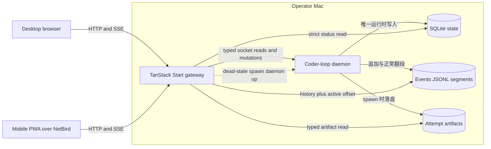
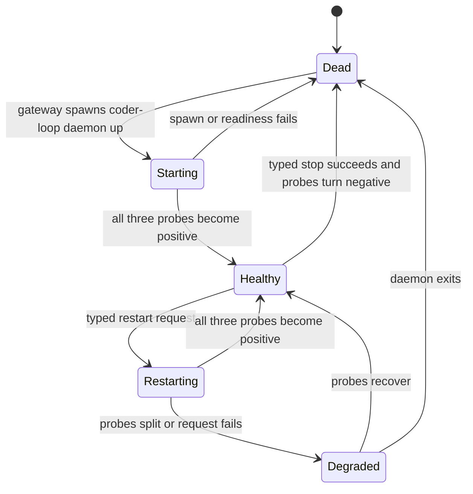

# RFC #544 终态实现分析：可观测性网关与 Web GUI 应当成为什么

> 本文回答“最终系统需要实现什么”，不复述历史拆分，不选择尚未决定的存储、并发或组件机制。描述以稳定设计、修补后预期地基、D1–D14 需求合同和供需接缝为准。文末索引给出依据位置。

## 1. 系统目标

最终交付的是一个在 daemon 健康和不健康时都可使用的 operator Web 面。它要让操作员无需进入 agent session 或检查散落文件，就能回答四类问题：

1. daemon 现在是否真正可用，若不可用，故障发生在进程、socket 还是 RPC 层；
2. chain、item、run、phase 和 attempt 当前处于什么状态，最近发生了什么；
3. 某次 attempt 实际向 runner 发送了什么 prompt、使用了哪些绑定；
4. 对当前异常是否存在安全、明确且范围受限的处置动作。

这个目标不是“给现有 CLI 套网页”。Web 面只承载高频观测、daemon 生命周期和少量解卡动作；创建 chain、添加 item 和批量创建等重交互仍留在 CLI/agent。GUI 展示的事实必须来自引擎或外部能力的类型化合同，不得在前端根据目录、进程、git 或文案重新猜状态。

## 2. 进程边界与数据流

### 2.1 进程拓扑

系统包含相互独立的 daemon 与 GUI gateway。gateway 是 coder-loop 同仓的 TanStack Start/Bun 进程，同时承载静态资产、server routes 和 SSE。浏览器只连接 gateway；gateway 按数据性质选择三个事实面。

daemon 与 gateway 的生命周期不绑定。daemon 退出时 gateway 必须继续服务；gateway 退出时由它启动的 daemon 也必须继续运行。gateway 不是通用进程监督器，它只提供本文明确列出的 daemon start/stop/restart 闭环。

### 2.2 三个事实面

| 事实面 | 权威来源 | gateway 行为 | daemon down 时 |
|---|---|---|---|
| 持久运行状态 | SQLite | 调用 engine-owned strict status reader；不拥有 SQL 或 migration | 继续读取队列、chain、run、task tree 等最后持久事实 |
| 事件历史与实时变化 | 主 events JSONL 及明确的诊断来源 | 精确解析历史段；按 active byte offset 增量读取；经 SSE 推送 | 历史与死前最后事实仍可读；已有 SSE 连接保持存活 |
| 瞬时查询与写动作 | daemon socket | 使用引擎派生的 typed transport 和领域 façade | RPC 明确失败；只有 daemon start 走非 RPC spawn |

这些事实面可以在同一页面关联展示，但不构成一个跨 SQLite、文件和进程的全局时间点。status 只能承诺 SQLite 持久槽内部的一致快照；events 和活性探针保留各自采样时间。

### 2.3 单 root 与网络边界

一个 gateway 实例在启动时绑定一个 loop-data root。root 进入不可变的 typed runtime context；请求参数、URL、表单和前端状态都不能切换、枚举或逃逸到其他 root。

监听集合严格由两个显式地址组成：loopback 和当前 NetBird interface address。不得绑定 wildcard、LAN 地址或公网地址，也不得在地址不可用时静默放宽。每个显式 listener 使用相同的应用 handler，静态资产与 routes 来自同一 gateway PID。

mesh 是网络准入边界。系统不增加登录页、cookie session、bearer token、Keycloak 或另一套 operator identity。这个裸信任只适用于明确的 mesh-only 暴露，不得推导为公网部署方案。

## 3. Status 合同

### 3.1 严格只读

status reader 是 engine-owned 能力，并且不依赖 daemon socket。其完整生命周期都必须保持只读：

- 不创建缺失的数据库或 sidecar；
- 不改变 journal mode；
- 不执行 schema migration、DDL 或写 PRAGMA；
- daemon 存活的 live-WAL 场景和 daemon 已停场景都能按同一合同读取；
- 重复读取前后，DB、WAL、SHM、journal 和 schema 相关文件的成员、内容及 metadata 保持中立。

缺盘、权限失败、损坏、旧或未来不可消费 schema 必须产生可穷尽的 typed 结果。schema mismatch 不是正常的 `missing-state`，同一个底层问题也不能因为失败发生在不同读取阶段而改变领域分类。

### 3.2 单一 SQLite 快照

一次 status 中的 chain、items、current、runs 和完整 task tree 必须来自同一个 SQLite read snapshot。并发 writer 在读取期间提交时，返回值只能整体属于提交前或提交后，不允许产生数据库中从未同时存在过的混合对象。

root、target、chain 和 task tree identity 来自持久事实。process 列表、worktree 是否存在、git branch 或其他运行痕迹不能用于补造闭包状态。

### 3.3 精确公共 wire

最终 CLI JSON 与 gateway HTTP response 使用同一个 engine-owned exact boundary。该 boundary 覆盖顶层和每个内部槽：

- 不存在匿名 `object`、raw record 或宽松 JSON 兜底；
- 有限状态和错误使用穷尽 variant；
- task tree 使用 CAP-1 提供的 leaf/seq/par union；
- hooks、CAP-4 等后续领域投影进入同一个可扩展 boundary，而不是旁建 status wire；
- public wire 在 boundary 验证后不得再发生未验证的 flatten、extra 合并或结构改写。

TypeScript、gateway 与 frontend 类型从这一 boundary 派生。shape 变化必须让编译器暴露所有消费者，并通过实际 CLI/HTTP shape diff 验证。

### 3.4 Hooks 与 gate hold

status 还要承载 CAP-5 的当前有效视图：四层 hook 声明合成后的生效清单、来源层，以及当前 gate hold 的决策点、开始时间和重问节奏线索。页面用它回答“这个 chain 为什么没有推进”和“当前有哪些 hook 生效”。

status 表示“现在”，`hook.*` events 表示“过程”。二者通过 owner-defined hook identity 关联；GUI 不执行 hook、不建立第二份 hook registry，也不从事件历史反推当前有效配置。

## 4. Daemon 活性与生命周期

### 4.1 三证模型

“daemon 是否在跑”不能折成布尔值。首屏分别呈现三次独立观测：

| 证据 | 输入与结果 | 不能证明什么 |
|---|---|---|
| PID/process | pidfile 读取/解析、该 PID 是否可 signal、精确 errno、采样时间 | 单独不能证明 socket 或 RPC 健康，也不能完全排除 PID 复用 |
| Socket connect | 本次连接成功或精确连接错误、采样时间 | 不能证明 endpoint 会完成合法 RPC |
| `daemon.status` | deadline 内完整响应、严格 envelope、相同 request id、精确 result 或 failure、采样时间 | 不能回填 pidfile 正确，也不保证下一时刻仍健康 |

所有分裂组合都必须可见，例如 PID 活但 socket 拒绝、connect 成功但 RPC timeout、pidfile 缺失但 RPC 成功。`ps` 等启发式信息最多是旁证，不能覆盖三证。

### 4.2 Typed socket transport

socket client 必须有界完成。deadline 或 caller abort 发生时主动销毁底层 socket；EOF、半包、invalid envelope、response-id mismatch、protocol failure、daemon 明确拒绝和领域执行失败保持不同类型。

command、args、result 和 error 从引擎命令闭集派生。gateway 不复制命令字符串表、framing 或 parser。对于 mutation，本地 timeout/断线只说明客户端没有获得确定响应，不能冒充 daemon rejection，也不能声称动作未提交。

### 4.3 生命周期动作

dead-state start 必须在 socket 不存在时可用，因此它由 gateway spawn `coder-loop daemon up`，不是 socket RPC。stop/restart 使用既定 daemon 机制。start/restart 的成功观察不是按钮返回或单一 PID，而是三证最终分别翻绿。spawn 后 daemon 与 gateway 解耦。

系统不新增通用 supervisor、自动拉起策略或 gateway-owned daemon 生命周期。

## 5. Events 合同与实时推送

### 5.1 生产端

普通、timer 和 fatal 入口共享唯一的正常写入所有权。day/size rotation 必须产生唯一 segment identity，并完成触发翻段的 event append。交付保证覆盖正常写入与正常翻段，不扩张为断电 durability、任意 kill 点恢复、fsync 或 crash journal。

segment 名称解析、发现、排序、event ADT 和 envelope 来自同仓 4.3 合同。生产者和消费者不能各写一套 filename regex、排序或事件 shape。

### 5.2 历史读取与连续性

gateway 发现主 active/history segments，以 owner boundary 精确解析事件，再按 chain、item、runId、phase 和时间范围过滤。交付范围内真实历史的坏行、partial line 或已证不兼容必须得到显式读取结果；只能为实际样本增加最小兼容，不预建通用 schema generation/migration 框架。

实时读取以 active segment identity 和 byte offset 为内部连续性状态。文件变化通知只是“重新检查”的触发，不能作为事件计数。正常 append 和 rotation 交错时，已经提交的 event 对 reader 无丢无重。这个内部 offset 不成为外部 replay cursor。

### 5.3 SSE 生命周期

新事件经 SSE 推送。daemon 停止不关闭已有 SSE；没有新 event 时连接保持，历史查询继续工作。客户端 abort 必须立即回收 file watch、reader、offset、subscription、interval 等所有旁路资源。close 和 enqueue 的 race 要被收口，单个断开的客户端不能使 gateway 退出；断开后新的 API 请求和 SSE 连接仍能建立。

不提供断线 replay、`Last-Event-ID` 或 gateway restart 后恢复旧 subscription cursor。

### 5.4 固定可见结果

用户必须看到主 events 历史、主流最后可读事件、`daemon.stop`/`daemon.fatal` 等死因线索、落盘崩溃记录和点名异常。每条结果标明真实来源。多个物理来源可以在 UI 中归集，但不能被表述为一个完整、全序、全局因果日志；无明确死因时显示未知，不编造原因。

## 6. Attempt 输入与 prompt 展示

### 6.1 生产时快照

每次 fresh、普通 resume 和 chain-complete finalizer attempt 都产生 `prompt.md` 与 `bindings.json`。二者绑定稳定的 attempt/run/phase identity、attempt variant 和完整 pinned definition identity。

同一次 resolver/render 产生一个概念上的 attempt input：

- 唯一 `effectivePrompt` 同时用于 runner argv 和 `prompt.md`；
- bindings 保存每个 `{{KEY}}` 的 source 与当次 render string；
- 普通 resume 保存完整 phase prompt、resume 标记和所续 session；
- 固定“继续”只属于 finalizer 特例，不能外推到普通 resume。

完整 artifact result 只有在 prompt 和 bindings 都完整且属于同一 attempt input 时才是 present。写入或发布失败不阻止 runner attempt，但必须产生唯一、可关联 attempt 的 diagnostic event；成功路径不增加该事件。重启后遇到 partial 也不能把它冒充完整输入。

### 6.2 Pinned definition 与 typed seam

spawn、retry 和 daemon restart 恢复期间，attempt 按完整 CAP-2 identity 解引用自己的 pinned definition，不重读同路径当前 preset。artifact 不能替代完整 definition repository；本文也不规定 TTL、永久保留或 GC 算法。

bindings 的稳定基线是 source + scalar render string。CAP-3 的类型化值到达后，只能作为 owner-defined、non-breaking additive evidence 加入；不得预先猜字段、variant 或复合值编码。

### 6.3 GUI 读取

attempt artifact 通过独立 typed route 读取，不进入 status 正文。route 以 root/chain/run/phase/attempt identity 定位，不能串到相邻 attempt。结果至少在语义上区分：

- present：prompt 与 bindings 都通过精确 boundary；
- legacy missing：该 attempt 早于持久化能力；
- write-failed/incomplete：该次产物失败，可关联 diagnostic；
- parse/read failure：当前数据不可消费。

页面逐字显示 prompt，不做 Markdown 渲染、截断、插值或重放；bindings 按 KEY/source/render value 显示。GUI 不调用 renderer，不读 current preset，也不从 argv/stdout 反推。

## 7. Context 与 compile 读取面

### 7.1 Context entries

context 是 CAP-6 的只读消费面。调用链为 daemon context service 的 operator typed read → gateway route → frontend boundary。request、result、error、pagination 和 filter 都从 upstream ArkType boundary 派生。

页面按三个 scope 展示成功持久化的 entries：item 谱系、chain 公告、group 分支组。每条显示 `id`、`ts`、`scope`、`author` 和 opaque body。body 原样/等宽显示，不解释 Markdown、状态词、控制标记或业务结构。

本系统不取得 context 写入协议所有权，不新增 partial upload restart、idempotency、DB/event 原子性、outbox、retention/GC、read audit 或跨页 snapshot 合同。

### 7.2 Current preset compile preview

compile preview 以当前 preset name 为输入，消费 CAP-7 与 `coder-loop preset compile <name> --json` 共用计算路径和 schemaVersion 的单一 artifact。GUI 不读取 `preset.toml`，不重建 compiler，也不接受 attempt pinned identity 作为这个页面的编译输入。

成功 artifact 包含六块：preset metadata、statuses/stateGraph、phases/task tree、tools、fragments、findings。固定可视结果为：

- stateGraph 的状态节点、exit edges 和引擎自有转移；
- phases 的任务树；
- 每 phase 的 variable KEY/type/source/required；
- warn findings。

所有视图来自同一次 compile 的同一个 artifact。compile rejection、unsupported schemaVersion、invalid boundary 和 transport failure 不得折叠。unsupported version 显示实际版本并拒绝渲染，不能 silent downgrade；rejected compile 不能以 partial artifact 冒充成功。

不提供 historical-pinned compile、current/pinned 双视图或历史 diff。CAP-2 的可达性不能被解释成 D11 的历史预览要求。

## 8. 任务树、层级钻取与首屏

### 8.1 Identity 与导航

GUI 的主层级是 daemon → chain → item → run → phase/attempt。每层有稳定 typed identity、相邻层互链和可分享、刷新后仍可解析的 canonical URL。URL identity 必须区分存在、缺失、过期和不属于父对象，不能用“当前项”猜测定位。

事件 envelope 的 chain/item/runId/phase 用于从 event 跳到对象；对象页面用同一 typed filter 反查 events。status 与 events 只通过 identity 关联，不生成全局 snapshot 或事件全序。

### 8.2 Task tree

chain/item 页面穷尽渲染 CAP-1 leaf/seq/par union，包括 join 声明与状态、reopen 计数、closure lifecycle、branch 和相关 session identity。新增 variant 必须成为编译错误或显式未支持状态，不能落入 default。

v2 线性 chain 通过 CAP-1 提供的退化树显示。不得复活 slot，不得创建 `LegacyTree` 平行 shape，也不得从 worktree、git 或进程信息构造另一棵树。

### 8.3 首屏信息

首屏的任务不是展示所有详情，而是让人一眼判断是否需要处置。它同时显示：

- daemon 三证及各自采样时间；
- daemon 活/死与网络不可达的区别；
- 每个 chain 的 active run 和最近转移；
- rate-limit 冷却；
- 最近点名异常与死因线索；
- daemon lifecycle 和当前可用的解卡动作入口。

daemon down 时，页面仍展示 SQLite 队列终态、events 历史、最后事件和已有死因。无证据时不猜死因。

## 9. 控制面

### 9.1 Exact F surface

GUI 可写面是一个编译期闭集：

1. daemon start、stop、restart；
2. `queue.unblock`；
3. `chain.stop`、`chain.resume`；
4. `item.reorder`；
5. capability-gated `advance | hold | reopen` evaluation decision。

`chain.create`、`item.add`、batch 和任意 daemon command 不得通过类型、route、动态字符串或隐藏 UI 逃逸。新增 daemon command 不会自动进入 GUI。

所有 socket mutation 经过单一 engine-derived typed mutation façade；daemon start 例外地走非 RPC spawn。gateway 使用既定 operator 主体，不持有 agent credential，也不复制 target、authority、capability、currentness 或状态转移判断。daemon 是准入和领域合法性的裁判。

### 9.2 结果语义

每个 socket verb 穷尽区分 accepted、rejected、failed，以及 transport 未确定结果。已知失败不能序列化为成功；accepted 后的核心状态必须能从 canonical status 读回，events 用于关联核验与诊断。

| 动作 | accepted 后可观察结果 | 典型明确拒绝 | 核验面 |
|---|---|---|---|
| queue unblock | item/current 反映解除阻塞后的领域状态 | target 不存在或不可 unblock | status queue/current + events |
| chain stop | chain 为 stopped，相关 active work 按领域结果变化 | target/状态不允许 | status chain/current + events |
| chain resume | chain 为 active；不额外承诺同步 spawn child | target/状态不允许 | status chain + events |
| item reorder | 最终队列顺序与 accepted 参数一致 | 非法 target/order | status queue + reorder/admission events |

核验不要求 SQLite、events、audit 和 response 共同 commit，也不建立 durable operation、query/replay、outbox、saga、command log 或 exactly-once 平台。

### 9.3 CAP-4 decision

evaluation identity 是 `(parId, epoch)` 并关联 binding version。decision 是与 lifecycle 分离的 `advance | hold | reopen` ADT。

GUI 先查询当前 operator 对指定 evaluation 的 capability，只显示允许的动作；无 capability 时显示 authority gap。submit 时 daemon 重新验证 identity/currentness。accepted decision 必须被真实 evaluator 消费，status、event 和 audit 引用同一 evaluation identity、operator 和 decision。

resume、unblock、reopen count 或修改 join 都不能冒充 decision。CAP-4 不建立第二授权系统、第二日志或全局 sequencer。

## 10. Desktop、移动端与 PWA

桌面和手机使用同一个响应式应用、route graph、status/event clients 和 mutation façade。布局可以随 viewport 改变，但领域语义和网络请求合同不能分叉。

移动初始 viewport 在无需滚动且无横向溢出的条件下优先显示 daemon 三证、active runs、异常清单和控制动作。深层 chain/item/run/attempt 页面保持可达，但不挤占首屏。所有生命周期、四个解卡 verb 和 capability-gated decision 适合触控，并完整显示 accepted/rejected/failed/transport failure。

PWA 包含有效 manifest、图标和 service worker，可以从真实手机加入主屏并以 standalone 模式打开同一应用。PWA 不承诺离线 status、离线 mutation、后台同步或移动专用 backend/client。

真实移动访问必须从另一台 NetBird peer 到达明确 mesh listener，而不是 LAN、公网或代理。桌面主要页面和控制路径不能因响应式/PWA 收口而回归。

## 11. 失败、恢复与明确边界

### 11.1 用户可区分的失败

| 场景 | 系统行为 |
|---|---|
| gateway 不可达 | 浏览器呈现网络连接失败；不能误标为 daemon dead |
| daemon dead | gateway 仍应答；三证、SQLite 终态、events 历史和已有死因可见 |
| socket connect/RPC 异常 | 保留 connect、timeout、EOF、protocol、id mismatch、remote reject 等不同结果 |
| SQLite 不可消费 | 返回精确 DB/schema variant；不迁移、不创建、不伪装 missing-state |
| event bad/partial | 显式读取失败或最小、实证兼容；不把非法行冒充 event |
| artifact legacy missing | 说明该 attempt 早于持久化能力 |
| artifact write failed | attempt 继续；页面说明落盘失败并关联 diagnostic |
| compile schema 不支持 | 显示实际 schemaVersion 并拒绝渲染 |
| context/compile transport failure | 与领域 rejection、boundary invalid 分开显示 |
| mutation response 丢失 | 呈现未确定结果；不声称未提交或自动 replay |

### 11.2 恢复范围

系统承诺 daemon dead-state 的人工 start，以及 stop/restart 后三证闭环；承诺正常 events rotation 和已连接 SSE continuity；承诺 pinned definition 在 attempt 生命周期操作中可达。

系统不承诺通用进程监督、断电日志恢复、SSE reconnect replay、mutation exactly-once、跨介质原子提交、历史 compile 或 context write recovery。未知运行参数用于确定 fixture、deadline、压力和兼容样本，不能自动升级为新的产品保证。

## 12. 类型、所有权与只读红线

### 12.1 全链路类型规则

- 有限状态使用 ADT/discriminated union 并穷尽处理；
- 不引入 `any`、匿名 shape、raw record 或内部 `unknown`；
- `unknown` 仅存在于 catch 或外部 parse 边界，并立即进入精确 parser；
- 不用真类型断言绕过断裂，`as const` 除外；
- status、event、socket、artifact、compile、context、task tree 和 CAP-4 均从各自 owner boundary 派生；
- 前端不能复制后端 shape 或以字符串表重建命令闭集。

### 12.2 所有权总表

| 合同 | 唯一 owner | 其他层的责任 |
|---|---|---|
| strict status read / SQLite snapshot | engine status domain | gateway/GUI 只调用和展示 |
| final status boundary | engine status boundary | CLI、HTTP、frontend 共享派生类型 |
| task tree shape | CAP-1 | status 集成，GUI 穷尽渲染 |
| events producer contract | events domain | gateway reader 不重写 writer/segment 规则 |
| events reader/SSE | gateway events domain | 页面订阅和导航，不另建 tailer |
| attempt artifacts | attempt producer | GUI 通过独立 route 展示 |
| pinned definition / typed bindings | CAP-2 / CAP-3 | consumers 不定 retention 或 shape |
| compile artifact | CAP-7 | GUI current-name 消费，不重编译 |
| context read boundary | CAP-6 | GUI 不直读 store 或取得 write protocol |
| typed transport | engine transport | 各领域 façade 不复制 framing/registry |
| F mutation façade | GUI control domain | 各页面复用，不建立第二 client |
| CAP-4 decision | CAP-4 domain | façade 接入，status 承载，GUI 不自授权 |
| gateway host | gateway runtime | 各 Web 功能共享 PID/root/listeners |

### 12.3 Runtime 文件豁免

“非 GUI consumer 不刮 runtime 文件”继续有效。唯一 gateway 豁免仅覆盖：

1. events JSONL；
2. per-attempt prompt/bindings artifacts；
3. daemon.pid/daemon.sock 三证探针。

条件是同仓、同版本演进。豁免不扩展到 agent、supervisor、脚本或其他服务，也不允许 gateway 直接写 SQLite、读取任意 runtime 文件后推断业务状态。

## 13. 运行与验证方式

### 13.1 Runbook 闭环

运行文档必须给出可复制的四阶段流程：

1. **启动**：从仓库 root 运行 gateway，显式传 loop-data root、loopback hostname、NetBird hostname 和 port，后台启动并捕获 PID；
2. **就绪**：PID 存活；`lsof` 只显示两个显式 listeners；production HTTP status route 返回经过 boundary 的成功结果；
3. **访问**：本机经 loopback、远端手机经 NetBird；LAN/wildcard/public 负例不可达；
4. **停止**：对捕获 PID 发 `SIGINT`，`wait` 后确认 PID 和全部 listeners 消失。

daemon lifecycle runbook 另行记录 start 非 RPC、stop/restart typed socket、daemon/gateway PID 解耦和三证前后变化。

### 13.2 分层验证矩阵

| 交付行为 | 最强必要验证 |
|---|---|
| strict SQLite | live WAL + daemon-down 前后文件 bytes/metadata/schema 对比；真实 CLI |
| single read snapshot | 可控并发 writer barrier，结果只能属于完整前/后 commit |
| exact status wire | CLI 与 production HTTP 同 fixture 对照及非法 shape 负例 |
| typed transport | 真实 socket 的 timeout、abort、EOF、invalid envelope、id mismatch、remote rejection |
| events writer/reader | 真实 JSONL、三个 writer、day/size rotation、reader/rotation 交错 |
| SSE | 真实 Bun server、daemon kill、client hard abort、资源回收和后续健康请求 |
| daemon lifecycle | dead-state browser start、stop/restart、gateway exit、三证闭环 |
| prompt artifacts | fresh/resume/finalizer 真实 runner argv 对照，写失败继续与 diagnostic |
| hierarchy/task tree | 真实 root 逐层导航、直达 URL、CAP-1 variants、v2 退化树 |
| control plane | 浏览器逐 verb 执行，typed failure，status/events/audit 核验 |
| compile/context | 实际 owner boundary 经 gateway 到浏览器；unsupported/rejected/invalid 负例 |
| mobile/PWA/network | 真实 NetBird 手机、安装与 standalone、触控动作、listener 正反例、PC 回归 |

类型检查、build、unit test 和 grep 是必要卫生，但不能替代上述 runtime 观察。Web 行为必须通过 production-like gateway 和真实浏览器路径验证；mock 页面或 shell 生成的 HTML 不能证明交付。

### 13.3 综合关闭证据

冻结合流 SHA 上的综合证据必须逐项证明：可靠首屏、daemon-down 观测与恢复、实时推送、prompt 展示、全层级钻取、移动/PWA、exact F 控制面、mesh-only、compile 预览以及红线不破。每项记录命令、环境、root/fixture、实际结果和证据位置；失败回到对应产品 owner，不能在收尾文档中降低要求或顺手补机制。

跨能力 v3 接缝由专用 integration 验收证明。现有 bundled preset 的 compatibility real E2E 只在发布候选 SHA 的专用验证中执行；局部交付不能用它替代自己的定向 runtime 验证。

## 14. 明确不实现的内容

- 完整 CLI parity、chain/item 创建表单或 batch 创建；
- 公网入口、SSO、token、应用层登录或第三方 ingress；
- 原生移动 app、移动专用 backend/client、离线 mutation；
- gateway 内嵌 daemon 或通用 process supervisor；
- server/response caps 作为本 RFC 的共同交付门槛；
- events 通用 schema-version/migration framework、crash journal、断线 replay、restart cursor、跨流全序；
- 跨 SQLite/events/process/status/audit 的全局 snapshot 或 common commit；
- historical-pinned compile、current/pinned 双视图或历史 diff；
- CAP-3/CAP-6 shape、TTL、cursor、error 字面量的本地猜测；
- context write recovery、retention/GC、outbox/ledger/staging；
- operator 认证重构、全面封锁内部 store；
- durable mutation operation、operation replay/query、saga、command log、known-outcome、exactly-once；
- 用 resume/unblock/join 修改冒充 CAP-4 decision；
- 把 trace/evidence/handoff 等 A-domain 资产收编为新的格式化 GUI 领域。

## 15. 来源索引

本文使用以下事实与合同，索引只用于追溯，不表示沿用其旧拆分：

| 本文主题 | 主要来源 |
|---|---|
| 目标、七项裁决、架构、信息架构、F surface、范围外 | `SYNTH-544-gui-observability-gateway.md` 的 RFC 骨架；`AGG-544-gui-observability-gateway.md` §1–§3 |
| 关闭验证与验证 owner 边界 | AGG §2.2–§2.4、D14；`demand-D14-544.md` |
| strict status、snapshot、wire | AGG D1/D3；F01–F05；`demand-D01-544.md`、`demand-D03-544.md` |
| hooks/gate hold | AGG D4、CAP-5；`demand-D04-544.md` |
| gateway、listeners、static/SSE spike | AGG §4.2、D5；`demand-D05-544.md` |
| events producer、reader、SSE、visibility | AGG §4.3、D6；F11–F15；`demand-D06-544.md` |
| daemon probes、transport、lifecycle | AGG D7；F06–F10；`demand-D07-544.md` |
| attempt artifacts 与展示 | AGG D2/D10、CAP-2/3；F16–F21；`demand-D02-544.md`、`demand-D10-544.md` |
| task tree 与导航 | AGG D9、CAP-1；`demand-D09-544.md` |
| compile/context | AGG D11/D12、CAP-6/7；`demand-D11-544.md`、`demand-D12-544.md` |
| mutations 与 CAP-4 | AGG §3.3、D8、CAP-4；F25–F30；`demand-D08-544.md` |
| mobile/PWA | AGG D13；`demand-D13-544.md` |
| 修补后统一保证与接缝 owner | `expected-foundation-544.md` F01–F30/X01–X07；`supply-demand-match-544.md` J01–J16 |
| 当前滚动停止点与局部验证边界 | `rolling-resplit-544.md`（只用于确认当前已冻结的验证边界，不作为终态系统结构来源） |

