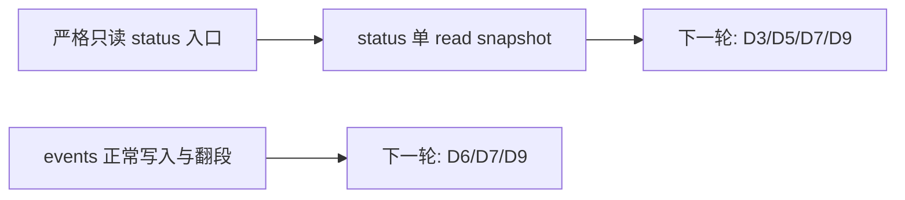

# RFC #544 R12 — 第一批滚动重拆草案

> 本文仅起草下一批 future-work issue body，不创建或修改GitHub issue，不分配虚构编号，不选择后续完整树。输入为AGG稳定条款、R9预期地基、R10需求报告、R11供需匹配及WORKFLOW验证边界。

## A. 主 agent 摘要（≤一页）

第一批只选择三个已经具备稳定需求、明确owner和直接运行检查的原子问题：

1. 建立daemon-down严格只读status入口与typed数据库失败，并在实现前以最小实验确认本机Bun/SQLite live-WAL只读矩阵；
2. 让一次status的全部SQLite持久槽与taskTree来自同一read snapshot；
3. 收口events普通/timer/fatal写入所有权与normal day/size rotation append。

它们分别对应F01–F03与F12，覆盖D1-R01–R07、D6-A04–A05。strict status只依赖main现有资产与本issue自身diff；单时点snapshot依赖同批strict status入口；events写入问题可并行。批内没有循环。

本批停止在engine-owned供给侧，不提前拆D3精确wire、gateway、SSE、GUI、artifact、context、mutation、CAP-4、PWA或D14收尾。原因是这些消费者要么依赖本批F保证，要么仍需下一轮读取main上本批落地后的真实接口与运行证据。第一批也不引入server caps、通用events schema framework、crash journal、replay、context write recovery、durable mutation或historical D11。

草案均遵守单issue单问题；不会将其发布为平铺孤儿。真实创建时应由主agent依据届时已有umbrella/parent状态确定单一parent，再使用真实issue号连接；本文件不伪造图节点。

## B. 第一批草案

### 草案：建立严格只读 status 入口

# 建立严格只读 status 入口

## 目标

让daemon不存在时仍可通过engine-owned入口读取status持久事实；整个SQLite读取生命周期严格只读，并对不可消费schema、缺盘、权限和损坏返回精确typed结果。

## 上下文

- **Repo**: `coder-loop`
- **Design source**: AGG D1；F01–F02；D01-R01–R05；R11 J01
- **问题**: 当前status读取会以writer职责打开数据库、可能改变journal/schema并折叠读取失败。GUI/gateway后续不能依赖会改变被观察盘或把schema错误伪装成missing-state的入口。
- **已有资产**: main现有status命令、SQLite状态事实、writer migration入口与错误类型接缝。

## 预期结果

1. daemon停止时engine-owned status入口仍可读取可消费状态，不依赖socket RPC。
2. 从打开到关闭不创建DB/sidecar、不执行journal mutation或migration；重复读取对文件与schema中立。
3. 缺盘、权限、损坏与不可消费schema得到可穷尽typed结果，分类不因失败发生在哪个读取阶段而改变。

## Scope

- strict read入口及其typed读取结果。
- daemon-down和live WAL读取路径。
- 现有status命令消费该入口所需的最小接线。

## Out of scope

- F03单read snapshot的跨槽一致性，由同批后续草案负责。
- F04/F05精确status schema与最终CLI/HTTP wire。
- gateway、events、GUI、migration修复或历史盘通用转换。
- server caps、网络文件系统和断电durability。

## 唯一owner接缝

- 本issue拥有R11 J01中的strict reader与typed DB result。
- Writer migration仍由现有writer路径拥有；本issue不得复制或调用它。
- D3只在后续消费读取结果，不取得SQLite打开所有权。

## 依赖与地基

- Depends on: main现有SQLite持久事实、status CLI、writer migration资产。
- 本issue无同批前置；live-WAL可行性不是独立future issue，而是本issue实现前必须先跑的最小实验。
- 本issue自身diff必须交付：F01–F02、D01-R01–R05。

## 实现前最小实验

在修改产品路径前，先在隔离loop-data root对当前Bun/SQLite运行以下矩阵：

1. daemon存活且存在live WAL/SHM时，记录DB/WAL/SHM/journal/schema的成员、hash、size、mode、mtime、ctime、`user_version`与`journal_mode`；以候选只读配置读取完整status所需持久事实，再次记录并diff。
2. daemon停止后连续执行相同读取两次，确认结果与文件/schema观测均保持不变。
3. 对缺盘、只读权限、损坏、旧/未来不可消费schema副本执行相同读取，记录可区分的底层结果。
4. 若不能同时满足读取成功与byte/metadata/schema中立，停止本issue实现并将矛盾回报D1/F01；不得允许sidecar mutation、migration或改走daemon RPC来降低需求。

实验产物只决定符合F01的具体读取配置，不成为公共API或新需求。

## 验收标准

| # | Dimension | Check | Command | Env | Expect |
|---|---|---|---|---|---|
| 1 | assumption | 覆盖实现前最小实验：live-WAL与daemon-down严格只读矩阵 | 对隔离root执行“前置hash/stat/schema → 候选只读读取 → 后置diff”，覆盖daemon live、daemon down、缺盘、权限、损坏、旧/未来schema | operator Mac，当前Bun/SQLite | 可消费盘读取成功且文件/schema观测不变；失败样本可区分；若不成立则停止实现 |
| 2 | integration | 覆盖预期结果1：daemon-down读取 | 停止隔离daemon后运行`coder-loop status <target> --json` | operator Mac，隔离loop-data root | 命令完成并返回持久状态或精确typed DB结果；不尝试socket RPC取得SQLite事实 |
| 3 | environment | 覆盖预期结果2：文件与schema中立 | 对隔离root运行“前置hash/stat/schema → `coder-loop status <target> --json`两次 → 后置diff”driver | operator Mac，WAL与daemon-down各一轮 | DB/WAL/SHM/journal/schema成员、bytes、mode、mtime/ctime、`user_version`、`journal_mode`不变 |
| 4 | function | 覆盖预期结果3：typed失败 | 分别对缺盘、权限失败、损坏、旧/未来不可消费schema副本运行`coder-loop status <target> --json`并保存完整JSON/exit | local，隔离副本 | 结果可穷尽区分；schema mismatch不变成正常`missing-state`或无分类字符串 |
| 5 | environment | 卫生：类型和既有测试 | `bun run typecheck && bun test` | local | exit 0 |

## 本 issue 的验证边界

本issue直接验证CLI和文件系统副作用；不运行`bun scripts/engine-integration.ts`，因为该fixture不观察strict opener对DB/WAL/SHM/schema的中立性。

本 issue 不运行 `bun scripts/real-e2e.ts`；该 compatibility 验证只由 #685 在冻结发布候选 SHA 上执行

无需GUI浏览器专项：Web status route归后续gateway交付物，本issue的真实用户入口是CLI。

## 依赖关系

- Depends on: main现有SQLite/status资产；无同批前置。
- Blocks: “统一 status 持久事实读取时点”草案，以及后续D3/D5消费者。

---

### 草案：统一 status 持久事实读取时点

# 统一 status 持久事实读取时点

## 目标

让一次status中的chain、items、current、runs与完整taskTree全部来自同一个SQLite read snapshot；并发writer提交时只能返回提交前或提交后的完整形态，不能返回跨commit拼接。

## 上下文

- **Repo**: `coder-loop`
- **Design source**: AGG D1/D3/CAP-1；F03；D01-R06–R07；D3-A06；R11 J01/J03
- **问题**: 精确shape不能修复跨commit撕裂。后续D3、D7和D9必须依赖一个真实存在于单一SQLite时点的持久投影。
- **已有资产**: normalized SQLite状态、CAP-1 taskTree ADT、现有status字段生产路径。

## 预期结果

1. 一次status的全部SQLite持久槽和taskTree属于同一read snapshot。
2. root/target、chain与taskTree identity来自绑定的持久事实，不由process/worktree/git旁证重建。
3. events、process与活性三证继续保留独立采样语义，不宣称跨介质全局snapshot。

## Scope

- status持久槽的单次读取一致性。
- CAP-1 taskTree在同一read snapshot中的集成。
- 并发writer barrier下的直接运行证明。

## Out of scope

- F01/F02 strict opener和DB错误分类，由同批前置草案负责。
- F04/F05公共wire exact boundary。
- 跨SQLite/events/process事务或全局时间戳。
- gateway/UI树渲染。

## 唯一owner接缝

- 本issue拥有F03的SQLite read snapshot保证。
- CAP-1拥有taskTree shape；本issue只保证其读取时点，不修改shape。
- D3拥有最终status boundary；本issue不建立第二schema。

## 依赖与地基

- Depends on: 同批“建立严格只读 status 入口”。
- main已有：normalized tables、taskTree ADT与status字段。
- 本issue自身diff必须交付：F03、D01-R06–R07及D3-A06的供给面。

## 验收标准

| # | Dimension | Check | Command | Env | Expect |
|---|---|---|---|---|---|
| 1 | integration | 覆盖预期结果1：单read snapshot | 启动隔离writer在chain/items/current/runs/taskTree读取边界提交一组可区分状态，同时运行`coder-loop status <target> --json` | local，隔离loop-data root | 每次结果都能完整归属于提交前或提交后状态；不存在混合组合 |
| 2 | function | 覆盖预期结果2：持久identity | 在不改变SQLite事实的前提下改变process/worktree旁证，再运行`coder-loop status <target> --json` | local，隔离root | chain/taskTree持久identity不随旁证改变；切换root不会串读 |
| 3 | integration | 覆盖预期结果3：数据面边界 | 在SQLite提交与events/process观测交错时运行status并保存各槽采样结果 | local | SQLite槽内部同一时点；events/process保留各自采样，不出现“全局事务”标记或推断 |
| 5 | environment | 卫生：类型和既有测试 | `bun run typecheck && bun test` | local | exit 0 |

## 本 issue 的验证边界

本issue必须运行定向进程级并发driver直接制造writer barrier；不运行`bun scripts/engine-integration.ts`，因为其两阶段stub流程没有在status多槽读取中间提交writer的控制点，不能证明F03。

本 issue 不运行 `bun scripts/real-e2e.ts`；该 compatibility 验证只由 #685 在冻结发布候选 SHA 上执行

无需GUI浏览器专项：本issue只建立engine status供给，浏览器树/首屏由D7/D9后续验证。

## 依赖关系

- Depends on: 同批strict status入口。
- Blocks: 后续D3 exact boundary、D7首屏与D9树导航。

---

### 草案：收口 events 正常写入与翻段

# 收口 events 正常写入与翻段

## 目标

让普通、timer与fatal events入口共享唯一写入所有权；normal day/size rotation产生唯一segment identity并完成对应append，使后续D6 reader能在正常翻段中消费已提交事件而无写侧竞争缺口。

## 上下文

- **Repo**: `coder-loop`
- **Design source**: AGG 4.3/D6；F12；D6-A04–A05；R11 J04
- **问题**: 4.3读取契约不能弥补多writer竞争或rotate与append分离。D6 active-offset reader需要normal publication边界先成立。
- **已有资产**: current event ADT、segment命名/发现/排序导出、day/32MB rotation规则与既有串行fixture。

## 预期结果

1. 普通、timer、fatal入口并发时共享一个写入所有权，已提交事件不因writer竞争获得重复sequence或互相覆盖。
2. normal day与size rotation各自产生唯一segment identity，并完成触发该rotation的event append。
3. 当前event ADT、segment命名/排序与同仓consumer contract保持不变。

## Scope

- 交付范围内三个writer入口的normal publication ownership。
- day/size normal rotation与append结果。
- writer overlap及reader同时观察normal rotation的定向运行证明。

## Out of scope

- crash journal、publication recovery、fsync、power-loss或任意kill点恢复。
- schema-version/history migration framework。
- D6 active-offset reader、SSE、replay、`Last-Event-ID`或restart cursor。
- fallback三流统一历史或跨流因果全序。

## 唯一owner接缝

- 本issue拥有R11 J04中的events normal writer/rotation保证F12。
- 4.3继续拥有event ADT、segment命名与排序合同；本issue不得复制规则。
- D6拥有reader/offset/SSE；本issue不实现consumer。

## 依赖与地基

- Depends on: main已合入的4.3 event ADT、segment规则与rotation triggers。
- 同批无前置issue，可与status线并行。
- 本issue自身diff必须交付：F12、D6-A04–A05。

## 验收标准

| # | Dimension | Check | Command | Env | Expect |
|---|---|---|---|---|---|
| 1 | integration | 覆盖预期结果1：writer ownership | 在隔离daemon中同时触发普通、timer、fatal事件并读取实际JSONL segments | local，隔离loop-data root | 每个触发对应一条完整合法event；sequence/segment身份无writer竞争重复或覆盖 |
| 2 | integration | 覆盖预期结果2：day rotation append | 固定输入时间跨日触发一次normal rotation并读取ordered segments | local，隔离root | 唯一旧segment与新active；触发event恰在正确segment中一次 |
| 3 | integration | 覆盖预期结果2：size rotation append | 构造active达到`OBSERVABILITY_EVENT_SEGMENT_BYTES`边界后追加一条event并读取ordered segments | local，隔离root | 唯一size-rotated segment与active；触发event完整出现一次 |
| 4 | function | 覆盖预期结果3：contract不分叉 | 用4.3导出的boundary/discovery/order读取第1–3行产物 | local | 所有event精确parse且顺序规则一致；无第二命名/排序实现 |
| 5 | environment | 卫生：类型和既有测试 | `bun run typecheck && bun test` | local | exit 0 |

## 本 issue 的验证边界

本issue必须运行隔离daemon/真实JSONL的定向integration，直接观察三个writer和两条rotation路径。它不运行`bun scripts/engine-integration.ts`，因为stub runner不覆盖timer/fatal并发与day/32MB边界，不能证明F12。

本 issue 不运行 `bun scripts/real-e2e.ts`；该 compatibility 验证只由 #685 在冻结发布候选 SHA 上执行

无需GUI浏览器专项：本issue交付events producer；D6/D7浏览器消费尚未进入本批。

## 依赖关系

- Depends on: main现有4.3 events contract。
- Blocks: 后续D6 active-offset/rotation continuity与events GUI消费。

## C. 批内依赖图

- 同批有向边：1。
- 同批循环：0。
- 独立并行线：events producer与status线。
- 图中的“下一轮”只是停止点，不是已起草issue或实施顺序承诺。

## D. 第一批覆盖

| 草案 | 稳定保证 | 需求ID | R11接缝 | 依赖类型 |
|---|---|---|---|---|
| strict status入口 | F01–F02 | D01-R01–R05；U01最小实验内嵌 | J01 | main现有资产 + 自身diff |
| status单read snapshot | F03 | D01-R06–R07、D3-A06供给面 | J01/J03 | 同批strict入口 + 自身diff |
| events normal writer/rotation | F12 | D6-A04–A05 | J04 | main 4.3 contract + 自身diff |

本批覆盖R11的34项“修补后复用”中的基础producer子集，不试图一次覆盖155项或发布完整未来树。

## E. 暂不拆的后续能力与所缺现场证据

| 后续能力 | 暂停原因 | 下一轮需要的现场证据 |
|---|---|---|
| D3 exact status boundary / F04–F05 | 需先看到F03落地后的真实canonical持久投影与全部optional wire分支 | 本批status接口、U04 active-chain golden/shape diff输入 |
| D5 gateway host与status route | 依赖F01–F05，不应以当前有副作用/撕裂的status为地基 | strict status与exact boundary的实际API和CLI证据 |
| D6 active-offset reader/SSE / F13–F15 | 需先固定F12 normal publication事实；真实history bad/partial与交错规模仍是U08/U09输入 | 本批rotation产物、真实history副本分类、writer/reader交错结果 |
| D7 daemon首屏/lifecycle | 依赖strict status、typed transport、events visibility和后续gateway | F01–F15消费者接口与U15 lifecycle浏览器证据环境 |
| D2/D10 artifacts | CAP-2 repository/resolver具体接口尚未从实现落地验证；不应让artifact反向决定repository | F19修补后的resolver接口、U11真实runner attempt路径 |
| D11 compile preview | CAP-7 owner artifact尚未在本批形成可消费接口 | current name compile实际boundary与schemaVersion样本 |
| D12 context | CAP-6实际ArkType request/result/error、pagination/filter仍是U13外部shape | upstream实际boundary与三scope成功写入fixtures |
| D8/CAP-4 mutation | F façade、CAP-4 domain与transport接缝虽已定，但需要main落地接口后避免双方各吞半个 | F07–F09 typed transport、CAP-4 identity/capability/decision实际producer接口 |
| D9 drilldown/tree | 依赖F03–F05与D6 filter，当前只能重复写consumer假设 | status exact boundary、CAP-1最终投影与typed event query |
| D13 mobile/PWA | 依赖完整gateway/D7/D8/D9；现在拆会把未落地消费者当事实 | production gateway URL、NetBird真机环境、D7/D8/D9 routes |
| D14收尾 | 只能在冻结合流SHA核验D1–D13，当前没有终态证据 | 冻结SHA、十行证据、#684/#685引用结果 |

## F. 停止点

第一批草案到此停止。主agent下一步只能：

1. 复核三个草案与现有issue图的真实parent位置；
2. 若决定创建，使用真实issue号逐个连接且一个issue一个closing PR；
3. 等第一批进入main后，重新运行R2–R11必要子集，再决定第二批。

本文件不创建worktree、不实现代码、不创建或修改GitHub issue，也不把“暂不拆”表转换成未来完整树。
