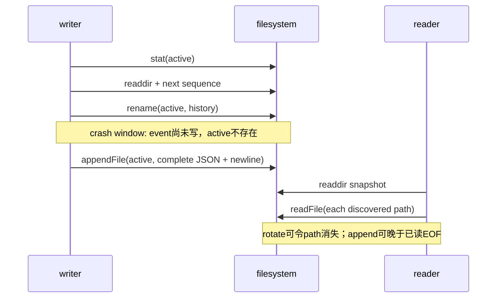

# RFC #544 R4 供给侧调查：S1 events 文件契约与恢复

基线：`main@699842eba2eefc242d19f8fa9232bc1d9d5c3bdd`。唯一设计锚点：`AGG-544-gui-observability-gateway.md` §1.2/1.3、§3.1、§4.3、D6 与裁决 B/E/G。本报告只判断现存 events 供给，不设计 GUI reader/SSE。

## A. 主 agent 摘要（不超过一页）

### 问题与结论

**问题**：main 的 event ADT、落盘、滚动、发现、排序、读取及崩溃/并发恢复，能否直接作为 §3.1/§4.3/D6 中“网关直读 events JSONL、daemon-down 仍可读、跨段无丢无重”的稳定地基？

**结论：部分符合，不能整体当作稳定网关地基（高置信）。** 已有资产真实存在且适合保留：精确 ArkType 事件 ADT/parse 边界、五 kind、当前 **52** 个 type、统一主流路径、导出的段常量/命名解析/发现/排序/轮转判定，以及串行完整行条件下的日界与 32MiB 连续性。可是现存契约没有定义或实现网关增量读取所必需的恢复语义：

1. `queryObservabilityEvents` 对任意非空 partial line、非法 JSON、旧 schema event 都是整次 throw；一个尾部撕裂行即可让全部历史不可读。没有“仅容忍 active 尾部 partial”的边界，也没有坏行隔离/错误 ADT。
2. rotate 是 `stat → discover next sequence → rename → append`，append 是另一步；无锁、无单 writer 类型/进程断言、无临时文件/提交标记。并发 writer 可竞争同一 active/sequence并**静默丢事件**；隔离实验已复现。
3. 崩溃窗口包括 rename 后、append 前：历史段已提交但 active 缺失；这本身可发现，却没有 cursor/checkpoint/恢复协议说明消费者应如何判定新 active、重试 ENOENT、去重。
4. 发现是一次 `readdir` 快照，读取逐文件 `readFile`；与 rotate/append 并发时存在路径消失、读到旧 EOF、遗漏本次新 active 等窗口。静态 API 不能证明 fs.watch + offset 的无丢无重。
5. “唯一 writer”只是架构文字/daemon 习惯，不是可执行保证。daemon 同进程的 socket handlers、scheduler callbacks、fatal sync path均可落到同一文件；实现没有 writer mutex。另有两个 failure JSONL，`logs.query` 才合并它们，而 §3.1 图只画主 `events.jsonl`；直读主流不会看到这些诊断事件。
6. 跨流合并只按 `ts` 排序；同 timestamp 返回依赖稳定 sort 的输入流拼接次序，事件信封没有全局 sequence。段内顺序是 append 顺序，但 timestamp 不提供跨三个文件的因果序。
7. daemon-down 时，**完整且 schema-compatible、未在读取中被改名的现存文件**确实可由纯文件函数读取；但“events 历史照常可读”在 partial/corrupt/legacy schema 时不成立。因此这是受条件保证，不是 D6 所需的恢复保证。

### 简明因果与影响

根因不是缺少导出符号，而是“串行 batch query 契约”被提升成“并发增量日志协议”：命名/排序解决了静态段集合的顺序，却没有定义写提交点、单 writer/锁、尾部撕裂、读写竞态、cursor 与 schema 演进。当前影响是现有 CLI/status 查询偶发整批失败或吞写失败；未来影响是 SSE gateway 无法仅靠已导出 helper 证明 reconnect/rotate/crash 下无丢无重。

### 纯证明缺口 vs 当前缺陷

- **当前可复现缺陷**：并发 rotate 丢事件；partial line 使 query 整体失败；主流直读遗漏两个 failure 流。
- **静态不可判定/纯证明缺口**：单 daemon 真实负载是否从不并发触发 rotate；OS 对单次 `appendFile` 完整 JSONL 行的原子性/持久性；kill 各系统调用点后的精确结果；fs.watch 平台事件合并行为。现有测试未覆盖这些条件，不能把绿测当证明。

### 可保留资产、未知与下一步

可保留：`ObservabilityEventBoundary`/kind/type ADT、`make/parseObservabilityEvent`、segment ADT、32MiB 常量、new/legacy 文件名 parser、sequence 排序和串行轮转测试夹具。未知项须以最小隔离 fault/concurrency harness 判定：kill-at-write/rename/append、reader-vs-rotate、同进程多 producer、跨重启 legacy schema。主 agent 需要裁决的是：D6 是否要求供给先补成可恢复 append-log 契约，还是允许 D6 consumer 自担重试/partial/cursor/多流合并；这不是本调查可自行决定的需求。

## B. 证据附录

### B1. 逐条设计三态对照

| 设计依赖 | 三态 | main 事实与边界 |
|---|---|---|
| 精确事件 ADT，外部输入边界 parse | **符合** | `src/observability.ts:280-297,823-829,898-920`。信封 base 为 `ts/chain?/item?/runId?/phase?/subject?`，payload 与 identity union 相交；未知输入在 `parseObservabilityEvent` assert。当前 type boundary 为 52 项（`src/observability.ts:25-140`），故 AGG “44 种”已漂移。`ts` 仅是 string，schema 不验证 ISO。 |
| daemon 是 events 唯一写入方 | **部分符合** | 产品调用点集中于 `src/daemon.ts:1330,1358,2285-2313`，主流经 `recordObservabilityEvent*`；但导出 append API 无 owner 限制，且无 mutex/lock。另有 lifecycle/runner failure 两条文件流（`src/runtime-paths.ts:130-132`）。 |
| active/历史命名与发现 | **符合（静态集合）** | active 为 `events/events.jsonl`（`src/runtime-paths.ts:117-132`）；new history 为 `stem-16位sequence-start-end-uuid.jsonl`，legacy 无 sequence（`src/observability.ts:1279-1305`）；目录不存在返回空，未知文件忽略（`:1308-1320`）。 |
| 段确定排序 | **部分符合** | legacy 先按 start/end/name；new 再按 sequence；active 最后（`:1337-1353`）。重复 new sequence直接 throw。legacy 永远整体排在 new 之前，即混合代际时不是按时间全序；同段/同 timestamp 事件只保留文件行序，无 event sequence。 |
| 日界/32MiB 翻段 | **符合（串行正常路径）** | 判定比较文件 mtime UTC date 与 event `ts` 前 10 字符，或 `size + pendingBytes > 32MiB`（`:1246-1277`）。因此日界基于 mtime，不是首/末 event timestamp；系统时钟倒退、mtime 外改、非 ISO `ts` 均无强约束。单个超大 event 在空 active 时不轮转（size=0 早退），故“active bounded 32MiB”并非绝对成立。 |
| 写入原子性/提交 | **不符合** | async/sync 都是 rotate 后 `appendFile`（`:931-950`）；rename 与 append 之间无事务、fsync、commit marker，进程崩溃可留下仅 history、无新 event。对 tolerant API，错误只写 stderr并返回成功（`:923-929,938-943`）。 |
| 并发 writer 假设与锁 | **不符合** | 无锁、队列、open fd owner 或 CAS。`nextSequence` 从目录计算（`:1255-1257,1356-1358`），两个 writer 可取同 sequence并争用 rename。实验复现一个 event 被 stderr 降级且调用方无失败。 |
| partial line / corrupt line 恢复 | **不符合** | reader `readFile → split → JSON.parse → boundary assert`，除空行外任何坏行终止整次查询（`:953-965`）。没有 active-tail 特例、坏段隔离、offset/error result。 |
| 进程崩溃/重启恢复 | **部分符合** | rename 原子地保住旧 active 内容，重启后 discover 可找 history；但没有修复 partial、重命名/append窗口、重复 sequence、旧 schema。fatal 使用 sync writer意图在 exit 前落盘（`src/daemon.ts:2297-2322`），但 tolerant wrapper吞落盘错误，注释“guarantee durable storage”强于实现（无 fsync，且 wrapper不 throw）。 |
| legacy segment | **部分符合** | 文件名 legacy 被识别且 deterministic tie-break（`:1299-1305,1338-1343`）；事件内容仍须通过当前 boundary，未提供 schema version/migration，因此“legacy filename readable”不等于“legacy event readable”。 |
| daemon-down 已有文件可读 | **部分符合** | `queryObservabilityEvents`只用 FS，不依赖 daemon/SQLite；完整兼容文件可读。`buildStatusEventsSnapshotFromRecords`也直接调用并把异常转成 `error`（`src/loop.ts:3592-3615`）。CLI `logs` 则强制走 daemon RPC，daemon down 不可用（`:2138-2163`）。 |
| D6 跨 rotate/reconnect 无丢无重 | **静态不可判定且现状不足** | 导出只有 segment snapshot/query helper，没有 cursor（segment id+offset）、tail parser、watch recovery或读写同步。文件名顺序测试不能证明增量消费语义。 |

### B2. 全部生产写入口与消费者

**写入口**（`rg 'appendObservabilityEvent...' src`）：

1. unified 主流：`Daemon.recordObservabilityEvent` tolerant、`recordObservabilityEventOrThrow` timer-owned强失败、`recordFatalSync` sync tolerant（`src/daemon.ts:2285-2313`）。scheduler 事件由 `onEvent` 映射并调用前两者（`:3728-3743`）；其他 daemon handler最终同样走该私有入口。
2. runner persistence failure 流：sync throwing 写 `runner-persistence-failures.jsonl`，失败仅 stderr（`:1314-1334`）。
3. lifecycle persistence failure 流：sync throwing 写 `lifecycle-event-persistence-failures.jsonl`，失败仅 stderr（`:1342-1362`）。
4. `src/observability.ts` 导出四个通用 append 函数；生产 src 中无 daemon 以外调用，但类型/运行时不强制 owner。

**当前消费者**：

- daemon 启动读取两个 failure 流最后一项（`src/daemon.ts:1309-1312,1337-1340`）；任一坏行会使 daemon start 失败，因为 query 整体 throw。
- daemon `logs.query` 读取主流+两 failure 流，拼接后仅按 `ts.localeCompare` 排序（`:2712-2727`）。同 timestamp 无显式 tie-break；三流 path 信息不会随 event返回。
- CLI `coder-loop logs` 不读文件，轮询 daemon RPC；follow 用“上次数组长度”slice，全量重查，若历史集合变化/legacy加入/过滤结果缩短，cursor 语义不稳（`src/loop.ts:2138-2163`）。
- status snapshot builder 直接查询主流、取目标 run 最近 20 项，异常转 status error（`:3592-3615`）；这是现有内部文件消费者。
- 测试与集成脚本大量直接调用 query，不是生产消费契约。

### B3. 事务、锁、迁移与崩溃窗口



无锁/事务/迁移协议。rename 能原子移动一个路径，但不能把“旧段封存 + 新事件提交”组成原子操作；也不能协调两个 writer或 reader。旧 schema 没有 envelope version，boundary evolution即读取兼容性的隐式 breaking point。

### B4. 最小隔离实验

实验文件：`/tmp/rfc544-events-experiment.ts`（运行后隔离数据目录已清理；脚本仅 import main source并操作 `/tmp/rfc544-events-experiment`）。命令：

```sh
bun /tmp/rfc544-events-experiment.ts
```

观察：

- 预置超 32MiB active 后并发 `Promise.all([append(a), append(b)])`：两者均取 sequence 1；一个 rename 得 `ENOENT`，tolerant writer只打印 `observability write failed`；query仅含初始 event 与另一个 stop event，**a 丢失**。
- 完整首行 + `{"ts":"broken` 尾行：`queryObservabilityEvents` 抛 `SyntaxError: JSON Parse error: Unterminated string`，完整历史也不返回。

副作用：只创建并删除上述 `/tmp` 数据目录；未触碰生产 `~/.coder-loop`、产品代码、测试或配置。

### B5. 测试覆盖、同错与盲区

`tests/unit/observability/observability.test.ts:29-295` 覆盖 runtime schema基本 roundtrip、query过滤、串行日界轮转、new sequence排序、legacy同 timestamp文件名排序、async/sync各自串行轮转及完整 event sequence。它真实证明“受控完整文件 + 单 writer串行调用”成立。

盲区：并发 append/rotate、reader-vs-rename、partial最后一行/中间坏行、kill各阶段、fsync持久性、单 event >32MiB、时钟倒退/mtime漂移、duplicate sequence恢复、旧 payload schema、多流增量合并、same-ts全序、daemon-down CLI、fs.watch丢/合并事件、cursor reconnect。测试与实现共享 `discover/order/query` helper，因此可能同错：用同一排序实现写 next sequence并读回，只能证明内部自洽，不能证明外部 watcher协议或真实因果顺序。

### B6. 证据索引与置信边界

- ADT/parse：`src/observability.ts:25-140,280-297,823-920`
- append/query：`src/observability.ts:923-975`
- rotate/name/discover/order：`src/observability.ts:1246-1363`
- paths：`src/runtime-paths.ts:117-138`
- daemon writers/failure streams：`src/daemon.ts:1309-1362,2285-2347,3728-3743`
- current consumers：`src/daemon.ts:2679-2727`; `src/loop.ts:2138-2163,3592-3615`
- tests：`tests/unit/observability/observability.test.ts:29-295`
- experiment output：本次命令输出记录（race ENOENT + missing event；partial JSON SyntaxError）。

高置信项来自源码控制流与可复现实验。OS crash durability、真实 workload并发频率、Bun/macOS fs.watch行为未做破坏性/平台 fault injection，明确保留为未知，不能据静态代码宣称成立。
