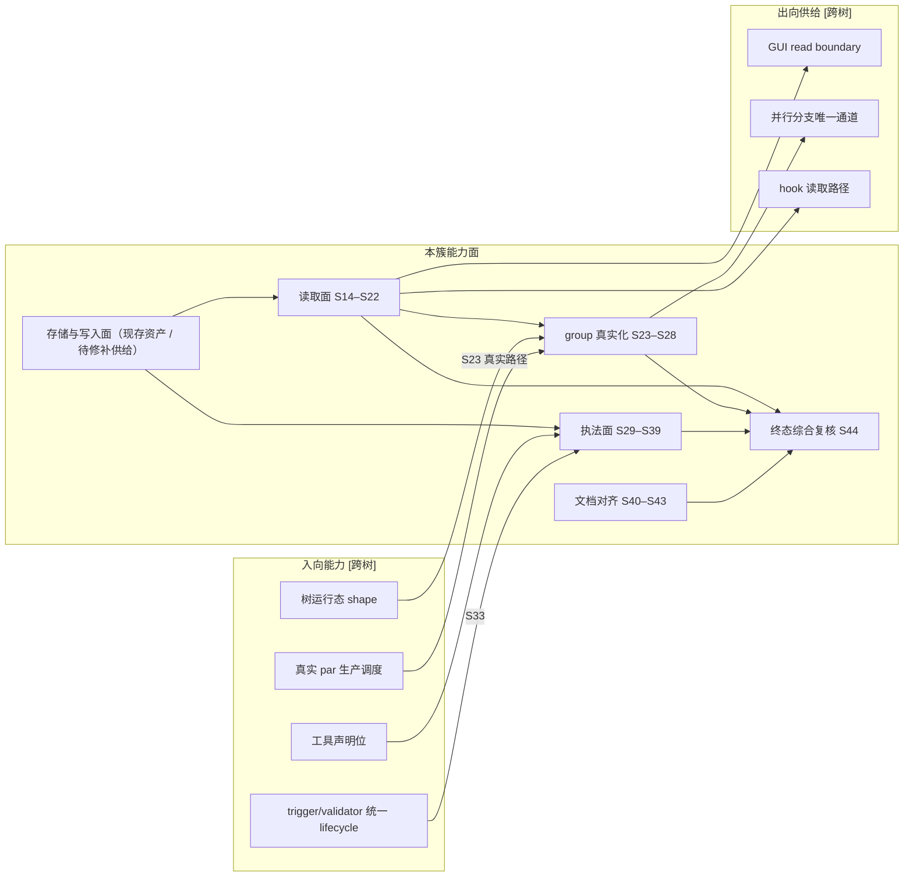

# SYNTH-545 聚合稿:v3 context 共享 CLI(全局视角)

唯一信息源:`v3-issue/synthesized/SYNTH-545-context-shared-cli.md`。本稿剥离 issue 树包装,把本 RFC 的设计不变量、现存资产与待修补供给、全部交付标准、能力级依赖聚合为单一视图,服务后续从全局重新拆分。跨树依赖一律以能力表述并标注 **[跨树]**,不核实对方树的实际状态;编号痕迹与出处对照见同目录 `materials.md`。R8 已把聚合稿中的伪分叉收敛为稳定合同；第 8 节记录 K1–K5 的唯一处置，不保留待操作员选择项。

## 1 目标

操作员 verbatim(2026-07-02,v3 目标 4):

> "然后可选的 prompt 要求必须调用某种特殊定义的 CLI 工具用于 context 共享,这样独立运行的无状态 agent 也有一定程度上的 context 传递能力。"

一句话:引擎经 daemon socket 提供结构化 context 服务——agent 用 CLI 写入/读取带作用域的 context entry,使独立运行的无状态 agent 在 chain 生命周期内有受控的上下文传递能力;envelope 引擎类型化,body 引擎永不解析;prompt 可按 phase 声明「必须调用」,引擎在 run 收尾点执法。

## 2 设计不变量(D1–D15)

以下是本 RFC 已裁定、不随任务拆分变化的设计事实。每条自包含。

- **D1 并存定位与通道分类**:context CLI 与 `shared.md` 并存不替代。`shared.md` 是 chain 级自由 prompt 注入面——运行时决定内容,引擎与 preset 对其零行为定义,不进入 context entry 的 scope、授权或流转语义。context CLI 是并行分支间唯一的结构化、受控、可审计上下文通道。git 工作产物与 GitHub 面是产物通道,不属 context;push 到 origin 的闭包分支 ref 属声明通道,agent 未发布的自建 ref 是 escape 类。「不存在文件系统旁路」是对**引擎**的可证断言(引擎递出的每个跨任务面必须显式分类),不是对 agent 行为的断言。
- **D2 scope 闭集**:`item`(同一 item 跨 run/跨 phase 谱系)+ `chain`(跨 item 链级公告)+ `group`(并行分支组内通信,scope 键 = par 节点物化时的稳定容器 id)。不设 `run` scope、不设跨 chain(chain 是隔离边界)。并行汇合(join)后下游对上游分支 entries 的可读性由 chain 内自由读天然覆盖,无 join 专属契约。
- **D3 授权无粒度**:author(operator | agent 含 chain/item/run/phase)仅由凭证解析路径构造,不可自报;主体沿用 `operator | agent(run)` 两类,不新增第三类。agent 可见范围恒等于凭证所属 chain;operator 无凭证路径全量读写任意 chain。不扩展 `[phases.rights]`。
- **D4 「必须调用」执法**:执法对象是工具的确定性输出条件(outcome)。context CLI 的 outcome = entry-existence:该 run 凭证 author 下存在至少一条 entry。`required` 下 outcome 不成立 → run 收尾判失败,进现有指数退避重试,耗尽 attempts 落 exhausted 终态;`expected` 下不成立 → 仅发 validation 事件。执法点是 run 收尾(与凭证吊销同一收尾路径,证据窗口与判定窗口闭合于同一点,无迟到证据、无判定后补写);与 phase 种类无关,对一切 run 一视同仁。引擎只求值输出条件,不验内容质量、不追问调用动作。读取无输出条件,不在 `required` 可执法域——「必须读」是 prompt 纪律;未来若需 required-read,须先给读定义真实输出并回 RFC 层裁决。
- **D5 body 不透明**:引擎对 body 逐字携带、永不提取语义——不做正则、不识别 marker;body 内出现状态字面量或控制记号没有任何效果,不得影响任何调度或状态决策(内容通道 ≠ 流转信号)。
- **D6 append-only 与生命周期**:entry 不可更新、不可删除;唯一删除通道是 chain 级联清除。entries 与 chain 同生共死,无独立 GC。
- **D7 一律经 socket**:写与读均经 daemon socket 命令面,文件系统上不存在可直写对应物;新命令进编译期穷尽鉴权分类;每次写入判定(接受与拒绝)emit 审计事件。context 读是 agent 可用的 A 域命令面;引擎事件流(B 域)对 agent 凭证仍硬拒绝,两面不混。
- **D8 拉取制**:agent 按条件过滤查询;引擎不把 entry 内容渲染进 prompt。经 doc-binding 机制注入的是可执行寻址文档而不是内容：覆盖真实 append/read CLI；credential 自动推导的参数明确说明无需填写，CLI 要求显式 stable key 时提供本 run 当前合法值，无合法 scope 时明确不可用且不猜测、不合成、不 fallback。
- **D9 大内容**:body 不设引擎自造的任意字节上限、永不截断。若存在经实测和文档确认的真实外部协议边界,admission 必须点名该边界并显式拒绝。证据类大内容走既有 evidence 路径,entry 只携带引用。
- **D10 查询过滤闭集**:scope variant + stable key、author subject/phase、`after` cursor;无 topic/tag、无 offset、无自由查询串。`pageSize` 是每次请求的显式正整数,无引擎默认 magic number、无总结果截断;cursor 是稳定 keyset,响应返回 `nextCursor | exhausted`,可持续翻页至穷尽。transport 出现真实单响应限制时须引用该限制并以 boundary error 暴露,不得静默缩页。
- **D11 scope 键解析有效**:落库 entry 的 scope 键解析到本 chain 内真实存在的寻址对象,不存在指向虚空的 entry,无隐式"猜当前 group"或静默 fallback。写命令显式提交 scope variant;`item`/`group` 同时提交目标稳定 ID,`chain` 无额外 key。不存在可寻址 par 容器时,group 写入在 admission 一律拒绝并点名原因。
- **D12 区域共享不承担后继交付**:context 只承载区域内共享信息,不承载"前驱完成时必须交付给后继"的必需输入,不参与完成判定、路径选择或后继 prompt 构造。前驱到后继的信息流归任务转移(类型化 `exit.*` 对象与 transition commit);context entry 不得替代、补齐或伪造 transition state。
- **D13 边界重述**:每个 agent 运行仍是无状态的;持久业务语义仍只依赖 GitHub。context entries 是引擎自有的、chain 生命周期内的受控中间态——影响下游判断质量,不承载持久业务语义、不承载流转信号,删链即消失,agent 不得当持久事实源。A 域"引擎不收编"修订仅限「跨 run 传递」子类的传输与存储由引擎服务(envelope 结构化、经 socket、可审计),语义仍不解析;trace / evidence / `shared.md` 维持原状。B 域边界不变。
- **D14 代码红线**:全链路 ADT,禁止类型退化。无 `any`/匿名形状;`unknown` 仅限 catch 与边界 parse 入口;禁真 `as` 断言(`as const` 除外);外部输入经 arktype 边界 parse 为精确类型后流转;封闭 union 穷尽消费。
- **D15 接口归属与演进**:read API 及其 JSON shape 归本簇——socket 读命令的返回 boundary(arktype)即 GUI 消费契约,GUI 侧纯消费。首版 envelope 无自由 topic/tag;真实新场景出现后走新增 ADT 字段流程演进,不预埋松散字符串。

## 3 当前实现地基与已证偏离

PR #677（merge `d381d06c`）引入了 envelope ADT、SQLite 表、socket append、begin/chunk/commit、credential-derived socket author、基础 scope admission、audit 事件与 chain cleanup。R7 在固定基线复核后确认这些只是可保留的局部资产，当前存储与写入保证仍有以下偏离：

- public store append/delete 可绕过 socket authority 与 append-only lifecycle；soft chain delete 与 context cleanup 分事务，crash/restart 可留 residue；item delete 与 schema 不守 context 引用完整性；
- commit、audit、response 不在同一 durable result boundary，caller 可能失败而 entry 已存在；disconnect/restart 不清未完成 session；JSON escaping 可使合法 body 的固定分块越过 request boundary；
- persisted schema 接受集合宽于 typed parser，单个 malformed row 可使整链 list 失败，生产存量是否含异常 row 未知；
- group 仍一律拒绝且无真实 producer/membership/read；公开 read、tool declaration/outcome/finalize 与 context doc-binding 均未实现。

v2 仍可复用的地基包括 run credential mint/env/daemon解析、typed command authorization、审计事件基础、doc-binding 先例、`shared.md` 创建机制与 chain soft-delete 事实。上述资产只证明其局部行为；每项可依赖保证与所需 runtime proof 见 `r9-expected-foundation.md`。

## 4 统一交付标准池

每条标准一个 ID,标注:证明哪条不变量、状态、出处(草稿内位置,详见 `materials.md`)。带 **[R#]** 标记的行是 RFC 关闭终态条件,无论此前是否验过,终态都须在冻结 SHA 上复核(见 4.6)。

### 4.1 已有实现的存储与写入面（R7 复核状态）

| ID | 标准 | 证明 | 状态 |
|---|---|---|---|
| S01 | 写入经 CLI 落库且 author 从凭证推导;自报 author 字段无效或被拒 **[R1]** | D3 | 偏离：socket author成立，public store authority不成立 |
| S02 | append-only:不存在 agent 或 operator 可达的 entry 更新/删除路径 **[R3]** | D6 | 偏离：存在active-chain独立delete旁路 |
| S03 | chain delete(软删路径)后该 chain entries 全部清除,他 chain 无损 **[R8]** | D6 | 部分成立：成功路径清除，crash/restart可留residue |
| S04 | operator 无凭证写任意 chain,author subject = operator **[R7 写半边]** | D3 | socket路径成立 |
| S05 | 多 MB UTF-8 body 逐字 round-trip,无截断、无 context 任意 hard cap | D9 | 部分成立：DB不截断，request escaping存在反例 |
| S06 | scope 键存在性:指向不存在 item 的写入被 admission 拒绝并点名 | D11 | 部分成立：socket begin校验，store/schema不守引用 |
| S07 | v2 无 par 容器时 group 写入一律拒绝,错误点名原因 | D11 | 当前 hard reject 成立；原因过宽且不能供真实 group |
| S08 | body 不透明:状态字面量 / `FINALIZER SUMMARY` entries 不改变 schedulerTick 的调度、状态、trigger 判定基线 **[R4]** | D5 | 当前生产路径成立；未来consumer仍需负向证明 |
| S09 | 写入判定接受/拒绝各 emit 审计事件,含结果与原因 | D7 | 偏离：entry与audit/result可分离 |
| S10 | envelope 封闭 union 穷尽消费,author 无公开构造路径,零红线违例 | D14 | 部分成立：ADT资产存在，public store仍可自报author |
| S11 | schema 迁移事务内保全既有 chains/items/runs 数据,重开幂等 | — | 合法fixture成立；历史malformed存量未知 |
| S12 | socket 提前 end/close(响应未齐)拒绝而非挂起 | D7 | partial response reject 成立；commit result/session 恢复不在此证明内 |
| S13 | `shared.md` 创建与注入行为零回归 **[R9]** | D1 | 已在R7/P-03固定基线复跑；冻结SHA仍须复核 |

### 4.2 读取面(未落地)

| ID | 标准 | 证明 |
|---|---|---|
| S14 | scope 过滤读取成立:item 谱系跨 run 可读;chain-scope 跨 item 可读;跨 chain 零可见 **[R2]** | D2/D3 |
| S15 | agent 越 chain 对抗:请求中显式指定他 chain 标识无效或被拒,结果仍限凭证所属 chain(daemon 推导,不依赖调用方自觉) | D3 |
| S16 | operator 无凭证读任意 chain;返回 JSON 过 arktype boundary 断言,shape 即 GUI 消费契约 **[R7 读半边]** | D3/D15 |
| S17 | 过滤维度逐一生效:scope、author subject/phase、after cursor 各构造命中/不命中;boundary 外参数被 parse 拒绝,无隐藏过滤参数 | D10 |
| S18 | 分页游标稳定:显式正整数 pageSize 翻页至 exhausted;翻页间新写入不导致已有 entries 漏读或重复 | D10 |
| S19 | prompt 零内容注入(对抗):store 预置唯一 sentinel body 后渲染各 phase prompt,产物零 sentinel 命中 | D8 |
| S20 | 请求与返回均为精确 arktype schema,无匿名 object;typecheck 绿 | D14 |
| S21 | 读命令进编译期穷尽鉴权分类且 agent 可用(区别于事件流对 agent 硬拒绝) | D7 |
| S22 | shape 变更纪律:返回 boundary 后续变更须在 PR body 显式列 diff(GUI 消费依赖) | D15 |

### 4.3 group scope 真实化(未落地)

前提检查:树运行态 shape 契约(par 容器稳定 id 存储位与谱系表示)已成文在手——即 CAP-IN-2 可消费。

| ID | 标准 | 证明 |
|---|---|---|
| S23 | 真实同组互见:由真实 `par` 调度物化容器并产生两分支 run credential；两分支各写 group entry 后互相按 group 读且双向命中，scope 键为并行结构层赋予该 run 的真实容器稳定 id。直接 store/tree fixture 仅能证明 durable shape、解析与局部 admission，不证明本标准 | D2 |
| S24 | 组外不命中:同 chain 容器外 item 的 run 按 group 过滤不命中该组(chain-scope 读仍可见——scope 是过滤维度,非可见性边界) | D2 |
| S25 | 键解析校验:显式指定不存在的 group 键写入被 admission 拒绝并点名容器不存在,不产生指向虚空的 entry | D11 |
| S26 | 拒绝分支不变:无容器 item 的凭证推导路径写 group,拒绝语义与已落地 S07 完全一致,无"树存在与否"双路径兜底 | D11 |
| S27 | join 后下游可读零新增契约:容器 terminal 后,同 chain 后续 run 经 chain 内自由读命中上游分支全部 entries,无 join 专属读取逻辑 | D2 |
| S28 | 容器谱系遍历对树节点 ADT 穷尽 switch,新增节点 variant 由编译器暴露处置点 | D14 |

### 4.4 required|expected 执法(未落地)

| ID | 标准 | 证明 |
|---|---|---|
| S29 | capability 注册:context CLI 是引擎闭合 capability union 成员,携带覆盖读写两面的用法文档内容;成员经穷尽 switch 消费 | D4/D14 |
| S30 | required 执法:声明 required 的 phase 正常退出(exit 0)但未写 context → run 判失败进现有退避重试,耗尽 attempts 落 exhausted;audit/validation 事件写明"缺 required context 写入" **[R5]** | D4 |
| S31 | expected 执法:未写 → 仅 validation 事件;调度、状态、attempts 零影响 **[R6]** | D4 |
| S32 | required 满足零干预:run 写入一条 entry 后正常退出 → 成功推进,无失败标记与退避 | D4 |
| S33 | 一视同仁:对 trigger / validator 类 phase 声明 required,其 run 未写 → 同样判失败;源码无按 phase 种类豁免或特判分支。该标准保持不变；实际运行证明等待 CAP-IN-4 提供统一 lifecycle | D4 |
| S34 | 判定不看 body:body 为空白/控制记号的 entry 使 required 通过;本 run 未写时无论他 run 写多少仍判失败——判定事实仅为"本 run 凭证 author 下存在性" | D4/D5 |
| S35 | 未声明零扰动:无 toolRequirements 声明的 phase,run 收尾路径行为与现状完全一致 | D4 |
| S36 | 用法文档注入:声明该工具的 phase 渲染 prompt 时输出真实 context CLI 读写用法及本 run 可执行寻址说明；自动推导参数与显式 stable key 逐项明确，无合法 scope 明确不可用；不含任何已有 entry 内容 | D8 |
| S37 | outcome 双向证据闭环:对 required 工具分别使 outcome 成立/不成立 → run finalize 分别通过/失败;provider 不参与判定 | D4 |
| S38 | 失败通道复用:required 判失败走现有退避/exhausted 机制,不自立失败通道 | D4 |
| S39 | capability union 穷尽 typecheck 绿,无 stringly 工具名分支 | D14 |

### 4.5 文档对齐(未落地)

| ID | 标准 | 证明 |
|---|---|---|
| S40 | CLAUDE.md 无状态前提节按 D13 替换改写:受控中间态例外及其四个边界写入前提本文,无新旧叠层 | D13 |
| S41 | docs/ 每处 shared.md/handoff 叙述现场并存分工一句到位(或逐点确认无需改,结论留证);无残留"唯一传递通道"类断言 | D1 |
| S42 | preset 作者手册含 context 命令面与 required\|expected 执法语义的作者视角说明;新增 binding/doc builder 按计数守护流程入册,`bun test` 计数守护绿 | D8/D4 |
| S43 | 文档实态一致:对照实现后的命令面(`--help`)核对,无凭记忆写入的漂移;全文 no-legacy(读起来像第一次就这么写) | — |

### 4.6 终态综合复核(未落地)

| ID | 标准 | 证明 |
|---|---|---|
| S44 | 在冻结 SHA 上逐条复核 R1–R9(即池内全部 **[R#]** 行)以及真实路径标准 S23，并留可重跑证据；任一行不成立回到拥有该契约的能力面修复，不在综合验收中写产品修复。S23 的真实 `par` 路径是唯一 group 行为证明，fixture 不形成另一种完成口径 | 全部 |

**repo 流程门**(CLAUDE.md 钉定,非本簇能力,重拆时照抄边界):跨 child 的 v3 新语义接缝由专用整链路 integration 验收在冻结合流 SHA 上证明;现有 bundled preset 兼容性由专用 compatibility 验收在发布候选 SHA 上运行 `bun scripts/real-e2e.ts` 证明;单个 implementation issue 不运行 real-e2e,且正文必须含「本 issue 的验证边界」节与命令级结论。

## 5 入向能力依赖 [跨树]

本簇消费、但由其他 RFC 树实现的能力。只翻译本文件已有的语义,不核实对方树状态;编号痕迹见 `materials.md`。

| 能力 | 定义(自包含) | 本簇消费方 |
|---|---|---|
| **工具声明位** | `[[tools]]` 注册表 + per-phase `toolRequirements`(`required \| expected` 词表);编译期依据工具有无 outcome 判定可执法性(required 仅对定义了 outcome 的工具合法);`toolRequirementsDoc` doc builder 的 per-phase 切片承载用法文档注入 | 执法面(S29–S39、S36) |
| **树运行态 shape** | 并行结构层未来给出的权威容器身份与归属结论、稳定 id 存储位与谱系表示(节点 ADT)；本簇只消费上游结论，不从可表达 ancestry 自造 membership集合或基数 | group 真实化(S23–S28) |
| **真实 par 生产调度** | par 容器物化、并行 branch run 真实产生并持有凭证 | group 真实化的真实路径验证(S23) |
| **trigger/validator 统一 lifecycle** | trigger 与 validator run 迁入统一 scheduler run lifecycle,具备凭证与统一 finalize 收尾点 | 执法"一视同仁"(S33)的可验证前提 |

## 6 出向能力供给 [跨树]

本簇交付、被其他 RFC 树消费的能力。供给内容变更须对消费面显式声明。

| 能力 | 定义(自包含) | 外部消费方 |
|---|---|---|
| **GUI read boundary** | socket 读命令的 arktype 返回 boundary(envelope 全字段 + 分页游标)即 entries 展示面的消费契约;展示面纯消费不定义;shape 变更须显式列 diff | GUI 展示面(RFC-5 树) |
| **并行分支唯一通道承诺** | context CLI 是并行分支间唯一的结构化、受控、可审计上下文通道(已裁通道边界的供给侧义务) | 并行结构语义(RFC-1 树) |
| **hook 读取路径** | hook 以 operator 身份经本 CLI 普通读取面读共享 context,零新增契约 | hook 机制(RFC-4 树) |

## 7 能力面与依赖总览

## 8 K1–K5 收敛处置

- **K1 真实 group 证明**：真实 `par` 路径证明是既定目标，不是完成口径选择。S23 只由真实调度物化的容器、两个 branch credential 与双向写读证明；fixture 仅为其实际覆盖的 durable tree、identity parser、admission 等局部主张提供证据。S44 在冻结 SHA 复核 S23，不另造第二条 group 完成标准。
- **K2 一切 run 的执法范围**：D4 与 S33 保持对普通、trigger、validator run 一视同仁。当前 chain-complete trigger/validator 尚无统一 lifecycle 是外部能力缺失，不把稳定范围缩窄，也不形成归属选择。
- **K3 跨 RFC 账目**：trigger/validator 统一 lifecycle 是 CAP-IN-4 的供给义务；本簇只保留 S33 的消费与运行证明义务，不从重复草稿生成独立产品标准。
- **K4a group 合法身份**：最近祖先与全部祖先候选均删除。runtime fixture 能表达多个结构祖先，不等于合法 source 允许嵌套 `par`，也不等于一个 run 获得多个通信 membership。本 RFC 不定义并行数学，只消费并行结构层未来给出的权威容器身份与归属结论，并在 daemon 重新验证；归属基数仍由该上游结论定义。
- **K4b prompt 可执行寻址**：唯一合同是 D8/S36 所述可执行寻址文档。静态 CLI 用法之外，显式 stable key 必须给出当前合法值；自动推导参数必须说明；无合法 scope 必须说明不可用。author identity 标签、`run` scope、entry 内容均不进入该合同。
- **K5 无定义残留**：没有权威定义的旧编号与外部 issue 引用不构成能力或交付标准，正文不保留它们。

## 9 范围外

- `shared.md` 的任何机制改动——"chain 级自由 prompt 注入面"重定位是定位陈述,不是实施项。
- evidence / issues 目录与其余 A 域文件资产——维持 FS 约定不收编。
- 并行结构标识与并行通信的唯一性裁决——归并行结构 RFC(本簇只消费其裁决结果)。
- 「必须调用」的 DSL 声明语法与装载校验——归 DSL RFC(本簇消费其声明位,即 CAP-IN-1)。
- entries 展示面——归 GUI RFC(本簇只供给 read boundary)。
- `gh-issue-pr-iteration` 的 Intent/Result handoff 纪律是否迁移——独立 preset 产品决策,不阻塞本簇,本簇不静默改变 `shared.md` 纪律。
- v2 audit 修复树的缺陷——与本簇并行不悖,不吸进范围。
