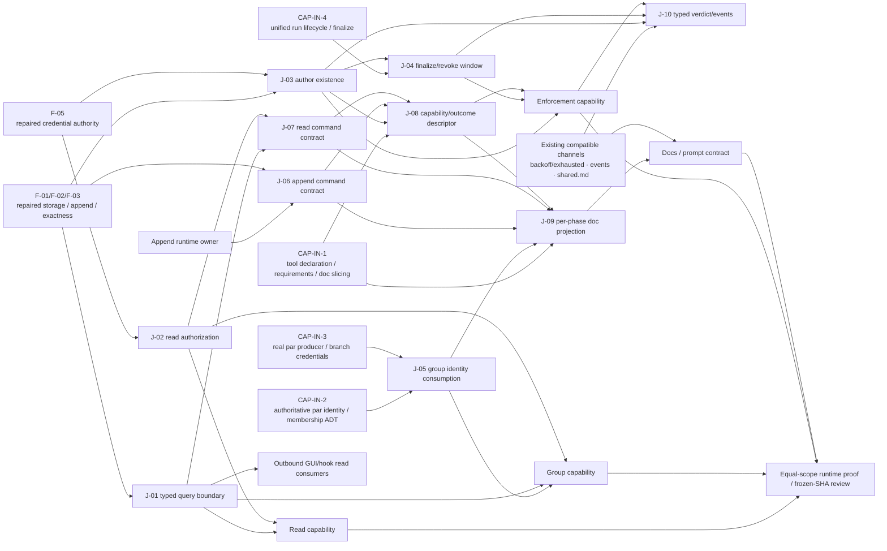

# RFC #545 R11：供需汇合图

本文只汇合 `aggregate.md`、`r9-expected-foundation.md`、四份 `r10-*-needs.md` 与 R9 独立复核 PASS。它描述能力供需、共享接缝及外部输入，不描述实现方案、PR 规模、issue 拆分或施工顺序。

## A. 一页摘要

### A.1 分类口径

每个 R10 原子需求只标一个**唯一主类**：

- **直接复用**：R9 明确列为现存、可保留且该原子需求不再等待修补的保证。存在代码形状、惯例或 fixture 不足以进入此类。
- **修补后复用**：合同由 F-01～F-10 固定，但当前实然仍偏离；只有表中点名的 F 保证及其等宽 runtime proof 闭合后，消费方才能复用。
- **过渡兼容**：必须继续消费既有通道或行为，但该既有面不是新能力的权威定义，不能被替代或另造平行语义。
- **消费能力自建**：该原子需求就是本 RFC 的 read、group、enforcement 或 docs 消费能力应建立的合同；Foundation 只固定目标或提供底料，未实现机制不得称为“复用”。
- **地基仍缺**：原子需求的权威事实或统一 lifecycle 由 CAP-IN 外部能力供给；本 RFC 不能本地猜补，也不能弱化需求。

汇合结论：

1. **没有原子需求可整体标成“直接复用”。** R9 明确可保留的是局部 ADT、credential author、backoff/event/doc-builder 底料及 `shared.md` 机制；四份 R10 的每个原子需求都还包含新合同、修补保证、兼容义务或外部输入。把任一完整 N-ID 写成“直接复用”都会把局部资产外推成未交付能力。
2. read 的主体是**消费能力自建**；稳定 persisted identity 与 daemon authority 是 **F-01/F-03/F-05 修补后复用**，group 子集另受 CAP-IN-2/3 阻断。
3. group 不定义并行数学。权威容器 identity、membership 与真实 branch producer 是 **CAP-IN-2/3**；context 只建立 admission、filter、typed boundary 与真实消费证明。
4. enforcement 不定义工具声明 DSL，也不把普通 run lifecycle 外推到 trigger/validator。**CAP-IN-1** 供声明/编译/doc slicing，**CAP-IN-4** 供统一 lifecycle；本 RFC 建 existence evaluator、verdict、event 和 typed consumption。
   CAP-IN-1 的方向是 registry/member/compiler contract → 具体 J-08 context descriptor member → enforcement；compiler随后读取member是注册数据流，不是反向能力供给。J-10由enforcement生产，不直接依赖CAP-IN-1。
5. docs 只能在 runtime boundary 成为事实后生成/核对可执行说明；`shared.md` 必须过渡兼容并存，不能被 context 替代。
6. 共享责任全部集中到 J-01～J-10。producer 对合同负责，consumer 只消费；尤其 runtime command contract、capability/outcome semantic descriptor 与 per-phase executable doc projection 是三个不同产物，不允许 read、enforcement、docs 各吞半个后形成不同语义。

### A.2 供需总览

| 能力面 | 自建主体 | 修补后供给 | 外部输入 | 主要共享接缝 |
|---|---|---|---|---|
| read | typed query、分页集合、cursor、response、read auth class、恢复与 proof | F-01/F-02/F-03/F-05 | CAP-IN-2/3 仅阻断 group read | J-01、J-02、J-07 |
| group | group admission、group filter、typed 消费、拒绝与真实通信消费证明 | F-01～F-05、F-08/F-10 | CAP-IN-2 identity/membership；CAP-IN-3 producer/credential | J-01、J-02、J-05 |
| enforcement | author existence、verdict ADT、失败通道 adapter、validation event、capability/outcome descriptor | F-01/F-03/F-05/F-07/F-08 | CAP-IN-1 declaration/doc slicing；CAP-IN-4 unified lifecycle | J-03、J-04、J-08、J-10 |
| docs/prompt | per-phase projection、no-legacy、help/schema 对齐、sentinel 与 count-guard 证据 | F-02/F-03/F-08/F-09 | CAP-IN-1；group handle 还需 CAP-IN-2/3 | J-05～J-09 |

## B. 原子需求匹配表

### B.1 Read：N-R01～N-R17

| ID | 唯一主类 | F/CAP 依据 | 供需结论 |
|---|---|---|---|
| N-R01 | 消费能力自建 | F-04/F-05/F-09 | 公开 socket read 及唯一 typed success/failure 面尚不存在；内部 list 不是可复用 API。 |
| N-R02 | 消费能力自建 | F-04 | 单页 entries、排序边界与续页状态的原子观察由 read 建立。 |
| N-R03 | 修补后复用 | F-05（并受 F-01 authority 支撑） | credential-derived chain 是既定权威，但 permissive fallback/分类漂移须先闭合；read 不另造 identity。 |
| N-R04 | 修补后复用 | F-01/F-03 | entry 归属、合法 persisted identity 与不可变排序事实须经修补和 migration/restart proof 后供 cursor 消费。 |
| N-R05 | 消费能力自建 | F-01/F-06；CAP-IN-2/3 | item/chain/group 的 typed filter 由 read 建立；group identity/membership 只能经 J-05 消费外部权威，不能从 ancestry 推导。 |
| N-R06 | 修补后复用 | F-03 | author filter 依赖 credential-derived persisted author 的合法、精确解析；不得以 caller/body 补偿。 |
| N-R07 | 消费能力自建 | F-04/F-10 | 查询闭集、组合交集和非法字段拒绝尚未实现。 |
| N-R08 | 消费能力自建 | F-04 | 稳定全序、opaque cursor、边界及不相容 cursor failure 由 read 定义和证明。 |
| N-R09 | 消费能力自建 | F-04 | concurrent append 的集合纳入规则是 read 未闭合合同，不可从 keyset 形状猜测。 |
| N-R10 | 消费能力自建 | F-04 | `nextCursor | exhausted`、无静默缩页和有限集合终止由 read 建立。 |
| N-R11 | 消费能力自建 | F-02/F-03/F-04/F-05 | request/success/failure ADT 及 failure 分类属于 read boundary；底层 exactness/authority 仅作输入。 |
| N-R12 | 消费能力自建 | F-02/F-04 | 读侧完整 body、真实 response boundary 与失败恢复不能从 append transport 直接复用。 |
| N-R13 | 消费能力自建 | F-02/F-04/F-10 | 完整响应确认、残片拒绝、最后确认 cursor 重试与 restart 恢复由 read 自建；不新增 durable read session。 |
| N-R14 | 消费能力自建 | F-05/F-10 | read 的 A 域 auth class、event-stream 拒绝和穷尽分类是新消费接线。 |
| N-R15 | 消费能力自建 | F-08/F-10；CAP-IN-2 | read owner 以 J-07 单独生产真实 read command contract；docs renderer 经 J-09 消费它并生成合法 scope projection与全 phase sentinel proof；group handle等待 J-05。 |
| N-R16 | 消费能力自建 | F-04/F-09 | 命名 success boundary、shape diff 与穷尽消费者同步是 read 对 GUI/hook 的供给义务。 |
| N-R17 | 消费能力自建 | F-04/F-05/F-08/F-10；CAP-IN-2/3 | read 拥有与其主张等宽的 socket、并发、restart、大 body、auth 与 prompt proof；真实 group 子路径等待外部 producer。 |

### B.2 Group：N-G01～N-G11

| ID | 唯一主类 | F/CAP 依据 | 供需结论 |
|---|---|---|---|
| N-G01 | 地基仍缺 | F-06；CAP-IN-2 | `par` 容器稳定 identity 由并行结构层权威供给；context 不生成或从 ancestry 合成。 |
| N-G02 | 地基仍缺 | F-06/F-10；CAP-IN-2 | membership 集合、基数及节点/归属 ADT 是外部事实；context 只穷尽消费。 |
| N-G03 | 修补后复用 | F-01/F-05/F-06 | credential-derived `agent(run)` 是既定主体，但 authority/runtime proof 未闭合；group ID 不是 capability。 |
| N-G04 | 消费能力自建 | F-01/F-06；CAP-IN-2 | daemon 以 J-05 权威结论建立存在、同 chain、membership 三项 admission 与明确拒绝。 |
| N-G05 | 修补后复用 | F-01/F-02 | group 不另造事务语义；只有 authority、admission/entry/audit 一致性经 F-01/F-02 修补证明后方可复用。 |
| N-G06 | 消费能力自建 | F-04/F-05/F-06 | 精确 group filter 及与公共分页、chain confinement 的组合由 group/read 通过 J-01 统一建立。 |
| N-G07 | 修补后复用 | F-01/F-05/F-06 | chain 隔离、合法引用与 operator/agent 区分须由修补后的共同 authority 供给，不建 group 特权层。 |
| N-G08 | 修补后复用 | F-01/F-03/F-06 | append-only chain lifecycle 与 persisted exactness 修补后承载既有 group entry；容器 identity 稳定性来自 CAP-IN-2。 |
| N-G09 | 地基仍缺 | F-06/F-10；CAP-IN-2 | restart 后同一权威 identity/membership 的恢复事实必须由并行结构层供给；fixture 只能局部证明格式。 |
| N-G10 | 消费能力自建 | F-04/F-05/F-06/F-10 | group scope、membership result、admission reason 与 read boundary 的命名 ADT/穷尽消费由本能力建立。 |
| N-G11 | 地基仍缺 | F-06/F-10；CAP-IN-3 | 真实 scheduler、两 branch run 与真实 credential 尚缺；fixture/mock 不能替代真实通信证明。 |

### B.3 Enforcement：N-E01～N-E10

| ID | 唯一主类 | F/CAP 依据 | 供需结论 |
|---|---|---|---|
| N-E01 | 地基仍缺 | F-07/F-08；CAP-IN-1 | 闭合 tool registry/member/compiler、per-phase requirements、required 合法性编译和 doc slicing 由外部声明能力供给；J-08只实现其context member，不能反向自定义 DSL。 |
| N-E02 | 修补后复用 | F-01/F-05/F-07 | credential-derived run author 已有局部资产，但全入口 authority 未闭合；evaluator 只消费修补后的 identity。 |
| N-E03 | 消费能力自建 | F-03/F-07 | author-scoped durable existence query/evaluator 尚不存在；audit/provider/body 均不能替代。 |
| N-E04 | 地基仍缺 | F-07；CAP-IN-4 | verdict 与 revoke 的共同 finalize、非普通 run lifecycle 及 crash/restart 语义需统一 lifecycle 权威供给。 |
| N-E05 | 消费能力自建 | F-07/F-10；CAP-IN-1 作为声明输入 | requirement × outcome × verdict 的闭合 ADT 与穷尽 evaluator 由 enforcement 建立。 |
| N-E06 | 过渡兼容 | F-07；CAP-IN-4 | 必须复用 existing attempt/backoff/exhausted，而非建立 context 专属失败通道；异构 run 接入仍等待统一 lifecycle。 |
| N-E07 | 消费能力自建 | F-07/F-10 | expected validation 与 required failure reason 的 J-10 typed event producer/consumer 由 enforcement 在 compiled requirement/verdict 之后建立；event不替代existence，CAP-IN-1不是J-10直接producer。 |
| N-E08 | 地基仍缺 | F-07；CAP-IN-4 | 普通、item trigger、chain trigger、validator 的 credential/attempt/common finalize 统一由外部供给；缺失不允许缩窄“一切 run”。 |
| N-E09 | 地基仍缺 | F-08；CAP-IN-1，group handle 另依赖 CAP-IN-2 | requirement-driven projection 位尚未交付；本 RFC只能准备真实内容，不能以所有 phase 静态 prose 冒充注入。 |
| N-E10 | 消费能力自建 | F-03/F-05/F-07/F-08/F-10；CAP-IN-1/4 typed 输入 | CAP-IN-1先约束J-08 member接口；其后的outcome、verdict、J-10 event、scheduler consumption与doc binding全链ADT由enforcement负责。 |

### B.4 Docs / prompt：N-D01～N-D09

| ID | 唯一主类 | F/CAP 依据 | 供需结论 |
|---|---|---|---|
| N-D01 | 过渡兼容 | F-09/F-10 | 现存 `shared.md` create/injection 必须保留并复跑，context 与其并存且不替代；文档不能创造该 runtime 保证。 |
| N-D02 | 消费能力自建 | F-01/F-02/F-03/F-09 | CLAUDE 的单一当前结论/no-legacy 改写由 docs 建立，但“已交付”措辞必须等待 lifecycle/authority 实态。 |
| N-D03 | 地基仍缺 | F-07/F-08/F-09；CAP-IN-1 | capability union、requirements 与 per-phase slicing 位由外部供给；本 RFC 不用 stringly prose 伪造。 |
| N-D04 | 修补后复用 | F-01/F-02/F-03/F-08 | append 文案只消费修补完成后的真实 help/boundary；现有局部 append 形状不能直接升格。 |
| N-D05 | 消费能力自建 | F-04/F-05/F-08/F-09 | read owner 独自产出 J-01/J-07 的 help、typed request/result、filter/pagination/auth 与 consumer shape；docs 只经 J-09 投影和核对，不反向定义。 |
| N-D06 | 地基仍缺 | F-08；CAP-IN-2/3 | chain/item 可消费既有 binding，但完整 runtime scope availability 还缺权威 group identity/归属及 producer；不得猜补。 |
| N-D07 | 消费能力自建 | F-08/F-10 | all-phase 零 body 注入、主动 read 可取回 sentinel 的组合 proof 由 prompt/read 建立。 |
| N-D08 | 消费能力自建 | F-04/F-05/F-08/F-09 | 最终 help、typed schema、prompt、CLAUDE/docs 的 no-legacy 实态矩阵由 docs 收口；未实现命令不得预写。 |
| N-D09 | 消费能力自建 | F-08/F-10；CAP-IN-1 typed member 输入 | 新 capability/binding/doc slice 的清单、作者手册流程、计数与负向守卫由 docs/tooling 接线；守卫不替代 runtime proof。 |

## C. 共享接缝 J-01～J-10

接缝只有一个 producer owner；多个 consumers 不得复制 parser、授权判断或状态语义。

| 接缝 | Producer | Consumers | 唯一合同 | 外部输入 | 验证 owner |
|---|---|---|---|---|---|
| **J-01 Typed context query boundary** | read capability | CLI、group filter、docs/prompt、未来 GUI/hook、tests | 单一命名 request/success/failure ADT；过滤闭集、单页原子观察、稳定集合、opaque cursor、`nextCursor \| exhausted`、真实 boundary failure；group 只是 scope variant，不另建 read API | 修补后的 F-01/F-03；group variant 的合法 identity 来自 J-05 | read；以真实 CLI/socket、多页并发/restart、大 body 与 parser proof 验证 |
| **J-02 Credential-aware agent read auth** | daemon command authorization/read capability | read handler、group read、CLI、未来 hook | daemon 从 credential 恢复 chain/run；agent 恒限该 chain，operator 是独立 typed variant，event stream 仍拒绝 agent；selector/handle 不扩权，分类无 permissive default | 修补后的 F-01/F-05 credential authority | read/auth；raw socket、失活/跨 chain credential、operator no-credential 与分类负向守卫 |
| **J-03 Author/run existence** | enforcement outcome service | finalize verdict、required/expected、audit观察、tests | 只对 daemon 已解析 current run author 查询 durable entry existence；other-run/operator/audit/provider/body 不计；返回命名 typed result | 修补后的 F-01/F-03/F-05 | enforcement；本 run/other-run/operator/空白与 marker body 正负矩阵及 restart durable proof |
| **J-04 Finalize / evidence / revoke window** | unified run lifecycle（CAP-IN-4），enforcement 只消费并接 outcome verdict | ordinary run、item trigger、chain trigger、validator、scheduler retry、credential admission | evidence durable 化、outcome verdict、credential revoke 与 run result 形成单一关闭边界；边界后迟到写拒绝；restart 不重开 credential或改写 verdict | CAP-IN-4；J-03；修补后的 F-01/F-03 | CAP-IN-4 owner 验 lifecycle；enforcement owner 验 context verdict 接入与所有 run 路径 |
| **J-05 Authoritative group identity consumption** | 并行结构层（CAP-IN-2 identity/membership；CAP-IN-3 producer） | group admission、J-01 group filter、prompt scope projection、runtime proof | context 只消费权威容器 stable ID、run membership 与节点/归属 ADT；不从 ancestry 推导集合/基数，不定义 nested 数学；credential 与 durable membership server-side 重验 | CAP-IN-2/3 | 并行结构 owner 验 producer/identity；group owner验消费、拒绝、双向通信、terminal/restart |
| **J-06 Append runtime command contract** | append runtime owner | J-08 capability descriptor、J-09 docs projection、CLI、tests | append 的真实 help、typed request/result/schema、body输入、scope selector，以及哪些参数由 credential/daemon自动推导、哪些 stable key须显式提交；consumer只能引用，不能改写或另造 rendered prose | 修补后的 F-01/F-02/F-03 | append owner；真实 help/schema 对照、合法/非法 boundary 与命令执行 |
| **J-07 Read runtime command contract** | read capability（J-01 owner） | J-08 capability descriptor、J-09 docs projection、CLI、未来 GUI/hook、tests | read 的真实 help、typed request/result/schema、filter/pagination/auth参数，以及自动推导与显式 selector事实；它引用 J-01/J-02，不由 docs 或 enforcement 反向定义 | J-01/J-02；修补后的 F-01/F-03/F-05 | read owner；真实 CLI/socket、help/schema/parser矩阵与授权路径 |
| **J-08 Context capability / outcome semantic descriptor** | enforcement capability | enforcement evaluator、J-09 projection、tests；CAP-IN-1 registry/compiler只把 descriptor 当注册数据消费 | CAP-IN-1 先提供闭合 registry/member/compiler **能力合同**，J-08 再实现其中的具体 context descriptor member：定义 context tool、append/read command contract引用、write outcome = 本 run author durable entry existence、`required \| expected`语义；read无 outcome；descriptor不携带第二套手写/rendered CLI prose。registry/compiler随后读取该 member 是注册数据流，不是 J-08 反向供给 CAP-IN-1 能力 | CAP-IN-1 member interface；J-03；F-07/F-08；J-06/J-07 | enforcement；member符合registry/compiler合同、descriptor ADT穷尽、outcome/verdict矩阵及与真实command contract引用一致性 |
| **J-09 Per-phase executable doc projection** | docs/prompt renderer | 声明 capability 的 agent phases、作者手册、CLAUDE/docs、count guards、tests | 消费 CAP-IN-1 slicing、J-06/J-07 command contracts、J-08 descriptor与 J-05 scope availability，生成唯一声明期 projection；自动参数说明无需填写，显式合法 key给值，无 scope明确不可用，零 body注入；consumer不得复制另一套 prose | CAP-IN-1；J-05～J-08 | docs/prompt；声明/未声明 phase、复制命令实跑、all-phase sentinel、help/schema矩阵与 count guard |
| **J-10 Typed events and verdict consumption** | enforcement event/verdict ADT | scheduler、validator/trigger consumers、logs/audit readers、tests | enforcement 消费已编译 requirement 后生产 typed verdict/event；expected missing 仅 validation，required missing 是同一 typed reason并走既有 failure channel；event不替代existence/verdict；新增variant穷尽。CAP-IN-1只经 enforcement 间接提供 compiled requirement，不是 J-10 的直接能力依赖 | enforcement verdict；CAP-IN-4 run-kind consumption；J-03/J-04 | enforcement + unified lifecycle owner；verdict矩阵、真实状态/attempt/backoff/exhausted/event观察 |

## D. 无循环能力依赖 DAG

下图是**能力依赖**，不是 issue 顺序。箭头表示“目标能力消费来源保证”。文档不反向定义 read boundary，group 不反向定义并行 identity，event 不反向决定 outcome，因此没有 read↔group、enforcement↔docs、docs↔read 或 group↔CAP-IN 循环。

### D.1 循环检查结果

- **read ↔ group：无循环。** J-01 先定义通用 scope variant 和分页 boundary；group 只向其提供 J-05 的合法 key/membership 输入并消费同一 query contract。read 不依赖 group 自己发明 identity。
- **CAP-IN-1 ↔ descriptor：无循环。** CAP-IN-1 的 registry/member/compiler合同是能力前提，故 `CAP-IN-1 → J-08 → enforcement`；registry/compiler随后读取descriptor只是注册数据流，不形成 `J-08 → CAP-IN-1` 的能力反向边。原先笼统的 `CAP-IN-1 → enforcement` 已由这条精确路径取代。
- **enforcement ↔ docs：无循环。** enforcement 单独生产 J-08 capability/outcome descriptor；J-09 只消费它与 CAP-IN-1 slicing，不反向创造 capability、outcome或第二套 CLI prose。
- **docs ↔ runtime command boundary：无循环。** append owner与 read/J-01 owner分别生产 J-06/J-07；J-09 只生成 projection，不能以文案反向定义不存在的 flag/shape。
- **group ↔ CAP-IN：无循环。** CAP-IN-2/3 生产 identity/membership/real branches；J-05 只消费并验证。context 的 admission 结果不定义上游并行数学。
- **finalize ↔ event：无循环。** J-03 existence、J-04 finalize 与 enforcement verdict先成立，再由 enforcement生产J-10；event数量永不反向成为outcome。CAP-IN-1只通过J-08/enforcement间接进入，不直接阻断J-10。

## E. 地基仍缺与跨 RFC 输入

这些缺口保持外部所有权；不得吸进 RFC #545，也不得为了本 RFC 可独立落地而弱化需求。

| 外部输入 | 必须供给的事实 | 被阻断的原子需求/接缝 | 禁止的本地补偿 |
|---|---|---|---|
| **CAP-IN-1 工具声明位** | `[[tools]]`、per-phase `toolRequirements`、`required \| expected` 编译、有 outcome 才可 required、闭合 capability union、`toolRequirementsDoc` slicing | N-E01/N-E05/N-E09/N-E10、N-D03/N-D09、J-08/J-09；J-10只经enforcement间接消费compiled requirement，不是直接被阻断接缝 | 自定义第二套 DSL、stringly 工具名、所有 phase 静态 prose、空 projection 冒充注册 |
| **CAP-IN-2 树运行态 shape** | 权威 `par` 容器、stable ID durable 位、run membership、terminal/restart 恢复、节点/归属 ADT | N-R05/N-R15/N-R17、N-G01/N-G02/N-G04/N-G06/N-G08～N-G11、N-E09、N-D06、J-05 | ancestry 推导、最近/全部祖先选择、fixture shape、伪 key、隐式 current group |
| **CAP-IN-3 真实 par producer** | 正常路径容器物化、两 branch run、真实 credential、可观察 terminal/restart/join | N-R17、N-G11、N-D06、J-05 的真实证明 | direct store/tree fixture、mock credential、unit/typecheck 替代 S23 |
| **CAP-IN-4 统一 run lifecycle** | ordinary/trigger/validator 的 credential、attempt/backoff/exhausted、共同 finalize/revoke 与恢复 | N-E04/N-E06/N-E08/N-E10、J-04/J-10 | 把范围缩成普通 run、phase-kind 豁免、复制 finalize 特判 |

### E.1 本 RFC 内仍须修补、但不是外部 CAP

- **F-01**：唯一产品 authority、append-only、合法 scope 引用、chain lifecycle/restart 无 residue。
- **F-02**：admission 判定与 audit 一致、合法 body transport、真实 boundary 显式失败、异常不挂起。
- **F-03**：产品写入与 parser 共同合法集合、合法 row migration/restart exactness、malformed 明确失败。
- **F-05**：daemon credential confinement、operator/agent typed 区分、无 permissive classification fallback。

这些是“修补后复用”的供给前提，不得因 R10 consumer 自己能加防御检查就降级为局部兜底。

### E.2 非阻塞但必须保留的未知

- 生产 DB 是否已有 malformed context row；
- response transport 的真实资源极限；
- read cursor representation 与 concurrent append 集合的最终公开定义；
- 未登记生产脚本是否存在 context consumer。

未知不能被写成保证，也不授权新增 malformed-row tolerance、任意 cap、cursor 编码或额外 consumer 行为。

## F. 反向覆盖审计

### F.1 覆盖计数

| 来源 | 期望 ID | B 节已覆盖 | 结果 |
|---|---:|---:|---|
| read | N-R01～N-R17（17） | 17 | 零遗漏、无重复主类 |
| group | N-G01～N-G11（11） | 11 | 零遗漏、无重复主类 |
| enforcement | N-E01～N-E10（10） | 10 | 零遗漏、无重复主类 |
| docs/prompt | N-D01～N-D09（9） | 9 | 零遗漏、无重复主类 |
| **合计** | **47** | **47** | **PASS** |

### F.2 主类分布

| 主类 | IDs |
|---|---|
| 直接复用 | 无；R9 现存资产均不足以独立覆盖一个完整 R10 原子需求 |
| 修补后复用 | N-R03、N-R04、N-R06；N-G03、N-G05、N-G07、N-G08；N-E02；N-D04 |
| 过渡兼容 | N-E06、N-D01 |
| 消费能力自建 | N-R01、N-R02、N-R05、N-R07～N-R17；N-G04、N-G06、N-G10；N-E03、N-E05、N-E07、N-E10；N-D02、N-D05、N-D07～N-D09 |
| 地基仍缺 | N-G01、N-G02、N-G09、N-G11；N-E01、N-E04、N-E08、N-E09；N-D03、N-D06 |

### F.3 Foundation 与 CAP 反查

- F-01/F-03/F-05 的修补保证没有被 read/group/enforcement 重复定义；它们通过 J-01～J-07 的 runtime boundary/authority 接缝被消费。
- F-04/F-06/F-07/F-08 在 R9 中是预期合同，不是现存实现；B 节相应需求均标为“消费能力自建”或“地基仍缺”，未冒充复用。
- F-09 的 `shared.md` 现存机制只产生 N-D01 的过渡兼容义务；它没有被外推成 context/read/docs 已完成。
- F-10 只规定证据与主张等宽；没有任何 N-ID因 fixture、typecheck、静态 grep或局部 runtime asset 被标成已供给。
- CAP-IN-1/2/3/4 全部保留在 E 节，且在 DAG 中只有由 CAP 指向 consumer 的单向边；不存在本 RFC 反向定义外部能力的边。
- CAP-IN-1 的精确链为 `CAP-IN-1 contract → J-08 descriptor member → enforcement → J-10 event/verdict publication`；registry/compiler 对 descriptor 的读取只算注册数据流，J-10 未被列成 CAP-IN-1 直接阻断接缝。

### F.4 范围守卫

本图没有新增 exactly-once、operation identity、durable read session、malformed-row 逐行容错、任意 response cap、`run` scope、topic/tag、required-read、nested `par` 数学、GUI 行为、join 专属 read 或 context 专属失败通道。它也没有把文档纪律编译成额外系统机制，或把冻结 SHA 复核当成拥有契约的产品修复。
