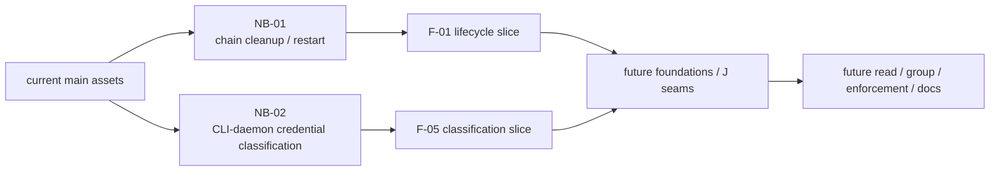

# RFC #545 R12：下一批滚动重拆草案

## A. 摘要

本轮从并列 frontier F-01/F-02/F-03/F-05 中选择两个已有真实 runtime 反例、稳定合同唯一、可由 `main + 本 issue diff` 独立验收的能力：

- **NB-01：chain 终结时 context 清理与 restart 终态**
- **NB-02：CLI/daemon credential classification 一致性**

NB-01 只处理已证实的 soft-delete/status 与 context cleanup 跨事务 residue。NB-02 只处理已证实的 CLI credential attribution 清单与 daemon auth classification 漂移。两者互不依赖，不需要 CAP-IN-1～4，也不需要未来 read、group、tool DSL、prompt 或 GUI 来解释完成。

本轮不创建或修改 GitHub issue，不给实现方案，不估算 PR 大小，不创建 worktree，也不一次拆完后续能力树。

## B. 选择理由

R11 将 F-01/F-02/F-03/F-05 都列为本 RFC 内尚须修补、但不受外部 CAP 阻断的**并列 frontier**。本报告不宣称 F-01 比 F-02/F-03/F-05 更前置，也不从本轮选择建立它们之间的施工顺序。

本轮选择的两个问题满足相同门槛：

1. R7 已在真实 runtime 路径得到确定反例；
2. R9 已给出唯一稳定合同，无需产品裁决或实现猜测；
3. 验收可直接观察持久终态或真实 CLI→daemon 组合行为；
4. issue 可只依赖当前 `main` 与自身 diff，不要求另一草案或未来 consumer 补充语义。

NB-01 的反例是 chain 已进入删除终态但 context residue 可跨 restart 保留；合同是 entries 与 chain 同生共死。NB-02 的反例是 agent 环境中的真实 CLI 丢弃 credential，使 daemon 把请求识别为 operator；合同是 credential-sensitive command 的 caller identity 不能因两份清单漂移而降级为 operator。

F-02 也有真实 wire/audit 反例，但它同时包含判定审计、transport boundary 与异常结果等多个独立保证，本轮不在没有进一步收敛 issue 边界时为凑批次拆入。F-03 的生产 malformed 存量仍未知，也不草率转写为本轮交付保证。

## C. 逐 Issue 草案

### NB-01：使 chain 终结与 context 清理在故障/restart 后收敛

#### Problem / Why

当前 `main` 的 chain soft-delete/status 更新与 context cleanup 分属不同事务。成功直线路径可以清理 entries，但进程在两步之间失败时会留下“chain 已结束、context residue 仍存在”的 durable 状态，restart 也不会自动收敛。这样，entries 与 chain 同生共死的稳定条款只在无故障直线路径成立。

该偏离不能由未来 read 隐藏 residue、由文档声明生命周期，或由综合验收代替修复；chain lifecycle owner 必须直接产生唯一 durable 终态。

#### 稳定条款

- context entry 与 chain 同生共死，无独立 GC；
- chain 到达既定删除/清除终态后，该 chain 的全部 context entries 必须消失，其他 chain 不受影响；
- 故障与 restart 后收敛到与无故障路径相同的 durable 终态；
- 保留当前 chain soft-delete 产品合同，不新增 hard-delete 语义；
- 重复执行或重开后的幂等终态不等于新增 caller exactly-once 保证。

#### 精确 scope

- 收口 chain 终结状态变更与该 chain context cleanup 的 durable 边界；
- 覆盖正常终结、现存两步窗口中的故障以及 daemon/process restart；
- 证明目标 chain entries 全清，其他 chain 数据无损；
- 保持 active chain entries 不被 lifecycle cleanup 误删；
- 证明重复终结与数据库重开后的终态稳定。

#### 明确不做

- 不改变 active-chain append admission，也不把 daemon 内部 cleanup primitive当成产品旁路；
- 不定义 item 删除与历史 context entry 的新生命周期语义；
- 不修改 append audit/transport/session/result，不新增 exactly-once、operation identity、result query或通用 reconciliation；
- 不实现 read/filter/pagination、group identity/membership、required/expected 或统一 run finalize；
- 不修 malformed persisted rows，不改变 `shared.md`、transition 或 evidence。

#### `main` 实然前提

- 已有 chain soft-delete/status lifecycle、SQLite context entries 与成功路径 cleanup；
- 当前 status 更新与 context cleanup 分事务，故障窗口可留下 residue；
- restart 当前不会自动消除该 residue；
- 现存 daemon 内部 cleanup primitive 是实现底料，不是 agent/operator 产品命令。

#### 交付保证

只要 chain 到达既定删除/清除终态，该 chain 的 context entries 在正常执行、故障中断及 restart 后都收敛为零；其他 chain 保持不变，active chain 不被误清。重复终结或重开不改变该终态。

#### 接缝 producer / consumer

- **Producer：** NB-01 生产 F-01 的 chain-lifetime cleanup、他 chain 隔离与 restart 无 residue 保证。
- **Consumers：** 后续 J-01 查询集合、J-03 durable existence、group terminal/restart消费和 F-03 reopen proof。
- **边界：** consumer 不得通过过滤 residue伪造 cleanup，也不得建立第二套 context GC；本 issue 不生产 active-chain admission、F-02 audit或F-03 exactness。

#### 依赖

- 仅依赖当前 `main` 的 chain soft-delete/status、SQLite context storage 与 daemon restart底料；
- 不依赖 NB-02；
- 不依赖 CAP-IN-1、CAP-IN-2、CAP-IN-3、CAP-IN-4。

#### 本 issue 的验证边界

本 issue 负责证明 chain 终结、context cleanup、故障注入、restart 与他 chain 隔离的 durable 最终状态；不证明 active-chain authority、item lifecycle、append audit/transport、read、group 或 finalize。

最小直接场景必须观察：

1. 两个 chain 均有 entries 时只终结目标 chain，目标 entries 清零而另一 chain 逐字保持；
2. 在原 status/cleanup 窗口的每个可观察故障点中断后重启，目标 chain 不留 context residue；
3. 同一终结动作重复执行并多次重开数据库，终态幂等；
4. active chain entries 不被终结清理路径误删；
5. chain/item/run 等非 context 数据继续符合现有 soft-delete 合同。

命令级结论：

```sh
bun run typecheck
bun test
bun run test:integration -- --log-file /tmp/rfc-545-nb-01-integration.log --foreground
```

integration 必须直接执行正常终结、故障窗口、restart、幂等与他 chain 隔离场景。成功直线、unit、migration fixture或旧线性preset不能替代。本 issue 不运行 `bun scripts/engine-integration.ts`，因为既有 stub-runner fixture不直接制造并观察 chain-status/context-cleanup 故障窗口。

本 issue 不运行 `bun scripts/real-e2e.ts`；该 compatibility 验证只由 #685 在冻结发布候选 SHA 上执行

### NB-02：消除 CLI credential attribution 与 daemon auth classification 漂移

#### Problem / Why

当前 daemon 以闭合 command union 和 auth specification 分类命令，但 CLI 另行维护 agent credential attribution 清单，两者没有类型或 runtime 完整性关系，并且已经漂移。R7 的真实 CLI→daemon 实验中，agent 环境执行 `chain set-runner-model` 时 CLI 丢弃 fabricated credential；daemon 因 wire field缺失把 caller识别为 operator，请求成功修改 chain metadata，并记录 `subject=operator`。

这证明真实产品组合路径会把本应携带 agent identity 的调用降级成 operator。只测 daemon 手工附 credential或只测 CLI happy path都会漏掉该问题。

#### 稳定条款

- daemon credential resolution 是 agent identity 的权威；caller selector与CLI纪律不是授权；
- credential-sensitive command 的 daemon classification 与 CLI credential attribution必须来自同一闭合、穷尽的 typed 合同，不能由两份可漂移清单决定；
- agent 环境中的 credential不得被 CLI 静默丢弃并使请求降级为 operator；
- operator与agent保持独立 typed variant；本 issue不新增OS用户、socket peer credential或第三主体；
- 当前公开 inspection/read-no-auth 命令的既有产品语义不在本 issue改写；未来 context read仍须建立独立chain-bound read class。

#### 精确 scope

- 消除 CLI agent-attributed commands 与 daemon authorization specifications 之间的双源漂移；
- 使每个 credential-sensitive command 的真实 CLI请求携带并触发daemon既定credential resolution；
- 对新增/变更 command 建立穷尽守卫，使遗漏不能静默退化为operator；
- 以现存 `chain set-runner-model` 漂移路径和至少一个既有正确注入命令做正反组合验证；
- 保持daemon对unknown、inactive与不匹配credential的既有明确拒绝。

#### 明确不做

- 不实现context read，也不把 `read-no-auth` 改造成未来 J-02；
- 不改变公开inspection命令当前允许caller-selected chain的合同；
- 不把“operator = wire上无agent credential”扩张为OS级安全模型重设计；
- 不修改context append admission、entry lifecycle、audit/transport或persisted schema；
- 不实现tool registry、required/expected、group、prompt或GUI；
- 不以新增命令字符串清单或第二套compatibility shim替代闭合typed合同。

#### `main` 实然前提

- daemon已有闭合 `DaemonCommandName`、命令tuple与逐command auth spec，credential resolution对unknown/inactive等已有精确拒绝；
- CLI另有独立agent attribution清单，当前没有与daemon auth需求的等价/穷尽守卫；
- `chain.updateBindings` 在daemon为agent hard-deny，但对应真实CLI路径未附加agent env credential；
- R7已实测 fabricated agent credential通过真实CLI被丢弃，请求按operator成功。

#### 交付保证

所有当前 credential-sensitive daemon commands 通过真实CLI调用时，agent环境中的credential都会进入daemon既定resolution/classification；unknown、inactive或被拒的agent调用不能因CLI遗漏字段而降级为operator。新增命令若未给出穷尽classification/attribution处置，将在编译或确定性守卫中失败，而非静默上线。

该保证只闭合通用CLI/daemon identity wiring，不宣称未来context read confinement、J-02或完整F-05已经完成。

#### 接缝 producer / consumer

- **Producer：** NB-02 生产 F-05 的CLI/daemon credential classification一致性与无permissive omission保证。
- **Consumers：** 后续J-02 agent read auth、J-06/J-07真实command contract及所有需要credential-derived caller的命令。
- **边界：** daemon handler仍拥有具体授权决策；CLI只负责不丢身份。未来read必须另行证明chain confinement，不能用本issue替代。

#### 依赖

- 仅依赖当前 `main` 的daemon command/auth ADT、credential registry和真实CLI注入路径；
- 不依赖NB-01；
- 不依赖CAP-IN-1、CAP-IN-2、CAP-IN-3、CAP-IN-4。

#### 本 issue 的验证边界

本 issue负责证明真实CLI与daemon组合不会因credential attribution遗漏而把agent请求降级为operator，并证明新增command的分类/attribution穷尽守卫；不证明未来context read、raw-socket无credential operator模型或每个handler的业务授权正确性。

最小直接场景必须观察：

1. 在`CODER_LOOP_RUN_CRED`为fabricated/unknown值时，经真实CLI执行现有漂移命令，daemon明确走credential resolution并拒绝，chain metadata不变；
2. live agent credential经真实CLI执行agent禁止命令，按daemon既定class拒绝且不记录为operator；
3. 至少一个agent允许的credential-sensitive命令经真实CLI成功，daemon观察到正确agent identity；
4. inactive credential经真实CLI拒绝，不能退化为operator；
5. 对命令union加入未处置variant的负向编译/守卫fixture确定失败，证明两面不会再次静默漂移；
6. 无agent credential的真实operator路径保持现有行为。

命令级结论：

```sh
bun run typecheck
bun test
bun run test:integration -- --log-file /tmp/rfc-545-nb-02-integration.log --foreground
```

integration 必须通过真实CLI子进程与真实daemon覆盖unknown/live/inactive agent credential、operator路径、metadata终态与caller classification；daemon-only手工附credential、CLI-only mock、typecheck或旧线性preset均不能替代。本 issue 不运行 `bun scripts/engine-integration.ts`，因为既有stub-runner fixture不直接覆盖跨命令credential attribution穷尽与已证漂移路径。

本 issue 不运行 `bun scripts/real-e2e.ts`；该 compatibility 验证只由 #685 在冻结发布候选 SHA 上执行

## D. 本轮不拆

| 能力 | 原因 |
|---|---|
| F-01其余authority/admission条款 | 当前生产append caller已在daemon socket路径；internal store API与tests/fixture直调不等于产品旁路。D11只保证写入时key有效，D6只允许chain lifecycle清理。本轮不从internal shape生成封闭store或item-delete生命周期需求。 |
| F-02 append/audit/transport与J-06 | 有真实runtime反例且无CAP阻断，但判定审计、wire-size/escaping、socket异常结果是多个保证；需下一轮在稳定条款内继续收敛最小独立边界，不能为凑批次合并。 |
| F-03 persisted exactness | 无CAP阻断，但生产malformed存量仍未知；不据未知新增清洗、逐行容错或“生产已清洁”保证。 |
| F-05未来read confinement / J-02 | NB-02只修真实CLI/daemon classification漂移；公开context read尚不存在，chain-bound read request/result和raw-socket对抗应由未来read能力直接证明。 |
| J-01/J-07与N-R01～N-R17 | 依赖修补后的F-01/F-02/F-03/F-05；cursor、concurrent append集合与response boundary仍由read能力拥有。 |
| J-05与N-G01～N-G11 | 被CAP-IN-2权威identity/membership与CAP-IN-3真实producer阻断；禁止用ancestry、fixture或伪credential补偿。 |
| J-03/J-04/J-08/J-10与N-E01～N-E10 | tool declaration依赖CAP-IN-1，统一finalize依赖CAP-IN-4；本轮不孤立拆outcome evaluator。 |
| J-09与N-D01～N-D09 | 真实append/read command contract、CAP-IN-1 slicing与group scope availability尚未齐；未实现命令不得预写。 |
| F-10冻结SHA综合复核 | 是叶向验收，不拥有产品修复；等待相关能力合流。 |

## E. 覆盖与 DAG

### E.1 本批覆盖

| 草案 | F覆盖 | J影响 | N影响 |
|---|---|---|---|
| NB-01 | F-01仅chain-lifetime cleanup、他chain隔离、fault/restart终态 | 为未来J-01集合、J-03 durable existence提供生命周期输入；不完成任何J | 推进N-R04/N-R13、N-G07/N-G08/N-G09、N-E03/N-E04、N-D02的上游前提；均保持未来 |
| NB-02 | F-05仅CLI/daemon credential classification一致性与无遗漏降级 | 为未来J-02、J-06/J-07提供identity wiring输入；不完成J-02或完整F-05 | 推进N-R03/N-R14/N-R17、N-G03/N-G07、N-E02/N-E10、N-D05的上游前提；均保持未来 |

F-01其余条款、F-02、F-03、F-05 read confinement、F-04以及J-01～J-10与全部N-R/N-G/N-E/N-D均未被本批宣称完成。

### E.2 能力位置



该图只表达本批供需。NB-01与NB-02之间无边；它不表示F-01/F-02/F-03/F-05存在先后关系。

## F. 风险守卫

- 不把internal store API、tests或fixture直调称为产品可达旁路；daemon内部持久化primitive可以存在。
- 不从D11写入时key有效扩张出item整个生命周期引用完整性，不新增item-delete/append并发合同。
- 不把NB-02扩张成OS/socket安全模型，也不改变现有public inspection语义；future context read仍需独立J-02。
- 不把本轮选择解释为frontier排序；F-01/F-02/F-03/F-05保持并列。
- 不新增exactly-once、operation identity、durable session、通用reconciliation、malformed逐行容错或任意transport cap。
- NB-01必须跑故障/restart；NB-02必须跑真实CLI→daemon组合。unit、静态grep、daemon-only或旧preset不能支持宽主张。
- 任一草案若实现时发现必须等待另一草案、future read/group/tool能力，退回R11重新抽接缝，不把未来issue写进当前验收。
- 生产malformed存量、response真实极限、read concurrent append集合与未登记外部consumer继续保持未知。
