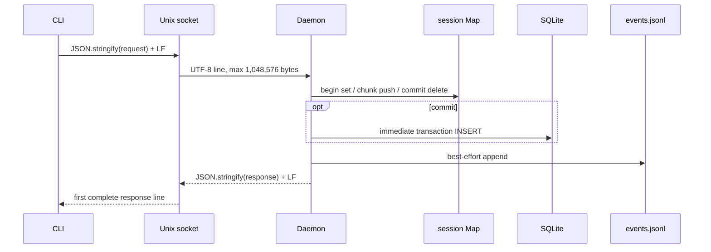

# RFC #545 R7 D-02 — append session / commit / audit / response / transport 事实报告

基线：`main@699842eba2eefc242d19f8fa9232bc1d9d5c3bdd`（2026-07-31 核验）。范围仅为 context append 的 begin/chunk/commit、socket wire、CLI、session/credential、SQLite entry 与 admission audit；不裁决方案、RFC 条款或 issue 切分。

## A. 摘要

### A1. 观察

1. **wire 是一请求一行、一响应一行的 UTF-8 JSON over Unix socket。** 每个 CLI 阶段新建连接，写 `JSON.stringify(request) + "\n"`；daemon 以换行拆帧，单连接内顺序执行；client 只接受首个完整换行响应。请求行硬上限为 **1,048,576 UTF-8 bytes**，response 没有对应显式 cap。socket 在完整响应前 close 会给 caller `incomplete_response`，但该错误不携带服务器是否已执行的信息。
2. **CLI 的固定 256 Ki code-unit 分块不是 wire-safe 上限。** 普通多 MB UTF-8 会分块 round-trip；但每个 chunk 经 JSON escaping 后才受 1 MiB 限制。隔离实验中 262,144 个 NUL 的 chunk 形成 1,573,027-byte request；daemon 在累计 buffer 达 1,056,768 bytes 时返回 `request_too_large`（`id:"unknown"`）并关连接，session 留存、entry 为零。astral 字符不是必然反例；确定反例是控制字符 escaping 膨胀（L037）。
3. **session 全在 daemon `Map`，无持久化、TTL、abort 或 socket-owner 关联。** begin allow 后断连、chunk allow 后断连均无限留到 commit、chain delete、同一 session 在后续请求发现 chain missing/deleted、或 daemon 进程结束。正常 stop/restart 清空 Map；旧 session 的 commit 确定返回 `invalid_request / unknown context append session`。agent credential 也是内存 registry：run spawn mint、close revoke；inactive run 首次使用会 evict；restart 后旧 credential 为 unknown。session 本身不随 credential revoke删除，但后续 agent请求先因 credential 失败，无法 commit。
4. **commit 的实际次序是 `session.delete → SQLite INSERT immediate transaction → best-effort audit append → response write`。** SQLite INSERT 与 JSONL audit 不在同一事务；audit API吞掉写失败并写 stderr。因此：
   - INSERT 失败时 session 已丢、无 entry、无 commit allow audit，caller 得 error；
   - audit 失败时 entry 已提交，caller仍成功，正式 audit 缺失；
   - commit 后响应断开时 entry与allow audit可都存在，而 caller没有结果；
   - daemon在 SQLite commit 后、响应前退出也产生 caller不确定性；
   - caller不能由自身结果唯一判定“未发生或恰好一次”，也没有按 session/request 的查询或幂等恢复面。
5. **重复 commit 只在 daemon仍持有同一 session 时被内存 delete 阻止。** 两连接并发提交实验得到一个 success、一个 `unknown-session`，仅一条 body entry；但第一次已提交而 response 丢失后，CLI全流程重试会 begin 新 session、生成新 UUID entry，因此可重复。entry schema没有 idempotency key / session id。
6. **S09 的“每次接受/拒绝均有 audit”不是故障下成立的不变量。** 正常可分类路径确实逐 begin/chunk/commit 写 allow/deny；但 oversized frame 在 request parser/command前被拒，只有 transport error response、没有 `context.write_admission`；audit落盘失败被吞；进程可在 mutation与audit之间退出。实验强制 `events.jsonl` 变目录后，commit response success、entry=1、session已删，commit audit只出现在 stderr render、查询文件中缺失。
7. **特殊 argv/body 本身不是确定损坏点。** 实际 CLI 子进程以单个 argv value 传入含前导 `--`、换行、引号、反斜线、控制字符与 emoji 的 `--body`，exit 0 且 SQLite逐字相等。shell 调用者仍须负责 shell quoting；`--body-file` 以 UTF-8整文件读取。空 body 会 begin 后直接 commit（零 chunk），是有效空 entry。

### A2. 机制、根因与放大

- begin/chunk 先改变 Map 再 `await` best-effort audit；audit失败不会回滚 Map。commit 先不可逆删除 Map，再独立提交 SQLite，再 best-effort audit，再写 socket。四种介质（client socket、session Map、SQLite、JSONL）没有共同事务或 durable operation identity。
- client 每阶段使用独立连接，因此 disconnect cleanup无法按现状从连接推出“整次 append 已放弃”；CLI在中途失败也没有 finally/abort。
- `sendDaemonRequest` 正确识别 partial response，却只能证明“没收到完整响应”，不能证明 mutation 未发生。CLI把 transport/daemon error压成 stderr + nonzero exit，不暴露 sessionId，也不做状态核对。
- 多 MB / 高频失败会把 body chunks长期留在 daemon heap；没有 TTL/配额/观测面，攻击或重复 CLI失败可无限放大。此处仅报告事实，不从风险自动推出机制。

### A3. 消费者与已知盲区

- 生产 caller 只有 `coder-loop context append`；另有 direct socket API `sendDaemonRequest`。公开 store `appendContextEntry` 是 daemon 之外的可调用旁路。当前生产代码没有 context read consumer；`listContextEntries` 只被迁移/fixture/测试使用。
- audit consumer 是统一 JSONL 的 `logs.query` / renderer；audit失败时 stderr可见但不可由 logs 查询恢复。
- integration 覆盖多 MB普通 UTF-8、正常 allow/deny、agent attribution、soft delete、partial response client reject；未覆盖 JSON escaping 超限后session残留、audit落盘失败、commit后断响应的 entry终态、restart旧session、并发duplicate commit、CLI特殊argv。现有 partial-response test仅用假 peer，没执行 mutation，不能证明 commit恢复语义。
- 修补边界只陈述因果边：若后续要守住“caller可唯一判定”或“每次判定都有durable audit”，必须作用于 operation identity、提交/审计持久边界与结果查询/重放边界；仅改 client close 错误、增大 chunk/cap、或多打一条日志不能消除上述根因。

## B. 附录

### B1. 完整状态机（实然）

| 状态 | 输入 / 检查 | Map | SQLite entry | audit | caller |
|---|---|---:|---:|---|---|
| 无 session | begin request framing/parser/auth/chain/scope deny | 无 | 无 | 通常 deny；oversize/JSON parse前错误无 context audit | typed daemon error或transport error |
| 无 session | begin allow | 新 session `{chainId,scope,author,chunks:[],nextSequence:0}` | 无 | best-effort begin allow | `{sessionId}`；断响应则 caller未知且session留存 |
| session(n) | chunk invalid/mismatch/owner/credential deny | 不变（chain missing/deleted例外：删除） | 无 | best-effort deny | daemon error |
| session(n) | chunk allow sequence=n | push chunk，`nextSequence=n+1` | 无 | best-effort chunk allow | `{sessionId,nextSequence}`；断响应后caller不知道该sequence已占用 |
| session(n) | oversized chunk frame | 不变 | 无 | **无 context audit** | `request_too_large`, id unknown, connection end |
| session(n) | disconnect / credential revoke | 不变 | 无 | 无 | 无恢复信息 |
| session(n) | daemon stop/crash/restart | 丢失 | 无 | restart后retry产生unknown-session deny | commit确定失败，但原chunk内容不可恢复 |
| session(n) | chain soft delete | chain delete主动清除同chain sessions | 同chain entries被删 | chain delete自身审计；旧session retry unknown | commit失败 |
| session(n) | commit admission deny | 通常不变；chain missing/deleted删除 | 无 | best-effort deny | typed daemon error |
| session(n) | commit通过，delete后INSERT前失败/退出 | 已删 | 无 | 无commit allow | error/close；无法用旧session retry |
| INSERT提交后audit前失败/退出 | 已删 | 1 | 0 | 无完整response；caller不确定 |
| audit best-effort失败 | 已删 | 1 | durable audit 0，stderr render 1 | success response仍可返回 |
| audit成功、response前断连/退出 | 已删 | 1 | allow 1 | `incomplete_response` / connection failure |
| response成功 | 已删 | 1 | 通常allow 1（audit I/O失败例外） | `{entryId,createdAt}` |
| 已提交session retry commit | 无 | 已有1 | unknown-session deny | failure；不能返回旧结果 |

begin/chunk也具有“Map mutation成功但audit/response缺失”的同构窗口。它们没有SQLite副作用，但会造成sequence与caller认知分叉。

### B2. request / response、序列化与错误传播

- daemon accumulates decoded string until LF; excess before LF returns `request_too_large` with the currently observed `actualBytes`, clears buffer, ignores later data on that socket, then ends after response callback (`src/daemon.ts:1660-1692,4946-4975`).
- complete line is size-checked again, parsed as `{id:string,command:string,args?:object}`; error becomes `{id,ok:false,error:{code,message,details}}`. Parse前无法取得id时为 `"unknown"` (`src/daemon.ts:1706-1722,4978-4990`)。
- response无byte cap；client无timeout，若peer保持连接却永不发LF会永久等待。close前无完整LF才是 `incomplete_response` (`src/daemon.ts:4652-4688`)。
- CLI每一阶段调用新的 `sendDaemonRequest`，自动给三命令注入 `CODER_LOOP_RUN_CRED`；daemon error被压为 `fail("<code>: <message>")` (`src/loop.ts:2487-2505,2526-2557`)。
- CLI按 JS string length（UTF-16 code units）每262,144切片，不按UTF-8或JSON wire bytes；文件一次性读入内存，daemon将所有chunks驻留后 `join("")` 再交SQLite (`src/loop.ts:1971-1986`; `src/daemon.ts:1902-1916`)。

### B3. admission、session 与 credential

- 三命令均被编译期 `Record<DaemonCommandName,DaemonCommandSpec>` 分类为 `mutation-credential-gated`；实际 bespoke gate由handler执行 (`src/daemon.ts:1725-1766`)。
- 无 `agentCredential` 字段即operator；字段存在但非非空string为missing；registry miss为unknown；registered run非active为inactive并evict。agent session owner匹配只比较runId+phase，chain在session内固定 (`src/daemon.ts:3949-3990,1789-1827`)。
- begin先生成UUID并写Map，再await audit。chunk先push/increment，再await audit。commit先delete，再SQLite/audit/response (`src/daemon.ts:1874-1917`)。
- credential在scheduler spawn前mint，置入child env；run close revoke。registry与session registry均为daemon实例字段，startup无恢复加载 (`src/scheduler.ts:1683-1695`; `src/daemon.ts:1195-1196,4381-4395`)。
- chain delete是唯一主动按chain批量清session路径；socket close/error只从socket set移除连接，不触碰session (`src/daemon.ts:1687-1692,2528-2551`)。

### B4. SQLite / audit 事务与崩溃窗口

- `appendContextEntry`自身是 `db.transaction(fn).immediate()` 包住单条INSERT，UUID在调用内生成；SQLite成功即返回entry (`src/sqlite-state.ts:1605-1611,2045-2054`)。
- audit是独立JSONL append。`recordObservabilityEvent`调用的 `appendObservabilityEvent`捕获所有I/O错误，仅写stderr，再继续renderer；context path没有使用`OrThrow` (`src/daemon.ts:1777-1785,2285-2294`; `src/observability.ts:923-935`)。
- 因此 SQLite journal/WAL只保障INSERT自身原子性，不覆盖Map、audit、response。精确“进程kill在同步INSERT内部”的before/after取决于SQLite事务提交点；本轮未修改产品注入hook，不能把微小窗口稳定命中。可复核方法是在独立子进程加外部fault-injection hook分别停在1913/1914/1915/1697边界后kill，再以SQLite、events、session（仅活进程可见）和client结果五态核对；现有静态顺序已经确定这些窗口的允许终态。

### B5. 隔离实验

脚本与原始输出：`/tmp/rfc545-d02/experiment.ts`、`/tmp/rfc545-d02/output.jsonl`、`/tmp/rfc545-d02/stderr.log`；runtime：`/tmp/rfc545-d02/runtime/`。实验只写隔离目录。

| 实验 | entry | audit | session | credential | caller |
|---|---:|---:|---|---:|---|
| begin+chunk后断连 | 0 | begin/chunk allow各1 | 留存 | operator registry 0 | 请求各success；之后无自动动作 |
| daemon restart后旧session commit | 0 | unknown-session deny 1 | 丢失 | 0 | `invalid_request` |
| 256Ki NUL chunk | 0 | 该chunk 0 | 留存 | 0 | `request_too_large`, `id=unknown` |
| 两连接并发同session commit | 1 | allow 1 + unknown-session deny 1 | 删除 | 0 | 一success一failure |
| 发送commit后立即destroy caller socket | 1 | commit allow 1 | 删除 | 0 | caller未取得response |
| events path强制EISDIR后commit | 1 | durable commit allow 0；stderr 1 | 删除 | 0 | success含entryId |
| CLI特殊单argv body | 1且逐字相同 | begin/chunk/commit allow | 删除 | 0 | exit 0、JSON success |

最终隔离态含4个已提交entries、1个oversize遗留session、0 credentials；这直接证明entry/audit/session/credential/caller可分离。

### B6. consumers、测试同错与资产

| 类别 | 实然 consumer / asset | 同错或盲区 |
|---|---|---|
| CLI | `context append` 唯一生产入口；body/body-file XOR、scope ADT、typed result parser | 无abort、无session输出/恢复、固定code-unit chunk、阶段失败即退出 |
| direct socket | exported `sendDaemonRequest`、测试/harness | partial response分类正确，但无timeout、无operation-status |
| daemon | exhaustive command enumeration/auth classification、typed request/result/admission ADT | transport-level oversize不进入command audit；Map无持久生命周期 |
| store | precise persisted row parser、SQLite transaction、FK chain | public `appendContextEntry`可绕daemon/audit；entry无session/idempotency字段 |
| audit/logs | typed `context.write_admission`、统一query/render | best-effort落盘不构成事务；stderr不能补query历史 |
| tests | daemon context integration；CLI真实daemon多MB UTF-8；unit persistence/malformed；migration preservation | 没有本文六类failure实验；fake partial peer不能证明mutation终态 |
| downstream | scheduler integration只把store entry当fixture并读回；historical migration脚本读回 | 当前无生产read/GUI consumer，不能据此声称append结果可被caller查询 |

### B7. 历史

全部 begin/chunk/commit、Map、CLI分块与相关测试由 `d381d06 feat: 落地 context entry 写入基座 (#677)` 一次引入；当前关键行的 blame仍全指向该commit。后续提交重组测试目录但未改变此协议。历史说明这些窗口来自原始基座的一致结构，不是近期局部回归；不据此裁决目标需求。

### B8. 证据索引

- 设计锚点：`aggregate.md:23-25,58,62,65`；`r5-supply-ledger.md:29,33,35,59,61,69,74,77`；`r6-detail-index.md:40,65-68,226,245,249,251,275,277`。
- wire/server/client：`src/daemon.ts:410,1660-1722,4652-4688,4946-4990`。
- state machine/audit：`src/daemon.ts:1763-1917,2285-2294,2528-2551,3949-3990,4381-4395`。
- types：`src/context-entry.ts:4-66`。
- CLI：`src/loop.ts:1943-1986,2487-2557`。
- persistence：`src/sqlite-state.ts:1605-1611,2045-2060`；audit I/O：`src/observability.ts:923-950`。
- tests：`tests/integration/daemon/context.integration.ts:4-176`；`tests/integration/cli/central-cli.integration.ts:1347-1418`；`tests/unit/runtime/context-entry.test.ts:40-106`。
- 全consumer枚举：仓库根执行 `rg -n "appendContextEntry|listContextEntries|context append|context\\.append|ContextEntry" --glob '!v3-issue/**' .`。

## 给 D-04 可直接复用的已确认 transport 事实

1. request是newline-delimited UTF-8 JSON，单行硬cap 1,048,576 bytes；response无显式cap，client等待首个LF且无timeout。
2. response完整前close只证明caller没拿到结果，不证明handler未执行；commit实验已证 entry/audit可存在。
3. JSON序列化后的byte size才是边界；256Ki UTF-16 code-unit chunk不保证低于cap，NUL反例实测成立，astral不是必然反例。
4. 每个CLI阶段独立连接；socket disconnect不清append session；transport oversize不产生context admission audit。
5. daemon response为单个JSON object整行发送，没有流式/分页/backpressure应用层协议；任何未来大response实验必须按**序列化后UTF-8 bytes、LF完整性、peer不close时的等待**核对。

---

**交付完整性：** 已核基线SHA；已建立begin/chunk/commit全状态机、所有caller/consumer、wire与真实cap、CLI argv/body/chunk、session/credential lifecycle、SQLite/audit事务关系和可达崩溃窗口；已完成audit失败、commit后断响应、restart、大控制字符body、特殊argv、并发重复commit及五态核对；未改产品、测试、配置、WORKFLOW，未建worktree，未写方案/推荐/issue。
